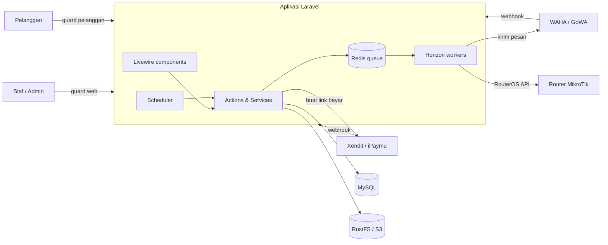
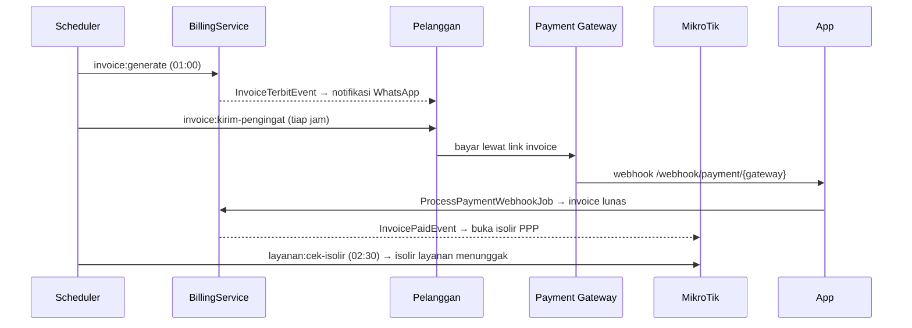

# GOBILLING (UNMS)

Aplikasi manajemen ISP untuk staf: data pelanggan dan layanan internet, penagihan bulanan, pembayaran online, provisioning MikroTik, tiket lapangan, inventaris barang, dan RAB kantor. Pelanggan punya portal sendiri untuk melihat dan membayar tagihan.

> Istilah domain (Pelanggan, Layanan, Isolir, Divisi Tiket, dll.) didefinisikan di [CONTEXT.md](CONTEXT.md). Alasan di balik keputusan desain ada di [docs/adr/](docs/adr/). Baca keduanya sebelum mengubah perilaku bisnis.

## Daftar Isi

1. [Ikhtisar](#1-ikhtisar)
2. [Arsitektur & Komponen Utama](#2-arsitektur--komponen-utama)
3. [Alur Kerja & Alur Data Utama](#3-alur-kerja--alur-data-utama)
4. [Setup & Penggunaan](#4-setup--penggunaan)
5. [API, Webhook & Fungsi Utama](#5-api-webhook--fungsi-utama)
6. [Dokumentasi Lanjutan](#6-dokumentasi-lanjutan)

---

## 1. Ikhtisar

| Area | Yang dilakukan sistem |
| --- | --- |
| **Pelanggan & Layanan** | Registrasi pelanggan (nomor registrasi berprefix), dokumen KTP terenkripsi, satu pelanggan bisa punya banyak layanan, paket layanan, profil bandwidth. |
| **Keuangan & Billing** | Invoice otomatis per siklus tagihan, pembayaran manual atau lewat payment gateway (Xendit, iPaymu), promo, pengingat WhatsApp, laporan keuangan, RAB kantor. |
| **Jaringan** | Router MikroTik, IP Pool, IP Publik, PPP Secret dibuat, diisolir, dan dipulihkan otomatis lewat RouterOS API. |
| **Area & Maps** | Hierarki Kota → Kecamatan → Kelurahan → Perumahan, ODP beserta port, peta lokasi dan estimasi panjang kabel. |
| **Tiket** | Pemasangan, Gangguan, Pencabutan, Pindah Alamat, dengan sign-off per divisi (Teknisi, NOC, CS, Admin). |
| **Inventaris** | Barang masuk/keluar, unit berkode dan label barcode, impor dari spreadsheet gudang. |
| **Portal Pelanggan** | Login pelanggan, daftar invoice, bayar online, profil. Bisa di domain terpisah (`PORTAL_DOMAIN`). |

**Pengguna:** staf internal dengan peran `super_admin`, `admin`, `sales`, `noc`, `teknisi`, `customer_service` (Spatie Permission), dan pelanggan (guard `pelanggan`).

## 2. Arsitektur & Komponen Utama

### Tech stack

| Lapisan | Teknologi |
| --- | --- |
| Backend | PHP 8.5, Laravel 13, Fortify (auth + 2FA + passkey) |
| UI | Livewire 4, Flux UI 2, Tailwind CSS 4, Alpine.js, ApexCharts, Leaflet |
| Data | MySQL 8.4, Redis (cache, session, queue) |
| Antrean | Laravel Horizon |
| Berkas | S3-compatible (RustFS) lewat Spatie MediaLibrary |
| Integrasi | MikroTik RouterOS API, Xendit, iPaymu, WhatsApp (WAHA / GoWA) |
| Ekspor | DomPDF (invoice, label, RAB), Maatwebsite Excel |
| Monitoring | Sentry, Activitylog (audit trail) |
| Tes | Pest 5, Larastan, Pint |

### Gambaran sistem



### Struktur kode

| Folder | Isi |
| --- | --- |
| `app/Livewire/` | Halaman staf dan portal, satu folder per modul (`Pelanggan`, `Invoice`, `Ticket`, `Barang`, `Rab`, `Portal`, ...). View di `resources/views/livewire/`. |
| `app/Actions/` | Operasi bisnis satu tujuan, mis. `LayananPelanggan/DaftarkanLayananAction`, `Ticket/UbahStatusTicketAction`, `Barang/CatatBarangMasukAction`. |
| `app/Services/` | Logika domain dan integrasi: `Billing`, `Mikrotik`, `PaymentGateway`, `Whatsapp`, `Xendit`, `Geospatial`, `Storage`. |
| `app/Jobs/` | Job antrean: `Mikrotik/*`, `PaymentGateway/ProcessPaymentWebhookJob`, `Wa/KirimWaBlastJob`, `Whatsapp/ProcessWhatsappWebhookJob`. |
| `app/Events`, `app/Listeners` | `InvoiceTerbitEvent`, `InvoicePaidEvent`, `LayananPelangganStatusChangedEvent` dan listener-nya (didaftarkan di `AppServiceProvider`). |
| `app/Console/Commands/` | Perintah terjadwal dan operasional (lihat [bagian 5](#perintah-artisan)). |
| `app/Models`, `app/Enums` | Model Eloquent dan enum status (`StatusLayanan`, `StatusInvoice`, `StatusPelanggan`, ...). |
| `config/menu.php` | Sumber tunggal navigasi sidebar, termasuk izin per menu. |
| `routes/web.php` | Semua rute staf, portal, API peta, dan webhook. `routes/console.php` berisi jadwal. |
| `.ai/rules/` | Aturan dan jebakan yang sudah disepakati per area kode. Mulai dari `index.md`. |

### Antrean (Horizon)

| Supervisor | Queue | Isi |
| --- | --- | --- |
| `supervisor-high` | `mikrotik-high` | Provisioning/isolir PPP yang dipicu aksi pengguna |
| `supervisor-payments` | `payments` | Pemrosesan webhook pembayaran |
| `supervisor-low` | `mikrotik-low`, `default`, `wa-blast` | Rekonsiliasi router, notifikasi, WhatsApp blast |

## 3. Alur Kerja & Alur Data Utama

### 3.1 Pelanggan baru sampai aktif

1. **Sales/Admin** membuat Pelanggan, lalu Data Registrasi Billing (layanan) dengan status `proses`. Invoice pertama langsung terbit.
2. Admin membuat **Ticket Pemasangan** untuk layanan itu. Ticket berjalan lewat sign-off 4 divisi: Teknisi, NOC, CS, Admin.
3. **Teknisi** memilih ODP + port dan mengunggah foto pemasangan.
4. **NOC** melakukan Aktivasi Pemasangan: memilih router dan IP Pool. Sistem membuat PPP Secret di MikroTik (job `ProvisionPppoeAccountJob`) dan layanan menjadi `aktif`.
5. **Admin** hanya bisa menyelesaikan bagiannya setelah invoice pertama `lunas`. Setelah keempat divisi selesai, ticket otomatis `Selesai`.

### 3.2 Siklus tagihan & isolir



- Status layanan: `proses` → `aktif` ⇄ `suspend` (isolir) → `berhenti`.
- Status invoice: `menunggu_pembayaran` → `lunas` / `kadaluarsa` / `dibatalkan` / `digabung`.
- Invoice pertama punya tenggat terpisah (dicek tiap jam oleh `layanan:cek-tunggakan-pertama`), lihat ADR-0045.
- Jaring pengaman pembayaran: `pembayaran:rekonsiliasi` tiap 15 menit memproses ulang webhook yang macet dan menanyakan status transaksi pending ke gateway.

### 3.3 Sinkronisasi MikroTik

- Perubahan status atau paket layanan memicu `LayananPelangganStatusChangedEvent` → job di queue `mikrotik-high`.
- `mikrotik:provisi-router --async` tiap 15 menit menyamakan IP Pool, profil, dan PPP Secret di router dengan data billing.
- Audit harian 03:00 hanya **melaporkan** PPP Secret yatim, tidak menghapusnya. Penghapusan hanya lewat CLI eksplisit (ADR-0053).

### 3.4 Modul pendukung

- **Inventaris:** stok dihitung dari mutasi (masuk/keluar), bukan disimpan terpisah. Barang yang dilacak per unit punya kode unik dan label barcode (ADR-0057).
- **RAB Kantor:** rencana anggaran belanja kantor per bulan. Bulan sebelum bulan berjalan terkunci kecuali untuk pemegang izin `rab.buka_kunci`. Bisa diekspor ke Excel dan PDF.

## 4. Setup & Penggunaan

### Prasyarat

- Docker + Docker Compose
- PHP dan Composer lokal hanya untuk instalasi awal `vendor/` (atau pakai container Composer)

### Development lokal (Laravel Sail)

Semua perintah PHP, Artisan, Composer, dan Node dijalankan lewat Sail.

```bash
cp .env.example .env
composer install
vendor/bin/sail up -d          # app, mysql, redis, rustfs, mailpit

vendor/bin/sail artisan key:generate
vendor/bin/sail artisan migrate --seed
vendor/bin/sail npm install
vendor/bin/sail npm run dev    # atau: npm run build
```

Buka aplikasi dengan `vendor/bin/sail open`. Akun dev dari `DevUsersSeeder` memakai password `password`, mis. `superadmin@example.com`, `admin@example.com`, `sales@example.com`.

Worker antrean dan scheduler lokal:

```bash
vendor/bin/sail artisan horizon          # dashboard: /horizon
vendor/bin/sail artisan schedule:work
```

### Variabel environment penting

| Variabel | Fungsi |
| --- | --- |
| `DB_*`, `REDIS_*` | Koneksi MySQL dan Redis |
| `QUEUE_CONNECTION=redis` | Wajib untuk Horizon |
| `AWS_*`, `FILESYSTEM_DISK` | Penyimpanan S3/RustFS. `AWS_ENDPOINT` harus bisa dijangkau **browser** di produksi (lihat `.ai/rules/livewire-uploads.md`) |
| `PORTAL_DOMAIN` | Opsional. Domain terpisah untuk Portal Pelanggan (ADR-0049) |
| `WAHA_*` | Gateway WhatsApp |
| `MIKROTIK_STATUS_*` | Timeout dan cache cek status router |

Kredensial payment gateway (Xendit, iPaymu) disimpan di database dan diatur dari menu **Pengaturan → Gateway**, bukan di `.env` (ADR-0026).

### Instalasi produksi

Produksi berjalan sebagai satu service Docker (Caddy + PHP-FPM + Horizon + scheduler di bawah supervisord), di-deploy lewat Dokploy. Langkah lengkap: [docs/docker-deployment-guide.md](docs/docker-deployment-guide.md). Setelah deploy pertama, buat superadmin:

```bash
docker exec -it gobilling_app php artisan app:install
```

### Tes & kualitas kode

```bash
vendor/bin/sail artisan test --compact                 # semua tes
vendor/bin/sail artisan test --compact tests/Feature/Rab   # satu folder
vendor/bin/sail bin pint --dirty                       # format
vendor/bin/sail composer types:check                   # Larastan
```

## 5. API, Webhook & Fungsi Utama

### Endpoint HTTP non-Livewire

| Method | Path | Fungsi | Proteksi |
| --- | --- | --- | --- |
| `POST` | `/webhook/payment/{gateway}` | Webhook pembayaran semua gateway (`xendit`, `ipaymu`) → `ProcessPaymentWebhookJob` | `throttle:webhook`, verifikasi per driver |
| `POST` | `/webhook/xendit`, `/webhook/xendit/virtual-account`, `/webhook/xendit/qris` | Webhook khusus Xendit (invoice, VA, QRIS) | `throttle:webhook`, `xendit.token` |
| `POST` | `/webhook/whatsapp` | Status pesan dan pairing sesi WhatsApp | `throttle:webhook` |
| `GET` | `/api/maps/markers` | Marker GeoJSON pelanggan/ODP untuk peta | login staf |
| `GET` | `/invoice/{invoice}/cetak` | PDF invoice | staf `invoice.cetak` atau pelanggan pemilik |
| `GET` | `/barang/label` | PDF label barcode unit barang | `barang.lihat` |
| `GET` | `/rab/cetak?bulan=Y-m` | PDF RAB Kantor satu bulan | `rab.lihat` |

Halaman staf lainnya adalah komponen Livewire. Lihat semua rute dengan `vendor/bin/sail artisan route:list --except-vendor`.

### Service utama

| Service | Method penting |
| --- | --- |
| `Billing\BillingService` | `generateInvoice`, `generateFirstInvoice`, `generateManualInvoice`, `hitungRincianTagihanPertama`, `prosesPembayaranManual` |
| `PaymentGateway\PaymentGatewayManager` | `driver`, `buatPaymentLink`, `resolvePaymentUrl`, `sinkronkanStatus`, `prosesPelunasan`, `pingConnection` |
| `Mikrotik\MikrotikService` | `createOrUpdatePppoeSecret`, `enablePppoeSecret`, `disablePppoeSecret`, `deletePppoeSecret`, `syncIpPool`, `syncAllBandwidthProfiles`, `provisionRouterFull`, `autoRecoverPppSecrets`, `getPppStatus` |
| `Whatsapp\WhatsappService` | `antrikanPesan`, `antrikanPesanKustom`, `buildInvoiceParams`, `buildTicketParams`, `buildPaymentParams` |

Driver pembayaran (`XenditDriver`, `IpaymuDriver`) mewarisi `AbstractPaymentDriver`. Driver WhatsApp (`WahaDriver`, `GowaDriver`) mengikuti kontrak di `app/Services/Whatsapp/Contracts`.

### Perintah Artisan

**Terjadwal** (`routes/console.php`):

| Perintah | Jadwal | Fungsi |
| --- | --- | --- |
| `invoice:generate` | 01:00 | Terbitkan invoice siklus berikutnya |
| `invoice:cek-kadaluarsa` | 02:00 | Tandai invoice kedaluwarsa |
| `layanan:cek-isolir` | 02:30 | Isolir layanan yang menunggak |
| `layanan:cek-tunggakan-pertama` | tiap jam | Isolir jika invoice pertama lewat tenggat |
| `invoice:kirim-pengingat` | tiap jam | Pengingat tagihan WhatsApp sesuai aturan aktif |
| `wa:proses-antrian` | 5 menit | Kirim antrean WhatsApp blast |
| `pembayaran:rekonsiliasi` | 15 menit | Proses ulang webhook macet + polling transaksi pending |
| `xendit:cek-va-expired` | tiap jam | Tutup virtual account kedaluwarsa |
| `mikrotik:provisi-router --async` | 15 menit / 03:00 audit | Rekonsiliasi router |
| `mikrotik:ping` | 5 menit | Cek kesehatan router |
| `horizon:snapshot`, `horizon:monitor-health` | 5 menit | Metrik Horizon dan alert worker macet |

**Operasional (manual):** `app:install`, `mikrotik:provisi-layanan`, `mikrotik:recover-ppp`, `mikrotik:sync-profil`, `xendit:ping`, `xendit:simulate`, `whatsapp:ping`, `whatsapp:simulate-webhook`, `inventaris:reset`. Pakai `--help` untuk opsinya.

## 6. Dokumentasi Lanjutan

| Dokumen | Isi |
| --- | --- |
| [CONTEXT.md](CONTEXT.md) | Glosarium domain dan aturan bisnis |
| [docs/adr/](docs/adr/) | Architecture Decision Records |
| [docs/docker-deployment-guide.md](docs/docker-deployment-guide.md) | Docker, Dokploy, backup/restore |
| [docs/ERD.md](docs/ERD.md) | Relasi tabel |
| [docs/SRS.md](docs/SRS.md), [docs/prd/](docs/prd/) | Kebutuhan dan PRD |
| [docs/webhook-xendit-guide.md](docs/webhook-xendit-guide.md), [docs/webhook-whatsapp-guide.md](docs/webhook-whatsapp-guide.md) | Setup webhook |
| [.ai/rules/index.md](.ai/rules/index.md) | Aturan per area kode untuk developer dan agen AI |

> `docs/comprehensive_documentation.md` ditulis untuk versi lama (Laravel 12, MariaDB). Jika bertentangan dengan README ini atau kode, ikuti kode.
