# Entity Relationship Diagram (ERD) & Skema Basis Data
## Sistem Manajemen Jaringan & Billing ISP (GOBILLING / UNMS)

---

### Informasi Dokumen
- **Nama Proyek**: GOBILLING (ISP Network & Billing Management System)
- **Versi Dokumen**: 1.0.0
- **Database Engine**: MariaDB 10.6+ / MySQL 8.0+
- **Format Diagram**: Mermaid `erDiagram` dengan notasi kardinalitas Crow's Foot
- **Target Pembaca**: Pengembang Basis Data (*Database Engineers*), *Backend Developers*, dan Analis Sistem.

---

## 1. Diagram Relasi Entitas (Mermaid ERD)

```mermaid
erDiagram
    %% ==========================================
    %% 1. PENGGUNA & RBAC
    %% ==========================================
    users ||--o{ model_has_roles : "has"
    roles ||--o{ model_has_roles : "assigned to"
    roles ||--o{ role_has_permissions : "granted"
    permissions ||--o{ role_has_permissions : "belongs to"
    users ||--o{ passkeys : "registers"
    users ||--o{ sessions : "creates"

    %% ==========================================
    %% 2. AREA & WILAYAH (4-LEVEL HIERARCHY)
    %% ==========================================
    kota ||--o{ kecamatan : "contains"
    kecamatan ||--o{ kelurahan : "contains"
    kelurahan ||--o{ perumahan : "contains"

    %% ==========================================
    %% 3. JARINGAN & PROVISI MIKROTIK
    %% ==========================================
    router ||--o{ ip_pool : "allocates"
    router ||--o{ layanan_pelanggan : "controls"
    router ||--o{ mikrotik_job_logs : "records sync"
    ip_pool ||--o{ layanan_pelanggan : "assigns subnet to"
    ip_pool ||--o{ mikrotik_job_logs : "targets"
    profil_bandwidth ||--o{ paket_layanan : "configures limit"

    %% ==========================================
    %% 4. DISTRIBUSI FIBER OPTIK (ODP)
    %% ==========================================
    perumahan ||--o{ odp : "locates"
    odp ||--o{ odp_port : "has physical ports"
    odp_port ||--o| layanan_pelanggan : "connected to drop cable"

    %% ==========================================
    %% 5. PELANGGAN & SUBSCRIPTION
    %% ==========================================
    perumahan ||--o{ pelanggan : "residence of"
    users ||--o{ pelanggan : "registers (dibuat_oleh)"
    pelanggan ||--|| akun_pelanggan : "authenticates portal (1:1)"
    pelanggan ||--o{ layanan_pelanggan : "subscribes to (1:N multi-site)"
    paket_layanan ||--o{ layanan_pelanggan : "defines package for"

    %% ==========================================
    %% 6. BILLING, INVOICE, & PROMO
    %% ==========================================
    pelanggan ||--o{ invoice : "billed to"
    layanan_pelanggan ||--o{ invoice : "generates periodic charge"
    promo ||--o{ promo_penggunaan : "tracked in"
    pelanggan ||--o{ promo_penggunaan : "uses"
    invoice ||--o| promo_penggunaan : "applies discount (1:1)"
    promo ||--o{ invoice : "referenced by"
    users ||--o{ invoice : "creates / cancels"

    %% ==========================================
    %% 7. PEMBAYARAN & GATEWAY XENDIT
    %% ==========================================
    invoice ||--o{ pembayaran : "settled by manual cash/transfer"
    users ||--o{ pembayaran : "records (dicatat_oleh)"
    invoice ||--o{ transaksi_payment_gateway : "digital checkout session"
    transaksi_payment_gateway ||--o{ webhook_log : "audit callbacks"

    %% ==========================================
    %% 8. TIKET & OPERASIONAL
    %% ==========================================
    pelanggan ||--o{ ticket : "reports"
    layanan_pelanggan ||--o{ ticket : "subject of ticket"
    users ||--o{ ticket : "assigned as PIC / creator"
    ticket ||--o{ ticket_divisi : "handled by divisions"
    ticket ||--o{ ticket_histori : "immutable transitions"
    users ||--o{ ticket_histori : "authored by"

    %% ==========================================
    %% ENTITY DEFINITIONS & CORE COLUMNS
    %% ==========================================

    users {
        bigint id PK
        string name
        string email UK
        string phone
        string status
        string password
        timestamp last_login_at
        timestamp email_verified_at
        timestamps timestamps
    }

    kota {
        bigint id PK
        string nama_kota
        text keterangan
        timestamps timestamps
    }

    kecamatan {
        bigint id PK
        bigint kota_id FK
        string nama_kecamatan
        text keterangan
        timestamps timestamps
    }

    kelurahan {
        bigint id PK
        bigint kecamatan_id FK
        string nama_kelurahan
        text keterangan
        timestamps timestamps
    }

    perumahan {
        bigint id PK
        bigint kelurahan_id FK
        string nama_perumahan
        string singkatan
        text keterangan
        longtext geojson
        timestamps timestamps
    }

    profil_bandwidth {
        bigint id PK
        string nama_bandwidth UK
        int max_limit_tx "Mbps"
        int max_limit_rx "Mbps"
        int burst_rate_tx
        int burst_rate_rx
        int burst_threshold_tx
        int burst_threshold_rx
        int burst_time_tx
        int burst_time_rx
        int limit_rate_tx
        int limit_rate_rx
        tinyint priority "1-8"
        timestamps timestamps
    }

    router {
        bigint id PK
        string nama_router UK
        string ip_address
        smallint port "8728"
        string username
        text password_terenkripsi "Encrypted"
        string status_koneksi
        timestamp last_sync_at
        timestamp last_ping_at
        string board_name
        string routeros_version
        tinyint cpu_load
        bigint memory_free
        timestamps timestamps
    }

    ip_pool {
        bigint id PK
        bigint router_id FK
        string nama_pool UK
        string ip_network
        tinyint cidr
        string rentang_ip_awal
        string rentang_ip_akhir
        tinyint priority_tx
        tinyint priority_rx
        timestamps timestamps
    }

    paket_layanan {
        bigint id PK
        bigint profil_bandwidth_id FK
        string nama_paket UK
        decimal harga "12,2"
        tinyint masa_aktif_nilai
        string masa_aktif_satuan "bulan/hari"
        string status "aktif/non_aktif"
        softDeletes deleted_at
        timestamps timestamps
    }

    odp {
        bigint id PK
        bigint perumahan_id FK
        string nama_odp UK
        tinyint kapasitas_port "4,8,16,24,32"
        decimal latitude "10,7"
        decimal longitude "10,7"
        text keterangan
        timestamps timestamps
    }

    odp_port {
        bigint id PK
        bigint odp_id FK
        tinyint nomor_port
        string status "kosong/terpakai/rusak"
        bigint layanan_pelanggan_id FK
        timestamps timestamps
    }

    pelanggan {
        bigint id PK
        string no_reg UK "BFDDMMYYYYNN"
        string tipe_pelanggan "rumah/bisnis"
        text nik "Encrypted"
        string nama_depan
        string nama_belakang
        string email
        string no_hp
        bigint perumahan_id FK
        text alamat_lengkap
        decimal latitude "10,7"
        decimal longitude "10,7"
        string status "prospek/aktif/nonaktif"
        string kode_pembayaran UK "12-digit"
        bigint dibuat_oleh FK
        softDeletes deleted_at
        timestamps timestamps
    }

    akun_pelanggan {
        bigint id PK
        bigint pelanggan_id FK,UK
        string email UK
        string password "Hashed"
        timestamp email_verified_at
        timestamps timestamps
    }

    layanan_pelanggan {
        bigint id PK
        bigint pelanggan_id FK
        bigint paket_layanan_id FK
        bigint router_id FK
        bigint ip_pool_id FK
        bigint odp_port_id FK
        string site_id UK "SITE-XXXXXXXX"
        string nama_site
        string ppp_username UK "noreg_token"
        text ppp_password_terenkripsi "Encrypted"
        string ip_static
        text alamat_pemasangan
        decimal latitude "10,7"
        decimal longitude "10,7"
        string jenis_koneksi "pppoe/ip_static"
        string status "proses/aktif/isolir/suspend/non_aktif"
        date tanggal_mulai
        date tanggal_expired
        timestamp terprovisi_pada
        string provisioning_status
        softDeletes deleted_at
        timestamps timestamps
    }

    promo {
        bigint id PK
        string kode_promo UK
        string nama_promo
        string jenis "diskon/bonus_durasi"
        string diskon_tipe "persentase/nominal"
        decimal diskon_nilai "12,2"
        decimal minimal_nominal_invoice "12,2"
        int kuota_global
        int kuota_per_pelanggan
        int terpakai_global
        date berlaku_dari
        date berlaku_sampai
        boolean aktif
        timestamps timestamps
    }

    promo_penggunaan {
        bigint id PK
        bigint promo_id FK
        bigint pelanggan_id FK
        bigint invoice_id FK,UK
        datetime digunakan_pada
        timestamps timestamps
    }

    invoice {
        bigint id PK
        string no_invoice UK "INV-YYYYMM-NNNNNN"
        string periode_tagihan "YYYY-MM"
        bigint pelanggan_id FK
        bigint layanan_pelanggan_id FK
        decimal jumlah "12,2"
        decimal jumlah_setelah_promo "12,2"
        bigint promo_id FK
        string status "menunggu_pembayaran/lunas/kadaluarsa/dibatalkan"
        date tanggal_terbit
        date tanggal_jatuh_tempo
        date tanggal_lunas
        string metode_pembayaran
        string xendit_invoice_id
        text xendit_invoice_url
        string xendit_status
        timestamp xendit_expired_at
        bigint dibuat_oleh FK
        bigint dihapus_oleh FK
        text keterangan_hapus
        softDeletes deleted_at
        timestamps timestamps
    }

    pembayaran {
        bigint id PK
        bigint invoice_id FK
        string metode "manual_admin/transfer/payment_gateway"
        string referensi_transaksi
        decimal jumlah_dibayar "12,2"
        datetime dibayar_pada
        string bukti_pembayaran_path
        bigint dicatat_oleh FK
        text catatan
        timestamps timestamps
    }

    transaksi_payment_gateway {
        bigint id PK
        bigint invoice_id FK
        string gateway "xendit"
        string external_id UK
        string xendit_reference_id
        string channel "virtual_account/qris/ewallet"
        string channel_detail
        string nomor_pembayaran
        text qr_string
        decimal total_tagihan "12,2"
        decimal fee_gateway "12,2"
        string status "pending/paid/expired/failed"
        timestamp expired_at
        json payload_request
        json payload_response
        timestamps timestamps
    }

    webhook_log {
        bigint id PK
        bigint transaksi_payment_gateway_id FK
        string event_type
        string xendit_event_id
        json payload
        string status_proses "diterima/diproses/gagal/diabaikan"
        text catatan_error
        timestamp diterima_pada
        timestamps timestamps
    }

    pengaturan_gateway {
        bigint id PK
        string gateway UK "xendit"
        decimal fee_va_nominal "12,2"
        decimal fee_qris_persen "5,2"
        decimal fee_qris_nominal "12,2"
        boolean bebankan_ke_pelanggan
        boolean is_active
        boolean sandbox_mode
        timestamps timestamps
    }

    ticket {
        bigint id PK
        string nomor_ticket UK "TCK-YYYY-NNNNNN"
        string jenis "pemasangan/gangguan/pencabutan/pindah_alamat"
        bigint pelanggan_id FK
        bigint layanan_pelanggan_id FK
        string prioritas "rendah/sedang/tinggi/darurat"
        bigint pic_id FK
        string status "baru/diproses/menunggu_konfirmasi/selesai/batal"
        string sumber "manual/sistem/portal"
        datetime sla_target_selesai
        boolean perlu_aktivasi_manual
        text deskripsi
        datetime dijadwalkan_pada
        bigint dibuat_oleh FK
        softDeletes deleted_at
        timestamps timestamps
    }

    ticket_divisi {
        bigint ticket_id PK,FK
        string divisi PK "admin/cs/sales/noc/teknisi"
    }

    ticket_histori {
        bigint id PK
        bigint ticket_id FK
        string status_lama
        string status_baru
        text catatan
        boolean is_internal
        bigint oleh_pengguna_id FK
        timestamp created_at
    }

    perusahaan {
        bigint id PK
        string nama_perusahaan
        string nama_brand "GOBILLING"
        string tagline
        text alamat
        string kota
        string telepon
        string whatsapp
        string email
        string npwp
        string nama_bank
        string nomor_rekening
        string atas_nama
        text catatan_invoice
        boolean is_default
        timestamps timestamps
    }

    mikrotik_job_logs {
        bigint id PK
        bigint router_id FK
        bigint layanan_pelanggan_id FK
        bigint ip_pool_id FK
        string job_type
        string status "pending/success/failed"
        tinyint attempt_count
        text error_message
        json payload
        timestamp finished_at
        timestamps timestamps
    }
```

---

## 2. Rincian dan Penjelasan Tabel Basis Data

Berikut adalah deskripsi lengkap dari **26 entitas domain dan operasional** yang membangun sistem GOBILLING:

| No | Nama Tabel | Deskripsi Fungsi dalam Sistem | Relasi Utama (PK / FK) |
| :---: | :--- | :--- | :--- |
| 1 | **`users`** | Menyimpan master data akun staf internal ISP dengan otentikasi multi-peran dan dukungan WebAuthn/Passkeys. | **PK**: `id` **Relasi**: Dimiliki oleh banyak `Pelanggan` (pembuat), `Ticket` (PIC/pembuat), `Pembayaran` (kasir), `Invoice` (pembuat). |
| 2 | **`kota`** | Master data wilayah tingkat kota/kabupaten dalam cakupan operasional ISP. | **PK**: `id` **Relasi**: 1:N ke `kecamatan`. |
| 3 | **`kecamatan`** | Master data wilayah tingkat kecamatan di bawah kota. | **PK**: `id` **FK**: `kota_id` $\rightarrow$ `kota(id)` **Relasi**: 1:N ke `kelurahan`. |
| 4 | **`kelurahan`** | Master data wilayah tingkat kelurahan/desa di bawah kecamatan. | **PK**: `id` **FK**: `kecamatan_id` $\rightarrow$ `kecamatan(id)` **Relasi**: 1:N ke `perumahan`. |
| 5 | **`perumahan`** | Master data cluster/komplek pemukiman titik pemasangan pelanggan; menyimpan poligon GeoJSON coverage boundary. | **PK**: `id` **FK**: `kelurahan_id` $\rightarrow$ `kelurahan(id)` **Relasi**: 1:N ke `pelanggan`, 1:N ke `odp`. |
| 6 | **`profil_bandwidth`** | Menyimpan profil limit kecepatan transfer data (Upload/Download) dalam satuan Mbps untuk provisi MikroTik. | **PK**: `id` **Relasi**: 1:N ke `paket_layanan`. |
| 7 | **`router`** | Master data perangkat MikroTik RouterOS gateway (IP, Port API 8728, password terenkripsi, status resource). | **PK**: `id` **Relasi**: 1:N ke `ip_pool`, 1:N ke `layanan_pelanggan`, 1:N ke `mikrotik_job_logs`. |
| 8 | **`ip_pool`** | Blok alokasi subnet IPv4 (Network, CIDR, Range IP, Gateway) yang terikat pada router tertentu. | **PK**: `id` **FK**: `router_id` $\rightarrow$ `router(id)` **Relasi**: 1:N ke `layanan_pelanggan`. |
| 9 | **`pelanggan`** | Master data konsumen/klien ISP (No. Registrasi `no_reg`, NIK terenkripsi, kontak, alamat, kode VA unik 12-digit). | **PK**: `id` **FK**: `perumahan_id` $\rightarrow$ `perumahan(id)`, `dibuat_oleh` $\rightarrow$ `users(id)` **Relasi**: 1:1 ke `akun_pelanggan`, 1:N ke `layanan_pelanggan`, 1:N ke `invoice`, 1:N ke `ticket`. |
| 10 | **`akun_pelanggan`** | Kredensial otentikasi login Portal Pelanggan mandiri (Guard: `pelanggan`). | **PK**: `id` **FK**: `pelanggan_id` $\rightarrow$ `pelanggan(id)` (1:1 Unique). |
| 11 | **`paket_layanan`** | Katalog paket langganan internet ISP (nama paket, tarif harga, durasi masa aktif, profil bandwidth). | **PK**: `id` **FK**: `profil_bandwidth_id` $\rightarrow$ `profil_bandwidth(id)` **Relasi**: 1:N ke `layanan_pelanggan`. |
| 12 | **`odp`** | Master titik terminasi fisik tiang fiber optik luar ruang (ODP) dengan kapasitas port terukur dan koordinat geospasial. | **PK**: `id` **FK**: `perumahan_id` $\rightarrow$ `perumahan(id)` **Relasi**: 1:N ke `odp_port`. |
| 13 | **`odp_port`** | Slot port fisik terminasi pada ODP yang melacak status ketersediaan (`kosong`, `terpakai`, `rusak`). | **PK**: `id` **FK**: `odp_id` $\rightarrow$ `odp(id)`, `layanan_pelanggan_id` $\rightarrow$ `layanan_pelanggan(id)`. |
| 14 | **`layanan_pelanggan`** | Entitas registrasi langganan billing aktif menghubungkan pelanggan dengan paket, router, IP, PPPoE secret, dan `site_id`. | **PK**: `id` **FK**: `pelanggan_id`, `paket_layanan_id`, `router_id`, `ip_pool_id`, `odp_port_id` **Relasi**: 1:N ke `invoice`, 1:N ke `ticket`, 1:N ke `mikrotik_job_logs`. |
| 15 | **`promo`** | Program promosi diskon harga (nominal/persentase) atau bonus durasi masa aktif yang diaplikasikan pada invoice. | **PK**: `id` **Relasi**: 1:N ke `promo_penggunaan`, 1:N ke `invoice`. |
| 16 | **`promo_penggunaan`** | Catatan audit pemakaian kuota promo per invoice dan pelanggan. | **PK**: `id` **FK**: `promo_id`, `pelanggan_id`, `invoice_id` **Constraint**: Unique `(promo_id, invoice_id)`. |
| 17 | **`invoice`** | Dokumen tagihan resmi berbasis periode (`INV-YYYYMM-NNNNNN`, `periode_tagihan`) dengan penjaminan anti-duplikasi. | **PK**: `id` **FK**: `pelanggan_id`, `layanan_pelanggan_id`, `promo_id`, `dibuat_oleh`, `dihapus_oleh` **Relasi**: 1:N ke `pembayaran`, 1:N ke `transaksi_payment_gateway`. |
| 18 | **`pembayaran`** | Transaksi penerimaan dana atas invoice yang memicu perpanjangan otomatis masa aktif layanan. | **PK**: `id` **FK**: `invoice_id` $\rightarrow$ `invoice(id)`, `dicatat_oleh` $\rightarrow$ `users(id)`. |
| 19 | **`transaksi_payment_gateway`** | Sesi transaksi digital Xendit Hosted Invoice dengan ID eksternal unik (`external_id`), nomor VA, dan QR string. | **PK**: `id` **FK**: `invoice_id` $\rightarrow$ `invoice(id)` **Relasi**: 1:N ke `webhook_log`. |
| 20 | **`webhook_log`** | Catatan audit trail *immutable* penerimaan callback HTTP dari payment gateway Xendit untuk rekonsiliasi pembayaran. | **PK**: `id` **FK**: `transaksi_payment_gateway_id` $\rightarrow$ `transaksi_payment_gateway(id)`. |
| 21 | **`pengaturan_gateway`** | Konfigurasi sistem gateway pembayaran Xendit (mode sandbox/produksi, pembagian biaya transaksi/fee). | **PK**: `id` **Constraint**: Unique `gateway` ('xendit'). |
| 22 | **`ticket`** | Berkas kerja permohonan layanan, aduan gangguan, pencabutan, dan pindah alamat (`TCK-YYYY-NNNNNN`) dengan SLA tracking. | **PK**: `id` **FK**: `pelanggan_id`, `layanan_pelanggan_id`, `pic_id`, `dibuat_oleh` **Relasi**: 1:N ke `ticket_divisi`, 1:N ke `ticket_histori`. |
| 23 | **`ticket_divisi`** | Pivot table penugasan multi-divisi penanggung jawab penanganan tiket. | **PK**: `(ticket_id, divisi)` **FK**: `ticket_id` $\rightarrow$ `ticket(id)`. |
| 24 | **`ticket_histori`** | Log kronologis *immutable* perubahan status tiket, pergantian PIC, dan catatan teknis (publik/internal). | **PK**: `id` **FK**: `ticket_id` $\rightarrow$ `ticket(id)`, `oleh_pengguna_id` $\rightarrow$ `users(id)`. |
| 25 | **`perusahaan`** | Konfigurasi profil instansi/PT, identitas brand, kop invoice, rekening bank, dan stempel tanda tangan. | **PK**: `id` **Flag**: `is_default = true`. |
| 26 | **`mikrotik_job_logs`** | Log audit riwayat eksekusi job sinkronisasi & rekonsiliasi perangkat MikroTik RouterOS. | **PK**: `id` **FK**: `router_id`, `layanan_pelanggan_id`, `ip_pool_id`. |

---

## 3. Tabel Infrastruktur & Framework Laravel

Selain 26 entitas domain di atas, sistem memanfaatkan tabel sistem terstandarisasi untuk mendukung keamanan dan antrean:
1. **`roles`**, **`permissions`**, **`model_has_roles`**, **`model_has_permissions`**, **`role_has_permissions`**: Mengelola *Role-Based Access Control* (RBAC) granular melalui paket Spatie Laravel Permission.
2. **`media`**: Mengelola berkas fisik (dokumen KTP terenkripsi, foto dokumentasi tiket, logo perusahaan) via Spatie MediaLibrary polimorfik.
3. **`activity_log`**: Merekam jejak audit perubahan data sensitif (*Audit Trail*) via Spatie Activitylog.
4. **`notifications`**: Menyimpan notifikasi database *in-app* untuk portal pelanggan dan staf.
5. **`passkeys`**: Menyimpan kredensial autentikasi biometrik/FIDO2 WebAuthn untuk staf backoffice.
6. **`sessions`**, **`cache`**, **`jobs`**, **`password_reset_tokens`**: Mendukung sesi login terisolasi, cache performa tinggi, dan antrean job asinkron Laravel.

---
*Dokumen ERD GOBILLING — Selesai Disusun Berdasarkan Skema Migrasi & Relasi Model Aktual.*
