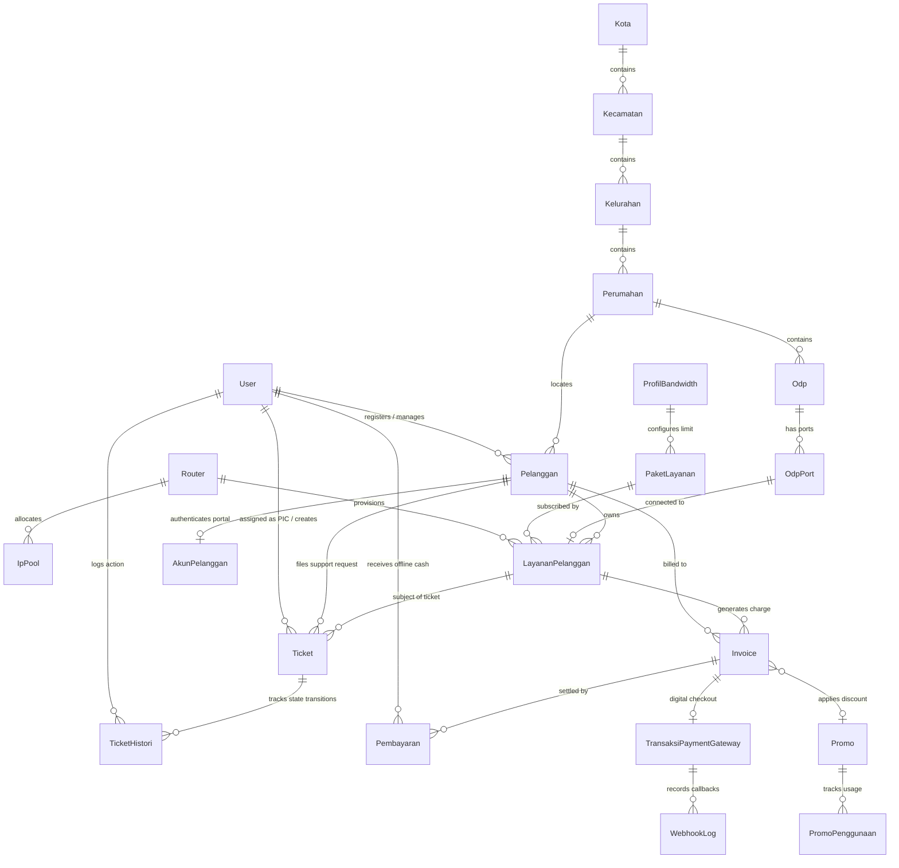
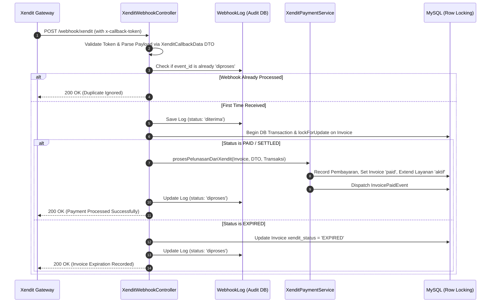
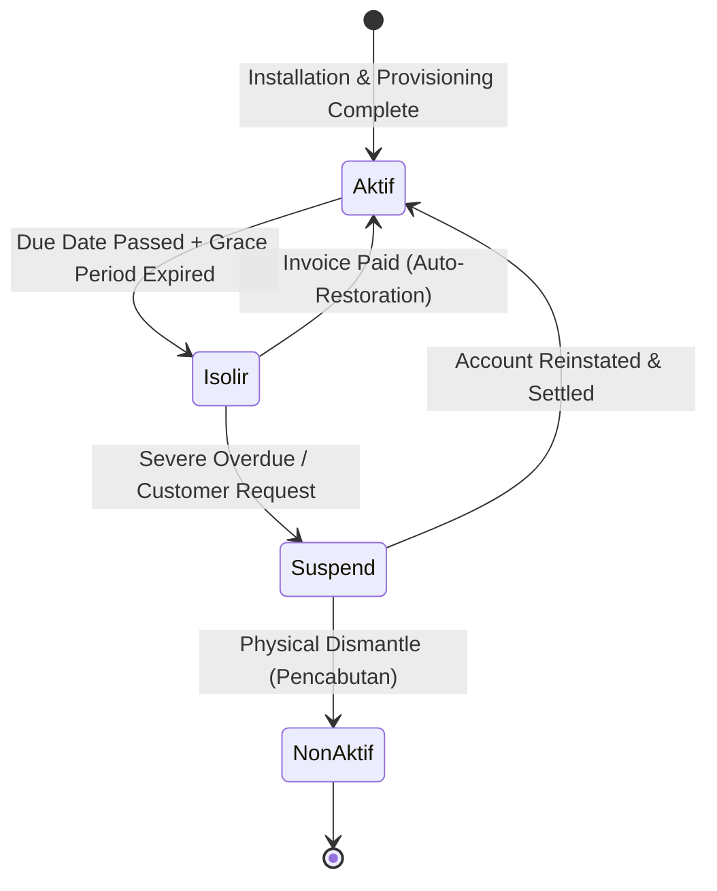
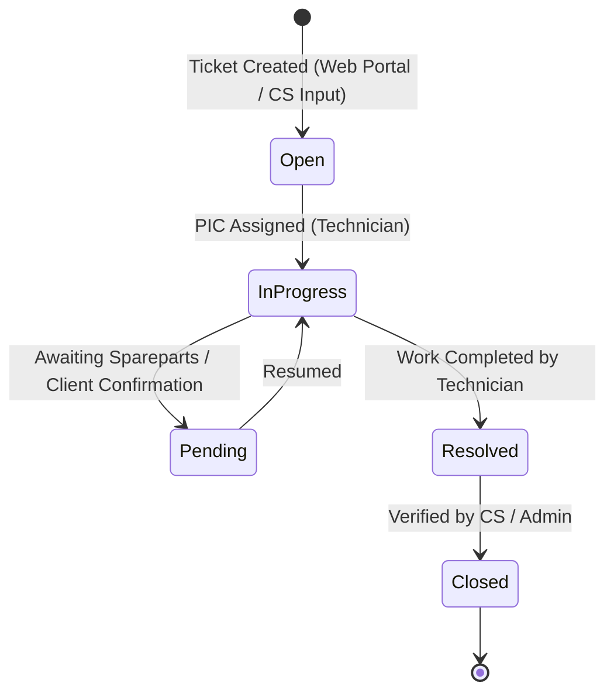
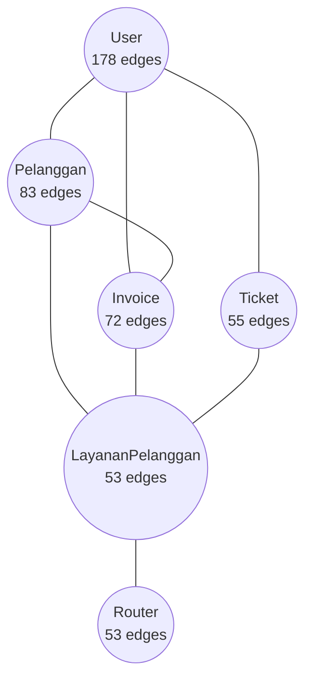

# 📚 Comprehensive UNMS Documentation

> **Ubiquiti & ISP Network Management System (UNMS)**  
> Production-grade ISP management platform built with **Laravel 12**, **Livewire 4**, **Flux UI**, **Tailwind CSS v4**, **MariaDB**, **MikroTik RouterOS API**, and **Xendit Payment Gateway**.

---

## 📑 Table of Contents

1. [System Architecture & Tech Stack](#1-system-architecture--tech-stack)
2. [Domain Models & Entity Relationship Architecture (ERD)](#2-domain-models--entity-relationship-architecture-erd)
3. [Setup & Installation Instructions](#3-setup--installation-instructions)
4. [API & Webhook Documentation](#4-api--webhook-documentation)
5. [Deep-Dive Domain Workflows & State Machines](#5-deep-dive-domain-workflows--state-machines)
   - [5.1 Customer & Service Lifecycle](#51-customer--service-lifecycle)
   - [5.2 Invoicing, Billing & Payment Processing](#52-invoicing-billing--payment-processing)
   - [5.3 Network & MikroTik Provisioning](#53-network--mikrotik-provisioning)
   - [5.4 Regional & Area Hierarchy (Guarded Deletion)](#54-regional--area-hierarchy-guarded-deletion)
   - [5.5 Support Ticketing & SLA Tracking](#55-support-ticketing--sla-tracking)
   - [5.6 Customer Portal Self-Service](#56-customer-portal-self-service)
   - [5.7 Multi-Auth, RBAC & Impersonation Engine](#57-multi-auth-rbac--impersonation-engine)
6. [Developer Guide & Engineering Standards](#6-developer-guide--engineering-standards)
7. [Knowledge Graph & Architectural Hubs Analysis](#7-knowledge-graph--architectural-hubs-analysis)

---

## 1. System Architecture & Tech Stack

UNMS provides an end-to-end operational platform for Internet Service Providers (ISPs), bridging customer relationship management (CRM), automated recurring billing, real-time digital payment processing, technical support ticketing, and hardware-level network control (MikroTik RouterOS).

```mermaid
graph TD
    subgraph "Clients & Authentication Layers"
        A[Staff / Admin Portal] -->|Guard: web (User)| B(Laravel 12 / Livewire 4 / Flux UI)
        C[Customer Portal] -->|Guard: pelanggan (AkunPelanggan)| B
        D[Payment Gateway] -->|Xendit Webhooks (Token Verified)| E[XenditWebhookController]
    end

    subgraph "Core UNMS Application Layer"
        B --> F[Multi-Auth & RBAC: Fortify / Spatie Permission]
        B --> G[Billing Engine: Invoicing & Manual / Gateway Payment]
        B --> H[Customer & Service Lifecycle: LayananPelanggan State Machine]
        B --> I[Ticketing & SLA Engine: Ticket & TicketHistori]
        B --> J[Regional & Geography: Kota > Kecamatan > Kelurahan > Perumahan > ODP]
        B --> K[Network Engine: RouterOS API / IP Pool / Profil Bandwidth]
        E --> L[XenditPaymentService / Idempotent Webhook Processor]
        L --> G
    end

    subgraph "Infrastructure & External Systems"
        G --> M[(MariaDB 10.6+ Database)]
        K -->|Port 8728 API / PPP / Simple Queue| N[MikroTik RouterOS Devices]
        L -->|REST API v2 / Hosted Invoices / Callbacks| O[Xendit Payment Gateway]
        G --> P[DomPDF Engine / Maatwebsite Excel]
    end
```

### 1.1 Technology Matrix

| Layer | Technology | Version | Description |
| :--- | :--- | :--- | :--- |
| **Runtime** | PHP | `8.4+` | Modern PHP with typed properties, enums, promoted constructors |
| **Framework** | Laravel Framework | `12.64.0` | Core MVC framework with Laravel 12 features |
| **Frontend Reactive UI** | Livewire & Volt | `4.3.3` / `1.11.1` | Full-stack reactive components without JavaScript bloat |
| **Component Library** | Flux UI (Free) | `2.15.0` | Sleek, accessible UI component kit for Livewire |
| **CSS Framework** | Tailwind CSS | `4.2.2` | Engine-level modern CSS utilities |
| **Database** | MariaDB / MySQL | `10.6+` / `8.0+` | Relational database with row-level locking support |
| **Auth & Security** | Laravel Fortify & Passkeys | `1.37.3` / `@laravel/passkeys` | Multi-guard authentication with WebAuthn/FIDO2 support |
| **Authorization / RBAC** | Spatie Laravel Permission | `6.x` | Role-based and permission-based access control |
| **Network API** | RouterOS API Client | Native Sockets | Communicates with MikroTik devices over API port `8728` |
| **Payment Gateway** | Xendit REST API | Hosted Invoice v2 | Multi-channel payments (QRIS, VA, E-Wallet, Retail Outlet) |
| **Document Generation** | DomPDF & Maatwebsite Excel | `barryvdh/laravel-dompdf` / `3.1` | Official PDF invoice receipts & Excel billing reports |
| **Test Engine** | Pest PHP | `4.7.5` | Fast, expressive test suite |
| **Code Style & Analysis**| Laravel Pint & Larastan | `1.29.3` / `3.10.0` | Automated PSR-12 styling & static type analysis |

---

## 2. Domain Models & Entity Relationship Architecture (ERD)



### 2.1 Core Entities Summary

1. **[`User`](file:///c:/Ryu/Projects/unms/app/Models/User.php)**: Internal staff accounts (`super_admin`, `admin_billing`, `teknisi`, `customer_service`, `sales`).
2. **[`Pelanggan`](file:///c:/Ryu/Projects/unms/app/Models/Pelanggan.php)**: Customer master record identified by `no_registrasi` (`REG-YYYY-NNNNNN`).
3. **[`AkunPelanggan`](file:///c:/Ryu/Projects/unms/app/Models/AkunPelanggan.php)**: Public portal authentication credential for customers (guard `pelanggan`).
4. **[`LayananPelanggan`](file:///c:/Ryu/Projects/unms/app/Models/LayananPelanggan.php)**: Internet subscription with unique `site_id` (`SITE-XXXXXXXX`), PPP credentials, IP assignments, and status (`aktif`, `isolir`, `suspend`, `non_aktif`).
5. **[`PaketLayanan`](file:///c:/Ryu/Projects/unms/app/Models/PaketLayanan.php)** & **[`ProfilBandwidth`](file:///c:/Ryu/Projects/unms/app/Models/ProfilBandwidth.php)**: Product catalogue and standardized Mbps bandwidth limit provisioning profiles.
6. **[`Router`](file:///c:/Ryu/Projects/unms/app/Models/Router.php)** & **[`IpPool`](file:///c:/Ryu/Projects/unms/app/Models/IpPool.php)**: MikroTik hardware gateways and subnet IP allocation pools.
7. **[`Kota`](file:///c:/Ryu/Projects/unms/app/Models/Kota.php)**, **[`Kecamatan`](file:///c:/Ryu/Projects/unms/app/Models/Kecamatan.php)**, **[`Kelurahan`](file:///c:/Ryu/Projects/unms/app/Models/Kelurahan.php)**, **[`Perumahan`](file:///c:/Ryu/Projects/unms/app/Models/Perumahan.php)**: Hierarchical geographic master data with guarded deletion.
8. **[`Invoice`](file:///c:/Ryu/Projects/unms/app/Models/Invoice.php)** & **[`Pembayaran`](file:///c:/Ryu/Projects/unms/app/Models/Pembayaran.php)**: Official billing documents (`INV-YYYYMM-NNNNNN`) and payment transactions.
9. **[`TransaksiPaymentGateway`](file:///c:/Ryu/Projects/unms/app/Models/TransaksiPaymentGateway.php)** & **[`WebhookLog`](file:///c:/Ryu/Projects/unms/app/Models/WebhookLog.php)**: Xendit checkout sessions with `external_id` and immutable webhook audit trails.
10. **[`Ticket`](file:///c:/Ryu/Projects/unms/app/Models/Ticket.php)** & **[`TicketHistori`](file:///c:/Ryu/Projects/unms/app/Models/TicketHistori.php)**: Customer support and network repair requests (`TCK-YYYY-NNNNNN`) with SLA deadline tracking.

---

## 3. Setup & Installation Instructions

### 3.1 Prerequisites
- **PHP**: `^8.4` with extensions: `bcmath`, `ctype`, `curl`, `dom`, `fileinfo`, `gd`, `json`, `mbstring`, `openssl`, `pdo_mysql`, `sockets`, `sodium`, `xml`, `zip`.
- **Database**: MariaDB `10.6+` or MySQL `8.0+`.
- **Node.js & Package Manager**: Node.js `^20.x` / `^22.x` and `npm` (or `bun`).
- **Composer**: `^2.x`.

---

### 3.2 Step-by-Step Installation Runbook

#### 1. Clone Repository & Install Dependencies
```bash
git clone <repository-url> unms
cd unms
composer install
npm install
```

#### 2. Configure Environment
```bash
cp .env.example .env
php artisan key:generate
```

#### 3. Database Migration & Seeding
```bash
# Create database in MariaDB/MySQL first, e.g. `unms_db`
php artisan migrate:fresh --seed
```
*The default seeder initializes roles, permissions, regional master data, test routers, bandwidth profiles, sample customers, and default staff users:*
- **Super Admin**: `admin@unms.test` / `password`
- **Billing Admin**: `billing@unms.test` / `password`
- **Technician**: `teknisi@unms.test` / `password`

#### 4. Storage Linking
```bash
php artisan storage:link
```

#### 5. Build Frontend Assets
```bash
npm run build
```

---

### 3.3 Environment Variables Reference (`.env`)

| Variable | Description | Example / Recommended Value |
| :--- | :--- | :--- |
| `APP_NAME` | Application title | `"UNMS"` |
| `APP_ENV` | Environment state | `local` / `production` |
| `APP_URL` | Base URL of application | `http://unms.test` |
| `DB_CONNECTION` | Database driver | `mysql` |
| `DB_HOST` | Database server hostname | `127.0.0.1` |
| `DB_PORT` | Database port | `3306` |
| `DB_DATABASE` | Database name | `unms_db` |
| `DB_USERNAME` | Database user | `root` |
| `DB_PASSWORD` | Database password | `secret` |
| `QUEUE_CONNECTION` | Queue driver | `database` |
| `SESSION_DRIVER` | Session store driver | `database` |
| `XENDIT_SECRET_KEY` | Xendit API Secret Key | `xnd_development_...` |
| `XENDIT_PUBLIC_KEY` | Xendit Public Key | `xnd_public_development_...` |
| `XENDIT_WEBHOOK_VERIFICATION_TOKEN` | Callback Verification Token | `your_webhook_verification_token` |
| `XENDIT_MODE` | Gateway mode | `development` / `production` |

---

### 3.4 Daemons & Background Workers

#### Queue Worker
Runs background notifications, invoice email dispatches, and async MikroTik provisioning:
```bash
php artisan queue:work --tries=3 --timeout=90
```

#### Cron Scheduler
In production, register a crontab entry running every minute:
```cron
* * * * * cd /path/to/unms && php artisan schedule:run >> /dev/null 2>&1
```
For local development, run the scheduler worker directly:
```bash
php artisan schedule:work
```

#### Local Development with Xendit Webhooks
To receive real webhook callbacks from Xendit on a local environment:
```bash
# Terminal 1: Dev Server
composer run dev

# Terminal 2: Expose Local Port 8000 via Ngrok
ngrok http 8000
```
*Copy the generated HTTPS URL (e.g. `https://xxxx.ngrok-free.app/webhook/xendit`) into your Xendit Dashboard Webhook settings.*

---

## 4. API & Webhook Documentation

### 4.1 Webhook Routing Table

| Endpoint | Method | Middleware | Target Controller Action |
| :--- | :--- | :--- | :--- |
| `/webhook/xendit` | `POST` | `ValidateXenditCallbackToken` | [`XenditWebhookController@handle`](file:///c:/Ryu/Projects/unms/app/Http/Controllers/Webhook/XenditWebhookController.php) |
| `/webhook/xendit/qris` | `POST` | `ValidateXenditCallbackToken` | [`XenditWebhookController@handle`](file:///c:/Ryu/Projects/unms/app/Http/Controllers/Webhook/XenditWebhookController.php) |
| `/webhook/xendit/virtual-account` | `POST` | `ValidateXenditCallbackToken` | [`XenditWebhookController@handle`](file:///c:/Ryu/Projects/unms/app/Http/Controllers/Webhook/XenditWebhookController.php) |

### 4.2 Security & Signature Verification
- Incoming requests MUST include the HTTP header:
  ```http
  x-callback-token: <XENDIT_WEBHOOK_VERIFICATION_TOKEN>
  ```
- If the token does not match `config('services.xendit.webhook_token')`, the request is immediately aborted with `401 Unauthorized`.

---

### 4.3 Webhook Handling Lifecycle & Idempotency



---

### 4.4 Webhook Payloads & Responses

#### Invoice Paid Payload (`POST /webhook/xendit`)
```json
{
  "id": "64d0fe7a98b1b22e148a43f1",
  "external_id": "INV-202608-000142",
  "user_id": "64123456789abcdef0123456",
  "is_high": false,
  "payment_method": "BANK_TRANSFER",
  "status": "PAID",
  "merchant_name": "PT ISP Nusantara",
  "amount": 250000,
  "paid_amount": 250000,
  "bank_code": "BCA",
  "paid_at": "2026-08-22T12:30:00.000Z",
  "payer_email": "customer@domain.test",
  "description": "Pembayaran Tagihan Internet INV-202608-000142",
  "payment_id": "py_64d0fe7a98b1b22e148a43f2",
  "currency": "IDR"
}
```

#### Success Response (`200 OK`)
```json
{
  "message": "Payment processed successfully",
  "external_id": "INV-202608-000142"
}
```

#### Duplicate / Idempotency Response (`200 OK`)
```json
{
  "message": "Webhook already processed",
  "xendit_event_id": "64d0fe7a98b1b22e148a43f1"
}
```

---

## 5. Deep-Dive Domain Workflows & State Machines

### 5.1 Customer & Service Lifecycle

Every internet subscription ([`LayananPelanggan`](file:///c:/Ryu/Projects/unms/app/Models/LayananPelanggan.php)) follows a strict automated lifecycle:



- **`Aktif`**: Customer enjoys normal bandwidth profile on MikroTik.
- **`Isolir`**: Service is automatically redirected to the ISP walled garden / isolation pool on MikroTik via Address-List or PPP profile modification.
- **`Suspend`**: Temporarily frozen (e.g. temporary relocation or prolonged non-payment).
- **`NonAktif`**: Subscription terminated and ODP port freed for new installations.

---

### 5.2 Invoicing, Billing & Payment Processing

#### Billing Cycle Engine
- Invoices ([`Invoice`](file:///c:/Ryu/Projects/unms/app/Models/Invoice.php)) are generated with standard format `INV-YYYYMM-NNNNNN`.
- **Scheduled Automated Commands**:
  - `php artisan billing:generate-invoices` — Automatically runs daily to generate upcoming recurring billing for active customer services before their billing cycle date.
  - `php artisan billing:check-expired-invoices` — Scans for overdue unpaid invoices, marks them as `expired`, and triggers service isolation on MikroTik.
  - `php artisan xendit:ping` — CLI diagnostic to verify Xendit API secret keys and server roundtrip latency.
  - `php artisan xendit:simulate {--invoice=} {--status=PAID}` — Development CLI tool to test webhook handlers without making external HTTP requests.

#### Payment Methods
1. **Manual Settlement**: Recorded by `admin_billing` staff through the internal backoffice ([`Pembayaran`](file:///c:/Ryu/Projects/unms/app/Models/Pembayaran.php)).
2. **Digital Payment Gateway**: Handled by [`XenditPaymentService`](file:///c:/Ryu/Projects/unms/app/Services/Xendit/XenditPaymentService.php). Generating an invoice creates an `external_id` and redirects the client to the hosted checkout URL (`xendit_invoice_url`).

---

### 5.3 Network & MikroTik Provisioning

- **Standardization** ([ADR 0005](file:///c:/Ryu/Projects/unms/docs/adr/0005-bandwidth-profile-mbps-standardization.md)): All upload/download rates in [`ProfilBandwidth`](file:///c:/Ryu/Projects/unms/app/Models/ProfilBandwidth.php) are stored in standardized **Mbps** units (e.g., `10M/20M` for 10 Mbps Upload / 20 Mbps Download).
- **Router Entity** ([`Router`](file:///c:/Ryu/Projects/unms/app/Models/Router.php)): Manages API port `8728` credentials, connection status (`online`, `offline`, `maintenance`), and sync locks.
- **IP Pool Entity** ([`IpPool`](file:///c:/Ryu/Projects/unms/app/Models/IpPool.php)): Manages CIDR subnets, gateway addresses, and allocated IP ranges per router.

---

### 5.4 Regional & Area Hierarchy (Guarded Deletion)

The geographic structure is strictly hierarchical:
$$\text{Kota} \longrightarrow \text{Kecamatan} \longrightarrow \text{Kelurahan} \longrightarrow \text{Perumahan} \longrightarrow \text{ODP} \longrightarrow \text{ODP Port}$$

- **Guarded Deletion** ([ADR 0006](file:///c:/Ryu/Projects/unms/docs/adr/0006-area-wilayah-hierarchical-modeling-and-guarded-deletion.md)): A parent record cannot be deleted if child entities or active customer installations exist.
- **Geolocation**: [`Perumahan`](file:///c:/Ryu/Projects/unms/app/Models/Perumahan.php) stores `latitude`, `longitude`, and boundary data for network coverage mapping.

---

### 5.5 Support Ticketing & SLA Tracking

Support tickets ([`Ticket`](file:///c:/Ryu/Projects/unms/app/Models/Ticket.php)) manage customer complaints, technical repairs, and field installations (`TCK-YYYY-NNNNNN`):



- **Immutable Audit Trail**: All status modifications and reassignment actions are written to [`TicketHistori`](file:///c:/Ryu/Projects/unms/app/Models/TicketHistori.php).
- **SLA Priority Matrix**:
  - `Kritis`: 4 Hours SLA
  - `Tinggi`: 12 Hours SLA
  - `Sedang`: 24 Hours SLA
  - `Rendah`: 48 Hours SLA
- **Notifications**: Assigning a ticket dispatches [`TicketDiassignNotification`](file:///c:/Ryu/Projects/unms/app/Notifications/TicketDiassignNotification.php) to the technician.

---

### 5.6 Customer Portal Self-Service

Customers access their dedicated portal at `/portal`:
- **Account Claiming** (`/portal/klaim-akun`): Customers activate their portal account by providing their `no_registrasi` and verifying their registered phone/email.
- **Portal Authentication** (`/portal/login`): Operates under the `pelanggan` authentication guard using [`AkunPelanggan`](file:///c:/Ryu/Projects/unms/app/Models/AkunPelanggan.php).
- **Tagihan & Pembayaran** (`/portal/tagihan`): Customers view outstanding invoices and click "Bayar Sekarang" to launch Xendit Hosted Checkout sessions.

---

### 5.7 Multi-Auth, RBAC & Impersonation Engine

- **Dual-Guard Isolation**:
  - `web` guard ➔ [`User`](file:///c:/Ryu/Projects/unms/app/Models/User.php) (Internal Staff)
  - `pelanggan` guard ➔ [`AkunPelanggan`](file:///c:/Ryu/Projects/unms/app/Models/AkunPelanggan.php) (Customer Portal)
- **RBAC Roles**:
  - `super_admin`: Full system access, impersonation, gateway configuration.
  - `admin_billing`: Billing generation, manual payment entry, promo management.
  - `teknisi`: Ticket resolution, router and ODP maintenance.
  - `customer_service`: Customer registration, ticket filing.
  - `sales`: Customer registration, commission tracking.
- **Impersonation** ([`ImpersonateController`](file:///c:/Ryu/Projects/unms/app/Http/Controllers/ImpersonateController.php)): `super_admin` staff can impersonate any customer portal account or staff user without requiring passwords for live troubleshooting. All sessions are logged in `activity_log`.

---

## 6. Developer Guide & Engineering Standards

### 6.1 Application Directory Structure

```
unms/
├── app/
│   ├── Actions/            # Business actions (Fortify, Ticket, Customer)
│   ├── Console/Commands/   # Artisan commands (Billing, Xendit Ping/Simulate)
│   ├── DTO/Xendit/         # Data Transfer Objects for Webhooks
│   ├── Enums/              # Typed Enums (Ticket, Status, Payment, Gateway)
│   ├── Events/             # Application domain events (InvoicePaidEvent)
│   ├── Http/Controllers/   # Webhook & PDF/Export Controllers
│   ├── Livewire/           # Reactive Full-page & UI Components (Flux UI)
│   ├── Models/             # Eloquent Models & Relationships
│   ├── Notifications/      # Email & Database Notifications
│   ├── Policies/           # Authorization Policies (RBAC)
│   └── Services/           # Domain Services (BillingService, XenditPaymentService)
├── config/                 # Laravel configuration files
├── database/
│   ├── factories/          # Pest/PHPUnit Model Factories
│   ├── migrations/         # Database Schema Migrations
│   └── seeders/            # Database Seeders
├── docs/                   # ADRs, PRDs, and Architecture Specs
├── resources/views/        # Blade Templates & Flux UI Components
├── routes/
│   ├── web.php             # Web & Portal Routes
│   └── console.php         # Console routes
└── tests/                  # Pest Feature and Unit Tests
```

---

### 6.2 Code Quality & Testing Suite

#### 1. Running Pest Test Suite
```bash
# Run all tests with compact output
php artisan test --compact

# Run a specific feature test
php artisan test --compact --filter=XenditWebhookTest
php artisan test --compact --filter=TicketLivewireTest
```

#### 2. Code Style Formatting (Laravel Pint)
```bash
# Automatically format dirty files to project standards
vendor/bin/pint --format agent
```

#### 3. Static Type Analysis (Larastan)
```bash
./vendor/bin/phpstan analyse
```

---

## 7. Knowledge Graph & Architectural Hubs Analysis

An automated structural audit performed by **graphify** reveals **3,172 nodes** and **5,124 edges** grouped into **198 cohesive communities**.

### 7.1 Top God Nodes (Core Architectural Hubs)



1. **`User` (178 Edges)**: The central backbone for security, staff roles, PIC assignment, manual payment collection, and impersonation.
2. **`Pelanggan` (83 Edges)**: The primary CRM master entity linking contracts, installations, billing, and portal credentials.
3. **`Invoice` (72 Edges)**: The financial clearinghub connecting services, payments, promos, and payment gateway webhooks.
4. **`Ticket` (55 Edges)**: The operational workhouse connecting customers, technicians, SLA timers, and field logs.
5. **`Router` (53 Edges)**: The hardware gateway abstraction bridging software subscriptions to physical MikroTik RouterOS interfaces.
6. **`LayananPelanggan` (53 Edges)**: The state machine core connecting packages, bandwidth profiles, IP pools, and billing cycles.

---

### 7.2 Why `User` Bridges Multi-Auth, Ticketing, and Payment Gateways

The knowledge graph highlights `User` as having the highest betweenness-centrality in UNMS:
1. **Security & Validation** (`PasswordValidationRules`): Fortify actions enforce strict password complexity on staff user creation and credential resets.
2. **Support & Operations** (`Ticket`): Staff users are assigned as PIC technicians, authoring immutable progress notes in `TicketHistori` and receiving transition notifications.
3. **Customer Master & Ownership** (`Pelanggan`): Users represent sales agents (`sales_user_id`) for commission attribution and are authorized through `PelangganPolicy`.
4. **Multi-Auth Impersonation** (`AkunPelanggan`): Internal staff (`super_admin`) seamlessly troubleshoot public customer portal issues via `/impersonate/{akunPelanggan}`.
5. **Offline Collection** (`Pembayaran`): Records the exact staff member (`diterima_oleh`) accepting manual cash and physical receipts.
6. **Gateway Administration** (`TransaksiPaymentGateway`): Grants administrators the capability to inspect digital payment logs, test webhooks, and configure gateway API keys.

---
*UNMS Documentation — Generated and maintained via Graphify Knowledge Graph Architecture.*