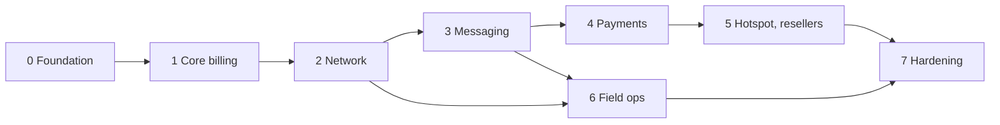

# SimBill Rebuild — Implementation Plan

2026-09-21 · @Someone

Implements project/d1e2546f-6692-4089-a8ca-e4d981cc91a5 in eight phases, each cut into tasks small enough for one coding-agent session.

## 1. How to use this plan

Each coding-agent session gets a small context pack, this tab's global rules plus exactly one phase tab, and completes exactly one task.

The PRD says what to build; this plan says in what order, in what shape, and how to prove each piece works. If the two disagree, stop, fix the PRD, then continue.

### Rules for every session

1. **Load the pack, nothing more.** Sections 2 and 3 of this tab, the phase tab for the current task, `docs/HANDOFF.md`, and the files the task names under "Files". Do not read the whole repository or the whole PRD.
2. **One task per session.** A task touches at most 10 files, adds about 500 lines of code at most, and ends with a command that proves it works. If it grows past that, split it and add a row to the phase tab.
3. **Follow the numbers.** Phases run in order and tasks run in order inside a phase, unless a task lists a different "Needs".
4. **Test first where a test is cheap.** Write the failing test named in "Done when", then the code.
5. **Respect contracts.** Each phase tab lists the interfaces later phases rely on. Changing one means editing that phase tab in the same change.
6. **Close with a handoff.** Update `docs/HANDOFF.md` before ending (format in section 3).
7. **Gate each phase.** Do not start the next phase until the phase exit test passes in CI.

### Context budget

Sizes are approximate and exist to keep every session small.

| Item | Size | Loaded |
| --- | --- | --- |
| Global rules (sections 2 and 3 of this tab) | About 1,300 words | Every session |
| Current phase tab | About 800 words | Every session in that phase |
| PRD requirement rows cited by the task | 100 to 400 words | Only the cited `FR-` and `NFR-` rows |
| `docs/HANDOFF.md` | 40 lines at most | Every session |
| Files named by the task | 10 at most | Per task |

To hand a phase to an agent, export that one tab as Markdown and paste it with sections 2 and 3 of this tab. Never paste the whole document.

## 2. Global rules

Every task follows one repository layout, one set of stack defaults and one set of conventions, so an agent never has to rediscover them.

### Repository layout

```text
simbill/
  package.json            # "type": "module"
  .env.example
  docker-compose.yml      # mariadb + freeradius for tests
  src/
    server.js             # web process
    worker.js             # scheduler process
    config/               # the only place that reads process.env
    db/                   # pool.js, migrate.js, migrations/NNN_name.sql
    lib/                  # logger, crypto, money, time, errors, events
    modules/<name>/       # routes.js service.js repo.js schema.js *.test.js
    integrations/<name>/  # radius, mikrotik, whatsapp, telegram, payments, acs
    jobs/                 # one file per scheduled job
  public/                 # frontend, static ES modules, no build
    index.html  app.js  api.js  i18n/{id,en}.json  modules/  css/
  scripts/                # install.sh, setup-*.sh, update.sh, backup.sh
  test/                   # e2e tests and fakes/ for external services
  docs/HANDOFF.md
```

### Stack defaults

These fill the PRD's open choices so work can start. Change one here and every later task follows it.

| Concern | Default |
| --- | --- |
| Runtime and language | Node.js 24 LTS, JavaScript with JSDoc types, ES modules |
| HTTP | Express, JSON API under `/api/v1` |
| Database access | `mysql2` with plain SQL in `repo.js` files, no ORM |
| Migrations | Numbered forward-only `.sql` files; a small runner records them in `schema_migrations` |
| Validation | `zod` at every route boundary |
| Passwords and tokens | `argon2` and signed tokens via `jose` |
| Logging | `pino`, one JSON line per request with a request ID |
| Tests | Built-in `node --test`; integration tests use real MariaDB and FreeRADIUS from `docker-compose.yml` |
| Lint and format | ESLint and Prettier |
| Scheduling | `node-cron` in `worker.js`, guarded by MariaDB `GET_LOCK` |
| PDF and QR | `puppeteer-core` with system Chrome; `qrcode` |
| Frontend | Vanilla JavaScript modules, hash router, a small `html` template helper, no framework |

### Conventions

- **Module shape.** `routes.js` parses input and calls `service.js`; `service.js` holds the rules; `repo.js` holds only SQL. Routes never touch SQL.
- **Integrations.** Each has one `index.js` exporting a small interface and a fake in `test/fakes/`. Business code imports the interface, never a vendor library.
- **Internal events.** `lib/events.js` carries `invoice.created`, `payment.settled`, `customer.suspended` and `customer.restored`. Later phases subscribe instead of editing earlier modules.
- **Data.** Tables are plural snake\_case with `BIGINT UNSIGNED` keys; money is `BIGINT` rupiah; timestamps are `DATETIME` in `Asia/Jakarta` (+07:00).
- **API shape.** Success is `{ "data": ... }`; failure is `{ "error": { "code", "message" } }`; lists take `page` and `per_page` and add `meta.total`.
- **Permissions.** Every route declares `requireRole([...])`. Reseller and technician scoping goes through one helper, never ad-hoc `WHERE` clauses.
- **No leaks.** `repo.js` selects explicit columns. Password hashes, RADIUS secrets and gateway keys never appear in a response or a log line.
- **Idempotency.** Jobs and webhooks are safe to run twice; the database enforces it with unique keys.
- **UI text.** Every string lives in `public/i18n/id.json` and `en.json`; no literals in JavaScript or HTML.
- **Commits.** One task, one commit: `feat(p1): T1.4 customers API`, with the PRD IDs in the body.

### Definition of done for every task

1. `npm test` and `npm run lint` pass.
2. Migrations apply to an empty database and re-run without error.
3. No new endpoint returns a secret; the response-scan test (from task 0.5) still passes.
4. New user-facing strings exist in both languages.
5. `docs/HANDOFF.md` is updated.

## 3. Session prompt and handoff

Paste this prompt at the start of each session, filled in from the phase tab's task row, and keep `docs/HANDOFF.md` current so the next session starts from facts, not from re-reading code.

### Session prompt

```markdown
You are implementing task T{phase}.{n} of the SimBill rebuild.

Context pack (pasted above): Global rules, the Phase {phase} tab, docs/HANDOFF.md.

Task: {"What to build" cell}
PRD rows to satisfy: {FR-/NFR- IDs}
Files: {"Files" cell}
Needs: {earlier tasks, or "previous task"}
Done when: {"Done when" cell}

Do:
1. Read only the listed files and docs/HANDOFF.md.
2. Write the failing test named in "Done when".
3. Implement until it passes, then run `npm test` and `npm run lint`.
4. Update docs/HANDOFF.md.

Do not:
- Change an interface under "Contracts" without editing the phase tab.
- Add a dependency that is not in the stack defaults without asking.
- Touch files outside the list; if you must, say why in HANDOFF.md.
- Start the next task.

If the task will pass 10 files or about 500 lines, stop and propose a split.
If the same failure survives two fix attempts, write it under "Open" and stop.
```

### Handoff note

Keep the whole file under 40 lines. Compress finished work into "State" instead of appending a log.

```markdown
# Handoff
Last task: T1.4 customers API (done)
Next task: T1.5 KTP upload
State: 3 to 5 lines on what exists (tables, routes, services)
Contracts added: function and route signatures other tasks rely on
Gotchas: anything that surprised you or cost time
Open: questions for the human, or a blocker with the exact error
```

### When a task goes wrong

- **Too big.** Split the row into two rows in the phase tab, renumber, and do the first half.
- **PRD gap.** Note it under "Open" and pick the conservative reading; do not invent a feature.
- **Contract change needed.** Stop; the change goes into the phase tab first, and every later phase that consumes it is checked.

## 4. Phase map

The work is 75 tasks in eight phases; phases 0 to 2 give the first usable release, matching section 12 of the PRD. Each phase has its own tab named "Phase N".



| Phase | Tasks | Needs | Migration numbers | PRD coverage |
| --- | --- | --- | --- | --- |
| 0. Foundation | 8 | None | 001 to 009 | NFR-SEC-01 to 04, FR-SYS-04, NFR-OBS-02, NFR-TST-01 |
| 1. Core billing | 11 | 0 | 010 to 019 | FR-CUS, FR-PKG, FR-INV, FR-PAY-01 and 02, FR-SYS-02 |
| 2. Network and automation | 9 | 1 | 020 to 029 | FR-RAD, FR-MTK, FR-SES, FR-SUS-02, 03 and 05, FR-PAY-03 |
| 3. Messaging | 10 | 2 | 030 to 039 | FR-WA, FR-TG, FR-SUS-01 and 04, NFR-OBS-03 |
| 4. Online payments | 10 | 2, 3 | 040 to 049 | FR-PGW |
| 5. Hotspot and resellers | 10 | 4 | 050 to 059 | FR-VCH, FR-RSL |
| 6. Field operations | 9 | 2, 3 | 060 to 069 | FR-TKT, FR-MAP, FR-ACS, FR-CUS-04 map linkage, UI-10 |
| 7. Reporting and hardening | 8 | All | 070 to 079 | FR-SYS-01 and 03, FR-API-01, NFR-PERF, NFR-REL, remaining NFR-SEC, UI-03 and 04 |

Each phase owns a block of migration numbers, so agents working on different phases in parallel never collide on a filename. Phases 5 and 6 depend on different earlier phases and can run in parallel with separate agents.
