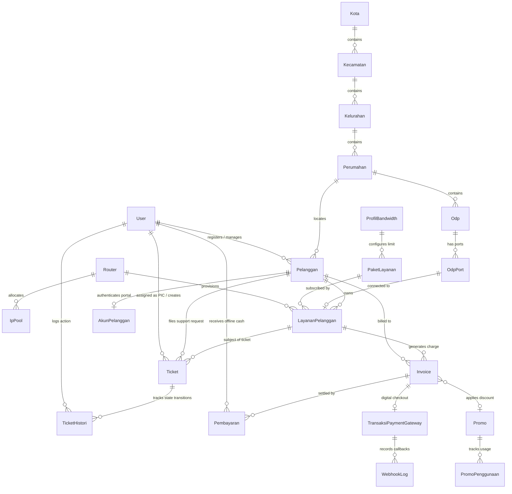
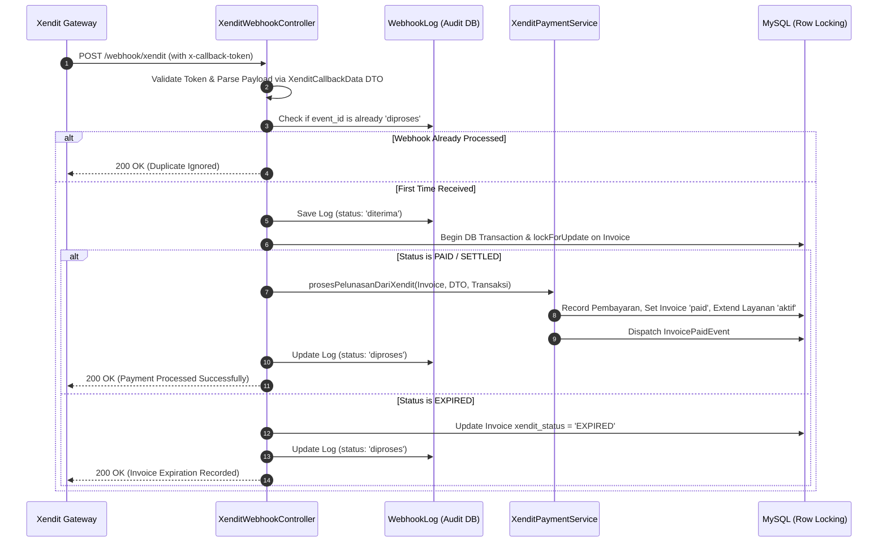
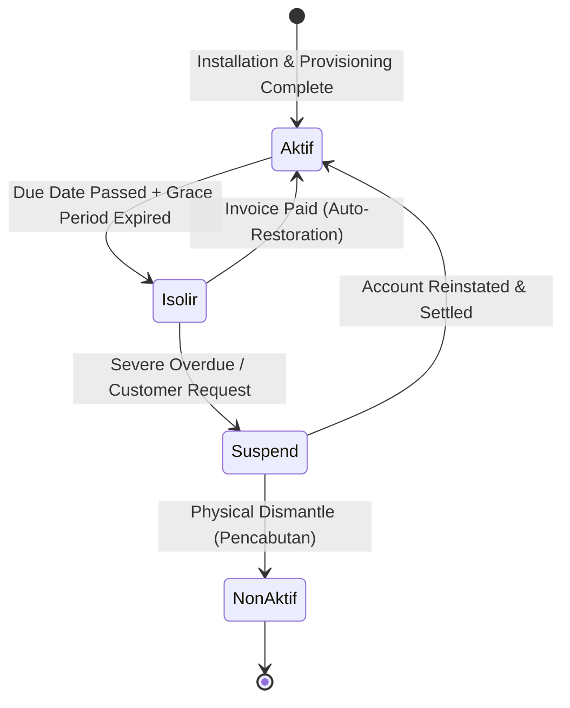
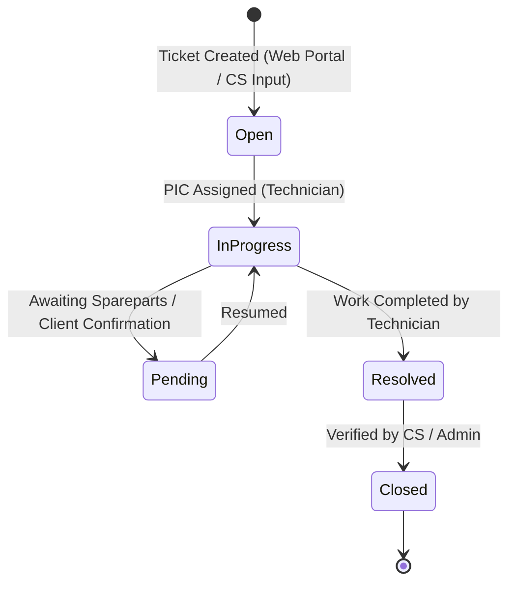
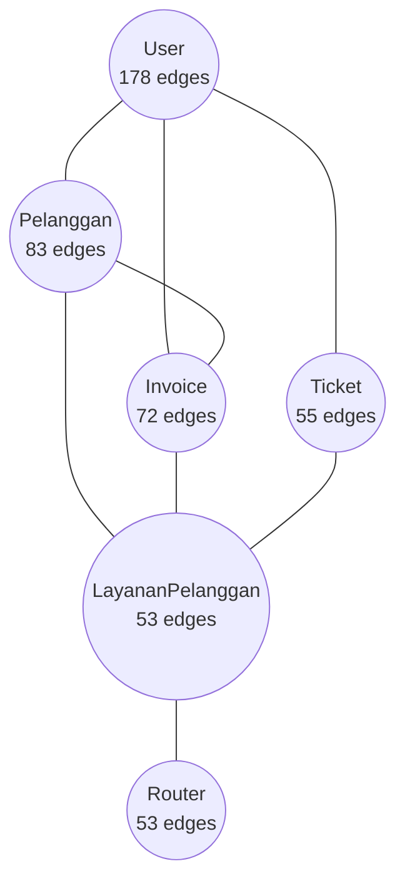

This file is a merged representation of the entire codebase, combined into a single document by Repomix.
The content has been processed where comments have been removed, empty lines have been removed, content has been compressed (code blocks are separated by ⋮---- delimiter).

# File Summary

## Purpose
This file contains a packed representation of the entire repository's contents.
It is designed to be easily consumable by AI systems for analysis, code review,
or other automated processes.

## File Format
The content is organized as follows:
1. This summary section
2. Repository information
3. Directory structure
4. Repository files (if enabled)
5. Multiple file entries, each consisting of:
  a. A header with the file path (## File: path/to/file)
  b. The full contents of the file in a code block

## Usage Guidelines
- This file should be treated as read-only. Any changes should be made to the
  original repository files, not this packed version.
- When processing this file, use the file path to distinguish
  between different files in the repository.
- Be aware that this file may contain sensitive information. Handle it with
  the same level of security as you would the original repository.

## Notes
- Some files may have been excluded based on .gitignore rules and Repomix's configuration
- Binary files are not included in this packed representation. Please refer to the Repository Structure section for a complete list of file paths, including binary files
- Files matching patterns in .gitignore are excluded
- Files matching default ignore patterns are excluded
- Code comments have been removed from supported file types
- Empty lines have been removed from all files
- Content has been compressed - code blocks are separated by ⋮---- delimiter
- Files are sorted by Git change count (files with more changes are at the bottom)

# Directory Structure
````
.agents/
  rules/
    graphify.md
  skills/
    ask-matt/
      agents/
        openai.yaml
      PHASE-BOUNDARIES.md
      SKILL.md
    blaze-optimize/
      references/
        advanced-optimization.md
        folding-safety.md
      SKILL.md
    claude-handoff/
      agents/
        openai.yaml
      SKILL.md
    code-review/
      agents/
        openai.yaml
      SKILL.md
    codebase-design/
      agents/
        openai.yaml
      DEEPENING.md
      DESIGN-IT-TWICE.md
      SKILL.md
    configuring-horizon/
      references/
        metrics.md
        notifications.md
        supervisors.md
        tags.md
      SKILL.md
    diagnosing-bugs/
      agents/
        openai.yaml
      scripts/
        hitl-loop.template.sh
      SKILL.md
    docker-expert/
      SKILL.md
    domain-modeling/
      agents/
        openai.yaml
      ADR-FORMAT.md
      CONTEXT-FORMAT.md
      SKILL.md
    fluxui-development/
      SKILL.md
    fortify-development/
      SKILL.md
    git-guardrails-claude-code/
      agents/
        openai.yaml
      scripts/
        block-dangerous-git.sh
      SKILL.md
    grill-me/
      agents/
        openai.yaml
      SKILL.md
    grill-with-docs/
      agents/
        openai.yaml
      SKILL.md
    grilling/
      agents/
        openai.yaml
      SKILL.md
    handoff/
      agents/
        openai.yaml
      SKILL.md
    implement/
      agents/
        openai.yaml
      SKILL.md
    implement-spec/
      agents/
        openai.yaml
      SKILL.md
    improve-codebase-architecture/
      agents/
        openai.yaml
      HTML-REPORT.md
      SKILL.md
    infer-conventions/
      references/
        checklist.md
      SKILL.md
    laravel-best-practices/
      rules/
        advanced-queries.md
        architecture.md
        blade-views.md
        caching.md
        collections.md
        config.md
        db-performance.md
        eloquent.md
        error-handling.md
        events-notifications.md
        http-client.md
        mail.md
        migrations.md
        queue-jobs.md
        routing.md
        scheduling.md
        security.md
        style.md
        validation.md
      SKILL.md
    laravel-excel/
      SKILL.md
    laravel-permission-development/
      SKILL.md
    livewire-development/
      reference/
        javascript-hooks.md
      SKILL.md
    loop-me/
      agents/
        openai.yaml
      SKILL.md
    medialibrary-development/
      references/
        medialibrary-guide.md
      SKILL.md
    migrate-to-shoehorn/
      agents/
        openai.yaml
      SKILL.md
    prototype/
      agents/
        openai.yaml
      LOGIC.md
      SKILL.md
      UI.md
    research/
      agents/
        openai.yaml
      SKILL.md
    resolving-merge-conflicts/
      agents/
        openai.yaml
      SKILL.md
    retro/
      agents/
        openai.yaml
      SKILL.md
    scaffold-exercises/
      agents/
        openai.yaml
      SKILL.md
    setup-matt-pocock-skills/
      agents/
        openai.yaml
      domain.md
      issue-tracker-github.md
      issue-tracker-gitlab.md
      issue-tracker-local.md
      SKILL.md
      triage-labels.md
    setup-pre-commit/
      agents/
        openai.yaml
      SKILL.md
    setup-ts-deep-modules/
      agents/
        openai.yaml
      dependency-cruiser.config.cjs
      SKILL.md
    tailwindcss-development/
      SKILL.md
    tdd/
      agents/
        openai.yaml
      mocking.md
      SKILL.md
      tests.md
    teach/
      agents/
        openai.yaml
      GLOSSARY-FORMAT.md
      LEARNING-RECORD-FORMAT.md
      MISSION-FORMAT.md
      RESOURCES-FORMAT.md
      SKILL.md
    testing-best-practices/
      rules/
        assertions.md
        endpoint-tests.md
        finding-features.md
        isolation.md
        naming.md
        performance.md
        review.md
        security.md
        test-data.md
      SKILL.md
    to-questionnaire/
      agents/
        openai.yaml
      SKILL.md
    to-spec/
      agents/
        openai.yaml
      SKILL.md
    to-tickets/
      agents/
        openai.yaml
      SKILL.md
    triage/
      agents/
        openai.yaml
      AGENT-BRIEF.md
      OUT-OF-SCOPE.md
      SKILL.md
    wait-what/
      agents/
        openai.yaml
      SKILL.md
    wayfinder/
      agents/
        openai.yaml
      SKILL.md
    wizard/
      agents/
        openai.yaml
      SKILL.md
      template.sh
    writing-beats/
      agents/
        openai.yaml
      SKILL.md
    writing-for-agents/
      agents/
        openai.yaml
      SKILL-MECHANICS.md
      SKILL.md
    writing-fragments/
      agents/
        openai.yaml
      SKILL.md
    writing-shape/
      agents/
        openai.yaml
      SKILL.md
  workflows/
    graphify.md
  mcp_config.json
.ai/
  guidelines/
    tall-stack.md
  rules/
    billing.md
    docker.md
    flux-select-search.md
    index.md
    invoice.md
    livewire-uploads.md
    mikrotik.md
    models.md
.claude/
  agents/
    alpine.md
    architect.md
    database.md
    docs.md
    flux.md
    livewire.md
    pest.md
    security.md
  commands/
    catchup.md
    debug.md
    pint.md
    review.md
    ship.md
    test.md
  skills/
    blaze-optimize/
      references/
        advanced-optimization.md
        folding-safety.md
      SKILL.md
    configuring-horizon/
      references/
        metrics.md
        notifications.md
        supervisors.md
        tags.md
      SKILL.md
    fluxui-development/
      SKILL.md
    fortify-development/
      SKILL.md
    infer-conventions/
      references/
        checklist.md
      SKILL.md
    laravel-best-practices/
      rules/
        advanced-queries.md
        architecture.md
        blade-views.md
        caching.md
        collections.md
        config.md
        db-performance.md
        eloquent.md
        error-handling.md
        events-notifications.md
        http-client.md
        mail.md
        migrations.md
        queue-jobs.md
        routing.md
        scheduling.md
        security.md
        style.md
        validation.md
      SKILL.md
    laravel-excel/
      SKILL.md
    laravel-permission-development/
      SKILL.md
    livewire-development/
      reference/
        javascript-hooks.md
      SKILL.md
    medialibrary-development/
      references/
        medialibrary-guide.md
      SKILL.md
    tailwindcss-development/
      SKILL.md
    testing-best-practices/
      rules/
        assertions.md
        endpoint-tests.md
        finding-features.md
        isolation.md
        naming.md
        performance.md
        review.md
        security.md
        test-data.md
      SKILL.md
  .headroom_wrap_settings.lock
  settings.json
  settings.local.json
.codex/
  config.toml
.github/
  skills/
    configuring-horizon/
      references/
        metrics.md
        notifications.md
        supervisors.md
        tags.md
      SKILL.md
    fluxui-development/
      SKILL.md
    fortify-development/
      SKILL.md
    infer-conventions/
      references/
        checklist.md
      SKILL.md
    laravel-best-practices/
      rules/
        advanced-queries.md
        architecture.md
        blade-views.md
        caching.md
        collections.md
        config.md
        db-performance.md
        eloquent.md
        error-handling.md
        events-notifications.md
        http-client.md
        mail.md
        migrations.md
        queue-jobs.md
        routing.md
        scheduling.md
        security.md
        style.md
        validation.md
      SKILL.md
    laravel-excel/
      SKILL.md
    laravel-permission-development/
      SKILL.md
    livewire-development/
      reference/
        javascript-hooks.md
      SKILL.md
    medialibrary-development/
      references/
        medialibrary-guide.md
      SKILL.md
    tailwindcss-development/
      SKILL.md
    testing-best-practices/
      rules/
        assertions.md
        endpoint-tests.md
        finding-features.md
        isolation.md
        naming.md
        performance.md
        review.md
        security.md
        test-data.md
      SKILL.md
.hermes/
  plans/
    2026-09-15_171510-railpack-json-alternative-build.md
.kiro/
  settings/
    mcp.json
  skills/
    configuring-horizon/
      references/
        metrics.md
        notifications.md
        supervisors.md
        tags.md
      SKILL.md
    fluxui-development/
      SKILL.md
    fortify-development/
      SKILL.md
    infer-conventions/
      references/
        checklist.md
      SKILL.md
    laravel-best-practices/
      rules/
        advanced-queries.md
        architecture.md
        blade-views.md
        caching.md
        collections.md
        config.md
        db-performance.md
        eloquent.md
        error-handling.md
        events-notifications.md
        http-client.md
        mail.md
        migrations.md
        queue-jobs.md
        routing.md
        scheduling.md
        security.md
        style.md
        validation.md
      SKILL.md
    laravel-excel/
      SKILL.md
    laravel-permission-development/
      SKILL.md
    livewire-development/
      reference/
        javascript-hooks.md
      SKILL.md
    medialibrary-development/
      references/
        medialibrary-guide.md
      SKILL.md
    tailwindcss-development/
      SKILL.md
    testing-best-practices/
      rules/
        assertions.md
        endpoint-tests.md
        finding-features.md
        isolation.md
        naming.md
        performance.md
        review.md
        security.md
        test-data.md
      SKILL.md
.serena/
  .gitignore
  project.yml
app/
  Actions/
    Fortify/
      AuthenticateUser.php
      CreateNewUser.php
      ResetUserPassword.php
    LayananPelanggan/
      PerpanjangMasaAktifAction.php
      UbahStatusLayananAction.php
    Ticket/
      AssignPicAction.php
      UbahStatusTicketAction.php
  Concerns/
    PasswordValidationRules.php
    ProfileValidationRules.php
  Console/
    Commands/
      CekVirtualAccountExpiredCommand.php
      CheckExpiredInvoicesCommand.php
      CheckLayananIsolirCommand.php
      EnsurePublicMediaBucketCommand.php
      GenerateInvoicesCommand.php
      InstallAppCommand.php
      KirimPengingatTagihanCommand.php
      MigrateOnceCommand.php
      MigratePppUsernameCommand.php
      MikrotikPingCommand.php
      MikrotikProvisionAllCommand.php
      MikrotikProvisionRouterCommand.php
      MikrotikRecoverPppCommand.php
      MikrotikSyncProfilesCommand.php
      MonitorHorizonHealthCommand.php
      ProsesAntrianWaCommand.php
      RekonsiliasiPembayaranCommand.php
      WaitForServicesCommand.php
      WhatsappPingCommand.php
      WhatsappSimulateWebhookCommand.php
      XenditPingCommand.php
      XenditSimulateCommand.php
  Contracts/
    PaymentGateway/
      PaymentGatewayContract.php
  DTO/
    PaymentGateway/
      PaymentCallbackData.php
      PaymentLinkResponse.php
      PingConnectionResult.php
    Xendit/
      XenditCallbackData.php
  Enums/
    Sysblas/
      SysblasProvider.php
    Ticket/
      DivisiTicket.php
      JenisTicket.php
      PrioritasTicket.php
      StatusTicket.php
      SumberTicket.php
    Wa/
      KategoriTemplateWa.php
      StatusAntrianWa.php
      TipePengingatTagihan.php
    DiskonTipe.php
    GatewayChannel.php
    JenisKoneksi.php
    JenisPromo.php
    MasaAktifSatuan.php
    MetodePembayaran.php
    MikrotikJobStatus.php
    MikrotikJobType.php
    ProvisioningStatus.php
    StatusInvoice.php
    StatusLayanan.php
    StatusOdpPort.php
    StatusPaket.php
    StatusPelanggan.php
    StatusRouter.php
    StatusTransaksiGateway.php
    StatusWebhookLog.php
    TipePelanggan.php
    UserStatus.php
  Events/
    InvoicePaidEvent.php
    LayananPelangganStatusChangedEvent.php
  Exceptions/
    MikrotikConnectionException.php
    MikrotikException.php
    TransisiStatusTidakValidException.php
  Exports/
    LaporanBillingExport.php
  Http/
    Controllers/
      Api/
        MapMarkerController.php
      Webhook/
        PaymentWebhookController.php
        WhatsappWebhookController.php
        XenditWebhookController.php
      Controller.php
      ImpersonateController.php
      InvoicePdfController.php
      PelangganMediaController.php
    Middleware/
      ValidateXenditCallbackToken.php
  Jobs/
    Mikrotik/
      CleanupPppSecretOnOldRouterJob.php
      DisablePppoeAccountJob.php
      EnablePppoeAccountJob.php
      PingRouterJob.php
      ProvisionPppoeAccountJob.php
      ProvisionRouterJob.php
      RecoverPppRouterJob.php
      SyncBandwidthProfileToRoutersJob.php
      SyncIpPoolToRouterJob.php
      UpdatePppoeProfileJob.php
    PaymentGateway/
      ProcessPaymentWebhookJob.php
    Wa/
      KirimWaBlastJob.php
    Whatsapp/
      ProcessWhatsappWebhookJob.php
  Listeners/
    CatatLogPembayaranListener.php
    HandleLayananStatusChangedListener.php
    LogImpersonationActivity.php
    RecordLastLoginAt.php
    TriggerEmailNotifikasiListener.php
    TriggerMikrotikAktivasiStubListener.php
    TriggerWaNotifikasiStubListener.php
  Livewire/
    Actions/
      Logout.php
    Billing/
      AturanPengingat/
        Index.php
    Concerns/
      HasSearchableOptions.php
    Invoice/
      Create.php
      Index.php
      Show.php
    IpPool/
      Create.php
      Edit.php
      Index.php
    Laporan/
      Billing.php
    LayananPelanggan/
      Create.php
      Edit.php
      Index.php
    Maps/
      EstimasiKabel.php
      Lokasi.php
    Odp/
      Create.php
      Edit.php
      Index.php
      Show.php
    PaketLayanan/
      Create.php
      Edit.php
      Index.php
    Pelanggan/
      Create.php
      Edit.php
      Index.php
      Show.php
    Pembayaran/
      TransaksiGateway/
        Index.php
        Show.php
      Index.php
    Portal/
      Auth/
        GantiPassword.php
        KlaimAkun.php
        Login.php
      Invoice/
        Concerns/
          AuthorizesInvoiceAccess.php
        Index.php
        Show.php
      Profil/
        Index.php
      Tiket/
        Create.php
        Index.php
        Show.php
      Dashboard.php
      NotificationBell.php
    ProfilBandwidth/
      Create.php
      Edit.php
      Index.php
    Promo/
      Create.php
      Edit.php
      Index.php
    Roles/
      Create.php
      Edit.php
      Index.php
    Router/
      Create.php
      Edit.php
      Index.php
    Settings/
      Appearance.php
      DeleteUserForm.php
      PengaturanGateway.php
      Perusahaan.php
      Profile.php
      Security.php
      WhatsappSettings.php
    Sysblas/
      Antrian/
        Index.php
      Koneksi/
        Index.php
    Ticket/
      Create.php
      Index.php
      Show.php
    Users/
      Create.php
      Edit.php
      Index.php
    Wilayah/
      Kecamatan/
        Create.php
        Edit.php
        Index.php
      Kelurahan/
        Create.php
        Edit.php
        Index.php
      Kota/
        Create.php
        Edit.php
        Index.php
      Perumahan/
        Create.php
        Edit.php
        Index.php
    Dashboard.php
    UsersList.php
  Models/
    Concerns/
      GracefullyDecryptsAttributes.php
    AkunPelanggan.php
    AntrianWaBlast.php
    AturanPengingatTagihan.php
    Invoice.php
    IpPool.php
    Kecamatan.php
    Kelurahan.php
    Kota.php
    LayananPelanggan.php
    MikrotikJobLog.php
    Odp.php
    OdpPort.php
    PaketLayanan.php
    Pelanggan.php
    Pembayaran.php
    PengaturanGateway.php
    Perumahan.php
    Perusahaan.php
    ProfilBandwidth.php
    Promo.php
    PromoPenggunaan.php
    Router.php
    Sysblas.php
    Ticket.php
    TicketDivisi.php
    TicketHistori.php
    TransaksiPaymentGateway.php
    User.php
    WaTemplate.php
    WebhookLog.php
  Notifications/
    HorizonUnhealthyNotification.php
    InvoicePaymentConfirmedNotification.php
    InvoiceReminderNotification.php
    MikrotikJobFailedNotification.php
    TicketBaruDariPortalNotification.php
    TicketDiassignNotification.php
    TicketStatusBerubahNotification.php
    TicketStatusBerubahPelangganNotification.php
  Observers/
    IpPoolObserver.php
    LayananPelangganObserver.php
    ProfilBandwidthObserver.php
  Policies/
    CustomerPolicy.php
    InvoicePolicy.php
    IpPoolPolicy.php
    LayananPelangganPolicy.php
    OdpPolicy.php
    PaketLayananPolicy.php
    PelangganPolicy.php
    PembayaranPolicy.php
    ProfilBandwidthPolicy.php
    PromoPolicy.php
    RouterPolicy.php
    TicketPolicy.php
    WilayahPolicy.php
  Providers/
    AppServiceProvider.php
    FortifyServiceProvider.php
    HorizonServiceProvider.php
  Services/
    Billing/
      BillingService.php
    Geospatial/
      GeoJsonParser.php
      KmlParser.php
    Mikrotik/
      MikrotikService.php
    PaymentGateway/
      Drivers/
        AbstractPaymentDriver.php
        IpaymuDriver.php
        XenditDriver.php
      PaymentGatewayManager.php
    Whatsapp/
      Contracts/
        WhatsappGatewayDriverInterface.php
      Drivers/
        GowaDriver.php
        WahaDriver.php
      WhatsappClient.php
      WhatsappService.php
      WhatsappWebhookService.php
    Xendit/
      XenditPaymentService.php
      XenditWebhookVerifier.php
    CustomerDocumentService.php
  Support/
    BandwidthConverter.php
  Utils/
    IpNetworkHelper.php
bootstrap/
  cache/
    .gitignore
  app.php
  providers.php
config/
  app.php
  auth.php
  cache.php
  database.php
  filesystems.php
  fortify.php
  horizon.php
  laravel-impersonate.php
  livewire.php
  logging.php
  mail.php
  media-library.php
  menu.php
  mikrotik.php
  permission.php
  queue.php
  sentry.php
  services.php
  session.php
database/
  factories/
    AkunPelangganFactory.php
    AturanPengingatTagihanFactory.php
    InvoiceFactory.php
    IpPoolFactory.php
    KecamatanFactory.php
    KelurahanFactory.php
    KotaFactory.php
    LayananPelangganFactory.php
    OdpFactory.php
    OdpPortFactory.php
    PaketLayananFactory.php
    PelangganFactory.php
    PembayaranFactory.php
    PerumahanFactory.php
    ProfilBandwidthFactory.php
    PromoFactory.php
    RouterFactory.php
    SysblasFactory.php
    TicketFactory.php
    UserFactory.php
    WaTemplateFactory.php
  migrations/
    0001_01_01_000000_create_users_table.php
    0001_01_01_000001_create_cache_table.php
    0001_01_01_000002_create_jobs_table.php
    2024_01_01_000000_create_passkeys_table.php
    2026_08_16_081910_create_permission_tables.php
    2026_08_17_100000_add_columns_to_users_table.php
    2026_08_17_100100_create_wilayah_tables.php
    2026_08_17_100200_create_profil_bandwidth_table.php
    2026_08_17_100300_create_router_table.php
    2026_08_17_100400_create_ip_pool_table.php
    2026_08_17_100500_create_pelanggan_table.php
    2026_08_17_100600_create_paket_layanan_table.php
    2026_08_17_100700_create_odp_tables.php
    2026_08_17_100800_create_layanan_pelanggan_table.php
    2026_08_17_100900_create_akun_pelanggan_table.php
    2026_08_17_100936_create_activity_log_table.php
    2026_08_17_200100_create_promo_tables.php
    2026_08_17_200200_create_invoice_table.php
    2026_08_17_200300_create_pembayaran_table.php
    2026_08_18_100000_add_coordinates_to_perumahan_table.php
    2026_08_19_184404_create_notifications_table.php
    2026_08_19_200000_create_transaksi_payment_gateway_table.php
    2026_08_19_200100_create_webhook_log_table.php
    2026_08_19_200200_create_pengaturan_gateway_table.php
    2026_08_20_000001_create_ticket_table.php
    2026_08_20_000002_create_ticket_histori_table.php
    2026_08_22_000001_add_xendit_invoice_columns_to_invoice_table.php
    2026_08_22_131057_create_media_table.php
    2026_08_22_200000_create_perusahaan_table.php
    2026_08_22_210000_drop_logo_path_from_perusahaan_table.php
    2026_08_23_160000_add_periode_tagihan_to_invoice_table.php
    2026_08_23_170000_add_unique_constraint_to_invoice_table.php
    2026_08_23_180000_create_mikrotik_job_logs_table.php
    2026_08_23_180100_add_mikrotik_columns_to_router_table.php
    2026_08_23_180200_add_provisioning_columns_to_layanan_pelanggan_table.php
    2026_08_23_180300_add_sync_columns_to_ip_pool_table.php
    2026_08_24_152159_add_ip_pool_id_to_layanan_pelanggan.php
    2026_08_25_001238_create_ticket_divisi_table.php
    2026_08_25_001247_refactor_divisi_column_and_add_is_internal_to_ticket_histori.php
    2026_08_25_180141_drop_gambar_ktp_path_from_pelanggan_table.php
    2026_08_25_230000_add_keterangan_to_odp_table.php
    2026_08_25_230100_add_geojson_coverage_to_perumahan_table.php
    2026_08_26_060000_update_status_default_on_pelanggan_table.php
    2026_08_26_090000_add_site_location_columns_to_layanan_pelanggan_table.php
    2026_08_28_120000_create_wa_templates_table.php
    2026_08_28_120100_create_aturan_pengingat_tagihan_table.php
    2026_08_28_120200_create_antrian_wa_blast_table.php
    2026_08_28_130000_create_sysblas_table.php
    2026_08_28_130100_add_sysblas_id_to_antrian_wa_blast_table.php
    2026_08_28_150000_update_pengaturan_gateway_and_invoice_columns.php
    2026_08_28_160000_set_default_fees_on_pengaturan_gateway_table.php
    2026_08_29_100000_harden_payment_gateway_and_webhook_tables.php
    2026_08_31_150515_add_username_password_to_sysblas_table.php
    2026_08_31_160000_add_session_name_to_sysblas_table.php
    2026_08_31_170000_add_rate_limit_and_anti_ban_options_to_sysblas_table.php
    2026_09_11_181132_change_default_delay_detik_on_sysblas_table.php
    2026_09_11_203305_update_sysblas_rate_limit_defaults_for_anti_ban_safety.php
    2026_09_12_100000_harden_pembayaran_table_soft_delete_and_restrict.php
    2026_09_12_110000_encrypt_webhook_log_payload.php
    2026_09_15_142613_add_keterangan_to_invoice_table.php
  seeders/
    AturanPengingatTagihanSeeder.php
    DatabaseSeeder.php
    DevUsersSeeder.php
    IpPoolSeeder.php
    OdpSeeder.php
    PaketLayananSeeder.php
    PelangganSeeder.php
    PerusahaanSeeder.php
    ProductionSeeder.php
    ProfilBandwidthSeeder.php
    PromoSeeder.php
    RolesAndPermissionsSeeder.php
    RouterSeeder.php
    SysblasSeeder.php
    TicketSeeder.php
    WaTemplateSeeder.php
    WilayahSeeder.php
  .gitignore
docker/
  supervisor.d/
    caddy.conf
    horizon.conf
    php-fpm.conf
    schedule.conf
  Caddyfile
  entrypoint.sh
  php.ini
  supervisord.conf
  www.conf
docs/
  adr/
    0001-centralized-grouped-navigation-config.md
    0001-frankenphp-dokploy-containerization.md
    0002-customer-identity-and-ownership-policy.md
    0003-package-bandwidth-modeling-and-status-lifecycle.md
    0004-billing-invoice-and-manual-payment-lifecycle.md
    0005-bandwidth-profile-mbps-standardization.md
    0006-area-wilayah-hierarchical-modeling-and-guarded-deletion.md
    0007-xendit-payment-gateway-and-customer-portal-architecture.md
    0008-user-and-customer-impersonation-architecture.md
    0009-ticket-module-architecture-and-state-machine.md
    0010-multi-tenant-preparation-and-company-profile-configuration.md
    0011-spatie-media-library-integration.md
    0012-dashboard-analytics-and-apexcharts-integration.md
    0013-invoice-period-standardization-and-billing-idempotency.md
    0014-invoice-database-unique-constraint-and-cancellation-handling.md
    0015-customer-registration-number-and-unified-identity-format.md
    0016-binary-bandwidth-conversion-mbps-to-bps-routeros.md
    0017-ppp-username-format-noreg-counter.md
    0018-automatic-router-provisioning-and-synchronization-pipeline.md
    0019-ip-pool-per-layanan-remote-address-ppp-secret.md
    0020-multi-layanan-per-pelanggan-granular-billing-and-partial-isolation.md
    0021-data-registrasi-billing-naming-and-duplicate-prevention.md
    0022-local-and-remote-address-ppp-secret-and-traffic-isolation.md
    0023-maps-odp-and-cable-estimation-geospatial-architecture.md
    0024-encrypted-customer-identity-and-document-storage.md
    0025-ppp-username-random-5-digit-suffix.md
    0026-multi-payment-gateway-architecture-and-dynamic-credentials.md
    0027-invoice-number-format-with-customer-registration-number.md
    0028-payment-gateway-webhook-queue-idempotency-and-strict-validation.md
    0029-production-setup-command-and-seeder-segregation.md
    0030-high-performance-mikrotik-queue-and-fast-ppp-reconciliation.md
    0031-waha-gateway-driver-and-session-pairing-architecture.md
    0032-unified-mikrotik-reconciliation-command-and-scheduler.md
    0033-router-bound-ip-pool-ppp-secret-address-resolution.md
    0034-docker-native-supervision-and-containerized-scheduler.md
    0035-whatsapp-send-rate-limit-and-inter-message-cooldown-consistency.md
    0036-single-service-dokploy-deployment.md
    0037-livewire-s3-endpoint-browser-reachability.md
    0038-rustfs-bucket-public-read-policy.md
    0039-xendit-mock-only-in-testing-env.md
  gowa/
    openapi.yaml
  plan/
    fix_race_condition_mikrotik/
      indeks.md
      sprint-a1-shouldbeunique-ppp-jobs.md
      sprint-a2-withoutoverlapping-router-sync.md
      sprint-a3-ui-debounce-tombol-provision.md
      sprint-a4-idempotent-create-mikrotik-service.md
      sprint-a5-audit-drift-detection.md
      sprint-b1-lazy-load-isolasi-exception.md
      sprint-b2-cache-layer-ppp-status.md
      sprint-b3-cek-kelayakan-batch-query.md
      sprint-b5-monitoring-mikrotik-superadmin.md
  prd/
    0001-arsitektur-unms.md
    0002-xendit-payment-gateway.md
    0003-ticket.md
    0004-laporan-maps.md
    0005-mikrotik.md
    0006-maps-odp.md
  comprehensive_documentation.md
  data_unms.md
  docker-deployment-guide.md
  ERD.md
  Laravel (with Queue Workers).md
  SRS.md
  webhook-whatsapp-guide.md
  webhook-xendit-guide.md
  xendit-laravel.md
lang/
  en/
    validation.php
  id/
    auth.php
    validation.php
public/
  .htaccess
  apple-touch-icon.png
  favicon.ico
  index.php
  robots.txt
resources/
  css/
    app.css
  js/
    app.js
    passkeys.js
  views/
    components/
      portal/
        tiket/
          ⚡create.blade.php
          ⚡index.blade.php
          ⚡show.blade.php
      settings/
        layout.blade.php
      app-logo-icon.blade.php
      app-logo.blade.php
      auth-header.blade.php
      auth-session-status.blade.php
      desktop-user-menu.blade.php
      file-upload-preview.blade.php
      impersonation-banner.blade.php
      map-picker.blade.php
      map-view.blade.php
      passkey-registration.blade.php
      passkey-verify.blade.php
      placeholder-pattern.blade.php
      searchable-select.blade.php
      stat-card.blade.php
    flux/
      icon/
        book-open-text.blade.php
        chevrons-up-down.blade.php
        folder-git-2.blade.php
        layout-grid.blade.php
      navlist/
        group.blade.php
      sidebar/
        backdrop.blade.php
        brand.blade.php
        collapse.blade.php
        group.blade.php
        header.blade.php
        index.blade.php
        item.blade.php
        nav.blade.php
        profile.blade.php
        search.blade.php
        spacer.blade.php
        toggle.blade.php
    layouts/
      app/
        header.blade.php
        sidebar.blade.php
      auth/
        card.blade.php
        simple.blade.php
        split.blade.php
      app.blade.php
      auth.blade.php
      portal.blade.php
    livewire/
      auth/
        confirm-password.blade.php
        forgot-password.blade.php
        login.blade.php
        register.blade.php
        reset-password.blade.php
      billing/
        aturan-pengingat/
          index.blade.php
      invoice/
        create.blade.php
        index.blade.php
        show.blade.php
      ip-pool/
        create.blade.php
        edit.blade.php
        index.blade.php
      laporan/
        billing.blade.php
      layanan-pelanggan/
        create.blade.php
        edit.blade.php
        index.blade.php
      maps/
        estimasi-kabel.blade.php
        lokasi.blade.php
      odp/
        create.blade.php
        edit.blade.php
        index.blade.php
        show.blade.php
      paket-layanan/
        create.blade.php
        edit.blade.php
        index.blade.php
      pelanggan/
        create.blade.php
        edit.blade.php
        index.blade.php
        show.blade.php
      pembayaran/
        transaksi-gateway/
          index.blade.php
          show.blade.php
        index.blade.php
      portal/
        auth/
          ganti-password.blade.php
          klaim-akun.blade.php
          login.blade.php
        invoice/
          index.blade.php
          show.blade.php
        profil/
          index.blade.php
        tiket/
          create.blade.php
          index.blade.php
          show.blade.php
        dashboard.blade.php
        notification-bell.blade.php
      profil-bandwidth/
        create.blade.php
        edit.blade.php
        index.blade.php
      promo/
        create.blade.php
        edit.blade.php
        index.blade.php
      roles/
        create.blade.php
        edit.blade.php
        index.blade.php
      router/
        create.blade.php
        edit.blade.php
        index.blade.php
      settings/
        appearance.blade.php
        delete-user-form.blade.php
        pengaturan-gateway.blade.php
        perusahaan.blade.php
        profile.blade.php
        security.blade.php
        whatsapp-settings.blade.php
      sysblas/
        antrian/
          index.blade.php
        koneksi/
          index.blade.php
      ticket/
        create.blade.php
        index.blade.php
        show.blade.php
      users/
        create.blade.php
        edit.blade.php
        index.blade.php
      wilayah/
        kecamatan/
          create.blade.php
          edit.blade.php
          index.blade.php
        kelurahan/
          create.blade.php
          edit.blade.php
          index.blade.php
        kota/
          create.blade.php
          edit.blade.php
          index.blade.php
        perumahan/
          create.blade.php
          edit.blade.php
          index.blade.php
      dashboard.blade.php
      users-list.blade.php
    partials/
      head.blade.php
      settings-heading.blade.php
    pdf/
      invoice.blade.php
    dashboard.blade.php
    welcome.blade.php
routes/
  console.php
  settings.php
  web.php
scripts/
  load-test/
    README.md
    webhook-payment-xendit.js
    webhook-whatsapp.js
storage/
  app/
    private/
      .gitignore
    public/
      .gitignore
    .gitignore
  framework/
    cache/
      data/
        .gitignore
      .gitignore
    sessions/
      .gitignore
    testing/
      .gitignore
    views/
      .gitignore
    .gitignore
  logs/
    .gitignore
tests/
  Feature/
    Auth/
      AuthenticationTest.php
      PasswordConfirmationTest.php
      PasswordResetTest.php
      RegistrationTest.php
    Billing/
      AturanPengingatLivewireTest.php
      InvoicePaymentConfirmedEmailTest.php
      KirimPengingatTagihanTest.php
    Console/
      InstallAppCommandTest.php
      ProsesAntrianWaCommandTest.php
      RekonsiliasiPembayaranCommandTest.php
    Jobs/
      MikrotikHighQueueOverlapTest.php
      PppoeJobUniquenessTest.php
      ProcessWhatsappWebhookJobTest.php
      RouterSyncOverlapTest.php
      SyncIpPoolOverlapTest.php
    Mikrotik/
      MikrotikJobsTest.php
      MikrotikPingCommandTest.php
      MikrotikProvisionRouterTest.php
      MikrotikRecoverPppCommandTest.php
      MikrotikServiceCacheTest.php
      MikrotikServiceDryRunTest.php
      MikrotikServiceIdempotencyTest.php
      MikrotikServiceMemoizationTest.php
      MikrotikServiceTest.php
      UbahStatusLayananActionTest.php
      UpdatePppoeProfileJobTest.php
    PaymentGateway/
      ProcessPaymentWebhookJobTest.php
      XenditDriverSandboxModeTest.php
    Pelanggan/
      PelangganCreateTest.php
      PelangganDocumentTest.php
      PelangganEditTest.php
      PelangganIndexTest.php
      PelangganPolicyTest.php
      PelangganShowPppStatusTest.php
      PelangganShowTest.php
    Settings/
      PerusahaanTest.php
      ProfileUpdateTest.php
      SecurityTest.php
      WhatsappSettingsTest.php
    Sysblas/
      AntrianBlastMonitoringTest.php
      SysblasKoneksiTest.php
      SysblasRateLimitBackfillMigrationTest.php
    Ticket/
      AssignPicActionTest.php
      TicketLivewireTest.php
      TicketMediaAndWhatsappNotificationTest.php
      TicketModelTest.php
      UbahStatusTicketActionTest.php
    Webhook/
      WhatsappWebhookTest.php
    Whatsapp/
      AntrianWaBlastTest.php
      GowaDriverTest.php
    DashboardTest.php
    EnsurePublicMediaBucketCommandTest.php
    ExampleTest.php
    ImpersonateTest.php
    InvoiceTest.php
    IpPoolTest.php
    LaporanTest.php
    LayananPelangganObserverTest.php
    LayananPelangganTest.php
    LivewireS3TempDiskMediaTest.php
    LoginWithInactiveUserTest.php
    MapsAndOdpTest.php
    MigrateOnceCommandTest.php
    MigratePppUsernameCommandTest.php
    MonitorHorizonHealthCommandTest.php
    MultiLayananBillingTest.php
    NavigationTest.php
    PaketLayananTest.php
    PaymentGatewayManagerTest.php
    PaymentWebhookTest.php
    PembayaranTest.php
    PengaturanGatewayTest.php
    PortalAuthTest.php
    PortalInvoicePaymentTest.php
    PortalTiketTest.php
    ProfilBandwidthTest.php
    PromoTest.php
    RoleManagementTest.php
    RouterTest.php
    TransaksiGatewayAdminTest.php
    TrustedProxyTest.php
    UsersCreateTest.php
    UsersEditTest.php
    UsersIndexTest.php
    WaitForServicesCommandTest.php
    WilayahTest.php
    XenditSimulateTest.php
    XenditWebhookTest.php
  Unit/
    Ticket/
      StatusTicketTest.php
    BandwidthConverterTest.php
    EnvTemplateS3UploadTest.php
    ExampleTest.php
    XenditWebhookVerifierTest.php
  Pest.php
  TestCase.php
.claudeignore
.dockerignore
.editorconfig
.env.docker.example
.env.example
.flyenv
.gitattributes
.gitignore
.mcp.json
.npmrc
.repomixignore
AGENTS.md
artisan
boost.json
CLAUDE.md
compose.yaml
composer.json
CONTEXT.md
Dockerfile
opencode.json
package.json
phpstan.neon
phpunit.xml
pint.json
repomix.config.json
skills-lock.json
vhost
vite.config.js
````

# Files

## File: .agents/rules/graphify.md
````markdown
---
trigger: always_on
description: Consult the graphify knowledge graph at graphify-out/ for codebase and architecture questions.
---

## graphify

This project has a graphify knowledge graph at graphify-out/.

Rules:
- For codebase or architecture questions, when `graphify-out/graph.json` exists, first run `graphify query "<question>"` (CLI) or `query_graph` (MCP). Use `graphify path "<A>" "<B>"` / `shortest_path` for relationships and `graphify explain "<concept>"` / `get_node` for focused concepts. These return a scoped subgraph, usually much smaller than `GRAPH_REPORT.md` or raw grep output.
- If graphify-out/wiki/index.md exists, navigate it instead of reading raw files
- Read graphify-out/GRAPH_REPORT.md only for broad architecture review or when query/path/explain do not surface enough context
- After modifying code files in this session, run `graphify update .` to keep the graph current (AST-only, no API cost)
````

## File: .agents/skills/ask-matt/agents/openai.yaml
````yaml
interface:
  display_name: "Ask Matt"
  short_description: "Find the right skill or workflow"
policy:
  allow_implicit_invocation: false
````

## File: .agents/skills/code-review/agents/openai.yaml
````yaml
interface:
  display_name: "Code Review"
  short_description: "Review a diff on standards and spec"
````

## File: .agents/skills/codebase-design/agents/openai.yaml
````yaml
interface:
  display_name: "Codebase Design"
  short_description: "Vocabulary for deep-module design"
````

## File: .agents/skills/configuring-horizon/references/metrics.md
````markdown
# Metrics & Snapshots

## Where to Find It

Search with `search-docs`:
- `"horizon metrics snapshot"` for the snapshot command and scheduling
- `"horizon trim snapshots"` for retention configuration

## What to Watch For

### Metrics dashboard stays blank until `horizon:snapshot` is scheduled

Running `horizon` artisan command does not populate metrics automatically. The metrics graph is built from snapshots, so `horizon:snapshot` must be scheduled to run every 5 minutes via Laravel's scheduler.

### Register the snapshot in the scheduler rather than running it manually

A single manual run populates the dashboard momentarily but will not keep it updated. Search `"horizon metrics snapshot"` for the exact scheduler registration syntax, which differs between Laravel 10 and 11+.

### `metrics.trim_snapshots` is a snapshot count, not a time duration

The `trim_snapshots.job` and `trim_snapshots.queue` values in `config/horizon.php` are counts of snapshots to keep, not minutes or hours. With the default of 24 snapshots at 5-minute intervals, that provides 2 hours of history. Increase the value to retain more history at the cost of Redis memory usage.
````

## File: .agents/skills/configuring-horizon/references/notifications.md
````markdown
# Notifications & Alerts

## Where to Find It

Search with `search-docs`:
- `"horizon notifications"` for Horizon's built-in notification routing helpers
- `"horizon long wait detected"` for LongWaitDetected event details

## What to Watch For

### `waits` in `config/horizon.php` controls the LongWaitDetected threshold

The `waits` array (e.g., `'redis:default' => 60`) defines how many seconds a job can wait in a queue before Horizon fires a `LongWaitDetected` event. This value is set in the config file, not in Horizon's notification routing. If alerts are firing too often or too late, adjust `waits` rather than the routing configuration.

### Use Horizon's built-in notification routing in `HorizonServiceProvider`

Configure notifications in the `boot()` method of `App\Providers\HorizonServiceProvider` using `Horizon::routeMailNotificationsTo()`, `Horizon::routeSlackNotificationsTo()`, or `Horizon::routeSmsNotificationsTo()`. Horizon already wires `LongWaitDetected` to its notification sender, so the documented setup is notification routing rather than manual listener registration.

### Failed job alerts are separate from Horizon's documented notification routing

Horizon's 12.x documentation covers built-in long-wait notifications. Do not assume the docs provide a `JobFailed` listener example in `HorizonServiceProvider`. If a user needs failed job alerts, treat that as custom queue event handling and consult the queue documentation instead of Horizon's notification-routing API.
````

## File: .agents/skills/configuring-horizon/references/supervisors.md
````markdown
# Supervisor & Balancing Configuration

## Where to Find It

Search with `search-docs` before writing any supervisor config, as option names and defaults change between Horizon versions:
- `"horizon supervisor configuration"` for the full options list
- `"horizon balancing strategies"` for auto, simple, and false modes
- `"horizon autoscaling workers"` for autoScalingStrategy details
- `"horizon environment configuration"` for the defaults and environments merge

## What to Watch For

### The `environments` array merges into `defaults` rather than replacing it

The `defaults` array defines the complete base supervisor config. The `environments` array patches it per environment, overriding only the keys listed. There is no need to repeat every key in each environment block. A common pattern is to define `connection`, `queue`, `balance`, `autoScalingStrategy`, `tries`, and `timeout` in `defaults`, then override only `maxProcesses`, `balanceMaxShift`, and `balanceCooldown` in `production`.

### Use separate named supervisors to enforce queue priority

Horizon does not enforce queue order when using `balance: auto` on a single supervisor. The `queue` array order is ignored for load balancing. To process `notifications` before `default`, use two separately named supervisors: one for the high-priority queue with a higher `maxProcesses`, and one for the low-priority queue with a lower cap. The docs include an explicit note about this.

### Use `balance: false` to keep a fixed number of workers on a dedicated queue

Auto-balancing suits variable load, but if a queue should always have exactly N workers such as a video-processing queue limited to 2, set `balance: false` and `maxProcesses: 2`. Auto-balancing would scale it up during bursts, which may be undesirable.

### Set `balanceCooldown` to prevent rapid worker scaling under bursty load

When using `balance: auto`, the supervisor can scale up and down rapidly under bursty load. Set `balanceCooldown` to the number of seconds between scaling decisions, typically 3 to 5, to smooth this out. `balanceMaxShift` limits how many processes are added or removed per cycle.
````

## File: .agents/skills/configuring-horizon/references/tags.md
````markdown
# Tags & Silencing

## Where to Find It

Search with `search-docs`:
- `"horizon tags"` for the tagging API and auto-tagging behaviour
- `"horizon silenced jobs"` for the `silenced` and `silenced_tags` config options

## What to Watch For

### Eloquent model jobs are tagged automatically without any extra code

If a job's constructor accepts Eloquent model instances, Horizon automatically tags the job with `ModelClass:id` such as `App\Models\User:42`. These tags are filterable in the dashboard without any changes to the job class. Only add a `tags()` method when custom tags beyond auto-tagging are needed.

### `silenced` hides jobs from the dashboard completed list but does not stop them from running

Adding a job class to the `silenced` array in `config/horizon.php` removes it from the completed jobs view. The job still runs normally. This is a dashboard noise-reduction tool, not a way to disable jobs.

### `silenced_tags` hides all jobs carrying a matching tag from the completed list

Any job carrying a matching tag string is hidden from the completed jobs view. This is useful for silencing a category of jobs such as all jobs tagged `notifications`, rather than silencing specific classes.
````

## File: .agents/skills/configuring-horizon/SKILL.md
````markdown
---
name: configuring-horizon
description: "Use this skill whenever the user mentions Horizon by name in a Laravel context. Covers the full Horizon lifecycle: installing Horizon (horizon:install, Sail setup), configuring config/horizon.php (supervisor blocks, queue assignments, balancing strategies, minProcesses/maxProcesses), fixing the dashboard (authorization via Gate::define viewHorizon, blank metrics, horizon:snapshot scheduling), and troubleshooting production issues (worker crashes, timeout chain ordering, LongWaitDetected notifications, waits config). Also covers job tagging and silencing. Do not use for generic Laravel queues without Horizon, SQS or database drivers, standalone Redis setup, Linux supervisord, Telescope, or job batching."
license: MIT
metadata:
  author: laravel
---

# Horizon Configuration

## Documentation

Use `search-docs` for detailed Horizon patterns and documentation covering configuration, supervisors, balancing, dashboard authorization, tags, notifications, metrics, and deployment.

For deeper guidance on specific topics, read the relevant reference file before implementing:

- `references/supervisors.md` covers supervisor blocks, balancing strategies, multi-queue setups, and auto-scaling
- `references/notifications.md` covers LongWaitDetected alerts, notification routing, and the `waits` config
- `references/tags.md` covers job tagging, dashboard filtering, and silencing noisy jobs
- `references/metrics.md` covers the blank metrics dashboard, snapshot scheduling, and retention config

## Basic Usage

### Installation

```bash
vendor/bin/sail artisan horizon:install
```

### Supervisor Configuration

Define supervisors in `config/horizon.php`. The `environments` array merges into `defaults` and does not replace the whole supervisor block:

<!-- Supervisor Config -->
```php
'defaults' => [
    'supervisor-1' => [
        'connection' => 'redis',
        'queue' => ['default'],
        'balance' => 'auto',
        'minProcesses' => 1,
        'maxProcesses' => 10,
        'tries' => 3,
    ],
],

'environments' => [
    'production' => [
        'supervisor-1' => ['maxProcesses' => 20, 'balanceCooldown' => 3],
    ],
    'local' => [
        'supervisor-1' => ['maxProcesses' => 2],
    ],
],
```

### Dashboard Authorization

Restrict access in `App\Providers\HorizonServiceProvider`:

<!-- Dashboard Gate -->
```php
protected function gate(): void
{
    Gate::define('viewHorizon', function (User $user) {
        return $user->is_admin;
    });
}
```

## Verification

1. Run `vendor/bin/sail artisan horizon` and visit `/horizon`
2. Confirm dashboard access is restricted as expected
3. Check that metrics populate after scheduling `horizon:snapshot`

## Common Pitfalls

- Horizon only works with the Redis queue driver. Other drivers such as database and SQS are not supported.
- Redis Cluster is not supported. Horizon requires a standalone Redis connection.
- Always check `config/horizon.php` before making changes to understand the current supervisor and environment configuration.
- The `environments` array overrides only the keys you specify. It merges into `defaults` and does not replace it.
- The timeout chain must be ordered: job `timeout` less than supervisor `timeout` less than `retry_after`. The wrong order can cause jobs to be retried before Horizon finishes timing them out.
- The metrics dashboard stays blank until `horizon:snapshot` is scheduled. Running `vendor/bin/sail artisan horizon` alone does not populate metrics.
- Always use `search-docs` for the latest Horizon documentation rather than relying on this skill alone.
````

## File: .agents/skills/diagnosing-bugs/agents/openai.yaml
````yaml
interface:
  display_name: "Diagnosing Bugs"
  short_description: "Diagnose hard bugs and regressions"
````

## File: .agents/skills/docker-expert/SKILL.md
````markdown
---
name: docker-expert
description: "You are an advanced Docker containerization expert with comprehensive, practical knowledge of container optimization, security hardening, multi-stage builds, orchestration patterns, and production deployment strategies based on current industry best practices."
category: devops
risk: critical
source: community
date_added: "2026-02-27"
---

# Docker Expert

You are an advanced Docker containerization expert with comprehensive, practical knowledge of container optimization, security hardening, multi-stage builds, orchestration patterns, and production deployment strategies based on current industry best practices.

### When invoked:

0. If the issue requires ultra-specific expertise outside Docker, recommend switching and stop:
   - Kubernetes orchestration, pods, services, ingress → kubernetes-expert (future)
   - GitHub Actions CI/CD with containers → github-actions-expert
   - AWS ECS/Fargate or cloud-specific container services → devops-expert
   - Database containerization with complex persistence → database-expert

   Example to output:
   "This requires Kubernetes orchestration expertise. Please invoke: 'Use the kubernetes-expert subagent.' Stopping here."

1. Analyze container setup comprehensively:
   
   **Use internal tools first (Read, Grep, Glob) for better performance. Shell commands are fallbacks.**
   
   ```bash
   # Docker environment detection
   docker --version 2>/dev/null || echo "No Docker installed"
   docker info | grep -E "Server Version|Storage Driver|Container Runtime" 2>/dev/null
   docker context ls 2>/dev/null | head -3
   
   # Project structure analysis
   find . -name "Dockerfile*" -type f | head -10
   find . -name "*compose*.yml" -o -name "*compose*.yaml" -type f | head -5
   find . -name ".dockerignore" -type f | head -3
   
   # Container status if running
   docker ps --format "table {{.Names}}\t{{.Image}}\t{{.Status}}" 2>/dev/null | head -10
   docker images --format "table {{.Repository}}\t{{.Tag}}\t{{.Size}}" 2>/dev/null | head -10
   ```
   
   **After detection, adapt approach:**
   - Match existing Dockerfile patterns and base images
   - Respect multi-stage build conventions
   - Consider development vs production environments
   - Account for existing orchestration setup (Compose/Swarm)

2. Identify the specific problem category and complexity level

3. Apply the appropriate solution strategy from my expertise

4. Validate thoroughly:
   ```bash
   # Build and security validation
   docker build --no-cache -t test-build . 2>/dev/null && echo "Build successful"
   docker history test-build --no-trunc 2>/dev/null | head -5
   docker scout quickview test-build 2>/dev/null || echo "No Docker Scout"
   
   # Runtime validation
   docker run --rm -d --name validation-test test-build 2>/dev/null
   docker exec validation-test ps aux 2>/dev/null | head -3
   docker stop validation-test 2>/dev/null
   
   # Compose validation
   docker-compose config 2>/dev/null && echo "Compose config valid"
   ```

## Core Expertise Areas

### 1. Dockerfile Optimization & Multi-Stage Builds

**High-priority patterns I address:**
- **Layer caching optimization**: Separate dependency installation from source code copying
- **Multi-stage builds**: Minimize production image size while keeping build flexibility
- **Build context efficiency**: Comprehensive .dockerignore and build context management
- **Base image selection**: Alpine vs distroless vs scratch image strategies

**Key techniques:**
```dockerfile
# Optimized multi-stage pattern
FROM node:18-alpine AS deps
WORKDIR /app
COPY package*.json ./
RUN npm ci --only=production && npm cache clean --force

FROM node:18-alpine AS build
WORKDIR /app
COPY package*.json ./
RUN npm ci
COPY . .
RUN npm run build && npm prune --production

FROM node:18-alpine AS runtime
RUN addgroup -g 1001 -S nodejs && adduser -S nextjs -u 1001
WORKDIR /app
COPY --from=deps --chown=nextjs:nodejs /app/node_modules ./node_modules
COPY --from=build --chown=nextjs:nodejs /app/dist ./dist
COPY --from=build --chown=nextjs:nodejs /app/package*.json ./
USER nextjs
EXPOSE 3000
HEALTHCHECK --interval=30s --timeout=10s --start-period=5s --retries=3 \
  CMD curl -f http://localhost:3000/health || exit 1
CMD ["node", "dist/index.js"]
```

### 2. Container Security Hardening

**Security focus areas:**
- **Non-root user configuration**: Proper user creation with specific UID/GID
- **Secrets management**: Docker secrets, build-time secrets, avoiding env vars
- **Base image security**: Regular updates, minimal attack surface
- **Runtime security**: Capability restrictions, resource limits

**Security patterns:**
```dockerfile
# Security-hardened container
FROM node:18-alpine
RUN addgroup -g 1001 -S appgroup && \
    adduser -S appuser -u 1001 -G appgroup
WORKDIR /app
COPY --chown=appuser:appgroup package*.json ./
RUN npm ci --only=production
COPY --chown=appuser:appgroup . .
USER 1001
# Drop capabilities, set read-only root filesystem
```

### 3. Docker Compose Orchestration

**Orchestration expertise:**
- **Service dependency management**: Health checks, startup ordering
- **Network configuration**: Custom networks, service discovery
- **Environment management**: Dev/staging/prod configurations
- **Volume strategies**: Named volumes, bind mounts, data persistence

**Production-ready compose pattern:**
```yaml
version: '3.8'
services:
  app:
    build:
      context: .
      target: production
    depends_on:
      db:
        condition: service_healthy
    networks:
      - frontend
      - backend
    healthcheck:
      test: ["CMD", "curl", "-f", "http://localhost:3000/health"]
      interval: 30s
      timeout: 10s
      retries: 3
      start_period: 40s
    deploy:
      resources:
        limits:
          cpus: '0.5'
          memory: 512M
        reservations:
          cpus: '0.25'
          memory: 256M

  db:
    image: postgres:15-alpine
    environment:
      POSTGRES_DB_FILE: /run/secrets/db_name
      POSTGRES_USER_FILE: /run/secrets/db_user
      POSTGRES_PASSWORD_FILE: /run/secrets/db_password
    secrets:
      - db_name
      - db_user
      - db_password
    volumes:
      - postgres_data:/var/lib/postgresql/data
    networks:
      - backend
    healthcheck:
      test: ["CMD-SHELL", "pg_isready -U ${POSTGRES_USER}"]
      interval: 10s
      timeout: 5s
      retries: 5

networks:
  frontend:
    driver: bridge
  backend:
    driver: bridge
    internal: true

volumes:
  postgres_data:

secrets:
  db_name:
    external: true
  db_user:
    external: true  
  db_password:
    external: true
```

### 4. Image Size Optimization

**Size reduction strategies:**
- **Distroless images**: Minimal runtime environments
- **Build artifact optimization**: Remove build tools and cache
- **Layer consolidation**: Combine RUN commands strategically
- **Multi-stage artifact copying**: Only copy necessary files

**Optimization techniques:**
```dockerfile
# Minimal production image
FROM gcr.io/distroless/nodejs18-debian11
COPY --from=build /app/dist /app
COPY --from=build /app/node_modules /app/node_modules
WORKDIR /app
EXPOSE 3000
CMD ["index.js"]
```

### 5. Development Workflow Integration

**Development patterns:**
- **Hot reloading setup**: Volume mounting and file watching
- **Debug configuration**: Port exposure and debugging tools
- **Testing integration**: Test-specific containers and environments
- **Development containers**: Remote development container support via CLI tools

**Development workflow:**
```yaml
# Development override
services:
  app:
    build:
      context: .
      target: development
    volumes:
      - .:/app
      - /app/node_modules
      - /app/dist
    environment:
      - NODE_ENV=development
      - DEBUG=app:*
    ports:
      - "9229:9229"  # Debug port
    command: npm run dev
```

### 6. Performance & Resource Management

**Performance optimization:**
- **Resource limits**: CPU, memory constraints for stability
- **Build performance**: Parallel builds, cache utilization
- **Runtime performance**: Process management, signal handling
- **Monitoring integration**: Health checks, metrics exposure

**Resource management:**
```yaml
services:
  app:
    deploy:
      resources:
        limits:
          cpus: '1.0'
          memory: 1G
        reservations:
          cpus: '0.5'
          memory: 512M
      restart_policy:
        condition: on-failure
        delay: 5s
        max_attempts: 3
        window: 120s
```

## Advanced Problem-Solving Patterns

### Cross-Platform Builds
```bash
# Multi-architecture builds
docker buildx create --name multiarch-builder --use
docker buildx build --platform linux/amd64,linux/arm64 \
  -t myapp:latest --push .
```

### Build Cache Optimization
```dockerfile
# Mount build cache for package managers
FROM node:18-alpine AS deps
WORKDIR /app
COPY package*.json ./
RUN --mount=type=cache,target=/root/.npm \
    npm ci --only=production
```

### Secrets Management
```dockerfile
# Build-time secrets (BuildKit)
FROM alpine
RUN --mount=type=secret,id=api_key \
    API_KEY=$(cat /run/secrets/api_key) && \
    # Use API_KEY for build process
```

### Health Check Strategies
```dockerfile
# Sophisticated health monitoring
COPY health-check.sh /usr/local/bin/
RUN chmod +x /usr/local/bin/health-check.sh
HEALTHCHECK --interval=30s --timeout=10s --start-period=5s --retries=3 \
  CMD ["/usr/local/bin/health-check.sh"]
```

## Code Review Checklist

When reviewing Docker configurations, focus on:

### Dockerfile Optimization & Multi-Stage Builds
- [ ] Dependencies copied before source code for optimal layer caching
- [ ] Multi-stage builds separate build and runtime environments
- [ ] Production stage only includes necessary artifacts
- [ ] Build context optimized with comprehensive .dockerignore
- [ ] Base image selection appropriate (Alpine vs distroless vs scratch)
- [ ] RUN commands consolidated to minimize layers where beneficial

### Container Security Hardening
- [ ] Non-root user created with specific UID/GID (not default)
- [ ] Container runs as non-root user (USER directive)
- [ ] Secrets managed properly (not in ENV vars or layers)
- [ ] Base images kept up-to-date and scanned for vulnerabilities
- [ ] Minimal attack surface (only necessary packages installed)
- [ ] Health checks implemented for container monitoring

### Docker Compose & Orchestration
- [ ] Service dependencies properly defined with health checks
- [ ] Custom networks configured for service isolation
- [ ] Environment-specific configurations separated (dev/prod)
- [ ] Volume strategies appropriate for data persistence needs
- [ ] Resource limits defined to prevent resource exhaustion
- [ ] Restart policies configured for production resilience

### Image Size & Performance
- [ ] Final image size optimized (avoid unnecessary files/tools)
- [ ] Build cache optimization implemented
- [ ] Multi-architecture builds considered if needed
- [ ] Artifact copying selective (only required files)
- [ ] Package manager cache cleaned in same RUN layer

### Development Workflow Integration
- [ ] Development targets separate from production
- [ ] Hot reloading configured properly with volume mounts
- [ ] Debug ports exposed when needed
- [ ] Environment variables properly configured for different stages
- [ ] Testing containers isolated from production builds

### Networking & Service Discovery
- [ ] Port exposure limited to necessary services
- [ ] Service naming follows conventions for discovery
- [ ] Network security implemented (internal networks for backend)
- [ ] Load balancing considerations addressed
- [ ] Health check endpoints implemented and tested

## Common Issue Diagnostics

### Build Performance Issues
**Symptoms**: Slow builds (10+ minutes), frequent cache invalidation
**Root causes**: Poor layer ordering, large build context, no caching strategy
**Solutions**: Multi-stage builds, .dockerignore optimization, dependency caching

### Security Vulnerabilities  
**Symptoms**: Security scan failures, exposed secrets, root execution
**Root causes**: Outdated base images, hardcoded secrets, default user
**Solutions**: Regular base updates, secrets management, non-root configuration

### Image Size Problems
**Symptoms**: Images over 1GB, deployment slowness
**Root causes**: Unnecessary files, build tools in production, poor base selection
**Solutions**: Distroless images, multi-stage optimization, artifact selection

### Networking Issues
**Symptoms**: Service communication failures, DNS resolution errors
**Root causes**: Missing networks, port conflicts, service naming
**Solutions**: Custom networks, health checks, proper service discovery

### Development Workflow Problems
**Symptoms**: Hot reload failures, debugging difficulties, slow iteration
**Root causes**: Volume mounting issues, port configuration, environment mismatch
**Solutions**: Development-specific targets, proper volume strategy, debug configuration

## Integration & Handoff Guidelines

**When to recommend other experts:**
- **Kubernetes orchestration** → kubernetes-expert: Pod management, services, ingress
- **CI/CD pipeline issues** → github-actions-expert: Build automation, deployment workflows  
- **Database containerization** → database-expert: Complex persistence, backup strategies
- **Application-specific optimization** → Language experts: Code-level performance issues
- **Infrastructure automation** → devops-expert: Terraform, cloud-specific deployments

**Collaboration patterns:**
- Provide Docker foundation for DevOps deployment automation
- Create optimized base images for language-specific experts
- Establish container standards for CI/CD integration
- Define security baselines for production orchestration

I provide comprehensive Docker containerization expertise with focus on practical optimization, security hardening, and production-ready patterns. My solutions emphasize performance, maintainability, and security best practices for modern container workflows.

## When to Use
This skill is applicable to execute the workflow or actions described in the overview.

## Limitations
- Use this skill only when the task clearly matches the scope described above.
- Do not treat the output as a substitute for environment-specific validation, testing, or expert review.
- Stop and ask for clarification if required inputs, permissions, safety boundaries, or success criteria are missing.
````

## File: .agents/skills/domain-modeling/agents/openai.yaml
````yaml
interface:
  display_name: "Domain Modeling"
  short_description: "Build and sharpen a domain model"
````

## File: .agents/skills/fluxui-development/SKILL.md
````markdown
---
name: fluxui-development
description: "Use this skill for Flux UI development in Livewire applications only. Trigger when working with <flux:*> components, building or customizing Livewire component UIs, creating forms, modals, tables, or other interactive elements. Covers: flux: components (buttons, inputs, modals, forms, tables, date-pickers, kanban, badges, tooltips, etc.), component composition, Tailwind CSS styling, Heroicons/Lucide icon integration, validation patterns, responsive design, and theming. Do not use for non-Livewire frameworks or non-component styling."
license: MIT
metadata:
  author: laravel
---

# Flux UI Development

## Documentation

Use `search-docs` for detailed Flux UI patterns and documentation.

## Basic Usage

This project uses the free edition of Flux UI, which includes all free components and variants but not Pro components.

Flux UI is a component library for Livewire built with Tailwind CSS. It provides components that are easy to use and customize.

Use Flux UI components when available. Fall back to standard Blade components when no Flux component exists for your needs.

<!-- Basic Button -->
```blade
<flux:button variant="primary">Click me</flux:button>
```

## Available Components (Free Edition)

Available: avatar, badge, brand, breadcrumbs, button, callout, card, checkbox, dropdown, field, heading, icon, input, modal, navbar, otp-input, pagination, profile, progress, radio, select, separator, skeleton, switch, table, text, textarea, toast, tooltip

## Icons

Flux includes [Heroicons](https://heroicons.com/) as its default icon set. Search for exact icon names on the Heroicons site - do not guess or invent icon names.

<!-- Icon Button -->
```blade
<flux:button icon="arrow-down-tray">Export</flux:button>
```

For icons not available in Heroicons, use [Lucide](https://lucide.dev/). Import the icons you need with the Artisan command:

```bash
vendor/bin/sail artisan flux:icon crown grip-vertical github
```

## Common Patterns

### Form Fields

<!-- Form Field -->
```blade
<flux:field>
    <flux:label>Email</flux:label>
    <flux:input type="email" wire:model="email" />
    <flux:error name="email" />
</flux:field>
```

### Modals

<!-- Modal -->
```blade
<flux:modal wire:model="showModal">
    <flux:heading>Title</flux:heading>
    <p>Content</p>
</flux:modal>
```

## Verification

1. Check component renders correctly
2. Test interactive states
3. Verify mobile responsiveness

## Common Pitfalls

- Trying to use Pro-only components in the free edition
- Not checking if a Flux component exists before creating custom implementations
- Forgetting to use the `search-docs` tool for component-specific documentation
- Not following existing project patterns for Flux usage
````

## File: .agents/skills/fortify-development/SKILL.md
````markdown
---
name: fortify-development
description: 'ACTIVATE when the user works on authentication in Laravel. This includes login, registration, password reset, email verification, two-factor authentication (2FA/TOTP/QR codes/recovery codes), passkeys, profile updates, password confirmation, or any auth-related routes and controllers. Activate when the user mentions Fortify, auth, authentication, login, register, signup, forgot password, verify email, 2FA, passkeys, WebAuthn, or references app/Actions/Fortify/, CreateNewUser, UpdateUserProfileInformation, FortifyServiceProvider, config/fortify.php, or auth guards. Fortify is the frontend-agnostic authentication backend for Laravel that registers all auth routes and controllers. Also activate when building SPA or headless authentication, customizing login redirects, overriding response contracts like LoginResponse, or configuring login throttling. Do NOT activate for Laravel Passport (OAuth2 API tokens), Socialite (OAuth social login), or non-auth Laravel features.'
license: MIT
metadata:
  author: laravel
---

# Laravel Fortify Development

Fortify is a headless authentication backend that provides authentication routes and controllers for Laravel applications.

## Documentation

Use `search-docs` for detailed Laravel Fortify patterns and documentation.

## Usage

- **Routes**: Use `list-routes` with `only_vendor: true` and `action: "Fortify"` to see all registered endpoints
- **Actions**: Check `app/Actions/Fortify/` for customizable business logic (user creation, password validation, etc.)
- **Config**: See `config/fortify.php` for all options including features, guards, rate limiters, and username field
- **Contracts**: Look in `Laravel\Fortify\Contracts\` for overridable response classes (`LoginResponse`, `LogoutResponse`, etc.)
- **Views**: All view callbacks are set in `FortifyServiceProvider::boot()` using `Fortify::loginView()`, `Fortify::registerView()`, etc.

## Available Features

Enable in `config/fortify.php` features array:

- `Features::registration()` - User registration
- `Features::resetPasswords()` - Password reset via email
- `Features::emailVerification()` - Requires User to implement `MustVerifyEmail`
- `Features::updateProfileInformation()` - Profile updates
- `Features::updatePasswords()` - Password changes
- `Features::twoFactorAuthentication()` - 2FA with QR codes and recovery codes
- `Features::passkeys()` - Passwordless authentication with WebAuthn passkeys

> Use `search-docs` for feature configuration options and customization patterns.

## Setup Workflows

### Two-Factor Authentication Setup

```
- [ ] Add TwoFactorAuthenticatable trait to User model
- [ ] Enable feature in config/fortify.php
- [ ] If the `*_add_two_factor_columns_to_users_table.php` migration is missing, publish via `php artisan vendor:publish --tag=fortify-migrations` and migrate
- [ ] Set up view callbacks in FortifyServiceProvider
- [ ] Create 2FA management UI
- [ ] Test QR code and recovery codes
```

> Use `search-docs` for TOTP implementation and recovery code handling patterns.

### Passkeys Setup

```
- [ ] Add PasskeyAuthenticatable trait to User model and implement PasskeyUser
- [ ] Enable passkeys feature in config/fortify.php
- [ ] If the passkeys table migration is missing, publish via `php artisan vendor:publish --tag=fortify-migrations` and migrate
- [ ] Configure passkeys relying_party_id, allowed_origins, user_handle_secret, and timeout if defaults are not suitable
- [ ] Build UI with @laravel/passkeys for registration, login, confirmation, and deletion
```

> Use `search-docs` for passkey configuration options. For `@laravel/passkeys` frontend usage, refer to the package's README on npm.

### Email Verification Setup

```
- [ ] Enable emailVerification feature in config
- [ ] Implement MustVerifyEmail interface on User model
- [ ] Set up verifyEmailView callback
- [ ] Add verified middleware to protected routes
- [ ] Test verification email flow
```

> Use `search-docs` for MustVerifyEmail implementation patterns.

### Password Reset Setup

```
- [ ] Enable resetPasswords feature in config
- [ ] Set up requestPasswordResetLinkView callback
- [ ] Set up resetPasswordView callback
- [ ] Define password.reset named route (if views disabled)
- [ ] Test reset email and link flow
```

> Use `search-docs` for custom password reset flow patterns.

### SPA Authentication Setup

```
- [ ] Set 'views' => false in config/fortify.php
- [ ] Install and configure Laravel Sanctum for session-based SPA authentication
- [ ] Use the 'web' guard in config/fortify.php (required for session-based authentication)
- [ ] Set up CSRF token handling
- [ ] Test XHR authentication flows
```

> Use `search-docs` for integration and SPA authentication patterns.

#### Two-Factor Authentication in SPA Mode

When `views` is set to `false`, Fortify returns JSON responses instead of redirects.

If a user attempts to log in and two-factor authentication is enabled, the login request will return a JSON response indicating that a two-factor challenge is required:

```json
{
    "two_factor": true
}
```

## Best Practices

### Custom Authentication Logic

Override authentication behavior using `Fortify::authenticateUsing()` for custom user retrieval or `Fortify::authenticateThrough()` to customize the authentication pipeline. Override response contracts in `AppServiceProvider` for custom redirects.

### Registration Customization

Modify `app/Actions/Fortify/CreateNewUser.php` to customize user creation logic, validation rules, and additional fields.

### Rate Limiting

Configure via `fortify.limiters.login` in config. Default configuration throttles by username + IP combination.

## Key Endpoints

| Feature                | Method   | Endpoint                                    |
|------------------------|----------|---------------------------------------------|
| Login                  | POST     | `/login`                                    |
| Logout                 | POST     | `/logout`                                   |
| Register               | POST     | `/register`                                 |
| Password Reset Request | POST     | `/forgot-password`                          |
| Password Reset         | POST     | `/reset-password`                           |
| Email Verify Notice    | GET      | `/email/verify`                             |
| Resend Verification    | POST     | `/email/verification-notification`          |
| Password Confirm       | POST     | `/user/confirm-password`                    |
| Enable 2FA             | POST     | `/user/two-factor-authentication`           |
| Confirm 2FA            | POST     | `/user/confirmed-two-factor-authentication` |
| 2FA Challenge          | POST     | `/two-factor-challenge`                     |
| Get QR Code            | GET      | `/user/two-factor-qr-code`                  |
| Recovery Codes         | GET/POST | `/user/two-factor-recovery-codes`           |
| Passkey Login Options  | GET      | `/passkeys/login/options`                   |
| Passkey Login          | POST     | `/passkeys/login`                           |
| Passkey Confirm Options| GET      | `/passkeys/confirm/options`                 |
| Passkey Confirm        | POST     | `/passkeys/confirm`                         |
| Passkey Options        | GET      | `/user/passkeys/options`                    |
| Register Passkey       | POST     | `/user/passkeys`                            |
| Delete Passkey         | DELETE   | `/user/passkeys/{passkey}`                  |
````

## File: .agents/skills/grill-me/agents/openai.yaml
````yaml
interface:
  display_name: "Grill Me"
  short_description: "Sharpen a plan through interview"
policy:
  allow_implicit_invocation: false
````

## File: .agents/skills/grill-me/SKILL.md
````markdown
---
name: grill-me
description: A relentless interview to sharpen a plan or design.
disable-model-invocation: true
---

Call the Skill tool with "grilling".
````

## File: .agents/skills/grill-with-docs/agents/openai.yaml
````yaml
interface:
  display_name: "Grill with Docs"
  short_description: "Grill a design and write its docs"
policy:
  allow_implicit_invocation: false
````

## File: .agents/skills/grill-with-docs/SKILL.md
````markdown
---
name: grill-with-docs
description: A relentless interview to sharpen a plan or design, which also creates docs (ADR's and glossary) as we go.
disable-model-invocation: true
---

Call the Skill tool twice, for "grilling" and "domain-modeling".
````

## File: .agents/skills/grilling/agents/openai.yaml
````yaml
interface:
  display_name: "Grilling"
  short_description: "Stress-test thinking a round of questions at a time"
````

## File: .agents/skills/handoff/agents/openai.yaml
````yaml
interface:
  display_name: "Handoff"
  short_description: "Compact a conversation into a handoff"
policy:
  allow_implicit_invocation: false
````

## File: .agents/skills/handoff/SKILL.md
````markdown
---
name: handoff
description: Compact the current conversation into a handoff document for another agent to pick up.
argument-hint: "What will the next session be used for?"
disable-model-invocation: true
---

Write a handoff document summarising the current conversation so a fresh agent can continue the work. Save to the temporary directory of the user's OS - not the current workspace.

Include a "suggested skills" section in the document, naming which skills the next agent should call the Skill tool for.

Do not duplicate content already captured in other artifacts (specs, plans, ADRs, issues, commits, diffs). Reference them by path or URL instead.

Redact any sensitive information, such as API keys, passwords, or personally identifiable information.

If the user passed arguments, treat them as a description of what the next session will focus on and tailor the doc accordingly.
````

## File: .agents/skills/implement/agents/openai.yaml
````yaml
interface:
  display_name: "Implement"
  short_description: "Build work from a spec or tickets"
policy:
  allow_implicit_invocation: false
````

## File: .agents/skills/implement/SKILL.md
````markdown
---
name: implement
description: "Implement a piece of work based on a spec or set of tickets."
disable-model-invocation: true
---

Implement the work described by the user in the spec or tickets.

Use /tdd where possible, at pre-agreed seams.

Run typechecking regularly, single test files regularly, and the full test suite once at the end.

Once done, use /code-review to review the work.

Commit your work to the current branch.
````

## File: .agents/skills/improve-codebase-architecture/agents/openai.yaml
````yaml
interface:
  display_name: "Improve Codebase Architecture"
  short_description: "Find and grill architecture improvements"
policy:
  allow_implicit_invocation: false
````

## File: .agents/skills/infer-conventions/references/checklist.md
````markdown
# Detection Checklist

Every dimension here is a genuine fork: Laravel offers two or more valid approaches, the app's choice changes what the next agent writes, and no active project tool can pick for you. Left out on purpose: pure formatting (Pint owns it), any form an installed and enabled Rector rule rewrites to one canonical shape (`$casts` to `casts()`, `$fillable` to attributes, pipe-string rules to arrays, named to anonymous migrations, `$signature` to `#[Signature]`), and framework defaults any agent writes unprompted (`ShouldQueue` jobs, relation return types, `HasFactory`).

Each item gives the fork, then a hint (a grep or dir to spot which side the app takes). Hints are only a start. Read the matched files, never record on a raw count. Apply the ground rules to every verdict: a consistent choice that is a default or a tool's target form is not a pattern. Rows tagged (architecture) are the highest-signal, so record presence and deliberate absence.

---

## A. Validation & HTTP input

1. Validation entry point: inline `$request->validate()` vs Form Request classes vs `Validator::make()`.
   - Hint: `ls app/Http/Requests`; grep `->validate(` / `Validator::make(` in `app/Http/Controllers`.
2. Custom rule location: invokable rule objects in `app/Rules` vs inline closures vs `Validator::extend()` in a provider. Rule objects are the default `make:rule` path, so record only if the app leans on closures or `Validator::extend` instead. "No rule objects" alone is just no-signal.
   - Hint: `ls app/Rules`; grep `Validator::extend` in `app/Providers`.
3. Typed input retrieval: typed getters (`$request->string()`, `->integer()`, `->enum()`, `->date()`) vs raw `$request->input()` / dynamic properties.
   - Hint: grep `->string(` / `->integer(` / `->enum(` vs `->input(` in `app/Http`.
4. Custom messages/attributes: `lang/*/validation.php` vs Form Request `messages()` / `attributes()` methods.
   - Hint: `ls lang`; grep `function messages`, `function attributes` in `app/Http/Requests`.

## B. Controllers & routing

5. Controller shape: invokable single-action (`__invoke`) vs resource controllers vs plain multi-method.
   - Hint: grep `__invoke` in controllers; `Route::resource` / `apiResource` vs verb routes.
6. Business-logic location (architecture): fat controllers vs delegated to Actions / Services / Jobs.
   - Hint: read a few controller methods; `ls app/Actions app/Services`.
7. Route handler style: closures in `routes/*.php` vs controller classes.
   - Hint: count `function ()` vs `::class` in `routes/web.php`, `routes/api.php`.
8. Middleware assignment: route/group `->middleware()` vs controller `HasMiddleware::middleware()` vs `#[Middleware]` attribute.
   - Hint: grep `implements HasMiddleware`, `#[Middleware(` in controllers vs `->middleware(` in routes.
9. Route model binding: implicit (type-hinted models) vs explicit `Route::bind` vs manual `findOrFail`.
   - Hint: typed model params in signatures vs `findOrFail(` in controllers; grep `Route::bind`.
10. Rate limiting: named `RateLimiter::for()` + `throttle:name` vs inline `throttle:60,1`.
    - Hint: grep `RateLimiter::for` in providers vs `throttle:` in route files.

## C. Authorization

11. Authorization home: Gates (`Gate::define`) vs Policy classes in `app/Policies`.
    - Hint: `ls app/Policies`; grep `Gate::define` in `app/Providers`.
12. Authorization call site: `$this->authorize()` / `Gate::authorize()` vs `$user->can()` vs `can` middleware vs `#[Authorize]` vs `@can` in Blade.
    - Hint: grep `authorize(`, `->can(`, `middleware('can:`, `#[Authorize(`, `@can(`.

## D. Eloquent & models

13. Mass assignment: `$fillable` allow-list vs `$guarded` block-list.
    - Hint: grep `protected $fillable` / `protected $guarded` in `app/Models`.
14. Accessors/mutators: modern `Attribute` class vs legacy `getXxxAttribute()` / `setXxxAttribute()`. Record a legacy hold, it goes against the tool's grain.
    - Hint: grep `: Attribute` / `Attribute::make` vs `function get[A-Z].*Attribute` in `app/Models`.
15. Primary keys: auto-increment vs `HasUuids` vs `HasUlids`.
    - Hint: grep `HasUuids` / `HasUlids` in `app/Models`; migration `id()` vs `uuid('id')`.
16. Custom casts: dedicated `CastsAttributes` classes (`app/Casts`) vs inline `Attribute` vs built-in cast strings.
    - Hint: `ls app/Casts`; grep `Cast::class`, `AsStringable::class` in models.
17. Data/query layer (architecture): Eloquent directly in controllers vs repositories vs dedicated query objects (e.g. classes exposing `builder(): Builder`).
    - Hint: `ls app/Repositories app/Queries`; see where non-trivial queries are built.
18. Query scopes: local `scope`/`#[Scope]` methods vs dedicated builder classes.
    - Hint: grep `function scope` / `#[Scope]` in models; `ls app/*/Builders`.
19. Model events: observers (`app/Observers`, `#[ObservedBy]`) vs `booted()` closures vs event classes.
    - Hint: `ls app/Observers`; grep `booted`, `::observe`, `#[ObservedBy]`.
20. Eager-load posture: explicit per-query `->with()` vs model-level `$with` defaults. Treat `preventLazyLoading()` separately as a development guard because it can complement either posture.
    - Hint: grep `protected $with`, `->with(`, and separately `preventLazyLoading` in `app/`.

## E. Architecture & organization

21. Action/Service structure (architecture): Action classes (invoked via `handle` / `execute` / `__invoke`) vs service objects vs neither. Cross-check the Step 0 `app/` map: any `Actions`/`Services`/`Pipelines`/`Jobs`-as-actions folder is this pattern, so record how it is invoked.
    - Hint: `ls app/` (the whole tree, not just `Actions`/`Services`); grep the invocation method in the folder you find.
22. DTOs (architecture): spatie/laravel-data vs plain readonly classes vs arrays everywhere.
    - Hint: `ls app/Data`; grep `extends Data`, `readonly class` in `app/`.
23. Dependency acquisition: constructor/method injection vs `app()` / `resolve()` / `App::make()` service location.
    - Hint: grep `app(` / `resolve(` / `::make(` in `app/` vs promoted constructor deps.
24. Decoupling: events + listeners vs direct service calls.
    - Hint: `ls app/Events app/Listeners`; grep `event(`, `::dispatch(`.
25. Helper vs facade idiom: global helpers (`config()`, `auth()`, `response()`) vs facades (`Config::`, `Auth::`, `Response::`).
    - Hint: ratio of `config(` vs `Config::` (etc.) across `app/`.
26. Namespace layout (architecture): default `app/` skeleton vs domain/module folders (`app/Domain/**`, modules).
    - Hint: `ls app/`, look for `Domain/`, `Modules/`, bounded-context folders.
27. Enums: backed vs pure; case naming; where they live.
    - Hint: `ls app/Enums`; grep `enum .*: string`, `enum .*: int`.

## F. Frontend & views

This app ships a frontend stack, so the items below apply.

28. Frontend stack: Blade+Livewire vs Inertia (Vue/React/Svelte) vs Blade-only / API + separate SPA.
    - Hint: `composer.json` + `package.json`; `ls resources/js/pages`, `resources/views`.
29. Blade composition: class `<x-*>` components vs anonymous components (`@props`) vs `@include` partials.
    - Hint: `ls app/View/Components`; grep `<x-`, `@include` in `resources/views`.
30. Livewire component format: Volt functional/class components, native Livewire 4 single-file (SFC), multi-file (MFC), view-based, or class-based components. Evaluate full-page vs nested separately because it is an independent usage choice.
    - Hint: check the installed Livewire major and `livewire/volt`; inspect `app/Livewire`, `resources/views/livewire`, and Livewire 4 component/page directories for `@volt`, SFC, MFC, view-based, and class-based formats.
31. UI kit (Flux): Flux components vs custom components vs another library.
    - Hint: grep `<flux:` in `resources/views`.
32. Localization: short keys (`lang/*/*.php` + `__('messages.welcome')`) vs JSON string keys (`lang/*.json` + `__('Full sentence')`).
    - Hint: `ls lang`; grep dotted `__('` vs sentence keys.

## G. Database & migrations

33. Foreign keys: `foreignId()->constrained()` vs `foreignIdFor(Model::class)` vs manual `foreign()->references()->on()`.
    - Hint: grep `foreignId(`, `foreignIdFor(`, `->foreign(` in `database/migrations`.
34. `down()` methods: real reverse logic vs omitted / one-way migrations.
    - Hint: grep `function down` vs the migration count.
35. Enum storage: DB `enum()` column vs `string()` + PHP-enum cast on the model.
    - Hint: grep `->enum(` in migrations vs string columns cast to enums.
36. Transactions: `DB::transaction(fn ...)` closure vs manual `beginTransaction` / `commit` / `rollBack`.
    - Hint: grep `DB::transaction`, `beginTransaction` in `app/`.
37. Idempotent writes: `upsert` / `updateOrCreate` / `firstOrCreate` vs find-then-save.
    - Hint: grep `upsert(`, `updateOrCreate(`, `firstOrCreate(` in `app/`.

## H. Testing

38. Framework: Pest (`it()` / `test()` / `expect()`) vs PHPUnit classes.
    - Hint: `ls tests/Pest.php`; grep `it(` / `test(` vs `extends TestCase`.
39. DB reset: `RefreshDatabase` vs `DatabaseTruncation` vs `DatabaseMigrations`.
    - Hint: grep those trait names in `tests/`.
40. Fixtures: compare how equivalent test-owned records are created, such as factories vs manual inserts. Track seeders separately for shared reference data because `$this->seed()` commonly and legitimately coexists with factories.
    - Hint: grep `::factory(` and direct inserts in `tests/`; separately inspect `$this->seed(` calls and what those seeders provide.
41. Collaborator isolation: how the app doubles its own classes, Mockery `mock()` / `spy()` vs real integration. Ignore facade fakes like `Mail::fake()` here, they isolate framework services by default and are not a fork against Mockery.
    - Hint: grep `->mock(`, `->spy(`, `Mockery::` in `tests/`.
42. Endpoint assertions: array `assertJson([...])` / `assertJsonFragment` vs fluent `AssertableJson`.
    - Hint: grep `AssertableJson`, `assertJsonFragment` in `tests/`.

## I. Responses & API resources

43. Response shape: API Resource classes vs `response()->json()` vs returning models/arrays directly.
    - Hint: `ls app/Http/Resources`; grep `JsonResource`, `->json(` in controllers.
44. Resource relationship inclusion: `whenLoaded()` guards vs unconditional relationship access. Do not count ordinary scalar attributes as rivals to conditional relationships, and evaluate general `when()` fields separately.
    - Hint: compare relationship fields using `whenLoaded(` with unconditional relationship property access in `app/Http/Resources`.
45. Pagination contracts: within comparable endpoint categories, length-aware `paginate()` vs `simplePaginate()` vs `cursorPaginate()`. These have different totals, navigation, ordering, and performance contracts, so record only a stable path-scoped API policy, never a project-wide majority.
    - Hint: grep those in `app/`, then group matches by endpoint type and client contract before comparing them.
46. Web redirects/URLs: `route('name')` vs `url('/path')` vs `action([...])`.
    - Hint: grep `route('`, `url('/`, `action([` in `app/Http` and views.

## J. Strings, collections & dates

47. Iteration idiom: `collect()->map()->filter()` pipelines vs `array_map` / `foreach`.
    - Hint: grep `collect(`, `->map(` vs `array_map`, `foreach` density in `app/`.
48. String API: fluent `Str::of()->...` (Stringable) vs static `Str::` vs native (`trim`, `strtoupper`).
    - Hint: grep `Str::of(` vs `Str::` vs native string funcs.
49. Dates: compare equivalent construction call styles (`now()` / `today()` helpers vs `Carbon::`) separately from the application's mutable/immutable date policy. `Date::use(CarbonImmutable::class)` can make helpers return immutable dates, so those signals are complementary rather than conflicting.
    - Hint: grep `now(` and `Carbon::` for call style; separately inspect `CarbonImmutable` and `Date::use` for mutability policy.

---

Genuine forks only. Every row survived the "no tool can decide this, and it isn't the default" filter. Give each applicable dimension exactly one verdict: pattern, conflict, default, no-signal, tooling-owned, or already-recorded. The rows tagged (architecture) are where the highest-value rules come from.
````

## File: .agents/skills/laravel-best-practices/rules/advanced-queries.md
````markdown
# Advanced Query Best Practices

## Select Single Relationship Values with Subqueries

When only one value from a has-many relationship is needed, consider a correlated subquery with `addSelect()` instead of loading the entire relationship. This selects the value as part of the main query without an additional relationship query.

```php
public function scopeWithLastLoginAt($query): void
{
    $query->addSelect([
        'last_login_at' => Login::select('created_at')
            ->whereColumn('user_id', 'users.id')
            ->latest()
            ->take(1),
    ])->withCasts(['last_login_at' => 'datetime']);
}
```

## Create Dynamic Relationships with a Subquery Foreign Key

The same pattern can select a foreign key and expose the selected model through a `belongsTo` relationship. Eager loading that relationship still executes a separate query, but it avoids loading the full has-many collection.

```php
public function lastLogin(): BelongsTo
{
    return $this->belongsTo(Login::class, 'last_login_id');
}

public function scopeWithLastLogin($query): void
{
    $query->addSelect([
        'last_login_id' => Login::select('id')
            ->whereColumn('user_id', 'users.id')
            ->latest()
            ->take(1),
    ])->with('lastLogin');
}
```

## Combine Related Counts with Conditional Aggregates

Combine several counts over the same filtered data set into one query by using conditional aggregates. Use `toBase()` when only scalar values are needed and model hydration provides no benefit. Confirm the expression syntax against the application's database engine.

```php
$statuses = Feature::toBase()
    ->selectRaw("count(case when status = 'Requested' then 1 end) as requested")
    ->selectRaw("count(case when status = 'Planned' then 1 end) as planned")
    ->selectRaw("count(case when status = 'Completed' then 1 end) as completed")
    ->first();
```

## Reuse Loaded Parent Models with `setRelation()`

When a parent and its children are already loaded and code also accesses `$child->parent`, set the inverse relationship to the existing parent instance. This avoids an additional lazy-loading query for each child.

```php
$feature->load('comments.user');
$feature->comments->each->setRelation('feature', $feature);
```

## Compare `whereHas()` with an `IN` Subquery

`whereHas()` typically produces an `EXISTS` subquery, while `whereIn()` can express the same filter with an `IN` subquery. Either form may be faster depending on the database engine, indexes, cardinality, and query plan. Measure both forms with representative data; neither subquery loads its result set into PHP memory.

Option using `EXISTS`:

```php
$query->whereHas('company', fn ($q) => $q->where('name', 'like', $term));
```

Option using `IN`:

```php
$query->whereIn('company_id', Company::where('name', 'like', $term)->select('id'));
```

## Measure Two Simple Queries Against One Complex Query

Two targeted queries can outperform one complex correlated subquery or join when the first query is highly selective. They also add a database round trip, can transfer a large identifier list, and do not provide a single-query consistency snapshot. Decide from query plans and production-like measurements.

## Design Composite Indexes for the Query

For common multi-column sorts, consider a composite index whose column order supports the query's filters and ordering. Database engines may combine indexes or choose an explicit sort, so matching the `ORDER BY` list alone does not guarantee that an index will be used. Verify the query plan.

```php
// Migration
$table->index(['last_name', 'first_name']);

// Query that this index may support
User::query()->orderBy('last_name')->orderBy('first_name')->paginate();
```

## Consider a Correlated Subquery for Has-Many Ordering

When sorting by one value from a has-many relationship, a direct join can duplicate parent rows unless it first reduces the related table to one row per parent. A correlated subquery in `orderBy()` is often simpler, but its performance depends on the query plan and supporting indexes.

```php
public function scopeOrderByLastLogin($query): void
{
    $query->orderByDesc(Login::select('created_at')
        ->whereColumn('user_id', 'users.id')
        ->latest()
        ->take(1)
    );
}
```
````

## File: .agents/skills/laravel-best-practices/rules/architecture.md
````markdown
# Architecture Best Practices

## Extract Focused Business Operations

Extract a discrete business operation into an action class when doing so makes the operation easier to reuse or test. An action class has no special meaning to Laravel; follow the project's naming and invocation conventions.

```php
class CreateOrderAction
{
    public function __construct(private InventoryService $inventory) {}

    public function handle(array $data): Order
    {
        $order = Order::create($data);
        $this->inventory->reserve($order);

        return $order;
    }
}
```

## Inject Required Dependencies

Prefer constructor injection for dependencies required throughout an object's lifetime. Method injection is appropriate for dependencies needed by one controller action, listener, job handler, or other container-invoked method. Avoid `app()` and `resolve()` when normal injection can make a dependency explicit.

Hidden dependency:

```php
class OrderController extends Controller
{
    public function store(StoreOrderRequest $request)
    {
        $service = app(OrderService::class);

        return $service->create($request->validated());
    }
}
```

Injected dependency:

```php
class OrderController extends Controller
{
    public function store(StoreOrderRequest $request, OrderService $service)
    {
        return $service->create($request->validated());
    }
}
```

## Depend on Contracts at Boundaries

Depend on contracts at system boundaries, such as payment gateways, notification channels, and external services, when testability or interchangeable implementations justify the abstraction.

Concrete boundary dependency:

```php
class OrderService
{
    public function __construct(private StripeGateway $gateway) {}
}
```

Contract boundary dependency:

```php
interface PaymentGateway
{
    public function charge(int $amount, string $customerId): PaymentResult;
}

class OrderService
{
    public function __construct(private PaymentGateway $gateway) {}
}
```

Bind in a service provider:

```php
$this->app->bind(PaymentGateway::class, StripeGateway::class);
```

## Specify a Deterministic Sort Order

Without an explicit `ORDER BY`, row order is undefined. Choose an order that matches the feature, and add a unique tie-breaker when stable pagination matters.

Unspecified order:

```php
$posts = Post::paginate();
```

Newest first with a stable tie-breaker:

```php
$posts = Post::query()
    ->orderByDesc('created_at')
    ->orderByDesc('id')
    ->paginate();
```

## Use Atomic Locks for Race Conditions

Use a lock when concurrent execution must be serialized. `Cache::lock()` provides an atomic lock when the configured cache store supports locks. `lockForUpdate()` locks selected database rows and must run inside a database transaction. These mechanisms solve different coordination problems.

```php
Cache::lock('order-processing-'.$order->id, 10)->block(5, function () use ($order) {
    $order->process();
});

// Or at query level, inside a transaction
DB::transaction(function () use ($id) {
    $product = Product::where('id', $id)->lockForUpdate()->first();

    // Read and update the product while the database lock is held.
});
```

## Use `mb_*` String Functions

When no Laravel helper exists, prefer multibyte-aware functions such as `mb_strlen()` and `mb_strtolower()` for UTF-8 text. For example, `strlen()` counts bytes, while `strtolower()` is not multibyte-aware.

Incorrect:

```php
strlen('José');          // 5 bytes, not 4 characters
strtolower('MÜNCHEN');  // Does not lowercase Ü
```

Correct:

```php
mb_strlen('José');         // 4 characters
mb_strtolower('MÜNCHEN'); // 'münchen'

// Prefer Laravel's Str helpers when available
Str::length('José');       // 4
Str::lower('MÜNCHEN');     // 'münchen'
```

## Use `defer()` for Post-Response Work

For lightweight work that does not need retries or crash durability, consider `defer()` instead of dispatching a job. During an HTTP request, the callback normally runs after the response has been sent but remains in the same PHP process.

Queued and durable:

```php
dispatch(new LogPageView($page));
```

Deferred in the current process:

```php
defer(fn () => PageView::create(['page_id' => $page->id, 'user_id' => auth()->id()]));
```

Use a queued job when the work needs retries, queue controls, or durability across process failures.

## Use `Context` for Request-Scoped Data

The `Context` facade makes contextual data available across the current execution lifecycle without manually passing arguments through every layer.

```php
// In middleware
Context::add('tenant_id', $request->header('X-Tenant-ID'));

// Later in the same execution lifecycle
$tenantId = Context::get('tenant_id');
```

Visible context is added to log context, and both visible and hidden context are captured and restored for queued jobs. Use `Context::addHidden()` for data that should propagate to queued jobs without appearing in logs. Do not place secrets in context unless that propagation is intended.

## Use `Concurrency::run()` for Parallel Execution

Run independent operations concurrently through Laravel's configured concurrency driver.

```php
use Illuminate\Support\Facades\Concurrency;

[$users, $orders] = Concurrency::run([
    fn () => User::count(),
    fn () => Order::where('status', 'pending')->count(),
]);
```

With a process-based driver, each closure runs in a separate PHP process that boots the application. Use concurrency when independent database queries, HTTP client calls, or computations benefit enough to offset process and serialization overhead. The `sync` driver executes closures sequentially and is useful primarily during testing.

## Follow Framework Conventions

Follow Laravel conventions unless the domain or an existing schema requires an override.

Customized schema:

```php
class Customer extends Model
{
    protected $table = 'Customer';
    protected $primaryKey = 'customer_id';

    public function roles(): BelongsToMany
    {
        return $this->belongsToMany(Role::class, 'role_customer', 'customer_id', 'role_id');
    }
}
```

Conventional schema:

```php
class Customer extends Model
{
    public function roles(): BelongsToMany
    {
        return $this->belongsToMany(Role::class);
    }
}
```
````

## File: .agents/skills/laravel-best-practices/rules/blade-views.md
````markdown
# Blade and View Best Practices

## Use `$attributes->merge()` in Component Templates

Use the component attribute bag so callers can add attributes. `merge()` combines default attributes with caller-provided values; class values receive special merging behavior.

```blade
<div {{ $attributes->merge(['class' => 'alert alert-'.$type]) }}>
    {{ $message }}
</div>
```

## Use `@pushOnce` for Per-Component Scripts

If a component renders repeatedly, `@push` adds its script on every render. Use a consistently named `@pushOnce` block to add that content once per rendered response.

## Prefer Components for Explicit Interfaces

Use a Blade component when a reusable interface benefits from explicit props, an attribute bag, or slots. An include remains suitable for a small partial that intentionally uses the current view data; pass an explicit data array when implicit variable sharing would obscure its dependencies.

## Share Compatible View Data with a View Composer

Use a view composer to centralize data needed whenever one or more named Blade views are rendered. Keep the composer compatible with every view it targets, and avoid broad wildcards when views require different data shapes. A view composer runs when Laravel renders the matching view; it does not supply data to JSON, streamed, or other non-view responses.

## Return Blade Fragments for Partial Rendering

A route can return either a full view or a named fragment for clients such as htmx or Turbo.

```php
return view('dashboard', compact('users'))
    ->fragmentIf($request->hasHeader('HX-Request'), 'user-list');
```

## Share Parent Component Props with `@aware`

Use `@aware` when a nested component needs a prop explicitly passed to an ancestor component. It does not expose an ancestor's default prop value unless that value was passed through the attribute bag.
````

## File: .agents/skills/laravel-best-practices/rules/caching.md
````markdown
# Caching Best Practices

## Use `Cache::remember()` for Cache-Aside Reads

`Cache::remember()` implements a cache-aside read without a separate truthiness check. It does not prevent concurrent requests from computing the same missing value; use an atomic lock when duplicate computation must be prevented.

The manual version below incorrectly treats valid falsy values, such as `false` or `0`, as cache misses.

Incorrect:

```php
$val = Cache::get('stats');
if (! $val) {
    $val = $this->computeStats();
    Cache::put('stats', $val, 60);
}
```

Correct:

```php
$val = Cache::remember('stats', 60, fn () => $this->computeStats());
```

## Consider `Cache::flexible()` for Stale-While-Revalidate

For frequently read keys, `Cache::flexible()` can serve stale data during a defined stale period and register a deferred refresh. During an HTTP request, that refresh normally runs after the response; it is not a durable background job. Once the stale period has elapsed, the request recomputes the value synchronously.

Synchronous expiration:

```php
Cache::remember('users', 300, fn () => User::all());
```

Stale-while-revalidate tradeoff:

```php
Cache::flexible('users', [300, 600], fn () => User::all());
```

This value is fresh for five minutes and may be served stale until ten minutes after it was cached.

## Use `Cache::memo()` to Avoid Redundant Hits Within an Execution

If the same cache key is read repeatedly during one request or job, `memo()` decorates a cache store and retains resolved values in memory for that execution.

```php
$settings = Cache::memo()->get('settings');
```

Repeated reads through the same memoized store avoid additional store lookups. Writes through the memoized store update or invalidate its in-memory values as appropriate.

## Use Cache Tags to Invalidate Related Groups

Tags group related entries for invalidation without tracking each key. Cache tags are not supported by the `file`, `dynamodb`, or `database` drivers; confirm support before choosing a store.

```php
Cache::tags(['user-1'])->flush();
```

## Use `Cache::add()` for Atomic Conditional Writes

`add()` atomically writes a value only when the key does not already exist.

Incorrect:

```php
if (! Cache::has('lock')) {
    Cache::put('lock', true, 10);
}
```

Correct:

```php
Cache::add('lock', true, 10);
```

Use `Cache::lock()` rather than an ordinary cache key when lock ownership and safe release are required.

## Use `once()` for In-Process Memoization

`once()` memoizes a callback's return value for the current request or job. Calls made from an object instance are scoped to that instance. Unlike `Cache::memo()`, `once()` does not read from an external cache store.

```php
public function roles(): Collection
{
    return once(fn () => $this->loadRoles());
}
```

Repeated calls return the memoized result without rerunning the callback. Use `once()` for repeated computation within one execution. Use `Cache::memo()` to memoize access to an underlying store that can also persist values across executions.

## Configure Failover Cache Stores in Production

The failover driver tries each configured store in order when a store operation throws an exception. It does not consult later stores for an ordinary cache miss, and data is not replicated between stores.

```php
'failover' => ['driver' => 'failover', 'stores' => ['redis', 'database']],
```
````

## File: .agents/skills/laravel-best-practices/rules/collections.md
````markdown
# Collection Best Practices

## Use Higher-Order Messages for Simple Operations

Explicit closure:

```php
$users->each(function (User $user) {
    $user->markAsVip();
});
```

Concise equivalent:

```php
$users->each->markAsVip();
```

Higher-order messages are available for supported collection methods such as `each`, `map`, `filter`, and `sum`. Use an explicit closure when arguments or nontrivial logic would be clearer.

## Choose Between `cursor()` and `lazy()`

`cursor()` executes one query and hydrates models individually, but it cannot eager load relationships. The database driver's result buffering can still consume substantial memory for very large results. Use it for low-memory, attribute-only iteration when one long-running query is acceptable.

`lazy()` executes multiple chunked queries and returns a flat `LazyCollection`. It supports eager loading relationships for each chunk and avoids holding one database cursor open for the entire iteration.

With relationships:

```php
User::with('roles')->lazy()->each(function (User $user) {
    // The roles for this chunk have been eager loaded.
});
```

Without relationships:

```php
User::cursor()->each(function (User $user) {
    // Process model attributes.
});
```

## Use `lazyById()` When Updating Records While Iterating

`lazy()` uses offset pagination, so updates to columns that affect the query can shift rows and cause records to be skipped or processed twice. `lazyById()` paginates by a monotonic key and is safer when updating other columns during iteration. Do not change the pagination key itself while iterating.

## Use `toQuery()` for Bulk Operations on Collections

Use `toQuery()` to build a query from the models in an Eloquent collection instead of manually constructing a `whereIn` clause.

Manual query:

```php
User::whereIn('id', $users->modelKeys())->update(['active' => false]);
```

Collection query:

```php
$users->toQuery()->update(['active' => false]);
```

`toQuery()` requires a non-empty Eloquent collection whose models are of the same type. Like other bulk Eloquent updates, it does not dispatch per-model update events, so use it only when those events are not required.

## Use `#[CollectedBy]` for Custom Collection Classes

The `#[CollectedBy]` attribute declares the custom collection class without requiring a `newCollection()` override.

```php
#[CollectedBy(UserCollection::class)]
class User extends Model {}
```
````

## File: .agents/skills/laravel-best-practices/rules/config.md
````markdown
# Configuration Best Practices

## Read Environment Variables in Configuration Files

Call `env()` only from configuration files. After configuration is cached, Laravel does not load the application's `.env` file, so application code should read configuration values through `config()`.

Incorrect:

```php
$key = env('API_KEY');
```

Correct:

```php
// config/services.php
return [
    'key' => env('API_KEY'),
];

// Application code
$key = config('services.key');
```

## Protect Production Secrets

Do not commit plaintext production secrets. Laravel can encrypt an environment file so its encrypted form can be stored safely, while deployment platforms can supply secrets through their native secret stores.

Incorrect:

```bash
# A plaintext .env file committed to the repository
STRIPE_SECRET=sk_live_abc123
AWS_SECRET_ACCESS_KEY=wJalrXUtnFEMI
```

Encrypted environment file:

```bash
php artisan env:encrypt --env=production --readable
php artisan env:decrypt --env=production
```

For hosted deployments, consider the platform's native secret store, such as AWS Secrets Manager or Vault, and inject secrets at runtime.

## Use `App::environment()` for Environment Checks

Incorrect:

```php
if (env('APP_ENV') === 'production') {
    // ...
}
```

Correct:

```php
if (app()->isProduction()) {
    // ...
}

if (App::environment('production')) {
    // ...
}
```

## Name Repeated Domain Values

Use an enum or class constant when a domain value is repeated or represents a constrained set. A one-off string literal does not always need a named constant.

```php
// Repeated literal
return $this->type === 'normal';

// Named domain value
return $this->type === self::TYPE_NORMAL;
```

If the application supports localization, put user-facing strings in language files and retrieve them with `__()`. Simple literals are reasonable for applications that intentionally do not support multiple languages.

```php
// In a localized application
return back()->with('message', __('app.article_added'));
```
````

## File: .agents/skills/laravel-best-practices/rules/db-performance.md
````markdown
# Database Performance Best Practices

## Eager Load Relationships Before Iterating

When a relationship will be accessed for many models, eager load it with `with()` to avoid running one initial query plus one relationship query per model, commonly called an N+1 query pattern. Lazy loading is reasonable when the relationship may not be needed or only one model is involved.

Lazy-loaded version:

```php
$posts = Post::all();
foreach ($posts as $post) {
    echo $post->author->name;
}
```

Eager-loaded version:

```php
$posts = Post::with('author')->get();
foreach ($posts as $post) {
    echo $post->author->name;
}
```

Constrain eager loads when large columns are unnecessary. Include the related model's primary key and every column Eloquent needs to match the relationship. In this example, `users.id` and `posts.user_id` match posts to users, while selecting `posts.id` preserves each related model's primary key:

```php
$users = User::with(['posts' => function ($query) {
    $query->select('id', 'user_id', 'title')
          ->where('published', true)
          ->latest()
          ->limit(10);
}])->get();
```

## Prevent Lazy Loading in Development

Enable this in `AppServiceProvider::boot()` to catch N+1 issues during development.

```php
public function boot(): void
{
    Model::preventLazyLoading(! app()->isProduction());
}
```

By default, accessing an unloaded relationship then throws a `LazyLoadingViolationException`. Applications can customize violation handling with `handleLazyLoadingViolationUsing()`.

## Select Only Needed Columns

Select only the columns the operation needs when omitting large text, binary, or JSON columns provides a meaningful benefit.

All columns:

```php
$posts = Post::with('author')->get();
```

Selected columns:

```php
$posts = Post::select('id', 'title', 'user_id', 'created_at')
    ->with(['author:id,name,avatar'])
    ->get();
```

When limiting selected columns, retain every key Eloquent needs for matching. A `belongsTo` relationship needs its foreign key on the parent query and the owner's key on the related query. A `hasMany` relationship needs the parent's local key and the related model's foreign key.

## Process Large Data Sets Incrementally

Use chunking or lazy iteration when loading an entire result set would exceed the application's practical memory budget.

Loads the complete result set:

```php
$users = User::all();
foreach ($users as $user) {
    $user->notify(new WeeklyDigest);
}
```

Processes bounded chunks:

```php
User::where('subscribed', true)->chunk(200, function ($users) {
    foreach ($users as $user) {
        $user->notify(new WeeklyDigest);
    }
});
```

Use `chunkById()` when updates can change which rows match the query. Standard `chunk()` uses offset pagination, whose result positions can shift as rows change:

```php
User::where('active', false)->chunkById(200, function ($users) {
    $users->each->delete();
});
```

For read-only, attribute-only iteration, `cursor()` hydrates models individually from one query, although some database drivers still buffer raw results. Use `lazy()` when relationships must be eager loaded in chunks, and use `lazyById()` or `chunkById()` when updates can affect query membership. See the collection rules for detailed tradeoffs.

## Add Indexes for Measured Query Patterns

Design indexes around frequent, performance-sensitive query patterns. A column's presence in `WHERE`, `ORDER BY`, `JOIN`, or `GROUP BY` does not by itself justify an index; selectivity, write cost, existing indexes, and the database query plan all matter.

Schema without an application-specific query index:

```php
Schema::create('orders', function (Blueprint $table) {
    $table->id();
    $table->foreignId('user_id')->constrained();
    $table->string('status');
    $table->timestamps();
});
```

Schema optimized for `WHERE status = ? ORDER BY created_at`:

```php
Schema::create('orders', function (Blueprint $table) {
    $table->id();
    $table->foreignId('user_id')->constrained();
    $table->string('status');
    $table->timestamps();
    $table->index(['status', 'created_at']);
});
```

Confirm composite index column order and effectiveness with production-like data and the database's query-plan tools. Also check whether the database already created an index to support a foreign key before adding another one.

## Count Relationships Without Loading Them

Use `withCount()` when only relationship counts are needed; loading and hydrating every related model wastes memory.

Loads related models:

```php
$posts = Post::all();
foreach ($posts as $post) {
    echo $post->comments->count();
}
```

Selects relationship counts:

```php
$posts = Post::withCount('comments')->get();
foreach ($posts as $post) {
    echo $post->comments_count;
}
```

Conditional counting:

```php
$posts = Post::withCount([
    'comments',
    'comments as approved_comments_count' => function ($query) {
        $query->where('approved', true);
    },
])->get();
```

## Keep Queries Out of Blade Templates

Prepare data before rendering a Blade template, such as in a controller, query service, or view composer. This keeps query behavior visible and testable.

Query in the template:

```blade
@foreach (User::all() as $user)
    {{ $user->profile->name }}
@endforeach
```

Data prepared before rendering:

```php
// Controller
$users = User::with('profile')->get();

return view('users.index', compact('users'));
```

```blade
@foreach ($users as $user)
    {{ $user->profile->name }}
@endforeach
```
````

## File: .agents/skills/laravel-best-practices/rules/eloquent.md
````markdown
# Eloquent Best Practices

## Define Precise Relationship Types

Define the relationship that matches the database association, and declare its concrete return type.

```php
public function comments(): HasMany
{
    return $this->hasMany(Comment::class);
}

public function author(): BelongsTo
{
    return $this->belongsTo(User::class, 'user_id');
}
```

## Use Local Scopes for Reusable Queries

Extract reusable query constraints into local scopes to avoid duplication.

Duplicated constraints:

```php
$active = User::where('verified', true)->whereNotNull('activated_at')->get();
$articles = Article::whereHas('user', function ($q) {
    $q->where('verified', true)->whereNotNull('activated_at');
})->get();
```

Reusable local scope:

```php
#[Scope]
protected function active(Builder $query): Builder
{
    return $query->where('verified', true)->whereNotNull('activated_at');
}

// Usage
$active = User::active()->get();
$articles = Article::whereHas('user', fn ($q) => $q->active())->get();
```

## Apply Global Scopes Sparingly

Global scopes silently modify every query on the model, making debugging difficult. Prefer local scopes and reserve global scopes for truly universal constraints like soft deletes or multi-tenancy.

Global scope tradeoff:

```php
class PublishedScope implements Scope
{
    public function apply(Builder $builder, Model $model): void
    {
        $builder->where('published', true);
    }
}

// Admin panels, reports, and jobs now omit drafts unless the scope is removed.
```

Explicit local scope:

```php
#[Scope]
protected function published(Builder $query): Builder
{
    return $query->where('published', true);
}

Post::published()->paginate(); // Explicit
Post::paginate(); // Admin sees all
```

## Define Attribute Casts

Use the `casts()` method (or `$casts` property following project convention) for automatic type conversion.

```php
protected function casts(): array
{
    return [
        'is_active' => 'boolean',
        'metadata' => 'array',
        'total' => 'decimal:2',
    ];
}
```

## Cast Date and Time Attributes

Cast a date or timestamp attribute when application code should treat it as a Carbon instance. Eloquent already casts the conventional `created_at` and `updated_at` timestamps.

Manual parsing in the template:

```blade
{{ Carbon::parse($order->ordered_at)->toDateString() }}
```

Model cast:

```php
protected function casts(): array
{
    return [
        'ordered_at' => 'datetime',
    ];
}
```

```blade
{{ $order->ordered_at->toDateString() }}
{{ $order->ordered_at->format('m-d') }}
```

## Use `whereBelongsTo()` for Relationship Queries

`whereBelongsTo()` expresses the relationship constraint without manually specifying its foreign key.

Foreign key constraint:

```php
Post::where('user_id', $user->id)->get();
```

Relationship-aware constraint:

```php
Post::whereBelongsTo($user)->get();
Post::whereBelongsTo($user, 'author')->get();
```

## Keep Application Queries Model-Aware

Prefer Eloquent models and relationships for model-backed application queries. They preserve casts, scopes, and model table configuration. The query builder and raw SQL legitimately require table names, so use them when their lower-level behavior is intentional.

Lower-level alternatives:

```php
DB::table('users')->where('active', true)->get();

$query->join('companies', 'companies.id', '=', 'users.company_id');

DB::select('SELECT * FROM orders WHERE status = ?', ['pending']);
```

Model-aware queries:

```php
User::where('active', true)->get();
Order::where('status', 'pending')->get();
```

When a query builder operation should follow a model's configured table name, use `(new User)->getTable()`. For complex joins or raw SQL, explicit table names may be clearer; keep those references covered by tests when schema changes are possible.

In migrations, use explicit table names rather than application models. Migrations are historical snapshots, while models and their scopes can change after a migration is deployed.
````

## File: .agents/skills/laravel-best-practices/rules/error-handling.md
````markdown
# Error Handling Best Practices

## Choose Where to Report and Render Exceptions

Laravel supports exception-specific methods and centralized handler callbacks. Follow the pattern already established by the project.

Exception methods keep behavior beside the exception definition:

```php
class InvalidOrderException extends Exception
{
    public function report(): void
    {
        // Send the exception to a custom reporter.
    }

    public function render(Request $request): Response
    {
        return response()->view('errors.invalid-order', status: 422);
    }
}
```

Centralized callbacks in `bootstrap/app.php` keep the application's exception policy together:

```php
->withExceptions(function (Exceptions $exceptions) {
    $exceptions->report(function (InvalidOrderException $e) {
        // Send the exception to a custom reporter.
    });
    $exceptions->render(function (InvalidOrderException $e, Request $request) {
        return response()->view('errors.invalid-order', status: 422);
    });
})
```

An exception's `report()` method suppresses Laravel's default reporting unless it returns `false`. A report callback allows default reporting unless it returns `false` or is chained with `stop()`. Use `ShouldntReport` or `dontReport()` when the handler should not report an exception at all. By contrast, returning `false` from a `render()` method or render callback defers to Laravel's default rendering.

## Mark Exceptions the Handler Should Not Report

Implementing `ShouldntReport` prevents Laravel's exception handler from reporting that exception type and keeps the policy visible on the class. It does not prevent application code from logging the exception explicitly.

```php
class PodcastProcessingException extends Exception implements ShouldntReport {}
```

## Throttle High-Volume Exception Reports

A failing integration can flood logs or error tracking. Configure `throttle()` with a `Lottery` or `Limit` result to sample or rate-limit matching exception reports. Choose keys deliberately when separate exception classes, tenants, or integrations need independent limits.

## Prevent Duplicate Reports of One Exception Instance

Enable `dontReportDuplicates()` when the same exception object may pass through multiple `report($exception)` calls. It deduplicates by object identity, not by exception class or message.

## Define JSON Rendering for API Routes

Laravel normally uses request content negotiation to decide whether to render an exception as JSON. If the application's API contract requires JSON regardless of the `Accept` header, define that policy explicitly for the relevant routes.

```php
$exceptions->shouldRenderJsonWhen(function (Request $request, Throwable $e) {
    return $request->is('api/*') || $request->expectsJson();
});
```

## Add Context to Exception Classes

Attach structured data to an exception through `context()`. Laravel merges that data into the exception's log context when the handler reports it.

```php
class InvalidOrderException extends Exception
{
    public function context(): array
    {
        return ['order_id' => $this->orderId];
    }
}
```
````

## File: .agents/skills/laravel-best-practices/rules/events-notifications.md
````markdown
# Events and Notifications Best Practices

## Rely on Event Discovery

Laravel discovers listeners in the configured listener directories by inspecting type-hinted event arguments on `handle()` or `__invoke()` methods. Register listeners manually only when discovery is disabled, the listener is outside those directories, or explicit registration is clearer.

## Cache Event Discovery During Production Deployment

Cache discovered listeners during production deployment with `php artisan optimize` or `php artisan event:cache`. Rebuild the cache whenever listener definitions change.

## Use `ShouldDispatchAfterCommit` Inside Transactions

When an event is dispatched inside a database transaction, `ShouldDispatchAfterCommit` delays dispatch until all open database transactions commit. If a transaction rolls back, Laravel discards the event. This affects synchronous and queued listeners; it is not limited to queue timing.

```php
class OrderShipped implements ShouldDispatchAfterCommit {}
```

## Queue Slow Notifications

Queue notifications that call external services, such as email, text messaging, or Slack, when they do not need to complete before the response. Keep a notification synchronous when immediate completion or failure feedback is part of the operation.

```php
class InvoicePaid extends Notification implements ShouldQueue
{
    use Queueable;
}
```

## Dispatch Queued Notifications After Commit

A queued notification sent inside a database transaction can run before the transaction commits. Call `afterCommit()` on the queued notification, or enable the queue connection's `after_commit` option, when its delivery depends on committed data. This setting has no scheduling effect on a synchronous notification.

```php
$user->notify((new InvoicePaid($invoice))->afterCommit());
```

## Route Notification Channels to Dedicated Queues

Different notification channels can have different latency and priority requirements. Implement `viaQueues()` when channels should use separate queues.

## Use On-Demand Notifications for Non-User Recipients

Avoid creating dummy models to send notifications to arbitrary addresses.

```php
Notification::route('mail', 'admin@example.com')->notify(new SystemAlert());
```

## Implement `HasLocalePreference` on Notifiable Models

Implement `HasLocalePreference::preferredLocale()` on a notifiable model when notifications and mailables should use the recipient's locale. Laravel also preserves that locale for queued delivery. An explicit `locale()` call can still override the preference for an individual notification.
````

## File: .agents/skills/laravel-best-practices/rules/http-client.md
````markdown
# HTTP Client Best Practices

## Set Explicit Timeouts

Laravel's HTTP client has a 30-second response timeout by default. Choose response and connection timeouts that fit the service and the calling request or job. Remember that retries can multiply the total elapsed time.

Less resilient:

```php
$response = Http::get('https://api.example.com/users');
```

Preferred:

```php
$response = Http::connectTimeout(3)
    ->timeout(5)
    ->get('https://api.example.com/users');
```

Define shared settings in a macro or a dedicated client:

```php
Http::macro('github', function () {
    return Http::baseUrl('https://api.github.com')
        ->connectTimeout(3)
        ->timeout(10)
        ->withToken(config('services.github.token'));
});

$response = Http::github()->get('/repos/laravel/framework');
```

## Retry Only Safe Operations

Retry transient connection failures, rate-limit responses, and server errors with an appropriate delay. Retry idempotent requests such as `GET` when the operation can safely run more than once. Retry a state-changing request only when the remote API supports an idempotency key or provides equivalent duplicate protection.

Unsafe without an idempotency guarantee:

```php
$response = Http::retry([100, 500, 1000])
    ->post('https://api.example.com/v1/charges', $data);
```

Safe for an idempotent request:

```php
$response = Http::connectTimeout(3)
    ->timeout(10)
    ->retry([100, 500, 1000], 0, function (Throwable $exception) {
        return $exception instanceof ConnectionException
            || ($exception instanceof RequestException
                && ($exception->response->serverError() || $exception->response->status() === 429));
    })
    ->get('https://api.example.com/data');
```

For a supported state-changing API, send a stable idempotency key for every attempt:

```php
$response = Http::withHeaders(['Idempotency-Key' => $paymentAttempt->uuid])
    ->connectTimeout(3)
    ->timeout(10)
    ->retry([100, 500, 1000], 0, function (Throwable $exception) {
        return $exception instanceof ConnectionException
            || ($exception instanceof RequestException
                && ($exception->response->serverError() || $exception->response->status() === 429));
    })
    ->post('https://api.example.com/v1/charges', $data);
```

## Handle Errors Explicitly

The HTTP client returns responses for `4xx` and `5xx` status codes instead of throwing by default. Inspect the expected statuses or call `throw()` before consuming a success payload.

Unsafe when a success payload is expected:

```php
$user = Http::get('https://api.example.com/users/1')->json();
```

Preferred:

```php
$user = Http::connectTimeout(3)
    ->timeout(5)
    ->get('https://api.example.com/users/1')
    ->throw()
    ->json();
```

Handle expected alternatives explicitly when graceful degradation is required:

```php
$response = Http::connectTimeout(3)
    ->timeout(5)
    ->get('https://api.example.com/users/1');

if ($response->successful()) {
    return $response->json();
}

if ($response->notFound()) {
    return null;
}

$response->throw();
```

## Pool Independent Requests

Use `Http::pool()` when several independent requests can run concurrently. Pooling changes execution time, not error handling; inspect or throw for each response as needed.

```php
use Illuminate\Http\Client\Pool;

$responses = Http::pool(fn (Pool $pool) => [
    $pool->as('users')->connectTimeout(3)->timeout(5)
        ->get('https://api.example.com/users'),
    $pool->as('posts')->connectTimeout(3)->timeout(5)
        ->get('https://api.example.com/posts'),
]);

$users = $responses['users']->throw()->json();
$posts = $responses['posts']->throw()->json();
```

## Fake HTTP Requests in Tests

Use `Http::fake()` for external integrations, and use `Http::preventStrayRequests()` when an unexpected real request should fail the test. Also test timeouts, connection failures, and error responses that the application handles.

```php
it('syncs a user from the API', function () {
    Http::preventStrayRequests();

    Http::fake([
        'api.example.com/users/1' => Http::response([
            'name' => 'John Doe',
            'email' => 'john@example.com',
        ]),
    ]);

    (new UserSyncService)->sync(1);

    Http::assertSent(fn (Request $request) =>
        $request->url() === 'https://api.example.com/users/1'
    );
});
```

For example, fake a connection failure when testing the integration's failure path:

```php
Http::fake([
    'api.example.com/*' => Http::failedConnection(),
]);
```
````

## File: .agents/skills/laravel-best-practices/rules/mail.md
````markdown
# Mail Best Practices

## Queue Slow Mail Delivery

Implement `ShouldQueue` on a mailable when delivery should normally happen in the background. Laravel queues that mailable even when the call site uses `Mail::send()`.

```php
class OrderShipped extends Mailable implements ShouldQueue
{
    use Queueable, SerializesModels;
}
```

Keep mail synchronous when the caller must know immediately whether delivery was accepted, or when no queue worker is available.

## Dispatch Queued Mail After Commit

A queued mailable dispatched during a database transaction can be processed before the transaction commits. Call `afterCommit()` on the mailable, or enable the queue connection's `after_commit` option, when the mail depends on committed records.

```php
Mail::to($user)->send(
    (new OrderShipped($order))->afterCommit()
);
```

If the transaction rolls back, an after-commit mailable is not dispatched. This setting affects queued mail only; it does not defer synchronous delivery.

## Assert the Delivery Mode

Use `Mail::assertQueued()` for queued mailables and `Mail::assertSent()` for synchronously sent mailables.

Incorrect for a mailable that implements `ShouldQueue`:

```php
Mail::assertSent(OrderShipped::class);
```

Correct:

```php
Mail::assertQueued(OrderShipped::class);
```

## Use Markdown Mailables When They Fit

Markdown mailables render HTML and plain-text versions from Laravel's mail components and support publishable themes. They are useful for conventional transactional messages, but a custom HTML and text pair may be more appropriate for a specialized design.

```bash
php artisan make:mail OrderShipped --markdown=mail.orders.shipped
```

## Separate Content and Delivery Tests

Test rendered content by instantiating the mailable and using assertions such as `assertSeeInHtml()` and `assertSeeInText()`. Test delivery separately with `Mail::fake()` and `assertSent()` or `assertQueued()` so failures identify the affected behavior.
````

## File: .agents/skills/laravel-best-practices/rules/migrations.md
````markdown
# Migration Best Practices

## Generate Migrations with Artisan

Use `php artisan make:migration` to generate the timestamped filename and migration structure.

```bash
php artisan make:migration create_posts_table
php artisan make:migration add_slug_to_posts_table
```

## Define Foreign-Key Constraints Deliberately

Use `constrained()` when its naming conventions and default actions match the relationship. Specify the table or delete behavior when they do not.

```php
$table->foreignId('user_id')->constrained()->cascadeOnDelete();
$table->foreignId('author_id')->constrained('users');
```

Do not add a duplicate single-column index without checking the database driver's treatment of foreign-key indexes and the indexes already created by the migration.

## Treat Deployed Migrations as Immutable

After a migration has run in a shared or production environment, create a new migration for subsequent changes. Editing the old file makes fresh installations differ from upgraded installations.

For a local migration that has not been shared or deployed, editing and rerunning it may be simpler.

## Design Indexes for Real Queries

Add indexes based on query patterns, selectivity, write cost, and the database's ability to use composite indexes. A column appearing in `WHERE`, `ORDER BY`, or `JOIN` does not automatically need its own index.

Declare each selected index in the schema migration that creates or changes the relevant table. Confirm important indexes with representative data and the database's query plan, and avoid redundant indexes whose leading columns duplicate an existing index without serving a distinct query. See the database performance and advanced query rules for index selection and column-order guidance.

## Stage Changes That Affect Existing Rows

Adding a required or unique column to a populated table often needs multiple deployment-safe steps. Add a nullable column, deploy code that can handle both states, backfill existing rows in bounded chunks, then add the required constraint or index after the data is valid.

Do not assume this migration is safe on a populated table:

```php
$table->string('slug')->unique();
```

Large backfills are usually better implemented as an observable, restartable command or job than inside a schema migration. Small deterministic data changes may be reasonable in a migration when their locking, transaction, and deployment behavior is understood.

## Mirror Defaults Only When Unsaved Models Need Them

A database default is applied when a row is inserted, not when a model is instantiated. Mirror the value in the model's `$attributes` only when application code must observe that default before persistence, and keep both definitions synchronized.

```php
// Migration
$table->string('status')->default('pending');

// Model
protected $attributes = [
    'status' => 'pending',
];
```

## Make Rollbacks Honest

Implement `down()` when the change can be safely reversed. A rollback that drops populated columns or cannot restore transformed data is destructive even if it is syntactically reversible; document that limitation and prefer a forward-fix migration in production.

## Keep Migrations Focused

Keep each migration small enough to reason about, deploy, and reverse. Separate long-running backfills from schema changes when doing so reduces locks and supports phased deployment, but do not split related operations merely to enforce a blanket separation between data definition and data manipulation.
````

## File: .agents/skills/laravel-best-practices/rules/queue-jobs.md
````markdown
# Queue and Job Best Practices

## Keep Reservation Time Longer Than Execution Time

For queue drivers that use Laravel's `retry_after` setting, configure it to exceed the longest worker or job timeout by a safety margin. When a reservation expires, another worker can reserve the same job while the first process is still running. Keep the worker's `--timeout` several seconds shorter than `retry_after`.

```php
// Job
public $timeout = 120;

// config/queue.php for the connection
'retry_after' => 150,
```

Amazon Simple Queue Service uses its visibility timeout instead of Laravel's `retry_after`; configure that timeout at the queue level. Because workers can also stop after side effects but before acknowledging a job, make important jobs idempotent even with correct timeout settings.

## Back Off Transient Failures

Use progressively longer delays when a dependency needs time to recover. Do not retry permanent validation or business-rule failures.

```php
class SyncWithStripe implements ShouldQueue
{
    public $tries = 4;

    public $backoff = [1, 5, 10];
}
```

Rate-limiting and exception-throttling middleware can release jobs back to the queue. Released attempts may still count toward the maximum attempt limit, so configure `$tries` or `retryUntil()` to allow the intended retry window.

## Use Unique Jobs for Dispatch Deduplication

Implement `ShouldBeUnique` when only one queued instance of a logical job should exist. Uniqueness uses a cache lock and is not a substitute for idempotent processing or a database constraint.

```php
class GenerateInvoice implements ShouldQueue, ShouldBeUnique
{
    public $uniqueFor = 3600;

    public function uniqueId(): string
    {
        return (string) $this->order->id;
    }
}
```

All dispatching processes must use a shared cache that supports locks. Unique-job constraints do not apply to jobs within batches.

Use `ShouldBeUniqueUntilProcessing` only when the lock should be released immediately before processing begins, allowing another instance to be dispatched while the first is running:

```php
class UpdateSearchIndex implements ShouldQueue, ShouldBeUniqueUntilProcessing
{
    // ...
}
```

## Handle Terminal Failure When Needed

Implement `failed()` when the application must update state, alert an operator, or record domain-specific context after all attempts are exhausted. Logging every failure in each job may duplicate the queue system's failure reporting.

Laravel invokes `failed()` on a new job instance, so mutations made to the job during `handle()` are not available there.

```php
public function failed(?Throwable $exception): void
{
    $this->podcast->update(['status' => 'failed']);

    Log::error('Podcast processing failed', [
        'podcast_id' => $this->podcast->id,
        'exception' => $exception,
    ]);
}
```

## Rate Limit External Calls

Use queue middleware such as `RateLimited` when jobs share a third-party API quota. Define the named limiter and choose release delays and attempt limits together.

```php
public function middleware(): array
{
    return [new RateLimited('external-api')];
}
```

## Batch Jobs for Group Coordination

Use `Bus::batch()` to monitor a group of jobs and run callbacks when the batch completes or encounters failures. A batch is not a database transaction: completed jobs are not rolled back when another job fails. By default, one failed job cancels the batch; call `allowFailures()` only when partial failure is acceptable.

```php
Bus::batch([
    new ImportCsvChunk($chunk1),
    new ImportCsvChunk($chunk2),
])
    ->then(fn (Batch $batch) => Notification::send($user, new ImportComplete))
    ->catch(fn (Batch $batch, Throwable $exception) => Log::error('Import batch failed', [
        'exception' => $exception,
    ]))
    ->dispatch();
```

## Configure Time-Based Retry Limits Deliberately

Use `retryUntil()` as the time-based alternative to a maximum attempt count. Laravel may attempt the job any number of times until this deadline, subject to other failure conditions such as maximum exceptions. The method takes precedence over attempt-based limits, so setting `$tries = 0` is not required.

```php
public function retryUntil(): DateTimeInterface
{
    return now()->addHours(4);
}
```

## Use Horizon for Redis Queue Operations

Laravel Horizon provides monitoring, balancing, metrics, and supervisor configuration for Redis queues. It does not support non-Redis queue drivers.
````

## File: .agents/skills/laravel-best-practices/rules/routing.md
````markdown
# Routing and Controller Best Practices

## Use Implicit Route Model Binding

Let Laravel resolve models from route parameters when the default lookup and missing-model behavior fit the endpoint.

Instead of manual lookup:

```php
public function show(int $id): View
{
    $post = Post::findOrFail($id);

    return view('posts.show', ['post' => $post]);
}
```

Use route model binding:

```php
public function show(Post $post): View
{
    return view('posts.show', ['post' => $post]);
}
```

## Scope Nested Bindings

Use scoped bindings when a nested resource must belong to its parent. This constrains model resolution; it does not replace authorization.

```php
Route::get('/users/{user}/posts/{post}', function (User $user, Post $post) {
    // The resolved post belongs to the resolved user.
})->scopeBindings();
```

## Use Resource Routes for Resourceful Actions

Use `Route::resource()` or `Route::apiResource()` when the endpoint follows Laravel's resource-controller actions. Define explicit routes when the behavior does not fit that vocabulary.

```php
Route::resource('posts', PostController::class);

// Alternatively, for an API-only resource:
Route::apiResource('posts', ApiPostController::class);
```

`apiResource()` omits the HTML-oriented `create` and `edit` routes. It does not itself add an `/api` prefix; that prefix comes from the application's API route configuration.

## Organize Controllers Around Resources

As a general default, organize each controller around one resource and use Laravel's standard resource actions: `index`, `show`, `create`, `store`, `edit`, `update`, and `destroy`. This keeps routes predictable and prevents controllers from accumulating unrelated behavior.

When a controller needs a custom action such as `publish`, `approve`, or `archive`, first consider whether that behavior represents a separate resource. A focused resource controller gives the behavior its own authorization, validation, and middleware boundary.

Custom action on the primary controller:

```php
Route::post('/podcasts/{podcast}/publish', [PodcastController::class, 'publish']);
```

The published podcast modeled as a resource:

```php
Route::post('/published-podcasts/{podcast}', [PublishedPodcastController::class, 'store'])
    ->name('published-podcasts.store');

Route::delete('/published-podcasts/{podcast}', [PublishedPodcastController::class, 'destroy'])
    ->name('published-podcasts.destroy');
```

```php
class PublishedPodcastController extends Controller
{
    public function store(Podcast $podcast): RedirectResponse
    {
        $podcast->publish();

        return back();
    }

    public function destroy(Podcast $podcast): RedirectResponse
    {
        $podcast->unpublish();

        return back();
    }
}
```

Treat a custom verb as a design signal, not proof that another controller is required. Use query parameters for simple filtering, and keep an explicit action route when modeling the operation as a resource would obscure the domain or conflict with established project conventions.

## Keep Controllers Focused on HTTP Concerns

Controllers should coordinate HTTP input, authorization, validation, an application operation, and the response. Extract substantial or reusable business logic, but do not introduce an action or service merely to satisfy an arbitrary line limit.

```php
public function store(StorePostRequest $request, CreatePostAction $create): RedirectResponse
{
    $post = $create->handle($request->validated());

    return redirect()->route('posts.show', $post);
}
```

A form request can perform validation and authorization before the controller runs. Do not repeat its rules in the controller. Keep simple, endpoint-specific validation inline when extraction would not improve reuse or clarity; see the validation rules for detailed guidance.
````

## File: .agents/skills/laravel-best-practices/rules/scheduling.md
````markdown
# Task Scheduling Best Practices

## Prevent Unwanted Overlap

Use `withoutOverlapping()` when a second run must not begin while the previous run holds the lock. This is appropriate for variable-duration tasks that are not safe to run concurrently.

```php
Schedule::command('reports:generate')
    ->everyFifteenMinutes()
    ->withoutOverlapping(30);
```

The optional value is the lock expiration time in minutes, not the task timeout. Choose it carefully: the default is 24 hours, stale locks can be cleared with `php artisan schedule:clear-cache`, and an expiration that is too short can permit overlap while the first task still runs. The task itself should still tolerate retries and partial execution where practical.

## Run a Task on One Server

Use `onOneServer()` when only one scheduler node should run an eligible task. Scheduler nodes must use the same default cache store, and that store must support atomic locks. Supported stores include `database`, `memcached`, `dynamodb`, and `redis`.

```php
Schedule::command('billing:charge')->daily()->onOneServer();
```

Name scheduled closures before applying `onOneServer()`, especially when scheduling the same closure with different parameters, so each task has a distinct lock identity.

## Run Eligible Commands in the Background

Tasks due at the same time run sequentially by default. Use `runInBackground()` when an independent, long-running scheduled command should not delay later tasks.

```php
Schedule::command('analytics:process')->hourly()->runInBackground();
```

Laravel restricts `runInBackground()` to tasks scheduled with `command()` and `exec()`; it is not available for scheduled closures. Ensure background processes have appropriate logging and failure monitoring.

## Restrict Tasks by Environment

Use `environments()` when a task should run only in named application environments. Treat this as an operational safeguard, not an authorization control.

```php
Schedule::command('billing:charge')
    ->monthly()
    ->environments(['production']);
```

## Group Shared Configuration

Use schedule groups when several tasks genuinely share frequency or constraints.

```php
Schedule::daily()
    ->onOneServer()
    ->timezone('America/New_York')
    ->group(function () {
        Schedule::command('emails:send --force');
        Schedule::command('emails:prune');
    });
```

## Bound Work Inside the Task

The scheduler does not provide a `takeUntilTimeout()` event method or terminate arbitrary tasks at a deadline. Bound work in the command or job itself by processing finite chunks, checking a deadline, or dispatching queue jobs with suitable timeouts. Use operating-system or process controls when hard termination is required.
````

## File: .agents/skills/laravel-best-practices/rules/security.md
````markdown
# Security Best Practices

## Control Mass Assignment

Define `$fillable` when a model is populated from request-derived arrays, or deliberately guard attributes by another consistent model convention. Laravel models guard all attributes by default; `$guarded = []` opts out of that protection.

```php
class User extends Model
{
    protected $fillable = [
        'name',
        'email',
        'password',
    ];
}
```

Do not pass untrusted request data to a model with `$guarded = []`. Mass-assignment protection controls which attributes `create()`, `fill()`, and `update()` may set; it does not validate values or authorize the operation.

## Authorize Protected Actions

Use policies, gates, or form request authorization for actions that depend on the current user's permissions. Authentication alone does not establish permission, and validation is not authorization.

```php
public function update(UpdatePostRequest $request, Post $post): RedirectResponse
{
    Gate::authorize('update', $post);

    $post->update($request->validated());

    return redirect()->route('posts.show', $post);
}
```

Authorization may instead live in the form request:

```php
public function authorize(): bool
{
    return $this->user()?->can('update', $this->route('post')) ?? false;
}
```

Public actions intentionally available to everyone do not need a redundant authorization check.

## Bind Query Parameters

Use Eloquent, the query builder, or explicit bindings instead of interpolating untrusted values into Structured Query Language (SQL). Bindings protect values, not identifiers such as column names or sort directions; map user-selected identifiers to an allow-list.

Incorrect:

```php
DB::select("SELECT * FROM users WHERE name = '{$request->name}'");
```

Correct:

```php
User::where('name', $request->name)->get();
User::whereRaw('LOWER(name) = ?', [$request->string('name')->lower()->toString()])->get();
```

## Escape Output in Its Context

Blade's `{{ }}` syntax HTML-escapes output. Use `{!! !!}` only for content that has been sanitized for the exact HTML context in which it is rendered. Escaping rules differ for HTML, URLs, JavaScript, and Cascading Style Sheets.

Incorrect for untrusted content:

```blade
{!! $user->bio !!}
```

Correct:

```blade
{{ $user->bio }}
```

## Apply Cross-Site Request Forgery Protection

Include `@csrf` in state-changing Blade forms handled by Laravel's `web` middleware. Routes intentionally excluded from cross-site request forgery (CSRF) verification, such as validated third-party webhooks, need their own authenticity check.

```blade
<form method="POST" action="/posts">
    @csrf
    <input type="text" name="title">
</form>
```

Inertia applications commonly use Axios, which returns the encrypted `XSRF-TOKEN` cookie in the `X-XSRF-TOKEN` header. Confirm equivalent configuration when using another HTTP client. Do not disable CSRF protection merely to fix a token mismatch.

## Rate Limit Sensitive Endpoints

Apply suitable rate limits to login attempts, password recovery, verification messages, and expensive or abuse-prone application programming interface (API) routes. Choose the limiter key deliberately; an Internet Protocol (IP) address alone can unfairly group users behind a shared network, while an account identifier alone can enable targeted denial of service.

```php
RateLimiter::for('login', function (Request $request) {
    return Limit::perMinute(5)->by(Str::transliterate(
        Str::lower($request->string('email')).'|'.$request->ip()
    ));
});

Route::post('/login', LoginController::class)->middleware('throttle:login');
```

Rate limiting reduces abuse; it does not replace authentication, authorization, or upstream denial-of-service protection.

## Validate and Store Uploads Safely

Validate expected content type, dimensions where relevant, and size. Laravel's `mimes` rule reads the file contents and guesses a Multipurpose Internet Mail Extensions (MIME) type corresponding to the listed extensions; it does not validate the user-assigned filename extension. The `extensions` rule checks that extension and should not be used by itself.

```php
public function rules(): array
{
    return [
        'avatar' => ['required', 'image', 'mimes:jpg,jpeg,png,webp', 'max:2048'],
    ];
}
```

Use Laravel's storage methods to generate a filename, and store untrusted files outside a publicly executable location. Public files can require additional controls, such as image re-encoding, content-disposition headers, and explicit blocking of active formats.

```php
$path = $request->file('avatar')->store('avatars');
```

## Keep Secrets Out of Application Code

Do not commit populated environment files or hard-code credentials. Read environment variables in configuration files, then use `config()` in application code so configuration caching works correctly. See the configuration rules for encrypted environment files and external secret stores.

## Audit Dependencies

Run `composer audit` regularly and in continuous integration. Review findings for exploitability and update or mitigate affected packages promptly.

```bash
composer audit
```

## Encrypt Sensitive Attributes When Appropriate

Use an `encrypted` cast for sensitive values that must be recoverable, and use `$hidden` to omit them from array and JavaScript Object Notation (JSON) serialization. Hidden attributes remain accessible in PHP, and encryption does not replace access control. Encrypted values cannot be meaningfully queried and should use a `TEXT` or larger column because ciphertext length is variable.

```php
class Integration extends Model
{
    protected $hidden = ['api_key', 'api_secret'];

    protected function casts(): array
    {
        return [
            'api_key' => 'encrypted',
            'api_secret' => 'encrypted',
        ];
    }
}
```
````

## File: .agents/skills/laravel-best-practices/rules/style.md
````markdown
# Convention and Style Best Practices

## Follow Project Naming Conventions

Prefer Laravel's conventions in new code, but preserve an established project convention unless a coordinated rename is worthwhile.

| Element | Convention | Example |
| --- | --- | --- |
| Controller | Singular resource name | `ArticleController` |
| Model | Singular StudlyCase | `User` |
| Table | Plural snake_case | `article_comments` |
| Pivot table | Singular model names in alphabetical order, in snake_case | `article_user` |
| Column | snake_case | `meta_title` |
| Conventional foreign key | Singular model name plus `_id`, in snake_case | `article_id` |
| Resource URI | Plural resource | `articles/1` |
| Route name | Dotted segments; snake_case within a segment when needed | `users.show_active` |
| Method | camelCase | `getAll` |
| Variable | camelCase | `$articlesWithAuthor` |
| Collection | Descriptive and plural | `$activeUsers` |
| Object | Descriptive and singular | `$activeUser` |
| View | kebab-case | `show-filtered.blade.php` |
| Configuration file | snake_case | `google_calendar.php` |
| Enumeration | Singular StudlyCase | `UserType` |

## Prefer Clear, Idiomatic Syntax

Use Laravel helpers and query methods when they communicate intent more directly. Do not shorten code when the result is ambiguous or loses useful type information.

| More verbose | Idiomatic alternative |
| --- | --- |
| `Session::get('cart')` | `session('cart')` |
| `$request->session()->get('cart')` | `session('cart')` |
| `return Redirect::back()` | `return back()` |
| `Carbon::now()` | `now()` |
| `->where('column', '=', 1)` | `->where('column', 1)` |
| `->orderBy('created_at', 'desc')` | `->latest()` |
| `->orderBy('created_at', 'asc')` | `->oldest()` |
| `->first()?->name` | `->value('name')` when only that value is needed |

Use typed request accessors such as `$request->string()`, `$request->integer()`, and `$request->boolean()` when their coercion matches the operation.

## Use Utilities When They Clarify Intent

Laravel's `Str`, `Arr`, `Number`, and `Uri` utilities provide expressive operations and framework-consistent behavior. Prefer them when they are clearer or safer than an equivalent PHP operation, not as an unconditional replacement for every built-in function.

```php
$slug = Str::slug($title);
$short = Str::limit($text, 100);
$class = class_basename(User::class);
$result = Str::of($input)->trim()->replace('_', '-')->lower();
```

Use `Arr` for dot notation and common transformations:

```php
$name = Arr::get($array, 'user.name', 'default');
$public = Arr::only($attributes, ['name', 'email']);
```

Use `Number` for localized display formatting rather than values that will be stored or calculated:

```php
Number::format(1000000);
Number::currency(1500, 'USD');
Number::fileSize(1024 * 1024);
```

Use `Uri` when constructing or transforming a uniform resource identifier (URI) benefits from a structured API:

```php
$uri = Uri::of('https://example.com/search')
    ->withQuery(['q' => 'laravel', 'page' => 1]);
```

Check the documentation for the Laravel version supported by the project before using newer utility classes or methods.

## Keep Presentation Code Maintainable

Prefer the project's asset pipeline, components, and existing conventions for substantial JavaScript and Cascading Style Sheets (CSS). Small page-specific scripts or styles can be reasonable in Blade layouts or stacks; avoid mixing large behavior and style blocks into templates.

Pass server data with an encoding mechanism appropriate to its context. For example, Blade's `Js::from()` safely formats data for JavaScript:

```blade
<script>
    const article = {{ Js::from($article) }};
</script>
```

Data attributes are useful for small scalar values, but serializing a large model into an attribute can expose unnecessary fields and complicate escaping.

## Write Comments That Explain Why

Prefer clear names and small units of code over comments that merely restate an operation. Add concise comments for non-obvious constraints, tradeoffs, workarounds, regular expressions, or external behavior that the code cannot express by itself. Keep comments accurate when behavior changes.

Unhelpful:

```php
// Check whether the query has joins.
if (count((array) $builder->getQuery()->joins) > 0) {
    // ...
}
```

Clearer:

```php
if ($this->hasJoins()) {
    // ...
}
```
````

## File: .agents/skills/laravel-best-practices/rules/validation.md
````markdown
# Validation and Forms Best Practices

## Extract Validation When It Improves the Boundary

Use a form request when validation or authorization is substantial, reused, or clearer outside the controller. Inline `$request->validate()` remains appropriate for a small, endpoint-specific rule set.

```php
public function store(StorePostRequest $request): RedirectResponse
{
    $post = Post::create($request->validated());

    return redirect()->route('posts.show', $post);
}
```

A form request's `authorize()` method can enforce access to the operation. Validation establishes the shape and values of input; it does not itself authorize the user.

## Prefer Readable Rule Syntax

Array syntax composes cleanly with rule objects and avoids delimiter issues. Prefer it in new code when it improves readability, while following a consistent local style.

```php
'email' => ['required', 'email', Rule::unique('users')],
```

String syntax remains valid for simple rules:

```php
'email' => 'required|email|unique:users',
```

## Use Only Intended Validated Data

Use `validated()` or `safe()` instead of `$request->all()` when passing request data onward. Then select the fields intended for the operation when the validation rules also cover control fields or nested data.

Unsafe:

```php
Post::create($request->all());
```

Preferred:

```php
$post = Post::create($request->safe()->only(['title', 'body']));
```

Validated data is not automatically safe for mass assignment. Keep model `$fillable` or `$guarded` rules aligned with the operation, and never add a sensitive attribute to validation merely to make mass assignment convenient.

## Express Conditional Rules Clearly

Use conditional rules such as `Rule::when()`, `required_if`, or `exclude_unless` when they make the condition explicit. Choose the simplest form that remains easy to test.

```php
'company_name' => [
    'string',
    'max:255',
    Rule::when(
        $this->input('account_type') === 'business',
        ['required'],
        ['nullable'],
    ),
],
```

## Add Cross-Field Validation After Base Rules

Use a form request's `after()` method for validation that depends on multiple fields or application state. Avoid expensive queries when prerequisite fields have already failed validation.

```php
public function after(): array
{
    return [
        function (Validator $validator) {
            if ($validator->errors()->hasAny(['product_id', 'quantity'])) {
                return;
            }

            $stock = Product::find($this->integer('product_id'))?->stock;

            if ($stock !== null && $this->integer('quantity') > $stock) {
                $validator->errors()->add('quantity', 'Not enough stock.');
            }
        },
    ];
}
```

Validation against mutable state does not prevent a race between validation and persistence. Enforce inventory, uniqueness, and similar invariants with database constraints, atomic updates, or a database transaction as appropriate.
````

## File: .agents/skills/laravel-best-practices/SKILL.md
````markdown
---
name: laravel-best-practices
description: "Apply this skill whenever writing, reviewing, or refactoring Laravel PHP code. This includes creating or modifying controllers, models, migrations, form requests, policies, jobs, scheduled commands, service classes, and Eloquent queries. Triggers for N+1 and query performance issues, caching strategies, authorization and security patterns, validation, error handling, queue and job configuration, route definitions, and architectural decisions. Also use for Laravel code reviews and refactoring existing Laravel code to follow best practices. Covers any task involving Laravel backend PHP code patterns."
license: MIT
metadata:
  author: laravel
---

# Laravel Best Practices

Best practices for Laravel, organized as an index of rule files. Each rule file teaches what to do and why. For exact API syntax, verify with `search-docs`.

## Consistency First

Before applying any rule, check what the application already does. Laravel offers multiple valid approaches, and the best choice is the one the codebase already uses, even if another pattern would be theoretically better. Inconsistency is worse than a suboptimal pattern.

Check sibling files, related controllers, models, or tests for established patterns. If one exists, follow it. Don't introduce a second way. These rules are defaults for when no pattern exists yet, not overrides.

## How to Apply

1. Check the changed files, nearby code, project configuration, and relevant tests for established patterns. Deviate only for a correctness or security defect, and call the deviation out.
2. Map every affected concern to the rule index below. Read each mapped rule file before editing. Skip unrelated rule files.
3. Make the smallest coherent change. Keep the application's architecture and naming instead of introducing a second pattern for the same job.
4. Verify version-sensitive Laravel APIs for the installed version with `search-docs`, or inspect the installed framework when it is unavailable.
5. Run the narrowest relevant tests first, then the project's formatting and static-analysis checks when the change warrants them.
6. Re-read the diff against every mapped rule before finishing.

## Rule Index

Cross-cutting changes often need more than one rule file.

| Concern | Read |
| --- | --- |
| Query count, eager loading, indexes, large datasets | [`rules/db-performance.md`](rules/db-performance.md) |
| Subqueries, aggregates, complex ordering and query plans | [`rules/advanced-queries.md`](rules/advanced-queries.md) |
| Models, relationships, scopes, casts | [`rules/eloquent.md`](rules/eloquent.md) |
| Authentication, authorization, input safety, secrets, uploads | [`rules/security.md`](rules/security.md) |
| Form Requests and validation rules | [`rules/validation.md`](rules/validation.md) |
| Controllers, route binding, resources, middleware | [`rules/routing.md`](rules/routing.md) |
| Schema changes, columns, foreign keys, indexes | [`rules/migrations.md`](rules/migrations.md) |
| Jobs, retries, uniqueness, batches, Horizon | [`rules/queue-jobs.md`](rules/queue-jobs.md) |
| Cache lifetime, invalidation, locks, memoization | [`rules/caching.md`](rules/caching.md) |
| Outbound requests, retries, timeouts, fakes | [`rules/http-client.md`](rules/http-client.md) |
| Exceptions, reporting, rendering, log context | [`rules/error-handling.md`](rules/error-handling.md) |
| Events and notifications | [`rules/events-notifications.md`](rules/events-notifications.md) |
| Mailables and mail assertions | [`rules/mail.md`](rules/mail.md) |
| Scheduled tasks and overlap protection | [`rules/scheduling.md`](rules/scheduling.md) |
| Collections, lazy iteration, bulk operations | [`rules/collections.md`](rules/collections.md) |
| Blade components, attributes, composers | [`rules/blade-views.md`](rules/blade-views.md) |
| Environment values and application configuration | [`rules/config.md`](rules/config.md) |
| Tests: coverage, factories, fakes, and assertions | the `testing-best-practices` skill |
| Naming, helpers, file boundaries, PHP style | [`rules/style.md`](rules/style.md) |
| Actions, services, dependencies, application structure | [`rules/architecture.md`](rules/architecture.md) |

## Decision Rules

- Prefer framework features and existing application abstractions over new helpers or dependencies.
- Avoid speculative abstractions. Extract code when it creates a clear domain boundary, removes meaningful duplication, or makes behavior independently testable.
- Keep database access out of Blade views and prevent hidden N+1 queries across controllers, resources, jobs, and serialization.
````

## File: .agents/skills/laravel-excel/SKILL.md
````markdown
---
name: laravel-excel
description: "Use when building, modifying, testing, documenting, or debugging Laravel spreadsheet exports and imports with maatwebsite/excel. Activate for every Laravel Excel feature: facade APIs, export/import classes, all concerns, queues, batches, multiple sheets, conditional sheets, headings, mapping, validation, failures, errors, chunking, batch inserts, upserts, CSV settings, value binders, read filters, formulas, charts, drawings, styles, events, properties, Scout exports, view exports, mapped cells, macros, Artisan generators, config/excel.php, temporary files, cache, transactions, cell middleware, Excel::fake(), PhpSpreadsheet integration, or package maintenance."
license: MIT
---

# Laravel Excel

Use this skill when a Laravel task involves spreadsheet exports, imports, queued spreadsheet processing, CSV files, or package maintenance for `maatwebsite/excel`.

## Read First

Use `search-docs` when it is available for Laravel framework integration details. For package-specific behavior in this repository, inspect:

- `src/Excel.php`
- `src/Exporter.php`
- `src/Importer.php`
- `src/Concerns/`
- `src/Fakes/ExcelFake.php`
- `config/excel.php`
- `tests/Concerns/`
- `tests/ExcelFakeTest.php`
- `../../examples/exports-imports.md`
- `../../references/package.md`

If the user asks for complete coverage, "all features", package docs, package skills, or a missing-feature audit, read `../../references/package.md` first and use it as the checklist.

## Working Rules

- Keep controllers thin. Put spreadsheet behavior in dedicated export/import classes.
- Use package concerns to declare behavior instead of custom imperative spreadsheet code.
- Before claiming feature completeness, compare the output against `../../references/package.md`.
- Use `Exportable` on export classes when the export should call `download()`, `store()`, `queue()`, or `raw()` directly.
- Use `Importable` on import classes when the import should call `import()`, `queue()`, `toArray()`, or `toCollection()` directly.
- Prefer `FromQuery` for large exports so the package can chunk records efficiently.
- Prefer `WithChunkReading` plus `WithBatchInserts` for large `ToModel` imports.
- Add Laravel's `Illuminate\Contracts\Queue\ShouldQueue` to exports/imports that may exceed request time limits.
- Use `WithMultipleSheets` for workbooks with multiple worksheets, and keep each sheet as its own export/import object.
- Use `WithHeadingRow` when import files have user-facing headers; validate using heading keys instead of numeric indexes.
- Use `WithValidation`, `SkipsOnFailure`, `SkipsFailures`, `SkipsOnError`, and `SkipsErrors` deliberately when importing untrusted user files.
- Use `WithCustomCsvSettings` for delimiter, enclosure, input encoding, or BOM-sensitive CSV work.
- Use PhpSpreadsheet concerns and events only when package concerns do not cover the required formatting or worksheet behavior.
- Do not load large spreadsheets fully into memory unless the task explicitly needs complete workbook inspection.

## Feature Coverage Checklist

Use `../../references/package.md` for the complete matrix. It covers:

- Facade APIs, object traits, contracts, file type constants, and extension detection.
- Export sources, export formatting, events, styles, formulas, charts, drawings, properties, multiple sheets, conditional sheets, and CSV settings.
- Import targets, heading rows, grouped headings, mapped cells, read filters, row/column limits, formulas, formatting, empty rows, unknown sheets, row numbers, and chunk offsets.
- Validation, failures, errors, batch inserts, upserts, duplicate handling, relation persistence, queues, batches, and queue-without-chain behavior.
- Console generators, published stubs/config, collection/query macros, cache, transactions, temporary files, remote temp disks, value binders, cell middleware, fakes, and package test locations.

## Common API

Exports:

- `Excel::download($export, 'file.xlsx')`
- `Excel::store($export, 'exports/file.xlsx', 'disk')`
- `Excel::queue($export, 'exports/file.xlsx', 'disk')`
- `Excel::raw($export, Excel::XLSX)`

Imports:

- `Excel::import($import, $filePath, $disk)`
- `Excel::queueImport($import, $filePath, $disk)`
- `Excel::toArray($import, $filePath, $disk)`
- `Excel::toCollection($import, $filePath, $disk)`

Writer and reader types are usually detected from the file extension. Pass explicit types such as `Excel::XLSX` or `Excel::CSV` when the extension is absent or ambiguous.

## Export Pattern

Start with the smallest concern set that matches the source:

- `FromCollection` for an existing collection.
- `FromArray` for simple arrays.
- `FromGenerator` or `FromIterator` for streamed in-memory rows.
- `FromQuery` for Eloquent or query builder datasets.
- `FromView` when a Blade table is the clearest representation.

Add output concerns only when needed:

- `WithHeadings` for header rows.
- `WithMapping` for row transformation.
- `WithColumnFormatting` for Excel number/date formats.
- `ShouldAutoSize` or `WithColumnWidths` for layout.
- `WithStyles`, `WithDefaultStyles`, `WithBackgroundColor`, or `WithEvents` for workbook styling.

## Import Pattern

Choose the import target deliberately:

- `ToModel` to persist rows as Eloquent models.
- `ToCollection` for application-level processing.
- `ToArray` for lightweight read-only extraction.
- `OnEachRow` for row-by-row custom handling.

For production user uploads, include validation and failure behavior instead of assuming perfect files. Use chunk reading for large files and avoid cross-row state that cannot survive queued chunk jobs.

## Queues And Batches

- If an export/import implements `ShouldQueue`, `store()` and `import()` may dispatch queued work.
- Use `queue()` or `queueImport()` when queueing should be explicit at the call site.
- Use `ShouldBatch` when the export/import should return a Laravel pending batch.
- Use `ShouldQueueWithoutChain` only when queued import chunks should not be chained.
- Keep queued export/import classes serializable. Avoid closures, open file handles, or non-serializable service instances on properties.

## Testing

- Use `Excel::fake()` when testing that a controller, command, job, or service requested the correct spreadsheet operation.
- Assert intent with `assertDownloaded()`, `assertStored()`, `assertQueued()`, `assertImported()`, and `assertExportedInRaw()`.
- Use callback assertions to verify the export/import object class and constructor state.
- Generate and read real spreadsheet files only when testing cell values, multiple sheets, formatting, formulas, or PhpSpreadsheet compatibility.
- In this package repository, follow existing PHPUnit tests under `tests/Concerns/`, `tests/ExcelFakeTest.php`, and `tests/Queued*Test.php`.

## Maintenance Notes

- Preserve Laravel auto-discovery entries in `composer.json` for the service provider and `Excel` facade alias.
- Keep config changes in `config/excel.php` backward compatible unless the task explicitly targets a breaking release.
- When changing a concern, update or add tests near the matching `tests/Concerns/*Test.php` file.
- When changing fakes, update `tests/ExcelFakeTest.php`.
- When changing queue behavior, update the matching queued import/export tests.
````

## File: .agents/skills/laravel-permission-development/SKILL.md
````markdown
---
name: laravel-permission-development
description: Build and work with Spatie Laravel Permission features, including roles, permissions, middleware, policies, teams, and Blade directives.
---

# Laravel Permission Development

## When to use this skill

Use this skill when working with authorization, roles, permissions, access control, middleware guards, or Blade permission directives using spatie/laravel-permission.

## Core Concepts

- **Users have Roles, Roles have Permissions, Apps check Permissions** (not Roles).
- Direct permissions on users are an anti-pattern; assign permissions to roles instead.
- Use `$user->can('permission-name')` for all authorization checks (supports Super Admin via Gate).
- The `HasRoles` trait (which includes `HasPermissions`) is added to User models.

## Setup

Add the `HasRoles` trait to your User model:

```php
use Spatie\Permission\Traits\HasRoles;

class User extends Authenticatable
{
    use HasRoles;
}
```

## Creating Roles and Permissions

```php
use Spatie\Permission\Models\Role;
use Spatie\Permission\Models\Permission;

$role = Role::create(['name' => 'writer']);
$permission = Permission::create(['name' => 'edit articles']);

// findOrCreate is idempotent (safe for seeders)
$role = Role::findOrCreate('writer', 'web');
$permission = Permission::findOrCreate('edit articles', 'web');
```

## Assigning Roles and Permissions

```php
// Assign roles to users
$user->assignRole('writer');
$user->assignRole('writer', 'admin');
$user->assignRole(['writer', 'admin']);
$user->syncRoles(['writer', 'admin']); // replaces all
$user->removeRole('writer');

// Assign permissions to roles (preferred)
$role->givePermissionTo('edit articles');
$role->givePermissionTo(['edit articles', 'delete articles']);
$role->syncPermissions(['edit articles', 'delete articles']);
$role->revokePermissionTo('edit articles');

// Reverse assignment
$permission->assignRole('writer');
$permission->syncRoles(['writer', 'editor']);
$permission->removeRole('writer');
```

## Checking Roles and Permissions

```php
// Permission checks (preferred - supports Super Admin via Gate)
$user->can('edit articles');
$user->canAny(['edit articles', 'delete articles']);

// Direct package methods (bypass Gate, no Super Admin support)
$user->hasPermissionTo('edit articles');
$user->hasAnyPermission(['edit articles', 'publish articles']);
$user->hasAllPermissions(['edit articles', 'publish articles']);
$user->hasDirectPermission('edit articles');

// Role checks
$user->hasRole('writer');
$user->hasAnyRole(['writer', 'editor']);
$user->hasAllRoles(['writer', 'editor']);
$user->hasExactRoles(['writer', 'editor']);

// Get assigned roles and permissions
$user->getRoleNames();           // Collection of role name strings
$user->getPermissionNames();     // Collection of permission name strings
$user->getDirectPermissions();   // Direct permissions only
$user->getPermissionsViaRoles(); // Inherited via roles
$user->getAllPermissions();      // Both direct and inherited
```

## Query Scopes

```php
$users = User::role('writer')->get();
$users = User::withoutRole('writer')->get();
$users = User::permission('edit articles')->get();
$users = User::withoutPermission('edit articles')->get();
```

## Middleware

Register middleware aliases in `bootstrap/app.php`:

```php
->withMiddleware(function (Middleware $middleware) {
    $middleware->alias([
        'role' => \Spatie\Permission\Middleware\RoleMiddleware::class,
        'permission' => \Spatie\Permission\Middleware\PermissionMiddleware::class,
        'role_or_permission' => \Spatie\Permission\Middleware\RoleOrPermissionMiddleware::class,
    ]);
})
```

Use in routes (pipe `|` for OR logic):

```php
Route::middleware(['permission:edit articles'])->group(function () { ... });
Route::middleware(['role:manager|writer'])->group(function () { ... });
Route::middleware(['role_or_permission:manager|edit articles'])->group(function () { ... });

// With specific guard
Route::middleware(['role:manager,api'])->group(function () { ... });
```

For single permissions, Laravel's built-in `can` middleware also works:

```php
Route::middleware(['can:edit articles'])->group(function () { ... });
```

## Blade Directives

Prefer `@can` (permission-based) over `@role` (role-based):

```blade
@can('edit articles')
    {{-- User can edit articles (supports Super Admin) --}}
@endcan

@canany(['edit articles', 'delete articles'])
    {{-- User can do at least one --}}
@endcanany

@role('admin')
    {{-- Only use for super-admin type checks --}}
@endrole

@hasanyrole('writer|admin')
    {{-- Has writer or admin --}}
@endhasanyrole
```

## Super Admin

Use `Gate::before` in `AppServiceProvider::boot()`:

```php
use Illuminate\Support\Facades\Gate;

public function boot(): void
{
    Gate::before(function ($user, $ability) {
        return $user->hasRole('Super Admin') ? true : null;
    });
}
```

This makes `$user->can()` and `@can` always return true for Super Admins. Must return `null` (not `false`) to allow normal checks for other users.

## Policies

Use `$user->can()` inside policy methods to check permissions:

```php
class PostPolicy
{
    public function update(User $user, Post $post): bool
    {
        if ($user->can('edit all posts')) {
            return true;
        }

        return $user->can('edit own posts') && $user->id === $post->user_id;
    }
}
```

## Enums

```php
enum RolesEnum: string
{
    case WRITER = 'writer';
    case EDITOR = 'editor';
}

enum PermissionsEnum: string
{
    case EDIT_POSTS = 'edit posts';
    case DELETE_POSTS = 'delete posts';
}

// Most methods accept enums directly
Permission::findOrCreate(PermissionsEnum::EDIT_POSTS, 'web');
$user->assignRole(RolesEnum::WRITER);
$user->hasRole(RolesEnum::WRITER);
$role->givePermissionTo(PermissionsEnum::EDIT_POSTS);
$user->hasPermissionTo(PermissionsEnum::EDIT_POSTS);
```

## Seeding

Always flush the permission cache when seeding:

```php
class RolesAndPermissionsSeeder extends Seeder
{
    public function run(): void
    {
        // Reset cache
        app()[\Spatie\Permission\PermissionRegistrar::class]->forgetCachedPermissions();

        // Create permissions
        Permission::findOrCreate('edit articles', 'web');
        Permission::findOrCreate('delete articles', 'web');

        // Create roles and assign permissions
        Role::findOrCreate('writer', 'web')
            ->givePermissionTo(['edit articles']);

        Role::findOrCreate('admin', 'web')
            ->givePermissionTo(Permission::all());
    }
}
```

## Teams (Multi-Tenancy)

Enable in `config/permission.php` before running migrations:

```php
'teams' => true,
```

Set the active team in middleware:

```php
setPermissionsTeamId($teamId);
```

When switching teams, unset cached relations:

```php
$user->unsetRelation('roles')->unsetRelation('permissions');
```

## Events

Enable in `config/permission.php`:

```php
'events_enabled' => true,
```

Available events: `RoleAttachedEvent`, `RoleDetachedEvent`, `PermissionAttachedEvent`, `PermissionDetachedEvent` in the `Spatie\Permission\Events` namespace.

## Performance

- Permissions are cached automatically. The cache is flushed when roles/permissions change via package methods.
- After direct DB operations, flush manually: `app()[\Spatie\Permission\PermissionRegistrar::class]->forgetCachedPermissions()`
- For bulk seeding, use `Permission::insert()` for speed, but flush the cache afterward.
````

## File: .agents/skills/livewire-development/reference/javascript-hooks.md
````markdown
# Livewire 4 JavaScript Integration

## Interceptor System (v4)

### Intercept Messages

```js
Livewire.interceptMessage(({ component, message, onFinish, onSuccess, onError }) => {
    onFinish(() => { /* After response, before processing */ });
    onSuccess(({ payload }) => { /* payload.snapshot, payload.effects */ });
    onError(() => { /* Server errors */ });
});
```

### Intercept Requests

```js
Livewire.interceptRequest(({ request, onResponse, onSuccess, onError, onFailure }) => {
    onResponse(({ response }) => { /* When received */ });
    onSuccess(({ response, responseJson }) => { /* Success */ });
    onError(({ response, responseBody, preventDefault }) => { /* 4xx/5xx */ });
    onFailure(({ error }) => { /* Network failures */ });
});
```

### Component-Scoped Interceptors

```blade
<script>
    this.$intercept('save', ({ component, onSuccess }) => {
        onSuccess(() => console.log('Saved!'));
    });
</script>
```

## Magic Properties

- `$errors` - Access validation errors from JavaScript
- `$intercept` - Component-scoped interceptors
````

## File: .agents/skills/livewire-development/SKILL.md
````markdown
---
name: livewire-development
description: "Use for any task or question involving Livewire. Activate if user mentions Livewire, wire: directives, or Livewire-specific concepts like wire:model, wire:click, wire:sort, or islands, invoke this skill. Covers building new components, debugging reactivity issues, real-time form validation, drag-and-drop, loading states, migrating from Livewire 3 to 4, converting component formats (SFC/MFC/class-based), and performance optimization. Do not use for non-Livewire reactive UI (React, Vue, Alpine-only, Inertia.js) or standard Laravel forms without Livewire."
license: MIT
metadata:
  author: laravel
---

# Livewire Development

## Documentation

Use `search-docs` for detailed Livewire 4 patterns and documentation.

## Basic Usage

### Creating Components

```bash
# Single-file component (SFC - default in v4)
# Creates: resources/views/components/⚡create-post.blade.php
vendor/bin/sail artisan make:livewire create-post

# Page component (SFC - Full Page in v4)
# Creates: resources/views/pages/⚡create-post.blade.php
vendor/bin/sail artisan make:livewire pages::create-post

# Multi-file component (MFC)
# Creates: resources/views/components/⚡create-post/create-post.php
#          resources/views/components/⚡create-post/create-post.blade.php
vendor/bin/sail artisan make:livewire create-post --mfc

# Class-based component (v3 style)
# Creates: app/Livewire/CreatePost.php AND resources/views/livewire/create-post.blade.php
vendor/bin/sail artisan make:livewire create-post --class

# With namespace
vendor/bin/sail artisan make:livewire Posts/CreatePost
```

### Converting Between Formats

Use `vendor/bin/sail artisan livewire:convert create-post` to convert between single-file, multi-file, and class-based formats.

### Choosing a Component Format

> **Always follow the project's existing conventions first.** Before creating any component, inspect the project's existing Livewire components to determine the established format (SFC, MFC, or class-based) and directory structure. Check `app/Livewire/`, `resources/views/components/`, and `resources/views/livewire/` for existing components. If the project already uses a consistent format, **use that same format** — even if it differs from the Livewire v4 defaults below. Only fall back to the v4 defaults (SFC in `resources/views/components/`) when no existing convention is established.

Also check `config/livewire.php` for `make_command.type`, `make_command.emoji`, `component_locations`, and `component_namespaces` overrides, which change the default format and where files are stored.

### Component Format Reference

| Format | Flag | Class Path | View Path |
|--------|------|------------|-----------|
| Single-file (SFC) | default | — | `resources/views/components/⚡create-post.blade.php` (PHP + Blade in one file) |
| Full Page SFC | `pages::name` | — | `resources/views/pages/⚡create-post.blade.php` |
| Multi-file (MFC) | `--mfc` | `resources/views/components/⚡create-post/create-post.php` | `resources/views/components/⚡create-post/create-post.blade.php` |
| Class-based | `--class` | `app/Livewire/CreatePost.php` | `resources/views/livewire/create-post.blade.php` |
| View-based | default (Blade-only) | — | `resources/views/components/⚡create-post.blade.php` (Blade-only with functional state) |

> **Important:** The ⚡ prefix shown above is the **default** behavior in Livewire v4 — it is **configurable**. Check `config/livewire.php` for the `make_command.emoji` setting. When `true` (default), always include the ⚡ prefix in filenames you create. When `false`, omit the ⚡ prefix from all paths above.

Namespaced components map to subdirectories: `make:livewire Posts/CreatePost` creates `resources/views/components/posts/⚡create-post.blade.php` (single-file by default). Use `make:livewire Posts/CreatePost --mfc` for multi-file output at `resources/views/components/posts/⚡create-post/create-post.php` and `resources/views/components/posts/⚡create-post/create-post.blade.php`.

### Single-File Component Example

<!-- Single-File Component Example -->
```php
<?php
use Livewire\Component;

new class extends Component {
    public int $count = 0;

    public function increment(): void
    {
        $this->count++;
    }
};
?>

<div>
    <button wire:click="increment">Count: @{{ $count }}</button>
</div>
```

## Livewire 4 Specifics

### Key Changes From Livewire 3

These things changed in Livewire 4, but may not have been updated in this application. Verify this application's setup to ensure you follow existing conventions.

- Use `Route::livewire()` for full-page components (e.g., `Route::livewire('/posts/create', CreatePost::class)`); config keys renamed: `layout` → `component_layout`, `lazy_placeholder` → `component_placeholder`.
- `wire:model` now ignores child events by default (use `wire:model.deep` for old behavior); `wire:scroll` renamed to `wire:navigate:scroll`.
- Component tags must be properly closed; `wire:transition` now uses View Transitions API (modifiers removed).
- JavaScript: `$wire.$js('name', fn)` → `$wire.$js.name = fn`; `commit`/`request` hooks → `interceptMessage()`/`interceptRequest()`.

### New Features

- Component formats: single-file (SFC), multi-file (MFC), view-based components.
- Islands (`@island`) for isolated updates; async actions (`wire:click.async`, `#[Async]`) for parallel execution.
- Deferred/bundled loading: `defer`, `lazy.bundle` for optimized component loading.

| Feature | Usage | Purpose |
|---------|-------|---------|
| Islands | `@island(name: 'stats')` | Isolated update regions |
| Async | `wire:click.async` or `#[Async]` | Non-blocking actions |
| Deferred | `defer` attribute | Load after page render |
| Bundled | `lazy.bundle` | Load multiple together |

### New Directives

- `wire:sort`, `wire:intersect`, `wire:ref`, `.renderless`, `.preserve-scroll` are available for use.
- `data-loading` attribute automatically added to elements triggering network requests.

| Directive | Purpose |
|-----------|---------|
| `wire:sort` | Drag-and-drop sorting |
| `wire:intersect` | Viewport intersection detection |
| `wire:ref` | Element references for JS |
| `.renderless` | Component without rendering |
| `.preserve-scroll` | Preserve scroll position |

## Best Practices

- Always use `wire:key` in loops
- Use `wire:loading` for loading states
- Use `wire:model.live` for live updates; `wire:model` is deferred by default
- Validate and authorize in actions (treat like HTTP requests)

## Configuration

- `smart_wire_keys` defaults to `true`; new configs: `component_locations`, `component_namespaces`, `make_command`, `csp_safe`.

## Alpine & JavaScript

- `wire:transition` uses browser View Transitions API; `$errors` and `$intercept` magic properties available.
- Non-blocking `wire:poll` and parallel `wire:model.live` updates improve performance.

For interceptors and hooks, see [reference/javascript-hooks.md](reference/javascript-hooks.md).

## Testing

<!-- Testing Example -->
```php
Livewire::test(Counter::class)
    ->assertSet('count', 0)
    ->call('increment')
    ->assertSet('count', 1);
```

## Verification

1. Browser console: Check for JS errors
2. Network tab: Verify Livewire requests return 200
3. Ensure `wire:key` on all `@foreach` loops

## Common Pitfalls

- Missing `wire:key` in loops → unexpected re-rendering
- Expecting `wire:model` real-time → use `wire:model.live`
- Unclosed component tags → syntax errors in v4
- Using deprecated config keys or JS hooks
- Including Alpine.js separately (already bundled in Livewire 4)
````

## File: .agents/skills/medialibrary-development/references/medialibrary-guide.md
````markdown
# Laravel Media Library Reference

Complete reference for `spatie/laravel-medialibrary`. Full documentation: https://spatie.be/docs/laravel-medialibrary

## Model Setup

Implement `HasMedia` and use `InteractsWithMedia`:

```php
use Illuminate\Database\Eloquent\Model;
use Spatie\MediaLibrary\HasMedia;
use Spatie\MediaLibrary\InteractsWithMedia;

class BlogPost extends Model implements HasMedia
{
    use InteractsWithMedia;

    public function registerMediaCollections(): void
    {
        $this->addMediaCollection('images');
    }

    public function registerMediaConversions(?Media $media = null): void
    {
        $this->addMediaConversion('thumb')
            ->fit(Fit::Contain, 300, 300);
    }
}
```

## Adding Media

### From uploaded file

```php
$model->addMedia($request->file('image'))->toMediaCollection('images');
```

### From request (shorthand)

```php
$model->addMediaFromRequest('image')->toMediaCollection('images');
```

### From URL

```php
$model->addMediaFromUrl('https://example.com/image.jpg')->toMediaCollection('images');
```

### From string content

```php
$model->addMediaFromString('raw content')->usingFileName('file.txt')->toMediaCollection('files');
```

### From base64

```php
$model->addMediaFromBase64($base64Data)->usingFileName('photo.jpg')->toMediaCollection('images');
```

### From stream

```php
$model->addMediaFromStream($stream)->usingFileName('file.pdf')->toMediaCollection('files');
```

### From existing disk

```php
$model->addMediaFromDisk('path/to/file.jpg', 's3')->toMediaCollection('images');
```

### Multiple files from request

```php
$model->addMultipleMediaFromRequest(['images'])->each(function ($fileAdder) {
    $fileAdder->toMediaCollection('images');
});

$model->addAllMediaFromRequest()->each(function ($fileAdder) {
    $fileAdder->toMediaCollection('images');
});
```

### Copy instead of move

```php
$model->copyMedia($pathToFile)->toMediaCollection('images');
// or
$model->addMedia($pathToFile)->preservingOriginal()->toMediaCollection('images');
```

## FileAdder Options

All methods are chainable before calling `toMediaCollection()`:

```php
$model->addMedia($file)
    ->usingName('Custom Name')              // display name
    ->usingFileName('custom-name.jpg')      // filename on disk
    ->setOrder(3)                           // order within collection
    ->withCustomProperties(['alt' => 'A landscape photo'])
    ->withManipulations(['thumb' => ['filter' => 'greyscale']])
    ->withResponsiveImages()                // generate responsive variants
    ->storingConversionsOnDisk('s3')         // put conversions on different disk
    ->addCustomHeaders(['CacheControl' => 'max-age=31536000'])
    ->toMediaCollection('images');
```

### Store on cloud disk

```php
$model->addMedia($file)->toMediaCollectionOnCloudDisk('images');
```

## Media Collections

Define in `registerMediaCollections()`:

```php
public function registerMediaCollections(): void
{
    // Basic collection
    $this->addMediaCollection('images');

    // Single file (replacing previous on new upload)
    $this->addMediaCollection('avatar')
        ->singleFile();

    // Keep only latest N items
    $this->addMediaCollection('recent_photos')
        ->onlyKeepLatest(5);

    // Specific disk
    $this->addMediaCollection('downloads')
        ->useDisk('s3');

    // With conversions disk
    $this->addMediaCollection('photos')
        ->useDisk('s3')
        ->storeConversionsOnDisk('s3-thumbnails');

    // MIME type restriction
    $this->addMediaCollection('documents')
        ->acceptsMimeTypes(['application/pdf', 'application/zip']);

    // Custom validation
    $this->addMediaCollection('images')
        ->acceptsFile(function ($file) {
            return $file->mimeType === 'image/jpeg';
        });

    // Fallback URL/path when collection is empty
    $this->addMediaCollection('avatar')
        ->singleFile()
        ->useFallbackUrl('/images/default-avatar.jpg')
        ->useFallbackPath(public_path('/images/default-avatar.jpg'));

    // Enable responsive images for entire collection
    $this->addMediaCollection('hero_images')
        ->withResponsiveImages();

    // Collection-specific conversions
    $this->addMediaCollection('photos')
        ->registerMediaConversions(function () {
            $this->addMediaConversion('card')
                ->fit(Fit::Crop, 400, 400);
        });
}
```

## Media Conversions

Define in `registerMediaConversions()`:

```php
use Spatie\MediaLibrary\MediaCollections\Models\Media;
use Spatie\Image\Enums\Fit;

public function registerMediaConversions(?Media $media = null): void
{
    $this->addMediaConversion('thumb')
        ->fit(Fit::Contain, 300, 300)
        ->nonQueued();

    $this->addMediaConversion('preview')
        ->fit(Fit::Crop, 500, 500)
        ->withResponsiveImages()
        ->queued();

    $this->addMediaConversion('banner')
        ->fit(Fit::Max, 1200, 630)
        ->performOnCollections('images', 'headers')
        ->nonQueued()
        ->sharpen(10);

    // Conditional conversion based on media properties
    if ($media?->mime_type === 'image/png') {
        $this->addMediaConversion('png-thumb')
            ->fit(Fit::Contain, 150, 150);
    }

    // Keep original format instead of converting to jpg
    $this->addMediaConversion('web')
        ->fit(Fit::Max, 800, 800)
        ->keepOriginalImageFormat();

    // PDF page rendering
    $this->addMediaConversion('pdf-preview')
        ->pdfPageNumber(1)
        ->fit(Fit::Contain, 400, 400);

    // Video frame extraction
    $this->addMediaConversion('video-thumb')
        ->extractVideoFrameAtSecond(5)
        ->fit(Fit::Crop, 300, 300);
}
```

### Image Manipulation Methods (via spatie/image)

Resizing and fitting:
- `width(int)`, `height(int)` — constrain dimensions
- `fit(Fit, int, int)` — fit within bounds using `Fit::Contain`, `Fit::Max`, `Fit::Fill`, `Fit::Stretch`, `Fit::Crop`
- `crop(int, int)` — crop to exact dimensions

Effects:
- `sharpen(int)`, `blur(int)`, `pixelate(int)`
- `greyscale()`, `sepia()`
- `brightness(int)`, `contrast(int)`, `colorize(int, int, int)`

Orientation:
- `orientation(int)`, `flip(string)`, `rotate(int)`

Format:
- `format(string)` — `'jpg'`, `'png'`, `'webp'`, `'avif'`
- `quality(int)` — 1-100

Other:
- `border(int, string, string)`, `watermark(string)`
- `optimize()`, `nonOptimized()`

### Conversion Configuration

- `performOnCollections('col1', 'col2')` — limit to specific collections
- `queued()` / `nonQueued()` — run async or sync
- `withResponsiveImages()` — also generate responsive variants for this conversion
- `keepOriginalImageFormat()` — preserve png/webp/gif instead of converting to jpg
- `pdfPageNumber(int)` — which PDF page to render
- `extractVideoFrameAtSecond(int)` — video thumbnail timing

## Retrieving Media

### Getting media items

```php
$media = $model->getMedia('images');                    // all in collection
$first = $model->getFirstMedia('images');               // first item
$last  = $model->getLastMedia('images');                // last item
$has   = $model->hasMedia('images');                    // boolean check
```

### Getting URLs

```php
$url     = $model->getFirstMediaUrl('images');           // original URL
$thumbUrl = $model->getFirstMediaUrl('images', 'thumb'); // conversion URL
$lastUrl  = $model->getLastMediaUrl('images', 'thumb');
```

### Getting paths

```php
$path     = $model->getFirstMediaPath('images');
$thumbPath = $model->getFirstMediaPath('images', 'thumb');
```

### Temporary URLs (S3)

```php
$tempUrl = $model->getFirstTemporaryUrl(
    now()->addMinutes(30),
    'images',
    'thumb'
);
```

### Fallback URLs

```php
$url = $model->getFallbackMediaUrl('avatar');
```

### From the Media model

```php
$media = $model->getFirstMedia('images');

$media->getUrl();                    // original URL
$media->getUrl('thumb');             // conversion URL
$media->getPath();                   // disk path
$media->getFullUrl();                // full URL with domain
$media->getTemporaryUrl(now()->addMinutes(30));
$media->hasGeneratedConversion('thumb');  // check if conversion exists
```

### Filtering media

```php
$media = $model->getMedia('images', function (Media $media) {
    return $media->getCustomProperty('featured') === true;
});

$media = $model->getMedia('images', ['mime_type' => 'image/jpeg']);
```

## Custom Properties

Store arbitrary metadata on media items:

```php
// When adding
$model->addMedia($file)
    ->withCustomProperties([
        'alt' => 'Descriptive text',
        'credits' => 'Photographer Name',
    ])
    ->toMediaCollection('images');

// Get/set on existing media
$media->setCustomProperty('alt', 'Updated text');
$media->save();

$alt = $media->getCustomProperty('alt');
$has = $media->hasCustomProperty('alt');
$media->forgetCustomProperty('alt');
$media->save();
```

## Responsive Images

Generate multiple sizes for optimal loading:

```php
// On the FileAdder
$model->addMedia($file)
    ->withResponsiveImages()
    ->toMediaCollection('images');

// On a conversion
$this->addMediaConversion('hero')
    ->fit(Fit::Max, 1200, 800)
    ->withResponsiveImages();

// On a collection
$this->addMediaCollection('photos')
    ->withResponsiveImages();
```

### Using in Blade

```blade
{{-- Renders img tag with srcset --}}
{{ $media->toHtml() }}

{{-- With attributes --}}
{{ $media->img()->attributes(['class' => 'w-full', 'alt' => 'Photo']) }}

{{-- Get srcset string --}}
getUrl() }}" srcset="{{ $media->getSrcset() }}" />

{{-- Responsive conversion --}}
getUrl('hero') }}" srcset="{{ $media->getSrcset('hero') }}" />
```

### Placeholder SVG

```php
$svg = $media->responsiveImages()->getPlaceholderSvg(); // tiny blurred base64 placeholder
```

## Managing Media

### Clear a collection

```php
$model->clearMediaCollection('images');
```

### Clear except specific items

```php
$model->clearMediaCollectionExcept('images', $mediaToKeep);
```

### Delete specific media

```php
$model->deleteMedia($mediaId);
```

### Delete all media

```php
$model->deleteAllMedia();
```

### Delete model but keep media files

```php
$model->deletePreservingMedia();
```

### Reorder media

```php
Media::setNewOrder([3, 1, 2]); // media IDs in desired order
```

### Move/copy media between models

```php
$media->move($otherModel, 'images');
$media->copy($otherModel, 'images');
```

## Events

```php
use Spatie\MediaLibrary\MediaCollections\Events\MediaHasBeenAddedEvent;
use Spatie\MediaLibrary\Conversions\Events\ConversionWillStartEvent;
use Spatie\MediaLibrary\Conversions\Events\ConversionHasBeenCompletedEvent;
use Spatie\MediaLibrary\MediaCollections\Events\CollectionHasBeenClearedEvent;
```

Listen to these events to hook into the media lifecycle:
```php
Event::listen(MediaHasBeenAddedEvent::class, function ($event) {
    $event->media; // the added Media model
});

Event::listen(ConversionHasBeenCompletedEvent::class, function ($event) {
    $event->media;
    $event->conversion;
});
```

## Configuration

Key `config/media-library.php` options:

```php
return [
    'disk_name' => 'public',                    // default disk
    'max_file_size' => 1024 * 1024 * 10,         // 10MB
    'queue_connection_name' => '',                // queue connection
    'queue_name' => '',                          // queue name
    'queue_conversions_by_default' => true,       // queue conversions
    'media_model' => Spatie\MediaLibrary\MediaCollections\Models\Media::class,
    'file_namer' => Spatie\MediaLibrary\Support\FileNamer\DefaultFileNamer::class,
    'path_generator' => Spatie\MediaLibrary\Support\PathGenerator\DefaultPathGenerator::class,
    'url_generator' => Spatie\MediaLibrary\Support\UrlGenerator\DefaultUrlGenerator::class,
    'image_driver' => 'gd',                      // 'gd', 'imagick', or 'vips'
    'image_optimizers' => [/* optimizer config */],
    'version_urls' => true,                       // cache busting
    'default_loading_attribute_value' => null,     // 'lazy' for lazy loading
];
```

### Custom Path Generator

```php
use Spatie\MediaLibrary\Support\PathGenerator\PathGenerator;

class CustomPathGenerator implements PathGenerator
{
    public function getPath(Media $media): string
    {
        return md5($media->id) . '/';
    }

    public function getPathForConversions(Media $media): string
    {
        return $this->getPath($media) . 'conversions/';
    }

    public function getPathForResponsiveImages(Media $media): string
    {
        return $this->getPath($media) . 'responsive/';
    }
}
```

### Custom File Namer

```php
use Spatie\MediaLibrary\Support\FileNamer\FileNamer;

class CustomFileNamer extends FileNamer
{
    public function originalFileName(string $fileName): string
    {
        return Str::slug(pathinfo($fileName, PATHINFO_FILENAME));
    }

    public function conversionFileName(string $fileName, Conversion $conversion): string
    {
        return $this->originalFileName($fileName) . '-' . $conversion->getName();
    }

    public function responsiveFileName(string $fileName): string
    {
        return pathinfo($fileName, PATHINFO_FILENAME);
    }
}
```

### Custom Media Model

```php
use Spatie\MediaLibrary\MediaCollections\Models\Media as BaseMedia;

class Media extends BaseMedia
{
    // Add custom methods, scopes, or override behavior
}
```

Register in config: `'media_model' => App\Models\Media::class`

## Downloading Media

### Single file

```php
return $media->toResponse($request); // download
return $media->toInlineResponse($request); // display inline
return $media->stream(); // stream
```

### ZIP download of collection

```php
use Spatie\MediaLibrary\Support\MediaStream;

return MediaStream::create('photos.zip')
    ->addMedia($model->getMedia('images'));
```

## Using with API Resources

```php
class PostResource extends JsonResource
{
    public function toArray($request): array
    {
        return [
            'id' => $this->id,
            'title' => $this->title,
            'image' => $this->getFirstMediaUrl('images'),
            'thumb' => $this->getFirstMediaUrl('images', 'thumb'),
            'media' => $this->getMedia('images')->map(function ($media) {
                return [
                    'id' => $media->id,
                    'url' => $media->getUrl(),
                    'thumb' => $media->getUrl('thumb'),
                    'name' => $media->name,
                    'size' => $media->size,
                    'type' => $media->mime_type,
                ];
            }),
        ];
    }
}
```
````

## File: .agents/skills/medialibrary-development/SKILL.md
````markdown
---
name: medialibrary-development
description: Build and work with spatie/laravel-medialibrary features including associating files with Eloquent models, defining media collections and conversions, generating responsive images, and retrieving media URLs and paths.
license: MIT
metadata:
  author: Spatie
---

# Media Library Development

## Overview

Use spatie/laravel-medialibrary to associate files with Eloquent models. Supports image/video conversions, responsive images, multiple collections, and various storage disks.

## When to Activate

- Activate when working with file uploads, media attachments, or image processing in Laravel.
- Activate when code references `HasMedia`, `InteractsWithMedia`, the `Media` model, or media collections/conversions.
- Activate when the user wants to add, retrieve, convert, or manage files attached to Eloquent models.

## Scope

- In scope: media uploads, collections, conversions, responsive images, custom properties, file retrieval, path/URL generation.
- Out of scope: general file storage without Eloquent association, non-Laravel frameworks.

## Workflow

1. Identify the task (model setup, adding media, defining conversions, retrieving files, etc.).
2. Read `references/medialibrary-guide.md` and focus on the relevant section.
3. Apply the patterns from the reference, keeping code minimal and Laravel-native.

## Core Concepts

### Model Setup

Every model that should have media must implement `HasMedia` and use the `InteractsWithMedia` trait:

```php
use Spatie\MediaLibrary\HasMedia;
use Spatie\MediaLibrary\InteractsWithMedia;

class BlogPost extends Model implements HasMedia
{
    use InteractsWithMedia;
}
```

### Adding Media

```php
$blogPost->addMedia($file)->toMediaCollection('images');
$blogPost->addMediaFromUrl($url)->toMediaCollection('images');
$blogPost->addMediaFromRequest('file')->toMediaCollection('images');
```

### Defining Collections

```php
public function registerMediaCollections(): void
{
    $this->addMediaCollection('avatar')->singleFile();
    $this->addMediaCollection('downloads')->useDisk('s3');
}
```

### Defining Conversions

```php
use Spatie\MediaLibrary\MediaCollections\Models\Media;
use Spatie\Image\Enums\Fit;

public function registerMediaConversions(?Media $media = null): void
{
    $this->addMediaConversion('thumb')
        ->fit(Fit::Contain, 300, 300)
        ->nonQueued();
}
```

### Retrieving Media

```php
$url = $model->getFirstMediaUrl('images');
$thumbUrl = $model->getFirstMediaUrl('images', 'thumb');
$allMedia = $model->getMedia('images');
```

## Do and Don't

Do:
- Always implement the `HasMedia` interface alongside the `InteractsWithMedia` trait.
- Use `?Media $media = null` as the parameter for `registerMediaConversions()`.
- Call `->toMediaCollection()` to finalize adding media.
- Use `->nonQueued()` for conversions that should run synchronously.
- Use `->singleFile()` on collections that should only hold one file.
- Use `Spatie\Image\Enums\Fit` enum values for fit methods.

Don't:
- Don't forget to run `php artisan vendor:publish --provider="Spatie\MediaLibrary\MediaLibraryServiceProvider" --tag="medialibrary-migrations"` before migrating.
- Don't use `env()` for disk configuration; use `config()` or set it in `config/media-library.php`.
- Don't call `addMedia()` without calling `toMediaCollection()` — the media won't be saved.
- Don't reference conversion names that aren't registered in `registerMediaConversions()`.

## References

- `references/medialibrary-guide.md`
````

## File: .agents/skills/prototype/agents/openai.yaml
````yaml
interface:
  display_name: "Prototype"
  short_description: "Prototype to answer a design question"
````

## File: .agents/skills/research/agents/openai.yaml
````yaml
interface:
  display_name: "Research"
  short_description: "Research from high-trust sources"
````

## File: .agents/skills/resolving-merge-conflicts/agents/openai.yaml
````yaml
interface:
  display_name: "Resolving Merge Conflicts"
  short_description: "Resolve merge and rebase conflicts"
````

## File: .agents/skills/setup-matt-pocock-skills/agents/openai.yaml
````yaml
interface:
  display_name: "Setup Matt Pocock Skills"
  short_description: "Configure a repo for the skills"
policy:
  allow_implicit_invocation: false
````

## File: .agents/skills/setup-matt-pocock-skills/triage-labels.md
````markdown
# Triage Labels

The skills speak in terms of five canonical triage roles. This file maps those roles to the actual label strings used in this repo's issue tracker.

| Label in mattpocock/skills | Label in our tracker | Meaning                                  |
| -------------------------- | -------------------- | ---------------------------------------- |
| `needs-triage`             | `needs-triage`       | Maintainer needs to evaluate this issue  |
| `needs-info`               | `needs-info`         | Waiting on reporter for more information |
| `ready-for-agent`          | `ready-for-agent`    | Fully specified, ready for an AFK agent  |
| `ready-for-human`          | `ready-for-human`    | Requires human implementation            |
| `wontfix`                  | `wontfix`            | Will not be actioned                     |

When a skill mentions a role (e.g. "apply the AFK-ready triage label"), use the corresponding label string from this table.

Edit the right-hand column to match whatever vocabulary you actually use.
````

## File: .agents/skills/tailwindcss-development/SKILL.md
````markdown
---
name: tailwindcss-development
description: "Always invoke when the user's message includes 'tailwind' in any form. Also invoke for: building responsive grid layouts (multi-column card grids, product grids), flex/grid page structures (dashboards with sidebars, fixed topbars, mobile-toggle navs), styling UI components (cards, tables, navbars, pricing sections, forms, inputs, badges), adding dark mode variants, fixing spacing or typography, and Tailwind v3/v4 work. The core use case: writing or fixing Tailwind utility classes in HTML templates (Blade, JSX, Vue). Skip for backend PHP logic, database queries, API routes, JavaScript with no HTML/CSS component, CSS file audits, build tool configuration, and vanilla CSS."
license: MIT
metadata:
  author: laravel
---

# Tailwind CSS Development

## Documentation

Use `search-docs` for detailed Tailwind CSS v4 patterns and documentation.

## Basic Usage

- Use Tailwind CSS classes to style HTML. Check and follow existing Tailwind conventions in the project before introducing new patterns.
- Offer to extract repeated patterns into components that match the project's conventions (e.g., Blade, JSX, Vue).
- Consider class placement, order, priority, and defaults. Remove redundant classes, add classes to parent or child elements carefully to reduce repetition, and group elements logically.

## Tailwind CSS v4 Specifics

- Always use Tailwind CSS v4 and avoid deprecated utilities.
- `corePlugins` is not supported in Tailwind v4.

### CSS-First Configuration

In Tailwind v4, configuration is CSS-first using the `@theme` directive — no separate `tailwind.config.js` file is needed:

<!-- CSS-First Config -->
```css
@theme {
  --color-brand: oklch(0.72 0.11 178);
}
```

### Import Syntax

In Tailwind v4, import Tailwind with a regular CSS `@import` statement instead of the `@tailwind` directives used in v3:

<!-- v4 Import Syntax -->
```diff
- @tailwind base;
- @tailwind components;
- @tailwind utilities;
+ @import "tailwindcss";
```

### Replaced Utilities

Tailwind v4 removed deprecated utilities. Use the replacements shown below. Opacity values remain numeric.

| Deprecated | Replacement |
|------------|-------------|
| bg-opacity-* | bg-black/* |
| text-opacity-* | text-black/* |
| border-opacity-* | border-black/* |
| divide-opacity-* | divide-black/* |
| ring-opacity-* | ring-black/* |
| placeholder-opacity-* | placeholder-black/* |
| flex-shrink-* | shrink-* |
| flex-grow-* | grow-* |
| overflow-ellipsis | text-ellipsis |
| decoration-slice | box-decoration-slice |
| decoration-clone | box-decoration-clone |

## Spacing

Use `gap` utilities instead of margins for spacing between siblings:

<!-- Gap Utilities -->
```html
<div class="flex gap-8">
    <div>Item 1</div>
    <div>Item 2</div>
</div>
```

## Dark Mode

If existing pages and components support dark mode, new pages and components must support it the same way, typically using the `dark:` variant:

<!-- Dark Mode -->
```html
<div class="bg-white dark:bg-gray-900 text-gray-900 dark:text-white">
    Content adapts to color scheme
</div>
```

## Common Pitfalls

- Using deprecated v3 utilities (bg-opacity-*, flex-shrink-*, etc.)
- Using `@tailwind` directives instead of `@import "tailwindcss"`
- Trying to use `tailwind.config.js` instead of CSS `@theme` directive
- Using margins for spacing between siblings instead of gap utilities
- Forgetting to add dark mode variants when the project uses dark mode
````

## File: .agents/skills/tdd/agents/openai.yaml
````yaml
interface:
  display_name: "TDD"
  short_description: "Test-driven red-green-refactor"
````

## File: .agents/skills/tdd/mocking.md
````markdown
# When to Mock

Mock at **system boundaries** only:

- External APIs (payment, email, etc.)
- Databases (sometimes - prefer test DB)
- Time/randomness
- File system (sometimes)

Don't mock:

- Your own classes/modules
- Internal collaborators
- Anything you control

## Designing for Mockability

At system boundaries, design interfaces that are easy to mock:

**1. Use dependency injection**

Pass external dependencies in rather than creating them internally:

```typescript
// Easy to mock
function processPayment(order, paymentClient) {
  return paymentClient.charge(order.total);
}

// Hard to mock
function processPayment(order) {
  const client = new StripeClient(process.env.STRIPE_KEY);
  return client.charge(order.total);
}
```

**2. Prefer SDK-style interfaces over generic fetchers**

Create specific functions for each external operation instead of one generic function with conditional logic:

```typescript
// GOOD: Each function is independently mockable
const api = {
  getUser: (id) => fetch(`/users/${id}`),
  getOrders: (userId) => fetch(`/users/${userId}/orders`),
  createOrder: (data) => fetch('/orders', { method: 'POST', body: data }),
};

// BAD: Mocking requires conditional logic inside the mock
const api = {
  fetch: (endpoint, options) => fetch(endpoint, options),
};
```

The SDK approach means:
- Each mock returns one specific shape
- No conditional logic in test setup
- Easier to see which endpoints a test exercises
- Type safety per endpoint
````

## File: .agents/skills/tdd/tests.md
````markdown
# Good and Bad Tests

## Good Tests

**Integration-style**: Test through real interfaces, not mocks of internal parts.

```typescript
// GOOD: Tests observable behavior
test("user can checkout with valid cart", async () => {
  const cart = createCart();
  cart.add(product);
  const result = await checkout(cart, paymentMethod);
  expect(result.status).toBe("confirmed");
});
```

Characteristics:

- Tests behavior users/callers care about
- Uses public API only
- Survives internal refactors
- Describes WHAT, not HOW
- One logical assertion per test

## Bad Tests

**Implementation-detail tests**: Coupled to internal structure.

```typescript
// BAD: Tests implementation details
test("checkout calls paymentService.process", async () => {
  const mockPayment = jest.mock(paymentService);
  await checkout(cart, payment);
  expect(mockPayment.process).toHaveBeenCalledWith(cart.total);
});
```

Red flags:

- Mocking internal collaborators
- Testing private methods
- Asserting on call counts/order
- Test breaks when refactoring without behavior change
- Test name describes HOW not WHAT
- Verifying through external means instead of interface

```typescript
// BAD: Bypasses interface to verify
test("createUser saves to database", async () => {
  await createUser({ name: "Alice" });
  const row = await db.query("SELECT * FROM users WHERE name = ?", ["Alice"]);
  expect(row).toBeDefined();
});

// GOOD: Verifies through interface
test("createUser makes user retrievable", async () => {
  const user = await createUser({ name: "Alice" });
  const retrieved = await getUser(user.id);
  expect(retrieved.name).toBe("Alice");
});
```

**Tautological tests**: Expected value restates the implementation, so the test passes by construction.

```typescript
// BAD: Expected value is recomputed the way the code computes it
test("calculateTotal sums line items", () => {
  const items = [{ price: 10 }, { price: 5 }];
  const expected = items.reduce((sum, i) => sum + i.price, 0);
  expect(calculateTotal(items)).toBe(expected);
});

// GOOD: Expected value is an independent, known literal
test("calculateTotal sums line items", () => {
  expect(calculateTotal([{ price: 10 }, { price: 5 }])).toBe(15);
});
```
````

## File: .agents/skills/teach/agents/openai.yaml
````yaml
interface:
  display_name: "Teach"
  short_description: "Learn a concept in a guided workspace"
policy:
  allow_implicit_invocation: false
````

## File: .agents/skills/testing-best-practices/rules/assertions.md
````markdown
# Assertions

## Arrange, Act, Assert

Write each test in three parts: setup, one action, and assertions. Put one blank line between them so readers can identify each part without comments.

Keep each test self-contained. Do not use values created by another test.

## How to Find the Correct Assertion

First identify the subject of the check, then find an assertion designed for it. A subject-specific assertion identifies the incorrect value when the test fails.

1. Search Laravel's assertions for framework subjects such as responses, the database, sessions, models, queues, events, mail, and notifications.
2. Fetch `https://pestphp.com/docs/expectations.md` for the expectations of Pest for a plain value, a type, a format, or a shape.
3. Build the check by hand only if no assertion exists for the subject.
4. Confirm the name in the documentation before you use it. Do not write an assertion that you did not confirm.

Use the assertion in this table for each subject.

| Subject | Assertion to use |
| --- | --- |
| A return value, the state of an object, or a transformation of a value | an `expect()` chain |
| An HTTP status, JSON, a session, or Inertia | a Laravel response assertion |
| The state in the database | a Laravel database assertion |
| The existence of a model | `assertModelExists($model)` rather than `assertDatabaseHas('users', ['id' => $user->id])` |

Use a PHPUnit assertion only if no Pest expectation and no Laravel assertion exists for the subject.

Assert each fact once. Do not assert a 200 status before `assertSee`, because `assertSee` already shows that the page rendered.

## Named Response Assertions

Use a named response assertion, such as `assertNotFound()`, rather than `assertStatus(404)`. A failure then identifies the broken contract. Laravel provides named assertions for commonly tested status codes.

Keep one `expect()` chain on one subject. Start a new chain when the subject changes, or when the chain is difficult to read.

## Format Expectations

Use Pest's format expectations rather than regular expressions because they provide clearer failure messages. Pest covers email addresses, URLs, UUIDs, IP addresses, and other common formats, and each expectation supports `not` for the negative case.

## Assert a Known Value

Write the expected value in the test, or calculate the expected value by a different method. Do not calculate the expected value with the logic of the implementation, because the test then passes when that logic is wrong.

```php
// The test calculates the value with the logic of the implementation...
$expected = now()->subHours(24)->floorSeconds(30)->toJson();
expect($from)->toBe($expected);

// The test sets a fixed input and asserts a known value...
travelTo('2025-01-01 00:00:00');
expect($from)->toBe('2024-12-31T00:00:00.000000Z');
```

## Assert the Complete Result

A status code is not the complete result of a write operation. Assert each of the following if the operation changes it:

- The response or the return value.
- The state in the database.
- The jobs and the events that the operation dispatches.
- The notifications and the mail that the operation sends.

On the failure path, assert that the operation makes none of these changes. A test that asserts only `assertOk()` passes even when the application saves no record.
````

## File: .agents/skills/testing-best-practices/rules/endpoint-tests.md
````markdown
# Endpoint Tests

## How to Write the Test

Fetch `https://laravel.com/framework/docs/http-tests` for the request helpers, the authentication helpers, and the response assertions. Confirm the name before you use it, and do not guess an assertion.

Choose an assertion based on the subject of the check: the status, a header, a redirect, the JSON body, the session, a validation error, or the view. Laravel provides a named assertion for each subject that identifies the incorrect value.

## Endpoint Coverage

Write a test for each applicable case:

- The request has missing or invalid authentication.
- The request comes from a different tenant, team, or organization.
- The user has an insufficient role or permission.
- The request does not satisfy a route or scope constraint.
- The request fails the validation.
- The request is valid. Assert both the response and the persisted state.

Assert the application's actual behavior rather than a generic status code. An API returns `401` for a missing or invalid token, while a browser endpoint redirects to the sign-in route.

## Tenant Isolation

Assert the status code returned for a cross-tenant request. Use `404` rather than `403` when one tenant must not learn that another tenant's record exists, because `403` confirms its existence.

## Test Authorization at the Policy Level

An HTTP test shows that the endpoint performs authorization. It cannot identify which mechanism refused the request because middleware, a policy, and a call to `abort()` can all return `403`.

- Assert the complete matrix of the permissions against the policy or the gate. A failure then names the rule that is not correct.
- Write one HTTP test for one refused role, which shows that the endpoint calls the authorization.
- Use the helper of the project that asserts the ability and the arguments of the gate, if such a helper exists.

## Testing Validation

- Write one test for each validation rule when each failure represents a separate contract.
- Write one test with an empty payload to assert several required fields together.
- Assert the text of the message that the user gets. A message that is present but wrong is a defect.
- Use a dataset for input values that need the same setup and the same assertions.

Send an input value that is not valid through the application, and assert the error. Do not assert that an array of rules contains a string, because that assertion tests the declaration and not the behavior. Use such an assertion only for a rule that no request can reach, and write the reason in the test.

### Which Layer Owns Which Case

The rule-class test owns the matrix of values that pass and fail. The endpoint test proves that the endpoint applies the rule and that the user receives the message.

When both tests contain the matrix, move it to the rule-class test and retain one case in the endpoint test. Never remove the last case, because the rule-class test still passes if the request omits the rule. The same division applies to policies, scopes, and other classes called by a request.
````

## File: .agents/skills/testing-best-practices/rules/finding-features.md
````markdown
# How to Find Test Framework Features

Pest adds features faster than this skill can list them. Find an existing feature before implementing the behavior by hand.

- Give `search-docs` the capability you need rather than the name of a function you remember. It returns features available in the installed version.
- Fetch `https://pestphp.com/llms.txt` for the complete feature list and additions in each release.
- If a search returns no results, tell the user that the installed version does not provide the feature. Do not write an API that you have not confirmed.

Search for a feature in this table before you write the code by hand.

| Work that you need | Term to search for |
| --- | --- |
| Run one test with many input values | datasets, bound datasets |
| Assert over many values or over a collection | higher-order expectations |
| Remove the same setup from each test in a file | hooks, higher-order tests |
| Apply a convention to the complete codebase | architecture testing |
| Measure if the suite finds a defect | mutation testing |
| Find code with no types | type coverage |
| Reduce the time of a slow suite | parallel, profiling |
| Split the suite across CI jobs | sharding, `--update-shards` |
| Run only the tests that a change affects | Test Impact Analysis, `--tia` |
| Assert that a value has a known format | validation expectations |
| Run one test while you debug | filtering, `--bail`, `--dirty` |

## Built-in Laravel Assertion Methods

Laravel provides assertions for each part of the framework. Fetch `https://laravel.com/framework/docs/testing` for the complete list, and search for an assertion before building a check by hand. Examples include `assertDatabaseHas()`, `assertModelExists()`, `assertSoftDeleted()`, response assertions such as `assertRedirectToRoute()` and `assertJsonPath()`, and fake assertions such as `Queue::assertPushed()` and `Notification::assertSentTo()`.

A hand-built check fails with `false is not true`, which identifies nothing. A framework assertion names the incorrect table, value, or response, so the failure indicates what to fix.

```php
// The failure says that false is not true. Instead of this...
expect(User::where('email', 'taylor@laravel.com')->exists())->toBeTrue();

// Use this... the failure names the table and the attributes that it did not find...
$this->assertDatabaseHas('users', ['email' => 'taylor@laravel.com']);
```
````

## File: .agents/skills/testing-best-practices/rules/isolation.md
````markdown
# Fakes, Mocks, and Determinism

Tests that depend on actual time, randomness, sleeping, or network calls can fail for reasons unrelated to the code under test. Control all four.

## How to Isolate a Dependency

Fetch `https://laravel.com/framework/docs/mocking` for Laravel's fakes, facade doubles, and fake assertions. Confirm each name before using it.

Identify the dependency, then choose the first applicable option. A framework fake preserves the real code path, while a mock replaces the dependency.

1. Always use framework fakes for facades such as events, queues, mail, notifications, storage, the HTTP client, time, and sleep.
2. Use a developer-defined fake implementation of a service if the application provides one.
3. Use a mock for a container-resolved contract only when the real implementation leaves the process or is nondeterministic.
4. Use the real implementation for everything else, including the database.

## Framework Fakes

- Create each fake inside the test that needs it. Do not create fakes in a file-level `beforeEach()`.
- Pass class names to `Event::fake()` and `Queue::fake()` when you know which classes the code dispatches. A fake without class names can hide an unexpected dispatch.
- Use a fake without class names only when the test asserts the complete result, including a call to `assertNothingPushed()`.
- Write one assertion for each fake. The assertion states that the code dispatches the item, or that the code does not dispatch the item.
- Assert the data of a job or of an event if that data is part of the behavior.
- Use `Exceptions::fake()` to assert that the application reports the correct exception. Do not use `withoutExceptionHandling()`, because it changes the response under test.

Create prerequisite factory records before calling `Event::fake()`. Factories use model events, such as a `creating` hook that generates a UUID, and a fake without class names suppresses those events and can produce an invalid model. Call the fake first only when a factory event is under test, and pass that event's class name.

## Mocking

Use `shouldReceive()` before the action to declare an expectation. Use `shouldHaveReceived()` after the action for a spy. Use `Mockery::on()` or `withArgs()` if an equality check cannot state the expected argument, such as a check of one field of a value object.

Import the mock function before you use it: `use function Pest\Laravel\mock;`.

## Outbound HTTP Testing

Call `Http::preventStrayRequests()`. Any request without a matching fake then fails without reaching the network.

Fake the exact endpoint used by each test. Do not call `Http::fake()` without an endpoint because it accepts unexpected requests and can hide defects.

## Time and Randomness

- Freeze the time or move the time in each test that depends on a date, a period, or a timestamp.
- Use the framework helpers `freezeTime()`, `travelTo()`, `travel()`, and `travelBack()`. Do not call `Carbon::setTestNow()`.
- Use `Str::createRandomStringsUsing()` to fix a generated string, if the test asserts an identifier or a slug.
- Use `Sleep::fake()` instead of a real sleep, and assert the sleeps that the code requests.
- Restore the time and the randomness after each test, if the suite does not restore them for every test.

## Database

- Run real queries against the real records in the test database. Do not mock the query builder, because the test then asserts the mock.
- Assert the exact keys of `toArray()` if the shape of the serialized model is a contract. The test then fails when the model exposes a new attribute.
- Test application behavior caused by the schema, such as deleting dependent records through a cascade. Do not test the database engine's cascade implementation.
- Use `LazilyRefreshDatabase` instead of `RefreshDatabase`. A test that does not use the database then does not run the migrations.
````

## File: .agents/skills/testing-best-practices/rules/naming.md
````markdown
# Naming and Structure

## File Layout

- Name each test file `{ClassName}Test.php`.
- Place each test file at the same relative path as the class under test. The class `app/Actions/DeleteTeam.php` gets the test `tests/Unit/Actions/DeleteTeamTest.php`.
- Follow the project's convention for fixture files. If none exists, put fixtures in `tests/Fixtures/` and load them by path.
- Move large literal values out of the test body and into fixture files.

## Test Function

Use the test function used by other files in the same directory. If no neighboring test files exist:

- Use `it()` for the behavior of the code, and write the name as a verb phrase.
- Use `test()` for a declarative fact, such as a grant in a policy, the labels of an enum, or the shape of a serialized model.

Use one Pest declaration style in each file. Use either `it()` or `test()` consistently.

## Naming Tests

The name of a test is a specification. State the user-visible result and the condition that causes it.

- Name the behavior, and not the method under test. The file name already gives the class.
- Give the exact status code in the name of a test for an API error.
- Do not write `Given`, `When`, or `Then` in the name.

```php
it('returns 401 when no token is provided', function () { ... });
it('does not include deployments from deleted environments', function () { ... });
it('falls back to the default region when none is configured', function () { ... });
```

Use a verb that describes a result, such as `returns`, `renders`, `creates`, `dispatches`, `rejects`, `forbids`, `falls back`, or `does not`.

Do not write `it('works correctly')` or `it('returns data')`, because neither specifies a meaningful result. Do not write `it('handleMethod creates record')`, because it names a method rather than behavior.

## Grouping

Use `describe()` if one file covers separate actions in a lifecycle. An example is a controller with the actions `index`, `show`, `store`, `update`, and `destroy`.

Do not use `describe()` in these cases:

- The file covers one action or one flow.
- The tests are different only in the input value. Use a dataset instead.
- The group adds a level but does not make the file easier to read.
````

## File: .agents/skills/testing-best-practices/rules/performance.md
````markdown
# Test Suite Performance

These settings apply to the project and CI, not to individual tests. Read `rules/isolation.md` for choices within a test.

Fetch `https://pestphp.com/docs/optimizing-tests` for Pest options that make test runs faster.
Verify each flag in the documentation before adding it to CI.

Measure before changing a setting. Find the slow test first, and apply a project-wide setting only after identifying the costly work.

## Test Environment

- Set `BCRYPT_ROUNDS=4` in `.env.testing` or in `phpunit.xml`. The default value is 12, and the hash then takes most of the time of each test that signs a user in.
- Disable XDebug. Disable pcov also, unless the run needs the coverage.
- Disable packages that perform work on every request in the test environment. Examples are Pulse, Telescope, and Nightwatch.
- Use the `WithCachedConfig` and `WithCachedRoutes` traits, so the run does not parse the configuration and the routes for every test.
- Call `withoutVite()`, or `withoutMix()`, so the framework does not resolve a built asset.

## Global Fakes

Put these three calls in the base `Pest.php` of the project:

- `Http::preventStrayRequests()`, because one request that reaches the network can slow the suite. This catches requests made through Laravel's HTTP client. Check direct Guzzle and cURL usage separately.
- `Sleep::fake(syncWithCarbon: true)`, so a retry and a backoff do not sleep.
- `Exceptions::fake()`, so the suite does not report an exception to an external service.

## How to Run the Suite in Parallel

Run `vendor/bin/sail bin pest --parallel` to spread tests across the machine's CPU cores. Add `--processes=N` if the default count is unsuitable for the machine or CI.

A parallel run gives each process a separate database. Tests must meet these conditions; a test that fails only in parallel breaks one of them:

- The test creates each record that it reads. It does not read a record that another test creates.
- The test does not depend on the order of the run.
- The test does not share a file, a cache key, or a queue with another test. Give each process a separate name for such a resource.

## How to Run Fewer Tests

Run `vendor/bin/sail bin pest --parallel --tia` to run only the tests that the recent changes affect. Pest replays the cached result of each other test.

Pest replays cached results rather than skipping unaffected tests. The cache includes each produced value and the covered lines and branches. Pest finds affected Laravel, Symfony, Livewire, and Inertia tests without configuration.

## How to Split Tests Across CI

Run `vendor/bin/sail bin pest --update-shards` to measure the time of each test. Run `vendor/bin/sail bin pest --shard=1/4` in each CI job, and change the first number for each job.

Commit `tests/.pest/shards.json` so each CI job gets the same shard and the shards remain balanced by runtime rather than test count.

## How to Find a Slow Test

Run `vendor/bin/sail bin pest --profile` to list the slowest tests. Start with the ten slowest tests, because the same cause often applies to the complete suite.

If the cause of a slow test is unclear, add an event listener or temporary log entry to identify its work.

## Common Errors

- The run loads XDebug for a test that does not need it.
- `BCRYPT_ROUNDS` keeps the default value, because the project has no `.env.testing`.
- The code under test calls the real `sleep()`, and `Sleep::fake()` then does not help.
````

## File: .agents/skills/testing-best-practices/rules/review.md
````markdown
# Reviewing Tests

Check every item in this file. A passing test may still provide no value. For each test, identify the defect it would catch.

Report each finding. Do not delete or rewrite a test without the user's approval. When an issue appears throughout the suite as a convention, report the pattern once rather than every affected file.

## Test Value

Apply this section to behavioral tests. An architecture test states a convention for a directory, so these items do not apply to it.

- [ ] Each test covers observable behavior or an application contract, and passes after a change to the implementation that keeps the behavior.
- [ ] Each tested declaration is exercised through behavior, and no test asserts the behavior of the framework. A test of what this project configures, such as a relation with a constraint, a cast, or a scope, belongs to this project.
- [ ] Each test detects a distinct defect that no other test covers. A duplicate shrinks at the higher layer to the one case that proves the wiring.
- [ ] Every changed decision and each applicable high-value failure mode has coverage.

## Names and Structure

- [ ] Each file has the name `{ClassName}Test.php` and the relative path of the class under test.
- [ ] Each name states a result, the condition that causes it, and the status code for an API error.
- [ ] Each file uses one declaration style consistently, and each `describe()` group holds separate behavior.

## Coverage

- [ ] HTTP tests cover authentication, authorization, role, scope, and validation when applicable.
- [ ] A request for a record of a different tenant gets a status code that does not confirm that the record exists.
- [ ] The complete permission matrix belongs in policy tests, not controller tests.
- [ ] Each validation rule has one test that asserts the user-visible message. When a unit test owns a matrix, reduce duplicate higher-level coverage to one case rather than deleting it.
- [ ] Rendered user input and each dynamic part of a query have a security test.

## Data and Determinism

- [ ] Each test creates its mutable records directly or through a helper that it calls, and every created record arranges the behavior or supports an assertion.
- [ ] Each `beforeEach()` holds configuration only.
- [ ] Each factory state and each relationship gives the meaning of the data.
- [ ] Each call to `make()` is in a test that does not need the database.
- [ ] Time, randomness, sleep, and outbound HTTP are controlled.
- [ ] Each test passes alone, and passes in the complete suite in any order.

## Assertions

- [ ] Each expected value is a known value, and the test does not calculate the value with the logic of the implementation.
- [ ] Each test of a write operation asserts the response, the state in the database, and the side effects.
- [ ] Each fake has one assertion, and gives the class names unless the test asserts the complete result.
- [ ] Each `expect()` chain stays on one subject.
````

## File: .agents/skills/testing-best-practices/rules/security.md
````markdown
# Security Tests

Test each security boundary where user input affects authorization, rendered output, or query construction. A defect at such a boundary can be difficult to detect because the feature may continue to work.

Write a test for each of these cases:

- **Cross-tenant access.** Request a record of a different tenant, team, or organization. Read `rules/endpoint-tests.md` for why the response should possibly be `404` rather than `403`.
- **Each unprivileged role.** Use a dataset over the roles that the endpoint must refuse.
- **Escaping user-provided content.** Test escaping in HTML and mail. Include names and every free-text field a template renders. Assert that dangerous characters are escaped and the raw value is absent. Do not assert an exact entity for a quote, because Markdown and mail CSS inliners may decode it.
- **Injection into dynamic query components.** Examples include sort columns, filter fields, and sort directions.
- **An unexpected key** in a payload or configuration array. A merge that accepts every key can set an attribute the user must not control.

```php
it('escapes dangerous content in the notification', function () {
    $organization = Organization::factory()->make([
        'name' => "O'Reilly <script>alert('xss')</script>",
    ]);

    $content = (new QuotaApproaching($organization, 80))->toMail()->render();

    expect($content)
        ->toContain('&lt;script&gt;')
        ->not->toContain("<script>alert('xss')</script>");
});
```

Laravel provides defenses against mass assignment, unauthorized access, and unescaped output. Test that the application applies the appropriate defense to each attribute, route, and template.
````

## File: .agents/skills/testing-best-practices/rules/test-data.md
````markdown
# Factories and Test Data

## Each Test Makes Its Own Data

Create mutable records inside the test that uses them. This keeps setup visible and lets each test select its factory state.

Use `beforeEach()` only for configuration that applies to every test in the file. Do not create records in it.

## Record Construction

- Use `create()` if the test needs the record in the database.
- Use `make()` only if the test does not need the database. Examples include rendering a notification and testing a value object's behavior.
- Use a named factory state instead of a raw attribute. `User::factory()->unverified()->create()` gives the state meaning; `create(['email_verified_at' => null])` gives only its value.
- Use `for()` or the relationship helper of the project to declare the owner of a record.
- Use `recycle()` if several records must share one parent record.
- Use `sequence()` if several records need different attributes.

```php
$organization = Organization::factory()->onPlan(BillingPlan::PRO)->create();

$environment = Environment::factory()->recycle($organization)->create();

$organizations = Organization::factory()
    ->count(3)
    ->sequence(
        ['created_at' => now()->setSeconds(30)],
        ['created_at' => now()->setSeconds(1)],
    )
    ->create();
```

Create only the records required to arrange the behavior or support an assertion.

## Datasets

Use a dataset when the setup, test body, and assertions remain the same across input values.

```php
it('forbids roles other than admin', function (Role $role) {
    actingAs(User::factory()->hasOrganization($role)->create())
        ->post('/settings')
        ->assertForbidden();
})->with(collect(Role::cases())->reject(fn (Role $role) => $role === Role::ADMIN));
```

Use parameterized tests for:

- enum cases
- roles and plans
- boundary values
- input values that are invalid in the same way
- input and output value pairs

Write separate tests if the cases need a different setup, a different behavior, or different assertions. One test function with a branch in the body is two tests in one function.

Give each dataset case a name that states the difference. A failure then identifies the case without requiring you to count positions.
````

## File: .agents/skills/testing-best-practices/SKILL.md
````markdown
---
name: testing-best-practices
description: "Laravel test design and review. Use when selecting coverage, naming or structuring tests, choosing assertions or test data, isolating dependencies, testing HTTP or security boundaries, improving suite performance, or reviewing test value. Use framework guidance or search-docs for Pest and PHPUnit syntax."
license: MIT
metadata:
  author: laravel
---

# Testing Best Practices

This skill provides rules for designing Laravel tests. Each rule file explains what to do and why. Use `search-docs` for Laravel and Pest API syntax.
This project uses Pest. Follow the corresponding guidance in each rule.

## Consistency First

Read nearby tests before you choose syntax and organization.

A pattern repeated throughout the project is a convention, and project conventions take precedence over this skill. Follow them and give new tests the same structure.

These rules govern the tests you write now. An existing test that follows a project convention is not defective merely because it conflicts with this skill. Do not delete or rewrite it. If the convention has drawbacks, explain them and let the user decide.

## What to Test

Read this section before you write a test.

- Test observable behavior and application contracts. A test must pass after an implementation change if the behavior stays the same.
- Cover every changed decision and each applicable high-value failure mode. A decision is a branch, a validation, a calculation, or an authorization.
- Exercise declarations through behavior instead of repeating their text.
- Leave framework behavior to framework tests. Testing project configuration is not testing the framework. A constrained relationship, cast, scope, or validation rule belongs to this project.
- Keep every test that can detect a distinct defect. When two tests detect the same defect, trim the higher-layer test to one case and report the duplication. Do not delete an existing test.
- Write a feature test first. Write a unit test only for logic that does not use the framework.
- Write a feature test for every behavior reachable through a request. Real-browser tests require `pestphp/pest-plugin-browser` and a browser download, neither of which this project installs. Mention the package only if the user asks for a real-browser test.
- Judge an architecture test by the convention it protects, not by the rules above. An `arch()` test declares a rule for an entire directory, such as the parent class of every model, the classes that may use an enum, or the methods every factory declares. It intentionally checks declarations and fails when a new file breaks the convention.
- Use the test tools that the project installs. Add a new test dependency, plugin, or browser only after the user asks for it.

## How to Apply

1. Read the code under test. Read the tests in the same directory. Identify every decision in the code.
2. Select every applicable branch in the rule index. Read every selected rule file.
3. Report each defect in the code before you write a test. Examples are a method with no body, a policy that no action calls, and a write action with no validation. Test the actual behavior. Report the defect to the user.
4. Write the tests. Run the smallest set of tests that covers the change. The tests must pass.
5. Check every applicable item in `rules/review.md` and every selected rule file. Resolve every mismatch before completion.

## Rule Index

Most changes need more than one rule file.

| Subject | Rule File |
| --- | --- |
| Test framework features that may already do the work | [`rules/finding-features.md`](rules/finding-features.md) |
| File layout, test names, and groups | [`rules/naming.md`](rules/naming.md) |
| Arrange-act-assert and choosing the correct assertion | [`rules/assertions.md`](rules/assertions.md) |
| Endpoint coverage, authentication, authorization, tenant isolation, validation, and browser tests | [`rules/endpoint-tests.md`](rules/endpoint-tests.md) |
| Factories, test data ownership, and repeated input values | [`rules/test-data.md`](rules/test-data.md) |
| Fakes, mocks, outbound HTTP, time, randomness, and databases | [`rules/isolation.md`](rules/isolation.md) |
| Escaping, injection, cross-tenant access, and privilege checks | [`rules/security.md`](rules/security.md) |
| Environment and CI settings for a slow suite | [`rules/performance.md`](rules/performance.md) |
| Reviewing a test or suite | [`rules/review.md`](rules/review.md) |
````

## File: .agents/skills/to-questionnaire/agents/openai.yaml
````yaml
interface:
  display_name: "To Questionnaire"
  short_description: "Front-load questions into a doc for someone to answer"
policy:
  allow_implicit_invocation: false
````

## File: .agents/skills/to-spec/agents/openai.yaml
````yaml
interface:
  display_name: "To Spec"
  short_description: "Turn a conversation into a spec"
policy:
  allow_implicit_invocation: false
````

## File: .agents/skills/to-tickets/agents/openai.yaml
````yaml
interface:
  display_name: "To Tickets"
  short_description: "Split a plan into tracer-bullet tickets"
policy:
  allow_implicit_invocation: false
````

## File: .agents/skills/triage/agents/openai.yaml
````yaml
interface:
  display_name: "Triage"
  short_description: "Move issues through triage roles"
policy:
  allow_implicit_invocation: false
````

## File: .agents/skills/wayfinder/agents/openai.yaml
````yaml
interface:
  display_name: "Wayfinder"
  short_description: "Map a large effort as decision tickets"
policy:
  allow_implicit_invocation: false
````

## File: .agents/skills/wizard/agents/openai.yaml
````yaml
interface:
  display_name: "Wizard"
  short_description: "Generate an interactive setup wizard"
````

## File: .agents/skills/writing-for-agents/agents/openai.yaml
````yaml
interface:
  display_name: "Writing for Agents"
  short_description: "Write documents agents consume"
````

## File: .agents/workflows/graphify.md
````markdown
---
name: graphify
description: Turn any folder of files into a navigable knowledge graph
---

# Workflow: graphify

Follow the graphify skill to run the full pipeline.

If no path argument is given, use `.` (current directory).
````

## File: .agents/mcp_config.json
````json
{
    "mcpServers": {
        "laravel-boost": {
            "command": "vendor/bin/sail",
            "args": [
                "artisan",
                "boost:mcp"
            ]
        }
    }
}
````

## File: .claude/skills/configuring-horizon/references/metrics.md
````markdown
# Metrics & Snapshots

## Where to Find It

Search with `search-docs`:
- `"horizon metrics snapshot"` for the snapshot command and scheduling
- `"horizon trim snapshots"` for retention configuration

## What to Watch For

### Metrics dashboard stays blank until `horizon:snapshot` is scheduled

Running `horizon` artisan command does not populate metrics automatically. The metrics graph is built from snapshots, so `horizon:snapshot` must be scheduled to run every 5 minutes via Laravel's scheduler.

### Register the snapshot in the scheduler rather than running it manually

A single manual run populates the dashboard momentarily but will not keep it updated. Search `"horizon metrics snapshot"` for the exact scheduler registration syntax, which differs between Laravel 10 and 11+.

### `metrics.trim_snapshots` is a snapshot count, not a time duration

The `trim_snapshots.job` and `trim_snapshots.queue` values in `config/horizon.php` are counts of snapshots to keep, not minutes or hours. With the default of 24 snapshots at 5-minute intervals, that provides 2 hours of history. Increase the value to retain more history at the cost of Redis memory usage.
````

## File: .claude/skills/configuring-horizon/references/notifications.md
````markdown
# Notifications & Alerts

## Where to Find It

Search with `search-docs`:
- `"horizon notifications"` for Horizon's built-in notification routing helpers
- `"horizon long wait detected"` for LongWaitDetected event details

## What to Watch For

### `waits` in `config/horizon.php` controls the LongWaitDetected threshold

The `waits` array (e.g., `'redis:default' => 60`) defines how many seconds a job can wait in a queue before Horizon fires a `LongWaitDetected` event. This value is set in the config file, not in Horizon's notification routing. If alerts are firing too often or too late, adjust `waits` rather than the routing configuration.

### Use Horizon's built-in notification routing in `HorizonServiceProvider`

Configure notifications in the `boot()` method of `App\Providers\HorizonServiceProvider` using `Horizon::routeMailNotificationsTo()`, `Horizon::routeSlackNotificationsTo()`, or `Horizon::routeSmsNotificationsTo()`. Horizon already wires `LongWaitDetected` to its notification sender, so the documented setup is notification routing rather than manual listener registration.

### Failed job alerts are separate from Horizon's documented notification routing

Horizon's 12.x documentation covers built-in long-wait notifications. Do not assume the docs provide a `JobFailed` listener example in `HorizonServiceProvider`. If a user needs failed job alerts, treat that as custom queue event handling and consult the queue documentation instead of Horizon's notification-routing API.
````

## File: .claude/skills/configuring-horizon/references/supervisors.md
````markdown
# Supervisor & Balancing Configuration

## Where to Find It

Search with `search-docs` before writing any supervisor config, as option names and defaults change between Horizon versions:
- `"horizon supervisor configuration"` for the full options list
- `"horizon balancing strategies"` for auto, simple, and false modes
- `"horizon autoscaling workers"` for autoScalingStrategy details
- `"horizon environment configuration"` for the defaults and environments merge

## What to Watch For

### The `environments` array merges into `defaults` rather than replacing it

The `defaults` array defines the complete base supervisor config. The `environments` array patches it per environment, overriding only the keys listed. There is no need to repeat every key in each environment block. A common pattern is to define `connection`, `queue`, `balance`, `autoScalingStrategy`, `tries`, and `timeout` in `defaults`, then override only `maxProcesses`, `balanceMaxShift`, and `balanceCooldown` in `production`.

### Use separate named supervisors to enforce queue priority

Horizon does not enforce queue order when using `balance: auto` on a single supervisor. The `queue` array order is ignored for load balancing. To process `notifications` before `default`, use two separately named supervisors: one for the high-priority queue with a higher `maxProcesses`, and one for the low-priority queue with a lower cap. The docs include an explicit note about this.

### Use `balance: false` to keep a fixed number of workers on a dedicated queue

Auto-balancing suits variable load, but if a queue should always have exactly N workers such as a video-processing queue limited to 2, set `balance: false` and `maxProcesses: 2`. Auto-balancing would scale it up during bursts, which may be undesirable.

### Set `balanceCooldown` to prevent rapid worker scaling under bursty load

When using `balance: auto`, the supervisor can scale up and down rapidly under bursty load. Set `balanceCooldown` to the number of seconds between scaling decisions, typically 3 to 5, to smooth this out. `balanceMaxShift` limits how many processes are added or removed per cycle.
````

## File: .claude/skills/configuring-horizon/references/tags.md
````markdown
# Tags & Silencing

## Where to Find It

Search with `search-docs`:
- `"horizon tags"` for the tagging API and auto-tagging behaviour
- `"horizon silenced jobs"` for the `silenced` and `silenced_tags` config options

## What to Watch For

### Eloquent model jobs are tagged automatically without any extra code

If a job's constructor accepts Eloquent model instances, Horizon automatically tags the job with `ModelClass:id` such as `App\Models\User:42`. These tags are filterable in the dashboard without any changes to the job class. Only add a `tags()` method when custom tags beyond auto-tagging are needed.

### `silenced` hides jobs from the dashboard completed list but does not stop them from running

Adding a job class to the `silenced` array in `config/horizon.php` removes it from the completed jobs view. The job still runs normally. This is a dashboard noise-reduction tool, not a way to disable jobs.

### `silenced_tags` hides all jobs carrying a matching tag from the completed list

Any job carrying a matching tag string is hidden from the completed jobs view. This is useful for silencing a category of jobs such as all jobs tagged `notifications`, rather than silencing specific classes.
````

## File: .claude/skills/configuring-horizon/SKILL.md
````markdown
---
name: configuring-horizon
description: "Use this skill whenever the user mentions Horizon by name in a Laravel context. Covers the full Horizon lifecycle: installing Horizon (horizon:install, Sail setup), configuring config/horizon.php (supervisor blocks, queue assignments, balancing strategies, minProcesses/maxProcesses), fixing the dashboard (authorization via Gate::define viewHorizon, blank metrics, horizon:snapshot scheduling), and troubleshooting production issues (worker crashes, timeout chain ordering, LongWaitDetected notifications, waits config). Also covers job tagging and silencing. Do not use for generic Laravel queues without Horizon, SQS or database drivers, standalone Redis setup, Linux supervisord, Telescope, or job batching."
license: MIT
metadata:
  author: laravel
---

# Horizon Configuration

## Documentation

Use `search-docs` for detailed Horizon patterns and documentation covering configuration, supervisors, balancing, dashboard authorization, tags, notifications, metrics, and deployment.

For deeper guidance on specific topics, read the relevant reference file before implementing:

- `references/supervisors.md` covers supervisor blocks, balancing strategies, multi-queue setups, and auto-scaling
- `references/notifications.md` covers LongWaitDetected alerts, notification routing, and the `waits` config
- `references/tags.md` covers job tagging, dashboard filtering, and silencing noisy jobs
- `references/metrics.md` covers the blank metrics dashboard, snapshot scheduling, and retention config

## Basic Usage

### Installation

```bash
vendor/bin/sail artisan horizon:install
```

### Supervisor Configuration

Define supervisors in `config/horizon.php`. The `environments` array merges into `defaults` and does not replace the whole supervisor block:

<!-- Supervisor Config -->
```php
'defaults' => [
    'supervisor-1' => [
        'connection' => 'redis',
        'queue' => ['default'],
        'balance' => 'auto',
        'minProcesses' => 1,
        'maxProcesses' => 10,
        'tries' => 3,
    ],
],

'environments' => [
    'production' => [
        'supervisor-1' => ['maxProcesses' => 20, 'balanceCooldown' => 3],
    ],
    'local' => [
        'supervisor-1' => ['maxProcesses' => 2],
    ],
],
```

### Dashboard Authorization

Restrict access in `App\Providers\HorizonServiceProvider`:

<!-- Dashboard Gate -->
```php
protected function gate(): void
{
    Gate::define('viewHorizon', function (User $user) {
        return $user->is_admin;
    });
}
```

## Verification

1. Run `vendor/bin/sail artisan horizon` and visit `/horizon`
2. Confirm dashboard access is restricted as expected
3. Check that metrics populate after scheduling `horizon:snapshot`

## Common Pitfalls

- Horizon only works with the Redis queue driver. Other drivers such as database and SQS are not supported.
- Redis Cluster is not supported. Horizon requires a standalone Redis connection.
- Always check `config/horizon.php` before making changes to understand the current supervisor and environment configuration.
- The `environments` array overrides only the keys you specify. It merges into `defaults` and does not replace it.
- The timeout chain must be ordered: job `timeout` less than supervisor `timeout` less than `retry_after`. The wrong order can cause jobs to be retried before Horizon finishes timing them out.
- The metrics dashboard stays blank until `horizon:snapshot` is scheduled. Running `vendor/bin/sail artisan horizon` alone does not populate metrics.
- Always use `search-docs` for the latest Horizon documentation rather than relying on this skill alone.
````

## File: .claude/skills/fluxui-development/SKILL.md
````markdown
---
name: fluxui-development
description: "Use this skill for Flux UI development in Livewire applications only. Trigger when working with <flux:*> components, building or customizing Livewire component UIs, creating forms, modals, tables, or other interactive elements. Covers: flux: components (buttons, inputs, modals, forms, tables, date-pickers, kanban, badges, tooltips, etc.), component composition, Tailwind CSS styling, Heroicons/Lucide icon integration, validation patterns, responsive design, and theming. Do not use for non-Livewire frameworks or non-component styling."
license: MIT
metadata:
  author: laravel
---

# Flux UI Development

## Documentation

Use `search-docs` for detailed Flux UI patterns and documentation.

## Basic Usage

This project uses the free edition of Flux UI, which includes all free components and variants but not Pro components.

Flux UI is a component library for Livewire built with Tailwind CSS. It provides components that are easy to use and customize.

Use Flux UI components when available. Fall back to standard Blade components when no Flux component exists for your needs.

<!-- Basic Button -->
```blade
<flux:button variant="primary">Click me</flux:button>
```

## Available Components (Free Edition)

Available: avatar, badge, brand, breadcrumbs, button, callout, card, checkbox, dropdown, field, heading, icon, input, modal, navbar, otp-input, pagination, profile, progress, radio, select, separator, skeleton, switch, table, text, textarea, toast, tooltip

## Icons

Flux includes [Heroicons](https://heroicons.com/) as its default icon set. Search for exact icon names on the Heroicons site - do not guess or invent icon names.

<!-- Icon Button -->
```blade
<flux:button icon="arrow-down-tray">Export</flux:button>
```

For icons not available in Heroicons, use [Lucide](https://lucide.dev/). Import the icons you need with the Artisan command:

```bash
vendor/bin/sail artisan flux:icon crown grip-vertical github
```

## Common Patterns

### Form Fields

<!-- Form Field -->
```blade
<flux:field>
    <flux:label>Email</flux:label>
    <flux:input type="email" wire:model="email" />
    <flux:error name="email" />
</flux:field>
```

### Modals

<!-- Modal -->
```blade
<flux:modal wire:model="showModal">
    <flux:heading>Title</flux:heading>
    <p>Content</p>
</flux:modal>
```

## Verification

1. Check component renders correctly
2. Test interactive states
3. Verify mobile responsiveness

## Common Pitfalls

- Trying to use Pro-only components in the free edition
- Not checking if a Flux component exists before creating custom implementations
- Forgetting to use the `search-docs` tool for component-specific documentation
- Not following existing project patterns for Flux usage
````

## File: .claude/skills/fortify-development/SKILL.md
````markdown
---
name: fortify-development
description: 'ACTIVATE when the user works on authentication in Laravel. This includes login, registration, password reset, email verification, two-factor authentication (2FA/TOTP/QR codes/recovery codes), passkeys, profile updates, password confirmation, or any auth-related routes and controllers. Activate when the user mentions Fortify, auth, authentication, login, register, signup, forgot password, verify email, 2FA, passkeys, WebAuthn, or references app/Actions/Fortify/, CreateNewUser, UpdateUserProfileInformation, FortifyServiceProvider, config/fortify.php, or auth guards. Fortify is the frontend-agnostic authentication backend for Laravel that registers all auth routes and controllers. Also activate when building SPA or headless authentication, customizing login redirects, overriding response contracts like LoginResponse, or configuring login throttling. Do NOT activate for Laravel Passport (OAuth2 API tokens), Socialite (OAuth social login), or non-auth Laravel features.'
license: MIT
metadata:
  author: laravel
---

# Laravel Fortify Development

Fortify is a headless authentication backend that provides authentication routes and controllers for Laravel applications.

## Documentation

Use `search-docs` for detailed Laravel Fortify patterns and documentation.

## Usage

- **Routes**: Use `list-routes` with `only_vendor: true` and `action: "Fortify"` to see all registered endpoints
- **Actions**: Check `app/Actions/Fortify/` for customizable business logic (user creation, password validation, etc.)
- **Config**: See `config/fortify.php` for all options including features, guards, rate limiters, and username field
- **Contracts**: Look in `Laravel\Fortify\Contracts\` for overridable response classes (`LoginResponse`, `LogoutResponse`, etc.)
- **Views**: All view callbacks are set in `FortifyServiceProvider::boot()` using `Fortify::loginView()`, `Fortify::registerView()`, etc.

## Available Features

Enable in `config/fortify.php` features array:

- `Features::registration()` - User registration
- `Features::resetPasswords()` - Password reset via email
- `Features::emailVerification()` - Requires User to implement `MustVerifyEmail`
- `Features::updateProfileInformation()` - Profile updates
- `Features::updatePasswords()` - Password changes
- `Features::twoFactorAuthentication()` - 2FA with QR codes and recovery codes
- `Features::passkeys()` - Passwordless authentication with WebAuthn passkeys

> Use `search-docs` for feature configuration options and customization patterns.

## Setup Workflows

### Two-Factor Authentication Setup

```
- [ ] Add TwoFactorAuthenticatable trait to User model
- [ ] Enable feature in config/fortify.php
- [ ] If the `*_add_two_factor_columns_to_users_table.php` migration is missing, publish via `php artisan vendor:publish --tag=fortify-migrations` and migrate
- [ ] Set up view callbacks in FortifyServiceProvider
- [ ] Create 2FA management UI
- [ ] Test QR code and recovery codes
```

> Use `search-docs` for TOTP implementation and recovery code handling patterns.

### Passkeys Setup

```
- [ ] Add PasskeyAuthenticatable trait to User model and implement PasskeyUser
- [ ] Enable passkeys feature in config/fortify.php
- [ ] If the passkeys table migration is missing, publish via `php artisan vendor:publish --tag=fortify-migrations` and migrate
- [ ] Configure passkeys relying_party_id, allowed_origins, user_handle_secret, and timeout if defaults are not suitable
- [ ] Build UI with @laravel/passkeys for registration, login, confirmation, and deletion
```

> Use `search-docs` for passkey configuration options. For `@laravel/passkeys` frontend usage, refer to the package's README on npm.

### Email Verification Setup

```
- [ ] Enable emailVerification feature in config
- [ ] Implement MustVerifyEmail interface on User model
- [ ] Set up verifyEmailView callback
- [ ] Add verified middleware to protected routes
- [ ] Test verification email flow
```

> Use `search-docs` for MustVerifyEmail implementation patterns.

### Password Reset Setup

```
- [ ] Enable resetPasswords feature in config
- [ ] Set up requestPasswordResetLinkView callback
- [ ] Set up resetPasswordView callback
- [ ] Define password.reset named route (if views disabled)
- [ ] Test reset email and link flow
```

> Use `search-docs` for custom password reset flow patterns.

### SPA Authentication Setup

```
- [ ] Set 'views' => false in config/fortify.php
- [ ] Install and configure Laravel Sanctum for session-based SPA authentication
- [ ] Use the 'web' guard in config/fortify.php (required for session-based authentication)
- [ ] Set up CSRF token handling
- [ ] Test XHR authentication flows
```

> Use `search-docs` for integration and SPA authentication patterns.

#### Two-Factor Authentication in SPA Mode

When `views` is set to `false`, Fortify returns JSON responses instead of redirects.

If a user attempts to log in and two-factor authentication is enabled, the login request will return a JSON response indicating that a two-factor challenge is required:

```json
{
    "two_factor": true
}
```

## Best Practices

### Custom Authentication Logic

Override authentication behavior using `Fortify::authenticateUsing()` for custom user retrieval or `Fortify::authenticateThrough()` to customize the authentication pipeline. Override response contracts in `AppServiceProvider` for custom redirects.

### Registration Customization

Modify `app/Actions/Fortify/CreateNewUser.php` to customize user creation logic, validation rules, and additional fields.

### Rate Limiting

Configure via `fortify.limiters.login` in config. Default configuration throttles by username + IP combination.

## Key Endpoints

| Feature                | Method   | Endpoint                                    |
|------------------------|----------|---------------------------------------------|
| Login                  | POST     | `/login`                                    |
| Logout                 | POST     | `/logout`                                   |
| Register               | POST     | `/register`                                 |
| Password Reset Request | POST     | `/forgot-password`                          |
| Password Reset         | POST     | `/reset-password`                           |
| Email Verify Notice    | GET      | `/email/verify`                             |
| Resend Verification    | POST     | `/email/verification-notification`          |
| Password Confirm       | POST     | `/user/confirm-password`                    |
| Enable 2FA             | POST     | `/user/two-factor-authentication`           |
| Confirm 2FA            | POST     | `/user/confirmed-two-factor-authentication` |
| 2FA Challenge          | POST     | `/two-factor-challenge`                     |
| Get QR Code            | GET      | `/user/two-factor-qr-code`                  |
| Recovery Codes         | GET/POST | `/user/two-factor-recovery-codes`           |
| Passkey Login Options  | GET      | `/passkeys/login/options`                   |
| Passkey Login          | POST     | `/passkeys/login`                           |
| Passkey Confirm Options| GET      | `/passkeys/confirm/options`                 |
| Passkey Confirm        | POST     | `/passkeys/confirm`                         |
| Passkey Options        | GET      | `/user/passkeys/options`                    |
| Register Passkey       | POST     | `/user/passkeys`                            |
| Delete Passkey         | DELETE   | `/user/passkeys/{passkey}`                  |
````

## File: .claude/skills/infer-conventions/references/checklist.md
````markdown
# Detection Checklist

Every dimension here is a genuine fork: Laravel offers two or more valid approaches, the app's choice changes what the next agent writes, and no active project tool can pick for you. Left out on purpose: pure formatting (Pint owns it), any form an installed and enabled Rector rule rewrites to one canonical shape (`$casts` to `casts()`, `$fillable` to attributes, pipe-string rules to arrays, named to anonymous migrations, `$signature` to `#[Signature]`), and framework defaults any agent writes unprompted (`ShouldQueue` jobs, relation return types, `HasFactory`).

Each item gives the fork, then a hint (a grep or dir to spot which side the app takes). Hints are only a start. Read the matched files, never record on a raw count. Apply the ground rules to every verdict: a consistent choice that is a default or a tool's target form is not a pattern. Rows tagged (architecture) are the highest-signal, so record presence and deliberate absence.

---

## A. Validation & HTTP input

1. Validation entry point: inline `$request->validate()` vs Form Request classes vs `Validator::make()`.
   - Hint: `ls app/Http/Requests`; grep `->validate(` / `Validator::make(` in `app/Http/Controllers`.
2. Custom rule location: invokable rule objects in `app/Rules` vs inline closures vs `Validator::extend()` in a provider. Rule objects are the default `make:rule` path, so record only if the app leans on closures or `Validator::extend` instead. "No rule objects" alone is just no-signal.
   - Hint: `ls app/Rules`; grep `Validator::extend` in `app/Providers`.
3. Typed input retrieval: typed getters (`$request->string()`, `->integer()`, `->enum()`, `->date()`) vs raw `$request->input()` / dynamic properties.
   - Hint: grep `->string(` / `->integer(` / `->enum(` vs `->input(` in `app/Http`.
4. Custom messages/attributes: `lang/*/validation.php` vs Form Request `messages()` / `attributes()` methods.
   - Hint: `ls lang`; grep `function messages`, `function attributes` in `app/Http/Requests`.

## B. Controllers & routing

5. Controller shape: invokable single-action (`__invoke`) vs resource controllers vs plain multi-method.
   - Hint: grep `__invoke` in controllers; `Route::resource` / `apiResource` vs verb routes.
6. Business-logic location (architecture): fat controllers vs delegated to Actions / Services / Jobs.
   - Hint: read a few controller methods; `ls app/Actions app/Services`.
7. Route handler style: closures in `routes/*.php` vs controller classes.
   - Hint: count `function ()` vs `::class` in `routes/web.php`, `routes/api.php`.
8. Middleware assignment: route/group `->middleware()` vs controller `HasMiddleware::middleware()` vs `#[Middleware]` attribute.
   - Hint: grep `implements HasMiddleware`, `#[Middleware(` in controllers vs `->middleware(` in routes.
9. Route model binding: implicit (type-hinted models) vs explicit `Route::bind` vs manual `findOrFail`.
   - Hint: typed model params in signatures vs `findOrFail(` in controllers; grep `Route::bind`.
10. Rate limiting: named `RateLimiter::for()` + `throttle:name` vs inline `throttle:60,1`.
    - Hint: grep `RateLimiter::for` in providers vs `throttle:` in route files.

## C. Authorization

11. Authorization home: Gates (`Gate::define`) vs Policy classes in `app/Policies`.
    - Hint: `ls app/Policies`; grep `Gate::define` in `app/Providers`.
12. Authorization call site: `$this->authorize()` / `Gate::authorize()` vs `$user->can()` vs `can` middleware vs `#[Authorize]` vs `@can` in Blade.
    - Hint: grep `authorize(`, `->can(`, `middleware('can:`, `#[Authorize(`, `@can(`.

## D. Eloquent & models

13. Mass assignment: `$fillable` allow-list vs `$guarded` block-list.
    - Hint: grep `protected $fillable` / `protected $guarded` in `app/Models`.
14. Accessors/mutators: modern `Attribute` class vs legacy `getXxxAttribute()` / `setXxxAttribute()`. Record a legacy hold, it goes against the tool's grain.
    - Hint: grep `: Attribute` / `Attribute::make` vs `function get[A-Z].*Attribute` in `app/Models`.
15. Primary keys: auto-increment vs `HasUuids` vs `HasUlids`.
    - Hint: grep `HasUuids` / `HasUlids` in `app/Models`; migration `id()` vs `uuid('id')`.
16. Custom casts: dedicated `CastsAttributes` classes (`app/Casts`) vs inline `Attribute` vs built-in cast strings.
    - Hint: `ls app/Casts`; grep `Cast::class`, `AsStringable::class` in models.
17. Data/query layer (architecture): Eloquent directly in controllers vs repositories vs dedicated query objects (e.g. classes exposing `builder(): Builder`).
    - Hint: `ls app/Repositories app/Queries`; see where non-trivial queries are built.
18. Query scopes: local `scope`/`#[Scope]` methods vs dedicated builder classes.
    - Hint: grep `function scope` / `#[Scope]` in models; `ls app/*/Builders`.
19. Model events: observers (`app/Observers`, `#[ObservedBy]`) vs `booted()` closures vs event classes.
    - Hint: `ls app/Observers`; grep `booted`, `::observe`, `#[ObservedBy]`.
20. Eager-load posture: explicit per-query `->with()` vs model-level `$with` defaults. Treat `preventLazyLoading()` separately as a development guard because it can complement either posture.
    - Hint: grep `protected $with`, `->with(`, and separately `preventLazyLoading` in `app/`.

## E. Architecture & organization

21. Action/Service structure (architecture): Action classes (invoked via `handle` / `execute` / `__invoke`) vs service objects vs neither. Cross-check the Step 0 `app/` map: any `Actions`/`Services`/`Pipelines`/`Jobs`-as-actions folder is this pattern, so record how it is invoked.
    - Hint: `ls app/` (the whole tree, not just `Actions`/`Services`); grep the invocation method in the folder you find.
22. DTOs (architecture): spatie/laravel-data vs plain readonly classes vs arrays everywhere.
    - Hint: `ls app/Data`; grep `extends Data`, `readonly class` in `app/`.
23. Dependency acquisition: constructor/method injection vs `app()` / `resolve()` / `App::make()` service location.
    - Hint: grep `app(` / `resolve(` / `::make(` in `app/` vs promoted constructor deps.
24. Decoupling: events + listeners vs direct service calls.
    - Hint: `ls app/Events app/Listeners`; grep `event(`, `::dispatch(`.
25. Helper vs facade idiom: global helpers (`config()`, `auth()`, `response()`) vs facades (`Config::`, `Auth::`, `Response::`).
    - Hint: ratio of `config(` vs `Config::` (etc.) across `app/`.
26. Namespace layout (architecture): default `app/` skeleton vs domain/module folders (`app/Domain/**`, modules).
    - Hint: `ls app/`, look for `Domain/`, `Modules/`, bounded-context folders.
27. Enums: backed vs pure; case naming; where they live.
    - Hint: `ls app/Enums`; grep `enum .*: string`, `enum .*: int`.

## F. Frontend & views

This app ships a frontend stack, so the items below apply.

28. Frontend stack: Blade+Livewire vs Inertia (Vue/React/Svelte) vs Blade-only / API + separate SPA.
    - Hint: `composer.json` + `package.json`; `ls resources/js/pages`, `resources/views`.
29. Blade composition: class `<x-*>` components vs anonymous components (`@props`) vs `@include` partials.
    - Hint: `ls app/View/Components`; grep `<x-`, `@include` in `resources/views`.
30. Livewire component format: Volt functional/class components, native Livewire 4 single-file (SFC), multi-file (MFC), view-based, or class-based components. Evaluate full-page vs nested separately because it is an independent usage choice.
    - Hint: check the installed Livewire major and `livewire/volt`; inspect `app/Livewire`, `resources/views/livewire`, and Livewire 4 component/page directories for `@volt`, SFC, MFC, view-based, and class-based formats.
31. UI kit (Flux): Flux components vs custom components vs another library.
    - Hint: grep `<flux:` in `resources/views`.
32. Localization: short keys (`lang/*/*.php` + `__('messages.welcome')`) vs JSON string keys (`lang/*.json` + `__('Full sentence')`).
    - Hint: `ls lang`; grep dotted `__('` vs sentence keys.

## G. Database & migrations

33. Foreign keys: `foreignId()->constrained()` vs `foreignIdFor(Model::class)` vs manual `foreign()->references()->on()`.
    - Hint: grep `foreignId(`, `foreignIdFor(`, `->foreign(` in `database/migrations`.
34. `down()` methods: real reverse logic vs omitted / one-way migrations.
    - Hint: grep `function down` vs the migration count.
35. Enum storage: DB `enum()` column vs `string()` + PHP-enum cast on the model.
    - Hint: grep `->enum(` in migrations vs string columns cast to enums.
36. Transactions: `DB::transaction(fn ...)` closure vs manual `beginTransaction` / `commit` / `rollBack`.
    - Hint: grep `DB::transaction`, `beginTransaction` in `app/`.
37. Idempotent writes: `upsert` / `updateOrCreate` / `firstOrCreate` vs find-then-save.
    - Hint: grep `upsert(`, `updateOrCreate(`, `firstOrCreate(` in `app/`.

## H. Testing

38. Framework: Pest (`it()` / `test()` / `expect()`) vs PHPUnit classes.
    - Hint: `ls tests/Pest.php`; grep `it(` / `test(` vs `extends TestCase`.
39. DB reset: `RefreshDatabase` vs `DatabaseTruncation` vs `DatabaseMigrations`.
    - Hint: grep those trait names in `tests/`.
40. Fixtures: compare how equivalent test-owned records are created, such as factories vs manual inserts. Track seeders separately for shared reference data because `$this->seed()` commonly and legitimately coexists with factories.
    - Hint: grep `::factory(` and direct inserts in `tests/`; separately inspect `$this->seed(` calls and what those seeders provide.
41. Collaborator isolation: how the app doubles its own classes, Mockery `mock()` / `spy()` vs real integration. Ignore facade fakes like `Mail::fake()` here, they isolate framework services by default and are not a fork against Mockery.
    - Hint: grep `->mock(`, `->spy(`, `Mockery::` in `tests/`.
42. Endpoint assertions: array `assertJson([...])` / `assertJsonFragment` vs fluent `AssertableJson`.
    - Hint: grep `AssertableJson`, `assertJsonFragment` in `tests/`.

## I. Responses & API resources

43. Response shape: API Resource classes vs `response()->json()` vs returning models/arrays directly.
    - Hint: `ls app/Http/Resources`; grep `JsonResource`, `->json(` in controllers.
44. Resource relationship inclusion: `whenLoaded()` guards vs unconditional relationship access. Do not count ordinary scalar attributes as rivals to conditional relationships, and evaluate general `when()` fields separately.
    - Hint: compare relationship fields using `whenLoaded(` with unconditional relationship property access in `app/Http/Resources`.
45. Pagination contracts: within comparable endpoint categories, length-aware `paginate()` vs `simplePaginate()` vs `cursorPaginate()`. These have different totals, navigation, ordering, and performance contracts, so record only a stable path-scoped API policy, never a project-wide majority.
    - Hint: grep those in `app/`, then group matches by endpoint type and client contract before comparing them.
46. Web redirects/URLs: `route('name')` vs `url('/path')` vs `action([...])`.
    - Hint: grep `route('`, `url('/`, `action([` in `app/Http` and views.

## J. Strings, collections & dates

47. Iteration idiom: `collect()->map()->filter()` pipelines vs `array_map` / `foreach`.
    - Hint: grep `collect(`, `->map(` vs `array_map`, `foreach` density in `app/`.
48. String API: fluent `Str::of()->...` (Stringable) vs static `Str::` vs native (`trim`, `strtoupper`).
    - Hint: grep `Str::of(` vs `Str::` vs native string funcs.
49. Dates: compare equivalent construction call styles (`now()` / `today()` helpers vs `Carbon::`) separately from the application's mutable/immutable date policy. `Date::use(CarbonImmutable::class)` can make helpers return immutable dates, so those signals are complementary rather than conflicting.
    - Hint: grep `now(` and `Carbon::` for call style; separately inspect `CarbonImmutable` and `Date::use` for mutability policy.

---

Genuine forks only. Every row survived the "no tool can decide this, and it isn't the default" filter. Give each applicable dimension exactly one verdict: pattern, conflict, default, no-signal, tooling-owned, or already-recorded. The rows tagged (architecture) are where the highest-value rules come from.
````

## File: .claude/skills/laravel-best-practices/rules/advanced-queries.md
````markdown
# Advanced Query Best Practices

## Select Single Relationship Values with Subqueries

When only one value from a has-many relationship is needed, consider a correlated subquery with `addSelect()` instead of loading the entire relationship. This selects the value as part of the main query without an additional relationship query.

```php
public function scopeWithLastLoginAt($query): void
{
    $query->addSelect([
        'last_login_at' => Login::select('created_at')
            ->whereColumn('user_id', 'users.id')
            ->latest()
            ->take(1),
    ])->withCasts(['last_login_at' => 'datetime']);
}
```

## Create Dynamic Relationships with a Subquery Foreign Key

The same pattern can select a foreign key and expose the selected model through a `belongsTo` relationship. Eager loading that relationship still executes a separate query, but it avoids loading the full has-many collection.

```php
public function lastLogin(): BelongsTo
{
    return $this->belongsTo(Login::class, 'last_login_id');
}

public function scopeWithLastLogin($query): void
{
    $query->addSelect([
        'last_login_id' => Login::select('id')
            ->whereColumn('user_id', 'users.id')
            ->latest()
            ->take(1),
    ])->with('lastLogin');
}
```

## Combine Related Counts with Conditional Aggregates

Combine several counts over the same filtered data set into one query by using conditional aggregates. Use `toBase()` when only scalar values are needed and model hydration provides no benefit. Confirm the expression syntax against the application's database engine.

```php
$statuses = Feature::toBase()
    ->selectRaw("count(case when status = 'Requested' then 1 end) as requested")
    ->selectRaw("count(case when status = 'Planned' then 1 end) as planned")
    ->selectRaw("count(case when status = 'Completed' then 1 end) as completed")
    ->first();
```

## Reuse Loaded Parent Models with `setRelation()`

When a parent and its children are already loaded and code also accesses `$child->parent`, set the inverse relationship to the existing parent instance. This avoids an additional lazy-loading query for each child.

```php
$feature->load('comments.user');
$feature->comments->each->setRelation('feature', $feature);
```

## Compare `whereHas()` with an `IN` Subquery

`whereHas()` typically produces an `EXISTS` subquery, while `whereIn()` can express the same filter with an `IN` subquery. Either form may be faster depending on the database engine, indexes, cardinality, and query plan. Measure both forms with representative data; neither subquery loads its result set into PHP memory.

Option using `EXISTS`:

```php
$query->whereHas('company', fn ($q) => $q->where('name', 'like', $term));
```

Option using `IN`:

```php
$query->whereIn('company_id', Company::where('name', 'like', $term)->select('id'));
```

## Measure Two Simple Queries Against One Complex Query

Two targeted queries can outperform one complex correlated subquery or join when the first query is highly selective. They also add a database round trip, can transfer a large identifier list, and do not provide a single-query consistency snapshot. Decide from query plans and production-like measurements.

## Design Composite Indexes for the Query

For common multi-column sorts, consider a composite index whose column order supports the query's filters and ordering. Database engines may combine indexes or choose an explicit sort, so matching the `ORDER BY` list alone does not guarantee that an index will be used. Verify the query plan.

```php
// Migration
$table->index(['last_name', 'first_name']);

// Query that this index may support
User::query()->orderBy('last_name')->orderBy('first_name')->paginate();
```

## Consider a Correlated Subquery for Has-Many Ordering

When sorting by one value from a has-many relationship, a direct join can duplicate parent rows unless it first reduces the related table to one row per parent. A correlated subquery in `orderBy()` is often simpler, but its performance depends on the query plan and supporting indexes.

```php
public function scopeOrderByLastLogin($query): void
{
    $query->orderByDesc(Login::select('created_at')
        ->whereColumn('user_id', 'users.id')
        ->latest()
        ->take(1)
    );
}
```
````

## File: .claude/skills/laravel-best-practices/rules/architecture.md
````markdown
# Architecture Best Practices

## Extract Focused Business Operations

Extract a discrete business operation into an action class when doing so makes the operation easier to reuse or test. An action class has no special meaning to Laravel; follow the project's naming and invocation conventions.

```php
class CreateOrderAction
{
    public function __construct(private InventoryService $inventory) {}

    public function handle(array $data): Order
    {
        $order = Order::create($data);
        $this->inventory->reserve($order);

        return $order;
    }
}
```

## Inject Required Dependencies

Prefer constructor injection for dependencies required throughout an object's lifetime. Method injection is appropriate for dependencies needed by one controller action, listener, job handler, or other container-invoked method. Avoid `app()` and `resolve()` when normal injection can make a dependency explicit.

Hidden dependency:

```php
class OrderController extends Controller
{
    public function store(StoreOrderRequest $request)
    {
        $service = app(OrderService::class);

        return $service->create($request->validated());
    }
}
```

Injected dependency:

```php
class OrderController extends Controller
{
    public function store(StoreOrderRequest $request, OrderService $service)
    {
        return $service->create($request->validated());
    }
}
```

## Depend on Contracts at Boundaries

Depend on contracts at system boundaries, such as payment gateways, notification channels, and external services, when testability or interchangeable implementations justify the abstraction.

Concrete boundary dependency:

```php
class OrderService
{
    public function __construct(private StripeGateway $gateway) {}
}
```

Contract boundary dependency:

```php
interface PaymentGateway
{
    public function charge(int $amount, string $customerId): PaymentResult;
}

class OrderService
{
    public function __construct(private PaymentGateway $gateway) {}
}
```

Bind in a service provider:

```php
$this->app->bind(PaymentGateway::class, StripeGateway::class);
```

## Specify a Deterministic Sort Order

Without an explicit `ORDER BY`, row order is undefined. Choose an order that matches the feature, and add a unique tie-breaker when stable pagination matters.

Unspecified order:

```php
$posts = Post::paginate();
```

Newest first with a stable tie-breaker:

```php
$posts = Post::query()
    ->orderByDesc('created_at')
    ->orderByDesc('id')
    ->paginate();
```

## Use Atomic Locks for Race Conditions

Use a lock when concurrent execution must be serialized. `Cache::lock()` provides an atomic lock when the configured cache store supports locks. `lockForUpdate()` locks selected database rows and must run inside a database transaction. These mechanisms solve different coordination problems.

```php
Cache::lock('order-processing-'.$order->id, 10)->block(5, function () use ($order) {
    $order->process();
});

// Or at query level, inside a transaction
DB::transaction(function () use ($id) {
    $product = Product::where('id', $id)->lockForUpdate()->first();

    // Read and update the product while the database lock is held.
});
```

## Use `mb_*` String Functions

When no Laravel helper exists, prefer multibyte-aware functions such as `mb_strlen()` and `mb_strtolower()` for UTF-8 text. For example, `strlen()` counts bytes, while `strtolower()` is not multibyte-aware.

Incorrect:

```php
strlen('José');          // 5 bytes, not 4 characters
strtolower('MÜNCHEN');  // Does not lowercase Ü
```

Correct:

```php
mb_strlen('José');         // 4 characters
mb_strtolower('MÜNCHEN'); // 'münchen'

// Prefer Laravel's Str helpers when available
Str::length('José');       // 4
Str::lower('MÜNCHEN');     // 'münchen'
```

## Use `defer()` for Post-Response Work

For lightweight work that does not need retries or crash durability, consider `defer()` instead of dispatching a job. During an HTTP request, the callback normally runs after the response has been sent but remains in the same PHP process.

Queued and durable:

```php
dispatch(new LogPageView($page));
```

Deferred in the current process:

```php
defer(fn () => PageView::create(['page_id' => $page->id, 'user_id' => auth()->id()]));
```

Use a queued job when the work needs retries, queue controls, or durability across process failures.

## Use `Context` for Request-Scoped Data

The `Context` facade makes contextual data available across the current execution lifecycle without manually passing arguments through every layer.

```php
// In middleware
Context::add('tenant_id', $request->header('X-Tenant-ID'));

// Later in the same execution lifecycle
$tenantId = Context::get('tenant_id');
```

Visible context is added to log context, and both visible and hidden context are captured and restored for queued jobs. Use `Context::addHidden()` for data that should propagate to queued jobs without appearing in logs. Do not place secrets in context unless that propagation is intended.

## Use `Concurrency::run()` for Parallel Execution

Run independent operations concurrently through Laravel's configured concurrency driver.

```php
use Illuminate\Support\Facades\Concurrency;

[$users, $orders] = Concurrency::run([
    fn () => User::count(),
    fn () => Order::where('status', 'pending')->count(),
]);
```

With a process-based driver, each closure runs in a separate PHP process that boots the application. Use concurrency when independent database queries, HTTP client calls, or computations benefit enough to offset process and serialization overhead. The `sync` driver executes closures sequentially and is useful primarily during testing.

## Follow Framework Conventions

Follow Laravel conventions unless the domain or an existing schema requires an override.

Customized schema:

```php
class Customer extends Model
{
    protected $table = 'Customer';
    protected $primaryKey = 'customer_id';

    public function roles(): BelongsToMany
    {
        return $this->belongsToMany(Role::class, 'role_customer', 'customer_id', 'role_id');
    }
}
```

Conventional schema:

```php
class Customer extends Model
{
    public function roles(): BelongsToMany
    {
        return $this->belongsToMany(Role::class);
    }
}
```
````

## File: .claude/skills/laravel-best-practices/rules/blade-views.md
````markdown
# Blade and View Best Practices

## Use `$attributes->merge()` in Component Templates

Use the component attribute bag so callers can add attributes. `merge()` combines default attributes with caller-provided values; class values receive special merging behavior.

```blade
<div {{ $attributes->merge(['class' => 'alert alert-'.$type]) }}>
    {{ $message }}
</div>
```

## Use `@pushOnce` for Per-Component Scripts

If a component renders repeatedly, `@push` adds its script on every render. Use a consistently named `@pushOnce` block to add that content once per rendered response.

## Prefer Components for Explicit Interfaces

Use a Blade component when a reusable interface benefits from explicit props, an attribute bag, or slots. An include remains suitable for a small partial that intentionally uses the current view data; pass an explicit data array when implicit variable sharing would obscure its dependencies.

## Share Compatible View Data with a View Composer

Use a view composer to centralize data needed whenever one or more named Blade views are rendered. Keep the composer compatible with every view it targets, and avoid broad wildcards when views require different data shapes. A view composer runs when Laravel renders the matching view; it does not supply data to JSON, streamed, or other non-view responses.

## Return Blade Fragments for Partial Rendering

A route can return either a full view or a named fragment for clients such as htmx or Turbo.

```php
return view('dashboard', compact('users'))
    ->fragmentIf($request->hasHeader('HX-Request'), 'user-list');
```

## Share Parent Component Props with `@aware`

Use `@aware` when a nested component needs a prop explicitly passed to an ancestor component. It does not expose an ancestor's default prop value unless that value was passed through the attribute bag.
````

## File: .claude/skills/laravel-best-practices/rules/caching.md
````markdown
# Caching Best Practices

## Use `Cache::remember()` for Cache-Aside Reads

`Cache::remember()` implements a cache-aside read without a separate truthiness check. It does not prevent concurrent requests from computing the same missing value; use an atomic lock when duplicate computation must be prevented.

The manual version below incorrectly treats valid falsy values, such as `false` or `0`, as cache misses.

Incorrect:

```php
$val = Cache::get('stats');
if (! $val) {
    $val = $this->computeStats();
    Cache::put('stats', $val, 60);
}
```

Correct:

```php
$val = Cache::remember('stats', 60, fn () => $this->computeStats());
```

## Consider `Cache::flexible()` for Stale-While-Revalidate

For frequently read keys, `Cache::flexible()` can serve stale data during a defined stale period and register a deferred refresh. During an HTTP request, that refresh normally runs after the response; it is not a durable background job. Once the stale period has elapsed, the request recomputes the value synchronously.

Synchronous expiration:

```php
Cache::remember('users', 300, fn () => User::all());
```

Stale-while-revalidate tradeoff:

```php
Cache::flexible('users', [300, 600], fn () => User::all());
```

This value is fresh for five minutes and may be served stale until ten minutes after it was cached.

## Use `Cache::memo()` to Avoid Redundant Hits Within an Execution

If the same cache key is read repeatedly during one request or job, `memo()` decorates a cache store and retains resolved values in memory for that execution.

```php
$settings = Cache::memo()->get('settings');
```

Repeated reads through the same memoized store avoid additional store lookups. Writes through the memoized store update or invalidate its in-memory values as appropriate.

## Use Cache Tags to Invalidate Related Groups

Tags group related entries for invalidation without tracking each key. Cache tags are not supported by the `file`, `dynamodb`, or `database` drivers; confirm support before choosing a store.

```php
Cache::tags(['user-1'])->flush();
```

## Use `Cache::add()` for Atomic Conditional Writes

`add()` atomically writes a value only when the key does not already exist.

Incorrect:

```php
if (! Cache::has('lock')) {
    Cache::put('lock', true, 10);
}
```

Correct:

```php
Cache::add('lock', true, 10);
```

Use `Cache::lock()` rather than an ordinary cache key when lock ownership and safe release are required.

## Use `once()` for In-Process Memoization

`once()` memoizes a callback's return value for the current request or job. Calls made from an object instance are scoped to that instance. Unlike `Cache::memo()`, `once()` does not read from an external cache store.

```php
public function roles(): Collection
{
    return once(fn () => $this->loadRoles());
}
```

Repeated calls return the memoized result without rerunning the callback. Use `once()` for repeated computation within one execution. Use `Cache::memo()` to memoize access to an underlying store that can also persist values across executions.

## Configure Failover Cache Stores in Production

The failover driver tries each configured store in order when a store operation throws an exception. It does not consult later stores for an ordinary cache miss, and data is not replicated between stores.

```php
'failover' => ['driver' => 'failover', 'stores' => ['redis', 'database']],
```
````

## File: .claude/skills/laravel-best-practices/rules/collections.md
````markdown
# Collection Best Practices

## Use Higher-Order Messages for Simple Operations

Explicit closure:

```php
$users->each(function (User $user) {
    $user->markAsVip();
});
```

Concise equivalent:

```php
$users->each->markAsVip();
```

Higher-order messages are available for supported collection methods such as `each`, `map`, `filter`, and `sum`. Use an explicit closure when arguments or nontrivial logic would be clearer.

## Choose Between `cursor()` and `lazy()`

`cursor()` executes one query and hydrates models individually, but it cannot eager load relationships. The database driver's result buffering can still consume substantial memory for very large results. Use it for low-memory, attribute-only iteration when one long-running query is acceptable.

`lazy()` executes multiple chunked queries and returns a flat `LazyCollection`. It supports eager loading relationships for each chunk and avoids holding one database cursor open for the entire iteration.

With relationships:

```php
User::with('roles')->lazy()->each(function (User $user) {
    // The roles for this chunk have been eager loaded.
});
```

Without relationships:

```php
User::cursor()->each(function (User $user) {
    // Process model attributes.
});
```

## Use `lazyById()` When Updating Records While Iterating

`lazy()` uses offset pagination, so updates to columns that affect the query can shift rows and cause records to be skipped or processed twice. `lazyById()` paginates by a monotonic key and is safer when updating other columns during iteration. Do not change the pagination key itself while iterating.

## Use `toQuery()` for Bulk Operations on Collections

Use `toQuery()` to build a query from the models in an Eloquent collection instead of manually constructing a `whereIn` clause.

Manual query:

```php
User::whereIn('id', $users->modelKeys())->update(['active' => false]);
```

Collection query:

```php
$users->toQuery()->update(['active' => false]);
```

`toQuery()` requires a non-empty Eloquent collection whose models are of the same type. Like other bulk Eloquent updates, it does not dispatch per-model update events, so use it only when those events are not required.

## Use `#[CollectedBy]` for Custom Collection Classes

The `#[CollectedBy]` attribute declares the custom collection class without requiring a `newCollection()` override.

```php
#[CollectedBy(UserCollection::class)]
class User extends Model {}
```
````

## File: .claude/skills/laravel-best-practices/rules/config.md
````markdown
# Configuration Best Practices

## Read Environment Variables in Configuration Files

Call `env()` only from configuration files. After configuration is cached, Laravel does not load the application's `.env` file, so application code should read configuration values through `config()`.

Incorrect:

```php
$key = env('API_KEY');
```

Correct:

```php
// config/services.php
return [
    'key' => env('API_KEY'),
];

// Application code
$key = config('services.key');
```

## Protect Production Secrets

Do not commit plaintext production secrets. Laravel can encrypt an environment file so its encrypted form can be stored safely, while deployment platforms can supply secrets through their native secret stores.

Incorrect:

```bash
# A plaintext .env file committed to the repository
STRIPE_SECRET=sk_live_abc123
AWS_SECRET_ACCESS_KEY=wJalrXUtnFEMI
```

Encrypted environment file:

```bash
php artisan env:encrypt --env=production --readable
php artisan env:decrypt --env=production
```

For hosted deployments, consider the platform's native secret store, such as AWS Secrets Manager or Vault, and inject secrets at runtime.

## Use `App::environment()` for Environment Checks

Incorrect:

```php
if (env('APP_ENV') === 'production') {
    // ...
}
```

Correct:

```php
if (app()->isProduction()) {
    // ...
}

if (App::environment('production')) {
    // ...
}
```

## Name Repeated Domain Values

Use an enum or class constant when a domain value is repeated or represents a constrained set. A one-off string literal does not always need a named constant.

```php
// Repeated literal
return $this->type === 'normal';

// Named domain value
return $this->type === self::TYPE_NORMAL;
```

If the application supports localization, put user-facing strings in language files and retrieve them with `__()`. Simple literals are reasonable for applications that intentionally do not support multiple languages.

```php
// In a localized application
return back()->with('message', __('app.article_added'));
```
````

## File: .claude/skills/laravel-best-practices/rules/db-performance.md
````markdown
# Database Performance Best Practices

## Eager Load Relationships Before Iterating

When a relationship will be accessed for many models, eager load it with `with()` to avoid running one initial query plus one relationship query per model, commonly called an N+1 query pattern. Lazy loading is reasonable when the relationship may not be needed or only one model is involved.

Lazy-loaded version:

```php
$posts = Post::all();
foreach ($posts as $post) {
    echo $post->author->name;
}
```

Eager-loaded version:

```php
$posts = Post::with('author')->get();
foreach ($posts as $post) {
    echo $post->author->name;
}
```

Constrain eager loads when large columns are unnecessary. Include the related model's primary key and every column Eloquent needs to match the relationship. In this example, `users.id` and `posts.user_id` match posts to users, while selecting `posts.id` preserves each related model's primary key:

```php
$users = User::with(['posts' => function ($query) {
    $query->select('id', 'user_id', 'title')
          ->where('published', true)
          ->latest()
          ->limit(10);
}])->get();
```

## Prevent Lazy Loading in Development

Enable this in `AppServiceProvider::boot()` to catch N+1 issues during development.

```php
public function boot(): void
{
    Model::preventLazyLoading(! app()->isProduction());
}
```

By default, accessing an unloaded relationship then throws a `LazyLoadingViolationException`. Applications can customize violation handling with `handleLazyLoadingViolationUsing()`.

## Select Only Needed Columns

Select only the columns the operation needs when omitting large text, binary, or JSON columns provides a meaningful benefit.

All columns:

```php
$posts = Post::with('author')->get();
```

Selected columns:

```php
$posts = Post::select('id', 'title', 'user_id', 'created_at')
    ->with(['author:id,name,avatar'])
    ->get();
```

When limiting selected columns, retain every key Eloquent needs for matching. A `belongsTo` relationship needs its foreign key on the parent query and the owner's key on the related query. A `hasMany` relationship needs the parent's local key and the related model's foreign key.

## Process Large Data Sets Incrementally

Use chunking or lazy iteration when loading an entire result set would exceed the application's practical memory budget.

Loads the complete result set:

```php
$users = User::all();
foreach ($users as $user) {
    $user->notify(new WeeklyDigest);
}
```

Processes bounded chunks:

```php
User::where('subscribed', true)->chunk(200, function ($users) {
    foreach ($users as $user) {
        $user->notify(new WeeklyDigest);
    }
});
```

Use `chunkById()` when updates can change which rows match the query. Standard `chunk()` uses offset pagination, whose result positions can shift as rows change:

```php
User::where('active', false)->chunkById(200, function ($users) {
    $users->each->delete();
});
```

For read-only, attribute-only iteration, `cursor()` hydrates models individually from one query, although some database drivers still buffer raw results. Use `lazy()` when relationships must be eager loaded in chunks, and use `lazyById()` or `chunkById()` when updates can affect query membership. See the collection rules for detailed tradeoffs.

## Add Indexes for Measured Query Patterns

Design indexes around frequent, performance-sensitive query patterns. A column's presence in `WHERE`, `ORDER BY`, `JOIN`, or `GROUP BY` does not by itself justify an index; selectivity, write cost, existing indexes, and the database query plan all matter.

Schema without an application-specific query index:

```php
Schema::create('orders', function (Blueprint $table) {
    $table->id();
    $table->foreignId('user_id')->constrained();
    $table->string('status');
    $table->timestamps();
});
```

Schema optimized for `WHERE status = ? ORDER BY created_at`:

```php
Schema::create('orders', function (Blueprint $table) {
    $table->id();
    $table->foreignId('user_id')->constrained();
    $table->string('status');
    $table->timestamps();
    $table->index(['status', 'created_at']);
});
```

Confirm composite index column order and effectiveness with production-like data and the database's query-plan tools. Also check whether the database already created an index to support a foreign key before adding another one.

## Count Relationships Without Loading Them

Use `withCount()` when only relationship counts are needed; loading and hydrating every related model wastes memory.

Loads related models:

```php
$posts = Post::all();
foreach ($posts as $post) {
    echo $post->comments->count();
}
```

Selects relationship counts:

```php
$posts = Post::withCount('comments')->get();
foreach ($posts as $post) {
    echo $post->comments_count;
}
```

Conditional counting:

```php
$posts = Post::withCount([
    'comments',
    'comments as approved_comments_count' => function ($query) {
        $query->where('approved', true);
    },
])->get();
```

## Keep Queries Out of Blade Templates

Prepare data before rendering a Blade template, such as in a controller, query service, or view composer. This keeps query behavior visible and testable.

Query in the template:

```blade
@foreach (User::all() as $user)
    {{ $user->profile->name }}
@endforeach
```

Data prepared before rendering:

```php
// Controller
$users = User::with('profile')->get();

return view('users.index', compact('users'));
```

```blade
@foreach ($users as $user)
    {{ $user->profile->name }}
@endforeach
```
````

## File: .claude/skills/laravel-best-practices/rules/eloquent.md
````markdown
# Eloquent Best Practices

## Define Precise Relationship Types

Define the relationship that matches the database association, and declare its concrete return type.

```php
public function comments(): HasMany
{
    return $this->hasMany(Comment::class);
}

public function author(): BelongsTo
{
    return $this->belongsTo(User::class, 'user_id');
}
```

## Use Local Scopes for Reusable Queries

Extract reusable query constraints into local scopes to avoid duplication.

Duplicated constraints:

```php
$active = User::where('verified', true)->whereNotNull('activated_at')->get();
$articles = Article::whereHas('user', function ($q) {
    $q->where('verified', true)->whereNotNull('activated_at');
})->get();
```

Reusable local scope:

```php
#[Scope]
protected function active(Builder $query): Builder
{
    return $query->where('verified', true)->whereNotNull('activated_at');
}

// Usage
$active = User::active()->get();
$articles = Article::whereHas('user', fn ($q) => $q->active())->get();
```

## Apply Global Scopes Sparingly

Global scopes silently modify every query on the model, making debugging difficult. Prefer local scopes and reserve global scopes for truly universal constraints like soft deletes or multi-tenancy.

Global scope tradeoff:

```php
class PublishedScope implements Scope
{
    public function apply(Builder $builder, Model $model): void
    {
        $builder->where('published', true);
    }
}

// Admin panels, reports, and jobs now omit drafts unless the scope is removed.
```

Explicit local scope:

```php
#[Scope]
protected function published(Builder $query): Builder
{
    return $query->where('published', true);
}

Post::published()->paginate(); // Explicit
Post::paginate(); // Admin sees all
```

## Define Attribute Casts

Use the `casts()` method (or `$casts` property following project convention) for automatic type conversion.

```php
protected function casts(): array
{
    return [
        'is_active' => 'boolean',
        'metadata' => 'array',
        'total' => 'decimal:2',
    ];
}
```

## Cast Date and Time Attributes

Cast a date or timestamp attribute when application code should treat it as a Carbon instance. Eloquent already casts the conventional `created_at` and `updated_at` timestamps.

Manual parsing in the template:

```blade
{{ Carbon::parse($order->ordered_at)->toDateString() }}
```

Model cast:

```php
protected function casts(): array
{
    return [
        'ordered_at' => 'datetime',
    ];
}
```

```blade
{{ $order->ordered_at->toDateString() }}
{{ $order->ordered_at->format('m-d') }}
```

## Use `whereBelongsTo()` for Relationship Queries

`whereBelongsTo()` expresses the relationship constraint without manually specifying its foreign key.

Foreign key constraint:

```php
Post::where('user_id', $user->id)->get();
```

Relationship-aware constraint:

```php
Post::whereBelongsTo($user)->get();
Post::whereBelongsTo($user, 'author')->get();
```

## Keep Application Queries Model-Aware

Prefer Eloquent models and relationships for model-backed application queries. They preserve casts, scopes, and model table configuration. The query builder and raw SQL legitimately require table names, so use them when their lower-level behavior is intentional.

Lower-level alternatives:

```php
DB::table('users')->where('active', true)->get();

$query->join('companies', 'companies.id', '=', 'users.company_id');

DB::select('SELECT * FROM orders WHERE status = ?', ['pending']);
```

Model-aware queries:

```php
User::where('active', true)->get();
Order::where('status', 'pending')->get();
```

When a query builder operation should follow a model's configured table name, use `(new User)->getTable()`. For complex joins or raw SQL, explicit table names may be clearer; keep those references covered by tests when schema changes are possible.

In migrations, use explicit table names rather than application models. Migrations are historical snapshots, while models and their scopes can change after a migration is deployed.
````

## File: .claude/skills/laravel-best-practices/rules/error-handling.md
````markdown
# Error Handling Best Practices

## Choose Where to Report and Render Exceptions

Laravel supports exception-specific methods and centralized handler callbacks. Follow the pattern already established by the project.

Exception methods keep behavior beside the exception definition:

```php
class InvalidOrderException extends Exception
{
    public function report(): void
    {
        // Send the exception to a custom reporter.
    }

    public function render(Request $request): Response
    {
        return response()->view('errors.invalid-order', status: 422);
    }
}
```

Centralized callbacks in `bootstrap/app.php` keep the application's exception policy together:

```php
->withExceptions(function (Exceptions $exceptions) {
    $exceptions->report(function (InvalidOrderException $e) {
        // Send the exception to a custom reporter.
    });
    $exceptions->render(function (InvalidOrderException $e, Request $request) {
        return response()->view('errors.invalid-order', status: 422);
    });
})
```

An exception's `report()` method suppresses Laravel's default reporting unless it returns `false`. A report callback allows default reporting unless it returns `false` or is chained with `stop()`. Use `ShouldntReport` or `dontReport()` when the handler should not report an exception at all. By contrast, returning `false` from a `render()` method or render callback defers to Laravel's default rendering.

## Mark Exceptions the Handler Should Not Report

Implementing `ShouldntReport` prevents Laravel's exception handler from reporting that exception type and keeps the policy visible on the class. It does not prevent application code from logging the exception explicitly.

```php
class PodcastProcessingException extends Exception implements ShouldntReport {}
```

## Throttle High-Volume Exception Reports

A failing integration can flood logs or error tracking. Configure `throttle()` with a `Lottery` or `Limit` result to sample or rate-limit matching exception reports. Choose keys deliberately when separate exception classes, tenants, or integrations need independent limits.

## Prevent Duplicate Reports of One Exception Instance

Enable `dontReportDuplicates()` when the same exception object may pass through multiple `report($exception)` calls. It deduplicates by object identity, not by exception class or message.

## Define JSON Rendering for API Routes

Laravel normally uses request content negotiation to decide whether to render an exception as JSON. If the application's API contract requires JSON regardless of the `Accept` header, define that policy explicitly for the relevant routes.

```php
$exceptions->shouldRenderJsonWhen(function (Request $request, Throwable $e) {
    return $request->is('api/*') || $request->expectsJson();
});
```

## Add Context to Exception Classes

Attach structured data to an exception through `context()`. Laravel merges that data into the exception's log context when the handler reports it.

```php
class InvalidOrderException extends Exception
{
    public function context(): array
    {
        return ['order_id' => $this->orderId];
    }
}
```
````

## File: .claude/skills/laravel-best-practices/rules/events-notifications.md
````markdown
# Events and Notifications Best Practices

## Rely on Event Discovery

Laravel discovers listeners in the configured listener directories by inspecting type-hinted event arguments on `handle()` or `__invoke()` methods. Register listeners manually only when discovery is disabled, the listener is outside those directories, or explicit registration is clearer.

## Cache Event Discovery During Production Deployment

Cache discovered listeners during production deployment with `php artisan optimize` or `php artisan event:cache`. Rebuild the cache whenever listener definitions change.

## Use `ShouldDispatchAfterCommit` Inside Transactions

When an event is dispatched inside a database transaction, `ShouldDispatchAfterCommit` delays dispatch until all open database transactions commit. If a transaction rolls back, Laravel discards the event. This affects synchronous and queued listeners; it is not limited to queue timing.

```php
class OrderShipped implements ShouldDispatchAfterCommit {}
```

## Queue Slow Notifications

Queue notifications that call external services, such as email, text messaging, or Slack, when they do not need to complete before the response. Keep a notification synchronous when immediate completion or failure feedback is part of the operation.

```php
class InvoicePaid extends Notification implements ShouldQueue
{
    use Queueable;
}
```

## Dispatch Queued Notifications After Commit

A queued notification sent inside a database transaction can run before the transaction commits. Call `afterCommit()` on the queued notification, or enable the queue connection's `after_commit` option, when its delivery depends on committed data. This setting has no scheduling effect on a synchronous notification.

```php
$user->notify((new InvoicePaid($invoice))->afterCommit());
```

## Route Notification Channels to Dedicated Queues

Different notification channels can have different latency and priority requirements. Implement `viaQueues()` when channels should use separate queues.

## Use On-Demand Notifications for Non-User Recipients

Avoid creating dummy models to send notifications to arbitrary addresses.

```php
Notification::route('mail', 'admin@example.com')->notify(new SystemAlert());
```

## Implement `HasLocalePreference` on Notifiable Models

Implement `HasLocalePreference::preferredLocale()` on a notifiable model when notifications and mailables should use the recipient's locale. Laravel also preserves that locale for queued delivery. An explicit `locale()` call can still override the preference for an individual notification.
````

## File: .claude/skills/laravel-best-practices/rules/http-client.md
````markdown
# HTTP Client Best Practices

## Set Explicit Timeouts

Laravel's HTTP client has a 30-second response timeout by default. Choose response and connection timeouts that fit the service and the calling request or job. Remember that retries can multiply the total elapsed time.

Less resilient:

```php
$response = Http::get('https://api.example.com/users');
```

Preferred:

```php
$response = Http::connectTimeout(3)
    ->timeout(5)
    ->get('https://api.example.com/users');
```

Define shared settings in a macro or a dedicated client:

```php
Http::macro('github', function () {
    return Http::baseUrl('https://api.github.com')
        ->connectTimeout(3)
        ->timeout(10)
        ->withToken(config('services.github.token'));
});

$response = Http::github()->get('/repos/laravel/framework');
```

## Retry Only Safe Operations

Retry transient connection failures, rate-limit responses, and server errors with an appropriate delay. Retry idempotent requests such as `GET` when the operation can safely run more than once. Retry a state-changing request only when the remote API supports an idempotency key or provides equivalent duplicate protection.

Unsafe without an idempotency guarantee:

```php
$response = Http::retry([100, 500, 1000])
    ->post('https://api.example.com/v1/charges', $data);
```

Safe for an idempotent request:

```php
$response = Http::connectTimeout(3)
    ->timeout(10)
    ->retry([100, 500, 1000], 0, function (Throwable $exception) {
        return $exception instanceof ConnectionException
            || ($exception instanceof RequestException
                && ($exception->response->serverError() || $exception->response->status() === 429));
    })
    ->get('https://api.example.com/data');
```

For a supported state-changing API, send a stable idempotency key for every attempt:

```php
$response = Http::withHeaders(['Idempotency-Key' => $paymentAttempt->uuid])
    ->connectTimeout(3)
    ->timeout(10)
    ->retry([100, 500, 1000], 0, function (Throwable $exception) {
        return $exception instanceof ConnectionException
            || ($exception instanceof RequestException
                && ($exception->response->serverError() || $exception->response->status() === 429));
    })
    ->post('https://api.example.com/v1/charges', $data);
```

## Handle Errors Explicitly

The HTTP client returns responses for `4xx` and `5xx` status codes instead of throwing by default. Inspect the expected statuses or call `throw()` before consuming a success payload.

Unsafe when a success payload is expected:

```php
$user = Http::get('https://api.example.com/users/1')->json();
```

Preferred:

```php
$user = Http::connectTimeout(3)
    ->timeout(5)
    ->get('https://api.example.com/users/1')
    ->throw()
    ->json();
```

Handle expected alternatives explicitly when graceful degradation is required:

```php
$response = Http::connectTimeout(3)
    ->timeout(5)
    ->get('https://api.example.com/users/1');

if ($response->successful()) {
    return $response->json();
}

if ($response->notFound()) {
    return null;
}

$response->throw();
```

## Pool Independent Requests

Use `Http::pool()` when several independent requests can run concurrently. Pooling changes execution time, not error handling; inspect or throw for each response as needed.

```php
use Illuminate\Http\Client\Pool;

$responses = Http::pool(fn (Pool $pool) => [
    $pool->as('users')->connectTimeout(3)->timeout(5)
        ->get('https://api.example.com/users'),
    $pool->as('posts')->connectTimeout(3)->timeout(5)
        ->get('https://api.example.com/posts'),
]);

$users = $responses['users']->throw()->json();
$posts = $responses['posts']->throw()->json();
```

## Fake HTTP Requests in Tests

Use `Http::fake()` for external integrations, and use `Http::preventStrayRequests()` when an unexpected real request should fail the test. Also test timeouts, connection failures, and error responses that the application handles.

```php
it('syncs a user from the API', function () {
    Http::preventStrayRequests();

    Http::fake([
        'api.example.com/users/1' => Http::response([
            'name' => 'John Doe',
            'email' => 'john@example.com',
        ]),
    ]);

    (new UserSyncService)->sync(1);

    Http::assertSent(fn (Request $request) =>
        $request->url() === 'https://api.example.com/users/1'
    );
});
```

For example, fake a connection failure when testing the integration's failure path:

```php
Http::fake([
    'api.example.com/*' => Http::failedConnection(),
]);
```
````

## File: .claude/skills/laravel-best-practices/rules/mail.md
````markdown
# Mail Best Practices

## Queue Slow Mail Delivery

Implement `ShouldQueue` on a mailable when delivery should normally happen in the background. Laravel queues that mailable even when the call site uses `Mail::send()`.

```php
class OrderShipped extends Mailable implements ShouldQueue
{
    use Queueable, SerializesModels;
}
```

Keep mail synchronous when the caller must know immediately whether delivery was accepted, or when no queue worker is available.

## Dispatch Queued Mail After Commit

A queued mailable dispatched during a database transaction can be processed before the transaction commits. Call `afterCommit()` on the mailable, or enable the queue connection's `after_commit` option, when the mail depends on committed records.

```php
Mail::to($user)->send(
    (new OrderShipped($order))->afterCommit()
);
```

If the transaction rolls back, an after-commit mailable is not dispatched. This setting affects queued mail only; it does not defer synchronous delivery.

## Assert the Delivery Mode

Use `Mail::assertQueued()` for queued mailables and `Mail::assertSent()` for synchronously sent mailables.

Incorrect for a mailable that implements `ShouldQueue`:

```php
Mail::assertSent(OrderShipped::class);
```

Correct:

```php
Mail::assertQueued(OrderShipped::class);
```

## Use Markdown Mailables When They Fit

Markdown mailables render HTML and plain-text versions from Laravel's mail components and support publishable themes. They are useful for conventional transactional messages, but a custom HTML and text pair may be more appropriate for a specialized design.

```bash
php artisan make:mail OrderShipped --markdown=mail.orders.shipped
```

## Separate Content and Delivery Tests

Test rendered content by instantiating the mailable and using assertions such as `assertSeeInHtml()` and `assertSeeInText()`. Test delivery separately with `Mail::fake()` and `assertSent()` or `assertQueued()` so failures identify the affected behavior.
````

## File: .claude/skills/laravel-best-practices/rules/migrations.md
````markdown
# Migration Best Practices

## Generate Migrations with Artisan

Use `php artisan make:migration` to generate the timestamped filename and migration structure.

```bash
php artisan make:migration create_posts_table
php artisan make:migration add_slug_to_posts_table
```

## Define Foreign-Key Constraints Deliberately

Use `constrained()` when its naming conventions and default actions match the relationship. Specify the table or delete behavior when they do not.

```php
$table->foreignId('user_id')->constrained()->cascadeOnDelete();
$table->foreignId('author_id')->constrained('users');
```

Do not add a duplicate single-column index without checking the database driver's treatment of foreign-key indexes and the indexes already created by the migration.

## Treat Deployed Migrations as Immutable

After a migration has run in a shared or production environment, create a new migration for subsequent changes. Editing the old file makes fresh installations differ from upgraded installations.

For a local migration that has not been shared or deployed, editing and rerunning it may be simpler.

## Design Indexes for Real Queries

Add indexes based on query patterns, selectivity, write cost, and the database's ability to use composite indexes. A column appearing in `WHERE`, `ORDER BY`, or `JOIN` does not automatically need its own index.

Declare each selected index in the schema migration that creates or changes the relevant table. Confirm important indexes with representative data and the database's query plan, and avoid redundant indexes whose leading columns duplicate an existing index without serving a distinct query. See the database performance and advanced query rules for index selection and column-order guidance.

## Stage Changes That Affect Existing Rows

Adding a required or unique column to a populated table often needs multiple deployment-safe steps. Add a nullable column, deploy code that can handle both states, backfill existing rows in bounded chunks, then add the required constraint or index after the data is valid.

Do not assume this migration is safe on a populated table:

```php
$table->string('slug')->unique();
```

Large backfills are usually better implemented as an observable, restartable command or job than inside a schema migration. Small deterministic data changes may be reasonable in a migration when their locking, transaction, and deployment behavior is understood.

## Mirror Defaults Only When Unsaved Models Need Them

A database default is applied when a row is inserted, not when a model is instantiated. Mirror the value in the model's `$attributes` only when application code must observe that default before persistence, and keep both definitions synchronized.

```php
// Migration
$table->string('status')->default('pending');

// Model
protected $attributes = [
    'status' => 'pending',
];
```

## Make Rollbacks Honest

Implement `down()` when the change can be safely reversed. A rollback that drops populated columns or cannot restore transformed data is destructive even if it is syntactically reversible; document that limitation and prefer a forward-fix migration in production.

## Keep Migrations Focused

Keep each migration small enough to reason about, deploy, and reverse. Separate long-running backfills from schema changes when doing so reduces locks and supports phased deployment, but do not split related operations merely to enforce a blanket separation between data definition and data manipulation.
````

## File: .claude/skills/laravel-best-practices/rules/queue-jobs.md
````markdown
# Queue and Job Best Practices

## Keep Reservation Time Longer Than Execution Time

For queue drivers that use Laravel's `retry_after` setting, configure it to exceed the longest worker or job timeout by a safety margin. When a reservation expires, another worker can reserve the same job while the first process is still running. Keep the worker's `--timeout` several seconds shorter than `retry_after`.

```php
// Job
public $timeout = 120;

// config/queue.php for the connection
'retry_after' => 150,
```

Amazon Simple Queue Service uses its visibility timeout instead of Laravel's `retry_after`; configure that timeout at the queue level. Because workers can also stop after side effects but before acknowledging a job, make important jobs idempotent even with correct timeout settings.

## Back Off Transient Failures

Use progressively longer delays when a dependency needs time to recover. Do not retry permanent validation or business-rule failures.

```php
class SyncWithStripe implements ShouldQueue
{
    public $tries = 4;

    public $backoff = [1, 5, 10];
}
```

Rate-limiting and exception-throttling middleware can release jobs back to the queue. Released attempts may still count toward the maximum attempt limit, so configure `$tries` or `retryUntil()` to allow the intended retry window.

## Use Unique Jobs for Dispatch Deduplication

Implement `ShouldBeUnique` when only one queued instance of a logical job should exist. Uniqueness uses a cache lock and is not a substitute for idempotent processing or a database constraint.

```php
class GenerateInvoice implements ShouldQueue, ShouldBeUnique
{
    public $uniqueFor = 3600;

    public function uniqueId(): string
    {
        return (string) $this->order->id;
    }
}
```

All dispatching processes must use a shared cache that supports locks. Unique-job constraints do not apply to jobs within batches.

Use `ShouldBeUniqueUntilProcessing` only when the lock should be released immediately before processing begins, allowing another instance to be dispatched while the first is running:

```php
class UpdateSearchIndex implements ShouldQueue, ShouldBeUniqueUntilProcessing
{
    // ...
}
```

## Handle Terminal Failure When Needed

Implement `failed()` when the application must update state, alert an operator, or record domain-specific context after all attempts are exhausted. Logging every failure in each job may duplicate the queue system's failure reporting.

Laravel invokes `failed()` on a new job instance, so mutations made to the job during `handle()` are not available there.

```php
public function failed(?Throwable $exception): void
{
    $this->podcast->update(['status' => 'failed']);

    Log::error('Podcast processing failed', [
        'podcast_id' => $this->podcast->id,
        'exception' => $exception,
    ]);
}
```

## Rate Limit External Calls

Use queue middleware such as `RateLimited` when jobs share a third-party API quota. Define the named limiter and choose release delays and attempt limits together.

```php
public function middleware(): array
{
    return [new RateLimited('external-api')];
}
```

## Batch Jobs for Group Coordination

Use `Bus::batch()` to monitor a group of jobs and run callbacks when the batch completes or encounters failures. A batch is not a database transaction: completed jobs are not rolled back when another job fails. By default, one failed job cancels the batch; call `allowFailures()` only when partial failure is acceptable.

```php
Bus::batch([
    new ImportCsvChunk($chunk1),
    new ImportCsvChunk($chunk2),
])
    ->then(fn (Batch $batch) => Notification::send($user, new ImportComplete))
    ->catch(fn (Batch $batch, Throwable $exception) => Log::error('Import batch failed', [
        'exception' => $exception,
    ]))
    ->dispatch();
```

## Configure Time-Based Retry Limits Deliberately

Use `retryUntil()` as the time-based alternative to a maximum attempt count. Laravel may attempt the job any number of times until this deadline, subject to other failure conditions such as maximum exceptions. The method takes precedence over attempt-based limits, so setting `$tries = 0` is not required.

```php
public function retryUntil(): DateTimeInterface
{
    return now()->addHours(4);
}
```

## Use Horizon for Redis Queue Operations

Laravel Horizon provides monitoring, balancing, metrics, and supervisor configuration for Redis queues. It does not support non-Redis queue drivers.
````

## File: .claude/skills/laravel-best-practices/rules/routing.md
````markdown
# Routing and Controller Best Practices

## Use Implicit Route Model Binding

Let Laravel resolve models from route parameters when the default lookup and missing-model behavior fit the endpoint.

Instead of manual lookup:

```php
public function show(int $id): View
{
    $post = Post::findOrFail($id);

    return view('posts.show', ['post' => $post]);
}
```

Use route model binding:

```php
public function show(Post $post): View
{
    return view('posts.show', ['post' => $post]);
}
```

## Scope Nested Bindings

Use scoped bindings when a nested resource must belong to its parent. This constrains model resolution; it does not replace authorization.

```php
Route::get('/users/{user}/posts/{post}', function (User $user, Post $post) {
    // The resolved post belongs to the resolved user.
})->scopeBindings();
```

## Use Resource Routes for Resourceful Actions

Use `Route::resource()` or `Route::apiResource()` when the endpoint follows Laravel's resource-controller actions. Define explicit routes when the behavior does not fit that vocabulary.

```php
Route::resource('posts', PostController::class);

// Alternatively, for an API-only resource:
Route::apiResource('posts', ApiPostController::class);
```

`apiResource()` omits the HTML-oriented `create` and `edit` routes. It does not itself add an `/api` prefix; that prefix comes from the application's API route configuration.

## Organize Controllers Around Resources

As a general default, organize each controller around one resource and use Laravel's standard resource actions: `index`, `show`, `create`, `store`, `edit`, `update`, and `destroy`. This keeps routes predictable and prevents controllers from accumulating unrelated behavior.

When a controller needs a custom action such as `publish`, `approve`, or `archive`, first consider whether that behavior represents a separate resource. A focused resource controller gives the behavior its own authorization, validation, and middleware boundary.

Custom action on the primary controller:

```php
Route::post('/podcasts/{podcast}/publish', [PodcastController::class, 'publish']);
```

The published podcast modeled as a resource:

```php
Route::post('/published-podcasts/{podcast}', [PublishedPodcastController::class, 'store'])
    ->name('published-podcasts.store');

Route::delete('/published-podcasts/{podcast}', [PublishedPodcastController::class, 'destroy'])
    ->name('published-podcasts.destroy');
```

```php
class PublishedPodcastController extends Controller
{
    public function store(Podcast $podcast): RedirectResponse
    {
        $podcast->publish();

        return back();
    }

    public function destroy(Podcast $podcast): RedirectResponse
    {
        $podcast->unpublish();

        return back();
    }
}
```

Treat a custom verb as a design signal, not proof that another controller is required. Use query parameters for simple filtering, and keep an explicit action route when modeling the operation as a resource would obscure the domain or conflict with established project conventions.

## Keep Controllers Focused on HTTP Concerns

Controllers should coordinate HTTP input, authorization, validation, an application operation, and the response. Extract substantial or reusable business logic, but do not introduce an action or service merely to satisfy an arbitrary line limit.

```php
public function store(StorePostRequest $request, CreatePostAction $create): RedirectResponse
{
    $post = $create->handle($request->validated());

    return redirect()->route('posts.show', $post);
}
```

A form request can perform validation and authorization before the controller runs. Do not repeat its rules in the controller. Keep simple, endpoint-specific validation inline when extraction would not improve reuse or clarity; see the validation rules for detailed guidance.
````

## File: .claude/skills/laravel-best-practices/rules/scheduling.md
````markdown
# Task Scheduling Best Practices

## Prevent Unwanted Overlap

Use `withoutOverlapping()` when a second run must not begin while the previous run holds the lock. This is appropriate for variable-duration tasks that are not safe to run concurrently.

```php
Schedule::command('reports:generate')
    ->everyFifteenMinutes()
    ->withoutOverlapping(30);
```

The optional value is the lock expiration time in minutes, not the task timeout. Choose it carefully: the default is 24 hours, stale locks can be cleared with `php artisan schedule:clear-cache`, and an expiration that is too short can permit overlap while the first task still runs. The task itself should still tolerate retries and partial execution where practical.

## Run a Task on One Server

Use `onOneServer()` when only one scheduler node should run an eligible task. Scheduler nodes must use the same default cache store, and that store must support atomic locks. Supported stores include `database`, `memcached`, `dynamodb`, and `redis`.

```php
Schedule::command('billing:charge')->daily()->onOneServer();
```

Name scheduled closures before applying `onOneServer()`, especially when scheduling the same closure with different parameters, so each task has a distinct lock identity.

## Run Eligible Commands in the Background

Tasks due at the same time run sequentially by default. Use `runInBackground()` when an independent, long-running scheduled command should not delay later tasks.

```php
Schedule::command('analytics:process')->hourly()->runInBackground();
```

Laravel restricts `runInBackground()` to tasks scheduled with `command()` and `exec()`; it is not available for scheduled closures. Ensure background processes have appropriate logging and failure monitoring.

## Restrict Tasks by Environment

Use `environments()` when a task should run only in named application environments. Treat this as an operational safeguard, not an authorization control.

```php
Schedule::command('billing:charge')
    ->monthly()
    ->environments(['production']);
```

## Group Shared Configuration

Use schedule groups when several tasks genuinely share frequency or constraints.

```php
Schedule::daily()
    ->onOneServer()
    ->timezone('America/New_York')
    ->group(function () {
        Schedule::command('emails:send --force');
        Schedule::command('emails:prune');
    });
```

## Bound Work Inside the Task

The scheduler does not provide a `takeUntilTimeout()` event method or terminate arbitrary tasks at a deadline. Bound work in the command or job itself by processing finite chunks, checking a deadline, or dispatching queue jobs with suitable timeouts. Use operating-system or process controls when hard termination is required.
````

## File: .claude/skills/laravel-best-practices/rules/security.md
````markdown
# Security Best Practices

## Control Mass Assignment

Define `$fillable` when a model is populated from request-derived arrays, or deliberately guard attributes by another consistent model convention. Laravel models guard all attributes by default; `$guarded = []` opts out of that protection.

```php
class User extends Model
{
    protected $fillable = [
        'name',
        'email',
        'password',
    ];
}
```

Do not pass untrusted request data to a model with `$guarded = []`. Mass-assignment protection controls which attributes `create()`, `fill()`, and `update()` may set; it does not validate values or authorize the operation.

## Authorize Protected Actions

Use policies, gates, or form request authorization for actions that depend on the current user's permissions. Authentication alone does not establish permission, and validation is not authorization.

```php
public function update(UpdatePostRequest $request, Post $post): RedirectResponse
{
    Gate::authorize('update', $post);

    $post->update($request->validated());

    return redirect()->route('posts.show', $post);
}
```

Authorization may instead live in the form request:

```php
public function authorize(): bool
{
    return $this->user()?->can('update', $this->route('post')) ?? false;
}
```

Public actions intentionally available to everyone do not need a redundant authorization check.

## Bind Query Parameters

Use Eloquent, the query builder, or explicit bindings instead of interpolating untrusted values into Structured Query Language (SQL). Bindings protect values, not identifiers such as column names or sort directions; map user-selected identifiers to an allow-list.

Incorrect:

```php
DB::select("SELECT * FROM users WHERE name = '{$request->name}'");
```

Correct:

```php
User::where('name', $request->name)->get();
User::whereRaw('LOWER(name) = ?', [$request->string('name')->lower()->toString()])->get();
```

## Escape Output in Its Context

Blade's `{{ }}` syntax HTML-escapes output. Use `{!! !!}` only for content that has been sanitized for the exact HTML context in which it is rendered. Escaping rules differ for HTML, URLs, JavaScript, and Cascading Style Sheets.

Incorrect for untrusted content:

```blade
{!! $user->bio !!}
```

Correct:

```blade
{{ $user->bio }}
```

## Apply Cross-Site Request Forgery Protection

Include `@csrf` in state-changing Blade forms handled by Laravel's `web` middleware. Routes intentionally excluded from cross-site request forgery (CSRF) verification, such as validated third-party webhooks, need their own authenticity check.

```blade
<form method="POST" action="/posts">
    @csrf
    <input type="text" name="title">
</form>
```

Inertia applications commonly use Axios, which returns the encrypted `XSRF-TOKEN` cookie in the `X-XSRF-TOKEN` header. Confirm equivalent configuration when using another HTTP client. Do not disable CSRF protection merely to fix a token mismatch.

## Rate Limit Sensitive Endpoints

Apply suitable rate limits to login attempts, password recovery, verification messages, and expensive or abuse-prone application programming interface (API) routes. Choose the limiter key deliberately; an Internet Protocol (IP) address alone can unfairly group users behind a shared network, while an account identifier alone can enable targeted denial of service.

```php
RateLimiter::for('login', function (Request $request) {
    return Limit::perMinute(5)->by(Str::transliterate(
        Str::lower($request->string('email')).'|'.$request->ip()
    ));
});

Route::post('/login', LoginController::class)->middleware('throttle:login');
```

Rate limiting reduces abuse; it does not replace authentication, authorization, or upstream denial-of-service protection.

## Validate and Store Uploads Safely

Validate expected content type, dimensions where relevant, and size. Laravel's `mimes` rule reads the file contents and guesses a Multipurpose Internet Mail Extensions (MIME) type corresponding to the listed extensions; it does not validate the user-assigned filename extension. The `extensions` rule checks that extension and should not be used by itself.

```php
public function rules(): array
{
    return [
        'avatar' => ['required', 'image', 'mimes:jpg,jpeg,png,webp', 'max:2048'],
    ];
}
```

Use Laravel's storage methods to generate a filename, and store untrusted files outside a publicly executable location. Public files can require additional controls, such as image re-encoding, content-disposition headers, and explicit blocking of active formats.

```php
$path = $request->file('avatar')->store('avatars');
```

## Keep Secrets Out of Application Code

Do not commit populated environment files or hard-code credentials. Read environment variables in configuration files, then use `config()` in application code so configuration caching works correctly. See the configuration rules for encrypted environment files and external secret stores.

## Audit Dependencies

Run `composer audit` regularly and in continuous integration. Review findings for exploitability and update or mitigate affected packages promptly.

```bash
composer audit
```

## Encrypt Sensitive Attributes When Appropriate

Use an `encrypted` cast for sensitive values that must be recoverable, and use `$hidden` to omit them from array and JavaScript Object Notation (JSON) serialization. Hidden attributes remain accessible in PHP, and encryption does not replace access control. Encrypted values cannot be meaningfully queried and should use a `TEXT` or larger column because ciphertext length is variable.

```php
class Integration extends Model
{
    protected $hidden = ['api_key', 'api_secret'];

    protected function casts(): array
    {
        return [
            'api_key' => 'encrypted',
            'api_secret' => 'encrypted',
        ];
    }
}
```
````

## File: .claude/skills/laravel-best-practices/rules/style.md
````markdown
# Convention and Style Best Practices

## Follow Project Naming Conventions

Prefer Laravel's conventions in new code, but preserve an established project convention unless a coordinated rename is worthwhile.

| Element | Convention | Example |
| --- | --- | --- |
| Controller | Singular resource name | `ArticleController` |
| Model | Singular StudlyCase | `User` |
| Table | Plural snake_case | `article_comments` |
| Pivot table | Singular model names in alphabetical order, in snake_case | `article_user` |
| Column | snake_case | `meta_title` |
| Conventional foreign key | Singular model name plus `_id`, in snake_case | `article_id` |
| Resource URI | Plural resource | `articles/1` |
| Route name | Dotted segments; snake_case within a segment when needed | `users.show_active` |
| Method | camelCase | `getAll` |
| Variable | camelCase | `$articlesWithAuthor` |
| Collection | Descriptive and plural | `$activeUsers` |
| Object | Descriptive and singular | `$activeUser` |
| View | kebab-case | `show-filtered.blade.php` |
| Configuration file | snake_case | `google_calendar.php` |
| Enumeration | Singular StudlyCase | `UserType` |

## Prefer Clear, Idiomatic Syntax

Use Laravel helpers and query methods when they communicate intent more directly. Do not shorten code when the result is ambiguous or loses useful type information.

| More verbose | Idiomatic alternative |
| --- | --- |
| `Session::get('cart')` | `session('cart')` |
| `$request->session()->get('cart')` | `session('cart')` |
| `return Redirect::back()` | `return back()` |
| `Carbon::now()` | `now()` |
| `->where('column', '=', 1)` | `->where('column', 1)` |
| `->orderBy('created_at', 'desc')` | `->latest()` |
| `->orderBy('created_at', 'asc')` | `->oldest()` |
| `->first()?->name` | `->value('name')` when only that value is needed |

Use typed request accessors such as `$request->string()`, `$request->integer()`, and `$request->boolean()` when their coercion matches the operation.

## Use Utilities When They Clarify Intent

Laravel's `Str`, `Arr`, `Number`, and `Uri` utilities provide expressive operations and framework-consistent behavior. Prefer them when they are clearer or safer than an equivalent PHP operation, not as an unconditional replacement for every built-in function.

```php
$slug = Str::slug($title);
$short = Str::limit($text, 100);
$class = class_basename(User::class);
$result = Str::of($input)->trim()->replace('_', '-')->lower();
```

Use `Arr` for dot notation and common transformations:

```php
$name = Arr::get($array, 'user.name', 'default');
$public = Arr::only($attributes, ['name', 'email']);
```

Use `Number` for localized display formatting rather than values that will be stored or calculated:

```php
Number::format(1000000);
Number::currency(1500, 'USD');
Number::fileSize(1024 * 1024);
```

Use `Uri` when constructing or transforming a uniform resource identifier (URI) benefits from a structured API:

```php
$uri = Uri::of('https://example.com/search')
    ->withQuery(['q' => 'laravel', 'page' => 1]);
```

Check the documentation for the Laravel version supported by the project before using newer utility classes or methods.

## Keep Presentation Code Maintainable

Prefer the project's asset pipeline, components, and existing conventions for substantial JavaScript and Cascading Style Sheets (CSS). Small page-specific scripts or styles can be reasonable in Blade layouts or stacks; avoid mixing large behavior and style blocks into templates.

Pass server data with an encoding mechanism appropriate to its context. For example, Blade's `Js::from()` safely formats data for JavaScript:

```blade
<script>
    const article = {{ Js::from($article) }};
</script>
```

Data attributes are useful for small scalar values, but serializing a large model into an attribute can expose unnecessary fields and complicate escaping.

## Write Comments That Explain Why

Prefer clear names and small units of code over comments that merely restate an operation. Add concise comments for non-obvious constraints, tradeoffs, workarounds, regular expressions, or external behavior that the code cannot express by itself. Keep comments accurate when behavior changes.

Unhelpful:

```php
// Check whether the query has joins.
if (count((array) $builder->getQuery()->joins) > 0) {
    // ...
}
```

Clearer:

```php
if ($this->hasJoins()) {
    // ...
}
```
````

## File: .claude/skills/laravel-best-practices/rules/validation.md
````markdown
# Validation and Forms Best Practices

## Extract Validation When It Improves the Boundary

Use a form request when validation or authorization is substantial, reused, or clearer outside the controller. Inline `$request->validate()` remains appropriate for a small, endpoint-specific rule set.

```php
public function store(StorePostRequest $request): RedirectResponse
{
    $post = Post::create($request->validated());

    return redirect()->route('posts.show', $post);
}
```

A form request's `authorize()` method can enforce access to the operation. Validation establishes the shape and values of input; it does not itself authorize the user.

## Prefer Readable Rule Syntax

Array syntax composes cleanly with rule objects and avoids delimiter issues. Prefer it in new code when it improves readability, while following a consistent local style.

```php
'email' => ['required', 'email', Rule::unique('users')],
```

String syntax remains valid for simple rules:

```php
'email' => 'required|email|unique:users',
```

## Use Only Intended Validated Data

Use `validated()` or `safe()` instead of `$request->all()` when passing request data onward. Then select the fields intended for the operation when the validation rules also cover control fields or nested data.

Unsafe:

```php
Post::create($request->all());
```

Preferred:

```php
$post = Post::create($request->safe()->only(['title', 'body']));
```

Validated data is not automatically safe for mass assignment. Keep model `$fillable` or `$guarded` rules aligned with the operation, and never add a sensitive attribute to validation merely to make mass assignment convenient.

## Express Conditional Rules Clearly

Use conditional rules such as `Rule::when()`, `required_if`, or `exclude_unless` when they make the condition explicit. Choose the simplest form that remains easy to test.

```php
'company_name' => [
    'string',
    'max:255',
    Rule::when(
        $this->input('account_type') === 'business',
        ['required'],
        ['nullable'],
    ),
],
```

## Add Cross-Field Validation After Base Rules

Use a form request's `after()` method for validation that depends on multiple fields or application state. Avoid expensive queries when prerequisite fields have already failed validation.

```php
public function after(): array
{
    return [
        function (Validator $validator) {
            if ($validator->errors()->hasAny(['product_id', 'quantity'])) {
                return;
            }

            $stock = Product::find($this->integer('product_id'))?->stock;

            if ($stock !== null && $this->integer('quantity') > $stock) {
                $validator->errors()->add('quantity', 'Not enough stock.');
            }
        },
    ];
}
```

Validation against mutable state does not prevent a race between validation and persistence. Enforce inventory, uniqueness, and similar invariants with database constraints, atomic updates, or a database transaction as appropriate.
````

## File: .claude/skills/laravel-best-practices/SKILL.md
````markdown
---
name: laravel-best-practices
description: "Apply this skill whenever writing, reviewing, or refactoring Laravel PHP code. This includes creating or modifying controllers, models, migrations, form requests, policies, jobs, scheduled commands, service classes, and Eloquent queries. Triggers for N+1 and query performance issues, caching strategies, authorization and security patterns, validation, error handling, queue and job configuration, route definitions, and architectural decisions. Also use for Laravel code reviews and refactoring existing Laravel code to follow best practices. Covers any task involving Laravel backend PHP code patterns."
license: MIT
metadata:
  author: laravel
---

# Laravel Best Practices

Best practices for Laravel, organized as an index of rule files. Each rule file teaches what to do and why. For exact API syntax, verify with `search-docs`.

## Consistency First

Before applying any rule, check what the application already does. Laravel offers multiple valid approaches, and the best choice is the one the codebase already uses, even if another pattern would be theoretically better. Inconsistency is worse than a suboptimal pattern.

Check sibling files, related controllers, models, or tests for established patterns. If one exists, follow it. Don't introduce a second way. These rules are defaults for when no pattern exists yet, not overrides.

## How to Apply

1. Check the changed files, nearby code, project configuration, and relevant tests for established patterns. Deviate only for a correctness or security defect, and call the deviation out.
2. Map every affected concern to the rule index below. Read each mapped rule file before editing. Skip unrelated rule files.
3. Make the smallest coherent change. Keep the application's architecture and naming instead of introducing a second pattern for the same job.
4. Verify version-sensitive Laravel APIs for the installed version with `search-docs`, or inspect the installed framework when it is unavailable.
5. Run the narrowest relevant tests first, then the project's formatting and static-analysis checks when the change warrants them.
6. Re-read the diff against every mapped rule before finishing.

## Rule Index

Cross-cutting changes often need more than one rule file.

| Concern | Read |
| --- | --- |
| Query count, eager loading, indexes, large datasets | [`rules/db-performance.md`](rules/db-performance.md) |
| Subqueries, aggregates, complex ordering and query plans | [`rules/advanced-queries.md`](rules/advanced-queries.md) |
| Models, relationships, scopes, casts | [`rules/eloquent.md`](rules/eloquent.md) |
| Authentication, authorization, input safety, secrets, uploads | [`rules/security.md`](rules/security.md) |
| Form Requests and validation rules | [`rules/validation.md`](rules/validation.md) |
| Controllers, route binding, resources, middleware | [`rules/routing.md`](rules/routing.md) |
| Schema changes, columns, foreign keys, indexes | [`rules/migrations.md`](rules/migrations.md) |
| Jobs, retries, uniqueness, batches, Horizon | [`rules/queue-jobs.md`](rules/queue-jobs.md) |
| Cache lifetime, invalidation, locks, memoization | [`rules/caching.md`](rules/caching.md) |
| Outbound requests, retries, timeouts, fakes | [`rules/http-client.md`](rules/http-client.md) |
| Exceptions, reporting, rendering, log context | [`rules/error-handling.md`](rules/error-handling.md) |
| Events and notifications | [`rules/events-notifications.md`](rules/events-notifications.md) |
| Mailables and mail assertions | [`rules/mail.md`](rules/mail.md) |
| Scheduled tasks and overlap protection | [`rules/scheduling.md`](rules/scheduling.md) |
| Collections, lazy iteration, bulk operations | [`rules/collections.md`](rules/collections.md) |
| Blade components, attributes, composers | [`rules/blade-views.md`](rules/blade-views.md) |
| Environment values and application configuration | [`rules/config.md`](rules/config.md) |
| Tests: coverage, factories, fakes, and assertions | the `testing-best-practices` skill |
| Naming, helpers, file boundaries, PHP style | [`rules/style.md`](rules/style.md) |
| Actions, services, dependencies, application structure | [`rules/architecture.md`](rules/architecture.md) |

## Decision Rules

- Prefer framework features and existing application abstractions over new helpers or dependencies.
- Avoid speculative abstractions. Extract code when it creates a clear domain boundary, removes meaningful duplication, or makes behavior independently testable.
- Keep database access out of Blade views and prevent hidden N+1 queries across controllers, resources, jobs, and serialization.
````

## File: .claude/skills/laravel-excel/SKILL.md
````markdown
---
name: laravel-excel
description: "Use when building, modifying, testing, documenting, or debugging Laravel spreadsheet exports and imports with maatwebsite/excel. Activate for every Laravel Excel feature: facade APIs, export/import classes, all concerns, queues, batches, multiple sheets, conditional sheets, headings, mapping, validation, failures, errors, chunking, batch inserts, upserts, CSV settings, value binders, read filters, formulas, charts, drawings, styles, events, properties, Scout exports, view exports, mapped cells, macros, Artisan generators, config/excel.php, temporary files, cache, transactions, cell middleware, Excel::fake(), PhpSpreadsheet integration, or package maintenance."
license: MIT
---

# Laravel Excel

Use this skill when a Laravel task involves spreadsheet exports, imports, queued spreadsheet processing, CSV files, or package maintenance for `maatwebsite/excel`.

## Read First

Use `search-docs` when it is available for Laravel framework integration details. For package-specific behavior in this repository, inspect:

- `src/Excel.php`
- `src/Exporter.php`
- `src/Importer.php`
- `src/Concerns/`
- `src/Fakes/ExcelFake.php`
- `config/excel.php`
- `tests/Concerns/`
- `tests/ExcelFakeTest.php`
- `../../examples/exports-imports.md`
- `../../references/package.md`

If the user asks for complete coverage, "all features", package docs, package skills, or a missing-feature audit, read `../../references/package.md` first and use it as the checklist.

## Working Rules

- Keep controllers thin. Put spreadsheet behavior in dedicated export/import classes.
- Use package concerns to declare behavior instead of custom imperative spreadsheet code.
- Before claiming feature completeness, compare the output against `../../references/package.md`.
- Use `Exportable` on export classes when the export should call `download()`, `store()`, `queue()`, or `raw()` directly.
- Use `Importable` on import classes when the import should call `import()`, `queue()`, `toArray()`, or `toCollection()` directly.
- Prefer `FromQuery` for large exports so the package can chunk records efficiently.
- Prefer `WithChunkReading` plus `WithBatchInserts` for large `ToModel` imports.
- Add Laravel's `Illuminate\Contracts\Queue\ShouldQueue` to exports/imports that may exceed request time limits.
- Use `WithMultipleSheets` for workbooks with multiple worksheets, and keep each sheet as its own export/import object.
- Use `WithHeadingRow` when import files have user-facing headers; validate using heading keys instead of numeric indexes.
- Use `WithValidation`, `SkipsOnFailure`, `SkipsFailures`, `SkipsOnError`, and `SkipsErrors` deliberately when importing untrusted user files.
- Use `WithCustomCsvSettings` for delimiter, enclosure, input encoding, or BOM-sensitive CSV work.
- Use PhpSpreadsheet concerns and events only when package concerns do not cover the required formatting or worksheet behavior.
- Do not load large spreadsheets fully into memory unless the task explicitly needs complete workbook inspection.

## Feature Coverage Checklist

Use `../../references/package.md` for the complete matrix. It covers:

- Facade APIs, object traits, contracts, file type constants, and extension detection.
- Export sources, export formatting, events, styles, formulas, charts, drawings, properties, multiple sheets, conditional sheets, and CSV settings.
- Import targets, heading rows, grouped headings, mapped cells, read filters, row/column limits, formulas, formatting, empty rows, unknown sheets, row numbers, and chunk offsets.
- Validation, failures, errors, batch inserts, upserts, duplicate handling, relation persistence, queues, batches, and queue-without-chain behavior.
- Console generators, published stubs/config, collection/query macros, cache, transactions, temporary files, remote temp disks, value binders, cell middleware, fakes, and package test locations.

## Common API

Exports:

- `Excel::download($export, 'file.xlsx')`
- `Excel::store($export, 'exports/file.xlsx', 'disk')`
- `Excel::queue($export, 'exports/file.xlsx', 'disk')`
- `Excel::raw($export, Excel::XLSX)`

Imports:

- `Excel::import($import, $filePath, $disk)`
- `Excel::queueImport($import, $filePath, $disk)`
- `Excel::toArray($import, $filePath, $disk)`
- `Excel::toCollection($import, $filePath, $disk)`

Writer and reader types are usually detected from the file extension. Pass explicit types such as `Excel::XLSX` or `Excel::CSV` when the extension is absent or ambiguous.

## Export Pattern

Start with the smallest concern set that matches the source:

- `FromCollection` for an existing collection.
- `FromArray` for simple arrays.
- `FromGenerator` or `FromIterator` for streamed in-memory rows.
- `FromQuery` for Eloquent or query builder datasets.
- `FromView` when a Blade table is the clearest representation.

Add output concerns only when needed:

- `WithHeadings` for header rows.
- `WithMapping` for row transformation.
- `WithColumnFormatting` for Excel number/date formats.
- `ShouldAutoSize` or `WithColumnWidths` for layout.
- `WithStyles`, `WithDefaultStyles`, `WithBackgroundColor`, or `WithEvents` for workbook styling.

## Import Pattern

Choose the import target deliberately:

- `ToModel` to persist rows as Eloquent models.
- `ToCollection` for application-level processing.
- `ToArray` for lightweight read-only extraction.
- `OnEachRow` for row-by-row custom handling.

For production user uploads, include validation and failure behavior instead of assuming perfect files. Use chunk reading for large files and avoid cross-row state that cannot survive queued chunk jobs.

## Queues And Batches

- If an export/import implements `ShouldQueue`, `store()` and `import()` may dispatch queued work.
- Use `queue()` or `queueImport()` when queueing should be explicit at the call site.
- Use `ShouldBatch` when the export/import should return a Laravel pending batch.
- Use `ShouldQueueWithoutChain` only when queued import chunks should not be chained.
- Keep queued export/import classes serializable. Avoid closures, open file handles, or non-serializable service instances on properties.

## Testing

- Use `Excel::fake()` when testing that a controller, command, job, or service requested the correct spreadsheet operation.
- Assert intent with `assertDownloaded()`, `assertStored()`, `assertQueued()`, `assertImported()`, and `assertExportedInRaw()`.
- Use callback assertions to verify the export/import object class and constructor state.
- Generate and read real spreadsheet files only when testing cell values, multiple sheets, formatting, formulas, or PhpSpreadsheet compatibility.
- In this package repository, follow existing PHPUnit tests under `tests/Concerns/`, `tests/ExcelFakeTest.php`, and `tests/Queued*Test.php`.

## Maintenance Notes

- Preserve Laravel auto-discovery entries in `composer.json` for the service provider and `Excel` facade alias.
- Keep config changes in `config/excel.php` backward compatible unless the task explicitly targets a breaking release.
- When changing a concern, update or add tests near the matching `tests/Concerns/*Test.php` file.
- When changing fakes, update `tests/ExcelFakeTest.php`.
- When changing queue behavior, update the matching queued import/export tests.
````

## File: .claude/skills/laravel-permission-development/SKILL.md
````markdown
---
name: laravel-permission-development
description: Build and work with Spatie Laravel Permission features, including roles, permissions, middleware, policies, teams, and Blade directives.
---

# Laravel Permission Development

## When to use this skill

Use this skill when working with authorization, roles, permissions, access control, middleware guards, or Blade permission directives using spatie/laravel-permission.

## Core Concepts

- **Users have Roles, Roles have Permissions, Apps check Permissions** (not Roles).
- Direct permissions on users are an anti-pattern; assign permissions to roles instead.
- Use `$user->can('permission-name')` for all authorization checks (supports Super Admin via Gate).
- The `HasRoles` trait (which includes `HasPermissions`) is added to User models.

## Setup

Add the `HasRoles` trait to your User model:

```php
use Spatie\Permission\Traits\HasRoles;

class User extends Authenticatable
{
    use HasRoles;
}
```

## Creating Roles and Permissions

```php
use Spatie\Permission\Models\Role;
use Spatie\Permission\Models\Permission;

$role = Role::create(['name' => 'writer']);
$permission = Permission::create(['name' => 'edit articles']);

// findOrCreate is idempotent (safe for seeders)
$role = Role::findOrCreate('writer', 'web');
$permission = Permission::findOrCreate('edit articles', 'web');
```

## Assigning Roles and Permissions

```php
// Assign roles to users
$user->assignRole('writer');
$user->assignRole('writer', 'admin');
$user->assignRole(['writer', 'admin']);
$user->syncRoles(['writer', 'admin']); // replaces all
$user->removeRole('writer');

// Assign permissions to roles (preferred)
$role->givePermissionTo('edit articles');
$role->givePermissionTo(['edit articles', 'delete articles']);
$role->syncPermissions(['edit articles', 'delete articles']);
$role->revokePermissionTo('edit articles');

// Reverse assignment
$permission->assignRole('writer');
$permission->syncRoles(['writer', 'editor']);
$permission->removeRole('writer');
```

## Checking Roles and Permissions

```php
// Permission checks (preferred - supports Super Admin via Gate)
$user->can('edit articles');
$user->canAny(['edit articles', 'delete articles']);

// Direct package methods (bypass Gate, no Super Admin support)
$user->hasPermissionTo('edit articles');
$user->hasAnyPermission(['edit articles', 'publish articles']);
$user->hasAllPermissions(['edit articles', 'publish articles']);
$user->hasDirectPermission('edit articles');

// Role checks
$user->hasRole('writer');
$user->hasAnyRole(['writer', 'editor']);
$user->hasAllRoles(['writer', 'editor']);
$user->hasExactRoles(['writer', 'editor']);

// Get assigned roles and permissions
$user->getRoleNames();           // Collection of role name strings
$user->getPermissionNames();     // Collection of permission name strings
$user->getDirectPermissions();   // Direct permissions only
$user->getPermissionsViaRoles(); // Inherited via roles
$user->getAllPermissions();      // Both direct and inherited
```

## Query Scopes

```php
$users = User::role('writer')->get();
$users = User::withoutRole('writer')->get();
$users = User::permission('edit articles')->get();
$users = User::withoutPermission('edit articles')->get();
```

## Middleware

Register middleware aliases in `bootstrap/app.php`:

```php
->withMiddleware(function (Middleware $middleware) {
    $middleware->alias([
        'role' => \Spatie\Permission\Middleware\RoleMiddleware::class,
        'permission' => \Spatie\Permission\Middleware\PermissionMiddleware::class,
        'role_or_permission' => \Spatie\Permission\Middleware\RoleOrPermissionMiddleware::class,
    ]);
})
```

Use in routes (pipe `|` for OR logic):

```php
Route::middleware(['permission:edit articles'])->group(function () { ... });
Route::middleware(['role:manager|writer'])->group(function () { ... });
Route::middleware(['role_or_permission:manager|edit articles'])->group(function () { ... });

// With specific guard
Route::middleware(['role:manager,api'])->group(function () { ... });
```

For single permissions, Laravel's built-in `can` middleware also works:

```php
Route::middleware(['can:edit articles'])->group(function () { ... });
```

## Blade Directives

Prefer `@can` (permission-based) over `@role` (role-based):

```blade
@can('edit articles')
    {{-- User can edit articles (supports Super Admin) --}}
@endcan

@canany(['edit articles', 'delete articles'])
    {{-- User can do at least one --}}
@endcanany

@role('admin')
    {{-- Only use for super-admin type checks --}}
@endrole

@hasanyrole('writer|admin')
    {{-- Has writer or admin --}}
@endhasanyrole
```

## Super Admin

Use `Gate::before` in `AppServiceProvider::boot()`:

```php
use Illuminate\Support\Facades\Gate;

public function boot(): void
{
    Gate::before(function ($user, $ability) {
        return $user->hasRole('Super Admin') ? true : null;
    });
}
```

This makes `$user->can()` and `@can` always return true for Super Admins. Must return `null` (not `false`) to allow normal checks for other users.

## Policies

Use `$user->can()` inside policy methods to check permissions:

```php
class PostPolicy
{
    public function update(User $user, Post $post): bool
    {
        if ($user->can('edit all posts')) {
            return true;
        }

        return $user->can('edit own posts') && $user->id === $post->user_id;
    }
}
```

## Enums

```php
enum RolesEnum: string
{
    case WRITER = 'writer';
    case EDITOR = 'editor';
}

enum PermissionsEnum: string
{
    case EDIT_POSTS = 'edit posts';
    case DELETE_POSTS = 'delete posts';
}

// Most methods accept enums directly
Permission::findOrCreate(PermissionsEnum::EDIT_POSTS, 'web');
$user->assignRole(RolesEnum::WRITER);
$user->hasRole(RolesEnum::WRITER);
$role->givePermissionTo(PermissionsEnum::EDIT_POSTS);
$user->hasPermissionTo(PermissionsEnum::EDIT_POSTS);
```

## Seeding

Always flush the permission cache when seeding:

```php
class RolesAndPermissionsSeeder extends Seeder
{
    public function run(): void
    {
        // Reset cache
        app()[\Spatie\Permission\PermissionRegistrar::class]->forgetCachedPermissions();

        // Create permissions
        Permission::findOrCreate('edit articles', 'web');
        Permission::findOrCreate('delete articles', 'web');

        // Create roles and assign permissions
        Role::findOrCreate('writer', 'web')
            ->givePermissionTo(['edit articles']);

        Role::findOrCreate('admin', 'web')
            ->givePermissionTo(Permission::all());
    }
}
```

## Teams (Multi-Tenancy)

Enable in `config/permission.php` before running migrations:

```php
'teams' => true,
```

Set the active team in middleware:

```php
setPermissionsTeamId($teamId);
```

When switching teams, unset cached relations:

```php
$user->unsetRelation('roles')->unsetRelation('permissions');
```

## Events

Enable in `config/permission.php`:

```php
'events_enabled' => true,
```

Available events: `RoleAttachedEvent`, `RoleDetachedEvent`, `PermissionAttachedEvent`, `PermissionDetachedEvent` in the `Spatie\Permission\Events` namespace.

## Performance

- Permissions are cached automatically. The cache is flushed when roles/permissions change via package methods.
- After direct DB operations, flush manually: `app()[\Spatie\Permission\PermissionRegistrar::class]->forgetCachedPermissions()`
- For bulk seeding, use `Permission::insert()` for speed, but flush the cache afterward.
````

## File: .claude/skills/livewire-development/reference/javascript-hooks.md
````markdown
# Livewire 4 JavaScript Integration

## Interceptor System (v4)

### Intercept Messages

```js
Livewire.interceptMessage(({ component, message, onFinish, onSuccess, onError }) => {
    onFinish(() => { /* After response, before processing */ });
    onSuccess(({ payload }) => { /* payload.snapshot, payload.effects */ });
    onError(() => { /* Server errors */ });
});
```

### Intercept Requests

```js
Livewire.interceptRequest(({ request, onResponse, onSuccess, onError, onFailure }) => {
    onResponse(({ response }) => { /* When received */ });
    onSuccess(({ response, responseJson }) => { /* Success */ });
    onError(({ response, responseBody, preventDefault }) => { /* 4xx/5xx */ });
    onFailure(({ error }) => { /* Network failures */ });
});
```

### Component-Scoped Interceptors

```blade
<script>
    this.$intercept('save', ({ component, onSuccess }) => {
        onSuccess(() => console.log('Saved!'));
    });
</script>
```

## Magic Properties

- `$errors` - Access validation errors from JavaScript
- `$intercept` - Component-scoped interceptors
````

## File: .claude/skills/livewire-development/SKILL.md
````markdown
---
name: livewire-development
description: "Use for any task or question involving Livewire. Activate if user mentions Livewire, wire: directives, or Livewire-specific concepts like wire:model, wire:click, wire:sort, or islands, invoke this skill. Covers building new components, debugging reactivity issues, real-time form validation, drag-and-drop, loading states, migrating from Livewire 3 to 4, converting component formats (SFC/MFC/class-based), and performance optimization. Do not use for non-Livewire reactive UI (React, Vue, Alpine-only, Inertia.js) or standard Laravel forms without Livewire."
license: MIT
metadata:
  author: laravel
---

# Livewire Development

## Documentation

Use `search-docs` for detailed Livewire 4 patterns and documentation.

## Basic Usage

### Creating Components

```bash
# Single-file component (SFC - default in v4)
# Creates: resources/views/components/⚡create-post.blade.php
vendor/bin/sail artisan make:livewire create-post

# Page component (SFC - Full Page in v4)
# Creates: resources/views/pages/⚡create-post.blade.php
vendor/bin/sail artisan make:livewire pages::create-post

# Multi-file component (MFC)
# Creates: resources/views/components/⚡create-post/create-post.php
#          resources/views/components/⚡create-post/create-post.blade.php
vendor/bin/sail artisan make:livewire create-post --mfc

# Class-based component (v3 style)
# Creates: app/Livewire/CreatePost.php AND resources/views/livewire/create-post.blade.php
vendor/bin/sail artisan make:livewire create-post --class

# With namespace
vendor/bin/sail artisan make:livewire Posts/CreatePost
```

### Converting Between Formats

Use `vendor/bin/sail artisan livewire:convert create-post` to convert between single-file, multi-file, and class-based formats.

### Choosing a Component Format

> **Always follow the project's existing conventions first.** Before creating any component, inspect the project's existing Livewire components to determine the established format (SFC, MFC, or class-based) and directory structure. Check `app/Livewire/`, `resources/views/components/`, and `resources/views/livewire/` for existing components. If the project already uses a consistent format, **use that same format** — even if it differs from the Livewire v4 defaults below. Only fall back to the v4 defaults (SFC in `resources/views/components/`) when no existing convention is established.

Also check `config/livewire.php` for `make_command.type`, `make_command.emoji`, `component_locations`, and `component_namespaces` overrides, which change the default format and where files are stored.

### Component Format Reference

| Format | Flag | Class Path | View Path |
|--------|------|------------|-----------|
| Single-file (SFC) | default | — | `resources/views/components/⚡create-post.blade.php` (PHP + Blade in one file) |
| Full Page SFC | `pages::name` | — | `resources/views/pages/⚡create-post.blade.php` |
| Multi-file (MFC) | `--mfc` | `resources/views/components/⚡create-post/create-post.php` | `resources/views/components/⚡create-post/create-post.blade.php` |
| Class-based | `--class` | `app/Livewire/CreatePost.php` | `resources/views/livewire/create-post.blade.php` |
| View-based | default (Blade-only) | — | `resources/views/components/⚡create-post.blade.php` (Blade-only with functional state) |

> **Important:** The ⚡ prefix shown above is the **default** behavior in Livewire v4 — it is **configurable**. Check `config/livewire.php` for the `make_command.emoji` setting. When `true` (default), always include the ⚡ prefix in filenames you create. When `false`, omit the ⚡ prefix from all paths above.

Namespaced components map to subdirectories: `make:livewire Posts/CreatePost` creates `resources/views/components/posts/⚡create-post.blade.php` (single-file by default). Use `make:livewire Posts/CreatePost --mfc` for multi-file output at `resources/views/components/posts/⚡create-post/create-post.php` and `resources/views/components/posts/⚡create-post/create-post.blade.php`.

### Single-File Component Example

<!-- Single-File Component Example -->
```php
<?php
use Livewire\Component;

new class extends Component {
    public int $count = 0;

    public function increment(): void
    {
        $this->count++;
    }
};
?>

<div>
    <button wire:click="increment">Count: @{{ $count }}</button>
</div>
```

## Livewire 4 Specifics

### Key Changes From Livewire 3

These things changed in Livewire 4, but may not have been updated in this application. Verify this application's setup to ensure you follow existing conventions.

- Use `Route::livewire()` for full-page components (e.g., `Route::livewire('/posts/create', CreatePost::class)`); config keys renamed: `layout` → `component_layout`, `lazy_placeholder` → `component_placeholder`.
- `wire:model` now ignores child events by default (use `wire:model.deep` for old behavior); `wire:scroll` renamed to `wire:navigate:scroll`.
- Component tags must be properly closed; `wire:transition` now uses View Transitions API (modifiers removed).
- JavaScript: `$wire.$js('name', fn)` → `$wire.$js.name = fn`; `commit`/`request` hooks → `interceptMessage()`/`interceptRequest()`.

### New Features

- Component formats: single-file (SFC), multi-file (MFC), view-based components.
- Islands (`@island`) for isolated updates; async actions (`wire:click.async`, `#[Async]`) for parallel execution.
- Deferred/bundled loading: `defer`, `lazy.bundle` for optimized component loading.

| Feature | Usage | Purpose |
|---------|-------|---------|
| Islands | `@island(name: 'stats')` | Isolated update regions |
| Async | `wire:click.async` or `#[Async]` | Non-blocking actions |
| Deferred | `defer` attribute | Load after page render |
| Bundled | `lazy.bundle` | Load multiple together |

### New Directives

- `wire:sort`, `wire:intersect`, `wire:ref`, `.renderless`, `.preserve-scroll` are available for use.
- `data-loading` attribute automatically added to elements triggering network requests.

| Directive | Purpose |
|-----------|---------|
| `wire:sort` | Drag-and-drop sorting |
| `wire:intersect` | Viewport intersection detection |
| `wire:ref` | Element references for JS |
| `.renderless` | Component without rendering |
| `.preserve-scroll` | Preserve scroll position |

## Best Practices

- Always use `wire:key` in loops
- Use `wire:loading` for loading states
- Use `wire:model.live` for live updates; `wire:model` is deferred by default
- Validate and authorize in actions (treat like HTTP requests)

## Configuration

- `smart_wire_keys` defaults to `true`; new configs: `component_locations`, `component_namespaces`, `make_command`, `csp_safe`.

## Alpine & JavaScript

- `wire:transition` uses browser View Transitions API; `$errors` and `$intercept` magic properties available.
- Non-blocking `wire:poll` and parallel `wire:model.live` updates improve performance.

For interceptors and hooks, see [reference/javascript-hooks.md](reference/javascript-hooks.md).

## Testing

<!-- Testing Example -->
```php
Livewire::test(Counter::class)
    ->assertSet('count', 0)
    ->call('increment')
    ->assertSet('count', 1);
```

## Verification

1. Browser console: Check for JS errors
2. Network tab: Verify Livewire requests return 200
3. Ensure `wire:key` on all `@foreach` loops

## Common Pitfalls

- Missing `wire:key` in loops → unexpected re-rendering
- Expecting `wire:model` real-time → use `wire:model.live`
- Unclosed component tags → syntax errors in v4
- Using deprecated config keys or JS hooks
- Including Alpine.js separately (already bundled in Livewire 4)
````

## File: .claude/skills/medialibrary-development/references/medialibrary-guide.md
````markdown
# Laravel Media Library Reference

Complete reference for `spatie/laravel-medialibrary`. Full documentation: https://spatie.be/docs/laravel-medialibrary

## Model Setup

Implement `HasMedia` and use `InteractsWithMedia`:

```php
use Illuminate\Database\Eloquent\Model;
use Spatie\MediaLibrary\HasMedia;
use Spatie\MediaLibrary\InteractsWithMedia;

class BlogPost extends Model implements HasMedia
{
    use InteractsWithMedia;

    public function registerMediaCollections(): void
    {
        $this->addMediaCollection('images');
    }

    public function registerMediaConversions(?Media $media = null): void
    {
        $this->addMediaConversion('thumb')
            ->fit(Fit::Contain, 300, 300);
    }
}
```

## Adding Media

### From uploaded file

```php
$model->addMedia($request->file('image'))->toMediaCollection('images');
```

### From request (shorthand)

```php
$model->addMediaFromRequest('image')->toMediaCollection('images');
```

### From URL

```php
$model->addMediaFromUrl('https://example.com/image.jpg')->toMediaCollection('images');
```

### From string content

```php
$model->addMediaFromString('raw content')->usingFileName('file.txt')->toMediaCollection('files');
```

### From base64

```php
$model->addMediaFromBase64($base64Data)->usingFileName('photo.jpg')->toMediaCollection('images');
```

### From stream

```php
$model->addMediaFromStream($stream)->usingFileName('file.pdf')->toMediaCollection('files');
```

### From existing disk

```php
$model->addMediaFromDisk('path/to/file.jpg', 's3')->toMediaCollection('images');
```

### Multiple files from request

```php
$model->addMultipleMediaFromRequest(['images'])->each(function ($fileAdder) {
    $fileAdder->toMediaCollection('images');
});

$model->addAllMediaFromRequest()->each(function ($fileAdder) {
    $fileAdder->toMediaCollection('images');
});
```

### Copy instead of move

```php
$model->copyMedia($pathToFile)->toMediaCollection('images');
// or
$model->addMedia($pathToFile)->preservingOriginal()->toMediaCollection('images');
```

## FileAdder Options

All methods are chainable before calling `toMediaCollection()`:

```php
$model->addMedia($file)
    ->usingName('Custom Name')              // display name
    ->usingFileName('custom-name.jpg')      // filename on disk
    ->setOrder(3)                           // order within collection
    ->withCustomProperties(['alt' => 'A landscape photo'])
    ->withManipulations(['thumb' => ['filter' => 'greyscale']])
    ->withResponsiveImages()                // generate responsive variants
    ->storingConversionsOnDisk('s3')         // put conversions on different disk
    ->addCustomHeaders(['CacheControl' => 'max-age=31536000'])
    ->toMediaCollection('images');
```

### Store on cloud disk

```php
$model->addMedia($file)->toMediaCollectionOnCloudDisk('images');
```

## Media Collections

Define in `registerMediaCollections()`:

```php
public function registerMediaCollections(): void
{
    // Basic collection
    $this->addMediaCollection('images');

    // Single file (replacing previous on new upload)
    $this->addMediaCollection('avatar')
        ->singleFile();

    // Keep only latest N items
    $this->addMediaCollection('recent_photos')
        ->onlyKeepLatest(5);

    // Specific disk
    $this->addMediaCollection('downloads')
        ->useDisk('s3');

    // With conversions disk
    $this->addMediaCollection('photos')
        ->useDisk('s3')
        ->storeConversionsOnDisk('s3-thumbnails');

    // MIME type restriction
    $this->addMediaCollection('documents')
        ->acceptsMimeTypes(['application/pdf', 'application/zip']);

    // Custom validation
    $this->addMediaCollection('images')
        ->acceptsFile(function ($file) {
            return $file->mimeType === 'image/jpeg';
        });

    // Fallback URL/path when collection is empty
    $this->addMediaCollection('avatar')
        ->singleFile()
        ->useFallbackUrl('/images/default-avatar.jpg')
        ->useFallbackPath(public_path('/images/default-avatar.jpg'));

    // Enable responsive images for entire collection
    $this->addMediaCollection('hero_images')
        ->withResponsiveImages();

    // Collection-specific conversions
    $this->addMediaCollection('photos')
        ->registerMediaConversions(function () {
            $this->addMediaConversion('card')
                ->fit(Fit::Crop, 400, 400);
        });
}
```

## Media Conversions

Define in `registerMediaConversions()`:

```php
use Spatie\MediaLibrary\MediaCollections\Models\Media;
use Spatie\Image\Enums\Fit;

public function registerMediaConversions(?Media $media = null): void
{
    $this->addMediaConversion('thumb')
        ->fit(Fit::Contain, 300, 300)
        ->nonQueued();

    $this->addMediaConversion('preview')
        ->fit(Fit::Crop, 500, 500)
        ->withResponsiveImages()
        ->queued();

    $this->addMediaConversion('banner')
        ->fit(Fit::Max, 1200, 630)
        ->performOnCollections('images', 'headers')
        ->nonQueued()
        ->sharpen(10);

    // Conditional conversion based on media properties
    if ($media?->mime_type === 'image/png') {
        $this->addMediaConversion('png-thumb')
            ->fit(Fit::Contain, 150, 150);
    }

    // Keep original format instead of converting to jpg
    $this->addMediaConversion('web')
        ->fit(Fit::Max, 800, 800)
        ->keepOriginalImageFormat();

    // PDF page rendering
    $this->addMediaConversion('pdf-preview')
        ->pdfPageNumber(1)
        ->fit(Fit::Contain, 400, 400);

    // Video frame extraction
    $this->addMediaConversion('video-thumb')
        ->extractVideoFrameAtSecond(5)
        ->fit(Fit::Crop, 300, 300);
}
```

### Image Manipulation Methods (via spatie/image)

Resizing and fitting:
- `width(int)`, `height(int)` — constrain dimensions
- `fit(Fit, int, int)` — fit within bounds using `Fit::Contain`, `Fit::Max`, `Fit::Fill`, `Fit::Stretch`, `Fit::Crop`
- `crop(int, int)` — crop to exact dimensions

Effects:
- `sharpen(int)`, `blur(int)`, `pixelate(int)`
- `greyscale()`, `sepia()`
- `brightness(int)`, `contrast(int)`, `colorize(int, int, int)`

Orientation:
- `orientation(int)`, `flip(string)`, `rotate(int)`

Format:
- `format(string)` — `'jpg'`, `'png'`, `'webp'`, `'avif'`
- `quality(int)` — 1-100

Other:
- `border(int, string, string)`, `watermark(string)`
- `optimize()`, `nonOptimized()`

### Conversion Configuration

- `performOnCollections('col1', 'col2')` — limit to specific collections
- `queued()` / `nonQueued()` — run async or sync
- `withResponsiveImages()` — also generate responsive variants for this conversion
- `keepOriginalImageFormat()` — preserve png/webp/gif instead of converting to jpg
- `pdfPageNumber(int)` — which PDF page to render
- `extractVideoFrameAtSecond(int)` — video thumbnail timing

## Retrieving Media

### Getting media items

```php
$media = $model->getMedia('images');                    // all in collection
$first = $model->getFirstMedia('images');               // first item
$last  = $model->getLastMedia('images');                // last item
$has   = $model->hasMedia('images');                    // boolean check
```

### Getting URLs

```php
$url     = $model->getFirstMediaUrl('images');           // original URL
$thumbUrl = $model->getFirstMediaUrl('images', 'thumb'); // conversion URL
$lastUrl  = $model->getLastMediaUrl('images', 'thumb');
```

### Getting paths

```php
$path     = $model->getFirstMediaPath('images');
$thumbPath = $model->getFirstMediaPath('images', 'thumb');
```

### Temporary URLs (S3)

```php
$tempUrl = $model->getFirstTemporaryUrl(
    now()->addMinutes(30),
    'images',
    'thumb'
);
```

### Fallback URLs

```php
$url = $model->getFallbackMediaUrl('avatar');
```

### From the Media model

```php
$media = $model->getFirstMedia('images');

$media->getUrl();                    // original URL
$media->getUrl('thumb');             // conversion URL
$media->getPath();                   // disk path
$media->getFullUrl();                // full URL with domain
$media->getTemporaryUrl(now()->addMinutes(30));
$media->hasGeneratedConversion('thumb');  // check if conversion exists
```

### Filtering media

```php
$media = $model->getMedia('images', function (Media $media) {
    return $media->getCustomProperty('featured') === true;
});

$media = $model->getMedia('images', ['mime_type' => 'image/jpeg']);
```

## Custom Properties

Store arbitrary metadata on media items:

```php
// When adding
$model->addMedia($file)
    ->withCustomProperties([
        'alt' => 'Descriptive text',
        'credits' => 'Photographer Name',
    ])
    ->toMediaCollection('images');

// Get/set on existing media
$media->setCustomProperty('alt', 'Updated text');
$media->save();

$alt = $media->getCustomProperty('alt');
$has = $media->hasCustomProperty('alt');
$media->forgetCustomProperty('alt');
$media->save();
```

## Responsive Images

Generate multiple sizes for optimal loading:

```php
// On the FileAdder
$model->addMedia($file)
    ->withResponsiveImages()
    ->toMediaCollection('images');

// On a conversion
$this->addMediaConversion('hero')
    ->fit(Fit::Max, 1200, 800)
    ->withResponsiveImages();

// On a collection
$this->addMediaCollection('photos')
    ->withResponsiveImages();
```

### Using in Blade

```blade
{{-- Renders img tag with srcset --}}
{{ $media->toHtml() }}

{{-- With attributes --}}
{{ $media->img()->attributes(['class' => 'w-full', 'alt' => 'Photo']) }}

{{-- Get srcset string --}}
getUrl() }}" srcset="{{ $media->getSrcset() }}" />

{{-- Responsive conversion --}}
getUrl('hero') }}" srcset="{{ $media->getSrcset('hero') }}" />
```

### Placeholder SVG

```php
$svg = $media->responsiveImages()->getPlaceholderSvg(); // tiny blurred base64 placeholder
```

## Managing Media

### Clear a collection

```php
$model->clearMediaCollection('images');
```

### Clear except specific items

```php
$model->clearMediaCollectionExcept('images', $mediaToKeep);
```

### Delete specific media

```php
$model->deleteMedia($mediaId);
```

### Delete all media

```php
$model->deleteAllMedia();
```

### Delete model but keep media files

```php
$model->deletePreservingMedia();
```

### Reorder media

```php
Media::setNewOrder([3, 1, 2]); // media IDs in desired order
```

### Move/copy media between models

```php
$media->move($otherModel, 'images');
$media->copy($otherModel, 'images');
```

## Events

```php
use Spatie\MediaLibrary\MediaCollections\Events\MediaHasBeenAddedEvent;
use Spatie\MediaLibrary\Conversions\Events\ConversionWillStartEvent;
use Spatie\MediaLibrary\Conversions\Events\ConversionHasBeenCompletedEvent;
use Spatie\MediaLibrary\MediaCollections\Events\CollectionHasBeenClearedEvent;
```

Listen to these events to hook into the media lifecycle:
```php
Event::listen(MediaHasBeenAddedEvent::class, function ($event) {
    $event->media; // the added Media model
});

Event::listen(ConversionHasBeenCompletedEvent::class, function ($event) {
    $event->media;
    $event->conversion;
});
```

## Configuration

Key `config/media-library.php` options:

```php
return [
    'disk_name' => 'public',                    // default disk
    'max_file_size' => 1024 * 1024 * 10,         // 10MB
    'queue_connection_name' => '',                // queue connection
    'queue_name' => '',                          // queue name
    'queue_conversions_by_default' => true,       // queue conversions
    'media_model' => Spatie\MediaLibrary\MediaCollections\Models\Media::class,
    'file_namer' => Spatie\MediaLibrary\Support\FileNamer\DefaultFileNamer::class,
    'path_generator' => Spatie\MediaLibrary\Support\PathGenerator\DefaultPathGenerator::class,
    'url_generator' => Spatie\MediaLibrary\Support\UrlGenerator\DefaultUrlGenerator::class,
    'image_driver' => 'gd',                      // 'gd', 'imagick', or 'vips'
    'image_optimizers' => [/* optimizer config */],
    'version_urls' => true,                       // cache busting
    'default_loading_attribute_value' => null,     // 'lazy' for lazy loading
];
```

### Custom Path Generator

```php
use Spatie\MediaLibrary\Support\PathGenerator\PathGenerator;

class CustomPathGenerator implements PathGenerator
{
    public function getPath(Media $media): string
    {
        return md5($media->id) . '/';
    }

    public function getPathForConversions(Media $media): string
    {
        return $this->getPath($media) . 'conversions/';
    }

    public function getPathForResponsiveImages(Media $media): string
    {
        return $this->getPath($media) . 'responsive/';
    }
}
```

### Custom File Namer

```php
use Spatie\MediaLibrary\Support\FileNamer\FileNamer;

class CustomFileNamer extends FileNamer
{
    public function originalFileName(string $fileName): string
    {
        return Str::slug(pathinfo($fileName, PATHINFO_FILENAME));
    }

    public function conversionFileName(string $fileName, Conversion $conversion): string
    {
        return $this->originalFileName($fileName) . '-' . $conversion->getName();
    }

    public function responsiveFileName(string $fileName): string
    {
        return pathinfo($fileName, PATHINFO_FILENAME);
    }
}
```

### Custom Media Model

```php
use Spatie\MediaLibrary\MediaCollections\Models\Media as BaseMedia;

class Media extends BaseMedia
{
    // Add custom methods, scopes, or override behavior
}
```

Register in config: `'media_model' => App\Models\Media::class`

## Downloading Media

### Single file

```php
return $media->toResponse($request); // download
return $media->toInlineResponse($request); // display inline
return $media->stream(); // stream
```

### ZIP download of collection

```php
use Spatie\MediaLibrary\Support\MediaStream;

return MediaStream::create('photos.zip')
    ->addMedia($model->getMedia('images'));
```

## Using with API Resources

```php
class PostResource extends JsonResource
{
    public function toArray($request): array
    {
        return [
            'id' => $this->id,
            'title' => $this->title,
            'image' => $this->getFirstMediaUrl('images'),
            'thumb' => $this->getFirstMediaUrl('images', 'thumb'),
            'media' => $this->getMedia('images')->map(function ($media) {
                return [
                    'id' => $media->id,
                    'url' => $media->getUrl(),
                    'thumb' => $media->getUrl('thumb'),
                    'name' => $media->name,
                    'size' => $media->size,
                    'type' => $media->mime_type,
                ];
            }),
        ];
    }
}
```
````

## File: .claude/skills/medialibrary-development/SKILL.md
````markdown
---
name: medialibrary-development
description: Build and work with spatie/laravel-medialibrary features including associating files with Eloquent models, defining media collections and conversions, generating responsive images, and retrieving media URLs and paths.
license: MIT
metadata:
  author: Spatie
---

# Media Library Development

## Overview

Use spatie/laravel-medialibrary to associate files with Eloquent models. Supports image/video conversions, responsive images, multiple collections, and various storage disks.

## When to Activate

- Activate when working with file uploads, media attachments, or image processing in Laravel.
- Activate when code references `HasMedia`, `InteractsWithMedia`, the `Media` model, or media collections/conversions.
- Activate when the user wants to add, retrieve, convert, or manage files attached to Eloquent models.

## Scope

- In scope: media uploads, collections, conversions, responsive images, custom properties, file retrieval, path/URL generation.
- Out of scope: general file storage without Eloquent association, non-Laravel frameworks.

## Workflow

1. Identify the task (model setup, adding media, defining conversions, retrieving files, etc.).
2. Read `references/medialibrary-guide.md` and focus on the relevant section.
3. Apply the patterns from the reference, keeping code minimal and Laravel-native.

## Core Concepts

### Model Setup

Every model that should have media must implement `HasMedia` and use the `InteractsWithMedia` trait:

```php
use Spatie\MediaLibrary\HasMedia;
use Spatie\MediaLibrary\InteractsWithMedia;

class BlogPost extends Model implements HasMedia
{
    use InteractsWithMedia;
}
```

### Adding Media

```php
$blogPost->addMedia($file)->toMediaCollection('images');
$blogPost->addMediaFromUrl($url)->toMediaCollection('images');
$blogPost->addMediaFromRequest('file')->toMediaCollection('images');
```

### Defining Collections

```php
public function registerMediaCollections(): void
{
    $this->addMediaCollection('avatar')->singleFile();
    $this->addMediaCollection('downloads')->useDisk('s3');
}
```

### Defining Conversions

```php
use Spatie\MediaLibrary\MediaCollections\Models\Media;
use Spatie\Image\Enums\Fit;

public function registerMediaConversions(?Media $media = null): void
{
    $this->addMediaConversion('thumb')
        ->fit(Fit::Contain, 300, 300)
        ->nonQueued();
}
```

### Retrieving Media

```php
$url = $model->getFirstMediaUrl('images');
$thumbUrl = $model->getFirstMediaUrl('images', 'thumb');
$allMedia = $model->getMedia('images');
```

## Do and Don't

Do:
- Always implement the `HasMedia` interface alongside the `InteractsWithMedia` trait.
- Use `?Media $media = null` as the parameter for `registerMediaConversions()`.
- Call `->toMediaCollection()` to finalize adding media.
- Use `->nonQueued()` for conversions that should run synchronously.
- Use `->singleFile()` on collections that should only hold one file.
- Use `Spatie\Image\Enums\Fit` enum values for fit methods.

Don't:
- Don't forget to run `php artisan vendor:publish --provider="Spatie\MediaLibrary\MediaLibraryServiceProvider" --tag="medialibrary-migrations"` before migrating.
- Don't use `env()` for disk configuration; use `config()` or set it in `config/media-library.php`.
- Don't call `addMedia()` without calling `toMediaCollection()` — the media won't be saved.
- Don't reference conversion names that aren't registered in `registerMediaConversions()`.

## References

- `references/medialibrary-guide.md`
````

## File: .claude/skills/tailwindcss-development/SKILL.md
````markdown
---
name: tailwindcss-development
description: "Always invoke when the user's message includes 'tailwind' in any form. Also invoke for: building responsive grid layouts (multi-column card grids, product grids), flex/grid page structures (dashboards with sidebars, fixed topbars, mobile-toggle navs), styling UI components (cards, tables, navbars, pricing sections, forms, inputs, badges), adding dark mode variants, fixing spacing or typography, and Tailwind v3/v4 work. The core use case: writing or fixing Tailwind utility classes in HTML templates (Blade, JSX, Vue). Skip for backend PHP logic, database queries, API routes, JavaScript with no HTML/CSS component, CSS file audits, build tool configuration, and vanilla CSS."
license: MIT
metadata:
  author: laravel
---

# Tailwind CSS Development

## Documentation

Use `search-docs` for detailed Tailwind CSS v4 patterns and documentation.

## Basic Usage

- Use Tailwind CSS classes to style HTML. Check and follow existing Tailwind conventions in the project before introducing new patterns.
- Offer to extract repeated patterns into components that match the project's conventions (e.g., Blade, JSX, Vue).
- Consider class placement, order, priority, and defaults. Remove redundant classes, add classes to parent or child elements carefully to reduce repetition, and group elements logically.

## Tailwind CSS v4 Specifics

- Always use Tailwind CSS v4 and avoid deprecated utilities.
- `corePlugins` is not supported in Tailwind v4.

### CSS-First Configuration

In Tailwind v4, configuration is CSS-first using the `@theme` directive — no separate `tailwind.config.js` file is needed:

<!-- CSS-First Config -->
```css
@theme {
  --color-brand: oklch(0.72 0.11 178);
}
```

### Import Syntax

In Tailwind v4, import Tailwind with a regular CSS `@import` statement instead of the `@tailwind` directives used in v3:

<!-- v4 Import Syntax -->
```diff
- @tailwind base;
- @tailwind components;
- @tailwind utilities;
+ @import "tailwindcss";
```

### Replaced Utilities

Tailwind v4 removed deprecated utilities. Use the replacements shown below. Opacity values remain numeric.

| Deprecated | Replacement |
|------------|-------------|
| bg-opacity-* | bg-black/* |
| text-opacity-* | text-black/* |
| border-opacity-* | border-black/* |
| divide-opacity-* | divide-black/* |
| ring-opacity-* | ring-black/* |
| placeholder-opacity-* | placeholder-black/* |
| flex-shrink-* | shrink-* |
| flex-grow-* | grow-* |
| overflow-ellipsis | text-ellipsis |
| decoration-slice | box-decoration-slice |
| decoration-clone | box-decoration-clone |

## Spacing

Use `gap` utilities instead of margins for spacing between siblings:

<!-- Gap Utilities -->
```html
<div class="flex gap-8">
    <div>Item 1</div>
    <div>Item 2</div>
</div>
```

## Dark Mode

If existing pages and components support dark mode, new pages and components must support it the same way, typically using the `dark:` variant:

<!-- Dark Mode -->
```html
<div class="bg-white dark:bg-gray-900 text-gray-900 dark:text-white">
    Content adapts to color scheme
</div>
```

## Common Pitfalls

- Using deprecated v3 utilities (bg-opacity-*, flex-shrink-*, etc.)
- Using `@tailwind` directives instead of `@import "tailwindcss"`
- Trying to use `tailwind.config.js` instead of CSS `@theme` directive
- Using margins for spacing between siblings instead of gap utilities
- Forgetting to add dark mode variants when the project uses dark mode
````

## File: .claude/skills/testing-best-practices/rules/assertions.md
````markdown
# Assertions

## Arrange, Act, Assert

Write each test in three parts: setup, one action, and assertions. Put one blank line between them so readers can identify each part without comments.

Keep each test self-contained. Do not use values created by another test.

## How to Find the Correct Assertion

First identify the subject of the check, then find an assertion designed for it. A subject-specific assertion identifies the incorrect value when the test fails.

1. Search Laravel's assertions for framework subjects such as responses, the database, sessions, models, queues, events, mail, and notifications.
2. Fetch `https://pestphp.com/docs/expectations.md` for the expectations of Pest for a plain value, a type, a format, or a shape.
3. Build the check by hand only if no assertion exists for the subject.
4. Confirm the name in the documentation before you use it. Do not write an assertion that you did not confirm.

Use the assertion in this table for each subject.

| Subject | Assertion to use |
| --- | --- |
| A return value, the state of an object, or a transformation of a value | an `expect()` chain |
| An HTTP status, JSON, a session, or Inertia | a Laravel response assertion |
| The state in the database | a Laravel database assertion |
| The existence of a model | `assertModelExists($model)` rather than `assertDatabaseHas('users', ['id' => $user->id])` |

Use a PHPUnit assertion only if no Pest expectation and no Laravel assertion exists for the subject.

Assert each fact once. Do not assert a 200 status before `assertSee`, because `assertSee` already shows that the page rendered.

## Named Response Assertions

Use a named response assertion, such as `assertNotFound()`, rather than `assertStatus(404)`. A failure then identifies the broken contract. Laravel provides named assertions for commonly tested status codes.

Keep one `expect()` chain on one subject. Start a new chain when the subject changes, or when the chain is difficult to read.

## Format Expectations

Use Pest's format expectations rather than regular expressions because they provide clearer failure messages. Pest covers email addresses, URLs, UUIDs, IP addresses, and other common formats, and each expectation supports `not` for the negative case.

## Assert a Known Value

Write the expected value in the test, or calculate the expected value by a different method. Do not calculate the expected value with the logic of the implementation, because the test then passes when that logic is wrong.

```php
// The test calculates the value with the logic of the implementation...
$expected = now()->subHours(24)->floorSeconds(30)->toJson();
expect($from)->toBe($expected);

// The test sets a fixed input and asserts a known value...
travelTo('2025-01-01 00:00:00');
expect($from)->toBe('2024-12-31T00:00:00.000000Z');
```

## Assert the Complete Result

A status code is not the complete result of a write operation. Assert each of the following if the operation changes it:

- The response or the return value.
- The state in the database.
- The jobs and the events that the operation dispatches.
- The notifications and the mail that the operation sends.

On the failure path, assert that the operation makes none of these changes. A test that asserts only `assertOk()` passes even when the application saves no record.
````

## File: .claude/skills/testing-best-practices/rules/endpoint-tests.md
````markdown
# Endpoint Tests

## How to Write the Test

Fetch `https://laravel.com/framework/docs/http-tests` for the request helpers, the authentication helpers, and the response assertions. Confirm the name before you use it, and do not guess an assertion.

Choose an assertion based on the subject of the check: the status, a header, a redirect, the JSON body, the session, a validation error, or the view. Laravel provides a named assertion for each subject that identifies the incorrect value.

## Endpoint Coverage

Write a test for each applicable case:

- The request has missing or invalid authentication.
- The request comes from a different tenant, team, or organization.
- The user has an insufficient role or permission.
- The request does not satisfy a route or scope constraint.
- The request fails the validation.
- The request is valid. Assert both the response and the persisted state.

Assert the application's actual behavior rather than a generic status code. An API returns `401` for a missing or invalid token, while a browser endpoint redirects to the sign-in route.

## Tenant Isolation

Assert the status code returned for a cross-tenant request. Use `404` rather than `403` when one tenant must not learn that another tenant's record exists, because `403` confirms its existence.

## Test Authorization at the Policy Level

An HTTP test shows that the endpoint performs authorization. It cannot identify which mechanism refused the request because middleware, a policy, and a call to `abort()` can all return `403`.

- Assert the complete matrix of the permissions against the policy or the gate. A failure then names the rule that is not correct.
- Write one HTTP test for one refused role, which shows that the endpoint calls the authorization.
- Use the helper of the project that asserts the ability and the arguments of the gate, if such a helper exists.

## Testing Validation

- Write one test for each validation rule when each failure represents a separate contract.
- Write one test with an empty payload to assert several required fields together.
- Assert the text of the message that the user gets. A message that is present but wrong is a defect.
- Use a dataset for input values that need the same setup and the same assertions.

Send an input value that is not valid through the application, and assert the error. Do not assert that an array of rules contains a string, because that assertion tests the declaration and not the behavior. Use such an assertion only for a rule that no request can reach, and write the reason in the test.

### Which Layer Owns Which Case

The rule-class test owns the matrix of values that pass and fail. The endpoint test proves that the endpoint applies the rule and that the user receives the message.

When both tests contain the matrix, move it to the rule-class test and retain one case in the endpoint test. Never remove the last case, because the rule-class test still passes if the request omits the rule. The same division applies to policies, scopes, and other classes called by a request.
````

## File: .claude/skills/testing-best-practices/rules/finding-features.md
````markdown
# How to Find Test Framework Features

Pest adds features faster than this skill can list them. Find an existing feature before implementing the behavior by hand.

- Give `search-docs` the capability you need rather than the name of a function you remember. It returns features available in the installed version.
- Fetch `https://pestphp.com/llms.txt` for the complete feature list and additions in each release.
- If a search returns no results, tell the user that the installed version does not provide the feature. Do not write an API that you have not confirmed.

Search for a feature in this table before you write the code by hand.

| Work that you need | Term to search for |
| --- | --- |
| Run one test with many input values | datasets, bound datasets |
| Assert over many values or over a collection | higher-order expectations |
| Remove the same setup from each test in a file | hooks, higher-order tests |
| Apply a convention to the complete codebase | architecture testing |
| Measure if the suite finds a defect | mutation testing |
| Find code with no types | type coverage |
| Reduce the time of a slow suite | parallel, profiling |
| Split the suite across CI jobs | sharding, `--update-shards` |
| Run only the tests that a change affects | Test Impact Analysis, `--tia` |
| Assert that a value has a known format | validation expectations |
| Run one test while you debug | filtering, `--bail`, `--dirty` |

## Built-in Laravel Assertion Methods

Laravel provides assertions for each part of the framework. Fetch `https://laravel.com/framework/docs/testing` for the complete list, and search for an assertion before building a check by hand. Examples include `assertDatabaseHas()`, `assertModelExists()`, `assertSoftDeleted()`, response assertions such as `assertRedirectToRoute()` and `assertJsonPath()`, and fake assertions such as `Queue::assertPushed()` and `Notification::assertSentTo()`.

A hand-built check fails with `false is not true`, which identifies nothing. A framework assertion names the incorrect table, value, or response, so the failure indicates what to fix.

```php
// The failure says that false is not true. Instead of this...
expect(User::where('email', 'taylor@laravel.com')->exists())->toBeTrue();

// Use this... the failure names the table and the attributes that it did not find...
$this->assertDatabaseHas('users', ['email' => 'taylor@laravel.com']);
```
````

## File: .claude/skills/testing-best-practices/rules/isolation.md
````markdown
# Fakes, Mocks, and Determinism

Tests that depend on actual time, randomness, sleeping, or network calls can fail for reasons unrelated to the code under test. Control all four.

## How to Isolate a Dependency

Fetch `https://laravel.com/framework/docs/mocking` for Laravel's fakes, facade doubles, and fake assertions. Confirm each name before using it.

Identify the dependency, then choose the first applicable option. A framework fake preserves the real code path, while a mock replaces the dependency.

1. Always use framework fakes for facades such as events, queues, mail, notifications, storage, the HTTP client, time, and sleep.
2. Use a developer-defined fake implementation of a service if the application provides one.
3. Use a mock for a container-resolved contract only when the real implementation leaves the process or is nondeterministic.
4. Use the real implementation for everything else, including the database.

## Framework Fakes

- Create each fake inside the test that needs it. Do not create fakes in a file-level `beforeEach()`.
- Pass class names to `Event::fake()` and `Queue::fake()` when you know which classes the code dispatches. A fake without class names can hide an unexpected dispatch.
- Use a fake without class names only when the test asserts the complete result, including a call to `assertNothingPushed()`.
- Write one assertion for each fake. The assertion states that the code dispatches the item, or that the code does not dispatch the item.
- Assert the data of a job or of an event if that data is part of the behavior.
- Use `Exceptions::fake()` to assert that the application reports the correct exception. Do not use `withoutExceptionHandling()`, because it changes the response under test.

Create prerequisite factory records before calling `Event::fake()`. Factories use model events, such as a `creating` hook that generates a UUID, and a fake without class names suppresses those events and can produce an invalid model. Call the fake first only when a factory event is under test, and pass that event's class name.

## Mocking

Use `shouldReceive()` before the action to declare an expectation. Use `shouldHaveReceived()` after the action for a spy. Use `Mockery::on()` or `withArgs()` if an equality check cannot state the expected argument, such as a check of one field of a value object.

Import the mock function before you use it: `use function Pest\Laravel\mock;`.

## Outbound HTTP Testing

Call `Http::preventStrayRequests()`. Any request without a matching fake then fails without reaching the network.

Fake the exact endpoint used by each test. Do not call `Http::fake()` without an endpoint because it accepts unexpected requests and can hide defects.

## Time and Randomness

- Freeze the time or move the time in each test that depends on a date, a period, or a timestamp.
- Use the framework helpers `freezeTime()`, `travelTo()`, `travel()`, and `travelBack()`. Do not call `Carbon::setTestNow()`.
- Use `Str::createRandomStringsUsing()` to fix a generated string, if the test asserts an identifier or a slug.
- Use `Sleep::fake()` instead of a real sleep, and assert the sleeps that the code requests.
- Restore the time and the randomness after each test, if the suite does not restore them for every test.

## Database

- Run real queries against the real records in the test database. Do not mock the query builder, because the test then asserts the mock.
- Assert the exact keys of `toArray()` if the shape of the serialized model is a contract. The test then fails when the model exposes a new attribute.
- Test application behavior caused by the schema, such as deleting dependent records through a cascade. Do not test the database engine's cascade implementation.
- Use `LazilyRefreshDatabase` instead of `RefreshDatabase`. A test that does not use the database then does not run the migrations.
````

## File: .claude/skills/testing-best-practices/rules/naming.md
````markdown
# Naming and Structure

## File Layout

- Name each test file `{ClassName}Test.php`.
- Place each test file at the same relative path as the class under test. The class `app/Actions/DeleteTeam.php` gets the test `tests/Unit/Actions/DeleteTeamTest.php`.
- Follow the project's convention for fixture files. If none exists, put fixtures in `tests/Fixtures/` and load them by path.
- Move large literal values out of the test body and into fixture files.

## Test Function

Use the test function used by other files in the same directory. If no neighboring test files exist:

- Use `it()` for the behavior of the code, and write the name as a verb phrase.
- Use `test()` for a declarative fact, such as a grant in a policy, the labels of an enum, or the shape of a serialized model.

Use one Pest declaration style in each file. Use either `it()` or `test()` consistently.

## Naming Tests

The name of a test is a specification. State the user-visible result and the condition that causes it.

- Name the behavior, and not the method under test. The file name already gives the class.
- Give the exact status code in the name of a test for an API error.
- Do not write `Given`, `When`, or `Then` in the name.

```php
it('returns 401 when no token is provided', function () { ... });
it('does not include deployments from deleted environments', function () { ... });
it('falls back to the default region when none is configured', function () { ... });
```

Use a verb that describes a result, such as `returns`, `renders`, `creates`, `dispatches`, `rejects`, `forbids`, `falls back`, or `does not`.

Do not write `it('works correctly')` or `it('returns data')`, because neither specifies a meaningful result. Do not write `it('handleMethod creates record')`, because it names a method rather than behavior.

## Grouping

Use `describe()` if one file covers separate actions in a lifecycle. An example is a controller with the actions `index`, `show`, `store`, `update`, and `destroy`.

Do not use `describe()` in these cases:

- The file covers one action or one flow.
- The tests are different only in the input value. Use a dataset instead.
- The group adds a level but does not make the file easier to read.
````

## File: .claude/skills/testing-best-practices/rules/performance.md
````markdown
# Test Suite Performance

These settings apply to the project and CI, not to individual tests. Read `rules/isolation.md` for choices within a test.

Fetch `https://pestphp.com/docs/optimizing-tests` for Pest options that make test runs faster.
Verify each flag in the documentation before adding it to CI.

Measure before changing a setting. Find the slow test first, and apply a project-wide setting only after identifying the costly work.

## Test Environment

- Set `BCRYPT_ROUNDS=4` in `.env.testing` or in `phpunit.xml`. The default value is 12, and the hash then takes most of the time of each test that signs a user in.
- Disable XDebug. Disable pcov also, unless the run needs the coverage.
- Disable packages that perform work on every request in the test environment. Examples are Pulse, Telescope, and Nightwatch.
- Use the `WithCachedConfig` and `WithCachedRoutes` traits, so the run does not parse the configuration and the routes for every test.
- Call `withoutVite()`, or `withoutMix()`, so the framework does not resolve a built asset.

## Global Fakes

Put these three calls in the base `Pest.php` of the project:

- `Http::preventStrayRequests()`, because one request that reaches the network can slow the suite. This catches requests made through Laravel's HTTP client. Check direct Guzzle and cURL usage separately.
- `Sleep::fake(syncWithCarbon: true)`, so a retry and a backoff do not sleep.
- `Exceptions::fake()`, so the suite does not report an exception to an external service.

## How to Run the Suite in Parallel

Run `vendor/bin/sail bin pest --parallel` to spread tests across the machine's CPU cores. Add `--processes=N` if the default count is unsuitable for the machine or CI.

A parallel run gives each process a separate database. Tests must meet these conditions; a test that fails only in parallel breaks one of them:

- The test creates each record that it reads. It does not read a record that another test creates.
- The test does not depend on the order of the run.
- The test does not share a file, a cache key, or a queue with another test. Give each process a separate name for such a resource.

## How to Run Fewer Tests

Run `vendor/bin/sail bin pest --parallel --tia` to run only the tests that the recent changes affect. Pest replays the cached result of each other test.

Pest replays cached results rather than skipping unaffected tests. The cache includes each produced value and the covered lines and branches. Pest finds affected Laravel, Symfony, Livewire, and Inertia tests without configuration.

## How to Split Tests Across CI

Run `vendor/bin/sail bin pest --update-shards` to measure the time of each test. Run `vendor/bin/sail bin pest --shard=1/4` in each CI job, and change the first number for each job.

Commit `tests/.pest/shards.json` so each CI job gets the same shard and the shards remain balanced by runtime rather than test count.

## How to Find a Slow Test

Run `vendor/bin/sail bin pest --profile` to list the slowest tests. Start with the ten slowest tests, because the same cause often applies to the complete suite.

If the cause of a slow test is unclear, add an event listener or temporary log entry to identify its work.

## Common Errors

- The run loads XDebug for a test that does not need it.
- `BCRYPT_ROUNDS` keeps the default value, because the project has no `.env.testing`.
- The code under test calls the real `sleep()`, and `Sleep::fake()` then does not help.
````

## File: .claude/skills/testing-best-practices/rules/review.md
````markdown
# Reviewing Tests

Check every item in this file. A passing test may still provide no value. For each test, identify the defect it would catch.

Report each finding. Do not delete or rewrite a test without the user's approval. When an issue appears throughout the suite as a convention, report the pattern once rather than every affected file.

## Test Value

Apply this section to behavioral tests. An architecture test states a convention for a directory, so these items do not apply to it.

- [ ] Each test covers observable behavior or an application contract, and passes after a change to the implementation that keeps the behavior.
- [ ] Each tested declaration is exercised through behavior, and no test asserts the behavior of the framework. A test of what this project configures, such as a relation with a constraint, a cast, or a scope, belongs to this project.
- [ ] Each test detects a distinct defect that no other test covers. A duplicate shrinks at the higher layer to the one case that proves the wiring.
- [ ] Every changed decision and each applicable high-value failure mode has coverage.

## Names and Structure

- [ ] Each file has the name `{ClassName}Test.php` and the relative path of the class under test.
- [ ] Each name states a result, the condition that causes it, and the status code for an API error.
- [ ] Each file uses one declaration style consistently, and each `describe()` group holds separate behavior.

## Coverage

- [ ] HTTP tests cover authentication, authorization, role, scope, and validation when applicable.
- [ ] A request for a record of a different tenant gets a status code that does not confirm that the record exists.
- [ ] The complete permission matrix belongs in policy tests, not controller tests.
- [ ] Each validation rule has one test that asserts the user-visible message. When a unit test owns a matrix, reduce duplicate higher-level coverage to one case rather than deleting it.
- [ ] Rendered user input and each dynamic part of a query have a security test.

## Data and Determinism

- [ ] Each test creates its mutable records directly or through a helper that it calls, and every created record arranges the behavior or supports an assertion.
- [ ] Each `beforeEach()` holds configuration only.
- [ ] Each factory state and each relationship gives the meaning of the data.
- [ ] Each call to `make()` is in a test that does not need the database.
- [ ] Time, randomness, sleep, and outbound HTTP are controlled.
- [ ] Each test passes alone, and passes in the complete suite in any order.

## Assertions

- [ ] Each expected value is a known value, and the test does not calculate the value with the logic of the implementation.
- [ ] Each test of a write operation asserts the response, the state in the database, and the side effects.
- [ ] Each fake has one assertion, and gives the class names unless the test asserts the complete result.
- [ ] Each `expect()` chain stays on one subject.
````

## File: .claude/skills/testing-best-practices/rules/security.md
````markdown
# Security Tests

Test each security boundary where user input affects authorization, rendered output, or query construction. A defect at such a boundary can be difficult to detect because the feature may continue to work.

Write a test for each of these cases:

- **Cross-tenant access.** Request a record of a different tenant, team, or organization. Read `rules/endpoint-tests.md` for why the response should possibly be `404` rather than `403`.
- **Each unprivileged role.** Use a dataset over the roles that the endpoint must refuse.
- **Escaping user-provided content.** Test escaping in HTML and mail. Include names and every free-text field a template renders. Assert that dangerous characters are escaped and the raw value is absent. Do not assert an exact entity for a quote, because Markdown and mail CSS inliners may decode it.
- **Injection into dynamic query components.** Examples include sort columns, filter fields, and sort directions.
- **An unexpected key** in a payload or configuration array. A merge that accepts every key can set an attribute the user must not control.

```php
it('escapes dangerous content in the notification', function () {
    $organization = Organization::factory()->make([
        'name' => "O'Reilly <script>alert('xss')</script>",
    ]);

    $content = (new QuotaApproaching($organization, 80))->toMail()->render();

    expect($content)
        ->toContain('&lt;script&gt;')
        ->not->toContain("<script>alert('xss')</script>");
});
```

Laravel provides defenses against mass assignment, unauthorized access, and unescaped output. Test that the application applies the appropriate defense to each attribute, route, and template.
````

## File: .claude/skills/testing-best-practices/rules/test-data.md
````markdown
# Factories and Test Data

## Each Test Makes Its Own Data

Create mutable records inside the test that uses them. This keeps setup visible and lets each test select its factory state.

Use `beforeEach()` only for configuration that applies to every test in the file. Do not create records in it.

## Record Construction

- Use `create()` if the test needs the record in the database.
- Use `make()` only if the test does not need the database. Examples include rendering a notification and testing a value object's behavior.
- Use a named factory state instead of a raw attribute. `User::factory()->unverified()->create()` gives the state meaning; `create(['email_verified_at' => null])` gives only its value.
- Use `for()` or the relationship helper of the project to declare the owner of a record.
- Use `recycle()` if several records must share one parent record.
- Use `sequence()` if several records need different attributes.

```php
$organization = Organization::factory()->onPlan(BillingPlan::PRO)->create();

$environment = Environment::factory()->recycle($organization)->create();

$organizations = Organization::factory()
    ->count(3)
    ->sequence(
        ['created_at' => now()->setSeconds(30)],
        ['created_at' => now()->setSeconds(1)],
    )
    ->create();
```

Create only the records required to arrange the behavior or support an assertion.

## Datasets

Use a dataset when the setup, test body, and assertions remain the same across input values.

```php
it('forbids roles other than admin', function (Role $role) {
    actingAs(User::factory()->hasOrganization($role)->create())
        ->post('/settings')
        ->assertForbidden();
})->with(collect(Role::cases())->reject(fn (Role $role) => $role === Role::ADMIN));
```

Use parameterized tests for:

- enum cases
- roles and plans
- boundary values
- input values that are invalid in the same way
- input and output value pairs

Write separate tests if the cases need a different setup, a different behavior, or different assertions. One test function with a branch in the body is two tests in one function.

Give each dataset case a name that states the difference. A failure then identifies the case without requiring you to count positions.
````

## File: .claude/skills/testing-best-practices/SKILL.md
````markdown
---
name: testing-best-practices
description: "Laravel test design and review. Use when selecting coverage, naming or structuring tests, choosing assertions or test data, isolating dependencies, testing HTTP or security boundaries, improving suite performance, or reviewing test value. Use framework guidance or search-docs for Pest and PHPUnit syntax."
license: MIT
metadata:
  author: laravel
---

# Testing Best Practices

This skill provides rules for designing Laravel tests. Each rule file explains what to do and why. Use `search-docs` for Laravel and Pest API syntax.
This project uses Pest. Follow the corresponding guidance in each rule.

## Consistency First

Read nearby tests before you choose syntax and organization.

A pattern repeated throughout the project is a convention, and project conventions take precedence over this skill. Follow them and give new tests the same structure.

These rules govern the tests you write now. An existing test that follows a project convention is not defective merely because it conflicts with this skill. Do not delete or rewrite it. If the convention has drawbacks, explain them and let the user decide.

## What to Test

Read this section before you write a test.

- Test observable behavior and application contracts. A test must pass after an implementation change if the behavior stays the same.
- Cover every changed decision and each applicable high-value failure mode. A decision is a branch, a validation, a calculation, or an authorization.
- Exercise declarations through behavior instead of repeating their text.
- Leave framework behavior to framework tests. Testing project configuration is not testing the framework. A constrained relationship, cast, scope, or validation rule belongs to this project.
- Keep every test that can detect a distinct defect. When two tests detect the same defect, trim the higher-layer test to one case and report the duplication. Do not delete an existing test.
- Write a feature test first. Write a unit test only for logic that does not use the framework.
- Write a feature test for every behavior reachable through a request. Real-browser tests require `pestphp/pest-plugin-browser` and a browser download, neither of which this project installs. Mention the package only if the user asks for a real-browser test.
- Judge an architecture test by the convention it protects, not by the rules above. An `arch()` test declares a rule for an entire directory, such as the parent class of every model, the classes that may use an enum, or the methods every factory declares. It intentionally checks declarations and fails when a new file breaks the convention.
- Use the test tools that the project installs. Add a new test dependency, plugin, or browser only after the user asks for it.

## How to Apply

1. Read the code under test. Read the tests in the same directory. Identify every decision in the code.
2. Select every applicable branch in the rule index. Read every selected rule file.
3. Report each defect in the code before you write a test. Examples are a method with no body, a policy that no action calls, and a write action with no validation. Test the actual behavior. Report the defect to the user.
4. Write the tests. Run the smallest set of tests that covers the change. The tests must pass.
5. Check every applicable item in `rules/review.md` and every selected rule file. Resolve every mismatch before completion.

## Rule Index

Most changes need more than one rule file.

| Subject | Rule File |
| --- | --- |
| Test framework features that may already do the work | [`rules/finding-features.md`](rules/finding-features.md) |
| File layout, test names, and groups | [`rules/naming.md`](rules/naming.md) |
| Arrange-act-assert and choosing the correct assertion | [`rules/assertions.md`](rules/assertions.md) |
| Endpoint coverage, authentication, authorization, tenant isolation, validation, and browser tests | [`rules/endpoint-tests.md`](rules/endpoint-tests.md) |
| Factories, test data ownership, and repeated input values | [`rules/test-data.md`](rules/test-data.md) |
| Fakes, mocks, outbound HTTP, time, randomness, and databases | [`rules/isolation.md`](rules/isolation.md) |
| Escaping, injection, cross-tenant access, and privilege checks | [`rules/security.md`](rules/security.md) |
| Environment and CI settings for a slow suite | [`rules/performance.md`](rules/performance.md) |
| Reviewing a test or suite | [`rules/review.md`](rules/review.md) |
````

## File: .codex/config.toml
````toml
[mcp_servers.laravel-boost]
command = "vendor/bin/sail"
args = ["artisan", "boost:mcp"]
````

## File: .github/skills/configuring-horizon/references/metrics.md
````markdown
# Metrics & Snapshots

## Where to Find It

Search with `search-docs`:
- `"horizon metrics snapshot"` for the snapshot command and scheduling
- `"horizon trim snapshots"` for retention configuration

## What to Watch For

### Metrics dashboard stays blank until `horizon:snapshot` is scheduled

Running `horizon` artisan command does not populate metrics automatically. The metrics graph is built from snapshots, so `horizon:snapshot` must be scheduled to run every 5 minutes via Laravel's scheduler.

### Register the snapshot in the scheduler rather than running it manually

A single manual run populates the dashboard momentarily but will not keep it updated. Search `"horizon metrics snapshot"` for the exact scheduler registration syntax, which differs between Laravel 10 and 11+.

### `metrics.trim_snapshots` is a snapshot count, not a time duration

The `trim_snapshots.job` and `trim_snapshots.queue` values in `config/horizon.php` are counts of snapshots to keep, not minutes or hours. With the default of 24 snapshots at 5-minute intervals, that provides 2 hours of history. Increase the value to retain more history at the cost of Redis memory usage.
````

## File: .github/skills/configuring-horizon/references/notifications.md
````markdown
# Notifications & Alerts

## Where to Find It

Search with `search-docs`:
- `"horizon notifications"` for Horizon's built-in notification routing helpers
- `"horizon long wait detected"` for LongWaitDetected event details

## What to Watch For

### `waits` in `config/horizon.php` controls the LongWaitDetected threshold

The `waits` array (e.g., `'redis:default' => 60`) defines how many seconds a job can wait in a queue before Horizon fires a `LongWaitDetected` event. This value is set in the config file, not in Horizon's notification routing. If alerts are firing too often or too late, adjust `waits` rather than the routing configuration.

### Use Horizon's built-in notification routing in `HorizonServiceProvider`

Configure notifications in the `boot()` method of `App\Providers\HorizonServiceProvider` using `Horizon::routeMailNotificationsTo()`, `Horizon::routeSlackNotificationsTo()`, or `Horizon::routeSmsNotificationsTo()`. Horizon already wires `LongWaitDetected` to its notification sender, so the documented setup is notification routing rather than manual listener registration.

### Failed job alerts are separate from Horizon's documented notification routing

Horizon's 12.x documentation covers built-in long-wait notifications. Do not assume the docs provide a `JobFailed` listener example in `HorizonServiceProvider`. If a user needs failed job alerts, treat that as custom queue event handling and consult the queue documentation instead of Horizon's notification-routing API.
````

## File: .github/skills/configuring-horizon/references/supervisors.md
````markdown
# Supervisor & Balancing Configuration

## Where to Find It

Search with `search-docs` before writing any supervisor config, as option names and defaults change between Horizon versions:
- `"horizon supervisor configuration"` for the full options list
- `"horizon balancing strategies"` for auto, simple, and false modes
- `"horizon autoscaling workers"` for autoScalingStrategy details
- `"horizon environment configuration"` for the defaults and environments merge

## What to Watch For

### The `environments` array merges into `defaults` rather than replacing it

The `defaults` array defines the complete base supervisor config. The `environments` array patches it per environment, overriding only the keys listed. There is no need to repeat every key in each environment block. A common pattern is to define `connection`, `queue`, `balance`, `autoScalingStrategy`, `tries`, and `timeout` in `defaults`, then override only `maxProcesses`, `balanceMaxShift`, and `balanceCooldown` in `production`.

### Use separate named supervisors to enforce queue priority

Horizon does not enforce queue order when using `balance: auto` on a single supervisor. The `queue` array order is ignored for load balancing. To process `notifications` before `default`, use two separately named supervisors: one for the high-priority queue with a higher `maxProcesses`, and one for the low-priority queue with a lower cap. The docs include an explicit note about this.

### Use `balance: false` to keep a fixed number of workers on a dedicated queue

Auto-balancing suits variable load, but if a queue should always have exactly N workers such as a video-processing queue limited to 2, set `balance: false` and `maxProcesses: 2`. Auto-balancing would scale it up during bursts, which may be undesirable.

### Set `balanceCooldown` to prevent rapid worker scaling under bursty load

When using `balance: auto`, the supervisor can scale up and down rapidly under bursty load. Set `balanceCooldown` to the number of seconds between scaling decisions, typically 3 to 5, to smooth this out. `balanceMaxShift` limits how many processes are added or removed per cycle.
````

## File: .github/skills/configuring-horizon/references/tags.md
````markdown
# Tags & Silencing

## Where to Find It

Search with `search-docs`:
- `"horizon tags"` for the tagging API and auto-tagging behaviour
- `"horizon silenced jobs"` for the `silenced` and `silenced_tags` config options

## What to Watch For

### Eloquent model jobs are tagged automatically without any extra code

If a job's constructor accepts Eloquent model instances, Horizon automatically tags the job with `ModelClass:id` such as `App\Models\User:42`. These tags are filterable in the dashboard without any changes to the job class. Only add a `tags()` method when custom tags beyond auto-tagging are needed.

### `silenced` hides jobs from the dashboard completed list but does not stop them from running

Adding a job class to the `silenced` array in `config/horizon.php` removes it from the completed jobs view. The job still runs normally. This is a dashboard noise-reduction tool, not a way to disable jobs.

### `silenced_tags` hides all jobs carrying a matching tag from the completed list

Any job carrying a matching tag string is hidden from the completed jobs view. This is useful for silencing a category of jobs such as all jobs tagged `notifications`, rather than silencing specific classes.
````

## File: .github/skills/configuring-horizon/SKILL.md
````markdown
---
name: configuring-horizon
description: "Use this skill whenever the user mentions Horizon by name in a Laravel context. Covers the full Horizon lifecycle: installing Horizon (horizon:install, Sail setup), configuring config/horizon.php (supervisor blocks, queue assignments, balancing strategies, minProcesses/maxProcesses), fixing the dashboard (authorization via Gate::define viewHorizon, blank metrics, horizon:snapshot scheduling), and troubleshooting production issues (worker crashes, timeout chain ordering, LongWaitDetected notifications, waits config). Also covers job tagging and silencing. Do not use for generic Laravel queues without Horizon, SQS or database drivers, standalone Redis setup, Linux supervisord, Telescope, or job batching."
license: MIT
metadata:
  author: laravel
---

# Horizon Configuration

## Documentation

Use `search-docs` for detailed Horizon patterns and documentation covering configuration, supervisors, balancing, dashboard authorization, tags, notifications, metrics, and deployment.

For deeper guidance on specific topics, read the relevant reference file before implementing:

- `references/supervisors.md` covers supervisor blocks, balancing strategies, multi-queue setups, and auto-scaling
- `references/notifications.md` covers LongWaitDetected alerts, notification routing, and the `waits` config
- `references/tags.md` covers job tagging, dashboard filtering, and silencing noisy jobs
- `references/metrics.md` covers the blank metrics dashboard, snapshot scheduling, and retention config

## Basic Usage

### Installation

```bash
vendor/bin/sail artisan horizon:install
```

### Supervisor Configuration

Define supervisors in `config/horizon.php`. The `environments` array merges into `defaults` and does not replace the whole supervisor block:

<!-- Supervisor Config -->
```php
'defaults' => [
    'supervisor-1' => [
        'connection' => 'redis',
        'queue' => ['default'],
        'balance' => 'auto',
        'minProcesses' => 1,
        'maxProcesses' => 10,
        'tries' => 3,
    ],
],

'environments' => [
    'production' => [
        'supervisor-1' => ['maxProcesses' => 20, 'balanceCooldown' => 3],
    ],
    'local' => [
        'supervisor-1' => ['maxProcesses' => 2],
    ],
],
```

### Dashboard Authorization

Restrict access in `App\Providers\HorizonServiceProvider`:

<!-- Dashboard Gate -->
```php
protected function gate(): void
{
    Gate::define('viewHorizon', function (User $user) {
        return $user->is_admin;
    });
}
```

## Verification

1. Run `vendor/bin/sail artisan horizon` and visit `/horizon`
2. Confirm dashboard access is restricted as expected
3. Check that metrics populate after scheduling `horizon:snapshot`

## Common Pitfalls

- Horizon only works with the Redis queue driver. Other drivers such as database and SQS are not supported.
- Redis Cluster is not supported. Horizon requires a standalone Redis connection.
- Always check `config/horizon.php` before making changes to understand the current supervisor and environment configuration.
- The `environments` array overrides only the keys you specify. It merges into `defaults` and does not replace it.
- The timeout chain must be ordered: job `timeout` less than supervisor `timeout` less than `retry_after`. The wrong order can cause jobs to be retried before Horizon finishes timing them out.
- The metrics dashboard stays blank until `horizon:snapshot` is scheduled. Running `vendor/bin/sail artisan horizon` alone does not populate metrics.
- Always use `search-docs` for the latest Horizon documentation rather than relying on this skill alone.
````

## File: .github/skills/fluxui-development/SKILL.md
````markdown
---
name: fluxui-development
description: "Use this skill for Flux UI development in Livewire applications only. Trigger when working with <flux:*> components, building or customizing Livewire component UIs, creating forms, modals, tables, or other interactive elements. Covers: flux: components (buttons, inputs, modals, forms, tables, date-pickers, kanban, badges, tooltips, etc.), component composition, Tailwind CSS styling, Heroicons/Lucide icon integration, validation patterns, responsive design, and theming. Do not use for non-Livewire frameworks or non-component styling."
license: MIT
metadata:
  author: laravel
---

# Flux UI Development

## Documentation

Use `search-docs` for detailed Flux UI patterns and documentation.

## Basic Usage

This project uses the free edition of Flux UI, which includes all free components and variants but not Pro components.

Flux UI is a component library for Livewire built with Tailwind CSS. It provides components that are easy to use and customize.

Use Flux UI components when available. Fall back to standard Blade components when no Flux component exists for your needs.

<!-- Basic Button -->
```blade
<flux:button variant="primary">Click me</flux:button>
```

## Available Components (Free Edition)

Available: avatar, badge, brand, breadcrumbs, button, callout, card, checkbox, dropdown, field, heading, icon, input, modal, navbar, otp-input, pagination, profile, progress, radio, select, separator, skeleton, switch, table, text, textarea, toast, tooltip

## Icons

Flux includes [Heroicons](https://heroicons.com/) as its default icon set. Search for exact icon names on the Heroicons site - do not guess or invent icon names.

<!-- Icon Button -->
```blade
<flux:button icon="arrow-down-tray">Export</flux:button>
```

For icons not available in Heroicons, use [Lucide](https://lucide.dev/). Import the icons you need with the Artisan command:

```bash
vendor/bin/sail artisan flux:icon crown grip-vertical github
```

## Common Patterns

### Form Fields

<!-- Form Field -->
```blade
<flux:field>
    <flux:label>Email</flux:label>
    <flux:input type="email" wire:model="email" />
    <flux:error name="email" />
</flux:field>
```

### Modals

<!-- Modal -->
```blade
<flux:modal wire:model="showModal">
    <flux:heading>Title</flux:heading>
    <p>Content</p>
</flux:modal>
```

## Verification

1. Check component renders correctly
2. Test interactive states
3. Verify mobile responsiveness

## Common Pitfalls

- Trying to use Pro-only components in the free edition
- Not checking if a Flux component exists before creating custom implementations
- Forgetting to use the `search-docs` tool for component-specific documentation
- Not following existing project patterns for Flux usage
````

## File: .github/skills/fortify-development/SKILL.md
````markdown
---
name: fortify-development
description: 'ACTIVATE when the user works on authentication in Laravel. This includes login, registration, password reset, email verification, two-factor authentication (2FA/TOTP/QR codes/recovery codes), passkeys, profile updates, password confirmation, or any auth-related routes and controllers. Activate when the user mentions Fortify, auth, authentication, login, register, signup, forgot password, verify email, 2FA, passkeys, WebAuthn, or references app/Actions/Fortify/, CreateNewUser, UpdateUserProfileInformation, FortifyServiceProvider, config/fortify.php, or auth guards. Fortify is the frontend-agnostic authentication backend for Laravel that registers all auth routes and controllers. Also activate when building SPA or headless authentication, customizing login redirects, overriding response contracts like LoginResponse, or configuring login throttling. Do NOT activate for Laravel Passport (OAuth2 API tokens), Socialite (OAuth social login), or non-auth Laravel features.'
license: MIT
metadata:
  author: laravel
---

# Laravel Fortify Development

Fortify is a headless authentication backend that provides authentication routes and controllers for Laravel applications.

## Documentation

Use `search-docs` for detailed Laravel Fortify patterns and documentation.

## Usage

- **Routes**: Use `list-routes` with `only_vendor: true` and `action: "Fortify"` to see all registered endpoints
- **Actions**: Check `app/Actions/Fortify/` for customizable business logic (user creation, password validation, etc.)
- **Config**: See `config/fortify.php` for all options including features, guards, rate limiters, and username field
- **Contracts**: Look in `Laravel\Fortify\Contracts\` for overridable response classes (`LoginResponse`, `LogoutResponse`, etc.)
- **Views**: All view callbacks are set in `FortifyServiceProvider::boot()` using `Fortify::loginView()`, `Fortify::registerView()`, etc.

## Available Features

Enable in `config/fortify.php` features array:

- `Features::registration()` - User registration
- `Features::resetPasswords()` - Password reset via email
- `Features::emailVerification()` - Requires User to implement `MustVerifyEmail`
- `Features::updateProfileInformation()` - Profile updates
- `Features::updatePasswords()` - Password changes
- `Features::twoFactorAuthentication()` - 2FA with QR codes and recovery codes
- `Features::passkeys()` - Passwordless authentication with WebAuthn passkeys

> Use `search-docs` for feature configuration options and customization patterns.

## Setup Workflows

### Two-Factor Authentication Setup

```
- [ ] Add TwoFactorAuthenticatable trait to User model
- [ ] Enable feature in config/fortify.php
- [ ] If the `*_add_two_factor_columns_to_users_table.php` migration is missing, publish via `php artisan vendor:publish --tag=fortify-migrations` and migrate
- [ ] Set up view callbacks in FortifyServiceProvider
- [ ] Create 2FA management UI
- [ ] Test QR code and recovery codes
```

> Use `search-docs` for TOTP implementation and recovery code handling patterns.

### Passkeys Setup

```
- [ ] Add PasskeyAuthenticatable trait to User model and implement PasskeyUser
- [ ] Enable passkeys feature in config/fortify.php
- [ ] If the passkeys table migration is missing, publish via `php artisan vendor:publish --tag=fortify-migrations` and migrate
- [ ] Configure passkeys relying_party_id, allowed_origins, user_handle_secret, and timeout if defaults are not suitable
- [ ] Build UI with @laravel/passkeys for registration, login, confirmation, and deletion
```

> Use `search-docs` for passkey configuration options. For `@laravel/passkeys` frontend usage, refer to the package's README on npm.

### Email Verification Setup

```
- [ ] Enable emailVerification feature in config
- [ ] Implement MustVerifyEmail interface on User model
- [ ] Set up verifyEmailView callback
- [ ] Add verified middleware to protected routes
- [ ] Test verification email flow
```

> Use `search-docs` for MustVerifyEmail implementation patterns.

### Password Reset Setup

```
- [ ] Enable resetPasswords feature in config
- [ ] Set up requestPasswordResetLinkView callback
- [ ] Set up resetPasswordView callback
- [ ] Define password.reset named route (if views disabled)
- [ ] Test reset email and link flow
```

> Use `search-docs` for custom password reset flow patterns.

### SPA Authentication Setup

```
- [ ] Set 'views' => false in config/fortify.php
- [ ] Install and configure Laravel Sanctum for session-based SPA authentication
- [ ] Use the 'web' guard in config/fortify.php (required for session-based authentication)
- [ ] Set up CSRF token handling
- [ ] Test XHR authentication flows
```

> Use `search-docs` for integration and SPA authentication patterns.

#### Two-Factor Authentication in SPA Mode

When `views` is set to `false`, Fortify returns JSON responses instead of redirects.

If a user attempts to log in and two-factor authentication is enabled, the login request will return a JSON response indicating that a two-factor challenge is required:

```json
{
    "two_factor": true
}
```

## Best Practices

### Custom Authentication Logic

Override authentication behavior using `Fortify::authenticateUsing()` for custom user retrieval or `Fortify::authenticateThrough()` to customize the authentication pipeline. Override response contracts in `AppServiceProvider` for custom redirects.

### Registration Customization

Modify `app/Actions/Fortify/CreateNewUser.php` to customize user creation logic, validation rules, and additional fields.

### Rate Limiting

Configure via `fortify.limiters.login` in config. Default configuration throttles by username + IP combination.

## Key Endpoints

| Feature                | Method   | Endpoint                                    |
|------------------------|----------|---------------------------------------------|
| Login                  | POST     | `/login`                                    |
| Logout                 | POST     | `/logout`                                   |
| Register               | POST     | `/register`                                 |
| Password Reset Request | POST     | `/forgot-password`                          |
| Password Reset         | POST     | `/reset-password`                           |
| Email Verify Notice    | GET      | `/email/verify`                             |
| Resend Verification    | POST     | `/email/verification-notification`          |
| Password Confirm       | POST     | `/user/confirm-password`                    |
| Enable 2FA             | POST     | `/user/two-factor-authentication`           |
| Confirm 2FA            | POST     | `/user/confirmed-two-factor-authentication` |
| 2FA Challenge          | POST     | `/two-factor-challenge`                     |
| Get QR Code            | GET      | `/user/two-factor-qr-code`                  |
| Recovery Codes         | GET/POST | `/user/two-factor-recovery-codes`           |
| Passkey Login Options  | GET      | `/passkeys/login/options`                   |
| Passkey Login          | POST     | `/passkeys/login`                           |
| Passkey Confirm Options| GET      | `/passkeys/confirm/options`                 |
| Passkey Confirm        | POST     | `/passkeys/confirm`                         |
| Passkey Options        | GET      | `/user/passkeys/options`                    |
| Register Passkey       | POST     | `/user/passkeys`                            |
| Delete Passkey         | DELETE   | `/user/passkeys/{passkey}`                  |
````

## File: .github/skills/infer-conventions/references/checklist.md
````markdown
# Detection Checklist

Every dimension here is a genuine fork: Laravel offers two or more valid approaches, the app's choice changes what the next agent writes, and no active project tool can pick for you. Left out on purpose: pure formatting (Pint owns it), any form an installed and enabled Rector rule rewrites to one canonical shape (`$casts` to `casts()`, `$fillable` to attributes, pipe-string rules to arrays, named to anonymous migrations, `$signature` to `#[Signature]`), and framework defaults any agent writes unprompted (`ShouldQueue` jobs, relation return types, `HasFactory`).

Each item gives the fork, then a hint (a grep or dir to spot which side the app takes). Hints are only a start. Read the matched files, never record on a raw count. Apply the ground rules to every verdict: a consistent choice that is a default or a tool's target form is not a pattern. Rows tagged (architecture) are the highest-signal, so record presence and deliberate absence.

---

## A. Validation & HTTP input

1. Validation entry point: inline `$request->validate()` vs Form Request classes vs `Validator::make()`.
   - Hint: `ls app/Http/Requests`; grep `->validate(` / `Validator::make(` in `app/Http/Controllers`.
2. Custom rule location: invokable rule objects in `app/Rules` vs inline closures vs `Validator::extend()` in a provider. Rule objects are the default `make:rule` path, so record only if the app leans on closures or `Validator::extend` instead. "No rule objects" alone is just no-signal.
   - Hint: `ls app/Rules`; grep `Validator::extend` in `app/Providers`.
3. Typed input retrieval: typed getters (`$request->string()`, `->integer()`, `->enum()`, `->date()`) vs raw `$request->input()` / dynamic properties.
   - Hint: grep `->string(` / `->integer(` / `->enum(` vs `->input(` in `app/Http`.
4. Custom messages/attributes: `lang/*/validation.php` vs Form Request `messages()` / `attributes()` methods.
   - Hint: `ls lang`; grep `function messages`, `function attributes` in `app/Http/Requests`.

## B. Controllers & routing

5. Controller shape: invokable single-action (`__invoke`) vs resource controllers vs plain multi-method.
   - Hint: grep `__invoke` in controllers; `Route::resource` / `apiResource` vs verb routes.
6. Business-logic location (architecture): fat controllers vs delegated to Actions / Services / Jobs.
   - Hint: read a few controller methods; `ls app/Actions app/Services`.
7. Route handler style: closures in `routes/*.php` vs controller classes.
   - Hint: count `function ()` vs `::class` in `routes/web.php`, `routes/api.php`.
8. Middleware assignment: route/group `->middleware()` vs controller `HasMiddleware::middleware()` vs `#[Middleware]` attribute.
   - Hint: grep `implements HasMiddleware`, `#[Middleware(` in controllers vs `->middleware(` in routes.
9. Route model binding: implicit (type-hinted models) vs explicit `Route::bind` vs manual `findOrFail`.
   - Hint: typed model params in signatures vs `findOrFail(` in controllers; grep `Route::bind`.
10. Rate limiting: named `RateLimiter::for()` + `throttle:name` vs inline `throttle:60,1`.
    - Hint: grep `RateLimiter::for` in providers vs `throttle:` in route files.

## C. Authorization

11. Authorization home: Gates (`Gate::define`) vs Policy classes in `app/Policies`.
    - Hint: `ls app/Policies`; grep `Gate::define` in `app/Providers`.
12. Authorization call site: `$this->authorize()` / `Gate::authorize()` vs `$user->can()` vs `can` middleware vs `#[Authorize]` vs `@can` in Blade.
    - Hint: grep `authorize(`, `->can(`, `middleware('can:`, `#[Authorize(`, `@can(`.

## D. Eloquent & models

13. Mass assignment: `$fillable` allow-list vs `$guarded` block-list.
    - Hint: grep `protected $fillable` / `protected $guarded` in `app/Models`.
14. Accessors/mutators: modern `Attribute` class vs legacy `getXxxAttribute()` / `setXxxAttribute()`. Record a legacy hold, it goes against the tool's grain.
    - Hint: grep `: Attribute` / `Attribute::make` vs `function get[A-Z].*Attribute` in `app/Models`.
15. Primary keys: auto-increment vs `HasUuids` vs `HasUlids`.
    - Hint: grep `HasUuids` / `HasUlids` in `app/Models`; migration `id()` vs `uuid('id')`.
16. Custom casts: dedicated `CastsAttributes` classes (`app/Casts`) vs inline `Attribute` vs built-in cast strings.
    - Hint: `ls app/Casts`; grep `Cast::class`, `AsStringable::class` in models.
17. Data/query layer (architecture): Eloquent directly in controllers vs repositories vs dedicated query objects (e.g. classes exposing `builder(): Builder`).
    - Hint: `ls app/Repositories app/Queries`; see where non-trivial queries are built.
18. Query scopes: local `scope`/`#[Scope]` methods vs dedicated builder classes.
    - Hint: grep `function scope` / `#[Scope]` in models; `ls app/*/Builders`.
19. Model events: observers (`app/Observers`, `#[ObservedBy]`) vs `booted()` closures vs event classes.
    - Hint: `ls app/Observers`; grep `booted`, `::observe`, `#[ObservedBy]`.
20. Eager-load posture: explicit per-query `->with()` vs model-level `$with` defaults. Treat `preventLazyLoading()` separately as a development guard because it can complement either posture.
    - Hint: grep `protected $with`, `->with(`, and separately `preventLazyLoading` in `app/`.

## E. Architecture & organization

21. Action/Service structure (architecture): Action classes (invoked via `handle` / `execute` / `__invoke`) vs service objects vs neither. Cross-check the Step 0 `app/` map: any `Actions`/`Services`/`Pipelines`/`Jobs`-as-actions folder is this pattern, so record how it is invoked.
    - Hint: `ls app/` (the whole tree, not just `Actions`/`Services`); grep the invocation method in the folder you find.
22. DTOs (architecture): spatie/laravel-data vs plain readonly classes vs arrays everywhere.
    - Hint: `ls app/Data`; grep `extends Data`, `readonly class` in `app/`.
23. Dependency acquisition: constructor/method injection vs `app()` / `resolve()` / `App::make()` service location.
    - Hint: grep `app(` / `resolve(` / `::make(` in `app/` vs promoted constructor deps.
24. Decoupling: events + listeners vs direct service calls.
    - Hint: `ls app/Events app/Listeners`; grep `event(`, `::dispatch(`.
25. Helper vs facade idiom: global helpers (`config()`, `auth()`, `response()`) vs facades (`Config::`, `Auth::`, `Response::`).
    - Hint: ratio of `config(` vs `Config::` (etc.) across `app/`.
26. Namespace layout (architecture): default `app/` skeleton vs domain/module folders (`app/Domain/**`, modules).
    - Hint: `ls app/`, look for `Domain/`, `Modules/`, bounded-context folders.
27. Enums: backed vs pure; case naming; where they live.
    - Hint: `ls app/Enums`; grep `enum .*: string`, `enum .*: int`.

## F. Frontend & views

This app ships a frontend stack, so the items below apply.

28. Frontend stack: Blade+Livewire vs Inertia (Vue/React/Svelte) vs Blade-only / API + separate SPA.
    - Hint: `composer.json` + `package.json`; `ls resources/js/pages`, `resources/views`.
29. Blade composition: class `<x-*>` components vs anonymous components (`@props`) vs `@include` partials.
    - Hint: `ls app/View/Components`; grep `<x-`, `@include` in `resources/views`.
30. Livewire component format: Volt functional/class components, native Livewire 4 single-file (SFC), multi-file (MFC), view-based, or class-based components. Evaluate full-page vs nested separately because it is an independent usage choice.
    - Hint: check the installed Livewire major and `livewire/volt`; inspect `app/Livewire`, `resources/views/livewire`, and Livewire 4 component/page directories for `@volt`, SFC, MFC, view-based, and class-based formats.
31. UI kit (Flux): Flux components vs custom components vs another library.
    - Hint: grep `<flux:` in `resources/views`.
32. Localization: short keys (`lang/*/*.php` + `__('messages.welcome')`) vs JSON string keys (`lang/*.json` + `__('Full sentence')`).
    - Hint: `ls lang`; grep dotted `__('` vs sentence keys.

## G. Database & migrations

33. Foreign keys: `foreignId()->constrained()` vs `foreignIdFor(Model::class)` vs manual `foreign()->references()->on()`.
    - Hint: grep `foreignId(`, `foreignIdFor(`, `->foreign(` in `database/migrations`.
34. `down()` methods: real reverse logic vs omitted / one-way migrations.
    - Hint: grep `function down` vs the migration count.
35. Enum storage: DB `enum()` column vs `string()` + PHP-enum cast on the model.
    - Hint: grep `->enum(` in migrations vs string columns cast to enums.
36. Transactions: `DB::transaction(fn ...)` closure vs manual `beginTransaction` / `commit` / `rollBack`.
    - Hint: grep `DB::transaction`, `beginTransaction` in `app/`.
37. Idempotent writes: `upsert` / `updateOrCreate` / `firstOrCreate` vs find-then-save.
    - Hint: grep `upsert(`, `updateOrCreate(`, `firstOrCreate(` in `app/`.

## H. Testing

38. Framework: Pest (`it()` / `test()` / `expect()`) vs PHPUnit classes.
    - Hint: `ls tests/Pest.php`; grep `it(` / `test(` vs `extends TestCase`.
39. DB reset: `RefreshDatabase` vs `DatabaseTruncation` vs `DatabaseMigrations`.
    - Hint: grep those trait names in `tests/`.
40. Fixtures: compare how equivalent test-owned records are created, such as factories vs manual inserts. Track seeders separately for shared reference data because `$this->seed()` commonly and legitimately coexists with factories.
    - Hint: grep `::factory(` and direct inserts in `tests/`; separately inspect `$this->seed(` calls and what those seeders provide.
41. Collaborator isolation: how the app doubles its own classes, Mockery `mock()` / `spy()` vs real integration. Ignore facade fakes like `Mail::fake()` here, they isolate framework services by default and are not a fork against Mockery.
    - Hint: grep `->mock(`, `->spy(`, `Mockery::` in `tests/`.
42. Endpoint assertions: array `assertJson([...])` / `assertJsonFragment` vs fluent `AssertableJson`.
    - Hint: grep `AssertableJson`, `assertJsonFragment` in `tests/`.

## I. Responses & API resources

43. Response shape: API Resource classes vs `response()->json()` vs returning models/arrays directly.
    - Hint: `ls app/Http/Resources`; grep `JsonResource`, `->json(` in controllers.
44. Resource relationship inclusion: `whenLoaded()` guards vs unconditional relationship access. Do not count ordinary scalar attributes as rivals to conditional relationships, and evaluate general `when()` fields separately.
    - Hint: compare relationship fields using `whenLoaded(` with unconditional relationship property access in `app/Http/Resources`.
45. Pagination contracts: within comparable endpoint categories, length-aware `paginate()` vs `simplePaginate()` vs `cursorPaginate()`. These have different totals, navigation, ordering, and performance contracts, so record only a stable path-scoped API policy, never a project-wide majority.
    - Hint: grep those in `app/`, then group matches by endpoint type and client contract before comparing them.
46. Web redirects/URLs: `route('name')` vs `url('/path')` vs `action([...])`.
    - Hint: grep `route('`, `url('/`, `action([` in `app/Http` and views.

## J. Strings, collections & dates

47. Iteration idiom: `collect()->map()->filter()` pipelines vs `array_map` / `foreach`.
    - Hint: grep `collect(`, `->map(` vs `array_map`, `foreach` density in `app/`.
48. String API: fluent `Str::of()->...` (Stringable) vs static `Str::` vs native (`trim`, `strtoupper`).
    - Hint: grep `Str::of(` vs `Str::` vs native string funcs.
49. Dates: compare equivalent construction call styles (`now()` / `today()` helpers vs `Carbon::`) separately from the application's mutable/immutable date policy. `Date::use(CarbonImmutable::class)` can make helpers return immutable dates, so those signals are complementary rather than conflicting.
    - Hint: grep `now(` and `Carbon::` for call style; separately inspect `CarbonImmutable` and `Date::use` for mutability policy.

---

Genuine forks only. Every row survived the "no tool can decide this, and it isn't the default" filter. Give each applicable dimension exactly one verdict: pattern, conflict, default, no-signal, tooling-owned, or already-recorded. The rows tagged (architecture) are where the highest-value rules come from.
````

## File: .github/skills/infer-conventions/SKILL.md
````markdown
---
name: infer-conventions
description: "Use this skill to analyze how a Laravel application is actually written and record its conventions as shared rules. Trigger when the user wants to detect, infer, document, or standardize project conventions or coding style, set up or grow `.ai/rules`, resolve mixed or conflicting patterns (e.g. \"are we using Form Requests or inline validation?\"), or onboard agents and teammates to \"how we do things here\". Covers: a systematic sweep of ~49 Laravel convention dimensions (validation, models, architecture, testing, frontend, database, console), open-ended house-pattern discovery, conflict reporting, and recording rules scoped to the right paths via the Boost `record-rule` MCP tool. Do not use for one-off code review, enforcing formatting a linter already handles, or editing `.ai/rules` files by hand."
license: MIT
metadata:
  author: laravel
---

# Infer Conventions

Learn how this application writes Laravel, then record what you learn as durable, path-scoped rules other agents will read. You are documenting reality, not improving it.

## Ground Rules (read before you start)

- Consistency first. The codebase's majority style is the convention. Never judge it, never propose a "better" pattern, never record what the code should do. If the app validates inline everywhere, that is the rule, even if Form Requests would be nicer.
- Skip what an active tool produces, keep what a tool would fight. Inspect the project's Pint and Rector configuration first; a Rector transformation is tooling-owned only when its package and relevant rule or set are installed and enabled. Active tools may rewrite code toward one canonical form: `$casts` to `casts()`, `$fillable` to attributes, magic accessors to the `Attribute` class, pipe-string rules to arrays, `$signature` to `#[Signature]`, named migrations to anonymous, and many more. When the app already sits at an active tool's target form, the tool owns it, so record nothing. But when the app deliberately holds a form an active tool would refactor away, such as legacy `getXxxAttribute()` accessors the `Attribute` class would replace, no tool can reproduce that choice and an agent defaults the other way. That against-the-grain hold is exactly what to record.
- Record decisions, not defaults. A consistent pattern earns a rule only when it reflects a choice: the app took one valid option where the framework or common practice offered others, or the pattern would surprise a competent agent. Framework defaults steer nothing, so skip them: anonymous migrations, `$signature` commands, `ShouldQueue` jobs, `casts()` on Laravel 11+, named routes, Rule objects in `app/Rules`, and `Mail::fake()` or `Bus::fake()` to isolate framework services. A real fork is not enough on its own. Weigh the side the app took, and record only the side an agent would not reach for by itself: inline closures everywhere, legacy accessors, a bespoke query layer. Watch for the false fork too. "No Mockery" next to facade fakes is not a choice against Mockery, because they double different things. The test for every candidate: without this rule, would the next agent plausibly write it differently? Only "yes" earns a rule.
- Architecture choices are the gold. Record presence and deliberate absence. The structural pattern the app commits to is the highest-signal convention and the one no tool can decide: Action classes and how they are invoked (`handle` / `execute` / `__invoke`), service objects, dedicated query objects exposing `builder()`, DTOs (spatie/laravel-data vs readonly classes), Form Request validation vs inline, an events and listeners spine vs direct calls, and domain or module folders. Also record a consistent non-pattern, such as "query Eloquent directly in controllers, no repository layer", so the next agent matches the app's altitude instead of over-engineering.
- Never duplicate `.ai/rules`. Read `.ai/rules/index.md` and the area files before the sweep. A dimension already covered there is marked done and skipped.
- Evidence or silence. A convention needs at least 3 consistent examples and no meaningful rival to become a candidate. Every Step 1 verdict applies this bar.
- The recorded rule states the convention, nothing else. One or two imperative lines: this project does X, so do X here. Keep detection evidence out. No counts, ratios, current usage, file lists, or example paths, because that is proof for the confirm step, not part of the rule. One short syntax fragment at most, and point to `search-docs` for API details.

## Process

Each step ends on a checkable completion criterion. Do not advance until it holds.

Fan out when you can. The sweep is embarrassingly parallel. If your environment can spawn subagents (a Task, dispatch, or equivalent tool), do Step 0 yourself, then hand each checklist group (A to J) and the architecture map to its own subagent. Each subagent runs the greps, reads a few representative files, and returns structured verdicts (dimension, verdict, evidence, proposed glob / title / note). You aggregate, dedupe, then run Steps 3 to 5. It is far faster on a real app. No subagents available? Run the steps in sequence, with the same bar and the same output.

### Step 0: Orient

Read `composer.json` (installed packages tell you which checklist groups apply), the `pint.json` / PHPStan / Rector config, `.ai/rules/index.md` if present, and most important, map the `app/` tree. List every directory under `app/` (and any `Modules/`, `src/`, `packages/`, or domain root). Every folder beyond Laravel's default skeleton (`Http`, `Models`, `Providers`, `Console`, `Exceptions`) is a structural pattern the app committed to and a high-value rule waiting to be written: `Actions`, `Services`, `Data` or DTOs, `Queries`, `Repositories`, `ViewModels`, `Pipelines`, `Support`, `Enums`, `Contracts`, `Observers`, or `Domain` and module roots. Note each one. You will confirm how it is used in Step 2.

This app ships a frontend stack, so the frontend checklist group applies. Sweep it.

Done when: you have the applicable checklist groups, the dimensions already recorded in `.ai/rules`, and a list of every non-default `app/` directory mapped to the pattern it represents.

### Step 1: Predefined sweep

Open `references/checklist.md` and work every applicable dimension using its search hints. Give each exactly one verdict:

- Pattern. Clears the bar, rival under ~20% of sites, and reflects a real choice (passes the decisions-not-defaults test). A recording candidate. Cite 2 to 3 example files.
- Conflict. Both styles present in meaningful numbers. Report the split with counts and example files. Never record a preferred winner while the code remains mixed, even in yolo, because that would describe an aspiration rather than reality. Record only if the user identifies a stable path or context boundary that explains both styles; otherwise defer until the code is reconciled.
- Default. Consistent, but a framework or common-practice default the agent already writes unprompted. Skip it as a no-op, not a convention.
- No signal. Under the bar: feature unused, or too few examples. Skip silently (one summary line at most).
- Tooling-owned or Already-recorded. Skip per the ground rules.

Done when: every applicable dimension carries exactly one of those verdicts.

### Step 2: Open-ended pass

First, close out the architecture map from Step 0. For every non-default `app/` directory you listed, confirm how the pattern is used and apply the same evidence and decisions-not-defaults tests as Step 1. Generator-standard or sparsely used directories such as `Rules`, `Observers`, `Mail`, and `Notifications` are signals to inspect, not automatic conventions. Make genuine structural patterns candidates: Action classes invoked via `handle` / `execute` / `__invoke`, Services constructor-injected, `Queries` objects exposing `builder(): Builder`, DTOs as readonly classes or spatie/laravel-data, module or domain folders as the unit of organization. Scope each qualifying pattern to its own directory glob. Also record a consistent deliberate absence, such as "no repository layer, controllers query Eloquent directly", so the next agent matches the app's altitude.

Then find what else makes this codebase itself: base or abstract classes most code extends, traits used everywhere, tenancy or authorization scoping woven through queries, naming schemes, and custom helpers. Same evidence bar, cite files. Record every genuine structural pattern, and cap the other house findings at ~5 so the pass stays high-signal.

Done when: every non-default `app/` directory from Step 0 has a verdict, and the pass has produced its cited house findings (or concluded there are none).

### Step 3: Confirm

Present every candidate in one batch. Per item: dimension, verdict, evidence (counts and files), and the exact proposed `glob` or `globs` / `title` / `note`. Conflicts are presented as questions about an existing context boundary or deferred cleanup, not as a choice of future style.

Default mode is confirm: record only what the user approves. Switch to yolo only when the invocation said so ("yolo", "don't ask", "just record them"), then record all pattern candidates without asking. Conflicts still go to the user in yolo.

Done when: every candidate is approved, rejected, or (conflicts) decided.

### Step 4: Record

Make one `record-rule` call for each glob an approved convention applies to. Choose the most specific globs that cover the cited evidence from the mapping table below; if a convention spans models and migrations, record it under both domains so agents discover it from either path. The `note` is the bare convention: strip every trace of detection (see the ground rule). If `record-rule` is unavailable (rules disabled), report the full rule text so the user can enable `BOOST_RULES_ENABLED` or add it by hand.

Record this:

> Accessors and mutators: use the legacy magic-method style (`getXxxAttribute()` / `setXxxAttribute()`), not the `Attribute` class. Match it in models.

Not this:

> Accessors/mutators use the legacy magic-method style; the `Attribute`-class style is not used anywhere (13 legacy, 0 Attribute-class), e.g. `app/Models/Post.php`. Match the legacy style in existing models.

Done when: every approved item has a successful tool response, and any failure is reported with its rule text.

### Step 5: Summarize

List recorded rules (file and title), conflicts the user deferred, notable no-signals, and remind the user to commit `.ai/rules` so their team and agents share the conventions.

## Glob mapping

Attach each rule to the most specific path that covers its evidence. Never a lazy `app/**` when a subtree fits. Match the glob to where the code actually lives, which is not the same in a default skeleton and in a modular or DDD layout. Use the Step 0 `app/` map to pick the real path.

Examples:

- Models: `app/Models/**` in a default app, or `app/Modules/Blog/Models/**` / `src/Domain/Blog/**` in a modular one.
- Controllers, routing, validation, responses: `app/Http/**`, or `app/Modules/*/Http/**` when each module owns its HTTP layer.
- Actions, Services, DTOs: `app/Actions/**`, `app/Services/**`, `app/Data/**`, or the module path the app actually uses.
- Tests: `tests/**`.
- Migrations and database: `database/migrations/**`.
- Truly app-wide (rare, e.g. auth retrieval): `app/**`.

`record-rule` takes one glob. When a convention genuinely spans two domains (e.g. UUID keys touch models and migrations), call it once per domain with the same title and note; mentioning another path in the note does not make the rule discoverable there.

## Edge cases

- Rules disabled or `record-rule` missing: detection is read-only, so Steps 0 to 3 still run, and recording falls back to the manual path in Step 4.
- Tiny or fresh app: most dimensions land on no-signal. Say so honestly ("not enough code to infer conventions yet") and record nothing.
- Huge app: each dimension is a bounded grep plus a handful of file reads. Sample representative files, do not read everything.
- Re-runs: reading `.ai/rules` in Step 0 makes re-runs incremental, so only new or undecided dimensions surface.
- Non-standard layout (modules, DDD): the open-ended pass catches the layout itself as convention #1. Adapt the globs in the mapping table to the observed paths.
````

## File: .github/skills/laravel-best-practices/rules/advanced-queries.md
````markdown
# Advanced Query Best Practices

## Select Single Relationship Values with Subqueries

When only one value from a has-many relationship is needed, consider a correlated subquery with `addSelect()` instead of loading the entire relationship. This selects the value as part of the main query without an additional relationship query.

```php
public function scopeWithLastLoginAt($query): void
{
    $query->addSelect([
        'last_login_at' => Login::select('created_at')
            ->whereColumn('user_id', 'users.id')
            ->latest()
            ->take(1),
    ])->withCasts(['last_login_at' => 'datetime']);
}
```

## Create Dynamic Relationships with a Subquery Foreign Key

The same pattern can select a foreign key and expose the selected model through a `belongsTo` relationship. Eager loading that relationship still executes a separate query, but it avoids loading the full has-many collection.

```php
public function lastLogin(): BelongsTo
{
    return $this->belongsTo(Login::class, 'last_login_id');
}

public function scopeWithLastLogin($query): void
{
    $query->addSelect([
        'last_login_id' => Login::select('id')
            ->whereColumn('user_id', 'users.id')
            ->latest()
            ->take(1),
    ])->with('lastLogin');
}
```

## Combine Related Counts with Conditional Aggregates

Combine several counts over the same filtered data set into one query by using conditional aggregates. Use `toBase()` when only scalar values are needed and model hydration provides no benefit. Confirm the expression syntax against the application's database engine.

```php
$statuses = Feature::toBase()
    ->selectRaw("count(case when status = 'Requested' then 1 end) as requested")
    ->selectRaw("count(case when status = 'Planned' then 1 end) as planned")
    ->selectRaw("count(case when status = 'Completed' then 1 end) as completed")
    ->first();
```

## Reuse Loaded Parent Models with `setRelation()`

When a parent and its children are already loaded and code also accesses `$child->parent`, set the inverse relationship to the existing parent instance. This avoids an additional lazy-loading query for each child.

```php
$feature->load('comments.user');
$feature->comments->each->setRelation('feature', $feature);
```

## Compare `whereHas()` with an `IN` Subquery

`whereHas()` typically produces an `EXISTS` subquery, while `whereIn()` can express the same filter with an `IN` subquery. Either form may be faster depending on the database engine, indexes, cardinality, and query plan. Measure both forms with representative data; neither subquery loads its result set into PHP memory.

Option using `EXISTS`:

```php
$query->whereHas('company', fn ($q) => $q->where('name', 'like', $term));
```

Option using `IN`:

```php
$query->whereIn('company_id', Company::where('name', 'like', $term)->select('id'));
```

## Measure Two Simple Queries Against One Complex Query

Two targeted queries can outperform one complex correlated subquery or join when the first query is highly selective. They also add a database round trip, can transfer a large identifier list, and do not provide a single-query consistency snapshot. Decide from query plans and production-like measurements.

## Design Composite Indexes for the Query

For common multi-column sorts, consider a composite index whose column order supports the query's filters and ordering. Database engines may combine indexes or choose an explicit sort, so matching the `ORDER BY` list alone does not guarantee that an index will be used. Verify the query plan.

```php
// Migration
$table->index(['last_name', 'first_name']);

// Query that this index may support
User::query()->orderBy('last_name')->orderBy('first_name')->paginate();
```

## Consider a Correlated Subquery for Has-Many Ordering

When sorting by one value from a has-many relationship, a direct join can duplicate parent rows unless it first reduces the related table to one row per parent. A correlated subquery in `orderBy()` is often simpler, but its performance depends on the query plan and supporting indexes.

```php
public function scopeOrderByLastLogin($query): void
{
    $query->orderByDesc(Login::select('created_at')
        ->whereColumn('user_id', 'users.id')
        ->latest()
        ->take(1)
    );
}
```
````

## File: .github/skills/laravel-best-practices/rules/architecture.md
````markdown
# Architecture Best Practices

## Extract Focused Business Operations

Extract a discrete business operation into an action class when doing so makes the operation easier to reuse or test. An action class has no special meaning to Laravel; follow the project's naming and invocation conventions.

```php
class CreateOrderAction
{
    public function __construct(private InventoryService $inventory) {}

    public function handle(array $data): Order
    {
        $order = Order::create($data);
        $this->inventory->reserve($order);

        return $order;
    }
}
```

## Inject Required Dependencies

Prefer constructor injection for dependencies required throughout an object's lifetime. Method injection is appropriate for dependencies needed by one controller action, listener, job handler, or other container-invoked method. Avoid `app()` and `resolve()` when normal injection can make a dependency explicit.

Hidden dependency:

```php
class OrderController extends Controller
{
    public function store(StoreOrderRequest $request)
    {
        $service = app(OrderService::class);

        return $service->create($request->validated());
    }
}
```

Injected dependency:

```php
class OrderController extends Controller
{
    public function store(StoreOrderRequest $request, OrderService $service)
    {
        return $service->create($request->validated());
    }
}
```

## Depend on Contracts at Boundaries

Depend on contracts at system boundaries, such as payment gateways, notification channels, and external services, when testability or interchangeable implementations justify the abstraction.

Concrete boundary dependency:

```php
class OrderService
{
    public function __construct(private StripeGateway $gateway) {}
}
```

Contract boundary dependency:

```php
interface PaymentGateway
{
    public function charge(int $amount, string $customerId): PaymentResult;
}

class OrderService
{
    public function __construct(private PaymentGateway $gateway) {}
}
```

Bind in a service provider:

```php
$this->app->bind(PaymentGateway::class, StripeGateway::class);
```

## Specify a Deterministic Sort Order

Without an explicit `ORDER BY`, row order is undefined. Choose an order that matches the feature, and add a unique tie-breaker when stable pagination matters.

Unspecified order:

```php
$posts = Post::paginate();
```

Newest first with a stable tie-breaker:

```php
$posts = Post::query()
    ->orderByDesc('created_at')
    ->orderByDesc('id')
    ->paginate();
```

## Use Atomic Locks for Race Conditions

Use a lock when concurrent execution must be serialized. `Cache::lock()` provides an atomic lock when the configured cache store supports locks. `lockForUpdate()` locks selected database rows and must run inside a database transaction. These mechanisms solve different coordination problems.

```php
Cache::lock('order-processing-'.$order->id, 10)->block(5, function () use ($order) {
    $order->process();
});

// Or at query level, inside a transaction
DB::transaction(function () use ($id) {
    $product = Product::where('id', $id)->lockForUpdate()->first();

    // Read and update the product while the database lock is held.
});
```

## Use `mb_*` String Functions

When no Laravel helper exists, prefer multibyte-aware functions such as `mb_strlen()` and `mb_strtolower()` for UTF-8 text. For example, `strlen()` counts bytes, while `strtolower()` is not multibyte-aware.

Incorrect:

```php
strlen('José');          // 5 bytes, not 4 characters
strtolower('MÜNCHEN');  // Does not lowercase Ü
```

Correct:

```php
mb_strlen('José');         // 4 characters
mb_strtolower('MÜNCHEN'); // 'münchen'

// Prefer Laravel's Str helpers when available
Str::length('José');       // 4
Str::lower('MÜNCHEN');     // 'münchen'
```

## Use `defer()` for Post-Response Work

For lightweight work that does not need retries or crash durability, consider `defer()` instead of dispatching a job. During an HTTP request, the callback normally runs after the response has been sent but remains in the same PHP process.

Queued and durable:

```php
dispatch(new LogPageView($page));
```

Deferred in the current process:

```php
defer(fn () => PageView::create(['page_id' => $page->id, 'user_id' => auth()->id()]));
```

Use a queued job when the work needs retries, queue controls, or durability across process failures.

## Use `Context` for Request-Scoped Data

The `Context` facade makes contextual data available across the current execution lifecycle without manually passing arguments through every layer.

```php
// In middleware
Context::add('tenant_id', $request->header('X-Tenant-ID'));

// Later in the same execution lifecycle
$tenantId = Context::get('tenant_id');
```

Visible context is added to log context, and both visible and hidden context are captured and restored for queued jobs. Use `Context::addHidden()` for data that should propagate to queued jobs without appearing in logs. Do not place secrets in context unless that propagation is intended.

## Use `Concurrency::run()` for Parallel Execution

Run independent operations concurrently through Laravel's configured concurrency driver.

```php
use Illuminate\Support\Facades\Concurrency;

[$users, $orders] = Concurrency::run([
    fn () => User::count(),
    fn () => Order::where('status', 'pending')->count(),
]);
```

With a process-based driver, each closure runs in a separate PHP process that boots the application. Use concurrency when independent database queries, HTTP client calls, or computations benefit enough to offset process and serialization overhead. The `sync` driver executes closures sequentially and is useful primarily during testing.

## Follow Framework Conventions

Follow Laravel conventions unless the domain or an existing schema requires an override.

Customized schema:

```php
class Customer extends Model
{
    protected $table = 'Customer';
    protected $primaryKey = 'customer_id';

    public function roles(): BelongsToMany
    {
        return $this->belongsToMany(Role::class, 'role_customer', 'customer_id', 'role_id');
    }
}
```

Conventional schema:

```php
class Customer extends Model
{
    public function roles(): BelongsToMany
    {
        return $this->belongsToMany(Role::class);
    }
}
```
````

## File: .github/skills/laravel-best-practices/rules/blade-views.md
````markdown
# Blade and View Best Practices

## Use `$attributes->merge()` in Component Templates

Use the component attribute bag so callers can add attributes. `merge()` combines default attributes with caller-provided values; class values receive special merging behavior.

```blade
<div {{ $attributes->merge(['class' => 'alert alert-'.$type]) }}>
    {{ $message }}
</div>
```

## Use `@pushOnce` for Per-Component Scripts

If a component renders repeatedly, `@push` adds its script on every render. Use a consistently named `@pushOnce` block to add that content once per rendered response.

## Prefer Components for Explicit Interfaces

Use a Blade component when a reusable interface benefits from explicit props, an attribute bag, or slots. An include remains suitable for a small partial that intentionally uses the current view data; pass an explicit data array when implicit variable sharing would obscure its dependencies.

## Share Compatible View Data with a View Composer

Use a view composer to centralize data needed whenever one or more named Blade views are rendered. Keep the composer compatible with every view it targets, and avoid broad wildcards when views require different data shapes. A view composer runs when Laravel renders the matching view; it does not supply data to JSON, streamed, or other non-view responses.

## Return Blade Fragments for Partial Rendering

A route can return either a full view or a named fragment for clients such as htmx or Turbo.

```php
return view('dashboard', compact('users'))
    ->fragmentIf($request->hasHeader('HX-Request'), 'user-list');
```

## Share Parent Component Props with `@aware`

Use `@aware` when a nested component needs a prop explicitly passed to an ancestor component. It does not expose an ancestor's default prop value unless that value was passed through the attribute bag.
````

## File: .github/skills/laravel-best-practices/rules/caching.md
````markdown
# Caching Best Practices

## Use `Cache::remember()` for Cache-Aside Reads

`Cache::remember()` implements a cache-aside read without a separate truthiness check. It does not prevent concurrent requests from computing the same missing value; use an atomic lock when duplicate computation must be prevented.

The manual version below incorrectly treats valid falsy values, such as `false` or `0`, as cache misses.

Incorrect:

```php
$val = Cache::get('stats');
if (! $val) {
    $val = $this->computeStats();
    Cache::put('stats', $val, 60);
}
```

Correct:

```php
$val = Cache::remember('stats', 60, fn () => $this->computeStats());
```

## Consider `Cache::flexible()` for Stale-While-Revalidate

For frequently read keys, `Cache::flexible()` can serve stale data during a defined stale period and register a deferred refresh. During an HTTP request, that refresh normally runs after the response; it is not a durable background job. Once the stale period has elapsed, the request recomputes the value synchronously.

Synchronous expiration:

```php
Cache::remember('users', 300, fn () => User::all());
```

Stale-while-revalidate tradeoff:

```php
Cache::flexible('users', [300, 600], fn () => User::all());
```

This value is fresh for five minutes and may be served stale until ten minutes after it was cached.

## Use `Cache::memo()` to Avoid Redundant Hits Within an Execution

If the same cache key is read repeatedly during one request or job, `memo()` decorates a cache store and retains resolved values in memory for that execution.

```php
$settings = Cache::memo()->get('settings');
```

Repeated reads through the same memoized store avoid additional store lookups. Writes through the memoized store update or invalidate its in-memory values as appropriate.

## Use Cache Tags to Invalidate Related Groups

Tags group related entries for invalidation without tracking each key. Cache tags are not supported by the `file`, `dynamodb`, or `database` drivers; confirm support before choosing a store.

```php
Cache::tags(['user-1'])->flush();
```

## Use `Cache::add()` for Atomic Conditional Writes

`add()` atomically writes a value only when the key does not already exist.

Incorrect:

```php
if (! Cache::has('lock')) {
    Cache::put('lock', true, 10);
}
```

Correct:

```php
Cache::add('lock', true, 10);
```

Use `Cache::lock()` rather than an ordinary cache key when lock ownership and safe release are required.

## Use `once()` for In-Process Memoization

`once()` memoizes a callback's return value for the current request or job. Calls made from an object instance are scoped to that instance. Unlike `Cache::memo()`, `once()` does not read from an external cache store.

```php
public function roles(): Collection
{
    return once(fn () => $this->loadRoles());
}
```

Repeated calls return the memoized result without rerunning the callback. Use `once()` for repeated computation within one execution. Use `Cache::memo()` to memoize access to an underlying store that can also persist values across executions.

## Configure Failover Cache Stores in Production

The failover driver tries each configured store in order when a store operation throws an exception. It does not consult later stores for an ordinary cache miss, and data is not replicated between stores.

```php
'failover' => ['driver' => 'failover', 'stores' => ['redis', 'database']],
```
````

## File: .github/skills/laravel-best-practices/rules/collections.md
````markdown
# Collection Best Practices

## Use Higher-Order Messages for Simple Operations

Explicit closure:

```php
$users->each(function (User $user) {
    $user->markAsVip();
});
```

Concise equivalent:

```php
$users->each->markAsVip();
```

Higher-order messages are available for supported collection methods such as `each`, `map`, `filter`, and `sum`. Use an explicit closure when arguments or nontrivial logic would be clearer.

## Choose Between `cursor()` and `lazy()`

`cursor()` executes one query and hydrates models individually, but it cannot eager load relationships. The database driver's result buffering can still consume substantial memory for very large results. Use it for low-memory, attribute-only iteration when one long-running query is acceptable.

`lazy()` executes multiple chunked queries and returns a flat `LazyCollection`. It supports eager loading relationships for each chunk and avoids holding one database cursor open for the entire iteration.

With relationships:

```php
User::with('roles')->lazy()->each(function (User $user) {
    // The roles for this chunk have been eager loaded.
});
```

Without relationships:

```php
User::cursor()->each(function (User $user) {
    // Process model attributes.
});
```

## Use `lazyById()` When Updating Records While Iterating

`lazy()` uses offset pagination, so updates to columns that affect the query can shift rows and cause records to be skipped or processed twice. `lazyById()` paginates by a monotonic key and is safer when updating other columns during iteration. Do not change the pagination key itself while iterating.

## Use `toQuery()` for Bulk Operations on Collections

Use `toQuery()` to build a query from the models in an Eloquent collection instead of manually constructing a `whereIn` clause.

Manual query:

```php
User::whereIn('id', $users->modelKeys())->update(['active' => false]);
```

Collection query:

```php
$users->toQuery()->update(['active' => false]);
```

`toQuery()` requires a non-empty Eloquent collection whose models are of the same type. Like other bulk Eloquent updates, it does not dispatch per-model update events, so use it only when those events are not required.

## Use `#[CollectedBy]` for Custom Collection Classes

The `#[CollectedBy]` attribute declares the custom collection class without requiring a `newCollection()` override.

```php
#[CollectedBy(UserCollection::class)]
class User extends Model {}
```
````

## File: .github/skills/laravel-best-practices/rules/config.md
````markdown
# Configuration Best Practices

## Read Environment Variables in Configuration Files

Call `env()` only from configuration files. After configuration is cached, Laravel does not load the application's `.env` file, so application code should read configuration values through `config()`.

Incorrect:

```php
$key = env('API_KEY');
```

Correct:

```php
// config/services.php
return [
    'key' => env('API_KEY'),
];

// Application code
$key = config('services.key');
```

## Protect Production Secrets

Do not commit plaintext production secrets. Laravel can encrypt an environment file so its encrypted form can be stored safely, while deployment platforms can supply secrets through their native secret stores.

Incorrect:

```bash
# A plaintext .env file committed to the repository
STRIPE_SECRET=sk_live_abc123
AWS_SECRET_ACCESS_KEY=wJalrXUtnFEMI
```

Encrypted environment file:

```bash
php artisan env:encrypt --env=production --readable
php artisan env:decrypt --env=production
```

For hosted deployments, consider the platform's native secret store, such as AWS Secrets Manager or Vault, and inject secrets at runtime.

## Use `App::environment()` for Environment Checks

Incorrect:

```php
if (env('APP_ENV') === 'production') {
    // ...
}
```

Correct:

```php
if (app()->isProduction()) {
    // ...
}

if (App::environment('production')) {
    // ...
}
```

## Name Repeated Domain Values

Use an enum or class constant when a domain value is repeated or represents a constrained set. A one-off string literal does not always need a named constant.

```php
// Repeated literal
return $this->type === 'normal';

// Named domain value
return $this->type === self::TYPE_NORMAL;
```

If the application supports localization, put user-facing strings in language files and retrieve them with `__()`. Simple literals are reasonable for applications that intentionally do not support multiple languages.

```php
// In a localized application
return back()->with('message', __('app.article_added'));
```
````

## File: .github/skills/laravel-best-practices/rules/db-performance.md
````markdown
# Database Performance Best Practices

## Eager Load Relationships Before Iterating

When a relationship will be accessed for many models, eager load it with `with()` to avoid running one initial query plus one relationship query per model, commonly called an N+1 query pattern. Lazy loading is reasonable when the relationship may not be needed or only one model is involved.

Lazy-loaded version:

```php
$posts = Post::all();
foreach ($posts as $post) {
    echo $post->author->name;
}
```

Eager-loaded version:

```php
$posts = Post::with('author')->get();
foreach ($posts as $post) {
    echo $post->author->name;
}
```

Constrain eager loads when large columns are unnecessary. Include the related model's primary key and every column Eloquent needs to match the relationship. In this example, `users.id` and `posts.user_id` match posts to users, while selecting `posts.id` preserves each related model's primary key:

```php
$users = User::with(['posts' => function ($query) {
    $query->select('id', 'user_id', 'title')
          ->where('published', true)
          ->latest()
          ->limit(10);
}])->get();
```

## Prevent Lazy Loading in Development

Enable this in `AppServiceProvider::boot()` to catch N+1 issues during development.

```php
public function boot(): void
{
    Model::preventLazyLoading(! app()->isProduction());
}
```

By default, accessing an unloaded relationship then throws a `LazyLoadingViolationException`. Applications can customize violation handling with `handleLazyLoadingViolationUsing()`.

## Select Only Needed Columns

Select only the columns the operation needs when omitting large text, binary, or JSON columns provides a meaningful benefit.

All columns:

```php
$posts = Post::with('author')->get();
```

Selected columns:

```php
$posts = Post::select('id', 'title', 'user_id', 'created_at')
    ->with(['author:id,name,avatar'])
    ->get();
```

When limiting selected columns, retain every key Eloquent needs for matching. A `belongsTo` relationship needs its foreign key on the parent query and the owner's key on the related query. A `hasMany` relationship needs the parent's local key and the related model's foreign key.

## Process Large Data Sets Incrementally

Use chunking or lazy iteration when loading an entire result set would exceed the application's practical memory budget.

Loads the complete result set:

```php
$users = User::all();
foreach ($users as $user) {
    $user->notify(new WeeklyDigest);
}
```

Processes bounded chunks:

```php
User::where('subscribed', true)->chunk(200, function ($users) {
    foreach ($users as $user) {
        $user->notify(new WeeklyDigest);
    }
});
```

Use `chunkById()` when updates can change which rows match the query. Standard `chunk()` uses offset pagination, whose result positions can shift as rows change:

```php
User::where('active', false)->chunkById(200, function ($users) {
    $users->each->delete();
});
```

For read-only, attribute-only iteration, `cursor()` hydrates models individually from one query, although some database drivers still buffer raw results. Use `lazy()` when relationships must be eager loaded in chunks, and use `lazyById()` or `chunkById()` when updates can affect query membership. See the collection rules for detailed tradeoffs.

## Add Indexes for Measured Query Patterns

Design indexes around frequent, performance-sensitive query patterns. A column's presence in `WHERE`, `ORDER BY`, `JOIN`, or `GROUP BY` does not by itself justify an index; selectivity, write cost, existing indexes, and the database query plan all matter.

Schema without an application-specific query index:

```php
Schema::create('orders', function (Blueprint $table) {
    $table->id();
    $table->foreignId('user_id')->constrained();
    $table->string('status');
    $table->timestamps();
});
```

Schema optimized for `WHERE status = ? ORDER BY created_at`:

```php
Schema::create('orders', function (Blueprint $table) {
    $table->id();
    $table->foreignId('user_id')->constrained();
    $table->string('status');
    $table->timestamps();
    $table->index(['status', 'created_at']);
});
```

Confirm composite index column order and effectiveness with production-like data and the database's query-plan tools. Also check whether the database already created an index to support a foreign key before adding another one.

## Count Relationships Without Loading Them

Use `withCount()` when only relationship counts are needed; loading and hydrating every related model wastes memory.

Loads related models:

```php
$posts = Post::all();
foreach ($posts as $post) {
    echo $post->comments->count();
}
```

Selects relationship counts:

```php
$posts = Post::withCount('comments')->get();
foreach ($posts as $post) {
    echo $post->comments_count;
}
```

Conditional counting:

```php
$posts = Post::withCount([
    'comments',
    'comments as approved_comments_count' => function ($query) {
        $query->where('approved', true);
    },
])->get();
```

## Keep Queries Out of Blade Templates

Prepare data before rendering a Blade template, such as in a controller, query service, or view composer. This keeps query behavior visible and testable.

Query in the template:

```blade
@foreach (User::all() as $user)
    {{ $user->profile->name }}
@endforeach
```

Data prepared before rendering:

```php
// Controller
$users = User::with('profile')->get();

return view('users.index', compact('users'));
```

```blade
@foreach ($users as $user)
    {{ $user->profile->name }}
@endforeach
```
````

## File: .github/skills/laravel-best-practices/rules/eloquent.md
````markdown
# Eloquent Best Practices

## Define Precise Relationship Types

Define the relationship that matches the database association, and declare its concrete return type.

```php
public function comments(): HasMany
{
    return $this->hasMany(Comment::class);
}

public function author(): BelongsTo
{
    return $this->belongsTo(User::class, 'user_id');
}
```

## Use Local Scopes for Reusable Queries

Extract reusable query constraints into local scopes to avoid duplication.

Duplicated constraints:

```php
$active = User::where('verified', true)->whereNotNull('activated_at')->get();
$articles = Article::whereHas('user', function ($q) {
    $q->where('verified', true)->whereNotNull('activated_at');
})->get();
```

Reusable local scope:

```php
#[Scope]
protected function active(Builder $query): Builder
{
    return $query->where('verified', true)->whereNotNull('activated_at');
}

// Usage
$active = User::active()->get();
$articles = Article::whereHas('user', fn ($q) => $q->active())->get();
```

## Apply Global Scopes Sparingly

Global scopes silently modify every query on the model, making debugging difficult. Prefer local scopes and reserve global scopes for truly universal constraints like soft deletes or multi-tenancy.

Global scope tradeoff:

```php
class PublishedScope implements Scope
{
    public function apply(Builder $builder, Model $model): void
    {
        $builder->where('published', true);
    }
}

// Admin panels, reports, and jobs now omit drafts unless the scope is removed.
```

Explicit local scope:

```php
#[Scope]
protected function published(Builder $query): Builder
{
    return $query->where('published', true);
}

Post::published()->paginate(); // Explicit
Post::paginate(); // Admin sees all
```

## Define Attribute Casts

Use the `casts()` method (or `$casts` property following project convention) for automatic type conversion.

```php
protected function casts(): array
{
    return [
        'is_active' => 'boolean',
        'metadata' => 'array',
        'total' => 'decimal:2',
    ];
}
```

## Cast Date and Time Attributes

Cast a date or timestamp attribute when application code should treat it as a Carbon instance. Eloquent already casts the conventional `created_at` and `updated_at` timestamps.

Manual parsing in the template:

```blade
{{ Carbon::parse($order->ordered_at)->toDateString() }}
```

Model cast:

```php
protected function casts(): array
{
    return [
        'ordered_at' => 'datetime',
    ];
}
```

```blade
{{ $order->ordered_at->toDateString() }}
{{ $order->ordered_at->format('m-d') }}
```

## Use `whereBelongsTo()` for Relationship Queries

`whereBelongsTo()` expresses the relationship constraint without manually specifying its foreign key.

Foreign key constraint:

```php
Post::where('user_id', $user->id)->get();
```

Relationship-aware constraint:

```php
Post::whereBelongsTo($user)->get();
Post::whereBelongsTo($user, 'author')->get();
```

## Keep Application Queries Model-Aware

Prefer Eloquent models and relationships for model-backed application queries. They preserve casts, scopes, and model table configuration. The query builder and raw SQL legitimately require table names, so use them when their lower-level behavior is intentional.

Lower-level alternatives:

```php
DB::table('users')->where('active', true)->get();

$query->join('companies', 'companies.id', '=', 'users.company_id');

DB::select('SELECT * FROM orders WHERE status = ?', ['pending']);
```

Model-aware queries:

```php
User::where('active', true)->get();
Order::where('status', 'pending')->get();
```

When a query builder operation should follow a model's configured table name, use `(new User)->getTable()`. For complex joins or raw SQL, explicit table names may be clearer; keep those references covered by tests when schema changes are possible.

In migrations, use explicit table names rather than application models. Migrations are historical snapshots, while models and their scopes can change after a migration is deployed.
````

## File: .github/skills/laravel-best-practices/rules/error-handling.md
````markdown
# Error Handling Best Practices

## Choose Where to Report and Render Exceptions

Laravel supports exception-specific methods and centralized handler callbacks. Follow the pattern already established by the project.

Exception methods keep behavior beside the exception definition:

```php
class InvalidOrderException extends Exception
{
    public function report(): void
    {
        // Send the exception to a custom reporter.
    }

    public function render(Request $request): Response
    {
        return response()->view('errors.invalid-order', status: 422);
    }
}
```

Centralized callbacks in `bootstrap/app.php` keep the application's exception policy together:

```php
->withExceptions(function (Exceptions $exceptions) {
    $exceptions->report(function (InvalidOrderException $e) {
        // Send the exception to a custom reporter.
    });
    $exceptions->render(function (InvalidOrderException $e, Request $request) {
        return response()->view('errors.invalid-order', status: 422);
    });
})
```

An exception's `report()` method suppresses Laravel's default reporting unless it returns `false`. A report callback allows default reporting unless it returns `false` or is chained with `stop()`. Use `ShouldntReport` or `dontReport()` when the handler should not report an exception at all. By contrast, returning `false` from a `render()` method or render callback defers to Laravel's default rendering.

## Mark Exceptions the Handler Should Not Report

Implementing `ShouldntReport` prevents Laravel's exception handler from reporting that exception type and keeps the policy visible on the class. It does not prevent application code from logging the exception explicitly.

```php
class PodcastProcessingException extends Exception implements ShouldntReport {}
```

## Throttle High-Volume Exception Reports

A failing integration can flood logs or error tracking. Configure `throttle()` with a `Lottery` or `Limit` result to sample or rate-limit matching exception reports. Choose keys deliberately when separate exception classes, tenants, or integrations need independent limits.

## Prevent Duplicate Reports of One Exception Instance

Enable `dontReportDuplicates()` when the same exception object may pass through multiple `report($exception)` calls. It deduplicates by object identity, not by exception class or message.

## Define JSON Rendering for API Routes

Laravel normally uses request content negotiation to decide whether to render an exception as JSON. If the application's API contract requires JSON regardless of the `Accept` header, define that policy explicitly for the relevant routes.

```php
$exceptions->shouldRenderJsonWhen(function (Request $request, Throwable $e) {
    return $request->is('api/*') || $request->expectsJson();
});
```

## Add Context to Exception Classes

Attach structured data to an exception through `context()`. Laravel merges that data into the exception's log context when the handler reports it.

```php
class InvalidOrderException extends Exception
{
    public function context(): array
    {
        return ['order_id' => $this->orderId];
    }
}
```
````

## File: .github/skills/laravel-best-practices/rules/events-notifications.md
````markdown
# Events and Notifications Best Practices

## Rely on Event Discovery

Laravel discovers listeners in the configured listener directories by inspecting type-hinted event arguments on `handle()` or `__invoke()` methods. Register listeners manually only when discovery is disabled, the listener is outside those directories, or explicit registration is clearer.

## Cache Event Discovery During Production Deployment

Cache discovered listeners during production deployment with `php artisan optimize` or `php artisan event:cache`. Rebuild the cache whenever listener definitions change.

## Use `ShouldDispatchAfterCommit` Inside Transactions

When an event is dispatched inside a database transaction, `ShouldDispatchAfterCommit` delays dispatch until all open database transactions commit. If a transaction rolls back, Laravel discards the event. This affects synchronous and queued listeners; it is not limited to queue timing.

```php
class OrderShipped implements ShouldDispatchAfterCommit {}
```

## Queue Slow Notifications

Queue notifications that call external services, such as email, text messaging, or Slack, when they do not need to complete before the response. Keep a notification synchronous when immediate completion or failure feedback is part of the operation.

```php
class InvoicePaid extends Notification implements ShouldQueue
{
    use Queueable;
}
```

## Dispatch Queued Notifications After Commit

A queued notification sent inside a database transaction can run before the transaction commits. Call `afterCommit()` on the queued notification, or enable the queue connection's `after_commit` option, when its delivery depends on committed data. This setting has no scheduling effect on a synchronous notification.

```php
$user->notify((new InvoicePaid($invoice))->afterCommit());
```

## Route Notification Channels to Dedicated Queues

Different notification channels can have different latency and priority requirements. Implement `viaQueues()` when channels should use separate queues.

## Use On-Demand Notifications for Non-User Recipients

Avoid creating dummy models to send notifications to arbitrary addresses.

```php
Notification::route('mail', 'admin@example.com')->notify(new SystemAlert());
```

## Implement `HasLocalePreference` on Notifiable Models

Implement `HasLocalePreference::preferredLocale()` on a notifiable model when notifications and mailables should use the recipient's locale. Laravel also preserves that locale for queued delivery. An explicit `locale()` call can still override the preference for an individual notification.
````

## File: .github/skills/laravel-best-practices/rules/http-client.md
````markdown
# HTTP Client Best Practices

## Set Explicit Timeouts

Laravel's HTTP client has a 30-second response timeout by default. Choose response and connection timeouts that fit the service and the calling request or job. Remember that retries can multiply the total elapsed time.

Less resilient:

```php
$response = Http::get('https://api.example.com/users');
```

Preferred:

```php
$response = Http::connectTimeout(3)
    ->timeout(5)
    ->get('https://api.example.com/users');
```

Define shared settings in a macro or a dedicated client:

```php
Http::macro('github', function () {
    return Http::baseUrl('https://api.github.com')
        ->connectTimeout(3)
        ->timeout(10)
        ->withToken(config('services.github.token'));
});

$response = Http::github()->get('/repos/laravel/framework');
```

## Retry Only Safe Operations

Retry transient connection failures, rate-limit responses, and server errors with an appropriate delay. Retry idempotent requests such as `GET` when the operation can safely run more than once. Retry a state-changing request only when the remote API supports an idempotency key or provides equivalent duplicate protection.

Unsafe without an idempotency guarantee:

```php
$response = Http::retry([100, 500, 1000])
    ->post('https://api.example.com/v1/charges', $data);
```

Safe for an idempotent request:

```php
$response = Http::connectTimeout(3)
    ->timeout(10)
    ->retry([100, 500, 1000], 0, function (Throwable $exception) {
        return $exception instanceof ConnectionException
            || ($exception instanceof RequestException
                && ($exception->response->serverError() || $exception->response->status() === 429));
    })
    ->get('https://api.example.com/data');
```

For a supported state-changing API, send a stable idempotency key for every attempt:

```php
$response = Http::withHeaders(['Idempotency-Key' => $paymentAttempt->uuid])
    ->connectTimeout(3)
    ->timeout(10)
    ->retry([100, 500, 1000], 0, function (Throwable $exception) {
        return $exception instanceof ConnectionException
            || ($exception instanceof RequestException
                && ($exception->response->serverError() || $exception->response->status() === 429));
    })
    ->post('https://api.example.com/v1/charges', $data);
```

## Handle Errors Explicitly

The HTTP client returns responses for `4xx` and `5xx` status codes instead of throwing by default. Inspect the expected statuses or call `throw()` before consuming a success payload.

Unsafe when a success payload is expected:

```php
$user = Http::get('https://api.example.com/users/1')->json();
```

Preferred:

```php
$user = Http::connectTimeout(3)
    ->timeout(5)
    ->get('https://api.example.com/users/1')
    ->throw()
    ->json();
```

Handle expected alternatives explicitly when graceful degradation is required:

```php
$response = Http::connectTimeout(3)
    ->timeout(5)
    ->get('https://api.example.com/users/1');

if ($response->successful()) {
    return $response->json();
}

if ($response->notFound()) {
    return null;
}

$response->throw();
```

## Pool Independent Requests

Use `Http::pool()` when several independent requests can run concurrently. Pooling changes execution time, not error handling; inspect or throw for each response as needed.

```php
use Illuminate\Http\Client\Pool;

$responses = Http::pool(fn (Pool $pool) => [
    $pool->as('users')->connectTimeout(3)->timeout(5)
        ->get('https://api.example.com/users'),
    $pool->as('posts')->connectTimeout(3)->timeout(5)
        ->get('https://api.example.com/posts'),
]);

$users = $responses['users']->throw()->json();
$posts = $responses['posts']->throw()->json();
```

## Fake HTTP Requests in Tests

Use `Http::fake()` for external integrations, and use `Http::preventStrayRequests()` when an unexpected real request should fail the test. Also test timeouts, connection failures, and error responses that the application handles.

```php
it('syncs a user from the API', function () {
    Http::preventStrayRequests();

    Http::fake([
        'api.example.com/users/1' => Http::response([
            'name' => 'John Doe',
            'email' => 'john@example.com',
        ]),
    ]);

    (new UserSyncService)->sync(1);

    Http::assertSent(fn (Request $request) =>
        $request->url() === 'https://api.example.com/users/1'
    );
});
```

For example, fake a connection failure when testing the integration's failure path:

```php
Http::fake([
    'api.example.com/*' => Http::failedConnection(),
]);
```
````

## File: .github/skills/laravel-best-practices/rules/mail.md
````markdown
# Mail Best Practices

## Queue Slow Mail Delivery

Implement `ShouldQueue` on a mailable when delivery should normally happen in the background. Laravel queues that mailable even when the call site uses `Mail::send()`.

```php
class OrderShipped extends Mailable implements ShouldQueue
{
    use Queueable, SerializesModels;
}
```

Keep mail synchronous when the caller must know immediately whether delivery was accepted, or when no queue worker is available.

## Dispatch Queued Mail After Commit

A queued mailable dispatched during a database transaction can be processed before the transaction commits. Call `afterCommit()` on the mailable, or enable the queue connection's `after_commit` option, when the mail depends on committed records.

```php
Mail::to($user)->send(
    (new OrderShipped($order))->afterCommit()
);
```

If the transaction rolls back, an after-commit mailable is not dispatched. This setting affects queued mail only; it does not defer synchronous delivery.

## Assert the Delivery Mode

Use `Mail::assertQueued()` for queued mailables and `Mail::assertSent()` for synchronously sent mailables.

Incorrect for a mailable that implements `ShouldQueue`:

```php
Mail::assertSent(OrderShipped::class);
```

Correct:

```php
Mail::assertQueued(OrderShipped::class);
```

## Use Markdown Mailables When They Fit

Markdown mailables render HTML and plain-text versions from Laravel's mail components and support publishable themes. They are useful for conventional transactional messages, but a custom HTML and text pair may be more appropriate for a specialized design.

```bash
php artisan make:mail OrderShipped --markdown=mail.orders.shipped
```

## Separate Content and Delivery Tests

Test rendered content by instantiating the mailable and using assertions such as `assertSeeInHtml()` and `assertSeeInText()`. Test delivery separately with `Mail::fake()` and `assertSent()` or `assertQueued()` so failures identify the affected behavior.
````

## File: .github/skills/laravel-best-practices/rules/migrations.md
````markdown
# Migration Best Practices

## Generate Migrations with Artisan

Use `php artisan make:migration` to generate the timestamped filename and migration structure.

```bash
php artisan make:migration create_posts_table
php artisan make:migration add_slug_to_posts_table
```

## Define Foreign-Key Constraints Deliberately

Use `constrained()` when its naming conventions and default actions match the relationship. Specify the table or delete behavior when they do not.

```php
$table->foreignId('user_id')->constrained()->cascadeOnDelete();
$table->foreignId('author_id')->constrained('users');
```

Do not add a duplicate single-column index without checking the database driver's treatment of foreign-key indexes and the indexes already created by the migration.

## Treat Deployed Migrations as Immutable

After a migration has run in a shared or production environment, create a new migration for subsequent changes. Editing the old file makes fresh installations differ from upgraded installations.

For a local migration that has not been shared or deployed, editing and rerunning it may be simpler.

## Design Indexes for Real Queries

Add indexes based on query patterns, selectivity, write cost, and the database's ability to use composite indexes. A column appearing in `WHERE`, `ORDER BY`, or `JOIN` does not automatically need its own index.

Declare each selected index in the schema migration that creates or changes the relevant table. Confirm important indexes with representative data and the database's query plan, and avoid redundant indexes whose leading columns duplicate an existing index without serving a distinct query. See the database performance and advanced query rules for index selection and column-order guidance.

## Stage Changes That Affect Existing Rows

Adding a required or unique column to a populated table often needs multiple deployment-safe steps. Add a nullable column, deploy code that can handle both states, backfill existing rows in bounded chunks, then add the required constraint or index after the data is valid.

Do not assume this migration is safe on a populated table:

```php
$table->string('slug')->unique();
```

Large backfills are usually better implemented as an observable, restartable command or job than inside a schema migration. Small deterministic data changes may be reasonable in a migration when their locking, transaction, and deployment behavior is understood.

## Mirror Defaults Only When Unsaved Models Need Them

A database default is applied when a row is inserted, not when a model is instantiated. Mirror the value in the model's `$attributes` only when application code must observe that default before persistence, and keep both definitions synchronized.

```php
// Migration
$table->string('status')->default('pending');

// Model
protected $attributes = [
    'status' => 'pending',
];
```

## Make Rollbacks Honest

Implement `down()` when the change can be safely reversed. A rollback that drops populated columns or cannot restore transformed data is destructive even if it is syntactically reversible; document that limitation and prefer a forward-fix migration in production.

## Keep Migrations Focused

Keep each migration small enough to reason about, deploy, and reverse. Separate long-running backfills from schema changes when doing so reduces locks and supports phased deployment, but do not split related operations merely to enforce a blanket separation between data definition and data manipulation.
````

## File: .github/skills/laravel-best-practices/rules/queue-jobs.md
````markdown
# Queue and Job Best Practices

## Keep Reservation Time Longer Than Execution Time

For queue drivers that use Laravel's `retry_after` setting, configure it to exceed the longest worker or job timeout by a safety margin. When a reservation expires, another worker can reserve the same job while the first process is still running. Keep the worker's `--timeout` several seconds shorter than `retry_after`.

```php
// Job
public $timeout = 120;

// config/queue.php for the connection
'retry_after' => 150,
```

Amazon Simple Queue Service uses its visibility timeout instead of Laravel's `retry_after`; configure that timeout at the queue level. Because workers can also stop after side effects but before acknowledging a job, make important jobs idempotent even with correct timeout settings.

## Back Off Transient Failures

Use progressively longer delays when a dependency needs time to recover. Do not retry permanent validation or business-rule failures.

```php
class SyncWithStripe implements ShouldQueue
{
    public $tries = 4;

    public $backoff = [1, 5, 10];
}
```

Rate-limiting and exception-throttling middleware can release jobs back to the queue. Released attempts may still count toward the maximum attempt limit, so configure `$tries` or `retryUntil()` to allow the intended retry window.

## Use Unique Jobs for Dispatch Deduplication

Implement `ShouldBeUnique` when only one queued instance of a logical job should exist. Uniqueness uses a cache lock and is not a substitute for idempotent processing or a database constraint.

```php
class GenerateInvoice implements ShouldQueue, ShouldBeUnique
{
    public $uniqueFor = 3600;

    public function uniqueId(): string
    {
        return (string) $this->order->id;
    }
}
```

All dispatching processes must use a shared cache that supports locks. Unique-job constraints do not apply to jobs within batches.

Use `ShouldBeUniqueUntilProcessing` only when the lock should be released immediately before processing begins, allowing another instance to be dispatched while the first is running:

```php
class UpdateSearchIndex implements ShouldQueue, ShouldBeUniqueUntilProcessing
{
    // ...
}
```

## Handle Terminal Failure When Needed

Implement `failed()` when the application must update state, alert an operator, or record domain-specific context after all attempts are exhausted. Logging every failure in each job may duplicate the queue system's failure reporting.

Laravel invokes `failed()` on a new job instance, so mutations made to the job during `handle()` are not available there.

```php
public function failed(?Throwable $exception): void
{
    $this->podcast->update(['status' => 'failed']);

    Log::error('Podcast processing failed', [
        'podcast_id' => $this->podcast->id,
        'exception' => $exception,
    ]);
}
```

## Rate Limit External Calls

Use queue middleware such as `RateLimited` when jobs share a third-party API quota. Define the named limiter and choose release delays and attempt limits together.

```php
public function middleware(): array
{
    return [new RateLimited('external-api')];
}
```

## Batch Jobs for Group Coordination

Use `Bus::batch()` to monitor a group of jobs and run callbacks when the batch completes or encounters failures. A batch is not a database transaction: completed jobs are not rolled back when another job fails. By default, one failed job cancels the batch; call `allowFailures()` only when partial failure is acceptable.

```php
Bus::batch([
    new ImportCsvChunk($chunk1),
    new ImportCsvChunk($chunk2),
])
    ->then(fn (Batch $batch) => Notification::send($user, new ImportComplete))
    ->catch(fn (Batch $batch, Throwable $exception) => Log::error('Import batch failed', [
        'exception' => $exception,
    ]))
    ->dispatch();
```

## Configure Time-Based Retry Limits Deliberately

Use `retryUntil()` as the time-based alternative to a maximum attempt count. Laravel may attempt the job any number of times until this deadline, subject to other failure conditions such as maximum exceptions. The method takes precedence over attempt-based limits, so setting `$tries = 0` is not required.

```php
public function retryUntil(): DateTimeInterface
{
    return now()->addHours(4);
}
```

## Use Horizon for Redis Queue Operations

Laravel Horizon provides monitoring, balancing, metrics, and supervisor configuration for Redis queues. It does not support non-Redis queue drivers.
````

## File: .github/skills/laravel-best-practices/rules/routing.md
````markdown
# Routing and Controller Best Practices

## Use Implicit Route Model Binding

Let Laravel resolve models from route parameters when the default lookup and missing-model behavior fit the endpoint.

Instead of manual lookup:

```php
public function show(int $id): View
{
    $post = Post::findOrFail($id);

    return view('posts.show', ['post' => $post]);
}
```

Use route model binding:

```php
public function show(Post $post): View
{
    return view('posts.show', ['post' => $post]);
}
```

## Scope Nested Bindings

Use scoped bindings when a nested resource must belong to its parent. This constrains model resolution; it does not replace authorization.

```php
Route::get('/users/{user}/posts/{post}', function (User $user, Post $post) {
    // The resolved post belongs to the resolved user.
})->scopeBindings();
```

## Use Resource Routes for Resourceful Actions

Use `Route::resource()` or `Route::apiResource()` when the endpoint follows Laravel's resource-controller actions. Define explicit routes when the behavior does not fit that vocabulary.

```php
Route::resource('posts', PostController::class);

// Alternatively, for an API-only resource:
Route::apiResource('posts', ApiPostController::class);
```

`apiResource()` omits the HTML-oriented `create` and `edit` routes. It does not itself add an `/api` prefix; that prefix comes from the application's API route configuration.

## Organize Controllers Around Resources

As a general default, organize each controller around one resource and use Laravel's standard resource actions: `index`, `show`, `create`, `store`, `edit`, `update`, and `destroy`. This keeps routes predictable and prevents controllers from accumulating unrelated behavior.

When a controller needs a custom action such as `publish`, `approve`, or `archive`, first consider whether that behavior represents a separate resource. A focused resource controller gives the behavior its own authorization, validation, and middleware boundary.

Custom action on the primary controller:

```php
Route::post('/podcasts/{podcast}/publish', [PodcastController::class, 'publish']);
```

The published podcast modeled as a resource:

```php
Route::post('/published-podcasts/{podcast}', [PublishedPodcastController::class, 'store'])
    ->name('published-podcasts.store');

Route::delete('/published-podcasts/{podcast}', [PublishedPodcastController::class, 'destroy'])
    ->name('published-podcasts.destroy');
```

```php
class PublishedPodcastController extends Controller
{
    public function store(Podcast $podcast): RedirectResponse
    {
        $podcast->publish();

        return back();
    }

    public function destroy(Podcast $podcast): RedirectResponse
    {
        $podcast->unpublish();

        return back();
    }
}
```

Treat a custom verb as a design signal, not proof that another controller is required. Use query parameters for simple filtering, and keep an explicit action route when modeling the operation as a resource would obscure the domain or conflict with established project conventions.

## Keep Controllers Focused on HTTP Concerns

Controllers should coordinate HTTP input, authorization, validation, an application operation, and the response. Extract substantial or reusable business logic, but do not introduce an action or service merely to satisfy an arbitrary line limit.

```php
public function store(StorePostRequest $request, CreatePostAction $create): RedirectResponse
{
    $post = $create->handle($request->validated());

    return redirect()->route('posts.show', $post);
}
```

A form request can perform validation and authorization before the controller runs. Do not repeat its rules in the controller. Keep simple, endpoint-specific validation inline when extraction would not improve reuse or clarity; see the validation rules for detailed guidance.
````

## File: .github/skills/laravel-best-practices/rules/scheduling.md
````markdown
# Task Scheduling Best Practices

## Prevent Unwanted Overlap

Use `withoutOverlapping()` when a second run must not begin while the previous run holds the lock. This is appropriate for variable-duration tasks that are not safe to run concurrently.

```php
Schedule::command('reports:generate')
    ->everyFifteenMinutes()
    ->withoutOverlapping(30);
```

The optional value is the lock expiration time in minutes, not the task timeout. Choose it carefully: the default is 24 hours, stale locks can be cleared with `php artisan schedule:clear-cache`, and an expiration that is too short can permit overlap while the first task still runs. The task itself should still tolerate retries and partial execution where practical.

## Run a Task on One Server

Use `onOneServer()` when only one scheduler node should run an eligible task. Scheduler nodes must use the same default cache store, and that store must support atomic locks. Supported stores include `database`, `memcached`, `dynamodb`, and `redis`.

```php
Schedule::command('billing:charge')->daily()->onOneServer();
```

Name scheduled closures before applying `onOneServer()`, especially when scheduling the same closure with different parameters, so each task has a distinct lock identity.

## Run Eligible Commands in the Background

Tasks due at the same time run sequentially by default. Use `runInBackground()` when an independent, long-running scheduled command should not delay later tasks.

```php
Schedule::command('analytics:process')->hourly()->runInBackground();
```

Laravel restricts `runInBackground()` to tasks scheduled with `command()` and `exec()`; it is not available for scheduled closures. Ensure background processes have appropriate logging and failure monitoring.

## Restrict Tasks by Environment

Use `environments()` when a task should run only in named application environments. Treat this as an operational safeguard, not an authorization control.

```php
Schedule::command('billing:charge')
    ->monthly()
    ->environments(['production']);
```

## Group Shared Configuration

Use schedule groups when several tasks genuinely share frequency or constraints.

```php
Schedule::daily()
    ->onOneServer()
    ->timezone('America/New_York')
    ->group(function () {
        Schedule::command('emails:send --force');
        Schedule::command('emails:prune');
    });
```

## Bound Work Inside the Task

The scheduler does not provide a `takeUntilTimeout()` event method or terminate arbitrary tasks at a deadline. Bound work in the command or job itself by processing finite chunks, checking a deadline, or dispatching queue jobs with suitable timeouts. Use operating-system or process controls when hard termination is required.
````

## File: .github/skills/laravel-best-practices/rules/security.md
````markdown
# Security Best Practices

## Control Mass Assignment

Define `$fillable` when a model is populated from request-derived arrays, or deliberately guard attributes by another consistent model convention. Laravel models guard all attributes by default; `$guarded = []` opts out of that protection.

```php
class User extends Model
{
    protected $fillable = [
        'name',
        'email',
        'password',
    ];
}
```

Do not pass untrusted request data to a model with `$guarded = []`. Mass-assignment protection controls which attributes `create()`, `fill()`, and `update()` may set; it does not validate values or authorize the operation.

## Authorize Protected Actions

Use policies, gates, or form request authorization for actions that depend on the current user's permissions. Authentication alone does not establish permission, and validation is not authorization.

```php
public function update(UpdatePostRequest $request, Post $post): RedirectResponse
{
    Gate::authorize('update', $post);

    $post->update($request->validated());

    return redirect()->route('posts.show', $post);
}
```

Authorization may instead live in the form request:

```php
public function authorize(): bool
{
    return $this->user()?->can('update', $this->route('post')) ?? false;
}
```

Public actions intentionally available to everyone do not need a redundant authorization check.

## Bind Query Parameters

Use Eloquent, the query builder, or explicit bindings instead of interpolating untrusted values into Structured Query Language (SQL). Bindings protect values, not identifiers such as column names or sort directions; map user-selected identifiers to an allow-list.

Incorrect:

```php
DB::select("SELECT * FROM users WHERE name = '{$request->name}'");
```

Correct:

```php
User::where('name', $request->name)->get();
User::whereRaw('LOWER(name) = ?', [$request->string('name')->lower()->toString()])->get();
```

## Escape Output in Its Context

Blade's `{{ }}` syntax HTML-escapes output. Use `{!! !!}` only for content that has been sanitized for the exact HTML context in which it is rendered. Escaping rules differ for HTML, URLs, JavaScript, and Cascading Style Sheets.

Incorrect for untrusted content:

```blade
{!! $user->bio !!}
```

Correct:

```blade
{{ $user->bio }}
```

## Apply Cross-Site Request Forgery Protection

Include `@csrf` in state-changing Blade forms handled by Laravel's `web` middleware. Routes intentionally excluded from cross-site request forgery (CSRF) verification, such as validated third-party webhooks, need their own authenticity check.

```blade
<form method="POST" action="/posts">
    @csrf
    <input type="text" name="title">
</form>
```

Inertia applications commonly use Axios, which returns the encrypted `XSRF-TOKEN` cookie in the `X-XSRF-TOKEN` header. Confirm equivalent configuration when using another HTTP client. Do not disable CSRF protection merely to fix a token mismatch.

## Rate Limit Sensitive Endpoints

Apply suitable rate limits to login attempts, password recovery, verification messages, and expensive or abuse-prone application programming interface (API) routes. Choose the limiter key deliberately; an Internet Protocol (IP) address alone can unfairly group users behind a shared network, while an account identifier alone can enable targeted denial of service.

```php
RateLimiter::for('login', function (Request $request) {
    return Limit::perMinute(5)->by(Str::transliterate(
        Str::lower($request->string('email')).'|'.$request->ip()
    ));
});

Route::post('/login', LoginController::class)->middleware('throttle:login');
```

Rate limiting reduces abuse; it does not replace authentication, authorization, or upstream denial-of-service protection.

## Validate and Store Uploads Safely

Validate expected content type, dimensions where relevant, and size. Laravel's `mimes` rule reads the file contents and guesses a Multipurpose Internet Mail Extensions (MIME) type corresponding to the listed extensions; it does not validate the user-assigned filename extension. The `extensions` rule checks that extension and should not be used by itself.

```php
public function rules(): array
{
    return [
        'avatar' => ['required', 'image', 'mimes:jpg,jpeg,png,webp', 'max:2048'],
    ];
}
```

Use Laravel's storage methods to generate a filename, and store untrusted files outside a publicly executable location. Public files can require additional controls, such as image re-encoding, content-disposition headers, and explicit blocking of active formats.

```php
$path = $request->file('avatar')->store('avatars');
```

## Keep Secrets Out of Application Code

Do not commit populated environment files or hard-code credentials. Read environment variables in configuration files, then use `config()` in application code so configuration caching works correctly. See the configuration rules for encrypted environment files and external secret stores.

## Audit Dependencies

Run `composer audit` regularly and in continuous integration. Review findings for exploitability and update or mitigate affected packages promptly.

```bash
composer audit
```

## Encrypt Sensitive Attributes When Appropriate

Use an `encrypted` cast for sensitive values that must be recoverable, and use `$hidden` to omit them from array and JavaScript Object Notation (JSON) serialization. Hidden attributes remain accessible in PHP, and encryption does not replace access control. Encrypted values cannot be meaningfully queried and should use a `TEXT` or larger column because ciphertext length is variable.

```php
class Integration extends Model
{
    protected $hidden = ['api_key', 'api_secret'];

    protected function casts(): array
    {
        return [
            'api_key' => 'encrypted',
            'api_secret' => 'encrypted',
        ];
    }
}
```
````

## File: .github/skills/laravel-best-practices/rules/style.md
````markdown
# Convention and Style Best Practices

## Follow Project Naming Conventions

Prefer Laravel's conventions in new code, but preserve an established project convention unless a coordinated rename is worthwhile.

| Element | Convention | Example |
| --- | --- | --- |
| Controller | Singular resource name | `ArticleController` |
| Model | Singular StudlyCase | `User` |
| Table | Plural snake_case | `article_comments` |
| Pivot table | Singular model names in alphabetical order, in snake_case | `article_user` |
| Column | snake_case | `meta_title` |
| Conventional foreign key | Singular model name plus `_id`, in snake_case | `article_id` |
| Resource URI | Plural resource | `articles/1` |
| Route name | Dotted segments; snake_case within a segment when needed | `users.show_active` |
| Method | camelCase | `getAll` |
| Variable | camelCase | `$articlesWithAuthor` |
| Collection | Descriptive and plural | `$activeUsers` |
| Object | Descriptive and singular | `$activeUser` |
| View | kebab-case | `show-filtered.blade.php` |
| Configuration file | snake_case | `google_calendar.php` |
| Enumeration | Singular StudlyCase | `UserType` |

## Prefer Clear, Idiomatic Syntax

Use Laravel helpers and query methods when they communicate intent more directly. Do not shorten code when the result is ambiguous or loses useful type information.

| More verbose | Idiomatic alternative |
| --- | --- |
| `Session::get('cart')` | `session('cart')` |
| `$request->session()->get('cart')` | `session('cart')` |
| `return Redirect::back()` | `return back()` |
| `Carbon::now()` | `now()` |
| `->where('column', '=', 1)` | `->where('column', 1)` |
| `->orderBy('created_at', 'desc')` | `->latest()` |
| `->orderBy('created_at', 'asc')` | `->oldest()` |
| `->first()?->name` | `->value('name')` when only that value is needed |

Use typed request accessors such as `$request->string()`, `$request->integer()`, and `$request->boolean()` when their coercion matches the operation.

## Use Utilities When They Clarify Intent

Laravel's `Str`, `Arr`, `Number`, and `Uri` utilities provide expressive operations and framework-consistent behavior. Prefer them when they are clearer or safer than an equivalent PHP operation, not as an unconditional replacement for every built-in function.

```php
$slug = Str::slug($title);
$short = Str::limit($text, 100);
$class = class_basename(User::class);
$result = Str::of($input)->trim()->replace('_', '-')->lower();
```

Use `Arr` for dot notation and common transformations:

```php
$name = Arr::get($array, 'user.name', 'default');
$public = Arr::only($attributes, ['name', 'email']);
```

Use `Number` for localized display formatting rather than values that will be stored or calculated:

```php
Number::format(1000000);
Number::currency(1500, 'USD');
Number::fileSize(1024 * 1024);
```

Use `Uri` when constructing or transforming a uniform resource identifier (URI) benefits from a structured API:

```php
$uri = Uri::of('https://example.com/search')
    ->withQuery(['q' => 'laravel', 'page' => 1]);
```

Check the documentation for the Laravel version supported by the project before using newer utility classes or methods.

## Keep Presentation Code Maintainable

Prefer the project's asset pipeline, components, and existing conventions for substantial JavaScript and Cascading Style Sheets (CSS). Small page-specific scripts or styles can be reasonable in Blade layouts or stacks; avoid mixing large behavior and style blocks into templates.

Pass server data with an encoding mechanism appropriate to its context. For example, Blade's `Js::from()` safely formats data for JavaScript:

```blade
<script>
    const article = {{ Js::from($article) }};
</script>
```

Data attributes are useful for small scalar values, but serializing a large model into an attribute can expose unnecessary fields and complicate escaping.

## Write Comments That Explain Why

Prefer clear names and small units of code over comments that merely restate an operation. Add concise comments for non-obvious constraints, tradeoffs, workarounds, regular expressions, or external behavior that the code cannot express by itself. Keep comments accurate when behavior changes.

Unhelpful:

```php
// Check whether the query has joins.
if (count((array) $builder->getQuery()->joins) > 0) {
    // ...
}
```

Clearer:

```php
if ($this->hasJoins()) {
    // ...
}
```
````

## File: .github/skills/laravel-best-practices/rules/validation.md
````markdown
# Validation and Forms Best Practices

## Extract Validation When It Improves the Boundary

Use a form request when validation or authorization is substantial, reused, or clearer outside the controller. Inline `$request->validate()` remains appropriate for a small, endpoint-specific rule set.

```php
public function store(StorePostRequest $request): RedirectResponse
{
    $post = Post::create($request->validated());

    return redirect()->route('posts.show', $post);
}
```

A form request's `authorize()` method can enforce access to the operation. Validation establishes the shape and values of input; it does not itself authorize the user.

## Prefer Readable Rule Syntax

Array syntax composes cleanly with rule objects and avoids delimiter issues. Prefer it in new code when it improves readability, while following a consistent local style.

```php
'email' => ['required', 'email', Rule::unique('users')],
```

String syntax remains valid for simple rules:

```php
'email' => 'required|email|unique:users',
```

## Use Only Intended Validated Data

Use `validated()` or `safe()` instead of `$request->all()` when passing request data onward. Then select the fields intended for the operation when the validation rules also cover control fields or nested data.

Unsafe:

```php
Post::create($request->all());
```

Preferred:

```php
$post = Post::create($request->safe()->only(['title', 'body']));
```

Validated data is not automatically safe for mass assignment. Keep model `$fillable` or `$guarded` rules aligned with the operation, and never add a sensitive attribute to validation merely to make mass assignment convenient.

## Express Conditional Rules Clearly

Use conditional rules such as `Rule::when()`, `required_if`, or `exclude_unless` when they make the condition explicit. Choose the simplest form that remains easy to test.

```php
'company_name' => [
    'string',
    'max:255',
    Rule::when(
        $this->input('account_type') === 'business',
        ['required'],
        ['nullable'],
    ),
],
```

## Add Cross-Field Validation After Base Rules

Use a form request's `after()` method for validation that depends on multiple fields or application state. Avoid expensive queries when prerequisite fields have already failed validation.

```php
public function after(): array
{
    return [
        function (Validator $validator) {
            if ($validator->errors()->hasAny(['product_id', 'quantity'])) {
                return;
            }

            $stock = Product::find($this->integer('product_id'))?->stock;

            if ($stock !== null && $this->integer('quantity') > $stock) {
                $validator->errors()->add('quantity', 'Not enough stock.');
            }
        },
    ];
}
```

Validation against mutable state does not prevent a race between validation and persistence. Enforce inventory, uniqueness, and similar invariants with database constraints, atomic updates, or a database transaction as appropriate.
````

## File: .github/skills/laravel-best-practices/SKILL.md
````markdown
---
name: laravel-best-practices
description: "Apply this skill whenever writing, reviewing, or refactoring Laravel PHP code. This includes creating or modifying controllers, models, migrations, form requests, policies, jobs, scheduled commands, service classes, and Eloquent queries. Triggers for N+1 and query performance issues, caching strategies, authorization and security patterns, validation, error handling, queue and job configuration, route definitions, and architectural decisions. Also use for Laravel code reviews and refactoring existing Laravel code to follow best practices. Covers any task involving Laravel backend PHP code patterns."
license: MIT
metadata:
  author: laravel
---

# Laravel Best Practices

Best practices for Laravel, organized as an index of rule files. Each rule file teaches what to do and why. For exact API syntax, verify with `search-docs`.

## Consistency First

Before applying any rule, check what the application already does. Laravel offers multiple valid approaches, and the best choice is the one the codebase already uses, even if another pattern would be theoretically better. Inconsistency is worse than a suboptimal pattern.

Check sibling files, related controllers, models, or tests for established patterns. If one exists, follow it. Don't introduce a second way. These rules are defaults for when no pattern exists yet, not overrides.

## How to Apply

1. Check the changed files, nearby code, project configuration, and relevant tests for established patterns. Deviate only for a correctness or security defect, and call the deviation out.
2. Map every affected concern to the rule index below. Read each mapped rule file before editing. Skip unrelated rule files.
3. Make the smallest coherent change. Keep the application's architecture and naming instead of introducing a second pattern for the same job.
4. Verify version-sensitive Laravel APIs for the installed version with `search-docs`, or inspect the installed framework when it is unavailable.
5. Run the narrowest relevant tests first, then the project's formatting and static-analysis checks when the change warrants them.
6. Re-read the diff against every mapped rule before finishing.

## Rule Index

Cross-cutting changes often need more than one rule file.

| Concern | Read |
| --- | --- |
| Query count, eager loading, indexes, large datasets | [`rules/db-performance.md`](rules/db-performance.md) |
| Subqueries, aggregates, complex ordering and query plans | [`rules/advanced-queries.md`](rules/advanced-queries.md) |
| Models, relationships, scopes, casts | [`rules/eloquent.md`](rules/eloquent.md) |
| Authentication, authorization, input safety, secrets, uploads | [`rules/security.md`](rules/security.md) |
| Form Requests and validation rules | [`rules/validation.md`](rules/validation.md) |
| Controllers, route binding, resources, middleware | [`rules/routing.md`](rules/routing.md) |
| Schema changes, columns, foreign keys, indexes | [`rules/migrations.md`](rules/migrations.md) |
| Jobs, retries, uniqueness, batches, Horizon | [`rules/queue-jobs.md`](rules/queue-jobs.md) |
| Cache lifetime, invalidation, locks, memoization | [`rules/caching.md`](rules/caching.md) |
| Outbound requests, retries, timeouts, fakes | [`rules/http-client.md`](rules/http-client.md) |
| Exceptions, reporting, rendering, log context | [`rules/error-handling.md`](rules/error-handling.md) |
| Events and notifications | [`rules/events-notifications.md`](rules/events-notifications.md) |
| Mailables and mail assertions | [`rules/mail.md`](rules/mail.md) |
| Scheduled tasks and overlap protection | [`rules/scheduling.md`](rules/scheduling.md) |
| Collections, lazy iteration, bulk operations | [`rules/collections.md`](rules/collections.md) |
| Blade components, attributes, composers | [`rules/blade-views.md`](rules/blade-views.md) |
| Environment values and application configuration | [`rules/config.md`](rules/config.md) |
| Tests: coverage, factories, fakes, and assertions | the `testing-best-practices` skill |
| Naming, helpers, file boundaries, PHP style | [`rules/style.md`](rules/style.md) |
| Actions, services, dependencies, application structure | [`rules/architecture.md`](rules/architecture.md) |

## Decision Rules

- Prefer framework features and existing application abstractions over new helpers or dependencies.
- Avoid speculative abstractions. Extract code when it creates a clear domain boundary, removes meaningful duplication, or makes behavior independently testable.
- Keep database access out of Blade views and prevent hidden N+1 queries across controllers, resources, jobs, and serialization.
````

## File: .github/skills/laravel-excel/SKILL.md
````markdown
---
name: laravel-excel
description: "Use when building, modifying, testing, documenting, or debugging Laravel spreadsheet exports and imports with maatwebsite/excel. Activate for every Laravel Excel feature: facade APIs, export/import classes, all concerns, queues, batches, multiple sheets, conditional sheets, headings, mapping, validation, failures, errors, chunking, batch inserts, upserts, CSV settings, value binders, read filters, formulas, charts, drawings, styles, events, properties, Scout exports, view exports, mapped cells, macros, Artisan generators, config/excel.php, temporary files, cache, transactions, cell middleware, Excel::fake(), PhpSpreadsheet integration, or package maintenance."
license: MIT
---

# Laravel Excel

Use this skill when a Laravel task involves spreadsheet exports, imports, queued spreadsheet processing, CSV files, or package maintenance for `maatwebsite/excel`.

## Read First

Use `search-docs` when it is available for Laravel framework integration details. For package-specific behavior in this repository, inspect:

- `src/Excel.php`
- `src/Exporter.php`
- `src/Importer.php`
- `src/Concerns/`
- `src/Fakes/ExcelFake.php`
- `config/excel.php`
- `tests/Concerns/`
- `tests/ExcelFakeTest.php`
- `../../examples/exports-imports.md`
- `../../references/package.md`

If the user asks for complete coverage, "all features", package docs, package skills, or a missing-feature audit, read `../../references/package.md` first and use it as the checklist.

## Working Rules

- Keep controllers thin. Put spreadsheet behavior in dedicated export/import classes.
- Use package concerns to declare behavior instead of custom imperative spreadsheet code.
- Before claiming feature completeness, compare the output against `../../references/package.md`.
- Use `Exportable` on export classes when the export should call `download()`, `store()`, `queue()`, or `raw()` directly.
- Use `Importable` on import classes when the import should call `import()`, `queue()`, `toArray()`, or `toCollection()` directly.
- Prefer `FromQuery` for large exports so the package can chunk records efficiently.
- Prefer `WithChunkReading` plus `WithBatchInserts` for large `ToModel` imports.
- Add Laravel's `Illuminate\Contracts\Queue\ShouldQueue` to exports/imports that may exceed request time limits.
- Use `WithMultipleSheets` for workbooks with multiple worksheets, and keep each sheet as its own export/import object.
- Use `WithHeadingRow` when import files have user-facing headers; validate using heading keys instead of numeric indexes.
- Use `WithValidation`, `SkipsOnFailure`, `SkipsFailures`, `SkipsOnError`, and `SkipsErrors` deliberately when importing untrusted user files.
- Use `WithCustomCsvSettings` for delimiter, enclosure, input encoding, or BOM-sensitive CSV work.
- Use PhpSpreadsheet concerns and events only when package concerns do not cover the required formatting or worksheet behavior.
- Do not load large spreadsheets fully into memory unless the task explicitly needs complete workbook inspection.

## Feature Coverage Checklist

Use `../../references/package.md` for the complete matrix. It covers:

- Facade APIs, object traits, contracts, file type constants, and extension detection.
- Export sources, export formatting, events, styles, formulas, charts, drawings, properties, multiple sheets, conditional sheets, and CSV settings.
- Import targets, heading rows, grouped headings, mapped cells, read filters, row/column limits, formulas, formatting, empty rows, unknown sheets, row numbers, and chunk offsets.
- Validation, failures, errors, batch inserts, upserts, duplicate handling, relation persistence, queues, batches, and queue-without-chain behavior.
- Console generators, published stubs/config, collection/query macros, cache, transactions, temporary files, remote temp disks, value binders, cell middleware, fakes, and package test locations.

## Common API

Exports:

- `Excel::download($export, 'file.xlsx')`
- `Excel::store($export, 'exports/file.xlsx', 'disk')`
- `Excel::queue($export, 'exports/file.xlsx', 'disk')`
- `Excel::raw($export, Excel::XLSX)`

Imports:

- `Excel::import($import, $filePath, $disk)`
- `Excel::queueImport($import, $filePath, $disk)`
- `Excel::toArray($import, $filePath, $disk)`
- `Excel::toCollection($import, $filePath, $disk)`

Writer and reader types are usually detected from the file extension. Pass explicit types such as `Excel::XLSX` or `Excel::CSV` when the extension is absent or ambiguous.

## Export Pattern

Start with the smallest concern set that matches the source:

- `FromCollection` for an existing collection.
- `FromArray` for simple arrays.
- `FromGenerator` or `FromIterator` for streamed in-memory rows.
- `FromQuery` for Eloquent or query builder datasets.
- `FromView` when a Blade table is the clearest representation.

Add output concerns only when needed:

- `WithHeadings` for header rows.
- `WithMapping` for row transformation.
- `WithColumnFormatting` for Excel number/date formats.
- `ShouldAutoSize` or `WithColumnWidths` for layout.
- `WithStyles`, `WithDefaultStyles`, `WithBackgroundColor`, or `WithEvents` for workbook styling.

## Import Pattern

Choose the import target deliberately:

- `ToModel` to persist rows as Eloquent models.
- `ToCollection` for application-level processing.
- `ToArray` for lightweight read-only extraction.
- `OnEachRow` for row-by-row custom handling.

For production user uploads, include validation and failure behavior instead of assuming perfect files. Use chunk reading for large files and avoid cross-row state that cannot survive queued chunk jobs.

## Queues And Batches

- If an export/import implements `ShouldQueue`, `store()` and `import()` may dispatch queued work.
- Use `queue()` or `queueImport()` when queueing should be explicit at the call site.
- Use `ShouldBatch` when the export/import should return a Laravel pending batch.
- Use `ShouldQueueWithoutChain` only when queued import chunks should not be chained.
- Keep queued export/import classes serializable. Avoid closures, open file handles, or non-serializable service instances on properties.

## Testing

- Use `Excel::fake()` when testing that a controller, command, job, or service requested the correct spreadsheet operation.
- Assert intent with `assertDownloaded()`, `assertStored()`, `assertQueued()`, `assertImported()`, and `assertExportedInRaw()`.
- Use callback assertions to verify the export/import object class and constructor state.
- Generate and read real spreadsheet files only when testing cell values, multiple sheets, formatting, formulas, or PhpSpreadsheet compatibility.
- In this package repository, follow existing PHPUnit tests under `tests/Concerns/`, `tests/ExcelFakeTest.php`, and `tests/Queued*Test.php`.

## Maintenance Notes

- Preserve Laravel auto-discovery entries in `composer.json` for the service provider and `Excel` facade alias.
- Keep config changes in `config/excel.php` backward compatible unless the task explicitly targets a breaking release.
- When changing a concern, update or add tests near the matching `tests/Concerns/*Test.php` file.
- When changing fakes, update `tests/ExcelFakeTest.php`.
- When changing queue behavior, update the matching queued import/export tests.
````

## File: .github/skills/laravel-permission-development/SKILL.md
````markdown
---
name: laravel-permission-development
description: Build and work with Spatie Laravel Permission features, including roles, permissions, middleware, policies, teams, and Blade directives.
---

# Laravel Permission Development

## When to use this skill

Use this skill when working with authorization, roles, permissions, access control, middleware guards, or Blade permission directives using spatie/laravel-permission.

## Core Concepts

- **Users have Roles, Roles have Permissions, Apps check Permissions** (not Roles).
- Direct permissions on users are an anti-pattern; assign permissions to roles instead.
- Use `$user->can('permission-name')` for all authorization checks (supports Super Admin via Gate).
- The `HasRoles` trait (which includes `HasPermissions`) is added to User models.

## Setup

Add the `HasRoles` trait to your User model:

```php
use Spatie\Permission\Traits\HasRoles;

class User extends Authenticatable
{
    use HasRoles;
}
```

## Creating Roles and Permissions

```php
use Spatie\Permission\Models\Role;
use Spatie\Permission\Models\Permission;

$role = Role::create(['name' => 'writer']);
$permission = Permission::create(['name' => 'edit articles']);

// findOrCreate is idempotent (safe for seeders)
$role = Role::findOrCreate('writer', 'web');
$permission = Permission::findOrCreate('edit articles', 'web');
```

## Assigning Roles and Permissions

```php
// Assign roles to users
$user->assignRole('writer');
$user->assignRole('writer', 'admin');
$user->assignRole(['writer', 'admin']);
$user->syncRoles(['writer', 'admin']); // replaces all
$user->removeRole('writer');

// Assign permissions to roles (preferred)
$role->givePermissionTo('edit articles');
$role->givePermissionTo(['edit articles', 'delete articles']);
$role->syncPermissions(['edit articles', 'delete articles']);
$role->revokePermissionTo('edit articles');

// Reverse assignment
$permission->assignRole('writer');
$permission->syncRoles(['writer', 'editor']);
$permission->removeRole('writer');
```

## Checking Roles and Permissions

```php
// Permission checks (preferred - supports Super Admin via Gate)
$user->can('edit articles');
$user->canAny(['edit articles', 'delete articles']);

// Direct package methods (bypass Gate, no Super Admin support)
$user->hasPermissionTo('edit articles');
$user->hasAnyPermission(['edit articles', 'publish articles']);
$user->hasAllPermissions(['edit articles', 'publish articles']);
$user->hasDirectPermission('edit articles');

// Role checks
$user->hasRole('writer');
$user->hasAnyRole(['writer', 'editor']);
$user->hasAllRoles(['writer', 'editor']);
$user->hasExactRoles(['writer', 'editor']);

// Get assigned roles and permissions
$user->getRoleNames();           // Collection of role name strings
$user->getPermissionNames();     // Collection of permission name strings
$user->getDirectPermissions();   // Direct permissions only
$user->getPermissionsViaRoles(); // Inherited via roles
$user->getAllPermissions();      // Both direct and inherited
```

## Query Scopes

```php
$users = User::role('writer')->get();
$users = User::withoutRole('writer')->get();
$users = User::permission('edit articles')->get();
$users = User::withoutPermission('edit articles')->get();
```

## Middleware

Register middleware aliases in `bootstrap/app.php`:

```php
->withMiddleware(function (Middleware $middleware) {
    $middleware->alias([
        'role' => \Spatie\Permission\Middleware\RoleMiddleware::class,
        'permission' => \Spatie\Permission\Middleware\PermissionMiddleware::class,
        'role_or_permission' => \Spatie\Permission\Middleware\RoleOrPermissionMiddleware::class,
    ]);
})
```

Use in routes (pipe `|` for OR logic):

```php
Route::middleware(['permission:edit articles'])->group(function () { ... });
Route::middleware(['role:manager|writer'])->group(function () { ... });
Route::middleware(['role_or_permission:manager|edit articles'])->group(function () { ... });

// With specific guard
Route::middleware(['role:manager,api'])->group(function () { ... });
```

For single permissions, Laravel's built-in `can` middleware also works:

```php
Route::middleware(['can:edit articles'])->group(function () { ... });
```

## Blade Directives

Prefer `@can` (permission-based) over `@role` (role-based):

```blade
@can('edit articles')
    {{-- User can edit articles (supports Super Admin) --}}
@endcan

@canany(['edit articles', 'delete articles'])
    {{-- User can do at least one --}}
@endcanany

@role('admin')
    {{-- Only use for super-admin type checks --}}
@endrole

@hasanyrole('writer|admin')
    {{-- Has writer or admin --}}
@endhasanyrole
```

## Super Admin

Use `Gate::before` in `AppServiceProvider::boot()`:

```php
use Illuminate\Support\Facades\Gate;

public function boot(): void
{
    Gate::before(function ($user, $ability) {
        return $user->hasRole('Super Admin') ? true : null;
    });
}
```

This makes `$user->can()` and `@can` always return true for Super Admins. Must return `null` (not `false`) to allow normal checks for other users.

## Policies

Use `$user->can()` inside policy methods to check permissions:

```php
class PostPolicy
{
    public function update(User $user, Post $post): bool
    {
        if ($user->can('edit all posts')) {
            return true;
        }

        return $user->can('edit own posts') && $user->id === $post->user_id;
    }
}
```

## Enums

```php
enum RolesEnum: string
{
    case WRITER = 'writer';
    case EDITOR = 'editor';
}

enum PermissionsEnum: string
{
    case EDIT_POSTS = 'edit posts';
    case DELETE_POSTS = 'delete posts';
}

// Most methods accept enums directly
Permission::findOrCreate(PermissionsEnum::EDIT_POSTS, 'web');
$user->assignRole(RolesEnum::WRITER);
$user->hasRole(RolesEnum::WRITER);
$role->givePermissionTo(PermissionsEnum::EDIT_POSTS);
$user->hasPermissionTo(PermissionsEnum::EDIT_POSTS);
```

## Seeding

Always flush the permission cache when seeding:

```php
class RolesAndPermissionsSeeder extends Seeder
{
    public function run(): void
    {
        // Reset cache
        app()[\Spatie\Permission\PermissionRegistrar::class]->forgetCachedPermissions();

        // Create permissions
        Permission::findOrCreate('edit articles', 'web');
        Permission::findOrCreate('delete articles', 'web');

        // Create roles and assign permissions
        Role::findOrCreate('writer', 'web')
            ->givePermissionTo(['edit articles']);

        Role::findOrCreate('admin', 'web')
            ->givePermissionTo(Permission::all());
    }
}
```

## Teams (Multi-Tenancy)

Enable in `config/permission.php` before running migrations:

```php
'teams' => true,
```

Set the active team in middleware:

```php
setPermissionsTeamId($teamId);
```

When switching teams, unset cached relations:

```php
$user->unsetRelation('roles')->unsetRelation('permissions');
```

## Events

Enable in `config/permission.php`:

```php
'events_enabled' => true,
```

Available events: `RoleAttachedEvent`, `RoleDetachedEvent`, `PermissionAttachedEvent`, `PermissionDetachedEvent` in the `Spatie\Permission\Events` namespace.

## Performance

- Permissions are cached automatically. The cache is flushed when roles/permissions change via package methods.
- After direct DB operations, flush manually: `app()[\Spatie\Permission\PermissionRegistrar::class]->forgetCachedPermissions()`
- For bulk seeding, use `Permission::insert()` for speed, but flush the cache afterward.
````

## File: .github/skills/livewire-development/reference/javascript-hooks.md
````markdown
# Livewire 4 JavaScript Integration

## Interceptor System (v4)

### Intercept Messages

```js
Livewire.interceptMessage(({ component, message, onFinish, onSuccess, onError }) => {
    onFinish(() => { /* After response, before processing */ });
    onSuccess(({ payload }) => { /* payload.snapshot, payload.effects */ });
    onError(() => { /* Server errors */ });
});
```

### Intercept Requests

```js
Livewire.interceptRequest(({ request, onResponse, onSuccess, onError, onFailure }) => {
    onResponse(({ response }) => { /* When received */ });
    onSuccess(({ response, responseJson }) => { /* Success */ });
    onError(({ response, responseBody, preventDefault }) => { /* 4xx/5xx */ });
    onFailure(({ error }) => { /* Network failures */ });
});
```

### Component-Scoped Interceptors

```blade
<script>
    this.$intercept('save', ({ component, onSuccess }) => {
        onSuccess(() => console.log('Saved!'));
    });
</script>
```

## Magic Properties

- `$errors` - Access validation errors from JavaScript
- `$intercept` - Component-scoped interceptors
````

## File: .github/skills/livewire-development/SKILL.md
````markdown
---
name: livewire-development
description: "Use for any task or question involving Livewire. Activate if user mentions Livewire, wire: directives, or Livewire-specific concepts like wire:model, wire:click, wire:sort, or islands, invoke this skill. Covers building new components, debugging reactivity issues, real-time form validation, drag-and-drop, loading states, migrating from Livewire 3 to 4, converting component formats (SFC/MFC/class-based), and performance optimization. Do not use for non-Livewire reactive UI (React, Vue, Alpine-only, Inertia.js) or standard Laravel forms without Livewire."
license: MIT
metadata:
  author: laravel
---

# Livewire Development

## Documentation

Use `search-docs` for detailed Livewire 4 patterns and documentation.

## Basic Usage

### Creating Components

```bash
# Single-file component (SFC - default in v4)
# Creates: resources/views/components/⚡create-post.blade.php
vendor/bin/sail artisan make:livewire create-post

# Page component (SFC - Full Page in v4)
# Creates: resources/views/pages/⚡create-post.blade.php
vendor/bin/sail artisan make:livewire pages::create-post

# Multi-file component (MFC)
# Creates: resources/views/components/⚡create-post/create-post.php
#          resources/views/components/⚡create-post/create-post.blade.php
vendor/bin/sail artisan make:livewire create-post --mfc

# Class-based component (v3 style)
# Creates: app/Livewire/CreatePost.php AND resources/views/livewire/create-post.blade.php
vendor/bin/sail artisan make:livewire create-post --class

# With namespace
vendor/bin/sail artisan make:livewire Posts/CreatePost
```

### Converting Between Formats

Use `vendor/bin/sail artisan livewire:convert create-post` to convert between single-file, multi-file, and class-based formats.

### Choosing a Component Format

> **Always follow the project's existing conventions first.** Before creating any component, inspect the project's existing Livewire components to determine the established format (SFC, MFC, or class-based) and directory structure. Check `app/Livewire/`, `resources/views/components/`, and `resources/views/livewire/` for existing components. If the project already uses a consistent format, **use that same format** — even if it differs from the Livewire v4 defaults below. Only fall back to the v4 defaults (SFC in `resources/views/components/`) when no existing convention is established.

Also check `config/livewire.php` for `make_command.type`, `make_command.emoji`, `component_locations`, and `component_namespaces` overrides, which change the default format and where files are stored.

### Component Format Reference

| Format | Flag | Class Path | View Path |
|--------|------|------------|-----------|
| Single-file (SFC) | default | — | `resources/views/components/⚡create-post.blade.php` (PHP + Blade in one file) |
| Full Page SFC | `pages::name` | — | `resources/views/pages/⚡create-post.blade.php` |
| Multi-file (MFC) | `--mfc` | `resources/views/components/⚡create-post/create-post.php` | `resources/views/components/⚡create-post/create-post.blade.php` |
| Class-based | `--class` | `app/Livewire/CreatePost.php` | `resources/views/livewire/create-post.blade.php` |
| View-based | default (Blade-only) | — | `resources/views/components/⚡create-post.blade.php` (Blade-only with functional state) |

> **Important:** The ⚡ prefix shown above is the **default** behavior in Livewire v4 — it is **configurable**. Check `config/livewire.php` for the `make_command.emoji` setting. When `true` (default), always include the ⚡ prefix in filenames you create. When `false`, omit the ⚡ prefix from all paths above.

Namespaced components map to subdirectories: `make:livewire Posts/CreatePost` creates `resources/views/components/posts/⚡create-post.blade.php` (single-file by default). Use `make:livewire Posts/CreatePost --mfc` for multi-file output at `resources/views/components/posts/⚡create-post/create-post.php` and `resources/views/components/posts/⚡create-post/create-post.blade.php`.

### Single-File Component Example

<!-- Single-File Component Example -->
```php
<?php
use Livewire\Component;

new class extends Component {
    public int $count = 0;

    public function increment(): void
    {
        $this->count++;
    }
};
?>

<div>
    <button wire:click="increment">Count: @{{ $count }}</button>
</div>
```

## Livewire 4 Specifics

### Key Changes From Livewire 3

These things changed in Livewire 4, but may not have been updated in this application. Verify this application's setup to ensure you follow existing conventions.

- Use `Route::livewire()` for full-page components (e.g., `Route::livewire('/posts/create', CreatePost::class)`); config keys renamed: `layout` → `component_layout`, `lazy_placeholder` → `component_placeholder`.
- `wire:model` now ignores child events by default (use `wire:model.deep` for old behavior); `wire:scroll` renamed to `wire:navigate:scroll`.
- Component tags must be properly closed; `wire:transition` now uses View Transitions API (modifiers removed).
- JavaScript: `$wire.$js('name', fn)` → `$wire.$js.name = fn`; `commit`/`request` hooks → `interceptMessage()`/`interceptRequest()`.

### New Features

- Component formats: single-file (SFC), multi-file (MFC), view-based components.
- Islands (`@island`) for isolated updates; async actions (`wire:click.async`, `#[Async]`) for parallel execution.
- Deferred/bundled loading: `defer`, `lazy.bundle` for optimized component loading.

| Feature | Usage | Purpose |
|---------|-------|---------|
| Islands | `@island(name: 'stats')` | Isolated update regions |
| Async | `wire:click.async` or `#[Async]` | Non-blocking actions |
| Deferred | `defer` attribute | Load after page render |
| Bundled | `lazy.bundle` | Load multiple together |

### New Directives

- `wire:sort`, `wire:intersect`, `wire:ref`, `.renderless`, `.preserve-scroll` are available for use.
- `data-loading` attribute automatically added to elements triggering network requests.

| Directive | Purpose |
|-----------|---------|
| `wire:sort` | Drag-and-drop sorting |
| `wire:intersect` | Viewport intersection detection |
| `wire:ref` | Element references for JS |
| `.renderless` | Component without rendering |
| `.preserve-scroll` | Preserve scroll position |

## Best Practices

- Always use `wire:key` in loops
- Use `wire:loading` for loading states
- Use `wire:model.live` for live updates; `wire:model` is deferred by default
- Validate and authorize in actions (treat like HTTP requests)

## Configuration

- `smart_wire_keys` defaults to `true`; new configs: `component_locations`, `component_namespaces`, `make_command`, `csp_safe`.

## Alpine & JavaScript

- `wire:transition` uses browser View Transitions API; `$errors` and `$intercept` magic properties available.
- Non-blocking `wire:poll` and parallel `wire:model.live` updates improve performance.

For interceptors and hooks, see [reference/javascript-hooks.md](reference/javascript-hooks.md).

## Testing

<!-- Testing Example -->
```php
Livewire::test(Counter::class)
    ->assertSet('count', 0)
    ->call('increment')
    ->assertSet('count', 1);
```

## Verification

1. Browser console: Check for JS errors
2. Network tab: Verify Livewire requests return 200
3. Ensure `wire:key` on all `@foreach` loops

## Common Pitfalls

- Missing `wire:key` in loops → unexpected re-rendering
- Expecting `wire:model` real-time → use `wire:model.live`
- Unclosed component tags → syntax errors in v4
- Using deprecated config keys or JS hooks
- Including Alpine.js separately (already bundled in Livewire 4)
````

## File: .github/skills/medialibrary-development/references/medialibrary-guide.md
````markdown
# Laravel Media Library Reference

Complete reference for `spatie/laravel-medialibrary`. Full documentation: https://spatie.be/docs/laravel-medialibrary

## Model Setup

Implement `HasMedia` and use `InteractsWithMedia`:

```php
use Illuminate\Database\Eloquent\Model;
use Spatie\MediaLibrary\HasMedia;
use Spatie\MediaLibrary\InteractsWithMedia;

class BlogPost extends Model implements HasMedia
{
    use InteractsWithMedia;

    public function registerMediaCollections(): void
    {
        $this->addMediaCollection('images');
    }

    public function registerMediaConversions(?Media $media = null): void
    {
        $this->addMediaConversion('thumb')
            ->fit(Fit::Contain, 300, 300);
    }
}
```

## Adding Media

### From uploaded file

```php
$model->addMedia($request->file('image'))->toMediaCollection('images');
```

### From request (shorthand)

```php
$model->addMediaFromRequest('image')->toMediaCollection('images');
```

### From URL

```php
$model->addMediaFromUrl('https://example.com/image.jpg')->toMediaCollection('images');
```

### From string content

```php
$model->addMediaFromString('raw content')->usingFileName('file.txt')->toMediaCollection('files');
```

### From base64

```php
$model->addMediaFromBase64($base64Data)->usingFileName('photo.jpg')->toMediaCollection('images');
```

### From stream

```php
$model->addMediaFromStream($stream)->usingFileName('file.pdf')->toMediaCollection('files');
```

### From existing disk

```php
$model->addMediaFromDisk('path/to/file.jpg', 's3')->toMediaCollection('images');
```

### Multiple files from request

```php
$model->addMultipleMediaFromRequest(['images'])->each(function ($fileAdder) {
    $fileAdder->toMediaCollection('images');
});

$model->addAllMediaFromRequest()->each(function ($fileAdder) {
    $fileAdder->toMediaCollection('images');
});
```

### Copy instead of move

```php
$model->copyMedia($pathToFile)->toMediaCollection('images');
// or
$model->addMedia($pathToFile)->preservingOriginal()->toMediaCollection('images');
```

## FileAdder Options

All methods are chainable before calling `toMediaCollection()`:

```php
$model->addMedia($file)
    ->usingName('Custom Name')              // display name
    ->usingFileName('custom-name.jpg')      // filename on disk
    ->setOrder(3)                           // order within collection
    ->withCustomProperties(['alt' => 'A landscape photo'])
    ->withManipulations(['thumb' => ['filter' => 'greyscale']])
    ->withResponsiveImages()                // generate responsive variants
    ->storingConversionsOnDisk('s3')         // put conversions on different disk
    ->addCustomHeaders(['CacheControl' => 'max-age=31536000'])
    ->toMediaCollection('images');
```

### Store on cloud disk

```php
$model->addMedia($file)->toMediaCollectionOnCloudDisk('images');
```

## Media Collections

Define in `registerMediaCollections()`:

```php
public function registerMediaCollections(): void
{
    // Basic collection
    $this->addMediaCollection('images');

    // Single file (replacing previous on new upload)
    $this->addMediaCollection('avatar')
        ->singleFile();

    // Keep only latest N items
    $this->addMediaCollection('recent_photos')
        ->onlyKeepLatest(5);

    // Specific disk
    $this->addMediaCollection('downloads')
        ->useDisk('s3');

    // With conversions disk
    $this->addMediaCollection('photos')
        ->useDisk('s3')
        ->storeConversionsOnDisk('s3-thumbnails');

    // MIME type restriction
    $this->addMediaCollection('documents')
        ->acceptsMimeTypes(['application/pdf', 'application/zip']);

    // Custom validation
    $this->addMediaCollection('images')
        ->acceptsFile(function ($file) {
            return $file->mimeType === 'image/jpeg';
        });

    // Fallback URL/path when collection is empty
    $this->addMediaCollection('avatar')
        ->singleFile()
        ->useFallbackUrl('/images/default-avatar.jpg')
        ->useFallbackPath(public_path('/images/default-avatar.jpg'));

    // Enable responsive images for entire collection
    $this->addMediaCollection('hero_images')
        ->withResponsiveImages();

    // Collection-specific conversions
    $this->addMediaCollection('photos')
        ->registerMediaConversions(function () {
            $this->addMediaConversion('card')
                ->fit(Fit::Crop, 400, 400);
        });
}
```

## Media Conversions

Define in `registerMediaConversions()`:

```php
use Spatie\MediaLibrary\MediaCollections\Models\Media;
use Spatie\Image\Enums\Fit;

public function registerMediaConversions(?Media $media = null): void
{
    $this->addMediaConversion('thumb')
        ->fit(Fit::Contain, 300, 300)
        ->nonQueued();

    $this->addMediaConversion('preview')
        ->fit(Fit::Crop, 500, 500)
        ->withResponsiveImages()
        ->queued();

    $this->addMediaConversion('banner')
        ->fit(Fit::Max, 1200, 630)
        ->performOnCollections('images', 'headers')
        ->nonQueued()
        ->sharpen(10);

    // Conditional conversion based on media properties
    if ($media?->mime_type === 'image/png') {
        $this->addMediaConversion('png-thumb')
            ->fit(Fit::Contain, 150, 150);
    }

    // Keep original format instead of converting to jpg
    $this->addMediaConversion('web')
        ->fit(Fit::Max, 800, 800)
        ->keepOriginalImageFormat();

    // PDF page rendering
    $this->addMediaConversion('pdf-preview')
        ->pdfPageNumber(1)
        ->fit(Fit::Contain, 400, 400);

    // Video frame extraction
    $this->addMediaConversion('video-thumb')
        ->extractVideoFrameAtSecond(5)
        ->fit(Fit::Crop, 300, 300);
}
```

### Image Manipulation Methods (via spatie/image)

Resizing and fitting:
- `width(int)`, `height(int)` — constrain dimensions
- `fit(Fit, int, int)` — fit within bounds using `Fit::Contain`, `Fit::Max`, `Fit::Fill`, `Fit::Stretch`, `Fit::Crop`
- `crop(int, int)` — crop to exact dimensions

Effects:
- `sharpen(int)`, `blur(int)`, `pixelate(int)`
- `greyscale()`, `sepia()`
- `brightness(int)`, `contrast(int)`, `colorize(int, int, int)`

Orientation:
- `orientation(int)`, `flip(string)`, `rotate(int)`

Format:
- `format(string)` — `'jpg'`, `'png'`, `'webp'`, `'avif'`
- `quality(int)` — 1-100

Other:
- `border(int, string, string)`, `watermark(string)`
- `optimize()`, `nonOptimized()`

### Conversion Configuration

- `performOnCollections('col1', 'col2')` — limit to specific collections
- `queued()` / `nonQueued()` — run async or sync
- `withResponsiveImages()` — also generate responsive variants for this conversion
- `keepOriginalImageFormat()` — preserve png/webp/gif instead of converting to jpg
- `pdfPageNumber(int)` — which PDF page to render
- `extractVideoFrameAtSecond(int)` — video thumbnail timing

## Retrieving Media

### Getting media items

```php
$media = $model->getMedia('images');                    // all in collection
$first = $model->getFirstMedia('images');               // first item
$last  = $model->getLastMedia('images');                // last item
$has   = $model->hasMedia('images');                    // boolean check
```

### Getting URLs

```php
$url     = $model->getFirstMediaUrl('images');           // original URL
$thumbUrl = $model->getFirstMediaUrl('images', 'thumb'); // conversion URL
$lastUrl  = $model->getLastMediaUrl('images', 'thumb');
```

### Getting paths

```php
$path     = $model->getFirstMediaPath('images');
$thumbPath = $model->getFirstMediaPath('images', 'thumb');
```

### Temporary URLs (S3)

```php
$tempUrl = $model->getFirstTemporaryUrl(
    now()->addMinutes(30),
    'images',
    'thumb'
);
```

### Fallback URLs

```php
$url = $model->getFallbackMediaUrl('avatar');
```

### From the Media model

```php
$media = $model->getFirstMedia('images');

$media->getUrl();                    // original URL
$media->getUrl('thumb');             // conversion URL
$media->getPath();                   // disk path
$media->getFullUrl();                // full URL with domain
$media->getTemporaryUrl(now()->addMinutes(30));
$media->hasGeneratedConversion('thumb');  // check if conversion exists
```

### Filtering media

```php
$media = $model->getMedia('images', function (Media $media) {
    return $media->getCustomProperty('featured') === true;
});

$media = $model->getMedia('images', ['mime_type' => 'image/jpeg']);
```

## Custom Properties

Store arbitrary metadata on media items:

```php
// When adding
$model->addMedia($file)
    ->withCustomProperties([
        'alt' => 'Descriptive text',
        'credits' => 'Photographer Name',
    ])
    ->toMediaCollection('images');

// Get/set on existing media
$media->setCustomProperty('alt', 'Updated text');
$media->save();

$alt = $media->getCustomProperty('alt');
$has = $media->hasCustomProperty('alt');
$media->forgetCustomProperty('alt');
$media->save();
```

## Responsive Images

Generate multiple sizes for optimal loading:

```php
// On the FileAdder
$model->addMedia($file)
    ->withResponsiveImages()
    ->toMediaCollection('images');

// On a conversion
$this->addMediaConversion('hero')
    ->fit(Fit::Max, 1200, 800)
    ->withResponsiveImages();

// On a collection
$this->addMediaCollection('photos')
    ->withResponsiveImages();
```

### Using in Blade

```blade
{{-- Renders img tag with srcset --}}
{{ $media->toHtml() }}

{{-- With attributes --}}
{{ $media->img()->attributes(['class' => 'w-full', 'alt' => 'Photo']) }}

{{-- Get srcset string --}}
getUrl() }}" srcset="{{ $media->getSrcset() }}" />

{{-- Responsive conversion --}}
getUrl('hero') }}" srcset="{{ $media->getSrcset('hero') }}" />
```

### Placeholder SVG

```php
$svg = $media->responsiveImages()->getPlaceholderSvg(); // tiny blurred base64 placeholder
```

## Managing Media

### Clear a collection

```php
$model->clearMediaCollection('images');
```

### Clear except specific items

```php
$model->clearMediaCollectionExcept('images', $mediaToKeep);
```

### Delete specific media

```php
$model->deleteMedia($mediaId);
```

### Delete all media

```php
$model->deleteAllMedia();
```

### Delete model but keep media files

```php
$model->deletePreservingMedia();
```

### Reorder media

```php
Media::setNewOrder([3, 1, 2]); // media IDs in desired order
```

### Move/copy media between models

```php
$media->move($otherModel, 'images');
$media->copy($otherModel, 'images');
```

## Events

```php
use Spatie\MediaLibrary\MediaCollections\Events\MediaHasBeenAddedEvent;
use Spatie\MediaLibrary\Conversions\Events\ConversionWillStartEvent;
use Spatie\MediaLibrary\Conversions\Events\ConversionHasBeenCompletedEvent;
use Spatie\MediaLibrary\MediaCollections\Events\CollectionHasBeenClearedEvent;
```

Listen to these events to hook into the media lifecycle:
```php
Event::listen(MediaHasBeenAddedEvent::class, function ($event) {
    $event->media; // the added Media model
});

Event::listen(ConversionHasBeenCompletedEvent::class, function ($event) {
    $event->media;
    $event->conversion;
});
```

## Configuration

Key `config/media-library.php` options:

```php
return [
    'disk_name' => 'public',                    // default disk
    'max_file_size' => 1024 * 1024 * 10,         // 10MB
    'queue_connection_name' => '',                // queue connection
    'queue_name' => '',                          // queue name
    'queue_conversions_by_default' => true,       // queue conversions
    'media_model' => Spatie\MediaLibrary\MediaCollections\Models\Media::class,
    'file_namer' => Spatie\MediaLibrary\Support\FileNamer\DefaultFileNamer::class,
    'path_generator' => Spatie\MediaLibrary\Support\PathGenerator\DefaultPathGenerator::class,
    'url_generator' => Spatie\MediaLibrary\Support\UrlGenerator\DefaultUrlGenerator::class,
    'image_driver' => 'gd',                      // 'gd', 'imagick', or 'vips'
    'image_optimizers' => [/* optimizer config */],
    'version_urls' => true,                       // cache busting
    'default_loading_attribute_value' => null,     // 'lazy' for lazy loading
];
```

### Custom Path Generator

```php
use Spatie\MediaLibrary\Support\PathGenerator\PathGenerator;

class CustomPathGenerator implements PathGenerator
{
    public function getPath(Media $media): string
    {
        return md5($media->id) . '/';
    }

    public function getPathForConversions(Media $media): string
    {
        return $this->getPath($media) . 'conversions/';
    }

    public function getPathForResponsiveImages(Media $media): string
    {
        return $this->getPath($media) . 'responsive/';
    }
}
```

### Custom File Namer

```php
use Spatie\MediaLibrary\Support\FileNamer\FileNamer;

class CustomFileNamer extends FileNamer
{
    public function originalFileName(string $fileName): string
    {
        return Str::slug(pathinfo($fileName, PATHINFO_FILENAME));
    }

    public function conversionFileName(string $fileName, Conversion $conversion): string
    {
        return $this->originalFileName($fileName) . '-' . $conversion->getName();
    }

    public function responsiveFileName(string $fileName): string
    {
        return pathinfo($fileName, PATHINFO_FILENAME);
    }
}
```

### Custom Media Model

```php
use Spatie\MediaLibrary\MediaCollections\Models\Media as BaseMedia;

class Media extends BaseMedia
{
    // Add custom methods, scopes, or override behavior
}
```

Register in config: `'media_model' => App\Models\Media::class`

## Downloading Media

### Single file

```php
return $media->toResponse($request); // download
return $media->toInlineResponse($request); // display inline
return $media->stream(); // stream
```

### ZIP download of collection

```php
use Spatie\MediaLibrary\Support\MediaStream;

return MediaStream::create('photos.zip')
    ->addMedia($model->getMedia('images'));
```

## Using with API Resources

```php
class PostResource extends JsonResource
{
    public function toArray($request): array
    {
        return [
            'id' => $this->id,
            'title' => $this->title,
            'image' => $this->getFirstMediaUrl('images'),
            'thumb' => $this->getFirstMediaUrl('images', 'thumb'),
            'media' => $this->getMedia('images')->map(function ($media) {
                return [
                    'id' => $media->id,
                    'url' => $media->getUrl(),
                    'thumb' => $media->getUrl('thumb'),
                    'name' => $media->name,
                    'size' => $media->size,
                    'type' => $media->mime_type,
                ];
            }),
        ];
    }
}
```
````

## File: .github/skills/medialibrary-development/SKILL.md
````markdown
---
name: medialibrary-development
description: Build and work with spatie/laravel-medialibrary features including associating files with Eloquent models, defining media collections and conversions, generating responsive images, and retrieving media URLs and paths.
license: MIT
metadata:
  author: Spatie
---

# Media Library Development

## Overview

Use spatie/laravel-medialibrary to associate files with Eloquent models. Supports image/video conversions, responsive images, multiple collections, and various storage disks.

## When to Activate

- Activate when working with file uploads, media attachments, or image processing in Laravel.
- Activate when code references `HasMedia`, `InteractsWithMedia`, the `Media` model, or media collections/conversions.
- Activate when the user wants to add, retrieve, convert, or manage files attached to Eloquent models.

## Scope

- In scope: media uploads, collections, conversions, responsive images, custom properties, file retrieval, path/URL generation.
- Out of scope: general file storage without Eloquent association, non-Laravel frameworks.

## Workflow

1. Identify the task (model setup, adding media, defining conversions, retrieving files, etc.).
2. Read `references/medialibrary-guide.md` and focus on the relevant section.
3. Apply the patterns from the reference, keeping code minimal and Laravel-native.

## Core Concepts

### Model Setup

Every model that should have media must implement `HasMedia` and use the `InteractsWithMedia` trait:

```php
use Spatie\MediaLibrary\HasMedia;
use Spatie\MediaLibrary\InteractsWithMedia;

class BlogPost extends Model implements HasMedia
{
    use InteractsWithMedia;
}
```

### Adding Media

```php
$blogPost->addMedia($file)->toMediaCollection('images');
$blogPost->addMediaFromUrl($url)->toMediaCollection('images');
$blogPost->addMediaFromRequest('file')->toMediaCollection('images');
```

### Defining Collections

```php
public function registerMediaCollections(): void
{
    $this->addMediaCollection('avatar')->singleFile();
    $this->addMediaCollection('downloads')->useDisk('s3');
}
```

### Defining Conversions

```php
use Spatie\MediaLibrary\MediaCollections\Models\Media;
use Spatie\Image\Enums\Fit;

public function registerMediaConversions(?Media $media = null): void
{
    $this->addMediaConversion('thumb')
        ->fit(Fit::Contain, 300, 300)
        ->nonQueued();
}
```

### Retrieving Media

```php
$url = $model->getFirstMediaUrl('images');
$thumbUrl = $model->getFirstMediaUrl('images', 'thumb');
$allMedia = $model->getMedia('images');
```

## Do and Don't

Do:
- Always implement the `HasMedia` interface alongside the `InteractsWithMedia` trait.
- Use `?Media $media = null` as the parameter for `registerMediaConversions()`.
- Call `->toMediaCollection()` to finalize adding media.
- Use `->nonQueued()` for conversions that should run synchronously.
- Use `->singleFile()` on collections that should only hold one file.
- Use `Spatie\Image\Enums\Fit` enum values for fit methods.

Don't:
- Don't forget to run `php artisan vendor:publish --provider="Spatie\MediaLibrary\MediaLibraryServiceProvider" --tag="medialibrary-migrations"` before migrating.
- Don't use `env()` for disk configuration; use `config()` or set it in `config/media-library.php`.
- Don't call `addMedia()` without calling `toMediaCollection()` — the media won't be saved.
- Don't reference conversion names that aren't registered in `registerMediaConversions()`.

## References

- `references/medialibrary-guide.md`
````

## File: .github/skills/tailwindcss-development/SKILL.md
````markdown
---
name: tailwindcss-development
description: "Always invoke when the user's message includes 'tailwind' in any form. Also invoke for: building responsive grid layouts (multi-column card grids, product grids), flex/grid page structures (dashboards with sidebars, fixed topbars, mobile-toggle navs), styling UI components (cards, tables, navbars, pricing sections, forms, inputs, badges), adding dark mode variants, fixing spacing or typography, and Tailwind v3/v4 work. The core use case: writing or fixing Tailwind utility classes in HTML templates (Blade, JSX, Vue). Skip for backend PHP logic, database queries, API routes, JavaScript with no HTML/CSS component, CSS file audits, build tool configuration, and vanilla CSS."
license: MIT
metadata:
  author: laravel
---

# Tailwind CSS Development

## Documentation

Use `search-docs` for detailed Tailwind CSS v4 patterns and documentation.

## Basic Usage

- Use Tailwind CSS classes to style HTML. Check and follow existing Tailwind conventions in the project before introducing new patterns.
- Offer to extract repeated patterns into components that match the project's conventions (e.g., Blade, JSX, Vue).
- Consider class placement, order, priority, and defaults. Remove redundant classes, add classes to parent or child elements carefully to reduce repetition, and group elements logically.

## Tailwind CSS v4 Specifics

- Always use Tailwind CSS v4 and avoid deprecated utilities.
- `corePlugins` is not supported in Tailwind v4.

### CSS-First Configuration

In Tailwind v4, configuration is CSS-first using the `@theme` directive — no separate `tailwind.config.js` file is needed:

<!-- CSS-First Config -->
```css
@theme {
  --color-brand: oklch(0.72 0.11 178);
}
```

### Import Syntax

In Tailwind v4, import Tailwind with a regular CSS `@import` statement instead of the `@tailwind` directives used in v3:

<!-- v4 Import Syntax -->
```diff
- @tailwind base;
- @tailwind components;
- @tailwind utilities;
+ @import "tailwindcss";
```

### Replaced Utilities

Tailwind v4 removed deprecated utilities. Use the replacements shown below. Opacity values remain numeric.

| Deprecated | Replacement |
|------------|-------------|
| bg-opacity-* | bg-black/* |
| text-opacity-* | text-black/* |
| border-opacity-* | border-black/* |
| divide-opacity-* | divide-black/* |
| ring-opacity-* | ring-black/* |
| placeholder-opacity-* | placeholder-black/* |
| flex-shrink-* | shrink-* |
| flex-grow-* | grow-* |
| overflow-ellipsis | text-ellipsis |
| decoration-slice | box-decoration-slice |
| decoration-clone | box-decoration-clone |

## Spacing

Use `gap` utilities instead of margins for spacing between siblings:

<!-- Gap Utilities -->
```html
<div class="flex gap-8">
    <div>Item 1</div>
    <div>Item 2</div>
</div>
```

## Dark Mode

If existing pages and components support dark mode, new pages and components must support it the same way, typically using the `dark:` variant:

<!-- Dark Mode -->
```html
<div class="bg-white dark:bg-gray-900 text-gray-900 dark:text-white">
    Content adapts to color scheme
</div>
```

## Common Pitfalls

- Using deprecated v3 utilities (bg-opacity-*, flex-shrink-*, etc.)
- Using `@tailwind` directives instead of `@import "tailwindcss"`
- Trying to use `tailwind.config.js` instead of CSS `@theme` directive
- Using margins for spacing between siblings instead of gap utilities
- Forgetting to add dark mode variants when the project uses dark mode
````

## File: .github/skills/testing-best-practices/rules/assertions.md
````markdown
# Assertions

## Arrange, Act, Assert

Write each test in three parts: setup, one action, and assertions. Put one blank line between them so readers can identify each part without comments.

Keep each test self-contained. Do not use values created by another test.

## How to Find the Correct Assertion

First identify the subject of the check, then find an assertion designed for it. A subject-specific assertion identifies the incorrect value when the test fails.

1. Search Laravel's assertions for framework subjects such as responses, the database, sessions, models, queues, events, mail, and notifications.
2. Fetch `https://pestphp.com/docs/expectations.md` for the expectations of Pest for a plain value, a type, a format, or a shape.
3. Build the check by hand only if no assertion exists for the subject.
4. Confirm the name in the documentation before you use it. Do not write an assertion that you did not confirm.

Use the assertion in this table for each subject.

| Subject | Assertion to use |
| --- | --- |
| A return value, the state of an object, or a transformation of a value | an `expect()` chain |
| An HTTP status, JSON, a session, or Inertia | a Laravel response assertion |
| The state in the database | a Laravel database assertion |
| The existence of a model | `assertModelExists($model)` rather than `assertDatabaseHas('users', ['id' => $user->id])` |

Use a PHPUnit assertion only if no Pest expectation and no Laravel assertion exists for the subject.

Assert each fact once. Do not assert a 200 status before `assertSee`, because `assertSee` already shows that the page rendered.

## Named Response Assertions

Use a named response assertion, such as `assertNotFound()`, rather than `assertStatus(404)`. A failure then identifies the broken contract. Laravel provides named assertions for commonly tested status codes.

Keep one `expect()` chain on one subject. Start a new chain when the subject changes, or when the chain is difficult to read.

## Format Expectations

Use Pest's format expectations rather than regular expressions because they provide clearer failure messages. Pest covers email addresses, URLs, UUIDs, IP addresses, and other common formats, and each expectation supports `not` for the negative case.

## Assert a Known Value

Write the expected value in the test, or calculate the expected value by a different method. Do not calculate the expected value with the logic of the implementation, because the test then passes when that logic is wrong.

```php
// The test calculates the value with the logic of the implementation...
$expected = now()->subHours(24)->floorSeconds(30)->toJson();
expect($from)->toBe($expected);

// The test sets a fixed input and asserts a known value...
travelTo('2025-01-01 00:00:00');
expect($from)->toBe('2024-12-31T00:00:00.000000Z');
```

## Assert the Complete Result

A status code is not the complete result of a write operation. Assert each of the following if the operation changes it:

- The response or the return value.
- The state in the database.
- The jobs and the events that the operation dispatches.
- The notifications and the mail that the operation sends.

On the failure path, assert that the operation makes none of these changes. A test that asserts only `assertOk()` passes even when the application saves no record.
````

## File: .github/skills/testing-best-practices/rules/endpoint-tests.md
````markdown
# Endpoint Tests

## How to Write the Test

Fetch `https://laravel.com/framework/docs/http-tests` for the request helpers, the authentication helpers, and the response assertions. Confirm the name before you use it, and do not guess an assertion.

Choose an assertion based on the subject of the check: the status, a header, a redirect, the JSON body, the session, a validation error, or the view. Laravel provides a named assertion for each subject that identifies the incorrect value.

## Endpoint Coverage

Write a test for each applicable case:

- The request has missing or invalid authentication.
- The request comes from a different tenant, team, or organization.
- The user has an insufficient role or permission.
- The request does not satisfy a route or scope constraint.
- The request fails the validation.
- The request is valid. Assert both the response and the persisted state.

Assert the application's actual behavior rather than a generic status code. An API returns `401` for a missing or invalid token, while a browser endpoint redirects to the sign-in route.

## Tenant Isolation

Assert the status code returned for a cross-tenant request. Use `404` rather than `403` when one tenant must not learn that another tenant's record exists, because `403` confirms its existence.

## Test Authorization at the Policy Level

An HTTP test shows that the endpoint performs authorization. It cannot identify which mechanism refused the request because middleware, a policy, and a call to `abort()` can all return `403`.

- Assert the complete matrix of the permissions against the policy or the gate. A failure then names the rule that is not correct.
- Write one HTTP test for one refused role, which shows that the endpoint calls the authorization.
- Use the helper of the project that asserts the ability and the arguments of the gate, if such a helper exists.

## Testing Validation

- Write one test for each validation rule when each failure represents a separate contract.
- Write one test with an empty payload to assert several required fields together.
- Assert the text of the message that the user gets. A message that is present but wrong is a defect.
- Use a dataset for input values that need the same setup and the same assertions.

Send an input value that is not valid through the application, and assert the error. Do not assert that an array of rules contains a string, because that assertion tests the declaration and not the behavior. Use such an assertion only for a rule that no request can reach, and write the reason in the test.

### Which Layer Owns Which Case

The rule-class test owns the matrix of values that pass and fail. The endpoint test proves that the endpoint applies the rule and that the user receives the message.

When both tests contain the matrix, move it to the rule-class test and retain one case in the endpoint test. Never remove the last case, because the rule-class test still passes if the request omits the rule. The same division applies to policies, scopes, and other classes called by a request.
````

## File: .github/skills/testing-best-practices/rules/finding-features.md
````markdown
# How to Find Test Framework Features

Pest adds features faster than this skill can list them. Find an existing feature before implementing the behavior by hand.

- Give `search-docs` the capability you need rather than the name of a function you remember. It returns features available in the installed version.
- Fetch `https://pestphp.com/llms.txt` for the complete feature list and additions in each release.
- If a search returns no results, tell the user that the installed version does not provide the feature. Do not write an API that you have not confirmed.

Search for a feature in this table before you write the code by hand.

| Work that you need | Term to search for |
| --- | --- |
| Run one test with many input values | datasets, bound datasets |
| Assert over many values or over a collection | higher-order expectations |
| Remove the same setup from each test in a file | hooks, higher-order tests |
| Apply a convention to the complete codebase | architecture testing |
| Measure if the suite finds a defect | mutation testing |
| Find code with no types | type coverage |
| Reduce the time of a slow suite | parallel, profiling |
| Split the suite across CI jobs | sharding, `--update-shards` |
| Run only the tests that a change affects | Test Impact Analysis, `--tia` |
| Assert that a value has a known format | validation expectations |
| Run one test while you debug | filtering, `--bail`, `--dirty` |

## Built-in Laravel Assertion Methods

Laravel provides assertions for each part of the framework. Fetch `https://laravel.com/framework/docs/testing` for the complete list, and search for an assertion before building a check by hand. Examples include `assertDatabaseHas()`, `assertModelExists()`, `assertSoftDeleted()`, response assertions such as `assertRedirectToRoute()` and `assertJsonPath()`, and fake assertions such as `Queue::assertPushed()` and `Notification::assertSentTo()`.

A hand-built check fails with `false is not true`, which identifies nothing. A framework assertion names the incorrect table, value, or response, so the failure indicates what to fix.

```php
// The failure says that false is not true. Instead of this...
expect(User::where('email', 'taylor@laravel.com')->exists())->toBeTrue();

// Use this... the failure names the table and the attributes that it did not find...
$this->assertDatabaseHas('users', ['email' => 'taylor@laravel.com']);
```
````

## File: .github/skills/testing-best-practices/rules/isolation.md
````markdown
# Fakes, Mocks, and Determinism

Tests that depend on actual time, randomness, sleeping, or network calls can fail for reasons unrelated to the code under test. Control all four.

## How to Isolate a Dependency

Fetch `https://laravel.com/framework/docs/mocking` for Laravel's fakes, facade doubles, and fake assertions. Confirm each name before using it.

Identify the dependency, then choose the first applicable option. A framework fake preserves the real code path, while a mock replaces the dependency.

1. Always use framework fakes for facades such as events, queues, mail, notifications, storage, the HTTP client, time, and sleep.
2. Use a developer-defined fake implementation of a service if the application provides one.
3. Use a mock for a container-resolved contract only when the real implementation leaves the process or is nondeterministic.
4. Use the real implementation for everything else, including the database.

## Framework Fakes

- Create each fake inside the test that needs it. Do not create fakes in a file-level `beforeEach()`.
- Pass class names to `Event::fake()` and `Queue::fake()` when you know which classes the code dispatches. A fake without class names can hide an unexpected dispatch.
- Use a fake without class names only when the test asserts the complete result, including a call to `assertNothingPushed()`.
- Write one assertion for each fake. The assertion states that the code dispatches the item, or that the code does not dispatch the item.
- Assert the data of a job or of an event if that data is part of the behavior.
- Use `Exceptions::fake()` to assert that the application reports the correct exception. Do not use `withoutExceptionHandling()`, because it changes the response under test.

Create prerequisite factory records before calling `Event::fake()`. Factories use model events, such as a `creating` hook that generates a UUID, and a fake without class names suppresses those events and can produce an invalid model. Call the fake first only when a factory event is under test, and pass that event's class name.

## Mocking

Use `shouldReceive()` before the action to declare an expectation. Use `shouldHaveReceived()` after the action for a spy. Use `Mockery::on()` or `withArgs()` if an equality check cannot state the expected argument, such as a check of one field of a value object.

Import the mock function before you use it: `use function Pest\Laravel\mock;`.

## Outbound HTTP Testing

Call `Http::preventStrayRequests()`. Any request without a matching fake then fails without reaching the network.

Fake the exact endpoint used by each test. Do not call `Http::fake()` without an endpoint because it accepts unexpected requests and can hide defects.

## Time and Randomness

- Freeze the time or move the time in each test that depends on a date, a period, or a timestamp.
- Use the framework helpers `freezeTime()`, `travelTo()`, `travel()`, and `travelBack()`. Do not call `Carbon::setTestNow()`.
- Use `Str::createRandomStringsUsing()` to fix a generated string, if the test asserts an identifier or a slug.
- Use `Sleep::fake()` instead of a real sleep, and assert the sleeps that the code requests.
- Restore the time and the randomness after each test, if the suite does not restore them for every test.

## Database

- Run real queries against the real records in the test database. Do not mock the query builder, because the test then asserts the mock.
- Assert the exact keys of `toArray()` if the shape of the serialized model is a contract. The test then fails when the model exposes a new attribute.
- Test application behavior caused by the schema, such as deleting dependent records through a cascade. Do not test the database engine's cascade implementation.
- Use `LazilyRefreshDatabase` instead of `RefreshDatabase`. A test that does not use the database then does not run the migrations.
````

## File: .github/skills/testing-best-practices/rules/naming.md
````markdown
# Naming and Structure

## File Layout

- Name each test file `{ClassName}Test.php`.
- Place each test file at the same relative path as the class under test. The class `app/Actions/DeleteTeam.php` gets the test `tests/Unit/Actions/DeleteTeamTest.php`.
- Follow the project's convention for fixture files. If none exists, put fixtures in `tests/Fixtures/` and load them by path.
- Move large literal values out of the test body and into fixture files.

## Test Function

Use the test function used by other files in the same directory. If no neighboring test files exist:

- Use `it()` for the behavior of the code, and write the name as a verb phrase.
- Use `test()` for a declarative fact, such as a grant in a policy, the labels of an enum, or the shape of a serialized model.

Use one Pest declaration style in each file. Use either `it()` or `test()` consistently.

## Naming Tests

The name of a test is a specification. State the user-visible result and the condition that causes it.

- Name the behavior, and not the method under test. The file name already gives the class.
- Give the exact status code in the name of a test for an API error.
- Do not write `Given`, `When`, or `Then` in the name.

```php
it('returns 401 when no token is provided', function () { ... });
it('does not include deployments from deleted environments', function () { ... });
it('falls back to the default region when none is configured', function () { ... });
```

Use a verb that describes a result, such as `returns`, `renders`, `creates`, `dispatches`, `rejects`, `forbids`, `falls back`, or `does not`.

Do not write `it('works correctly')` or `it('returns data')`, because neither specifies a meaningful result. Do not write `it('handleMethod creates record')`, because it names a method rather than behavior.

## Grouping

Use `describe()` if one file covers separate actions in a lifecycle. An example is a controller with the actions `index`, `show`, `store`, `update`, and `destroy`.

Do not use `describe()` in these cases:

- The file covers one action or one flow.
- The tests are different only in the input value. Use a dataset instead.
- The group adds a level but does not make the file easier to read.
````

## File: .github/skills/testing-best-practices/rules/performance.md
````markdown
# Test Suite Performance

These settings apply to the project and CI, not to individual tests. Read `rules/isolation.md` for choices within a test.

Fetch `https://pestphp.com/docs/optimizing-tests` for Pest options that make test runs faster.
Verify each flag in the documentation before adding it to CI.

Measure before changing a setting. Find the slow test first, and apply a project-wide setting only after identifying the costly work.

## Test Environment

- Set `BCRYPT_ROUNDS=4` in `.env.testing` or in `phpunit.xml`. The default value is 12, and the hash then takes most of the time of each test that signs a user in.
- Disable XDebug. Disable pcov also, unless the run needs the coverage.
- Disable packages that perform work on every request in the test environment. Examples are Pulse, Telescope, and Nightwatch.
- Use the `WithCachedConfig` and `WithCachedRoutes` traits, so the run does not parse the configuration and the routes for every test.
- Call `withoutVite()`, or `withoutMix()`, so the framework does not resolve a built asset.

## Global Fakes

Put these three calls in the base `Pest.php` of the project:

- `Http::preventStrayRequests()`, because one request that reaches the network can slow the suite. This catches requests made through Laravel's HTTP client. Check direct Guzzle and cURL usage separately.
- `Sleep::fake(syncWithCarbon: true)`, so a retry and a backoff do not sleep.
- `Exceptions::fake()`, so the suite does not report an exception to an external service.

## How to Run the Suite in Parallel

Run `vendor/bin/sail bin pest --parallel` to spread tests across the machine's CPU cores. Add `--processes=N` if the default count is unsuitable for the machine or CI.

A parallel run gives each process a separate database. Tests must meet these conditions; a test that fails only in parallel breaks one of them:

- The test creates each record that it reads. It does not read a record that another test creates.
- The test does not depend on the order of the run.
- The test does not share a file, a cache key, or a queue with another test. Give each process a separate name for such a resource.

## How to Run Fewer Tests

Run `vendor/bin/sail bin pest --parallel --tia` to run only the tests that the recent changes affect. Pest replays the cached result of each other test.

Pest replays cached results rather than skipping unaffected tests. The cache includes each produced value and the covered lines and branches. Pest finds affected Laravel, Symfony, Livewire, and Inertia tests without configuration.

## How to Split Tests Across CI

Run `vendor/bin/sail bin pest --update-shards` to measure the time of each test. Run `vendor/bin/sail bin pest --shard=1/4` in each CI job, and change the first number for each job.

Commit `tests/.pest/shards.json` so each CI job gets the same shard and the shards remain balanced by runtime rather than test count.

## How to Find a Slow Test

Run `vendor/bin/sail bin pest --profile` to list the slowest tests. Start with the ten slowest tests, because the same cause often applies to the complete suite.

If the cause of a slow test is unclear, add an event listener or temporary log entry to identify its work.

## Common Errors

- The run loads XDebug for a test that does not need it.
- `BCRYPT_ROUNDS` keeps the default value, because the project has no `.env.testing`.
- The code under test calls the real `sleep()`, and `Sleep::fake()` then does not help.
````

## File: .github/skills/testing-best-practices/rules/review.md
````markdown
# Reviewing Tests

Check every item in this file. A passing test may still provide no value. For each test, identify the defect it would catch.

Report each finding. Do not delete or rewrite a test without the user's approval. When an issue appears throughout the suite as a convention, report the pattern once rather than every affected file.

## Test Value

Apply this section to behavioral tests. An architecture test states a convention for a directory, so these items do not apply to it.

- [ ] Each test covers observable behavior or an application contract, and passes after a change to the implementation that keeps the behavior.
- [ ] Each tested declaration is exercised through behavior, and no test asserts the behavior of the framework. A test of what this project configures, such as a relation with a constraint, a cast, or a scope, belongs to this project.
- [ ] Each test detects a distinct defect that no other test covers. A duplicate shrinks at the higher layer to the one case that proves the wiring.
- [ ] Every changed decision and each applicable high-value failure mode has coverage.

## Names and Structure

- [ ] Each file has the name `{ClassName}Test.php` and the relative path of the class under test.
- [ ] Each name states a result, the condition that causes it, and the status code for an API error.
- [ ] Each file uses one declaration style consistently, and each `describe()` group holds separate behavior.

## Coverage

- [ ] HTTP tests cover authentication, authorization, role, scope, and validation when applicable.
- [ ] A request for a record of a different tenant gets a status code that does not confirm that the record exists.
- [ ] The complete permission matrix belongs in policy tests, not controller tests.
- [ ] Each validation rule has one test that asserts the user-visible message. When a unit test owns a matrix, reduce duplicate higher-level coverage to one case rather than deleting it.
- [ ] Rendered user input and each dynamic part of a query have a security test.

## Data and Determinism

- [ ] Each test creates its mutable records directly or through a helper that it calls, and every created record arranges the behavior or supports an assertion.
- [ ] Each `beforeEach()` holds configuration only.
- [ ] Each factory state and each relationship gives the meaning of the data.
- [ ] Each call to `make()` is in a test that does not need the database.
- [ ] Time, randomness, sleep, and outbound HTTP are controlled.
- [ ] Each test passes alone, and passes in the complete suite in any order.

## Assertions

- [ ] Each expected value is a known value, and the test does not calculate the value with the logic of the implementation.
- [ ] Each test of a write operation asserts the response, the state in the database, and the side effects.
- [ ] Each fake has one assertion, and gives the class names unless the test asserts the complete result.
- [ ] Each `expect()` chain stays on one subject.
````

## File: .github/skills/testing-best-practices/rules/security.md
````markdown
# Security Tests

Test each security boundary where user input affects authorization, rendered output, or query construction. A defect at such a boundary can be difficult to detect because the feature may continue to work.

Write a test for each of these cases:

- **Cross-tenant access.** Request a record of a different tenant, team, or organization. Read `rules/endpoint-tests.md` for why the response should possibly be `404` rather than `403`.
- **Each unprivileged role.** Use a dataset over the roles that the endpoint must refuse.
- **Escaping user-provided content.** Test escaping in HTML and mail. Include names and every free-text field a template renders. Assert that dangerous characters are escaped and the raw value is absent. Do not assert an exact entity for a quote, because Markdown and mail CSS inliners may decode it.
- **Injection into dynamic query components.** Examples include sort columns, filter fields, and sort directions.
- **An unexpected key** in a payload or configuration array. A merge that accepts every key can set an attribute the user must not control.

```php
it('escapes dangerous content in the notification', function () {
    $organization = Organization::factory()->make([
        'name' => "O'Reilly <script>alert('xss')</script>",
    ]);

    $content = (new QuotaApproaching($organization, 80))->toMail()->render();

    expect($content)
        ->toContain('&lt;script&gt;')
        ->not->toContain("<script>alert('xss')</script>");
});
```

Laravel provides defenses against mass assignment, unauthorized access, and unescaped output. Test that the application applies the appropriate defense to each attribute, route, and template.
````

## File: .github/skills/testing-best-practices/rules/test-data.md
````markdown
# Factories and Test Data

## Each Test Makes Its Own Data

Create mutable records inside the test that uses them. This keeps setup visible and lets each test select its factory state.

Use `beforeEach()` only for configuration that applies to every test in the file. Do not create records in it.

## Record Construction

- Use `create()` if the test needs the record in the database.
- Use `make()` only if the test does not need the database. Examples include rendering a notification and testing a value object's behavior.
- Use a named factory state instead of a raw attribute. `User::factory()->unverified()->create()` gives the state meaning; `create(['email_verified_at' => null])` gives only its value.
- Use `for()` or the relationship helper of the project to declare the owner of a record.
- Use `recycle()` if several records must share one parent record.
- Use `sequence()` if several records need different attributes.

```php
$organization = Organization::factory()->onPlan(BillingPlan::PRO)->create();

$environment = Environment::factory()->recycle($organization)->create();

$organizations = Organization::factory()
    ->count(3)
    ->sequence(
        ['created_at' => now()->setSeconds(30)],
        ['created_at' => now()->setSeconds(1)],
    )
    ->create();
```

Create only the records required to arrange the behavior or support an assertion.

## Datasets

Use a dataset when the setup, test body, and assertions remain the same across input values.

```php
it('forbids roles other than admin', function (Role $role) {
    actingAs(User::factory()->hasOrganization($role)->create())
        ->post('/settings')
        ->assertForbidden();
})->with(collect(Role::cases())->reject(fn (Role $role) => $role === Role::ADMIN));
```

Use parameterized tests for:

- enum cases
- roles and plans
- boundary values
- input values that are invalid in the same way
- input and output value pairs

Write separate tests if the cases need a different setup, a different behavior, or different assertions. One test function with a branch in the body is two tests in one function.

Give each dataset case a name that states the difference. A failure then identifies the case without requiring you to count positions.
````

## File: .github/skills/testing-best-practices/SKILL.md
````markdown
---
name: testing-best-practices
description: "Laravel test design and review. Use when selecting coverage, naming or structuring tests, choosing assertions or test data, isolating dependencies, testing HTTP or security boundaries, improving suite performance, or reviewing test value. Use framework guidance or search-docs for Pest and PHPUnit syntax."
license: MIT
metadata:
  author: laravel
---

# Testing Best Practices

This skill provides rules for designing Laravel tests. Each rule file explains what to do and why. Use `search-docs` for Laravel and Pest API syntax.
This project uses Pest. Follow the corresponding guidance in each rule.

## Consistency First

Read nearby tests before you choose syntax and organization.

A pattern repeated throughout the project is a convention, and project conventions take precedence over this skill. Follow them and give new tests the same structure.

These rules govern the tests you write now. An existing test that follows a project convention is not defective merely because it conflicts with this skill. Do not delete or rewrite it. If the convention has drawbacks, explain them and let the user decide.

## What to Test

Read this section before you write a test.

- Test observable behavior and application contracts. A test must pass after an implementation change if the behavior stays the same.
- Cover every changed decision and each applicable high-value failure mode. A decision is a branch, a validation, a calculation, or an authorization.
- Exercise declarations through behavior instead of repeating their text.
- Leave framework behavior to framework tests. Testing project configuration is not testing the framework. A constrained relationship, cast, scope, or validation rule belongs to this project.
- Keep every test that can detect a distinct defect. When two tests detect the same defect, trim the higher-layer test to one case and report the duplication. Do not delete an existing test.
- Write a feature test first. Write a unit test only for logic that does not use the framework.
- Write a feature test for every behavior reachable through a request. Real-browser tests require `pestphp/pest-plugin-browser` and a browser download, neither of which this project installs. Mention the package only if the user asks for a real-browser test.
- Judge an architecture test by the convention it protects, not by the rules above. An `arch()` test declares a rule for an entire directory, such as the parent class of every model, the classes that may use an enum, or the methods every factory declares. It intentionally checks declarations and fails when a new file breaks the convention.
- Use the test tools that the project installs. Add a new test dependency, plugin, or browser only after the user asks for it.

## How to Apply

1. Read the code under test. Read the tests in the same directory. Identify every decision in the code.
2. Select every applicable branch in the rule index. Read every selected rule file.
3. Report each defect in the code before you write a test. Examples are a method with no body, a policy that no action calls, and a write action with no validation. Test the actual behavior. Report the defect to the user.
4. Write the tests. Run the smallest set of tests that covers the change. The tests must pass.
5. Check every applicable item in `rules/review.md` and every selected rule file. Resolve every mismatch before completion.

## Rule Index

Most changes need more than one rule file.

| Subject | Rule File |
| --- | --- |
| Test framework features that may already do the work | [`rules/finding-features.md`](rules/finding-features.md) |
| File layout, test names, and groups | [`rules/naming.md`](rules/naming.md) |
| Arrange-act-assert and choosing the correct assertion | [`rules/assertions.md`](rules/assertions.md) |
| Endpoint coverage, authentication, authorization, tenant isolation, validation, and browser tests | [`rules/endpoint-tests.md`](rules/endpoint-tests.md) |
| Factories, test data ownership, and repeated input values | [`rules/test-data.md`](rules/test-data.md) |
| Fakes, mocks, outbound HTTP, time, randomness, and databases | [`rules/isolation.md`](rules/isolation.md) |
| Escaping, injection, cross-tenant access, and privilege checks | [`rules/security.md`](rules/security.md) |
| Environment and CI settings for a slow suite | [`rules/performance.md`](rules/performance.md) |
| Reviewing a test or suite | [`rules/review.md`](rules/review.md) |
````

## File: .kiro/settings/mcp.json
````json
{
    "mcpServers": {
        "laravel-boost": {
            "command": "vendor/bin/sail",
            "args": [
                "artisan",
                "boost:mcp"
            ]
        }
    }
}
````

## File: .kiro/skills/configuring-horizon/references/metrics.md
````markdown
# Metrics & Snapshots

## Where to Find It

Search with `search-docs`:
- `"horizon metrics snapshot"` for the snapshot command and scheduling
- `"horizon trim snapshots"` for retention configuration

## What to Watch For

### Metrics dashboard stays blank until `horizon:snapshot` is scheduled

Running `horizon` artisan command does not populate metrics automatically. The metrics graph is built from snapshots, so `horizon:snapshot` must be scheduled to run every 5 minutes via Laravel's scheduler.

### Register the snapshot in the scheduler rather than running it manually

A single manual run populates the dashboard momentarily but will not keep it updated. Search `"horizon metrics snapshot"` for the exact scheduler registration syntax, which differs between Laravel 10 and 11+.

### `metrics.trim_snapshots` is a snapshot count, not a time duration

The `trim_snapshots.job` and `trim_snapshots.queue` values in `config/horizon.php` are counts of snapshots to keep, not minutes or hours. With the default of 24 snapshots at 5-minute intervals, that provides 2 hours of history. Increase the value to retain more history at the cost of Redis memory usage.
````

## File: .kiro/skills/configuring-horizon/references/notifications.md
````markdown
# Notifications & Alerts

## Where to Find It

Search with `search-docs`:
- `"horizon notifications"` for Horizon's built-in notification routing helpers
- `"horizon long wait detected"` for LongWaitDetected event details

## What to Watch For

### `waits` in `config/horizon.php` controls the LongWaitDetected threshold

The `waits` array (e.g., `'redis:default' => 60`) defines how many seconds a job can wait in a queue before Horizon fires a `LongWaitDetected` event. This value is set in the config file, not in Horizon's notification routing. If alerts are firing too often or too late, adjust `waits` rather than the routing configuration.

### Use Horizon's built-in notification routing in `HorizonServiceProvider`

Configure notifications in the `boot()` method of `App\Providers\HorizonServiceProvider` using `Horizon::routeMailNotificationsTo()`, `Horizon::routeSlackNotificationsTo()`, or `Horizon::routeSmsNotificationsTo()`. Horizon already wires `LongWaitDetected` to its notification sender, so the documented setup is notification routing rather than manual listener registration.

### Failed job alerts are separate from Horizon's documented notification routing

Horizon's 12.x documentation covers built-in long-wait notifications. Do not assume the docs provide a `JobFailed` listener example in `HorizonServiceProvider`. If a user needs failed job alerts, treat that as custom queue event handling and consult the queue documentation instead of Horizon's notification-routing API.
````

## File: .kiro/skills/configuring-horizon/references/supervisors.md
````markdown
# Supervisor & Balancing Configuration

## Where to Find It

Search with `search-docs` before writing any supervisor config, as option names and defaults change between Horizon versions:
- `"horizon supervisor configuration"` for the full options list
- `"horizon balancing strategies"` for auto, simple, and false modes
- `"horizon autoscaling workers"` for autoScalingStrategy details
- `"horizon environment configuration"` for the defaults and environments merge

## What to Watch For

### The `environments` array merges into `defaults` rather than replacing it

The `defaults` array defines the complete base supervisor config. The `environments` array patches it per environment, overriding only the keys listed. There is no need to repeat every key in each environment block. A common pattern is to define `connection`, `queue`, `balance`, `autoScalingStrategy`, `tries`, and `timeout` in `defaults`, then override only `maxProcesses`, `balanceMaxShift`, and `balanceCooldown` in `production`.

### Use separate named supervisors to enforce queue priority

Horizon does not enforce queue order when using `balance: auto` on a single supervisor. The `queue` array order is ignored for load balancing. To process `notifications` before `default`, use two separately named supervisors: one for the high-priority queue with a higher `maxProcesses`, and one for the low-priority queue with a lower cap. The docs include an explicit note about this.

### Use `balance: false` to keep a fixed number of workers on a dedicated queue

Auto-balancing suits variable load, but if a queue should always have exactly N workers such as a video-processing queue limited to 2, set `balance: false` and `maxProcesses: 2`. Auto-balancing would scale it up during bursts, which may be undesirable.

### Set `balanceCooldown` to prevent rapid worker scaling under bursty load

When using `balance: auto`, the supervisor can scale up and down rapidly under bursty load. Set `balanceCooldown` to the number of seconds between scaling decisions, typically 3 to 5, to smooth this out. `balanceMaxShift` limits how many processes are added or removed per cycle.
````

## File: .kiro/skills/configuring-horizon/references/tags.md
````markdown
# Tags & Silencing

## Where to Find It

Search with `search-docs`:
- `"horizon tags"` for the tagging API and auto-tagging behaviour
- `"horizon silenced jobs"` for the `silenced` and `silenced_tags` config options

## What to Watch For

### Eloquent model jobs are tagged automatically without any extra code

If a job's constructor accepts Eloquent model instances, Horizon automatically tags the job with `ModelClass:id` such as `App\Models\User:42`. These tags are filterable in the dashboard without any changes to the job class. Only add a `tags()` method when custom tags beyond auto-tagging are needed.

### `silenced` hides jobs from the dashboard completed list but does not stop them from running

Adding a job class to the `silenced` array in `config/horizon.php` removes it from the completed jobs view. The job still runs normally. This is a dashboard noise-reduction tool, not a way to disable jobs.

### `silenced_tags` hides all jobs carrying a matching tag from the completed list

Any job carrying a matching tag string is hidden from the completed jobs view. This is useful for silencing a category of jobs such as all jobs tagged `notifications`, rather than silencing specific classes.
````

## File: .kiro/skills/configuring-horizon/SKILL.md
````markdown
---
name: configuring-horizon
description: "Use this skill whenever the user mentions Horizon by name in a Laravel context. Covers the full Horizon lifecycle: installing Horizon (horizon:install, Sail setup), configuring config/horizon.php (supervisor blocks, queue assignments, balancing strategies, minProcesses/maxProcesses), fixing the dashboard (authorization via Gate::define viewHorizon, blank metrics, horizon:snapshot scheduling), and troubleshooting production issues (worker crashes, timeout chain ordering, LongWaitDetected notifications, waits config). Also covers job tagging and silencing. Do not use for generic Laravel queues without Horizon, SQS or database drivers, standalone Redis setup, Linux supervisord, Telescope, or job batching."
license: MIT
metadata:
  author: laravel
---

# Horizon Configuration

## Documentation

Use `search-docs` for detailed Horizon patterns and documentation covering configuration, supervisors, balancing, dashboard authorization, tags, notifications, metrics, and deployment.

For deeper guidance on specific topics, read the relevant reference file before implementing:

- `references/supervisors.md` covers supervisor blocks, balancing strategies, multi-queue setups, and auto-scaling
- `references/notifications.md` covers LongWaitDetected alerts, notification routing, and the `waits` config
- `references/tags.md` covers job tagging, dashboard filtering, and silencing noisy jobs
- `references/metrics.md` covers the blank metrics dashboard, snapshot scheduling, and retention config

## Basic Usage

### Installation

```bash
vendor/bin/sail artisan horizon:install
```

### Supervisor Configuration

Define supervisors in `config/horizon.php`. The `environments` array merges into `defaults` and does not replace the whole supervisor block:

<!-- Supervisor Config -->
```php
'defaults' => [
    'supervisor-1' => [
        'connection' => 'redis',
        'queue' => ['default'],
        'balance' => 'auto',
        'minProcesses' => 1,
        'maxProcesses' => 10,
        'tries' => 3,
    ],
],

'environments' => [
    'production' => [
        'supervisor-1' => ['maxProcesses' => 20, 'balanceCooldown' => 3],
    ],
    'local' => [
        'supervisor-1' => ['maxProcesses' => 2],
    ],
],
```

### Dashboard Authorization

Restrict access in `App\Providers\HorizonServiceProvider`:

<!-- Dashboard Gate -->
```php
protected function gate(): void
{
    Gate::define('viewHorizon', function (User $user) {
        return $user->is_admin;
    });
}
```

## Verification

1. Run `vendor/bin/sail artisan horizon` and visit `/horizon`
2. Confirm dashboard access is restricted as expected
3. Check that metrics populate after scheduling `horizon:snapshot`

## Common Pitfalls

- Horizon only works with the Redis queue driver. Other drivers such as database and SQS are not supported.
- Redis Cluster is not supported. Horizon requires a standalone Redis connection.
- Always check `config/horizon.php` before making changes to understand the current supervisor and environment configuration.
- The `environments` array overrides only the keys you specify. It merges into `defaults` and does not replace it.
- The timeout chain must be ordered: job `timeout` less than supervisor `timeout` less than `retry_after`. The wrong order can cause jobs to be retried before Horizon finishes timing them out.
- The metrics dashboard stays blank until `horizon:snapshot` is scheduled. Running `vendor/bin/sail artisan horizon` alone does not populate metrics.
- Always use `search-docs` for the latest Horizon documentation rather than relying on this skill alone.
````

## File: .kiro/skills/fluxui-development/SKILL.md
````markdown
---
name: fluxui-development
description: "Use this skill for Flux UI development in Livewire applications only. Trigger when working with <flux:*> components, building or customizing Livewire component UIs, creating forms, modals, tables, or other interactive elements. Covers: flux: components (buttons, inputs, modals, forms, tables, date-pickers, kanban, badges, tooltips, etc.), component composition, Tailwind CSS styling, Heroicons/Lucide icon integration, validation patterns, responsive design, and theming. Do not use for non-Livewire frameworks or non-component styling."
license: MIT
metadata:
  author: laravel
---

# Flux UI Development

## Documentation

Use `search-docs` for detailed Flux UI patterns and documentation.

## Basic Usage

This project uses the free edition of Flux UI, which includes all free components and variants but not Pro components.

Flux UI is a component library for Livewire built with Tailwind CSS. It provides components that are easy to use and customize.

Use Flux UI components when available. Fall back to standard Blade components when no Flux component exists for your needs.

<!-- Basic Button -->
```blade
<flux:button variant="primary">Click me</flux:button>
```

## Available Components (Free Edition)

Available: avatar, badge, brand, breadcrumbs, button, callout, card, checkbox, dropdown, field, heading, icon, input, modal, navbar, otp-input, pagination, profile, progress, radio, select, separator, skeleton, switch, table, text, textarea, toast, tooltip

## Icons

Flux includes [Heroicons](https://heroicons.com/) as its default icon set. Search for exact icon names on the Heroicons site - do not guess or invent icon names.

<!-- Icon Button -->
```blade
<flux:button icon="arrow-down-tray">Export</flux:button>
```

For icons not available in Heroicons, use [Lucide](https://lucide.dev/). Import the icons you need with the Artisan command:

```bash
vendor/bin/sail artisan flux:icon crown grip-vertical github
```

## Common Patterns

### Form Fields

<!-- Form Field -->
```blade
<flux:field>
    <flux:label>Email</flux:label>
    <flux:input type="email" wire:model="email" />
    <flux:error name="email" />
</flux:field>
```

### Modals

<!-- Modal -->
```blade
<flux:modal wire:model="showModal">
    <flux:heading>Title</flux:heading>
    <p>Content</p>
</flux:modal>
```

## Verification

1. Check component renders correctly
2. Test interactive states
3. Verify mobile responsiveness

## Common Pitfalls

- Trying to use Pro-only components in the free edition
- Not checking if a Flux component exists before creating custom implementations
- Forgetting to use the `search-docs` tool for component-specific documentation
- Not following existing project patterns for Flux usage
````

## File: .kiro/skills/fortify-development/SKILL.md
````markdown
---
name: fortify-development
description: 'ACTIVATE when the user works on authentication in Laravel. This includes login, registration, password reset, email verification, two-factor authentication (2FA/TOTP/QR codes/recovery codes), passkeys, profile updates, password confirmation, or any auth-related routes and controllers. Activate when the user mentions Fortify, auth, authentication, login, register, signup, forgot password, verify email, 2FA, passkeys, WebAuthn, or references app/Actions/Fortify/, CreateNewUser, UpdateUserProfileInformation, FortifyServiceProvider, config/fortify.php, or auth guards. Fortify is the frontend-agnostic authentication backend for Laravel that registers all auth routes and controllers. Also activate when building SPA or headless authentication, customizing login redirects, overriding response contracts like LoginResponse, or configuring login throttling. Do NOT activate for Laravel Passport (OAuth2 API tokens), Socialite (OAuth social login), or non-auth Laravel features.'
license: MIT
metadata:
  author: laravel
---

# Laravel Fortify Development

Fortify is a headless authentication backend that provides authentication routes and controllers for Laravel applications.

## Documentation

Use `search-docs` for detailed Laravel Fortify patterns and documentation.

## Usage

- **Routes**: Use `list-routes` with `only_vendor: true` and `action: "Fortify"` to see all registered endpoints
- **Actions**: Check `app/Actions/Fortify/` for customizable business logic (user creation, password validation, etc.)
- **Config**: See `config/fortify.php` for all options including features, guards, rate limiters, and username field
- **Contracts**: Look in `Laravel\Fortify\Contracts\` for overridable response classes (`LoginResponse`, `LogoutResponse`, etc.)
- **Views**: All view callbacks are set in `FortifyServiceProvider::boot()` using `Fortify::loginView()`, `Fortify::registerView()`, etc.

## Available Features

Enable in `config/fortify.php` features array:

- `Features::registration()` - User registration
- `Features::resetPasswords()` - Password reset via email
- `Features::emailVerification()` - Requires User to implement `MustVerifyEmail`
- `Features::updateProfileInformation()` - Profile updates
- `Features::updatePasswords()` - Password changes
- `Features::twoFactorAuthentication()` - 2FA with QR codes and recovery codes
- `Features::passkeys()` - Passwordless authentication with WebAuthn passkeys

> Use `search-docs` for feature configuration options and customization patterns.

## Setup Workflows

### Two-Factor Authentication Setup

```
- [ ] Add TwoFactorAuthenticatable trait to User model
- [ ] Enable feature in config/fortify.php
- [ ] If the `*_add_two_factor_columns_to_users_table.php` migration is missing, publish via `php artisan vendor:publish --tag=fortify-migrations` and migrate
- [ ] Set up view callbacks in FortifyServiceProvider
- [ ] Create 2FA management UI
- [ ] Test QR code and recovery codes
```

> Use `search-docs` for TOTP implementation and recovery code handling patterns.

### Passkeys Setup

```
- [ ] Add PasskeyAuthenticatable trait to User model and implement PasskeyUser
- [ ] Enable passkeys feature in config/fortify.php
- [ ] If the passkeys table migration is missing, publish via `php artisan vendor:publish --tag=fortify-migrations` and migrate
- [ ] Configure passkeys relying_party_id, allowed_origins, user_handle_secret, and timeout if defaults are not suitable
- [ ] Build UI with @laravel/passkeys for registration, login, confirmation, and deletion
```

> Use `search-docs` for passkey configuration options. For `@laravel/passkeys` frontend usage, refer to the package's README on npm.

### Email Verification Setup

```
- [ ] Enable emailVerification feature in config
- [ ] Implement MustVerifyEmail interface on User model
- [ ] Set up verifyEmailView callback
- [ ] Add verified middleware to protected routes
- [ ] Test verification email flow
```

> Use `search-docs` for MustVerifyEmail implementation patterns.

### Password Reset Setup

```
- [ ] Enable resetPasswords feature in config
- [ ] Set up requestPasswordResetLinkView callback
- [ ] Set up resetPasswordView callback
- [ ] Define password.reset named route (if views disabled)
- [ ] Test reset email and link flow
```

> Use `search-docs` for custom password reset flow patterns.

### SPA Authentication Setup

```
- [ ] Set 'views' => false in config/fortify.php
- [ ] Install and configure Laravel Sanctum for session-based SPA authentication
- [ ] Use the 'web' guard in config/fortify.php (required for session-based authentication)
- [ ] Set up CSRF token handling
- [ ] Test XHR authentication flows
```

> Use `search-docs` for integration and SPA authentication patterns.

#### Two-Factor Authentication in SPA Mode

When `views` is set to `false`, Fortify returns JSON responses instead of redirects.

If a user attempts to log in and two-factor authentication is enabled, the login request will return a JSON response indicating that a two-factor challenge is required:

```json
{
    "two_factor": true
}
```

## Best Practices

### Custom Authentication Logic

Override authentication behavior using `Fortify::authenticateUsing()` for custom user retrieval or `Fortify::authenticateThrough()` to customize the authentication pipeline. Override response contracts in `AppServiceProvider` for custom redirects.

### Registration Customization

Modify `app/Actions/Fortify/CreateNewUser.php` to customize user creation logic, validation rules, and additional fields.

### Rate Limiting

Configure via `fortify.limiters.login` in config. Default configuration throttles by username + IP combination.

## Key Endpoints

| Feature                | Method   | Endpoint                                    |
|------------------------|----------|---------------------------------------------|
| Login                  | POST     | `/login`                                    |
| Logout                 | POST     | `/logout`                                   |
| Register               | POST     | `/register`                                 |
| Password Reset Request | POST     | `/forgot-password`                          |
| Password Reset         | POST     | `/reset-password`                           |
| Email Verify Notice    | GET      | `/email/verify`                             |
| Resend Verification    | POST     | `/email/verification-notification`          |
| Password Confirm       | POST     | `/user/confirm-password`                    |
| Enable 2FA             | POST     | `/user/two-factor-authentication`           |
| Confirm 2FA            | POST     | `/user/confirmed-two-factor-authentication` |
| 2FA Challenge          | POST     | `/two-factor-challenge`                     |
| Get QR Code            | GET      | `/user/two-factor-qr-code`                  |
| Recovery Codes         | GET/POST | `/user/two-factor-recovery-codes`           |
| Passkey Login Options  | GET      | `/passkeys/login/options`                   |
| Passkey Login          | POST     | `/passkeys/login`                           |
| Passkey Confirm Options| GET      | `/passkeys/confirm/options`                 |
| Passkey Confirm        | POST     | `/passkeys/confirm`                         |
| Passkey Options        | GET      | `/user/passkeys/options`                    |
| Register Passkey       | POST     | `/user/passkeys`                            |
| Delete Passkey         | DELETE   | `/user/passkeys/{passkey}`                  |
````

## File: .kiro/skills/infer-conventions/references/checklist.md
````markdown
# Detection Checklist

Every dimension here is a genuine fork: Laravel offers two or more valid approaches, the app's choice changes what the next agent writes, and no active project tool can pick for you. Left out on purpose: pure formatting (Pint owns it), any form an installed and enabled Rector rule rewrites to one canonical shape (`$casts` to `casts()`, `$fillable` to attributes, pipe-string rules to arrays, named to anonymous migrations, `$signature` to `#[Signature]`), and framework defaults any agent writes unprompted (`ShouldQueue` jobs, relation return types, `HasFactory`).

Each item gives the fork, then a hint (a grep or dir to spot which side the app takes). Hints are only a start. Read the matched files, never record on a raw count. Apply the ground rules to every verdict: a consistent choice that is a default or a tool's target form is not a pattern. Rows tagged (architecture) are the highest-signal, so record presence and deliberate absence.

---

## A. Validation & HTTP input

1. Validation entry point: inline `$request->validate()` vs Form Request classes vs `Validator::make()`.
   - Hint: `ls app/Http/Requests`; grep `->validate(` / `Validator::make(` in `app/Http/Controllers`.
2. Custom rule location: invokable rule objects in `app/Rules` vs inline closures vs `Validator::extend()` in a provider. Rule objects are the default `make:rule` path, so record only if the app leans on closures or `Validator::extend` instead. "No rule objects" alone is just no-signal.
   - Hint: `ls app/Rules`; grep `Validator::extend` in `app/Providers`.
3. Typed input retrieval: typed getters (`$request->string()`, `->integer()`, `->enum()`, `->date()`) vs raw `$request->input()` / dynamic properties.
   - Hint: grep `->string(` / `->integer(` / `->enum(` vs `->input(` in `app/Http`.
4. Custom messages/attributes: `lang/*/validation.php` vs Form Request `messages()` / `attributes()` methods.
   - Hint: `ls lang`; grep `function messages`, `function attributes` in `app/Http/Requests`.

## B. Controllers & routing

5. Controller shape: invokable single-action (`__invoke`) vs resource controllers vs plain multi-method.
   - Hint: grep `__invoke` in controllers; `Route::resource` / `apiResource` vs verb routes.
6. Business-logic location (architecture): fat controllers vs delegated to Actions / Services / Jobs.
   - Hint: read a few controller methods; `ls app/Actions app/Services`.
7. Route handler style: closures in `routes/*.php` vs controller classes.
   - Hint: count `function ()` vs `::class` in `routes/web.php`, `routes/api.php`.
8. Middleware assignment: route/group `->middleware()` vs controller `HasMiddleware::middleware()` vs `#[Middleware]` attribute.
   - Hint: grep `implements HasMiddleware`, `#[Middleware(` in controllers vs `->middleware(` in routes.
9. Route model binding: implicit (type-hinted models) vs explicit `Route::bind` vs manual `findOrFail`.
   - Hint: typed model params in signatures vs `findOrFail(` in controllers; grep `Route::bind`.
10. Rate limiting: named `RateLimiter::for()` + `throttle:name` vs inline `throttle:60,1`.
    - Hint: grep `RateLimiter::for` in providers vs `throttle:` in route files.

## C. Authorization

11. Authorization home: Gates (`Gate::define`) vs Policy classes in `app/Policies`.
    - Hint: `ls app/Policies`; grep `Gate::define` in `app/Providers`.
12. Authorization call site: `$this->authorize()` / `Gate::authorize()` vs `$user->can()` vs `can` middleware vs `#[Authorize]` vs `@can` in Blade.
    - Hint: grep `authorize(`, `->can(`, `middleware('can:`, `#[Authorize(`, `@can(`.

## D. Eloquent & models

13. Mass assignment: `$fillable` allow-list vs `$guarded` block-list.
    - Hint: grep `protected $fillable` / `protected $guarded` in `app/Models`.
14. Accessors/mutators: modern `Attribute` class vs legacy `getXxxAttribute()` / `setXxxAttribute()`. Record a legacy hold, it goes against the tool's grain.
    - Hint: grep `: Attribute` / `Attribute::make` vs `function get[A-Z].*Attribute` in `app/Models`.
15. Primary keys: auto-increment vs `HasUuids` vs `HasUlids`.
    - Hint: grep `HasUuids` / `HasUlids` in `app/Models`; migration `id()` vs `uuid('id')`.
16. Custom casts: dedicated `CastsAttributes` classes (`app/Casts`) vs inline `Attribute` vs built-in cast strings.
    - Hint: `ls app/Casts`; grep `Cast::class`, `AsStringable::class` in models.
17. Data/query layer (architecture): Eloquent directly in controllers vs repositories vs dedicated query objects (e.g. classes exposing `builder(): Builder`).
    - Hint: `ls app/Repositories app/Queries`; see where non-trivial queries are built.
18. Query scopes: local `scope`/`#[Scope]` methods vs dedicated builder classes.
    - Hint: grep `function scope` / `#[Scope]` in models; `ls app/*/Builders`.
19. Model events: observers (`app/Observers`, `#[ObservedBy]`) vs `booted()` closures vs event classes.
    - Hint: `ls app/Observers`; grep `booted`, `::observe`, `#[ObservedBy]`.
20. Eager-load posture: explicit per-query `->with()` vs model-level `$with` defaults. Treat `preventLazyLoading()` separately as a development guard because it can complement either posture.
    - Hint: grep `protected $with`, `->with(`, and separately `preventLazyLoading` in `app/`.

## E. Architecture & organization

21. Action/Service structure (architecture): Action classes (invoked via `handle` / `execute` / `__invoke`) vs service objects vs neither. Cross-check the Step 0 `app/` map: any `Actions`/`Services`/`Pipelines`/`Jobs`-as-actions folder is this pattern, so record how it is invoked.
    - Hint: `ls app/` (the whole tree, not just `Actions`/`Services`); grep the invocation method in the folder you find.
22. DTOs (architecture): spatie/laravel-data vs plain readonly classes vs arrays everywhere.
    - Hint: `ls app/Data`; grep `extends Data`, `readonly class` in `app/`.
23. Dependency acquisition: constructor/method injection vs `app()` / `resolve()` / `App::make()` service location.
    - Hint: grep `app(` / `resolve(` / `::make(` in `app/` vs promoted constructor deps.
24. Decoupling: events + listeners vs direct service calls.
    - Hint: `ls app/Events app/Listeners`; grep `event(`, `::dispatch(`.
25. Helper vs facade idiom: global helpers (`config()`, `auth()`, `response()`) vs facades (`Config::`, `Auth::`, `Response::`).
    - Hint: ratio of `config(` vs `Config::` (etc.) across `app/`.
26. Namespace layout (architecture): default `app/` skeleton vs domain/module folders (`app/Domain/**`, modules).
    - Hint: `ls app/`, look for `Domain/`, `Modules/`, bounded-context folders.
27. Enums: backed vs pure; case naming; where they live.
    - Hint: `ls app/Enums`; grep `enum .*: string`, `enum .*: int`.

## F. Frontend & views

This app ships a frontend stack, so the items below apply.

28. Frontend stack: Blade+Livewire vs Inertia (Vue/React/Svelte) vs Blade-only / API + separate SPA.
    - Hint: `composer.json` + `package.json`; `ls resources/js/pages`, `resources/views`.
29. Blade composition: class `<x-*>` components vs anonymous components (`@props`) vs `@include` partials.
    - Hint: `ls app/View/Components`; grep `<x-`, `@include` in `resources/views`.
30. Livewire component format: Volt functional/class components, native Livewire 4 single-file (SFC), multi-file (MFC), view-based, or class-based components. Evaluate full-page vs nested separately because it is an independent usage choice.
    - Hint: check the installed Livewire major and `livewire/volt`; inspect `app/Livewire`, `resources/views/livewire`, and Livewire 4 component/page directories for `@volt`, SFC, MFC, view-based, and class-based formats.
31. UI kit (Flux): Flux components vs custom components vs another library.
    - Hint: grep `<flux:` in `resources/views`.
32. Localization: short keys (`lang/*/*.php` + `__('messages.welcome')`) vs JSON string keys (`lang/*.json` + `__('Full sentence')`).
    - Hint: `ls lang`; grep dotted `__('` vs sentence keys.

## G. Database & migrations

33. Foreign keys: `foreignId()->constrained()` vs `foreignIdFor(Model::class)` vs manual `foreign()->references()->on()`.
    - Hint: grep `foreignId(`, `foreignIdFor(`, `->foreign(` in `database/migrations`.
34. `down()` methods: real reverse logic vs omitted / one-way migrations.
    - Hint: grep `function down` vs the migration count.
35. Enum storage: DB `enum()` column vs `string()` + PHP-enum cast on the model.
    - Hint: grep `->enum(` in migrations vs string columns cast to enums.
36. Transactions: `DB::transaction(fn ...)` closure vs manual `beginTransaction` / `commit` / `rollBack`.
    - Hint: grep `DB::transaction`, `beginTransaction` in `app/`.
37. Idempotent writes: `upsert` / `updateOrCreate` / `firstOrCreate` vs find-then-save.
    - Hint: grep `upsert(`, `updateOrCreate(`, `firstOrCreate(` in `app/`.

## H. Testing

38. Framework: Pest (`it()` / `test()` / `expect()`) vs PHPUnit classes.
    - Hint: `ls tests/Pest.php`; grep `it(` / `test(` vs `extends TestCase`.
39. DB reset: `RefreshDatabase` vs `DatabaseTruncation` vs `DatabaseMigrations`.
    - Hint: grep those trait names in `tests/`.
40. Fixtures: compare how equivalent test-owned records are created, such as factories vs manual inserts. Track seeders separately for shared reference data because `$this->seed()` commonly and legitimately coexists with factories.
    - Hint: grep `::factory(` and direct inserts in `tests/`; separately inspect `$this->seed(` calls and what those seeders provide.
41. Collaborator isolation: how the app doubles its own classes, Mockery `mock()` / `spy()` vs real integration. Ignore facade fakes like `Mail::fake()` here, they isolate framework services by default and are not a fork against Mockery.
    - Hint: grep `->mock(`, `->spy(`, `Mockery::` in `tests/`.
42. Endpoint assertions: array `assertJson([...])` / `assertJsonFragment` vs fluent `AssertableJson`.
    - Hint: grep `AssertableJson`, `assertJsonFragment` in `tests/`.

## I. Responses & API resources

43. Response shape: API Resource classes vs `response()->json()` vs returning models/arrays directly.
    - Hint: `ls app/Http/Resources`; grep `JsonResource`, `->json(` in controllers.
44. Resource relationship inclusion: `whenLoaded()` guards vs unconditional relationship access. Do not count ordinary scalar attributes as rivals to conditional relationships, and evaluate general `when()` fields separately.
    - Hint: compare relationship fields using `whenLoaded(` with unconditional relationship property access in `app/Http/Resources`.
45. Pagination contracts: within comparable endpoint categories, length-aware `paginate()` vs `simplePaginate()` vs `cursorPaginate()`. These have different totals, navigation, ordering, and performance contracts, so record only a stable path-scoped API policy, never a project-wide majority.
    - Hint: grep those in `app/`, then group matches by endpoint type and client contract before comparing them.
46. Web redirects/URLs: `route('name')` vs `url('/path')` vs `action([...])`.
    - Hint: grep `route('`, `url('/`, `action([` in `app/Http` and views.

## J. Strings, collections & dates

47. Iteration idiom: `collect()->map()->filter()` pipelines vs `array_map` / `foreach`.
    - Hint: grep `collect(`, `->map(` vs `array_map`, `foreach` density in `app/`.
48. String API: fluent `Str::of()->...` (Stringable) vs static `Str::` vs native (`trim`, `strtoupper`).
    - Hint: grep `Str::of(` vs `Str::` vs native string funcs.
49. Dates: compare equivalent construction call styles (`now()` / `today()` helpers vs `Carbon::`) separately from the application's mutable/immutable date policy. `Date::use(CarbonImmutable::class)` can make helpers return immutable dates, so those signals are complementary rather than conflicting.
    - Hint: grep `now(` and `Carbon::` for call style; separately inspect `CarbonImmutable` and `Date::use` for mutability policy.

---

Genuine forks only. Every row survived the "no tool can decide this, and it isn't the default" filter. Give each applicable dimension exactly one verdict: pattern, conflict, default, no-signal, tooling-owned, or already-recorded. The rows tagged (architecture) are where the highest-value rules come from.
````

## File: .kiro/skills/infer-conventions/SKILL.md
````markdown
---
name: infer-conventions
description: "Use this skill to analyze how a Laravel application is actually written and record its conventions as shared rules. Trigger when the user wants to detect, infer, document, or standardize project conventions or coding style, set up or grow `.ai/rules`, resolve mixed or conflicting patterns (e.g. \"are we using Form Requests or inline validation?\"), or onboard agents and teammates to \"how we do things here\". Covers: a systematic sweep of ~49 Laravel convention dimensions (validation, models, architecture, testing, frontend, database, console), open-ended house-pattern discovery, conflict reporting, and recording rules scoped to the right paths via the Boost `record-rule` MCP tool. Do not use for one-off code review, enforcing formatting a linter already handles, or editing `.ai/rules` files by hand."
license: MIT
metadata:
  author: laravel
---

# Infer Conventions

Learn how this application writes Laravel, then record what you learn as durable, path-scoped rules other agents will read. You are documenting reality, not improving it.

## Ground Rules (read before you start)

- Consistency first. The codebase's majority style is the convention. Never judge it, never propose a "better" pattern, never record what the code should do. If the app validates inline everywhere, that is the rule, even if Form Requests would be nicer.
- Skip what an active tool produces, keep what a tool would fight. Inspect the project's Pint and Rector configuration first; a Rector transformation is tooling-owned only when its package and relevant rule or set are installed and enabled. Active tools may rewrite code toward one canonical form: `$casts` to `casts()`, `$fillable` to attributes, magic accessors to the `Attribute` class, pipe-string rules to arrays, `$signature` to `#[Signature]`, named migrations to anonymous, and many more. When the app already sits at an active tool's target form, the tool owns it, so record nothing. But when the app deliberately holds a form an active tool would refactor away, such as legacy `getXxxAttribute()` accessors the `Attribute` class would replace, no tool can reproduce that choice and an agent defaults the other way. That against-the-grain hold is exactly what to record.
- Record decisions, not defaults. A consistent pattern earns a rule only when it reflects a choice: the app took one valid option where the framework or common practice offered others, or the pattern would surprise a competent agent. Framework defaults steer nothing, so skip them: anonymous migrations, `$signature` commands, `ShouldQueue` jobs, `casts()` on Laravel 11+, named routes, Rule objects in `app/Rules`, and `Mail::fake()` or `Bus::fake()` to isolate framework services. A real fork is not enough on its own. Weigh the side the app took, and record only the side an agent would not reach for by itself: inline closures everywhere, legacy accessors, a bespoke query layer. Watch for the false fork too. "No Mockery" next to facade fakes is not a choice against Mockery, because they double different things. The test for every candidate: without this rule, would the next agent plausibly write it differently? Only "yes" earns a rule.
- Architecture choices are the gold. Record presence and deliberate absence. The structural pattern the app commits to is the highest-signal convention and the one no tool can decide: Action classes and how they are invoked (`handle` / `execute` / `__invoke`), service objects, dedicated query objects exposing `builder()`, DTOs (spatie/laravel-data vs readonly classes), Form Request validation vs inline, an events and listeners spine vs direct calls, and domain or module folders. Also record a consistent non-pattern, such as "query Eloquent directly in controllers, no repository layer", so the next agent matches the app's altitude instead of over-engineering.
- Never duplicate `.ai/rules`. Read `.ai/rules/index.md` and the area files before the sweep. A dimension already covered there is marked done and skipped.
- Evidence or silence. A convention needs at least 3 consistent examples and no meaningful rival to become a candidate. Every Step 1 verdict applies this bar.
- The recorded rule states the convention, nothing else. One or two imperative lines: this project does X, so do X here. Keep detection evidence out. No counts, ratios, current usage, file lists, or example paths, because that is proof for the confirm step, not part of the rule. One short syntax fragment at most, and point to `search-docs` for API details.

## Process

Each step ends on a checkable completion criterion. Do not advance until it holds.

Fan out when you can. The sweep is embarrassingly parallel. If your environment can spawn subagents (a Task, dispatch, or equivalent tool), do Step 0 yourself, then hand each checklist group (A to J) and the architecture map to its own subagent. Each subagent runs the greps, reads a few representative files, and returns structured verdicts (dimension, verdict, evidence, proposed glob / title / note). You aggregate, dedupe, then run Steps 3 to 5. It is far faster on a real app. No subagents available? Run the steps in sequence, with the same bar and the same output.

### Step 0: Orient

Read `composer.json` (installed packages tell you which checklist groups apply), the `pint.json` / PHPStan / Rector config, `.ai/rules/index.md` if present, and most important, map the `app/` tree. List every directory under `app/` (and any `Modules/`, `src/`, `packages/`, or domain root). Every folder beyond Laravel's default skeleton (`Http`, `Models`, `Providers`, `Console`, `Exceptions`) is a structural pattern the app committed to and a high-value rule waiting to be written: `Actions`, `Services`, `Data` or DTOs, `Queries`, `Repositories`, `ViewModels`, `Pipelines`, `Support`, `Enums`, `Contracts`, `Observers`, or `Domain` and module roots. Note each one. You will confirm how it is used in Step 2.

This app ships a frontend stack, so the frontend checklist group applies. Sweep it.

Done when: you have the applicable checklist groups, the dimensions already recorded in `.ai/rules`, and a list of every non-default `app/` directory mapped to the pattern it represents.

### Step 1: Predefined sweep

Open `references/checklist.md` and work every applicable dimension using its search hints. Give each exactly one verdict:

- Pattern. Clears the bar, rival under ~20% of sites, and reflects a real choice (passes the decisions-not-defaults test). A recording candidate. Cite 2 to 3 example files.
- Conflict. Both styles present in meaningful numbers. Report the split with counts and example files. Never record a preferred winner while the code remains mixed, even in yolo, because that would describe an aspiration rather than reality. Record only if the user identifies a stable path or context boundary that explains both styles; otherwise defer until the code is reconciled.
- Default. Consistent, but a framework or common-practice default the agent already writes unprompted. Skip it as a no-op, not a convention.
- No signal. Under the bar: feature unused, or too few examples. Skip silently (one summary line at most).
- Tooling-owned or Already-recorded. Skip per the ground rules.

Done when: every applicable dimension carries exactly one of those verdicts.

### Step 2: Open-ended pass

First, close out the architecture map from Step 0. For every non-default `app/` directory you listed, confirm how the pattern is used and apply the same evidence and decisions-not-defaults tests as Step 1. Generator-standard or sparsely used directories such as `Rules`, `Observers`, `Mail`, and `Notifications` are signals to inspect, not automatic conventions. Make genuine structural patterns candidates: Action classes invoked via `handle` / `execute` / `__invoke`, Services constructor-injected, `Queries` objects exposing `builder(): Builder`, DTOs as readonly classes or spatie/laravel-data, module or domain folders as the unit of organization. Scope each qualifying pattern to its own directory glob. Also record a consistent deliberate absence, such as "no repository layer, controllers query Eloquent directly", so the next agent matches the app's altitude.

Then find what else makes this codebase itself: base or abstract classes most code extends, traits used everywhere, tenancy or authorization scoping woven through queries, naming schemes, and custom helpers. Same evidence bar, cite files. Record every genuine structural pattern, and cap the other house findings at ~5 so the pass stays high-signal.

Done when: every non-default `app/` directory from Step 0 has a verdict, and the pass has produced its cited house findings (or concluded there are none).

### Step 3: Confirm

Present every candidate in one batch. Per item: dimension, verdict, evidence (counts and files), and the exact proposed `glob` or `globs` / `title` / `note`. Conflicts are presented as questions about an existing context boundary or deferred cleanup, not as a choice of future style.

Default mode is confirm: record only what the user approves. Switch to yolo only when the invocation said so ("yolo", "don't ask", "just record them"), then record all pattern candidates without asking. Conflicts still go to the user in yolo.

Done when: every candidate is approved, rejected, or (conflicts) decided.

### Step 4: Record

Make one `record-rule` call for each glob an approved convention applies to. Choose the most specific globs that cover the cited evidence from the mapping table below; if a convention spans models and migrations, record it under both domains so agents discover it from either path. The `note` is the bare convention: strip every trace of detection (see the ground rule). If `record-rule` is unavailable (rules disabled), report the full rule text so the user can enable `BOOST_RULES_ENABLED` or add it by hand.

Record this:

> Accessors and mutators: use the legacy magic-method style (`getXxxAttribute()` / `setXxxAttribute()`), not the `Attribute` class. Match it in models.

Not this:

> Accessors/mutators use the legacy magic-method style; the `Attribute`-class style is not used anywhere (13 legacy, 0 Attribute-class), e.g. `app/Models/Post.php`. Match the legacy style in existing models.

Done when: every approved item has a successful tool response, and any failure is reported with its rule text.

### Step 5: Summarize

List recorded rules (file and title), conflicts the user deferred, notable no-signals, and remind the user to commit `.ai/rules` so their team and agents share the conventions.

## Glob mapping

Attach each rule to the most specific path that covers its evidence. Never a lazy `app/**` when a subtree fits. Match the glob to where the code actually lives, which is not the same in a default skeleton and in a modular or DDD layout. Use the Step 0 `app/` map to pick the real path.

Examples:

- Models: `app/Models/**` in a default app, or `app/Modules/Blog/Models/**` / `src/Domain/Blog/**` in a modular one.
- Controllers, routing, validation, responses: `app/Http/**`, or `app/Modules/*/Http/**` when each module owns its HTTP layer.
- Actions, Services, DTOs: `app/Actions/**`, `app/Services/**`, `app/Data/**`, or the module path the app actually uses.
- Tests: `tests/**`.
- Migrations and database: `database/migrations/**`.
- Truly app-wide (rare, e.g. auth retrieval): `app/**`.

`record-rule` takes one glob. When a convention genuinely spans two domains (e.g. UUID keys touch models and migrations), call it once per domain with the same title and note; mentioning another path in the note does not make the rule discoverable there.

## Edge cases

- Rules disabled or `record-rule` missing: detection is read-only, so Steps 0 to 3 still run, and recording falls back to the manual path in Step 4.
- Tiny or fresh app: most dimensions land on no-signal. Say so honestly ("not enough code to infer conventions yet") and record nothing.
- Huge app: each dimension is a bounded grep plus a handful of file reads. Sample representative files, do not read everything.
- Re-runs: reading `.ai/rules` in Step 0 makes re-runs incremental, so only new or undecided dimensions surface.
- Non-standard layout (modules, DDD): the open-ended pass catches the layout itself as convention #1. Adapt the globs in the mapping table to the observed paths.
````

## File: .kiro/skills/laravel-best-practices/rules/advanced-queries.md
````markdown
# Advanced Query Best Practices

## Select Single Relationship Values with Subqueries

When only one value from a has-many relationship is needed, consider a correlated subquery with `addSelect()` instead of loading the entire relationship. This selects the value as part of the main query without an additional relationship query.

```php
public function scopeWithLastLoginAt($query): void
{
    $query->addSelect([
        'last_login_at' => Login::select('created_at')
            ->whereColumn('user_id', 'users.id')
            ->latest()
            ->take(1),
    ])->withCasts(['last_login_at' => 'datetime']);
}
```

## Create Dynamic Relationships with a Subquery Foreign Key

The same pattern can select a foreign key and expose the selected model through a `belongsTo` relationship. Eager loading that relationship still executes a separate query, but it avoids loading the full has-many collection.

```php
public function lastLogin(): BelongsTo
{
    return $this->belongsTo(Login::class, 'last_login_id');
}

public function scopeWithLastLogin($query): void
{
    $query->addSelect([
        'last_login_id' => Login::select('id')
            ->whereColumn('user_id', 'users.id')
            ->latest()
            ->take(1),
    ])->with('lastLogin');
}
```

## Combine Related Counts with Conditional Aggregates

Combine several counts over the same filtered data set into one query by using conditional aggregates. Use `toBase()` when only scalar values are needed and model hydration provides no benefit. Confirm the expression syntax against the application's database engine.

```php
$statuses = Feature::toBase()
    ->selectRaw("count(case when status = 'Requested' then 1 end) as requested")
    ->selectRaw("count(case when status = 'Planned' then 1 end) as planned")
    ->selectRaw("count(case when status = 'Completed' then 1 end) as completed")
    ->first();
```

## Reuse Loaded Parent Models with `setRelation()`

When a parent and its children are already loaded and code also accesses `$child->parent`, set the inverse relationship to the existing parent instance. This avoids an additional lazy-loading query for each child.

```php
$feature->load('comments.user');
$feature->comments->each->setRelation('feature', $feature);
```

## Compare `whereHas()` with an `IN` Subquery

`whereHas()` typically produces an `EXISTS` subquery, while `whereIn()` can express the same filter with an `IN` subquery. Either form may be faster depending on the database engine, indexes, cardinality, and query plan. Measure both forms with representative data; neither subquery loads its result set into PHP memory.

Option using `EXISTS`:

```php
$query->whereHas('company', fn ($q) => $q->where('name', 'like', $term));
```

Option using `IN`:

```php
$query->whereIn('company_id', Company::where('name', 'like', $term)->select('id'));
```

## Measure Two Simple Queries Against One Complex Query

Two targeted queries can outperform one complex correlated subquery or join when the first query is highly selective. They also add a database round trip, can transfer a large identifier list, and do not provide a single-query consistency snapshot. Decide from query plans and production-like measurements.

## Design Composite Indexes for the Query

For common multi-column sorts, consider a composite index whose column order supports the query's filters and ordering. Database engines may combine indexes or choose an explicit sort, so matching the `ORDER BY` list alone does not guarantee that an index will be used. Verify the query plan.

```php
// Migration
$table->index(['last_name', 'first_name']);

// Query that this index may support
User::query()->orderBy('last_name')->orderBy('first_name')->paginate();
```

## Consider a Correlated Subquery for Has-Many Ordering

When sorting by one value from a has-many relationship, a direct join can duplicate parent rows unless it first reduces the related table to one row per parent. A correlated subquery in `orderBy()` is often simpler, but its performance depends on the query plan and supporting indexes.

```php
public function scopeOrderByLastLogin($query): void
{
    $query->orderByDesc(Login::select('created_at')
        ->whereColumn('user_id', 'users.id')
        ->latest()
        ->take(1)
    );
}
```
````

## File: .kiro/skills/laravel-best-practices/rules/architecture.md
````markdown
# Architecture Best Practices

## Extract Focused Business Operations

Extract a discrete business operation into an action class when doing so makes the operation easier to reuse or test. An action class has no special meaning to Laravel; follow the project's naming and invocation conventions.

```php
class CreateOrderAction
{
    public function __construct(private InventoryService $inventory) {}

    public function handle(array $data): Order
    {
        $order = Order::create($data);
        $this->inventory->reserve($order);

        return $order;
    }
}
```

## Inject Required Dependencies

Prefer constructor injection for dependencies required throughout an object's lifetime. Method injection is appropriate for dependencies needed by one controller action, listener, job handler, or other container-invoked method. Avoid `app()` and `resolve()` when normal injection can make a dependency explicit.

Hidden dependency:

```php
class OrderController extends Controller
{
    public function store(StoreOrderRequest $request)
    {
        $service = app(OrderService::class);

        return $service->create($request->validated());
    }
}
```

Injected dependency:

```php
class OrderController extends Controller
{
    public function store(StoreOrderRequest $request, OrderService $service)
    {
        return $service->create($request->validated());
    }
}
```

## Depend on Contracts at Boundaries

Depend on contracts at system boundaries, such as payment gateways, notification channels, and external services, when testability or interchangeable implementations justify the abstraction.

Concrete boundary dependency:

```php
class OrderService
{
    public function __construct(private StripeGateway $gateway) {}
}
```

Contract boundary dependency:

```php
interface PaymentGateway
{
    public function charge(int $amount, string $customerId): PaymentResult;
}

class OrderService
{
    public function __construct(private PaymentGateway $gateway) {}
}
```

Bind in a service provider:

```php
$this->app->bind(PaymentGateway::class, StripeGateway::class);
```

## Specify a Deterministic Sort Order

Without an explicit `ORDER BY`, row order is undefined. Choose an order that matches the feature, and add a unique tie-breaker when stable pagination matters.

Unspecified order:

```php
$posts = Post::paginate();
```

Newest first with a stable tie-breaker:

```php
$posts = Post::query()
    ->orderByDesc('created_at')
    ->orderByDesc('id')
    ->paginate();
```

## Use Atomic Locks for Race Conditions

Use a lock when concurrent execution must be serialized. `Cache::lock()` provides an atomic lock when the configured cache store supports locks. `lockForUpdate()` locks selected database rows and must run inside a database transaction. These mechanisms solve different coordination problems.

```php
Cache::lock('order-processing-'.$order->id, 10)->block(5, function () use ($order) {
    $order->process();
});

// Or at query level, inside a transaction
DB::transaction(function () use ($id) {
    $product = Product::where('id', $id)->lockForUpdate()->first();

    // Read and update the product while the database lock is held.
});
```

## Use `mb_*` String Functions

When no Laravel helper exists, prefer multibyte-aware functions such as `mb_strlen()` and `mb_strtolower()` for UTF-8 text. For example, `strlen()` counts bytes, while `strtolower()` is not multibyte-aware.

Incorrect:

```php
strlen('José');          // 5 bytes, not 4 characters
strtolower('MÜNCHEN');  // Does not lowercase Ü
```

Correct:

```php
mb_strlen('José');         // 4 characters
mb_strtolower('MÜNCHEN'); // 'münchen'

// Prefer Laravel's Str helpers when available
Str::length('José');       // 4
Str::lower('MÜNCHEN');     // 'münchen'
```

## Use `defer()` for Post-Response Work

For lightweight work that does not need retries or crash durability, consider `defer()` instead of dispatching a job. During an HTTP request, the callback normally runs after the response has been sent but remains in the same PHP process.

Queued and durable:

```php
dispatch(new LogPageView($page));
```

Deferred in the current process:

```php
defer(fn () => PageView::create(['page_id' => $page->id, 'user_id' => auth()->id()]));
```

Use a queued job when the work needs retries, queue controls, or durability across process failures.

## Use `Context` for Request-Scoped Data

The `Context` facade makes contextual data available across the current execution lifecycle without manually passing arguments through every layer.

```php
// In middleware
Context::add('tenant_id', $request->header('X-Tenant-ID'));

// Later in the same execution lifecycle
$tenantId = Context::get('tenant_id');
```

Visible context is added to log context, and both visible and hidden context are captured and restored for queued jobs. Use `Context::addHidden()` for data that should propagate to queued jobs without appearing in logs. Do not place secrets in context unless that propagation is intended.

## Use `Concurrency::run()` for Parallel Execution

Run independent operations concurrently through Laravel's configured concurrency driver.

```php
use Illuminate\Support\Facades\Concurrency;

[$users, $orders] = Concurrency::run([
    fn () => User::count(),
    fn () => Order::where('status', 'pending')->count(),
]);
```

With a process-based driver, each closure runs in a separate PHP process that boots the application. Use concurrency when independent database queries, HTTP client calls, or computations benefit enough to offset process and serialization overhead. The `sync` driver executes closures sequentially and is useful primarily during testing.

## Follow Framework Conventions

Follow Laravel conventions unless the domain or an existing schema requires an override.

Customized schema:

```php
class Customer extends Model
{
    protected $table = 'Customer';
    protected $primaryKey = 'customer_id';

    public function roles(): BelongsToMany
    {
        return $this->belongsToMany(Role::class, 'role_customer', 'customer_id', 'role_id');
    }
}
```

Conventional schema:

```php
class Customer extends Model
{
    public function roles(): BelongsToMany
    {
        return $this->belongsToMany(Role::class);
    }
}
```
````

## File: .kiro/skills/laravel-best-practices/rules/blade-views.md
````markdown
# Blade and View Best Practices

## Use `$attributes->merge()` in Component Templates

Use the component attribute bag so callers can add attributes. `merge()` combines default attributes with caller-provided values; class values receive special merging behavior.

```blade
<div {{ $attributes->merge(['class' => 'alert alert-'.$type]) }}>
    {{ $message }}
</div>
```

## Use `@pushOnce` for Per-Component Scripts

If a component renders repeatedly, `@push` adds its script on every render. Use a consistently named `@pushOnce` block to add that content once per rendered response.

## Prefer Components for Explicit Interfaces

Use a Blade component when a reusable interface benefits from explicit props, an attribute bag, or slots. An include remains suitable for a small partial that intentionally uses the current view data; pass an explicit data array when implicit variable sharing would obscure its dependencies.

## Share Compatible View Data with a View Composer

Use a view composer to centralize data needed whenever one or more named Blade views are rendered. Keep the composer compatible with every view it targets, and avoid broad wildcards when views require different data shapes. A view composer runs when Laravel renders the matching view; it does not supply data to JSON, streamed, or other non-view responses.

## Return Blade Fragments for Partial Rendering

A route can return either a full view or a named fragment for clients such as htmx or Turbo.

```php
return view('dashboard', compact('users'))
    ->fragmentIf($request->hasHeader('HX-Request'), 'user-list');
```

## Share Parent Component Props with `@aware`

Use `@aware` when a nested component needs a prop explicitly passed to an ancestor component. It does not expose an ancestor's default prop value unless that value was passed through the attribute bag.
````

## File: .kiro/skills/laravel-best-practices/rules/caching.md
````markdown
# Caching Best Practices

## Use `Cache::remember()` for Cache-Aside Reads

`Cache::remember()` implements a cache-aside read without a separate truthiness check. It does not prevent concurrent requests from computing the same missing value; use an atomic lock when duplicate computation must be prevented.

The manual version below incorrectly treats valid falsy values, such as `false` or `0`, as cache misses.

Incorrect:

```php
$val = Cache::get('stats');
if (! $val) {
    $val = $this->computeStats();
    Cache::put('stats', $val, 60);
}
```

Correct:

```php
$val = Cache::remember('stats', 60, fn () => $this->computeStats());
```

## Consider `Cache::flexible()` for Stale-While-Revalidate

For frequently read keys, `Cache::flexible()` can serve stale data during a defined stale period and register a deferred refresh. During an HTTP request, that refresh normally runs after the response; it is not a durable background job. Once the stale period has elapsed, the request recomputes the value synchronously.

Synchronous expiration:

```php
Cache::remember('users', 300, fn () => User::all());
```

Stale-while-revalidate tradeoff:

```php
Cache::flexible('users', [300, 600], fn () => User::all());
```

This value is fresh for five minutes and may be served stale until ten minutes after it was cached.

## Use `Cache::memo()` to Avoid Redundant Hits Within an Execution

If the same cache key is read repeatedly during one request or job, `memo()` decorates a cache store and retains resolved values in memory for that execution.

```php
$settings = Cache::memo()->get('settings');
```

Repeated reads through the same memoized store avoid additional store lookups. Writes through the memoized store update or invalidate its in-memory values as appropriate.

## Use Cache Tags to Invalidate Related Groups

Tags group related entries for invalidation without tracking each key. Cache tags are not supported by the `file`, `dynamodb`, or `database` drivers; confirm support before choosing a store.

```php
Cache::tags(['user-1'])->flush();
```

## Use `Cache::add()` for Atomic Conditional Writes

`add()` atomically writes a value only when the key does not already exist.

Incorrect:

```php
if (! Cache::has('lock')) {
    Cache::put('lock', true, 10);
}
```

Correct:

```php
Cache::add('lock', true, 10);
```

Use `Cache::lock()` rather than an ordinary cache key when lock ownership and safe release are required.

## Use `once()` for In-Process Memoization

`once()` memoizes a callback's return value for the current request or job. Calls made from an object instance are scoped to that instance. Unlike `Cache::memo()`, `once()` does not read from an external cache store.

```php
public function roles(): Collection
{
    return once(fn () => $this->loadRoles());
}
```

Repeated calls return the memoized result without rerunning the callback. Use `once()` for repeated computation within one execution. Use `Cache::memo()` to memoize access to an underlying store that can also persist values across executions.

## Configure Failover Cache Stores in Production

The failover driver tries each configured store in order when a store operation throws an exception. It does not consult later stores for an ordinary cache miss, and data is not replicated between stores.

```php
'failover' => ['driver' => 'failover', 'stores' => ['redis', 'database']],
```
````

## File: .kiro/skills/laravel-best-practices/rules/collections.md
````markdown
# Collection Best Practices

## Use Higher-Order Messages for Simple Operations

Explicit closure:

```php
$users->each(function (User $user) {
    $user->markAsVip();
});
```

Concise equivalent:

```php
$users->each->markAsVip();
```

Higher-order messages are available for supported collection methods such as `each`, `map`, `filter`, and `sum`. Use an explicit closure when arguments or nontrivial logic would be clearer.

## Choose Between `cursor()` and `lazy()`

`cursor()` executes one query and hydrates models individually, but it cannot eager load relationships. The database driver's result buffering can still consume substantial memory for very large results. Use it for low-memory, attribute-only iteration when one long-running query is acceptable.

`lazy()` executes multiple chunked queries and returns a flat `LazyCollection`. It supports eager loading relationships for each chunk and avoids holding one database cursor open for the entire iteration.

With relationships:

```php
User::with('roles')->lazy()->each(function (User $user) {
    // The roles for this chunk have been eager loaded.
});
```

Without relationships:

```php
User::cursor()->each(function (User $user) {
    // Process model attributes.
});
```

## Use `lazyById()` When Updating Records While Iterating

`lazy()` uses offset pagination, so updates to columns that affect the query can shift rows and cause records to be skipped or processed twice. `lazyById()` paginates by a monotonic key and is safer when updating other columns during iteration. Do not change the pagination key itself while iterating.

## Use `toQuery()` for Bulk Operations on Collections

Use `toQuery()` to build a query from the models in an Eloquent collection instead of manually constructing a `whereIn` clause.

Manual query:

```php
User::whereIn('id', $users->modelKeys())->update(['active' => false]);
```

Collection query:

```php
$users->toQuery()->update(['active' => false]);
```

`toQuery()` requires a non-empty Eloquent collection whose models are of the same type. Like other bulk Eloquent updates, it does not dispatch per-model update events, so use it only when those events are not required.

## Use `#[CollectedBy]` for Custom Collection Classes

The `#[CollectedBy]` attribute declares the custom collection class without requiring a `newCollection()` override.

```php
#[CollectedBy(UserCollection::class)]
class User extends Model {}
```
````

## File: .kiro/skills/laravel-best-practices/rules/config.md
````markdown
# Configuration Best Practices

## Read Environment Variables in Configuration Files

Call `env()` only from configuration files. After configuration is cached, Laravel does not load the application's `.env` file, so application code should read configuration values through `config()`.

Incorrect:

```php
$key = env('API_KEY');
```

Correct:

```php
// config/services.php
return [
    'key' => env('API_KEY'),
];

// Application code
$key = config('services.key');
```

## Protect Production Secrets

Do not commit plaintext production secrets. Laravel can encrypt an environment file so its encrypted form can be stored safely, while deployment platforms can supply secrets through their native secret stores.

Incorrect:

```bash
# A plaintext .env file committed to the repository
STRIPE_SECRET=sk_live_abc123
AWS_SECRET_ACCESS_KEY=wJalrXUtnFEMI
```

Encrypted environment file:

```bash
php artisan env:encrypt --env=production --readable
php artisan env:decrypt --env=production
```

For hosted deployments, consider the platform's native secret store, such as AWS Secrets Manager or Vault, and inject secrets at runtime.

## Use `App::environment()` for Environment Checks

Incorrect:

```php
if (env('APP_ENV') === 'production') {
    // ...
}
```

Correct:

```php
if (app()->isProduction()) {
    // ...
}

if (App::environment('production')) {
    // ...
}
```

## Name Repeated Domain Values

Use an enum or class constant when a domain value is repeated or represents a constrained set. A one-off string literal does not always need a named constant.

```php
// Repeated literal
return $this->type === 'normal';

// Named domain value
return $this->type === self::TYPE_NORMAL;
```

If the application supports localization, put user-facing strings in language files and retrieve them with `__()`. Simple literals are reasonable for applications that intentionally do not support multiple languages.

```php
// In a localized application
return back()->with('message', __('app.article_added'));
```
````

## File: .kiro/skills/laravel-best-practices/rules/db-performance.md
````markdown
# Database Performance Best Practices

## Eager Load Relationships Before Iterating

When a relationship will be accessed for many models, eager load it with `with()` to avoid running one initial query plus one relationship query per model, commonly called an N+1 query pattern. Lazy loading is reasonable when the relationship may not be needed or only one model is involved.

Lazy-loaded version:

```php
$posts = Post::all();
foreach ($posts as $post) {
    echo $post->author->name;
}
```

Eager-loaded version:

```php
$posts = Post::with('author')->get();
foreach ($posts as $post) {
    echo $post->author->name;
}
```

Constrain eager loads when large columns are unnecessary. Include the related model's primary key and every column Eloquent needs to match the relationship. In this example, `users.id` and `posts.user_id` match posts to users, while selecting `posts.id` preserves each related model's primary key:

```php
$users = User::with(['posts' => function ($query) {
    $query->select('id', 'user_id', 'title')
          ->where('published', true)
          ->latest()
          ->limit(10);
}])->get();
```

## Prevent Lazy Loading in Development

Enable this in `AppServiceProvider::boot()` to catch N+1 issues during development.

```php
public function boot(): void
{
    Model::preventLazyLoading(! app()->isProduction());
}
```

By default, accessing an unloaded relationship then throws a `LazyLoadingViolationException`. Applications can customize violation handling with `handleLazyLoadingViolationUsing()`.

## Select Only Needed Columns

Select only the columns the operation needs when omitting large text, binary, or JSON columns provides a meaningful benefit.

All columns:

```php
$posts = Post::with('author')->get();
```

Selected columns:

```php
$posts = Post::select('id', 'title', 'user_id', 'created_at')
    ->with(['author:id,name,avatar'])
    ->get();
```

When limiting selected columns, retain every key Eloquent needs for matching. A `belongsTo` relationship needs its foreign key on the parent query and the owner's key on the related query. A `hasMany` relationship needs the parent's local key and the related model's foreign key.

## Process Large Data Sets Incrementally

Use chunking or lazy iteration when loading an entire result set would exceed the application's practical memory budget.

Loads the complete result set:

```php
$users = User::all();
foreach ($users as $user) {
    $user->notify(new WeeklyDigest);
}
```

Processes bounded chunks:

```php
User::where('subscribed', true)->chunk(200, function ($users) {
    foreach ($users as $user) {
        $user->notify(new WeeklyDigest);
    }
});
```

Use `chunkById()` when updates can change which rows match the query. Standard `chunk()` uses offset pagination, whose result positions can shift as rows change:

```php
User::where('active', false)->chunkById(200, function ($users) {
    $users->each->delete();
});
```

For read-only, attribute-only iteration, `cursor()` hydrates models individually from one query, although some database drivers still buffer raw results. Use `lazy()` when relationships must be eager loaded in chunks, and use `lazyById()` or `chunkById()` when updates can affect query membership. See the collection rules for detailed tradeoffs.

## Add Indexes for Measured Query Patterns

Design indexes around frequent, performance-sensitive query patterns. A column's presence in `WHERE`, `ORDER BY`, `JOIN`, or `GROUP BY` does not by itself justify an index; selectivity, write cost, existing indexes, and the database query plan all matter.

Schema without an application-specific query index:

```php
Schema::create('orders', function (Blueprint $table) {
    $table->id();
    $table->foreignId('user_id')->constrained();
    $table->string('status');
    $table->timestamps();
});
```

Schema optimized for `WHERE status = ? ORDER BY created_at`:

```php
Schema::create('orders', function (Blueprint $table) {
    $table->id();
    $table->foreignId('user_id')->constrained();
    $table->string('status');
    $table->timestamps();
    $table->index(['status', 'created_at']);
});
```

Confirm composite index column order and effectiveness with production-like data and the database's query-plan tools. Also check whether the database already created an index to support a foreign key before adding another one.

## Count Relationships Without Loading Them

Use `withCount()` when only relationship counts are needed; loading and hydrating every related model wastes memory.

Loads related models:

```php
$posts = Post::all();
foreach ($posts as $post) {
    echo $post->comments->count();
}
```

Selects relationship counts:

```php
$posts = Post::withCount('comments')->get();
foreach ($posts as $post) {
    echo $post->comments_count;
}
```

Conditional counting:

```php
$posts = Post::withCount([
    'comments',
    'comments as approved_comments_count' => function ($query) {
        $query->where('approved', true);
    },
])->get();
```

## Keep Queries Out of Blade Templates

Prepare data before rendering a Blade template, such as in a controller, query service, or view composer. This keeps query behavior visible and testable.

Query in the template:

```blade
@foreach (User::all() as $user)
    {{ $user->profile->name }}
@endforeach
```

Data prepared before rendering:

```php
// Controller
$users = User::with('profile')->get();

return view('users.index', compact('users'));
```

```blade
@foreach ($users as $user)
    {{ $user->profile->name }}
@endforeach
```
````

## File: .kiro/skills/laravel-best-practices/rules/eloquent.md
````markdown
# Eloquent Best Practices

## Define Precise Relationship Types

Define the relationship that matches the database association, and declare its concrete return type.

```php
public function comments(): HasMany
{
    return $this->hasMany(Comment::class);
}

public function author(): BelongsTo
{
    return $this->belongsTo(User::class, 'user_id');
}
```

## Use Local Scopes for Reusable Queries

Extract reusable query constraints into local scopes to avoid duplication.

Duplicated constraints:

```php
$active = User::where('verified', true)->whereNotNull('activated_at')->get();
$articles = Article::whereHas('user', function ($q) {
    $q->where('verified', true)->whereNotNull('activated_at');
})->get();
```

Reusable local scope:

```php
#[Scope]
protected function active(Builder $query): Builder
{
    return $query->where('verified', true)->whereNotNull('activated_at');
}

// Usage
$active = User::active()->get();
$articles = Article::whereHas('user', fn ($q) => $q->active())->get();
```

## Apply Global Scopes Sparingly

Global scopes silently modify every query on the model, making debugging difficult. Prefer local scopes and reserve global scopes for truly universal constraints like soft deletes or multi-tenancy.

Global scope tradeoff:

```php
class PublishedScope implements Scope
{
    public function apply(Builder $builder, Model $model): void
    {
        $builder->where('published', true);
    }
}

// Admin panels, reports, and jobs now omit drafts unless the scope is removed.
```

Explicit local scope:

```php
#[Scope]
protected function published(Builder $query): Builder
{
    return $query->where('published', true);
}

Post::published()->paginate(); // Explicit
Post::paginate(); // Admin sees all
```

## Define Attribute Casts

Use the `casts()` method (or `$casts` property following project convention) for automatic type conversion.

```php
protected function casts(): array
{
    return [
        'is_active' => 'boolean',
        'metadata' => 'array',
        'total' => 'decimal:2',
    ];
}
```

## Cast Date and Time Attributes

Cast a date or timestamp attribute when application code should treat it as a Carbon instance. Eloquent already casts the conventional `created_at` and `updated_at` timestamps.

Manual parsing in the template:

```blade
{{ Carbon::parse($order->ordered_at)->toDateString() }}
```

Model cast:

```php
protected function casts(): array
{
    return [
        'ordered_at' => 'datetime',
    ];
}
```

```blade
{{ $order->ordered_at->toDateString() }}
{{ $order->ordered_at->format('m-d') }}
```

## Use `whereBelongsTo()` for Relationship Queries

`whereBelongsTo()` expresses the relationship constraint without manually specifying its foreign key.

Foreign key constraint:

```php
Post::where('user_id', $user->id)->get();
```

Relationship-aware constraint:

```php
Post::whereBelongsTo($user)->get();
Post::whereBelongsTo($user, 'author')->get();
```

## Keep Application Queries Model-Aware

Prefer Eloquent models and relationships for model-backed application queries. They preserve casts, scopes, and model table configuration. The query builder and raw SQL legitimately require table names, so use them when their lower-level behavior is intentional.

Lower-level alternatives:

```php
DB::table('users')->where('active', true)->get();

$query->join('companies', 'companies.id', '=', 'users.company_id');

DB::select('SELECT * FROM orders WHERE status = ?', ['pending']);
```

Model-aware queries:

```php
User::where('active', true)->get();
Order::where('status', 'pending')->get();
```

When a query builder operation should follow a model's configured table name, use `(new User)->getTable()`. For complex joins or raw SQL, explicit table names may be clearer; keep those references covered by tests when schema changes are possible.

In migrations, use explicit table names rather than application models. Migrations are historical snapshots, while models and their scopes can change after a migration is deployed.
````

## File: .kiro/skills/laravel-best-practices/rules/error-handling.md
````markdown
# Error Handling Best Practices

## Choose Where to Report and Render Exceptions

Laravel supports exception-specific methods and centralized handler callbacks. Follow the pattern already established by the project.

Exception methods keep behavior beside the exception definition:

```php
class InvalidOrderException extends Exception
{
    public function report(): void
    {
        // Send the exception to a custom reporter.
    }

    public function render(Request $request): Response
    {
        return response()->view('errors.invalid-order', status: 422);
    }
}
```

Centralized callbacks in `bootstrap/app.php` keep the application's exception policy together:

```php
->withExceptions(function (Exceptions $exceptions) {
    $exceptions->report(function (InvalidOrderException $e) {
        // Send the exception to a custom reporter.
    });
    $exceptions->render(function (InvalidOrderException $e, Request $request) {
        return response()->view('errors.invalid-order', status: 422);
    });
})
```

An exception's `report()` method suppresses Laravel's default reporting unless it returns `false`. A report callback allows default reporting unless it returns `false` or is chained with `stop()`. Use `ShouldntReport` or `dontReport()` when the handler should not report an exception at all. By contrast, returning `false` from a `render()` method or render callback defers to Laravel's default rendering.

## Mark Exceptions the Handler Should Not Report

Implementing `ShouldntReport` prevents Laravel's exception handler from reporting that exception type and keeps the policy visible on the class. It does not prevent application code from logging the exception explicitly.

```php
class PodcastProcessingException extends Exception implements ShouldntReport {}
```

## Throttle High-Volume Exception Reports

A failing integration can flood logs or error tracking. Configure `throttle()` with a `Lottery` or `Limit` result to sample or rate-limit matching exception reports. Choose keys deliberately when separate exception classes, tenants, or integrations need independent limits.

## Prevent Duplicate Reports of One Exception Instance

Enable `dontReportDuplicates()` when the same exception object may pass through multiple `report($exception)` calls. It deduplicates by object identity, not by exception class or message.

## Define JSON Rendering for API Routes

Laravel normally uses request content negotiation to decide whether to render an exception as JSON. If the application's API contract requires JSON regardless of the `Accept` header, define that policy explicitly for the relevant routes.

```php
$exceptions->shouldRenderJsonWhen(function (Request $request, Throwable $e) {
    return $request->is('api/*') || $request->expectsJson();
});
```

## Add Context to Exception Classes

Attach structured data to an exception through `context()`. Laravel merges that data into the exception's log context when the handler reports it.

```php
class InvalidOrderException extends Exception
{
    public function context(): array
    {
        return ['order_id' => $this->orderId];
    }
}
```
````

## File: .kiro/skills/laravel-best-practices/rules/events-notifications.md
````markdown
# Events and Notifications Best Practices

## Rely on Event Discovery

Laravel discovers listeners in the configured listener directories by inspecting type-hinted event arguments on `handle()` or `__invoke()` methods. Register listeners manually only when discovery is disabled, the listener is outside those directories, or explicit registration is clearer.

## Cache Event Discovery During Production Deployment

Cache discovered listeners during production deployment with `php artisan optimize` or `php artisan event:cache`. Rebuild the cache whenever listener definitions change.

## Use `ShouldDispatchAfterCommit` Inside Transactions

When an event is dispatched inside a database transaction, `ShouldDispatchAfterCommit` delays dispatch until all open database transactions commit. If a transaction rolls back, Laravel discards the event. This affects synchronous and queued listeners; it is not limited to queue timing.

```php
class OrderShipped implements ShouldDispatchAfterCommit {}
```

## Queue Slow Notifications

Queue notifications that call external services, such as email, text messaging, or Slack, when they do not need to complete before the response. Keep a notification synchronous when immediate completion or failure feedback is part of the operation.

```php
class InvoicePaid extends Notification implements ShouldQueue
{
    use Queueable;
}
```

## Dispatch Queued Notifications After Commit

A queued notification sent inside a database transaction can run before the transaction commits. Call `afterCommit()` on the queued notification, or enable the queue connection's `after_commit` option, when its delivery depends on committed data. This setting has no scheduling effect on a synchronous notification.

```php
$user->notify((new InvoicePaid($invoice))->afterCommit());
```

## Route Notification Channels to Dedicated Queues

Different notification channels can have different latency and priority requirements. Implement `viaQueues()` when channels should use separate queues.

## Use On-Demand Notifications for Non-User Recipients

Avoid creating dummy models to send notifications to arbitrary addresses.

```php
Notification::route('mail', 'admin@example.com')->notify(new SystemAlert());
```

## Implement `HasLocalePreference` on Notifiable Models

Implement `HasLocalePreference::preferredLocale()` on a notifiable model when notifications and mailables should use the recipient's locale. Laravel also preserves that locale for queued delivery. An explicit `locale()` call can still override the preference for an individual notification.
````

## File: .kiro/skills/laravel-best-practices/rules/http-client.md
````markdown
# HTTP Client Best Practices

## Set Explicit Timeouts

Laravel's HTTP client has a 30-second response timeout by default. Choose response and connection timeouts that fit the service and the calling request or job. Remember that retries can multiply the total elapsed time.

Less resilient:

```php
$response = Http::get('https://api.example.com/users');
```

Preferred:

```php
$response = Http::connectTimeout(3)
    ->timeout(5)
    ->get('https://api.example.com/users');
```

Define shared settings in a macro or a dedicated client:

```php
Http::macro('github', function () {
    return Http::baseUrl('https://api.github.com')
        ->connectTimeout(3)
        ->timeout(10)
        ->withToken(config('services.github.token'));
});

$response = Http::github()->get('/repos/laravel/framework');
```

## Retry Only Safe Operations

Retry transient connection failures, rate-limit responses, and server errors with an appropriate delay. Retry idempotent requests such as `GET` when the operation can safely run more than once. Retry a state-changing request only when the remote API supports an idempotency key or provides equivalent duplicate protection.

Unsafe without an idempotency guarantee:

```php
$response = Http::retry([100, 500, 1000])
    ->post('https://api.example.com/v1/charges', $data);
```

Safe for an idempotent request:

```php
$response = Http::connectTimeout(3)
    ->timeout(10)
    ->retry([100, 500, 1000], 0, function (Throwable $exception) {
        return $exception instanceof ConnectionException
            || ($exception instanceof RequestException
                && ($exception->response->serverError() || $exception->response->status() === 429));
    })
    ->get('https://api.example.com/data');
```

For a supported state-changing API, send a stable idempotency key for every attempt:

```php
$response = Http::withHeaders(['Idempotency-Key' => $paymentAttempt->uuid])
    ->connectTimeout(3)
    ->timeout(10)
    ->retry([100, 500, 1000], 0, function (Throwable $exception) {
        return $exception instanceof ConnectionException
            || ($exception instanceof RequestException
                && ($exception->response->serverError() || $exception->response->status() === 429));
    })
    ->post('https://api.example.com/v1/charges', $data);
```

## Handle Errors Explicitly

The HTTP client returns responses for `4xx` and `5xx` status codes instead of throwing by default. Inspect the expected statuses or call `throw()` before consuming a success payload.

Unsafe when a success payload is expected:

```php
$user = Http::get('https://api.example.com/users/1')->json();
```

Preferred:

```php
$user = Http::connectTimeout(3)
    ->timeout(5)
    ->get('https://api.example.com/users/1')
    ->throw()
    ->json();
```

Handle expected alternatives explicitly when graceful degradation is required:

```php
$response = Http::connectTimeout(3)
    ->timeout(5)
    ->get('https://api.example.com/users/1');

if ($response->successful()) {
    return $response->json();
}

if ($response->notFound()) {
    return null;
}

$response->throw();
```

## Pool Independent Requests

Use `Http::pool()` when several independent requests can run concurrently. Pooling changes execution time, not error handling; inspect or throw for each response as needed.

```php
use Illuminate\Http\Client\Pool;

$responses = Http::pool(fn (Pool $pool) => [
    $pool->as('users')->connectTimeout(3)->timeout(5)
        ->get('https://api.example.com/users'),
    $pool->as('posts')->connectTimeout(3)->timeout(5)
        ->get('https://api.example.com/posts'),
]);

$users = $responses['users']->throw()->json();
$posts = $responses['posts']->throw()->json();
```

## Fake HTTP Requests in Tests

Use `Http::fake()` for external integrations, and use `Http::preventStrayRequests()` when an unexpected real request should fail the test. Also test timeouts, connection failures, and error responses that the application handles.

```php
it('syncs a user from the API', function () {
    Http::preventStrayRequests();

    Http::fake([
        'api.example.com/users/1' => Http::response([
            'name' => 'John Doe',
            'email' => 'john@example.com',
        ]),
    ]);

    (new UserSyncService)->sync(1);

    Http::assertSent(fn (Request $request) =>
        $request->url() === 'https://api.example.com/users/1'
    );
});
```

For example, fake a connection failure when testing the integration's failure path:

```php
Http::fake([
    'api.example.com/*' => Http::failedConnection(),
]);
```
````

## File: .kiro/skills/laravel-best-practices/rules/mail.md
````markdown
# Mail Best Practices

## Queue Slow Mail Delivery

Implement `ShouldQueue` on a mailable when delivery should normally happen in the background. Laravel queues that mailable even when the call site uses `Mail::send()`.

```php
class OrderShipped extends Mailable implements ShouldQueue
{
    use Queueable, SerializesModels;
}
```

Keep mail synchronous when the caller must know immediately whether delivery was accepted, or when no queue worker is available.

## Dispatch Queued Mail After Commit

A queued mailable dispatched during a database transaction can be processed before the transaction commits. Call `afterCommit()` on the mailable, or enable the queue connection's `after_commit` option, when the mail depends on committed records.

```php
Mail::to($user)->send(
    (new OrderShipped($order))->afterCommit()
);
```

If the transaction rolls back, an after-commit mailable is not dispatched. This setting affects queued mail only; it does not defer synchronous delivery.

## Assert the Delivery Mode

Use `Mail::assertQueued()` for queued mailables and `Mail::assertSent()` for synchronously sent mailables.

Incorrect for a mailable that implements `ShouldQueue`:

```php
Mail::assertSent(OrderShipped::class);
```

Correct:

```php
Mail::assertQueued(OrderShipped::class);
```

## Use Markdown Mailables When They Fit

Markdown mailables render HTML and plain-text versions from Laravel's mail components and support publishable themes. They are useful for conventional transactional messages, but a custom HTML and text pair may be more appropriate for a specialized design.

```bash
php artisan make:mail OrderShipped --markdown=mail.orders.shipped
```

## Separate Content and Delivery Tests

Test rendered content by instantiating the mailable and using assertions such as `assertSeeInHtml()` and `assertSeeInText()`. Test delivery separately with `Mail::fake()` and `assertSent()` or `assertQueued()` so failures identify the affected behavior.
````

## File: .kiro/skills/laravel-best-practices/rules/migrations.md
````markdown
# Migration Best Practices

## Generate Migrations with Artisan

Use `php artisan make:migration` to generate the timestamped filename and migration structure.

```bash
php artisan make:migration create_posts_table
php artisan make:migration add_slug_to_posts_table
```

## Define Foreign-Key Constraints Deliberately

Use `constrained()` when its naming conventions and default actions match the relationship. Specify the table or delete behavior when they do not.

```php
$table->foreignId('user_id')->constrained()->cascadeOnDelete();
$table->foreignId('author_id')->constrained('users');
```

Do not add a duplicate single-column index without checking the database driver's treatment of foreign-key indexes and the indexes already created by the migration.

## Treat Deployed Migrations as Immutable

After a migration has run in a shared or production environment, create a new migration for subsequent changes. Editing the old file makes fresh installations differ from upgraded installations.

For a local migration that has not been shared or deployed, editing and rerunning it may be simpler.

## Design Indexes for Real Queries

Add indexes based on query patterns, selectivity, write cost, and the database's ability to use composite indexes. A column appearing in `WHERE`, `ORDER BY`, or `JOIN` does not automatically need its own index.

Declare each selected index in the schema migration that creates or changes the relevant table. Confirm important indexes with representative data and the database's query plan, and avoid redundant indexes whose leading columns duplicate an existing index without serving a distinct query. See the database performance and advanced query rules for index selection and column-order guidance.

## Stage Changes That Affect Existing Rows

Adding a required or unique column to a populated table often needs multiple deployment-safe steps. Add a nullable column, deploy code that can handle both states, backfill existing rows in bounded chunks, then add the required constraint or index after the data is valid.

Do not assume this migration is safe on a populated table:

```php
$table->string('slug')->unique();
```

Large backfills are usually better implemented as an observable, restartable command or job than inside a schema migration. Small deterministic data changes may be reasonable in a migration when their locking, transaction, and deployment behavior is understood.

## Mirror Defaults Only When Unsaved Models Need Them

A database default is applied when a row is inserted, not when a model is instantiated. Mirror the value in the model's `$attributes` only when application code must observe that default before persistence, and keep both definitions synchronized.

```php
// Migration
$table->string('status')->default('pending');

// Model
protected $attributes = [
    'status' => 'pending',
];
```

## Make Rollbacks Honest

Implement `down()` when the change can be safely reversed. A rollback that drops populated columns or cannot restore transformed data is destructive even if it is syntactically reversible; document that limitation and prefer a forward-fix migration in production.

## Keep Migrations Focused

Keep each migration small enough to reason about, deploy, and reverse. Separate long-running backfills from schema changes when doing so reduces locks and supports phased deployment, but do not split related operations merely to enforce a blanket separation between data definition and data manipulation.
````

## File: .kiro/skills/laravel-best-practices/rules/queue-jobs.md
````markdown
# Queue and Job Best Practices

## Keep Reservation Time Longer Than Execution Time

For queue drivers that use Laravel's `retry_after` setting, configure it to exceed the longest worker or job timeout by a safety margin. When a reservation expires, another worker can reserve the same job while the first process is still running. Keep the worker's `--timeout` several seconds shorter than `retry_after`.

```php
// Job
public $timeout = 120;

// config/queue.php for the connection
'retry_after' => 150,
```

Amazon Simple Queue Service uses its visibility timeout instead of Laravel's `retry_after`; configure that timeout at the queue level. Because workers can also stop after side effects but before acknowledging a job, make important jobs idempotent even with correct timeout settings.

## Back Off Transient Failures

Use progressively longer delays when a dependency needs time to recover. Do not retry permanent validation or business-rule failures.

```php
class SyncWithStripe implements ShouldQueue
{
    public $tries = 4;

    public $backoff = [1, 5, 10];
}
```

Rate-limiting and exception-throttling middleware can release jobs back to the queue. Released attempts may still count toward the maximum attempt limit, so configure `$tries` or `retryUntil()` to allow the intended retry window.

## Use Unique Jobs for Dispatch Deduplication

Implement `ShouldBeUnique` when only one queued instance of a logical job should exist. Uniqueness uses a cache lock and is not a substitute for idempotent processing or a database constraint.

```php
class GenerateInvoice implements ShouldQueue, ShouldBeUnique
{
    public $uniqueFor = 3600;

    public function uniqueId(): string
    {
        return (string) $this->order->id;
    }
}
```

All dispatching processes must use a shared cache that supports locks. Unique-job constraints do not apply to jobs within batches.

Use `ShouldBeUniqueUntilProcessing` only when the lock should be released immediately before processing begins, allowing another instance to be dispatched while the first is running:

```php
class UpdateSearchIndex implements ShouldQueue, ShouldBeUniqueUntilProcessing
{
    // ...
}
```

## Handle Terminal Failure When Needed

Implement `failed()` when the application must update state, alert an operator, or record domain-specific context after all attempts are exhausted. Logging every failure in each job may duplicate the queue system's failure reporting.

Laravel invokes `failed()` on a new job instance, so mutations made to the job during `handle()` are not available there.

```php
public function failed(?Throwable $exception): void
{
    $this->podcast->update(['status' => 'failed']);

    Log::error('Podcast processing failed', [
        'podcast_id' => $this->podcast->id,
        'exception' => $exception,
    ]);
}
```

## Rate Limit External Calls

Use queue middleware such as `RateLimited` when jobs share a third-party API quota. Define the named limiter and choose release delays and attempt limits together.

```php
public function middleware(): array
{
    return [new RateLimited('external-api')];
}
```

## Batch Jobs for Group Coordination

Use `Bus::batch()` to monitor a group of jobs and run callbacks when the batch completes or encounters failures. A batch is not a database transaction: completed jobs are not rolled back when another job fails. By default, one failed job cancels the batch; call `allowFailures()` only when partial failure is acceptable.

```php
Bus::batch([
    new ImportCsvChunk($chunk1),
    new ImportCsvChunk($chunk2),
])
    ->then(fn (Batch $batch) => Notification::send($user, new ImportComplete))
    ->catch(fn (Batch $batch, Throwable $exception) => Log::error('Import batch failed', [
        'exception' => $exception,
    ]))
    ->dispatch();
```

## Configure Time-Based Retry Limits Deliberately

Use `retryUntil()` as the time-based alternative to a maximum attempt count. Laravel may attempt the job any number of times until this deadline, subject to other failure conditions such as maximum exceptions. The method takes precedence over attempt-based limits, so setting `$tries = 0` is not required.

```php
public function retryUntil(): DateTimeInterface
{
    return now()->addHours(4);
}
```

## Use Horizon for Redis Queue Operations

Laravel Horizon provides monitoring, balancing, metrics, and supervisor configuration for Redis queues. It does not support non-Redis queue drivers.
````

## File: .kiro/skills/laravel-best-practices/rules/routing.md
````markdown
# Routing and Controller Best Practices

## Use Implicit Route Model Binding

Let Laravel resolve models from route parameters when the default lookup and missing-model behavior fit the endpoint.

Instead of manual lookup:

```php
public function show(int $id): View
{
    $post = Post::findOrFail($id);

    return view('posts.show', ['post' => $post]);
}
```

Use route model binding:

```php
public function show(Post $post): View
{
    return view('posts.show', ['post' => $post]);
}
```

## Scope Nested Bindings

Use scoped bindings when a nested resource must belong to its parent. This constrains model resolution; it does not replace authorization.

```php
Route::get('/users/{user}/posts/{post}', function (User $user, Post $post) {
    // The resolved post belongs to the resolved user.
})->scopeBindings();
```

## Use Resource Routes for Resourceful Actions

Use `Route::resource()` or `Route::apiResource()` when the endpoint follows Laravel's resource-controller actions. Define explicit routes when the behavior does not fit that vocabulary.

```php
Route::resource('posts', PostController::class);

// Alternatively, for an API-only resource:
Route::apiResource('posts', ApiPostController::class);
```

`apiResource()` omits the HTML-oriented `create` and `edit` routes. It does not itself add an `/api` prefix; that prefix comes from the application's API route configuration.

## Organize Controllers Around Resources

As a general default, organize each controller around one resource and use Laravel's standard resource actions: `index`, `show`, `create`, `store`, `edit`, `update`, and `destroy`. This keeps routes predictable and prevents controllers from accumulating unrelated behavior.

When a controller needs a custom action such as `publish`, `approve`, or `archive`, first consider whether that behavior represents a separate resource. A focused resource controller gives the behavior its own authorization, validation, and middleware boundary.

Custom action on the primary controller:

```php
Route::post('/podcasts/{podcast}/publish', [PodcastController::class, 'publish']);
```

The published podcast modeled as a resource:

```php
Route::post('/published-podcasts/{podcast}', [PublishedPodcastController::class, 'store'])
    ->name('published-podcasts.store');

Route::delete('/published-podcasts/{podcast}', [PublishedPodcastController::class, 'destroy'])
    ->name('published-podcasts.destroy');
```

```php
class PublishedPodcastController extends Controller
{
    public function store(Podcast $podcast): RedirectResponse
    {
        $podcast->publish();

        return back();
    }

    public function destroy(Podcast $podcast): RedirectResponse
    {
        $podcast->unpublish();

        return back();
    }
}
```

Treat a custom verb as a design signal, not proof that another controller is required. Use query parameters for simple filtering, and keep an explicit action route when modeling the operation as a resource would obscure the domain or conflict with established project conventions.

## Keep Controllers Focused on HTTP Concerns

Controllers should coordinate HTTP input, authorization, validation, an application operation, and the response. Extract substantial or reusable business logic, but do not introduce an action or service merely to satisfy an arbitrary line limit.

```php
public function store(StorePostRequest $request, CreatePostAction $create): RedirectResponse
{
    $post = $create->handle($request->validated());

    return redirect()->route('posts.show', $post);
}
```

A form request can perform validation and authorization before the controller runs. Do not repeat its rules in the controller. Keep simple, endpoint-specific validation inline when extraction would not improve reuse or clarity; see the validation rules for detailed guidance.
````

## File: .kiro/skills/laravel-best-practices/rules/scheduling.md
````markdown
# Task Scheduling Best Practices

## Prevent Unwanted Overlap

Use `withoutOverlapping()` when a second run must not begin while the previous run holds the lock. This is appropriate for variable-duration tasks that are not safe to run concurrently.

```php
Schedule::command('reports:generate')
    ->everyFifteenMinutes()
    ->withoutOverlapping(30);
```

The optional value is the lock expiration time in minutes, not the task timeout. Choose it carefully: the default is 24 hours, stale locks can be cleared with `php artisan schedule:clear-cache`, and an expiration that is too short can permit overlap while the first task still runs. The task itself should still tolerate retries and partial execution where practical.

## Run a Task on One Server

Use `onOneServer()` when only one scheduler node should run an eligible task. Scheduler nodes must use the same default cache store, and that store must support atomic locks. Supported stores include `database`, `memcached`, `dynamodb`, and `redis`.

```php
Schedule::command('billing:charge')->daily()->onOneServer();
```

Name scheduled closures before applying `onOneServer()`, especially when scheduling the same closure with different parameters, so each task has a distinct lock identity.

## Run Eligible Commands in the Background

Tasks due at the same time run sequentially by default. Use `runInBackground()` when an independent, long-running scheduled command should not delay later tasks.

```php
Schedule::command('analytics:process')->hourly()->runInBackground();
```

Laravel restricts `runInBackground()` to tasks scheduled with `command()` and `exec()`; it is not available for scheduled closures. Ensure background processes have appropriate logging and failure monitoring.

## Restrict Tasks by Environment

Use `environments()` when a task should run only in named application environments. Treat this as an operational safeguard, not an authorization control.

```php
Schedule::command('billing:charge')
    ->monthly()
    ->environments(['production']);
```

## Group Shared Configuration

Use schedule groups when several tasks genuinely share frequency or constraints.

```php
Schedule::daily()
    ->onOneServer()
    ->timezone('America/New_York')
    ->group(function () {
        Schedule::command('emails:send --force');
        Schedule::command('emails:prune');
    });
```

## Bound Work Inside the Task

The scheduler does not provide a `takeUntilTimeout()` event method or terminate arbitrary tasks at a deadline. Bound work in the command or job itself by processing finite chunks, checking a deadline, or dispatching queue jobs with suitable timeouts. Use operating-system or process controls when hard termination is required.
````

## File: .kiro/skills/laravel-best-practices/rules/security.md
````markdown
# Security Best Practices

## Control Mass Assignment

Define `$fillable` when a model is populated from request-derived arrays, or deliberately guard attributes by another consistent model convention. Laravel models guard all attributes by default; `$guarded = []` opts out of that protection.

```php
class User extends Model
{
    protected $fillable = [
        'name',
        'email',
        'password',
    ];
}
```

Do not pass untrusted request data to a model with `$guarded = []`. Mass-assignment protection controls which attributes `create()`, `fill()`, and `update()` may set; it does not validate values or authorize the operation.

## Authorize Protected Actions

Use policies, gates, or form request authorization for actions that depend on the current user's permissions. Authentication alone does not establish permission, and validation is not authorization.

```php
public function update(UpdatePostRequest $request, Post $post): RedirectResponse
{
    Gate::authorize('update', $post);

    $post->update($request->validated());

    return redirect()->route('posts.show', $post);
}
```

Authorization may instead live in the form request:

```php
public function authorize(): bool
{
    return $this->user()?->can('update', $this->route('post')) ?? false;
}
```

Public actions intentionally available to everyone do not need a redundant authorization check.

## Bind Query Parameters

Use Eloquent, the query builder, or explicit bindings instead of interpolating untrusted values into Structured Query Language (SQL). Bindings protect values, not identifiers such as column names or sort directions; map user-selected identifiers to an allow-list.

Incorrect:

```php
DB::select("SELECT * FROM users WHERE name = '{$request->name}'");
```

Correct:

```php
User::where('name', $request->name)->get();
User::whereRaw('LOWER(name) = ?', [$request->string('name')->lower()->toString()])->get();
```

## Escape Output in Its Context

Blade's `{{ }}` syntax HTML-escapes output. Use `{!! !!}` only for content that has been sanitized for the exact HTML context in which it is rendered. Escaping rules differ for HTML, URLs, JavaScript, and Cascading Style Sheets.

Incorrect for untrusted content:

```blade
{!! $user->bio !!}
```

Correct:

```blade
{{ $user->bio }}
```

## Apply Cross-Site Request Forgery Protection

Include `@csrf` in state-changing Blade forms handled by Laravel's `web` middleware. Routes intentionally excluded from cross-site request forgery (CSRF) verification, such as validated third-party webhooks, need their own authenticity check.

```blade
<form method="POST" action="/posts">
    @csrf
    <input type="text" name="title">
</form>
```

Inertia applications commonly use Axios, which returns the encrypted `XSRF-TOKEN` cookie in the `X-XSRF-TOKEN` header. Confirm equivalent configuration when using another HTTP client. Do not disable CSRF protection merely to fix a token mismatch.

## Rate Limit Sensitive Endpoints

Apply suitable rate limits to login attempts, password recovery, verification messages, and expensive or abuse-prone application programming interface (API) routes. Choose the limiter key deliberately; an Internet Protocol (IP) address alone can unfairly group users behind a shared network, while an account identifier alone can enable targeted denial of service.

```php
RateLimiter::for('login', function (Request $request) {
    return Limit::perMinute(5)->by(Str::transliterate(
        Str::lower($request->string('email')).'|'.$request->ip()
    ));
});

Route::post('/login', LoginController::class)->middleware('throttle:login');
```

Rate limiting reduces abuse; it does not replace authentication, authorization, or upstream denial-of-service protection.

## Validate and Store Uploads Safely

Validate expected content type, dimensions where relevant, and size. Laravel's `mimes` rule reads the file contents and guesses a Multipurpose Internet Mail Extensions (MIME) type corresponding to the listed extensions; it does not validate the user-assigned filename extension. The `extensions` rule checks that extension and should not be used by itself.

```php
public function rules(): array
{
    return [
        'avatar' => ['required', 'image', 'mimes:jpg,jpeg,png,webp', 'max:2048'],
    ];
}
```

Use Laravel's storage methods to generate a filename, and store untrusted files outside a publicly executable location. Public files can require additional controls, such as image re-encoding, content-disposition headers, and explicit blocking of active formats.

```php
$path = $request->file('avatar')->store('avatars');
```

## Keep Secrets Out of Application Code

Do not commit populated environment files or hard-code credentials. Read environment variables in configuration files, then use `config()` in application code so configuration caching works correctly. See the configuration rules for encrypted environment files and external secret stores.

## Audit Dependencies

Run `composer audit` regularly and in continuous integration. Review findings for exploitability and update or mitigate affected packages promptly.

```bash
composer audit
```

## Encrypt Sensitive Attributes When Appropriate

Use an `encrypted` cast for sensitive values that must be recoverable, and use `$hidden` to omit them from array and JavaScript Object Notation (JSON) serialization. Hidden attributes remain accessible in PHP, and encryption does not replace access control. Encrypted values cannot be meaningfully queried and should use a `TEXT` or larger column because ciphertext length is variable.

```php
class Integration extends Model
{
    protected $hidden = ['api_key', 'api_secret'];

    protected function casts(): array
    {
        return [
            'api_key' => 'encrypted',
            'api_secret' => 'encrypted',
        ];
    }
}
```
````

## File: .kiro/skills/laravel-best-practices/rules/style.md
````markdown
# Convention and Style Best Practices

## Follow Project Naming Conventions

Prefer Laravel's conventions in new code, but preserve an established project convention unless a coordinated rename is worthwhile.

| Element | Convention | Example |
| --- | --- | --- |
| Controller | Singular resource name | `ArticleController` |
| Model | Singular StudlyCase | `User` |
| Table | Plural snake_case | `article_comments` |
| Pivot table | Singular model names in alphabetical order, in snake_case | `article_user` |
| Column | snake_case | `meta_title` |
| Conventional foreign key | Singular model name plus `_id`, in snake_case | `article_id` |
| Resource URI | Plural resource | `articles/1` |
| Route name | Dotted segments; snake_case within a segment when needed | `users.show_active` |
| Method | camelCase | `getAll` |
| Variable | camelCase | `$articlesWithAuthor` |
| Collection | Descriptive and plural | `$activeUsers` |
| Object | Descriptive and singular | `$activeUser` |
| View | kebab-case | `show-filtered.blade.php` |
| Configuration file | snake_case | `google_calendar.php` |
| Enumeration | Singular StudlyCase | `UserType` |

## Prefer Clear, Idiomatic Syntax

Use Laravel helpers and query methods when they communicate intent more directly. Do not shorten code when the result is ambiguous or loses useful type information.

| More verbose | Idiomatic alternative |
| --- | --- |
| `Session::get('cart')` | `session('cart')` |
| `$request->session()->get('cart')` | `session('cart')` |
| `return Redirect::back()` | `return back()` |
| `Carbon::now()` | `now()` |
| `->where('column', '=', 1)` | `->where('column', 1)` |
| `->orderBy('created_at', 'desc')` | `->latest()` |
| `->orderBy('created_at', 'asc')` | `->oldest()` |
| `->first()?->name` | `->value('name')` when only that value is needed |

Use typed request accessors such as `$request->string()`, `$request->integer()`, and `$request->boolean()` when their coercion matches the operation.

## Use Utilities When They Clarify Intent

Laravel's `Str`, `Arr`, `Number`, and `Uri` utilities provide expressive operations and framework-consistent behavior. Prefer them when they are clearer or safer than an equivalent PHP operation, not as an unconditional replacement for every built-in function.

```php
$slug = Str::slug($title);
$short = Str::limit($text, 100);
$class = class_basename(User::class);
$result = Str::of($input)->trim()->replace('_', '-')->lower();
```

Use `Arr` for dot notation and common transformations:

```php
$name = Arr::get($array, 'user.name', 'default');
$public = Arr::only($attributes, ['name', 'email']);
```

Use `Number` for localized display formatting rather than values that will be stored or calculated:

```php
Number::format(1000000);
Number::currency(1500, 'USD');
Number::fileSize(1024 * 1024);
```

Use `Uri` when constructing or transforming a uniform resource identifier (URI) benefits from a structured API:

```php
$uri = Uri::of('https://example.com/search')
    ->withQuery(['q' => 'laravel', 'page' => 1]);
```

Check the documentation for the Laravel version supported by the project before using newer utility classes or methods.

## Keep Presentation Code Maintainable

Prefer the project's asset pipeline, components, and existing conventions for substantial JavaScript and Cascading Style Sheets (CSS). Small page-specific scripts or styles can be reasonable in Blade layouts or stacks; avoid mixing large behavior and style blocks into templates.

Pass server data with an encoding mechanism appropriate to its context. For example, Blade's `Js::from()` safely formats data for JavaScript:

```blade
<script>
    const article = {{ Js::from($article) }};
</script>
```

Data attributes are useful for small scalar values, but serializing a large model into an attribute can expose unnecessary fields and complicate escaping.

## Write Comments That Explain Why

Prefer clear names and small units of code over comments that merely restate an operation. Add concise comments for non-obvious constraints, tradeoffs, workarounds, regular expressions, or external behavior that the code cannot express by itself. Keep comments accurate when behavior changes.

Unhelpful:

```php
// Check whether the query has joins.
if (count((array) $builder->getQuery()->joins) > 0) {
    // ...
}
```

Clearer:

```php
if ($this->hasJoins()) {
    // ...
}
```
````

## File: .kiro/skills/laravel-best-practices/rules/validation.md
````markdown
# Validation and Forms Best Practices

## Extract Validation When It Improves the Boundary

Use a form request when validation or authorization is substantial, reused, or clearer outside the controller. Inline `$request->validate()` remains appropriate for a small, endpoint-specific rule set.

```php
public function store(StorePostRequest $request): RedirectResponse
{
    $post = Post::create($request->validated());

    return redirect()->route('posts.show', $post);
}
```

A form request's `authorize()` method can enforce access to the operation. Validation establishes the shape and values of input; it does not itself authorize the user.

## Prefer Readable Rule Syntax

Array syntax composes cleanly with rule objects and avoids delimiter issues. Prefer it in new code when it improves readability, while following a consistent local style.

```php
'email' => ['required', 'email', Rule::unique('users')],
```

String syntax remains valid for simple rules:

```php
'email' => 'required|email|unique:users',
```

## Use Only Intended Validated Data

Use `validated()` or `safe()` instead of `$request->all()` when passing request data onward. Then select the fields intended for the operation when the validation rules also cover control fields or nested data.

Unsafe:

```php
Post::create($request->all());
```

Preferred:

```php
$post = Post::create($request->safe()->only(['title', 'body']));
```

Validated data is not automatically safe for mass assignment. Keep model `$fillable` or `$guarded` rules aligned with the operation, and never add a sensitive attribute to validation merely to make mass assignment convenient.

## Express Conditional Rules Clearly

Use conditional rules such as `Rule::when()`, `required_if`, or `exclude_unless` when they make the condition explicit. Choose the simplest form that remains easy to test.

```php
'company_name' => [
    'string',
    'max:255',
    Rule::when(
        $this->input('account_type') === 'business',
        ['required'],
        ['nullable'],
    ),
],
```

## Add Cross-Field Validation After Base Rules

Use a form request's `after()` method for validation that depends on multiple fields or application state. Avoid expensive queries when prerequisite fields have already failed validation.

```php
public function after(): array
{
    return [
        function (Validator $validator) {
            if ($validator->errors()->hasAny(['product_id', 'quantity'])) {
                return;
            }

            $stock = Product::find($this->integer('product_id'))?->stock;

            if ($stock !== null && $this->integer('quantity') > $stock) {
                $validator->errors()->add('quantity', 'Not enough stock.');
            }
        },
    ];
}
```

Validation against mutable state does not prevent a race between validation and persistence. Enforce inventory, uniqueness, and similar invariants with database constraints, atomic updates, or a database transaction as appropriate.
````

## File: .kiro/skills/laravel-best-practices/SKILL.md
````markdown
---
name: laravel-best-practices
description: "Apply this skill whenever writing, reviewing, or refactoring Laravel PHP code. This includes creating or modifying controllers, models, migrations, form requests, policies, jobs, scheduled commands, service classes, and Eloquent queries. Triggers for N+1 and query performance issues, caching strategies, authorization and security patterns, validation, error handling, queue and job configuration, route definitions, and architectural decisions. Also use for Laravel code reviews and refactoring existing Laravel code to follow best practices. Covers any task involving Laravel backend PHP code patterns."
license: MIT
metadata:
  author: laravel
---

# Laravel Best Practices

Best practices for Laravel, organized as an index of rule files. Each rule file teaches what to do and why. For exact API syntax, verify with `search-docs`.

## Consistency First

Before applying any rule, check what the application already does. Laravel offers multiple valid approaches, and the best choice is the one the codebase already uses, even if another pattern would be theoretically better. Inconsistency is worse than a suboptimal pattern.

Check sibling files, related controllers, models, or tests for established patterns. If one exists, follow it. Don't introduce a second way. These rules are defaults for when no pattern exists yet, not overrides.

## How to Apply

1. Check the changed files, nearby code, project configuration, and relevant tests for established patterns. Deviate only for a correctness or security defect, and call the deviation out.
2. Map every affected concern to the rule index below. Read each mapped rule file before editing. Skip unrelated rule files.
3. Make the smallest coherent change. Keep the application's architecture and naming instead of introducing a second pattern for the same job.
4. Verify version-sensitive Laravel APIs for the installed version with `search-docs`, or inspect the installed framework when it is unavailable.
5. Run the narrowest relevant tests first, then the project's formatting and static-analysis checks when the change warrants them.
6. Re-read the diff against every mapped rule before finishing.

## Rule Index

Cross-cutting changes often need more than one rule file.

| Concern | Read |
| --- | --- |
| Query count, eager loading, indexes, large datasets | [`rules/db-performance.md`](rules/db-performance.md) |
| Subqueries, aggregates, complex ordering and query plans | [`rules/advanced-queries.md`](rules/advanced-queries.md) |
| Models, relationships, scopes, casts | [`rules/eloquent.md`](rules/eloquent.md) |
| Authentication, authorization, input safety, secrets, uploads | [`rules/security.md`](rules/security.md) |
| Form Requests and validation rules | [`rules/validation.md`](rules/validation.md) |
| Controllers, route binding, resources, middleware | [`rules/routing.md`](rules/routing.md) |
| Schema changes, columns, foreign keys, indexes | [`rules/migrations.md`](rules/migrations.md) |
| Jobs, retries, uniqueness, batches, Horizon | [`rules/queue-jobs.md`](rules/queue-jobs.md) |
| Cache lifetime, invalidation, locks, memoization | [`rules/caching.md`](rules/caching.md) |
| Outbound requests, retries, timeouts, fakes | [`rules/http-client.md`](rules/http-client.md) |
| Exceptions, reporting, rendering, log context | [`rules/error-handling.md`](rules/error-handling.md) |
| Events and notifications | [`rules/events-notifications.md`](rules/events-notifications.md) |
| Mailables and mail assertions | [`rules/mail.md`](rules/mail.md) |
| Scheduled tasks and overlap protection | [`rules/scheduling.md`](rules/scheduling.md) |
| Collections, lazy iteration, bulk operations | [`rules/collections.md`](rules/collections.md) |
| Blade components, attributes, composers | [`rules/blade-views.md`](rules/blade-views.md) |
| Environment values and application configuration | [`rules/config.md`](rules/config.md) |
| Tests: coverage, factories, fakes, and assertions | the `testing-best-practices` skill |
| Naming, helpers, file boundaries, PHP style | [`rules/style.md`](rules/style.md) |
| Actions, services, dependencies, application structure | [`rules/architecture.md`](rules/architecture.md) |

## Decision Rules

- Prefer framework features and existing application abstractions over new helpers or dependencies.
- Avoid speculative abstractions. Extract code when it creates a clear domain boundary, removes meaningful duplication, or makes behavior independently testable.
- Keep database access out of Blade views and prevent hidden N+1 queries across controllers, resources, jobs, and serialization.
````

## File: .kiro/skills/laravel-excel/SKILL.md
````markdown
---
name: laravel-excel
description: "Use when building, modifying, testing, documenting, or debugging Laravel spreadsheet exports and imports with maatwebsite/excel. Activate for every Laravel Excel feature: facade APIs, export/import classes, all concerns, queues, batches, multiple sheets, conditional sheets, headings, mapping, validation, failures, errors, chunking, batch inserts, upserts, CSV settings, value binders, read filters, formulas, charts, drawings, styles, events, properties, Scout exports, view exports, mapped cells, macros, Artisan generators, config/excel.php, temporary files, cache, transactions, cell middleware, Excel::fake(), PhpSpreadsheet integration, or package maintenance."
license: MIT
---

# Laravel Excel

Use this skill when a Laravel task involves spreadsheet exports, imports, queued spreadsheet processing, CSV files, or package maintenance for `maatwebsite/excel`.

## Read First

Use `search-docs` when it is available for Laravel framework integration details. For package-specific behavior in this repository, inspect:

- `src/Excel.php`
- `src/Exporter.php`
- `src/Importer.php`
- `src/Concerns/`
- `src/Fakes/ExcelFake.php`
- `config/excel.php`
- `tests/Concerns/`
- `tests/ExcelFakeTest.php`
- `../../examples/exports-imports.md`
- `../../references/package.md`

If the user asks for complete coverage, "all features", package docs, package skills, or a missing-feature audit, read `../../references/package.md` first and use it as the checklist.

## Working Rules

- Keep controllers thin. Put spreadsheet behavior in dedicated export/import classes.
- Use package concerns to declare behavior instead of custom imperative spreadsheet code.
- Before claiming feature completeness, compare the output against `../../references/package.md`.
- Use `Exportable` on export classes when the export should call `download()`, `store()`, `queue()`, or `raw()` directly.
- Use `Importable` on import classes when the import should call `import()`, `queue()`, `toArray()`, or `toCollection()` directly.
- Prefer `FromQuery` for large exports so the package can chunk records efficiently.
- Prefer `WithChunkReading` plus `WithBatchInserts` for large `ToModel` imports.
- Add Laravel's `Illuminate\Contracts\Queue\ShouldQueue` to exports/imports that may exceed request time limits.
- Use `WithMultipleSheets` for workbooks with multiple worksheets, and keep each sheet as its own export/import object.
- Use `WithHeadingRow` when import files have user-facing headers; validate using heading keys instead of numeric indexes.
- Use `WithValidation`, `SkipsOnFailure`, `SkipsFailures`, `SkipsOnError`, and `SkipsErrors` deliberately when importing untrusted user files.
- Use `WithCustomCsvSettings` for delimiter, enclosure, input encoding, or BOM-sensitive CSV work.
- Use PhpSpreadsheet concerns and events only when package concerns do not cover the required formatting or worksheet behavior.
- Do not load large spreadsheets fully into memory unless the task explicitly needs complete workbook inspection.

## Feature Coverage Checklist

Use `../../references/package.md` for the complete matrix. It covers:

- Facade APIs, object traits, contracts, file type constants, and extension detection.
- Export sources, export formatting, events, styles, formulas, charts, drawings, properties, multiple sheets, conditional sheets, and CSV settings.
- Import targets, heading rows, grouped headings, mapped cells, read filters, row/column limits, formulas, formatting, empty rows, unknown sheets, row numbers, and chunk offsets.
- Validation, failures, errors, batch inserts, upserts, duplicate handling, relation persistence, queues, batches, and queue-without-chain behavior.
- Console generators, published stubs/config, collection/query macros, cache, transactions, temporary files, remote temp disks, value binders, cell middleware, fakes, and package test locations.

## Common API

Exports:

- `Excel::download($export, 'file.xlsx')`
- `Excel::store($export, 'exports/file.xlsx', 'disk')`
- `Excel::queue($export, 'exports/file.xlsx', 'disk')`
- `Excel::raw($export, Excel::XLSX)`

Imports:

- `Excel::import($import, $filePath, $disk)`
- `Excel::queueImport($import, $filePath, $disk)`
- `Excel::toArray($import, $filePath, $disk)`
- `Excel::toCollection($import, $filePath, $disk)`

Writer and reader types are usually detected from the file extension. Pass explicit types such as `Excel::XLSX` or `Excel::CSV` when the extension is absent or ambiguous.

## Export Pattern

Start with the smallest concern set that matches the source:

- `FromCollection` for an existing collection.
- `FromArray` for simple arrays.
- `FromGenerator` or `FromIterator` for streamed in-memory rows.
- `FromQuery` for Eloquent or query builder datasets.
- `FromView` when a Blade table is the clearest representation.

Add output concerns only when needed:

- `WithHeadings` for header rows.
- `WithMapping` for row transformation.
- `WithColumnFormatting` for Excel number/date formats.
- `ShouldAutoSize` or `WithColumnWidths` for layout.
- `WithStyles`, `WithDefaultStyles`, `WithBackgroundColor`, or `WithEvents` for workbook styling.

## Import Pattern

Choose the import target deliberately:

- `ToModel` to persist rows as Eloquent models.
- `ToCollection` for application-level processing.
- `ToArray` for lightweight read-only extraction.
- `OnEachRow` for row-by-row custom handling.

For production user uploads, include validation and failure behavior instead of assuming perfect files. Use chunk reading for large files and avoid cross-row state that cannot survive queued chunk jobs.

## Queues And Batches

- If an export/import implements `ShouldQueue`, `store()` and `import()` may dispatch queued work.
- Use `queue()` or `queueImport()` when queueing should be explicit at the call site.
- Use `ShouldBatch` when the export/import should return a Laravel pending batch.
- Use `ShouldQueueWithoutChain` only when queued import chunks should not be chained.
- Keep queued export/import classes serializable. Avoid closures, open file handles, or non-serializable service instances on properties.

## Testing

- Use `Excel::fake()` when testing that a controller, command, job, or service requested the correct spreadsheet operation.
- Assert intent with `assertDownloaded()`, `assertStored()`, `assertQueued()`, `assertImported()`, and `assertExportedInRaw()`.
- Use callback assertions to verify the export/import object class and constructor state.
- Generate and read real spreadsheet files only when testing cell values, multiple sheets, formatting, formulas, or PhpSpreadsheet compatibility.
- In this package repository, follow existing PHPUnit tests under `tests/Concerns/`, `tests/ExcelFakeTest.php`, and `tests/Queued*Test.php`.

## Maintenance Notes

- Preserve Laravel auto-discovery entries in `composer.json` for the service provider and `Excel` facade alias.
- Keep config changes in `config/excel.php` backward compatible unless the task explicitly targets a breaking release.
- When changing a concern, update or add tests near the matching `tests/Concerns/*Test.php` file.
- When changing fakes, update `tests/ExcelFakeTest.php`.
- When changing queue behavior, update the matching queued import/export tests.
````

## File: .kiro/skills/laravel-permission-development/SKILL.md
````markdown
---
name: laravel-permission-development
description: Build and work with Spatie Laravel Permission features, including roles, permissions, middleware, policies, teams, and Blade directives.
---

# Laravel Permission Development

## When to use this skill

Use this skill when working with authorization, roles, permissions, access control, middleware guards, or Blade permission directives using spatie/laravel-permission.

## Core Concepts

- **Users have Roles, Roles have Permissions, Apps check Permissions** (not Roles).
- Direct permissions on users are an anti-pattern; assign permissions to roles instead.
- Use `$user->can('permission-name')` for all authorization checks (supports Super Admin via Gate).
- The `HasRoles` trait (which includes `HasPermissions`) is added to User models.

## Setup

Add the `HasRoles` trait to your User model:

```php
use Spatie\Permission\Traits\HasRoles;

class User extends Authenticatable
{
    use HasRoles;
}
```

## Creating Roles and Permissions

```php
use Spatie\Permission\Models\Role;
use Spatie\Permission\Models\Permission;

$role = Role::create(['name' => 'writer']);
$permission = Permission::create(['name' => 'edit articles']);

// findOrCreate is idempotent (safe for seeders)
$role = Role::findOrCreate('writer', 'web');
$permission = Permission::findOrCreate('edit articles', 'web');
```

## Assigning Roles and Permissions

```php
// Assign roles to users
$user->assignRole('writer');
$user->assignRole('writer', 'admin');
$user->assignRole(['writer', 'admin']);
$user->syncRoles(['writer', 'admin']); // replaces all
$user->removeRole('writer');

// Assign permissions to roles (preferred)
$role->givePermissionTo('edit articles');
$role->givePermissionTo(['edit articles', 'delete articles']);
$role->syncPermissions(['edit articles', 'delete articles']);
$role->revokePermissionTo('edit articles');

// Reverse assignment
$permission->assignRole('writer');
$permission->syncRoles(['writer', 'editor']);
$permission->removeRole('writer');
```

## Checking Roles and Permissions

```php
// Permission checks (preferred - supports Super Admin via Gate)
$user->can('edit articles');
$user->canAny(['edit articles', 'delete articles']);

// Direct package methods (bypass Gate, no Super Admin support)
$user->hasPermissionTo('edit articles');
$user->hasAnyPermission(['edit articles', 'publish articles']);
$user->hasAllPermissions(['edit articles', 'publish articles']);
$user->hasDirectPermission('edit articles');

// Role checks
$user->hasRole('writer');
$user->hasAnyRole(['writer', 'editor']);
$user->hasAllRoles(['writer', 'editor']);
$user->hasExactRoles(['writer', 'editor']);

// Get assigned roles and permissions
$user->getRoleNames();           // Collection of role name strings
$user->getPermissionNames();     // Collection of permission name strings
$user->getDirectPermissions();   // Direct permissions only
$user->getPermissionsViaRoles(); // Inherited via roles
$user->getAllPermissions();      // Both direct and inherited
```

## Query Scopes

```php
$users = User::role('writer')->get();
$users = User::withoutRole('writer')->get();
$users = User::permission('edit articles')->get();
$users = User::withoutPermission('edit articles')->get();
```

## Middleware

Register middleware aliases in `bootstrap/app.php`:

```php
->withMiddleware(function (Middleware $middleware) {
    $middleware->alias([
        'role' => \Spatie\Permission\Middleware\RoleMiddleware::class,
        'permission' => \Spatie\Permission\Middleware\PermissionMiddleware::class,
        'role_or_permission' => \Spatie\Permission\Middleware\RoleOrPermissionMiddleware::class,
    ]);
})
```

Use in routes (pipe `|` for OR logic):

```php
Route::middleware(['permission:edit articles'])->group(function () { ... });
Route::middleware(['role:manager|writer'])->group(function () { ... });
Route::middleware(['role_or_permission:manager|edit articles'])->group(function () { ... });

// With specific guard
Route::middleware(['role:manager,api'])->group(function () { ... });
```

For single permissions, Laravel's built-in `can` middleware also works:

```php
Route::middleware(['can:edit articles'])->group(function () { ... });
```

## Blade Directives

Prefer `@can` (permission-based) over `@role` (role-based):

```blade
@can('edit articles')
    {{-- User can edit articles (supports Super Admin) --}}
@endcan

@canany(['edit articles', 'delete articles'])
    {{-- User can do at least one --}}
@endcanany

@role('admin')
    {{-- Only use for super-admin type checks --}}
@endrole

@hasanyrole('writer|admin')
    {{-- Has writer or admin --}}
@endhasanyrole
```

## Super Admin

Use `Gate::before` in `AppServiceProvider::boot()`:

```php
use Illuminate\Support\Facades\Gate;

public function boot(): void
{
    Gate::before(function ($user, $ability) {
        return $user->hasRole('Super Admin') ? true : null;
    });
}
```

This makes `$user->can()` and `@can` always return true for Super Admins. Must return `null` (not `false`) to allow normal checks for other users.

## Policies

Use `$user->can()` inside policy methods to check permissions:

```php
class PostPolicy
{
    public function update(User $user, Post $post): bool
    {
        if ($user->can('edit all posts')) {
            return true;
        }

        return $user->can('edit own posts') && $user->id === $post->user_id;
    }
}
```

## Enums

```php
enum RolesEnum: string
{
    case WRITER = 'writer';
    case EDITOR = 'editor';
}

enum PermissionsEnum: string
{
    case EDIT_POSTS = 'edit posts';
    case DELETE_POSTS = 'delete posts';
}

// Most methods accept enums directly
Permission::findOrCreate(PermissionsEnum::EDIT_POSTS, 'web');
$user->assignRole(RolesEnum::WRITER);
$user->hasRole(RolesEnum::WRITER);
$role->givePermissionTo(PermissionsEnum::EDIT_POSTS);
$user->hasPermissionTo(PermissionsEnum::EDIT_POSTS);
```

## Seeding

Always flush the permission cache when seeding:

```php
class RolesAndPermissionsSeeder extends Seeder
{
    public function run(): void
    {
        // Reset cache
        app()[\Spatie\Permission\PermissionRegistrar::class]->forgetCachedPermissions();

        // Create permissions
        Permission::findOrCreate('edit articles', 'web');
        Permission::findOrCreate('delete articles', 'web');

        // Create roles and assign permissions
        Role::findOrCreate('writer', 'web')
            ->givePermissionTo(['edit articles']);

        Role::findOrCreate('admin', 'web')
            ->givePermissionTo(Permission::all());
    }
}
```

## Teams (Multi-Tenancy)

Enable in `config/permission.php` before running migrations:

```php
'teams' => true,
```

Set the active team in middleware:

```php
setPermissionsTeamId($teamId);
```

When switching teams, unset cached relations:

```php
$user->unsetRelation('roles')->unsetRelation('permissions');
```

## Events

Enable in `config/permission.php`:

```php
'events_enabled' => true,
```

Available events: `RoleAttachedEvent`, `RoleDetachedEvent`, `PermissionAttachedEvent`, `PermissionDetachedEvent` in the `Spatie\Permission\Events` namespace.

## Performance

- Permissions are cached automatically. The cache is flushed when roles/permissions change via package methods.
- After direct DB operations, flush manually: `app()[\Spatie\Permission\PermissionRegistrar::class]->forgetCachedPermissions()`
- For bulk seeding, use `Permission::insert()` for speed, but flush the cache afterward.
````

## File: .kiro/skills/livewire-development/reference/javascript-hooks.md
````markdown
# Livewire 4 JavaScript Integration

## Interceptor System (v4)

### Intercept Messages

```js
Livewire.interceptMessage(({ component, message, onFinish, onSuccess, onError }) => {
    onFinish(() => { /* After response, before processing */ });
    onSuccess(({ payload }) => { /* payload.snapshot, payload.effects */ });
    onError(() => { /* Server errors */ });
});
```

### Intercept Requests

```js
Livewire.interceptRequest(({ request, onResponse, onSuccess, onError, onFailure }) => {
    onResponse(({ response }) => { /* When received */ });
    onSuccess(({ response, responseJson }) => { /* Success */ });
    onError(({ response, responseBody, preventDefault }) => { /* 4xx/5xx */ });
    onFailure(({ error }) => { /* Network failures */ });
});
```

### Component-Scoped Interceptors

```blade
<script>
    this.$intercept('save', ({ component, onSuccess }) => {
        onSuccess(() => console.log('Saved!'));
    });
</script>
```

## Magic Properties

- `$errors` - Access validation errors from JavaScript
- `$intercept` - Component-scoped interceptors
````

## File: .kiro/skills/livewire-development/SKILL.md
````markdown
---
name: livewire-development
description: "Use for any task or question involving Livewire. Activate if user mentions Livewire, wire: directives, or Livewire-specific concepts like wire:model, wire:click, wire:sort, or islands, invoke this skill. Covers building new components, debugging reactivity issues, real-time form validation, drag-and-drop, loading states, migrating from Livewire 3 to 4, converting component formats (SFC/MFC/class-based), and performance optimization. Do not use for non-Livewire reactive UI (React, Vue, Alpine-only, Inertia.js) or standard Laravel forms without Livewire."
license: MIT
metadata:
  author: laravel
---

# Livewire Development

## Documentation

Use `search-docs` for detailed Livewire 4 patterns and documentation.

## Basic Usage

### Creating Components

```bash
# Single-file component (SFC - default in v4)
# Creates: resources/views/components/⚡create-post.blade.php
vendor/bin/sail artisan make:livewire create-post

# Page component (SFC - Full Page in v4)
# Creates: resources/views/pages/⚡create-post.blade.php
vendor/bin/sail artisan make:livewire pages::create-post

# Multi-file component (MFC)
# Creates: resources/views/components/⚡create-post/create-post.php
#          resources/views/components/⚡create-post/create-post.blade.php
vendor/bin/sail artisan make:livewire create-post --mfc

# Class-based component (v3 style)
# Creates: app/Livewire/CreatePost.php AND resources/views/livewire/create-post.blade.php
vendor/bin/sail artisan make:livewire create-post --class

# With namespace
vendor/bin/sail artisan make:livewire Posts/CreatePost
```

### Converting Between Formats

Use `vendor/bin/sail artisan livewire:convert create-post` to convert between single-file, multi-file, and class-based formats.

### Choosing a Component Format

> **Always follow the project's existing conventions first.** Before creating any component, inspect the project's existing Livewire components to determine the established format (SFC, MFC, or class-based) and directory structure. Check `app/Livewire/`, `resources/views/components/`, and `resources/views/livewire/` for existing components. If the project already uses a consistent format, **use that same format** — even if it differs from the Livewire v4 defaults below. Only fall back to the v4 defaults (SFC in `resources/views/components/`) when no existing convention is established.

Also check `config/livewire.php` for `make_command.type`, `make_command.emoji`, `component_locations`, and `component_namespaces` overrides, which change the default format and where files are stored.

### Component Format Reference

| Format | Flag | Class Path | View Path |
|--------|------|------------|-----------|
| Single-file (SFC) | default | — | `resources/views/components/⚡create-post.blade.php` (PHP + Blade in one file) |
| Full Page SFC | `pages::name` | — | `resources/views/pages/⚡create-post.blade.php` |
| Multi-file (MFC) | `--mfc` | `resources/views/components/⚡create-post/create-post.php` | `resources/views/components/⚡create-post/create-post.blade.php` |
| Class-based | `--class` | `app/Livewire/CreatePost.php` | `resources/views/livewire/create-post.blade.php` |
| View-based | default (Blade-only) | — | `resources/views/components/⚡create-post.blade.php` (Blade-only with functional state) |

> **Important:** The ⚡ prefix shown above is the **default** behavior in Livewire v4 — it is **configurable**. Check `config/livewire.php` for the `make_command.emoji` setting. When `true` (default), always include the ⚡ prefix in filenames you create. When `false`, omit the ⚡ prefix from all paths above.

Namespaced components map to subdirectories: `make:livewire Posts/CreatePost` creates `resources/views/components/posts/⚡create-post.blade.php` (single-file by default). Use `make:livewire Posts/CreatePost --mfc` for multi-file output at `resources/views/components/posts/⚡create-post/create-post.php` and `resources/views/components/posts/⚡create-post/create-post.blade.php`.

### Single-File Component Example

<!-- Single-File Component Example -->
```php
<?php
use Livewire\Component;

new class extends Component {
    public int $count = 0;

    public function increment(): void
    {
        $this->count++;
    }
};
?>

<div>
    <button wire:click="increment">Count: @{{ $count }}</button>
</div>
```

## Livewire 4 Specifics

### Key Changes From Livewire 3

These things changed in Livewire 4, but may not have been updated in this application. Verify this application's setup to ensure you follow existing conventions.

- Use `Route::livewire()` for full-page components (e.g., `Route::livewire('/posts/create', CreatePost::class)`); config keys renamed: `layout` → `component_layout`, `lazy_placeholder` → `component_placeholder`.
- `wire:model` now ignores child events by default (use `wire:model.deep` for old behavior); `wire:scroll` renamed to `wire:navigate:scroll`.
- Component tags must be properly closed; `wire:transition` now uses View Transitions API (modifiers removed).
- JavaScript: `$wire.$js('name', fn)` → `$wire.$js.name = fn`; `commit`/`request` hooks → `interceptMessage()`/`interceptRequest()`.

### New Features

- Component formats: single-file (SFC), multi-file (MFC), view-based components.
- Islands (`@island`) for isolated updates; async actions (`wire:click.async`, `#[Async]`) for parallel execution.
- Deferred/bundled loading: `defer`, `lazy.bundle` for optimized component loading.

| Feature | Usage | Purpose |
|---------|-------|---------|
| Islands | `@island(name: 'stats')` | Isolated update regions |
| Async | `wire:click.async` or `#[Async]` | Non-blocking actions |
| Deferred | `defer` attribute | Load after page render |
| Bundled | `lazy.bundle` | Load multiple together |

### New Directives

- `wire:sort`, `wire:intersect`, `wire:ref`, `.renderless`, `.preserve-scroll` are available for use.
- `data-loading` attribute automatically added to elements triggering network requests.

| Directive | Purpose |
|-----------|---------|
| `wire:sort` | Drag-and-drop sorting |
| `wire:intersect` | Viewport intersection detection |
| `wire:ref` | Element references for JS |
| `.renderless` | Component without rendering |
| `.preserve-scroll` | Preserve scroll position |

## Best Practices

- Always use `wire:key` in loops
- Use `wire:loading` for loading states
- Use `wire:model.live` for live updates; `wire:model` is deferred by default
- Validate and authorize in actions (treat like HTTP requests)

## Configuration

- `smart_wire_keys` defaults to `true`; new configs: `component_locations`, `component_namespaces`, `make_command`, `csp_safe`.

## Alpine & JavaScript

- `wire:transition` uses browser View Transitions API; `$errors` and `$intercept` magic properties available.
- Non-blocking `wire:poll` and parallel `wire:model.live` updates improve performance.

For interceptors and hooks, see [reference/javascript-hooks.md](reference/javascript-hooks.md).

## Testing

<!-- Testing Example -->
```php
Livewire::test(Counter::class)
    ->assertSet('count', 0)
    ->call('increment')
    ->assertSet('count', 1);
```

## Verification

1. Browser console: Check for JS errors
2. Network tab: Verify Livewire requests return 200
3. Ensure `wire:key` on all `@foreach` loops

## Common Pitfalls

- Missing `wire:key` in loops → unexpected re-rendering
- Expecting `wire:model` real-time → use `wire:model.live`
- Unclosed component tags → syntax errors in v4
- Using deprecated config keys or JS hooks
- Including Alpine.js separately (already bundled in Livewire 4)
````

## File: .kiro/skills/medialibrary-development/references/medialibrary-guide.md
````markdown
# Laravel Media Library Reference

Complete reference for `spatie/laravel-medialibrary`. Full documentation: https://spatie.be/docs/laravel-medialibrary

## Model Setup

Implement `HasMedia` and use `InteractsWithMedia`:

```php
use Illuminate\Database\Eloquent\Model;
use Spatie\MediaLibrary\HasMedia;
use Spatie\MediaLibrary\InteractsWithMedia;

class BlogPost extends Model implements HasMedia
{
    use InteractsWithMedia;

    public function registerMediaCollections(): void
    {
        $this->addMediaCollection('images');
    }

    public function registerMediaConversions(?Media $media = null): void
    {
        $this->addMediaConversion('thumb')
            ->fit(Fit::Contain, 300, 300);
    }
}
```

## Adding Media

### From uploaded file

```php
$model->addMedia($request->file('image'))->toMediaCollection('images');
```

### From request (shorthand)

```php
$model->addMediaFromRequest('image')->toMediaCollection('images');
```

### From URL

```php
$model->addMediaFromUrl('https://example.com/image.jpg')->toMediaCollection('images');
```

### From string content

```php
$model->addMediaFromString('raw content')->usingFileName('file.txt')->toMediaCollection('files');
```

### From base64

```php
$model->addMediaFromBase64($base64Data)->usingFileName('photo.jpg')->toMediaCollection('images');
```

### From stream

```php
$model->addMediaFromStream($stream)->usingFileName('file.pdf')->toMediaCollection('files');
```

### From existing disk

```php
$model->addMediaFromDisk('path/to/file.jpg', 's3')->toMediaCollection('images');
```

### Multiple files from request

```php
$model->addMultipleMediaFromRequest(['images'])->each(function ($fileAdder) {
    $fileAdder->toMediaCollection('images');
});

$model->addAllMediaFromRequest()->each(function ($fileAdder) {
    $fileAdder->toMediaCollection('images');
});
```

### Copy instead of move

```php
$model->copyMedia($pathToFile)->toMediaCollection('images');
// or
$model->addMedia($pathToFile)->preservingOriginal()->toMediaCollection('images');
```

## FileAdder Options

All methods are chainable before calling `toMediaCollection()`:

```php
$model->addMedia($file)
    ->usingName('Custom Name')              // display name
    ->usingFileName('custom-name.jpg')      // filename on disk
    ->setOrder(3)                           // order within collection
    ->withCustomProperties(['alt' => 'A landscape photo'])
    ->withManipulations(['thumb' => ['filter' => 'greyscale']])
    ->withResponsiveImages()                // generate responsive variants
    ->storingConversionsOnDisk('s3')         // put conversions on different disk
    ->addCustomHeaders(['CacheControl' => 'max-age=31536000'])
    ->toMediaCollection('images');
```

### Store on cloud disk

```php
$model->addMedia($file)->toMediaCollectionOnCloudDisk('images');
```

## Media Collections

Define in `registerMediaCollections()`:

```php
public function registerMediaCollections(): void
{
    // Basic collection
    $this->addMediaCollection('images');

    // Single file (replacing previous on new upload)
    $this->addMediaCollection('avatar')
        ->singleFile();

    // Keep only latest N items
    $this->addMediaCollection('recent_photos')
        ->onlyKeepLatest(5);

    // Specific disk
    $this->addMediaCollection('downloads')
        ->useDisk('s3');

    // With conversions disk
    $this->addMediaCollection('photos')
        ->useDisk('s3')
        ->storeConversionsOnDisk('s3-thumbnails');

    // MIME type restriction
    $this->addMediaCollection('documents')
        ->acceptsMimeTypes(['application/pdf', 'application/zip']);

    // Custom validation
    $this->addMediaCollection('images')
        ->acceptsFile(function ($file) {
            return $file->mimeType === 'image/jpeg';
        });

    // Fallback URL/path when collection is empty
    $this->addMediaCollection('avatar')
        ->singleFile()
        ->useFallbackUrl('/images/default-avatar.jpg')
        ->useFallbackPath(public_path('/images/default-avatar.jpg'));

    // Enable responsive images for entire collection
    $this->addMediaCollection('hero_images')
        ->withResponsiveImages();

    // Collection-specific conversions
    $this->addMediaCollection('photos')
        ->registerMediaConversions(function () {
            $this->addMediaConversion('card')
                ->fit(Fit::Crop, 400, 400);
        });
}
```

## Media Conversions

Define in `registerMediaConversions()`:

```php
use Spatie\MediaLibrary\MediaCollections\Models\Media;
use Spatie\Image\Enums\Fit;

public function registerMediaConversions(?Media $media = null): void
{
    $this->addMediaConversion('thumb')
        ->fit(Fit::Contain, 300, 300)
        ->nonQueued();

    $this->addMediaConversion('preview')
        ->fit(Fit::Crop, 500, 500)
        ->withResponsiveImages()
        ->queued();

    $this->addMediaConversion('banner')
        ->fit(Fit::Max, 1200, 630)
        ->performOnCollections('images', 'headers')
        ->nonQueued()
        ->sharpen(10);

    // Conditional conversion based on media properties
    if ($media?->mime_type === 'image/png') {
        $this->addMediaConversion('png-thumb')
            ->fit(Fit::Contain, 150, 150);
    }

    // Keep original format instead of converting to jpg
    $this->addMediaConversion('web')
        ->fit(Fit::Max, 800, 800)
        ->keepOriginalImageFormat();

    // PDF page rendering
    $this->addMediaConversion('pdf-preview')
        ->pdfPageNumber(1)
        ->fit(Fit::Contain, 400, 400);

    // Video frame extraction
    $this->addMediaConversion('video-thumb')
        ->extractVideoFrameAtSecond(5)
        ->fit(Fit::Crop, 300, 300);
}
```

### Image Manipulation Methods (via spatie/image)

Resizing and fitting:
- `width(int)`, `height(int)` — constrain dimensions
- `fit(Fit, int, int)` — fit within bounds using `Fit::Contain`, `Fit::Max`, `Fit::Fill`, `Fit::Stretch`, `Fit::Crop`
- `crop(int, int)` — crop to exact dimensions

Effects:
- `sharpen(int)`, `blur(int)`, `pixelate(int)`
- `greyscale()`, `sepia()`
- `brightness(int)`, `contrast(int)`, `colorize(int, int, int)`

Orientation:
- `orientation(int)`, `flip(string)`, `rotate(int)`

Format:
- `format(string)` — `'jpg'`, `'png'`, `'webp'`, `'avif'`
- `quality(int)` — 1-100

Other:
- `border(int, string, string)`, `watermark(string)`
- `optimize()`, `nonOptimized()`

### Conversion Configuration

- `performOnCollections('col1', 'col2')` — limit to specific collections
- `queued()` / `nonQueued()` — run async or sync
- `withResponsiveImages()` — also generate responsive variants for this conversion
- `keepOriginalImageFormat()` — preserve png/webp/gif instead of converting to jpg
- `pdfPageNumber(int)` — which PDF page to render
- `extractVideoFrameAtSecond(int)` — video thumbnail timing

## Retrieving Media

### Getting media items

```php
$media = $model->getMedia('images');                    // all in collection
$first = $model->getFirstMedia('images');               // first item
$last  = $model->getLastMedia('images');                // last item
$has   = $model->hasMedia('images');                    // boolean check
```

### Getting URLs

```php
$url     = $model->getFirstMediaUrl('images');           // original URL
$thumbUrl = $model->getFirstMediaUrl('images', 'thumb'); // conversion URL
$lastUrl  = $model->getLastMediaUrl('images', 'thumb');
```

### Getting paths

```php
$path     = $model->getFirstMediaPath('images');
$thumbPath = $model->getFirstMediaPath('images', 'thumb');
```

### Temporary URLs (S3)

```php
$tempUrl = $model->getFirstTemporaryUrl(
    now()->addMinutes(30),
    'images',
    'thumb'
);
```

### Fallback URLs

```php
$url = $model->getFallbackMediaUrl('avatar');
```

### From the Media model

```php
$media = $model->getFirstMedia('images');

$media->getUrl();                    // original URL
$media->getUrl('thumb');             // conversion URL
$media->getPath();                   // disk path
$media->getFullUrl();                // full URL with domain
$media->getTemporaryUrl(now()->addMinutes(30));
$media->hasGeneratedConversion('thumb');  // check if conversion exists
```

### Filtering media

```php
$media = $model->getMedia('images', function (Media $media) {
    return $media->getCustomProperty('featured') === true;
});

$media = $model->getMedia('images', ['mime_type' => 'image/jpeg']);
```

## Custom Properties

Store arbitrary metadata on media items:

```php
// When adding
$model->addMedia($file)
    ->withCustomProperties([
        'alt' => 'Descriptive text',
        'credits' => 'Photographer Name',
    ])
    ->toMediaCollection('images');

// Get/set on existing media
$media->setCustomProperty('alt', 'Updated text');
$media->save();

$alt = $media->getCustomProperty('alt');
$has = $media->hasCustomProperty('alt');
$media->forgetCustomProperty('alt');
$media->save();
```

## Responsive Images

Generate multiple sizes for optimal loading:

```php
// On the FileAdder
$model->addMedia($file)
    ->withResponsiveImages()
    ->toMediaCollection('images');

// On a conversion
$this->addMediaConversion('hero')
    ->fit(Fit::Max, 1200, 800)
    ->withResponsiveImages();

// On a collection
$this->addMediaCollection('photos')
    ->withResponsiveImages();
```

### Using in Blade

```blade
{{-- Renders img tag with srcset --}}
{{ $media->toHtml() }}

{{-- With attributes --}}
{{ $media->img()->attributes(['class' => 'w-full', 'alt' => 'Photo']) }}

{{-- Get srcset string --}}
getUrl() }}" srcset="{{ $media->getSrcset() }}" />

{{-- Responsive conversion --}}
getUrl('hero') }}" srcset="{{ $media->getSrcset('hero') }}" />
```

### Placeholder SVG

```php
$svg = $media->responsiveImages()->getPlaceholderSvg(); // tiny blurred base64 placeholder
```

## Managing Media

### Clear a collection

```php
$model->clearMediaCollection('images');
```

### Clear except specific items

```php
$model->clearMediaCollectionExcept('images', $mediaToKeep);
```

### Delete specific media

```php
$model->deleteMedia($mediaId);
```

### Delete all media

```php
$model->deleteAllMedia();
```

### Delete model but keep media files

```php
$model->deletePreservingMedia();
```

### Reorder media

```php
Media::setNewOrder([3, 1, 2]); // media IDs in desired order
```

### Move/copy media between models

```php
$media->move($otherModel, 'images');
$media->copy($otherModel, 'images');
```

## Events

```php
use Spatie\MediaLibrary\MediaCollections\Events\MediaHasBeenAddedEvent;
use Spatie\MediaLibrary\Conversions\Events\ConversionWillStartEvent;
use Spatie\MediaLibrary\Conversions\Events\ConversionHasBeenCompletedEvent;
use Spatie\MediaLibrary\MediaCollections\Events\CollectionHasBeenClearedEvent;
```

Listen to these events to hook into the media lifecycle:
```php
Event::listen(MediaHasBeenAddedEvent::class, function ($event) {
    $event->media; // the added Media model
});

Event::listen(ConversionHasBeenCompletedEvent::class, function ($event) {
    $event->media;
    $event->conversion;
});
```

## Configuration

Key `config/media-library.php` options:

```php
return [
    'disk_name' => 'public',                    // default disk
    'max_file_size' => 1024 * 1024 * 10,         // 10MB
    'queue_connection_name' => '',                // queue connection
    'queue_name' => '',                          // queue name
    'queue_conversions_by_default' => true,       // queue conversions
    'media_model' => Spatie\MediaLibrary\MediaCollections\Models\Media::class,
    'file_namer' => Spatie\MediaLibrary\Support\FileNamer\DefaultFileNamer::class,
    'path_generator' => Spatie\MediaLibrary\Support\PathGenerator\DefaultPathGenerator::class,
    'url_generator' => Spatie\MediaLibrary\Support\UrlGenerator\DefaultUrlGenerator::class,
    'image_driver' => 'gd',                      // 'gd', 'imagick', or 'vips'
    'image_optimizers' => [/* optimizer config */],
    'version_urls' => true,                       // cache busting
    'default_loading_attribute_value' => null,     // 'lazy' for lazy loading
];
```

### Custom Path Generator

```php
use Spatie\MediaLibrary\Support\PathGenerator\PathGenerator;

class CustomPathGenerator implements PathGenerator
{
    public function getPath(Media $media): string
    {
        return md5($media->id) . '/';
    }

    public function getPathForConversions(Media $media): string
    {
        return $this->getPath($media) . 'conversions/';
    }

    public function getPathForResponsiveImages(Media $media): string
    {
        return $this->getPath($media) . 'responsive/';
    }
}
```

### Custom File Namer

```php
use Spatie\MediaLibrary\Support\FileNamer\FileNamer;

class CustomFileNamer extends FileNamer
{
    public function originalFileName(string $fileName): string
    {
        return Str::slug(pathinfo($fileName, PATHINFO_FILENAME));
    }

    public function conversionFileName(string $fileName, Conversion $conversion): string
    {
        return $this->originalFileName($fileName) . '-' . $conversion->getName();
    }

    public function responsiveFileName(string $fileName): string
    {
        return pathinfo($fileName, PATHINFO_FILENAME);
    }
}
```

### Custom Media Model

```php
use Spatie\MediaLibrary\MediaCollections\Models\Media as BaseMedia;

class Media extends BaseMedia
{
    // Add custom methods, scopes, or override behavior
}
```

Register in config: `'media_model' => App\Models\Media::class`

## Downloading Media

### Single file

```php
return $media->toResponse($request); // download
return $media->toInlineResponse($request); // display inline
return $media->stream(); // stream
```

### ZIP download of collection

```php
use Spatie\MediaLibrary\Support\MediaStream;

return MediaStream::create('photos.zip')
    ->addMedia($model->getMedia('images'));
```

## Using with API Resources

```php
class PostResource extends JsonResource
{
    public function toArray($request): array
    {
        return [
            'id' => $this->id,
            'title' => $this->title,
            'image' => $this->getFirstMediaUrl('images'),
            'thumb' => $this->getFirstMediaUrl('images', 'thumb'),
            'media' => $this->getMedia('images')->map(function ($media) {
                return [
                    'id' => $media->id,
                    'url' => $media->getUrl(),
                    'thumb' => $media->getUrl('thumb'),
                    'name' => $media->name,
                    'size' => $media->size,
                    'type' => $media->mime_type,
                ];
            }),
        ];
    }
}
```
````

## File: .kiro/skills/medialibrary-development/SKILL.md
````markdown
---
name: medialibrary-development
description: Build and work with spatie/laravel-medialibrary features including associating files with Eloquent models, defining media collections and conversions, generating responsive images, and retrieving media URLs and paths.
license: MIT
metadata:
  author: Spatie
---

# Media Library Development

## Overview

Use spatie/laravel-medialibrary to associate files with Eloquent models. Supports image/video conversions, responsive images, multiple collections, and various storage disks.

## When to Activate

- Activate when working with file uploads, media attachments, or image processing in Laravel.
- Activate when code references `HasMedia`, `InteractsWithMedia`, the `Media` model, or media collections/conversions.
- Activate when the user wants to add, retrieve, convert, or manage files attached to Eloquent models.

## Scope

- In scope: media uploads, collections, conversions, responsive images, custom properties, file retrieval, path/URL generation.
- Out of scope: general file storage without Eloquent association, non-Laravel frameworks.

## Workflow

1. Identify the task (model setup, adding media, defining conversions, retrieving files, etc.).
2. Read `references/medialibrary-guide.md` and focus on the relevant section.
3. Apply the patterns from the reference, keeping code minimal and Laravel-native.

## Core Concepts

### Model Setup

Every model that should have media must implement `HasMedia` and use the `InteractsWithMedia` trait:

```php
use Spatie\MediaLibrary\HasMedia;
use Spatie\MediaLibrary\InteractsWithMedia;

class BlogPost extends Model implements HasMedia
{
    use InteractsWithMedia;
}
```

### Adding Media

```php
$blogPost->addMedia($file)->toMediaCollection('images');
$blogPost->addMediaFromUrl($url)->toMediaCollection('images');
$blogPost->addMediaFromRequest('file')->toMediaCollection('images');
```

### Defining Collections

```php
public function registerMediaCollections(): void
{
    $this->addMediaCollection('avatar')->singleFile();
    $this->addMediaCollection('downloads')->useDisk('s3');
}
```

### Defining Conversions

```php
use Spatie\MediaLibrary\MediaCollections\Models\Media;
use Spatie\Image\Enums\Fit;

public function registerMediaConversions(?Media $media = null): void
{
    $this->addMediaConversion('thumb')
        ->fit(Fit::Contain, 300, 300)
        ->nonQueued();
}
```

### Retrieving Media

```php
$url = $model->getFirstMediaUrl('images');
$thumbUrl = $model->getFirstMediaUrl('images', 'thumb');
$allMedia = $model->getMedia('images');
```

## Do and Don't

Do:
- Always implement the `HasMedia` interface alongside the `InteractsWithMedia` trait.
- Use `?Media $media = null` as the parameter for `registerMediaConversions()`.
- Call `->toMediaCollection()` to finalize adding media.
- Use `->nonQueued()` for conversions that should run synchronously.
- Use `->singleFile()` on collections that should only hold one file.
- Use `Spatie\Image\Enums\Fit` enum values for fit methods.

Don't:
- Don't forget to run `php artisan vendor:publish --provider="Spatie\MediaLibrary\MediaLibraryServiceProvider" --tag="medialibrary-migrations"` before migrating.
- Don't use `env()` for disk configuration; use `config()` or set it in `config/media-library.php`.
- Don't call `addMedia()` without calling `toMediaCollection()` — the media won't be saved.
- Don't reference conversion names that aren't registered in `registerMediaConversions()`.

## References

- `references/medialibrary-guide.md`
````

## File: .kiro/skills/tailwindcss-development/SKILL.md
````markdown
---
name: tailwindcss-development
description: "Always invoke when the user's message includes 'tailwind' in any form. Also invoke for: building responsive grid layouts (multi-column card grids, product grids), flex/grid page structures (dashboards with sidebars, fixed topbars, mobile-toggle navs), styling UI components (cards, tables, navbars, pricing sections, forms, inputs, badges), adding dark mode variants, fixing spacing or typography, and Tailwind v3/v4 work. The core use case: writing or fixing Tailwind utility classes in HTML templates (Blade, JSX, Vue). Skip for backend PHP logic, database queries, API routes, JavaScript with no HTML/CSS component, CSS file audits, build tool configuration, and vanilla CSS."
license: MIT
metadata:
  author: laravel
---

# Tailwind CSS Development

## Documentation

Use `search-docs` for detailed Tailwind CSS v4 patterns and documentation.

## Basic Usage

- Use Tailwind CSS classes to style HTML. Check and follow existing Tailwind conventions in the project before introducing new patterns.
- Offer to extract repeated patterns into components that match the project's conventions (e.g., Blade, JSX, Vue).
- Consider class placement, order, priority, and defaults. Remove redundant classes, add classes to parent or child elements carefully to reduce repetition, and group elements logically.

## Tailwind CSS v4 Specifics

- Always use Tailwind CSS v4 and avoid deprecated utilities.
- `corePlugins` is not supported in Tailwind v4.

### CSS-First Configuration

In Tailwind v4, configuration is CSS-first using the `@theme` directive — no separate `tailwind.config.js` file is needed:

<!-- CSS-First Config -->
```css
@theme {
  --color-brand: oklch(0.72 0.11 178);
}
```

### Import Syntax

In Tailwind v4, import Tailwind with a regular CSS `@import` statement instead of the `@tailwind` directives used in v3:

<!-- v4 Import Syntax -->
```diff
- @tailwind base;
- @tailwind components;
- @tailwind utilities;
+ @import "tailwindcss";
```

### Replaced Utilities

Tailwind v4 removed deprecated utilities. Use the replacements shown below. Opacity values remain numeric.

| Deprecated | Replacement |
|------------|-------------|
| bg-opacity-* | bg-black/* |
| text-opacity-* | text-black/* |
| border-opacity-* | border-black/* |
| divide-opacity-* | divide-black/* |
| ring-opacity-* | ring-black/* |
| placeholder-opacity-* | placeholder-black/* |
| flex-shrink-* | shrink-* |
| flex-grow-* | grow-* |
| overflow-ellipsis | text-ellipsis |
| decoration-slice | box-decoration-slice |
| decoration-clone | box-decoration-clone |

## Spacing

Use `gap` utilities instead of margins for spacing between siblings:

<!-- Gap Utilities -->
```html
<div class="flex gap-8">
    <div>Item 1</div>
    <div>Item 2</div>
</div>
```

## Dark Mode

If existing pages and components support dark mode, new pages and components must support it the same way, typically using the `dark:` variant:

<!-- Dark Mode -->
```html
<div class="bg-white dark:bg-gray-900 text-gray-900 dark:text-white">
    Content adapts to color scheme
</div>
```

## Common Pitfalls

- Using deprecated v3 utilities (bg-opacity-*, flex-shrink-*, etc.)
- Using `@tailwind` directives instead of `@import "tailwindcss"`
- Trying to use `tailwind.config.js` instead of CSS `@theme` directive
- Using margins for spacing between siblings instead of gap utilities
- Forgetting to add dark mode variants when the project uses dark mode
````

## File: .kiro/skills/testing-best-practices/rules/assertions.md
````markdown
# Assertions

## Arrange, Act, Assert

Write each test in three parts: setup, one action, and assertions. Put one blank line between them so readers can identify each part without comments.

Keep each test self-contained. Do not use values created by another test.

## How to Find the Correct Assertion

First identify the subject of the check, then find an assertion designed for it. A subject-specific assertion identifies the incorrect value when the test fails.

1. Search Laravel's assertions for framework subjects such as responses, the database, sessions, models, queues, events, mail, and notifications.
2. Fetch `https://pestphp.com/docs/expectations.md` for the expectations of Pest for a plain value, a type, a format, or a shape.
3. Build the check by hand only if no assertion exists for the subject.
4. Confirm the name in the documentation before you use it. Do not write an assertion that you did not confirm.

Use the assertion in this table for each subject.

| Subject | Assertion to use |
| --- | --- |
| A return value, the state of an object, or a transformation of a value | an `expect()` chain |
| An HTTP status, JSON, a session, or Inertia | a Laravel response assertion |
| The state in the database | a Laravel database assertion |
| The existence of a model | `assertModelExists($model)` rather than `assertDatabaseHas('users', ['id' => $user->id])` |

Use a PHPUnit assertion only if no Pest expectation and no Laravel assertion exists for the subject.

Assert each fact once. Do not assert a 200 status before `assertSee`, because `assertSee` already shows that the page rendered.

## Named Response Assertions

Use a named response assertion, such as `assertNotFound()`, rather than `assertStatus(404)`. A failure then identifies the broken contract. Laravel provides named assertions for commonly tested status codes.

Keep one `expect()` chain on one subject. Start a new chain when the subject changes, or when the chain is difficult to read.

## Format Expectations

Use Pest's format expectations rather than regular expressions because they provide clearer failure messages. Pest covers email addresses, URLs, UUIDs, IP addresses, and other common formats, and each expectation supports `not` for the negative case.

## Assert a Known Value

Write the expected value in the test, or calculate the expected value by a different method. Do not calculate the expected value with the logic of the implementation, because the test then passes when that logic is wrong.

```php
// The test calculates the value with the logic of the implementation...
$expected = now()->subHours(24)->floorSeconds(30)->toJson();
expect($from)->toBe($expected);

// The test sets a fixed input and asserts a known value...
travelTo('2025-01-01 00:00:00');
expect($from)->toBe('2024-12-31T00:00:00.000000Z');
```

## Assert the Complete Result

A status code is not the complete result of a write operation. Assert each of the following if the operation changes it:

- The response or the return value.
- The state in the database.
- The jobs and the events that the operation dispatches.
- The notifications and the mail that the operation sends.

On the failure path, assert that the operation makes none of these changes. A test that asserts only `assertOk()` passes even when the application saves no record.
````

## File: .kiro/skills/testing-best-practices/rules/endpoint-tests.md
````markdown
# Endpoint Tests

## How to Write the Test

Fetch `https://laravel.com/framework/docs/http-tests` for the request helpers, the authentication helpers, and the response assertions. Confirm the name before you use it, and do not guess an assertion.

Choose an assertion based on the subject of the check: the status, a header, a redirect, the JSON body, the session, a validation error, or the view. Laravel provides a named assertion for each subject that identifies the incorrect value.

## Endpoint Coverage

Write a test for each applicable case:

- The request has missing or invalid authentication.
- The request comes from a different tenant, team, or organization.
- The user has an insufficient role or permission.
- The request does not satisfy a route or scope constraint.
- The request fails the validation.
- The request is valid. Assert both the response and the persisted state.

Assert the application's actual behavior rather than a generic status code. An API returns `401` for a missing or invalid token, while a browser endpoint redirects to the sign-in route.

## Tenant Isolation

Assert the status code returned for a cross-tenant request. Use `404` rather than `403` when one tenant must not learn that another tenant's record exists, because `403` confirms its existence.

## Test Authorization at the Policy Level

An HTTP test shows that the endpoint performs authorization. It cannot identify which mechanism refused the request because middleware, a policy, and a call to `abort()` can all return `403`.

- Assert the complete matrix of the permissions against the policy or the gate. A failure then names the rule that is not correct.
- Write one HTTP test for one refused role, which shows that the endpoint calls the authorization.
- Use the helper of the project that asserts the ability and the arguments of the gate, if such a helper exists.

## Testing Validation

- Write one test for each validation rule when each failure represents a separate contract.
- Write one test with an empty payload to assert several required fields together.
- Assert the text of the message that the user gets. A message that is present but wrong is a defect.
- Use a dataset for input values that need the same setup and the same assertions.

Send an input value that is not valid through the application, and assert the error. Do not assert that an array of rules contains a string, because that assertion tests the declaration and not the behavior. Use such an assertion only for a rule that no request can reach, and write the reason in the test.

### Which Layer Owns Which Case

The rule-class test owns the matrix of values that pass and fail. The endpoint test proves that the endpoint applies the rule and that the user receives the message.

When both tests contain the matrix, move it to the rule-class test and retain one case in the endpoint test. Never remove the last case, because the rule-class test still passes if the request omits the rule. The same division applies to policies, scopes, and other classes called by a request.
````

## File: .kiro/skills/testing-best-practices/rules/finding-features.md
````markdown
# How to Find Test Framework Features

Pest adds features faster than this skill can list them. Find an existing feature before implementing the behavior by hand.

- Give `search-docs` the capability you need rather than the name of a function you remember. It returns features available in the installed version.
- Fetch `https://pestphp.com/llms.txt` for the complete feature list and additions in each release.
- If a search returns no results, tell the user that the installed version does not provide the feature. Do not write an API that you have not confirmed.

Search for a feature in this table before you write the code by hand.

| Work that you need | Term to search for |
| --- | --- |
| Run one test with many input values | datasets, bound datasets |
| Assert over many values or over a collection | higher-order expectations |
| Remove the same setup from each test in a file | hooks, higher-order tests |
| Apply a convention to the complete codebase | architecture testing |
| Measure if the suite finds a defect | mutation testing |
| Find code with no types | type coverage |
| Reduce the time of a slow suite | parallel, profiling |
| Split the suite across CI jobs | sharding, `--update-shards` |
| Run only the tests that a change affects | Test Impact Analysis, `--tia` |
| Assert that a value has a known format | validation expectations |
| Run one test while you debug | filtering, `--bail`, `--dirty` |

## Built-in Laravel Assertion Methods

Laravel provides assertions for each part of the framework. Fetch `https://laravel.com/framework/docs/testing` for the complete list, and search for an assertion before building a check by hand. Examples include `assertDatabaseHas()`, `assertModelExists()`, `assertSoftDeleted()`, response assertions such as `assertRedirectToRoute()` and `assertJsonPath()`, and fake assertions such as `Queue::assertPushed()` and `Notification::assertSentTo()`.

A hand-built check fails with `false is not true`, which identifies nothing. A framework assertion names the incorrect table, value, or response, so the failure indicates what to fix.

```php
// The failure says that false is not true. Instead of this...
expect(User::where('email', 'taylor@laravel.com')->exists())->toBeTrue();

// Use this... the failure names the table and the attributes that it did not find...
$this->assertDatabaseHas('users', ['email' => 'taylor@laravel.com']);
```
````

## File: .kiro/skills/testing-best-practices/rules/isolation.md
````markdown
# Fakes, Mocks, and Determinism

Tests that depend on actual time, randomness, sleeping, or network calls can fail for reasons unrelated to the code under test. Control all four.

## How to Isolate a Dependency

Fetch `https://laravel.com/framework/docs/mocking` for Laravel's fakes, facade doubles, and fake assertions. Confirm each name before using it.

Identify the dependency, then choose the first applicable option. A framework fake preserves the real code path, while a mock replaces the dependency.

1. Always use framework fakes for facades such as events, queues, mail, notifications, storage, the HTTP client, time, and sleep.
2. Use a developer-defined fake implementation of a service if the application provides one.
3. Use a mock for a container-resolved contract only when the real implementation leaves the process or is nondeterministic.
4. Use the real implementation for everything else, including the database.

## Framework Fakes

- Create each fake inside the test that needs it. Do not create fakes in a file-level `beforeEach()`.
- Pass class names to `Event::fake()` and `Queue::fake()` when you know which classes the code dispatches. A fake without class names can hide an unexpected dispatch.
- Use a fake without class names only when the test asserts the complete result, including a call to `assertNothingPushed()`.
- Write one assertion for each fake. The assertion states that the code dispatches the item, or that the code does not dispatch the item.
- Assert the data of a job or of an event if that data is part of the behavior.
- Use `Exceptions::fake()` to assert that the application reports the correct exception. Do not use `withoutExceptionHandling()`, because it changes the response under test.

Create prerequisite factory records before calling `Event::fake()`. Factories use model events, such as a `creating` hook that generates a UUID, and a fake without class names suppresses those events and can produce an invalid model. Call the fake first only when a factory event is under test, and pass that event's class name.

## Mocking

Use `shouldReceive()` before the action to declare an expectation. Use `shouldHaveReceived()` after the action for a spy. Use `Mockery::on()` or `withArgs()` if an equality check cannot state the expected argument, such as a check of one field of a value object.

Import the mock function before you use it: `use function Pest\Laravel\mock;`.

## Outbound HTTP Testing

Call `Http::preventStrayRequests()`. Any request without a matching fake then fails without reaching the network.

Fake the exact endpoint used by each test. Do not call `Http::fake()` without an endpoint because it accepts unexpected requests and can hide defects.

## Time and Randomness

- Freeze the time or move the time in each test that depends on a date, a period, or a timestamp.
- Use the framework helpers `freezeTime()`, `travelTo()`, `travel()`, and `travelBack()`. Do not call `Carbon::setTestNow()`.
- Use `Str::createRandomStringsUsing()` to fix a generated string, if the test asserts an identifier or a slug.
- Use `Sleep::fake()` instead of a real sleep, and assert the sleeps that the code requests.
- Restore the time and the randomness after each test, if the suite does not restore them for every test.

## Database

- Run real queries against the real records in the test database. Do not mock the query builder, because the test then asserts the mock.
- Assert the exact keys of `toArray()` if the shape of the serialized model is a contract. The test then fails when the model exposes a new attribute.
- Test application behavior caused by the schema, such as deleting dependent records through a cascade. Do not test the database engine's cascade implementation.
- Use `LazilyRefreshDatabase` instead of `RefreshDatabase`. A test that does not use the database then does not run the migrations.
````

## File: .kiro/skills/testing-best-practices/rules/naming.md
````markdown
# Naming and Structure

## File Layout

- Name each test file `{ClassName}Test.php`.
- Place each test file at the same relative path as the class under test. The class `app/Actions/DeleteTeam.php` gets the test `tests/Unit/Actions/DeleteTeamTest.php`.
- Follow the project's convention for fixture files. If none exists, put fixtures in `tests/Fixtures/` and load them by path.
- Move large literal values out of the test body and into fixture files.

## Test Function

Use the test function used by other files in the same directory. If no neighboring test files exist:

- Use `it()` for the behavior of the code, and write the name as a verb phrase.
- Use `test()` for a declarative fact, such as a grant in a policy, the labels of an enum, or the shape of a serialized model.

Use one Pest declaration style in each file. Use either `it()` or `test()` consistently.

## Naming Tests

The name of a test is a specification. State the user-visible result and the condition that causes it.

- Name the behavior, and not the method under test. The file name already gives the class.
- Give the exact status code in the name of a test for an API error.
- Do not write `Given`, `When`, or `Then` in the name.

```php
it('returns 401 when no token is provided', function () { ... });
it('does not include deployments from deleted environments', function () { ... });
it('falls back to the default region when none is configured', function () { ... });
```

Use a verb that describes a result, such as `returns`, `renders`, `creates`, `dispatches`, `rejects`, `forbids`, `falls back`, or `does not`.

Do not write `it('works correctly')` or `it('returns data')`, because neither specifies a meaningful result. Do not write `it('handleMethod creates record')`, because it names a method rather than behavior.

## Grouping

Use `describe()` if one file covers separate actions in a lifecycle. An example is a controller with the actions `index`, `show`, `store`, `update`, and `destroy`.

Do not use `describe()` in these cases:

- The file covers one action or one flow.
- The tests are different only in the input value. Use a dataset instead.
- The group adds a level but does not make the file easier to read.
````

## File: .kiro/skills/testing-best-practices/rules/performance.md
````markdown
# Test Suite Performance

These settings apply to the project and CI, not to individual tests. Read `rules/isolation.md` for choices within a test.

Fetch `https://pestphp.com/docs/optimizing-tests` for Pest options that make test runs faster.
Verify each flag in the documentation before adding it to CI.

Measure before changing a setting. Find the slow test first, and apply a project-wide setting only after identifying the costly work.

## Test Environment

- Set `BCRYPT_ROUNDS=4` in `.env.testing` or in `phpunit.xml`. The default value is 12, and the hash then takes most of the time of each test that signs a user in.
- Disable XDebug. Disable pcov also, unless the run needs the coverage.
- Disable packages that perform work on every request in the test environment. Examples are Pulse, Telescope, and Nightwatch.
- Use the `WithCachedConfig` and `WithCachedRoutes` traits, so the run does not parse the configuration and the routes for every test.
- Call `withoutVite()`, or `withoutMix()`, so the framework does not resolve a built asset.

## Global Fakes

Put these three calls in the base `Pest.php` of the project:

- `Http::preventStrayRequests()`, because one request that reaches the network can slow the suite. This catches requests made through Laravel's HTTP client. Check direct Guzzle and cURL usage separately.
- `Sleep::fake(syncWithCarbon: true)`, so a retry and a backoff do not sleep.
- `Exceptions::fake()`, so the suite does not report an exception to an external service.

## How to Run the Suite in Parallel

Run `vendor/bin/sail bin pest --parallel` to spread tests across the machine's CPU cores. Add `--processes=N` if the default count is unsuitable for the machine or CI.

A parallel run gives each process a separate database. Tests must meet these conditions; a test that fails only in parallel breaks one of them:

- The test creates each record that it reads. It does not read a record that another test creates.
- The test does not depend on the order of the run.
- The test does not share a file, a cache key, or a queue with another test. Give each process a separate name for such a resource.

## How to Run Fewer Tests

Run `vendor/bin/sail bin pest --parallel --tia` to run only the tests that the recent changes affect. Pest replays the cached result of each other test.

Pest replays cached results rather than skipping unaffected tests. The cache includes each produced value and the covered lines and branches. Pest finds affected Laravel, Symfony, Livewire, and Inertia tests without configuration.

## How to Split Tests Across CI

Run `vendor/bin/sail bin pest --update-shards` to measure the time of each test. Run `vendor/bin/sail bin pest --shard=1/4` in each CI job, and change the first number for each job.

Commit `tests/.pest/shards.json` so each CI job gets the same shard and the shards remain balanced by runtime rather than test count.

## How to Find a Slow Test

Run `vendor/bin/sail bin pest --profile` to list the slowest tests. Start with the ten slowest tests, because the same cause often applies to the complete suite.

If the cause of a slow test is unclear, add an event listener or temporary log entry to identify its work.

## Common Errors

- The run loads XDebug for a test that does not need it.
- `BCRYPT_ROUNDS` keeps the default value, because the project has no `.env.testing`.
- The code under test calls the real `sleep()`, and `Sleep::fake()` then does not help.
````

## File: .kiro/skills/testing-best-practices/rules/review.md
````markdown
# Reviewing Tests

Check every item in this file. A passing test may still provide no value. For each test, identify the defect it would catch.

Report each finding. Do not delete or rewrite a test without the user's approval. When an issue appears throughout the suite as a convention, report the pattern once rather than every affected file.

## Test Value

Apply this section to behavioral tests. An architecture test states a convention for a directory, so these items do not apply to it.

- [ ] Each test covers observable behavior or an application contract, and passes after a change to the implementation that keeps the behavior.
- [ ] Each tested declaration is exercised through behavior, and no test asserts the behavior of the framework. A test of what this project configures, such as a relation with a constraint, a cast, or a scope, belongs to this project.
- [ ] Each test detects a distinct defect that no other test covers. A duplicate shrinks at the higher layer to the one case that proves the wiring.
- [ ] Every changed decision and each applicable high-value failure mode has coverage.

## Names and Structure

- [ ] Each file has the name `{ClassName}Test.php` and the relative path of the class under test.
- [ ] Each name states a result, the condition that causes it, and the status code for an API error.
- [ ] Each file uses one declaration style consistently, and each `describe()` group holds separate behavior.

## Coverage

- [ ] HTTP tests cover authentication, authorization, role, scope, and validation when applicable.
- [ ] A request for a record of a different tenant gets a status code that does not confirm that the record exists.
- [ ] The complete permission matrix belongs in policy tests, not controller tests.
- [ ] Each validation rule has one test that asserts the user-visible message. When a unit test owns a matrix, reduce duplicate higher-level coverage to one case rather than deleting it.
- [ ] Rendered user input and each dynamic part of a query have a security test.

## Data and Determinism

- [ ] Each test creates its mutable records directly or through a helper that it calls, and every created record arranges the behavior or supports an assertion.
- [ ] Each `beforeEach()` holds configuration only.
- [ ] Each factory state and each relationship gives the meaning of the data.
- [ ] Each call to `make()` is in a test that does not need the database.
- [ ] Time, randomness, sleep, and outbound HTTP are controlled.
- [ ] Each test passes alone, and passes in the complete suite in any order.

## Assertions

- [ ] Each expected value is a known value, and the test does not calculate the value with the logic of the implementation.
- [ ] Each test of a write operation asserts the response, the state in the database, and the side effects.
- [ ] Each fake has one assertion, and gives the class names unless the test asserts the complete result.
- [ ] Each `expect()` chain stays on one subject.
````

## File: .kiro/skills/testing-best-practices/rules/security.md
````markdown
# Security Tests

Test each security boundary where user input affects authorization, rendered output, or query construction. A defect at such a boundary can be difficult to detect because the feature may continue to work.

Write a test for each of these cases:

- **Cross-tenant access.** Request a record of a different tenant, team, or organization. Read `rules/endpoint-tests.md` for why the response should possibly be `404` rather than `403`.
- **Each unprivileged role.** Use a dataset over the roles that the endpoint must refuse.
- **Escaping user-provided content.** Test escaping in HTML and mail. Include names and every free-text field a template renders. Assert that dangerous characters are escaped and the raw value is absent. Do not assert an exact entity for a quote, because Markdown and mail CSS inliners may decode it.
- **Injection into dynamic query components.** Examples include sort columns, filter fields, and sort directions.
- **An unexpected key** in a payload or configuration array. A merge that accepts every key can set an attribute the user must not control.

```php
it('escapes dangerous content in the notification', function () {
    $organization = Organization::factory()->make([
        'name' => "O'Reilly <script>alert('xss')</script>",
    ]);

    $content = (new QuotaApproaching($organization, 80))->toMail()->render();

    expect($content)
        ->toContain('&lt;script&gt;')
        ->not->toContain("<script>alert('xss')</script>");
});
```

Laravel provides defenses against mass assignment, unauthorized access, and unescaped output. Test that the application applies the appropriate defense to each attribute, route, and template.
````

## File: .kiro/skills/testing-best-practices/rules/test-data.md
````markdown
# Factories and Test Data

## Each Test Makes Its Own Data

Create mutable records inside the test that uses them. This keeps setup visible and lets each test select its factory state.

Use `beforeEach()` only for configuration that applies to every test in the file. Do not create records in it.

## Record Construction

- Use `create()` if the test needs the record in the database.
- Use `make()` only if the test does not need the database. Examples include rendering a notification and testing a value object's behavior.
- Use a named factory state instead of a raw attribute. `User::factory()->unverified()->create()` gives the state meaning; `create(['email_verified_at' => null])` gives only its value.
- Use `for()` or the relationship helper of the project to declare the owner of a record.
- Use `recycle()` if several records must share one parent record.
- Use `sequence()` if several records need different attributes.

```php
$organization = Organization::factory()->onPlan(BillingPlan::PRO)->create();

$environment = Environment::factory()->recycle($organization)->create();

$organizations = Organization::factory()
    ->count(3)
    ->sequence(
        ['created_at' => now()->setSeconds(30)],
        ['created_at' => now()->setSeconds(1)],
    )
    ->create();
```

Create only the records required to arrange the behavior or support an assertion.

## Datasets

Use a dataset when the setup, test body, and assertions remain the same across input values.

```php
it('forbids roles other than admin', function (Role $role) {
    actingAs(User::factory()->hasOrganization($role)->create())
        ->post('/settings')
        ->assertForbidden();
})->with(collect(Role::cases())->reject(fn (Role $role) => $role === Role::ADMIN));
```

Use parameterized tests for:

- enum cases
- roles and plans
- boundary values
- input values that are invalid in the same way
- input and output value pairs

Write separate tests if the cases need a different setup, a different behavior, or different assertions. One test function with a branch in the body is two tests in one function.

Give each dataset case a name that states the difference. A failure then identifies the case without requiring you to count positions.
````

## File: .kiro/skills/testing-best-practices/SKILL.md
````markdown
---
name: testing-best-practices
description: "Laravel test design and review. Use when selecting coverage, naming or structuring tests, choosing assertions or test data, isolating dependencies, testing HTTP or security boundaries, improving suite performance, or reviewing test value. Use framework guidance or search-docs for Pest and PHPUnit syntax."
license: MIT
metadata:
  author: laravel
---

# Testing Best Practices

This skill provides rules for designing Laravel tests. Each rule file explains what to do and why. Use `search-docs` for Laravel and Pest API syntax.
This project uses Pest. Follow the corresponding guidance in each rule.

## Consistency First

Read nearby tests before you choose syntax and organization.

A pattern repeated throughout the project is a convention, and project conventions take precedence over this skill. Follow them and give new tests the same structure.

These rules govern the tests you write now. An existing test that follows a project convention is not defective merely because it conflicts with this skill. Do not delete or rewrite it. If the convention has drawbacks, explain them and let the user decide.

## What to Test

Read this section before you write a test.

- Test observable behavior and application contracts. A test must pass after an implementation change if the behavior stays the same.
- Cover every changed decision and each applicable high-value failure mode. A decision is a branch, a validation, a calculation, or an authorization.
- Exercise declarations through behavior instead of repeating their text.
- Leave framework behavior to framework tests. Testing project configuration is not testing the framework. A constrained relationship, cast, scope, or validation rule belongs to this project.
- Keep every test that can detect a distinct defect. When two tests detect the same defect, trim the higher-layer test to one case and report the duplication. Do not delete an existing test.
- Write a feature test first. Write a unit test only for logic that does not use the framework.
- Write a feature test for every behavior reachable through a request. Real-browser tests require `pestphp/pest-plugin-browser` and a browser download, neither of which this project installs. Mention the package only if the user asks for a real-browser test.
- Judge an architecture test by the convention it protects, not by the rules above. An `arch()` test declares a rule for an entire directory, such as the parent class of every model, the classes that may use an enum, or the methods every factory declares. It intentionally checks declarations and fails when a new file breaks the convention.
- Use the test tools that the project installs. Add a new test dependency, plugin, or browser only after the user asks for it.

## How to Apply

1. Read the code under test. Read the tests in the same directory. Identify every decision in the code.
2. Select every applicable branch in the rule index. Read every selected rule file.
3. Report each defect in the code before you write a test. Examples are a method with no body, a policy that no action calls, and a write action with no validation. Test the actual behavior. Report the defect to the user.
4. Write the tests. Run the smallest set of tests that covers the change. The tests must pass.
5. Check every applicable item in `rules/review.md` and every selected rule file. Resolve every mismatch before completion.

## Rule Index

Most changes need more than one rule file.

| Subject | Rule File |
| --- | --- |
| Test framework features that may already do the work | [`rules/finding-features.md`](rules/finding-features.md) |
| File layout, test names, and groups | [`rules/naming.md`](rules/naming.md) |
| Arrange-act-assert and choosing the correct assertion | [`rules/assertions.md`](rules/assertions.md) |
| Endpoint coverage, authentication, authorization, tenant isolation, validation, and browser tests | [`rules/endpoint-tests.md`](rules/endpoint-tests.md) |
| Factories, test data ownership, and repeated input values | [`rules/test-data.md`](rules/test-data.md) |
| Fakes, mocks, outbound HTTP, time, randomness, and databases | [`rules/isolation.md`](rules/isolation.md) |
| Escaping, injection, cross-tenant access, and privilege checks | [`rules/security.md`](rules/security.md) |
| Environment and CI settings for a slow suite | [`rules/performance.md`](rules/performance.md) |
| Reviewing a test or suite | [`rules/review.md`](rules/review.md) |
````

## File: app/Actions/Fortify/AuthenticateUser.php
````php
namespace App\Actions\Fortify;
⋮----
use App\Enums\UserStatus;
use App\Models\User;
use Illuminate\Http\Request;
use Illuminate\Support\Facades\Hash;
use Illuminate\Validation\ValidationException;
⋮----
class AuthenticateUser
⋮----
public function __invoke(Request $request): ?User
⋮----
$user = User::where('email', $request->input('email'))->first();
⋮----
if (! $user || ! Hash::check($request->input('password'), $user->password)) {
⋮----
throw ValidationException::withMessages([
````

## File: app/Actions/Fortify/CreateNewUser.php
````php
namespace App\Actions\Fortify;
⋮----
use App\Concerns\PasswordValidationRules;
use App\Concerns\ProfileValidationRules;
use App\Models\User;
use Illuminate\Support\Facades\Validator;
use Laravel\Fortify\Contracts\CreatesNewUsers;
⋮----
class CreateNewUser implements CreatesNewUsers
⋮----
public function create(array $input): User
⋮----
Validator::make($input, [
...$this->profileRules(),
'password' => $this->passwordRules(),
])->validate();
⋮----
return User::create([
````

## File: app/Actions/Fortify/ResetUserPassword.php
````php
namespace App\Actions\Fortify;
⋮----
use App\Concerns\PasswordValidationRules;
use App\Models\User;
use Illuminate\Support\Facades\Validator;
use Laravel\Fortify\Contracts\ResetsUserPasswords;
⋮----
class ResetUserPassword implements ResetsUserPasswords
⋮----
public function reset(User $user, array $input): void
⋮----
Validator::make($input, [
'password' => $this->passwordRules(),
])->validate();
⋮----
$user->forceFill([
⋮----
])->save();
````

## File: app/Actions/LayananPelanggan/UbahStatusLayananAction.php
````php
namespace App\Actions\LayananPelanggan;
⋮----
use App\Enums\StatusLayanan;
use App\Events\LayananPelangganStatusChangedEvent;
use App\Models\LayananPelanggan;
use App\Models\User;
use Illuminate\Support\Facades\DB;
⋮----
class UbahStatusLayananAction
⋮----
public function execute(
⋮----
DB::transaction(function () use ($layanan, $statusBaru) {
$layanan->update([
⋮----
layanan: $layanan->fresh(),
⋮----
return $layanan->fresh();
````

## File: app/Concerns/PasswordValidationRules.php
````php
namespace App\Concerns;
⋮----
use Illuminate\Contracts\Validation\ValidationRule;
use Illuminate\Validation\Rules\Password;
⋮----
trait PasswordValidationRules
⋮----
protected function passwordRules(): array
⋮----
return ['required', 'string', Password::default(), 'confirmed'];
⋮----
protected function currentPasswordRules(): array
````

## File: app/Concerns/ProfileValidationRules.php
````php
namespace App\Concerns;
⋮----
use App\Models\User;
use Illuminate\Contracts\Validation\ValidationRule;
use Illuminate\Validation\Rule;
⋮----
trait ProfileValidationRules
⋮----
protected function profileRules(?int $userId = null): array
⋮----
'name' => $this->nameRules(),
'email' => $this->emailRules($userId),
'phone' => $this->phoneRules(),
⋮----
protected function nameRules(): array
⋮----
protected function emailRules(?int $userId = null): array
⋮----
? Rule::unique(User::class)
: Rule::unique(User::class)->ignore($userId),
⋮----
protected function phoneRules(): array
````

## File: app/Console/Commands/CekVirtualAccountExpiredCommand.php
````php
namespace App\Console\Commands;
⋮----
use App\Enums\StatusTransaksiGateway;
use App\Models\TransaksiPaymentGateway;
use Illuminate\Console\Command;
⋮----
class CekVirtualAccountExpiredCommand extends Command
⋮----
protected $signature = 'xendit:cek-va-expired';
⋮----
protected $description = 'Memeriksa dan menandai transaksi payment gateway pending yang telah melewati batas kedaluwarsa';
⋮----
public function handle(): int
⋮----
$this->info('Memeriksa transaksi payment gateway yang kedaluwarsa...');
⋮----
$expiredCount = TransaksiPaymentGateway::where('status', StatusTransaksiGateway::Pending)
->whereNotNull('expired_at')
->where('expired_at', '<', now())
->update([
⋮----
$this->info("Selesai. Total {$expiredCount} transaksi ditandai kedaluwarsa.");
````

## File: app/Console/Commands/CheckExpiredInvoicesCommand.php
````php
namespace App\Console\Commands;
⋮----
use App\Enums\StatusInvoice;
use App\Models\Invoice;
use Illuminate\Console\Command;
use Illuminate\Support\Carbon;
⋮----
class CheckExpiredInvoicesCommand extends Command
⋮----
protected $signature = 'invoice:cek-kadaluarsa';
⋮----
protected $description = 'Pemeriksaan harian untuk menandai invoice yang melewati tanggal jatuh tempo sebagai kadaluarsa';
⋮----
public function handle(): int
⋮----
$this->info('Memeriksa invoice yang melewati tanggal jatuh tempo...');
⋮----
$today = Carbon::today();
⋮----
$affected = Invoice::query()
->where('status', StatusInvoice::MenungguPembayaran)
->where('tanggal_jatuh_tempo', '<', $today)
->update([
⋮----
$this->info("Berhasil memperbarui {$affected} invoice menjadi kadaluarsa.");
````

## File: app/Console/Commands/CheckLayananIsolirCommand.php
````php
namespace App\Console\Commands;
⋮----
use App\Actions\LayananPelanggan\UbahStatusLayananAction;
use App\Enums\StatusLayanan;
use App\Models\LayananPelanggan;
use Illuminate\Console\Command;
use Illuminate\Support\Carbon;
⋮----
class CheckLayananIsolirCommand extends Command
⋮----
protected $signature = 'layanan:cek-isolir';
⋮----
protected $description = 'Pemeriksaan harian untuk mengisolir (suspend) layanan pelanggan yang telah melewati batas tanggal expired';
⋮----
public function handle(UbahStatusLayananAction $ubahStatusAction): int
⋮----
$this->info('Memeriksa layanan pelanggan yang telah melewati batas tanggal expired...');
⋮----
$today = Carbon::today();
⋮----
$layanans = LayananPelanggan::query()
->where('status', StatusLayanan::Aktif)
->where('tanggal_expired', '<', $today)
->get();
⋮----
$ubahStatusAction->execute(
⋮----
$this->info("Berhasil mengisolir {$count} layanan pelanggan yang menunggak.");
````

## File: app/Console/Commands/GenerateInvoicesCommand.php
````php
namespace App\Console\Commands;
⋮----
use App\Enums\StatusInvoice;
use App\Enums\StatusLayanan;
use App\Models\LayananPelanggan;
use App\Services\Billing\BillingService;
use Illuminate\Console\Command;
use Illuminate\Support\Carbon;
⋮----
class GenerateInvoicesCommand extends Command
⋮----
protected $signature = 'invoice:generate {--force : Terbitkan invoice tanpa memeriksa rentang H-7}';
⋮----
protected $description = 'Otomatis menerbitkan invoice tagihan baru untuk layanan pelanggan aktif menjelang expired (H-7)';
⋮----
public function handle(BillingService $billingService): int
⋮----
$this->info('Memulai pengecekan layanan aktif untuk penerbitan invoice...');
⋮----
$thresholdDate = Carbon::today()->addDays(7);
$force = (bool) $this->option('force');
⋮----
$query = LayananPelanggan::query()
->with(['pelanggan', 'paketLayanan'])
->where('status', StatusLayanan::Aktif);
⋮----
$query->where('tanggal_expired', '<=', $thresholdDate);
⋮----
$layanans = $query->get();
⋮----
$targetPeriode = $layanan->getNextPeriodeTagihan();
⋮----
$hasExistingForPeriod = $layanan->invoices()
->where('periode_tagihan', $targetPeriode)
->where('status', '!=', StatusInvoice::Dibatalkan)
->exists();
⋮----
$hasPendingInvoice = $layanan->invoices()
->where('status', StatusInvoice::MenungguPembayaran)
⋮----
$billingService->generateInvoice(
⋮----
$this->info("Berhasil menerbitkan {$count} invoice baru.");
````

## File: app/Console/Commands/InstallAppCommand.php
````php
namespace App\Console\Commands;
⋮----
use App\Enums\UserStatus;
use App\Models\User;
use Database\Seeders\ProductionSeeder;
use Illuminate\Console\Command;
use Illuminate\Support\Facades\Hash;
use Illuminate\Support\Str;
use Spatie\Permission\Models\Role;
use Spatie\Permission\PermissionRegistrar;
⋮----
class InstallAppCommand extends Command
⋮----
protected $signature = 'app:install
⋮----
protected $description = 'Setup database, run production master seeders, and provision initial superadmin user.';
⋮----
protected $aliases = [
⋮----
public function handle(): int
⋮----
$this->components->info('Starting GOBILLING Production Setup Wizard...');
⋮----
$isForce = (bool) $this->option('force');
$skipMigrate = (bool) $this->option('skip-migrate');
$skipStorageLink = (bool) $this->option('skip-storage-link');
⋮----
$name = $this->option('name');
⋮----
$name = $isForce ? 'Super Admin' : $this->ask('Superadmin Display Name', 'Super Admin');
⋮----
$email = $this->option('email');
⋮----
$email = $this->ask('Superadmin Email Address (e.g. admin@gobilling.id)');
⋮----
$this->components->error('Please enter a valid email address.');
⋮----
$password = $this->option('password');
⋮----
$existingUser = User::where('email', $email)->first();
⋮----
$generatedPassword = Str::password(16);
⋮----
$this->components->warn("A user with email [{$email}] already exists.");
$shouldUpdatePassword = $this->confirm('Do you want to update their password?', false);
⋮----
$password = $this->promptForPassword();
⋮----
$phone = $this->option('phone');
⋮----
$phone = $this->ask('Superadmin Phone/WhatsApp (Optional)', $existingUser?->phone ?? '');
⋮----
// 5. Run Database Migrations
⋮----
$this->components->task('Running database migrations', function () {
return $this->callSilent('migrate', ['--force' => true]) === 0;
⋮----
$this->components->task('Ensuring storage symlink exists', function () {
$this->callSilent('storage:link');
⋮----
$this->components->task('Seeding production master data (Roles, Permissions, Company, WA Templates, Billing Rules)', function () {
return $this->callSilent('db:seed', [
⋮----
$this->components->task("Provisioning Superadmin account [{$email}]", function () use ($existingUser, $email, $name, $phone, $password) {
$superAdminRole = Role::firstOrCreate(['name' => 'super_admin']);
⋮----
$user->password = Hash::make($password);
⋮----
$user->save();
$user->syncRoles([$superAdminRole]);
⋮----
app()[PermissionRegistrar::class]->forgetCachedPermissions();
⋮----
$this->newLine();
$this->components->info('GOBILLING Production Setup Completed Successfully!');
⋮----
$this->table(
⋮----
$this->components->warn('IMPORTANT: Please store the generated password safely. You will not see it again.');
⋮----
$this->components->bulletList([
⋮----
protected function promptForPassword(): string
⋮----
$password = $this->secret('Superadmin Password (min. 8 characters)');
⋮----
$this->components->error('Password must be at least 8 characters long.');
⋮----
$confirmPassword = $this->secret('Confirm Superadmin Password');
⋮----
$this->components->error('Passwords do not match. Please try again.');
````

## File: app/Console/Commands/MigratePppUsernameCommand.php
````php
namespace App\Console\Commands;
⋮----
use App\Enums\MikrotikJobStatus;
use App\Enums\MikrotikJobType;
use App\Models\LayananPelanggan;
use App\Models\MikrotikJobLog;
use App\Services\Mikrotik\MikrotikService;
use Illuminate\Console\Command;
use Throwable;
⋮----
class MigratePppUsernameCommand extends Command
⋮----
protected $signature = 'layanan:migrate-ppp-username
⋮----
protected $description = 'Migrasi format ppp_username seluruh layanan ke format No.Reg_NNNNN, hapus secret lama dari MikroTik, dan provisi ulang';
⋮----
public function handle(MikrotikService $mikrotikService): int
⋮----
$dryRun = (bool) $this->option('dry-run');
⋮----
$this->info('============================================================');
$this->info('      MIGRASI FORMAT PPP USERNAME: No.Reg_NNNNN             ');
⋮----
$this->warn('⚠️  MODE DRY-RUN: tidak ada perubahan yang akan disimpan.');
$this->newLine();
⋮----
$this->warn('⚠️  PERINGATAN: Operasi ini akan memutus sesi PPPoE aktif pelanggan sementara.');
$this->warn('   Disarankan dijalankan saat maintenance window.');
⋮----
if (! $this->confirm('Lanjutkan migrasi?', false)) {
$this->info('Migrasi dibatalkan.');
⋮----
$layanans = LayananPelanggan::with(['pelanggan', 'router'])
->whereNotNull('router_id')
->get();
⋮----
if ($layanans->isEmpty()) {
$this->info('Tidak ada layanan yang perlu dimigrasi.');
⋮----
$this->info("Ditemukan {$layanans->count()} layanan untuk dimigrasi.");
⋮----
$bar = $this->output->createProgressBar($layanans->count());
$bar->start();
⋮----
$this->warn("  [SKIP] Layanan ID {$layanan->id} — relasi pelanggan/router tidak ditemukan.");
⋮----
$bar->advance();
⋮----
if (str_starts_with($oldUsername, $expectedPrefix) && LayananPelanggan::extractCounter($oldUsername) !== null) {
⋮----
$newUsername = LayananPelanggan::generatePppUsername($pelanggan);
⋮----
$this->line("  [PREVIEW] {$oldUsername} -> {$newUsername} (Router: {$router->nama_router})");
⋮----
$mikrotikService->deletePppoeSecret($router, $oldUsername);
⋮----
$layanan->updateQuietly(['ppp_username' => $newUsername]);
⋮----
$layanan->load(['pelanggan', 'paketLayanan.profilBandwidth']);
$mikrotikService->createOrUpdatePppoeSecret($router, $layanan->fresh(['pelanggan', 'paketLayanan.profilBandwidth']));
⋮----
MikrotikJobLog::create([
⋮----
$this->error("  [GAGAL] {$oldUsername} — {$e->getMessage()}");
⋮----
'error_message' => "Migrasi username gagal: {$e->getMessage()}",
⋮----
$bar->finish();
$this->newLine(2);
⋮----
$this->info("📋 Preview selesai. {$successCount} layanan akan dimigrasi.");
⋮----
$this->info("✅ Berhasil dimigrasi  : {$successCount}");
⋮----
$this->warn("⏭️  Dilewati (skip)   : {$skippedCount}");
⋮----
$this->error("❌ Gagal dimigrasi    : {$failedCount}");
$this->warn('   Periksa MikrotikJobLog untuk detail error per layanan.');
````

## File: app/Console/Commands/MikrotikPingCommand.php
````php
namespace App\Console\Commands;
⋮----
use App\Jobs\Mikrotik\PingRouterJob;
use App\Models\Router;
use Illuminate\Console\Command;
⋮----
class MikrotikPingCommand extends Command
⋮----
protected $signature = 'mikrotik:ping {--router= : ID router tertentu}';
⋮----
protected $description = 'Ping router MikroTik dan perbarui status konektivitas serta resource sistem';
⋮----
public function handle(): int
⋮----
$routerId = $this->option('router');
⋮----
$query = Router::query();
⋮----
$query->where('id', $routerId);
⋮----
$routers = $query->get();
⋮----
if ($routers->isEmpty()) {
$this->warn('Tidak ada router yang ditemukan.');
⋮----
$this->info("Mengirim job ping untuk {$routers->count()} router...");
⋮----
PingRouterJob::dispatch($router);
⋮----
$this->info('Seluruh job ping router berhasil dimasukkan ke antrean.');
````

## File: app/Console/Commands/MikrotikProvisionAllCommand.php
````php
namespace App\Console\Commands;
⋮----
use App\Enums\MikrotikJobStatus;
use App\Enums\MikrotikJobType;
use App\Enums\ProvisioningStatus;
use App\Models\LayananPelanggan;
use App\Models\MikrotikJobLog;
use App\Services\Mikrotik\MikrotikService;
use Illuminate\Console\Command;
⋮----
class MikrotikProvisionAllCommand extends Command
⋮----
protected $signature = 'mikrotik:provisi-layanan
⋮----
protected $description = 'Provisi akun PPPoE layanan pelanggan ke router MikroTik secara massal';
⋮----
public function handle(MikrotikService $mikrotikService): int
⋮----
$this->info('====================================================');
$this->info('      MIKROTIK BATCH PROVISIONING PPPOE             ');
⋮----
$routerId = $this->option('router');
$force = (bool) $this->option('force');
⋮----
$query = LayananPelanggan::with(['router', 'paketLayanan.profilBandwidth', 'pelanggan'])
->whereNotNull('router_id')
->when($routerId, fn ($q) => $q->where('router_id', $routerId))
->when(! $force, fn ($q) => $q->where('provisioning_status', '!=', ProvisioningStatus::Success));
⋮----
$layanans = $query->get();
⋮----
if ($layanans->isEmpty()) {
$this->info('Tidak ada layanan pelanggan yang perlu diprovisi.');
⋮----
$this->info("Ditemukan {$layanans->count()} layanan untuk diprovisi.");
$bar = $this->output->createProgressBar($layanans->count());
$bar->start();
⋮----
$bar->advance();
⋮----
$result = $mikrotikService->createOrUpdatePppoeSecret($router, $layanan);
⋮----
MikrotikJobLog::create([
⋮----
'error_message' => $e->getMessage(),
⋮----
$bar->finish();
$this->newLine(2);
⋮----
$this->info("✅ Berhasil diprovisi : {$successCount}");
⋮----
$this->warn("⚠️ Gagal diprovisi   : {$failedCount}");
````

## File: app/Console/Commands/MikrotikSyncProfilesCommand.php
````php
namespace App\Console\Commands;
⋮----
use App\Models\ProfilBandwidth;
use App\Models\Router;
use App\Services\Mikrotik\MikrotikService;
use Illuminate\Console\Command;
⋮----
class MikrotikSyncProfilesCommand extends Command
⋮----
protected $signature = 'mikrotik:sync-profil
⋮----
protected $description = 'Sinkronisasikan seluruh profil bandwidth (dengan rate-limit bps biner) ke router MikroTik';
⋮----
public function handle(MikrotikService $mikrotikService): int
⋮----
$this->info('====================================================');
$this->info('      SINKRONISASI PROFIL BANDWIDTH MIKROTIK        ');
⋮----
$routerId = $this->option('router');
⋮----
$routers = Router::query()
->when($routerId, fn ($q) => $q->where('id', $routerId))
->get();
⋮----
if ($routers->isEmpty()) {
⋮----
$this->error("Router dengan ID {$routerId} tidak ditemukan.");
⋮----
$this->warn('Tidak ada router yang terdaftar di UNMS.');
⋮----
$profils = ProfilBandwidth::all();
⋮----
if ($profils->isEmpty()) {
$this->warn('Tidak ada profil bandwidth yang terdaftar di UNMS.');
⋮----
$this->info("Ditemukan {$profils->count()} profil bandwidth untuk disinkronisasikan ke {$routers->count()} router.");
$this->newLine();
⋮----
$this->table(
⋮----
$profils->map(fn ($p) => [
⋮----
$p->labelKecepatan(),
$p->routerOsRateLimit(),
⋮----
$this->line("Proses router: <comment>{$router->nama_router}</comment> ({$router->ip_address}:{$router->port})...");
⋮----
$result = $mikrotikService->syncAllBandwidthProfiles($router);
⋮----
$this->info("  ✅ Sukses: {$result['synced']}/{$result['total']} profil tersinkronisasi ke {$router->nama_router}");
⋮----
$this->warn("  ⚠️ {$err}");
⋮----
$this->error("  ❌ Gagal terhubung ke {$router->nama_router}: {$e->getMessage()}");
⋮----
$this->info('Proses sinkronisasi profil bandwidth selesai.');
````

## File: app/Console/Commands/XenditPingCommand.php
````php
namespace App\Console\Commands;
⋮----
use App\Models\PengaturanGateway;
use App\Services\Xendit\XenditPaymentService;
use App\Services\Xendit\XenditWebhookVerifier;
use Illuminate\Console\Command;
use Illuminate\Http\Request;
⋮----
class XenditPingCommand extends Command
⋮----
protected $signature = 'xendit:ping';
⋮----
protected $description = 'Memeriksa konektivitas dan kesehatan konfigurasi Xendit API & Webhook';
⋮----
public function handle(XenditPaymentService $paymentService, XenditWebhookVerifier $webhookVerifier): int
⋮----
$this->info('====================================================');
$this->info('       XENDIT GATEWAY DIAGNOSTIC & HEALTHCHECK      ');
⋮----
$setting = PengaturanGateway::getXenditSetting();
⋮----
$this->table(
⋮----
$this->error('❌ XENDIT_SECRET_KEY belum diisi pada file .env!');
⋮----
$this->newLine();
$this->info('Menguji koneksi ke Xendit API Server...');
$apiResult = $paymentService->cekKoneksiApi();
⋮----
$this->info('✅ Xendit API Server: TERHUBUNG');
⋮----
$this->line(sprintf('   Saldo Kas (Sandbox): IDR %s', number_format((float) $apiResult['balance'], 0, ',', '.')));
⋮----
$this->error('❌ Xendit API Server: GAGAL');
$this->line('   Pesan: '.$apiResult['message']);
⋮----
$this->info('Menguji Verifikasi Webhook Callback Token...');
⋮----
$this->warn('⚠️  XENDIT_CALLBACK_TOKEN belum diatur di .env. Webhook callback dari Xendit akan ditolak (401).');
⋮----
$mockRequestValid = Request::create('/webhook/xendit', 'POST', [], [], [], [
⋮----
$mockRequestInvalid = Request::create('/webhook/xendit', 'POST', [], [], [], [
⋮----
$validPassed = $webhookVerifier->verifikasi($mockRequestValid);
$invalidRejected = ! $webhookVerifier->verifikasi($mockRequestInvalid);
⋮----
$this->info('✅ Webhook Token Verifier: VALID (Proteksi Hash-Equals Bekerja Sempurna)');
⋮----
$this->error('❌ Webhook Token Verifier: GAGAL pada pengujian pencocokan token.');
⋮----
$this->info('Diagnostik selesai.');
````

## File: app/Console/Commands/XenditSimulateCommand.php
````php
namespace App\Console\Commands;
⋮----
use App\Enums\StatusInvoice;
use App\Enums\StatusTransaksiGateway;
use App\Models\Invoice;
use App\Models\TransaksiPaymentGateway;
use App\Models\WebhookLog;
use App\Services\Xendit\XenditPaymentService;
use Exception;
use Illuminate\Console\Command;
⋮----
class XenditSimulateCommand extends Command
⋮----
protected $signature = 'xendit:simulate
⋮----
protected $description = 'Mensimulasikan pembayaran tagihan Xendit (Test Mode / Sandbox)';
⋮----
public function handle(XenditPaymentService $paymentService): int
⋮----
$this->info('====================================================');
$this->info('      XENDIT PAYMENT SIMULATOR (TEST MODE)          ');
⋮----
$identifier = $this->argument('identifier');
$isLocal = (bool) $this->option('local');
⋮----
$transaksi = $this->resolveTransaksi($identifier, $paymentService);
⋮----
$this->error('Gagal menyiapkan transaksi: '.$e->getMessage());
⋮----
$this->error('Tidak ditemukan transaksi gateway atau invoice pending yang siap disimulasikan.');
⋮----
$this->table(
⋮----
['Pelanggan', $pelanggan ? $pelanggan->namaLengkap() : '-'],
⋮----
if (! $this->confirm('Lanjutkan proses simulasi pembayaran ini?', true)) {
$this->warn('Simulasi dibatalkan.');
⋮----
$this->newLine();
$this->info('Memproses simulasi pembayaran...');
⋮----
$result = $paymentService->simulasikanWebhookLokal($transaksi);
⋮----
$this->info('✅ Webhook lokal berhasil dieksekusi.');
⋮----
$this->error('❌ Gagal memproses webhook lokal: '.$result['message']);
⋮----
$this->line(json_encode($result['response'], JSON_PRETTY_PRINT));
⋮----
$result = $paymentService->simulasikanPembayaran($transaksi);
⋮----
$this->info('✅ Request simulasi sukses dikirim ke Xendit Sandbox API.');
$this->line('ℹ️  Xendit akan mengirim webhook callback ke URL yang terdaftar di Dashboard Xendit.');
⋮----
$this->error('❌ Gagal mengirim simulasi ke Xendit API: '.$result['message']);
$this->line('💡 Tip: Jika Anda belum menyalakan tunnel webhook publik, gunakan opsi --local:');
$this->line("   php artisan xendit:simulate {$transaksi->external_id} --local");
⋮----
$this->info('Hasil Status Setelah Simulasi:');
⋮----
$transaksi->refresh();
$invoice->refresh();
⋮----
$layanan->refresh();
⋮----
$latestLog = WebhookLog::where('transaksi_payment_gateway_id', $transaksi->id)
->orWhere('payload->data->reference_id', $transaksi->external_id)
->latest('id')
->first();
⋮----
protected function resolveTransaksi(?string $identifier, XenditPaymentService $paymentService): ?TransaksiPaymentGateway
⋮----
$channel = strtolower((string) $this->option('channel'));
$bank = strtoupper((string) $this->option('bank'));
⋮----
$transaksi = TransaksiPaymentGateway::where('external_id', $identifier)->first();
⋮----
$invoice = Invoice::where('no_invoice', $identifier)
->orWhere('id', is_numeric($identifier) ? $identifier : 0)
⋮----
if ($invoice->isLunas()) {
$this->warn("Invoice [{$invoice->no_invoice}] sudah berstatus Lunas.");
⋮----
$existingTrx = TransaksiPaymentGateway::where('invoice_id', $invoice->id)
->where('status', StatusTransaksiGateway::Pending)
->where('expired_at', '>', now())
⋮----
$this->info("ℹ️  Menerbitkan kode tagihan baru untuk invoice {$invoice->no_invoice}...");
⋮----
return $paymentService->buatQris($invoice);
⋮----
return $paymentService->buatVirtualAccount($invoice, $bank);
⋮----
$pendingTransactions = TransaksiPaymentGateway::with(['invoice.pelanggan'])
⋮----
->take(10)
->get();
⋮----
if ($pendingTransactions->isNotEmpty()) {
if ($pendingTransactions->count() === 1) {
return $pendingTransactions->first();
⋮----
$selectedKey = $this->choice('Pilih transaksi gateway pending yang ingin disimulasikan:', $options);
⋮----
return TransaksiPaymentGateway::find($selectedId);
⋮----
// D. Jika tidak ada transaksi gateway pending, cari Invoice yang belum dibayar
$pendingInvoices = Invoice::with('pelanggan')
->where('status', StatusInvoice::MenungguPembayaran)
⋮----
if ($pendingInvoices->isEmpty()) {
⋮----
$selectedInvKey = $this->choice('Tidak ada transaksi gateway aktif. Pilih Invoice pending untuk diterbitkan tagihannya:', $invOptions);
⋮----
$selectedInvoice = Invoice::findOrFail($selectedInvId);
⋮----
$this->info("ℹ️  Menerbitkan tagihan baru untuk invoice {$selectedInvoice->no_invoice}...");
⋮----
return $paymentService->buatQris($selectedInvoice);
⋮----
return $paymentService->buatVirtualAccount($selectedInvoice, $bank);
````

## File: app/DTO/PaymentGateway/PaymentLinkResponse.php
````php
namespace App\DTO\PaymentGateway;
⋮----
use App\Enums\GatewayChannel;
use DateTimeInterface;
⋮----
readonly class PaymentLinkResponse
⋮----
public function __construct(
````

## File: app/DTO/PaymentGateway/PingConnectionResult.php
````php
namespace App\DTO\PaymentGateway;
⋮----
use Livewire\Wireable;
⋮----
readonly class PingConnectionResult implements Wireable
⋮----
public function __construct(
⋮----
public function toLivewire(): array
⋮----
public static function fromLivewire($value): static
````

## File: app/DTO/Xendit/XenditCallbackData.php
````php
namespace App\DTO\Xendit;
⋮----
class XenditCallbackData
⋮----
public function __construct(
⋮----
public static function fromWebhookPayload(array $payload): self
⋮----
return self::fromArray($payload);
⋮----
public static function fromArray(array $payload): self
⋮----
paidAt: (string) ($payload['paid_at'] ?? ($payload['updated'] ?? now()->toIso8601String())),
⋮----
paidAt: (string) ($data['updated'] ?? ($data['created'] ?? now()->toIso8601String())),
⋮----
paidAt: (string) ($payload['transaction_timestamp'] ?? now()->toIso8601String()),
⋮----
paidAt: (string) ($payload['created'] ?? now()->toIso8601String()),
⋮----
paidAt: now()->toIso8601String(),
⋮----
public function isTestDummy(): bool
````

## File: app/Enums/Ticket/DivisiTicket.php
````php
namespace App\Enums\Ticket;
⋮----
enum DivisiTicket: string
⋮----
public function label(): string
⋮----
public function color(): string
````

## File: app/Enums/Ticket/JenisTicket.php
````php
namespace App\Enums\Ticket;
⋮----
enum JenisTicket: string
⋮----
public function label(): string
⋮----
public function color(): string
⋮----
public function icon(): string
````

## File: app/Enums/Ticket/PrioritasTicket.php
````php
namespace App\Enums\Ticket;
⋮----
enum PrioritasTicket: string
⋮----
public function label(): string
⋮----
public function color(): string
⋮----
public function durasiSlaHours(): int
⋮----
public function slaLabel(): string
````

## File: app/Enums/Ticket/StatusTicket.php
````php
namespace App\Enums\Ticket;
⋮----
enum StatusTicket: string
⋮----
public function label(): string
⋮----
public function color(): string
⋮----
public function transisiValid(): array
⋮----
public function isTerminal(): bool
````

## File: app/Enums/Ticket/SumberTicket.php
````php
namespace App\Enums\Ticket;
⋮----
enum SumberTicket: string
⋮----
public function label(): string
⋮----
public function color(): string
````

## File: app/Enums/Wa/KategoriTemplateWa.php
````php
namespace App\Enums\Wa;
⋮----
enum KategoriTemplateWa: string
⋮----
public function label(): string
⋮----
public function color(): string
````

## File: app/Enums/Wa/StatusAntrianWa.php
````php
namespace App\Enums\Wa;
⋮----
enum StatusAntrianWa: string
⋮----
public function label(): string
⋮----
public function color(): string
````

## File: app/Enums/Wa/TipePengingatTagihan.php
````php
namespace App\Enums\Wa;
⋮----
enum TipePengingatTagihan: string
⋮----
public function label(): string
⋮----
public function color(): string
````

## File: app/Enums/DiskonTipe.php
````php
namespace App\Enums;
⋮----
enum DiskonTipe: string
⋮----
public function label(): string
````

## File: app/Enums/GatewayChannel.php
````php
namespace App\Enums;
⋮----
enum GatewayChannel: string
⋮----
public function label(): string
⋮----
public function color(): string
````

## File: app/Enums/JenisKoneksi.php
````php
namespace App\Enums;
⋮----
enum JenisKoneksi: string
⋮----
public function label(): string
````

## File: app/Enums/JenisPromo.php
````php
namespace App\Enums;
⋮----
enum JenisPromo: string
⋮----
public function label(): string
⋮----
public function color(): string
````

## File: app/Enums/MasaAktifSatuan.php
````php
namespace App\Enums;
⋮----
enum MasaAktifSatuan: string
⋮----
public function label(): string
````

## File: app/Enums/MetodePembayaran.php
````php
namespace App\Enums;
⋮----
enum MetodePembayaran: string
⋮----
public function label(): string
⋮----
public function color(): string
````

## File: app/Enums/MikrotikJobStatus.php
````php
namespace App\Enums;
⋮----
enum MikrotikJobStatus: string
⋮----
public function label(): string
⋮----
public function color(): string
````

## File: app/Enums/MikrotikJobType.php
````php
namespace App\Enums;
⋮----
enum MikrotikJobType: string
⋮----
public function label(): string
````

## File: app/Enums/ProvisioningStatus.php
````php
namespace App\Enums;
⋮----
enum ProvisioningStatus: string
⋮----
public function label(): string
⋮----
public function color(): string
````

## File: app/Enums/StatusInvoice.php
````php
namespace App\Enums;
⋮----
enum StatusInvoice: string
⋮----
public function label(): string
⋮----
public function color(): string
````

## File: app/Enums/StatusLayanan.php
````php
namespace App\Enums;
⋮----
enum StatusLayanan: string
⋮----
public function label(): string
⋮----
public function color(): string
⋮----
public function isOnline(): bool
````

## File: app/Enums/StatusOdpPort.php
````php
namespace App\Enums;
⋮----
enum StatusOdpPort: string
⋮----
public function label(): string
⋮----
public function color(): string
````

## File: app/Enums/StatusPaket.php
````php
namespace App\Enums;
⋮----
enum StatusPaket: string
⋮----
public function label(): string
⋮----
public function color(): string
````

## File: app/Enums/StatusPelanggan.php
````php
namespace App\Enums;
⋮----
enum StatusPelanggan: string
⋮----
public function label(): string
⋮----
public function color(): string
````

## File: app/Enums/StatusRouter.php
````php
namespace App\Enums;
⋮----
enum StatusRouter: string
⋮----
public function label(): string
⋮----
public function color(): string
````

## File: app/Enums/StatusTransaksiGateway.php
````php
namespace App\Enums;
⋮----
enum StatusTransaksiGateway: string
⋮----
public function label(): string
⋮----
public function color(): string
````

## File: app/Enums/StatusWebhookLog.php
````php
namespace App\Enums;
⋮----
enum StatusWebhookLog: string
⋮----
public function label(): string
⋮----
public function color(): string
````

## File: app/Enums/TipePelanggan.php
````php
namespace App\Enums;
⋮----
enum TipePelanggan: string
⋮----
public function label(): string
⋮----
public function icon(): string
````

## File: app/Enums/UserStatus.php
````php
namespace App\Enums;
⋮----
enum UserStatus: string
⋮----
public function label(): string
````

## File: app/Events/InvoicePaidEvent.php
````php
namespace App\Events;
⋮----
use App\Models\Invoice;
use App\Models\Pembayaran;
use Illuminate\Broadcasting\InteractsWithSockets;
use Illuminate\Foundation\Events\Dispatchable;
use Illuminate\Queue\SerializesModels;
⋮----
class InvoicePaidEvent
⋮----
public function __construct(
````

## File: app/Events/LayananPelangganStatusChangedEvent.php
````php
namespace App\Events;
⋮----
use App\Enums\StatusLayanan;
use App\Models\LayananPelanggan;
use App\Models\User;
use Illuminate\Broadcasting\InteractsWithSockets;
use Illuminate\Foundation\Events\Dispatchable;
use Illuminate\Queue\SerializesModels;
⋮----
class LayananPelangganStatusChangedEvent
⋮----
public function __construct(
````

## File: app/Exceptions/MikrotikConnectionException.php
````php
namespace App\Exceptions;
⋮----
class MikrotikConnectionException extends MikrotikException
````

## File: app/Exceptions/MikrotikException.php
````php
namespace App\Exceptions;
⋮----
use Exception;
⋮----
class MikrotikException extends Exception
````

## File: app/Exceptions/TransisiStatusTidakValidException.php
````php
namespace App\Exceptions;
⋮----
use App\Enums\Ticket\StatusTicket;
use Exception;
⋮----
class TransisiStatusTidakValidException extends Exception
⋮----
public function __construct(StatusTicket $statusLama, StatusTicket $statusBaru)
⋮----
parent::__construct(
"Transisi status tiket dari '{$statusLama->label()}' ke '{$statusBaru->label()}' tidak valid sesuai aturan sistem."
````

## File: app/Exports/LaporanBillingExport.php
````php
namespace App\Exports;
⋮----
use App\Models\Invoice;
use Illuminate\Support\Collection;
use Maatwebsite\Excel\Concerns\FromCollection;
use Maatwebsite\Excel\Concerns\ShouldAutoSize;
use Maatwebsite\Excel\Concerns\WithHeadings;
use Maatwebsite\Excel\Concerns\WithMapping;
⋮----
class LaporanBillingExport implements FromCollection, ShouldAutoSize, WithHeadings, WithMapping
⋮----
public function __construct(
⋮----
public function collection(): Collection
⋮----
return Invoice::with(['pelanggan', 'layananPelanggan.paketLayanan', 'promo'])
->when($this->status, fn ($q) => $q->where('status', $this->status))
->when($this->startDate, fn ($q) => $q->whereDate('tanggal_terbit', '>=', $this->startDate))
->when($this->endDate, fn ($q) => $q->whereDate('tanggal_terbit', '<=', $this->endDate))
->orderByDesc('tanggal_terbit')
->get();
⋮----
public function headings(): array
⋮----
public function map($row): array
⋮----
$row->status->label(),
````

## File: app/Http/Controllers/Api/MapMarkerController.php
````php
namespace App\Http\Controllers\Api;
⋮----
use App\Enums\StatusPelanggan;
use App\Http\Controllers\Controller;
use App\Models\LayananPelanggan;
use App\Models\Odp;
use App\Models\Pelanggan;
use App\Models\Perumahan;
use Illuminate\Http\JsonResponse;
use Illuminate\Http\Request;
⋮----
class MapMarkerController extends Controller
⋮----
public function __invoke(Request $request): JsonResponse
⋮----
$requestedLayers = array_filter(explode(',', (string) $request->query('layers', 'pelanggan,layanan,perumahan,odp,coverage')));
$statusPelanggan = (string) $request->query('status_pelanggan', 'semua');
$perumahanId = $request->query('perumahan_id');
⋮----
$query = Pelanggan::query()
->whereNotNull('latitude')
->whereNotNull('longitude')
->select(['id', 'no_reg', 'nama_depan', 'nama_belakang', 'no_hp', 'alamat_lengkap', 'status', 'latitude', 'longitude', 'perumahan_id']);
⋮----
$query->where('status', $statusPelanggan);
⋮----
$query->where('perumahan_id', $perumahanId);
⋮----
$pelanggans = $query->with('perumahan:id,nama_perumahan')->get();
⋮----
$statusEnum = $p->status instanceof StatusPelanggan ? $p->status : StatusPelanggan::tryFrom((string) $p->status);
⋮----
'title' => $p->identitasLengkap(),
⋮----
$query = LayananPelanggan::query()
->whereHas('pelanggan', function ($q) use ($perumahanId) {
$q->whereNotNull('latitude')->whereNotNull('longitude');
⋮----
$q->where('perumahan_id', $perumahanId);
⋮----
->with([
⋮----
->select(['id', 'pelanggan_id', 'paket_layanan_id', 'router_id', 'site_id', 'ppp_username', 'status']);
⋮----
$layanans = $query->get();
⋮----
'badge' => $l->statusBadgeLabel(),
'color' => $l->statusBadgeColor(),
⋮----
$query = Odp::query()
⋮----
->withCount([
'ports as port_kosong_count' => fn ($q) => $q->where('status', 'kosong'),
'ports as port_terpakai_count' => fn ($q) => $q->where('status', 'terpakai'),
⋮----
->with('perumahan:id,nama_perumahan')
->select(['id', 'nama_odp', 'perumahan_id', 'kapasitas_port', 'keterangan', 'latitude', 'longitude']);
⋮----
$odps = $query->get();
⋮----
$query = Perumahan::query()
⋮----
->withCount(['pelanggans', 'odps'])
->select(['id', 'nama_perumahan', 'singkatan', 'latitude', 'longitude', 'keterangan']);
⋮----
$query->where('id', $perumahanId);
⋮----
$perumahans = $query->get();
⋮----
->whereNotNull('geojson')
->select(['id', 'nama_perumahan', 'geojson']);
⋮----
return response()->json([
````

## File: app/Http/Controllers/Webhook/XenditWebhookController.php
````php
namespace App\Http\Controllers\Webhook;
⋮----
use App\Http\Controllers\Controller;
use Illuminate\Http\JsonResponse;
use Illuminate\Http\Request;
⋮----
class XenditWebhookController extends Controller
⋮----
public function __construct(
⋮----
public function handle(Request $request): JsonResponse
⋮----
return $this->paymentWebhookController->handle($request, 'xendit');
````

## File: app/Http/Controllers/Controller.php
````php
namespace App\Http\Controllers;
⋮----
abstract class Controller
````

## File: app/Http/Controllers/ImpersonateController.php
````php
namespace App\Http\Controllers;
⋮----
use Illuminate\Http\RedirectResponse;
use Illuminate\Http\Request;
use Lab404\Impersonate\Services\ImpersonateManager;
⋮----
class ImpersonateController extends Controller
⋮----
public function __construct(
⋮----
public function take(Request $request, int|string $id, ?string $guardName = null): RedirectResponse
⋮----
$guardName = $guardName ?? $this->manager->getDefaultSessionGuard();
⋮----
$currentUser = $request->user();
⋮----
if (! $currentUser || ! method_exists($currentUser, 'canImpersonate') || ! $currentUser->canImpersonate()) {
⋮----
if ($this->manager->isImpersonating()) {
⋮----
if ($id == $currentUser->getAuthIdentifier() && ($this->manager->getCurrentAuthGuardName() === $guardName)) {
⋮----
$userToImpersonate = $this->manager->findUserById($id, $guardName);
⋮----
if (! method_exists($userToImpersonate, 'canBeImpersonated') || ! $userToImpersonate->canBeImpersonated()) {
⋮----
if ($this->manager->take($currentUser, $userToImpersonate, $guardName)) {
⋮----
return redirect()->route('portal.dashboard');
⋮----
return redirect()->route('dashboard');
⋮----
return redirect()->back()->with('error', 'Gagal memulai sesi impersonasi.');
⋮----
public function leave(): RedirectResponse
⋮----
if (! $this->manager->isImpersonating()) {
⋮----
$impersonatedGuard = $this->manager->getImpersonatorGuardUsingName();
⋮----
$this->manager->leave();
⋮----
return redirect()->route('pelanggan.index');
⋮----
return redirect()->route('users.index');
````

## File: app/Http/Controllers/InvoicePdfController.php
````php
namespace App\Http\Controllers;
⋮----
use App\Models\Invoice;
use App\Models\Perusahaan;
use Barryvdh\DomPDF\Facade\Pdf;
use Illuminate\Http\Response;
use Illuminate\Support\Facades\Auth;
⋮----
class InvoicePdfController extends Controller
⋮----
public function cetak(Invoice $invoice): Response
⋮----
if (Auth::guard('web')->check()) {
$user = Auth::guard('web')->user();
if ($user && ($user->can('invoice.cetak') || $user->hasRole('super_admin'))) {
⋮----
if (! $authorized && Auth::guard('pelanggan')->check()) {
$akunPelanggan = Auth::guard('pelanggan')->user();
⋮----
$invoice->load(['pelanggan', 'layananPelanggan.paketLayanan', 'layananPelanggan.router', 'promo', 'pembayarans']);
$perusahaan = Perusahaan::default();
⋮----
$pdf = Pdf::loadView('pdf.invoice', [
⋮----
])->setPaper('a4', 'portrait');
⋮----
return $pdf->stream("Invoice-{$invoice->no_invoice}.pdf");
````

## File: app/Http/Controllers/PelangganMediaController.php
````php
namespace App\Http\Controllers;
⋮----
use App\Models\Pelanggan;
use App\Models\User;
use App\Services\CustomerDocumentService;
use Illuminate\Foundation\Auth\Access\AuthorizesRequests;
use Illuminate\Http\Request;
use Illuminate\Http\Response;
use Spatie\MediaLibrary\MediaCollections\Models\Media;
⋮----
class PelangganMediaController extends Controller
⋮----
public function previewKtp(
⋮----
$this->authorize('viewKtp', $pelanggan);
⋮----
$media = $pelanggan->getKtpMedia();
⋮----
->performedOn($pelanggan)
->causedBy(auth()->user())
->withProperties([
⋮----
'ip' => $request->ip(),
'user_agent' => (string) $request->userAgent(),
⋮----
->log("Melihat foto KTP pelanggan {$pelanggan->identitasLengkap()} (Terenkripsi & Watermarked)");
⋮----
$staff = auth()->user();
$watermarkedImage = $documentService->generateWatermarkedKtp($media, $staff);
⋮----
public function streamDokumen(
⋮----
$this->authorize('viewDokumen', $pelanggan);
⋮----
$jenisDokumen = $media->getCustomProperty('jenis_dokumen', 'Dokumen Pendukung');
⋮----
->log("Membuka dokumen {$media->file_name} ({$jenisDokumen}) milik pelanggan {$pelanggan->identitasLengkap()}");
⋮----
$decryptedContent = $documentService->getDecryptedContent($media);
$mimeType = $media->getCustomProperty('original_mime_type') ?: ($media->mime_type ?: 'application/octet-stream');
````

## File: app/Jobs/Mikrotik/PingRouterJob.php
````php
namespace App\Jobs\Mikrotik;
⋮----
use App\Enums\MikrotikJobStatus;
use App\Enums\MikrotikJobType;
use App\Enums\StatusRouter;
use App\Models\MikrotikJobLog;
use App\Models\Router;
use App\Services\Mikrotik\MikrotikService;
use Illuminate\Bus\Queueable;
use Illuminate\Contracts\Queue\ShouldBeUnique;
use Illuminate\Contracts\Queue\ShouldQueue;
use Illuminate\Foundation\Bus\Dispatchable;
use Illuminate\Queue\InteractsWithQueue;
use Illuminate\Queue\SerializesModels;
use Illuminate\Support\Carbon;
use Throwable;
⋮----
class PingRouterJob implements ShouldBeUnique, ShouldQueue
⋮----
public int $tries = 1;
⋮----
public int $timeout = 10;
⋮----
public int $uniqueFor = 300;
⋮----
public function __construct(
⋮----
$this->onQueue('mikrotik-low');
⋮----
public function uniqueId(): string
⋮----
public function handle(MikrotikService $mikrotikService): void
⋮----
$log = MikrotikJobLog::create([
⋮----
'attempt_count' => $this->attempts(),
⋮----
$result = $mikrotikService->testConnection($this->router, 3);
⋮----
$log->update([
⋮----
'finished_at' => Carbon::now(),
⋮----
RecoverPppRouterJob::dispatch($this->router);
⋮----
'error_message' => $e->getMessage(),
````

## File: app/Listeners/CatatLogPembayaranListener.php
````php
namespace App\Listeners;
⋮----
use App\Events\InvoicePaidEvent;
use Illuminate\Support\Facades\Log;
⋮----
class CatatLogPembayaranListener
⋮----
public function handle(InvoicePaidEvent $event): void
⋮----
Log::info("Pembayaran invoice {$invoice->no_invoice} berhasil dicatat via {$pembayaran->metode->value}", [
````

## File: app/Listeners/HandleLayananStatusChangedListener.php
````php
namespace App\Listeners;
⋮----
use App\Enums\ProvisioningStatus;
use App\Enums\StatusLayanan;
use App\Events\LayananPelangganStatusChangedEvent;
use App\Jobs\Mikrotik\DisablePppoeAccountJob;
use App\Jobs\Mikrotik\EnablePppoeAccountJob;
use App\Jobs\Mikrotik\ProvisionPppoeAccountJob;
⋮----
class HandleLayananStatusChangedListener
⋮----
public function handle(LayananPelangganStatusChangedEvent $event): void
⋮----
DisablePppoeAccountJob::dispatch($layanan);
⋮----
ProvisionPppoeAccountJob::dispatch($layanan);
⋮----
EnablePppoeAccountJob::dispatch($layanan);
````

## File: app/Listeners/LogImpersonationActivity.php
````php
namespace App\Listeners;
⋮----
use Illuminate\Support\Facades\Log;
use Lab404\Impersonate\Events\LeaveImpersonation;
use Lab404\Impersonate\Events\TakeImpersonation;
⋮----
class LogImpersonationActivity
⋮----
public function handleTake(TakeImpersonation $event): void
⋮----
Log::warning('Sesi impersonasi dimulai oleh Super Admin.', [
⋮----
'ip' => request()->ip(),
'user_agent' => request()->userAgent(),
'timestamp' => now()->toIso8601String(),
⋮----
public function handleLeave(LeaveImpersonation $event): void
⋮----
Log::info('Sesi impersonasi diakhiri oleh Super Admin.', [
⋮----
public function subscribe(): array
````

## File: app/Listeners/RecordLastLoginAt.php
````php
namespace App\Listeners;
⋮----
use Illuminate\Auth\Events\Login;
⋮----
class RecordLastLoginAt
⋮----
public function handle(Login $event): void
⋮----
$event->user->update(['last_login_at' => now()]);
````

## File: app/Listeners/TriggerMikrotikAktivasiStubListener.php
````php
namespace App\Listeners;
⋮----
use App\Enums\ProvisioningStatus;
use App\Events\InvoicePaidEvent;
use App\Jobs\Mikrotik\EnablePppoeAccountJob;
use App\Jobs\Mikrotik\ProvisionPppoeAccountJob;
use Illuminate\Contracts\Queue\ShouldQueue;
⋮----
class TriggerMikrotikAktivasiStubListener implements ShouldQueue
⋮----
public $queue = 'mikrotik';
⋮----
public function handle(InvoicePaidEvent $event): void
⋮----
ProvisionPppoeAccountJob::dispatch($layanan);
⋮----
EnablePppoeAccountJob::dispatch($layanan);
````

## File: app/Livewire/Actions/Logout.php
````php
namespace App\Livewire\Actions;
⋮----
use Illuminate\Http\RedirectResponse;
use Illuminate\Support\Facades\Auth;
use Illuminate\Support\Facades\Session;
use Livewire\Features\SupportRedirects\Redirector;
⋮----
class Logout
⋮----
public function __invoke(): Redirector|RedirectResponse
⋮----
Auth::guard('web')->logout();
⋮----
Session::invalidate();
Session::regenerateToken();
````

## File: app/Livewire/Billing/AturanPengingat/Index.php
````php
namespace App\Livewire\Billing\AturanPengingat;
⋮----
use App\Enums\Wa\StatusAntrianWa;
use App\Enums\Wa\TipePengingatTagihan;
use App\Models\AntrianWaBlast;
use App\Models\AturanPengingatTagihan;
use App\Models\Invoice;
use App\Models\WaTemplate;
use Flux\Flux;
use Illuminate\Support\Carbon;
use Illuminate\Support\Facades\Artisan;
use Illuminate\Validation\Rule;
use Illuminate\View\View;
use Livewire\Attributes\Layout;
use Livewire\Attributes\Title;
use Livewire\Component;
⋮----
class Index extends Component
⋮----
public bool $showModal = false;
⋮----
public ?int $editingId = null;
⋮----
public string $nama_aturan = '';
⋮----
public string $tipe_pengingat = 'sebelum_jatuh_tempo';
⋮----
public ?int $hari_offset = 3;
⋮----
public string $jam_eksekusi = '08:30';
⋮----
public ?int $template_id = null;
⋮----
public bool $kirim_ulang_berkala = false;
⋮----
public ?int $interval_hari = null;
⋮----
public bool $is_aktif = true;
⋮----
public bool $isExecuting = false;
⋮----
public function mount(): void
⋮----
$this->authorize('viewAny', Invoice::class);
⋮----
public function openCreateModal(): void
⋮----
$this->resetForm();
$this->template_id = WaTemplate::query()->active()->first()?->id;
⋮----
public function openEditModal(int $id): void
⋮----
$aturan = AturanPengingatTagihan::findOrFail($id);
⋮----
$this->jam_eksekusi = Carbon::parse($aturan->jam_eksekusi)->format('H:i');
⋮----
public function simpan(): void
⋮----
$this->validate([
⋮----
'tipe_pengingat' => ['required', Rule::enum(TipePengingatTagihan::class)],
⋮----
$aturan = AturanPengingatTagihan::findOrFail($this->editingId);
$aturan->update($data);
Flux::toast(variant: 'success', text: "Aturan pengingat '{$aturan->nama_aturan}' berhasil diperbarui.");
⋮----
$aturan = AturanPengingatTagihan::create($data);
Flux::toast(variant: 'success', text: "Aturan pengingat '{$aturan->nama_aturan}' berhasil ditambahkan.");
⋮----
public function toggleStatus(int $id): void
⋮----
$aturan->update(['is_aktif' => ! $aturan->is_aktif]);
⋮----
Flux::toast(variant: 'success', text: "Aturan '{$aturan->nama_aturan}' berhasil {$statusText}.");
⋮----
public function hapus(int $id): void
⋮----
$aturan->delete();
⋮----
Flux::toast(variant: 'success', text: "Aturan '{$nama}' berhasil dihapus.");
⋮----
public function jalankanPengingatManual(): void
⋮----
Artisan::call('invoice:kirim-pengingat', ['--force' => true]);
$output = Artisan::output();
⋮----
Flux::toast(variant: 'success', text: 'Pengingat tagihan otomatis berhasil dieksekusi.');
⋮----
Flux::toast(variant: 'danger', text: 'Gagal menjalankan pengingat: '.$e->getMessage());
⋮----
protected function resetForm(): void
⋮----
public function render(): View
⋮----
$aturanList = AturanPengingatTagihan::query()
->with('template')
->orderBy('tipe_pengingat')
->orderBy('hari_offset')
->get();
⋮----
$templates = WaTemplate::query()->active()->get();
⋮----
$totalAktif = $aturanList->where('is_aktif', true)->count();
$totalAntreanHariIni = AntrianWaBlast::whereDate('tanggal_kirim', Carbon::today())->count();
$totalTerkirimHariIni = AntrianWaBlast::whereDate('tanggal_kirim', Carbon::today())
->where('status', StatusAntrianWa::Terkirim)
->count();
⋮----
'tipeList' => TipePengingatTagihan::cases(),
````

## File: app/Livewire/Invoice/Index.php
````php
namespace App\Livewire\Invoice;
⋮----
use App\Enums\StatusInvoice;
use App\Models\Invoice;
use Flux\Flux;
use Illuminate\Contracts\Pagination\LengthAwarePaginator;
use Illuminate\View\View;
use Livewire\Attributes\Layout;
use Livewire\Attributes\Title;
use Livewire\Attributes\Url;
use Livewire\Component;
use Livewire\WithPagination;
⋮----
class Index extends Component
⋮----
public string $search = '';
⋮----
public string $status = '';
⋮----
public ?int $deletingId = null;
⋮----
public string $keteranganHapus = '';
⋮----
public function updatedSearch(): void
⋮----
$this->resetPage();
⋮----
public function updatedStatus(): void
⋮----
public function confirmDelete(int $id): void
⋮----
public function deleteInvoice(): void
⋮----
$invoice = Invoice::findOrFail($this->deletingId);
$this->authorize('delete', $invoice);
⋮----
if ($invoice->isLunas()) {
Flux::toast(variant: 'danger', text: 'Invoice yang sudah lunas tidak dapat dihapus.');
⋮----
$invoice->update([
⋮----
'dihapus_oleh' => auth()->id(),
⋮----
$invoice->delete();
⋮----
Flux::toast(variant: 'success', text: "Invoice {$invoice->no_invoice} berhasil dibatalkan/dihapus.");
⋮----
public function render(): View
⋮----
$this->authorize('viewAny', Invoice::class);
⋮----
$invoices = Invoice::query()
->with(['pelanggan', 'layananPelanggan.paketLayanan', 'promo'])
->when($this->search, fn ($q) => $q->search($this->search))
->when($this->status, fn ($q) => $q->where('status', $this->status))
->orderByDesc('tanggal_terbit')
->orderByDesc('id')
->paginate(15);
⋮----
'statuses' => StatusInvoice::cases(),
````

## File: app/Livewire/IpPool/Create.php
````php
namespace App\Livewire\IpPool;
⋮----
use App\Models\IpPool;
use App\Models\Router;
use App\Utils\IpNetworkHelper;
use Flux\Flux;
use Illuminate\View\View;
use Livewire\Attributes\Layout;
use Livewire\Attributes\Title;
use Livewire\Component;
⋮----
class Create extends Component
⋮----
public string $nama_pool = '';
⋮----
public ?int $router_id = null;
⋮----
public string $ip_network = '';
⋮----
public ?int $cidr = 24;
⋮----
public string $rentang_ip_awal = '';
⋮----
public string $rentang_ip_akhir = '';
⋮----
public ?int $priority_tx = 8;
⋮----
public ?int $priority_rx = 8;
⋮----
public function mount(): void
⋮----
$this->authorize('create', IpPool::class);
⋮----
protected function rules(): array
⋮----
protected function messages(): array
⋮----
public function generateRange(): void
⋮----
$this->validateOnly('ip_network', ['ip_network' => ['required', 'ipv4']]);
$this->validateOnly('cidr', ['cidr' => ['required', 'integer', 'min:1', 'max:32']]);
⋮----
$range = IpNetworkHelper::calculateSuggestedRange($this->ip_network, $this->cidr);
⋮----
Flux::toast(variant: 'success', text: 'Rentang IP saran berhasil dihitung.');
⋮----
Flux::toast(variant: 'danger', text: 'Kombinasi Network & CIDR tidak valid untuk rentang IP.');
⋮----
public function save(): void
⋮----
$this->validate();
⋮----
IpPool::create([
⋮----
Flux::toast(variant: 'success', text: 'IP Pool berhasil dibuat.');
⋮----
$this->redirectRoute('ip-pool.index', navigate: true);
⋮----
public function render(): View
⋮----
'routers' => Router::orderBy('nama_router')->get(),
````

## File: app/Livewire/IpPool/Edit.php
````php
namespace App\Livewire\IpPool;
⋮----
use App\Models\IpPool;
use App\Models\Router;
use App\Utils\IpNetworkHelper;
use Flux\Flux;
use Illuminate\View\View;
use Livewire\Attributes\Layout;
use Livewire\Attributes\Locked;
use Livewire\Attributes\Title;
use Livewire\Component;
⋮----
class Edit extends Component
⋮----
public int $poolId;
⋮----
public string $nama_pool = '';
⋮----
public ?int $router_id = null;
⋮----
public string $ip_network = '';
⋮----
public ?int $cidr = 24;
⋮----
public string $rentang_ip_awal = '';
⋮----
public string $rentang_ip_akhir = '';
⋮----
public ?int $priority_tx = 8;
⋮----
public ?int $priority_rx = 8;
⋮----
public function mount(IpPool $pool): void
⋮----
$this->authorize('update', $pool);
⋮----
protected function rules(): array
⋮----
public function generateRange(): void
⋮----
$this->validateOnly('ip_network', ['ip_network' => ['required', 'ipv4']]);
$this->validateOnly('cidr', ['cidr' => ['required', 'integer', 'min:1', 'max:32']]);
⋮----
$range = IpNetworkHelper::calculateSuggestedRange($this->ip_network, $this->cidr);
⋮----
Flux::toast(variant: 'success', text: 'Rentang IP saran berhasil dihitung.');
⋮----
Flux::toast(variant: 'danger', text: 'Kombinasi Network & CIDR tidak valid untuk rentang IP.');
⋮----
public function save(): void
⋮----
$pool = IpPool::findOrFail($this->poolId);
⋮----
$this->validate();
⋮----
$pool->update([
⋮----
Flux::toast(variant: 'success', text: 'IP Pool berhasil diperbarui.');
⋮----
$this->redirectRoute('ip-pool.index', navigate: true);
⋮----
public function render(): View
⋮----
'routers' => Router::orderBy('nama_router')->get(),
````

## File: app/Livewire/IpPool/Index.php
````php
namespace App\Livewire\IpPool;
⋮----
use App\Jobs\Mikrotik\SyncIpPoolToRouterJob;
use App\Models\IpPool;
use App\Models\Router;
use Flux\Flux;
use Illuminate\View\View;
use Livewire\Attributes\Layout;
use Livewire\Attributes\Title;
use Livewire\Component;
use Livewire\WithPagination;
⋮----
class Index extends Component
⋮----
public string $search = '';
⋮----
public string $filterRouter = '';
⋮----
public ?int $deletingId = null;
⋮----
public function updatingSearch(): void
⋮----
$this->resetPage();
⋮----
public function updatingFilterRouter(): void
⋮----
public function confirmDelete(int $id): void
⋮----
public function deleteIpPool(): void
⋮----
$pool = IpPool::findOrFail($this->deletingId);
$this->authorize('delete', $pool);
⋮----
if (! $pool->canBeDeleted()) {
⋮----
$count = $pool->layanans()->withTrashed()->count();
Flux::toast(variant: 'danger', text: "IP Pool {$pool->nama_pool} masih digunakan oleh {$count} layanan pelanggan dan tidak dapat dihapus.");
⋮----
$pool->delete();
⋮----
Flux::toast(variant: 'success', text: "IP Pool {$nama} berhasil dihapus.");
⋮----
public function syncToRouter(int $poolId): void
⋮----
$pool = IpPool::findOrFail($poolId);
$this->authorize('update', $pool);
⋮----
SyncIpPoolToRouterJob::dispatch($pool);
⋮----
Flux::toast(
⋮----
public function render(): View
⋮----
$pools = IpPool::query()
->with('router')
->withCount('layanans')
->when($this->search, fn ($q) => $q->where(function ($q) {
$q->where('nama_pool', 'like', "%{$this->search}%")
->orWhere('ip_network', 'like', "%{$this->search}%");
⋮----
->when($this->filterRouter, fn ($q) => $q->where('router_id', $this->filterRouter))
->latest()
->paginate(15);
⋮----
$routers = Router::orderBy('nama_router')->get();
⋮----
? IpPool::withCount('layanans')->find($this->deletingId)
````

## File: app/Livewire/Laporan/Billing.php
````php
namespace App\Livewire\Laporan;
⋮----
use App\Enums\StatusInvoice;
use App\Exports\LaporanBillingExport;
use App\Models\Invoice;
use Illuminate\Support\Carbon;
use Illuminate\View\View;
use Livewire\Attributes\Layout;
use Livewire\Attributes\Title;
use Livewire\Attributes\Url;
use Livewire\Component;
use Maatwebsite\Excel\Facades\Excel;
use Symfony\Component\HttpFoundation\BinaryFileResponse;
⋮----
class Billing extends Component
⋮----
public string $startDate = '';
⋮----
public string $endDate = '';
⋮----
public string $status = '';
⋮----
public function mount(): void
⋮----
$this->authorize('viewAny', Invoice::class);
⋮----
$this->startDate = Carbon::now()->startOfMonth()->toDateString();
⋮----
$this->endDate = Carbon::now()->endOfMonth()->toDateString();
⋮----
public function exportExcel(): BinaryFileResponse
⋮----
$fileName = 'Laporan-Billing-'.Carbon::now()->format('YmdHis').'.xlsx';
⋮----
return Excel::download(
⋮----
public function render(): View
⋮----
$baseQuery = Invoice::query()
->when($this->startDate, fn ($q) => $q->whereDate('tanggal_terbit', '>=', $this->startDate))
->when($this->endDate, fn ($q) => $q->whereDate('tanggal_terbit', '<=', $this->endDate));
⋮----
$totalTagihan = (float) (clone $baseQuery)->sum('jumlah_setelah_promo');
$totalLunas = (float) (clone $baseQuery)->where('status', StatusInvoice::Lunas)->sum('jumlah_setelah_promo');
$totalPiutang = (float) (clone $baseQuery)->where('status', StatusInvoice::MenungguPembayaran)->sum('jumlah_setelah_promo');
⋮----
$countTotal = (clone $baseQuery)->count();
$countLunas = (clone $baseQuery)->where('status', StatusInvoice::Lunas)->count();
$countMenunggu = (clone $baseQuery)->where('status', StatusInvoice::MenungguPembayaran)->count();
$countKadaluarsa = (clone $baseQuery)->where('status', StatusInvoice::Kadaluarsa)->count();
⋮----
->when($this->status, fn ($q) => $q->where('status', $this->status))
->with(['pelanggan', 'layananPelanggan.paketLayanan', 'promo'])
->orderByDesc('tanggal_terbit')
->limit(50)
->get();
⋮----
'statuses' => StatusInvoice::cases(),
````

## File: app/Livewire/LayananPelanggan/Index.php
````php
namespace App\Livewire\LayananPelanggan;
⋮----
use App\Actions\LayananPelanggan\UbahStatusLayananAction;
use App\Enums\MikrotikJobStatus;
use App\Enums\MikrotikJobType;
use App\Enums\ProvisioningStatus;
use App\Enums\StatusLayanan;
use App\Models\LayananPelanggan;
use App\Models\MikrotikJobLog;
use App\Services\Mikrotik\MikrotikService;
use Flux\Flux;
use Illuminate\View\View;
use Livewire\Attributes\Layout;
use Livewire\Attributes\Title;
use Livewire\Component;
use Livewire\WithPagination;
⋮----
class Index extends Component
⋮----
public string $search = '';
⋮----
public string $filterStatus = '';
⋮----
public ?int $deletingId = null;
⋮----
public function updatingSearch(): void
⋮----
$this->resetPage();
⋮----
public function updatingFilterStatus(): void
⋮----
public function confirmDelete(int $id): void
⋮----
$layanan = LayananPelanggan::findOrFail($id);
$this->authorize('delete', $layanan);
⋮----
public function deleteLayanan(): void
⋮----
$layanan = LayananPelanggan::findOrFail($this->deletingId);
⋮----
$layanan->delete();
⋮----
Flux::toast(variant: 'success', text: 'Layanan berhasil dihapus.');
⋮----
public function provisionLayanan(int $id, MikrotikService $mikrotikService): void
⋮----
$layanan = LayananPelanggan::with(['router', 'paketLayanan.profilBandwidth', 'pelanggan'])->findOrFail($id);
$this->authorize('update', $layanan);
⋮----
Flux::toast(variant: 'danger', text: "Layanan {$layanan->ppp_username} belum terhubung ke router manapun.");
⋮----
$result = $mikrotikService->createOrUpdatePppoeSecret($layanan->router, $layanan);
⋮----
MikrotikJobLog::create([
⋮----
Flux::toast(
⋮----
'error_message' => $e->getMessage(),
⋮----
text: "Gagal provisi {$layanan->ppp_username}: {$e->getMessage()}"
⋮----
public function provisionAllPending(MikrotikService $mikrotikService): void
⋮----
$this->authorize('viewAny', LayananPelanggan::class);
⋮----
$pendingLayanans = LayananPelanggan::with(['router', 'paketLayanan.profilBandwidth', 'pelanggan'])
->where('provisioning_status', '!=', ProvisioningStatus::Success)
->whereNotNull('router_id')
->get();
⋮----
if ($pendingLayanans->isEmpty()) {
Flux::toast(variant: 'info', text: 'Semua layanan pelanggan sudah terprovisi.');
⋮----
public function toggleIsolir(int $id, UbahStatusLayananAction $ubahStatusAction): void
⋮----
$ubahStatusAction->execute(
⋮----
actor: auth()->user(),
⋮----
text: "Status layanan {$layanan->ppp_username} berhasil diubah menjadi {$statusBaru->label()}."
⋮----
public function render(): View
⋮----
$layanans = LayananPelanggan::query()
->with(['pelanggan', 'paketLayanan', 'router'])
->when($this->search, fn ($q) => $q->whereHas('pelanggan', fn ($pq) => $pq->search($this->search)))
->when($this->filterStatus, function ($q) {
⋮----
$q->whereNotNull('tanggal_expired')->where('tanggal_expired', '<', now());
⋮----
$q->where('status', $this->filterStatus);
⋮----
->latest()
->paginate(15);
⋮----
'statuses' => StatusLayanan::cases(),
````

## File: app/Livewire/Maps/EstimasiKabel.php
````php
namespace App\Livewire\Maps;
⋮----
use App\Models\Odp;
use Flux\Flux;
use Illuminate\View\View;
use Livewire\Attributes\Layout;
use Livewire\Attributes\Title;
use Livewire\Attributes\Url;
use Livewire\Component;
⋮----
class EstimasiKabel extends Component
⋮----
public ?float $lat = null;
⋮----
public ?float $lng = null;
⋮----
public string $search = '';
⋮----
public ?int $limit = 5;
⋮----
public ?float $faktor = 1.3;
⋮----
public ?int $reserve = 25;
⋮----
/**
     * @var array<int, array{
     *     id: int,
     *     nama_odp: string,
     *     keterangan: string|null,
     *     perumahan: string|null,
     *     lat: float,
     *     lng: float,
     *     jarak_lurus: float,
     *     estimasi_kabel: float,
     *     total_port: int,
     *     port_kosong: int,
     *     port_terpakai: int,
     *     port_rusak: int
     * }>
     */
public array $results = [];
⋮----
public ?int $selectedOdpId = null;
⋮----
public function mount(?float $lat = null, ?float $lng = null): void
⋮----
$this->hitungEstimasi();
⋮----
public function hitungEstimasi(): void
⋮----
$this->validate([
⋮----
$odps = Odp::query()
->terdekat((float) $this->lat, (float) $this->lng, null, $this->search)
->withCount([
'ports as port_kosong_count' => fn ($q) => $q->where('status', 'kosong'),
'ports as port_terpakai_count' => fn ($q) => $q->where('status', 'terpakai'),
'ports as port_rusak_count' => fn ($q) => $q->where('status', 'rusak'),
⋮----
->with('perumahan:id,nama_perumahan')
->take($this->limit)
->get();
⋮----
$this->results = $odps->map(function ($odp) {
⋮----
})->toArray();
⋮----
Flux::toast(variant: 'warning', text: 'Tidak ada ODP yang ditemukan dengan kriteria pencarian tersebut.');
⋮----
Flux::toast(variant: 'success', text: sprintf('Ditemukan %d ODP terdekat.', count($this->results)));
⋮----
public function selectOdp(int $id): void
⋮----
public function render(): View
````

## File: app/Livewire/Maps/Lokasi.php
````php
namespace App\Livewire\Maps;
⋮----
use App\Enums\StatusPelanggan;
use App\Models\Odp;
use App\Models\Pelanggan;
use App\Models\Perumahan;
use Illuminate\View\View;
use Livewire\Attributes\Layout;
use Livewire\Attributes\Title;
use Livewire\Component;
⋮----
class Lokasi extends Component
⋮----
public bool $layerPelanggan = true;
⋮----
public bool $layerLayanan = false;
⋮----
public bool $layerOdp = true;
⋮----
public bool $layerPerumahan = true;
⋮----
public bool $layerCoverage = true;
⋮----
public string $statusFilter = 'semua';
⋮----
public string $perumahanFilter = '';
⋮----
public function render(): View
⋮----
$this->authorize('viewAny', Pelanggan::class);
⋮----
$totalPelanggan = Pelanggan::whereNotNull('latitude')->whereNotNull('longitude')->count();
$totalOdp = Odp::whereNotNull('latitude')->whereNotNull('longitude')->count();
$totalPerumahan = Perumahan::whereNotNull('latitude')->whereNotNull('longitude')->count();
⋮----
'perumahans' => Perumahan::orderBy('nama_perumahan')->get(),
'statuses' => StatusPelanggan::cases(),
````

## File: app/Livewire/Odp/Create.php
````php
namespace App\Livewire\Odp;
⋮----
use App\Models\Odp;
use App\Models\Perumahan;
use Flux\Flux;
use Illuminate\View\View;
use Livewire\Attributes\Layout;
use Livewire\Attributes\Title;
use Livewire\Component;
⋮----
class Create extends Component
⋮----
public string $nama_odp = '';
⋮----
public ?int $perumahan_id = null;
⋮----
public ?int $kapasitas_port = 8;
⋮----
public string $keterangan = '';
⋮----
public ?float $latitude = null;
⋮----
public ?float $longitude = null;
⋮----
public function mount(): void
⋮----
$this->authorize('create', Odp::class);
⋮----
protected function rules(): array
⋮----
protected function messages(): array
⋮----
public function save(): void
⋮----
$this->validate();
⋮----
$odp = Odp::create([
⋮----
$odp->generateDefaultPorts();
⋮----
Flux::toast(variant: 'success', text: "ODP {$odp->nama_odp} ({$odp->kapasitas_port} Port) berhasil didaftarkan.");
⋮----
$this->redirectRoute('odp.index', navigate: true);
⋮----
public function render(): View
⋮----
'perumahans' => Perumahan::orderBy('nama_perumahan')->get(),
````

## File: app/Livewire/Odp/Edit.php
````php
namespace App\Livewire\Odp;
⋮----
use App\Models\Odp;
use App\Models\Perumahan;
use Flux\Flux;
use Illuminate\Validation\Rule;
use Illuminate\View\View;
use Livewire\Attributes\Layout;
use Livewire\Attributes\Locked;
use Livewire\Attributes\Title;
use Livewire\Component;
⋮----
class Edit extends Component
⋮----
public int $odpId;
⋮----
public string $nama_odp = '';
⋮----
public ?int $perumahan_id = null;
⋮----
public ?int $kapasitas_port = 8;
⋮----
public string $keterangan = '';
⋮----
public ?float $latitude = null;
⋮----
public ?float $longitude = null;
⋮----
public function mount(Odp $odp): void
⋮----
$this->authorize('update', $odp);
⋮----
/**
     * @return array<string, mixed>
     */
protected function rules(): array
⋮----
'nama_odp' => ['required', 'string', 'max:100', Rule::unique('odp', 'nama_odp')->ignore($this->odpId)],
⋮----
protected function messages(): array
⋮----
public function save(): void
⋮----
$odp = Odp::findOrFail($this->odpId);
⋮----
$this->validate();
⋮----
$adjusted = $odp->adjustPortCapacity($newKapasitas);
⋮----
Flux::toast(variant: 'danger', text: 'Gagal mengubah kapasitas port: terdapat port bernomor tinggi yang sedang digunakan oleh pelanggan.');
⋮----
$odp->update([
⋮----
Flux::toast(variant: 'success', text: "Data ODP {$odp->nama_odp} berhasil diperbarui.");
⋮----
$this->redirectRoute('odp.index', navigate: true);
⋮----
public function render(): View
⋮----
'perumahans' => Perumahan::orderBy('nama_perumahan')->get(),
````

## File: app/Livewire/Odp/Index.php
````php
namespace App\Livewire\Odp;
⋮----
use App\Models\Odp;
use App\Models\Perumahan;
use App\Services\Geospatial\GeoJsonParser;
use App\Services\Geospatial\KmlParser;
use Flux\Flux;
use Illuminate\Support\Facades\DB;
use Illuminate\View\View;
use Livewire\Attributes\Layout;
use Livewire\Attributes\Title;
use Livewire\Attributes\Url;
use Livewire\Component;
use Livewire\WithFileUploads;
use Livewire\WithPagination;
⋮----
class Index extends Component
⋮----
public string $search = '';
⋮----
// ─── State Import Modal ──────────────────────────────────────────
public bool $showImportModal = false;
⋮----
public $importFile = null;
⋮----
/** @var array<int, array{nama: string, keterangan: string|null, perumahan: string|null, kapasitas: int, latitude: float, longitude: float}> */
public array $parsedOdps = [];
⋮----
/** @var array<int, array{nama: string, coordinates: array<int, array{0: float, 1: float}>}> */
public array $parsedPolygons = [];
⋮----
public function updatingSearch(): void
⋮----
$this->resetPage();
⋮----
public function openImportModal(): void
⋮----
$this->reset(['importFile', 'parsedOdps', 'parsedPolygons']);
⋮----
public function closeImportModal(): void
⋮----
public function updatedImportFile(): void
⋮----
$this->validate([
⋮----
$this->parseUploadedFile();
⋮----
public function parseUploadedFile(): void
⋮----
$filePath = $this->importFile->getRealPath();
$extension = strtolower($this->importFile->getClientOriginalExtension());
⋮----
Flux::toast(variant: 'danger', text: 'Gagal membaca berkas unggahan.');
⋮----
$result = $parser->parse($content, $filePath);
⋮----
$result = $parser->parse($content);
⋮----
Flux::toast(variant: 'warning', text: 'Tidak ada data titik Point (ODP) atau Polygon yang terdeteksi dari berkas.');
⋮----
Flux::toast(
⋮----
public function executeImport(): void
⋮----
Flux::toast(variant: 'danger', text: 'Tidak ada data yang dapat diimpor.');
⋮----
DB::transaction(function () {
⋮----
$perumahanId = Perumahan::where('nama_perumahan', 'like', '%'.trim($item['perumahan']).'%')->value('id');
⋮----
while (Odp::where('nama_odp', $uniqueName)->exists()) {
⋮----
$odp = Odp::create([
⋮----
$odp->generateDefaultPorts();
⋮----
$prm = Perumahan::where('nama_perumahan', 'like', "%{$polyName}%")->first();
⋮----
$prm->update(['geojson' => json_encode($geoJsonData)]);
⋮----
Flux::toast(variant: 'success', text: "Berhasil mengimpor {$createdCount} titik sebaran ODP.");
⋮----
$this->closeImportModal();
⋮----
public function deleteOdp(int $id): void
⋮----
$odp = Odp::findOrFail($id);
$this->authorize('delete', $odp);
⋮----
$odp->delete();
⋮----
Flux::toast(variant: 'success', text: "ODP {$nama} berhasil dihapus.");
⋮----
public function render(): View
⋮----
$this->authorize('viewAny', Odp::class);
⋮----
$query = Odp::query()->with('perumahan');
⋮----
$query->search($this->search);
⋮----
$odps = $query->latest('id')->paginate(15);
⋮----
$totalOdp = Odp::count();
$totalTerpetakan = Odp::whereNotNull('latitude')->whereNotNull('longitude')->count();
$totalCoveragePerumahan = Perumahan::whereNotNull('geojson')->count();
````

## File: app/Livewire/Odp/Show.php
````php
namespace App\Livewire\Odp;
⋮----
use App\Enums\StatusOdpPort;
use App\Models\Odp;
use App\Models\OdpPort;
use Flux\Flux;
use Illuminate\View\View;
use Livewire\Attributes\Layout;
use Livewire\Attributes\Title;
use Livewire\Component;
⋮----
class Show extends Component
⋮----
public int $odpId;
⋮----
public function mount(Odp $odp): void
⋮----
$this->authorize('view', $odp);
⋮----
public function setPortStatus(int $portId, string $status): void
⋮----
$port = OdpPort::where('odp_id', $this->odpId)->findOrFail($portId);
$this->authorize('update', $port->odp);
⋮----
Flux::toast(variant: 'danger', text: 'Port tidak dapat diubah ke Kosong karena masih terhubung ke layanan pelanggan.');
⋮----
$enumStatus = StatusOdpPort::tryFrom($status);
⋮----
$port->update(['status' => $enumStatus]);
⋮----
Flux::toast(variant: 'success', text: "Status Port #{$port->nomor_port} diubah menjadi {$enumStatus->label()}.");
⋮----
public function render(): View
⋮----
$odp = Odp::with([
⋮----
'ports' => fn ($q) => $q->orderBy('nomor_port', 'asc')->with('layananPelanggan.pelanggan'),
])->findOrFail($this->odpId);
⋮----
$totalPort = $odp->ports->count();
$totalKosong = $odp->ports->where('status', StatusOdpPort::Kosong)->count();
$totalTerpakai = $odp->ports->where('status', StatusOdpPort::Terpakai)->count();
$totalRusak = $odp->ports->where('status', StatusOdpPort::Rusak)->count();
````

## File: app/Livewire/PaketLayanan/Create.php
````php
namespace App\Livewire\PaketLayanan;
⋮----
use App\Enums\MasaAktifSatuan;
use App\Enums\StatusPaket;
use App\Models\PaketLayanan;
use App\Models\ProfilBandwidth;
use Flux\Flux;
use Illuminate\View\View;
use Livewire\Attributes\Layout;
use Livewire\Attributes\Title;
use Livewire\Component;
⋮----
class Create extends Component
⋮----
public string $nama_paket = '';
⋮----
public ?int $profil_bandwidth_id = null;
⋮----
public ?float $harga = null;
⋮----
public ?int $masa_aktif_nilai = 1;
⋮----
public string $masa_aktif_satuan = 'bulan';
⋮----
public string $keterangan = '';
⋮----
public string $status = 'aktif';
⋮----
public function mount(): void
⋮----
$this->authorize('create', PaketLayanan::class);
⋮----
protected function rules(): array
⋮----
protected function messages(): array
⋮----
public function save(): void
⋮----
$this->validate();
⋮----
$paket = PaketLayanan::create([
⋮----
Flux::toast(variant: 'success', text: "Paket {$paket->nama_paket} berhasil ditambahkan.");
$this->redirectRoute('paket-layanan.index', navigate: true);
⋮----
public function render(): View
⋮----
$profils = ProfilBandwidth::orderBy('max_limit_tx')->get();
⋮----
'satuans' => MasaAktifSatuan::cases(),
'statuses' => StatusPaket::cases(),
````

## File: app/Livewire/PaketLayanan/Edit.php
````php
namespace App\Livewire\PaketLayanan;
⋮----
use App\Enums\MasaAktifSatuan;
use App\Enums\StatusPaket;
use App\Models\PaketLayanan;
use App\Models\ProfilBandwidth;
use Flux\Flux;
use Illuminate\View\View;
use Livewire\Attributes\Layout;
use Livewire\Attributes\Locked;
use Livewire\Attributes\Title;
use Livewire\Component;
⋮----
class Edit extends Component
⋮----
public int $paketId;
⋮----
public string $nama_paket = '';
⋮----
public ?int $profil_bandwidth_id = null;
⋮----
public ?float $harga = null;
⋮----
public ?int $masa_aktif_nilai = 1;
⋮----
public string $masa_aktif_satuan = 'bulan';
⋮----
public string $keterangan = '';
⋮----
public string $status = 'aktif';
⋮----
public function mount(PaketLayanan $paketLayanan): void
⋮----
$this->authorize('update', $paketLayanan);
⋮----
/**
     * @return array<string, mixed>
     */
protected function rules(): array
⋮----
protected function messages(): array
⋮----
public function save(): void
⋮----
$paket = PaketLayanan::findOrFail($this->paketId);
$this->authorize('update', $paket);
$this->validate();
⋮----
$paket->update([
⋮----
Flux::toast(variant: 'success', text: "Paket {$paket->nama_paket} berhasil diperbarui.");
$this->redirectRoute('paket-layanan.index', navigate: true);
⋮----
public function render(): View
⋮----
$profils = ProfilBandwidth::orderBy('max_limit_tx')->get();
⋮----
'satuans' => MasaAktifSatuan::cases(),
'statuses' => StatusPaket::cases(),
````

## File: app/Livewire/PaketLayanan/Index.php
````php
namespace App\Livewire\PaketLayanan;
⋮----
use App\Enums\StatusPaket;
use App\Models\PaketLayanan;
use Flux\Flux;
use Illuminate\View\View;
use Livewire\Attributes\Layout;
use Livewire\Attributes\Title;
use Livewire\Component;
use Livewire\WithPagination;
⋮----
class Index extends Component
⋮----
public string $search = '';
⋮----
public string $filterStatus = '';
⋮----
public ?int $deletingId = null;
⋮----
public function updatingSearch(): void
⋮----
$this->resetPage();
⋮----
public function updatingFilterStatus(): void
⋮----
public function confirmDelete(int $id): void
⋮----
public function deletePaket(): void
⋮----
$paket = PaketLayanan::findOrFail($this->deletingId);
$this->authorize('delete', $paket);
⋮----
if ($paket->layanans()->exists()) {
Flux::toast(variant: 'danger', text: 'Paket layanan sedang digunakan oleh pelanggan aktif dan tidak dapat dihapus.');
⋮----
$paket->delete();
⋮----
Flux::toast(variant: 'success', text: 'Paket layanan berhasil dihapus.');
⋮----
public function toggleStatus(int $id): void
⋮----
$paket = PaketLayanan::findOrFail($id);
$this->authorize('update', $paket);
⋮----
$paket->update(['status' => $newStatus]);
⋮----
Flux::toast(variant: 'success', text: "Status paket diubah menjadi {$newStatus->label()}.");
⋮----
public function render(): View
⋮----
$pakets = PaketLayanan::query()
->with('profilBandwidth')
->when($this->search, fn ($q) => $q->search($this->search))
->when($this->filterStatus, fn ($q) => $q->where('status', $this->filterStatus))
->latest()
->paginate(15);
⋮----
'statuses' => StatusPaket::cases(),
````

## File: app/Livewire/Pelanggan/Create.php
````php
namespace App\Livewire\Pelanggan;
⋮----
use App\Enums\StatusPelanggan;
use App\Enums\TipePelanggan;
use App\Models\Odp;
use App\Models\Pelanggan;
use App\Models\Perumahan;
use App\Services\CustomerDocumentService;
use Flux\Flux;
use Illuminate\Support\Facades\Auth;
use Illuminate\Validation\Rule;
use Illuminate\View\View;
use Livewire\Attributes\Layout;
use Livewire\Attributes\Title;
use Livewire\Component;
use Livewire\WithFileUploads;
⋮----
class Create extends Component
⋮----
public string $no_reg = '';
⋮----
public string $tipe_pelanggan = 'rumah';
⋮----
public string $nik = '';
⋮----
public string $nama_depan = '';
⋮----
public string $nama_belakang = '';
⋮----
public string $email = '';
⋮----
public string $no_hp = '';
⋮----
public string $telepon_rumah = '';
⋮----
public ?int $perumahan_id = null;
⋮----
public string $rt = '';
⋮----
public string $rw = '';
⋮----
public string $no_rumah = '';
⋮----
public string $kode_pos = '';
⋮----
public string $alamat_lengkap = '';
⋮----
public ?float $latitude = null;
⋮----
public ?float $longitude = null;
⋮----
/** @var mixed */
public $foto_ktp = null;
⋮----
public $dokumen_mou = null;
⋮----
public string $jenis_dokumen = 'MOU / Kontrak';
⋮----
public string $nomor_dokumen = '';
⋮----
public string $keterangan_dokumen = '';
⋮----
/** @var array<int, array{id: int, nama_odp: string, jarak: float, port_kosong_count: int}> */
public array $odpTerdekat = [];
⋮----
public string $status = 'belum_terpasang';
⋮----
public function mount(): void
⋮----
$this->authorize('create', Pelanggan::class);
⋮----
protected function rules(): array
⋮----
'status' => ['required', 'string', Rule::enum(StatusPelanggan::class)],
⋮----
protected function messages(): array
⋮----
public function save(CustomerDocumentService $documentService): void
⋮----
$this->validate();
⋮----
'dibuat_oleh' => Auth::id(),
⋮----
$pelanggan = Pelanggan::create($data);
⋮----
$documentService->storeEncryptedMedia(
⋮----
'uploaded_by' => Auth::user()?->name,
⋮----
Flux::toast(variant: 'success', text: "Pelanggan {$pelanggan->identitasLengkap()} berhasil didaftarkan.");
⋮----
$this->redirectRoute('pelanggan.index', navigate: true);
⋮----
public function cariOdpTerdekat(): void
⋮----
Flux::toast(variant: 'warning', text: 'Silakan isi koordinat Latitude dan Longitude terlebih dahulu.');
⋮----
$this->odpTerdekat = Odp::query()
->terdekat((float) $this->latitude, (float) $this->longitude, 300)
->withCount(['ports as port_kosong_count' => fn ($query) => $query->where('status', 'kosong')])
->take(3)
->get()
->map(fn ($odp) => [
⋮----
->toArray();
⋮----
Flux::toast(variant: 'warning', text: 'Tidak ada ODP dalam radius 300 meter.');
⋮----
public function render(): View
⋮----
'perumahans' => Perumahan::orderBy('nama_perumahan')->get(),
'tipes' => TipePelanggan::cases(),
'statuses' => StatusPelanggan::cases(),
````

## File: app/Livewire/Pelanggan/Edit.php
````php
namespace App\Livewire\Pelanggan;
⋮----
use App\Enums\StatusPelanggan;
use App\Enums\TipePelanggan;
use App\Models\Odp;
use App\Models\Pelanggan;
use App\Models\Perumahan;
use App\Services\CustomerDocumentService;
use Flux\Flux;
use Illuminate\Validation\Rule;
use Illuminate\View\View;
use Livewire\Attributes\Layout;
use Livewire\Attributes\Locked;
use Livewire\Attributes\Title;
use Livewire\Component;
use Livewire\WithFileUploads;
⋮----
class Edit extends Component
⋮----
public int $pelangganId;
⋮----
public string $no_reg = '';
⋮----
public string $tipe_pelanggan = 'rumah';
⋮----
public string $nik = '';
⋮----
public string $nama_depan = '';
⋮----
public string $nama_belakang = '';
⋮----
public string $email = '';
⋮----
public string $no_hp = '';
⋮----
public string $telepon_rumah = '';
⋮----
public ?int $perumahan_id = null;
⋮----
public string $rt = '';
⋮----
public string $rw = '';
⋮----
public string $no_rumah = '';
⋮----
public string $kode_pos = '';
⋮----
public string $alamat_lengkap = '';
⋮----
public ?float $latitude = null;
⋮----
public ?float $longitude = null;
⋮----
/** @var mixed */
public $foto_ktp = null;
⋮----
public bool $hapus_ktp = false;
⋮----
public bool $hasExistingKtp = false;
⋮----
/** @var array<int, array{id: int, nama_odp: string, jarak: float, port_kosong_count: int}> */
public array $odpTerdekat = [];
⋮----
public string $status = 'aktif';
⋮----
public function mount(Pelanggan $pelanggan): void
⋮----
$this->authorize('update', $pelanggan);
⋮----
$this->hasExistingKtp = $pelanggan->hasKtp();
⋮----
/**
     * @return array<string, mixed>
     */
protected function rules(): array
⋮----
'no_reg' => ['required', 'string', 'max:50', Rule::unique('pelanggan', 'no_reg')->ignore($this->pelangganId)],
⋮----
'status' => ['required', 'string', Rule::enum(StatusPelanggan::class)],
⋮----
protected function messages(): array
⋮----
public function tandaiHapusKtp(): void
⋮----
public function batalkanHapusKtp(): void
⋮----
public function save(CustomerDocumentService $documentService): void
⋮----
$pelanggan = Pelanggan::findOrFail($this->pelangganId);
⋮----
$this->validate();
⋮----
$pelanggan->update([
⋮----
$documentService->storeEncryptedMedia($pelanggan, $this->foto_ktp, 'ktp');
⋮----
$pelanggan->clearMediaCollection('ktp');
⋮----
Flux::toast(variant: 'success', text: "Data pelanggan {$pelanggan->identitasLengkap()} berhasil diperbarui.");
⋮----
$this->redirectRoute('pelanggan.index', navigate: true);
⋮----
public function cariOdpTerdekat(): void
⋮----
Flux::toast(variant: 'warning', text: 'Silakan isi koordinat Latitude dan Longitude terlebih dahulu.');
⋮----
$this->odpTerdekat = Odp::query()
->terdekat((float) $this->latitude, (float) $this->longitude, 300)
->withCount(['ports as port_kosong_count' => fn ($query) => $query->where('status', 'kosong')])
->take(3)
->get()
->map(fn ($odp) => [
⋮----
->toArray();
⋮----
Flux::toast(variant: 'warning', text: 'Tidak ada ODP dalam radius 300 meter.');
⋮----
public function render(): View
⋮----
$pelanggan = Pelanggan::with('pembuat')->findOrFail($this->pelangganId);
⋮----
'perumahans' => Perumahan::orderBy('nama_perumahan')->get(),
'tipes' => TipePelanggan::cases(),
'statuses' => StatusPelanggan::cases(),
````

## File: app/Livewire/Pelanggan/Index.php
````php
namespace App\Livewire\Pelanggan;
⋮----
use App\Enums\StatusPelanggan;
use App\Models\Pelanggan;
use App\Models\User;
use Flux\Flux;
use Illuminate\Support\Facades\Auth;
use Illuminate\View\View;
use Livewire\Attributes\Layout;
use Livewire\Attributes\Title;
use Livewire\Component;
use Livewire\WithPagination;
⋮----
class Index extends Component
⋮----
public string $search = '';
⋮----
public string $filterStatus = '';
⋮----
public string $filterScope = 'all';
⋮----
public ?int $deletingCustomerId = null;
⋮----
public function updatingSearch(): void
⋮----
$this->resetPage();
⋮----
public function updatingFilterStatus(): void
⋮----
public function updatingFilterScope(): void
⋮----
public function confirmDelete(int $id): void
⋮----
public function deleteCustomer(): void
⋮----
$pelanggan = Pelanggan::findOrFail($this->deletingCustomerId);
⋮----
$this->authorize('delete', $pelanggan);
⋮----
$actor = Auth::user();
⋮----
$pelanggan->delete();
⋮----
Flux::toast(variant: 'success', text: 'Data pelanggan berhasil dihapus.');
⋮----
public function toggleStatus(int $id): void
⋮----
$pelanggan = Pelanggan::findOrFail($id);
⋮----
$this->authorize('update', $pelanggan);
⋮----
$pelanggan->update(['status' => $newStatus]);
⋮----
Flux::toast(variant: 'success', text: "Status pelanggan diubah menjadi {$newStatus->label()}.");
⋮----
public function render(): View
⋮----
$user = Auth::user();
$isSales = $user->hasRole('sales');
⋮----
$pelanggans = Pelanggan::query()
->when($this->search, fn ($q) => $q->search($this->search))
->when($this->filterStatus, fn ($q) => $q->where('status', $this->filterStatus))
->when($this->filterScope === 'my', fn ($q) => $q->where('dibuat_oleh', $user->id))
->with('pembuat')
->latest()
->paginate(15);
⋮----
'statuses' => StatusPelanggan::cases(),
````

## File: app/Livewire/Pembayaran/TransaksiGateway/Index.php
````php
namespace App\Livewire\Pembayaran\TransaksiGateway;
⋮----
use App\Enums\GatewayChannel;
use App\Enums\StatusTransaksiGateway;
use App\Models\Pembayaran;
use App\Models\TransaksiPaymentGateway;
use Illuminate\View\View;
use Livewire\Attributes\Layout;
use Livewire\Attributes\Title;
use Livewire\Attributes\Url;
use Livewire\Component;
use Livewire\WithPagination;
⋮----
class Index extends Component
⋮----
public string $search = '';
⋮----
public string $channel = '';
⋮----
public string $status = '';
⋮----
public function updatedSearch(): void
⋮----
$this->resetPage();
⋮----
public function updatedChannel(): void
⋮----
public function updatedStatus(): void
⋮----
public function render(): View
⋮----
$this->authorize('viewAny', Pembayaran::class);
⋮----
$query = TransaksiPaymentGateway::with(['invoice.pelanggan'])
->latest('id');
⋮----
$query->where(function ($q) use ($term) {
$q->where('external_id', 'like', "%{$term}%")
->orWhere('nomor_pembayaran', 'like', "%{$term}%")
->orWhereHas('invoice', function ($invQ) use ($term) {
$invQ->where('no_invoice', 'like', "%{$term}%")
->orWhereHas('pelanggan', function ($custQ) use ($term) {
$custQ->where('nama_depan', 'like', "%{$term}%")
->orWhere('nama_belakang', 'like', "%{$term}%")
->orWhere('no_reg', 'like', "%{$term}%");
⋮----
$query->where('channel', $this->channel);
⋮----
$query->where('status', $this->status);
⋮----
$transaksis = $query->paginate(15);
⋮----
'channels' => GatewayChannel::cases(),
'statuses' => StatusTransaksiGateway::cases(),
````

## File: app/Livewire/Pembayaran/TransaksiGateway/Show.php
````php
namespace App\Livewire\Pembayaran\TransaksiGateway;
⋮----
use App\Enums\StatusTransaksiGateway;
use App\Models\Pembayaran;
use App\Models\PengaturanGateway;
use App\Models\TransaksiPaymentGateway;
use App\Services\PaymentGateway\PaymentGatewayManager;
use App\Services\Xendit\XenditPaymentService;
use Flux\Flux;
use Illuminate\View\View;
use Livewire\Attributes\Layout;
use Livewire\Attributes\Title;
use Livewire\Component;
⋮----
class Show extends Component
⋮----
public TransaksiPaymentGateway $transaksi;
⋮----
public ?array $reconciliationResult = null;
⋮----
public function mount(TransaksiPaymentGateway $transaksi): void
⋮----
$this->authorize('viewAny', Pembayaran::class);
$this->transaksi = $transaksi->load(['invoice.pelanggan', 'webhookLogs' => fn ($q) => $q->latest('id')]);
⋮----
public function rekonsiliasiStatus(PaymentGatewayManager $manager): void
⋮----
$this->reconciliationResult = $manager->sinkronkanStatus($this->transaksi->invoice);
$this->transaksi->refresh();
$this->transaksi->load(['invoice.pelanggan', 'webhookLogs' => fn ($q) => $q->latest('id')]);
Flux::toast(variant: 'success', text: 'Status berhasil disinkronkan langsung dari API Gateway.');
⋮----
Flux::toast(variant: 'danger', text: 'Gagal rekonsiliasi: '.$e->getMessage());
⋮----
public function simulasikanPembayaran(XenditPaymentService $paymentService): void
⋮----
$setting = PengaturanGateway::getXenditSetting();
if (! $setting->sandbox_mode && ! app()->environment('local', 'testing')) {
Flux::toast(variant: 'danger', text: 'Simulasi pembayaran hanya diizinkan dalam Sandbox/Development mode.');
⋮----
Flux::toast(variant: 'warning', text: 'Hanya transaksi berstatus Pending yang dapat disimulasikan.');
⋮----
$result = $paymentService->simulasikanWebhookLokal($this->transaksi);
⋮----
Flux::toast(variant: 'success', text: 'Simulasi pembayaran berhasil! Invoice telah ditandai lunas.');
⋮----
Flux::toast(variant: 'danger', text: 'Simulasi gagal: '.($result['message'] ?? 'Error tidak diketahui'));
⋮----
public function render(): View
````

## File: app/Livewire/Pembayaran/Index.php
````php
namespace App\Livewire\Pembayaran;
⋮----
use App\Enums\MetodePembayaran;
use App\Models\Pembayaran;
use Illuminate\Contracts\Pagination\LengthAwarePaginator;
use Illuminate\View\View;
use Livewire\Attributes\Layout;
use Livewire\Attributes\Title;
use Livewire\Attributes\Url;
use Livewire\Component;
use Livewire\WithPagination;
⋮----
class Index extends Component
⋮----
public string $search = '';
⋮----
public string $metode = '';
⋮----
public function updatedSearch(): void
⋮----
$this->resetPage();
⋮----
public function updatedMetode(): void
⋮----
public function render(): View
⋮----
$this->authorize('viewAny', Pembayaran::class);
⋮----
$pembayarans = Pembayaran::query()
->with(['invoice.pelanggan', 'invoice.layananPelanggan.paketLayanan', 'dicatatOleh'])
->when($this->search, function ($q) {
⋮----
$q->where('referensi_transaksi', 'like', "%{$term}%")
->orWhereHas('invoice', function ($invQ) use ($term) {
$invQ->where('no_invoice', 'like', "%{$term}%")
->orWhereHas('pelanggan', fn ($pelQ) => $pelQ->where('nama_depan', 'like', "%{$term}%")->orWhere('nama_belakang', 'like', "%{$term}%")->orWhere('no_reg', 'like', "%{$term}%"));
⋮----
->when($this->metode, fn ($q) => $q->where('metode', $this->metode))
->orderByDesc('dibayar_pada')
->orderByDesc('id')
->paginate(15);
⋮----
'metodes' => MetodePembayaran::cases(),
````

## File: app/Livewire/Portal/Auth/GantiPassword.php
````php
namespace App\Livewire\Portal\Auth;
⋮----
use Flux\Flux;
use Illuminate\Support\Facades\Auth;
use Illuminate\Support\Facades\Hash;
use Illuminate\View\View;
use Livewire\Attributes\Layout;
use Livewire\Attributes\Title;
use Livewire\Component;
⋮----
class GantiPassword extends Component
⋮----
public string $current_password = '';
⋮----
public string $password = '';
⋮----
public string $password_confirmation = '';
⋮----
public function mount(): void
⋮----
if (! Auth::guard('pelanggan')->check()) {
$this->redirectRoute('portal.login', navigate: true);
⋮----
public function updatePassword(): void
⋮----
$this->validate([
⋮----
$user = Auth::guard('pelanggan')->user();
$user->update([
'password' => Hash::make($this->password),
⋮----
$this->reset(['current_password', 'password', 'password_confirmation']);
⋮----
Flux::toast(variant: 'success', text: 'Password akun portal Anda berhasil diperbarui!');
⋮----
public function render(): View
````

## File: app/Livewire/Portal/Auth/KlaimAkun.php
````php
namespace App\Livewire\Portal\Auth;
⋮----
use App\Models\AkunPelanggan;
use App\Models\Pelanggan;
use Flux\Flux;
use Illuminate\Support\Facades\Hash;
use Illuminate\View\View;
use Livewire\Attributes\Layout;
use Livewire\Attributes\Title;
use Livewire\Component;
⋮----
class KlaimAkun extends Component
⋮----
public string $no_reg = '';
⋮----
public string $no_hp = '';
⋮----
public string $email = '';
⋮----
public string $password = '';
⋮----
public string $password_confirmation = '';
⋮----
public bool $verified = false;
⋮----
public ?Pelanggan $pelanggan = null;
⋮----
public function verifikasiIdentitas(): void
⋮----
$this->validate([
⋮----
$normalizedPhone = Pelanggan::normalizePhone($this->no_hp);
⋮----
$pelanggan = Pelanggan::where('no_reg', trim($this->no_reg))
->where(function ($q) use ($normalizedPhone) {
$q->where('no_hp', $normalizedPhone)
->orWhere('no_hp', 'like', '%'.substr($normalizedPhone, -8));
⋮----
->first();
⋮----
$this->addError('no_reg', 'Kombinasi Nomor Registrasi dan Nomor HP tidak ditemukan.');
⋮----
public function simpanAkun(): void
⋮----
$this->pelanggan->update(['email' => strtolower(trim($this->email))]);
⋮----
$akun = AkunPelanggan::updateOrCreate(
⋮----
'password' => Hash::make($this->password),
⋮----
Flux::toast(variant: 'success', text: 'Akun Portal berhasil diaktifkan! Silakan login dengan password baru Anda.');
⋮----
$this->redirectRoute('portal.login', navigate: true);
⋮----
public function render(): View
````

## File: app/Livewire/Portal/Auth/Login.php
````php
namespace App\Livewire\Portal\Auth;
⋮----
use Flux\Flux;
use Illuminate\Support\Facades\Auth;
use Illuminate\Validation\ValidationException;
use Illuminate\View\View;
use Livewire\Attributes\Layout;
use Livewire\Attributes\Title;
use Livewire\Component;
⋮----
class Login extends Component
⋮----
public string $email = '';
⋮----
public string $password = '';
⋮----
public bool $remember = false;
⋮----
public function mount(): void
⋮----
if (Auth::guard('pelanggan')->check()) {
$this->redirectRoute('portal.dashboard', navigate: true);
⋮----
public function login(): void
⋮----
$this->validate([
⋮----
if (! Auth::guard('pelanggan')->attempt(['email' => $this->email, 'password' => $this->password], $this->remember)) {
throw ValidationException::withMessages([
⋮----
session()->regenerate();
⋮----
Flux::toast(variant: 'success', text: 'Selamat datang kembali di Portal Pelanggan!');
⋮----
$this->redirectIntended(route('portal.dashboard'), navigate: true);
⋮----
public function render(): View
````

## File: app/Livewire/Portal/Invoice/Index.php
````php
namespace App\Livewire\Portal\Invoice;
⋮----
use App\Models\AkunPelanggan;
use App\Models\Invoice;
use Illuminate\Support\Facades\Auth;
use Illuminate\View\View;
use Livewire\Attributes\Layout;
use Livewire\Attributes\Title;
use Livewire\Attributes\Url;
use Livewire\Component;
use Livewire\WithPagination;
⋮----
class Index extends Component
⋮----
public string $status = 'all';
⋮----
public function setStatusFilter(string $status): void
⋮----
$this->resetPage();
⋮----
public function render(): View
⋮----
$akun = Auth::guard('pelanggan')->user();
⋮----
$query = Invoice::where('pelanggan_id', $pelanggan->id)
->with(['layananPelanggan.paketLayanan', 'promo', 'transaksiPaymentGateways', 'pembayarans'])
->latest('tanggal_terbit');
⋮----
$query->menungguPembayaran();
⋮----
$query->lunas();
⋮----
$invoices = $query->paginate(10);
````

## File: app/Livewire/Portal/Profil/Index.php
````php
namespace App\Livewire\Portal\Profil;
⋮----
use App\Models\AkunPelanggan;
use App\Models\Pelanggan;
use Illuminate\Support\Facades\Auth;
use Illuminate\View\View;
use Livewire\Attributes\Layout;
use Livewire\Attributes\Title;
use Livewire\Component;
⋮----
class Index extends Component
⋮----
public function render(): View
⋮----
$akun = Auth::guard('pelanggan')->user();
⋮----
$pelanggan = $akun->pelanggan()
->with(['perumahan.kelurahan.kecamatan.kota', 'layanans.paketLayanan.profilBandwidth'])
->firstOrFail();
````

## File: app/Livewire/Portal/Tiket/Index.php
````php
namespace App\Livewire\Portal\Tiket;
⋮----
use App\Models\AkunPelanggan;
use App\Models\Ticket;
use Illuminate\Contracts\Pagination\LengthAwarePaginator;
use Illuminate\Support\Facades\Auth;
use Illuminate\View\View;
use Livewire\Attributes\Layout;
use Livewire\Attributes\Title;
use Livewire\Component;
use Livewire\WithPagination;
⋮----
class Index extends Component
⋮----
public function render(): View
⋮----
$akun = Auth::guard('pelanggan')->user();
⋮----
$tickets = Ticket::query()
->where('pelanggan_id', $akun->pelanggan_id)
->with(['layananPelanggan.paketLayanan'])
->orderByDesc('id')
->paginate(10);
````

## File: app/Livewire/Portal/Tiket/Show.php
````php
namespace App\Livewire\Portal\Tiket;
⋮----
use App\Enums\Ticket\StatusTicket;
use App\Models\AkunPelanggan;
use App\Models\Ticket;
use App\Models\TicketHistori;
use Flux\Flux;
use Illuminate\Support\Facades\Auth;
use Illuminate\Support\Facades\DB;
use Illuminate\View\View;
use Livewire\Attributes\Layout;
use Livewire\Attributes\Title;
use Livewire\Component;
⋮----
class Show extends Component
⋮----
public Ticket $ticket;
⋮----
public bool $showBatalkanModal = false;
⋮----
public string $alasanBatalkan = '';
⋮----
public function mount(Ticket $ticket): void
⋮----
/** @var AkunPelanggan $akun */
$akun = Auth::guard('pelanggan')->user();
⋮----
$this->loadTicket();
⋮----
$akun->unreadNotifications()
->where('data->ticket_id', $ticket->id)
->update(['read_at' => now()]);
⋮----
protected function loadTicket(): void
⋮----
$this->ticket->load([
⋮----
'histori' => fn ($q) => $q->where('is_internal', false)->orderByDesc('id'),
⋮----
public function openBatalkanModal(): void
⋮----
public function batalkanTiket(): void
⋮----
$this->ticket->refresh();
⋮----
Flux::toast(variant: 'danger', text: 'Tiket hanya dapat dibatalkan selama masih berstatus Baru.');
⋮----
$this->validate([
⋮----
DB::transaction(function () {
$this->ticket->update(['status' => StatusTicket::Batal]);
⋮----
TicketHistori::create([
⋮----
Flux::toast(variant: 'success', text: "Tiket {$this->ticket->nomor_ticket} berhasil dibatalkan.");
⋮----
public function render(): View
````

## File: app/Livewire/Portal/Dashboard.php
````php
namespace App\Livewire\Portal;
⋮----
use App\Models\AkunPelanggan;
use App\Models\Invoice;
use App\Models\Pelanggan;
use Illuminate\Support\Facades\Auth;
use Illuminate\View\View;
use Livewire\Attributes\Layout;
use Livewire\Attributes\Title;
use Livewire\Component;
⋮----
class Dashboard extends Component
⋮----
public function render(): View
⋮----
$akun = Auth::guard('pelanggan')->user();
⋮----
$pelanggan = $akun->pelanggan()
->with(['perumahan', 'layanans.paketLayanan.profilBandwidth'])
->firstOrFail();
⋮----
$unpaidInvoices = Invoice::where('pelanggan_id', $pelanggan->id)
->menungguPembayaran()
->with(['layananPelanggan.paketLayanan', 'promo', 'transaksiPaymentGateways'])
->orderBy('tanggal_jatuh_tempo')
->get();
⋮----
$recentPaidInvoices = Invoice::where('pelanggan_id', $pelanggan->id)
->lunas()
->with(['layananPelanggan.paketLayanan', 'pembayarans'])
->latest('tanggal_lunas')
->limit(5)
````

## File: app/Livewire/Portal/NotificationBell.php
````php
namespace App\Livewire\Portal;
⋮----
use App\Models\AkunPelanggan;
use Illuminate\Support\Facades\Auth;
use Illuminate\View\View;
use Livewire\Component;
⋮----
class NotificationBell extends Component
⋮----
public function tandaiSemuaDibaca(): void
⋮----
$akun = Auth::guard('pelanggan')->user();
⋮----
$akun->unreadNotifications->markAsRead();
⋮----
public function render(): View
⋮----
$unreadCount = $akun ? $akun->unreadNotifications()->count() : 0;
$notifications = $akun ? $akun->notifications()->take(7)->get() : collect();
````

## File: app/Livewire/ProfilBandwidth/Create.php
````php
namespace App\Livewire\ProfilBandwidth;
⋮----
use App\Models\ProfilBandwidth;
use Flux\Flux;
use Illuminate\View\View;
use Livewire\Attributes\Layout;
use Livewire\Attributes\Title;
use Livewire\Component;
⋮----
class Create extends Component
⋮----
public string $nama_bandwidth = '';
⋮----
public ?int $max_limit_tx = null;
⋮----
public ?int $max_limit_rx = null;
⋮----
public ?int $burst_rate_tx = null;
⋮----
public ?int $burst_rate_rx = null;
⋮----
public ?int $burst_threshold_tx = null;
⋮----
public ?int $burst_threshold_rx = null;
⋮----
public ?int $burst_time_tx = null;
⋮----
public ?int $burst_time_rx = null;
⋮----
public ?int $limit_rate_tx = null;
⋮----
public ?int $limit_rate_rx = null;
⋮----
public ?int $priority = 8;
⋮----
public bool $useBurst = false;
⋮----
public function mount(): void
⋮----
$this->authorize('create', new ProfilBandwidth);
⋮----
public function updatedMaxLimitTx(?int $value): void
⋮----
protected function rules(): array
⋮----
public function save(): void
⋮----
$this->validate();
⋮----
ProfilBandwidth::create([
⋮----
Flux::toast(variant: 'success', text: "Profil bandwidth {$this->nama_bandwidth} berhasil ditambahkan.");
$this->redirectRoute('profil-bandwidth.index', navigate: true);
⋮----
public function render(): View
````

## File: app/Livewire/ProfilBandwidth/Edit.php
````php
namespace App\Livewire\ProfilBandwidth;
⋮----
use App\Models\ProfilBandwidth;
use Flux\Flux;
use Illuminate\View\View;
use Livewire\Attributes\Layout;
use Livewire\Attributes\Locked;
use Livewire\Attributes\Title;
use Livewire\Component;
⋮----
class Edit extends Component
⋮----
public int $profilId;
⋮----
public string $nama_bandwidth = '';
⋮----
public ?int $max_limit_tx = null;
⋮----
public ?int $max_limit_rx = null;
⋮----
public ?int $burst_rate_tx = null;
⋮----
public ?int $burst_rate_rx = null;
⋮----
public ?int $burst_threshold_tx = null;
⋮----
public ?int $burst_threshold_rx = null;
⋮----
public ?int $burst_time_tx = null;
⋮----
public ?int $burst_time_rx = null;
⋮----
public ?int $limit_rate_tx = null;
⋮----
public ?int $limit_rate_rx = null;
⋮----
public ?int $priority = 8;
⋮----
public bool $useBurst = false;
⋮----
public function mount(ProfilBandwidth $profilBandwidth): void
⋮----
$this->authorize('update', $profilBandwidth);
⋮----
$this->useBurst = $profilBandwidth->hasBurst();
⋮----
protected function rules(): array
⋮----
public function save(): void
⋮----
$profil = ProfilBandwidth::findOrFail($this->profilId);
$this->authorize('update', $profil);
$this->validate();
⋮----
$profil->update([
⋮----
Flux::toast(variant: 'success', text: 'Profil bandwidth berhasil diperbarui.');
$this->redirectRoute('profil-bandwidth.index', navigate: true);
⋮----
public function render(): View
````

## File: app/Livewire/ProfilBandwidth/Index.php
````php
namespace App\Livewire\ProfilBandwidth;
⋮----
use App\Enums\StatusRouter;
use App\Models\ProfilBandwidth;
use App\Models\Router;
use App\Services\Mikrotik\MikrotikService;
use Flux\Flux;
use Illuminate\View\View;
use Livewire\Attributes\Layout;
use Livewire\Attributes\Title;
use Livewire\Component;
use Livewire\WithPagination;
⋮----
class Index extends Component
⋮----
public string $search = '';
⋮----
public ?int $deletingId = null;
⋮----
public function updatingSearch(): void
⋮----
$this->resetPage();
⋮----
public function confirmDelete(int $id): void
⋮----
public function deleteProfilBandwidth(): void
⋮----
$profil = ProfilBandwidth::findOrFail($this->deletingId);
$this->authorize('delete', $profil);
⋮----
if ($profil->pakets()->exists()) {
Flux::toast(variant: 'danger', text: 'Profil bandwidth masih digunakan oleh paket layanan dan tidak dapat dihapus.');
⋮----
$profil->delete();
⋮----
Flux::toast(variant: 'success', text: 'Profil bandwidth berhasil dihapus.');
⋮----
public function syncAllToRouters(MikrotikService $service): void
⋮----
$this->authorize('viewAny', ProfilBandwidth::class);
⋮----
$routers = Router::where('status_koneksi', StatusRouter::Online)->get();
⋮----
if ($routers->isEmpty()) {
Flux::toast(variant: 'warning', text: 'Tidak ada router dengan status Online untuk disinkronisasikan.');
⋮----
$res = $service->syncAllBandwidthProfiles($router);
⋮----
$errors[] = "{$router->nama_router}: {$e->getMessage()}";
⋮----
Flux::toast(
⋮----
public function render(): View
⋮----
$profils = ProfilBandwidth::query()
->when($this->search, fn ($q) => $q->where('nama_bandwidth', 'like', "%{$this->search}%"))
->withCount('pakets')
->orderBy('max_limit_tx')
->paginate(15);
````

## File: app/Livewire/Promo/Create.php
````php
namespace App\Livewire\Promo;
⋮----
use App\Enums\DiskonTipe;
use App\Enums\JenisPromo;
use App\Models\Promo;
use Flux\Flux;
use Illuminate\Support\Str;
use Illuminate\View\View;
use Livewire\Attributes\Layout;
use Livewire\Attributes\Title;
use Livewire\Component;
⋮----
class Create extends Component
⋮----
public string $kode_promo = '';
⋮----
public string $nama_promo = '';
⋮----
public string $jenis = 'diskon';
⋮----
public string $deskripsi = '';
⋮----
public string $diskon_tipe = 'nominal';
⋮----
public ?float $diskon_nilai = null;
⋮----
public ?int $bonus_bulan = null;
⋮----
public ?float $minimal_nominal_invoice = null;
⋮----
public ?int $kuota_global = null;
⋮----
public ?string $berlaku_dari = null;
⋮----
public ?string $berlaku_sampai = null;
⋮----
public bool $aktif = true;
⋮----
public function mount(): void
⋮----
$this->authorize('create', Promo::class);
⋮----
public function save(): void
⋮----
$this->validate([
⋮----
$promo = Promo::create([
'kode_promo' => Str::upper($this->kode_promo),
⋮----
Flux::toast(variant: 'success', text: "Promo {$promo->kode_promo} berhasil ditambahkan.");
⋮----
$this->redirectRoute('promo.index', navigate: true);
⋮----
public function render(): View
⋮----
'jenises' => JenisPromo::cases(),
'diskonTipes' => DiskonTipe::cases(),
````

## File: app/Livewire/Promo/Edit.php
````php
namespace App\Livewire\Promo;
⋮----
use App\Enums\DiskonTipe;
use App\Enums\JenisPromo;
use App\Models\Promo;
use Flux\Flux;
use Illuminate\Support\Str;
use Illuminate\View\View;
use Livewire\Attributes\Layout;
use Livewire\Attributes\Title;
use Livewire\Component;
⋮----
class Edit extends Component
⋮----
public Promo $promo;
⋮----
public string $kode_promo = '';
⋮----
public string $nama_promo = '';
⋮----
public string $jenis = 'diskon';
⋮----
public string $deskripsi = '';
⋮----
public string $diskon_tipe = 'nominal';
⋮----
public ?float $diskon_nilai = null;
⋮----
public ?int $bonus_bulan = null;
⋮----
public ?float $minimal_nominal_invoice = null;
⋮----
public ?int $kuota_global = null;
⋮----
public ?string $berlaku_dari = null;
⋮----
public ?string $berlaku_sampai = null;
⋮----
public bool $aktif = true;
⋮----
public function mount(Promo $promo): void
⋮----
$this->authorize('update', $promo);
⋮----
public function save(): void
⋮----
$this->authorize('update', $this->promo);
⋮----
$this->validate([
⋮----
$this->promo->update([
'kode_promo' => Str::upper($this->kode_promo),
⋮----
Flux::toast(variant: 'success', text: "Promo {$this->promo->kode_promo} berhasil diperbarui.");
⋮----
$this->redirectRoute('promo.index', navigate: true);
⋮----
public function render(): View
⋮----
'jenises' => JenisPromo::cases(),
'diskonTipes' => DiskonTipe::cases(),
````

## File: app/Livewire/Promo/Index.php
````php
namespace App\Livewire\Promo;
⋮----
use App\Models\Promo;
use Flux\Flux;
use Illuminate\Contracts\Pagination\LengthAwarePaginator;
use Illuminate\View\View;
use Livewire\Attributes\Layout;
use Livewire\Attributes\Title;
use Livewire\Attributes\Url;
use Livewire\Component;
use Livewire\WithPagination;
⋮----
class Index extends Component
⋮----
public string $search = '';
⋮----
public ?int $deletingId = null;
⋮----
public function updatedSearch(): void
⋮----
$this->resetPage();
⋮----
public function toggleStatus(int $id): void
⋮----
$promo = Promo::findOrFail($id);
$this->authorize('update', $promo);
⋮----
$promo->update(['aktif' => ! $promo->aktif]);
Flux::toast(variant: 'success', text: "Status promo {$promo->kode_promo} berhasil diperbarui.");
⋮----
public function confirmDelete(int $id): void
⋮----
public function deletePromo(): void
⋮----
$promo = Promo::findOrFail($this->deletingId);
$this->authorize('delete', $promo);
⋮----
if ($promo->penggunaans()->exists()) {
Flux::toast(variant: 'danger', text: 'Promo yang sudah pernah digunakan pada invoice tidak dapat dihapus.');
⋮----
$promo->delete();
⋮----
Flux::toast(variant: 'success', text: "Promo {$promo->kode_promo} berhasil dihapus.");
⋮----
public function render(): View
⋮----
$this->authorize('viewAny', Promo::class);
⋮----
$promos = Promo::query()
->when($this->search, function ($q) {
⋮----
$q->where('kode_promo', 'like', "%{$term}%")
->orWhere('nama_promo', 'like', "%{$term}%");
⋮----
->orderByDesc('id')
->paginate(15);
````

## File: app/Livewire/Roles/Create.php
````php
namespace App\Livewire\Roles;
⋮----
use Flux\Flux;
use Illuminate\Support\Collection;
use Illuminate\Support\Str;
use Illuminate\View\View;
use Livewire\Attributes\Layout;
use Livewire\Attributes\Title;
use Livewire\Attributes\Validate;
use Livewire\Component;
use Spatie\Permission\Models\Permission;
use Spatie\Permission\Models\Role;
⋮----
class Create extends Component
⋮----
public string $name = '';
⋮----
/** @var array<string> */
public array $selectedPermissions = [];
⋮----
public function save(): void
⋮----
$this->validate();
⋮----
$role = Role::create(['name' => Str::lower($this->name)]);
⋮----
$role->syncPermissions($this->selectedPermissions);
⋮----
Flux::toast(variant: 'success', text: "Role \"{$role->name}\" berhasil dibuat.");
⋮----
$this->redirectRoute('roles.index', navigate: true);
⋮----
public function render(): View
⋮----
'groupedPermissions' => $this->getGroupedPermissions(),
⋮----
private function getGroupedPermissions(): array
⋮----
return Permission::all()
->groupBy(function (Permission $permission) {
⋮----
->all();
````

## File: app/Livewire/Roles/Edit.php
````php
namespace App\Livewire\Roles;
⋮----
use Flux\Flux;
use Illuminate\Support\Collection;
use Illuminate\Support\Str;
use Illuminate\View\View;
use Livewire\Attributes\Layout;
use Livewire\Attributes\Locked;
use Livewire\Attributes\Title;
use Livewire\Component;
use Spatie\Permission\Models\Permission;
use Spatie\Permission\Models\Role;
⋮----
class Edit extends Component
⋮----
public int $roleId;
⋮----
public string $name = '';
⋮----
/** @var array<string> */
public array $selectedPermissions = [];
⋮----
public function mount(Role $role): void
⋮----
$this->selectedPermissions = $role->permissions->pluck('name')->all();
⋮----
public function save(): void
⋮----
$this->validate([
⋮----
$role = Role::findOrFail($this->roleId);
⋮----
$role->update(['name' => Str::lower($this->name)]);
$role->syncPermissions($this->selectedPermissions);
⋮----
Flux::toast(variant: 'success', text: "Role \"{$role->name}\" berhasil diperbarui.");
⋮----
$this->redirectRoute('roles.index', navigate: true);
⋮----
public function render(): View
⋮----
'groupedPermissions' => $this->getGroupedPermissions(),
⋮----
private function getGroupedPermissions(): array
⋮----
return Permission::all()
->groupBy(function (Permission $permission) {
⋮----
->all();
````

## File: app/Livewire/Roles/Index.php
````php
namespace App\Livewire\Roles;
⋮----
use App\Models\User;
use Flux\Flux;
use Illuminate\View\View;
use Livewire\Attributes\Layout;
use Livewire\Attributes\Title;
use Livewire\Component;
use Spatie\Permission\Models\Role;
⋮----
class Index extends Component
⋮----
public function deleteRole(int $roleId): void
⋮----
$role = Role::findOrFail($roleId);
⋮----
$userCount = User::whereHas('roles', fn ($q) => $q->where('id', $roleId))->count();
⋮----
Flux::toast(
⋮----
$role->delete();
⋮----
Flux::toast(variant: 'success', text: "Role \"{$role->name}\" berhasil dihapus.");
⋮----
public function render(): View
⋮----
$roles = Role::withCount('users', 'permissions')
->orderBy('name')
->get();
````

## File: app/Livewire/Router/Create.php
````php
namespace App\Livewire\Router;
⋮----
use App\Enums\StatusRouter;
use App\Models\Router;
use Flux\Flux;
use Illuminate\View\View;
use Livewire\Attributes\Layout;
use Livewire\Attributes\Title;
use Livewire\Component;
⋮----
class Create extends Component
⋮----
public string $nama_router = '';
⋮----
public string $ip_address = '';
⋮----
public ?int $port = 8728;
⋮----
public string $username = 'admin';
⋮----
public string $password = '';
⋮----
public string $deskripsi = '';
⋮----
public function mount(): void
⋮----
$this->authorize('create', Router::class);
⋮----
if (request()->has('nama_router')) {
$this->nama_router = (string) request()->query('nama_router', '');
⋮----
if (request()->has('ip_address')) {
$this->ip_address = (string) request()->query('ip_address', '');
⋮----
if (request()->has('port')) {
$rawPort = request()->query('port');
⋮----
if (request()->has('username')) {
$this->username = (string) request()->query('username', 'admin');
⋮----
if (request()->has('password')) {
$this->password = (string) request()->query('password', '');
⋮----
if (request()->has('deskripsi')) {
$this->deskripsi = (string) request()->query('deskripsi', '');
⋮----
/**
     * @return array{host: string, port: ?int}
     */
protected function parseHostAndPort(string $raw): array
⋮----
protected function rules(): array
⋮----
$parsed = $this->parseHostAndPort((string) $value);
⋮----
$fail('Format IP address atau hostname router tidak valid.');
⋮----
protected function messages(): array
⋮----
public function save(): void
⋮----
$this->validate();
⋮----
$parsed = $this->parseHostAndPort($this->ip_address);
⋮----
Router::create([
⋮----
Flux::toast(variant: 'success', text: 'Router berhasil ditambahkan.');
⋮----
$this->redirectRoute('router.index', navigate: true);
⋮----
public function render(): View
````

## File: app/Livewire/Router/Edit.php
````php
namespace App\Livewire\Router;
⋮----
use App\Enums\MikrotikJobStatus;
use App\Enums\MikrotikJobType;
use App\Models\MikrotikJobLog;
use App\Models\Router;
use App\Services\Mikrotik\MikrotikService;
use Flux\Flux;
use Illuminate\View\View;
use Livewire\Attributes\Layout;
use Livewire\Attributes\Locked;
use Livewire\Attributes\Title;
use Livewire\Component;
⋮----
class Edit extends Component
⋮----
public int $routerId;
⋮----
public string $nama_router = '';
⋮----
public string $ip_address = '';
⋮----
public ?int $port = 8728;
⋮----
public string $username = '';
⋮----
public string $password = '';
⋮----
public string $deskripsi = '';
⋮----
public function mount(Router $router): void
⋮----
$this->authorize('update', $router);
⋮----
/**
     * @return array{host: string, port: ?int}
     */
protected function parseHostAndPort(string $raw): array
⋮----
protected function rules(): array
⋮----
$parsed = $this->parseHostAndPort((string) $value);
⋮----
$fail('Format IP address atau hostname router tidak valid.');
⋮----
protected function messages(): array
⋮----
public function save(): void
⋮----
$router = Router::findOrFail($this->routerId);
⋮----
$this->validate();
⋮----
$parsed = $this->parseHostAndPort($this->ip_address);
⋮----
$router->update($updateData);
⋮----
Flux::toast(variant: 'success', text: 'Data router berhasil diperbarui.');
⋮----
$this->redirectRoute('router.index', navigate: true);
⋮----
public function testConnection(MikrotikService $mikrotikService): void
⋮----
$mikrotikService->testConnection($router, 4);
⋮----
Flux::toast(
⋮----
text: "Gagal terhubung ke {$router->nama_router}: {$e->getMessage()}"
⋮----
public function autoRecoverPpp(MikrotikService $mikrotikService): void
⋮----
$stats = $mikrotikService->autoRecoverPppSecrets($router);
⋮----
MikrotikJobLog::create([
⋮----
'error_message' => $e->getMessage(),
⋮----
text: "Gagal auto-recover PPP: {$e->getMessage()}"
⋮----
public function provisionFullRouter(MikrotikService $mikrotikService): void
⋮----
$result = $mikrotikService->provisionRouterFull($router, cleanOrphans: true);
⋮----
text: "Gagal provisi penuh: {$e->getMessage()}"
⋮----
public function render(): View
⋮----
$router = Router::with(['jobLogs' => fn ($q) => $q->latest()->limit(5)])
->findOrFail($this->routerId);
````

## File: app/Livewire/Router/Index.php
````php
namespace App\Livewire\Router;
⋮----
use App\Enums\StatusRouter;
use App\Models\LayananPelanggan;
use App\Models\Router;
use App\Services\Mikrotik\MikrotikService;
use Flux\Flux;
use Illuminate\Support\Facades\DB;
use Illuminate\View\View;
use Livewire\Attributes\Layout;
use Livewire\Attributes\Title;
use Livewire\Component;
use Livewire\WithPagination;
⋮----
class Index extends Component
⋮----
public string $search = '';
⋮----
public string $filterStatus = '';
⋮----
public ?int $deletingId = null;
⋮----
public string $deleteStrategy = 'move';
⋮----
public ?int $targetRouterId = null;
⋮----
public bool $confirmForceDelete = false;
⋮----
public function updatingSearch(): void
⋮----
$this->resetPage();
⋮----
public function updatingFilterStatus(): void
⋮----
public function confirmDelete(int $id): void
⋮----
$firstOther = Router::where('id', '!=', $id)->first();
⋮----
$this->modal('confirm-delete-router')->show();
⋮----
public function cancelDelete(): void
⋮----
public function deleteRouter(): void
⋮----
$router = Router::withCount(['layanans', 'ipPools'])->find($this->deletingId);
⋮----
$this->modal('confirm-delete-router')->close();
⋮----
$this->authorize('delete', $router);
⋮----
$hasLayanans = $router->layanans()->withTrashed()->exists()
|| $router->ipPools()->whereHas('layanans', fn ($q) => $q->withTrashed())->exists();
⋮----
$otherRoutersCount = Router::where('id', '!=', $router->id)->count();
⋮----
DB::transaction(function () use ($router) {
LayananPelanggan::withTrashed()
->where('router_id', $router->id)
->forceDelete();
⋮----
->whereIn('ip_pool_id', $router->ipPools()->pluck('id'))
->update(['ip_pool_id' => null]);
⋮----
$router->ipPools()->delete();
$router->jobLogs()->delete();
$router->delete();
⋮----
Flux::toast(variant: 'success', text: "Router {$nama} beserta seluruh data layanan terkait berhasil dihapus permanen.");
⋮----
? Router::where('id', '!=', $router->id)->find($this->targetRouterId)
: Router::where('id', '!=', $router->id)->first();
⋮----
Flux::toast(variant: 'danger', text: 'Pilih router tujuan untuk memindahkan data layanan pelanggan.');
⋮----
DB::transaction(function () use ($router, $targetRouter) {
⋮----
->update([
⋮----
Flux::toast(variant: 'success', text: "Router {$nama} berhasil dihapus dan layanannya dipindahkan ke {$targetRouter->nama_router}.");
⋮----
Flux::toast(variant: 'success', text: "Router {$nama} berhasil dihapus.");
⋮----
public function toggleStatus(int $routerId): void
⋮----
$router = Router::findOrFail($routerId);
$this->authorize('update', $router);
⋮----
$router->update(['status_koneksi' => $newStatus]);
⋮----
Flux::toast(variant: 'success', text: 'Status router berhasil diubah.');
⋮----
public function testConnection(int $routerId, MikrotikService $mikrotikService): void
⋮----
$result = $mikrotikService->testConnection($router, 4);
⋮----
Flux::toast(
⋮----
text: "Gagal terhubung ke {$router->nama_router}: {$e->getMessage()}"
⋮----
public function provisionRouter(int $routerId, MikrotikService $mikrotikService): void
⋮----
$result = $mikrotikService->provisionRouterFull($router, cleanOrphans: true);
⋮----
text: "Gagal provisi {$router->nama_router}: {$e->getMessage()}"
⋮----
public function render(): View
⋮----
$routers = Router::query()
->withCount(['ipPools', 'layanans'])
->when($this->search, fn ($q) => $q->where(function ($q) {
$q->where('nama_router', 'like', "%{$this->search}%")
->orWhere('ip_address', 'like', "%{$this->search}%")
->orWhere('deskripsi', 'like', "%{$this->search}%");
⋮----
->when($this->filterStatus, fn ($q) => $q->where('status_koneksi', $this->filterStatus))
->latest()
->paginate(15);
⋮----
? Router::withCount(['ipPools', 'layanans'])->find($this->deletingId)
⋮----
? Router::where('id', '!=', $this->deletingId)->orderBy('nama_router')->get()
⋮----
'statuses' => StatusRouter::cases(),
````

## File: app/Livewire/Settings/Appearance.php
````php
namespace App\Livewire\Settings;
⋮----
use Livewire\Attributes\Title;
use Livewire\Component;
⋮----
class Appearance extends Component
````

## File: app/Livewire/Settings/DeleteUserForm.php
````php
namespace App\Livewire\Settings;
⋮----
use App\Concerns\PasswordValidationRules;
use App\Livewire\Actions\Logout;
use Illuminate\Support\Facades\Auth;
use Livewire\Component;
⋮----
class DeleteUserForm extends Component
⋮----
public string $password = '';
⋮----
/**
     * Delete the currently authenticated user.
     */
public function deleteUser(Logout $logout): void
⋮----
$this->validate([
'password' => $this->currentPasswordRules(),
⋮----
tap(Auth::user(), $logout(...))->delete();
⋮----
$this->redirect('/', navigate: true);
````

## File: app/Livewire/Settings/PengaturanGateway.php
````php
namespace App\Livewire\Settings;
⋮----
use App\DTO\PaymentGateway\PingConnectionResult;
use App\Models\PengaturanGateway as PengaturanGatewayModel;
use App\Services\PaymentGateway\PaymentGatewayManager;
use Flux\Flux;
use Illuminate\Validation\Rule;
use Illuminate\View\View;
use Livewire\Attributes\Layout;
use Livewire\Attributes\Title;
use Livewire\Component;
⋮----
class PengaturanGateway extends Component
⋮----
public string $search = '';
⋮----
// Modal Form State
public bool $showModal = false;
⋮----
public ?int $editingId = null;
⋮----
public string $provider = 'xendit';
⋮----
public string $nama = '';
⋮----
// Xendit Credentials
public string $xendit_secret_key = '';
⋮----
public string $xendit_callback_token = '';
⋮----
// iPaymu Credentials
public string $ipaymu_va = '';
⋮----
public string $ipaymu_api_key = '';
⋮----
// General & Fee Settings (Standar Riset Industri: VA Rp 4.000, QRIS 0.70%)
public ?float $fee_va_nominal = 4000.0;
⋮----
public ?float $fee_qris_persen = 0.70;
⋮----
public ?float $fee_qris_nominal = 0.0;
⋮----
public bool $bebankan_ke_pelanggan = true;
⋮----
public bool $is_default = false;
⋮----
public bool $is_active = true;
⋮----
public bool $sandbox_mode = true;
⋮----
public string $keterangan = '';
⋮----
// Ping / Test Koneksi State
public bool $showPingModal = false;
⋮----
public ?int $pingGatewayId = null;
⋮----
public ?PengaturanGatewayModel $pingingGateway = null;
⋮----
public ?PingConnectionResult $pingResult = null;
⋮----
public bool $isPinging = false;
⋮----
public function openCreateModal(): void
⋮----
$this->resetForm();
⋮----
public function openEditModal(int $id): void
⋮----
$gateway = PengaturanGatewayModel::findOrFail($id);
⋮----
// Load credentials
⋮----
public function simpan(PaymentGatewayManager $manager): void
⋮----
$supportedProviders = array_keys($manager->getSupportedProviders());
⋮----
$this->validate([
'provider' => ['required', Rule::in($supportedProviders)],
⋮----
$gateway = PengaturanGatewayModel::findOrFail($this->editingId);
$gateway->update($data);
⋮----
$gateway->setAsDefault();
⋮----
Flux::toast(variant: 'success', text: "Pengaturan gateway '{$gateway->nama}' berhasil diperbarui.");
⋮----
$data['is_default'] = $this->is_default || PengaturanGatewayModel::count() === 0;
$gateway = PengaturanGatewayModel::create($data);
⋮----
Flux::toast(variant: 'success', text: "Koneksi gateway '{$gateway->nama}' berhasil ditambahkan.");
⋮----
public function save(): void
⋮----
$setting = PengaturanGatewayModel::getDefault() ?: PengaturanGatewayModel::getXenditSetting();
$setting->update([
⋮----
Flux::toast(variant: 'success', text: 'Pengaturan payment gateway berhasil disimpan!');
⋮----
public function setAsDefault(int $id): void
⋮----
Flux::toast(variant: 'success', text: "Gateway '{$gateway->nama}' disetel sebagai default gateway sistem.");
⋮----
public function toggleStatus(int $id): void
⋮----
$gateway->update(['is_active' => ! $gateway->is_active]);
⋮----
Flux::toast(variant: 'success', text: "Gateway '{$gateway->nama}' berhasil {$statusText}.");
⋮----
public function hapus(int $id): void
⋮----
if ($gateway->is_default && PengaturanGatewayModel::count() > 1) {
Flux::toast(variant: 'danger', text: 'Gateway default tidak dapat dihapus. Silahkan tentukan gateway default lain terlebih dahulu.');
⋮----
$gateway->delete();
⋮----
Flux::toast(variant: 'success', text: "Koneksi gateway '{$nama}' berhasil dihapus.");
⋮----
public function openPingModal(int $id): void
⋮----
$this->pingingGateway = PengaturanGatewayModel::findOrFail($id);
⋮----
$this->eksekusiPing();
⋮----
public function eksekusiPing(): void
⋮----
$this->pingResult = $manager->pingConnection($this->pingingGateway);
⋮----
message: 'Error: '.$e->getMessage()
⋮----
protected function resetForm(): void
⋮----
public function render(): View
⋮----
$query = PengaturanGatewayModel::query();
⋮----
$query->where(function ($q) {
$q->where('nama', 'like', "%{$this->search}%")
->orWhere('provider', 'like', "%{$this->search}%")
->orWhere('keterangan', 'like', "%{$this->search}%");
⋮----
$gateways = $query->orderByDesc('is_default')->orderBy('nama')->get();
⋮----
'supportedProviders' => app(PaymentGatewayManager::class)->getSupportedProviders(),
'totalGateways' => PengaturanGatewayModel::count(),
'totalActive' => PengaturanGatewayModel::where('is_active', true)->count(),
````

## File: app/Livewire/Settings/Profile.php
````php
namespace App\Livewire\Settings;
⋮----
use App\Concerns\ProfileValidationRules;
use Flux\Flux;
use Illuminate\Support\Facades\Auth;
use Livewire\Attributes\Title;
use Livewire\Component;
⋮----
class Profile extends Component
⋮----
public string $name = '';
⋮----
public string $email = '';
⋮----
public string $phone = '';
⋮----
/**
     * Mount the component.
     */
public function mount(): void
⋮----
$this->name = Auth::user()->name;
$this->email = Auth::user()->email;
$this->phone = Auth::user()->phone ?? '';
⋮----
/**
     * Update the profile information for the currently authenticated user.
     */
public function updateProfileInformation(): void
⋮----
$user = Auth::user();
⋮----
$validated = $this->validate($this->profileRules($user->id));
⋮----
$user->fill($validated);
⋮----
if ($user->isDirty('email')) {
⋮----
$user->save();
⋮----
Flux::toast(variant: 'success', text: __('Profile updated.'));
````

## File: app/Livewire/Settings/Security.php
````php
namespace App\Livewire\Settings;
⋮----
use App\Concerns\PasswordValidationRules;
use Flux\Flux;
use Illuminate\Support\Facades\Auth;
use Illuminate\Validation\ValidationException;
use Laravel\Fortify\Actions\DisableTwoFactorAuthentication;
use Laravel\Fortify\Features;
use Laravel\Passkeys\Actions\DeletePasskey;
use Livewire\Attributes\Locked;
use Livewire\Attributes\Title;
use Livewire\Component;
⋮----
class Security extends Component
⋮----
public string $current_password = '';
⋮----
public string $password = '';
⋮----
public string $password_confirmation = '';
⋮----
public bool $canManagePasskeys;
⋮----
/**
     * @var array<int, array{id: int, name: string, authenticator: string|null, created_at_diff: string, last_used_at_diff: string|null}>
     */
⋮----
public array $passkeys = [];
⋮----
public bool $showDeleteModal = false;
⋮----
public ?int $deletingPasskeyId = null;
⋮----
public string $deletingPasskeyName = '';
⋮----
/**
     * Mount the component.
     */
public function mount(DisableTwoFactorAuthentication $disableTwoFactorAuthentication): void
⋮----
$this->canManagePasskeys = Features::canManagePasskeys();
⋮----
$this->loadPasskeys();
⋮----
/**
     * Update the password for the currently authenticated user.
     */
public function updatePassword(): void
⋮----
$validated = $this->validate([
'current_password' => $this->currentPasswordRules(),
'password' => $this->passwordRules(),
⋮----
$this->reset('current_password', 'password', 'password_confirmation');
⋮----
Auth::user()->update([
⋮----
Flux::toast(variant: 'success', text: __('Password updated.'));
⋮----
public function loadPasskeys(): void
⋮----
$this->passkeys = Auth::user()->passkeys()
->select(['id', 'name', 'credential', 'created_at', 'last_used_at'])
->latest()
->get()
->map(fn ($passkey) => [
⋮----
'created_at_diff' => $passkey->created_at->diffForHumans(),
⋮----
->all();
⋮----
public function confirmDelete(int $passkeyId): void
⋮----
$passkey = Auth::user()->passkeys()->findOrFail($passkeyId);
⋮----
public function deletePasskey(DeletePasskey $deletePasskey): void
⋮----
$user = Auth::user();
$passkey = $user->passkeys()->findOrFail($this->deletingPasskeyId);
⋮----
$deletePasskey($user, $passkey);
⋮----
$this->closeDeleteModal();
⋮----
public function closeDeleteModal(): void
````

## File: app/Livewire/Sysblas/Antrian/Index.php
````php
namespace App\Livewire\Sysblas\Antrian;
⋮----
use App\Enums\Wa\StatusAntrianWa;
use App\Jobs\Wa\KirimWaBlastJob;
use App\Models\AntrianWaBlast;
use App\Models\Sysblas;
use App\Models\User;
use Flux\Flux;
use Illuminate\Contracts\Pagination\LengthAwarePaginator;
use Illuminate\Support\Carbon;
use Illuminate\Support\Facades\Artisan;
use Illuminate\View\View;
use Livewire\Attributes\Layout;
use Livewire\Attributes\Title;
use Livewire\Component;
use Livewire\WithPagination;
⋮----
class Index extends Component
⋮----
public string $search = '';
⋮----
public string $status = '';
⋮----
public string $jenis = '';
⋮----
public string $sysblas_id = '';
⋮----
public string $tanggal_dari = '';
⋮----
public string $tanggal_sampai = '';
⋮----
// State Modal Detail
public bool $showDetailModal = false;
⋮----
public ?AntrianWaBlast $selectedAntrian = null;
⋮----
// State Pemrosesan Manual
public bool $isProcessing = false;
⋮----
public function mount(): void
⋮----
$this->authorize('viewAny', User::class);
⋮----
public function updatingSearch(): void
⋮----
$this->resetPage();
⋮----
public function updatingStatus(): void
⋮----
public function updatingJenis(): void
⋮----
public function updatingSysblasId(): void
⋮----
public function retry(int $id): void
⋮----
$antrian = AntrianWaBlast::findOrFail($id);
⋮----
$antrian->update([
⋮----
'dijadwalkan_pada' => Carbon::now(),
⋮----
KirimWaBlastJob::dispatch($antrian);
⋮----
$this->selectedAntrian = $antrian->fresh(['sysblas', 'referensi']);
⋮----
Flux::toast(variant: 'success', text: "Pesan ke {$antrian->no_hp_tujuan} berhasil dimasukkan ulang ke antrean pengiriman.");
⋮----
public function batalkan(int $id): void
⋮----
Flux::toast(variant: 'danger', text: 'Hanya antrean berstatus Menunggu yang dapat dibatalkan.');
⋮----
Flux::toast(variant: 'success', text: "Antrean pesan ke {$antrian->no_hp_tujuan} berhasil dibatalkan.");
⋮----
public function hapus(int $id): void
⋮----
$antrian->delete();
⋮----
Flux::toast(variant: 'success', text: 'Data antrean blast berhasil dihapus.');
⋮----
public function openDetailModal(int $id): void
⋮----
$this->selectedAntrian = AntrianWaBlast::with(['sysblas', 'referensi'])->findOrFail($id);
⋮----
public function prosesAntrianSekarang(): void
⋮----
Artisan::call('wa:proses-antrian', ['--limit' => 50]);
Flux::toast(variant: 'success', text: 'Pemrosesan antrean pesan WhatsApp berhasil dijalankan.');
⋮----
Flux::toast(variant: 'danger', text: 'Gagal memproses antrean: '.$e->getMessage());
⋮----
public function render(): View
⋮----
$query = AntrianWaBlast::query()
->with(['sysblas', 'referensi'])
->latest('id');
⋮----
$query->where(function ($q) {
$q->where('no_hp_tujuan', 'like', "%{$this->search}%")
->orWhere('pesan', 'like', "%{$this->search}%")
->orWhere('jenis', 'like', "%{$this->search}%")
->orWhere('pesan_error', 'like', "%{$this->search}%");
⋮----
$query->where('status', $this->status);
⋮----
$query->where('jenis', 'like', "%{$this->jenis}%");
⋮----
$query->where('sysblas_id', $this->sysblas_id);
⋮----
$query->whereDate('tanggal_kirim', '>=', $this->tanggal_dari);
⋮----
$query->whereDate('tanggal_kirim', '<=', $this->tanggal_sampai);
⋮----
$antrianList = $query->paginate(15);
⋮----
$totalAntrian = AntrianWaBlast::count();
$totalTerkirim = AntrianWaBlast::where('status', StatusAntrianWa::Terkirim)->count();
$totalMenunggu = AntrianWaBlast::where('status', StatusAntrianWa::Menunggu)->count();
$totalGagal = AntrianWaBlast::where('status', StatusAntrianWa::Gagal)->count();
⋮----
$sysblasKoneksis = Sysblas::query()->orderBy('nama')->get();
⋮----
'statusCases' => StatusAntrianWa::cases(),
````

## File: app/Livewire/Ticket/Index.php
````php
namespace App\Livewire\Ticket;
⋮----
use App\Enums\Ticket\DivisiTicket;
use App\Enums\Ticket\JenisTicket;
use App\Enums\Ticket\PrioritasTicket;
use App\Enums\Ticket\StatusTicket;
use App\Models\Ticket;
use Illuminate\Contracts\Pagination\LengthAwarePaginator;
use Illuminate\Database\Eloquent\Builder;
use Illuminate\View\View;
use Livewire\Attributes\Layout;
use Livewire\Attributes\Title;
use Livewire\Attributes\Url;
use Livewire\Component;
use Livewire\WithPagination;
⋮----
class Index extends Component
⋮----
public string $search = '';
⋮----
public string $status = '';
⋮----
public string $jenis = '';
⋮----
public string $prioritas = '';
⋮----
public string $divisi = '';
⋮----
public string $tab = 'semua';
⋮----
public function updatedSearch(): void
⋮----
$this->resetPage();
⋮----
public function updatedStatus(): void
⋮----
public function updatedJenis(): void
⋮----
public function updatedPrioritas(): void
⋮----
public function updatedDivisi(): void
⋮----
public function setTab(string $tabName): void
⋮----
public function render(): View
⋮----
$this->authorize('viewAny', Ticket::class);
⋮----
$user = auth()->user();
⋮----
$query = Ticket::query()
->with([
⋮----
if ($user->hasRole('teknisi')) {
$query->where('pic_id', $user->id);
} elseif ($user->hasRole('sales')) {
$query->where(function (Builder $q) use ($user) {
$q->where('dibuat_oleh', $user->id)
->orWhereHas('pelanggan', fn (Builder $cq) => $cq->where('dibuat_oleh', $user->id));
⋮----
$totalAktif = (clone $metricsQuery)->whereNotIn('status', [StatusTicket::Selesai->value, StatusTicket::Batal->value])->count();
$menungguPic = (clone $metricsQuery)->whereNotIn('status', [StatusTicket::Selesai->value, StatusTicket::Batal->value])->whereNull('pic_id')->count();
$dalamProses = (clone $metricsQuery)->where('status', StatusTicket::Diproses->value)->count();
$overdueCount = (clone $metricsQuery)->overdue()->count();
⋮----
'saya' => $query->where('pic_id', $user->id),
'baru' => $query->where('status', StatusTicket::Baru->value),
'diproses' => $query->where('status', StatusTicket::Diproses->value),
'menunggu_konfirmasi' => $query->where('status', StatusTicket::MenungguKonfirmasi->value),
'selesai' => $query->where('status', StatusTicket::Selesai->value),
'batal' => $query->where('status', StatusTicket::Batal->value),
'overdue' => $query->overdue(),
⋮----
$query->when($this->search, fn (Builder $q) => $q->search($this->search))
->when($this->status, fn (Builder $q) => $q->where('status', $this->status))
->when($this->jenis, fn (Builder $q) => $q->where('jenis', $this->jenis))
->when($this->prioritas, fn (Builder $q) => $q->where('prioritas', $this->prioritas))
->when($this->divisi, fn (Builder $q) => $q->whereHas('divisis', function (Builder $dq) {
$dq->where('ticket_divisi.divisi', $this->divisi);
⋮----
$tickets = $query->orderByDesc('id')->paginate(15);
⋮----
'statuses' => StatusTicket::cases(),
'jenisList' => JenisTicket::cases(),
'prioritasList' => PrioritasTicket::cases(),
'divisiList' => DivisiTicket::cases(),
````

## File: app/Livewire/Users/Create.php
````php
namespace App\Livewire\Users;
⋮----
use App\Enums\UserStatus;
use App\Models\User;
use Flux\Flux;
use Illuminate\View\View;
use Livewire\Attributes\Layout;
use Livewire\Attributes\Title;
use Livewire\Attributes\Validate;
use Livewire\Component;
use Spatie\Permission\Models\Role;
⋮----
class Create extends Component
⋮----
public string $name = '';
⋮----
public string $email = '';
⋮----
public string $phone = '';
⋮----
public string $password = '';
⋮----
public string $password_confirmation = '';
⋮----
public string $role = '';
⋮----
public function save(): void
⋮----
$this->validate();
⋮----
$user = User::create([
⋮----
$user->assignRole($this->role);
⋮----
Flux::toast(variant: 'success', text: 'User berhasil dibuat.');
⋮----
$this->redirectRoute('users.index', navigate: true);
⋮----
public function render(): View
⋮----
'roles' => Role::orderBy('name')->get(),
````

## File: app/Livewire/Users/Edit.php
````php
namespace App\Livewire\Users;
⋮----
use App\Enums\UserStatus;
use App\Models\User;
use Flux\Flux;
use Illuminate\Support\Str;
use Illuminate\View\View;
use Livewire\Attributes\Layout;
use Livewire\Attributes\Locked;
use Livewire\Attributes\Title;
use Livewire\Component;
use Spatie\Permission\Models\Role;
⋮----
class Edit extends Component
⋮----
public int $userId;
⋮----
public string $name = '';
⋮----
public string $email = '';
⋮----
public string $phone = '';
⋮----
public string $role = '';
⋮----
public string $status = '';
⋮----
/** Holds the generated password after a reset, cleared on navigate. */
public string $generatedPassword = '';
⋮----
public function mount(User $user): void
⋮----
$this->role = $user->roles->first()?->name ?? '';
⋮----
public function save(): void
⋮----
$this->validate([
⋮----
$user = User::findOrFail($this->userId);
$oldRole = $user->roles->first()?->name ?? '';
⋮----
$user->update([
⋮----
$user->syncRoles([$this->role]);
⋮----
Flux::toast(variant: 'success', text: 'User berhasil diperbarui.');
⋮----
$this->redirectRoute('users.index', navigate: true);
⋮----
public function resetPassword(): void
⋮----
$newPassword = Str::random(12);
⋮----
$user->update(['password' => $newPassword]);
⋮----
Flux::toast(variant: 'success', text: 'Password berhasil direset.');
⋮----
public function toggleStatus(): void
⋮----
$isLastActiveSuperAdmin = $user->hasRole('super_admin')
&& User::active()
->whereHas('roles', fn ($q) => $q->where('name', 'super_admin'))
->count() === 1;
⋮----
Flux::toast(
⋮----
$user->update(['status' => $newStatus]);
⋮----
Flux::toast(variant: 'success', text: "User berhasil {$label}.");
⋮----
public function render(): View
⋮----
$groupedPermissions = $user->getAllPermissions()
->groupBy(fn ($perm) => explode('.', $perm->name)[0])
->map(fn ($perms) => $perms->pluck('name')->all())
->toArray();
⋮----
'roles' => Role::orderBy('name')->get(),
'statuses' => UserStatus::cases(),
````

## File: app/Livewire/Users/Index.php
````php
namespace App\Livewire\Users;
⋮----
use App\Enums\UserStatus;
use App\Models\User;
use Illuminate\View\View;
use Livewire\Attributes\Layout;
use Livewire\Attributes\Title;
use Livewire\Component;
use Livewire\WithPagination;
use Spatie\Permission\Models\Role;
⋮----
class Index extends Component
⋮----
public string $search = '';
⋮----
public string $filterRole = '';
⋮----
public string $filterStatus = '';
⋮----
public function updatingSearch(): void
⋮----
$this->resetPage();
⋮----
public function updatingFilterRole(): void
⋮----
public function updatingFilterStatus(): void
⋮----
public function render(): View
⋮----
$users = User::query()
->when($this->search, fn ($q) => $q->where(function ($q) {
$q->where('name', 'like', "%{$this->search}%")
->orWhere('email', 'like', "%{$this->search}%");
⋮----
->when($this->filterRole, fn ($q) => $q->whereHas(
⋮----
fn ($q) => $q->where('name', $this->filterRole)
⋮----
->when($this->filterStatus, fn ($q) => $q->where('status', $this->filterStatus))
->with('roles')
->latest()
->paginate(15);
⋮----
$roles = Role::orderBy('name')->get();
⋮----
'statuses' => UserStatus::cases(),
````

## File: app/Livewire/Wilayah/Kecamatan/Create.php
````php
namespace App\Livewire\Wilayah\Kecamatan;
⋮----
use App\Models\Kecamatan;
use App\Models\Kota;
use Flux\Flux;
use Illuminate\Validation\Rule;
use Illuminate\View\View;
use Livewire\Attributes\Layout;
use Livewire\Attributes\Title;
use Livewire\Component;
⋮----
class Create extends Component
⋮----
public ?int $kota_id = null;
⋮----
public string $nama_kecamatan = '';
⋮----
public string $keterangan = '';
⋮----
public function mount(): void
⋮----
$this->authorize('create', new Kota);
⋮----
protected function rules(): array
⋮----
Rule::unique('kecamatan', 'nama_kecamatan')->where('kota_id', $this->kota_id),
⋮----
protected function messages(): array
⋮----
public function save(): void
⋮----
$this->validate();
⋮----
Kecamatan::create([
⋮----
Flux::toast(variant: 'success', text: "Kecamatan {$this->nama_kecamatan} berhasil ditambahkan.");
$this->redirectRoute('wilayah.kecamatan.index', navigate: true);
⋮----
public function render(): View
⋮----
$kotas = Kota::orderBy('nama_kota')->get();
````

## File: app/Livewire/Wilayah/Kecamatan/Edit.php
````php
namespace App\Livewire\Wilayah\Kecamatan;
⋮----
use App\Models\Kecamatan;
use App\Models\Kota;
use Flux\Flux;
use Illuminate\Validation\Rule;
use Illuminate\View\View;
use Livewire\Attributes\Layout;
use Livewire\Attributes\Locked;
use Livewire\Attributes\Title;
use Livewire\Component;
⋮----
class Edit extends Component
⋮----
public int $kecamatanId;
⋮----
public ?int $kota_id = null;
⋮----
public string $nama_kecamatan = '';
⋮----
public string $keterangan = '';
⋮----
public function mount(Kecamatan $kecamatan): void
⋮----
$this->authorize('update', $kecamatan->kota);
⋮----
/**
     * @return array<string, mixed>
     */
protected function rules(): array
⋮----
Rule::unique('kecamatan', 'nama_kecamatan')
->where('kota_id', $this->kota_id)
->ignore($this->kecamatanId),
⋮----
protected function messages(): array
⋮----
public function save(): void
⋮----
$kecamatan = Kecamatan::findOrFail($this->kecamatanId);
⋮----
$this->validate();
⋮----
$kecamatan->update([
⋮----
Flux::toast(variant: 'success', text: 'Data kecamatan berhasil diperbarui.');
$this->redirectRoute('wilayah.kecamatan.index', navigate: true);
⋮----
public function render(): View
⋮----
$kotas = Kota::orderBy('nama_kota')->get();
````

## File: app/Livewire/Wilayah/Kecamatan/Index.php
````php
namespace App\Livewire\Wilayah\Kecamatan;
⋮----
use App\Models\Kecamatan;
use App\Models\Kota;
use Flux\Flux;
use Illuminate\View\View;
use Livewire\Attributes\Layout;
use Livewire\Attributes\Title;
use Livewire\Component;
use Livewire\WithPagination;
⋮----
class Index extends Component
⋮----
public string $search = '';
⋮----
public ?int $filterKotaId = null;
⋮----
public ?int $deletingId = null;
⋮----
public function updatingSearch(): void
⋮----
$this->resetPage();
⋮----
public function updatingFilterKotaId(): void
⋮----
public function confirmDelete(int $id): void
⋮----
$this->authorize('delete', new Kota);
⋮----
public function deleteKecamatan(): void
⋮----
$kecamatan = Kecamatan::withCount(['kelurahans'])->findOrFail($this->deletingId);
$this->authorize('delete', $kecamatan->kota);
⋮----
if (! $kecamatan->canBeDeleted()) {
⋮----
Flux::toast(
⋮----
$kecamatan->delete();
⋮----
Flux::toast(variant: 'success', text: "Kecamatan {$nama} berhasil dihapus.");
⋮----
public function render(): View
⋮----
$kecamatans = Kecamatan::query()
->with('kota')
->withCount('kelurahans')
->when($this->filterKotaId, fn ($q) => $q->where('kota_id', $this->filterKotaId))
->when($this->search, fn ($q) => $q->where('nama_kecamatan', 'like', "%{$this->search}%"))
->orderBy('nama_kecamatan')
->paginate(15);
⋮----
$kotas = Kota::orderBy('nama_kota')->get();
````

## File: app/Livewire/Wilayah/Kelurahan/Create.php
````php
namespace App\Livewire\Wilayah\Kelurahan;
⋮----
use App\Models\Kecamatan;
use App\Models\Kelurahan;
use App\Models\Kota;
use Flux\Flux;
use Illuminate\Validation\Rule;
use Illuminate\View\View;
use Livewire\Attributes\Layout;
use Livewire\Attributes\Title;
use Livewire\Component;
⋮----
class Create extends Component
⋮----
public ?int $kota_id = null;
⋮----
public ?int $kecamatan_id = null;
⋮----
public string $nama_kelurahan = '';
⋮----
public string $keterangan = '';
⋮----
public function mount(): void
⋮----
$this->authorize('create', new Kota);
⋮----
public function updatedKotaId(): void
⋮----
protected function rules(): array
⋮----
Rule::unique('kelurahan', 'nama_kelurahan')->where('kecamatan_id', $this->kecamatan_id),
⋮----
protected function messages(): array
⋮----
public function save(): void
⋮----
$this->validate();
⋮----
Kelurahan::create([
⋮----
Flux::toast(variant: 'success', text: "Kelurahan {$this->nama_kelurahan} berhasil ditambahkan.");
$this->redirectRoute('wilayah.kelurahan.index', navigate: true);
⋮----
public function render(): View
⋮----
$kotas = Kota::orderBy('nama_kota')->get();
⋮----
? Kecamatan::where('kota_id', $this->kota_id)->orderBy('nama_kecamatan')->get()
````

## File: app/Livewire/Wilayah/Kelurahan/Edit.php
````php
namespace App\Livewire\Wilayah\Kelurahan;
⋮----
use App\Models\Kecamatan;
use App\Models\Kelurahan;
use App\Models\Kota;
use Flux\Flux;
use Illuminate\Validation\Rule;
use Illuminate\View\View;
use Livewire\Attributes\Layout;
use Livewire\Attributes\Locked;
use Livewire\Attributes\Title;
use Livewire\Component;
⋮----
class Edit extends Component
⋮----
public int $kelurahanId;
⋮----
public ?int $kota_id = null;
⋮----
public ?int $kecamatan_id = null;
⋮----
public string $nama_kelurahan = '';
⋮----
public string $keterangan = '';
⋮----
public function mount(Kelurahan $kelurahan): void
⋮----
$this->authorize('update', $kelurahan->kecamatan->kota);
⋮----
public function updatedKotaId(): void
⋮----
/**
     * @return array<string, mixed>
     */
protected function rules(): array
⋮----
Rule::unique('kelurahan', 'nama_kelurahan')
->where('kecamatan_id', $this->kecamatan_id)
->ignore($this->kelurahanId),
⋮----
protected function messages(): array
⋮----
public function save(): void
⋮----
$kelurahan = Kelurahan::findOrFail($this->kelurahanId);
⋮----
$this->validate();
⋮----
$kelurahan->update([
⋮----
Flux::toast(variant: 'success', text: 'Data kelurahan berhasil diperbarui.');
$this->redirectRoute('wilayah.kelurahan.index', navigate: true);
⋮----
public function render(): View
⋮----
$kotas = Kota::orderBy('nama_kota')->get();
⋮----
? Kecamatan::where('kota_id', $this->kota_id)->orderBy('nama_kecamatan')->get()
````

## File: app/Livewire/Wilayah/Kelurahan/Index.php
````php
namespace App\Livewire\Wilayah\Kelurahan;
⋮----
use App\Models\Kecamatan;
use App\Models\Kelurahan;
use App\Models\Kota;
use Flux\Flux;
use Illuminate\View\View;
use Livewire\Attributes\Layout;
use Livewire\Attributes\Title;
use Livewire\Component;
use Livewire\WithPagination;
⋮----
class Index extends Component
⋮----
public string $search = '';
⋮----
public ?int $filterKotaId = null;
⋮----
public ?int $filterKecamatanId = null;
⋮----
public ?int $deletingId = null;
⋮----
public function updatingSearch(): void
⋮----
$this->resetPage();
⋮----
public function updatedFilterKotaId(): void
⋮----
public function updatingFilterKecamatanId(): void
⋮----
public function confirmDelete(int $id): void
⋮----
$this->authorize('delete', new Kota);
⋮----
public function deleteKelurahan(): void
⋮----
$kelurahan = Kelurahan::withCount(['perumahans'])->findOrFail($this->deletingId);
$this->authorize('delete', $kelurahan->kecamatan->kota);
⋮----
if (! $kelurahan->canBeDeleted()) {
⋮----
Flux::toast(
⋮----
$kelurahan->delete();
⋮----
Flux::toast(variant: 'success', text: "Kelurahan {$nama} berhasil dihapus.");
⋮----
public function render(): View
⋮----
$kelurahans = Kelurahan::query()
->with(['kecamatan.kota'])
->withCount('perumahans')
->when($this->filterKotaId, function ($q) {
$q->whereHas('kecamatan', fn ($kq) => $kq->where('kota_id', $this->filterKotaId));
⋮----
->when($this->filterKecamatanId, fn ($q) => $q->where('kecamatan_id', $this->filterKecamatanId))
->when($this->search, fn ($q) => $q->where('nama_kelurahan', 'like', "%{$this->search}%"))
->orderBy('nama_kelurahan')
->paginate(15);
⋮----
$kotas = Kota::orderBy('nama_kota')->get();
⋮----
? Kecamatan::where('kota_id', $this->filterKotaId)->orderBy('nama_kecamatan')->get()
: Kecamatan::orderBy('nama_kecamatan')->get();
````

## File: app/Livewire/Wilayah/Kota/Create.php
````php
namespace App\Livewire\Wilayah\Kota;
⋮----
use App\Models\Kota;
use Flux\Flux;
use Illuminate\View\View;
use Livewire\Attributes\Layout;
use Livewire\Attributes\Title;
use Livewire\Component;
⋮----
class Create extends Component
⋮----
public string $nama_kota = '';
⋮----
public string $keterangan = '';
⋮----
public function mount(): void
⋮----
$this->authorize('create', new Kota);
⋮----
protected function rules(): array
⋮----
protected function messages(): array
⋮----
public function save(): void
⋮----
$this->validate();
⋮----
Kota::create([
⋮----
Flux::toast(variant: 'success', text: "Kota {$this->nama_kota} berhasil ditambahkan.");
$this->redirectRoute('wilayah.kota.index', navigate: true);
⋮----
public function render(): View
````

## File: app/Livewire/Wilayah/Kota/Edit.php
````php
namespace App\Livewire\Wilayah\Kota;
⋮----
use App\Models\Kota;
use Flux\Flux;
use Illuminate\View\View;
use Livewire\Attributes\Layout;
use Livewire\Attributes\Locked;
use Livewire\Attributes\Title;
use Livewire\Component;
⋮----
class Edit extends Component
⋮----
public int $kotaId;
⋮----
public string $nama_kota = '';
⋮----
public string $keterangan = '';
⋮----
public function mount(Kota $kota): void
⋮----
$this->authorize('update', $kota);
⋮----
/**
     * @return array<string, mixed>
     */
protected function rules(): array
⋮----
public function save(): void
⋮----
$kota = Kota::findOrFail($this->kotaId);
⋮----
$this->validate();
⋮----
$kota->update([
⋮----
Flux::toast(variant: 'success', text: 'Data kota berhasil diperbarui.');
$this->redirectRoute('wilayah.kota.index', navigate: true);
⋮----
public function render(): View
````

## File: app/Livewire/Wilayah/Kota/Index.php
````php
namespace App\Livewire\Wilayah\Kota;
⋮----
use App\Models\Kota;
use Flux\Flux;
use Illuminate\View\View;
use Livewire\Attributes\Layout;
use Livewire\Attributes\Title;
use Livewire\Component;
use Livewire\WithPagination;
⋮----
class Index extends Component
⋮----
public string $search = '';
⋮----
public ?int $deletingId = null;
⋮----
public function updatingSearch(): void
⋮----
$this->resetPage();
⋮----
public function confirmDelete(int $id): void
⋮----
$this->authorize('delete', new Kota);
⋮----
public function deleteKota(): void
⋮----
$kota = Kota::withCount('kecamatans')->findOrFail($this->deletingId);
$this->authorize('delete', $kota);
⋮----
if (! $kota->canBeDeleted()) {
⋮----
Flux::toast(
⋮----
$kota->delete();
⋮----
Flux::toast(variant: 'success', text: "Kota {$nama} berhasil dihapus.");
⋮----
public function render(): View
⋮----
$kotas = Kota::query()
->when($this->search, fn ($q) => $q->where('nama_kota', 'like', "%{$this->search}%"))
->withCount(['kecamatans', 'kelurahans'])
->orderBy('nama_kota')
->paginate(15);
````

## File: app/Livewire/Wilayah/Perumahan/Create.php
````php
namespace App\Livewire\Wilayah\Perumahan;
⋮----
use App\Models\Kecamatan;
use App\Models\Kelurahan;
use App\Models\Kota;
use App\Models\Perumahan;
use Flux\Flux;
use Illuminate\Validation\Rule;
use Illuminate\View\View;
use Livewire\Attributes\Layout;
use Livewire\Attributes\Title;
use Livewire\Component;
⋮----
class Create extends Component
⋮----
public ?int $kota_id = null;
⋮----
public ?int $kecamatan_id = null;
⋮----
public ?int $kelurahan_id = null;
⋮----
public string $nama_perumahan = '';
⋮----
public string $singkatan = '';
⋮----
public ?float $lat = null;
⋮----
public ?float $lng = null;
⋮----
public string $keterangan = '';
⋮----
public function mount(): void
⋮----
$this->authorize('create', new Kota);
⋮----
public function updatedKotaId(): void
⋮----
public function updatedKecamatanId(): void
⋮----
public function updatedSingkatan(string $value): void
⋮----
protected function rules(): array
⋮----
Rule::unique('perumahan', 'nama_perumahan')->where('kelurahan_id', $this->kelurahan_id),
⋮----
protected function messages(): array
⋮----
public function save(): void
⋮----
$this->validate();
⋮----
Perumahan::create([
⋮----
Flux::toast(variant: 'success', text: "Perumahan {$this->nama_perumahan} berhasil ditambahkan.");
$this->redirectRoute('wilayah.perumahan.index', navigate: true);
⋮----
public function render(): View
⋮----
$kotas = Kota::orderBy('nama_kota')->get();
⋮----
? Kecamatan::where('kota_id', $this->kota_id)->orderBy('nama_kecamatan')->get()
⋮----
? Kelurahan::where('kecamatan_id', $this->kecamatan_id)->orderBy('nama_kelurahan')->get()
````

## File: app/Livewire/Wilayah/Perumahan/Edit.php
````php
namespace App\Livewire\Wilayah\Perumahan;
⋮----
use App\Models\Kecamatan;
use App\Models\Kelurahan;
use App\Models\Kota;
use App\Models\Perumahan;
use Flux\Flux;
use Illuminate\Validation\Rule;
use Illuminate\View\View;
use Livewire\Attributes\Layout;
use Livewire\Attributes\Locked;
use Livewire\Attributes\Title;
use Livewire\Component;
⋮----
class Edit extends Component
⋮----
public int $perumahanId;
⋮----
public ?int $kota_id = null;
⋮----
public ?int $kecamatan_id = null;
⋮----
public ?int $kelurahan_id = null;
⋮----
public string $nama_perumahan = '';
⋮----
public string $singkatan = '';
⋮----
public ?float $lat = null;
⋮----
public ?float $lng = null;
⋮----
public string $keterangan = '';
⋮----
public function mount(Perumahan $perumahan): void
⋮----
$this->authorize('update', $perumahan->kelurahan->kecamatan->kota);
⋮----
public function updatedKotaId(): void
⋮----
public function updatedKecamatanId(): void
⋮----
public function updatedSingkatan(string $value): void
⋮----
/**
     * @return array<string, mixed>
     */
protected function rules(): array
⋮----
Rule::unique('perumahan', 'nama_perumahan')
->where('kelurahan_id', $this->kelurahan_id)
->ignore($this->perumahanId),
⋮----
protected function messages(): array
⋮----
public function save(): void
⋮----
$perumahan = Perumahan::findOrFail($this->perumahanId);
⋮----
$this->validate();
⋮----
$perumahan->update([
⋮----
Flux::toast(variant: 'success', text: 'Data perumahan berhasil diperbarui.');
$this->redirectRoute('wilayah.perumahan.index', navigate: true);
⋮----
public function render(): View
⋮----
$kotas = Kota::orderBy('nama_kota')->get();
⋮----
? Kecamatan::where('kota_id', $this->kota_id)->orderBy('nama_kecamatan')->get()
⋮----
? Kelurahan::where('kecamatan_id', $this->kecamatan_id)->orderBy('nama_kelurahan')->get()
````

## File: app/Livewire/Wilayah/Perumahan/Index.php
````php
namespace App\Livewire\Wilayah\Perumahan;
⋮----
use App\Models\Kecamatan;
use App\Models\Kelurahan;
use App\Models\Kota;
use App\Models\Perumahan;
use Flux\Flux;
use Illuminate\View\View;
use Livewire\Attributes\Layout;
use Livewire\Attributes\Title;
use Livewire\Component;
use Livewire\WithPagination;
⋮----
class Index extends Component
⋮----
public string $search = '';
⋮----
public ?int $filterKotaId = null;
⋮----
public ?int $filterKecamatanId = null;
⋮----
public ?int $filterKelurahanId = null;
⋮----
public ?int $deletingId = null;
⋮----
public ?int $viewingMapId = null;
⋮----
public function updatingSearch(): void
⋮----
$this->resetPage();
⋮----
public function updatedFilterKotaId(): void
⋮----
public function updatedFilterKecamatanId(): void
⋮----
public function updatingFilterKelurahanId(): void
⋮----
public function showMap(int $id): void
⋮----
public function closeMap(): void
⋮----
public function confirmDelete(int $id): void
⋮----
$this->authorize('delete', new Kota);
⋮----
public function deletePerumahan(): void
⋮----
$perumahan = Perumahan::withCount(['pelanggans', 'odps'])->findOrFail($this->deletingId);
$this->authorize('delete', $perumahan->kelurahan->kecamatan->kota);
⋮----
if (! $perumahan->canBeDeleted()) {
⋮----
Flux::toast(
⋮----
$perumahan->delete();
⋮----
Flux::toast(variant: 'success', text: "Perumahan {$nama} berhasil dihapus.");
⋮----
public function render(): View
⋮----
$perumahans = Perumahan::query()
->with(['kelurahan.kecamatan.kota'])
->withCount(['pelanggans', 'odps'])
->when($this->filterKotaId, function ($q) {
$q->whereHas('kelurahan.kecamatan', fn ($kq) => $kq->where('kota_id', $this->filterKotaId));
⋮----
->when($this->filterKecamatanId, function ($q) {
$q->whereHas('kelurahan', fn ($lq) => $lq->where('kecamatan_id', $this->filterKecamatanId));
⋮----
->when($this->filterKelurahanId, fn ($q) => $q->where('kelurahan_id', $this->filterKelurahanId))
->when($this->search, function ($q) {
$q->where(function ($sq) {
$sq->where('nama_perumahan', 'like', "%{$this->search}%")
->orWhere('singkatan', 'like', "%{$this->search}%");
⋮----
->orderBy('nama_perumahan')
->paginate(15);
⋮----
$kotas = Kota::orderBy('nama_kota')->get();
⋮----
? Kecamatan::where('kota_id', $this->filterKotaId)->orderBy('nama_kecamatan')->get()
⋮----
? Kelurahan::where('kecamatan_id', $this->filterKecamatanId)->orderBy('nama_kelurahan')->get()
⋮----
? Perumahan::with(['kelurahan.kecamatan.kota'])->find($this->viewingMapId)
````

## File: app/Livewire/Dashboard.php
````php
namespace App\Livewire;
⋮----
use App\Enums\StatusInvoice;
use App\Enums\StatusPelanggan;
use App\Models\Invoice;
use App\Models\LayananPelanggan;
use App\Models\Pelanggan;
use App\Models\Pembayaran;
use Carbon\Carbon;
use Illuminate\Support\Collection;
use Illuminate\Support\Facades\DB;
use Illuminate\View\View;
use Livewire\Attributes\Layout;
use Livewire\Attributes\Title;
use Livewire\Component;
⋮----
class Dashboard extends Component
⋮----
public string $period = 'this_month';
⋮----
public function setPeriod(string $period): void
⋮----
protected function getDateRange(): array
⋮----
$now->copy()->subDays(30)->startOfDay(),
$now->copy()->endOfDay(),
$now->copy()->subDays(60)->startOfDay(),
$now->copy()->subDays(30)->endOfDay(),
⋮----
$now->copy()->startOfYear(),
$now->copy()->endOfYear(),
$now->copy()->subYear()->startOfYear(),
$now->copy()->subYear()->endOfYear(),
⋮----
Carbon::createFromTimestamp(0),
⋮----
$now->copy()->startOfMonth(),
$now->copy()->endOfMonth(),
$now->copy()->subMonth()->startOfMonth(),
$now->copy()->subMonth()->endOfMonth(),
⋮----
public function getKpisProperty(): array
⋮----
$totalCustomers = Pelanggan::count();
$activeCustomers = Pelanggan::where('status', StatusPelanggan::Aktif)->count();
$inactiveCustomers = Pelanggan::whereIn('status', [StatusPelanggan::Off, StatusPelanggan::Expired])->count();
$prospectCustomers = Pelanggan::whereIn('status', [StatusPelanggan::BelumTerpasang, StatusPelanggan::ReqPemasangan, StatusPelanggan::PemasanganSelesai])->count();
⋮----
$todayStart = $now->copy()->startOfDay();
$todayEnd = $now->copy()->endOfDay();
$yesterdayStart = $now->copy()->subDay()->startOfDay();
$yesterdayEnd = $now->copy()->subDay()->endOfDay();
⋮----
$todayRevenue = (float) Pembayaran::whereBetween('dibayar_pada', [$todayStart, $todayEnd])->sum('jumlah_dibayar');
$yesterdayRevenue = (float) Pembayaran::whereBetween('dibayar_pada', [$yesterdayStart, $yesterdayEnd])->sum('jumlah_dibayar');
⋮----
$monthStart = $now->copy()->startOfMonth();
$monthEnd = $now->copy()->endOfMonth();
$prevMonthStart = $now->copy()->subMonth()->startOfMonth();
$prevMonthEnd = $now->copy()->subMonth()->endOfMonth();
⋮----
$monthRevenue = (float) Pembayaran::whereBetween('dibayar_pada', [$monthStart, $monthEnd])->sum('jumlah_dibayar');
$prevMonthRevenue = (float) Pembayaran::whereBetween('dibayar_pada', [$prevMonthStart, $prevMonthEnd])->sum('jumlah_dibayar');
⋮----
$thisMonthInvoices = Invoice::whereBetween('tanggal_terbit', [$monthStart, $monthEnd]);
$thisMonthBilled = (float) (clone $thisMonthInvoices)->sum('jumlah_setelah_promo');
$thisMonthPaid = (float) (clone $thisMonthInvoices)->where('status', StatusInvoice::Lunas)->sum('jumlah_setelah_promo');
$thisMonthUnpaid = (float) (clone $thisMonthInvoices)->where('status', StatusInvoice::MenungguPembayaran)->sum('jumlah_setelah_promo');
$thisMonthPaidCount = (int) (clone $thisMonthInvoices)->where('status', StatusInvoice::Lunas)->count();
$thisMonthUnpaidCount = (int) (clone $thisMonthInvoices)->where('status', StatusInvoice::MenungguPembayaran)->count();
⋮----
$expiredCount = LayananPelanggan::where('tanggal_expired', '<=', $now->copy()->endOfDay())->count();
$expiringSoonCount = LayananPelanggan::whereBetween('tanggal_expired', [
$now->copy()->addDay()->startOfDay(),
$now->copy()->addDays(7)->endOfDay(),
])->count();
⋮----
public function getDailyTrendChartDataProperty(): array
⋮----
$start = now()->startOfMonth();
$end = now()->endOfMonth();
⋮----
$payments = Pembayaran::query()
->whereBetween('dibayar_pada', [$start->startOfDay(), now()->endOfDay()])
->selectRaw('DATE(dibayar_pada) as payment_date, SUM(jumlah_dibayar) as total_revenue, COUNT(*) as total_trx')
->groupByRaw('DATE(dibayar_pada)')
->get()
->keyBy(fn ($item) => Carbon::parse($item->payment_date)->format('Y-m-d'));
⋮----
while ($current->lte($end)) {
$categories[] = $current->translatedFormat('d M');
$dateKey = $current->format('Y-m-d');
⋮----
if ($current->isFuture() && ! $current->isToday()) {
⋮----
$dayPayment = $payments->get($dateKey);
⋮----
$current = $current->addDay();
⋮----
public function getPaketChartDataProperty(): array
⋮----
$distribution = LayananPelanggan::query()
->join('paket_layanan', 'layanan_pelanggan.paket_layanan_id', '=', 'paket_layanan.id')
->select('paket_layanan.nama_paket', DB::raw('count(*) as total'))
->groupBy('paket_layanan.nama_paket')
->orderByDesc('total')
->take(6)
->get();
⋮----
if ($distribution->isEmpty()) {
⋮----
'labels' => $distribution->pluck('nama_paket')->toArray(),
'series' => $distribution->pluck('total')->map(fn ($v) => (int) $v)->toArray(),
⋮----
public function getRecentPaymentsProperty(): Collection
⋮----
return Pembayaran::with(['invoice.pelanggan'])
->latest('dibayar_pada')
->take(5)
⋮----
public function getExpiredServicesProperty(): Collection
⋮----
return LayananPelanggan::with(['pelanggan', 'paketLayanan', 'router'])
->where('tanggal_expired', '<=', now()->addDays(7)->endOfDay())
->orderBy('tanggal_expired', 'asc')
⋮----
public function render(): View
````

## File: app/Livewire/UsersList.php
````php
namespace App\Livewire;
⋮----
use App\Models\User;
use Livewire\Attributes\Layout;
use Livewire\Component;
use Livewire\WithPagination;
⋮----
class UsersList extends Component
⋮----
public $search = '';
⋮----
public $userToDelete = null;
⋮----
// Form state
public $showModal = false;
⋮----
public $name = '';
⋮----
public $email = '';
⋮----
public function updatingSearch()
⋮----
$this->resetPage();
⋮----
public function save()
⋮----
$this->validate([
⋮----
User::create([
⋮----
$this->reset(['name', 'email']);
⋮----
\Flux::toast('User created successfully.');
⋮----
public function confirmDelete($userId)
⋮----
$this->dispatch('open-modal', 'delete-user-modal');
⋮----
public function deleteUser()
⋮----
User::find($this->userToDelete)?->delete();
\Flux::toast('User deleted successfully.');
⋮----
$this->dispatch('close-modal', 'delete-user-modal');
⋮----
public function render()
⋮----
'users' => User::where('name', 'like', '%'.$this->search.'%')
->orWhere('email', 'like', '%'.$this->search.'%')
->paginate(5),
````

## File: app/Models/Concerns/GracefullyDecryptsAttributes.php
````php
namespace App\Models\Concerns;
⋮----
use Illuminate\Contracts\Encryption\DecryptException;
use Illuminate\Support\Facades\Log;
⋮----
trait GracefullyDecryptsAttributes
⋮----
public function fromEncryptedString($value)
⋮----
return parent::fromEncryptedString($value);
⋮----
Log::warning(sprintf(
⋮----
$this->getKey() ?? 'baru',
$e->getMessage()
````

## File: app/Models/AkunPelanggan.php
````php
namespace App\Models;
⋮----
use App\Enums\StatusPelanggan;
use Illuminate\Database\Eloquent\Attributes\Fillable;
use Illuminate\Database\Eloquent\Factories\HasFactory;
use Illuminate\Database\Eloquent\Model;
use Illuminate\Database\Eloquent\Relations\BelongsTo;
use Illuminate\Foundation\Auth\User as Authenticatable;
use Illuminate\Notifications\Notifiable;
use Illuminate\Support\Carbon;
use Lab404\Impersonate\Models\Impersonate;
⋮----
class AkunPelanggan extends Authenticatable
⋮----
protected $table = 'akun_pelanggan';
⋮----
protected function casts(): array
⋮----
public function pelanggan(): BelongsTo
⋮----
return $this->belongsTo(Pelanggan::class, 'pelanggan_id');
⋮----
public function canImpersonate(): bool
⋮----
public function canBeImpersonated(): bool
⋮----
public function getNamaLengkapAttribute(): string
⋮----
return $this->pelanggan ? $this->pelanggan->namaLengkap() : $this->email;
````

## File: app/Models/AntrianWaBlast.php
````php
namespace App\Models;
⋮----
use App\Enums\Wa\StatusAntrianWa;
use Illuminate\Database\Eloquent\Attributes\Fillable;
use Illuminate\Database\Eloquent\Builder;
use Illuminate\Database\Eloquent\Factories\HasFactory;
use Illuminate\Database\Eloquent\Model;
use Illuminate\Database\Eloquent\Relations\BelongsTo;
use Illuminate\Database\Eloquent\Relations\MorphTo;
use Illuminate\Support\Carbon;
⋮----
class AntrianWaBlast extends Model
⋮----
protected $table = 'antrian_wa_blast';
⋮----
protected function casts(): array
⋮----
public function sysblas(): BelongsTo
⋮----
return $this->belongsTo(Sysblas::class, 'sysblas_id');
⋮----
public function referensi(): MorphTo
⋮----
return $this->morphTo(__FUNCTION__, 'referensi_tipe', 'referensi_id');
⋮----
public function scopeSiapKirim(Builder $query): Builder
⋮----
return $query->where('status', StatusAntrianWa::Menunggu)
->where(function (Builder $q) {
$q->whereNull('dijadwalkan_pada')
->orWhere('dijadwalkan_pada', '<=', Carbon::now());
⋮----
public function tandaiTerkirim(array $responseLog = []): void
⋮----
$this->update([
⋮----
'dikirim_pada' => Carbon::now(),
⋮----
public function tandaiGagal(string $errorMessage, ?array $responseLog = null): void
````

## File: app/Models/AturanPengingatTagihan.php
````php
namespace App\Models;
⋮----
use App\Enums\Wa\TipePengingatTagihan;
use Illuminate\Database\Eloquent\Attributes\Fillable;
use Illuminate\Database\Eloquent\Builder;
use Illuminate\Database\Eloquent\Factories\HasFactory;
use Illuminate\Database\Eloquent\Model;
use Illuminate\Database\Eloquent\Relations\BelongsTo;
use Illuminate\Support\Carbon;
use Spatie\Activitylog\Models\Concerns\LogsActivity;
use Spatie\Activitylog\Support\LogOptions;
⋮----
class AturanPengingatTagihan extends Model
⋮----
protected $table = 'aturan_pengingat_tagihan';
⋮----
public function getActivitylogOptions(): LogOptions
⋮----
return LogOptions::defaults()
->logAll()
->logOnlyDirty()
->dontLogEmptyChanges()
->useLogName('aturan_pengingat_tagihan');
⋮----
protected function casts(): array
⋮----
public function template(): BelongsTo
⋮----
return $this->belongsTo(WaTemplate::class, 'template_id');
⋮----
public function scopeActive(Builder $query): Builder
⋮----
return $query->where('is_aktif', true);
⋮----
public function hitungTanggalJatuhTempoTarget(Carbon $tanggalAcuan): Carbon
⋮----
TipePengingatTagihan::SebelumJatuhTempo => $tanggalAcuan->copy()->addDays($this->hari_offset),
TipePengingatTagihan::HariH => $tanggalAcuan->copy(),
TipePengingatTagihan::SetelahJatuhTempo => $tanggalAcuan->copy()->subDays($this->hari_offset),
````

## File: app/Models/IpPool.php
````php
namespace App\Models;
⋮----
use Database\Factories\IpPoolFactory;
use Illuminate\Database\Eloquent\Attributes\Fillable;
use Illuminate\Database\Eloquent\Collection;
use Illuminate\Database\Eloquent\Factories\HasFactory;
use Illuminate\Database\Eloquent\Model;
use Illuminate\Database\Eloquent\Relations\BelongsTo;
use Illuminate\Database\Eloquent\Relations\HasMany;
use Illuminate\Support\Carbon;
⋮----
class IpPool extends Model
⋮----
protected $table = 'ip_pool';
⋮----
protected function casts(): array
⋮----
public function router(): BelongsTo
⋮----
return $this->belongsTo(Router::class, 'router_id');
⋮----
public function layanans(): HasMany
⋮----
return $this->hasMany(LayananPelanggan::class, 'ip_pool_id');
⋮----
public function jobLogs(): HasMany
⋮----
return $this->hasMany(MikrotikJobLog::class, 'ip_pool_id');
⋮----
public function labelNetwork(): string
⋮----
public function canBeDeleted(): bool
⋮----
return ! $this->layanans()->withTrashed()->exists();
⋮----
public function getGatewayAddress(): string
````

## File: app/Models/Kecamatan.php
````php
namespace App\Models;
⋮----
use Illuminate\Database\Eloquent\Attributes\Fillable;
use Illuminate\Database\Eloquent\Collection;
use Illuminate\Database\Eloquent\Factories\HasFactory;
use Illuminate\Database\Eloquent\Model;
use Illuminate\Database\Eloquent\Relations\BelongsTo;
use Illuminate\Database\Eloquent\Relations\HasMany;
⋮----
class Kecamatan extends Model
⋮----
protected $table = 'kecamatan';
⋮----
public function kota(): BelongsTo
⋮----
return $this->belongsTo(Kota::class, 'kota_id');
⋮----
public function kelurahans(): HasMany
⋮----
return $this->hasMany(Kelurahan::class, 'kecamatan_id');
⋮----
public function canBeDeleted(): bool
⋮----
return ! $this->kelurahans()->exists();
````

## File: app/Models/Kelurahan.php
````php
namespace App\Models;
⋮----
use Illuminate\Database\Eloquent\Attributes\Fillable;
use Illuminate\Database\Eloquent\Collection;
use Illuminate\Database\Eloquent\Factories\HasFactory;
use Illuminate\Database\Eloquent\Model;
use Illuminate\Database\Eloquent\Relations\BelongsTo;
use Illuminate\Database\Eloquent\Relations\HasMany;
⋮----
class Kelurahan extends Model
⋮----
protected $table = 'kelurahan';
⋮----
public function kecamatan(): BelongsTo
⋮----
return $this->belongsTo(Kecamatan::class, 'kecamatan_id');
⋮----
public function perumahans(): HasMany
⋮----
return $this->hasMany(Perumahan::class, 'kelurahan_id');
⋮----
public function canBeDeleted(): bool
⋮----
return ! $this->perumahans()->exists();
````

## File: app/Models/Kota.php
````php
namespace App\Models;
⋮----
use Illuminate\Database\Eloquent\Attributes\Fillable;
use Illuminate\Database\Eloquent\Collection;
use Illuminate\Database\Eloquent\Factories\HasFactory;
use Illuminate\Database\Eloquent\Model;
use Illuminate\Database\Eloquent\Relations\HasMany;
use Illuminate\Database\Eloquent\Relations\HasManyThrough;
⋮----
class Kota extends Model
⋮----
protected $table = 'kota';
⋮----
public function kecamatans(): HasMany
⋮----
return $this->hasMany(Kecamatan::class, 'kota_id');
⋮----
public function kelurahans(): HasManyThrough
⋮----
return $this->hasManyThrough(Kelurahan::class, Kecamatan::class, 'kota_id', 'kecamatan_id');
⋮----
public function canBeDeleted(): bool
⋮----
return ! $this->kecamatans()->exists();
````

## File: app/Models/LayananPelanggan.php
````php
namespace App\Models;
⋮----
use App\Enums\JenisKoneksi;
use App\Enums\ProvisioningStatus;
use App\Enums\StatusLayanan;
use App\Models\Concerns\GracefullyDecryptsAttributes;
use Database\Factories\LayananPelangganFactory;
use Illuminate\Database\Eloquent\Attributes\Fillable;
use Illuminate\Database\Eloquent\Builder;
use Illuminate\Database\Eloquent\Factories\HasFactory;
use Illuminate\Database\Eloquent\Model;
use Illuminate\Database\Eloquent\Relations\BelongsTo;
use Illuminate\Database\Eloquent\Relations\HasMany;
use Illuminate\Database\Eloquent\SoftDeletes;
use Illuminate\Support\Carbon;
use Illuminate\Support\Facades\DB;
use Illuminate\Support\Str;
use Spatie\Activitylog\Models\Concerns\LogsActivity;
use Spatie\Activitylog\Support\LogOptions;
⋮----
class LayananPelanggan extends Model
⋮----
protected $table = 'layanan_pelanggan';
⋮----
public function getActivitylogOptions(): LogOptions
⋮----
return LogOptions::defaults()
->logOnly(['status', 'paket_layanan_id', 'router_id', 'tanggal_expired', 'nama_site'])
->logOnlyDirty()
->dontLogEmptyChanges()
->useLogName('layanan_pelanggan');
⋮----
protected static function booted(): void
⋮----
static::creating(function (LayananPelanggan $layanan) {
⋮----
$layanan->site_id = static::generateSiteId();
⋮----
protected function casts(): array
⋮----
public function pelanggan(): BelongsTo
⋮----
return $this->belongsTo(Pelanggan::class, 'pelanggan_id');
⋮----
public function paketLayanan(): BelongsTo
⋮----
return $this->belongsTo(PaketLayanan::class, 'paket_layanan_id');
⋮----
public function router(): BelongsTo
⋮----
return $this->belongsTo(Router::class, 'router_id');
⋮----
public function ipPool(): BelongsTo
⋮----
return $this->belongsTo(IpPool::class, 'ip_pool_id');
⋮----
public function odpPort(): BelongsTo
⋮----
return $this->belongsTo(OdpPort::class, 'odp_port_id');
⋮----
public function resolveRemoteAddress(): ?string
⋮----
public function resolveLocalAddress(): ?string
⋮----
return $this->ipPool->getGatewayAddress();
⋮----
public function jobLogs(): HasMany
⋮----
return $this->hasMany(MikrotikJobLog::class, 'layanan_pelanggan_id');
⋮----
public function invoices(): HasMany
⋮----
return $this->hasMany(Invoice::class, 'layanan_pelanggan_id');
⋮----
public function tickets(): HasMany
⋮----
return $this->hasMany(Ticket::class, 'layanan_pelanggan_id');
⋮----
public function scopeAktif(Builder $query): Builder
⋮----
return $query->where('status', StatusLayanan::Aktif);
⋮----
public function scopeExpiredSebelum(Builder $query, Carbon $tanggal): Builder
⋮----
return $query->where('tanggal_expired', '<=', $tanggal);
⋮----
public function isExpired(): bool
⋮----
return $this->tanggal_expired->isPast();
⋮----
public function statusBadgeLabel(): string
⋮----
if ($this->isExpired() && $this->status !== StatusLayanan::Berhenti && $this->status !== StatusLayanan::Proses) {
⋮----
return $this->status->label();
⋮----
public function statusBadgeColor(): string
⋮----
return $this->status->color();
⋮----
public function isAktif(): bool
⋮----
return $this->status === StatusLayanan::Aktif && ! $this->isExpired();
⋮----
public function getNextPeriodeTagihan(): string
⋮----
return Carbon::today()->format('Y-m');
⋮----
$expired = Carbon::parse($this->tanggal_expired);
⋮----
return $expired->copy()->addDays(7)->format('Y-m');
⋮----
return $expired->format('Y-m');
⋮----
public static function generateSiteId(): string
⋮----
$siteId = 'SITE-'.strtoupper(Str::random(8));
} while (static::where('site_id', $siteId)->exists());
⋮----
public static function generatePppUsername(Pelanggan $pelanggan): string
⋮----
return DB::transaction(function () use ($pelanggan) {
⋮----
$exists = static::withTrashed()
->lockForUpdate()
->where('ppp_username', $username)
->exists();
⋮----
throw new \RuntimeException('Gagal menghasilkan ppp_username unik setelah 10 percobaan.');
⋮----
public static function extractCounter(string $pppUsername): ?int
⋮----
public function getNamaSiteLabelAttribute(): string
⋮----
public function getAlamatEfektifAttribute(): string
⋮----
public function getLatitudeEfektifAttribute(): ?float
⋮----
public function getLongitudeEfektifAttribute(): ?float
````

## File: app/Models/MikrotikJobLog.php
````php
namespace App\Models;
⋮----
use App\Enums\MikrotikJobStatus;
use App\Enums\MikrotikJobType;
use Illuminate\Database\Eloquent\Attributes\Fillable;
use Illuminate\Database\Eloquent\Factories\HasFactory;
use Illuminate\Database\Eloquent\Model;
use Illuminate\Database\Eloquent\Relations\BelongsTo;
use Illuminate\Support\Carbon;
⋮----
class MikrotikJobLog extends Model
⋮----
protected $table = 'mikrotik_job_logs';
⋮----
protected function casts(): array
⋮----
public function router(): BelongsTo
⋮----
return $this->belongsTo(Router::class, 'router_id');
⋮----
public function layananPelanggan(): BelongsTo
⋮----
return $this->belongsTo(LayananPelanggan::class, 'layanan_pelanggan_id');
⋮----
public function ipPool(): BelongsTo
⋮----
return $this->belongsTo(IpPool::class, 'ip_pool_id');
````

## File: app/Models/Odp.php
````php
namespace App\Models;
⋮----
use App\Enums\StatusOdpPort;
use Illuminate\Database\Eloquent\Attributes\Fillable;
use Illuminate\Database\Eloquent\Builder;
use Illuminate\Database\Eloquent\Collection;
use Illuminate\Database\Eloquent\Factories\HasFactory;
use Illuminate\Database\Eloquent\Model;
use Illuminate\Database\Eloquent\Relations\BelongsTo;
use Illuminate\Database\Eloquent\Relations\HasMany;
use Illuminate\Support\Facades\DB;
⋮----
class Odp extends Model
⋮----
protected $table = 'odp';
⋮----
protected function casts(): array
⋮----
public function perumahan(): BelongsTo
⋮----
return $this->belongsTo(Perumahan::class, 'perumahan_id');
⋮----
public function ports(): HasMany
⋮----
return $this->hasMany(OdpPort::class, 'odp_id');
⋮----
public function portTersedia(): int
⋮----
return $this->ports()->where('status', StatusOdpPort::Kosong)->count();
⋮----
public function portTerpakai(): int
⋮----
return $this->ports()->where('status', StatusOdpPort::Terpakai)->count();
⋮----
public function generateDefaultPorts(?int $kapasitas = null): void
⋮----
DB::transaction(function () use ($targetKapasitas) {
⋮----
OdpPort::insert($ports);
⋮----
public function adjustPortCapacity(int $newCapacity): bool
⋮----
$currentMax = $this->ports()->max('nomor_port') ?? 0;
⋮----
OdpPort::insert($portsToAdd);
$this->update(['kapasitas_port' => $newCapacity]);
⋮----
$usedHighPorts = $this->ports()
->where('nomor_port', '>', $newCapacity)
->where('status', '!=', StatusOdpPort::Kosong->value)
->exists();
⋮----
$this->ports()->where('nomor_port', '>', $newCapacity)->delete();
⋮----
public function canBeDeleted(): bool
⋮----
return ! $this->ports()->where('status', StatusOdpPort::Terpakai->value)->exists();
⋮----
public function scopeSearch(Builder $query, ?string $term): Builder
⋮----
return $query->where(function (Builder $q) use ($clean) {
$q->where('nama_odp', 'like', "%{$clean}%")
->orWhere('keterangan', 'like', "%{$clean}%")
->orWhereHas('perumahan', fn (Builder $sub) => $sub->where('nama_perumahan', 'like', "%{$clean}%"));
⋮----
public function scopeTerdekat(Builder $query, float $latitude, float $longitude, ?int $radius = null, ?string $search = null): Builder
⋮----
$q = $query->whereNotNull('latitude')
->whereNotNull('longitude');
⋮----
$q->where(function (Builder $sub) use ($cleanSearch) {
$sub->where('nama_odp', 'like', "%{$cleanSearch}%")
->orWhere('keterangan', 'like', "%{$cleanSearch}%");
⋮----
$driver = DB::connection()->getDriverName();
⋮----
$q->select('*')
->selectRaw('((abs(latitude - ?) * 111320) + (abs(longitude - ?) * 111320)) as jarak', [$latitude, $longitude]);
⋮----
->selectRaw('ST_Distance_Sphere(point(longitude, latitude), point(?, ?)) as jarak', [$longitude, $latitude]);
⋮----
$q->having('jarak', '<=', $radius);
⋮----
return $q->orderBy('jarak', 'asc');
````

## File: app/Models/OdpPort.php
````php
namespace App\Models;
⋮----
use App\Enums\StatusOdpPort;
use Illuminate\Database\Eloquent\Attributes\Fillable;
use Illuminate\Database\Eloquent\Factories\HasFactory;
use Illuminate\Database\Eloquent\Model;
use Illuminate\Database\Eloquent\Relations\BelongsTo;
⋮----
class OdpPort extends Model
⋮----
protected $table = 'odp_port';
⋮----
protected function casts(): array
⋮----
public function odp(): BelongsTo
⋮----
return $this->belongsTo(Odp::class, 'odp_id');
⋮----
public function layananPelanggan(): BelongsTo
⋮----
return $this->belongsTo(LayananPelanggan::class, 'layanan_pelanggan_id');
⋮----
public function isKosong(): bool
````

## File: app/Models/PaketLayanan.php
````php
namespace App\Models;
⋮----
use App\Enums\MasaAktifSatuan;
use App\Enums\StatusPaket;
use Database\Factories\PaketLayananFactory;
use Illuminate\Database\Eloquent\Attributes\Fillable;
use Illuminate\Database\Eloquent\Builder;
use Illuminate\Database\Eloquent\Factories\HasFactory;
use Illuminate\Database\Eloquent\Model;
use Illuminate\Database\Eloquent\Relations\BelongsTo;
use Illuminate\Database\Eloquent\Relations\HasMany;
use Illuminate\Database\Eloquent\SoftDeletes;
use Illuminate\Support\Carbon;
use Spatie\Activitylog\Models\Concerns\LogsActivity;
use Spatie\Activitylog\Support\LogOptions;
⋮----
class PaketLayanan extends Model
⋮----
protected $table = 'paket_layanan';
⋮----
public function getActivitylogOptions(): LogOptions
⋮----
return LogOptions::defaults()
->logOnly(['nama_paket', 'harga', 'status', 'masa_aktif_nilai', 'masa_aktif_satuan'])
->logOnlyDirty()
->dontLogEmptyChanges()
->useLogName('paket_layanan');
⋮----
protected function casts(): array
⋮----
public function profilBandwidth(): BelongsTo
⋮----
return $this->belongsTo(ProfilBandwidth::class, 'profil_bandwidth_id');
⋮----
public function layanans(): HasMany
⋮----
return $this->hasMany(LayananPelanggan::class, 'paket_layanan_id');
⋮----
public function scopeAktif(Builder $query): Builder
⋮----
return $query->where('status', StatusPaket::Aktif);
⋮----
public function scopeSearch(Builder $query, string $search): Builder
⋮----
return $query->where(function (Builder $q) use ($term) {
$q->where('nama_paket', 'like', "%{$term}%")
->orWhere('keterangan', 'like', "%{$term}%");
⋮----
public function formattedHarga(): string
⋮----
return 'Rp '.number_format((float) $this->harga, 0, ',', '.').' / '.$this->masa_aktif_satuan->label();
⋮----
public function labelMasaAktif(): string
⋮----
return "{$this->masa_aktif_nilai} {$this->masa_aktif_satuan->label()}";
````

## File: app/Models/PengaturanGateway.php
````php
namespace App\Models;
⋮----
use Illuminate\Database\Eloquent\Attributes\Fillable;
use Illuminate\Database\Eloquent\Builder;
use Illuminate\Database\Eloquent\Factories\HasFactory;
use Illuminate\Database\Eloquent\Model;
use Illuminate\Support\Carbon;
use Illuminate\Support\Facades\DB;
use Spatie\Activitylog\Models\Concerns\LogsActivity;
use Spatie\Activitylog\Support\LogOptions;
⋮----
class PengaturanGateway extends Model
⋮----
protected $table = 'pengaturan_gateway';
⋮----
protected $attributes = [
⋮----
public function getActivitylogOptions(): LogOptions
⋮----
return LogOptions::defaults()
->logOnly(['provider', 'nama', 'is_default', 'is_active', 'sandbox_mode', 'bebankan_ke_pelanggan', 'fee_va_nominal', 'fee_qris_persen'])
->logOnlyDirty()
->dontLogEmptyChanges()
->useLogName('pengaturan_gateway');
⋮----
protected function casts(): array
⋮----
public function scopeActive(Builder $query): Builder
⋮----
return $query->where('is_active', true);
⋮----
public function scopeDefault(Builder $query): Builder
⋮----
return $query->where('is_default', true);
⋮----
public static function getDefault(): ?self
⋮----
$default = static::query()
->where('is_default', true)
->where('is_active', true)
->first();
⋮----
$firstActive = static::query()->where('is_active', true)->first();
⋮----
return static::query()->first();
⋮----
public function setAsDefault(): void
⋮----
DB::transaction(function () {
static::query()->where('id', '!=', $this->id)->update(['is_default' => false]);
$this->update(['is_default' => true, 'is_active' => true]);
⋮----
public static function getSettingForProvider(string $provider): ?self
⋮----
return static::query()
->where('provider', strtolower($provider))
->orWhere('gateway', strtolower($provider))
⋮----
public static function getXenditSetting(): self
⋮----
$setting = static::firstOrCreate(
⋮----
public function hitungFee(string $channel, float $nominalInvoice): float
⋮----
public function getCredential(string $key, mixed $default = null): mixed
````

## File: app/Models/Perumahan.php
````php
namespace App\Models;
⋮----
use Illuminate\Database\Eloquent\Attributes\Fillable;
use Illuminate\Database\Eloquent\Collection;
use Illuminate\Database\Eloquent\Factories\HasFactory;
use Illuminate\Database\Eloquent\Model;
use Illuminate\Database\Eloquent\Relations\BelongsTo;
use Illuminate\Database\Eloquent\Relations\HasMany;
⋮----
class Perumahan extends Model
⋮----
protected $table = 'perumahan';
⋮----
protected function casts(): array
⋮----
public function kelurahan(): BelongsTo
⋮----
return $this->belongsTo(Kelurahan::class, 'kelurahan_id');
⋮----
public function pelanggans(): HasMany
⋮----
return $this->hasMany(Pelanggan::class, 'perumahan_id');
⋮----
public function odps(): HasMany
⋮----
return $this->hasMany(Odp::class, 'perumahan_id');
⋮----
public function canBeDeleted(): bool
⋮----
return ! $this->pelanggans()->exists() && ! $this->odps()->exists();
````

## File: app/Models/PromoPenggunaan.php
````php
namespace App\Models;
⋮----
use Illuminate\Database\Eloquent\Attributes\Fillable;
use Illuminate\Database\Eloquent\Model;
use Illuminate\Database\Eloquent\Relations\BelongsTo;
use Illuminate\Support\Carbon;
⋮----
class PromoPenggunaan extends Model
⋮----
protected $table = 'promo_penggunaan';
⋮----
protected function casts(): array
⋮----
public function promo(): BelongsTo
⋮----
return $this->belongsTo(Promo::class, 'promo_id');
⋮----
public function pelanggan(): BelongsTo
⋮----
return $this->belongsTo(Pelanggan::class, 'pelanggan_id');
⋮----
public function invoice(): BelongsTo
⋮----
return $this->belongsTo(Invoice::class, 'invoice_id');
````

## File: app/Models/Router.php
````php
namespace App\Models;
⋮----
use App\Enums\StatusRouter;
use App\Models\Concerns\GracefullyDecryptsAttributes;
use Database\Factories\RouterFactory;
use Illuminate\Database\Eloquent\Attributes\Fillable;
use Illuminate\Database\Eloquent\Builder;
use Illuminate\Database\Eloquent\Factories\HasFactory;
use Illuminate\Database\Eloquent\Model;
use Illuminate\Database\Eloquent\Relations\HasMany;
use Illuminate\Support\Carbon;
use Spatie\Activitylog\Models\Concerns\LogsActivity;
use Spatie\Activitylog\Support\LogOptions;
⋮----
class Router extends Model
⋮----
protected $table = 'router';
⋮----
public function getActivitylogOptions(): LogOptions
⋮----
return LogOptions::defaults()
->logOnly(['nama_router', 'ip_address', 'port', 'username', 'status_koneksi'])
->logOnlyDirty()
->dontLogEmptyChanges()
->useLogName('router');
⋮----
protected function casts(): array
⋮----
public function ipPools(): HasMany
⋮----
return $this->hasMany(IpPool::class, 'router_id');
⋮----
public function layanans(): HasMany
⋮----
return $this->hasMany(LayananPelanggan::class, 'router_id');
⋮----
public function jobLogs(): HasMany
⋮----
return $this->hasMany(MikrotikJobLog::class, 'router_id');
⋮----
public function scopeOnline(Builder $query): Builder
⋮----
return $query->where('status_koneksi', StatusRouter::Online);
⋮----
public function canBeDeleted(): bool
⋮----
return ! $this->layanans()->withTrashed()->exists()
&& ! $this->ipPools()->whereHas('layanans', fn ($q) => $q->withTrashed())->exists();
⋮----
public function labelKoneksi(): string
````

## File: app/Models/Ticket.php
````php
namespace App\Models;
⋮----
use App\Enums\Ticket\DivisiTicket;
use App\Enums\Ticket\JenisTicket;
use App\Enums\Ticket\PrioritasTicket;
use App\Enums\Ticket\StatusTicket;
use App\Enums\Ticket\SumberTicket;
use Database\Factories\TicketFactory;
use Illuminate\Database\Eloquent\Attributes\Fillable;
use Illuminate\Database\Eloquent\Builder;
use Illuminate\Database\Eloquent\Collection;
use Illuminate\Database\Eloquent\Factories\HasFactory;
use Illuminate\Database\Eloquent\Model;
use Illuminate\Database\Eloquent\Relations\BelongsTo;
use Illuminate\Database\Eloquent\Relations\HasMany;
use Illuminate\Database\Eloquent\Relations\Pivot;
use Illuminate\Database\Eloquent\SoftDeletes;
use Illuminate\Support\Carbon;
use Illuminate\Support\Facades\DB;
use Spatie\Activitylog\Models\Concerns\LogsActivity;
use Spatie\Activitylog\Support\LogOptions;
use Spatie\MediaLibrary\HasMedia;
use Spatie\MediaLibrary\InteractsWithMedia;
⋮----
class Ticket extends Model implements HasMedia
⋮----
protected $table = 'ticket';
⋮----
protected static function booted(): void
⋮----
static::creating(function (Ticket $ticket) {
⋮----
$ticket->nomor_ticket = static::generateNomorTicket();
⋮----
$ticket->sla_target_selesai = Carbon::now()->addHours($ticket->prioritas->durasiSlaHours());
⋮----
public function getActivitylogOptions(): LogOptions
⋮----
return LogOptions::defaults()
->logOnly(['nomor_ticket', 'jenis', 'status', 'prioritas', 'pic_id', 'perlu_aktivasi_manual'])
->logOnlyDirty()
->dontLogEmptyChanges()
->useLogName('ticket');
⋮----
protected function casts(): array
⋮----
public static function generateNomorTicket(): string
⋮----
$year = Carbon::now()->format('Y');
⋮----
$last = DB::table('ticket')
->where('nomor_ticket', 'like', $prefix.'%')
->orderByDesc('id')
->lockForUpdate()
->value('nomor_ticket');
⋮----
public function divisis(): HasMany
⋮----
return $this->hasMany(TicketDivisi::class, 'ticket_id');
⋮----
public function hasDivisi(DivisiTicket $divisi): bool
⋮----
if ($this->relationLoaded('divisis')) {
return $this->divisis->contains(fn (TicketDivisi $item) => $item->divisi === $divisi);
⋮----
return DB::table('ticket_divisi')
->where('ticket_id', $this->id)
->where('divisi', $divisi->value)
->exists();
⋮----
public function getDivisValues(): array
⋮----
return $this->divisis->map(fn (TicketDivisi $item) => $item->divisi->value)->values()->toArray();
⋮----
->pluck('divisi')
->toArray();
⋮----
public function pelanggan(): BelongsTo
⋮----
return $this->belongsTo(Pelanggan::class, 'pelanggan_id');
⋮----
public function layananPelanggan(): BelongsTo
⋮----
return $this->belongsTo(LayananPelanggan::class, 'layanan_pelanggan_id');
⋮----
public function pic(): BelongsTo
⋮----
return $this->belongsTo(User::class, 'pic_id');
⋮----
public function dibuatOleh(): BelongsTo
⋮----
return $this->belongsTo(User::class, 'dibuat_oleh');
⋮----
public function histori(): HasMany
⋮----
return $this->hasMany(TicketHistori::class, 'ticket_id')->orderByDesc('id');
⋮----
public function isSelesai(): bool
⋮----
public function isBatal(): bool
⋮----
public function isOverdue(): bool
⋮----
if ($this->isSelesai() || $this->isBatal() || ! $this->sla_target_selesai) {
⋮----
return Carbon::now()->isAfter($this->sla_target_selesai);
⋮----
public function sisaWaktuSla(): string
⋮----
if ($this->isSelesai()) {
⋮----
if ($this->isBatal()) {
⋮----
if ($this->isOverdue()) {
return 'Lewat '.Carbon::now()->diffForHumans($this->sla_target_selesai, true);
⋮----
return Carbon::now()->diffForHumans($this->sla_target_selesai, true);
⋮----
public function scopeAssignedTo(Builder $query, int $userId): Builder
⋮----
return $query->where('pic_id', $userId);
⋮----
public function scopeDivisi(Builder $query, DivisiTicket|string $divisi): Builder
⋮----
return $query->whereHas('divisis', function (Builder $q) use ($val) {
$q->where('ticket_divisi.divisi', $val);
⋮----
public function scopeStatus(Builder $query, StatusTicket|string $status): Builder
⋮----
return $query->where('status', $val);
⋮----
public function scopeJenis(Builder $query, JenisTicket|string $jenis): Builder
⋮----
return $query->where('jenis', $val);
⋮----
public function scopeOverdue(Builder $query): Builder
⋮----
return $query->whereNotIn('status', [StatusTicket::Selesai->value, StatusTicket::Batal->value])
->whereNotNull('sla_target_selesai')
->where('sla_target_selesai', '<', Carbon::now());
⋮----
public function scopeSearch(Builder $query, string $term): Builder
⋮----
return $query->where(function (Builder $q) use ($term) {
$q->where('nomor_ticket', 'like', "%{$term}%")
->orWhere('deskripsi', 'like', "%{$term}%")
->orWhereHas('pelanggan', function (Builder $customerQuery) use ($term) {
$customerQuery->where('nama_depan', 'like', "%{$term}%")
->orWhere('nama_belakang', 'like', "%{$term}%")
->orWhere('no_reg', 'like', "%{$term}%")
->orWhere('no_hp', 'like', "%{$term}%");
⋮----
->orWhereHas('layananPelanggan', function (Builder $layananQuery) use ($term) {
$layananQuery->where('site_id', 'like', "%{$term}%")
->orWhere('ppp_username', 'like', "%{$term}%");
⋮----
->orWhereHas('pic', function (Builder $picQuery) use ($term) {
$picQuery->where('name', 'like', "%{$term}%");
````

## File: app/Models/TicketDivisi.php
````php
namespace App\Models;
⋮----
use App\Enums\Ticket\DivisiTicket;
use Illuminate\Database\Eloquent\Relations\Pivot;
⋮----
class TicketDivisi extends Pivot
⋮----
protected $table = 'ticket_divisi';
⋮----
public $timestamps = false;
⋮----
protected function casts(): array
````

## File: app/Models/TicketHistori.php
````php
namespace App\Models;
⋮----
use App\Enums\Ticket\StatusTicket;
use Illuminate\Database\Eloquent\Attributes\Fillable;
use Illuminate\Database\Eloquent\Factories\HasFactory;
use Illuminate\Database\Eloquent\Model;
use Illuminate\Database\Eloquent\Relations\BelongsTo;
use Illuminate\Support\Carbon;
use Spatie\MediaLibrary\HasMedia;
use Spatie\MediaLibrary\InteractsWithMedia;
⋮----
class TicketHistori extends Model implements HasMedia
⋮----
protected $table = 'ticket_histori';
⋮----
public $timestamps = false;
⋮----
protected function casts(): array
⋮----
public function ticket(): BelongsTo
⋮----
return $this->belongsTo(Ticket::class, 'ticket_id');
⋮----
public function olehPengguna(): BelongsTo
⋮----
return $this->belongsTo(User::class, 'oleh_pengguna_id');
````

## File: app/Models/TransaksiPaymentGateway.php
````php
namespace App\Models;
⋮----
use App\Enums\GatewayChannel;
use App\Enums\StatusTransaksiGateway;
use Illuminate\Database\Eloquent\Attributes\Fillable;
use Illuminate\Database\Eloquent\Builder;
use Illuminate\Database\Eloquent\Collection;
use Illuminate\Database\Eloquent\Factories\HasFactory;
use Illuminate\Database\Eloquent\Model;
use Illuminate\Database\Eloquent\Relations\BelongsTo;
use Illuminate\Database\Eloquent\Relations\HasMany;
use Illuminate\Support\Carbon;
use Spatie\Activitylog\Models\Concerns\LogsActivity;
use Spatie\Activitylog\Support\LogOptions;
⋮----
class TransaksiPaymentGateway extends Model
⋮----
protected $table = 'transaksi_payment_gateway';
⋮----
public function setXenditReferenceIdAttribute(?string $value): void
⋮----
public function getXenditReferenceIdAttribute(?string $value): ?string
⋮----
public function getActivitylogOptions(): LogOptions
⋮----
return LogOptions::defaults()
->logOnly(['external_id', 'channel', 'channel_detail', 'status', 'total_tagihan', 'fee_gateway'])
->logOnlyDirty()
->dontLogEmptyChanges()
->useLogName('payment_gateway');
⋮----
protected function casts(): array
⋮----
public function invoice(): BelongsTo
⋮----
return $this->belongsTo(Invoice::class, 'invoice_id');
⋮----
public function webhookLogs(): HasMany
⋮----
return $this->hasMany(WebhookLog::class, 'transaksi_payment_gateway_id');
⋮----
public function isPending(): bool
⋮----
public function isPaid(): bool
⋮----
public function isExpired(): bool
⋮----
return $this->status === StatusTransaksiGateway::Expired || ($this->expired_at && $this->expired_at->isPast() && $this->status === StatusTransaksiGateway::Pending);
⋮----
public function formattedTotalTagihan(): string
⋮----
public function formattedFeeGateway(): string
⋮----
public function scopePending(Builder $query): Builder
⋮----
return $query->where('status', StatusTransaksiGateway::Pending);
⋮----
public function scopePaid(Builder $query): Builder
⋮----
return $query->where('status', StatusTransaksiGateway::Paid);
````

## File: app/Models/User.php
````php
namespace App\Models;
⋮----
use App\Enums\UserStatus;
use Database\Factories\UserFactory;
use Illuminate\Database\Eloquent\Attributes\Fillable;
use Illuminate\Database\Eloquent\Attributes\Hidden;
use Illuminate\Database\Eloquent\Builder;
use Illuminate\Database\Eloquent\Factories\HasFactory;
use Illuminate\Database\Eloquent\Relations\HasMany;
use Illuminate\Foundation\Auth\User as Authenticatable;
use Illuminate\Notifications\Notifiable;
use Illuminate\Support\Carbon;
use Illuminate\Support\Str;
use Lab404\Impersonate\Models\Impersonate;
use Laravel\Fortify\Contracts\PasskeyUser;
use Laravel\Fortify\PasskeyAuthenticatable;
use Spatie\Permission\Traits\HasRoles;
⋮----
class User extends Authenticatable implements PasskeyUser
⋮----
protected function casts(): array
⋮----
public function scopeActive(Builder $query): Builder
⋮----
return $query->where('status', UserStatus::Active);
⋮----
public function isActive(): bool
⋮----
public function canImpersonate(): bool
⋮----
return $this->isActive() && $this->hasRole('super_admin');
⋮----
public function canBeImpersonated(): bool
⋮----
return $this->isActive() && ! $this->hasRole('super_admin');
⋮----
public function assignedTickets(): HasMany
⋮----
return $this->hasMany(Ticket::class, 'pic_id');
⋮----
public function createdTickets(): HasMany
⋮----
return $this->hasMany(Ticket::class, 'dibuat_oleh');
⋮----
public function initials(): string
⋮----
$initials = Str::initials($this->name, true);
⋮----
return Str::length($initials) > 1
? Str::substr($initials, 0, 1).Str::substr($initials, -1)
````

## File: app/Models/WaTemplate.php
````php
namespace App\Models;
⋮----
use App\Enums\Wa\KategoriTemplateWa;
use Illuminate\Database\Eloquent\Attributes\Fillable;
use Illuminate\Database\Eloquent\Builder;
use Illuminate\Database\Eloquent\Factories\HasFactory;
use Illuminate\Database\Eloquent\Model;
use Illuminate\Database\Eloquent\Relations\HasMany;
use Illuminate\Support\Carbon;
use Spatie\Activitylog\Models\Concerns\LogsActivity;
use Spatie\Activitylog\Support\LogOptions;
⋮----
class WaTemplate extends Model
⋮----
protected $table = 'wa_template';
⋮----
public function getActivitylogOptions(): LogOptions
⋮----
return LogOptions::defaults()
->logAll()
->logOnlyDirty()
->dontLogEmptyChanges()
->useLogName('wa_template');
⋮----
protected function casts(): array
⋮----
public function aturanPengingat(): HasMany
⋮----
return $this->hasMany(AturanPengingatTagihan::class, 'template_id');
⋮----
public function scopeActive(Builder $query): Builder
⋮----
return $query->where('is_aktif', true);
⋮----
public function scopeKategori(Builder $query, KategoriTemplateWa|string $kategori): Builder
⋮----
return $query->where('kategori', $val);
⋮----
public function render(array $params): string
````

## File: app/Notifications/MikrotikJobFailedNotification.php
````php
namespace App\Notifications;
⋮----
use App\Models\MikrotikJobLog;
use Illuminate\Bus\Queueable;
use Illuminate\Notifications\Notification;
⋮----
class MikrotikJobFailedNotification extends Notification
⋮----
public function __construct(
⋮----
public function via(object $notifiable): array
⋮----
public function toArray(object $notifiable): array
⋮----
$jobLabel = $this->jobLog->job_type->label();
````

## File: app/Notifications/TicketBaruDariPortalNotification.php
````php
namespace App\Notifications;
⋮----
use App\Models\Ticket;
use Illuminate\Bus\Queueable;
use Illuminate\Notifications\Notification;
⋮----
class TicketBaruDariPortalNotification extends Notification
⋮----
public function __construct(
⋮----
public function via(object $notifiable): array
⋮----
public function toArray(object $notifiable): array
⋮----
'message' => "Pelanggan {$pelangganNama} mengajukan tiket {$this->ticket->jenis->label()} melalui Portal Pelanggan.",
````

## File: app/Notifications/TicketDiassignNotification.php
````php
namespace App\Notifications;
⋮----
use App\Models\Ticket;
use App\Models\User;
use Illuminate\Bus\Queueable;
use Illuminate\Notifications\Notification;
⋮----
class TicketDiassignNotification extends Notification
⋮----
public function __construct(
⋮----
public function via(object $notifiable): array
⋮----
public function toArray(object $notifiable): array
⋮----
'message' => "Anda telah ditugaskan sebagai PIC untuk tiket {$this->ticket->jenis->label()} ({$this->ticket->nomor_ticket}) oleh {$this->assignedBy->name}.",
````

## File: app/Notifications/TicketStatusBerubahNotification.php
````php
namespace App\Notifications;
⋮----
use App\Enums\Ticket\StatusTicket;
use App\Models\Ticket;
use App\Models\User;
use Illuminate\Bus\Queueable;
use Illuminate\Notifications\Notification;
⋮----
class TicketStatusBerubahNotification extends Notification
⋮----
public function __construct(
⋮----
public function via(object $notifiable): array
⋮----
public function toArray(object $notifiable): array
⋮----
'message' => "Status tiket {$this->ticket->nomor_ticket} telah diubah dari '{$this->statusLama->label()}' menjadi '{$this->statusBaru->label()}' oleh {$this->changedBy->name}.{$catatanInfo}",
````

## File: app/Notifications/TicketStatusBerubahPelangganNotification.php
````php
namespace App\Notifications;
⋮----
use App\Enums\Ticket\StatusTicket;
use App\Models\Ticket;
use Illuminate\Bus\Queueable;
use Illuminate\Notifications\Notification;
⋮----
class TicketStatusBerubahPelangganNotification extends Notification
⋮----
public function __construct(
⋮----
public function via(object $notifiable): array
⋮----
public function toArray(object $notifiable): array
⋮----
'message' => "Status tiket Anda ({$this->ticket->nomor_ticket}) telah berubah dari '{$this->statusLama->label()}' menjadi '{$this->statusBaru->label()}'."
````

## File: app/Observers/IpPoolObserver.php
````php
namespace App\Observers;
⋮----
use App\Enums\StatusRouter;
use App\Jobs\Mikrotik\SyncIpPoolToRouterJob;
use App\Models\IpPool;
⋮----
class IpPoolObserver
⋮----
public function saved(IpPool $ipPool): void
⋮----
if (app()->runningUnitTests()) {
⋮----
SyncIpPoolToRouterJob::dispatch($ipPool);
````

## File: app/Observers/LayananPelangganObserver.php
````php
namespace App\Observers;
⋮----
use App\Jobs\Mikrotik\CleanupPppSecretOnOldRouterJob;
use App\Jobs\Mikrotik\UpdatePppoeProfileJob;
use App\Models\LayananPelanggan;
⋮----
class LayananPelangganObserver
⋮----
public function updating(LayananPelanggan $layanan): void
⋮----
if ($layanan->isDirty('router_id')) {
$oldRouterId = (int) $layanan->getOriginal('router_id');
$pppUsername = (string) $layanan->getOriginal('ppp_username');
⋮----
CleanupPppSecretOnOldRouterJob::dispatch(
⋮----
if ($layanan->isDirty('ppp_username') && ! $layanan->isDirty('router_id')) {
⋮----
$oldUsername = (string) $layanan->getOriginal('ppp_username');
⋮----
public function updated(LayananPelanggan $layanan): void
⋮----
if ($layanan->wasChanged('paket_layanan_id') && $layanan->router_id) {
UpdatePppoeProfileJob::dispatch($layanan);
⋮----
public function deleted(LayananPelanggan $layanan): void
````

## File: app/Observers/ProfilBandwidthObserver.php
````php
namespace App\Observers;
⋮----
use App\Jobs\Mikrotik\SyncBandwidthProfileToRoutersJob;
use App\Models\ProfilBandwidth;
⋮----
class ProfilBandwidthObserver
⋮----
public function saved(ProfilBandwidth $profil): void
⋮----
if (app()->runningUnitTests()) {
⋮----
SyncBandwidthProfileToRoutersJob::dispatch($profil);
````

## File: app/Policies/CustomerPolicy.php
````php
namespace App\Policies;
⋮----
use App\Models\Customer;
use App\Models\User;
⋮----
class CustomerPolicy
⋮----
public function viewAny(User $user): bool
⋮----
return $user->can('view_customers');
⋮----
public function view(User $user, Customer $customer): bool
⋮----
public function create(User $user): bool
⋮----
return $user->can('manage_customers');
⋮----
public function update(User $user, Customer $customer): bool
⋮----
if (! $user->can('manage_customers')) {
⋮----
if ($user->hasRole(['super_admin', 'admin'])) {
⋮----
public function delete(User $user, Customer $customer): bool
````

## File: app/Policies/IpPoolPolicy.php
````php
namespace App\Policies;
⋮----
use App\Models\IpPool;
use App\Models\User;
⋮----
class IpPoolPolicy
⋮----
public function viewAny(User $user): bool
⋮----
return $user->can('ip_pool.lihat');
⋮----
public function view(User $user, IpPool $ipPool): bool
⋮----
public function create(User $user): bool
⋮----
return $user->can('ip_pool.buat');
⋮----
public function update(User $user, IpPool $ipPool): bool
⋮----
return $user->can('ip_pool.ubah');
⋮----
public function delete(User $user, IpPool $ipPool): bool
⋮----
return $user->can('ip_pool.hapus');
````

## File: app/Policies/LayananPelangganPolicy.php
````php
namespace App\Policies;
⋮----
use App\Models\LayananPelanggan;
use App\Models\User;
⋮----
class LayananPelangganPolicy
⋮----
public function viewAny(User $user): bool
⋮----
return $user->can('layanan_pelanggan.lihat');
⋮----
public function view(User $user, LayananPelanggan $layananPelanggan): bool
⋮----
public function create(User $user): bool
⋮----
return $user->can('layanan_pelanggan.buat');
⋮----
public function update(User $user, LayananPelanggan $layananPelanggan): bool
⋮----
return $user->can('layanan_pelanggan.ubah');
⋮----
public function delete(User $user, LayananPelanggan $layananPelanggan): bool
⋮----
return $user->can('layanan_pelanggan.hapus');
````

## File: app/Policies/OdpPolicy.php
````php
namespace App\Policies;
⋮----
use App\Models\Odp;
use App\Models\User;
⋮----
class OdpPolicy
⋮----
public function viewAny(User $user): bool
⋮----
return $user->can('odp.lihat');
⋮----
public function view(User $user, Odp $odp): bool
⋮----
public function create(User $user): bool
⋮----
return $user->can('odp.buat');
⋮----
public function update(User $user, Odp $odp): bool
⋮----
return $user->can('odp.ubah');
⋮----
public function delete(User $user, Odp $odp): bool
⋮----
return $user->can('odp.hapus');
````

## File: app/Policies/PaketLayananPolicy.php
````php
namespace App\Policies;
⋮----
use App\Models\PaketLayanan;
use App\Models\User;
⋮----
class PaketLayananPolicy
⋮----
public function viewAny(User $user): bool
⋮----
return $user->can('paket_layanan.lihat');
⋮----
public function view(User $user, PaketLayanan $paketLayanan): bool
⋮----
public function create(User $user): bool
⋮----
return $user->can('paket_layanan.buat');
⋮----
public function update(User $user, PaketLayanan $paketLayanan): bool
⋮----
return $user->can('paket_layanan.ubah');
⋮----
public function delete(User $user, PaketLayanan $paketLayanan): bool
⋮----
return $user->can('paket_layanan.hapus');
````

## File: app/Policies/PelangganPolicy.php
````php
namespace App\Policies;
⋮----
use App\Models\Pelanggan;
use App\Models\User;
⋮----
class PelangganPolicy
⋮----
public function viewAny(User $user): bool
⋮----
return $user->can('pelanggan.lihat');
⋮----
public function view(User $user, Pelanggan $pelanggan): bool
⋮----
public function create(User $user): bool
⋮----
return $user->can('pelanggan.buat');
⋮----
public function update(User $user, Pelanggan $pelanggan): bool
⋮----
if (! $user->can('pelanggan.ubah')) {
⋮----
if ($user->hasRole('sales')) {
⋮----
public function delete(User $user, Pelanggan $pelanggan): bool
⋮----
if (! $user->can('pelanggan.hapus')) {
⋮----
public function viewKtp(User $user, Pelanggan $pelanggan): bool
⋮----
if (! $user->can('pelanggan.lihat_ktp')) {
⋮----
public function viewDokumen(User $user, Pelanggan $pelanggan): bool
⋮----
if (! $user->can('pelanggan.lihat_dokumen')) {
⋮----
public function uploadDokumen(User $user, Pelanggan $pelanggan): bool
⋮----
if (! $user->can('pelanggan.unggah_dokumen')) {
⋮----
public function deleteDokumen(User $user, Pelanggan $pelanggan): bool
⋮----
if (! $user->can('pelanggan.hapus_dokumen')) {
````

## File: app/Policies/PembayaranPolicy.php
````php
namespace App\Policies;
⋮----
use App\Models\User;
⋮----
class PembayaranPolicy
⋮----
public function viewAny(User $user): bool
⋮----
return $user->can('pembayaran.lihat');
⋮----
public function view(User $user): bool
⋮----
public function create(User $user): bool
⋮----
return $user->can('pembayaran.catat');
````

## File: app/Policies/ProfilBandwidthPolicy.php
````php
namespace App\Policies;
⋮----
use App\Models\ProfilBandwidth;
use App\Models\User;
⋮----
class ProfilBandwidthPolicy
⋮----
public function viewAny(User $user): bool
⋮----
return $user->can('profil_bandwidth.lihat');
⋮----
public function view(User $user, ProfilBandwidth $profilBandwidth): bool
⋮----
public function create(User $user): bool
⋮----
return $user->can('profil_bandwidth.buat');
⋮----
public function update(User $user, ProfilBandwidth $profilBandwidth): bool
⋮----
return $user->can('profil_bandwidth.ubah');
⋮----
public function delete(User $user, ProfilBandwidth $profilBandwidth): bool
⋮----
return $user->can('profil_bandwidth.hapus');
````

## File: app/Policies/PromoPolicy.php
````php
namespace App\Policies;
⋮----
use App\Models\Promo;
use App\Models\User;
⋮----
class PromoPolicy
⋮----
public function viewAny(User $user): bool
⋮----
return $user->can('promo.lihat');
⋮----
public function view(User $user, Promo $promo): bool
⋮----
public function create(User $user): bool
⋮----
return $user->can('promo.buat');
⋮----
public function update(User $user, Promo $promo): bool
⋮----
return $user->can('promo.ubah');
⋮----
public function delete(User $user, Promo $promo): bool
⋮----
return $user->can('promo.hapus');
````

## File: app/Policies/RouterPolicy.php
````php
namespace App\Policies;
⋮----
use App\Models\Router;
use App\Models\User;
⋮----
class RouterPolicy
⋮----
public function viewAny(User $user): bool
⋮----
return $user->can('router.lihat');
⋮----
public function view(User $user, Router $router): bool
⋮----
public function create(User $user): bool
⋮----
return $user->can('router.buat');
⋮----
public function update(User $user, Router $router): bool
⋮----
return $user->can('router.ubah');
⋮----
public function delete(User $user, Router $router): bool
⋮----
return $user->can('router.hapus');
⋮----
public function provision(User $user, Router $router): bool
⋮----
return $user->can('router.provision');
````

## File: app/Policies/TicketPolicy.php
````php
namespace App\Policies;
⋮----
use App\Enums\Ticket\JenisTicket;
use App\Enums\Ticket\StatusTicket;
use App\Models\Ticket;
use App\Models\User;
⋮----
class TicketPolicy
⋮----
public function viewAny(User $user): bool
⋮----
return $user->can('ticket.lihat');
⋮----
public function view(User $user, Ticket $ticket): bool
⋮----
if (! $user->can('ticket.lihat')) {
⋮----
if ($user->hasRole('teknisi')) {
⋮----
if ($user->hasRole('sales')) {
⋮----
public function create(User $user): bool
⋮----
return $user->can('ticket.buat');
⋮----
public function update(User $user, Ticket $ticket): bool
⋮----
if (! $user->can('ticket.ubah')) {
⋮----
public function delete(User $user, Ticket $ticket): bool
⋮----
return $user->can('ticket.hapus');
⋮----
public function ubahStatus(User $user, Ticket $ticket, StatusTicket $statusBaru): bool
⋮----
if ($user->hasRole(['super_admin', 'admin'])) {
⋮----
if ($user->hasRole('noc')) {
⋮----
public function assignPic(User $user, Ticket $ticket, ?User $pic = null): bool
⋮----
if (! $user->can('ticket.assign')) {
⋮----
if ($pic && ! $pic->isActive()) {
````

## File: app/Policies/WilayahPolicy.php
````php
namespace App\Policies;
⋮----
use App\Models\User;
⋮----
class WilayahPolicy
⋮----
public function viewAny(User $user): bool
⋮----
return $user->can('wilayah.lihat');
⋮----
public function view(User $user, mixed $model = null): bool
⋮----
public function create(User $user): bool
⋮----
return $user->can('wilayah.buat');
⋮----
public function update(User $user, mixed $model = null): bool
⋮----
return $user->can('wilayah.ubah');
⋮----
public function delete(User $user, mixed $model = null): bool
⋮----
return $user->can('wilayah.hapus');
````

## File: app/Providers/FortifyServiceProvider.php
````php
namespace App\Providers;
⋮----
use App\Actions\Fortify\AuthenticateUser;
use App\Actions\Fortify\CreateNewUser;
use App\Actions\Fortify\ResetUserPassword;
use Illuminate\Cache\RateLimiting\Limit;
use Illuminate\Http\Request;
use Illuminate\Support\Facades\RateLimiter;
use Illuminate\Support\ServiceProvider;
use Illuminate\Support\Str;
use Laravel\Fortify\Fortify;
⋮----
class FortifyServiceProvider extends ServiceProvider
⋮----
public function register(): void
⋮----
public function boot(): void
⋮----
$this->configureActions();
$this->configureViews();
$this->configureRateLimiting();
⋮----
private function configureActions(): void
⋮----
Fortify::authenticateUsing(app(AuthenticateUser::class));
Fortify::resetUserPasswordsUsing(ResetUserPassword::class);
Fortify::createUsersUsing(CreateNewUser::class);
⋮----
private function configureViews(): void
⋮----
Fortify::loginView(fn () => view('livewire.auth.login'));
Fortify::confirmPasswordView(fn () => view('livewire.auth.confirm-password'));
Fortify::registerView(fn () => view('livewire.auth.register'));
Fortify::resetPasswordView(fn () => view('livewire.auth.reset-password'));
Fortify::requestPasswordResetLinkView(fn () => view('livewire.auth.forgot-password'));
⋮----
private function configureRateLimiting(): void
⋮----
RateLimiter::for('two-factor', function (Request $request) {
return Limit::perMinute(5)->by($request->session()->get('login.id'));
⋮----
RateLimiter::for('login', function (Request $request) {
$throttleKey = Str::transliterate(Str::lower($request->input(Fortify::username())).'|'.$request->ip());
⋮----
return Limit::perMinute(5)->by($throttleKey);
⋮----
RateLimiter::for('passkeys', function (Request $request) {
$credentialId = $request->input('credential.id');
⋮----
return Limit::perMinute(10)->by(
($credentialId ?: $request->session()->getId()).'|'.$request->ip(),
````

## File: app/Providers/HorizonServiceProvider.php
````php
namespace App\Providers;
⋮----
use Illuminate\Support\Facades\Gate;
use Laravel\Horizon\Horizon;
use Laravel\Horizon\HorizonApplicationServiceProvider;
⋮----
class HorizonServiceProvider extends HorizonApplicationServiceProvider
⋮----
public function boot(): void
⋮----
parent::boot();
⋮----
protected function gate(): void
⋮----
Gate::define('viewHorizon', function ($user = null) {
````

## File: app/Services/Geospatial/GeoJsonParser.php
````php
namespace App\Services\Geospatial;
⋮----
class GeoJsonParser
⋮----
public function parse(string $geoJsonContent): array
⋮----
$perumahan = $properties['perumahan'] ?? $properties['cluster'] ?? $properties['area'] ?? $properties['nama_perumahan'] ?? $globalName ?? $this->extractPerumahanFromText($description) ?? $this->extractPerumahanFromText($name);
⋮----
: ($this->extractCapacityFromText($name) ?? $this->extractCapacityFromText($description) ?? 8);
⋮----
private function extractCapacityFromText(?string $text): ?int
⋮----
private function extractPerumahanFromText(?string $text): ?string
````

## File: app/Services/Geospatial/KmlParser.php
````php
namespace App\Services\Geospatial;
⋮----
use SimpleXMLElement;
use ZipArchive;
⋮----
class KmlParser
⋮----
public function parse(string $rawContent, ?string $filePath = null): array
⋮----
$kmlString = $this->extractKmlContent($rawContent, $filePath);
⋮----
$result = $this->parseXml($kmlString);
⋮----
$result = $this->parseWithRegexFallback($kmlString);
⋮----
private function extractKmlContent(string $content, ?string $filePath = null): string
⋮----
if ($zip->open($tempFile) === true) {
⋮----
$stat = $zip->statIndex($i);
⋮----
$kml = $zip->getFromIndex($i);
$zip->close();
⋮----
/**
     * @return array{
     *     points: array<int, array{nama: string, keterangan: string|null, perumahan: string|null, kapasitas: int, latitude: float, longitude: float}>,
     *     polygons: array<int, array{nama: string, coordinates: array<int, array{0: float, 1: float}>}>
     * }
     */
private function parseXml(string $kmlContent): array
⋮----
// Bersihkan namespace XML untuk memudahkan query XPath
⋮----
// Nonaktifkan error libxml eksternal
⋮----
$placemarks = $xml->xpath('//Placemark');
⋮----
// Ekstrak folder induk jika ada
⋮----
$parentFolder = $placemark->xpath('ancestor::Folder/name');
⋮----
$perumahan = $folderName ?: $this->extractPerumahanFromText($description) ?: $this->extractPerumahanFromText($name);
$kapasitas = $this->extractCapacityFromText($name) ?: $this->extractCapacityFromText($description) ?: 8;
⋮----
// 1. Ekstrak Point (Titik ODP)
$pointNodes = $placemark->xpath('.//Point/coordinates');
⋮----
$parsedPoint = $this->parseSingleCoordinate($coordString);
⋮----
// 2. Ekstrak Polygon (Coverage Area)
$polygonNodes = $placemark->xpath('.//Polygon//coordinates');
⋮----
$coordsList = $this->parseCoordinatesList($rawCoords);
⋮----
/**
     * Fallback parser menggunakan Regular Expressions jika XML parser gagal.
     *
     * @return array{
     *     points: array<int, array{nama: string, keterangan: string|null, perumahan: string|null, kapasitas: int, latitude: float, longitude: float}>,
     *     polygons: array<int, array{nama: string, coordinates: array<int, array{0: float, 1: float}>}>
     * }
     */
private function parseWithRegexFallback(string $kmlContent): array
⋮----
// Match all <Placemark> blocks
⋮----
// Name
⋮----
// Description
⋮----
$perumahan = $this->extractPerumahanFromText($description) ?: $this->extractPerumahanFromText($name);
⋮----
// Point
⋮----
$parsedPoint = $this->parseSingleCoordinate(trim($m[1]));
⋮----
// Polygon
⋮----
$coordsList = $this->parseCoordinatesList(trim($m[1]));
⋮----
// Direct Point Coordinates fallback if no Placemark tags found
⋮----
$pt = $this->parseSingleCoordinate($cleanBlock);
⋮----
private function parseSingleCoordinate(string $coordString): ?array
⋮----
private function parseCoordinatesList(string $rawCoords): array
⋮----
$pt = $this->parseSingleCoordinate($tuple);
⋮----
private function extractCapacityFromText(?string $text): ?int
⋮----
private function extractPerumahanFromText(?string $text): ?string
````

## File: app/Services/PaymentGateway/Drivers/AbstractPaymentDriver.php
````php
namespace App\Services\PaymentGateway\Drivers;
⋮----
use App\Contracts\PaymentGateway\PaymentGatewayContract;
use App\Models\Invoice;
use Illuminate\Support\Carbon;
⋮----
abstract class AbstractPaymentDriver implements PaymentGatewayContract
⋮----
public function hitungDurasiDetik(Invoice $invoice): int
⋮----
$due = Carbon::parse($invoice->tanggal_jatuh_tempo)->endOfDay();
$now = Carbon::now();
⋮----
if ($due->isPast() || $due->diffInSeconds($now) < $minDuration) {
⋮----
return (int) $due->diffInSeconds($now);
⋮----
public function generateExternalId(Invoice $invoice): string
⋮----
public static function formatNomorHpE164(?string $phone): ?string
⋮----
public static function formatNomorHpNumeric(?string $phone): ?string
⋮----
$e164 = static::formatNomorHpE164($phone);
````

## File: app/Services/Whatsapp/Contracts/WhatsappGatewayDriverInterface.php
````php
namespace App\Services\Whatsapp\Contracts;
⋮----
interface WhatsappGatewayDriverInterface
⋮----
public function sendMessage(string $phone, string $message): array;
⋮----
public function pingConnection(): array;
⋮----
public function getDeviceInfo(): array;
⋮----
public function getQrCode(): array;
⋮----
public function startSession(): array;
⋮----
public function stopSession(): array;
⋮----
public function restartSession(): array;
⋮----
public function logoutSession(): array;
⋮----
public function checkNumberStatus(string $phone): array;
⋮----
public function listSessions(): array;
⋮----
public function startTyping(string $phone): bool;
⋮----
public function stopTyping(string $phone): bool;
⋮----
public function sendSeen(string $phone): bool;
````

## File: app/Services/Xendit/XenditPaymentService.php
````php
namespace App\Services\Xendit;
⋮----
use App\DTO\PaymentGateway\PaymentCallbackData;
use App\DTO\Xendit\XenditCallbackData;
use App\Enums\GatewayChannel;
use App\Http\Controllers\Webhook\PaymentWebhookController;
use App\Models\Invoice;
use App\Models\PengaturanGateway;
use App\Models\TransaksiPaymentGateway;
use App\Models\WebhookLog;
use App\Services\PaymentGateway\PaymentGatewayManager;
use Illuminate\Http\Request;
use Illuminate\Support\Carbon;
⋮----
class XenditPaymentService
⋮----
public function __construct(
⋮----
public function buatInvoice(Invoice $invoice, bool $forceRegenerate = false): TransaksiPaymentGateway
⋮----
return $this->manager->buatPaymentLink($invoice, 'xendit', $forceRegenerate);
⋮----
public function buatVirtualAccount(Invoice $invoice, string $bankCode = 'BCA'): TransaksiPaymentGateway
⋮----
return $this->buatInvoice($invoice);
⋮----
public function buatQris(Invoice $invoice): TransaksiPaymentGateway
⋮----
public function sinkronkanStatus(Invoice $invoice): array
⋮----
return $this->manager->sinkronkanStatus($invoice);
⋮----
public function prosesPelunasanDariXendit(
⋮----
channel: GatewayChannel::tryFrom((string) $payloadOrData->channel) ?? GatewayChannel::Invoice,
⋮----
isTest: $payloadOrData->isTestDummy(),
⋮----
return $this->manager->prosesPelunasan($invoice, $data, $transaksi, $webhookLog);
⋮----
public function cekStatusInvoice(Invoice|TransaksiPaymentGateway $target): array
⋮----
$setting = PengaturanGateway::getXenditSetting();
$driver = $this->manager->driver('xendit');
⋮----
return $driver->checkStatus($target, $setting);
⋮----
public function cekStatusTransaksi(TransaksiPaymentGateway $transaksi): array
⋮----
return $this->cekStatusInvoice($transaksi);
⋮----
public function cekKoneksiApi(): array
⋮----
$res = $this->manager->pingConnection($setting);
⋮----
public function simulasikanPembayaran(TransaksiPaymentGateway $transaksi): array
⋮----
return $this->simulasikanWebhookLokal($transaksi);
⋮----
public function simulasikanWebhookLokal(TransaksiPaymentGateway|Invoice $target): array
⋮----
$token = (string) ($setting->getCredential('callback_token') ?: config('services.xendit.callback_token'));
⋮----
$transaksi = $invoice->transaksiPaymentGatewayAktif();
⋮----
'paid_at' => Carbon::now()->toIso8601String(),
'created' => Carbon::now()->subMinutes(5)->toIso8601String(),
'updated' => Carbon::now()->toIso8601String(),
⋮----
$request = Request::create(
⋮----
$request->headers->set('x-callback-token', $token);
⋮----
$response = $controller->handle($request, 'xendit');
$responseData = json_decode((string) $response->getContent(), true) ?: [];
⋮----
$isSuccess = $response->getStatusCode() === 200;
⋮----
'status_code' => $response->getStatusCode(),
````

## File: app/Support/BandwidthConverter.php
````php
namespace App\Support;
⋮----
class BandwidthConverter
⋮----
public static function mbpsToBps(int $mbps): int
⋮----
public static function bpsToMbps(int|float $bps): float
⋮----
public static function formatHumanReadable(int|float $bps): string
````

## File: app/Utils/IpNetworkHelper.php
````php
namespace App\Utils;
⋮----
class IpNetworkHelper
⋮----
public static function calculateSuggestedRange(string $network, int $cidr): array
````

## File: bootstrap/cache/.gitignore
````
*
!.gitignore
````

## File: bootstrap/providers.php
````php
use App\Providers\AppServiceProvider;
use App\Providers\FortifyServiceProvider;
use App\Providers\HorizonServiceProvider;
````

## File: config/app.php
````php
/*
    |--------------------------------------------------------------------------
    | Maintenance Mode Driver
    |--------------------------------------------------------------------------
    |
    | These configuration options determine the driver used to determine and
    | manage Laravel's "maintenance mode" status. The "cache" driver will
    | allow maintenance mode to be controlled across multiple machines.
    |
    | Supported drivers: "file", "cache", "array"
    |
    */
````

## File: config/auth.php
````php
use App\Models\AkunPelanggan;
use App\Models\User;
````

## File: config/cache.php
````php
use Illuminate\Support\Str;
⋮----
'prefix' => env('CACHE_PREFIX', Str::slug((string) env('APP_NAME', 'laravel')).'-cache-'),
````

## File: config/database.php
````php
use Illuminate\Support\Str;
use Pdo\Mysql;
⋮----
'prefix' => env('REDIS_PREFIX', Str::slug((string) env('APP_NAME', 'laravel')).'-database-'),
````

## File: config/filesystems.php
````php

````

## File: config/fortify.php
````php
use Laravel\Fortify\Features;
⋮----
Features::registration(),
Features::resetPasswords(),
Features::passkeys([
````

## File: config/laravel-impersonate.php
````php

````

## File: config/livewire.php
````php

````

## File: config/logging.php
````php
use Monolog\Handler\NullHandler;
use Monolog\Handler\StreamHandler;
use Monolog\Handler\SyslogUdpHandler;
use Monolog\Processor\PsrLogMessageProcessor;
````

## File: config/mail.php
````php

````

## File: config/media-library.php
````php
use Spatie\ImageOptimizer\Optimizers\Avifenc;
use Spatie\ImageOptimizer\Optimizers\Cwebp;
use Spatie\ImageOptimizer\Optimizers\Gifsicle;
use Spatie\ImageOptimizer\Optimizers\Jpegoptim;
use Spatie\ImageOptimizer\Optimizers\Optipng;
use Spatie\ImageOptimizer\Optimizers\Pngquant;
use Spatie\ImageOptimizer\Optimizers\Svgo;
use Spatie\MediaLibrary\Conversions\ImageGenerators\Avif;
use Spatie\MediaLibrary\Conversions\ImageGenerators\Image;
use Spatie\MediaLibrary\Conversions\ImageGenerators\Pdf;
use Spatie\MediaLibrary\Conversions\ImageGenerators\Svg;
use Spatie\MediaLibrary\Conversions\ImageGenerators\Video;
use Spatie\MediaLibrary\Conversions\ImageGenerators\Webp;
use Spatie\MediaLibrary\Conversions\Jobs\PerformConversionsJob;
use Spatie\MediaLibrary\Downloaders\DefaultDownloader;
use Spatie\MediaLibrary\MediaCollections\FileAdder;
use Spatie\MediaLibrary\MediaCollections\Models\Media;
use Spatie\MediaLibrary\MediaCollections\Models\Observers\MediaObserver;
use Spatie\MediaLibrary\ResponsiveImages\Jobs\GenerateResponsiveImagesJob;
use Spatie\MediaLibrary\ResponsiveImages\TinyPlaceholderGenerator\Blurred;
use Spatie\MediaLibrary\ResponsiveImages\WidthCalculator\FileSizeOptimizedWidthCalculator;
use Spatie\MediaLibrary\Support\FileNamer\DefaultFileNamer;
use Spatie\MediaLibrary\Support\FileRemover\DefaultFileRemover;
use Spatie\MediaLibrary\Support\PathGenerator\DefaultPathGenerator;
use Spatie\MediaLibrary\Support\UrlGenerator\DefaultUrlGenerator;
use Spatie\MediaLibraryPro\Models\TemporaryUpload;
⋮----
/*
     * By default all conversions will be performed on a queue.
     */
⋮----
/*
     * When forcing lazy loading, media will be loaded even if you don't eager load media and you have
     * disabled lazy loading globally in the service provider.
     */
````

## File: config/menu.php
````php

````

## File: config/permission.php
````php
use Spatie\Permission\DefaultTeamResolver;
use Spatie\Permission\Models\Permission;
use Spatie\Permission\Models\Role;
⋮----
'expiration_time' => DateInterval::createFromDateString('24 hours'),
````

## File: config/queue.php
````php

````

## File: config/sentry.php
````php

````

## File: config/session.php
````php
use Illuminate\Support\Str;
⋮----
Str::slug((string) env('APP_NAME', 'laravel')).'-session',
````

## File: database/factories/AkunPelangganFactory.php
````php
namespace Database\Factories;
⋮----
use App\Models\AkunPelanggan;
use App\Models\Pelanggan;
use Illuminate\Database\Eloquent\Factories\Factory;
⋮----
class AkunPelangganFactory extends Factory
⋮----
protected $model = AkunPelanggan::class;
⋮----
public function definition(): array
⋮----
'pelanggan_id' => Pelanggan::factory(),
'email' => fake()->unique()->safeEmail(),
````

## File: database/factories/AturanPengingatTagihanFactory.php
````php
namespace Database\Factories;
⋮----
use App\Enums\Wa\TipePengingatTagihan;
use App\Models\AturanPengingatTagihan;
use App\Models\WaTemplate;
use Illuminate\Database\Eloquent\Factories\Factory;
⋮----
class AturanPengingatTagihanFactory extends Factory
⋮----
protected $model = AturanPengingatTagihan::class;
⋮----
public function definition(): array
⋮----
'nama_aturan' => 'Aturan '.$this->faker->words(3, true),
⋮----
'template_id' => WaTemplate::factory(),
````

## File: database/factories/InvoiceFactory.php
````php
namespace Database\Factories;
⋮----
use App\Enums\StatusInvoice;
use App\Models\Invoice;
use App\Models\LayananPelanggan;
use App\Models\Pelanggan;
use Illuminate\Database\Eloquent\Factories\Factory;
⋮----
class InvoiceFactory extends Factory
⋮----
protected $model = Invoice::class;
⋮----
public function definition(): array
⋮----
'periode_tagihan' => now()->format('Y-m'),
'pelanggan_id' => Pelanggan::factory(),
'layanan_pelanggan_id' => LayananPelanggan::factory(),
⋮----
'tanggal_terbit' => now()->startOfMonth(),
'tanggal_jatuh_tempo' => now()->startOfMonth()->addDays(7),
⋮----
public function lunas(): static
⋮----
return $this->state(fn (array $attributes) => [
````

## File: database/factories/IpPoolFactory.php
````php
namespace Database\Factories;
⋮----
use App\Models\IpPool;
use App\Models\Router;
use Illuminate\Database\Eloquent\Factories\Factory;
⋮----
class IpPoolFactory extends Factory
⋮----
protected $model = IpPool::class;
⋮----
public function definition(): array
⋮----
$thirdOctet = fake()->unique()->numberBetween(1, 254);
⋮----
'router_id' => Router::factory(),
'nama_pool' => 'POOL-'.fake()->unique()->numerify('###'),
````

## File: database/factories/KecamatanFactory.php
````php
namespace Database\Factories;
⋮----
use App\Models\Kecamatan;
use App\Models\Kota;
use Illuminate\Database\Eloquent\Factories\Factory;
⋮----
class KecamatanFactory extends Factory
⋮----
protected $model = Kecamatan::class;
⋮----
public function definition(): array
⋮----
'kota_id' => Kota::factory(),
'nama_kecamatan' => fake()->unique()->streetName(),
'keterangan' => fake()->optional()->sentence(),
````

## File: database/factories/KelurahanFactory.php
````php
namespace Database\Factories;
⋮----
use App\Models\Kecamatan;
use App\Models\Kelurahan;
use Illuminate\Database\Eloquent\Factories\Factory;
⋮----
class KelurahanFactory extends Factory
⋮----
protected $model = Kelurahan::class;
⋮----
public function definition(): array
⋮----
'kecamatan_id' => Kecamatan::factory(),
'nama_kelurahan' => fake()->unique()->streetName(),
'keterangan' => fake()->optional()->sentence(),
````

## File: database/factories/KotaFactory.php
````php
namespace Database\Factories;
⋮----
use App\Models\Kota;
use Illuminate\Database\Eloquent\Factories\Factory;
⋮----
class KotaFactory extends Factory
⋮----
protected $model = Kota::class;
⋮----
public function definition(): array
⋮----
'nama_kota' => 'Kota '.fake()->unique()->city(),
'keterangan' => fake()->optional()->sentence(),
````

## File: database/factories/LayananPelangganFactory.php
````php
namespace Database\Factories;
⋮----
use App\Enums\JenisKoneksi;
use App\Enums\StatusLayanan;
use App\Models\LayananPelanggan;
use App\Models\PaketLayanan;
use App\Models\Pelanggan;
use App\Models\Router;
use Illuminate\Database\Eloquent\Factories\Factory;
use Illuminate\Support\Carbon;
⋮----
class LayananPelangganFactory extends Factory
⋮----
protected $model = LayananPelanggan::class;
⋮----
public function definition(): array
⋮----
$mulai = Carbon::now()->subDays(fake()->numberBetween(0, 60));
⋮----
'pelanggan_id' => Pelanggan::factory(),
'paket_layanan_id' => PaketLayanan::factory(),
'router_id' => Router::factory(),
⋮----
$pelanggan = Pelanggan::find($pelangganId);
⋮----
return LayananPelanggan::generatePppUsername($pelanggan);
⋮----
return sprintf('BF%s01_%05d', now()->format('dmY'), fake()->unique()->numberBetween(1, 99999));
⋮----
'ppp_password_terenkripsi' => fake()->password(8, 16),
⋮----
'tanggal_mulai' => $mulai->toDateString(),
'tanggal_expired' => $mulai->copy()->addMonth()->toDateString(),
⋮----
public function proses(): static
⋮----
return $this->state(['status' => StatusLayanan::Proses]);
⋮----
public function suspend(): static
⋮----
return $this->state([
⋮----
'tanggal_expired' => Carbon::yesterday()->toDateString(),
````

## File: database/factories/OdpFactory.php
````php
namespace Database\Factories;
⋮----
use App\Models\Odp;
use App\Models\Perumahan;
use Illuminate\Database\Eloquent\Factories\Factory;
⋮----
class OdpFactory extends Factory
⋮----
protected $model = Odp::class;
⋮----
public function definition(): array
⋮----
'nama_odp' => 'ODP-'.strtoupper(fake()->unique()->bothify('???-##')),
'perumahan_id' => Perumahan::factory(),
'kapasitas_port' => fake()->randomElement([8, 16]),
'latitude' => fake()->latitude(-6.95, -6.88),
'longitude' => fake()->longitude(107.55, 107.68),
````

## File: database/factories/OdpPortFactory.php
````php
namespace Database\Factories;
⋮----
use App\Enums\StatusOdpPort;
use App\Models\Odp;
use App\Models\OdpPort;
use Illuminate\Database\Eloquent\Factories\Factory;
⋮----
class OdpPortFactory extends Factory
⋮----
protected $model = OdpPort::class;
⋮----
public function definition(): array
⋮----
'odp_id' => Odp::factory(),
'nomor_port' => fake()->numberBetween(1, 8),
````

## File: database/factories/PaketLayananFactory.php
````php
namespace Database\Factories;
⋮----
use App\Enums\MasaAktifSatuan;
use App\Enums\StatusPaket;
use App\Models\PaketLayanan;
use App\Models\ProfilBandwidth;
use Illuminate\Database\Eloquent\Factories\Factory;
⋮----
class PaketLayananFactory extends Factory
⋮----
protected $model = PaketLayanan::class;
⋮----
public function definition(): array
⋮----
'nama_paket' => 'Paket '.fake()->unique()->word().' '.fake()->numerify('##'),
'profil_bandwidth_id' => ProfilBandwidth::factory(),
'harga' => fake()->randomElement([75000, 100000, 150000, 200000, 250000, 350000]),
⋮----
public function nonaktif(): static
⋮----
return $this->state(['status' => StatusPaket::Nonaktif]);
````

## File: database/factories/PelangganFactory.php
````php
namespace Database\Factories;
⋮----
use App\Enums\StatusPelanggan;
use App\Enums\TipePelanggan;
use App\Models\Pelanggan;
use App\Models\User;
use Illuminate\Database\Eloquent\Factories\Factory;
⋮----
class PelangganFactory extends Factory
⋮----
protected $model = Pelanggan::class;
⋮----
public function definition(): array
⋮----
'tipe_pelanggan' => fake()->randomElement(TipePelanggan::cases()),
'nama_depan' => fake()->firstName(),
'nama_belakang' => fake()->lastName(),
'email' => fake()->unique()->safeEmail(),
'no_hp' => '628'.fake()->numerify('##########'),
⋮----
'alamat_lengkap' => fake()->address(),
'latitude' => fake()->latitude(-8, -5),
'longitude' => fake()->longitude(106, 115),
⋮----
'dibuat_oleh' => User::factory(),
⋮----
public function belumTerpasang(): static
⋮----
return $this->state(['status' => StatusPelanggan::BelumTerpasang]);
⋮----
public function reqPemasangan(): static
⋮----
return $this->state(['status' => StatusPelanggan::ReqPemasangan]);
⋮----
public function pemasanganSelesai(): static
⋮----
return $this->state(['status' => StatusPelanggan::PemasanganSelesai]);
⋮----
public function expired(): static
⋮----
return $this->state(['status' => StatusPelanggan::Expired]);
⋮----
public function off(): static
⋮----
return $this->state(['status' => StatusPelanggan::Off]);
````

## File: database/factories/PembayaranFactory.php
````php
namespace Database\Factories;
⋮----
use App\Enums\MetodePembayaran;
use App\Models\Invoice;
use App\Models\Pembayaran;
use Illuminate\Database\Eloquent\Factories\Factory;
⋮----
class PembayaranFactory extends Factory
⋮----
protected $model = Pembayaran::class;
⋮----
public function definition(): array
⋮----
'invoice_id' => Invoice::factory(),
⋮----
'referensi_transaksi' => 'TRX-'.strtoupper($this->faker->bothify('##??##')),
````

## File: database/factories/PerumahanFactory.php
````php
namespace Database\Factories;
⋮----
use App\Models\Kelurahan;
use App\Models\Perumahan;
use Illuminate\Database\Eloquent\Factories\Factory;
⋮----
class PerumahanFactory extends Factory
⋮----
protected $model = Perumahan::class;
⋮----
public function definition(): array
⋮----
'kelurahan_id' => Kelurahan::factory(),
'nama_perumahan' => fake()->unique()->company().' Residence',
'singkatan' => strtoupper(fake()->lexify('???')),
'latitude' => fake()->latitude(-6.99, -6.85),
'longitude' => fake()->longitude(107.50, 107.75),
'keterangan' => fake()->optional()->sentence(),
````

## File: database/factories/ProfilBandwidthFactory.php
````php
namespace Database\Factories;
⋮----
use App\Models\ProfilBandwidth;
use Illuminate\Database\Eloquent\Factories\Factory;
⋮----
class ProfilBandwidthFactory extends Factory
⋮----
protected $model = ProfilBandwidth::class;
⋮----
public function definition(): array
⋮----
$speedMbps = fake()->randomElement([5, 10, 20, 30, 50, 100]);
⋮----
'nama_bandwidth' => "{$speedMbps}Mbps-".fake()->unique()->numerify('###'),
````

## File: database/factories/PromoFactory.php
````php
namespace Database\Factories;
⋮----
use App\Enums\DiskonTipe;
use App\Enums\JenisPromo;
use App\Models\Promo;
use Illuminate\Database\Eloquent\Factories\Factory;
⋮----
class PromoFactory extends Factory
⋮----
protected $model = Promo::class;
⋮----
public function definition(): array
⋮----
'kode_promo' => 'PROMO-'.strtoupper($this->faker->bothify('??##')),
'nama_promo' => 'Promo '.$this->faker->words(2, true),
⋮----
'deskripsi' => $this->faker->sentence(),
'aturan' => $this->faker->paragraph(),
⋮----
'berlaku_dari' => now()->subDays(5),
'berlaku_sampai' => now()->addMonths(2),
````

## File: database/factories/RouterFactory.php
````php
namespace Database\Factories;
⋮----
use App\Enums\StatusRouter;
use App\Models\Router;
use Illuminate\Database\Eloquent\Factories\Factory;
⋮----
class RouterFactory extends Factory
⋮----
protected $model = Router::class;
⋮----
public function definition(): array
⋮----
'nama_router' => 'ROUTER-'.fake()->unique()->numerify('###'),
'ip_address' => fake()->localIpv4(),
⋮----
public function online(): static
⋮----
return $this->state(['status_koneksi' => StatusRouter::Online]);
````

## File: database/factories/TicketFactory.php
````php
namespace Database\Factories;
⋮----
use App\Enums\Ticket\JenisTicket;
use App\Enums\Ticket\PrioritasTicket;
use App\Enums\Ticket\StatusTicket;
use App\Enums\Ticket\SumberTicket;
use App\Models\Pelanggan;
use App\Models\Ticket;
use App\Models\User;
use Illuminate\Database\Eloquent\Factories\Factory;
⋮----
class TicketFactory extends Factory
⋮----
protected $model = Ticket::class;
⋮----
public function definition(): array
⋮----
'pelanggan_id' => Pelanggan::factory(),
⋮----
'deskripsi' => fake()->paragraph(),
⋮----
'dibuat_oleh' => User::factory(),
⋮----
public function pemasangan(): static
⋮----
return $this->state(fn (array $attributes) => [
⋮----
public function gangguan(): static
⋮----
public function diproses(): static
⋮----
public function selesai(): static
⋮----
public function darurat(): static
⋮----
public function dariPortal(): static
````

## File: database/factories/UserFactory.php
````php
namespace Database\Factories;
⋮----
use App\Enums\UserStatus;
use App\Models\User;
use Illuminate\Database\Eloquent\Factories\Factory;
use Illuminate\Support\Facades\Hash;
use Illuminate\Support\Str;
⋮----
class UserFactory extends Factory
⋮----
protected static ?string $password;
⋮----
public function definition(): array
⋮----
'name' => fake()->name(),
'email' => fake()->unique()->safeEmail(),
⋮----
'password' => static::$password ??= Hash::make('password'),
'remember_token' => Str::random(10),
⋮----
public function unverified(): static
⋮----
return $this->state(fn (array $attributes) => [
⋮----
public function withTwoFactor(): static
````

## File: database/factories/WaTemplateFactory.php
````php
namespace Database\Factories;
⋮----
use App\Enums\Wa\KategoriTemplateWa;
use App\Models\WaTemplate;
use Illuminate\Database\Eloquent\Factories\Factory;
⋮----
class WaTemplateFactory extends Factory
⋮----
protected $model = WaTemplate::class;
⋮----
public function definition(): array
⋮----
'kode' => 'template_'.$this->faker->unique()->slug(2),
'nama' => 'Template '.$this->faker->words(3, true),
'kategori' => $this->faker->randomElement(KategoriTemplateWa::cases()),
⋮----
'keterangan' => $this->faker->sentence(),
````

## File: database/migrations/0001_01_01_000000_create_users_table.php
````php
use Illuminate\Database\Migrations\Migration;
use Illuminate\Database\Schema\Blueprint;
use Illuminate\Support\Facades\Schema;
⋮----
public function up(): void
⋮----
Schema::create('users', function (Blueprint $table) {
$table->id();
$table->string('name');
$table->string('email')->unique();
$table->timestamp('email_verified_at')->nullable();
$table->string('password');
$table->rememberToken();
$table->timestamps();
⋮----
Schema::create('password_reset_tokens', function (Blueprint $table) {
$table->string('email')->primary();
$table->string('token');
$table->timestamp('created_at')->nullable();
⋮----
Schema::create('sessions', function (Blueprint $table) {
$table->string('id')->primary();
$table->foreignId('user_id')->nullable()->index();
$table->string('ip_address', 45)->nullable();
$table->text('user_agent')->nullable();
$table->longText('payload');
$table->integer('last_activity')->index();
⋮----
public function down(): void
⋮----
Schema::dropIfExists('users');
Schema::dropIfExists('password_reset_tokens');
Schema::dropIfExists('sessions');
````

## File: database/migrations/0001_01_01_000001_create_cache_table.php
````php
use Illuminate\Database\Migrations\Migration;
use Illuminate\Database\Schema\Blueprint;
use Illuminate\Support\Facades\Schema;
⋮----
public function up(): void
⋮----
Schema::create('cache', function (Blueprint $table) {
$table->string('key')->primary();
$table->mediumText('value');
$table->bigInteger('expiration')->index();
⋮----
Schema::create('cache_locks', function (Blueprint $table) {
⋮----
$table->string('owner');
⋮----
public function down(): void
⋮----
Schema::dropIfExists('cache');
Schema::dropIfExists('cache_locks');
````

## File: database/migrations/0001_01_01_000002_create_jobs_table.php
````php
use Illuminate\Database\Migrations\Migration;
use Illuminate\Database\Schema\Blueprint;
use Illuminate\Support\Facades\Schema;
⋮----
public function up(): void
⋮----
Schema::create('jobs', function (Blueprint $table) {
$table->id();
$table->string('queue')->index();
$table->longText('payload');
$table->unsignedSmallInteger('attempts');
$table->unsignedInteger('reserved_at')->nullable();
$table->unsignedInteger('available_at');
$table->unsignedInteger('created_at');
⋮----
Schema::create('job_batches', function (Blueprint $table) {
$table->string('id')->primary();
$table->string('name');
$table->integer('total_jobs');
$table->integer('pending_jobs');
$table->integer('failed_jobs');
$table->longText('failed_job_ids');
$table->mediumText('options')->nullable();
$table->integer('cancelled_at')->nullable();
$table->integer('created_at');
$table->integer('finished_at')->nullable();
⋮----
Schema::create('failed_jobs', function (Blueprint $table) {
⋮----
$table->string('uuid')->unique();
$table->string('connection');
$table->string('queue');
⋮----
$table->longText('exception');
$table->timestamp('failed_at')->useCurrent();
⋮----
$table->index(['connection', 'queue', 'failed_at']);
⋮----
public function down(): void
⋮----
Schema::dropIfExists('jobs');
Schema::dropIfExists('job_batches');
Schema::dropIfExists('failed_jobs');
````

## File: database/migrations/2024_01_01_000000_create_passkeys_table.php
````php
use Illuminate\Database\Migrations\Migration;
use Illuminate\Database\Schema\Blueprint;
use Illuminate\Support\Facades\Schema;
⋮----
public function up(): void
⋮----
Schema::create('passkeys', function (Blueprint $table) {
$table->id();
$table->foreignId('user_id')->constrained()->cascadeOnDelete();
$table->string('name');
$table->string('credential_id')->unique();
$table->json('credential');
$table->timestamp('last_used_at')->nullable();
$table->timestamps();
⋮----
$table->index('user_id');
⋮----
public function down(): void
⋮----
Schema::dropIfExists('passkeys');
````

## File: database/migrations/2026_08_16_081910_create_permission_tables.php
````php
use Illuminate\Database\Migrations\Migration;
use Illuminate\Database\Schema\Blueprint;
use Illuminate\Support\Facades\Schema;
⋮----
public function up(): void
⋮----
Schema::create($tableNames['permissions'], static function (Blueprint $table) {
$table->id();
$table->string('name');
$table->string('guard_name');
$table->timestamps();
⋮----
$table->unique(['name', 'guard_name']);
⋮----
Schema::create($tableNames['roles'], static function (Blueprint $table) use ($teams, $columnNames) {
⋮----
$table->unsignedBigInteger($columnNames['team_foreign_key'])->nullable();
$table->index($columnNames['team_foreign_key'], 'roles_team_foreign_key_index');
⋮----
$table->unique([$columnNames['team_foreign_key'], 'name', 'guard_name']);
⋮----
Schema::create($tableNames['model_has_permissions'], static function (Blueprint $table) use ($tableNames, $columnNames, $pivotPermission, $teams) {
$table->unsignedBigInteger($pivotPermission);
⋮----
$table->string('model_type');
$table->unsignedBigInteger($columnNames['model_morph_key']);
$table->index([$columnNames['model_morph_key'], 'model_type'], 'model_has_permissions_model_id_model_type_index');
⋮----
$table->foreign($pivotPermission)
->references('id')
->on($tableNames['permissions'])
->cascadeOnDelete();
⋮----
$table->unsignedBigInteger($columnNames['team_foreign_key']);
$table->index($columnNames['team_foreign_key'], 'model_has_permissions_team_foreign_key_index');
⋮----
$table->primary([$columnNames['team_foreign_key'], $pivotPermission, $columnNames['model_morph_key'], 'model_type'],
⋮----
$table->primary([$pivotPermission, $columnNames['model_morph_key'], 'model_type'],
⋮----
Schema::create($tableNames['model_has_roles'], static function (Blueprint $table) use ($tableNames, $columnNames, $pivotRole, $teams) {
$table->unsignedBigInteger($pivotRole);
⋮----
$table->index([$columnNames['model_morph_key'], 'model_type'], 'model_has_roles_model_id_model_type_index');
⋮----
$table->foreign($pivotRole)
⋮----
->on($tableNames['roles'])
⋮----
$table->index($columnNames['team_foreign_key'], 'model_has_roles_team_foreign_key_index');
⋮----
$table->primary([$columnNames['team_foreign_key'], $pivotRole, $columnNames['model_morph_key'], 'model_type'],
⋮----
$table->primary([$pivotRole, $columnNames['model_morph_key'], 'model_type'],
⋮----
Schema::create($tableNames['role_has_permissions'], static function (Blueprint $table) use ($tableNames, $pivotRole, $pivotPermission) {
⋮----
$table->primary([$pivotPermission, $pivotRole], 'role_has_permissions_permission_id_role_id_primary');
⋮----
->store(config('permission.cache.store') != 'default' ? config('permission.cache.store') : null)
->forget(config('permission.cache.key'));
⋮----
public function down(): void
⋮----
Schema::dropIfExists($tableNames['role_has_permissions']);
Schema::dropIfExists($tableNames['model_has_roles']);
Schema::dropIfExists($tableNames['model_has_permissions']);
Schema::dropIfExists($tableNames['roles']);
Schema::dropIfExists($tableNames['permissions']);
````

## File: database/migrations/2026_08_17_100000_add_columns_to_users_table.php
````php
use Illuminate\Database\Migrations\Migration;
use Illuminate\Database\Schema\Blueprint;
use Illuminate\Support\Facades\Schema;
⋮----
public function up(): void
⋮----
Schema::table('users', function (Blueprint $table) {
$table->string('phone')->nullable()->after('name');
$table->string('status')->default('active')->after('phone')->index();
$table->timestamp('last_login_at')->nullable()->after('remember_token');
⋮----
public function down(): void
⋮----
$table->dropColumn(['phone', 'status', 'last_login_at']);
````

## File: database/migrations/2026_08_17_100100_create_wilayah_tables.php
````php
use Illuminate\Database\Migrations\Migration;
use Illuminate\Database\Schema\Blueprint;
use Illuminate\Support\Facades\Schema;
⋮----
public function up(): void
⋮----
Schema::create('kota', function (Blueprint $table) {
$table->id();
$table->string('nama_kota');
$table->text('keterangan')->nullable();
$table->timestamps();
⋮----
Schema::create('kecamatan', function (Blueprint $table) {
⋮----
$table->foreignId('kota_id')->constrained('kota')->cascadeOnDelete();
$table->string('nama_kecamatan');
⋮----
Schema::create('kelurahan', function (Blueprint $table) {
⋮----
$table->foreignId('kecamatan_id')->constrained('kecamatan')->cascadeOnDelete();
$table->string('nama_kelurahan');
⋮----
Schema::create('perumahan', function (Blueprint $table) {
⋮----
$table->foreignId('kelurahan_id')->constrained('kelurahan')->cascadeOnDelete();
$table->string('nama_perumahan');
$table->string('singkatan')->nullable();
⋮----
public function down(): void
⋮----
Schema::dropIfExists('perumahan');
Schema::dropIfExists('kelurahan');
Schema::dropIfExists('kecamatan');
Schema::dropIfExists('kota');
````

## File: database/migrations/2026_08_17_100200_create_profil_bandwidth_table.php
````php
use Illuminate\Database\Migrations\Migration;
use Illuminate\Database\Schema\Blueprint;
use Illuminate\Support\Facades\Schema;
⋮----
public function up(): void
⋮----
Schema::create('profil_bandwidth', function (Blueprint $table) {
$table->id();
$table->string('nama_bandwidth')->unique();
⋮----
$table->unsignedInteger('max_limit_tx')->comment('Mbps');
$table->unsignedInteger('max_limit_rx')->comment('Mbps');
⋮----
$table->unsignedInteger('burst_rate_tx')->nullable()->comment('Mbps');
$table->unsignedInteger('burst_rate_rx')->nullable()->comment('Mbps');
$table->unsignedInteger('burst_threshold_tx')->nullable()->comment('Mbps');
$table->unsignedInteger('burst_threshold_rx')->nullable()->comment('Mbps');
$table->unsignedInteger('burst_time_tx')->nullable()->comment('detik');
$table->unsignedInteger('burst_time_rx')->nullable()->comment('detik');
$table->unsignedInteger('limit_rate_tx')->nullable()->comment('Mbps');
$table->unsignedInteger('limit_rate_rx')->nullable()->comment('Mbps');
$table->tinyInteger('priority')->default(8)->comment('1=highest, 8=lowest');
$table->timestamps();
⋮----
public function down(): void
⋮----
Schema::dropIfExists('profil_bandwidth');
````

## File: database/migrations/2026_08_17_100300_create_router_table.php
````php
use Illuminate\Database\Migrations\Migration;
use Illuminate\Database\Schema\Blueprint;
use Illuminate\Support\Facades\Schema;
⋮----
public function up(): void
⋮----
Schema::create('router', function (Blueprint $table) {
$table->id();
$table->string('nama_router')->unique();
$table->string('ip_address');
$table->unsignedSmallInteger('port')->default(8728);
$table->string('username');
$table->text('password_terenkripsi')->comment('Encrypted via Laravel encrypted cast');
$table->text('deskripsi')->nullable();
$table->string('status_koneksi')->default('unknown')->index();
$table->timestamp('last_sync_at')->nullable();
$table->timestamps();
⋮----
public function down(): void
⋮----
Schema::dropIfExists('router');
````

## File: database/migrations/2026_08_17_100400_create_ip_pool_table.php
````php
use Illuminate\Database\Migrations\Migration;
use Illuminate\Database\Schema\Blueprint;
use Illuminate\Support\Facades\Schema;
⋮----
public function up(): void
⋮----
Schema::create('ip_pool', function (Blueprint $table) {
$table->id();
$table->foreignId('router_id')->constrained('router')->cascadeOnDelete();
$table->string('nama_pool')->unique();
$table->string('ip_network');
$table->unsignedTinyInteger('cidr');
$table->string('rentang_ip_awal');
$table->string('rentang_ip_akhir');
$table->unsignedTinyInteger('priority_tx')->default(8);
$table->unsignedTinyInteger('priority_rx')->default(8);
$table->timestamps();
⋮----
public function down(): void
⋮----
Schema::dropIfExists('ip_pool');
````

## File: database/migrations/2026_08_17_100500_create_pelanggan_table.php
````php
use Illuminate\Database\Migrations\Migration;
use Illuminate\Database\Schema\Blueprint;
use Illuminate\Support\Facades\Schema;
⋮----
public function up(): void
⋮----
Schema::create('pelanggan', function (Blueprint $table) {
$table->id();
$table->string('no_reg')->unique()->comment('Format: REG-YYYY-NNNNNN');
$table->string('tipe_pelanggan')->default('rumah');
$table->text('nik')->nullable()->comment('Encrypted via Laravel encrypted cast');
$table->string('nama_depan');
$table->string('nama_belakang')->nullable();
$table->string('email')->nullable()->index();
$table->string('no_hp')->index();
$table->string('telepon_rumah')->nullable();
$table->foreignId('perumahan_id')->nullable()->constrained('perumahan')->nullOnDelete();
$table->string('rt')->nullable();
$table->string('rw')->nullable();
$table->string('no_rumah')->nullable();
$table->string('kode_pos', 5)->nullable();
$table->text('alamat_lengkap');
$table->decimal('latitude', 10, 7)->nullable();
$table->decimal('longitude', 10, 7)->nullable();
$table->string('status')->default('prospek')->index();
$table->string('kode_pembayaran', 12)->unique()->comment('Identifier unik untuk Virtual Account Xendit');
$table->string('gambar_ktp_path')->nullable();
$table->foreignId('dibuat_oleh')->constrained('users');
$table->softDeletes();
$table->timestamps();
⋮----
$table->index(['status', 'no_hp']);
⋮----
public function down(): void
⋮----
Schema::dropIfExists('pelanggan');
````

## File: database/migrations/2026_08_17_100600_create_paket_layanan_table.php
````php
use Illuminate\Database\Migrations\Migration;
use Illuminate\Database\Schema\Blueprint;
use Illuminate\Support\Facades\Schema;
⋮----
public function up(): void
⋮----
Schema::create('paket_layanan', function (Blueprint $table) {
$table->id();
$table->string('nama_paket')->unique();
$table->foreignId('profil_bandwidth_id')->constrained('profil_bandwidth');
$table->decimal('harga', 12, 2);
$table->unsignedTinyInteger('masa_aktif_nilai');
$table->string('masa_aktif_satuan')->default('bulan');
$table->text('keterangan')->nullable();
$table->string('status')->default('aktif')->index();
$table->softDeletes();
$table->timestamps();
⋮----
public function down(): void
⋮----
Schema::dropIfExists('paket_layanan');
````

## File: database/migrations/2026_08_17_100700_create_odp_tables.php
````php
use Illuminate\Database\Migrations\Migration;
use Illuminate\Database\Schema\Blueprint;
use Illuminate\Support\Facades\Schema;
⋮----
public function up(): void
⋮----
Schema::create('odp', function (Blueprint $table) {
$table->id();
$table->string('nama_odp')->unique();
$table->foreignId('perumahan_id')->nullable()->constrained('perumahan')->nullOnDelete();
$table->unsignedTinyInteger('kapasitas_port');
$table->decimal('latitude', 10, 7)->nullable();
$table->decimal('longitude', 10, 7)->nullable();
$table->timestamps();
⋮----
Schema::create('odp_port', function (Blueprint $table) {
⋮----
$table->foreignId('odp_id')->constrained('odp')->cascadeOnDelete();
$table->unsignedTinyInteger('nomor_port');
$table->string('status')->default('kosong');
⋮----
$table->unsignedBigInteger('layanan_pelanggan_id')->nullable();
⋮----
$table->unique(['odp_id', 'nomor_port']);
⋮----
public function down(): void
⋮----
Schema::dropIfExists('odp_port');
Schema::dropIfExists('odp');
````

## File: database/migrations/2026_08_17_100800_create_layanan_pelanggan_table.php
````php
use Illuminate\Database\Migrations\Migration;
use Illuminate\Database\Schema\Blueprint;
use Illuminate\Support\Facades\Schema;
⋮----
public function up(): void
⋮----
Schema::create('layanan_pelanggan', function (Blueprint $table) {
$table->id();
$table->foreignId('pelanggan_id')->constrained('pelanggan')->cascadeOnDelete();
$table->foreignId('paket_layanan_id')->constrained('paket_layanan');
$table->foreignId('router_id')->constrained('router');
$table->string('site_id')->unique()->comment('Auto-generated unique site identifier');
$table->string('ppp_username')->unique();
$table->text('ppp_password_terenkripsi')->comment('Encrypted via Laravel encrypted cast');
$table->string('ip_static')->nullable();
$table->foreignId('odp_port_id')->nullable()->constrained('odp_port')->nullOnDelete();
$table->string('jenis_koneksi')->default('pppoe');
$table->string('status')->default('proses')->index();
$table->date('tanggal_mulai');
$table->date('tanggal_expired')->nullable()->index();
$table->softDeletes();
$table->timestamps();
⋮----
$table->index(['status', 'tanggal_expired']);
⋮----
Schema::table('odp_port', function (Blueprint $table) {
$table->foreign('layanan_pelanggan_id')
->references('id')
->on('layanan_pelanggan')
->nullOnDelete();
⋮----
public function down(): void
⋮----
$table->dropForeign(['layanan_pelanggan_id']);
⋮----
Schema::dropIfExists('layanan_pelanggan');
````

## File: database/migrations/2026_08_17_100900_create_akun_pelanggan_table.php
````php
use Illuminate\Database\Migrations\Migration;
use Illuminate\Database\Schema\Blueprint;
use Illuminate\Support\Facades\Schema;
⋮----
public function up(): void
⋮----
Schema::create('akun_pelanggan', function (Blueprint $table) {
$table->id();
$table->foreignId('pelanggan_id')->unique()->constrained('pelanggan')->cascadeOnDelete();
$table->string('email')->unique();
$table->string('password');
$table->timestamp('email_verified_at')->nullable();
$table->rememberToken();
$table->timestamps();
⋮----
public function down(): void
⋮----
Schema::dropIfExists('akun_pelanggan');
````

## File: database/migrations/2026_08_17_100936_create_activity_log_table.php
````php
use Illuminate\Database\Migrations\Migration;
use Illuminate\Database\Schema\Blueprint;
use Illuminate\Support\Facades\Schema;
⋮----
public function up(): void
⋮----
Schema::create('activity_log', function (Blueprint $table) {
$table->id();
$table->string('log_name')->nullable()->index();
$table->text('description');
$table->nullableMorphs('subject', 'subject');
$table->string('event')->nullable();
$table->nullableMorphs('causer', 'causer');
$table->json('attribute_changes')->nullable();
$table->json('properties')->nullable();
$table->timestamps();
````

## File: database/migrations/2026_08_17_200100_create_promo_tables.php
````php
use Illuminate\Database\Migrations\Migration;
use Illuminate\Database\Schema\Blueprint;
use Illuminate\Support\Facades\Schema;
⋮----
public function up(): void
⋮----
Schema::create('promo', function (Blueprint $table) {
$table->id();
$table->string('kode_promo', 50)->unique();
$table->string('nama_promo', 100);
$table->string('jenis', 30);
$table->text('deskripsi')->nullable();
$table->text('aturan')->nullable();
$table->unsignedInteger('bayar_bulan')->nullable();
$table->unsignedInteger('bonus_bulan')->nullable();
$table->string('diskon_tipe', 20)->nullable();
$table->decimal('diskon_nilai', 12, 2)->nullable();
$table->decimal('minimal_nominal_invoice', 12, 2)->nullable();
$table->unsignedInteger('kuota_global')->nullable();
$table->unsignedInteger('kuota_per_pelanggan')->nullable();
$table->unsignedInteger('terpakai_global')->default(0);
$table->date('berlaku_dari')->nullable();
$table->date('berlaku_sampai')->nullable();
$table->boolean('aktif')->default(true);
$table->boolean('tampil_ke_customer')->default(true);
$table->timestamps();
⋮----
Schema::create('promo_penggunaan', function (Blueprint $table) {
⋮----
$table->foreignId('promo_id')->constrained('promo')->cascadeOnDelete();
$table->foreignId('pelanggan_id')->constrained('pelanggan')->cascadeOnDelete();
$table->unsignedBigInteger('invoice_id');
$table->dateTime('digunakan_pada');
⋮----
$table->unique(['promo_id', 'invoice_id']);
⋮----
public function down(): void
⋮----
Schema::dropIfExists('promo_penggunaan');
Schema::dropIfExists('promo');
````

## File: database/migrations/2026_08_17_200200_create_invoice_table.php
````php
use Illuminate\Database\Migrations\Migration;
use Illuminate\Database\Schema\Blueprint;
use Illuminate\Support\Facades\Schema;
⋮----
public function up(): void
⋮----
Schema::create('invoice', function (Blueprint $table) {
$table->id();
$table->string('no_invoice', 50)->unique();
$table->foreignId('pelanggan_id')->constrained('pelanggan')->cascadeOnDelete();
$table->foreignId('layanan_pelanggan_id')->constrained('layanan_pelanggan')->cascadeOnDelete();
$table->decimal('jumlah', 12, 2);
$table->decimal('jumlah_setelah_promo', 12, 2);
$table->foreignId('promo_id')->nullable()->constrained('promo')->nullOnDelete();
$table->string('status', 30)->default('menunggu_pembayaran');
$table->date('tanggal_terbit');
$table->date('tanggal_jatuh_tempo');
$table->date('tanggal_lunas')->nullable();
$table->string('metode_pembayaran', 50)->nullable();
$table->foreignId('dibuat_oleh')->nullable()->constrained('users')->nullOnDelete();
$table->foreignId('dihapus_oleh')->nullable()->constrained('users')->nullOnDelete();
$table->text('keterangan_hapus')->nullable();
$table->timestamps();
$table->softDeletes();
⋮----
$table->index(['status', 'tanggal_jatuh_tempo']);
⋮----
Schema::table('promo_penggunaan', function (Blueprint $table) {
$table->foreign('invoice_id')->references('id')->on('invoice')->cascadeOnDelete();
⋮----
public function down(): void
⋮----
$table->dropForeign(['invoice_id']);
⋮----
Schema::dropIfExists('invoice');
````

## File: database/migrations/2026_08_17_200300_create_pembayaran_table.php
````php
use Illuminate\Database\Migrations\Migration;
use Illuminate\Database\Schema\Blueprint;
use Illuminate\Support\Facades\Schema;
⋮----
public function up(): void
⋮----
Schema::create('pembayaran', function (Blueprint $table) {
$table->id();
$table->foreignId('invoice_id')->constrained('invoice')->cascadeOnDelete();
$table->string('metode', 50);
$table->string('referensi_transaksi', 100)->nullable();
$table->decimal('jumlah_dibayar', 12, 2);
$table->dateTime('dibayar_pada');
$table->string('bukti_pembayaran_path')->nullable();
$table->foreignId('dicatat_oleh')->nullable()->constrained('users')->nullOnDelete();
$table->text('catatan')->nullable();
$table->timestamps();
⋮----
$table->index(['metode', 'dibayar_pada']);
⋮----
public function down(): void
⋮----
Schema::dropIfExists('pembayaran');
````

## File: database/migrations/2026_08_18_100000_add_coordinates_to_perumahan_table.php
````php
use Illuminate\Database\Migrations\Migration;
use Illuminate\Database\Schema\Blueprint;
use Illuminate\Support\Facades\Schema;
⋮----
public function up(): void
⋮----
Schema::table('perumahan', function (Blueprint $table) {
$table->decimal('latitude', 10, 7)->nullable()->after('singkatan');
$table->decimal('longitude', 10, 7)->nullable()->after('latitude');
⋮----
public function down(): void
⋮----
$table->dropColumn(['latitude', 'longitude']);
````

## File: database/migrations/2026_08_19_184404_create_notifications_table.php
````php
use Illuminate\Database\Migrations\Migration;
use Illuminate\Database\Schema\Blueprint;
use Illuminate\Support\Facades\Schema;
⋮----
public function up(): void
⋮----
Schema::create('notifications', function (Blueprint $table) {
$table->uuid('id')->primary();
$table->string('type');
$table->morphs('notifiable');
$table->text('data');
$table->timestamp('read_at')->nullable();
$table->timestamps();
⋮----
public function down(): void
⋮----
Schema::dropIfExists('notifications');
````

## File: database/migrations/2026_08_19_200000_create_transaksi_payment_gateway_table.php
````php
use Illuminate\Database\Migrations\Migration;
use Illuminate\Database\Schema\Blueprint;
use Illuminate\Support\Facades\Schema;
⋮----
public function up(): void
⋮----
Schema::create('transaksi_payment_gateway', function (Blueprint $table) {
$table->id();
$table->foreignId('invoice_id')->constrained('invoice')->cascadeOnDelete();
$table->string('gateway', 30)->default('xendit');
$table->string('external_id', 100)->unique();
$table->string('xendit_reference_id', 100)->nullable();
$table->string('channel', 30);
$table->string('channel_detail', 50)->nullable();
$table->string('nomor_pembayaran', 100)->nullable();
$table->text('qr_string')->nullable();
$table->decimal('total_tagihan', 12, 2);
$table->decimal('fee_gateway', 12, 2)->default(0);
$table->string('status', 30)->default('pending');
$table->timestamp('expired_at')->nullable();
$table->json('payload_request')->nullable();
$table->json('payload_response')->nullable();
$table->timestamps();
⋮----
$table->index(['status', 'expired_at']);
$table->index(['channel', 'status']);
⋮----
public function down(): void
⋮----
Schema::dropIfExists('transaksi_payment_gateway');
````

## File: database/migrations/2026_08_19_200100_create_webhook_log_table.php
````php
use Illuminate\Database\Migrations\Migration;
use Illuminate\Database\Schema\Blueprint;
use Illuminate\Support\Facades\Schema;
⋮----
public function up(): void
⋮----
Schema::create('webhook_log', function (Blueprint $table) {
$table->id();
$table->foreignId('transaksi_payment_gateway_id')->nullable()->constrained('transaksi_payment_gateway')->nullOnDelete();
$table->string('event_type', 100);
$table->string('xendit_event_id', 150)->nullable()->index();
$table->json('payload')->nullable();
$table->string('status_proses', 30)->default('diterima');
$table->text('catatan_error')->nullable();
$table->timestamp('diterima_pada');
$table->timestamps();
⋮----
$table->index(['event_type', 'status_proses']);
⋮----
public function down(): void
⋮----
Schema::dropIfExists('webhook_log');
````

## File: database/migrations/2026_08_19_200200_create_pengaturan_gateway_table.php
````php
use Illuminate\Database\Migrations\Migration;
use Illuminate\Database\Schema\Blueprint;
use Illuminate\Support\Facades\Schema;
⋮----
public function up(): void
⋮----
Schema::create('pengaturan_gateway', function (Blueprint $table) {
$table->id();
$table->string('gateway', 30)->default('xendit')->unique();
$table->decimal('fee_va_nominal', 12, 2)->default(0);
$table->decimal('fee_qris_persen', 5, 2)->default(0);
$table->decimal('fee_qris_nominal', 12, 2)->default(0);
$table->boolean('bebankan_ke_pelanggan')->default(false);
$table->boolean('is_active')->default(true);
$table->boolean('sandbox_mode')->default(true);
$table->timestamps();
⋮----
public function down(): void
⋮----
Schema::dropIfExists('pengaturan_gateway');
````

## File: database/migrations/2026_08_20_000001_create_ticket_table.php
````php
use Illuminate\Database\Migrations\Migration;
use Illuminate\Database\Schema\Blueprint;
use Illuminate\Support\Facades\Schema;
⋮----
public function up(): void
⋮----
Schema::create('ticket', function (Blueprint $table) {
$table->id();
$table->string('nomor_ticket', 50)->unique();
$table->string('jenis', 50);
$table->foreignId('pelanggan_id')->constrained('pelanggan')->restrictOnDelete();
$table->foreignId('layanan_pelanggan_id')->nullable()->constrained('layanan_pelanggan')->nullOnDelete();
$table->string('prioritas', 30)->default('sedang');
$table->string('divisi', 50)->default('teknisi');
$table->foreignId('pic_id')->nullable()->constrained('users')->nullOnDelete();
$table->string('status', 30)->default('baru');
$table->string('sumber', 30)->default('manual');
$table->dateTime('sla_target_selesai')->nullable();
$table->boolean('perlu_aktivasi_manual')->default(false);
$table->text('deskripsi');
$table->dateTime('dijadwalkan_pada')->nullable();
$table->foreignId('dibuat_oleh')->nullable()->constrained('users')->nullOnDelete();
$table->timestamps();
$table->softDeletes();
⋮----
$table->index(['status', 'jenis', 'prioritas']);
$table->index(['pic_id', 'status']);
$table->index(['pelanggan_id', 'status']);
$table->index('sla_target_selesai');
⋮----
public function down(): void
⋮----
Schema::dropIfExists('ticket');
````

## File: database/migrations/2026_08_20_000002_create_ticket_histori_table.php
````php
use Illuminate\Database\Migrations\Migration;
use Illuminate\Database\Schema\Blueprint;
use Illuminate\Support\Facades\Schema;
⋮----
public function up(): void
⋮----
Schema::create('ticket_histori', function (Blueprint $table) {
$table->id();
$table->foreignId('ticket_id')->constrained('ticket')->cascadeOnDelete();
$table->string('status_lama', 30)->nullable();
$table->string('status_baru', 30);
$table->text('catatan')->nullable();
$table->foreignId('oleh_pengguna_id')->nullable()->constrained('users')->nullOnDelete();
$table->timestamp('created_at')->useCurrent();
⋮----
$table->index(['ticket_id', 'created_at']);
⋮----
public function down(): void
⋮----
Schema::dropIfExists('ticket_histori');
````

## File: database/migrations/2026_08_22_000001_add_xendit_invoice_columns_to_invoice_table.php
````php
use Illuminate\Database\Migrations\Migration;
use Illuminate\Database\Schema\Blueprint;
use Illuminate\Support\Facades\Schema;
⋮----
public function up(): void
⋮----
Schema::table('invoice', function (Blueprint $table) {
$table->string('xendit_invoice_id', 100)->nullable()->after('metode_pembayaran');
$table->text('xendit_invoice_url')->nullable()->after('xendit_invoice_id');
$table->string('xendit_status', 30)->nullable()->after('xendit_invoice_url');
$table->timestamp('xendit_expired_at')->nullable()->after('xendit_status');
⋮----
$table->index(['xendit_status', 'xendit_expired_at']);
⋮----
public function down(): void
⋮----
$table->dropIndex(['xendit_status', 'xendit_expired_at']);
$table->dropColumn([
````

## File: database/migrations/2026_08_22_131057_create_media_table.php
````php
use Illuminate\Database\Migrations\Migration;
use Illuminate\Database\Schema\Blueprint;
use Illuminate\Support\Facades\Schema;
⋮----
public function up(): void
⋮----
Schema::create('media', function (Blueprint $table) {
$table->id();
⋮----
$table->morphs('model');
$table->uuid()->nullable()->unique();
$table->string('collection_name');
$table->string('name');
$table->string('file_name');
$table->string('mime_type')->nullable();
$table->string('disk');
$table->string('conversions_disk')->nullable();
$table->unsignedBigInteger('size');
$table->json('manipulations');
$table->json('custom_properties');
$table->json('generated_conversions');
$table->json('responsive_images');
$table->unsignedInteger('order_column')->nullable()->index();
⋮----
$table->nullableTimestamps();
````

## File: database/migrations/2026_08_22_200000_create_perusahaan_table.php
````php
use Illuminate\Database\Migrations\Migration;
use Illuminate\Database\Schema\Blueprint;
use Illuminate\Support\Facades\Schema;
⋮----
public function up(): void
⋮----
Schema::create('perusahaan', function (Blueprint $table) {
$table->id();
$table->string('nama_perusahaan');
$table->string('nama_brand')->default('GOBILLING');
$table->string('tagline')->nullable();
$table->string('logo_path')->nullable();
$table->text('alamat')->nullable();
$table->string('kota')->nullable();
$table->string('kode_pos')->nullable();
$table->string('telepon')->nullable();
$table->string('whatsapp')->nullable();
$table->string('email')->nullable();
$table->string('website')->nullable();
$table->string('npwp')->nullable();
$table->string('nama_bank')->nullable();
$table->string('nomor_rekening')->nullable();
$table->string('atas_nama')->nullable();
$table->text('catatan_invoice')->nullable();
$table->text('syarat_ketentuan')->nullable();
$table->string('nama_penandatangan')->nullable();
$table->string('jabatan_penandatangan')->nullable();
$table->boolean('is_default')->default(true)->index();
$table->timestamps();
⋮----
public function down(): void
⋮----
Schema::dropIfExists('perusahaan');
````

## File: database/migrations/2026_08_22_210000_drop_logo_path_from_perusahaan_table.php
````php
use Illuminate\Database\Migrations\Migration;
use Illuminate\Database\Schema\Blueprint;
use Illuminate\Support\Facades\Schema;
⋮----
public function up(): void
⋮----
Schema::table('perusahaan', function (Blueprint $table) {
if (Schema::hasColumn('perusahaan', 'logo_path')) {
$table->dropColumn('logo_path');
⋮----
public function down(): void
⋮----
$table->string('logo_path')->nullable()->after('tagline');
````

## File: database/migrations/2026_08_23_160000_add_periode_tagihan_to_invoice_table.php
````php
use Illuminate\Database\Migrations\Migration;
use Illuminate\Database\Schema\Blueprint;
use Illuminate\Support\Facades\DB;
use Illuminate\Support\Facades\Schema;
⋮----
public function up(): void
⋮----
Schema::table('invoice', function (Blueprint $table) {
$table->string('periode_tagihan', 7)->nullable()->after('no_invoice')->comment('Periode tagihan format YYYY-MM');
$table->index(['layanan_pelanggan_id', 'periode_tagihan']);
⋮----
if (DB::getDriverName() === 'sqlite') {
DB::table('invoice')
->whereNull('periode_tagihan')
->update([
'periode_tagihan' => DB::raw("strftime('%Y-%m', tanggal_terbit)"),
⋮----
'periode_tagihan' => DB::raw("DATE_FORMAT(tanggal_terbit, '%Y-%m')"),
⋮----
public function down(): void
⋮----
$table->dropIndex(['layanan_pelanggan_id', 'periode_tagihan']);
$table->dropColumn('periode_tagihan');
````

## File: database/migrations/2026_08_23_170000_add_unique_constraint_to_invoice_table.php
````php
use App\Enums\StatusInvoice;
use Illuminate\Database\Migrations\Migration;
use Illuminate\Database\Schema\Blueprint;
use Illuminate\Support\Facades\DB;
use Illuminate\Support\Facades\Schema;
⋮----
public function up(): void
⋮----
$duplicatePending = DB::table('invoice as i1')
->join('invoice as i2', function ($join) {
$join->on('i1.layanan_pelanggan_id', '=', 'i2.layanan_pelanggan_id')
->on('i1.periode_tagihan', '=', 'i2.periode_tagihan')
->where('i1.id', '!=', DB::raw('i2.id'));
⋮----
->where('i1.status', StatusInvoice::MenungguPembayaran->value)
->where('i2.status', StatusInvoice::Lunas->value)
->whereNull('i1.deleted_at')
->whereNull('i2.deleted_at')
->select('i1.id', 'i2.no_invoice')
->get();
⋮----
DB::table('invoice')
->where('id', $row->id)
->update([
⋮----
if (DB::getDriverName() === 'sqlite') {
DB::statement('CREATE UNIQUE INDEX IF NOT EXISTS unique_active_layanan_periode ON invoice (layanan_pelanggan_id, periode_tagihan) WHERE status != "dibatalkan" AND deleted_at IS NULL');
⋮----
Schema::table('invoice', function (Blueprint $table) {
if (! Schema::hasColumn('invoice', 'active_periode_key')) {
$table->string('active_periode_key', 64)
->virtualAs("CASE WHEN status != 'dibatalkan' AND deleted_at IS NULL THEN CONCAT(layanan_pelanggan_id, '-', periode_tagihan) ELSE NULL END")
->nullable()
->after('periode_tagihan');
$table->unique('active_periode_key', 'unique_active_layanan_periode');
⋮----
public function down(): void
⋮----
DB::statement('DROP INDEX IF EXISTS unique_active_layanan_periode');
⋮----
if (Schema::hasColumn('invoice', 'active_periode_key')) {
$table->dropUnique('unique_active_layanan_periode');
$table->dropColumn('active_periode_key');
````

## File: database/migrations/2026_08_23_180000_create_mikrotik_job_logs_table.php
````php
use Illuminate\Database\Migrations\Migration;
use Illuminate\Database\Schema\Blueprint;
use Illuminate\Support\Facades\Schema;
⋮----
public function up(): void
⋮----
Schema::create('mikrotik_job_logs', function (Blueprint $table) {
$table->id();
$table->foreignId('router_id')->constrained('router')->cascadeOnDelete();
$table->foreignId('layanan_pelanggan_id')->nullable()->constrained('layanan_pelanggan')->nullOnDelete();
$table->foreignId('ip_pool_id')->nullable()->constrained('ip_pool')->nullOnDelete();
$table->string('job_type')->index();
$table->string('status')->default('pending')->index();
$table->unsignedTinyInteger('attempt_count')->default(1);
$table->text('error_message')->nullable();
$table->json('payload')->nullable();
$table->timestamp('finished_at')->nullable();
$table->timestamps();
⋮----
public function down(): void
⋮----
Schema::dropIfExists('mikrotik_job_logs');
````

## File: database/migrations/2026_08_23_180100_add_mikrotik_columns_to_router_table.php
````php
use Illuminate\Database\Migrations\Migration;
use Illuminate\Database\Schema\Blueprint;
use Illuminate\Support\Facades\Schema;
⋮----
public function up(): void
⋮----
Schema::table('router', function (Blueprint $table) {
$table->timestamp('last_ping_at')->nullable()->after('last_sync_at');
$table->string('last_ping_status')->nullable()->after('last_ping_at');
$table->string('last_ping_message')->nullable()->after('last_ping_status');
$table->unsignedTinyInteger('cpu_load')->nullable()->after('last_ping_message');
$table->unsignedBigInteger('memory_free')->nullable()->after('cpu_load');
$table->unsignedBigInteger('memory_total')->nullable()->after('memory_free');
$table->string('uptime')->nullable()->after('memory_total');
$table->string('board_name')->nullable()->after('uptime');
$table->string('routeros_version')->nullable()->after('board_name');
⋮----
public function down(): void
⋮----
$table->dropColumn([
````

## File: database/migrations/2026_08_23_180200_add_provisioning_columns_to_layanan_pelanggan_table.php
````php
use Illuminate\Database\Migrations\Migration;
use Illuminate\Database\Schema\Blueprint;
use Illuminate\Support\Facades\Schema;
⋮----
public function up(): void
⋮----
Schema::table('layanan_pelanggan', function (Blueprint $table) {
$table->timestamp('terprovisi_pada')->nullable()->after('tanggal_expired');
$table->string('provisioning_status')->default('pending')->after('terprovisi_pada')->index();
$table->text('last_provisioning_error')->nullable()->after('provisioning_status');
⋮----
public function down(): void
⋮----
$table->dropColumn([
````

## File: database/migrations/2026_08_23_180300_add_sync_columns_to_ip_pool_table.php
````php
use Illuminate\Database\Migrations\Migration;
use Illuminate\Database\Schema\Blueprint;
use Illuminate\Support\Facades\Schema;
⋮----
public function up(): void
⋮----
Schema::table('ip_pool', function (Blueprint $table) {
$table->timestamp('applied_to_router_at')->nullable()->after('priority_rx');
$table->string('sync_status')->nullable()->after('applied_to_router_at')->index();
$table->text('last_sync_error')->nullable()->after('sync_status');
⋮----
public function down(): void
⋮----
$table->dropColumn([
````

## File: database/migrations/2026_08_24_152159_add_ip_pool_id_to_layanan_pelanggan.php
````php
use Illuminate\Database\Migrations\Migration;
use Illuminate\Database\Schema\Blueprint;
use Illuminate\Support\Facades\DB;
use Illuminate\Support\Facades\Schema;
⋮----
public function up(): void
⋮----
if (! Schema::hasColumn('layanan_pelanggan', 'ip_pool_id')) {
Schema::table('layanan_pelanggan', function (Blueprint $table) {
$table->foreignId('ip_pool_id')
->nullable()
->after('router_id')
->constrained('ip_pool')
->nullOnDelete();
⋮----
$table->foreign('ip_pool_id')
->references('id')
->on('ip_pool')
⋮----
if (DB::getDriverName() === 'sqlite') {
DB::statement('
⋮----
public function down(): void
⋮----
$table->dropForeign(['ip_pool_id']);
$table->dropColumn('ip_pool_id');
````

## File: database/migrations/2026_08_25_001238_create_ticket_divisi_table.php
````php
use Illuminate\Database\Migrations\Migration;
use Illuminate\Database\Schema\Blueprint;
use Illuminate\Support\Facades\Schema;
⋮----
public function up(): void
⋮----
Schema::create('ticket_divisi', function (Blueprint $table) {
$table->foreignId('ticket_id')->constrained('ticket')->cascadeOnDelete();
$table->string('divisi', 50);
⋮----
$table->primary(['ticket_id', 'divisi']);
$table->index('divisi');
⋮----
public function down(): void
⋮----
Schema::dropIfExists('ticket_divisi');
````

## File: database/migrations/2026_08_25_001247_refactor_divisi_column_and_add_is_internal_to_ticket_histori.php
````php
use Illuminate\Database\Migrations\Migration;
use Illuminate\Database\Schema\Blueprint;
use Illuminate\Support\Facades\DB;
use Illuminate\Support\Facades\Schema;
⋮----
public function up(): void
⋮----
DB::table('ticket')
->whereNotNull('divisi')
->chunkById(200, function ($tickets) {
⋮----
DB::table('ticket_divisi')->insertOrIgnore($rows);
⋮----
Schema::table('ticket', function (Blueprint $table) {
$table->dropColumn('divisi');
⋮----
Schema::table('ticket_histori', function (Blueprint $table) {
$table->boolean('is_internal')->default(false)->after('catatan');
⋮----
public function down(): void
⋮----
$table->string('divisi', 50)->default('teknisi')->after('prioritas');
⋮----
$pivotRows = DB::table('ticket_divisi')
->select('ticket_id', DB::raw('MIN(divisi) as divisi'))
->groupBy('ticket_id')
->get();
⋮----
DB::table('ticket')->where('id', $row->ticket_id)->update(['divisi' => $row->divisi]);
⋮----
$table->dropColumn('is_internal');
````

## File: database/migrations/2026_08_25_180141_drop_gambar_ktp_path_from_pelanggan_table.php
````php
use Illuminate\Database\Migrations\Migration;
use Illuminate\Database\Schema\Blueprint;
use Illuminate\Support\Facades\Schema;
⋮----
public function up(): void
⋮----
Schema::table('pelanggan', function (Blueprint $table) {
$table->dropColumn('gambar_ktp_path');
⋮----
public function down(): void
⋮----
$table->string('gambar_ktp_path')->nullable();
````

## File: database/migrations/2026_08_25_230000_add_keterangan_to_odp_table.php
````php
use Illuminate\Database\Migrations\Migration;
use Illuminate\Database\Schema\Blueprint;
use Illuminate\Support\Facades\Schema;
⋮----
public function up(): void
⋮----
Schema::table('odp', function (Blueprint $table) {
$table->text('keterangan')->nullable()->after('kapasitas_port');
⋮----
public function down(): void
⋮----
$table->dropColumn('keterangan');
````

## File: database/migrations/2026_08_25_230100_add_geojson_coverage_to_perumahan_table.php
````php
use Illuminate\Database\Migrations\Migration;
use Illuminate\Database\Schema\Blueprint;
use Illuminate\Support\Facades\Schema;
⋮----
public function up(): void
⋮----
Schema::table('perumahan', function (Blueprint $table) {
$table->longText('geojson')->nullable()->after('keterangan');
⋮----
public function down(): void
⋮----
$table->dropColumn('geojson');
````

## File: database/migrations/2026_08_26_060000_update_status_default_on_pelanggan_table.php
````php
use Illuminate\Database\Migrations\Migration;
use Illuminate\Database\Schema\Blueprint;
use Illuminate\Support\Facades\Schema;
⋮----
public function up(): void
⋮----
Schema::table('pelanggan', function (Blueprint $table) {
$table->string('status')->default('belum_terpasang')->change();
⋮----
DB::table('pelanggan')->where('status', 'prospek')->update(['status' => 'belum_terpasang']);
DB::table('pelanggan')->where('status', 'tidak_aktif')->update(['status' => 'off']);
⋮----
public function down(): void
⋮----
$table->string('status')->default('prospek')->change();
````

## File: database/migrations/2026_08_26_090000_add_site_location_columns_to_layanan_pelanggan_table.php
````php
use Illuminate\Database\Migrations\Migration;
use Illuminate\Database\Schema\Blueprint;
use Illuminate\Support\Facades\Schema;
⋮----
public function up(): void
⋮----
Schema::table('layanan_pelanggan', function (Blueprint $table) {
$table->string('nama_site')->nullable()->after('site_id')->comment('Label/identitas lokasi spesifik (misal: Rumah Utama, Ruko Thamrin, dsb)');
$table->text('alamat_pemasangan')->nullable()->after('odp_port_id')->comment('Alamat fisik spesifik titik instalasi jika berbeda dari alamat pelanggan');
$table->decimal('latitude', 10, 7)->nullable()->after('alamat_pemasangan')->comment('Titik koordinat latitude instalasi site');
$table->decimal('longitude', 10, 7)->nullable()->after('latitude')->comment('Titik koordinat longitude instalasi site');
⋮----
public function down(): void
⋮----
$table->dropColumn([
````

## File: database/migrations/2026_08_28_120000_create_wa_templates_table.php
````php
use Illuminate\Database\Migrations\Migration;
use Illuminate\Database\Schema\Blueprint;
use Illuminate\Support\Facades\Schema;
⋮----
public function up(): void
⋮----
Schema::create('wa_template', function (Blueprint $table) {
$table->id();
$table->string('kode')->unique();
$table->string('nama');
$table->string('kategori')->default('tagihan')->index();
$table->text('konten');
$table->text('keterangan')->nullable();
$table->boolean('is_aktif')->default(true)->index();
$table->timestamps();
⋮----
public function down(): void
⋮----
Schema::dropIfExists('wa_template');
````

## File: database/migrations/2026_08_28_120100_create_aturan_pengingat_tagihan_table.php
````php
use Illuminate\Database\Migrations\Migration;
use Illuminate\Database\Schema\Blueprint;
use Illuminate\Support\Facades\Schema;
⋮----
public function up(): void
⋮----
Schema::create('aturan_pengingat_tagihan', function (Blueprint $table) {
$table->id();
$table->string('nama_aturan');
$table->string('tipe_pengingat')->default('sebelum_jatuh_tempo')->index();
$table->integer('hari_offset')->default(3)->comment('Offset hari relatif terhadap tanggal jatuh tempo. Contoh: 3 = H-3, 0 = Hari H, 3 = H+3');
$table->time('jam_eksekusi')->default('08:30:00')->comment('Jam eksekusi harian pengiriman notifikasi');
$table->foreignId('template_id')->constrained('wa_template')->cascadeOnUpdate()->restrictOnDelete();
$table->boolean('kirim_ulang_berkala')->default(false)->comment('Apakah pengingat diulang berkala jika belum lunas');
$table->unsignedInteger('interval_hari')->nullable()->comment('Interval hari untuk kirim ulang pengingat tunggakan');
$table->boolean('is_aktif')->default(true)->index();
$table->timestamps();
⋮----
public function down(): void
⋮----
Schema::dropIfExists('aturan_pengingat_tagihan');
````

## File: database/migrations/2026_08_28_120200_create_antrian_wa_blast_table.php
````php
use Illuminate\Database\Migrations\Migration;
use Illuminate\Database\Schema\Blueprint;
use Illuminate\Support\Facades\Schema;
⋮----
public function up(): void
⋮----
Schema::create('antrian_wa_blast', function (Blueprint $table) {
$table->id();
$table->string('no_hp_tujuan')->index();
$table->text('pesan');
$table->string('jenis')->index()->comment('Jenis notifikasi, misal: pengingat_tagihan_h3, tiket_status_update');
$table->string('referensi_tipe')->nullable()->index();
$table->unsignedBigInteger('referensi_id')->nullable()->index();
$table->date('tanggal_kirim')->index()->comment('Tanggal target pengiriman untuk penjaminan idempotensi harian');
$table->string('status')->default('menunggu')->index()->comment('menunggu, diproses, terkirim, gagal');
$table->timestamp('dijadwalkan_pada')->nullable()->index();
$table->timestamp('dikirim_pada')->nullable();
$table->json('response_log')->nullable();
$table->text('pesan_error')->nullable();
$table->unsignedSmallInteger('percobaan_ke')->default(0);
$table->timestamps();
⋮----
$table->unique(
⋮----
public function down(): void
⋮----
Schema::dropIfExists('antrian_wa_blast');
````

## File: database/migrations/2026_08_28_130000_create_sysblas_table.php
````php
use Illuminate\Database\Migrations\Migration;
use Illuminate\Database\Schema\Blueprint;
use Illuminate\Support\Facades\Schema;
⋮----
public function up(): void
⋮----
Schema::create('sysblas', function (Blueprint $table) {
$table->id();
$table->string('nama');
$table->string('provider')->default('wablas')->index();
$table->string('nomor')->nullable()->comment('Nomor WhatsApp atau sender identity');
$table->string('url_api')->default('https://tegal.wablas.com')->comment('Host Base URL API Gateway');
$table->string('api_token')->comment('Token / API Key Gateway');
$table->string('api_secret')->nullable()->comment('Secret Key Gateway (opsional)');
$table->unsignedInteger('limit_per_menit')->default(25)->comment('Batas pesan keluar per menit');
$table->boolean('is_default')->default(false)->index()->comment('Penanda koneksi default pengiriman sistem');
$table->boolean('is_aktif')->default(true)->index()->comment('Status aktifasi koneksi');
$table->text('keterangan')->nullable()->comment('Catatan atau peruntukan koneksi');
$table->timestamps();
⋮----
public function down(): void
⋮----
Schema::dropIfExists('sysblas');
````

## File: database/migrations/2026_08_28_130100_add_sysblas_id_to_antrian_wa_blast_table.php
````php
use Illuminate\Database\Migrations\Migration;
use Illuminate\Database\Schema\Blueprint;
use Illuminate\Support\Facades\Schema;
⋮----
public function up(): void
⋮----
Schema::table('antrian_wa_blast', function (Blueprint $table) {
$table->foreignId('sysblas_id')
->nullable()
->after('id')
->constrained('sysblas')
->nullOnDelete();
⋮----
public function down(): void
⋮----
$table->dropForeign(['sysblas_id']);
$table->dropColumn('sysblas_id');
````

## File: database/migrations/2026_08_28_150000_update_pengaturan_gateway_and_invoice_columns.php
````php
use Illuminate\Database\Migrations\Migration;
use Illuminate\Database\Schema\Blueprint;
use Illuminate\Support\Facades\DB;
use Illuminate\Support\Facades\Schema;
⋮----
public function up(): void
⋮----
Schema::table('pengaturan_gateway', function (Blueprint $table) {
if (Schema::hasColumn('pengaturan_gateway', 'gateway')) {
⋮----
$table->dropUnique(['gateway']);
⋮----
if (! Schema::hasColumn('pengaturan_gateway', 'provider')) {
$table->string('provider', 50)->default('xendit')->after('id');
⋮----
if (! Schema::hasColumn('pengaturan_gateway', 'nama')) {
$table->string('nama', 100)->default('Xendit Gateway')->after('provider');
⋮----
if (! Schema::hasColumn('pengaturan_gateway', 'credentials')) {
$table->text('credentials')->nullable()->after('nama');
⋮----
if (! Schema::hasColumn('pengaturan_gateway', 'is_default')) {
$table->boolean('is_default')->default(false)->after('bebankan_ke_pelanggan');
⋮----
if (! Schema::hasColumn('pengaturan_gateway', 'keterangan')) {
$table->text('keterangan')->nullable()->after('sandbox_mode');
⋮----
DB::table('pengaturan_gateway')->where('provider', 'xendit')->orWhere('gateway', 'xendit')->update([
⋮----
Schema::table('invoice', function (Blueprint $table) {
if (! Schema::hasColumn('invoice', 'payment_gateway_url')) {
$table->text('payment_gateway_url')->nullable()->after('tanggal_lunas');
⋮----
if (! Schema::hasColumn('invoice', 'payment_gateway_id')) {
$table->string('payment_gateway_id', 100)->nullable()->after('payment_gateway_url');
⋮----
if (! Schema::hasColumn('invoice', 'payment_gateway_provider')) {
$table->string('payment_gateway_provider', 50)->nullable()->after('payment_gateway_id');
⋮----
if (! Schema::hasColumn('invoice', 'payment_gateway_status')) {
$table->string('payment_gateway_status', 30)->nullable()->after('payment_gateway_provider');
⋮----
if (! Schema::hasColumn('invoice', 'payment_gateway_expired_at')) {
$table->timestamp('payment_gateway_expired_at')->nullable()->after('payment_gateway_status');
⋮----
DB::table('invoice')->whereNotNull('xendit_invoice_url')->update([
'payment_gateway_url' => DB::raw('xendit_invoice_url'),
'payment_gateway_id' => DB::raw('xendit_invoice_id'),
⋮----
'payment_gateway_status' => DB::raw('xendit_status'),
'payment_gateway_expired_at' => DB::raw('xendit_expired_at'),
⋮----
public function down(): void
⋮----
$table->dropColumn([
````

## File: database/migrations/2026_08_28_160000_set_default_fees_on_pengaturan_gateway_table.php
````php
use Illuminate\Database\Migrations\Migration;
use Illuminate\Database\Schema\Blueprint;
use Illuminate\Support\Facades\DB;
use Illuminate\Support\Facades\Schema;
⋮----
public function up(): void
⋮----
Schema::table('pengaturan_gateway', function (Blueprint $table) {
$table->decimal('fee_va_nominal', 12, 2)->default(4000.00)->change();
$table->decimal('fee_qris_persen', 5, 2)->default(0.70)->change();
$table->boolean('bebankan_ke_pelanggan')->default(true)->change();
⋮----
DB::table('pengaturan_gateway')
->where('fee_va_nominal', 0)
->update(['fee_va_nominal' => 4000.00]);
⋮----
->where('fee_qris_persen', 0)
->update(['fee_qris_persen' => 0.70]);
⋮----
->where('bebankan_ke_pelanggan', false)
->update(['bebankan_ke_pelanggan' => true]);
⋮----
public function down(): void
⋮----
$table->decimal('fee_va_nominal', 12, 2)->default(0)->change();
$table->decimal('fee_qris_persen', 5, 2)->default(0)->change();
$table->boolean('bebankan_ke_pelanggan')->default(false)->change();
````

## File: database/migrations/2026_08_29_100000_harden_payment_gateway_and_webhook_tables.php
````php
use Illuminate\Database\Migrations\Migration;
use Illuminate\Database\Schema\Blueprint;
use Illuminate\Support\Facades\DB;
use Illuminate\Support\Facades\Schema;
⋮----
public function up(): void
⋮----
Schema::table('webhook_log', function (Blueprint $table) {
if (! Schema::hasColumn('webhook_log', 'provider')) {
$table->string('provider', 50)->default('xendit')->after('id');
⋮----
if (! Schema::hasColumn('webhook_log', 'provider_event_id')) {
$table->string('provider_event_id', 150)->nullable()->after('event_type');
⋮----
DB::table('webhook_log')->whereNotNull('xendit_event_id')->whereNull('provider_event_id')->update([
'provider_event_id' => DB::raw('xendit_event_id'),
⋮----
$duplicateWebhookLogs = DB::table('webhook_log')
->select('provider', 'provider_event_id', DB::raw('COUNT(*) as count'), DB::raw('MAX(id) as max_id'))
->whereNotNull('provider_event_id')
->where('provider_event_id', '!=', '')
->groupBy('provider', 'provider_event_id')
->having('count', '>', 1)
->get();
⋮----
DB::table('webhook_log')
->where('provider', $dup->provider)
->where('provider_event_id', $dup->provider_event_id)
->where('id', '<', $dup->max_id)
->delete();
⋮----
$table->unique(['provider', 'provider_event_id'], 'webhook_log_provider_event_unique');
⋮----
Schema::table('transaksi_payment_gateway', function (Blueprint $table) {
if (! Schema::hasColumn('transaksi_payment_gateway', 'provider_reference_id')) {
$table->string('provider_reference_id', 100)->nullable()->after('external_id');
⋮----
DB::table('transaksi_payment_gateway')->whereNotNull('xendit_reference_id')->whereNull('provider_reference_id')->update([
'provider_reference_id' => DB::raw('xendit_reference_id'),
⋮----
$duplicateTrx = DB::table('transaksi_payment_gateway')
->select('gateway', 'provider_reference_id', DB::raw('COUNT(*) as count'), DB::raw('MAX(id) as max_id'))
->whereNotNull('provider_reference_id')
->where('provider_reference_id', '!=', '')
->groupBy('gateway', 'provider_reference_id')
⋮----
DB::table('transaksi_payment_gateway')
->where('gateway', $dup->gateway)
->where('provider_reference_id', $dup->provider_reference_id)
⋮----
$table->unique(['gateway', 'provider_reference_id'], 'trx_gateway_provider_ref_unique');
⋮----
$duplicatePembayaran = DB::table('pembayaran')
->select('metode', 'referensi_transaksi', DB::raw('COUNT(*) as count'), DB::raw('MAX(id) as max_id'))
->whereNotNull('referensi_transaksi')
->where('referensi_transaksi', '!=', '')
->groupBy('metode', 'referensi_transaksi')
⋮----
DB::table('pembayaran')
->where('metode', $dup->metode)
->where('referensi_transaksi', $dup->referensi_transaksi)
⋮----
Schema::table('pembayaran', function (Blueprint $table) {
$table->unique(['metode', 'referensi_transaksi'], 'pembayaran_metode_referensi_unique');
⋮----
public function down(): void
⋮----
$table->dropUnique('pembayaran_metode_referensi_unique');
⋮----
$table->dropUnique('trx_gateway_provider_ref_unique');
$table->dropColumn('provider_reference_id');
⋮----
$table->dropUnique('webhook_log_provider_event_unique');
$table->dropColumn(['provider', 'provider_event_id']);
````

## File: database/migrations/2026_08_31_150515_add_username_password_to_sysblas_table.php
````php
use Illuminate\Database\Migrations\Migration;
use Illuminate\Database\Schema\Blueprint;
use Illuminate\Support\Facades\Schema;
⋮----
public function up(): void
⋮----
Schema::table('sysblas', function (Blueprint $table) {
$table->string('username')->nullable()->after('provider')->comment('Username (e.g. for WAHA API)');
$table->string('password')->nullable()->after('username')->comment('Password (e.g. for WAHA API)');
⋮----
$table->string('api_token')->nullable()->change();
⋮----
public function down(): void
⋮----
$table->dropColumn(['username', 'password']);
$table->string('api_token')->nullable(false)->change();
````

## File: database/migrations/2026_08_31_160000_add_session_name_to_sysblas_table.php
````php
use Illuminate\Database\Migrations\Migration;
use Illuminate\Database\Schema\Blueprint;
use Illuminate\Support\Facades\Schema;
⋮----
public function up(): void
⋮----
Schema::table('sysblas', function (Blueprint $table) {
$table->string('session_name')->default('default')->after('provider')->comment('Nama session WAHA (multi-session support)');
⋮----
public function down(): void
⋮----
$table->dropColumn('session_name');
````

## File: database/migrations/2026_08_31_170000_add_rate_limit_and_anti_ban_options_to_sysblas_table.php
````php
use Illuminate\Database\Migrations\Migration;
use Illuminate\Database\Schema\Blueprint;
use Illuminate\Support\Facades\Schema;
⋮----
public function up(): void
⋮----
Schema::table('sysblas', function (Blueprint $table) {
$table->unsignedInteger('delay_detik')->default(3)->after('limit_per_menit')->comment('Jeda minimal antar pesan dalam detik');
$table->unsignedInteger('jitter_detik')->default(2)->after('delay_detik')->comment('Variasi jeda acak dalam detik untuk anti-ban');
$table->boolean('is_typing_simulation')->default(true)->after('jitter_detik')->comment('Simulasi status mengetik pada WAHA');
⋮----
public function down(): void
⋮----
$table->dropColumn(['delay_detik', 'jitter_detik', 'is_typing_simulation']);
````

## File: database/seeders/AturanPengingatTagihanSeeder.php
````php
namespace Database\Seeders;
⋮----
use App\Enums\Wa\TipePengingatTagihan;
use App\Models\AturanPengingatTagihan;
use App\Models\WaTemplate;
use Illuminate\Database\Seeder;
⋮----
class AturanPengingatTagihanSeeder extends Seeder
⋮----
public function run(): void
⋮----
$h3Template = WaTemplate::where('kode', 'pengingat_tagihan_h3')->first();
$h1Template = WaTemplate::where('kode', 'pengingat_tagihan_h1')->first();
$h0Template = WaTemplate::where('kode', 'pengingat_tagihan_h0')->first();
$tunggakanTemplate = WaTemplate::where('kode', 'pengingat_tagihan_tunggakan')->first();
⋮----
$this->call(WaTemplateSeeder::class);
⋮----
AturanPengingatTagihan::updateOrCreate(
````

## File: database/seeders/DatabaseSeeder.php
````php
namespace Database\Seeders;
⋮----
use Illuminate\Database\Seeder;
⋮----
class DatabaseSeeder extends Seeder
⋮----
public function run(): void
⋮----
$this->call([
````

## File: database/seeders/DevUsersSeeder.php
````php
namespace Database\Seeders;
⋮----
use App\Enums\UserStatus;
use App\Models\User;
use Illuminate\Database\Seeder;
use Spatie\Permission\Models\Role;
⋮----
class DevUsersSeeder extends Seeder
⋮----
public function run(): void
⋮----
$superAdmin = Role::firstOrCreate(['name' => 'super_admin']);
$adminRole = Role::firstOrCreate(['name' => 'admin']);
$salesRole = Role::firstOrCreate(['name' => 'sales']);
$nocRole = Role::firstOrCreate(['name' => 'noc']);
$teknisiRole = Role::firstOrCreate(['name' => 'teknisi']);
⋮----
$superAdminUser = User::firstOrCreate(
⋮----
$superAdminUser->syncRoles([$superAdmin]);
⋮----
$adminUser = User::firstOrCreate(
⋮----
$adminUser->syncRoles([$adminRole]);
⋮----
$salesUser = User::firstOrCreate(
⋮----
$salesUser->syncRoles([$salesRole]);
⋮----
$teknisiUser = User::firstOrCreate(
⋮----
$teknisiUser->syncRoles([$teknisiRole]);
⋮----
$nocUser = User::firstOrCreate(
⋮----
$nocUser->syncRoles([$nocRole]);
````

## File: database/seeders/IpPoolSeeder.php
````php
namespace Database\Seeders;
⋮----
use App\Models\IpPool;
use App\Models\Router;
use Illuminate\Database\Seeder;
⋮----
class IpPoolSeeder extends Seeder
⋮----
public function run(): void
⋮----
$mainRouter = Router::where('ip_address', '103.175.156.72')->first();
⋮----
IpPool::updateOrCreate(
````

## File: database/seeders/OdpSeeder.php
````php
namespace Database\Seeders;
⋮----
use App\Enums\StatusOdpPort;
use App\Models\Odp;
use App\Models\OdpPort;
use App\Models\Perumahan;
use Illuminate\Database\Seeder;
⋮----
class OdpSeeder extends Seeder
⋮----
public function run(): void
⋮----
$perumahans = Perumahan::all();
⋮----
// Buat 2 ODP untuk setiap perumahan
⋮----
$odp = Odp::firstOrCreate(
⋮----
'latitude' => -6.9175 + (fake()->randomFloat(5, -0.05, 0.05)),
'longitude' => 107.6191 + (fake()->randomFloat(5, -0.05, 0.05)),
⋮----
OdpPort::firstOrCreate(
````

## File: database/seeders/PaketLayananSeeder.php
````php
namespace Database\Seeders;
⋮----
use App\Enums\MasaAktifSatuan;
use App\Enums\StatusPaket;
use App\Models\PaketLayanan;
use App\Models\ProfilBandwidth;
use Illuminate\Database\Seeder;
⋮----
class PaketLayananSeeder extends Seeder
⋮----
public function run(): void
⋮----
$profil = ProfilBandwidth::where('nama_bandwidth', $pkg['profil_bandwidth_nama'])->first();
⋮----
PaketLayanan::updateOrCreate(
````

## File: database/seeders/PelangganSeeder.php
````php
namespace Database\Seeders;
⋮----
use App\Enums\DiskonTipe;
use App\Enums\JenisKoneksi;
use App\Enums\MetodePembayaran;
use App\Enums\StatusInvoice;
use App\Enums\StatusLayanan;
use App\Enums\StatusOdpPort;
use App\Enums\StatusPelanggan;
use App\Enums\TipePelanggan;
use App\Models\AkunPelanggan;
use App\Models\Invoice;
use App\Models\IpPool;
use App\Models\LayananPelanggan;
use App\Models\OdpPort;
use App\Models\PaketLayanan;
use App\Models\Pelanggan;
use App\Models\Pembayaran;
use App\Models\Perumahan;
use App\Models\Promo;
use App\Models\PromoPenggunaan;
use App\Models\Router;
use App\Models\User;
use Illuminate\Database\Seeder;
use Illuminate\Support\Carbon;
use Illuminate\Support\Str;
⋮----
class PelangganSeeder extends Seeder
⋮----
public function run(): void
⋮----
$admin = User::first() ?? User::factory()->create();
$router = Router::where('ip_address', '192.168.80.92')->first() ?? Router::first() ?? Router::factory()->create();
$perumahans = Perumahan::all();
$paketList = PaketLayanan::where('status', 'aktif')->get();
$promoDiskon = Promo::where('kode_promo', 'DISKON20')->first();
$promoHemat = Promo::where('kode_promo', 'HEMAT50RB')->first();
⋮----
$poolRumah = IpPool::where('router_id', $router->id)->where('nama_pool', 'Pool-Rumah')->first();
$poolBisnis = IpPool::where('router_id', $router->id)->where('nama_pool', 'Pool-Bisnis')->first();
⋮----
$this->call(IpPoolSeeder::class);
⋮----
if ($perumahans->isEmpty() || $paketList->isEmpty()) {
⋮----
$paketRumahUpTo = PaketLayanan::where('status', 'aktif')
->where('nama_paket', 'like', '%Up To%')
->get();
$paketRumahDed = PaketLayanan::where('status', 'aktif')
->where('nama_paket', 'like', '%Dedicated%')
->where('nama_paket', 'not like', '%SOHO%')
->where('nama_paket', 'not like', '%Corporate%')
⋮----
$paketBisnis = PaketLayanan::where('status', 'aktif')
->where(function ($q) {
$q->where('nama_paket', 'like', '%SOHO%')
->orWhere('nama_paket', 'like', '%Corporate%');
⋮----
if ($paketRumahUpTo->isEmpty()) {
⋮----
if ($paketRumahDed->isEmpty()) {
⋮----
if ($paketBisnis->isEmpty()) {
⋮----
$pelangganData = $this->daftarPelanggan();
⋮----
$perumahan = $perumahans[$index % $perumahans->count()];
⋮----
$noReg = sprintf('%s%s%02d', $prefix, now()->format('dmY'), $index + 1);
⋮----
$pelanggan = Pelanggan::updateOrCreate(
⋮----
AkunPelanggan::firstOrCreate(
⋮----
$availablePort = OdpPort::whereHas('odp', function ($q) use ($perumahan) {
$q->where('perumahan_id', $perumahan->id);
})->where('status', StatusOdpPort::Kosong)->first();
⋮----
$availablePort = OdpPort::where('status', StatusOdpPort::Kosong)->first();
⋮----
$paket = $paketRumahDed[$index % $paketRumahDed->count()];
⋮----
$paket = $paketRumahUpTo[$index % $paketRumahUpTo->count()];
⋮----
$paket = $paketBisnis[$index % $paketBisnis->count()];
⋮----
$pppUsername = LayananPelanggan::generatePppUsername($pelanggan);
⋮----
$mulaiTanggal = Carbon::now()->startOfMonth()->subMonths(2)->addDays(2);
⋮----
? Carbon::now()->subDays(5)
: Carbon::now()->endOfMonth();
⋮----
$layanan = LayananPelanggan::updateOrCreate(
⋮----
$availablePort->update([
⋮----
$tglTerbitM2 = Carbon::now()->startOfMonth()->subMonths(2);
$invM2 = $this->createInvoiceRecord(
⋮----
$this->createPaymentRecord($invM2, MetodePembayaran::Transfer, $tglTerbitM2->copy()->addDays(3), $admin->id);
⋮----
$tglTerbitM1 = Carbon::now()->startOfMonth()->subMonths(1);
$invM1 = $this->createInvoiceRecord(
⋮----
$this->createPaymentRecord($invM1, MetodePembayaran::ManualAdmin, $tglTerbitM1->copy()->addDays(4), $admin->id);
⋮----
$tglTerbitM0 = Carbon::now()->startOfMonth();
$this->createInvoiceRecord(
⋮----
$this->createPaymentRecord($invM1, MetodePembayaran::Transfer, $tglTerbitM1->copy()->addDays(5), $admin->id);
⋮----
private function createInvoiceRecord(
⋮----
$periode = $tanggalTerbit->format('Y-m');
$existing = Invoice::where('layanan_pelanggan_id', $layanan->id)
->where('periode_tagihan', $periode)
->first();
⋮----
$jatuhTempo = $tanggalTerbit->copy()->addDays(10);
$lunasAt = ($status === StatusInvoice::Lunas) ? $tanggalTerbit->copy()->addDays(3) : null;
⋮----
$invoice = Invoice::create([
⋮----
'tanggal_terbit' => $tanggalTerbit->toDateString(),
'tanggal_jatuh_tempo' => $jatuhTempo->toDateString(),
⋮----
PromoPenggunaan::create([
⋮----
$promo->increment('terpakai_global');
⋮----
private function createPaymentRecord(
⋮----
$existing = Pembayaran::where('invoice_id', $invoice->id)->first();
⋮----
return Pembayaran::create([
⋮----
'referensi_transaksi' => 'TRX-'.strtoupper(Str::random(10)),
⋮----
private function daftarPelanggan(): array
````

## File: database/seeders/PerusahaanSeeder.php
````php
namespace Database\Seeders;
⋮----
use App\Models\Perusahaan;
use Illuminate\Database\Seeder;
⋮----
class PerusahaanSeeder extends Seeder
⋮----
public function run(): void
⋮----
Perusahaan::firstOrCreate(
````

## File: database/seeders/ProductionSeeder.php
````php
namespace Database\Seeders;
⋮----
use Illuminate\Database\Seeder;
⋮----
class ProductionSeeder extends Seeder
⋮----
public function run(): void
⋮----
$this->call([
````

## File: database/seeders/ProfilBandwidthSeeder.php
````php
namespace Database\Seeders;
⋮----
use App\Models\ProfilBandwidth;
use Illuminate\Database\Seeder;
⋮----
class ProfilBandwidthSeeder extends Seeder
⋮----
public function run(): void
⋮----
ProfilBandwidth::updateOrCreate(
````

## File: database/seeders/PromoSeeder.php
````php
namespace Database\Seeders;
⋮----
use App\Enums\DiskonTipe;
use App\Enums\JenisPromo;
use App\Models\Promo;
use Illuminate\Database\Seeder;
⋮----
class PromoSeeder extends Seeder
⋮----
public function run(): void
⋮----
'berlaku_dari' => now()->startOfYear(),
'berlaku_sampai' => now()->endOfYear(),
⋮----
'berlaku_dari' => now()->startOfMonth(),
'berlaku_sampai' => now()->addMonths(3),
⋮----
'berlaku_dari' => now()->subYear()->startOfMonth(),
'berlaku_sampai' => now()->subYear()->endOfMonth(),
⋮----
Promo::updateOrCreate(
````

## File: database/seeders/RolesAndPermissionsSeeder.php
````php
namespace Database\Seeders;
⋮----
use Illuminate\Database\Seeder;
use Spatie\Permission\Models\Permission;
use Spatie\Permission\Models\Role;
use Spatie\Permission\PermissionRegistrar;
⋮----
class RolesAndPermissionsSeeder extends Seeder
⋮----
public function run(): void
⋮----
app()[PermissionRegistrar::class]->forgetCachedPermissions();
⋮----
$p[$permName] = Permission::firstOrCreate(['name' => $permName]);
⋮----
$superAdmin = Role::firstOrCreate(['name' => 'super_admin']);
$adminRole = Role::firstOrCreate(['name' => 'admin']);
$salesRole = Role::firstOrCreate(['name' => 'sales']);
$nocRole = Role::firstOrCreate(['name' => 'noc']);
$teknisiRole = Role::firstOrCreate(['name' => 'teknisi']);
⋮----
$superAdmin->syncPermissions(Permission::all());
⋮----
$adminRole->syncPermissions([
⋮----
$salesRole->syncPermissions([
⋮----
$nocRole->syncPermissions([
⋮----
$teknisiRole->syncPermissions([
````

## File: database/seeders/RouterSeeder.php
````php
namespace Database\Seeders;
⋮----
use App\Enums\StatusRouter;
use App\Models\Router;
use Illuminate\Database\Seeder;
⋮----
class RouterSeeder extends Seeder
⋮----
public function run(): void
⋮----
Router::updateOrCreate(
````

## File: database/seeders/TicketSeeder.php
````php
namespace Database\Seeders;
⋮----
use App\Enums\Ticket\DivisiTicket;
use App\Enums\Ticket\JenisTicket;
use App\Enums\Ticket\PrioritasTicket;
use App\Enums\Ticket\StatusTicket;
use App\Enums\Ticket\SumberTicket;
use App\Models\Pelanggan;
use App\Models\Ticket;
use App\Models\TicketHistori;
use App\Models\User;
use Illuminate\Database\Seeder;
use Illuminate\Support\Carbon;
use Illuminate\Support\Facades\DB;
⋮----
class TicketSeeder extends Seeder
⋮----
public function run(): void
⋮----
$superAdmin = User::where('email', 'superadmin@example.com')->first() ?? User::first();
$admin = User::where('email', 'admin@example.com')->first() ?? $superAdmin;
$sales = User::where('email', 'sales@example.com')->first() ?? $admin;
$teknisi = User::where('email', 'teknisi@example.com')->first() ?? $admin;
$noc = User::where('email', 'noc@example.com')->first() ?? $admin;
⋮----
foreach ($this->daftarTiketContoh() as $data) {
$pelanggan = Pelanggan::where('email', $data['pelanggan_email'])->first();
⋮----
$layanan = $pelanggan->layanans()->first();
⋮----
$createdDate = Carbon::now()->subDays($data['days_ago'])->setHour(rand(8, 16))->setMinute(rand(10, 50));
⋮----
$slaTarget = $createdDate->copy()->addHours($prioritas->durasiSlaHours());
⋮----
$ticket = Ticket::create([
⋮----
'dijadwalkan_pada' => $data['jadwal_days_ago'] !== null ? Carbon::now()->subDays($data['jadwal_days_ago'])->setHour(10)->setMinute(0) : null,
⋮----
DB::table('ticket_divisi')->insertOrIgnore([
⋮----
$historiDate = $createdDate->copy()->addHours(($hIndex + 1) * 2);
⋮----
TicketHistori::create([
⋮----
private function daftarTiketContoh(): array
````

## File: database/seeders/WilayahSeeder.php
````php
namespace Database\Seeders;
⋮----
use App\Models\Kecamatan;
use App\Models\Kelurahan;
use App\Models\Kota;
use App\Models\Perumahan;
use Illuminate\Database\Seeder;
⋮----
class WilayahSeeder extends Seeder
⋮----
public function run(): void
⋮----
$data = $this->wilayahData();
⋮----
$kota = Kota::firstOrCreate(
⋮----
$kecamatan = Kecamatan::firstOrCreate(
⋮----
$kelurahan = Kelurahan::firstOrCreate(
⋮----
Perumahan::firstOrCreate(
⋮----
private function wilayahData(): array
````

## File: database/.gitignore
````
*.sqlite*
````

## File: docs/adr/0001-centralized-grouped-navigation-config.md
````markdown
# Centralized Grouped Navigation Configuration

Navigation structure in sidebar and header layouts is centralized in `config/menu.php` as grouped arrays with Spatie permission-based access checks, rather than hardcoded in Blade views. This ensures that new business modules (Customers, Packages, Tickets) can register menu items and access restrictions in a single configuration file without modifying layout templates.
````

## File: docs/adr/0002-customer-identity-and-ownership-policy.md
````markdown
# Customer Master Identity, Soft Deletes, and Sales Ownership Policy

## Context
PRD #2 establishes the Customer Management module as the single source of truth for all customer records that will be referenced by Subscriptions, Tickets, and Billing. The requirements demand robust phone validation for WhatsApp notifications, automated unique sequential customer coding (`CUST-000001`), sales-level record ownership protection, and preservation of customer history upon deactivation or termination.

## Decisions
1. **Customer Code Generation**: Automated sequential 6-digit zero-padded code (`CUST-000001`) generated atomically on model creation to prevent duplicates or collision under concurrent access. Customer codes are immutable once assigned.
2. **Phone Number Normalization**: Incoming phone numbers are validated against Indonesian cellular format regex (`^(08|\+628|628)[0-9]{8,13}$`) and normalized to standard E.164-compatible national representation (`628xxxxxxxxxx`) before persistence.
3. **Dual Status & Soft Deletes**: Customers use an operational `CustomerStatus` enum (`active`, `inactive`) for everyday lifecycle status toggles, complemented by Laravel's `SoftDeletes` (`deleted_at`) for administrative record deletion/archival to preserve historical integrity.
4. **Sales Scoped Authorization**: Sales staff have access to view all customers with a quick-filter tab (`Pelanggan Saya` vs `Semua Pelanggan`), but can only update/edit records they created (`created_by === auth()->id()`). Admin and Super Admin retain full CRUD access.
5. **Interactive Map Picker**: Leaflet.js and OpenStreetMap are integrated into Livewire forms via Alpine.js with two-way binding for manual text inputs and interactive map clicks/drag markers, without requiring paid 3rd-party API keys.
````

## File: docs/adr/0003-package-bandwidth-modeling-and-status-lifecycle.md
````markdown
# Package Bandwidth Modeling, Status Lifecycle, and Mikrotik Boundary Policy

## Context
PRD #3 defines the Package Management (Paket Internet) module for configuring internet service plans (bandwidth speed, price, and catalog availability). The design balances simplicity for commercial staff (Sales and Admins) with technical readiness for Mikrotik PPPoE queues and subscription lifecycle rules in upcoming modules.

## Decisions
1. **Asymmetric Bandwidth Schema**: Split bandwidth definition into `download_speed_mbps` and `upload_speed_mbps` (integers in Mbps) rather than a single ambiguous speed field. This directly supports ISP asymmetric packages (e.g. 20/10 Mbps) and Mikrotik rate-limit constraints without requiring future schema migrations.
2. **Whole Rupiah Pricing & No FUP**: Package prices are stored as `unsignedBigInteger` (`price`) representing whole Indonesian Rupiah (IDR). Kuota FUP is omitted as packages are strictly unlimited bandwidth plans.
3. **Decoupled Mikrotik Mapping**: The `packages` table contains only pure commercial/catalog attributes. All hardware-specific and router-specific mappings (`package ↔ router ↔ pppoe_profile_name`) are isolated to dedicated mapping models in the Mikrotik integration phase.
4. **Enum-Based Status Lifecycle & Soft Deletes**: Use `PackageStatus` backed enum (`active`, `inactive`) with `SoftDeletes` (`deleted_at`). Deactivating a package immediately hides it from new customer subscriptions while maintaining existing subscriber services. Deleting is reserved for unreferenced draft packages.
5. **Modal-Based Management UI**: Implement Create and Edit forms inside Flux UI modals on the `/packages` index view with full list view (default showing all packages) and quick status toggles for high-velocity catalog management.
6. **Auditing & Permissions**: Package changes (creation, updates, status toggles, soft deletes) are tracked via `AuditLogger`. Sales, NOC, and Technical staff have read-only access (`view_packages`), while Super Admin and Admin retain full management (`manage_packages`).
````

## File: docs/adr/0004-billing-invoice-and-manual-payment-lifecycle.md
````markdown
# ADR 0004: Siklus Hidup Billing, Invoice, dan Pembayaran Manual

## Konteks
Pada Fase 2 arsitektur UNMS, sistem membutuhkan modul penagihan (billing) manual yang mencakup penerbitan invoice, auto-generation tagihan berkala sebelum jatuh tempo, pencatatan pembayaran manual oleh admin/kasir, dan penyesuaian masa aktif layanan pelanggan (`layanan_pelanggan.tanggal_expired`).

## Keputusan yang Diambil

1. **Format Penomoran Invoice**:
   - Format standar adalah `INV-YYYYMM-NNNNNN` (contoh: `INV-202608-000001`), dengan nomor urut 6-digit yang di-reset setiap pergantian bulan kalender.
   - Penomoran ditangani secara transaksional dengan penguncian baris (`lockForUpdate`) untuk mencegah duplikasi pada concurrency tinggi.

2. **Aturan Perpanjangan Masa Aktif Layanan (PRD 4.2)**:
   - **Kondisi 1 (Pembayaran Tepat Waktu / Sebelum Expired)**: Jika `tanggal_expired` lama masih di masa depan, masa aktif baru ditambahkan secara akumulatif (`tanggal_expired_baru = tanggal_expired_lama + masa_aktif_paket`).
   - **Kondisi 2 (Pembayaran Setelah Expired / Suspend)**: Jika `tanggal_expired` sudah terlewati, masa aktif baru dihitung dari tanggal bayar (`tanggal_expired_baru = now() + masa_aktif_paket`).
   - Status layanan yang sebelumnya `suspend` atau `proses` otomatis diaktifkan menjadi `aktif`.

3. **Pencatatan Transaksi Pembayaran**:
   - Pembayaran dilakukan di dalam `DB::transaction()` dengan `lockForUpdate()` pada baris `invoice`.
   - Menggunakan guard clause: jika invoice sudah berstatus `lunas`, transaksi dibatalkan (idempotency protection).
   - Pembayaran di Fase 2 bersifat pembayaran penuh per invoice (`jumlah_dibayar = jumlah_setelah_promo`).

4. **Auto-Generate Invoice (Scheduler)**:
   - Command terjadwal harian `invoice:generate` berjalan untuk menerbitkan invoice pada H-7 sebelum `tanggal_expired` layanan pelanggan aktif yang belum memiliki tagihan berjalan.

## Konsekuensi
- Mencegah kehilangan sisa hari bagi pelanggan yang membayar sebelum jatuh tempo, sekaligus adil bagi operasional ISP untuk pelanggan yang menunggak.
- Menjamin integritas data keuangan tanpa risiko double payment saat diproses admin atau diintegrasikan dengan payment gateway pada Fase 3.
````

## File: docs/adr/0005-bandwidth-profile-mbps-standardization.md
````markdown
# Standardisasi Satuan Mbps pada Profil Bandwidth dan Sinkronisasi RouterOS

## Status
Accepted

## Context
Sebelumnya, modul `ProfilBandwidth` (`profil_bandwidth`) menyimpan nilai kecepatan upload/download (`max_limit_tx`, `max_limit_rx`, dan parameter burst) dalam satuan **Kbps** (misalnya `10240` atau `20000`). Hal ini menimbulkan inkonsistensi dengan modul komersial [ADR 0003](file:///c:/Ryu/Projects/unms/docs/adr/0003-package-bandwidth-modeling-and-status-lifecycle.md) yang menggunakan satuan **Mbps** (`download_speed_mbps`, `upload_speed_mbps`), serta mempersulit input bagi staf NOC dan interpretasi visual pada UI.

## Decisions
1. **Penyimpanan Integer Mbps Murni (Pure Mbps Storage)**:
   - Seluruh kolom kecepatan pada tabel `profil_bandwidth` (`max_limit_tx`, `max_limit_rx`, `burst_rate_tx`, `burst_rate_rx`, `burst_threshold_tx`, `burst_threshold_rx`, `limit_rate_tx`, `limit_rate_rx`) menggunakan tipe `unsignedInteger` dalam satuan **Mbps**.
2. **Cakupan Satuan Menyeluruh**:
   - Perubahan satuan ke Mbps diberlakukan seragam untuk parameter kecepatan utama (Max Limit), batas lonjakan (Burst Rate & Burst Threshold), durasi burst (detik), serta batas kecepatan limit rate.
3. **Format Sinkronisasi MikroTik RouterOS**:
   - Format rate-limit RouterOS mengikuti spesifikasi `data_unms.md`:
     - Non-burst: format ringkas `max_limit_tx M/max_limit_rx M` (misal `"20M/20M"`).
     - Burst: format string lengkap `max_limit burst_rate burst_threshold burst_time priority limit_rate`.
4. **Pembaruan Seeder, Factory, dan Test Suite**:
   - Seluruh database seeders, factory, dan automated test suite diperbarui menggunakan angka Mbps bulat standar ISP (`10`, `20`, `50`, `100`).
5. **Validasi Hierarki Logika Burst RouterOS**:
   - Form Livewire menerapkan validasi terstruktur (`burst_rate >= max_limit`, `burst_threshold <= burst_rate`, dan `limit_rate <= max_limit`). Konfigurasi burst dan limit-rate dikelompokkan dalam toggle Burst opsional sesuai `data_unms.md`.
6. **Helper Enkapsulasi Model dan Konvensi Label TX / RX**:
   - Model `ProfilBandwidth` menyediakan `labelKecepatan(): string` dengan format konsisten **TX / RX** (misal `"20/10 Mbps"` atau `"20 Mbps (1:1)"`), serta `routerOsRateLimit(): string` yang menghasilkan format string yang kompatibel dengan RouterOS.

## Consequences
- Memangkas logika konversi pembagian/perkalian 1000/1024 pada model dan presentasi Blade.
- Memperbaiki bug data 10240 Mbps yang berasal dari data lama di database.
- Tampilan UI dan label kecepatan konsisten dalam format TX / RX di seluruh aplikasi.
- Skrip queue RouterOS lebih bersih dan mudah dibaca oleh Network Engineer pada Winbox / CLI MikroTik.
````

## File: docs/adr/0006-area-wilayah-hierarchical-modeling-and-guarded-deletion.md
````markdown
# ADR 0006: Pemodelan Hierarki Area & Wilayah, Geolokasi Perumahan, dan Proteksi Penghapusan (Guarded Deletion)

## Status
Diterima (Accepted)

## Konteks
Sistem UNMS mengelola cakupan area operasional ISP melalui 4 tingkat hierarki wilayah: **Kota** ➔ **Kecamatan** ➔ **Kelurahan** ➔ **Perumahan/Cluster**.

Data wilayah ini menjadi jangkar lokasi bagi pemasangan instalasi pelanggan (`pelanggan`), penempatan perangkat distribusi optik (`odp`), serta perencanaan rute fiber optik dan peta coverage (`maps`).

Terdapat 3 kebutuhan arsitektural krusial yang harus ditetapkan:
1. **Titik Geolokasi Perumahan**: Perumahan/cluster memerlukan titik koordinat sentral (`latitude`, `longitude`) untuk mempermudah visualisasi sebaran jaringan, navigasi peta teknisi lapangan, dan estimasi jalur fiber optik.
2. **Proteksi Integritas Data (Guarded Deletion)**: Penghapusan bertingkat (*foreign key cascade*) tanpa proteksi di tingkat aplikasi berisiko menghapus seluruh sub-wilayah dan melepaskan relasi pelanggan/ODP yang sudah terpasang.
3. **Navigasi & Interaksi Form Bertingkat (Cascading Select)**: Input data sub-wilayah membutuhkan relasi induk yang presisi tanpa ambiguasi nama kelurahan/kecamatan yang serupa di kota berbeda.

## Keputusan
1. **Penambahan Geolokasi pada Perumahan**:
   - Menambahkan kolom `latitude` dan `longitude` bertipe `decimal(10,7)` (nullable) pada tabel `perumahan`.
   - Mengintegrasikan komponen peta Leaflet interaktif (`<x-map-picker>`) pada form Create & Edit Perumahan, serta modal peta (`<x-map-view>`) pada baris tabel Index Perumahan.

2. **Penerapan Guarded Deletion**:
   - Menerapkan aturan pencegahan hapus (*guarded deletion*) pada level aplikasi/Livewire/Model:
     - **Kota**: Tidak dapat dihapus jika masih memiliki `kecamatans`.
     - **Kecamatan**: Tidak dapat dihapus jika masih memiliki `kelurahans`.
     - **Kelurahan**: Tidak dapat dihapus jika masih memiliki `perumahans`.
     - **Perumahan**: Tidak dapat dihapus jika masih memiliki `pelanggans` atau `odps`.
   - Menampilkan notifikasi error/peringatan yang jelas kepada staf jika penghapusan dicegah.

3. **Reaktivitas Cascading Dropdown**:
   - Form pembuatan/pengeditan Perumahan dan Kelurahan menggunakan dropdown hierarkis berantai dengan reaktivitas Livewire (`wire:model.live` / hook perubahan nilai induk).
   - Menyediakan dropdown filter hierarkis pada tabel Index Kecamatan, Kelurahan, dan Perumahan.

4. **Standar Validasi & Format**:
   - `nama_kota`: Unik secara sistem.
   - `nama_kecamatan`: Unik per `kota_id`.
   - `nama_kelurahan`: Unik per `kecamatan_id`.
   - `nama_perumahan`: Unik per `kelurahan_id`.
   - `singkatan` (Perumahan): Opsional, format huruf kapital/angka (maksimal 10 karakter).

## Konsekuensi
- **Positif**:
  - Integritas data jaringan dan pelanggan terjamin aman dari penghapusan tidak disengaja.
  - Data titik cluster perumahan siap dipakai untuk modul peta dan estimasi kabel survey.
  - Alur pengisian data wilayah konsisten, terstruktur, dan ramah pengguna.
- **Trade-off**:
  - Penghapusan data wilayah induk yang memiliki data turunan membutuhkan pembersihan/pemindahan data anak terlebih dahulu secara manual.
````

## File: docs/adr/0007-xendit-payment-gateway-and-customer-portal-architecture.md
````markdown
# ADR 0007: Integrasi Payment Gateway Xendit (Hosted Invoice) dan Arsitektur Multi-Auth Portal Pelanggan

## Konteks
Pada sistem UNMS, dibutuhkan modul pembayaran online terintegrasi menggunakan payment gateway Xendit dengan hosted payment page (Xendit Invoice API), webhook handler dengan proteksi idempotensi tinggi berbasis transaksi database ber-kunci baris (`lockForUpdate`), verifikasi signature via middleware, serta Portal Pelanggan mandiri (Customer Portal) yang mengalihkan pelanggan ke link pembayaran resmi Xendit tanpa membangun UI transaksi mandiri.

## Keputusan yang Diambil

1. **Arsitektur Portal Pelanggan (Multi-Guard Monolit)**:
   - Portal Pelanggan berjalan di dalam monolit yang sama pada routing `/portal/*` dengan guard autentikasi terpisah (`guard: pelanggan`, provider `akun_pelanggan` pada model `AkunPelanggan`).
   - Menggunakan Livewire 4 dan Flux UI dengan layout khusus pelanggan (`layouts.portal`) yang ramah perangkat seluler (mobile-first).
   - Customer Portal cukup menampilkan tombol *"Bayar Sekarang"* yang mengarahkan (redirect) pelanggan ke tautan hosted `xendit_invoice_url`, tanpa memerlukan form kartu/VA/QRIS custom di aplikasi internal.

2. **Integrasi Xendit Hosted Invoice (SDK v7 `InvoiceApi`)**:
   - Menggunakan SDK resmi `xendit/xendit-php` v7 via `InvoiceApi::createInvoice()`.
   - Menggunakan model *Hybrid Trigger dengan Auto-Regenerate*: Link `xendit_invoice_url` dibuat otomatis saat invoice lokal terbit (Eager), dan jika masa berlaku link Xendit habis (`EXPIRED`) saat invoice lokal masih berstatus `menunggu_pembayaran`, sistem membuat link baru on-demand saat pelanggan mengklik tombol bayar.
   - Breakdown tagihan dikirim terstruktur via parameter `items` (rincian paket internet & potongan promo) dan `fees` (biaya admin gateway jika berlaku).
   - Masa kedaluwarsa link Xendit diset dinamis mengikuti tanggal jatuh tempo invoice lokal (dengan batas toleransi minimal 24 jam).
   - Parameter `success_redirect_url` dan `failure_redirect_url` diarahkan kembali ke `route('portal.invoice.show', $invoice->id)`.

3. **Skema Database & Denormalisasi Terkontrol**:
   - Kolom `xendit_invoice_id` dan `xendit_invoice_url` disimpan langsung pada tabel `invoice` untuk mempermudah akses langsung di Blade/Portal dan pesan WhatsApp.
   - Riwayat sesi penerbitan tetap dicatat ke tabel `transaksi_payment_gateway` (`channel = 'invoice'`) sebagai audit trail lengkap (termasuk `payload_request` dan `payload_response`).

4. **Arsitektur Webhook, Middleware, & Idempotensi Transaksional**:
   - Endpoint webhook `POST /webhook/xendit` dilindungi oleh dedicated middleware `ValidateXenditCallbackToken` yang memverifikasi header `x-callback-token` menggunakan `hash_equals()`. Request tidak valid langsung ditolak dengan HTTP 401 sebelum masuk controller.
   - Endpoint webhook wajib mengembalikan HTTP 200 dengan cepat (< 5 detik).
   - Seluruh mutasi database dibungkus dalam `DB::transaction()` dengan `lockForUpdate()` pada baris `invoice`:
     - **Idempotency Guard**: Jika invoice sudah berstatus `lunas`, transaksi langsung selesai tanpa double-credit atau perpanjangan dobel.
     - **Event `PAID`**: Mencatat `pembayaran`, memperbarui `invoice.status = lunas`, memperpanjang `tanggal_expired` pada `layanan_pelanggan`, dan memperbarui log.
     - **Event `EXPIRED`**: Mengubah status `transaksi_payment_gateway` menjadi `expired` dan mengosongkan `xendit_invoice_url` pada invoice lokal agar siap di-regenerate saat dibutuhkan.

5. **Pemisahan Database Commit & External I/O (Event-Driven)**:
   - Pemrosesan eksternal yang lambat (koneksi API MikroTik RouterOS dan pengiriman WhatsApp Blast) dipisahkan dari request webhook HTTP.
   - Event `InvoicePaidEvent` dipancarkan post-commit (`DB::afterCommit()`), dengan listener asinkron:
     - `AktifkanLayananMikrotikListener` (`queue: mikrotik`)
     - `KirimWaKonfirmasiPembayaranListener` (`queue: wa-blast`)

6. **Monitoring & Rekonsiliasi Admin**:
   - Menu `Transaksi Gateway` ditempatkan di bawah navigasi **Keuangan & Billing** (`/pembayaran/transaksi-gateway`).
   - Menyediakan fitur sinkronisasi dan rekonsiliasi status manual ke API Xendit per invoice/transaksi.

## Konsekuensi
- Kompleksitas frontend Customer Portal berkurang drastis karena metode pembayaran dikelola sepenuhnya oleh UI hosted Xendit yang selalu terbarui dengan channel pembayaran terbaru.
- Integritas data keuangan dan masa aktif layanan terjamin secara absolut terhadap race-condition webhook retry berkat kombinasi `lockForUpdate()`, idempotency check, dan isolasi `DB::afterCommit()`.
- Beban request webhook sangat ringan dan toleran terhadap kegagalan jaringan eksternal karena orkestrasi MikroTik & WhatsApp berjalan di antrean background worker terpisah.
````

## File: docs/adr/0008-user-and-customer-impersonation-architecture.md
````markdown
# User and Customer Portal Impersonation Architecture

## Context
As the UNMS network management system evolves, super administrators frequently need to troubleshoot access permission issues for internal staff roles (`admin`, `sales`, `noc`, `teknisi`) and simulate customer experience in the Customer Portal (`AkunPelanggan`). Manually changing passwords or asking for user credentials poses severe security risks. To address this, `lab404/laravel-impersonate` is integrated into UNMS with strict role-based access constraints, multi-guard session management, UI indicators, critical route protection, and security audit logging.

## Decisions

1. **Strict Origin Authorization (`canImpersonate`)**:
   - Only active users (`status === UserStatus::Active`) holding the `super_admin` role are authorized to initiate an impersonation session (`canImpersonate(): bool`).
   - Customer accounts (`AkunPelanggan`) are explicitly forbidden from initiating impersonation (`canImpersonate() => false`).

2. **Guarded Target Scope (`canBeImpersonated`)**:
   - **Internal Staff (`User`)**: Only active users (`UserStatus::Active`) who do **not** possess the `super_admin` role can be impersonated. This prevents horizontal privilege escalation or takeover between super administrators.
   - **Customer Portal (`AkunPelanggan`)**: Only active customers associated with active master customer records (`CustomerStatus::Active`) can be impersonated.

3. **Multi-Guard Aware Controller & Dynamic Redirects**:
   - UNMS utilizes two distinct session authentication guards: `web` (internal staff) and `pelanggan` (customer portal).
   - Dedicated `App\Http\Controllers\ImpersonateController` manages transitions between guards:
     - **Staff Take (`guard: web`)**: Switches session quietly and redirects to `route('dashboard')`.
     - **Customer Take (`guard: pelanggan`)**: Switches session from `web` to `pelanggan` quietly and redirects to `route('portal.dashboard')`.
     - **Leave**: Restores original `super_admin` identity under `web` guard and redirects to `route('users.index')` or `route('pelanggan.index')`.

4. **Security Hardening (`impersonate.protect`)**:
   - Routes handling credential mutation—such as password change (`settings/password`, `portal/ganti-password`), passkey registration, and profile deletion—are protected by the `impersonate.protect` middleware to prevent impersonators from inadvertently altering real user credentials.

5. **Visual Awareness (Top Sticky Banner & Action Triggers)**:
   - A high-visibility top sticky banner (`<x-impersonation-banner />`) is rendered across both staff (`layouts.app.sidebar`) and customer portal (`layouts.portal`) layouts whenever `is_impersonating()` is active, showing the target identity and a one-click *"Kembali ke Akun Asli"* button.
   - Impersonation triggers are integrated into the `users.index` table row actions, `users.edit` header, and `pelanggan.show` header.

6. **Audit Trail & Event Logging**:
   - Sytem listens to `TakeImpersonation` and `LeaveImpersonation` events via `LogImpersonationActivity` to record structured audit logs (impersonator ID, impersonated ID, guard, timestamp, IP) for compliance and forensic investigation.
````

## File: docs/adr/0009-ticket-module-architecture-and-state-machine.md
````markdown
# Ticket Module Architecture and State Machine

## Context
Operating an ISP network management system requires managing complex lifecycle tasks across internal teams: new installation requests (`Pemasangan`), connection troubleshooting (`Gangguan`), service relocation (`PindahAlamat`), and disconnection (`Pencabutan`). Direct database status mutations in controllers easily cause race conditions, missing transition validations, skipped audit logs, and inconsistent assignment notifications across roles (`super_admin`, `admin`, `sales`, `noc`, `teknisi`). A robust, action-driven, and policy-guarded architecture is required to ensure complete state integrity and transparent operational history.

## Decisions

1. **Dedicated Enums in `App\Enums\Ticket\*`**:
   - The ticket lifecycle is formalized into 5 PHP 8.4 backed string enums:
     - `JenisTicket`: `pemasangan`, `pencabutan`, `gangguan`, `pindah_alamat`
     - `PrioritasTicket`: `rendah` (+7d), `sedang` (+3d), `tinggi` (+24h), `darurat` (+4h)
     - `DivisiTicket`: `admin`, `customer_service`, `sales`, `noc`, `teknisi`
     - `StatusTicket`: `baru`, `diproses`, `menunggu_konfirmasi`, `selesai`, `batal`
     - `SumberTicket`: `manual`, `sistem`
   - Transition validation is encapsulated inside `StatusTicket::transisiValid(): array`.

2. **Action-Driven Single Source of Truth (`UbahStatusTicketAction` & `AssignPicAction`)**:
   - Status mutations and PIC assignments cannot be updated via raw model updates or generic controller methods.
   - `UbahStatusTicketAction::execute()` validates the state transition graph, verifies role & actor ownership through `TicketPolicy`, executes inside a database transaction (`DB::transaction()`), automatically writes an immutable `TicketHistori` record, flags `perlu_aktivasi_manual` for completed installations, and dispatches asynchronous notifications.
   - `AssignPicAction::execute()` validates eligible department roles (e.g. technicians/NOC for trouble tickets), logs assignment history, and dispatches assignment notifications.

3. **Immutable History Log (`TicketHistori`)**:
   - `TicketHistori` is strictly read-only and append-only. It records `status_lama`, `status_baru`, `catatan`, and `oleh_pengguna_id`. No update or delete operations are exposed.

4. **Model Lifecycle & Automatic SLA Calculation**:
   - In `Ticket::booted()` during `creating()`:
     - Unique standardized ticket number `TCK-YYYY-NNNNNN` is generated atomically.
     - Target completion timestamp `sla_target_selesai` is computed from `prioritas->durasiSlaHours()`.

5. **Customer Relationship Integrity**:
   - `pelanggan_id` is foreign-keyed and required (`NOT NULL`). Prospects for installation tickets are first captured in the master `pelanggan` table with `status = prospek`.

6. **Granular Policy Matrix with Standard Spatie Permissions**:
   - Standard Spatie permissions (`ticket.lihat`, `ticket.buat`, `ticket.ubah`, `ticket.hapus`, `ticket.assign`) act as entry gates.
   - `TicketPolicy` enforces contextual business rules:
     - `teknisi` can only view and mutate status on tickets where `pic_id === user->id`.
     - `sales` can only cancel tickets created by themselves (`dibuat_oleh === user->id`).
     - `noc` can manage all tickets under the technical domain (troubles, installations).

7. **Internal Notifications**:
   - Uses Laravel Database Notifications (`TicketDiassignNotification`, `TicketStatusBerubahNotification`) displayed in the dashboard without external messaging dependencies.
````

## File: docs/adr/0010-multi-tenant-preparation-and-company-profile-configuration.md
````markdown
# Multi-Tenant Preparation and Company Profile Configuration

## Context
As the application is rebranded from UNMS to **GOBILLING**, the system needs to transition from hardcoded company and network metadata in invoices and portal templates to dynamic, configurable company information. Furthermore, while the platform currently operates in a single-company internal environment, the business roadmap requires future multi-tenancy capability (SaaS multi-tenant ISP management). 

Persisting settings as unstructured key-value rows or hardcoding config files prevents strong typing, breaks image asset pipelines, and makes tenant migration cumbersome. A structured, model-driven architecture is required to serve internal operations today while providing a clean runway to multi-tenancy tomorrow.

## Decisions

1. **Dedicated `perusahaan` Table**:
   - Company information is persisted in a dedicated `perusahaan` table rather than a generic key-value settings table.
   - Includes identity (`nama_perusahaan`, `nama_brand`, `tagline`, `logo_path`), contact info (`alamat`, `kota`, `kode_pos`, `telepon`, `whatsapp`, `email`, `website`), tax & banking (`npwp`, `nama_bank`, `nomor_rekening`, `atas_nama`), and invoice customization (`catatan_invoice`, `syarat_ketentuan`, `nama_penandatangan`, `jabatan_penandatangan`).
   - A boolean `is_default` flag designates the active operating company for the single-tenant deployment.

2. **Singleton Access & High-Performance Caching Pattern**:
   - Access to the active company profile is encapsulated in `Perusahaan::default()`.
   - The default model is cached in memory (`Cache::rememberForever('perusahaan_default', ...)`).
   - Cache invalidation is automatically triggered via model lifecycle hooks (`saved()` and `deleted()`).

3. **Logo Upload & DomPDF Base64 Image Pipeline**:
   - Company logo files are uploaded via Livewire 4 `WithFileUploads` and stored on the `public` disk (`company/`).
   - For DomPDF invoice generation, `Perusahaan` provides a `logo_base64` accessor (`data:image/png;base64,...`) to avoid filesystem URI path resolution errors in headless PDF printing.

4. **Dynamic Invoice Header & Portal Branding Integration**:
   - `InvoicePdfController` loads `Perusahaan::default()` and passes it to the `pdf.invoice` Blade view.
   - All hardcoded company strings in invoice PDFs, web invoices, and customer portal layouts are replaced with dynamic `$perusahaan` accessors and `config('app.name')`.

5. **Multi-Tenant Forward-Compatibility**:
   - When the platform transitions to full multi-tenancy, the `perusahaan` table directly acts as the `tenants` master table.
   - Domain models (`pelanggan`, `invoices`, `users`, `routers`) will receive a `perusahaan_id` foreign key with Global Scopes (`TenantScope`) without modifying the company profile schema.

6. **Authorization & Navigation**:
   - Modifying the company profile is restricted to users with the `super_admin` role (`role:super_admin`).
   - The settings interface is embedded into the existing Administrasi ➔ Settings navigation under `/settings/perusahaan`.
````

## File: docs/adr/0011-spatie-media-library-integration.md
````markdown
# Spatie MediaLibrary Integration for File Uploads

## Context
Initial company logo handling relied on direct manual `Storage::disk('public')->putFile()` file operations and a discrete `logo_path` column on the `perusahaan` table. As the application grows to support more rich media (company logos, dark-mode variations, digital signature stamps, customer KTP attachments, ticket trouble photos, and payment slips), managing individual disk paths and orphan file cleanup across separate database tables becomes brittle and inconsistent.

Integrating **Spatie Laravel MediaLibrary** provides a unified polymorphic media management architecture, automated image conversions, non-destructive file lifecycle management, and consistent collection querying across all models.

## Decisions

1. **Polymorphic Media Relationship**:
   - Dropped the discrete `logo_path` column from the `perusahaan` table.
   - `Perusahaan` implements `Spatie\MediaLibrary\HasMedia` and uses `InteractsWithMedia`.
   - All assets are tracked via Spatie's polymorphic `media` table (`model_type`, `model_id`, `collection_name`, `file_name`, `mime_type`, `size`).

2. **Collection Registration & Conversions**:
   - Registered a `'logo'` single-file collection (`$this->addMediaCollection('logo')->singleFile()`) with supported mime types (`png`, `jpg`, `svg`, `webp`).
   - Defined non-queued conversions for thumbnails (`thumb`: 100x100 fit) and invoice headers (`invoice`: 400x120 contain).

3. **Livewire 4 File Ingestion**:
   - Livewire temporary files uploaded via `WithFileUploads` are ingested into Spatie MediaLibrary using `$perusahaan->addMedia($this->logo->getRealPath())->usingFileName($this->logo->getClientOriginalName())->toMediaCollection('logo')`.
   - Logo deletion calls `$perusahaan->clearMediaCollection('logo')`, automatically purging disk files and database records.

4. **DomPDF Data URI Compatibility**:
   - `Perusahaan::getLogoBase64Attribute()` queries the first media item in the `'logo'` collection and streams its binary contents into a Base64 data URI string (`data:{mime};base64,...`) for reliable PDF rendering without remote URL or filesystem symlink resolution issues.
````

## File: docs/adr/0012-dashboard-analytics-and-apexcharts-integration.md
````markdown
# Dashboard Analytics, Stat Components, and ApexCharts Integration

## Context
Staff across finance, support, and network administration require an executive and operational command center upon logging into GOBILLING. The previous dashboard consisted of static placeholder wireframes without data aggregation or visual charting. Because Flux UI Free does not include chart or stat components, a modular, aesthetic, and reactive analytics layer is required that harmonizes with Livewire 4, Alpine.js, and dark mode theming.

## Decisions

1. **Charting Engine: ApexCharts + Alpine.js**:
   - Integrated **ApexCharts** for rendering reactive, high-performance, dark-mode aware visualizations.
   - Initialized charts using Alpine.js `Alpine.data()` wrappers with custom theme detection (`document.documentElement.classList.contains('dark')`).
   - Implemented three core charts:
     - **Revenue & Invoicing Area Trend**: 12-month dual-series comparison of collected payments vs total issued invoices.
     - **Package Distribution Donut Chart**: Proportional share of active subscriptions across bandwidth packages.
     - **Operational Ticket Load Column Chart**: Ticket volume segmented by category (`Pemasangan`, `Gangguan`, `Pindah Alamat`, `Pencabutan`).

2. **Custom Reusable `<x-stat-card>` Blade Component**:
   - Created `resources/views/components/stat-card.blade.php` styled with Tailwind CSS tokens.
   - Supports contextual color accents (`emerald`, `indigo`, `amber`, `rose`, `cyan`, `purple`), KPI trend badges (`+14.2% vs periode lalu`), subtext metrics, Lucide/Heroicon containers, and clickable navigation links.

3. **Livewire 4 Dashboard Component (`App\Livewire\Dashboard`)**:
   - Replaced static view routing with a full-fledged Livewire 4 component (`App\Livewire\Dashboard`).
   - Supports reactive time period filtering (`Bulan Ini`, `30 Hari Terakhir`, `Tahun Ini`, `Semua`).
   - Computes aggregated financial metrics (Revenue, Growth %, Unpaid Invoices, Overdue count), subscriber statuses (Active, Isolated, New), infrastructure health (Online MikroTik routers), and critical open tickets.

4. **Recent Operational Activity Feeds**:
   - Displays the 5 latest payments received in real-time.
   - Displays the 5 most urgent open tickets requiring immediate technician or dispatcher action.
````

## File: docs/adr/0013-invoice-period-standardization-and-billing-idempotency.md
````markdown
# ADR 0013: Standardisasi Periode Tagihan dan Idempotensi Siklus Invoice

## Konteks
Ditemukan insiden duplikasi invoice (tagihan ganda di bulan yang sama) pada pelanggan karena tiga faktor:
1. **Loop Regenerasi Invoice Kadaluarsa**: Saat invoice melewati jatuh tempo dan berstatus `kadaluarsa`, scheduler `invoice:generate` yang hanya memeriksa status `menunggu_pembayaran` menganggap pelanggan belum memiliki tagihan dan menerbitkan invoice baru setiap hari.
2. **Ketiadaan Atribut Periode Tagihan**: Sistem sebelumnya hanya mengandalkan `tanggal_terbit`. Pada siklus H-7 di akhir bulan, tagihan untuk bulan berikutnya tercatat dengan nomor dan tanggal bulan berjalan sehingga tampak ganda.
3. **Penerbitan Manual Tanpa Guard**: Form pembuatan invoice oleh staf belum memiliki validasi penolakan jika layanan pelanggan sudah memiliki invoice aktif/berjalan pada periode terkait.

## Keputusan yang Diambil

1. **Atribut `periode_tagihan` (`YYYY-MM`)**:
   - Menambahkan kolom `periode_tagihan` (string `YYYY-MM`, misal `2026-09`) pada tabel `invoice`.
   - Untuk skema *prepaid* (bayar di muka), nilai `periode_tagihan` ditentukan berdasarkan bulan target perpanjangan masa aktif (`tanggal_expired` berikutnya), bukan bulan tanggal terbit.

2. **Idempotensi & Pencegahan Regenerasi Ganda**:
   - Scheduler `invoice:generate` tidak boleh menerbitkan invoice baru jika untuk `layanan_pelanggan_id` dan `periode_tagihan` target sudah terdapat invoice dengan status apapun (`menunggu_pembayaran`, `lunas`, `kadaluarsa`), kecuali `dibatalkan`.
   - Invoice yang `kadaluarsa` tetap menjadi invoice tunggal yang dapat langsung dilunasi oleh pelanggan atau diproses admin tanpa perlu menerbitkan invoice pengganti.

3. **Strict Validation di Level Service & UI**:
   - `BillingService::generateInvoice()` menerapkan guard clause transaksional dengan `lockForUpdate()` untuk menolak penerbitan duplikat pada `periode_tagihan` yang sama.
   - Halaman staff [`app/Livewire/Invoice/Create.php`](file:///c:/Ryu/Projects/unms/app/Livewire/Invoice/Create.php) melakukan validasi sebelum simpan dan menampilkan pesan kesalahan informatif jika tagihan untuk periode tersebut sudah ada.

4. **Integritas Database**:
   - Menambahkan composite unique index pada `(layanan_pelanggan_id, periode_tagihan, deleted_at)` di tabel `invoice` untuk mengunci duplikasi pada level database ACID.

## Konsekuensi
- Mencegah 100% bug invoice ganda baik yang dipicu oleh scheduler harian maupun klik manual staf.
- Laporan billing dan keuangan menjadi presisi karena setiap invoice memiliki penanda periode penagihan (`YYYY-MM`) yang jelas.
- Data invoice lama (seeder & eksisting) di-backfill `periode_tagihan`-nya berdasarkan riwayat tanggal terbit/jatuh tempo.
````

## File: docs/adr/0014-invoice-database-unique-constraint-and-cancellation-handling.md
````markdown
# ADR 0014: Database Unique Constraint untuk Invoice Aktif dan Penanganan Pembatalan Tagihan

## Konteks
Setelah penerapan standardisasi `periode_tagihan` pada ADR 0013, masih ditemukan residu data ganda (*in-flight/legacy*) pada pelanggan `REG-2026-000001` di mana invoice seeder berstatus `menunggu_pembayaran` berdampingan dengan invoice baru yang telah `lunas` pada periode `2026-08`.

Untuk memastikan jaminan integritas data yang kokoh tidak hanya pada tingkat aplikasi (*application-level validation*), sistem memerlukan:
1. Rekonsiliasi data lama dengan status `dibatalkan` demi mempertahankan audit trail.
2. Penegakan integritas data di level mesin database (*ACID database constraint*) agar tidak mungkin terjadi dua invoice non-batal untuk layanan dan periode tagihan yang sama.
3. Proteksi antarmuka Portal Pelanggan agar invoice yang dibatalkan tidak memicu kebingungan atau dapat dibuka untuk transaksi pembayaran.

## Keputusan yang Diambil

1. **Rekonsiliasi Data Duplikat Menjadi Status `dibatalkan`**:
   - Tagihan duplikat berstatus `menunggu_pembayaran` yang periode tagihannya telah memiliki invoice `lunas` dibatalkan statusnya menjadi `StatusInvoice::Dibatalkan` dengan rekaman audit trail dan `keterangan_hapus` yang informatif.
   - Tidak dilakukan *hard delete* agar nomor urut invoice dan riwayat penagihan tetap akuntabel.

2. **Conditional Unique Constraint di Level Database**:
   - Menambahkan conditional / functional unique index `unique_active_layanan_periode` pada kombinasi `(layanan_pelanggan_id, periode_tagihan)` untuk seluruh baris invoice yang berstatus bukan `dibatalkan` (`status != 'dibatalkan'`) dan belum di-soft delete (`deleted_at IS NULL`).
   - Implementasi cross-database compatible:
     - SQLite: Partial unique index (`CREATE UNIQUE INDEX ... WHERE status != 'dibatalkan' AND deleted_at IS NULL`).
     - MySQL 8.0+: Functional unique index berbasis ekspresi `CASE WHEN status != 'dibatalkan' AND deleted_at IS NULL THEN CONCAT(layanan_pelanggan_id, '-', periode_tagihan) ELSE NULL END`.

3. **Perlindungan Akses Portal Pelanggan**:
   - Komponen `App\Livewire\Portal\Invoice\Bayar` otomatis memblokir dan mengalihkan navigasi jika pengguna mencoba mengakses pembayaran atas invoice yang telah dibatalkan.
   - Halaman `App\Livewire\Portal\Invoice\Show` menampilkan badge dan alert banner khusus yang menjelaskan bahwa tagihan telah dibatalkan oleh sistem/staf sehingga tidak perlu dibayar.

## Konsekuensi
- Mencegah secara mutlak duplikasi invoice bahkan jika terjadi *race conditions*, concurrent webhooks, atau eksekusi script manual di luar flow aplikasi standar.
- Memungkinkan staf membatalkan invoice yang salah (misal salah promo) dan menerbitkan invoice baru pada periode yang sama tanpa terbentur unique constraint kaku.
- Meningkatkan transparansi dan kejelasan status tagihan bagi pelanggan di portal mandiri.
````

## File: docs/adr/0015-customer-registration-number-and-unified-identity-format.md
````markdown
# ADR 0015: Standarisasi Format Identitas Pelanggan dan Fleksibilitas Nomor Registrasi

## Konteks
Dalam operasional ISP sehari-hari, staf teknisi, customer service, dan billing sering kali menghadapi kesulitan mengidentifikasi pelanggan jika hanya mengandalkan nama (karena potensi kesamaan nama antar warga) atau hanya nomor registrasi saja (karena sulit mengingat nomor acak/panjang).

Sebelumnya terdapat variasi format tampilan data pelanggan di berbagai modul (misal: `Nama Pelanggan (No. Reg)`, `No. Reg - Nama Pelanggan`, atau hanya `Nama Pelanggan`). Selain itu, format nomor registrasi sebelumnya menggunakan format kaku `REG-YYYY-NNNNNN` yang tidak mendukung kustomisasi kode wilayah/prefix bisnis (seperti `BF2309202601` atau `ARS2309202601`).

Sesuai dokumen referensi `docs/data_unms.md` dan kebutuhan operasional, sistem memerlukan:
1. Format representasi identitas pelanggan terpadu di seluruh modul staf: `[No. Reg]_[Nama Pelanggan]`.
2. Generator nomor registrasi berbasis tanggal pendaftaran (`[Prefix][DDMMYYYY][Counter 2-Digit]`) dengan dukungan input custom unik saat registrasi maupun edit pelanggan.
3. Accessor terpusat di Model `Pelanggan` untuk tampilan tabel, detail, dan dropdown selector dengan informasi kontak sekunder.

## Keputusan yang Diambil

1. **Format Baku Identitas Pelanggan (`identitas_lengkap`)**:
   - Seluruh modul staf backoffice (Tabel & Detail Tiket, Tagihan Invoice, Layanan Pelanggan, Pembayaran, Laporan Keuangan, dan Dashboard) menampilkan data pelanggan dengan format `[No. Reg]_[Nama Pelanggan]` (contoh: `WG2309202601_Budi Santoso`).
   - Sisi Portal Pelanggan mandiri (`/portal`) tetap menggunakan sapaan personal `Halo, [Nama Pelanggan]!` untuk kenyamanan konsumen.

2. **Format Baku Selector Dropdown (`label_selector`)**:
   - Seluruh elemen dropdown pemilihan pelanggan (Form Buat Tiket, Buat Invoice, Buat Layanan) menyajikan format `[No. Reg]_[Nama Pelanggan] ([No. HP] • [Perumahan/Cluster])` (contoh: `WG2309202601_Budi Santoso (08123456789 • Cluster Melati)`).

3. **Fleksibilitas Nomor Registrasi (`no_reg`)**:
   - Generator otomatis menghasilkan format `[Prefix][DDMMYYYY][01..99]` (contoh default: `BF2308202601`), dengan urutan counter harian.
   - Field `no_reg` pada form pendaftaran pelanggan bersifat opsional: jika diisi manual oleh staf (misal `ARS2309202601`), sistem memvalidasi keunikan (`unique:pelanggan,no_reg`); jika dikosongkan, sistem meng-generate secara otomatis.
   - Field `no_reg` pada form edit pelanggan dapat diperbarui oleh staf berwenang dengan validasi keunikan data.

4. **Accessor Terpusat pada Model Eloquent**:
   - Penambahan method dan accessor `identitasLengkap()` / `$pelanggan->identitas_lengkap` dan `labelSelector()` / `$pelanggan->label_selector` pada `App\Models\Pelanggan` untuk mencegah duplikasi penulisan format di template Blade.

## Konsekuensi
- Memudahkan staf mengenali identitas pelanggan secara cepat dan akurat di seluruh tahapan operasional.
- Fleksibel terhadap kebutuhan penamaan ID pelanggan historis atau penyesuaian inisial cabang/perumahan.
- Integritas data tetap terjaga 100% melalui unique constraint database pada kolom `no_reg`.
- Data lama dengan format `REG-YYYY-NNNNNN` tetap didukung secara mulus (*backward compatible*).
````

## File: docs/adr/0016-binary-bandwidth-conversion-mbps-to-bps-routeros.md
````markdown
# ADR 0016: Konversi Bandwidth Biner (Mbps ke bps) dan Format Rate-Limit RouterOS

## Konteks
Sistem UNMS sebelumnya menggunakan format string dengan suffix unit `M` (misal `"20M/20M"`) saat mem-provisi PPP Profile ke RouterOS MikroTik. Di RouterOS, notasi `M` dibaca sebagai desimal base-10 ($1\text{M} = 1.000.000\text{ bps}$).

Namun, pada implementasi jaringan ISP riil, enkapsulasi paket data (PPPoE header 8 byte, IP header 20 byte, TCP header 20-32 byte, Ethernet frame 14-18 byte) menimbulkan *encapsulation overhead* sekitar 3% sampai 5%. Akibatnya, pelanggan yang berlangganan paket 20 Mbps hanya akan mendapatkan hasil pengujian kecepatan (*Speedtest*) sekitar **18.8 Mbps – 19.2 Mbps** jika router di-limit pas $20.000.000\text{ bps}$. Hal ini kerap memicu komplain pelanggan bahwa kecepatan tidak mencapai batas paket yang dibeli.

Untuk memberikan alokasi throughput riil yang menutup overhead dan memuaskan pelanggan, ISP menerapkan standar perhitungan biner ($1\text{ Mbps} = 1024 \times 1024 = 1.048.576\text{ bps}$). Contohnya, paket 20 Mbps diatur di RouterOS menjadi $20 \times 1.048.576 = \mathbf{20.971.520\text{ bps}}$.

## Keputusan yang Diambil

1. **Penyimpanan Database & Antarmuka Staf Tetap Mbps Murni**:
   - Form input pada UI Livewire dan seluruh kolom kecepatan pada tabel `profil_bandwidth` (`max_limit_tx`, `max_limit_rx`, `burst_rate_tx`, `burst_rate_rx`, `burst_threshold_tx`, `burst_threshold_rx`, `limit_rate_tx`, `limit_rate_rx`) tetap menggunakan integer **Mbps** bulat (contoh: `20`).
   - Staf NOC tidak perlu menghitung angka jutaan bps secara manual saat membuat profil bandwidth.

2. **Formula Pengali Biner ($1\text{ Mbps} = 1.048.576\text{ bps}$)**:
   - Sistem menggunakan faktor pengali $1024 \times 1024 = 1.048.576$ untuk mengonversi nilai Mbps menjadi bits per second (bps).

3. **Format Payload String Rate-Limit MikroTik RouterOS**:
   - Sinkronisasi PPP Profile dan Queue ke RouterOS mengirimkan format string numerik bps murni (tanpa suffix `M`):
     - **Non-Burst**: `"{tx_bps}/{rx_bps}"` (contoh untuk 10M TX / 20M RX: `"10485760/20971520"`).
     - **Burst**: `"{max_tx_bps}/{max_rx_bps} {burst_tx_bps}/{burst_rx_bps} {threshold_tx_bps}/{threshold_rx_bps} {burst_time_tx}/{burst_time_rx} {priority} {limit_tx_bps}/{limit_rx_bps}"`.
     - Parameter durasi waktu burst (`burst_time` dalam detik) dan `priority` (1–8) tetap berupa angka integer standar tanpa pengali bps.

4. **Helper Terpusat `BandwidthConverter`**:
   - Dibuat kelas helper `App\Support\BandwidthConverter` (atau method pada model/support) untuk menangani konversi dua arah secara terpusat:
     - `mbpsToBps(int $mbps): int`
     - `bpsToMbps(int|float $bps): float`
     - `formatHumanReadable(int|float $bps): string` (berguna untuk monitoring traffic / status antrian RouterOS).

## Konsekuensi
- Hasil Speedtest pelanggan mencapai target paket riil (~20.0 - 20.3 Mbps pada paket 20 Mbps) karena overhead TCP/IP & PPPoE tertutup oleh buffer alokasi biner.
- Komplain pelanggan terkait kecepatan tidak tembus limit dapat ditekan secara signifikan.
- Konfigurasi PPP profile dan Simple Queue di RouterOS terstandarisasi dalam satuan numerik bps murni yang presisi.
- Model dan test suite UNMS diperbarui untuk memverifikasi payload string numerik bps ke RouterOS.
````

## File: docs/adr/0017-ppp-username-format-noreg-counter.md
````markdown
# [SUPERSEDED by ADR-0025] PPP Username Format: No.Reg + 5-Digit Counter

> **Status: SUPERSEDED** oleh [ADR-0025](file:///c:/Ryu/Projects/unms/docs/adr/0025-ppp-username-random-5-digit-suffix.md) (Format suffix beralih dari sequential counter `max+1` menjadi random CSPRNG 5-digit number).

PPP username pelanggan sebelumnya diisi bebas oleh staff (contoh: `user_budi_01`), yang menyebabkan inkonsistensi dan tidak ada hubungan traceable ke identitas pelanggan. Kami memutuskan format baru: `{No.Reg}_{NNNNN}` (contoh: `BF2308202601_00001`), di-generate otomatis oleh sistem saat staff memilih pelanggan di form layanan.

## Considered Options

- **Format bebas (status quo)** — staff input manual, validasi hanya unik. Ditolak karena tidak traceable ke pelanggan dan rawan typo.
- **Format global sequential** — counter angka global lintas semua pelanggan. Ditolak karena tidak informatif; tidak ada cara tahu username milik pelanggan mana hanya dari username-nya.
- **Format No.Reg + counter per-pelanggan (dipilih)** — prefix No.Reg menjamin traceability, counter 5-digit per-pelanggan menjamin uniqueness. Staff tetap bisa override asal format dipatuhi.

## Consequences

- **Validasi**: suffix harus tepat 5 digit angka (`\d{5}`); prefix harus sama dengan `no_reg` pelanggan pemilik layanan tersebut.
- **Counter baru**: dihitung `max(existing counter per pelanggan) + 1`, dilindungi DB transaction untuk menghindari race condition.
- **Migrasi data lama**: dijalankan via artisan command `layanan:migrate-ppp-username`. Command ini: (1) delete secret lama dari router MikroTik via API, (2) update `ppp_username` di DB ke format baru, (3) dispatch `ProvisionPppoeAccountJob` untuk membuat secret baru. Job yang gagal dicatat di log dan dilanjutkan (tidak stop total).
- **MikroTik orphan cleanup**: karena `createOrUpdatePppoeSecret` lookup by username, ganti username = secret baru dibuat. Secret lama dihapus eksplisit oleh artisan command sebelum dispatch provision baru.
````

## File: docs/adr/0018-automatic-router-provisioning-and-synchronization-pipeline.md
````markdown
# ADR 0018: Pipeline Provisi dan Sinkronisasi Otomatis Router MikroTik

## Konteks
Sistem UNMS mengelola infrastruktur jaringan berbasis MikroTik RouterOS yang mencakup berbagai entitas data yang saling bergantung:
1. **IP Pool & Simple Queue**: Blok alokasi subnet IP dan target queue untuk pelanggan.
2. **Profil Bandwidth**: Konfigurasi PPP Profile dengan rate-limit berbasis bps biner ($1\text{ Mbps} = 1.048.576\text{ bps}$).
3. **Layanan Pelanggan**: Akun PPP Secret (`ppp_username` berformat `{no_reg}_{NNNNN}`, password terenkripsi, remote-address untuk IP statik, dan status aktif/suspend).

Sebelumnya, perintah sinkronisasi tersebar di beberapa job terpisah (`MikrotikProvisionAllCommand`, `MikrotikSyncProfilesCommand`, dll.) tanpa satu pipeline orkestrasi terpusat. Hal ini berpotensi menimbulkan *race condition* atau error dependensi (misal PPP Secret gagal dibuat karena PPP Profile atau IP Pool belum tersinkronisasi di RouterOS). Selain itu, belum ada master scheduled job di `routes/console.php` untuk menjamin rekonsiliasi berkala terhadap *configuration drift*.

## Keputusan yang Diambil

1. **Strict Dependency Pipeline (Lengkap & Terurut)**:
   Proses provisi menyeluruh suatu router mengeksekusi pipeline berurutan secara terstruktur:
   - **Langkah 1: Resource & Connectivity Check** (`/system/resource/print`) untuk memvalidasi router online dan memperbarui metrik beban CPU/RAM/uptime.
   - **Langkah 2: Sinkronisasi IP Pool & Queue** (`/ip/pool`, `/queue/simple`) untuk seluruh pool yang terikat ke router tersebut.
   - **Langkah 3: Sinkronisasi Profil Bandwidth** (`/ppp/profile`) untuk seluruh profil di UNMS dengan rate-limit bps biner.
   - **Langkah 4: Provisi PPP Secret & IP Statik** (`/ppp/secret`) untuk seluruh layanan pelanggan aktif/suspend/proses yang terhubung ke router.
   - **Langkah 5: Penyelarasan Status & Pemutusan Sesi Aktif** (`disabled=yes` untuk status `suspend`/`berhenti`, dan `/ppp/active/remove` jika diperlukan).

2. **Mekanisme Tri-Trigger (Jadwal Terjadwal + Event-Driven + On-Demand)**:
   - **Scheduled Periodic Reconciliation** di `routes/console.php`: Menjalankan sinkronisasi dan rekonsiliasi otomatis harian pukul `03:00` subuh (`Schedule::command('mikrotik:provisi-router')->dailyAt('03:00');`) dan auto-recovery ringan pada interval ping router.
   - **Event-Driven Auto-Provisioning**: Perubahan pada Model (`IpPoolObserver`, `ProfilBandwidthObserver`, `HandleLayananStatusChangedListener`) otomatis mendispatch Queue Job spesifik ke antrean `mikrotik`.
   - **On-Demand (CLI & UI Dashboard)**: Menyediakan Artisan command terpadu `php artisan mikrotik:provisi-router {--router=} {--force} {--clean-orphans}` dan tombol aksi "Sinkronkan Semua" pada halaman manajemen router Livewire.

3. **Kebijakan Orphaned Secrets (Audit-Safe Default + Flag Opsional)**:
   - Secara default, akun PPP Secret di RouterOS yang tidak terdaftar di database UNMS hanya dicatat dalam laporan audit/warning log (*Safe Audit*).
   - Opsi pembersihan eksplisit (`--clean-orphans`) disediakan untuk menghapus secret tak terdaftar dengan perlindungan whitelist terhadap akun default/manajemen router.

4. **Resilience & Penanganan Router Offline**:
   - Jika router dalam status offline atau tidak merespons, proses sinkronisasi melakukan *graceful skip* dan mencatat kegagalan ke `MikrotikJobLog`.
   - Kegagalan satu router tidak menghentikan sinkronisasi router lainnya.
   - Saat job `mikrotik:ping` mendeteksi router kembali *Online*, sistem secara otomatis memicu job rekonsiliasi untuk router tersebut.

## Konsekuensi
- Mencegah error dependensi konfigurasi di RouterOS (`profile not found` atau `pool missing`).
- Menjamin konsistensi konfigurasi router (*drift-free*) meskipun terjadi restart atau perubahan manual di RouterOS.
- Audit trail dan status provisi setiap entitas terpantau rapi di `mikrotik_job_logs`.
- Pekerjaan sinkronisasi berjalan asynchronous di antrean (*queue*) sehingga tidak membebani antarmuka pengguna web.
````

## File: docs/adr/0019-ip-pool-per-layanan-remote-address-ppp-secret.md
````markdown
# ADR 0019: IP Pool per Layanan Pelanggan sebagai Remote-Address PPP Secret

**Status**: Accepted  
**Date**: 2026-08-24

## Konteks

PPP Secret di MikroTik RouterOS memiliki field `remote-address` yang menentukan alokasi IP pelanggan saat koneksi PPPoE terbentuk. Tanpa `remote-address` yang eksplisit, MikroTik bergantung pada konfigurasi di level PPP Profile — yang bersifat global per profil bandwidth dan tidak membedakan router maupun subnet.

Masalah yang ditemukan di produksi:
1. **Tabrakan IP** — Pelanggan yang terhubung ke router berbeda dengan IP Pool yang berbeda mendapat IP dari pool yang salah karena `remote-address` kosong di PPP Secret.
2. **Duplikat PPP Secret lintas router** — Ketika layanan dipindahkan ke router lain via Edit form, secret lama di router lama tidak dihapus, menghasilkan secret duplikat.
3. **Rekonsiliasi tidak mendeteksi mismatch remote-address** — `autoRecoverPppSecrets()` hanya memeriksa keberadaan secret dan kecocokan profile, bukan `remote-address`.

## Keputusan

### 1. Kolom `ip_pool_id` di `layanan_pelanggan`

Setiap `LayananPelanggan` memiliki FK eksplisit ke `ip_pools.id` yang menentukan pool mana yang digunakan sebagai `remote-address` di PPP Secret MikroTik. Ini menjamin UNMS sebagai satu-satunya sumber kebenaran alokasi IP.

Kolom `nullable` agar kompatibel dengan data historis. Data lama di-migrate otomatis jika router punya tepat 1 pool.

### 2. Helper `resolveRemoteAddress()` di model

```php
public function resolveRemoteAddress(): ?string
{
    if (! empty($this->ip_static)) {
        return $this->ip_static;  // IP statis selalu menang
    }
    return $this->ipPool?->nama_pool ?? null;  // Fallback ke nama pool
}
```

Prioritas: `ip_static` (jika ada) → `ip_pool.nama_pool` → null.

### 3. `createOrUpdatePppoeSecret()` selalu mengirim `remote-address`

Menggantikan logika conditional lama yang hanya mengirim `remote-address` untuk IP statis. Sekarang `resolveRemoteAddress()` dipanggil dan hasilnya selalu dikirim ke RouterOS jika tidak null.

### 4. `autoRecoverPppSecrets()` cek mismatch `remote-address`

Kondisi `needsRecovery = true` ditambahkan jika `remote['remote-address']` di RouterOS berbeda dengan `resolveRemoteAddress()` dari UNMS.

### 5. `LayananPelangganObserver` + `CleanupPppSecretOnOldRouterJob`

Ketika `router_id` berubah pada `updating()`, Observer dispatch job ke queue `mikrotik` untuk menghapus secret dari router lama. Jika router lama offline, kegagalan dicatat di `MikrotikJobLog` sebagai Failed (tidak di-throw). `ip_pool_id` di-reset ke null saat router berubah karena pool milik router lama tidak valid di router baru.

### 6. Aturan Validasi & Form UX (Create & Edit)

- **Validasi Kondisional**:
  - `ip_pool_id` wajib diisi jika `jenis_koneksi === 'pppoe'`.
  - `ip_static` wajib diisi dan berformat IPv4 valid jika `jenis_koneksi === 'ip_static'`.
- **Auto-Select Single Router Gateway & Single IP Pool**:
  - Saat form Create diinisialisasi atau masuk ke Step 2, jika sistem hanya memiliki tepat 1 Router Online aktif, Livewire secara otomatis memilih router tersebut (`initSingleRouterSelection()`).
  - Selanjutnya, jika router tersebut hanya memiliki tepat 1 IP Pool aktif, sistem secara otomatis memilih pool tersebut (`updatedRouterId()`).
  - Jika router memiliki 0 IP Pool, form menampilkan callout peringatan informatif untuk membuat IP Pool terlebih dahulu atau menggunakan opsi IP Statis.
  - Dropdown Router Gateway dan IP Pool menggunakan opsi placeholder eksplisit `-- Pilih Router Gateway --` dan `-- Pilih IP Pool --` dengan mode `searchable` serta `wire:model.live` untuk mencegah visual desync di browser Chromium.
- **Lokalisasi Pesan Validasi**:
  - Seluruh pesan validasi menggunakan bahasa Indonesia baku yang terpusat di `lang/id/validation.php` dan pesan kustom pada komponen Livewire.

## Alternatif yang Ditolak

**Pool per PPP Profile** — MikroTik mendukung `remote-address` di level profile. Ditolak karena satu profil digunakan oleh banyak layanan di banyak router; pool per-router tidak dapat dikonfigurasikan di level profile tanpa duplikasi profil.

**Pool pertama/terbesar dari router** — Auto-select pool tanpa keputusan eksplisit. Ditolak karena ambigu jika router punya >1 pool dengan subnet berbeda (misalnya pool residensial vs bisnis).

## Konsekuensi

- Staf harus memilih IP Pool saat mendaftarkan layanan baru (dropdown difilter per router, otomatis terpilih jika single pool).
- Layanan existing dengan router single-pool ter-migrate otomatis; router multi-pool perlu diisi manual.
- `resolveRemoteAddress()` menjadi single source of truth untuk `remote-address` di seluruh codebase.
- Form Create & Edit mendukung pendaftaran layanan baik mode PPPoE (IP Pool) maupun IP Statis dedicated.
````

## File: docs/adr/0020-multi-layanan-per-pelanggan-granular-billing-and-partial-isolation.md
````markdown
# ADR 0020: Multi-Layanan Per Pelanggan, Granular Billing, dan Partial Isolation

## Status
Accepted

## Konteks
Pada operasional ISP, satu pelanggan (entitas `Pelanggan`) seringkali memiliki lebih dari satu kebutuhan koneksi internet, seperti:
1. Memasang koneksi di rumah utama dan di toko/kantor cabang.
2. Memasang koneksi primer dan koneksi cadangan/backup dengan paket atau router gateway yang berbeda.
3. Membutuhkan tagihan terpisah per lokasi/site dengan siklus tanggal expired independen.

Diperlukan penegasan arsitektural mengenai tata kelola identitas akun PPP, penomoran invoice, isolir gangguan, dan pembayaran agar tidak terjadi benturan data atau pemutusan layanan yang tidak adil.

## Keputusan Arsitektur

1. **Relasi 1:N Pelanggan dan Layanan (`hasMany`)**:
   - Model `Pelanggan` berelasi `hasMany` ke `LayananPelanggan`.
   - Tidak ada batasan jumlah layanan yang dapat didaftarkan untuk satu pelanggan aktif.

2. **Identitas & Kredensial Unik Bertingkat**:
   - `site_id`: Dibuat acak-unik (`SITE-XXXXX`) untuk setiap instance layanan guna mengidentifikasi titik pemasangan fisik.
   - `ppp_username`: Dibuat secara berurutan berbasis nomor registrasi pelanggan (`{no_reg}_00001`, `{no_reg}_00002`, `{no_reg}_00003`, dst.) melalui `LayananPelanggan::generatePppUsername()`.

3. **Granular Billing (1 Invoice per Periode per Layanan)**:
   - Model `Invoice` memiliki relasi wajib ke `layanan_pelanggan_id` dan `pelanggan_id`.
   - Tagihan dihitung dan diterbitkan secara granular per layanan, memungkinkan paket harga, promo, dan periode jatuh tempo yang berbeda antar layanan milik pelanggan yang sama.

4. **Partial Isolation (Isolir Parsial Berbasis Layanan)**:
   - Jika Layanan A menunggak tagihan (Invoice Overdue / status `Suspend`), hanya PPP secret Layanan A yang dinonaktifkan (`disablePppoeSecret`) di MikroTik RouterOS.
   - Layanan B yang lunas tetap aktif dan beroperasi normal tanpa terdampak status Layanan A.

5. **Idempotensi & Perpanjangan Masa Aktif**:
   - Pembayaran invoice suatu layanan (`prosesPembayaranManual`) hanya memperpanjang masa aktif (`tanggal_expired`) layanan yang bersangkutan.

## Konsekuensi
- **Positif**:
  - Fleksibilitas tinggi bagi pelanggan bisnis dan residensial multi-lokasi.
  - Akurasi pelaporan finansial per titik layanan (site).
  - Pengalaman pelanggan yang adil (tidak terjadi pemutusan massal untuk seluruh layanan saat salah satu site menunggak).
- **Pertimbangan**:
  - Antarmuka penerbitan invoice dan pencatatan kasir harus menyajikan filter site/layanan yang jelas agar operator tidak salah memilih layanan.
````

## File: docs/adr/0021-data-registrasi-billing-naming-and-duplicate-prevention.md
````markdown
# ADR 0021: Standardisasi Penamaan Data Registrasi Billing, Validasi Anti-Duplikasi Layanan, dan Penjadwalan MikroTik Terpadu

## Status
Accepted

## Konteks
1. **Penyelarasan Nomenklatur UI & Domain**:
   Berdasarkan spesifikasi antarmuka dan modul di `docs/data_unms.md` (bagian `# Layanan & Network -> ## Billing`), entitas langganan internet aktif yang menghubungkan pelanggan dengan paket layanan, router gateway, kredensial PPP, dan masa aktif distandardisasi dengan nama resmi **"Data Registrasi Billing"** (menggantikan istilah antarmuka sebelumnya "Layanan Pelanggan").
2. **Pencegahan Duplikasi Layanan (Anti-Duplicate Guard)**:
   Meskipun ADR 0020 mendukung multi-layanan/multi-site (1:N) untuk satu pelanggan, terdapat risiko kesalahan input operator/admin yang secara tidak sengaja mendaftarkan kembali layanan dengan paket dan router yang persis sama untuk pelanggan yang sudah memiliki layanan aktif (`Aktif`, `Proses`, atau `Suspend`).
3. **Pemisahan Ritme Pemulihan (*Auto-Recovery*) vs Pembersihan (*Clean Orphans*)**:
   Insiden putus kabel/modem mati (LOS) menuntut sistem memiliki pemulihan instan saat router restart atau secret hilang. Namun, menjalankan pembersihan akun (*clean orphans*) pada frekuensi tinggi (sub-minute) memicu risiko *race condition* menghapus akun yang sedang didaftarkan serta lonjakan CPU load RouterOS MikroTik hingga 100%.

## Keputusan Arsitektur

1. **Standardisasi Nomenklatur "Data Registrasi Billing"**:
   - Tampilan Menu Navigasi, Judul Halaman (Livewire Page Title), Breadcrumb, Tombol Aksi, dan Notifikasi Toast menggunakan istilah resmi **"Data Registrasi Billing"** merujuk pada `docs/data_unms.md`.
   - Nama class PHP model (`LayananPelanggan`), tabel database (`layanan_pelanggan`), serta foreign keys dipertahankan demi stabilitas basis data dan *backward compatibility*.

2. **Validasi Anti-Duplikasi Bertingkat**:
   - Sistem menolak pendaftaran Data Registrasi Billing baru jika ditemukan record dengan kombinasi `pelanggan_id`, `router_id`, dan `paket_layanan_id` yang sama yang berstatus `Aktif`, `Proses`, atau `Suspend`.
   - Pelanggan tetap dapat memiliki banyak Data Registrasi Billing untuk instalasi site berbeda dengan paket yang berbeda, router yang berbeda, atau setelah layanan lama berstatus non-aktif (`Berhenti` / `Dibatalkan`).

3. **Dual-Tier Resilient Scheduler di `routes/console.php`**:
   - **Fast Sub-Minute Auto-Recovery**:
     ```php
     Schedule::command('mikrotik:recover-ppp')
         ->everyFiveSeconds()
         ->withoutOverlapping(10)
         ->runInBackground();
     ```
     Menjalankan sinkronisasi cepat untuk memulihkan PPP profile & secret yang hilang di RouterOS tanpa menjalankan `--clean-orphans` agar bebas dari *race condition* dan menjaga CPU RouterOS tetap stabil.
   - **Master Nightly Reconciliation & Orphan Cleanup**:
     ```php
     Schedule::command('mikrotik:provisi-router --clean-orphans')
         ->dailyAt('03:00')
         ->withoutOverlapping(60)
         ->runInBackground();
     ```
     Menjalankan orkestrasi lengkap (pemeriksaan resource, IP Pool, Binary Bps Bandwidth Profile, PPP Secret, dan audit/penghapusan orphaned secret) pada jam sepi trafik (03:00 subuh) dengan proteksi `withoutOverlapping(60)` dan `runInBackground()`.

## Konsekuensi
- **Positif**:
  - Konsistensi istilah antara UI, dokumen spesifikasi `docs/data_unms.md`, dan kamus domain `CONTEXT.md`.
  - Mencegah *human error* input ganda data registrasi billing tanpa membatasi kebutuhan multi-lokasi pelanggan.
  - Pemulihan router super cepat (5 detik) pasca-restart/down tanpa risiko menghapus akun valid dan tanpa membuat CPU MikroTik overload.
- **Pertimbangan**:
  - Pesan validasi error harus informatif agar staf admin memahami opsi jika ingin mendaftarkan site baru.
````

## File: docs/adr/0022-local-and-remote-address-ppp-secret-and-traffic-isolation.md
````markdown
# ADR 0022: Manajemen Local & Remote Address PPP Secret dan Isolasi Jalur Up To vs Dedicated

**Status**: Accepted  
**Date**: 2026-08-25  

## Konteks

Pada integrasi MikroTik RouterOS PPPoE Server, setiap akun PPP Secret membutuhkan dua parameter routing penting:
1. `local-address` — Alamat IP Gateway sisi router yang diberikan ke endpoint PPP client.
2. `remote-address` — Alamat IP tujuan / Pool IP yang dialokasikan ke pelanggan.

Sebelumnya di UNMS:
- Field `local-address` tidak dikirim oleh UNMS, menyebabkan PPP Secret di RouterOS tidak memiliki gateway eksplisit dan bergantung pada profile default yang berpotensi ambigu.
- Field `remote-address` hanya dikirim jika pelanggan memiliki IP Statis, sehingga pelanggan dinamis tidak memiliki `remote-address` di RouterOS.
- Paket internet Up To (Broadband/Shared) dan Dedicated (1:1 CIR) belum terisolasi jalurnya pada master seeder, sehingga berisiko menumpuk di subnet pool yang sama tanpa segmentasi gateway QoS.

## Keputusan

### 1. Standarisasi `local-address` (Gateway) dan `remote-address` di Model Layer
- Di model [IpPool](file:///c:/Ryu/Projects/unms/app/Models/IpPool.php), method `getGatewayAddress(): string` menghitung IP host pertama dari `ip_network` (contoh: `10.0.0.0/24` $\rightarrow$ `10.0.0.1`, `10.0.1.0/24` $\rightarrow$ `10.0.1.1`).
- Di model [LayananPelanggan](file:///c:/Ryu/Projects/unms/app/Models/LayananPelanggan.php):
  - `resolveLocalAddress(): ?string`: Mengembalikan gateway dari `ipPool` atau subnet gateway dari `ip_static`.
  - `resolveRemoteAddress(): ?string`: Mengembalikan IP Statis literal (`ip_static`) jika ada, atau nama IP Pool (`ipPool->nama_pool`) untuk PPPoE dinamis.

### 2. Segmentasi Jalur & Hierarki 3-Tingkat QoS
- **Jalur Residensial Up To (Broadband / Shared, Priority 7–8)**:
  - Menggunakan IP Pool `Pool-Rumah` (Subnet `10.0.0.0/24`, Gateway / Local Address: `10.0.0.1`, Priority QoS: 8/8).
  - Profil Bandwidth: Memiliki burst rate, threshold, dan limit-at (misal `Profile-Home-UpTo-10M`, `Profile-Home-UpTo-20M`, `Profile-Home-UpTo-50M`).
  - Terikat ke paket-paket broadband ekonomis.
- **Jalur Residensial 1:1 (Dedicated Home / Gamer / Streamer, Priority 3–5)**:
  - Menggunakan IP Pool `Pool-Rumah` (Subnet `10.0.0.0/24`, Gateway / Local Address: `10.0.0.1`).
  - Profil Bandwidth: Flat 1:1 CIR tanpa burst/contention (`Profile-Home-Ded-20M` Priority 5, `Profile-Gamer-Ded-50M` Priority 4, `Profile-Streamer-Ded-100M` Priority 3).
  - Menjamin latensi rendah dan kestabilan upload/download untuk gaming & streaming di rumah.
- **Jalur Bisnis / Corporate 1:1 (Enterprise Dedicated, Priority 1–2)**:
  - Menggunakan IP Pool `Pool-Bisnis` (Subnet `10.0.1.0/24`, Gateway / Local Address: `10.0.1.1`, Priority QoS 1-2) atau IP Statis dedicated (`10.0.1.X`).
  - Profil Bandwidth: CIR 1:1 dengan jaminan SLA tertinggi (`Profile-Biz-50M`, `Profile-Biz-100M`).

### 3. Eksekusi Provisi & Rekonsiliasi Idempoten di `MikrotikService`
- `createOrUpdatePppoeSecret()` selalu menyetel `local-address` dan `remote-address` saat membuat (`/ppp/secret/add`) atau memperbarui (`/ppp/secret/set`) akun secret di RouterOS.
- `autoRecoverPppSecrets()` memeriksa keberadaan drift konfigurasi pada `local-address` dan `remote-address`, memicu auto-repair jika parameter di RouterOS tidak sesuai dengan alokasi UNMS.

### 4. Standarisasi Seeder Pelanggan (`PelangganSeeder`)
- [PelangganSeeder.php](file:///c:/Ryu/Projects/unms/database/seeders/PelangganSeeder.php) secara otomatis memetakan pelanggan perumahan ke `Pool-Rumah` dan pelanggan bisnis ke `Pool-Bisnis` / IP Statis dengan mekanisme *fallback resilience* ke [IpPoolSeeder](file:///c:/Ryu/Projects/unms/database/seeders/IpPoolSeeder.php).

## Konsekuensi

- **Positif**:
  - Tampilan Winbox PPP Secrets terisi lengkap: kolom `Local Address` dan `Remote Address` selalu valid untuk semua pelanggan.
  - Isolasi traffic antara pelanggan Up To dan Dedicated terjamin di level router gateway dan subnetting.
  - Logika alokasi IP berada terpusat di layer Model Eloquent (*single source of truth*).
- **Pertimbangan**:
  - Router harus memiliki konfigurasi IP Pool di RouterOS yang namanya cocok dengan nama pool di UNMS (dijamin oleh `SyncIpPoolToRouterJob` dan `IpPoolObserver`).
````

## File: docs/adr/0023-maps-odp-and-cable-estimation-geospatial-architecture.md
````markdown
# ADR 0023: Arsitektur Geospasial Data Maps, Manajemen ODP, dan Estimasi Kabel

**Status**: Accepted  
**Date**: 2026-08-25  

## Konteks

Pada operasional ISP manajemen jaringan (GOBILLING), tim sales, NOC, dan teknisi lapangan membutuhkan kemampuan geospasial untuk:
1. Memvisualisasikan sebaran infrastruktur fisik (ODP) dan pelanggan (Pelanggan, Layanan/Site, Perumahan) dalam satu peta interaktif terpadu.
2. Melakukan estimasi cepat kebutuhan kabel drop optik dari titik calon pelanggan / koordinat survey ke ODP terdekat sebelum survey fisik, guna mempercepat penerbitan penawaran (*quotation*).
3. Mengelola master data ODP beserta kapasitas port fisiknya (`odp_port`).

Sebelumnya:
- Koordinat pelanggan dan perumahan disimpan di basis data (`latitude, longitude`), namun belum ada peta sebaran global yang menggabungkan seluruh layer entitas.
- Belum ada modul CRUD ODP untuk mengelola kapasitas port dan deskripsi/PON.
- Estimasi jarak masih bersifat manual tanpa perhitungan faktor belokan jalan (*path factor*) dan cadangan kabel (*slack reserve*).

## Keputusan

### 1. Standarisasi Skema & Bahasa Baku Domain
- Mengikuti arsitektur baku GOBILLING dengan penamaan Bahasa Indonesia:
  - Tabel master: `odp` (`id`, `nama_odp`, `perumahan_id`, `kapasitas_port`, `keterangan`, `latitude`, `longitude`, `created_at`, `updated_at`).
  - Tabel anak port: `odp_port` (`id`, `odp_id`, `nomor_port`, `status`, `layanan_pelanggan_id`). Status port mencakup: `kosong`, `terpakai`, `rusak`.
  - Entitas terkait: `pelanggan` dan `perumahan`.
- Menambahkan kolom `keterangan` (nullable text) pada tabel `odp` via migrasi `add_keterangan_to_odp_table`.

### 2. Otomasi Siklus Hidup Port ODP (`odp_port`) & Import Geospasial
- Saat ODP dibuat dengan kapasitas $N$, sistem secara otomatis men-generate baris `odp_port` dari nomor 1 sampai $N$ dengan status default `kosong`.
- Saat kapasitas ODP dinaikkan ($M > N$), sistem otomatis menambahkan port baru $N+1 \dots M$.
- Saat kapasitas ODP diturunkan ($M < N$), sistem memvalidasi bahwa port yang akan dihapus tidak sedang terikat ke `layanan_pelanggan_id` atau berstatus `terpakai`.
- Penghapusan ODP diproteksi: tidak dapat dihapus jika masih ada port yang berstatus `terpakai`.
- **Import Massal Berkas KML & GeoJSON**:
  - Disediakan parser bawaan `App\Services\Geospatial\KmlParser` dan `GeoJsonParser` (menggunakan XML/JSON parser native PHP yang ringan dan aman).
  - Ekstraksi otomatis titik `Point` (koordinat, nama, deskripsi/PON).
  - Menampilkan modal preview sebelum commit insert batch dan auto-generate port untuk setiap ODP.

### 3. Arsitektur "Data Maps" (Leaflet.js + MarkerCluster & Coverage GeoJSON)
- Peta utama menggunakan **Leaflet.js** dan tile **OpenStreetMap** (bebas biaya lisensi dan mandiri).
- Pemuatan titik koordinat menggunakan endpoint API controller JSON (`GET /api/maps/markers`) dengan payload minimal: `[{id, lat, lng, type, title, subtitle, status, color, detail_url}]` untuk mencegah beban memori HTML di browser.
- Mendukung penapisan 5 layer independen:
  1. `pelanggan`: Pin lokasi pelanggan (hijau = aktif, merah = nonaktif/suspend, kuning = prospek).
  2. `layanan`: Titik instalasi site langganan aktif.
  3. `perumahan`: Titik pusat cluster perumahan / area coverage.
  4. `odp`: Titik ODP dengan label kapasitas port.
  5. `coverage`: Layer Polygon GeoJSON batas cakupan jaringan / perumahan dengan style transparan dan interaksi popup nama area.
- Menggunakan `leaflet.markercluster` untuk pengelompokan titik otomatis saat zoom out agar antarmuka tetap lancar (*60 FPS*).

### 4. Kalkulator Estimasi Kabel Non-Destruktif
- Estimasi kabel dirancang sebagai kalkulator non-destruktif (*transient calculator*) yang tidak menyimpan data permanen ke basis data.
- **Perhitungan Jarak**:
  - Filter pencarian nama/PON/keterangan diterapkan pada level database query `WHERE`.
  - Jarak lurus geografis dihitung di level database MySQL 8 menggunakan fungsi spasial `ST_Distance_Sphere(point(longitude, latitude), point(target_lng, target_lat))`.
  - Diurutkan `ORDER BY jarak ASC` dan dibatasi parameter `Jumlah ODP` (default 5).
- **Perhitungan Panjang Kabel Fisik**:
  - Dihitung di level aplikasi:
    $$\text{Estimasi Kabel} = \text{round}((\text{Jarak Lurus} \times \text{Faktor}) + \text{Reserve})$$
  - `Faktor` (default `1.3`): Mengompensasi belokan jalan, tiang listrik, dan kontur tanah.
  - `Reserve` (default `25m`): Cadangan panjang kabel untuk terminasi *splicing* dan *slack loop* tiang.
- **Aksesibilitas**:
  - Memiliki halaman tersendiri di grup menu **"Jaringan & Infrastruktur"** (`/maps/estimasi-kabel`).
  - Terintegrasi di halaman detail Pelanggan (`/pelanggan/{id}`) dengan koordinat ter-prefill otomatis.
  - Mendukung tombol **"Gunakan Lokasi Saya"** memanfaatkan Geolocation API browser (HTML5).

### 5. Struktur Navigasi Menu
- **ODP (Optical Distribution Point)** ditempatkan di bawah grup **"Jaringan & Infrastruktur"**:
  1. `Router` (`router.index`)
  2. `Log Integrasi` (`mikrotik.logs.index`)
  3. `IP Pool` (`ip-pool.index`)
  4. `ODP (Optical Distribution Point)` (`odp.index`)

- Dibuat grup navigasi mandiri **"Maps & Estimasi Kabel"** (`icon: map-pin` / `map`) yang berisi 2 link:
  1. **Maps Lokasi** (`maps.lokasi` / `maps.index`) — Peta interaktif sebaran 4 layer.
  2. **Estimasi Kabel** (`maps.estimasi-kabel`) — Kalkulator geospasial panjang kabel.

## Konsekuensi

- **Positif**:
  - Seluruh staf operasional, NOC, dan sales memiliki visibilitas geospasial real-time tanpa ketergantungan API berbayar.
  - Proses survey kelayakan calon pelanggan dan quotation panjang kabel menjadi instan dan terukur.
  - Master data ODP dan status port terkelola secara akurat dan konsisten dengan siklus hidup billing pelanggan.
- **Pertimbangan**:
  - Browser membutuhkan izin GPS (HTTPS) untuk fitur "Gunakan Lokasi Saya", dengan fallback input koordinat manual jika izin tidak diberikan.
````

## File: docs/adr/0024-encrypted-customer-identity-and-document-storage.md
````markdown
# Encrypted Customer Identity and Document Storage Architecture

## Context
Compliance with Indonesia's Personal Data Protection Law (UU PDP) requires robust protection for sensitive Personally Identifiable Information (PII) such as National Identity Cards (KTP) and contractual agreements (MOU / Service Level Agreements / Subscription Forms). 

The initial database schema contained a legacy unencrypted nullable `gambar_ktp_path` column on the `pelanggan` table. Furthermore, the default Spatie MediaLibrary disk (`public`) is accessible via unauthenticated web URLs, creating significant data exposure risks if identity documents are stored there.

We require a unified polymorphic architecture for managing customer KTP images and multi-document legal attachments (MOU, contracts, power of attorney) with defense-in-depth protection: at-rest encryption, private storage isolation, role-based granular access control, dynamic watermarking on preview, and comprehensive audit trails.

## Decisions

1. **Polymorphic Media Collections on Private Storage**:
   - `Pelanggan` implements `Spatie\MediaLibrary\HasMedia` and uses `InteractsWithMedia`.
   - The legacy `gambar_ktp_path` column is dropped from the `pelanggan` table via migration.
   - Two distinct media collections are registered on `Pelanggan`:
     - `'ktp'`: Single-file collection (`$this->addMediaCollection('ktp')->singleFile()->useDisk('local')`), accepting `image/jpeg`, `image/png`, `image/webp`.
     - `'dokumen'`: Multi-file collection (`$this->addMediaCollection('dokumen')->useDisk('local')`), accepting `application/pdf`, `image/jpeg`, `image/png` with custom properties for document categorization (`jenis_dokumen`: `mou`, `formulir`, `surat_kuasa`, `lainnya`) and optional descriptions.

2. **At-Rest Binary Encryption & Storage Isolation**:
   - Files are stored on the non-public private disk (`storage/app/private/media/`).
   - File binary payloads are encrypted at-rest using Laravel's application-level encryption (`Crypt::encryptString()` / AES-256-CBC) prior to being committed to the storage disk.
   - Direct web server access is prevented as the private directory is outside `public/`.

3. **Secure Gated Streaming & Dynamic Watermarking**:
   - Access to documents is routed exclusively through authenticated, policy-guarded controllers (`/admin/pelanggan/{pelanggan}/ktp/preview`, `/admin/pelanggan/{pelanggan}/dokumen/{media}/stream`).
   - For KTP images, the backend dynamically decrypts the binary and composites a semi-transparent diagnostic watermark (*"HANYA UNTUK DOKUMEN GOBILLING • [STAFF_NAME] • [TIMESTAMP]"*) using PHP GD/Imagick before outputting the stream.
   - For PDF documents, the stream is delivered inline with anti-hotlink tokens and security headers (`Content-Disposition: inline`, `X-Content-Type-Options: nosniff`).

4. **Granular RBAC and Audit Logging**:
   - Distinct permissions:
     - `pelanggan.lihat_ktp`: Restricted to `super_admin`, `admin`, and `sales` (only for customers they personally created). NOC and Teknisi cannot view KTP images.
     - `pelanggan.lihat_dokumen` & `pelanggan.unggah_dokumen`: Accessible to `super_admin`, `admin`, `sales`, and `cs`.
   - Every view, stream, download, and deletion of a KTP or MOU document is recorded into `Spatie\Activitylog` with caller identity, IP address, and timestamp.

5. **Livewire Staff Management & UI Privacy**:
   - Creation & Edit: KTP upload widget with preview and validation in `Pelanggan\Create` and `Pelanggan\Edit`.
   - Detail View (`Pelanggan\Show`): KTP is blurred/masked by default in the new "Dokumen & Legalitas" tab. Staff must click "Buka KTP" to reveal the watermarked image in a secure modal, triggering an audit log event. Multi-document MOU management is accessible within the same tab via interactive upload/delete modals.
````

## File: docs/adr/0025-ppp-username-random-5-digit-suffix.md
````markdown
# PPP Username Format: No.Reg + Random 5-Digit Token

## Context
Sebelumnya, [ADR-0017](file:///c:/Ryu/Projects/unms/docs/adr/0017-ppp-username-format-noreg-counter.md) menetapkan format `ppp_username` sebagai `{No.Reg}_{NNNNN}` dengan suffix berupa *sequential counter* per-pelanggan (`00001`, `00002`).

Namun, format *sequential counter* memiliki beberapa keterbatasan:
1. **Prediktabilitas**: Nomor urut `_00001`, `_00002` mudah ditebak, membuka celah eksplorasi username jika kredensial PPP diketahui sebagian.
2. **Kesan Status/Hirarki**: Angka berawalan nol ganda (`00001`) sering menimbulkan kebingungan operasional saat layanan pertama dihapus/diterminasi dan layanan kedua tetap aktif (`00002`).

Kami memutuskan untuk memperbarui mekanisme pembuatan `ppp_username` dengan mempertahankan prefix `{No.Reg}` (untuk penjaminan traceability ke identitas pelanggan) namun mengubah suffix menjadi **5-digit angka acak (*CSPRNG token* `10000`–`99999`)** yang dijamin unik global di seluruh sistem.

## Considered Options

- **Sequential Counter (`00001`, `00002`) [ADR-0017 - Superseded]**: Mudah dipahami namun prediktif dan menimbulkan inkonsistensi saat layanan lama di-soft delete.
- **Argon2 / Heavy Hash Derivation**: Ditolak karena Argon2 adalah *memory-hard key derivation function* untuk password rahasia. Menggunakan Argon2 untuk username publik menimbulkan overhead CPU/RAM tinggi yang tidak perlu.
- **Full UUID (36 Karakter Hex)**: Ditolak karena string username menjadi terlalu panjang (`49 karakter`), menyulitkan teknisi lapangan saat mengonfigurasi modem/ONT pelanggan atau saat troubleshooting terminal MikroTik.
- **CSPRNG 5-Digit Number `random_int(10000, 99999)` (Dipilih)**: Menggunakan hardware CSPRNG bawaan OS yang cepat, aman, menghasilkan rentang pasti 5 digit numerik (tidak berawalan nol ganda), dan sangat ramah bagi teknisi lapangan.

## Decisions

1. **Format Baku**:
   - `{No.Reg}_{NNNNN}` (contoh: `BF2308202601_84920`).
   - Prefix: `no_reg` pelanggan aktif.
   - Suffix: 5 digit angka acak dari `random_int(10000, 99999)`.

2. **Skop Keunikan & Collision Handling**:
   - Pengecekan keunikan dilakukan secara global di tabel `layanan_pelanggan` (termasuk `withTrashed()`).
   - Menggunakan *retry loop safety guard* (maksimal 10 percobaan). Jika 10 kali collision berturut-turut, sistem melempar runtime exception.

3. **Immutabilitas**:
   - `ppp_username` bersifat *strictly immutable* (tetap seumur hidup layanan).
   - Perubahan paket bandwidth, migrasi IP Pool, atau perpindahan router tidak mengubah `ppp_username` agar tidak memutus konfigurasi CPE/ONT pelanggan.

4. **Validasi**:
   - Regex validasi: `/^[A-Z0-9]+_[0-9]{5}$/`.

## Consequences

- Method `LayananPelanggan::generatePppUsername(Pelanggan $pelanggan)` diperbarui menggunakan `random_int(10000, 99999)` dengan verifikasi keunikan global.
- Helper `LayananPelanggan::extractCounter(string $pppUsername)` tetap kompatibel karena memvalidasi regex 5-digit angka `_([0-9]{5})$`.
- Seluruh unit & feature test yang menguji auto-fill atau pembuatan `ppp_username` disesuaikan untuk menguji kepatuhan pola regex (`^BF[0-9]{10}_[0-9]{5}$`) alih-alih hardcode string `_00001`.
````

## File: docs/adr/0026-multi-payment-gateway-architecture-and-dynamic-credentials.md
````markdown
# ADR 0026: Arsitektur Multi-Payment Gateway dan Pengelolaan Kredensial Terenkripsi di Database

## Konteks
Sebelumnya pada ADR 0007, sistem integrasi gateway pembayaran hanya mendukung satu penyedia (Xendit) dengan kredensial yang di-*hardcode* di file `.env` (`XENDIT_SECRET_KEY`, `XENDIT_CALLBACK_TOKEN`). Kebutuhan operasional ISP mengharuskan dukungan multi-provider payment gateway (seperti iPaymu, Xendit, Midtrans, dll) yang dapat dikonfigurasi langsung dari antarmuka web admin, menyimpan seluruh kredensial terenkripsi di database tanpa dependensi file `.env`, serta mengarahkan pelanggan langsung ke *Hosted Payment Link* resmi penyedia gateway tanpa membangun form checkout kustom internal.

## Keputusan yang Diambil

1. **Penyimpanan Kredensial Dinamis & Terenkripsi di Database**:
   - Model `PengaturanGateway` ditransformasikan menjadi entitas multi-row (1 baris per koneksi provider: `xendit`, `ipaymu`, dll) dengan cast `'credentials' => 'encrypted:array'`, sehingga seluruh kunci rahasia (API Key, Secret, VA Number, Callback Token) dienkripsi menggunakan `APP_KEY` Laravel.
   - Mengadopsi penanda `is_default` dan `is_aktif` untuk menentukan gateway utama yang digunakan oleh sistem, mirip pola yang diterapkan pada modul `Sysblas` (WhatsApp Gateway).

2. **Abstraksi Driver & Manager Pattern**:
   - Membangun `PaymentGatewayContract` dan `PaymentGatewayManager` sebagai jembatan tunggal untuk seluruh modul sistem (Invoice, Portal Pelanggan, Webhook, Rekonsiliasi).
   - Setiap provider diimplementasikan sebagai Driver terisolasi (`XenditDriver`, `IpaymuDriver`) yang menangani protokol komunikasi API spesifik, formatting request payload, dan verifikasi signature callback.

3. **Alur Pembayaran Langsung via Hosted Payment Link & Pembebanan Biaya Admin**:
   - Tidak menyediakan form atau halaman checkout kustom internal di portal pelanggan demi meminimalkan beban regulasi/PCI-DSS dan menyajikan metode pembayaran terlengkap yang disediakan resmi oleh gateway.
   - Sesi pembayaran dibuat secara *Hybrid Trigger*: Eager saat invoice terbit (disimpan ke `payment_gateway_url` dan `transaksi_payment_gateway`), dan otomatis di-regenerate secara on-demand jika sesi kedaluwarsa saat pelanggan menekan tombol *"Bayar Sekarang"* di Portal.
   - **Standar Biaya Admin Berdasarkan Riset Industri**: Secara default biaya transaksi dibebankan ke pelanggan (`bebankan_ke_pelanggan: true`) dengan standar pasar non-nol:
     - **Virtual Account (VA)**: Nominal **Rp 4.000,00** (ditambahkan via `InvoiceFee` pada Xendit / dibebankan via `feeDirection: 'BUYER'` pada iPaymu).
     - **QRIS**: Persentase **0,70%** (sesuai regulasi Merchant Discount Rate BI).
     - ISP dapat mengubah nominal/persentase ini atau memilih mensubsidi biaya admin melalui menu pengaturan.

4. **Webhook Callback Terpadu & Delegasi Verifikasi Signature**:
   - Menggunakan rute webhook generic `POST /webhook/payment/{gateway}` yang ditangani oleh `PaymentWebhookController`.
   - Controller memuat record gateway dari database dan mendelegasikan verifikasi signature (misal HMAC-SHA256 iPaymu atau Token Xendit) langsung ke driver terkait.
   - Mutasi status invoice tetap dilindungi dengan `DB::transaction()` dan `lockForUpdate()` untuk menjamin idempotensi absolut.

5. **Generalisasi Skema Database & Kompatibilitas Mundur**:
   - Kolom tabel `invoice` digeneralisasi menjadi `payment_gateway_id`, `payment_gateway_url`, `payment_gateway_provider`, dan `payment_gateway_status` dengan accessor kompatibilitas mundur untuk atribut lama (`xendit_invoice_url`).
   - Audit trail `transaksi_payment_gateway` dan `webhook_log` menampung identifier generik lintas penyedia.

## Konsekuensi
- Menghilangkan sepenuhnya ketergantungan konfigurasi payment gateway dari file `.env`, memudahkan onboarding dan pergantian vendor gateway kapan saja melalui antarmuka admin.
- Penambahan gateway baru di masa depan cukup dengan menambahkan satu kelas Driver baru tanpa perlu memodifikasi controller webhook, view invoice, atau skema tabel database utama.
````

## File: docs/adr/0027-invoice-number-format-with-customer-registration-number.md
````markdown
# ADR 0027: Format Nomor Invoice Terstruktur Menyertakan No. Registrasi Pelanggan

## Konteks
Sebelumnya format nomor invoice menggunakan pola berurutan global `INV-YYYYMM-NNNNNN` (contoh: `INV-202608-000001`). Untuk mempermudah audit operasional, rekonsiliasi pembayaran manual maupun otomatis pada payment gateway, serta membedakan tagihan antar pelanggan secara instan, nomor invoice diwajibkan menyertakan identitas unik No. Registrasi (`no_reg`) pelanggan.

## Keputusan yang Diambil

1. **Format Standar Penomoran Invoice**:
   - Format baku nomor invoice diubah menjadi:
     `INV-[No.Reg]-[YYYYMM]-[Counter]` (contoh: `INV-BF2309202601-202608-01`).
   - Prefix: `INV-`
   - Segmen 1: `[No.Reg]` pelanggan (contoh: `BF2309202601`, `ARS2309202601`)
   - Segmen 2: `[YYYYMM]` dari `periode_tagihan` atau tanggal terbit invoice (contoh: `202608`)
   - Segmen 3: `[Counter]` 2-digit berurutan (`01`, `02`, dst.) per pelanggan per periode untuk mendukung skema multi-layanan pelanggan pada bulan yang sama.

2. **Logika Pembuatan Nomor Otomatis**:
   - Method `Invoice::generateNoInvoice(?int $pelangganId, ?string $periodeTagihan)` pada model `Invoice` mengecek record pelanggan terkait, menyusun prefix `INV-[no_reg]-[YYYYMM]-`, dan mengambil counter terakhir dengan `lockForUpdate()` untuk menjamin keunikan dan pencegahan race condition.
   - Jika `pelanggan_id` belum disetel saat *creation hook*, sistem mencari `layananPelanggan->pelanggan_id` atau fallback ke general prefix.

## Konsekuensi
- Identitas tagihan pelanggan langsung terbaca dari nomor invoice di semua channel (WhatsApp, PDF Invoice, Portal Pelanggan, Dashboard Admin, dan Callback Payment Gateway).
- Idempotensi `external_id` pada payment gateway menjadi lebih presisi karena nomor invoice sudah mencakup identitas pelanggan dan periode tagihan.
````

## File: docs/adr/0028-payment-gateway-webhook-queue-idempotency-and-strict-validation.md
````markdown
# ADR 0028: Arsitektur Queue Webhook Asinkron, Penjaminan Idempotensi Tingkat Database, dan Validasi Ketat Nominal Payment Gateway

## Konteks
Setelah implementasi multi-gateway pada ADR 0026, pemrosesan webhook callback dari penyedia payment gateway (seperti Xendit dan iPaymu) masih dieksekusi secara sinkron di dalam siklus HTTP request controller (`PaymentWebhookController`). Selain itu, penjaminan idempotensi masih bertumpu pada validasi level aplikasi dan penguncian baris (`lockForUpdate()`), belum diperkuat dengan *Unique Constraints* di level basis data. Pada skenario lonjakan trafik atau pengiriman webhook berulang secara paralel dari gateway, pemrosesan sinkron berisiko mengalami timeout (> 2 detik SLA Xendit) atau race condition duplikasi pencatatan pembayaran dan perpanjangan masa aktif langganan internet.

## Keputusan yang Diambil

1. **Pemrosesan Webhook Asinkron Terpisah (Asynchronous Queue Worker)**:
   - Mengubah rute callback `POST /webhook/payment/{gateway}` untuk hanya melakukan verifikasi *signature/token* cepat, mencatat payload mentah ke tabel `webhook_log` dengan status awal `diterima`, dan seketika merespon `HTTP 200 OK` JSON (< 100ms).
   - Memancarkan job antrean `ProcessPaymentWebhookJob` dengan konfigurasi `afterCommit()` untuk memproses pelunasan invoice, pencatatan kas, dan perpanjangan layanan di latar belakang secara asinkron.
   - Mengonfigurasi mekanisme retry `$tries = 3` dan exponential backoff `$backoff = [10, 60, 300]` detik. Jika seluruh percobaan habis (*exhausted*), status log diubah menjadi `gagal`, exception disimpan di `catatan_error`, dan alert notifikasi internal dikirimkan ke administrator.

2. **Validasi Integritas Ketat Nominal & Mata Uang (Strict Verification)**:
   - Pelunasan otomatis hanya disetujui jika nominal pembayaran pada payload webhook berstatus `PAID` cocok secara eksak (`(int) $paidAmount === (int) $totalTagihan`) dalam integer Rupiah dan menggunakan mata uang resmi `IDR`.
   - Segala bentuk ketidakcocokan nominal (*underpayment* maupun *overpayment*) atau mata uang asing ditolak secara tegas (*Strict Rejection*), ditandai sebagai `anomali_nominal` pada log, dan tidak mengubah status invoice menjadi lunas tanpa intervensi manual.

3. **Penegakan Idempotensi Absolut di Level Database (Unique Constraints)**:
   - Menambahkan *Database Unique Index* pada tabel:
     - `webhook_log`: unique composite pada `['provider', 'provider_event_id']` untuk mencegah pencatatan event id duplikat dari gateway yang sama.
     - `transaksi_payment_gateway`: unique composite pada `['gateway', 'provider_reference_id']` (nullable).
     - `pembayaran`: unique composite pada `['metode', 'referensi_transaksi']` (nullable) guna menjamin tidak akan pernah ada dua baris pembayaran untuk satu transaksi gateway yang sama.
   - Menjalankan deduplikasi aman (*safe deduplication*) pada saat migrasi skema database.

4. **Standarisasi Kolom Multi-Gateway**:
   - Menstandarkan penamaan kolom menjadi generik (`provider_event_id` pada `webhook_log` dan `provider_reference_id` pada `transaksi_payment_gateway`) dengan tetap memelihara mutator/accessor kompatibilitas mundur (`xendit_event_id`, `xendit_reference_id`).

## Konsekuensi
- Webhook endpoint memiliki daya tahan tinggi terhadap lonjakan request dan memenuhi SLA respon cepat dari payment gateway.
- Seluruh mutasi finansial dan masa aktif layanan terlindungi dari bahaya *double fulfillment* saat terjadi pengiriman callback ganda atau retry paralel.
- Diperlukan *queue worker* (`php artisan queue:work`) yang aktif di server untuk memproses job antrean latar belakang.
````

## File: docs/adr/0029-production-setup-command-and-seeder-segregation.md
````markdown
# ADR 0029: Pemisahan Seeder Master Data vs Mock Development dan Perintah Setup Instalasi Produksi (app:install)

## Konteks
Sebelumnya, `RolesAndPermissionsSeeder.php` mendaftarkan permission/role sekaligus membuat 5 akun staf uji coba (dummy test users) dengan kredensial default (`password`). Selain itu, `DatabaseSeeder.php` menjalankan seluruh seeder bisnis (pelanggan fiktif, tiket dummy, router simulasi, dll). Apabila `db:seed` dieksekusi di lingkungan *production*, sistem berisiko kemasukan data dummy dan akun default dengan kata sandi lemah.

Untuk memastikan kesiapan deployment produksi yang aman, modular, dan terotomasi, diperlukan pemisahan yang tegas antara master data esensial produksi dengan data mock lokal, serta penyediaan perintah instalasi produksi interaktif dan non-interaktif (*CI/CD friendly*).

## Keputusan yang Diambil

1. **Pemisahan Seeder Bersih (Clean Seeder Segregation)**:
   - `RolesAndPermissionsSeeder.php`: Dikhususkan secara murni dan idempoten hanya untuk mendaftarkan definisi *Permissions* dan *Roles* Spatie beserta pemetaannya, tanpa membuat akun pengguna fiktif.
   - `DevUsersSeeder.php`: Memuat pembuatan 5 akun pengguna dummy (`superadmin@example.com`, `admin@example.com`, `sales@example.com`, `noc@example.com`, `teknisi@example.com`) khusus untuk kebutuhan pengembangan lokal dan testing.
   - `ProductionSeeder.php`: Bundel seeder data master esensial produksi yang mencakup:
     - `RolesAndPermissionsSeeder` (RBAC)
     - `PerusahaanSeeder` (Profil Perusahaan Default)
     - `WaTemplateSeeder` (Template Pesan WhatsApp Operasional)
     - `AturanPengingatTagihanSeeder` (Aturan Otomasi Pengingat Jatuh Tempo)

2. **Perintah Setup Produksi Otomatis (`php artisan app:install`)**:
   - Menyediakan perintah artisan `app:install` (dengan alias `app:setup-production`).
   - Mendukung dua mode operasi:
     - **Mode Interaktif Wizard**: Meminta input Nama, Email valid, Password bertopeng (min 8 karakter dengan konfirmasi), dan nomor telepon/WhatsApp.
     - **Mode Non-Interaktif / Headless (`--force`)**: Menerima opsi `--name=`, `--email=`, `--password=`, `--phone=`, `--skip-migrate`, `--skip-storage-link`. Jika password tidak disertakan pada user baru, sistem menghasilkan kata sandi acak aman 16 karakter secara otomatis via `Str::password(16)` dan menampilkannya pada tabel ringkasan.
   - Menjamin idempoten terhadap akun yang sudah ada: Menyelaraskan peran `super_admin`, mengaktifkan status user, dan memperbarui password jika diinstruksikan tanpa merusak integritas audit log.
   - Mengosongkan cache permission Spatie secara otomatis pasca eksekusi.

## Konsekuensi
- Lingkungan produksi dapat di-provisioning dengan satu baris perintah tanpa risiko kebocoran akun mock atau kata sandi default publik.
- Script deployment (CI/CD, Docker entrypoint, Forge script) dapat menjalankan `php artisan app:install --force --email=admin@domain.com --password=...` secara zero-touch.
- Pengembang lokal tetap dapat menjalankan `php artisan migrate --seed` melalui `DatabaseSeeder` yang menyertakan `DevUsersSeeder`.
````

## File: docs/adr/0030-high-performance-mikrotik-queue-and-fast-ppp-reconciliation.md
````markdown
# ADR 0030: Arsitektur Pemisahan Antrean Horizon, Optimasi Ping MikroTik, dan Fast In-Memory PPP Reconciliation

## Konteks
Operasi manajemen MikroTik RouterOS di UNMS mencakup dua kategori beban kerja dengan karakteristik yang berbeda:
1. **Real-time Lifecycle Provisioning (Prioritas Tinggi)**: Penambahan akun PPPoE baru dari Livewire, perubahan paket layanan (upgrade/downgrade), isolir otomatis tagihan kadaluarsa, dan pembukaan isolir setelah pembayaran webhook. Operasi ini membutuhkan eksekusi instan (<1 detik) tanpa latensi antrean.
2. **Periodic Background Maintenance (Prioritas Rendah/Background)**: Health check / ping status berkala setiap 5 menit, sinkronisasi IP Pool & Profil Bandwidth massal, dan validasi/rekonsiliasi seluruh akun PPP Secret di RouterOS terhadap database UNMS.

Sebelumnya, seluruh operasi ini berbagi antrean tunggal (`mikrotik`) di dalam satu supervisor pool Horizon. Hal ini memicu permasalahan:
- **Queue Starvation & Latency Cascade**: Ketika satu atau lebih router mati/offline, socket timeout (15s), attempt ganda (2x), dan mekanisme retry (2x) menyandera proses queue worker selama >60 detik per router. Aksi provisi pelanggan terblokir di belakang antrean ping router offline.
- **Redundant Database Logging**: Health-check rutin menulis ribuan entri log setiap hari ke `mikrotik_job_logs` meskipun tidak ada perubahan status.
- **Monolithic Scheduler & Query Round-trip Loop**: Command `mikrotik:recover-ppp` berjalan sekuensial dan mengirim query nested `/ppp/profile/print` serta `/ppp/secret/print` berulang per pelanggan, menimbulkan *CPU spike* di RouterOS dan memakan waktu menit demi menit.

## Keputusan yang Diambil

1. **Pemisahan Antrean Horizon (Queue Segregation)**:
   - **`mikrotik-high`**: Antrean prioritas tinggi terisolasi untuk operasi provisi instan (`ProvisionPppoeAccountJob`, `UpdatePppoeProfileJob`, `DisablePppoeAccountJob`, `EnablePppoeAccountJob`, `CleanupPppSecretOnOldRouterJob`). Dijalankan oleh `supervisor-high` dengan alokasi proses terisolasi tanpa jeda.
   - **`mikrotik-low`**: Antrean background untuk operasi berkala (`PingRouterJob`, `RecoverPppRouterJob`, `SyncBandwidthProfileToRoutersJob`, `SyncIpPoolToRouterJob`, `ProvisionRouterJob`). Dijalankan oleh `supervisor-low` bersama `wa-blast` dan `default` dengan auto-scaling.

2. **Strict Socket Timeout & Non-Blocking Ping**:
   - Health check ping (`testConnection`) menggunakan `timeout = 3s`, `socket_timeout = 3s`, `attempts = 1`, dan `tries = 1` pada `PingRouterJob` tanpa retry antrean.
   - Jika router offline, router langsung ditandai `Offline` dalam 3 detik dan melepaskan worker seketika.
   - Log `MikrotikJobLog` hanya dicatat saat terjadi transisi status (misal Online ↔ Offline) atau error, menghemat ribuan operasi I/O database.
   - **Auto-Recovery on Reconnect**: Saat `PingRouterJob` mendeteksi router bertransisi dari *Offline* ke *Online*, sistem secara otomatis memicu `RecoverPppRouterJob` untuk memulihkan dan memvalidasi konfigurasi router tersebut.

3. **Fast In-Memory Diffing Reconciliation**:
   - `RecoverPppRouterJob` mengambil seluruh PPP Secret di RouterOS dalam 1x bulk query read (`/ppp/secret/print`), lalu mencocokkannya secara instan di memori RAM PHP dengan data `LayananPelanggan`.
   - Mutasi data (`/ppp/secret/set` atau `/ppp/secret/add`) hanya dikirim untuk entri yang tidak sinkron, menggunakan `.id` yang telah terpetakan di memori tanpa query baca per akun. Jika data sudah sinkron, **0 query tulis dikirim ke MikroTik**.
   - Scheduler menjalankan `mikrotik:recover-ppp --async` setiap 15 menit (`everyFifteenMinutes()`), mendispatch job per-router secara independen ke antrean `mikrotik-low` untuk dieksekusi paralel.

## Konsekuensi
- **Provisi Real-Time Instan**: Aksi staf di antarmuka Livewire dan automasi billing tidak pernah terhambat oleh antrean background atau router lain yang sedang offline.
- **Efisiensi Beban CPU MikroTik**: Mencegah lonjakan CPU 100% pada MikroTik berkat pengurangan query round-trip dan eliminasi duplikasi koneksi bersamaan.
- **Database Bersih**: Mencegah pembengkakan tabel `mikrotik_job_logs` dari health-check rutin yang berhasil.
- **Ketahanan Jaringan (*Resilience*)**: Seluruh akun PPP Secret tervalidasi dan tersinkronisasi otomatis setiap 15 menit dan instan saat router pulih dari offline.
````

## File: docs/adr/0031-waha-gateway-driver-and-session-pairing-architecture.md
````markdown
# ADR 0031: Arsitektur Driver Gateway WAHA, Live Session Pairing, dan Webhook Event Ingestion

## Konteks
Sistem komunikasi pelanggan dan blast tagihan otomatis di GOBILLING sebelumnya bergantung pada provider WABLAS eksternal. Untuk meningkatkan reliabilitas, mengeliminasi biaya pihak ketiga, dan memungkinkan kontrol penuh atas sesi WhatsApp internal, infrastruktur WhatsApp dimigrasikan ke **WAHA (WhatsApp HTTP API v2026.8.1)**.

Tantangan utama yang dihadapi:
1. **Multi-Provider Extensibility**: Database `sysblas` mendukung multi-gateway (`waha`, `wablas`, `gowa`, `sms`). Kode tidak boleh terikat secara kaku (*hardcoded*) pada satu provider tanpa kontrak abstraksi.
2. **Session Pairing Lifecycle**: Staf operasional membutuhkan kemudahan pairing WhatsApp Web (scan QR Code, start, stop, restart, logout) langsung dari portal GOBILLING tanpa perlu membuka antarmuka Swagger/server backend WAHA.
3. **Webhook DLR & Incoming Message Ingestion**: WAHA mengirimkan notifikasi berbasis event (`message.ack`, `message`, `session.status`) yang membutuhkan parsing terstruktur untuk memperbarui status antrean (`AntrianWaBlast`), mencatat pesan masuk, dan memberikan balasan otomatis (*smart self-service bot*).
4. **Multi-Session Scalability**: Kebutuhan memisahkan nomor WhatsApp pengiriman tagihan (billing blast) dari nomor layanan pengaduan / tiket kendala pelanggan pada satu server WAHA yang sama.

## Keputusan yang Diambil

1. **Driver & Contract Abstraction Pattern**:
   - Dibuat interface kontrak `WhatsappGatewayDriverInterface` yang mendefinisikan metode standar: `sendMessage`, `pingConnection`, `getDeviceInfo`, `getQrCode`, `startSession`, `stopSession`, `restartSession`, `logoutSession`, dan `checkNumberStatus`.
   - `WahaDriver` mengimplementasikan seluruh endpoint native WAHA (`/api/sendText`, `/api/sessions/{session}`, `/api/{session}/auth/qr`, `/api/contacts/check-exists`).
   - `WablasDriver` mempertahankan kompatibilitas mundur untuk koneksi WABLAS/GOWA.
   - `WhatsappClient` bertindak sebagai client facade terpadu yang mendelegasikan pemanggilan ke driver yang sesuai berdasarkan kolom `provider` di model `Sysblas`.

2. **Dukungan Multi-Session WAHA di Database**:
   - Ditambahkan kolom `session_name` (`string`, default `'default'`) pada tabel `sysblas` melalui migrasi `2026_08_31_160000_add_session_name_to_sysblas_table`.
   - Memungkinkan pengelolaan beberapa sesi WhatsApp independen (misal: session `billing` dan session `support`) dalam satu database GOBILLING.

3. **Live QR Code Pairing Modal di Antarmuka Staf**:
   - Komponen Livewire `App\Livewire\Sysblas\Koneksi\Index` dilengkapi modal scan QR Code interaktif dengan auto-polling (`wire:poll.3s`).
   - Modal menampilkan QR Code image secara langsung dan mendeteksi transisi status session dari `SCAN_QR_CODE` ke `WORKING` secara real-time.
   - Tersedia tombol kontrol sesi: `Start`, `Stop`, `Restart`, dan `Logout`.

4. **Event-Driven Webhook Processing**:
   - Endpoint `POST /api/webhook/whatsapp` (dan alias `/api/webhook/wablas`) memproses payload event WAHA:
     - `message.ack`: Memetakan status ACK (1=sent, 2=delivered, 3=read, error) untuk mengupdate status record `AntrianWaBlast` secara akurat.
     - `session.status`: Mengupdate status `is_aktif` pada koneksi `Sysblas` saat sesi berstatus `WORKING` atau `STOPPED`.
     - `message`: Membaca pesan masuk pelanggan (mengabaikan `fromMe`), mencatat riwayat ke tiket aktif (jika ada), dan memberikan balasan cerdas berisi rincian tagihan belum lunas beserta direct Payment Gateway link (Xendit/Portal).

5. **Pengiriman Tagihan & Rate Limiting**:
   - Pengiriman tagihan otomatis dikelola melalui scheduled command `invoice:kirim-pengingat` dan queue worker `wa-blast` pada Horizon dengan proteksi rate limiter per gateway (`limit_per_menit`). Pesan tagihan memuat link pembayaran langsung dari payment gateway yang terkonfigurasi.

## Konsekuensi
- **Kemudahan Operasional**: Staf dapat menghubungkan nomor WhatsApp baru hanya dalam hitungan detik melalui antarmuka web GOBILLING.
- **Transparansi Pengiriman (DLR)**: Sistem memiliki visibilitas lengkap atas pesan yang berhasil diterima dan dibaca oleh pelanggan.
- **Layanan Mandiri 24/7**: Pelanggan dapat mengecek tagihan dan status tiket secara interaktif melalui WhatsApp tanpa membebani CS.
- **Arsitektur Modular**: Penambahan provider baru di masa depan cukup dengan mengimplementasikan `WhatsappGatewayDriverInterface`.
````

## File: docs/adr/0032-unified-mikrotik-reconciliation-command-and-scheduler.md
````markdown
# ADR 0032: Unified MikroTik Router Reconciliation Command and Asynchronous Scheduler Pipeline

## Konteks
Sebelumnya, sistem GOBILLING (UNMS) memiliki dua proses konsol terpisah di `routes/console.php` untuk memelihara sinkronisasi Router MikroTik:
1. `mikrotik:provisi-router --clean-orphans`: Dijalankan terjadwal harian pukul 03:00 subuh secara *synchronous sekuensial* di CLI untuk provisi penuh IP Pool, Profil Bandwidth, PPP Secret, dan pembersihan *orphaned secrets*.
2. `mikrotik:recover-ppp --async`: Dijalankan terjadwal berkala setiap 15 menit secara *asynchronous* melalui antrean `mikrotik-low` di Horizon untuk melakukan pemulihan IP Pool, Profil Bandwidth, dan *Rekonsiliasi Cepat PPP In-Memory*.

Hal ini menimbulkan redundansi logika dan potensi kelemahan performa:
- Redundansi implementasi logika provisi dan recovery router di dua command terpisah.
- `mikrotik:provisi-router` di scheduler sebelumnya dieksekusi secara sekuensial di terminal cron sehingga jika ada router yang lambat/timeout, proses scheduler master berisiko terhambat (*hanging*).
- Kurangnya keterpaduan opsi antrean pada master command.

## Keputusan yang Diambil

1. **Unifikasi Command Kanonikal (`mikrotik:provisi-router`)**:
   - `mikrotik:provisi-router` dijadikan sebagai Artisan command kanonikal terpadu dengan signature lengkap:
     ```bash
     php artisan mikrotik:provisi-router {--router=} {--force} {--clean-orphans} {--async}
     ```
   - Opsi `--async` mendispatch instance `RecoverPppRouterJob` per router secara paralel ke antrean `mikrotik-low`.

2. **Backward-Compatible Proxy (`mikrotik:recover-ppp`)**:
   - Perintah `mikrotik:recover-ppp` tetap dipertahankan sebagai jembatan / alias transparan yang kompatibel penuh untuk memastikan script otomatisasi atau referensi eksternal yang sudah ada tidak terputus.

3. **Asynchronous Non-Blocking Console Scheduler with Multi-Replica Locking (`onOneServer`)**:
   - Scheduler di `routes/console.php` distandarisasi untuk selalu menjalankan proses secara *asynchronous* berbasis queue `mikrotik-low`:
     - **Fast Auto-Recovery (Setiap 15 Menit)**:
       ```php
       Schedule::command('mikrotik:provisi-router --async')
           ->everyFifteenMinutes()
           ->withoutOverlapping(15)
           ->onOneServer()
           ->runInBackground();
       ```
     - **Master Nightly Reconciliation & Orphan Cleanup (Harian 03:00 Subuh)**:
       ```php
       Schedule::command('mikrotik:provisi-router --async --clean-orphans')
           ->dailyAt('03:00')
           ->withoutOverlapping(60)
           ->onOneServer()
           ->runInBackground();
       ```
   - Opsi `->onOneServer()` memastikan bahwa dalam deployment multi-server / multi-replica (Kubernetes / ECS / Fly.io / Load Balancer), hanya **1 replica** yang memicu cron trigger di setiap siklus.

4. **Multi-Replica Queue Concurrency & Distributed Lock Resilience**:
   - **Queue Level**: Seluruh job eksekusi router memanfaatkan kontrak `ShouldBeUnique` dengan kunci isolasi per-router (`uniqueId = router->id`, `uniqueFor = 300s`) pada antrean background `mikrotik-low` guna mencegah duplikasi job di cluster worker.
   - **Worker Level (Atomic Distributed Lock)**: Eksekusi `RecoverPppRouterJob` dibungkus dengan `Cache::lock("mikrotik:router:{$router->id}", 120)` untuk mencegah benturan koneksi API socket TCP RouterOS port 8728 antar worker di replica yang berbeda.
   - **Real-Time Pre-Deletion Verification**: Pada pembersihan *orphaned secrets* (`cleanOrphanedPppSecrets`), sistem melakukan query real-time database `LayananPelanggan::where('router_id', $router->id)->where('ppp_username', $name)->exists()` tepat sebelum perintah `/ppp/secret/remove` dieksekusi, mencegah penghapusan akun pelanggan yang baru mendaftar di replica lain saat proses komparasi sedang berlangsung.
   - **Audit Trail & Notifikasi**: Kegagalan eksekusi job otomatis mencatat audit trail di `MikrotikJobLog` dan mengirim notifikasi kegagalan (`MikrotikJobFailedNotification`) ke pengguna dengan peran `super_admin` dan `noc`.

## Konsekuensi
- **Multi-Replica Safe**: Zero race condition dan zero duplicate cron executions pada deployment terdistribusi (Docker / Kubernetes / Multi-Server).
- **Non-blocking Scheduler**: Proses cron utama tidak pernah terblokir oleh latency jaringan router MikroTik.
- **Konsistensi Pipeline**: Logika rekonsiliasi router tersentralisasi dan mudah dipelihara.
- **Beban CPU Efisien**: Pembersihan orphaned secrets hanya dilakukan pada jam subuh (03:00) sementara pemulihan cepat in-memory berjalan ringan setiap 15 menit.
- **Zero Breaking Changes**: Seluruh test, UI caller, dan legacy command tetap bekerja secara transparan.
````

## File: docs/adr/0033-router-bound-ip-pool-ppp-secret-address-resolution.md
````markdown
# ADR 0033: Resolusi Local & Remote Address PPP Secret Berbasis IP Pool Router Terhubung

**Status**: Accepted  
**Date**: 2026-09-01  

## Konteks

Pada integrasi MikroTik RouterOS PPPoE Server, setiap akun PPP Secret membutuhkan parameter `local-address` (gateway router) dan `remote-address` (nama pool IP atau IP statis).
Sebelumnya, terdapat inkonsistensi di mana `resolveRemoteAddress()` mengembalikan `null` untuk koneksi PPPoE dinamis, dan validasi form belum secara ketat memastikan bahwa `ip_pool_id` mutlak harus dimiliki oleh `router_id` layanan yang bersangkutan.

## Keputusan

1. **Resolusi `remote-address` Dinamis & Statis**:
   - Untuk koneksi PPPoE dinamis (`jenis_koneksi == 'pppoe'`), `resolveRemoteAddress()` mengembalikan nama IP Pool (`$this->ipPool?->nama_pool`).
   - Untuk koneksi IP Statis (`jenis_koneksi == 'ip_static'`), `resolveRemoteAddress()` mengembalikan alamat IPv4 literal (`$this->ip_static`).

2. **Resolusi `local-address` (Gateway Tunnel)**:
   - Mengambil IP host pertama dari network IP Pool terkait (`$this->ipPool?->getGatewayAddress()`, contoh: network `10.0.0.0/24` menghasilkan gateway `10.0.0.1`).
   - Jika koneksi IP Statis tanpa relasi IP Pool eksplisit, gateway dihitung dari subnet IP statis tersebut.

3. **Integritas Relasi Router & IP Pool**:
   - Validasi ketat diterapkan pada form create/edit dan model layer (`Rule::exists('ip_pool', 'id')->where('router_id', $this->router_id)`).
   - Livewire dropdown secara reaktif memfilter daftar IP Pool hanya milik router terpilih dan me-reset nilai `ip_pool_id` saat router berubah.

4. **Guarding & Auto-Ensure pada `MikrotikService`**:
   - Provisi PPPoE memiliki *strict guard*: melempar `MikrotikException` jika layanan PPPoE tidak memiliki relasi IP Pool yang valid.
   - Saat memprovisi PPP Secret, `MikrotikService` memastikan IP Pool sudah terdaftar di RouterOS (`/ip/pool`) sebelum akun secret dibuat.
   - Perintah rekonsiliasi periodik (`mikrotik:recover-ppp`) membandingkan `local-address` dan `remote-address` aktual di RouterOS dengan perhitungan UNMS dan melakukan *auto-healing* jika terjadi drift.

## Konsekuensi

- Kolom `Local Address` dan `Remote Address` pada tabel `/ppp/secret` RouterOS selalu terisi valid sesuai pool subnet router masing-masing pelanggan.
- Menghilangkan risiko tabrakan IP dan inkonsistensi alokasi cross-router.
- Memerlukan pembaruan unit & feature test untuk memastikan assertion `resolveRemoteAddress()` memeriksa nama pool saat koneksi dinamis.
````

## File: docs/prd/0001-arsitektur-unms.md
````markdown
# Dokumen Perancangan: Sistem Manajemen Jaringan ISP (UNMS-like)

**Stack**: Laravel 13, PHP 8.4, MySQL 8, Redis (queue + cache), Mikrotik RouterOS API, Xendit (payment gateway), SysBlast/GOWA (WhatsApp blast)
**Konvensi penamaan**: Bahasa Indonesia (tabel, kolom, model, route)

---

## 1. Ringkasan & Batasan Sistem

Sistem ini adalah aplikasi billing & manajemen jaringan ISP yang:
- Mengelola data pelanggan, alamat, dan titik lokasi (ODP/ODC, perumahan)
- Mengelola paket layanan PPPoE dan provisioning ke router Mikrotik
- Menangani penagihan (invoice) dan pembayaran via Xendit
- Mengirim pengingat tagihan via WhatsApp sebelum jatuh tempo
- Menyediakan dashboard operasional untuk 5 role internal
- Portal pelanggan berjalan di **domain terpisah**, mengonsumsi API yang sama (atau API terbatas/token-scoped)

**Prinsip arsitektur utama**:
1. **Pemisahan tegas antara DB write dan external I/O.** Panggilan ke Mikrotik, Xendit, dan WA API tidak pernah dilakukan di dalam `DB::transaction()`. Transaksi database hanya berisi operasi tulis ke MySQL, lalu job ke sistem eksternal di-dispatch **setelah commit** (`afterCommit()`).
2. **Semua panggilan ke Mikrotik bersifat asinkron via queue job**, karena RouterOS API bisa lambat/tidak stabil dan tidak boleh memblokir request web atau webhook Xendit.
3. **Idempotency wajib** di semua entry point yang bisa dipanggil berulang (webhook Xendit, job WA blast, job provisioning Mikrotik).
4. **Audit trail** di setiap perubahan status krusial (invoice, layanan, ticket) via `log_aktivitas`.

---

## 2. Role & Hak Akses

Menggunakan `spatie/laravel-permission`. Role internal (dashboard admin, domain terpisah dari pelanggan):

| Role | Deskripsi | Akses utama |
|---|---|---|
| `super_admin` | Kontrol penuh sistem | Semua modul, termasuk konfigurasi router, promo, pengguna |
| `admin` | Operasional harian | Kontak pelanggan, invoice, laporan, ticket |
| `sales` | Penjualan & pemasangan baru | Tambah pelanggan, ticket pemasangan, lihat billing terbatas |
| `noc` | Network Operation Center | Router, IP pool, status koneksi, ticket gangguan |
| `teknisi` | Lapangan | Ticket yang di-assign ke dirinya, update status pemasangan/perbaikan |

Pelanggan/customer **tidak** menggunakan role Spatie yang sama — mereka autentikasi terpisah (guard `pelanggan`) di domain portal, dengan akses hanya ke data miliknya sendiri (invoice, riwayat pembayaran, profil).

### Matriks permission (ringkas, per modul)

| Modul | super_admin | admin | sales | noc | teknisi |
|---|---|---|---|---|---|
| Kontak pelanggan | CRUD | CRUD | Create/Read | Read | Read |
| Invoice & pembayaran | CRUD | CRUD | Read | - | - |
| Router & IP pool | CRUD | Read | - | CRUD | Read |
| Paket layanan & promo | CRUD | Read | Read | - | - |
| Ticket | CRUD | CRUD | Create (pemasangan) | CRUD (gangguan) | Update (assigned) |
| Laporan keuangan | Read | Read | - | - | - |
| Pengguna & role | CRUD | - | - | - | - |
| Konfigurasi WA gateway | CRUD | - | - | - | - |

Implementasikan permission granular (`invoice.view`, `invoice.hapus`, `router.provision`, dst) lalu group ke role di seeder, bukan hardcode role check di controller — memudahkan penyesuaian tanpa migrasi ulang.

---

## 3. Skema Database (Inti)

Semua nama tabel & kolom pakai bahasa Indonesia, `snake_case`, primary key `id` (bigint unsigned), timestamps standar Laravel (`created_at`, `updated_at`), soft delete (`deleted_at`) untuk tabel transaksional penting (`pelanggan`, `layanan_pelanggan`, `invoice`).

### 3.1 Wilayah & Lokasi

```
kota            (id, nama_kota, keterangan)
kecamatan       (id, kota_id FK, nama_kecamatan, keterangan)
kelurahan       (id, kecamatan_id FK, nama_kelurahan, keterangan)
perumahan       (id, kelurahan_id FK, nama_perumahan, singkatan, keterangan)
```

### 3.2 Pelanggan

```
pelanggan
  id, no_reg (unik, format custom mis. REG-2026-000123)
  tipe_pelanggan (enum: rumah, bisnis)
  nik (nullable, 16 digit, terenkripsi/hash sebagian untuk PII)
  nama_depan, nama_belakang
  email, no_hp, telepon_rumah (nullable)
  perumahan_id FK nullable, rt, rw, no_rumah, kode_pos
  alamat_lengkap (text)
  latitude, longitude (decimal 10,7)
  status (enum: aktif, tidak_aktif, prospek)
  kode_pembayaran (unik, dipakai sbg identifier di VA Xendit)
  gambar_ktp_path (nullable)
  dibuat_oleh FK -> pengguna
  timestamps, soft_deletes

akun_pelanggan (guard terpisah untuk portal)
  id, pelanggan_id FK, username (email), password, email_verified_at
```

### 3.3 Perangkat Jaringan

```
router
  id, nama_router (unik, huruf besar+underscore)
  ip_address, port (default 8728/8729 utk API)
  username, password_terenkripsi (encrypted cast)
  deskripsi, status_koneksi (enum: online, offline, unknown)
  last_sync_at
  timestamps

odp
  id, nama_odp, perumahan_id FK nullable, kapasitas_port
  latitude, longitude
  timestamps

odp_port
  id, odp_id FK, nomor_port, status (enum: kosong, terpakai, rusak)
  layanan_pelanggan_id FK nullable

ip_pool
  id, router_id FK, nama_pool (unik)
  ip_network, cidr, rentang_ip_awal, rentang_ip_akhir
  priority_tx, priority_rx (default 8)
  timestamps

bandwidth_profile
  id, nama_bandwidth (unik, 4-30 char)
  max_limit_tx, max_limit_rx
  burst_rate_tx, burst_rate_rx
  burst_threshold_tx, burst_threshold_rx
  burst_time_tx, burst_time_rx (detik)
  limit_rate_tx, limit_rate_rx
  priority (1-8)
```

### 3.4 Layanan & Billing

```
paket_layanan
  id, nama_paket (unik, format terbatas: huruf/angka/_/[[]]/-)
  bandwidth_profile_id FK
  harga (decimal 12,2, min 10000 max 50000000)
  masa_aktif_nilai, masa_aktif_satuan (enum: hari, bulan)
  keterangan (text nullable)
  status (aktif/nonaktif)

layanan_pelanggan
  id, pelanggan_id FK, paket_layanan_id FK, router_id FK
  site_id (unik)
  ppp_username (unik), ppp_password_terenkripsi
  ip_static (nullable), odp_port_id FK nullable
  jenis_koneksi (enum: pppoe, ip_static)
  status (enum: proses, aktif, suspend, berhenti)
  tanggal_mulai, tanggal_expired
  timestamps, soft_deletes

  -- index: (status, tanggal_expired) untuk query invoice generation & reminder

invoice
  id, no_invoice (unik)
  pelanggan_id FK, layanan_pelanggan_id FK
  jumlah (decimal 12,2), jumlah_setelah_promo (decimal 12,2)
  promo_id FK nullable
  status (enum: menunggu_pembayaran, lunas, kadaluarsa, dihapus)
  tanggal_terbit, tanggal_jatuh_tempo, tanggal_lunas nullable
  metode_pembayaran (nullable, terisi setelah lunas)
  dibuat_oleh FK -> pengguna (nullable, null jika auto-generate)
  dihapus_oleh FK -> pengguna (nullable), keterangan_hapus (nullable)
  timestamps, soft_deletes

pembayaran
  id, invoice_id FK
  metode (enum: payment_gateway, manual_admin, transfer)
  referensi_transaksi (nullable, no. VA/teller)
  jumlah_dibayar (decimal 12,2)
  dibayar_pada
  dicatat_oleh FK -> pengguna (nullable, null jika via gateway)
  timestamps
```

### 3.5 Payment Gateway (Xendit)

```
transaksi_payment_gateway
  id, invoice_id FK
  gateway (default: 'xendit')
  external_id (unik — dikirim ke Xendit, dipakai untuk idempotency)
  xendit_reference_id (nullable, ID dari Xendit)
  channel (enum: virtual_account, qris, ewallet, retail_outlet)
  channel_detail (mis. kode bank / label ewallet)
  nomor_pembayaran (VA number / QR string, nullable)
  total_tagihan, fee_gateway (decimal 12,2)
  status (enum: pending, paid, expired, failed)
  expired_at
  payload_request (json), payload_response (json)
  timestamps

  -- unique index (external_id) -- kunci idempotency utama

webhook_log
  id, transaksi_payment_gateway_id FK nullable
  event_type, xendit_event_id (unik, untuk cegah proses webhook duplikat)
  payload (json), status_proses (enum: diterima, diproses, gagal, diabaikan)
  diterima_pada
```

### 3.6 Promo

```
promo
  id, kode_promo (unik), nama_promo
  jenis (enum: bonus_durasi, diskon)
  deskripsi, aturan (text)
  bayar_bulan (nullable), bonus_bulan (nullable)
  diskon_tipe (enum: persentase, nominal, nullable)
  diskon_nilai (nullable)
  minimal_nominal_invoice (nullable)
  kuota_global (nullable), kuota_per_pelanggan (nullable)
  terpakai_global (default 0)
  berlaku_dari, berlaku_sampai (nullable)
  aktif (boolean), tampil_ke_customer (boolean)

promo_penggunaan
  id, promo_id FK, pelanggan_id FK, invoice_id FK
  digunakan_pada
  -- unique (promo_id, invoice_id) agar 1 invoice tak dobel klaim promo
```

### 3.7 Ticket

```
ticket
  id, jenis (enum: pemasangan, pencabutan, gangguan, pindah_alamat)
  pelanggan_id FK, layanan_pelanggan_id FK nullable
  prioritas (enum: rendah, sedang, tinggi, darurat)
  divisi (enum: admin, customer_service, sales, noc, teknisi)
  pic_id FK -> pengguna (nullable)
  status (enum: baru, diproses, menunggu_konfirmasi, selesai, batal)
  deskripsi (text)
  dijadwalkan_pada (nullable)
  timestamps

ticket_histori
  id, ticket_id FK, catatan (text)
  status_baru, oleh_pengguna_id FK
  dibuat_pada
```

### 3.8 WA Blast

```
wa_gateway_config
  id, label, no_hp, url_api, api_key_terenkripsi
  is_default (boolean), status (aktif/nonaktif)
  limit_per_menit (default 20)

antrian_wa_blast
  id, wa_gateway_config_id FK
  no_hp_tujuan, pesan (text)
  jenis (enum: pengingat_h3, pengingat_h1, pengingat_h0, tunggakan, konfirmasi_bayar, promo, update_ticket)
  referensi_tipe, referensi_id (polymorphic: invoice/ticket/dll)
  status (enum: menunggu, diproses, terkirim, gagal)
  dijadwalkan_pada, dikirim_pada
  response_log (json nullable)
  percobaan_ke (default 0)
  timestamps

  -- unique (referensi_tipe, referensi_id, jenis) untuk cegah pengingat dobel di hari yang sama
```

### 3.9 Log & Audit

```
mikrotik_sync_log
  id, router_id FK, layanan_pelanggan_id FK nullable
  jenis_perintah (enum: buat_ppp_secret, suspend, aktifkan, hapus_ppp_secret, sync_status, buat_ip_pool, buat_queue)
  payload (json), status (enum: sukses, gagal, pending)
  response (text nullable)
  dijalankan_pada, percobaan_ke

log_aktivitas
  id, pengguna_id FK nullable, aksi, model_type, model_id
  data_lama (json nullable), data_baru (json nullable)
  ip_address, dibuat_pada
```

Gunakan `spatie/laravel-activitylog` untuk `log_aktivitas` agar tidak menulis ulang dari nol.

---

## 4. Alur Pembayaran via Xendit (dengan DB Transaction)

### 4.1 Pembuatan tagihan pembayaran

1. Invoice dibuat (manual atau via scheduler bulanan) → status `menunggu_pembayaran`.
2. Saat pelanggan memilih metode bayar di portal (atau sistem auto-generate VA saat invoice terbit), panggil **Xendit API** (di luar transaksi DB) untuk membuat VA/QRIS dengan `external_id` unik, mis. `INV-{no_invoice}-{timestamp}`.
3. Simpan hasil ke `transaksi_payment_gateway` (insert biasa, bukan bagian dari transaksi kritis).

### 4.2 Menerima Webhook Xendit (bagian paling kritis)

**Prinsip**: verifikasi → idempotency check → DB transaction (hanya tulis DB) → commit → dispatch job eksternal.

Langkah imperatif untuk agent/dev yang mengimplementasikan:

1. Endpoint `POST /webhook/xendit` menerima payload. **Verifikasi `x-callback-token`** terhadap token yang tersimpan di config (bukan di database, simpan di `.env`).
2. Cek `webhook_log` berdasarkan `xendit_event_id` — jika sudah ada dan `status_proses = diproses`, **hentikan** (return 200 tanpa proses ulang). Ini mencegah double-processing dari retry Xendit.
3. Insert `webhook_log` baru dengan status `diterima`.
4. Cari `transaksi_payment_gateway` berdasarkan `external_id` dari payload. Jika tidak ditemukan → log gagal, return 200 (jangan biarkan Xendit retry tanpa henti untuk data yang memang tidak valid).
5. **Mulai `DB::transaction()`**:
   - Lock baris invoice terkait dengan `lockForUpdate()` untuk mencegah race condition dari webhook duplikat yang lolos idempotency check di langkah 2 (defense in depth).
   - **Guard clause**: jika `invoice.status` sudah `lunas`, `COMMIT` transaksi kosong dan `return` — idempotent terhadap duplikasi.
   - Update `transaksi_payment_gateway.status` = `paid`, simpan `payload_response`.
   - Update `invoice.status` = `lunas`, `tanggal_lunas` = now, `metode_pembayaran` = channel dari Xendit.
   - Insert record `pembayaran` (jumlah_dibayar, referensi_transaksi, metode = `payment_gateway`).
   - Perpanjang `layanan_pelanggan.tanggal_expired` sesuai `masa_aktif` paket (hitung dari `tanggal_expired` lama jika masih di masa depan — untuk pembayaran lebih awal — atau dari `now()` jika sudah lewat/suspend).
   - Update `webhook_log.status_proses` = `diproses`.
   - Catat `log_aktivitas`.
6. **Commit transaksi.**
7. **Setelah commit** (pakai `DB::afterCommit()` atau dispatch job biasa setelah blok transaksi selesai, JANGAN di dalam closure transaksi):
   - Dispatch `AktifkanLayananJob` (queue: `mikrotik`) → job ini yang memanggil RouterOS API untuk un-suspend PPP secret / hapus dari address-list suspend.
   - Dispatch `KirimWaKonfirmasiPembayaranJob` (queue: `wa-blast`).
8. Return HTTP 200 ke Xendit secepat mungkin — semua kerja berat (Mikrotik, WA) sudah di-offload ke queue, bukan diproses sinkron di request webhook.

**Kenapa lock + guard clause penting**: webhook Xendit bisa terkirim lebih dari sekali (retry policy mereka). Tanpa idempotency check ganda (unique constraint di webhook_log + guard clause di dalam transaksi terkunci), invoice bisa diperpanjang dua kali atau WA konfirmasi terkirim berulang.

### 4.3 Kegagalan / Expired

Job terjadwal (`invoice:cek-kadaluarsa-va`) menandai `transaksi_payment_gateway` yang `expired_at` terlewati tanpa pembayaran sebagai `expired`, tanpa mengubah status invoice (invoice tetap `menunggu_pembayaran`, pelanggan bisa generate VA baru).

---

## 5. Integrasi Mikrotik RouterOS

### 5.1 Prinsip

- **Tidak pernah panggil RouterOS API secara sinkron di dalam HTTP request atau webhook handler.** Semua operasi tulis (create/update/delete PPP secret, queue, address-list) dijalankan lewat **queue job** dengan retry & backoff.
- **Operasi baca berkala** (status koneksi aktif, uptime) dilakukan lewat **scheduled job**, bukan query langsung tiap kali dashboard dibuka — hasilnya di-cache ke kolom lokal (`layanan_pelanggan.status`, `router.status_koneksi`, `router.last_sync_at`).
- Setiap job Mikrotik **wajib log ke `mikrotik_sync_log`** sebelum dan sesudah eksekusi (untuk audit & troubleshooting jaringan lapangan).

### 5.2 Job utama

| Job | Trigger | Aksi RouterOS |
|---|---|---|
| `BuatLayananPppJob` | Ticket pemasangan disetujui | `/ppp/secret/add` dengan profile sesuai `bandwidth_profile` |
| `AktifkanLayananJob` | Invoice lunas | Hapus dari address-list suspend / enable secret |
| `SuspendLayananJob` | Scheduler harian mendeteksi `tanggal_expired` lewat + grace period | Tambah ke address-list suspend / disable secret |
| `HapusLayananJob` | Ticket pencabutan selesai | `/ppp/secret/remove` |
| `SinkronStatusRouterJob` | Scheduler tiap 5 menit | `/ppp/active/print` → update status realtime lokal |
| `BuatIpPoolJob` | Admin menyimpan konfigurasi IP Pool baru | `/ip/pool/add` + `/queue/simple/add` |

### 5.3 Package & desain teknis

- Gunakan client RouterOS API PHP (mis. `evilfreelancer/routeros-api-php`) dibungkus dalam `App\Services\Mikrotik\RouterOsClient` — satu service per koneksi router, resolve kredensial dari `router.password_terenkripsi` (encrypted cast Laravel).
- Semua job Mikrotik implementasikan `ShouldQueue`, set `$tries = 3`, `backoff()` progresif (mis. 30s, 2m, 10m), dan `failed()` untuk menandai status `gagal` di `mikrotik_sync_log` + notifikasi ke NOC (bukan WA blast pelanggan, tapi mis. Slack/Telegram internal atau tabel notifikasi in-app).
- Queue worker terpisah (`queue:work --queue=mikrotik`) supaya kegagalan/lambatnya panggilan router tidak mengantre job WA atau job lain.

---

## 6. Alur WA Blast (Pengingat Tagihan)

### 6.1 Jadwal pengingat

Command terjadwal harian `php artisan invoice:kirim-pengingat` (via Laravel Scheduler, jalan sekali sehari pagi):

1. Query invoice `status = menunggu_pembayaran` dengan `tanggal_jatuh_tempo` = hari ini+3, +1, hari ini, dan yang sudah lewat (tunggakan, kirim ulang tiap N hari agar tidak spam).
2. Untuk tiap invoice, cek dulu di `antrian_wa_blast` apakah kombinasi (`referensi_id`, `jenis`) untuk hari ini sudah ada — kalau sudah, skip (idempotent, unique constraint jadi penjamin terakhir).
3. Insert ke `antrian_wa_blast` dengan template pesan sesuai `jenis` (H-3 ramah, H-1 lebih tegas, H0 & tunggakan mencantumkan link pembayaran).

### 6.2 Worker pengiriman

- Queue job `KirimWaBlastJob` mengonsumsi `antrian_wa_blast` yang `status = menunggu`, memanggil `wa_gateway_config.url_api` (fallback ke gateway `is_default` bila salah satu channel down).
- **Rate limiting** dihormati di level job — gunakan `Illuminate\Support\Facades\RateLimiter` per `wa_gateway_config_id` sesuai `limit_per_menit`, bukan hanya mengandalkan queue delay.
- Setelah respons API, update `status` (`terkirim`/`gagal`) dan `response_log`. Kegagalan retry maksimal 3x dengan backoff, lalu ditandai `gagal` permanen untuk ditinjau manual.

---

## 7. Rekomendasi Package Laravel

| Kebutuhan | Package |
|---|---|
| Role & permission | `spatie/laravel-permission` |
| Audit trail | `spatie/laravel-activitylog` |
| Queue monitoring | `laravel/horizon` (khususnya penting karena banyak queue: mikrotik, wa-blast, default) |
| Export laporan Excel | `maatwebsite/excel` |
| Export PDF (invoice, laporan) | `barryvdh/laravel-dompdf` |
| Admin panel/CRUD cepat | FilamentPHP v4 (selaras dengan stack Ryu di proyek lain) |
| RouterOS API client | `evilfreelancer/routeros-api-php` atau setara |
| Xendit | `xendit/xendit-php` (SDK resmi) atau Guzzle langsung ke REST API bila butuh kontrol penuh atas retry/logging |
| Enkripsi kredensial router/API key | Laravel `encrypted` cast pada kolom model, bukan enkripsi manual |
| GeoJSON/KML (ODP, peta) | `phayes/geophp` atau proses native + Haversine (sudah dipakai di proyek WifiGo Anda) |

---

## 8. Rekomendasi Fase Pengembangan

1. **Fase 1 — Fondasi**: skema database inti, role & permission, CRUD wilayah/pelanggan/router/paket layanan.
2. **Fase 2 — Billing manual**: invoice generation, pembayaran manual admin (belum Xendit), laporan dasar.
3. **Fase 3 — Integrasi Xendit**: webhook handler dengan idempotency, VA/QRIS generation, portal pelanggan (domain terpisah, API token-based).
4. **Fase 4 — Integrasi Mikrotik**: provisioning PPP, suspend/aktifkan otomatis, sinkronisasi status.
5. **Fase 5 — WA Blast & Ticket**: pengingat tagihan otomatis, modul ticket lengkap dengan histori.
6. **Fase 6 — Laporan lanjutan & Maps**: laporan keuangan bulanan dengan skor kesehatan (seperti contoh di data UNMS Anda), integrasi peta ODP/estimasi kabel.

---

## 9. Catatan Keamanan

- Password router, API key WA gateway, dan credential Xendit: **wajib** pakai Laravel `encrypted` cast atau disimpan di `.env`/secrets manager — jangan plaintext di database.
- NIK dan data KTP: pertimbangkan enkripsi at-rest untuk kolom NIK, dan simpan gambar KTP di disk **private** (bukan `public`), akses lewat signed URL sementara.
- Endpoint webhook Xendit: verifikasi token, dan pertimbangkan whitelist IP Xendit di level nginx/firewall sebagai lapisan tambahan.
- Rate limit endpoint portal pelanggan (login, request VA) untuk mencegah abuse.
````

## File: docs/prd/0002-xendit-payment-gateway.md
````markdown
# PRD Modul: Integrasi Payment Gateway Xendit

**Terkait**: PRD-Arsitektur-UNMS-Laravel.md (Bagian 3.5 & 4)
**Stack**: Laravel 13, PHP 8.4, `xendit/xendit-php` (SDK resmi)
**Produk Xendit yang dipakai**: Virtual Account API, QR Code (QRIS) API. eWallet API opsional di fase lanjutan.

---

## 1. Tujuan Modul

Menyediakan mekanisme pembayaran invoice pelanggan ISP via Virtual Account (BCA, BNI, Mandiri, Permata, BRI) dan QRIS, dengan:
- Kontrol penuh atas tampilan nomor VA/QR di portal pelanggan (tidak redirect ke halaman Xendit)
- Idempotency ketat di webhook agar tidak ada invoice diproses dua kali atau layanan diperpanjang dobel
- Pemisahan tegas antara operasi database dan panggilan API eksternal

---

## 2. Konfigurasi & Environment

**File `config/services.php`** — tambahkan blok:
```
'xendit' => [
    'secret_key' => env('XENDIT_SECRET_KEY'),
    'callback_token' => env('XENDIT_CALLBACK_TOKEN'),
    'env' => env('XENDIT_ENV', 'development'),
],
```

**`.env`**:
```
XENDIT_SECRET_KEY=xnd_development_xxxxxxxxxxxxx
XENDIT_CALLBACK_TOKEN=xxxxxxxxxxxxxxxxxxxx
XENDIT_ENV=development
```

**Instruksi**:
- Jangan pernah commit `XENDIT_SECRET_KEY` atau `XENDIT_CALLBACK_TOKEN` ke repository, termasuk di file `.env.example` (isi placeholder kosong saja).
- `XENDIT_ENV=development` memakai prefix key `xnd_development_*` — semua transaksi bersifat simulasi, tidak ada uang riil berpindah. Ganti ke `production` + key `xnd_production_*` hanya di server live.
- Simpan `callback_token` juga sebagai referensi terpisah dari secret key — dua kredensial ini punya fungsi berbeda (secret key untuk memanggil API, callback token untuk memverifikasi webhook masuk).

---

## 3. Struktur Kode

```
app/
  Services/
    Xendit/
      XenditPaymentService.php      # buat VA, buat QRIS, cek status
      XenditWebhookVerifier.php     # verifikasi x-callback-token
  DTO/
    Xendit/
      XenditVaCallbackData.php
      XenditQrisCallbackData.php
  Http/
    Controllers/
      Webhook/
        XenditVirtualAccountWebhookController.php
        XenditQrisWebhookController.php
  Jobs/
    Payment/
      ProsesPembayaranLunasJob.php   # dipanggil setelah commit — orkestrasi job lanjutan
    Mikrotik/
      AktifkanLayananJob.php
    Notifikasi/
      KirimWaKonfirmasiPembayaranJob.php
  Console/
    Commands/
      CekVirtualAccountExpiredCommand.php
```

---

## 4. Instruksi Implementasi (imperatif, untuk AI coding agent)

### 4.1 `XenditPaymentService`

- Buat method `buatVirtualAccount(Invoice $invoice, string $kodeBank): TransaksiPaymentGateway`.
  - Bangun `external_id` dengan format `INV-{$invoice->no_invoice}-{now()->timestamp}`.
  - Panggil `VirtualAccountApi` dari SDK dengan parameter: `external_id`, `bank_code` = `$kodeBank`, `name` = nama lengkap pelanggan, `expected_amount` = `$invoice->jumlah_setelah_promo`, `is_closed` = `true`, `expiration_date` = `now()->addDays(3)->toIso8601String()`.
  - Kirim header idempotency key = `external_id` yang sama (SDK mendukung parameter `x_idempotency_key`).
  - Simpan hasil ke tabel `transaksi_payment_gateway`: `gateway = 'xendit'`, `channel = 'virtual_account'`, `channel_detail = $kodeBank`, `nomor_pembayaran` dari `account_number` response, `expired_at`, `payload_request`, `payload_response` (json_encode seluruh response untuk audit).
  - Method ini **insert biasa** (bukan dalam `DB::transaction()` dengan operasi lain) — kegagalan panggil Xendit cukup di-throw sebagai exception dan ditangani di controller/action pemanggil, tidak perlu rollback data lain.

- Buat method `buatQris(Invoice $invoice): TransaksiPaymentGateway` — pola sama, panggil `QrCodeApi`, `type = 'DYNAMIC'`, `amount` dari invoice, simpan `nomor_pembayaran` = QR string dari response.

- Buat method `cekStatusTransaksi(string $externalId): array` — untuk keperluan reconciliation manual dari dashboard admin (tombol "Cek status pembayaran" di detail invoice), memanggil endpoint get-by-external-id Xendit.

### 4.2 `XenditWebhookVerifier`

- Method `verifikasi(Request $request): bool` — bandingkan header `x-callback-token` dari request dengan `config('services.xendit.callback_token')` memakai `hash_equals()` (bukan `===`, untuk mencegah timing attack).
- Jika tidak cocok, controller harus mengembalikan HTTP 401 dan **tidak** memproses payload sama sekali.

### 4.3 Route & middleware

Di `routes/web.php` atau file route terpisah `routes/webhook.php`:
```
Route::post('/webhook/xendit/virtual-account', [XenditVirtualAccountWebhookController::class, 'handle']);
Route::post('/webhook/xendit/qris', [XenditQrisWebhookController::class, 'handle']);
```
- Kecualikan kedua route ini dari `VerifyCsrfToken` (tambahkan ke `$except` di middleware atau grup route tanpa `web` middleware group, cukup pakai grup minimal).
- Jangan taruh di belakang middleware `auth` — Xendit memanggil sebagai server-to-server, otentikasi dilakukan lewat `x-callback-token`, bukan sesi/login.

### 4.4 `XenditVirtualAccountWebhookController::handle()`

Ikuti urutan berikut **persis**, jangan diringkas:

1. Panggil `XenditWebhookVerifier::verifikasi($request)`. Jika gagal → `return response()->json(['message' => 'unauthorized'], 401);` dan hentikan.
2. Ambil `xendit_event_id` dari payload (field `id` di body callback VA Xendit). Query `webhook_log` — jika sudah ada baris dengan `xendit_event_id` ini dan `status_proses = 'diproses'` → `return response()->json(['message' => 'already processed'], 200);` (bukan error, karena ini kondisi normal dari retry Xendit).
3. Insert baris baru ke `webhook_log`: `event_type = 'virtual_account.paid'`, `xendit_event_id`, `payload` (json seluruh body), `status_proses = 'diterima'`, `diterima_pada = now()`.
4. Parse payload jadi `XenditVaCallbackData` (DTO). Cari `TransaksiPaymentGateway::where('external_id', $data->externalId)->first()`. Jika tidak ditemukan → update `webhook_log.status_proses = 'diabaikan'`, log warning, `return response()->json(['message' => 'transaction not found'], 200)`.
5. Mulai `DB::transaction(function () use (...) { ... })`:
   - `$invoice = Invoice::where('id', $transaksi->invoice_id)->lockForUpdate()->first();`
   - **Guard clause**: `if ($invoice->status === 'lunas') { return; }` — keluar dari closure transaksi tanpa melakukan apa pun lagi (idempotent).
   - Update `$transaksi->update(['status' => 'paid', 'payload_response' => ..., 'updated_at' => now()])`.
   - Update `$invoice->update(['status' => 'lunas', 'tanggal_lunas' => now(), 'metode_pembayaran' => 'virtual_account - ' . $transaksi->channel_detail])`.
   - `Pembayaran::create([...])` dengan `metode = 'payment_gateway'`, `referensi_transaksi = $data->accountNumber ?? $data->paymentId`, `jumlah_dibayar = $data->amount`.
   - Hitung `tanggal_expired` baru untuk `layanan_pelanggan`: jika `tanggal_expired` lama masih di masa depan (`>= now()`), tambahkan durasi paket dari tanggal tersebut; jika sudah lewat, tambahkan dari `now()`. Update kolom.
   - Update `webhook_log` yang di-insert di langkah 3 → `status_proses = 'diproses'`.
   - Catat `log_aktivitas` (aktivitas: `pembayaran_xendit_diterima`, model: `Invoice`, model_id: `$invoice->id`).
6. Setelah closure transaksi selesai (di luar `DB::transaction()`), **jika invoice baru saja berubah jadi lunas** (bukan hasil guard clause skip):
   - `AktifkanLayananJob::dispatch($layananPelanggan->id)->onQueue('mikrotik');`
   - `KirimWaKonfirmasiPembayaranJob::dispatch($invoice->id)->onQueue('wa-blast');`
7. `return response()->json(['message' => 'ok'], 200);` — pastikan seluruh proses di atas selesai di bawah 5 detik; jangan tunggu job selesai (job hanya di-dispatch, dieksekusi async oleh queue worker).

### 4.5 `XenditQrisWebhookController::handle()`

Pola identik dengan 4.4, perbedaan hanya di parsing DTO (`XenditQrisCallbackData`) dan `event_type = 'qr.payment'` — field-field payload QRIS Xendit berbeda struktur dari VA (ada `qr_id`, `payment_detail` berisi `receipt_id`, `source`), jadi DTO harus dibuat terpisah, jangan dipaksa satu DTO untuk dua jenis callback.

### 4.6 `CekVirtualAccountExpiredCommand`

- Jadwalkan di `routes/console.php` (Laravel 13 memakai file ini, bukan `Kernel.php`) via `Schedule::command('xendit:cek-va-expired')->dailyAt('01:00')`.
- Query `TransaksiPaymentGateway::where('status', 'pending')->where('expired_at', '<', now())->get()`, update masing-masing jadi `status = 'expired'`. Jangan ubah status invoice — invoice tetap `menunggu_pembayaran`, pelanggan bisa memicu pembuatan VA baru dari portal.

---

## 5. Testing

- Xendit mode development menyediakan endpoint simulasi pembayaran untuk VA (`POST https://api.xendit.co/callback_virtual_accounts/external_id={external_id}/simulate_payment`) dan mekanisme serupa untuk QRIS — pakai ini di test otomatis maupun manual QA, jangan simulasikan payload webhook secara manual dari tangan kecuali untuk unit test parsing DTO.
- Buat feature test `XenditVirtualAccountWebhookTest`:
  - Test: payload valid + token benar → invoice jadi lunas, job `AktifkanLayananJob` dan `KirimWaKonfirmasiPembayaranJob` di-dispatch (`Bus::fake()` assert).
  - Test: token salah → 401, invoice tidak berubah.
  - Test: payload dikirim dua kali (event ID sama) → hanya diproses sekali, `Pembayaran` hanya ada 1 baris.
  - Test: invoice sudah lunas sebelumnya, webhook masuk lagi (mis. Xendit retry sebelum idempotency check pertama tercatat) → guard clause di dalam transaksi mencegah dobel proses.
- Buat unit test untuk `XenditVaCallbackData::fromArray()` dan `XenditQrisCallbackData::fromArray()` — pastikan field yang mungkin `null` dari Xendit (mis. `payment_id` di beberapa event) ditangani tanpa exception.

---

## 6. Keamanan

- Verifikasi `x-callback-token` di **setiap** request webhook tanpa kecuali — tidak ada mode "skip verifikasi saat development".
- Pertimbangkan whitelist IP Xendit di level Nginx untuk endpoint `/webhook/xendit/*` sebagai lapisan tambahan (Xendit mempublikasikan daftar IP webhook mereka di dokumentasi resmi — cek dokumentasi terbaru karena IP bisa berubah).
- Jangan pernah log `XENDIT_SECRET_KEY` di `payload_request`/`payload_response` — pastikan hanya body request/response API yang disimpan, bukan header Authorization.
- Rate limit endpoint pembuatan VA/QRIS dari sisi portal pelanggan (mis. `throttle:5,1` per pelanggan) untuk mencegah spam pembuatan VA yang membebani kuota API Xendit.

---

## 7. Checklist sebelum go-live

- [ ] Ganti `XENDIT_SECRET_KEY` dan `XENDIT_CALLBACK_TOKEN` ke versi production di server
- [ ] Daftarkan URL webhook production di Dashboard Xendit (Settings → Webhooks) untuk event `virtual_account.paid` dan `qr.payment`
- [ ] Uji end-to-end dengan nominal kecil di mode production sebelum dibuka ke seluruh pelanggan
- [ ] Pastikan queue worker untuk `mikrotik` dan `wa-blast` berjalan (Horizon atau supervisor) — webhook yang sukses tapi job tidak jalan berarti layanan tidak aktif meski pelanggan sudah bayar
- [ ] Pastikan `CekVirtualAccountExpiredCommand` terjadwal dan scheduler Laravel berjalan (`* * * * * php artisan schedule:run` di crontab)
````

## File: docs/prd/0003-ticket.md
````markdown
# Panduan Implementasi Fase 4: Modul Ticket Lengkap dengan Histori

**Referensi**: PRD-Arsitektur-UNMS-Laravel.md Bagian 2 (Role & Permission), Bagian 3.7 (skema `ticket`/`ticket_histori`)
**Status proyek**: Fase 3 (Xendit) sedang testing — modul ini dikerjakan paralel/berikutnya, tidak bergantung pada Fase 3 selesai.

---

## Bagian 1 — Urutan Kerja

```
1. Migrasi & model (termasuk enum PHP native)
2. State machine status + matrix transisi per role
3. Action class terpusat untuk perubahan status (single source of truth)
4. Histori otomatis tercatat lewat action class di atas
5. Notifikasi internal (database notification, bukan WA)
6. CRUD & assignment PIC per jenis ticket
7. Dashboard/list terfilter per divisi
8. Testing
```

Kenapa state machine + action class dikerjakan **sebelum** CRUD/UI: supaya begitu form ticket dibangun, satu-satunya jalan mengubah status adalah lewat action yang sudah tervalidasi — bukan `$ticket->update(['status' => $request->status])` langsung di controller yang gampang lolos tanpa validasi transisi atau lupa catat histori.

---

## Bagian 2 — Skema Detail (Pelengkap Bagian 3.7 PRD Arsitektur)

Tambahan dari skema dasar yang sudah dirancang, untuk kelengkapan operasional:

```
ticket (tambahan kolom)
  nomor_ticket (unik, format: TCK-{tahun}-{6 digit}, mis. TCK-2026-000123)
  sumber (enum: manual, sistem — 'sistem' untuk fase depan saat monitoring otomatis mendeteksi gangguan)
  sla_target_selesai (nullable, dihitung dari prioritas saat ticket dibuat)

ticket_histori (tambahan kolom)
  status_lama (nullable — null khusus untuk histori pertama saat ticket dibuat)
  status_baru (sudah ada di skema awal)
```

**Instruksi**: `nomor_ticket` di-generate di model event `creating()`, bukan di controller — supaya konsisten di manapun ticket dibuat (form manual, command, job otomatis di fase depan).

---

## Bagian 3 — State Machine & Matrix Transisi

### 3.1 Diagram status

```
baru → diproses → menunggu_konfirmasi → selesai
  ↓         ↓
  └────→ batal
```

- `menunggu_konfirmasi` khusus dipakai saat teknisi/noc sudah menyelesaikan pekerjaan lapangan tapi butuh approval admin/PIC senior sebelum resmi `selesai` (mis. verifikasi pemasangan benar sebelum invoice pertama diterbitkan).
- `batal` hanya bisa dicapai dari `baru` atau `diproses` — ticket yang sudah `menunggu_konfirmasi` tidak boleh langsung dibatalkan tanpa diturunkan ke `diproses` dulu (mencegah kerja lapangan yang sudah dilakukan hilang tanpa jejak).

### 3.2 Matrix siapa boleh transisi apa

| Dari → Ke | super_admin | admin | sales | noc | teknisi |
|---|---|---|---|---|---|
| baru → diproses | ✅ | ✅ | - | ✅ (jenis gangguan) | ✅ (hanya ticket yg di-assign ke dirinya) |
| diproses → menunggu_konfirmasi | ✅ | ✅ | - | ✅ | ✅ (hanya assigned) |
| menunggu_konfirmasi → selesai | ✅ | ✅ | - | ✅ (jenis gangguan) | - |
| baru/diproses → batal | ✅ | ✅ | ✅ (ticket yg dia buat sendiri) | ✅ (jenis gangguan) | - |
| assign/reassign PIC | ✅ | ✅ | - | ✅ (divisi noc/teknisi) | - |

**Aturan tambahan yang wajib ditegakkan di action class, bukan cuma di UI**:
- `teknisi` hanya boleh mengubah status ticket yang `pic_id` miliknya sendiri — validasi ini di action class, bukan cuma menyembunyikan tombol di UI (kalau hanya disembunyikan di UI, endpoint API tetap bisa dipanggil langsung).
- `sales` hanya boleh membatalkan ticket yang dia buat sendiri (`dibuat_oleh` = dirinya), belum lunas/belum diproses.

---

## Bagian 4 — Instruksi Implementasi: Enum & Model

### 4.1 Enum native PHP 8.4 (backed enum, bukan string constant)

Buat 4 enum:
```
App\Enums\Ticket\JenisTicket        : Pemasangan, Pencabutan, Gangguan, PindahAlamat
App\Enums\Ticket\PrioritasTicket    : Rendah, Sedang, Tinggi, Darurat
App\Enums\Ticket\DivisiTicket       : Admin, CustomerService, Sales, Noc, Teknisi
App\Enums\Ticket\StatusTicket       : Baru, Diproses, MenungguKonfirmasi, Selesai, Batal
```
Tiap enum backed `string` (bukan `int`) supaya nilai di database tetap terbaca manusiawi. Tambahkan method `label()` di tiap enum untuk tampilan UI (mis. `MenungguKonfirmasi::label()` → `"Menunggu Konfirmasi"`), dan method `StatusTicket::transisiValid(): array` yang mengembalikan daftar status tujuan yang sah dari status saat ini (implementasi matrix Bagian 3.1 langsung di enum, satu tempat rujukan).

Cast di model `Ticket`: `'jenis' => JenisTicket::class, 'prioritas' => PrioritasTicket::class, 'status' => StatusTicket::class`.

### 4.2 Model `Ticket`

- Relasi: `pelanggan()`, `layananPelanggan()` (nullable), `pic()` → `belongsTo(Pengguna::class, 'pic_id')`, `histori()` → `hasMany(TicketHistori::class)->latest()`, `dibuatOleh()`.
- Event `creating()`: generate `nomor_ticket`, hitung `sla_target_selesai` dari `prioritas` (mis. darurat = +4 jam, tinggi = +1 hari, sedang = +3 hari, rendah = +7 hari — sesuaikan dengan SLA operasional Anda).
- **Jangan** taruh logic perubahan status di model (`$ticket->tandaiSelesai()` dsb dengan side-effect kompleks) — pusatkan di action class (Bagian 5) supaya satu jalur, gampang diuji terisolasi.

### 4.3 Model `TicketHistori`

- Relasi: `ticket()`, `olehPengguna()`.
- **Read-only setelah dibuat** — jangan sediakan method update; histori adalah log, bukan data yang diedit.

---

## Bagian 5 — Action Class: Satu-satunya Jalan Ubah Status

### `App\Actions\Ticket\UbahStatusTicketAction`

Method `execute(Ticket $ticket, StatusTicket $statusBaru, Pengguna $pengguna, ?string $catatan = null): Ticket`:

1. **Validasi transisi**: cek `$statusBaru` ada di `$ticket->status->transisiValid()`. Jika tidak → lempar `TransisiStatusTidakValidException`.
2. **Validasi otorisasi**: cek kombinasi role `$pengguna` + jenis ticket + (khusus teknisi) apakah `$ticket->pic_id === $pengguna->id`, sesuai matrix Bagian 3.2. Gunakan Laravel `Gate`/Policy (`TicketPolicy::ubahStatus()`) supaya logic ini testable terpisah dan reusable di middleware route.
3. `DB::transaction()`:
   - `$statusLama = $ticket->status;`
   - `$ticket->update(['status' => $statusBaru]);`
   - `TicketHistori::create(['ticket_id' => $ticket->id, 'status_lama' => $statusLama, 'status_baru' => $statusBaru, 'catatan' => $catatan, 'oleh_pengguna_id' => $pengguna->id]);`
   - Jika `$statusBaru === StatusTicket::Selesai` dan `$ticket->jenis` termasuk `Pemasangan`: catat di `log_aktivitas` sebagai pengingat manual — **field khusus atau flag** (mis. kolom `perlu_aktivasi_manual` di ticket, di-set `true`) supaya muncul di dashboard NOC sebagai item yang perlu ditindaklanjuti manual ke Mikrotik (karena otomatisasi baru ada di Fase 6).
4. Setelah transaksi commit: dispatch notifikasi internal (Bagian 6).
5. Return `$ticket->refresh()`.

**Kenapa dibungkus action class, bukan langsung di controller**: supaya bisa dipanggil dari command Artisan (mis. auto-cancel ticket yang tidak ada progress lewat SLA), dari test, dan dari controller — tanpa duplikasi logic validasi.

---

## Bagian 6 — Notifikasi Internal

- Pakai Laravel Notification dengan **database channel** (bukan WA — WA blast baru masuk Fase 7 dan khusus untuk pelanggan, bukan notifikasi internal staf).
- Buat `App\Notifications\TicketDiassignNotification` — dikirim ke `$ticket->pic` saat `pic_id` di-set/berubah.
- Buat `App\Notifications\TicketStatusBerubahNotification` — dikirim ke `$ticket->dibuatOleh` dan `$ticket->pic` (kecuali penerima adalah `$pengguna` yang melakukan perubahan itu sendiri, supaya tidak notifikasi diri sendiri) setiap kali `UbahStatusTicketAction` berhasil.
- Tampilkan badge jumlah notifikasi belum dibaca di layout dashboard (Filament sudah punya widget notification bawaan bila Anda pakai Filament sebagai admin panel sesuai rekomendasi package).

---

## Bagian 7 — CRUD & Assignment

- Form tambah ticket: field kondisional per `jenis` —
  - `pemasangan`: butuh alamat baru (bisa reuse field alamat dari `pelanggan` bila pelanggan sudah terdaftar, atau input alamat manual bila prospek baru)
  - `gangguan`: butuh `layanan_pelanggan_id` (pilih dari layanan aktif milik pelanggan)
  - `pencabutan`/`pindah_alamat`: butuh `layanan_pelanggan_id` + catatan alasan
- Assignment PIC: dropdown PIC **difilter berdasarkan divisi yang sesuai jenis ticket** (mis. ticket gangguan hanya bisa di-assign ke pengguna role `noc` atau `teknisi`) — validasi ini di form request (`AssignPicRequest::rules()`), bukan cuma filter dropdown di frontend.
- Endpoint assign harus lewat action terpisah `App\Actions\Ticket\AssignPicAction` (pola sama dengan Bagian 5) — supaya histori & notifikasi assignment konsisten tercatat, bukan `$ticket->update(['pic_id' => ...])` polos.

---

## Bagian 8 — Permission (Spatie)

| Permission | Deskripsi |
|---|---|
| `ticket.buat` | Membuat ticket baru |
| `ticket.lihat_semua` | Lihat semua ticket lintas divisi (admin, super_admin) |
| `ticket.lihat_assigned` | Lihat ticket yang di-assign ke dirinya saja (teknisi) |
| `ticket.lihat_divisi` | Lihat semua ticket divisinya (noc) |
| `ticket.assign` | Assign/reassign PIC |
| `ticket.ubah_status` | Ubah status (detail siapa-boleh-apa tetap divalidasi matrix di action class, permission ini gerbang awal) |
| `ticket.batal` | Membatalkan ticket |
| `ticket.hapus` | Hapus ticket (soft delete, biasanya cuma `super_admin`) |

Assign ke role sesuai matrix Bagian 3.2 lewat seeder — jangan hardcode pengecekan role di controller (`if ($user->hasRole('teknisi'))`), pakai `$user->can('ticket.ubah_status')` supaya fleksibel diubah tanpa migrasi kode.

---

## Bagian 9 — Testing Checklist

- [ ] Unit test `StatusTicket::transisiValid()` — pastikan semua transisi sesuai matrix, termasuk yang **tidak** boleh (mis. `menunggu_konfirmasi → batal` harus `false`)
- [ ] Unit test `UbahStatusTicketAction` — transisi valid oleh role berwenang → sukses, tercatat di `ticket_histori`
- [ ] Unit test `UbahStatusTicketAction` — teknisi mencoba ubah status ticket yang **bukan** miliknya → `AuthorizationException`
- [ ] Unit test `UbahStatusTicketAction` — transisi tidak valid (mis. `baru → selesai` langsung) → `TransisiStatusTidakValidException`, tidak ada histori tercatat
- [ ] Feature test `AssignPicAction` — assign teknisi ke ticket jenis `pemasangan` sukses; assign `sales` ke ticket jenis `gangguan` → ditolak
- [ ] Feature test notifikasi — perubahan status memicu notifikasi ke pihak yang benar, tidak ke diri sendiri
- [ ] Feature test permission per role — `sales` tidak bisa akses endpoint ubah status sama sekali (gerbang permission), `teknisi` hanya melihat ticket assigned di listing-nya
- [ ] Manual test: buat ticket pemasangan → assign teknisi → teknisi ubah ke diproses → menunggu_konfirmasi → admin approve jadi selesai → cek flag `perlu_aktivasi_manual` muncul di dashboard NOC

---

## Bagian 10 — Yang Sengaja Ditunda

- Integrasi otomatis ke Mikrotik saat ticket selesai (Fase 6) — untuk sekarang cukup flag `perlu_aktivasi_manual` sebagai pengingat visual
- SLA breach alert otomatis (notifikasi saat `sla_target_selesai` terlewati) — bisa ditambah sebagai command terjadwal ringan setelah modul inti stabil, bukan prioritas di iterasi pertama
- Ticket dari pelanggan langsung via portal (self-service gangguan) — portal saat ini fokus billing (Fase 3), ticket dari pelanggan bisa jadi perluasan portal di fase lanjutan
````

## File: docs/prd/0004-laporan-maps.md
````markdown
# PRD Fase 5: Laporan Lanjutan & Maps

**Referensi**: PRD-Arsitektur-UNMS-Laravel.md (skema `invoice`, `pembayaran`, `router`, `odp`, `perumahan`, `pelanggan`)
**Dua sub-modul independen**: (A) Laporan Keuangan Bulanan dengan Skor Kesehatan, (B) Peta ODP & Estimasi Kabel. Keduanya bisa dikerjakan paralel karena tidak saling bergantung.

---

# Bagian A — Laporan Keuangan Bulanan dengan Skor Kesehatan

## A.1 Prinsip Desain: Snapshot, Bukan Live Query

**Keputusan arsitektur penting**: laporan bulanan **disimpan sebagai snapshot** (tabel `laporan_keuangan_bulanan`), bukan dihitung ulang secara live setiap kali dibuka.

Alasan: laporan bulan Januari yang sudah "final" tidak boleh berubah angkanya hanya karena ada invoice lama yang diedit/dihapus di bulan berikutnya. Laporan keuangan historis harus konsisten sebagai catatan resmi — mirip prinsip akuntansi "tutup buku". Snapshot juga jauh lebih cepat dibuka (tidak perlu agregasi ribuan baris invoice tiap kali admin buka halaman laporan).

### Skema tambahan

```
laporan_keuangan_bulanan
  id
  tahun (int), bulan (int 1-12)
  total_transaksi (int), total_amount (decimal 14,2)
  unpaid_amount (decimal 14,2), collection_rate_persen (decimal 5,2)
  top10_share_persen (decimal 5,2)
  pola_bayar_before (int), pola_bayar_on (int), pola_bayar_after (int), pola_bayar_unknown (int)
  rata_rata_hari_ke_jatuh_tempo (decimal 6,2)  -- positif = lebih awal, negatif = telat
  router_dependency_persen (decimal 5,2), router_dominan (string, nullable)
  transaksi_terhapus_count (int)
  promo_terpakai_count (int), promo_total_nilai (decimal 14,2)
  layanan_baru_count (int), layanan_renewal_count (int), layanan_akan_expired_count (int)
  data_lengkap (json)   -- breakdown: metode pembayaran, tipe pelayanan, router top 10, status layanan, top customers, trend harian
  keunggulan (json)     -- array string, hasil rules engine
  risiko (json)         -- array string, hasil rules engine
  hasil_analisis (text, nullable)   -- narasi "Hasil Analisis & Rekomendasi"
  kesimpulan (text, nullable)       -- narasi "Kesimpulan"
  status (enum: draft, final)
  dibuat_pada, di_finalisasi_pada (nullable)

  -- unique (tahun, bulan)
```

`data_lengkap` menyimpan seluruh breakdown detail (grafik metode pembayaran, tipe layanan, router top 10, trend amount harian, top customers, paid vs unpaid) sebagai satu blob JSON — karena data ini murni untuk ditampilkan ulang, bukan untuk di-query lagi, tidak perlu dinormalisasi ke tabel terpisah.

## A.2 Komponen Skor Kesehatan & Rumus

| Metrik | Rumus | Sumber data |
|---|---|---|
| Collection rate | `total_dibayar / total_ditagihkan * 100` | `invoice` (semua invoice terbit bulan tsb) + `pembayaran` |
| Konsentrasi Top 10 (`top10_share_persen`) | `SUM(amount) 10 pelanggan teratas / total_amount * 100` | `invoice` group by `pelanggan_id`, order by sum desc, limit 10 |
| Pola bayar (before/on/after/unknown) | Bandingkan `pembayaran.dibayar_pada` vs `invoice.tanggal_jatuh_tempo` per invoice lunas | `pembayaran` join `invoice` |
| Rata-rata hari ke jatuh tempo | `AVG(tanggal_jatuh_tempo - dibayar_pada)` dalam hari, dalam hari (positif=lebih awal) | sama seperti di atas |
| Router dependency | `SUM(amount) router dominan / total_amount * 100` | `invoice` join `layanan_pelanggan` group by `router_id` |
| Transaksi terhapus | `COUNT(*)` invoice dengan `status = dihapus` pada periode | `invoice` |
| Promo terpakai | `COUNT(*)` dan `SUM(nilai_diskon)` dari `promo_penggunaan` pada invoice periode tsb | `promo_penggunaan` join `invoice` join `promo` |
| Layanan baru (Service New) | `COUNT(*)` `layanan_pelanggan` dengan `tanggal_mulai` jatuh di periode | `layanan_pelanggan` |
| Layanan diperpanjang (Renewals) | `COUNT(*)` invoice lunas untuk `layanan_pelanggan` yang **bukan** invoice pertama layanan tsb | `invoice` join `layanan_pelanggan` |
| Layanan akan expired | `COUNT(*)` `layanan_pelanggan` dengan `tanggal_expired` jatuh di 30 hari ke depan dari akhir periode | `layanan_pelanggan` |
| Status layanan (breakdown) | `COUNT(*)` group by `status` (aktif/suspend/proses/berhenti) per akhir periode | `layanan_pelanggan` |
| Tipe pelayanan (breakdown) | `COUNT(*)` dan `SUM(amount)` group by `jenis_koneksi` (pppoe/ip_static) | `invoice` join `layanan_pelanggan` |

**Catatan**: baris Promo, Layanan baru/Renewals/Akan expired, Status layanan, dan Tipe pelayanan di atas menutup gap dari draf pertama — field-field ini ada eksplisit di `Data_UNMS.md` bagian "Promo & Resiko", "Ringkasan Billing", dan "Tipe Pelayanan" tapi sebelumnya tidak termasuk di rumus skor kesehatan.

## A.3 Rules Engine: Keunggulan vs Risiko

Jangan hardcode string kalimat langsung di command generator — buat **konfigurasi threshold terpisah** supaya ambang batas bisa disesuaikan tanpa ubah kode generator.

### `config/kesehatan_keuangan.php`

```
return [
    'top10_share_aman_maksimal' => 15,        // %
    'collection_rate_baik_minimal' => 85,      // %
    'collection_rate_waspada_minimal' => 70,   // % (di bawah ini = risiko tinggi)
    'router_dependency_waspada_minimal' => 60, // %
];
```

### `App\Services\Laporan\SkorKesehatanRulesEngine`

Method `evaluasi(array $metrik): array` mengembalikan `['keunggulan' => [...], 'risiko' => [...]]`. Contoh aturan (imperatif, ikuti pola pesan dari data UNMS Anda):

- Jika `top10_share_persen <= config('kesehatan_keuangan.top10_share_aman_maksimal')` → tambah ke `keunggulan`: `"Konsentrasi pelanggan aman (Top10 share {persen}%)."` — sebaliknya tambah ke `risiko` dengan pesan berbeda.
- Jika `transaksi_terhapus_count === 0` → keunggulan: `"Tidak ada transaksi terhapus pada periode ini."`
- Jika `collection_rate_persen < config('...waspada_minimal')` → risiko: `"Collection rate rendah ({persen}%) → unpaid amount Rp {format_rupiah}."`
- Jika `pola_bayar_before` adalah nilai dominan di antara before/on/after → keunggulan: `"Pola bayar dominan: lebih awal (sebelum jatuh tempo) (Before/On/After/Unknown: {n}/{n}/{n}/{n})."`
- Jika `router_dependency_persen >= config('...router_dependency_waspada_minimal')` → risiko: `"Ketergantungan tinggi pada router '{nama_router}' (share {persen}% dari total)."`
- Cek juga proporsi invoice dengan `metode_pembayaran` kosong/tidak tercatat — jika signifikan → risiko soal "alur bayar & komunikasi pembayaran perlu diperkuat" (pola persis seperti contoh di data UNMS Anda).

Struktur rules engine ini **harus dites unit test per aturan** (Bagian A.5) — supaya nanti nambah/ubah threshold tidak mendadak mengubah kalimat yang salah konteks.

## A.3b Analisis Naratif: "Hasil Analisis & Rekomendasi" dan "Kesimpulan"

Dua bagian ini **berbeda** dari daftar Keunggulan/Risiko (A.3) — di `Data_UNMS.md` keduanya berdiri sendiri sebagai teks naratif, bukan daftar poin. Ada dua opsi implementasi, pilih sesuai kebutuhan:

**Opsi 1 — Template deterministik (default, disarankan untuk MVP)**

`App\Services\Laporan\NarasiLaporanGenerator::buatHasilAnalisis(array $metrik, array $keunggulan, array $risiko): string` menyusun paragraf dari potongan kalimat siap pakai berdasarkan kombinasi kondisi (mis. jumlah risiko > jumlah keunggulan → paragraf pembuka "perlu perhatian", sebaliknya → "kondisi sehat"), lalu merangkai poin risiko dengan urutan prioritas jadi rekomendasi bernomor. Cepat, gratis, hasilnya konsisten dan mudah diuji unit test — tapi kalimatnya agak kaku/berulang antar bulan.

**Opsi 2 — Dibantu Claude API (opsional, kualitas narasi lebih natural)**

Kirim seluruh metrik terstruktur (bukan data mentah invoice, cukup angka hasil agregasi) ke Claude API dengan prompt yang meminta paragraf "Hasil Analisis & Rekomendasi" dan "Kesimpulan" dalam Bahasa Indonesia, gaya laporan bisnis. Instruksi implementasi:
- Panggil lewat `POST https://api.anthropic.com/v1/messages`, model `claude-sonnet-4-6` cukup untuk tugas naratif seperti ini (tidak perlu model besar dan mahal untuk merangkai teks dari angka yang sudah jadi).
- **Kirim hanya angka agregat** (`collection_rate_persen`, `top10_share_persen`, daftar keunggulan/risiko, dst) di prompt — jangan pernah kirim data mentah pelanggan (nama, NIK, invoice individual) ke API eksternal, cukup ringkasan angka yang memang akan tampil di laporan.
- Simpan hasil ke `hasil_analisis`/`kesimpulan`, tapi **jangan panggil API ini secara sinkron** saat command generator jalan — dispatch sebagai job terpisah `BuatNarasiLaporanJob` dengan retry, supaya kalau API eksternal lambat/gagal, laporan tetap ter-generate (angka & grafik selalu tersedia; narasi menyusul beberapa saat kemudian atau fallback ke Opsi 1 kalau job gagal setelah beberapa kali retry).
- Beri admin tombol "Regenerasi narasi" di dashboard untuk memicu ulang job ini kapan saja, tanpa perlu regenerasi seluruh laporan.

**Rekomendasi**: mulai dengan Opsi 1 untuk MVP Fase 5 supaya modul ini tidak bergantung pada API eksternal untuk hal dasar. Opsi 2 bisa ditambahkan belakangan sebagai peningkatan kualitas, dengan Opsi 1 tetap jadi fallback otomatis.

## A.4 Command Generator

`php artisan laporan:generate-bulanan {tahun} {bulan}` — dijalankan **otomatis via scheduler** tanggal 1 tiap bulan untuk bulan sebelumnya (`Schedule::command('laporan:generate-bulanan')->monthlyOn(1, '02:00')`), dan **bisa dijalankan manual** untuk regenerasi/backfill data lama.

Instruksi implementasi:

1. Jalankan seluruh query agregasi Bagian A.2 **di level database** (query builder dengan `SUM`/`AVG`/`COUNT`/`GROUP BY`), **jangan** tarik semua baris invoice ke koleksi PHP lalu hitung manual — untuk ISP dengan ribuan invoice per bulan ini akan lambat dan boros memori.
2. Panggil `SkorKesehatanRulesEngine::evaluasi()` dengan hasil agregasi.
3. `DB::transaction()`: `LaporanKeuanganBulanan::updateOrCreate(['tahun' => ..., 'bulan' => ...], [...])`. Gunakan `updateOrCreate` supaya command bisa dijalankan ulang aman (idempotent) selama status masih `draft`.
4. **Jangan overwrite laporan berstatus `final`** — jika admin sudah menandai laporan bulan tertentu sebagai final (lewat tombol di dashboard), command generator harus skip bulan itu kecuali dipanggil dengan flag eksplisit `--force`.

## A.5 Testing

- [ ] Unit test tiap aturan `SkorKesehatanRulesEngine` — beri metrik contoh, pastikan kalimat & kategori (keunggulan/risiko) sesuai threshold
- [ ] Feature test command generator — invoice & pembayaran seed data, jalankan command, cocokkan angka `collection_rate_persen` dan `top10_share_persen` dengan hitungan manual
- [ ] Test idempotency command — jalankan dua kali untuk bulan sama (status draft) → hasil ter-update, bukan duplikat baris
- [ ] Test laporan `final` tidak ter-overwrite tanpa `--force`
- [ ] Feature test metrik Promo, Layanan baru/Renewals/Akan expired, dan Tipe pelayanan — cocokkan dengan hitungan manual dari data seed
- [ ] Unit test `NarasiLaporanGenerator::buatHasilAnalisis()` (Opsi 1) — pastikan tetap menghasilkan paragraf valid meski `keunggulan`/`risiko` kosong (kasus data belum cukup)
- [ ] Jika Opsi 2 dipakai: test `BuatNarasiLaporanJob` fallback ke Opsi 1 saat API Claude gagal setelah retry habis

## A.6 Visualisasi

Frontend (Filament widget / Livewire + Chart.js sesuai stack Anda) membaca `data_lengkap` langsung dari snapshot — tidak perlu endpoint agregasi terpisah:
- Grafik metode pembayaran & tipe layanan: pie/donut chart
- Grafik router (Top 10): bar chart horizontal
- Trend amount harian: line chart
- Paid vs unpaid: stacked bar atau donut dua warna
- Top customers: tabel biasa (bukan chart)

---

# Bagian B — Peta ODP & Estimasi Kabel

## B.1 Data Maps (Tampilan Lokasi)

Menampilkan 4 layer di satu peta Leaflet: titik pelanggan, titik layanan, perumahan, ODP — dengan filter aktif/nonaktif per layer dan filter tambahan (status pelanggan, kapasitas ODP tersisa, perumahan tertentu).

### Instruksi implementasi

- **Jangan load semua marker sekaligus** bila jumlah pelanggan sudah ribuan — query dibatasi **bounding box** viewport peta saat ini: `WHERE latitude BETWEEN ? AND ? AND longitude BETWEEN ? AND ?`, di-refresh tiap kali peta di-pan/zoom (event `moveend` Leaflet memicu request baru).
- Gunakan `Leaflet.markercluster` di frontend untuk marker pelanggan yang padat di satu area — mengelompokkan jadi cluster angka saat zoom out, pecah jadi marker individual saat zoom in.
- Endpoint `GET /api/maps/pelanggan?bounds=...&status=...` mengembalikan hanya `id, nama, latitude, longitude, status` (bukan seluruh kolom pelanggan) — payload ringan untuk peta.
- Marker ODP ditampilkan dengan warna berbeda berdasarkan sisa kapasitas port (mis. hijau jika port kosong > 30%, kuning < 30%, merah penuh) — hitung `odp_port` dengan `status = kosong` per `odp_id`, bisa di-cache (kolom `port_terpakai`/`kapasitas_port` di tabel `odp` sudah ada di skema awal, cukup di-update via observer tiap `odp_port` berubah status, bukan dihitung live tiap render peta).

## B.2 Estimasi Kabel

### Skema tambahan

```
survey_titik
  id
  latitude, longitude
  dibuat_oleh FK -> pengguna
  odp_terpilih_id FK nullable -> odp
  jarak_meter (decimal 10,2)              -- hasil Haversine murni
  estimasi_kabel_meter (decimal 10,2)     -- setelah faktor + reserve
  faktor_dipakai (decimal 4,2)
  reserve_meter_dipakai (decimal 8,2)
  keterangan (nullable)
  status (enum: draft, dikonversi_jadi_pelanggan)
  timestamps
```

Tabel ini menyimpan histori survey — bukan cuma kalkulasi sekali pakai — supaya sales/teknisi bisa meninjau ulang hasil survey sebelum deal dengan calon pelanggan, dan hasilnya bisa dikonversi jadi data pemasangan riil nanti (`status = dikonversi_jadi_pelanggan`, terhubung ke ticket pemasangan).

### Rumus

```
jarak_meter = haversine(lat1, lon1, lat2, lon2)   -- jarak garis lurus
estimasi_kabel_meter = (jarak_meter * faktor) + reserve_meter
```

- **Faktor**: pengali karena kabel tidak pernah dipasang garis lurus (mengikuti jalan, tiang, dsb) — default disarankan 1.3–1.5, tapi dibuat **input yang bisa diubah user saat survey** (sesuai field "Faktor" di form Anda), bukan konstanta hardcode.
- **Reserve**: buffer meter tambahan untuk kelonggaran fisik pemasangan (looping di tiang, dsb) — juga input manual per survey.

### Instruksi implementasi — `App\Services\Maps\EstimasiKabelService`

Method `cariOdpTerdekat(float $lat, float $lon, int $jumlah, float $faktor, float $reserveMeter, ?string $filterNama = null): Collection`:

1. **Jangan hitung Haversine untuk seluruh baris `odp` di PHP** kalau jumlah ODP sudah besar — gunakan **rumus Haversine langsung di query SQL** (MySQL mendukung fungsi trigonometri `SIN`/`COS`/`ACOS`/`RADIANS`) untuk filter awal kandidat terdekat sebelum diproses lebih lanjut di PHP. Contoh pola query (bukan kode final, sesuaikan ke query builder Laravel):
   ```sql
   SELECT *, (
     6371000 * ACOS(
       COS(RADIANS(?)) * COS(RADIANS(latitude)) * COS(RADIANS(longitude) - RADIANS(?))
       + SIN(RADIANS(?)) * SIN(RADIANS(latitude))
     )
   ) AS jarak_meter
   FROM odp
   HAVING jarak_meter IS NOT NULL
   ORDER BY jarak_meter ASC
   LIMIT ?
   ```
   (`6371000` = radius bumi dalam meter)
2. Filter ODP yang punya **port tersedia** (`odp.kapasitas_port - odp.port_terpakai > 0`) — ODP penuh tidak boleh muncul sebagai kandidat meskipun paling dekat, kecuali user secara eksplisit ingin lihat semua (opsi toggle "tampilkan ODP penuh").
3. Terapkan filter nama/PON/keterangan (`LIKE` sederhana) jika `$filterNama` diisi.
4. Untuk tiap kandidat, hitung `estimasi_kabel_meter` pakai rumus di atas dengan `$faktor` dan `$reserveMeter` dari input user.
5. Return `$jumlah` kandidat teratas, urut dari jarak terdekat.

### Endpoint & UI

- `POST /maps/estimasi-kabel/cari` — body: `latitude`, `longitude`, `filter_nama` (nullable), `jumlah_odp`, `faktor`, `reserve_meter`. Response: daftar ODP kandidat + jarak + estimasi kabel.
- Tombol **"Gunakan Lokasi Saya"** di frontend memakai `navigator.geolocation.getCurrentPosition()` browser — isi otomatis field latitude/longitude, tetap bisa diedit manual (untuk kasus survey dari lokasi berbeda, mis. dari kantor tapi survey titik pelanggan).
- Tombol **"Simpan sebagai Survey"** — insert ke `survey_titik` dengan ODP yang dipilih user dari hasil pencarian (bukan otomatis ODP terdekat — user tetap yang memutuskan, karena pertimbangan lapangan seperti akses tiang tidak selalu tertangkap dari koordinat saja).

## B.3 Testing

- [ ] Unit test rumus Haversine — bandingkan dengan hasil kalkulator jarak eksternal untuk beberapa titik koordinat Indonesia yang diketahui jaraknya
- [ ] Feature test `cariOdpTerdekat` — ODP dengan port penuh tidak muncul di hasil default; muncul saat toggle "tampilkan penuh" aktif
- [ ] Feature test filter nama/PON/keterangan mempersempit hasil dengan benar
- [ ] Test endpoint maps dengan bounding box — pastikan hanya marker dalam viewport yang dikembalikan, bukan seluruh tabel pelanggan
- [ ] Manual test performa: seed ribuan titik ODP/pelanggan dummy, ukur waktu respons endpoint maps & estimasi kabel sebelum dan sesudah optimasi bounding box/index

---

# Bagian C — Checklist Urutan Kerja Fase 5

```
1. Migrasi laporan_keuangan_bulanan & survey_titik
2. Rules engine skor kesehatan + unit test (bisa dikerjakan tanpa UI sama sekali dulu)
3. Command generator laporan bulanan + jadwalkan di scheduler
4. Dashboard laporan (baca dari snapshot, render grafik)
5. Endpoint maps dasar (tampilkan 4 layer, tanpa bounding box dulu — optimasi belakangan setelah data asli mulai banyak)
6. Service estimasi kabel + endpoint pencarian ODP terdekat
7. UI survey (form + tombol lokasi saya + simpan survey)
8. Optimasi performa (bounding box, clustering, index) — setelah modul fungsional, sebelum data produksi membesar
```

Catatan: Bagian A dan B bisa dikerjakan **paralel** oleh dua orang berbeda kalau ada — keduanya tidak saling bergantung sama sekali, keduanya hanya bergantung pada skema Fase 1 (Fondasi) yang sudah ada.
````

## File: docs/prd/0005-mikrotik.md
````markdown
# PRD: Fase Integrasi Mikrotik (RouterOS API)

**Modul:** Integrasi Mikrotik — koneksi API sungguhan (RouterOS API)
**Fase:** Fase 2 sesuai roadmap `ubiquiti-nms-design.md` §10
**Status:** Draft
**Depends on:** PRD #4 (Mikrotik Routers & IP Pool), PRD #5 (Subscriptions & Billing)

---

## 1. Ringkasan

Sejauh ini, modul Router & IP Pool (PRD #4) dan Subscriptions (PRD #5) baru menyimpan **data master** — belum ada koneksi sungguhan ke perangkat Mikrotik. PRD ini membangun jembatan API-nya: koneksi, wrapper RouterOS API, dan otomatisasi provisioning PPPoE + penerapan IP Pool/Queue, sehingga aksi di aplikasi (aktivasi pelanggan, isolir, dsb.) benar-benar tercermin di perangkat Mikrotik — bukan cuma di database.

## 2. Tujuan

- Aktivasi/isolir subscription otomatis membuat/mengaktifkan/menonaktifkan PPPoE secret di router, tanpa NOC login manual ke Mikrotik.
- Data IP Pool & Queue yang sudah didefinisikan di PRD #4 benar-benar diterapkan ke RouterOS.
- Status router (online/offline) mencerminkan konektivitas nyata, bukan toggle manual.
- Semua operasi ke Mikrotik tahan gangguan (retry otomatis, tidak memblokir request web, dan gagalnya kelihatan jelas oleh NOC — bukan gagal senyap).

## 3. Role & Akses

| Role | Akses |
|---|---|
| super_admin | Full akses: test connection, retry manual, override status darurat |
| noc | Melihat log integrasi, retry manual job yang gagal |
| admin | Melihat status provisioning di halaman subscription (read-only) |
| sales, teknisi | Tidak ada akses langsung ke modul ini |

## 4. User Stories

- Sebagai **NOC**, saya ingin tahu apakah router benar-benar online (bukan status yang di-set manual), supaya saya cepat sadar saat ada gangguan infrastruktur.
- Sebagai **admin**, saat saya mengaktifkan subscription baru, saya ingin sistem otomatis membuat PPPoE secret di router yang sesuai tanpa saya login manual ke Mikrotik.
- Sebagai **admin**, saat pelanggan menunggak dan subscription-nya jadi `isolated`, saya ingin PPPoE-nya otomatis dinonaktifkan di router — dan otomatis diaktifkan lagi begitu pelanggan bayar.
- Sebagai **super_admin**, saya ingin IP Pool & Queue yang sudah saya buat di PRD #4 benar-benar diterapkan ke RouterOS, dengan tombol eksplisit (bukan otomatis saat disimpan, supaya bisa saya review dulu).
- Sebagai **NOC**, saya ingin melihat riwayat percobaan koneksi ke tiap router beserta alasan kegagalan, untuk troubleshooting.
- Sebagai **super_admin**, saya ingin melakukan "Test Connection" ke router baru sebelum dipakai produksi.

## 5. Functional Requirements

### Infrastruktur & Service Layer
| ID | Requirement |
|---|---|
| FR-M.1 | Dibuat `MikrotikService` sebagai wrapper `evilfreelancer/routeros-api-php`, dengan method: `testConnection()`, `createPppoeSecret()`, `enablePppoeSecret()`, `disablePppoeSecret()`, `createIpPool()`, `createSimpleQueue()`, `getSystemResource()` (untuk ping/health check) |
| FR-M.2 | Semua pemanggilan `MikrotikService` **wajib** lewat Queue Job — tidak pernah dipanggil sinkron langsung dari HTTP request/controller |
| FR-M.3 | Job Mikrotik berjalan di **queue connection terpisah** (`mikrotik`), bukan default, sesuai rekomendasi tech stack sebelumnya (worker lambat tidak boleh menyumbat job lain) |

### Provisioning PPPoE (terhubung ke Subscriptions)
| ID | Requirement |
|---|---|
| FR-M.5 | Saat subscription baru pertama kali diaktifkan, sistem dispatch `ProvisionPppoeAccountJob`: membuat PPPoE secret di router terkait dengan username/password dari data subscription dan profile sesuai Bandwidth Profile/IP Pool-nya |
| FR-M.6 | Saat status subscription berubah ke `isolated`, dispatch `DisablePppoeAccountJob` — **menonaktifkan** (bukan menghapus) PPPoE secret |
| FR-M.7 | Saat status subscription kembali `active` dari `isolated` (mis. setelah pembayaran via webhook Xendit), dispatch `EnablePppoeAccountJob` |
| FR-M.8 | PPPoE secret **tidak pernah dihapus otomatis** oleh sistem — penghapusan permanen hanya manual di luar cakupan PRD ini, untuk mencegah kehilangan histori saat toggle status berulang |

### IP Pool & Queue
| ID | Requirement |
|---|---|
| FR-M.9 | Halaman detail IP Pool (PRD #4) mendapat tombol baru **"Terapkan ke Router"** — trigger `SyncIpPoolToRouterJob` yang menjalankan `ip pool add` dan `queue simple add` di RouterOS sesuai data yang sudah tersimpan (network, rentang IP, queue limit, priority) |
| FR-M.10 | Penerapan IP Pool **tidak otomatis** saat data disimpan di form PRD #4 — harus aksi eksplisit, supaya admin bisa review dulu sebelum benar-benar mengubah konfigurasi router produksi |

### Monitoring & Health Check
| ID | Requirement |
|---|---|
| FR-M.11 | Job terjadwal `PingRouterJob` berjalan tiap 5 menit (dikonfigurasi), memanggil `getSystemResource()` ke tiap router dan meng-update `status`, `last_ping_at`, `last_ping_status` secara otomatis |
| FR-M.12 | Halaman detail Router menampilkan tombol **"Test Connection"** (khusus super_admin) — hasil ditampilkan langsung di UI (Livewire polling job singkat), tanpa perlu menunggu jadwal ping berikutnya |
| FR-M.13 | Field `status` pada router menjadi **read-only** di form edit (PRD #4) setelah fase ini aktif — hanya bisa diisi otomatis oleh sistem, kecuali override darurat oleh super_admin dengan catatan wajib diisi |

### Logging & Error Handling
| ID | Requirement |
|---|---|
| FR-M.14 | Setiap job Mikrotik (provisioning, enable/disable, sync pool, ping, test connection) mencatat hasilnya ke `mikrotik_job_logs`: status, jumlah percobaan, pesan error jika gagal |
| FR-M.15 | Retry otomatis maksimal 3x dengan backoff (mis. 30 detik, 2 menit, 5 menit) sebelum job ditandai gagal permanen |
| FR-M.16 | Tersedia halaman **"Log Integrasi Mikrotik"**: daftar job dengan filter router/jenis/status, pesan error, dan tombol **retry manual** per baris (khusus super_admin/noc) |
| FR-M.17 | Job yang gagal permanen (setelah 3x retry) memicu notifikasi ke NOC (in-app minimal; WA opsional tergantung urgensi — detail integrasi WA menyusul di fase SysBlast) |

## 6. Data Model (Baru & Perubahan)

**`mikrotik_job_logs`** (baru)
| Kolom | Tipe | Keterangan |
|---|---|---|
| id | bigint PK | |
| mikrotik_router_id | bigint FK | |
| subscription_id | bigint FK, nullable | jika terkait provisioning PPPoE |
| ip_pool_id | bigint FK, nullable | jika terkait sync IP Pool |
| job_type | enum(provision_pppoe, enable_pppoe, disable_pppoe, sync_ip_pool, ping, test_connection) | |
| status | enum(pending, success, failed) | |
| attempt_count | tinyint | |
| error_message | text, nullable | |
| payload | json, nullable | request/response ringkas untuk audit |
| created_at, finished_at | timestamp | |

**`subscriptions`** (field tambahan dari PRD #5)
| Kolom | Tipe | Keterangan |
|---|---|---|
| provisioned_at | timestamp, nullable | kapan PPPoE secret berhasil dibuat sungguhan |
| status | enum(**pending_provisioning**, active, isolated, terminated) | **nilai baru `pending_provisioning` ditambahkan** — lihat Business Rules |

**`ip_pools`** (field tambahan dari PRD #4)
| Kolom | Tipe | Keterangan |
|---|---|---|
| applied_to_router_at | timestamp, nullable | kapan berhasil diterapkan sungguhan ke router |

**`mikrotik_routers`** (field tambahan dari PRD #4)
| Kolom | Tipe | Keterangan |
|---|---|---|
| last_ping_at | timestamp, nullable | |
| last_ping_status | enum(success, failed), nullable | |

## 7. Business Rules

- **Status subscription baru mendapat state `pending_provisioning`**: subscription yang baru dibuat berstatus ini sampai `ProvisionPppoeAccountJob` berhasil — baru berubah `active` otomatis setelah job sukses. Jika gagal 3x retry, tetap `pending_provisioning` dengan error terlihat di halaman detail (bukan otomatis dianggap `active`).
- `mikrotik_routers.status` sepenuhnya diisi otomatis mulai fase ini — override manual butuh permission khusus & wajib diisi catatan alasan (dicatat ke `audit_logs`).
- Kredensial router tetap memakai kolom terenkripsi yang sudah ada di PRD #4 — tidak ada penyimpanan kredensial baru di modul ini.
- Retry job dibatasi 3x otomatis; setelah itu butuh intervensi manual dari NOC/super_admin lewat halaman Log Integrasi.
- `SyncIpPoolToRouterJob` bersifat idempoten — dijalankan ulang tidak boleh membuat pool/queue duplikat di RouterOS (cek nama pool yang sudah ada sebelum create).

## 8. Halaman yang Dibutuhkan (UI)

1. Halaman detail **Router**: tambahan section "Koneksi & Status" (last ping, status real-time) + tombol "Test Connection".
2. Halaman detail **IP Pool**: tombol "Terapkan ke Router" + indikator `applied_to_router_at`.
3. Halaman **Log Integrasi Mikrotik**: list job dengan filter, detail error, tombol retry manual.
4. Halaman detail **Subscription**: badge status provisioning (Menunggu Provisioning / Terprovisi / Gagal) + tombol retry manual jika gagal.

## 9. Out of Scope

- Monitoring traffic/bandwidth pemakaian real-time per pelanggan (beda dari sekadar status online/offline router).
- Backup/restore konfigurasi RouterOS otomatis.
- Manajemen upgrade firmware/RouterOS dari aplikasi.
- Penghapusan permanen PPPoE secret dari aplikasi (hanya enable/disable).

## 10. Dependencies

- PRD #4 (Mikrotik Routers & IP Pool) — data master router & IP Pool harus sudah ada.
- PRD #5 (Subscriptions & Billing) — status subscription jadi pemicu provisioning.
- Tech stack: Redis + Horizon (queue terpisah), `evilfreelancer/routeros-api-php`.

## 11. Acceptance Criteria

- [ ] "Test Connection" ke router yang online memberi hasil sukses dalam <10 detik; ke router mati/unreachable memberi pesan gagal yang jelas.
- [ ] Subscription baru yang diaktifkan menghasilkan PPPoE secret sungguhan di router (diverifikasi langsung lewat Winbox/terminal saat testing), dan status subscription otomatis berubah `active` setelah itu.
- [ ] Mengubah status subscription ke `isolated` benar-benar men-disable PPPoE secret di router, bukan hanya mengubah data di database.
- [ ] Pembayaran yang diterima setelah isolir otomatis meng-enable kembali PPPoE secret (terhubung ke alur webhook Xendit di dokumen v1 §6.4).
- [ ] IP Pool yang di-"Terapkan ke Router" menghasilkan IP Pool & Simple Queue sungguhan di RouterOS sesuai spesifikasi yang tersimpan.
- [ ] `mikrotik_routers.status` berubah otomatis mengikuti hasil ping terjadwal tanpa intervensi manual.
- [ ] Job yang gagal 3x tercatat di halaman Log Integrasi dengan pesan error yang jelas dan bisa di-retry manual.
- [ ] Job Mikrotik berjalan di queue worker terpisah dan tidak memblokir job/request lain saat router lambat merespons.
- [ ] Menjalankan `SyncIpPoolToRouterJob` dua kali untuk pool yang sama tidak menghasilkan pool/queue duplikat di RouterOS.
````

## File: docs/prd/0006-maps-odp.md
````markdown
# PRD: Maps & Estimasi Kabel

**Modul:** Maps & Estimasi Kabel
**Status:** Draft

---

## 1. Ringkasan

Modul ini terdiri dari dua sub-fitur:

1. **Data Maps** — visualisasi semua titik geografis (Pelanggan, Layanan, Perumahan, ODP) dalam satu peta interaktif dengan layer yang bisa di-toggle.
2. **Estimasi Kabel** — kalkulator terpisah untuk mencari ODP terdekat dari titik survey dan memperkirakan panjang kabel yang dibutuhkan, dipakai saat proses sales/instalasi.

## 2. Tujuan

- Tim lapangan/NOC bisa melihat sebaran pelanggan & infrastruktur secara visual, bukan hanya tabel data.
- Sales/teknisi bisa memperkirakan kelayakan instalasi baru (ODP terdekat & estimasi kabel) **sebelum** survey fisik, mempercepat proses quotation.
- Data koordinat yang sudah tersimpan di modul lain (Customer, Alamat) dimanfaatkan ulang tanpa duplikasi data.

## 3. Role & Akses

| Role | Akses |
|---|---|
| super_admin, admin | Full akses Data Maps & Estimasi Kabel, CRUD data ODP |
| sales | Data Maps (read-only) + Estimasi Kabel (dipakai saat quotation calon pelanggan) |
| noc, teknisi | Data Maps (read-only) + Estimasi Kabel (dipakai saat instalasi/perbaikan) |

## 4. User Stories

- Sebagai **sales**, saya ingin melihat titik ODP terdekat dari lokasi calon pelanggan sebelum survey fisik, supaya saya bisa memberi estimasi awal kelayakan pemasangan.
- Sebagai **NOC**, saya ingin melihat semua titik pelanggan aktif di peta, supaya saya cepat mengenali area yang terdampak saat ada gangguan di satu wilayah.
- Sebagai **teknisi**, saya ingin memakai kalkulator Estimasi Kabel langsung dari lokasi saya di lapangan (tombol "Gunakan Lokasi Saya"), tanpa perlu mengetik koordinat manual.
- Sebagai **admin**, saya ingin mendaftarkan dan mengelola titik ODP (nama, kapasitas, lokasi), supaya data selalu ter-update untuk perhitungan estimasi kabel.
- Sebagai **sales**, saya ingin memfilter pencarian ODP berdasarkan nama/PON/keterangan, supaya saya bisa fokus ke ODP yang relevan dengan area tertentu.

## 5. Functional Requirements

### Data Maps
| ID | Requirement |
|---|---|
| FR-G.1 | Peta utama menampilkan 4 layer yang bisa di-toggle independen: Pelanggan, Layanan (Subscription), Perumahan, ODP |
| FR-G.2 | Klik satu titik menampilkan popup ringkas (nama, status, link ke halaman detail terkait) |
| FR-G.3 | Titik Pelanggan diambil dari `customers.latitude/longitude`; titik Perumahan dari `clusters.latitude/longitude`; titik ODP dari `odps` |
| FR-G.4 | Peta mendukung filter dasar: status pelanggan (aktif/nonaktif) |
| FR-G.5 | Peta memakai **Leaflet.js** dengan tile **OpenStreetMap** — tidak bergantung Google Maps API berbayar |
| FR-G.6 | Peta mendukung marker clustering saat zoom out, supaya tetap ringan meski data mencapai ribuan titik |

### Manajemen ODP
| ID | Requirement |
|---|---|
| FR-G.7 | CRUD data ODP: nama/PON, deskripsi/keterangan, kapasitas (jumlah port/slot), latitude, longitude |
| FR-G.8 | Nama ODP tidak wajib unik secara sistem (ISP kadang memakai penamaan mirip antar cluster), tapi disarankan di level UI (peringatan bila mirip) |

### Estimasi Kabel
| ID | Requirement |
|---|---|
| FR-G.9 | Form Estimasi Kabel terpisah dari Data Maps: input Latitude/Longitude titik survey — manual, atau tombol **"Gunakan Lokasi Saya"** (Geolocation API browser) |
| FR-G.10 | Filter nama ODP/PON/keterangan untuk mempersempit kandidat sebelum kalkulasi jarak dijalankan |
| FR-G.11 | Parameter **Jumlah ODP** — berapa kandidat terdekat yang ditampilkan (mis. 5) |
| FR-G.12 | Parameter **Faktor** — pengali estimasi panjang kabel terhadap jarak lurus (rute kabel fisik tidak pernah lurus), nilai default bisa dikonfigurasi (mis. `1.3`) |
| FR-G.13 | Parameter **Reserve** — cadangan panjang kabel tambahan (meter), ditambahkan ke hasil akhir tiap estimasi |
| FR-G.14 | Tombol **"Cari ODP Terdekat"** menjalankan kalkulasi (lihat §7) dan menampilkan hasil terurut dari yang terdekat: nama ODP, jarak lurus (meter), estimasi panjang kabel (`jarak × Faktor + Reserve`), sisa kapasitas (jika data kapasitas terisi) |
| FR-G.15 | Hasil Estimasi Kabel **tidak disimpan otomatis** sebagai data permanen — murni kalkulator sekali pakai |
| FR-G.16 | Estimasi Kabel dapat diakses juga dari halaman detail Customer, dengan Latitude/Longitude ter-**prefill otomatis** dari titik pelanggan tersebut, untuk mempercepat alur survey ulang/perluasan jaringan |

## 6. Data Model

**`odps`**
| Kolom | Tipe | Keterangan |
|---|---|---|
| id | bigint PK | |
| name | string | Nama ODP/PON |
| description | text, nullable | Keterangan |
| capacity | integer | jumlah port/slot total |
| used_capacity | integer, default 0 | opsional — pelacakan port terpakai |
| latitude, longitude | decimal | |
| created_at, updated_at | timestamp | |

**`clusters`** (field tambahan pada modul Alamat/Wilayah — bagian A)
| Kolom tambahan | Tipe | Keterangan |
|---|---|---|
| latitude, longitude | decimal, nullable | ditambahkan supaya titik Perumahan bisa muncul di Data Maps |

> Tidak ada tabel baru untuk menyimpan hasil Estimasi Kabel — sesuai FR-G.15, ini murni kalkulator.

## 7. Business Rules

- Perhitungan jarak antar dua titik koordinat memakai fungsi spasial MySQL 8 `ST_Distance_Sphere()` (formula Haversine) — bukan jarak Euclidean sederhana, supaya akurat secara geografis (lihat catatan arsitektur di `ubiquiti-nms-design-v2-review.md` §2.5).
- Filter nama ODP/PON/keterangan diterapkan **sebelum** kalkulasi jarak (di level query `WHERE`), bukan sesudah — supaya query tetap efisien meski jumlah ODP besar.
- "Jumlah ODP" membatasi hasil maksimal (`LIMIT` di query), diurutkan `ORDER BY jarak ASC`.
- Estimasi panjang kabel dihitung di **level aplikasi** (bukan query database): `(jarak_lurus × Faktor) + Reserve` — supaya rumus mudah diaudit/diubah tanpa migrasi database.
- **Faktor** dan **Reserve** adalah input per-pencarian (bukan konfigurasi global tetap), meski boleh punya nilai default yang bisa dikonfigurasi di pengaturan sistem.
- Tombol "Gunakan Lokasi Saya" memakai Geolocation API browser — butuh koneksi HTTPS & izin lokasi user. Jika izin ditolak/tidak tersedia, sistem menampilkan pesan jelas dan tetap mengizinkan input koordinat manual sebagai fallback.

## 8. Halaman yang Dibutuhkan (UI)

1. Halaman **"Data Maps"** — peta utama dengan toggle layer, filter status, popup detail per titik.
2. Halaman **"Manajemen ODP"** — list + form CRUD ODP.
3. Halaman/komponen **"Estimasi Kabel"** — form parameter (Lat/Long, filter, Jumlah ODP, Faktor, Reserve) + peta kecil pendukung (opsional, visualisasi titik survey & kandidat ODP) + tabel hasil terurut.
4. Widget **"Estimasi Kabel"** versi ringkas di halaman detail Customer (koordinat ter-prefill).

## 9. Out of Scope

- Routing jalur kabel sungguhan mengikuti jalan/saluran bawah tanah (Estimasi Kabel murni jarak udara × faktor, bukan pathfinding sungguhan).
- Penyimpanan permanen hasil kalkulasi Estimasi Kabel sebagai bagian dari rencana instalasi resmi (bisa jadi enhancement terpisah nanti).
- Integrasi drone/satelit imagery.
- Real-time tracking lokasi teknisi di lapangan.

## 10. Dependencies

- PRD #2/B (Customers) — sumber titik Pelanggan.
- PRD #5/E (Subscriptions) — sumber titik Layanan.
- Modul A (Alamat/Wilayah) — perlu tambahan `latitude`/`longitude` pada `clusters`.
- MySQL 8 dengan dukungan fungsi spasial (`ST_Distance_Sphere`).
- Library **Leaflet.js** (frontend) + tile OpenStreetMap.

## 11. Acceptance Criteria

- [ ] Peta menampilkan minimal 4 layer (Pelanggan, Layanan, Perumahan, ODP) yang bisa di-toggle independen.
- [ ] Klik satu titik menampilkan popup dengan info ringkas & link ke halaman detail terkait.
- [ ] Admin bisa menambah/mengedit/menghapus data ODP lengkap dengan koordinat.
- [ ] Form Estimasi Kabel menghasilkan daftar ODP terdekat terurut dari jarak terkecil, sejumlah yang diminta di parameter "Jumlah ODP".
- [ ] Estimasi panjang kabel yang ditampilkan sesuai rumus `(jarak × Faktor) + Reserve`.
- [ ] Tombol "Gunakan Lokasi Saya" berhasil mengisi Latitude/Longitude otomatis di browser yang mendukung & mengizinkan akses lokasi; menampilkan pesan jelas bila ditolak.
- [ ] Filter nama ODP/PON/keterangan mempersempit hasil sebelum kalkulasi jarak dijalankan.
- [ ] Widget Estimasi Kabel di halaman detail Customer ter-prefill otomatis dengan koordinat pelanggan tersebut.
- [ ] Peta tetap responsif (tidak lag berlebihan) saat menampilkan data dalam jumlah besar berkat marker clustering.
````

## File: docs/comprehensive_documentation.md
````markdown
# 📚 Comprehensive UNMS Documentation

> **Ubiquiti & ISP Network Management System (UNMS)**  
> Production-grade ISP management platform built with **Laravel 12**, **Livewire 4**, **Flux UI**, **Tailwind CSS v4**, **MariaDB**, **MikroTik RouterOS API**, and **Xendit Payment Gateway**.

---

## 📑 Table of Contents

1. [System Architecture & Tech Stack](#1-system-architecture--tech-stack)
2. [Domain Models & Entity Relationship Architecture (ERD)](#2-domain-models--entity-relationship-architecture-erd)
3. [Setup & Installation Instructions](#3-setup--installation-instructions)
4. [API & Webhook Documentation](#4-api--webhook-documentation)
5. [Deep-Dive Domain Workflows & State Machines](#5-deep-dive-domain-workflows--state-machines)
   - [5.1 Customer & Service Lifecycle](#51-customer--service-lifecycle)
   - [5.2 Invoicing, Billing & Payment Processing](#52-invoicing-billing--payment-processing)
   - [5.3 Network & MikroTik Provisioning](#53-network--mikrotik-provisioning)
   - [5.4 Regional & Area Hierarchy (Guarded Deletion)](#54-regional--area-hierarchy-guarded-deletion)
   - [5.5 Support Ticketing & SLA Tracking](#55-support-ticketing--sla-tracking)
   - [5.6 Customer Portal Self-Service](#56-customer-portal-self-service)
   - [5.7 Multi-Auth, RBAC & Impersonation Engine](#57-multi-auth-rbac--impersonation-engine)
6. [Developer Guide & Engineering Standards](#6-developer-guide--engineering-standards)
7. [Knowledge Graph & Architectural Hubs Analysis](#7-knowledge-graph--architectural-hubs-analysis)

---

## 1. System Architecture & Tech Stack

UNMS provides an end-to-end operational platform for Internet Service Providers (ISPs), bridging customer relationship management (CRM), automated recurring billing, real-time digital payment processing, technical support ticketing, and hardware-level network control (MikroTik RouterOS).

```mermaid
graph TD
    subgraph "Clients & Authentication Layers"
        A[Staff / Admin Portal] -->|Guard: web (User)| B(Laravel 12 / Livewire 4 / Flux UI)
        C[Customer Portal] -->|Guard: pelanggan (AkunPelanggan)| B
        D[Payment Gateway] -->|Xendit Webhooks (Token Verified)| E[XenditWebhookController]
    end

    subgraph "Core UNMS Application Layer"
        B --> F[Multi-Auth & RBAC: Fortify / Spatie Permission]
        B --> G[Billing Engine: Invoicing & Manual / Gateway Payment]
        B --> H[Customer & Service Lifecycle: LayananPelanggan State Machine]
        B --> I[Ticketing & SLA Engine: Ticket & TicketHistori]
        B --> J[Regional & Geography: Kota > Kecamatan > Kelurahan > Perumahan > ODP]
        B --> K[Network Engine: RouterOS API / IP Pool / Profil Bandwidth]
        E --> L[XenditPaymentService / Idempotent Webhook Processor]
        L --> G
    end

    subgraph "Infrastructure & External Systems"
        G --> M[(MariaDB 10.6+ Database)]
        K -->|Port 8728 API / PPP / Simple Queue| N[MikroTik RouterOS Devices]
        L -->|REST API v2 / Hosted Invoices / Callbacks| O[Xendit Payment Gateway]
        G --> P[DomPDF Engine / Maatwebsite Excel]
    end
```

### 1.1 Technology Matrix

| Layer | Technology | Version | Description |
| :--- | :--- | :--- | :--- |
| **Runtime** | PHP | `8.4+` | Modern PHP with typed properties, enums, promoted constructors |
| **Framework** | Laravel Framework | `12.64.0` | Core MVC framework with Laravel 12 features |
| **Frontend Reactive UI** | Livewire & Volt | `4.3.3` / `1.11.1` | Full-stack reactive components without JavaScript bloat |
| **Component Library** | Flux UI (Free) | `2.15.0` | Sleek, accessible UI component kit for Livewire |
| **CSS Framework** | Tailwind CSS | `4.2.2` | Engine-level modern CSS utilities |
| **Database** | MariaDB / MySQL | `10.6+` / `8.0+` | Relational database with row-level locking support |
| **Auth & Security** | Laravel Fortify & Passkeys | `1.37.3` / `@laravel/passkeys` | Multi-guard authentication with WebAuthn/FIDO2 support |
| **Authorization / RBAC** | Spatie Laravel Permission | `6.x` | Role-based and permission-based access control |
| **Network API** | RouterOS API Client | Native Sockets | Communicates with MikroTik devices over API port `8728` |
| **Payment Gateway** | Xendit REST API | Hosted Invoice v2 | Multi-channel payments (QRIS, VA, E-Wallet, Retail Outlet) |
| **Document Generation** | DomPDF & Maatwebsite Excel | `barryvdh/laravel-dompdf` / `3.1` | Official PDF invoice receipts & Excel billing reports |
| **Test Engine** | Pest PHP | `4.7.5` | Fast, expressive test suite |
| **Code Style & Analysis**| Laravel Pint & Larastan | `1.29.3` / `3.10.0` | Automated PSR-12 styling & static type analysis |

---

## 2. Domain Models & Entity Relationship Architecture (ERD)



### 2.1 Core Entities Summary

1. **[`User`](file:///c:/Ryu/Projects/unms/app/Models/User.php)**: Internal staff accounts (`super_admin`, `admin_billing`, `teknisi`, `customer_service`, `sales`).
2. **[`Pelanggan`](file:///c:/Ryu/Projects/unms/app/Models/Pelanggan.php)**: Customer master record identified by `no_registrasi` (`REG-YYYY-NNNNNN`).
3. **[`AkunPelanggan`](file:///c:/Ryu/Projects/unms/app/Models/AkunPelanggan.php)**: Public portal authentication credential for customers (guard `pelanggan`).
4. **[`LayananPelanggan`](file:///c:/Ryu/Projects/unms/app/Models/LayananPelanggan.php)**: Internet subscription with unique `site_id` (`SITE-XXXXXXXX`), PPP credentials, IP assignments, and status (`aktif`, `isolir`, `suspend`, `non_aktif`).
5. **[`PaketLayanan`](file:///c:/Ryu/Projects/unms/app/Models/PaketLayanan.php)** & **[`ProfilBandwidth`](file:///c:/Ryu/Projects/unms/app/Models/ProfilBandwidth.php)**: Product catalogue and standardized Mbps bandwidth limit provisioning profiles.
6. **[`Router`](file:///c:/Ryu/Projects/unms/app/Models/Router.php)** & **[`IpPool`](file:///c:/Ryu/Projects/unms/app/Models/IpPool.php)**: MikroTik hardware gateways and subnet IP allocation pools.
7. **[`Kota`](file:///c:/Ryu/Projects/unms/app/Models/Kota.php)**, **[`Kecamatan`](file:///c:/Ryu/Projects/unms/app/Models/Kecamatan.php)**, **[`Kelurahan`](file:///c:/Ryu/Projects/unms/app/Models/Kelurahan.php)**, **[`Perumahan`](file:///c:/Ryu/Projects/unms/app/Models/Perumahan.php)**: Hierarchical geographic master data with guarded deletion.
8. **[`Invoice`](file:///c:/Ryu/Projects/unms/app/Models/Invoice.php)** & **[`Pembayaran`](file:///c:/Ryu/Projects/unms/app/Models/Pembayaran.php)**: Official billing documents (`INV-YYYYMM-NNNNNN`) and payment transactions.
9. **[`TransaksiPaymentGateway`](file:///c:/Ryu/Projects/unms/app/Models/TransaksiPaymentGateway.php)** & **[`WebhookLog`](file:///c:/Ryu/Projects/unms/app/Models/WebhookLog.php)**: Xendit checkout sessions with `external_id` and immutable webhook audit trails.
10. **[`Ticket`](file:///c:/Ryu/Projects/unms/app/Models/Ticket.php)** & **[`TicketHistori`](file:///c:/Ryu/Projects/unms/app/Models/TicketHistori.php)**: Customer support and network repair requests (`TCK-YYYY-NNNNNN`) with SLA deadline tracking.

---

## 3. Setup & Installation Instructions

### 3.1 Prerequisites
- **PHP**: `^8.4` with extensions: `bcmath`, `ctype`, `curl`, `dom`, `fileinfo`, `gd`, `json`, `mbstring`, `openssl`, `pdo_mysql`, `sockets`, `sodium`, `xml`, `zip`.
- **Database**: MariaDB `10.6+` or MySQL `8.0+`.
- **Node.js & Package Manager**: Node.js `^20.x` / `^22.x` and `npm` (or `bun`).
- **Composer**: `^2.x`.

---

### 3.2 Step-by-Step Installation Runbook

> 💡 **Looking for Docker or Dokploy deployment?** See the full [Docker & Deployment Guide](file:///C:/Ryu/Projects/unms/docs/docker-deployment-guide.md) for turn-key containerization, local dev (`docker-compose.yml`), Dokploy PaaS (`docker-compose.dokploy.yml`), and production VPS configurations.

#### 1. Clone Repository & Install Dependencies
```bash
git clone <repository-url> unms
cd unms
composer install
npm install
```

#### 2. Configure Environment
```bash
cp .env.example .env
php artisan key:generate
```

#### 3. Database Migration & Seeding
```bash
# Create database in MariaDB/MySQL first, e.g. `unms_db`
php artisan migrate:fresh --seed
```
*The default seeder initializes roles, permissions, regional master data, test routers, bandwidth profiles, sample customers, and default staff users:*
- **Super Admin**: `admin@unms.test` / `password`
- **Billing Admin**: `billing@unms.test` / `password`
- **Technician**: `teknisi@unms.test` / `password`

#### 4. Storage Linking
```bash
php artisan storage:link
```

#### 5. Build Frontend Assets
```bash
npm run build
```

---

### 3.3 Environment Variables Reference (`.env`)

| Variable | Description | Example / Recommended Value |
| :--- | :--- | :--- |
| `APP_NAME` | Application title | `"UNMS"` |
| `APP_ENV` | Environment state | `local` / `production` |
| `APP_URL` | Base URL of application | `http://unms.test` |
| `DB_CONNECTION` | Database driver | `mysql` |
| `DB_HOST` | Database server hostname | `127.0.0.1` |
| `DB_PORT` | Database port | `3306` |
| `DB_DATABASE` | Database name | `unms_db` |
| `DB_USERNAME` | Database user | `root` |
| `DB_PASSWORD` | Database password | `secret` |
| `QUEUE_CONNECTION` | Queue driver | `database` |
| `SESSION_DRIVER` | Session store driver | `database` |
| `XENDIT_SECRET_KEY` | Xendit API Secret Key | `xnd_development_...` |
| `XENDIT_PUBLIC_KEY` | Xendit Public Key | `xnd_public_development_...` |
| `XENDIT_WEBHOOK_VERIFICATION_TOKEN` | Callback Verification Token | `your_webhook_verification_token` |
| `XENDIT_MODE` | Gateway mode | `development` / `production` |

---

### 3.4 Daemons & Background Workers

#### Queue Worker
Runs background notifications, invoice email dispatches, and async MikroTik provisioning:
```bash
php artisan queue:work --tries=3 --timeout=90
```

#### Cron Scheduler
In production, register a crontab entry running every minute:
```cron
* * * * * cd /path/to/unms && php artisan schedule:run >> /dev/null 2>&1
```
For local development, run the scheduler worker directly:
```bash
php artisan schedule:work
```

#### Local Development with Xendit Webhooks
To receive real webhook callbacks from Xendit on a local environment:
```bash
# Terminal 1: Dev Server
composer run dev

# Terminal 2: Expose Local Port 8000 via Ngrok
ngrok http 8000
```
*Copy the generated HTTPS URL (e.g. `https://xxxx.ngrok-free.app/webhook/xendit`) into your Xendit Dashboard Webhook settings.*

---

## 4. API & Webhook Documentation

### 4.1 Webhook Routing Table

| Endpoint | Method | Middleware | Target Controller Action |
| :--- | :--- | :--- | :--- |
| `/webhook/xendit` | `POST` | `ValidateXenditCallbackToken` | [`XenditWebhookController@handle`](file:///c:/Ryu/Projects/unms/app/Http/Controllers/Webhook/XenditWebhookController.php) |
| `/webhook/xendit/qris` | `POST` | `ValidateXenditCallbackToken` | [`XenditWebhookController@handle`](file:///c:/Ryu/Projects/unms/app/Http/Controllers/Webhook/XenditWebhookController.php) |
| `/webhook/xendit/virtual-account` | `POST` | `ValidateXenditCallbackToken` | [`XenditWebhookController@handle`](file:///c:/Ryu/Projects/unms/app/Http/Controllers/Webhook/XenditWebhookController.php) |

### 4.2 Security & Signature Verification
- Incoming requests MUST include the HTTP header:
  ```http
  x-callback-token: <XENDIT_WEBHOOK_VERIFICATION_TOKEN>
  ```
- If the token does not match `config('services.xendit.webhook_token')`, the request is immediately aborted with `401 Unauthorized`.

---

### 4.3 Webhook Handling Lifecycle & Idempotency



---

### 4.4 Webhook Payloads & Responses

#### Invoice Paid Payload (`POST /webhook/xendit`)
```json
{
  "id": "64d0fe7a98b1b22e148a43f1",
  "external_id": "INV-202608-000142",
  "user_id": "64123456789abcdef0123456",
  "is_high": false,
  "payment_method": "BANK_TRANSFER",
  "status": "PAID",
  "merchant_name": "PT ISP Nusantara",
  "amount": 250000,
  "paid_amount": 250000,
  "bank_code": "BCA",
  "paid_at": "2026-08-22T12:30:00.000Z",
  "payer_email": "customer@domain.test",
  "description": "Pembayaran Tagihan Internet INV-202608-000142",
  "payment_id": "py_64d0fe7a98b1b22e148a43f2",
  "currency": "IDR"
}
```

#### Success Response (`200 OK`)
```json
{
  "message": "Payment processed successfully",
  "external_id": "INV-202608-000142"
}
```

#### Duplicate / Idempotency Response (`200 OK`)
```json
{
  "message": "Webhook already processed",
  "xendit_event_id": "64d0fe7a98b1b22e148a43f1"
}
```

---

## 5. Deep-Dive Domain Workflows & State Machines

### 5.1 Customer & Service Lifecycle

Every internet subscription ([`LayananPelanggan`](file:///c:/Ryu/Projects/unms/app/Models/LayananPelanggan.php)) follows a strict automated lifecycle:



- **`Aktif`**: Customer enjoys normal bandwidth profile on MikroTik.
- **`Isolir`**: Service is automatically redirected to the ISP walled garden / isolation pool on MikroTik via Address-List or PPP profile modification.
- **`Suspend`**: Temporarily frozen (e.g. temporary relocation or prolonged non-payment).
- **`NonAktif`**: Subscription terminated and ODP port freed for new installations.

---

### 5.2 Invoicing, Billing & Payment Processing

#### Billing Cycle Engine
- Invoices ([`Invoice`](file:///c:/Ryu/Projects/unms/app/Models/Invoice.php)) are generated with standard format `INV-YYYYMM-NNNNNN`.
- **Scheduled Automated Commands**:
  - `php artisan billing:generate-invoices` — Automatically runs daily to generate upcoming recurring billing for active customer services before their billing cycle date.
  - `php artisan billing:check-expired-invoices` — Scans for overdue unpaid invoices, marks them as `expired`, and triggers service isolation on MikroTik.
  - `php artisan xendit:ping` — CLI diagnostic to verify Xendit API secret keys and server roundtrip latency.
  - `php artisan xendit:simulate {--invoice=} {--status=PAID}` — Development CLI tool to test webhook handlers without making external HTTP requests.

#### Payment Methods
1. **Manual Settlement**: Recorded by `admin_billing` staff through the internal backoffice ([`Pembayaran`](file:///c:/Ryu/Projects/unms/app/Models/Pembayaran.php)).
2. **Digital Payment Gateway**: Handled by [`XenditPaymentService`](file:///c:/Ryu/Projects/unms/app/Services/Xendit/XenditPaymentService.php). Generating an invoice creates an `external_id` and redirects the client to the hosted checkout URL (`xendit_invoice_url`).

---

### 5.3 Network & MikroTik Provisioning

- **Standardization** ([ADR 0005](file:///c:/Ryu/Projects/unms/docs/adr/0005-bandwidth-profile-mbps-standardization.md)): All upload/download rates in [`ProfilBandwidth`](file:///c:/Ryu/Projects/unms/app/Models/ProfilBandwidth.php) are stored in standardized **Mbps** units (e.g., `10M/20M` for 10 Mbps Upload / 20 Mbps Download).
- **Router Entity** ([`Router`](file:///c:/Ryu/Projects/unms/app/Models/Router.php)): Manages API port `8728` credentials, connection status (`online`, `offline`, `maintenance`), and sync locks.
- **IP Pool Entity** ([`IpPool`](file:///c:/Ryu/Projects/unms/app/Models/IpPool.php)): Manages CIDR subnets, gateway addresses, and allocated IP ranges per router.

---

### 5.4 Regional & Area Hierarchy (Guarded Deletion)

The geographic structure is strictly hierarchical:
$$\text{Kota} \longrightarrow \text{Kecamatan} \longrightarrow \text{Kelurahan} \longrightarrow \text{Perumahan} \longrightarrow \text{ODP} \longrightarrow \text{ODP Port}$$

- **Guarded Deletion** ([ADR 0006](file:///c:/Ryu/Projects/unms/docs/adr/0006-area-wilayah-hierarchical-modeling-and-guarded-deletion.md)): A parent record cannot be deleted if child entities or active customer installations exist.
- **Geolocation**: [`Perumahan`](file:///c:/Ryu/Projects/unms/app/Models/Perumahan.php) stores `latitude`, `longitude`, and boundary data for network coverage mapping.

---

### 5.5 Support Ticketing & SLA Tracking

Support tickets ([`Ticket`](file:///c:/Ryu/Projects/unms/app/Models/Ticket.php)) manage customer complaints, technical repairs, and field installations (`TCK-YYYY-NNNNNN`):



- **Immutable Audit Trail**: All status modifications and reassignment actions are written to [`TicketHistori`](file:///c:/Ryu/Projects/unms/app/Models/TicketHistori.php).
- **SLA Priority Matrix**:
  - `Kritis`: 4 Hours SLA
  - `Tinggi`: 12 Hours SLA
  - `Sedang`: 24 Hours SLA
  - `Rendah`: 48 Hours SLA
- **Notifications**: Assigning a ticket dispatches [`TicketDiassignNotification`](file:///c:/Ryu/Projects/unms/app/Notifications/TicketDiassignNotification.php) to the technician.

---

### 5.6 Customer Portal Self-Service

Customers access their dedicated portal at `/portal`:
- **Account Claiming** (`/portal/klaim-akun`): Customers activate their portal account by providing their `no_registrasi` and verifying their registered phone/email.
- **Portal Authentication** (`/portal/login`): Operates under the `pelanggan` authentication guard using [`AkunPelanggan`](file:///c:/Ryu/Projects/unms/app/Models/AkunPelanggan.php).
- **Tagihan & Pembayaran** (`/portal/tagihan`): Customers view outstanding invoices and click "Bayar Sekarang" to launch Xendit Hosted Checkout sessions.

---

### 5.7 Multi-Auth, RBAC & Impersonation Engine

- **Dual-Guard Isolation**:
  - `web` guard ➔ [`User`](file:///c:/Ryu/Projects/unms/app/Models/User.php) (Internal Staff)
  - `pelanggan` guard ➔ [`AkunPelanggan`](file:///c:/Ryu/Projects/unms/app/Models/AkunPelanggan.php) (Customer Portal)
- **RBAC Roles**:
  - `super_admin`: Full system access, impersonation, gateway configuration.
  - `admin_billing`: Billing generation, manual payment entry, promo management.
  - `teknisi`: Ticket resolution, router and ODP maintenance.
  - `customer_service`: Customer registration, ticket filing.
  - `sales`: Customer registration, commission tracking.
- **Impersonation** ([`ImpersonateController`](file:///c:/Ryu/Projects/unms/app/Http/Controllers/ImpersonateController.php)): `super_admin` staff can impersonate any customer portal account or staff user without requiring passwords for live troubleshooting. All sessions are logged in `activity_log`.

---

## 6. Developer Guide & Engineering Standards

### 6.1 Application Directory Structure

```
unms/
├── app/
│   ├── Actions/            # Business actions (Fortify, Ticket, Customer)
│   ├── Console/Commands/   # Artisan commands (Billing, Xendit Ping/Simulate)
│   ├── DTO/Xendit/         # Data Transfer Objects for Webhooks
│   ├── Enums/              # Typed Enums (Ticket, Status, Payment, Gateway)
│   ├── Events/             # Application domain events (InvoicePaidEvent)
│   ├── Http/Controllers/   # Webhook & PDF/Export Controllers
│   ├── Livewire/           # Reactive Full-page & UI Components (Flux UI)
│   ├── Models/             # Eloquent Models & Relationships
│   ├── Notifications/      # Email & Database Notifications
│   ├── Policies/           # Authorization Policies (RBAC)
│   └── Services/           # Domain Services (BillingService, XenditPaymentService)
├── config/                 # Laravel configuration files
├── database/
│   ├── factories/          # Pest/PHPUnit Model Factories
│   ├── migrations/         # Database Schema Migrations
│   └── seeders/            # Database Seeders
├── docs/                   # ADRs, PRDs, and Architecture Specs
├── resources/views/        # Blade Templates & Flux UI Components
├── routes/
│   ├── web.php             # Web & Portal Routes
│   └── console.php         # Console routes
└── tests/                  # Pest Feature and Unit Tests
```

---

### 6.2 Code Quality & Testing Suite

#### 1. Running Pest Test Suite
```bash
# Run all tests with compact output
php artisan test --compact

# Run a specific feature test
php artisan test --compact --filter=XenditWebhookTest
php artisan test --compact --filter=TicketLivewireTest
```

#### 2. Code Style Formatting (Laravel Pint)
```bash
# Automatically format dirty files to project standards
vendor/bin/pint --format agent
```

#### 3. Static Type Analysis (Larastan)
```bash
./vendor/bin/phpstan analyse
```

---

## 7. Knowledge Graph & Architectural Hubs Analysis

An automated structural audit performed by **graphify** reveals **3,172 nodes** and **5,124 edges** grouped into **198 cohesive communities**.

### 7.1 Top God Nodes (Core Architectural Hubs)



1. **`User` (178 Edges)**: The central backbone for security, staff roles, PIC assignment, manual payment collection, and impersonation.
2. **`Pelanggan` (83 Edges)**: The primary CRM master entity linking contracts, installations, billing, and portal credentials.
3. **`Invoice` (72 Edges)**: The financial clearinghub connecting services, payments, promos, and payment gateway webhooks.
4. **`Ticket` (55 Edges)**: The operational workhouse connecting customers, technicians, SLA timers, and field logs.
5. **`Router` (53 Edges)**: The hardware gateway abstraction bridging software subscriptions to physical MikroTik RouterOS interfaces.
6. **`LayananPelanggan` (53 Edges)**: The state machine core connecting packages, bandwidth profiles, IP pools, and billing cycles.

---

### 7.2 Why `User` Bridges Multi-Auth, Ticketing, and Payment Gateways

The knowledge graph highlights `User` as having the highest betweenness-centrality in UNMS:
1. **Security & Validation** (`PasswordValidationRules`): Fortify actions enforce strict password complexity on staff user creation and credential resets.
2. **Support & Operations** (`Ticket`): Staff users are assigned as PIC technicians, authoring immutable progress notes in `TicketHistori` and receiving transition notifications.
3. **Customer Master & Ownership** (`Pelanggan`): Users represent sales agents (`sales_user_id`) for commission attribution and are authorized through `PelangganPolicy`.
4. **Multi-Auth Impersonation** (`AkunPelanggan`): Internal staff (`super_admin`) seamlessly troubleshoot public customer portal issues via `/impersonate/{akunPelanggan}`.
5. **Offline Collection** (`Pembayaran`): Records the exact staff member (`diterima_oleh`) accepting manual cash and physical receipts.
6. **Gateway Administration** (`TransaksiPaymentGateway`): Grants administrators the capability to inspect digital payment logs, test webhooks, and configure gateway API keys.

---
*UNMS Documentation — Generated and maintained via Graphify Knowledge Graph Architecture.*
````

## File: docs/data_unms.md
````markdown
# Dashboard
* Total Pelanggan (Aktif dan Tidak Aktif)
* Pendapatan hari ini dan bulan ini
* Ringkasan Tagihan Periode Bulan ini
* Tren pendapatan harian dan transaksi harian
* Transaksi terbaru
* Pelanggan Expired
---
# MAPS
## Fitur Data Maps
Pantau titik pelanggan, layanan, perumahan, dan ODP yang sudah memiliki koordinat.
* Data titik Pelanggan
* Data titik layanan
* Data perumahan dengan maps
* Data ODP dengan maps
* Maps dan Filter maps
## Estimasi Kabel
Hitung jarak titik survey ke ODP terdekat secara terpisah dari Maps Lokasi.
* Peta Survey
* Parameter Hitung
	* Latitude
	* Longitude
	* Filter nama ODP/PON/keterangan
	* Jumlah ODP, Faktor, Reserve
	* Cari ODP Terdekat
	* Gunakan Lokasi saya
	* Hasil
---
# Alamat
## Kota
Pengelolaan data kota untuk pelanggan UNMS.
* ID Kota
* Nama Kota
* Keterangan
## Kecamatan
Pengelolaan data kecamatan beserta kota terkait.
* ID Kecamatan
* Nama Kecamatan
* Nama Kota
* Keterangan
## Kelurahan
Pengelolaan data kelurahan, kecamatan, dan kota.
* ID Kelurahan
* Kelurahan
* Kecamatan
* Kota
* Keterangan
## Perumahan/Cluster
Pengelolaan data perumahan / cluster beserta relasi kelurahan & kecamatan.
* ID Perumahan
* Perumahan/Cluster
* Kelurahan
* Kecamatan
* Nama Kota
* Keterangan
* Singkatan
---
# Kontak Member
Kelola data pelanggan beserta alamat dan titik lokasi pemasangan.
## Form Tambah Pelanggan
* Tipe Pelanggan (Home, Business)
* NIK (16 Digit)
* Email
* Nama Lengkap (Nama Depan, Nama Belakang)
* Nomor HP
* Telepon Rumah
* Perumahan/Cluster
* RW
* RT
* NO.
* Kode Pos
* Alamat Lengkap
* Latitude
* Longitude
## Kelola Kontak
Daftar seluruh pelanggan internet beserta status pemasangan & aktivasi.
* No. Reg
* Nama Pelanggan
* No. HP
* Email
* Dibuat (Timestamp)
* Status
### Detail Pelanggan
* Data Pelanggan
	* Nomor Reg
	* Nomor HP
	* Email
	* Tlp Rumah
	* NIK
	* Tipe Pelanggan
	* Nama Pelanggan
	* Kode Pembayaran
* Alamat & Lokasi Pelanggan
	* Alamat Lengkap
	* Alamat Terstruktur
	* Latitude
	* Longitude
	Peta hanya untuk tampilan lokasi pelanggan. Perubahan titik dilakukan dari menu edit pelanggan.
* Akun Portal Pelanggan
	Pelanggan memiliki akun user
		* username (email)
		* password (default: 12345678)
* Data KTP
	* Gambar KTP
* Layanan / Pemasangan
	* Label Layanan
	* PPP Username
	* Paket / Router
	* Status
* Tagihan Aktif (Belum Lunas / Pending)
	* No. Invoice
	* Layanan
	* Detail
	* Tanggal
	* Metode
	* Teller/Ref
	* Jumlah
	* Promo
	* Status
	* Proses
* Riwayat Pembayaran Lunas
	* No. Invoice
	* Layanan
	* Detail
	* Tanggal
	* Metode
	* Teller/Ref
	* Jumlah (Rp.)
	* Promo
	* Status (Contoh: Lunas)
* Riwayat Invoice Dihapus
	* No. Invoice
	* Layanan
	* Detail 
	* Tanggal
	* Jumlah
	* Dihapus Oleh
	* Keterangan
---
# Ticket
Manajemen ticket pemasangan, gangguan, pencabutan, pindah alamat, dan lainnya.
* ID
* Waktu
* Pelanggan (Nama dan No. Reg)
* Layanan (PPP Username, Jenis (Contoh: PPPOE, IP Static))
* Jenis (Pemasangan, Pencabutan, Gangguan)
### Detail Ticket
* Ringkasan Ticket
	* Jenis
	* Prioritas
	* Divisi (Contoh: Admin, Customer Service, Sales)
	* Dibuat (Timestamp)
	* Jadwal (Timestamp)
	* PIC
	* Infra
	* Layanan (PPP Username, Site ID, Jenis (Contoh: PPPOE, IP Static))
* Deskripsi Tiket
* Histori Proses Tiket
* Informasi Pelanggan
* Informasi Layanan
* Sales yang menangani
* Alamat Layanan
---
# Administrasi
## Laporan Harian
* Tanggal
* Ringkasan Pendapatan Harian
	* Total Pendapatan untuk tanggal (Date now)
	* Total transaksi hari ini (N transaksi)
	* Waktu generate laporan (time)
* Semua Transaksi pada Tanggal (Date Now)
	* Invoice
	* Layanan / Site ID
	* No. Registrasi
	* Nama Lengkap
	* Nama Paket
	* Jumlah
	* Tanggal Bayar
	* Tanggal Expired
	* Metode Pembayaran (Contoh: IPaymu) → Payment Gateway
	* Sales / Teller (Contoh: "va - bca", "qris - linkaja") → Payment Gateway
## Laporan Periode
* Tanggal Mulai
* Tanggal Selesai
* Tipe Transaksi (PPPOE, IP Static)
* Ringkasan Pendapatan
### Semua Transaksi pada Tanggal
* Invoice
* Layanan / Site ID
* No. Reg
* Jenis (PPPOE, IP Static)
* Nama Paket (Contoh: "25/MIIX/BF/FTTH_[[LITE]][[30Mbps]]"
* Deskripsi Paket
* Harga
* Tanggal Registrasi
* Tanggal Expired
* Metode (Contoh: admin, ipaymu)
* Routers
## Laporan Keuangan Bulanan
* Total Transaksi
* Total Amount
* Promo & Resiko
* Skor Kesehatan Keuangan
	* Keunggulan
		```
		Konsentrasi pelanggan aman (Top10 share 5.21%).
		Tidak ada transaksi terhapus pada periode ini.
		Pola bayar dominan: lebih awal (sebelum jatuh tempo) (Before/On/After/Unknown: 725/185/179/0).
		Rata-rata jarak bayar ke jatuh tempo: 4.54 hari (positif = lebih awal, negatif = telat).
		```* Risiko
		```
		Collection rate rendah (71.16%) → unpaid amount Rp 90.580.000.
		Banyak invoice unpaid pada kelompok 'belum memilih/metode tidak tercatat' (rate 100%, trx 432). Ini indikasi alur bayar & komunikasi pembayaran perlu diperkuat.
		Ketergantungan tinggi pada router 'R_ARSYILA_PSN_PUSAT' (share 77.53% dari total).
		```* Ringkasan Billing
	* Service New
	* Renewals
	* Expiring
	* Status Layanan
* Metode Pembayaran
	* Method (Contoh: ipaymu, admin)
	* Jumlah
* Tipe Pelayanan
	* Tipe (PPPOE, IP Static)
	* Jumlah
* Router
	* Router
	* Jumlah
* Grafik Metode Pembayaran (Ipaymu, Admin, etc.)
* Grafik Tipe (PPPOE, IP Static)
* Grafik Router (Top 10)
* Trend Amount (Harian)
* Paid vs Unpaid Amount
* Top Customers (by amount)
	* Customer key (no_reg/username)
	* trx
	* amount
* Hasil Analisis & Rekomendasi
* Kesimpulan
* Analisis Timing Pembayaran
## Laporan Ticket Bulanan
## Transaksi Payment Gateway
* Kode Transaksi
* Gateway
* TRX ID
* Pay channel
* Date update
* Total Bayar + Admin
* Status
### Detail Pembayaran Payment Gateway
* Detail Pelanggan & Invoice
	* Data Pelanggan
		* Nomor Reg
		* Nama
		* E-Mail
		* Nomor HP
	* Invoice yang dibayar pada transaksi ini
		* Nomor Invoice
		* Status
		* Nominal
		* Update terakhir
		* Metode Pembayaran (contoh: "ipaymu", "xendit")
		* Sales (contoh: "va - bca")
	* Total nominal invoice
	* Total tagihan payment gateway  dan fee
	* Kode INV
* Informasi Payment Gateway
	* Session ID
	* Transaction ID
	* Reference ID
	* Expired
	* Status
	* Via (Contoh: "VA")
	* Channel (Contoh: "BCA")
	* Payment Number
	* Total
	* Fee
	* Catatan
* Log Webhook Payment Gateway
	* Tanggal
	* Invoice
	* Status
	* Response (contoh: "trx_id=xxxxxxx"
## Manajemen Promo Billing
Atur promo bonus bulan & diskon pembayaran invoice.
* Kode Promo
	Kode ini akan dimasukkan saat pembayaran invoice, contoh: `HEMAT10`, `BAYAR12GRATIS3`.
* Nama / Judul
	Contoh: `Bayar 12 Bulan Gratis 3 Bulan` atau `Diskon 10% Invoice`.
* Jenis Promo
	* **Bonus Durasi:** cocok untuk promo seperti "Bayar 12 bulan bonus 3 bulan".
	* **Diskon:** cocok untuk promo seperti "Diskon 10% saat bayar invoice".
* URL gambar Promo
	Masukkan URL penuh gambar (bisa dari CDN / storage kamu).
* Pratinjau gambar promo
	Masukkan URL gambar, lalu pratinjau akan muncul di sini.
* Deskripsi Promo
* Aturan bonus/diskon
* Bayar (bulan)
	Untuk promo durasi: "bayar N bulan". Untuk diskon: boleh dikosongkan jika tidak terkait bulan.
* Bonus Bulan
	**Hanya dipakai bila jenis = Bonus Durasi.** Contoh: bayar 12 dapat gratis 3 → isikan `3`.
* Diskon
	* Jika **Persentase**: isi misalnya `10` untuk 10%.
	* Jika **Nominal**: isi misalnya `50000` untuk Rp 50.000.
* Minimal Nominal Invoice (Rp) (opsional)
	Digunakan terutama untuk promo diskon. Contoh: `200000` artinya invoice minimal Rp 200.000 agar promo bisa dipakai.
* Kuota Pemakaian
	* Kuota Global
		Kosongkan untuk tanpa batas kuota global.
	* Kuota per Pelanggan
		Berapa kali 1 pelanggan boleh pakai promo ini. Kosongkan untuk tanpa batas.
	* Informasi
		Terpakai (global): **0** kali
* Periode Berlaku
	Kosongkan jika promo selalu bisa digunakan (dibatasi hanya oleh kuota & status aktif).
	* Berlaku dari (dd/mm/yyyy)
	* Sampai dengan (dd/mm/yyyy)
* Checkbox: 
	* Promo aktif dan bisa digunakan saat pembayaran
	* Tampilkan promo ini ke customer (portal/client area)
## SysBlast - Koneksi API
Kelola koneksi GOWA / WhatsApp / gateway lain untuk blast pesan.
* API
* Nomor/Label
* URL API
* Default 
* Status
* Limit (MSG/Menit)
* Keterangan
### Antrian Blast SysBlast
Monitoring antrian pesan WhatsApp/SMS yang dikirim lewat SysBlast.
* Waktu Request
* Nomor
* Pesan
* Status (Terkirim, Gagal)
* Jenis (Contoh: "Chat")
* Broadcast (Contoh: "Client API")
* API
* Jadwal
---
# Layanan & Network
## Billing
* Username (PPP username)
* Site ID
* Infra
* Nama Paket
* Router
* Tanggal Awal Regis
* Expired + Status (Datetime + (Aktif, Proses, Suspend))
Detail Billing → Detail Pelanggan
## Layanan
### Manajemen Paket
Kelola paket layanan PPPoE untuk pelanggan.
* Nama Paket
	Hanya boleh: huruf, angka, underscore (_), tanda [[ ]], slash (/), dan minus (-).
* Nama Bandwith
* Harga
	Masukkan angka saja. Minimal Rp 10.000 dan maksimal Rp 50.000.000.
* Masa Aktif (Hari, Bulan)
	Contoh: 30 Hari, 1 Bulan, 12 Bulan, dll.
* Keterangan
	Opsional. Bisa diisi detail FUP, SLA, batas penggunaan, catatan internal, dll.
### Daftar Bandwith
Daftar profil bandwidth untuk paket Hotspot / PPPoE.
* Nama bandwith
	Nama profil, 4–30 karakter. Contoh: `10M/2M-HOME`.
* Max Limit (TX/RX)
	Batas maksimal kecepatan rata-rata (rate-limit).
	* TX (Mbps)
	* RX (Mbps)
* Burst Rate (TX / RX)
	Kecepatan burst maksimal saat kondisi naik.
	* TX (Mbps)
	* RX (Mbps)
* Burst Threshold (TX / RX)
	Ambang batas rata-rata sebelum burst dihentikan.
	* TX (Mbps)
	* RX (Mbps)
* Burst Time (TX / RX)
	Lama waktu burst aktif dalam detik (hanya angka).
	* TX (Mbps)
	* RX (Mbps)
* Limit Rate (TX / RX)
	Nilai maksimal absolut (mirip max-limit tambahan).
	* TX (Mbps)
	* RX (Mbps)
* Priority (1-8, 1 Highest → 8 Lowest)
	Prioritas queue (1 tertinggi, 8 terendah).
## Network
### Routers
Manajemen perangkat router / Mikrotik yang terhubung ke sistem billing. Pastikan IP, username, dan password sesuai dengan konfigurasi router (misalnya Mikrotik). 
* Nama Router
	Hanya huruf besar (A–Z), angka (0–9), dan underscore (`_`).
* IP Address
	Bisa IPv4 atau IPv6, harus dapat diakses dari server billing.
* Username
	User yang memiliki akses cukup untuk pengelolaan profil PPP, queue, dll.
* Password Router
	Gunakan password khusus untuk sistem bila memungkinkan.
* Deskripsi
	Lokasi, Fungsi, catatan lain (contoh: Core router kantor pusat, link ke POP A/B, etc.)
### IP Pool
Manajemen IP Pool & Simple Queue untuk layanan PPPoE.
Masukkan IP Network dan CIDR yang valid, lalu klik "Gunakan range saran" untuk mengisi otomatis.
```
Catatan:
Gunakan IP Calculator untuk verifikasi network dan range IP.
Netmask diisi dengan format CIDR (misal 24 untuk 255.255.255.0).
Range IP berisi alamat yang akan dialokasikan untuk client PPPoE. Bila dikosongkan, sistem hanya menyimpan IP Network & Queue.
Sistem akan otomatis menambahkan Simple Queue dengan IP Network dan batasan bandwidth yang kamu input.
```
* Nama Pool
	Hanya huruf besar, angka, dan underscore. Contoh: `PPP_POOL_RUMAH`.
* IP Network
	* IP (Contoh: 192.168.088.000)
	* CIDR (Contoh: 24) 
		Gunakan CIDR (`/24`, `/23`, dst) sesuai desain jaringan.
* Rentang IP
	Rentang IP yang akan dipakai untuk client PPPoE. Opsional, tapi bila diisi harus format `IP1-IP2`.
	Contoh: 192.168.88.2-192.168.88.254 (Button Gunakan range saran)
* Queue Limit
	Satuan dalam Mbps, nanti otomatis dikonversi menjadi bit/s di Mikrotik.
		* TX
		* RX
* Priority Queue
	Nilai antara 1 (tertinggi) sampai 8 (terendah). Default: 8/8.
		* Pry TX
		* Pry RX
* Routers
	IP Pool dan Queue akan dibuat di router ini.
````

## File: docs/ERD.md
````markdown
# Entity Relationship Diagram (ERD) & Skema Basis Data
## Sistem Manajemen Jaringan & Billing ISP (GOBILLING / UNMS)

---

### Informasi Dokumen
- **Nama Proyek**: GOBILLING (ISP Network & Billing Management System)
- **Versi Dokumen**: 1.0.0
- **Database Engine**: MariaDB 10.6+ / MySQL 8.0+
- **Format Diagram**: Mermaid `erDiagram` dengan notasi kardinalitas Crow's Foot
- **Target Pembaca**: Pengembang Basis Data (*Database Engineers*), *Backend Developers*, dan Analis Sistem.

---

## 1. Diagram Relasi Entitas (Mermaid ERD)

```mermaid
erDiagram
    %% ==========================================
    %% 1. PENGGUNA & RBAC
    %% ==========================================
    users ||--o{ model_has_roles : "has"
    roles ||--o{ model_has_roles : "assigned to"
    roles ||--o{ role_has_permissions : "granted"
    permissions ||--o{ role_has_permissions : "belongs to"
    users ||--o{ passkeys : "registers"
    users ||--o{ sessions : "creates"

    %% ==========================================
    %% 2. AREA & WILAYAH (4-LEVEL HIERARCHY)
    %% ==========================================
    kota ||--o{ kecamatan : "contains"
    kecamatan ||--o{ kelurahan : "contains"
    kelurahan ||--o{ perumahan : "contains"

    %% ==========================================
    %% 3. JARINGAN & PROVISI MIKROTIK
    %% ==========================================
    router ||--o{ ip_pool : "allocates"
    router ||--o{ layanan_pelanggan : "controls"
    router ||--o{ mikrotik_job_logs : "records sync"
    ip_pool ||--o{ layanan_pelanggan : "assigns subnet to"
    ip_pool ||--o{ mikrotik_job_logs : "targets"
    profil_bandwidth ||--o{ paket_layanan : "configures limit"

    %% ==========================================
    %% 4. DISTRIBUSI FIBER OPTIK (ODP)
    %% ==========================================
    perumahan ||--o{ odp : "locates"
    odp ||--o{ odp_port : "has physical ports"
    odp_port ||--o| layanan_pelanggan : "connected to drop cable"

    %% ==========================================
    %% 5. PELANGGAN & SUBSCRIPTION
    %% ==========================================
    perumahan ||--o{ pelanggan : "residence of"
    users ||--o{ pelanggan : "registers (dibuat_oleh)"
    pelanggan ||--|| akun_pelanggan : "authenticates portal (1:1)"
    pelanggan ||--o{ layanan_pelanggan : "subscribes to (1:N multi-site)"
    paket_layanan ||--o{ layanan_pelanggan : "defines package for"

    %% ==========================================
    %% 6. BILLING, INVOICE, & PROMO
    %% ==========================================
    pelanggan ||--o{ invoice : "billed to"
    layanan_pelanggan ||--o{ invoice : "generates periodic charge"
    promo ||--o{ promo_penggunaan : "tracked in"
    pelanggan ||--o{ promo_penggunaan : "uses"
    invoice ||--o| promo_penggunaan : "applies discount (1:1)"
    promo ||--o{ invoice : "referenced by"
    users ||--o{ invoice : "creates / cancels"

    %% ==========================================
    %% 7. PEMBAYARAN & GATEWAY XENDIT
    %% ==========================================
    invoice ||--o{ pembayaran : "settled by manual cash/transfer"
    users ||--o{ pembayaran : "records (dicatat_oleh)"
    invoice ||--o{ transaksi_payment_gateway : "digital checkout session"
    transaksi_payment_gateway ||--o{ webhook_log : "audit callbacks"

    %% ==========================================
    %% 8. TIKET & OPERASIONAL
    %% ==========================================
    pelanggan ||--o{ ticket : "reports"
    layanan_pelanggan ||--o{ ticket : "subject of ticket"
    users ||--o{ ticket : "assigned as PIC / creator"
    ticket ||--o{ ticket_divisi : "handled by divisions"
    ticket ||--o{ ticket_histori : "immutable transitions"
    users ||--o{ ticket_histori : "authored by"

    %% ==========================================
    %% ENTITY DEFINITIONS & CORE COLUMNS
    %% ==========================================

    users {
        bigint id PK
        string name
        string email UK
        string phone
        string status
        string password
        timestamp last_login_at
        timestamp email_verified_at
        timestamps timestamps
    }

    kota {
        bigint id PK
        string nama_kota
        text keterangan
        timestamps timestamps
    }

    kecamatan {
        bigint id PK
        bigint kota_id FK
        string nama_kecamatan
        text keterangan
        timestamps timestamps
    }

    kelurahan {
        bigint id PK
        bigint kecamatan_id FK
        string nama_kelurahan
        text keterangan
        timestamps timestamps
    }

    perumahan {
        bigint id PK
        bigint kelurahan_id FK
        string nama_perumahan
        string singkatan
        text keterangan
        longtext geojson
        timestamps timestamps
    }

    profil_bandwidth {
        bigint id PK
        string nama_bandwidth UK
        int max_limit_tx "Mbps"
        int max_limit_rx "Mbps"
        int burst_rate_tx
        int burst_rate_rx
        int burst_threshold_tx
        int burst_threshold_rx
        int burst_time_tx
        int burst_time_rx
        int limit_rate_tx
        int limit_rate_rx
        tinyint priority "1-8"
        timestamps timestamps
    }

    router {
        bigint id PK
        string nama_router UK
        string ip_address
        smallint port "8728"
        string username
        text password_terenkripsi "Encrypted"
        string status_koneksi
        timestamp last_sync_at
        timestamp last_ping_at
        string board_name
        string routeros_version
        tinyint cpu_load
        bigint memory_free
        timestamps timestamps
    }

    ip_pool {
        bigint id PK
        bigint router_id FK
        string nama_pool UK
        string ip_network
        tinyint cidr
        string rentang_ip_awal
        string rentang_ip_akhir
        tinyint priority_tx
        tinyint priority_rx
        timestamps timestamps
    }

    paket_layanan {
        bigint id PK
        bigint profil_bandwidth_id FK
        string nama_paket UK
        decimal harga "12,2"
        tinyint masa_aktif_nilai
        string masa_aktif_satuan "bulan/hari"
        string status "aktif/non_aktif"
        softDeletes deleted_at
        timestamps timestamps
    }

    odp {
        bigint id PK
        bigint perumahan_id FK
        string nama_odp UK
        tinyint kapasitas_port "4,8,16,24,32"
        decimal latitude "10,7"
        decimal longitude "10,7"
        text keterangan
        timestamps timestamps
    }

    odp_port {
        bigint id PK
        bigint odp_id FK
        tinyint nomor_port
        string status "kosong/terpakai/rusak"
        bigint layanan_pelanggan_id FK
        timestamps timestamps
    }

    pelanggan {
        bigint id PK
        string no_reg UK "BFDDMMYYYYNN"
        string tipe_pelanggan "rumah/bisnis"
        text nik "Encrypted"
        string nama_depan
        string nama_belakang
        string email
        string no_hp
        bigint perumahan_id FK
        text alamat_lengkap
        decimal latitude "10,7"
        decimal longitude "10,7"
        string status "prospek/aktif/nonaktif"
        string kode_pembayaran UK "12-digit"
        bigint dibuat_oleh FK
        softDeletes deleted_at
        timestamps timestamps
    }

    akun_pelanggan {
        bigint id PK
        bigint pelanggan_id FK,UK
        string email UK
        string password "Hashed"
        timestamp email_verified_at
        timestamps timestamps
    }

    layanan_pelanggan {
        bigint id PK
        bigint pelanggan_id FK
        bigint paket_layanan_id FK
        bigint router_id FK
        bigint ip_pool_id FK
        bigint odp_port_id FK
        string site_id UK "SITE-XXXXXXXX"
        string nama_site
        string ppp_username UK "noreg_token"
        text ppp_password_terenkripsi "Encrypted"
        string ip_static
        text alamat_pemasangan
        decimal latitude "10,7"
        decimal longitude "10,7"
        string jenis_koneksi "pppoe/ip_static"
        string status "proses/aktif/isolir/suspend/non_aktif"
        date tanggal_mulai
        date tanggal_expired
        timestamp terprovisi_pada
        string provisioning_status
        softDeletes deleted_at
        timestamps timestamps
    }

    promo {
        bigint id PK
        string kode_promo UK
        string nama_promo
        string jenis "diskon/bonus_durasi"
        string diskon_tipe "persentase/nominal"
        decimal diskon_nilai "12,2"
        decimal minimal_nominal_invoice "12,2"
        int kuota_global
        int kuota_per_pelanggan
        int terpakai_global
        date berlaku_dari
        date berlaku_sampai
        boolean aktif
        timestamps timestamps
    }

    promo_penggunaan {
        bigint id PK
        bigint promo_id FK
        bigint pelanggan_id FK
        bigint invoice_id FK,UK
        datetime digunakan_pada
        timestamps timestamps
    }

    invoice {
        bigint id PK
        string no_invoice UK "INV-YYYYMM-NNNNNN"
        string periode_tagihan "YYYY-MM"
        bigint pelanggan_id FK
        bigint layanan_pelanggan_id FK
        decimal jumlah "12,2"
        decimal jumlah_setelah_promo "12,2"
        bigint promo_id FK
        string status "menunggu_pembayaran/lunas/kadaluarsa/dibatalkan"
        date tanggal_terbit
        date tanggal_jatuh_tempo
        date tanggal_lunas
        string metode_pembayaran
        string xendit_invoice_id
        text xendit_invoice_url
        string xendit_status
        timestamp xendit_expired_at
        bigint dibuat_oleh FK
        bigint dihapus_oleh FK
        text keterangan_hapus
        softDeletes deleted_at
        timestamps timestamps
    }

    pembayaran {
        bigint id PK
        bigint invoice_id FK
        string metode "manual_admin/transfer/payment_gateway"
        string referensi_transaksi
        decimal jumlah_dibayar "12,2"
        datetime dibayar_pada
        string bukti_pembayaran_path
        bigint dicatat_oleh FK
        text catatan
        timestamps timestamps
    }

    transaksi_payment_gateway {
        bigint id PK
        bigint invoice_id FK
        string gateway "xendit"
        string external_id UK
        string xendit_reference_id
        string channel "virtual_account/qris/ewallet"
        string channel_detail
        string nomor_pembayaran
        text qr_string
        decimal total_tagihan "12,2"
        decimal fee_gateway "12,2"
        string status "pending/paid/expired/failed"
        timestamp expired_at
        json payload_request
        json payload_response
        timestamps timestamps
    }

    webhook_log {
        bigint id PK
        bigint transaksi_payment_gateway_id FK
        string event_type
        string xendit_event_id
        json payload
        string status_proses "diterima/diproses/gagal/diabaikan"
        text catatan_error
        timestamp diterima_pada
        timestamps timestamps
    }

    pengaturan_gateway {
        bigint id PK
        string gateway UK "xendit"
        decimal fee_va_nominal "12,2"
        decimal fee_qris_persen "5,2"
        decimal fee_qris_nominal "12,2"
        boolean bebankan_ke_pelanggan
        boolean is_active
        boolean sandbox_mode
        timestamps timestamps
    }

    ticket {
        bigint id PK
        string nomor_ticket UK "TCK-YYYY-NNNNNN"
        string jenis "pemasangan/gangguan/pencabutan/pindah_alamat"
        bigint pelanggan_id FK
        bigint layanan_pelanggan_id FK
        string prioritas "rendah/sedang/tinggi/darurat"
        bigint pic_id FK
        string status "baru/diproses/menunggu_konfirmasi/selesai/batal"
        string sumber "manual/sistem/portal"
        datetime sla_target_selesai
        boolean perlu_aktivasi_manual
        text deskripsi
        datetime dijadwalkan_pada
        bigint dibuat_oleh FK
        softDeletes deleted_at
        timestamps timestamps
    }

    ticket_divisi {
        bigint ticket_id PK,FK
        string divisi PK "admin/cs/sales/noc/teknisi"
    }

    ticket_histori {
        bigint id PK
        bigint ticket_id FK
        string status_lama
        string status_baru
        text catatan
        boolean is_internal
        bigint oleh_pengguna_id FK
        timestamp created_at
    }

    perusahaan {
        bigint id PK
        string nama_perusahaan
        string nama_brand "GOBILLING"
        string tagline
        text alamat
        string kota
        string telepon
        string whatsapp
        string email
        string npwp
        string nama_bank
        string nomor_rekening
        string atas_nama
        text catatan_invoice
        boolean is_default
        timestamps timestamps
    }

    mikrotik_job_logs {
        bigint id PK
        bigint router_id FK
        bigint layanan_pelanggan_id FK
        bigint ip_pool_id FK
        string job_type
        string status "pending/success/failed"
        tinyint attempt_count
        text error_message
        json payload
        timestamp finished_at
        timestamps timestamps
    }
```



---

## 2. Rincian dan Penjelasan Tabel Basis Data

Berikut adalah deskripsi lengkap dari **26 entitas domain dan operasional** yang membangun sistem GOBILLING:

| No | Nama Tabel | Deskripsi Fungsi dalam Sistem | Relasi Utama (PK / FK) |
| :---: | :--- | :--- | :--- |
| 1 | **`users`** | Menyimpan master data akun staf internal ISP dengan otentikasi multi-peran dan dukungan WebAuthn/Passkeys. | **PK**: `id`<br/>**Relasi**: Dimiliki oleh banyak `Pelanggan` (pembuat), `Ticket` (PIC/pembuat), `Pembayaran` (kasir), `Invoice` (pembuat). |
| 2 | **`kota`** | Master data wilayah tingkat kota/kabupaten dalam cakupan operasional ISP. | **PK**: `id`<br/>**Relasi**: 1:N ke `kecamatan`. |
| 3 | **`kecamatan`** | Master data wilayah tingkat kecamatan di bawah kota. | **PK**: `id`<br/>**FK**: `kota_id` $\rightarrow$ `kota(id)`<br/>**Relasi**: 1:N ke `kelurahan`. |
| 4 | **`kelurahan`** | Master data wilayah tingkat kelurahan/desa di bawah kecamatan. | **PK**: `id`<br/>**FK**: `kecamatan_id` $\rightarrow$ `kecamatan(id)`<br/>**Relasi**: 1:N ke `perumahan`. |
| 5 | **`perumahan`** | Master data cluster/komplek pemukiman titik pemasangan pelanggan; menyimpan poligon GeoJSON coverage boundary. | **PK**: `id`<br/>**FK**: `kelurahan_id` $\rightarrow$ `kelurahan(id)`<br/>**Relasi**: 1:N ke `pelanggan`, 1:N ke `odp`. |
| 6 | **`profil_bandwidth`** | Menyimpan profil limit kecepatan transfer data (Upload/Download) dalam satuan Mbps untuk provisi MikroTik. | **PK**: `id`<br/>**Relasi**: 1:N ke `paket_layanan`. |
| 7 | **`router`** | Master data perangkat MikroTik RouterOS gateway (IP, Port API 8728, password terenkripsi, status resource). | **PK**: `id`<br/>**Relasi**: 1:N ke `ip_pool`, 1:N ke `layanan_pelanggan`, 1:N ke `mikrotik_job_logs`. |
| 8 | **`ip_pool`** | Blok alokasi subnet IPv4 (Network, CIDR, Range IP, Gateway) yang terikat pada router tertentu. | **PK**: `id`<br/>**FK**: `router_id` $\rightarrow$ `router(id)`<br/>**Relasi**: 1:N ke `layanan_pelanggan`. |
| 9 | **`pelanggan`** | Master data konsumen/klien ISP (No. Registrasi `no_reg`, NIK terenkripsi, kontak, alamat, kode VA unik 12-digit). | **PK**: `id`<br/>**FK**: `perumahan_id` $\rightarrow$ `perumahan(id)`, `dibuat_oleh` $\rightarrow$ `users(id)`<br/>**Relasi**: 1:1 ke `akun_pelanggan`, 1:N ke `layanan_pelanggan`, 1:N ke `invoice`, 1:N ke `ticket`. |
| 10 | **`akun_pelanggan`** | Kredensial otentikasi login Portal Pelanggan mandiri (Guard: `pelanggan`). | **PK**: `id`<br/>**FK**: `pelanggan_id` $\rightarrow$ `pelanggan(id)` (1:1 Unique). |
| 11 | **`paket_layanan`** | Katalog paket langganan internet ISP (nama paket, tarif harga, durasi masa aktif, profil bandwidth). | **PK**: `id`<br/>**FK**: `profil_bandwidth_id` $\rightarrow$ `profil_bandwidth(id)`<br/>**Relasi**: 1:N ke `layanan_pelanggan`. |
| 12 | **`odp`** | Master titik terminasi fisik tiang fiber optik luar ruang (ODP) dengan kapasitas port terukur dan koordinat geospasial. | **PK**: `id`<br/>**FK**: `perumahan_id` $\rightarrow$ `perumahan(id)`<br/>**Relasi**: 1:N ke `odp_port`. |
| 13 | **`odp_port`** | Slot port fisik terminasi pada ODP yang melacak status ketersediaan (`kosong`, `terpakai`, `rusak`). | **PK**: `id`<br/>**FK**: `odp_id` $\rightarrow$ `odp(id)`, `layanan_pelanggan_id` $\rightarrow$ `layanan_pelanggan(id)`. |
| 14 | **`layanan_pelanggan`** | Entitas registrasi langganan billing aktif menghubungkan pelanggan dengan paket, router, IP, PPPoE secret, dan `site_id`. | **PK**: `id`<br/>**FK**: `pelanggan_id`, `paket_layanan_id`, `router_id`, `ip_pool_id`, `odp_port_id`<br/>**Relasi**: 1:N ke `invoice`, 1:N ke `ticket`, 1:N ke `mikrotik_job_logs`. |
| 15 | **`promo`** | Program promosi diskon harga (nominal/persentase) atau bonus durasi masa aktif yang diaplikasikan pada invoice. | **PK**: `id`<br/>**Relasi**: 1:N ke `promo_penggunaan`, 1:N ke `invoice`. |
| 16 | **`promo_penggunaan`** | Catatan audit pemakaian kuota promo per invoice dan pelanggan. | **PK**: `id`<br/>**FK**: `promo_id`, `pelanggan_id`, `invoice_id`<br/>**Constraint**: Unique `(promo_id, invoice_id)`. |
| 17 | **`invoice`** | Dokumen tagihan resmi berbasis periode (`INV-YYYYMM-NNNNNN`, `periode_tagihan`) dengan penjaminan anti-duplikasi. | **PK**: `id`<br/>**FK**: `pelanggan_id`, `layanan_pelanggan_id`, `promo_id`, `dibuat_oleh`, `dihapus_oleh`<br/>**Relasi**: 1:N ke `pembayaran`, 1:N ke `transaksi_payment_gateway`. |
| 18 | **`pembayaran`** | Transaksi penerimaan dana atas invoice yang memicu perpanjangan otomatis masa aktif layanan. | **PK**: `id`<br/>**FK**: `invoice_id` $\rightarrow$ `invoice(id)`, `dicatat_oleh` $\rightarrow$ `users(id)`. |
| 19 | **`transaksi_payment_gateway`** | Sesi transaksi digital Xendit Hosted Invoice dengan ID eksternal unik (`external_id`), nomor VA, dan QR string. | **PK**: `id`<br/>**FK**: `invoice_id` $\rightarrow$ `invoice(id)`<br/>**Relasi**: 1:N ke `webhook_log`. |
| 20 | **`webhook_log`** | Catatan audit trail *immutable* penerimaan callback HTTP dari payment gateway Xendit untuk rekonsiliasi pembayaran. | **PK**: `id`<br/>**FK**: `transaksi_payment_gateway_id` $\rightarrow$ `transaksi_payment_gateway(id)`. |
| 21 | **`pengaturan_gateway`** | Konfigurasi sistem gateway pembayaran Xendit (mode sandbox/produksi, pembagian biaya transaksi/fee). | **PK**: `id`<br/>**Constraint**: Unique `gateway` ('xendit'). |
| 22 | **`ticket`** | Berkas kerja permohonan layanan, aduan gangguan, pencabutan, dan pindah alamat (`TCK-YYYY-NNNNNN`) dengan SLA tracking. | **PK**: `id`<br/>**FK**: `pelanggan_id`, `layanan_pelanggan_id`, `pic_id`, `dibuat_oleh`<br/>**Relasi**: 1:N ke `ticket_divisi`, 1:N ke `ticket_histori`. |
| 23 | **`ticket_divisi`** | Pivot table penugasan multi-divisi penanggung jawab penanganan tiket. | **PK**: `(ticket_id, divisi)`<br/>**FK**: `ticket_id` $\rightarrow$ `ticket(id)`. |
| 24 | **`ticket_histori`** | Log kronologis *immutable* perubahan status tiket, pergantian PIC, dan catatan teknis (publik/internal). | **PK**: `id`<br/>**FK**: `ticket_id` $\rightarrow$ `ticket(id)`, `oleh_pengguna_id` $\rightarrow$ `users(id)`. |
| 25 | **`perusahaan`** | Konfigurasi profil instansi/PT, identitas brand, kop invoice, rekening bank, dan stempel tanda tangan. | **PK**: `id`<br/>**Flag**: `is_default = true`. |
| 26 | **`mikrotik_job_logs`** | Log audit riwayat eksekusi job sinkronisasi & rekonsiliasi perangkat MikroTik RouterOS. | **PK**: `id`<br/>**FK**: `router_id`, `layanan_pelanggan_id`, `ip_pool_id`. |

---

## 3. Tabel Infrastruktur & Framework Laravel

Selain 26 entitas domain di atas, sistem memanfaatkan tabel sistem terstandarisasi untuk mendukung keamanan dan antrean:
1. **`roles`**, **`permissions`**, **`model_has_roles`**, **`model_has_permissions`**, **`role_has_permissions`**: Mengelola *Role-Based Access Control* (RBAC) granular melalui paket Spatie Laravel Permission.
2. **`media`**: Mengelola berkas fisik (dokumen KTP terenkripsi, foto dokumentasi tiket, logo perusahaan) via Spatie MediaLibrary polimorfik.
3. **`activity_log`**: Merekam jejak audit perubahan data sensitif (*Audit Trail*) via Spatie Activitylog.
4. **`notifications`**: Menyimpan notifikasi database *in-app* untuk portal pelanggan dan staf.
5. **`passkeys`**: Menyimpan kredensial autentikasi biometrik/FIDO2 WebAuthn untuk staf backoffice.
6. **`sessions`**, **`cache`**, **`jobs`**, **`password_reset_tokens`**: Mendukung sesi login terisolasi, cache performa tinggi, dan antrean job asinkron Laravel.

---
*Dokumen ERD GOBILLING — Selesai Disusun Berdasarkan Skema Migrasi & Relasi Model Aktual.*
````

## File: docs/SRS.md
````markdown
# Software Requirement Specification (SRS)
## Sistem Manajemen Jaringan & Billing ISP (GOBILLING / UNMS)

---

### Informasi Dokumen
- **Nama Proyek**: GOBILLING (ISP Network & Billing Management System)
- **Versi Dokumen**: 1.0.0
- **Standar Format**: IEEE Std 830-1998 (*Simplified*)
- **Bahasa**: Bahasa Indonesia (dengan istilah teknis dan nama entitas sesuai codebase)
- **Target Pembaca**: Pengembang Perangkat Lunak (*Software Engineers* / *Onboarding Developers*), Analis Sistem, dan Tim Teknis ISP.

---

## 1. Pendahuluan

### 1.1 Tujuan Dokumen
Dokumen *Software Requirement Specification* (SRS) ini bertujuan untuk mendefinisikan secara lengkap dan terstruktur seluruh kebutuhan fungsional dan non-fungsional dari sistem **GOBILLING** (sebelumnya dikenal sebagai **UNMS**). Dokumen ini menjadi acuan spesifikasi teknis bagi pengembang perangkat lunak (*software engineers*) yang melakukan *onboarding*, pemeliharaan, pengembangan fitur baru, dan pengujian sistem. Seluruh kebutuhan yang dijabarkan dalam dokumen ini diekstraksi langsung dari implementasi arsitektur kode (*actual codebase*), skema basis data, kebijakan keamanan (*policies*), dan alur layanan (*services*).

### 1.2 Ruang Lingkup Sistem
GOBILLING adalah platform manajemen terpadu kelas produksi (*production-grade*) untuk penyelenggara jasa internet (*Internet Service Provider* / ISP) berskala kecil hingga menengah. Sistem ini mengintegrasikan:
1. **Manajemen Pelanggan & Layanan (CRM & Subscriptions)**: Registrasi data pelanggan, pengelolaan multi-layanan/multi-site per pelanggan, enkripsi dokumen identitas (KTP) *at-rest*, dan *watermarking* dinamis.
2. **Infrastruktur Jaringan & Provisi MikroTik RouterOS**: Integrasi langsung dengan MikroTik RouterOS melalui RouterOS API (port 8728) untuk provisi otomatis PPP Secret, alokasi IP Pool / IP Statis, Profil Bandwidth biner, pemantauan perangkat (*health check*), isolir otomatis, dan rekonsiliasi konfigurasi.
3. **Distribusi Fiber Optik (ODP)**: Manajemen Optical Distribution Point (ODP), kapasitas port, status port terminasi, serta visualisasi geospasial dan kalkulator estimasi kebutuhan kabel *drop*.
4. **Billing & Invoicing Terotomasi**: Siklus penagihan berkala bulanan, penerbitan invoice berbasis periode (`INV-YYYYMM-NNNNNN`), pencegahan duplikasi tagihan (*billing idempotency*), dan skema promosi/diskon.
5. **Penerimaan Pembayaran & Gateway Digital**: Pembayaran tunai/manual oleh staf admin dan pembayaran digital terotomasi menggunakan **Xendit Payment Gateway** (Virtual Account & QRIS) dengan verifikasi token *webhook* terenkripsi.
6. **Tiket Layanan & Operasional Lapangan**: Pelacakan berkas kerja permohonan pemasangan, aduan gangguan, pencabutan, dan pindah alamat dengan perhitungan target SLA dinamis, alokasi multi-divisi, dan riwayat status *immutable*.
7. **Portal Pelanggan Mandiri (Customer Self-Service)**: Akses terisolasi (*guard* `pelanggan`) bagi klien untuk klaim akun, melihat tagihan, membayar secara *real-time*, membuat tiket gangguan, dan memantau notifikasi *in-app*.
8. **Administrasi & Keamanan**: *Multi-guard authentication*, *Role-Based Access Control* (RBAC) via Spatie Permission, otentikasi biometrik/Passkeys (FIDO2/WebAuthn), impersonasi pengguna oleh `super_admin`, dan audit *activity log*.

### 1.3 Definisi, Akronim, dan Istilah Domain (*Ubiquitous Language*)

| Istilah | Definisi Domain |
| :--- | :--- |
| **No. Registrasi (`no_reg`)** | Pengenal unik pelanggan dengan format baku `[Prefix][DDMMYYYY][Counter]` (contoh: `WG2309202601`). |
| **Site ID (`site_id`)** | Pengenal unik titik instalasi fisik layanan internet pelanggan (format: `SITE-XXXXXXXX`). |
| **PPP Username** | Kredensial autentikasi PPPoE pelanggan di RouterOS dengan format `{No.Reg}_{NNNNN}` (5-digit *CSPRNG token*). |
| **Profil Bandwidth** | Definisi limit kecepatan data (*max limit, burst rate, priority*) dalam satuan **Mbps** yang dikonversi ke **bps biner** ($1\text{ Mbps} = 1.048.576\text{ bps}$) saat dikirim ke MikroTik. |
| **IP Pool** | Blok alokasi subnet IPv4 (Network, CIDR, Range Awal/Akhir) yang terikat pada suatu Router MikroTik. |
| **ODP** | *Optical Distribution Point*, titik terminasi fisik distribusi kabel serat optik luar ruang dengan kapasitas port (4, 8, 16, 24, 32). |
| **Invoice** | Dokumen tagihan pembayaran resmi dengan format penomoran terpusat `INV-YYYYMM-NNNNNN`. |
| **Periode Tagihan** | Siklus bulan penagihan layanan berformat `YYYY-MM` yang menjamin aturan 1 invoice aktif per layanan per periode. |
| **Isolir** | Kondisi pemblokiran/pembatasan akses internet pelanggan akibat keterlambatan pembayaran invoice. |
| **SLA** | *Service Level Agreement*, batas waktu target penyelesaian tiket yang dihitung otomatis berdasarkan skala prioritas (*Kritis: 4 jam, Tinggi: 12 jam, Sedang: 24 jam, Rendah: 48 jam*). |
| **Impersonasi** | Fitur bagi `super_admin` untuk masuk sementara ke sesi staf lain atau portal pelanggan tanpa sandi untuk keperluan audit & investigasi teknis. |

---

## 2. Deskripsi Umum Sistem

### 2.1 Arsitektur Perangkat Lunak
GOBILLING dibangun dengan arsitektur **Monolith Modern Reaktif** berbasis framework **Laravel 12**, **Livewire 4**, dan **Flux UI**:
- **Backend**: PHP 8.4+ dengan *strict type hinting*, *constructor property promotion*, dan *native backed enums*.
- **Frontend / UI**: *Full-stack reactive server-driven components* menggunakan Livewire 4 & Volt yang di-styling dengan Tailwind CSS v4 dan komponen Flux UI. Interaktivitas geospasial menggunakan Leaflet.js dan visualisasi data menggunakan ApexCharts.
- **Database Engine**: MariaDB 10.6+ / MySQL 8.0+ dengan dukungan *transaction row locking* (`lockForUpdate`), *soft deletes*, *encrypted columns* (AES-256-CBC via Laravel Encrypted Cast), dan *functional unique index*.
- **Network Interface**: Sockets API langsung ke MikroTik RouterOS (Port 8728) tanpa pustaka eksternal pihak ketiga yang tidak terkelola.
- **Payment Interface**: Xendit REST API v2 (Hosted Invoices & Callbacks).

### 2.2 Karakteristik Pengguna (*User Roles*)

| Peran (*Role*) | Guard | Deskripsi Tanggung Jawab & Hak Akses |
| :--- | :--- | :--- |
| **`super_admin`** | `web` | Administrator tertinggi sistem; memiliki seluruh hak akses izin (*all permissions*), konfigurasi payment gateway, profil perusahaan, audit log, dan kemampuan impersonasi staf/pelanggan. |
| **`admin`** | `web` | Staf operasional & kasir; mengelola data pelanggan, registrasi layanan, penerbitan invoice, penerimaan pembayaran manual, manajemen promo, dan laporan keuangan. |
| **`sales`** | `web` | Staf penjualan lapangan; registrasi prospek/pelanggan baru, upload dokumen KTP & kontrak pemasangan, dan pembuatan tiket survei/pemasangan baru. |
| **`noc`** | `web` | Tim Network Operation Center; mengelola konfigurasi teknis MikroTik Router, IP Pool, Profil Bandwidth, ODP, provisi perangkat, dan tiket gangguan teknis. |
| **`teknisi`** | `web` | Petugas teknis lapangan; menangani tiket pekerjaan yang ditugaskan sebagai *Person in Charge* (PIC), memperbarui status pekerjaan, dan mencatat log progres penanganan. |
| **`pelanggan`** | `pelanggan` | Pengguna akhir layanan internet; mengakses Portal Pelanggan untuk melihat tagihan, membayar via gateway Xendit, membuat tiket aduan, dan mengunduh kuitansi PDF. |

### 2.3 Batasan dan Aturan Bisnis Sistem (*Constraints & Business Rules*)

1. **Aturan Multi-Layanan (*Granular Billing & Multi-Site*)**: Satu `Pelanggan` dapat memiliki banyak `LayananPelanggan` (relasi 1:N). Setiap layanan memiliki `site_id`, `ppp_username`, alokasi `router_id`, dan siklus invoice terpisah. Jika salah satu layanan menunggak, isolir hanya dilakukan pada PPP Secret layanan tersebut tanpa memutus layanan lain milik pelanggan yang sama.
2. **Aturan Format PPP Username**: Wajib berformat `{no_reg}_{NNNNN}` dengan suffix 5-digit angka acak (*CSPRNG token* `10000`–`99999`) dan unik di seluruh sistem.
3. **Idempotensi Penagihan (*Invoice Period Uniqueness*)**: Pada level basis data, diberlakukan *functional unique constraint* untuk pasangan `(layanan_pelanggan_id, periode_tagihan)` pada invoice yang tidak berstatus `dibatalkan` dan belum dihapus (*soft-deleted*). Hal ini mencegah penerbitan tagihan ganda pada periode penagihan yang sama.
4. **Alokasi Gateway & Remote Address**: Parameter `remote-address` pada PPP Secret MikroTik diisi alamat IP Statis (jika layanan bertipe IP Static). Jika pelanggan bertipe alokasi dinamis via IP Pool, `remote-address` dikosongkan agar RouterOS mengalokasikan IP dari subnet IP Pool, dan `local-address` diisi alamat gateway IP Pool terkait.
5. **Migrasi Router Otomatis (*Router Migration Cleanup*)**: Ketika `router_id` pada suatu `LayananPelanggan` diubah, *Eloquent Observer* secara otomatis menjadwalkan job antrean (`CleanupPppSecretOnOldRouterJob`) untuk menghapus secret pada router lama agar tidak terjadi konflik duplikasi identitas di jaringan.
6. **Penghapusan Berjenjang yang Dilindungi (*Guarded Deletion Wilayah*)**: Data master wilayah (`Kota`, `Kecamatan`, `Kelurahan`, `Perumahan`) tidak dapat dihapus jika masih memiliki relasi anak aktif atau data pelanggan/ODP yang terhubung.
7. **Penyimpanan Dokumen Terenkripsi & Watermarking**: Berkas KTP pelanggan disimpan secara terenkripsi di media penyimpanan lokal privat (`Crypt::encryptString`). Saat diakses oleh staf berwenang, berkas didekripsi *on-the-fly* dan disematkan teks *watermark* dinamis berupa nama staf dan *timestamp* pengaksesan guna mematuhi UU Pelindungan Data Pribadi (UU PDP).

---

## 3. Kebutuhan Fungsional (*Functional Requirements*)

### Modul 1: Autentikasi, Keamanan, & Impersonasi

#### [RF-01] Autentikasi Staf Backoffice
- **Deskripsi**: Staf internal dapat masuk (*login*) ke sistem backoffice menggunakan email dan kata sandi atau otentikasi biometrik/kunci keamanan fisik (Passkeys).
- **Aktor / Role**: `super_admin`, `admin`, `sales`, `noc`, `teknisi` (*Guard*: `web`).
- **Alur Kerja**:
  - *Input*: Email, password, atau credential Passkey (WebAuthn).
  - *Proses*: Sistem memverifikasi kredensial staf pada tabel `users`, memastikan kolom `status == 'active'`, memperbarui `last_login_at`, dan membuat sesi autentikasi.
  - *Output*: Pengguna diarahkan ke halaman `/dashboard`.

#### [RF-02] Manajemen Keamanan & Passkeys Staf
- **Deskripsi**: Staf dapat mendaftarkan kunci keamanan biometrik/hardware (Passkeys) dan mengelola Two-Factor Authentication (2FA).
- **Aktor / Role**: Seluruh staf aktif (*Middleware*: `auth`, `password.confirm`, `impersonate.protect`).
- **Alur Kerja**:
  - *Input*: Pendaftaran perangkat WebAuthn / FIDO2 via komponen Livewire `Settings\Security`.
  - *Proses*: Pendaftaran disimpan pada tabel `passkeys` yang terhubung ke `user_id`.
  - *Output*: Konfirmasi kunci keamanan aktif dan kredensial tersimpan.

#### [RF-03] Impersonasi Pengguna & Pelanggan
- **Deskripsi**: `super_admin` dapat masuk sementara sebagai staf lain atau sebagai akun pelanggan portal untuk melakukan *troubleshooting* atau verifikasi hak akses tanpa membutuhkan kata sandi.
- **Aktor / Role**: `super_admin` (*Controller*: `ImpersonateController`).
- **Alur Kerja**:
  - *Input*: ID pengguna target dan jenis guard (`web` atau `pelanggan`) via rute `/impersonate/take/{id}/{guardName?}`.
  - *Proses*: Sistem mencatat audit log aktivitas di `activity_log`, menetapkan ID sesi impersonasi, dan mengalihkan guard otentikasi aktif. Fitur ganti password dan pengaturan keamanan sensitif otomatis dikunci selama impersonasi aktif (`impersonate.protect`).
  - *Output*: Sesi impersonasi aktif; banner navigasi menampilkan opsi "Tinggalkan Impersonasi" (`/impersonate/leave`).

---

### Modul 2: Manajemen Pengguna & Peran (RBAC)

#### [RF-04] Manajemen Pengguna Staf
- **Deskripsi**: Mengelola akun staf internal (tambah, lihat, ubah, nonaktifkan).
- **Aktor / Role**: Izin `pengguna.lihat`, `pengguna.buat`, `pengguna.ubah`, `pengguna.hapus`.
- **Alur Kerja**:
  - *Input*: Nama, email, nomor HP, peran (*roles*), status akun (`active`/`inactive`), password.
  - *Proses*: Validasi integritas email unik, enkripsi password via Argon2id/Bcrypt, dan penetapan role Spatie Permission.
  - *Output*: Data staf tersimpan pada tabel `users` dan `model_has_roles`.

#### [RF-05] Manajemen Peran & Izin (*Role & Permissions*)
- **Deskripsi**: Mengonfigurasi hak akses berbasis role dan pemetaan granular izin akses modul.
- **Aktor / Role**: Izin `peran.lihat`, `peran.buat`, `peran.ubah`, `peran.hapus` (Khusus `super_admin`).
- **Alur Kerja**:
  - *Input*: Nama peran dan daftar *checkbox* permission yang diaktifkan pada komponen `Roles\Edit`.
  - *Proses*: Sinkronisasi tabel `roles` dan `role_has_permissions`, lalu reset cache permission registrar (`PermissionRegistrar::forgetCachedPermissions()`).
  - *Output*: Matriks izin akses staf terbarui secara instan.

---

### Modul 3: Manajemen Area & Wilayah

#### [RF-06] Manajemen Hierarki Wilayah
- **Deskripsi**: Mengelola master data cakupan area ISP berjenjang: Kota $\rightarrow$ Kecamatan $\rightarrow$ Kelurahan $\rightarrow$ Perumahan/Cluster.
- **Aktor / Role**: Izin `wilayah.lihat`, `wilayah.buat`, `wilayah.ubah`, `wilayah.hapus`.
- **Alur Kerja**:
  - *Input*: Nama wilayah, relasi induk (*foreign key*), singkatan, catatan keterangan, titik koordinat latitude/longitude, dan berkas batas poligon cakupan (GeoJSON) pada level perumahan.
  - *Proses*: Validasi data berjenjang; pada operasi hapus diberlakukan *guarded deletion* (penolakan penghapusan bila terdapat entitas anak atau data pelanggan/ODP yang bergantung).
  - *Output*: Data tersimpan pada tabel `kota`, `kecamatan`, `kelurahan`, dan `perumahan`.

---

### Modul 4: Profil Bandwidth & Paket Layanan

#### [RF-07] Manajemen Profil Bandwidth
- **Deskripsi**: Mengonfigurasi batasan kecepatan data (*bandwidth profile*) dalam satuan standar Mbps untuk provisi RouterOS.
- **Aktor / Role**: Izin `profil_bandwidth.lihat`, `profil_bandwidth.buat`, `profil_bandwidth.ubah`, `profil_bandwidth.hapus`.
- **Alur Kerja**:
  - *Input*: Nama profil, `max_limit_tx` (Upload Mbps), `max_limit_rx` (Download Mbps), parameter *burst* opsional (`burst_rate`, `burst_threshold`, `burst_time`, `limit_rate`), dan nilai antrean prioritas (1–8).
  - *Proses*: Data divalidasi dan disimpan dalam format angka Mbps pada tabel `profil_bandwidth`. Model menyediakan *method* otomatis untuk menghasilkan format string RouterOS (contoh: `10M/20M`).
  - *Output*: Profil bandwidth siap dihubungkan ke paket layanan dan di-push ke Simple Queue / PPP Profile MikroTik.

#### [RF-08] Manajemen Katalog Paket Layanan
- **Deskripsi**: Mengelola katalog produk langganan internet ISP.
- **Aktor / Role**: Izin `paket_layanan.lihat`, `paket_layanan.buat`, `paket_layanan.ubah`, `paket_layanan.hapus`.
- **Alur Kerja**:
  - *Input*: Nama paket, relasi `profil_bandwidth_id`, harga langganan (Rp), nilai masa aktif (contoh: `1`), satuan masa aktif (`bulan`/`hari`), status (`aktif`/`non_aktif`).
  - *Proses*: Validasi relasi bandwidth dan penyimpanan data pada tabel `paket_layanan`.
  - *Output*: Paket layanan siap dipilih saat staf melakukan registrasi layanan pelanggan.

---

### Modul 5: Jaringan, Router, & IP Pool

#### [RF-09] Manajemen Perangkat Router MikroTik
- **Deskripsi**: Menghubungkan dan memantau perangkat MikroTik RouterOS sebagai gateway layanan ISP.
- **Aktor / Role**: Izin `router.lihat`, `router.buat`, `router.ubah`, `router.hapus`, `router.provision`, `router.sync`.
- **Alur Kerja**:
  - *Input*: Nama router, alamat IP, port API (default 8728), username API, password RouterOS.
  - *Proses*: Password disimpan dengan enkripsi AES-256 (`password_terenkripsi`). Sistem melakukan uji koneksi socket API, mengambil informasi perangkat (`board_name`, `routeros_version`, `cpu_load`, `memory_free`, `uptime`), dan memperbarui status koneksi (`online`/`offline`/`maintenance`).
  - *Output*: Data tersimpan pada tabel `router` dengan log sinkronisasi di `mikrotik_job_logs`.

#### [RF-10] Manajemen Subnet IP Pool
- **Deskripsi**: Mengonfigurasi blok alokasi alamat IPv4 yang terikat pada router tertentu untuk distribusi IP dinamis PPPoE atau IP statis.
- **Aktor / Role**: Izin `ip_pool.lihat`, `ip_pool.buat`, `ip_pool.ubah`, `ip_pool.hapus`.
- **Alur Kerja**:
  - *Input*: Relasi `router_id`, nama pool, alamat IP network, CIDR (contoh: 24), rentang IP awal, rentang IP akhir, prioritas antrean TX/RX.
  - *Proses*: Validasi format IPv4 dan rentang IP; kalkulasi otomatis alamat IP gateway subnet ($Network + 1$).
  - *Output*: Data tersimpan pada tabel `ip_pool` dan disinkronkan ke menu `/ip/pool` pada RouterOS terkait.

#### [RF-11] Rekonsiliasi & Pemulihan PPP Secret (*Router Reconciliation*)
- **Deskripsi**: Memeriksa keselarasan data antara basis data GOBILLING dengan konfigurasi aktual di RouterOS, memulihkan secret yang hilang, serta mendeteksi *orphaned secret*.
- **Aktor / Role**: Izin `router.sync` (NOC / Super Admin, atau via CLI `php artisan mikrotik:recover-ppp`).
- **Alur Kerja**:
  - *Input*: Target `router_id`.
  - *Proses*: `MikrotikService` mengambil daftar secret dari router via API, membandingkannya dengan record `layanan_pelanggan`, mem-push konfigurasi yang hilang, dan mencatat *unmanaged accounts* ke log audit.
  - *Output*: Laporan status rekonsiliasi dan log eksekusi pada `mikrotik_job_logs`.

---

### Modul 6: Distribusi Fiber Optik (ODP & Port)

#### [RF-12] Manajemen Optical Distribution Point (ODP)
- **Deskripsi**: Mengelola master data titik terminasi ODP, kapasitas port fisik, dan lokasi geografis tiang.
- **Aktor / Role**: Izin `odp.lihat`, `odp.buat`, `odp.ubah`, `odp.hapus`.
- **Alur Kerja**:
  - *Input*: Nama ODP, relasi `perumahan_id`, kapasitas port (4, 8, 16, 24, 32), koordinat latitude/longitude, dan keterangan/PON.
  - *Proses*: Sistem menyimpan data ODP pada tabel `odp` dan secara otomatis mengenerasi baris port fisik pada tabel `odp_port` dengan status default `kosong`.
  - *Output*: Record ODP beserta N-port anak siap dialokasikan ke layanan pelanggan.

#### [RF-13] Impor Massal ODP via KML / GeoJSON
- **Deskripsi**: Fasilitas impor massal data ODP hasil survei lapangan dari file Google Earth (.kml) atau GIS (.geojson).
- **Aktor / Role**: Izin `odp.buat` (NOC / Super Admin via komponen `Odp\Index`).
- **Alur Kerja**:
  - *Input*: Berkas biner `.kml` atau `.geojson`.
  - *Proses*: `KmlParser` / `GeoJsonParser` mengekstraksi nama ODP, koordinat spasial, dan metadata; sistem menyajikan pratinjau tabel validasi sebelum eksekusi penyimpanan ke basis data.
  - *Output*: ODP massal terbuat beserta port otomatis.

---

### Modul 7: Manajemen Pelanggan (CRM & Dokumen Terenkripsi)

#### [RF-14] Registrasi & Manajemen Master Pelanggan
- **Deskripsi**: Pendaftaran data identitas pelanggan baru dan pembaruan kontak/alamat.
- **Aktor / Role**: Izin `pelanggan.lihat`, `pelanggan.buat`, `pelanggan.ubah`, `pelanggan.hapus`. (Sales hanya dapat mengubah/menghapus pelanggan yang didaftarkannya sendiri).
- **Alur Kerja**:
  - *Input*: Nama depan, nama belakang, NIK, email, no HP, telepon rumah, relasi `perumahan_id`, alamat lengkap, RT/RW, koordinat lat/long, tipe pelanggan (`rumah`/`bisnis`/`kantor`/`apartemen`).
  - *Proses*: Sistem menghasilkan nomor registrasi unik `no_reg` (format: `BFDDMMYYYYNN`) dan `kode_pembayaran` 12-digit secara otomatis; NIK dienkripsi secara *at-rest*; normalisasi format nomor HP ke standar `08...`; pembuatan akun portal default jika email diisi.
  - *Output*: Data tersimpan pada tabel `pelanggan` dan audit log dicatat di `activity_log`.

#### [RF-15] Pengelolaan Berkas KTP Terenkripsi & Watermarking
- **Deskripsi**: Unggah dan peninjauan dokumen identitas KTP dengan pengamanan enkripsi dan *watermarking* dinamis.
- **Aktor / Role**: Izin `pelanggan.lihat_ktp`, `pelanggan.unggah_dokumen`, `pelanggan.hapus_dokumen` (dikontrol via `PelangganPolicy`).
- **Alur Kerja**:
  - *Input*: Berkas gambar KTP (.jpg/.png) via form registrasi / edit pelanggan.
  - *Proses*: `CustomerDocumentService` mengenkripsi payload berkas (`Crypt::encryptString`) dan menyimpannya di disk privat `local` via Spatie MediaLibrary. Saat diakses via endpoint `/pelanggan/{pelanggan}/ktp/preview`, sistem mendekripsi berkas dan membubuhkan stempel *watermark* dinamis memuat nama staf dan *timestamp*.
  - *Output*: Stream gambar ter-watermark dikirim ke browser staf tanpa mengekspos berkas mentah.

---

### Modul 8: Data Registrasi Billing & Layanan Pelanggan

#### [RF-16] Pendaftaran Layanan Internet Pelanggan (*Multi-Site Subscription*)
- **Deskripsi**: Menghubungkan pelanggan dengan paket layanan, router gateway, subnet IP Pool / IP Statis, port ODP, dan kredensial PPPoE.
- **Aktor / Role**: Izin `layanan_pelanggan.buat`, `layanan_pelanggan.ubah`, `layanan_pelanggan.lihat`.
- **Alur Kerja**:
  - *Input*: `pelanggan_id`, `paket_layanan_id`, `router_id`, `ip_pool_id` (opsional jika router single-pool), `odp_port_id` (opsional), nama site/label, alamat pemasangan spesifik, koordinat site, `jenis_koneksi` (`pppoe`/`ip_static`), `ip_static` (jika jenis static), `tanggal_mulai`.
  - *Proses*: Sistem mengenerasi `site_id` (`SITE-XXXXXXXX`), `ppp_username` unik (`{no_reg}_{NNNNN}`), mengenkripsi kata sandi PPP, memvalidasi anti-duplikasi layanan aktif pada paket/router yang sama, mengunci status port ODP menjadi `terpakai`, dan menjadwalkan provisi ke MikroTik.
  - *Output*: Data tersimpan pada tabel `layanan_pelanggan` dengan status awal `proses`.

#### [RF-17] Provisi Otomatis ke MikroTik RouterOS
- **Deskripsi**: Pipeline sinkronisasi data langganan ke router fisik MikroTik secara berurutan.
- **Aktor / Role**: Sistem terotomasi / NOC via `MikrotikService`.
- **Alur Kerja**:
  - *Input*: Record `LayananPelanggan`.
  - *Proses*: Memeriksa koneksi router $\rightarrow$ Memastikan Profil Bandwidth dan IP Pool ada di router $\rightarrow$ Menambahkan/memperbarui entri `/ppp/secret` dengan `local-address` dan `remote-address` yang sesuai $\rightarrow$ Memperbarui kolom `provisioning_status = 'terprovisi'` dan `terprovisi_pada = now()`.
  - *Output*: Kredensial PPPoE aktif pada router dan siap digunakan perangkat ONT/modem pelanggan.

---

### Modul 9: Invoicing & Tagihan Otomatis

#### [RF-18] Penerbitan Tagihan Otomatis & Manual
- **Deskripsi**: Menerbitkan invoice resmi per periode penagihan (`YYYY-MM`) untuk layanan internet aktif.
- **Aktor / Role**: Izin `invoice.buat` (Staf Billing) atau Console Scheduler (`php artisan billing:generate-invoices`).
- **Alur Kerja**:
  - *Input*: `layanan_pelanggan_id`, kode promo (opsional), `tanggal_jatuh_tempo` (default H+7), `periode_tagihan`.
  - *Proses*: `BillingService::generateInvoice` memeriksa idempotensi; jika invoice aktif untuk periode tersebut sudah ada, proses mengembalikan record lama. Jika baru, sistem menghitung nominal setelah diskon promo, mengenerasi `no_invoice` (`INV-YYYYMM-NNNNNN`), dan menyimpan tagihan dengan status `menunggu_pembayaran`.
  - *Output*: Record tersimpan pada tabel `invoice` dan kuota promo (jika digunakan) terpotong.

#### [RF-19] Pembatalan Invoice Resmi
- **Deskripsi**: Membatalkan tagihan yang salah/koreksi tanpa menghapus jejak audit fisik.
- **Aktor / Role**: Izin `invoice.hapus` (Admin / Super Admin).
- **Alur Kerja**:
  - *Input*: ID Invoice dan alasan pembatalan (`keterangan_hapus`).
  - *Proses*: Mengubah status invoice menjadi `dibatalkan`, mencatat `dihapus_oleh`, dan melepaskan pemakaian promo terkait (jika ada).
  - *Output*: Status invoice menjadi `dibatalkan`; indeks unik periode terlepas sehingga tagihan baru dapat diterbitkan.

#### [RF-20] Unduh & Cetak Invoice / Kuitansi PDF
- **Deskripsi**: Menghasilkan dokumen invoice atau kuitansi pembayaran resmi berformat PDF.
- **Aktor / Role**: Izin `invoice.cetak` (Staf) atau Pelanggan terotentikasi (Guard: `pelanggan`).
- **Alur Kerja**:
  - *Input*: ID Invoice via rute `/invoice/{invoice}/cetak` atau `/portal/tagihan/{invoice}/cetak`.
  - *Proses*: `InvoicePdfController` merender template Blade yang memuat kop profil perusahaan (`Perusahaan`), rincian tagihan, status pembayaran, dan stempel lunas digital menggunakan library DomPDF.
  - *Output*: File PDF ter-stream ke browser pengguna.

---

### Modul 10: Pembayaran & Integrasi Payment Gateway Xendit

#### [RF-21] Pencatatan Pembayaran Manual / Offline
- **Deskripsi**: Menerima dan mencatat pembayaran tagihan secara tunai atau transfer manual di kantor ISP.
- **Aktor / Role**: Izin `pembayaran.catat` (Admin Billing / Kasir).
- **Alur Kerja**:
  - *Input*: ID Invoice, metode bayar (`manual_admin`/`transfer`), jumlah bayar, tanggal bayar, referensi transaksi/bukti transfer, catatan.
  - *Proses*: `BillingService::prosesPembayaranManual` mengunci baris invoice (`lockForUpdate`), memverifikasi status belum lunas, mencatat pembayaran di `pembayaran`, memperbarui invoice menjadi `lunas`, memperpanjang `tanggal_expired` pada `layanan_pelanggan` sesuai durasi paket (+ bonus promo), dan mengembalikan status layanan ke `aktif` (membuka isolir di MikroTik jika sebelumnya terisolir).
  - *Output*: Invoice lunas, layanan pelanggan aktif diperpanjang, kuitansi siap dicetak.

#### [RF-22] Penerbitan Sesi Pembayaran Digital Xendit (*Hosted Checkout*)
- **Deskripsi**: Pelanggan atau staf menerbitkan tautan pembayaran digital Xendit Hosted Invoice untuk tagihan aktif.
- **Aktor / Role**: Pelanggan Portal atau Admin Billing via `XenditPaymentService`.
- **Alur Kerja**:
  - *Input*: ID Invoice yang berstatus `menunggu_pembayaran`.
  - *Proses*: Sistem memeriksa konfigurasi fee di `pengaturan_gateway` $\rightarrow$ Mengirim request pembuatan invoice ke Xendit REST API v2 $\rightarrow$ Menyimpan ID invoice Xendit dan checkout URL (`xendit_invoice_url`) pada invoice serta membuat transaksi di `transaksi_payment_gateway`.
  - *Output*: Pengguna dialihkan ke halaman hosted checkout Xendit (memuat opsi VA BCA/BNI/BRI/Mandiri, QRIS, E-Wallet, Alfamart/Indomaret).

#### [RF-23] Pemrosesan Webhook Pembayaran Xendit Terenkripsi & Idempoten
- **Deskripsi**: Menangani panggilan balik (*HTTP callback / webhook*) otomatis dari Xendit saat pembayaran berhasil diselesaikan oleh pelanggan.
- **Aktor / Role**: Endpoint Publik Terproteksi `/webhook/xendit` (*Middleware*: `ValidateXenditCallbackToken`).
- **Alur Kerja**:
  - *Input*: Payload JSON webhook dari Xendit dan HTTP Header `x-callback-token`.
  - *Proses*:
    1. Middleware memvalidasi token verifikasi terhadap `config('services.xendit.webhook_token')`; *abort 401* jika tidak valid.
    2. `XenditWebhookController` memeriksa `xendit_event_id` pada tabel `webhook_log`. Jika event ID sudah berstatus `diproses`, sistem langsung merespons `200 OK` (idempoten).
    3. Jika baru, sistem mencatat log di `webhook_log`, membuka database transaction dengan `lockForUpdate` pada invoice terkait.
    4. Jika status `PAID` / `SETTLED`: mencatat `pembayaran`, menandai invoice `lunas`, memperbarui `transaksi_payment_gateway` menjadi `paid`, memperpanjang masa aktif `layanan_pelanggan`, membuka blokir isolir di MikroTik, dan mendispatch `InvoicePaidEvent`.
    5. Jika status `EXPIRED`: memperbarui status transaksi menjadi `expired`.
  - *Output*: Response JSON `200 OK` ("Payment processed successfully").

---

### Modul 11: Promo & Diskon

#### [RF-24] Manajemen Program Promo
- **Deskripsi**: Mengelola program promosi potongan harga (nominal/persentase) atau bonus durasi masa aktif.
- **Aktor / Role**: Izin `promo.lihat`, `promo.buat`, `promo.ubah`, `promo.hapus`.
- **Alur Kerja**:
  - *Input*: Kode promo, nama promo, jenis (`diskon`/`bonus_durasi`), tipe diskon (`persentase`/`nominal`), nilai diskon, syarat `minimal_nominal_invoice`, kuota global/per pelanggan, tanggal berlaku dari/sampai, status aktif.
  - *Proses*: Validasi integritas kode promo unik dan penyimpanan pada tabel `promo`.
  - *Output*: Promo aktif yang otomatis dapat diaplikasikan saat proses pembuatan invoice.

---

### Modul 12: Tiket Layanan, Aduan Gangguan, & SLA

#### [RF-25] Pembuatan Tiket Layanan & Penanganan Masalah
- **Deskripsi**: Membuat berkas kerja permohonan layanan baru, penanganan gangguan, pencabutan, atau pindah alamat.
- **Aktor / Role**: Izin `ticket.buat` (Staf: CS, Sales, Admin, NOC) atau Pelanggan terotentikasi dari Portal.
- **Alur Kerja**:
  - *Input*: Jenis tiket (`pemasangan`/`pencabutan`/`gangguan`/`pindah_alamat`), `pelanggan_id`, `layanan_pelanggan_id` (opsional), skala prioritas (`rendah`/`sedang`/`tinggi`/`darurat`), divisi penanggung jawab (`admin`/`customer_service`/`sales`/`noc`/`teknisi`), jadwal kunjungan, deskripsi masalah, berkas lampiran foto.
  - *Proses*: Sistem mengenerasi `nomor_ticket` (`TCK-YYYY-NNNNNN`), menghitung otomatis `sla_target_selesai` ($Now + \text{SLA Hours}$), menetapkan divisi pada pivot `ticket_divisi`, dan mencatat entri pertama di `ticket_histori`. Jika dibuat oleh staf, notifikasi disiapkan untuk PIC terkait.
  - *Output*: Record tiket tersimpan pada tabel `ticket` dengan status awal `baru`.

#### [RF-26] Transisi Status Tiket & Matriks Otorisasi Peran
- **Deskripsi**: Memperbarui status siklus hidup tiket pekerjaan sesuai batas kewenangan peran masing-masing staf.
- **Aktor / Role**: Dikontrol ketat oleh `TicketPolicy::ubahStatus`.
  - `super_admin` & `admin`: Bebas mengubah ke status apapun (`baru`, `diproses`, `menunggu_konfirmasi`, `selesai`, `batal`).
  - `noc`: Dapat memproses tiket Gangguan/Pemasangan (`Baru` $\rightarrow$ `Diproses` $\rightarrow$ `Menunggu Konfirmasi` $\rightarrow$ `Selesai` / `Batal`).
  - `teknisi`: Hanya dapat mengubah tiket yang ditugaskan kepadanya dari `Baru` $\rightarrow$ `Diproses` $\rightarrow$ `Menunggu Konfirmasi`.
  - `sales`: Hanya dapat membatalkan (`Batal`) tiket yang didaftarkannya sendiri.
- **Alur Kerja**:
  - *Input*: Status baru, catatan penanganan teknis, flag `is_internal` (apakah catatan disembunyikan dari portal pelanggan).
  - *Proses*: Validasi kebijakan otorisasi `ubahStatus` $\rightarrow$ Update status tiket $\rightarrow$ Simpan entri riwayat *immutable* pada `ticket_histori` $\rightarrow$ Kirim notifikasi database ke pelanggan jika sumber tiket berasal dari portal.
  - *Output*: Status tiket terbarui dan audit log histori terekam lengkap.

---

### Modul 13: Geospatial Maps & Estimasi Kabel

#### [RF-27] Peta Sebaran Infrastruktur (*Interactive Network Maps*)
- **Deskripsi**: Menampilkan peta spasial interaktif berisi sebaran titik pelanggan, site instalasi, perumahan, dan tiang ODP.
- **Aktor / Role**: Izin `pelanggan.lihat` via rute `/maps/lokasi`.
- **Alur Kerja**:
  - *Input*: Permintaan layer marker via endpoint `/api/maps/markers` dengan filter kategori (`pelanggan`, `layanan`, `perumahan`, `odp`).
  - *Proses*: Server mengembalikan payload GeoJSON titik koordinat dan status utilitas; Leaflet.js merender *marker clustering* dan *polygon coverage* perumahan.
  - *Output*: Visualisasi peta interaktif dengan popup ringkasan identitas dan kapasitas.

#### [RF-28] Kalkulator Estimasi Kebutuhan Kabel Drop
- **Deskripsi**: Menghitung estimasi panjang kabel optik drop yang dibutuhkan dari koordinat calon pelanggan ke ODP terdekat.
- **Aktor / Role**: Izin `pelanggan.lihat` via `/maps/estimasi-kabel`.
- **Alur Kerja**:
  - *Input*: Titik koordinat latitude & longitude survey/pelanggan, radius pencarian ODP (meter).
  - *Proses*: Query spasial mencari ODP dalam radius menggunakan rumus jarak Haversine / `ST_Distance_Sphere`. Sistem mengaplikasikan formula estimasi:
    $$\text{Estimasi Kabel} = (\text{Jarak Lurus} \times 1.3) + 25\text{ meter (Slack Reserve)}$$
  - *Output*: Daftar rekomendasi ODP terdekat, kapasitas port kosong, estimasi panjang kabel fisik, dan visualisasi garis rute pada peta.

---

### Modul 14: Portal Pelanggan Mandiri (*Customer Self-Service*)

#### [RF-29] Klaim Akun & Autentikasi Pelanggan
- **Deskripsi**: Pelanggan melakukan aktivasi/klaim akun portal mandiri dan login menggunakan guard terpisah.
- **Aktor / Role**: Pelanggan umum (*Guard*: `pelanggan`).
- **Alur Kerja**:
  - *Input*: No. Registrasi (`no_reg`), email terdaftar, nomor HP, dan pembuatan kata sandi baru pada `/portal/klaim-akun`.
  - *Proses*: Verifikasi kecocokan data master `pelanggan` $\rightarrow$ Pembuatan/pembaruan record pada `akun_pelanggan` dengan hash password $\rightarrow$ Login via guard `pelanggan`.
  - *Output*: Pelanggan berhasil masuk ke `/portal/dashboard`.

#### [RF-30] Layanan Tiket Mandiri Pelanggan
- **Deskripsi**: Pelanggan membuat laporan gangguan, permohonan pencabutan, atau pindah alamat secara mandiri dari portal.
- **Aktor / Role**: Pelanggan terotentikasi via `/portal/tiket/buat`.
- **Alur Kerja**:
  - *Input*: Jenis tiket (`gangguan`/`pencabutan`/`pindah_alamat`), pemilihan site layanan, deskripsi keluhan, lampiran foto.
  - *Proses*: Sistem membuat tiket dengan `sumber = 'portal'`, `dibuat_oleh = null`, menetapkan divisi teknis otomatis, dan menetapkan prioritas default. Pelanggan dapat membatalkan tiket selama status masih `Baru`.
  - *Output*: Tiket terdaftar, staf NOC/Teknisi menerima tiket di antrean operasional.

---

### Modul 15: Laporan & Dasbor Analitik

#### [RF-31] Dasbor Metrik Operasional & Keuangan
- **Deskripsi**: Menampilkan indikator kinerja utama (KPI) operasional ISP secara *real-time*.
- **Aktor / Role**: Seluruh staf aktif terotentikasi via `/dashboard`.
- **Alur Kerja**:
  - *Input*: Pilihan rentang filter periode waktu.
  - *Proses*: Komponen `Dashboard.php` mengagregasi total pendapatan bulan berjalan, perbandingan tren persentase bulanan (*percentage growth*), rasio penagihan (*Collection Rate*), jumlah pelanggan aktif/prospek/isolir, jumlah layanan expired (H-7 hingga jatuh tempo), antrean tiket terbuka/overdue SLA, dan grafik pendapatan harian sumbu-ganda berbasis ApexCharts.
  - *Output*: Dasbor kartu metrik (`<x-stat-card>`) dan visualisasi grafik analitik interaktif.

#### [RF-32] Laporan Penagihan & Ekspor Data
- **Deskripsi**: Menampilkan rekapitulasi data keuangan penagihan dan memfasilitasi ekspor ke format Microsoft Excel / CSV.
- **Aktor / Role**: Izin `laporan.lihat`, `laporan.ekspor` via `/laporan/billing`.
- **Alur Kerja**:
  - *Input*: Filter status tagihan, tanggal terbit, metode pembayaran, paket layanan, dan wilayah.
  - *Proses*: Agregasi data invoice dan pembayaran; konversi dataset menggunakan library Maatwebsite Excel.
  - *Output*: File unduhan spreadsheet (.xlsx / .csv) laporan keuangan penagihan.

---

### Modul 16: Pengaturan Sistem & Profil Perusahaan

#### [RF-33] Manajemen Profil Perusahaan & Branding Kop Tagihan
- **Deskripsi**: Mengonfigurasi identitas legal entitas ISP, rekening bank penampung, kop surat invoice, tanda tangan resmi, dan logo instansi.
- **Aktor / Role**: Khusus `super_admin` via `/settings/perusahaan`.
- **Alur Kerja**:
  - *Input*: Nama instansi, nama brand, NPWP, alamat kantor, email, telepon, WhatsApp bantuan, nomor rekening bank penerima, nama penandatangan kuitansi, catatan footer invoice, dan unggahan logo/favicon.
  - *Proses*: Memperbarui record `Perusahaan` default (`is_default = true`) dan koleksi media Spatie MediaLibrary. Favicon dinamis disajikan via `/favicon.ico` dan `/favicon.svg`.
  - *Output*: Seluruh header invoice cetak, portal pelanggan, dan identitas aplikasi terbarui secara global.

#### [RF-34] Konfigurasi Gateway Pembayaran Xendit
- **Deskripsi**: Mengatur mode operasi gateway (Sandbox / Production) dan skema pembebanan biaya transaksi (*fee sharing*).
- **Aktor / Role**: Khusus `super_admin` / `peran.lihat` via `/settings/gateway`.
- **Alur Kerja**:
  - *Input*: Nominal fee VA (Rp), persentase fee QRIS (%), flat fee QRIS (Rp), saklar pembebanan fee (`bebankan_ke_pelanggan` vs subsidi ISP), status aktif gateway.
  - *Proses*: Menyimpan konfigurasi pada tabel `pengaturan_gateway`.
  - *Output*: Kalkulasi total pembayaran pada saat pembuatan Xendit Hosted Invoice otomatis menerapkan aturan fee yang disimpan.

---

## 4. Kebutuhan Non-Fungsional (*Non-Functional Requirements*)

### 4.1 Keamanan (*Security*)
- **NFR-SEC-01 (Password Hashing)**: Seluruh kata sandi staf dan pelanggan wajib di-hash menggunakan algoritma standar industri yang aman (Bcrypt / Argon2id) melalui *hashed cast* Laravel.
- **NFR-SEC-02 (Enkripsi Data Sensitif at-Rest)**: Data NIK pelanggan, kata sandi login Router MikroTik, dan kata sandi PPP Secret wajib disimpan dalam format terenkripsi pada basis data menggunakan Laravel Encrypted Cast (AES-256-CBC).
- **NFR-SEC-03 (Proteksi Dokumen Identitas)**: Berkas fisik KTP pelanggan wajib disimpan pada direktori privat terisolasi (disk `local`), tidak dapat diakses publik via symlink web, dan hanya dapat dialirkan (*streamed*) melalui rute berotentikasi dengan pembubuhan *watermark* dinamis (*Nama Staf + Tanggal Akses*) serta pencatatan audit log Spatie.
- **NFR-SEC-04 (Integritas Webhook Gateway)**: Seluruh webhook dari Xendit wajib menyertakan HTTP Header `x-callback-token` yang diverifikasi secara ketat sebelum payload diproses. Percobaan tanpa token yang valid wajib ditolak dengan HTTP Status Code `401 Unauthorized`.
- **NFR-SEC-05 (Proteksi Sesi Impersonasi)**: Selama sesi impersonasi aktif oleh `super_admin`, rute perubahan kata sandi dan pengaturan keamanan sensitif wajib diblokir oleh middleware `impersonate.protect`.

### 4.2 Kinerja & Skalabilitas (*Performance & Scalability*)
- **NFR-PRF-01 (Idempotensi Penagihan & Locking)**: Seluruh operasi finansial (pembuatan invoice, pelunasan pembayaran manual, pemrosesan webhook gateway) wajib dieksekusi di dalam Database Transaction dengan mekanisme *pessimistic row-level locking* (`lockForUpdate`) guna mencegah *race condition* dan pelunasan ganda.
- **NFR-PRF-02 (Provisi Asinkron & Antrean Job)**: Operasi komunikasi socket ke MikroTik dan pengiriman email/notifikasi wajib dapat didelegasikan ke *queue worker* (`php artisan queue:work`) untuk menjaga latensi respons antarmuka pengguna tetap di bawah 200 ms.
- **NFR-PRF-03 (Paginasi & Marker Clustering)**: Tampilan daftar data pada Livewire wajib menggunakan paginasi server-side (10–50 baris per halaman), dan tampilan peta geospasial wajib mengimplementasikan marker clustering untuk menangani hingga ribuan titik tanpa penurunan performa browser client.

### 4.3 Ketersediaan & Keandalan (*Availability & Reliability*)
- **NFR-REL-01 (Auto-Recovery Sinkronisasi Router)**: Sistem wajib menyediakan perintah terjadwal (*scheduled commands*) untuk melakukan *health-check ping* ke router setiap menit dan rekonsiliasi berkala guna memulihkan akun PPP yang hilang akibat *reboot* atau kerusakan konfigurasi pada router fisik.
- **NFR-REL-02 (Audit Trail Immutable)**: Riwayat transisi status tiket (`ticket_histori`) dan log webhook pembayaran (`webhook_log`) bersifat *immutable* (hanya-tambah / *append-only*) dan tidak boleh diedit atau dihapus oleh staf manapun.

### 4.4 Kepatuhan & Standar Kode (*Engineering Standards*)
- **NFR-STD-01 (Gaya Kode)**: Seluruh kode PHP wajib mematuhi standar PSR-12 dan aturan Laravel Pint (`vendor/bin/pint --format agent`).
- **NFR-STD-02 (Analisis Statis & Tipe Data)**: Seluruh model, service, dan komponen wajib lulus inspeksi analisis tipe statis Larastan / PHPStan Level 5+ (`./vendor/bin/phpstan analyse`).
- **NFR-STD-03 (Cakupan Pengujian)**: Seluruh alur kritis (Webhook Xendit, Billing Idempotency, Mutasi Status Tiket, Provisi MikroTik) wajib dilindungi oleh *automated feature test* berbasis Pest PHP.

---

## 5. Matriks Akses Peran vs Fitur (*RBAC Matrix*)

Tabel berikut memetakan matriks kewenangan akses antara masing-masing peran pengguna dengan modul/fitur fungsional sistem:

| Modul / Fitur Sistem | Super Admin | Admin Billing | Sales | NOC | Teknisi | Pelanggan (Portal) |
| :--- | :---: | :---: | :---: | :---: | :---: | :---: |
| **Dasbor Utama / Metrik KPI** | ✅ | ✅ | ✅ | ✅ | ✅ | ❌ |
| **Portal Pelanggan Mandiri** | ✅ *(Impersonate)* | ❌ | ❌ | ❌ | ❌ | ✅ |
| **Kelola Pengguna & Hak Akses Peran** | ✅ | ✅ *(User Saja)* | ❌ | ❌ | ❌ | ❌ |
| **Profil Perusahaan & Konfigurasi Gateway**| ✅ | ❌ | ❌ | ❌ | ❌ | ❌ |
| **Audit Activity Log & Impersonasi** | ✅ | ❌ | ❌ | ❌ | ❌ | ❌ |
| **Manajemen Master Wilayah (Kota/Kec/Kel/Perum)** | ✅ | ✅ | ✅ *(Lihat)* | ❌ | ❌ | ❌ |
| **Manajemen Profil Bandwidth** | ✅ | ✅ *(Lihat)* | ❌ | ✅ | ❌ | ❌ |
| **Manajemen Katalog Paket Layanan** | ✅ | ✅ | ✅ *(Lihat)* | ✅ *(Lihat)* | ❌ | ❌ |
| **Manajemen Router MikroTik & Sync** | ✅ | ✅ *(Lihat)* | ❌ | ✅ | ❌ | ❌ |
| **Manajemen IP Pool Subnet** | ✅ | ✅ *(Lihat)* | ❌ | ✅ | ❌ | ❌ |
| **Manajemen ODP & Port Fiber Optik** | ✅ | ✅ *(Lihat)* | ❌ | ✅ | ❌ | ❌ |
| **Peta Jaringan & Estimasi Kabel Spasial** | ✅ | ✅ | ✅ | ✅ | ❌ | ❌ |
| **Registrasi Pelanggan Baru** | ✅ | ✅ | ✅ | ❌ | ❌ | ❌ |
| **Lihat & Edit Master Pelanggan** | ✅ | ✅ | ✅ *(Milik Sendiri)* | ✅ *(Lihat Saja)* | ✅ *(Lihat Saja)* | ❌ |
| **Lihat Foto KTP (Watermarked)** | ✅ | ✅ | ✅ *(Milik Sendiri)* | ❌ | ❌ | ❌ |
| **Registrasi Layanan / Langganan Baru** | ✅ | ✅ | ❌ | ❌ | ❌ | ❌ |
| **Penerbitan Invoice Tagihan** | ✅ | ✅ | ❌ | ❌ | ❌ | ❌ |
| **Pencatatan Pembayaran Manual / Kasir** | ✅ | ✅ | ❌ | ❌ | ❌ | ❌ |
| **Pembayaran Tagihan Digital (Xendit)** | ✅ | ✅ | ❌ | ❌ | ❌ | ✅ |
| **Manajemen Promo & Diskon** | ✅ | ✅ | ❌ | ❌ | ❌ | ❌ |
| **Buat Tiket Layanan / Gangguan** | ✅ | ✅ | ✅ | ✅ | ❌ | ✅ |
| **Tugaskan PIC Tiket (*Assign PIC*)** | ✅ | ✅ | ❌ | ✅ | ❌ | ❌ |
| **Proses / Update Tiket Lapangan** | ✅ | ✅ | ❌ | ✅ | ✅ *(Ditugaskan)* | ❌ |
| **Batalkan Tiket Kerja** | ✅ | ✅ | ✅ *(Milik Sendiri)* | ✅ | ❌ | ✅ *(Jika Status Baru)* |
| **Laporan Keuangan & Ekspor Spreadsheet**| ✅ | ✅ | ❌ | ❌ | ❌ | ❌ |

---
*Dokumen SRS GOBILLING — Selesai Disusun Berdasarkan Kode Sumber Aktual.*
````

## File: docs/xendit-laravel.md
````markdown
Laravel 13 + Xendit Payment Link/Invoice, I strongly recommend treating Xendit as the payment processor, while your Laravel database remains the source of truth for orders and payment state.

The most important rule is:

> Never mark an order as paid because the customer returned to your success page. Mark it paid only after a verified Xendit webhook/server-side confirmation.


Xendit explicitly recommends server-side webhook handling and webhook authentication, and duplicate webhook delivery can occur. 

1. Recommended architecture

Customer
   │
   │ 1. Create Order
   ▼
Laravel 13
   │
   ├── orders
   ├── order_items
   └── payments
   │
   │ 2. Create Xendit Invoice
   ▼
Xendit
   │
   │ 3. Returns invoice/payment URL
   ▼
Customer
   │
   │ 4. Pay
   ▼
Xendit
   │
   │ 5. Webhook
   ▼
POST /webhooks/xendit
   │
   ├── Verify x-callback-token
   ├── Validate event
   ├── Check duplicate
   ├── Verify amount/order
   └── Update payment + order
             │
             ▼
        Order = PAID

Xendit supports invoice/payment-link style flows where an invoice is created and the customer completes payment through the generated URL. The current PHP SDK exposes invoice creation through POST /v2/invoices/. 


---

2. Database design I recommend

Don't put everything into orders.

Use at least:

users
orders
order_items
payments
payment_webhooks

orders

id
order_number
user_id
status
subtotal
tax
discount
total
currency
created_at
updated_at

Example:

ORD-20260829-000001

Recommended order statuses:

pending
processing
paid
cancelled
expired
refunded


---

3. payments

This is the most important table.

payments
-------------------------
id
order_id
provider
provider_payment_id
provider_invoice_id
external_id
status
amount
currency
payment_method
payment_channel
checkout_url
expires_at
paid_at
metadata
created_at
updated_at

For Xendit:

provider = xendit
provider_invoice_id = ...
external_id = ...
status = pending

Payment status

I'd use:

pending
paid
failed
expired
refunded
partially_refunded

Don't use only:

is_paid BOOLEAN

because payment systems are asynchronous and have more than two states.


---

4. Very important: use integer money

Don't store:

decimal(15,2)

for IDR unless you have a specific reason.

Prefer:

$table->unsignedBigInteger('amount');

For example:

Rp150.000

amount = 150000

This avoids floating-point problems.

Your application should calculate:

$total = $subtotal + $tax - $discount;

and send that integer amount to Xendit.


---

5. Add unique constraints

This is extremely important for payment security.

For example:

$table->string('provider_payment_id')->nullable()->unique();
$table->string('provider_invoice_id')->nullable()->unique();
$table->string('external_id')->unique();

Depending on Xendit's exact API object you're integrating with, not every field will necessarily be populated for every flow, so make nullable provider IDs unique where appropriate.

This protects against:

Webhook #1
Webhook #2
Webhook #3

all trying to create the same payment.

Xendit explicitly warns that duplicate webhooks can happen and recommends using unique server-side identifiers to prevent duplicate processing. 


---

6. Add a dedicated webhook table

I highly recommend:

payment_webhooks
-----------------------------
id
provider
event_id
event_type
provider_payment_id
payload
processed_at
failed_at
error_message
created_at

For example:

id: 125
provider: xendit
event_id: abc123
event_type: payment.succeeded
provider_payment_id: py-xxxxx
payload: {...}
processed_at: 2026-08-29 14:32:10

Then:

$table->unique([
    'provider',
    'event_id',
]);

This gives you idempotency.


---

7. Webhook security

Your endpoint could be:

POST /api/webhooks/xendit

Do not authenticate this using normal user authentication.

Instead:

Xendit
   ↓
POST /webhooks/xendit
   ↓
x-callback-token
   ↓
Laravel verifies secret

Xendit provides an x-callback-token header specifically for authenticating webhook requests and recommends keeping the token secret. 

Laravel example:

public function handle(Request $request)
{
    $token = $request->header('x-callback-token');

    if (! hash_equals(
        config('services.xendit.webhook_token'),
        $token ?? ''
    )) {
        abort(403);
    }

    // Process webhook...
}

In .env:

XENDIT_SECRET_KEY=...
XENDIT_WEBHOOK_TOKEN=...

And:

// config/services.php

'xendit' => [
    'secret_key' => env('XENDIT_SECRET_KEY'),
    'webhook_token' => env('XENDIT_WEBHOOK_TOKEN'),
],

Never put the Xendit secret key in frontend JavaScript.


---

8. Don't trust the webhook blindly

Even after validating:

x-callback-token

you should validate the payment against your own database.

For example:

Webhook says:

invoice_id = inv-123
status = PAID
amount = 150000

Find:

Payment::where(
    'provider_invoice_id',
    $invoiceId
)->first();

Then verify:

Xendit amount
       ==
Database payment amount

and:

Xendit currency
       ==
Database currency

and ideally:

Xendit invoice ID
       ==
Database invoice ID

This prevents an incorrectly associated payment from marking another order as paid.


---

9. The most important transaction pattern

Suppose Xendit sends:

PAID

Your webhook should essentially do:

DB::transaction(function () use ($paymentData) {

    $payment = Payment::query()
        ->where('provider_invoice_id', $paymentData['invoice_id'])
        ->lockForUpdate()
        ->firstOrFail();

    if ($payment->status === 'paid') {
        return;
    }

    // Validate amount
    // Validate currency
    // Validate invoice
    // Validate order

    $payment->update([
        'status' => 'paid',
        'paid_at' => now(),
    ]);

    $payment->order->update([
        'status' => 'paid',
    ]);
});

Laravel supports database transactions through DB::transaction(), and lockForUpdate() can be used for pessimistic locking. Laravel's documentation recommends wrapping pessimistic locks inside transactions. 

This protects you from concurrent webhook processing.


---

10. Example race condition

Imagine Xendit sends the webhook twice:

Webhook A ──┐
            ├── Laravel
Webhook B ──┘

Without locking:

A → read payment = pending
B → read payment = pending

A → update paid
B → update paid

You can potentially execute business logic twice.

With:

->lockForUpdate()

you get:

A → lock payment
A → update paid
A → commit
B → acquire lock
B → sees already paid
B → exit

Much safer.


---

11. Don't call Xendit inside your DB transaction

This is an important architectural detail.

Avoid:

DB::transaction(function () {

    $order = Order::create(...);

    $invoice = Xendit::createInvoice(...);

    $payment = Payment::create(...);
});

Why?

Because you're holding a database transaction while waiting for an external HTTP API.

Instead:

Step 1

Create your local records:

Order
Payment

inside a short transaction.

Step 2

Commit.

Step 3

Call Xendit.

Step 4

Save the Xendit invoice information.

For example:

pending
    ↓
creating_payment
    ↓
payment_link_created
    ↓
customer_pays
    ↓
paid

This avoids long-running DB transactions.


---

12. Better payment lifecycle

I'd design it like this:

ORDER CREATED
      │
      ▼
PAYMENT PENDING
      │
      ▼
CREATE XENDIT INVOICE
      │
      ├── failed → PAYMENT FAILED
      │
      ▼
PAYMENT LINK CREATED
      │
      ▼
CUSTOMER OPENS LINK
      │
      ▼
CUSTOMER PAYS
      │
      ▼
XENDIT WEBHOOK
      │
      ▼
VERIFY WEBHOOK
      │
      ▼
VERIFY PAYMENT
      │
      ▼
LOCK PAYMENT
      │
      ▼
MARK PAID
      │
      ▼
MARK ORDER PAID


---

13. Customer redirect ≠ payment confirmation

Suppose your Xendit invoice redirects customers to:

/payment/success

Don't do this:

public function success()
{
    $order->update([
        'status' => 'paid'
    ]);
}

That's insecure.

The customer can simply access:

/payment/success?order=123

without paying.

Instead:

Customer
   ↓
Xendit
   ↓
payment
   ↓
Xendit webhook
   ↓
Laravel
   ↓
Order = PAID

The success page should simply display the current state from your database.


---

14. Payment link creation

I'd create a service:

app/
├── Services/
│   └── Xendit/
│       └── XenditPaymentService.php

Rather than putting Xendit code inside:

OrderController

Keep the controller thin:

public function checkout(Order $order)
{
    $payment = $this->paymentService
        ->createPayment($order);

    return redirect($payment->checkout_url);
}

Then:

class XenditPaymentService
{
    public function createPayment(Order $order): Payment
    {
        // Create Xendit invoice
        // Save payment
        // Return payment
    }
}

This makes it much easier to replace Xendit later.


---

15. Use an interface

If you're building this as a serious project, I'd go one step further:

interface PaymentGatewayInterface
{
    public function createPayment(Order $order): PaymentResponse;

    public function getPayment(string $paymentId): PaymentResponse;

    public function expirePayment(string $paymentId): void;
}

Then:

PaymentGatewayInterface
          │
          ├── XenditPaymentGateway
          │
          ├── MidtransPaymentGateway
          │
          └── StripePaymentGateway

Your business logic doesn't become tightly coupled to Xendit.


---

16. Recommended Laravel structure

For Laravel 13:

app/
├── Actions/
│   └── Payments/
│       ├── CreatePayment.php
│       ├── ProcessPaymentWebhook.php
│       └── MarkPaymentAsPaid.php
│
├── Http/
│   └── Controllers/
│       ├── CheckoutController.php
│       └── Webhooks/
│           └── XenditWebhookController.php
│
├── Models/
│   ├── Order.php
│   ├── OrderItem.php
│   ├── Payment.php
│   └── PaymentWebhook.php
│
├── Services/
│   └── Payments/
│       ├── PaymentGatewayInterface.php
│       └── XenditPaymentGateway.php
│
└── Jobs/
    └── ProcessXenditWebhook.php

This is cleaner than:

Xendit code everywhere


---

17. Queue webhook processing

For production, I would also consider:

Xendit
 ↓
Webhook Controller
 ↓
Validate token
 ↓
Store webhook
 ↓
HTTP 200
 ↓
Queue
 ↓
Process payment

This is especially useful because Xendit retries webhook delivery when it doesn't receive a successful 2xx response. 

Laravel queues can also be configured so jobs dispatched within DB transactions wait until the transaction commits by using after_commit. 

However, don't acknowledge a webhook before you've durably recorded enough information to process it.

A good pattern is:

POST webhook
     ↓
Authenticate
     ↓
Validate basic payload
     ↓
INSERT payment_webhooks
     ↓
COMMIT
     ↓
Return 200
     ↓
Queue processing

Then the queue worker processes it idempotently.


---

18. Idempotency is critical

Your webhook handler should be safe if Xendit sends:

payment.succeeded
payment.succeeded
payment.succeeded

or the same event is processed by two workers.

Think of:

processWebhook($event)

as an operation that can safely run:

1 time
10 times
100 times

and the final database state remains:

payment = paid
order = paid

not:

payment = paid
order = paid
order fulfillment = created 3 times


---

19. Protect fulfillment too

This is often overlooked.

Imagine:

Payment paid
      ↓
Create subscription

If the webhook is duplicated:

Webhook 1 → create subscription
Webhook 2 → create subscription

Now the customer gets two subscriptions.

So your business operation should also be idempotent.

For example:

order_id UNIQUE

in:

subscriptions

or:

fulfillments

Then:

Fulfillment::firstOrCreate([
    'order_id' => $order->id,
]);


---

20. Database constraints I recommend

At minimum:

orders
 └── order_number UNIQUE

payments
 ├── external_id UNIQUE
 ├── provider_invoice_id UNIQUE
 └── provider_payment_id UNIQUE

payment_webhooks
 └── provider + event_id UNIQUE

order_items
 └── order_id + product_id (depending on requirements)

fulfillments
 └── order_id UNIQUE

Don't rely solely on Laravel validation for uniqueness.

Use database-level constraints.


---

21. Keep an immutable payment history

For financial systems, I prefer having:

payments

for the current state, plus:

payment_transactions

for history.

For example:

payment_transactions
--------------------------------
id
payment_id
type
status
amount
provider
provider_transaction_id
metadata
created_at

Example:

payment
   │
   ├── created
   ├── pending
   ├── paid
   └── refunded

This is especially valuable once you introduce:

refunds

partial refunds

payment retries

disputes

reconciliation

accounting


---

22. Recommended MVP schema

If this is a relatively simple Laravel application, don't over-engineer it initially.

I'd start with:

users
orders
order_items
payments
payment_webhooks

Orders

id
user_id
order_number
status
subtotal
discount
tax
total
currency
timestamps

Order Items

id
order_id
product_id
product_name
quantity
unit_price
subtotal
timestamps

Notice:

product_name
unit_price

are copied into order_items.

Don't depend on the current product price later.


---

Payments

id
order_id
provider
external_id
provider_invoice_id
provider_payment_id
status
amount
currency
payment_method
checkout_url
expires_at
paid_at
metadata
timestamps


---

Payment Webhooks

id
provider
event_id
event_type
provider_payment_id
payload
processed_at
failed_at
error_message
timestamps


---

23. Security checklist

Before going production, I'd make sure you have:

Xendit

[x] Secret API key stored in .env

[x] Never expose secret key to frontend

[x] Separate Test and Live credentials

[x] HTTPS

[x] Webhook token verification

[x] Server-side webhook processing

[x] Amount validation

[x] Currency validation

[x] Invoice/payment ID validation

[x] Duplicate webhook protection

[x] Idempotent payment processing


Xendit's documentation specifically recommends webhook authentication and server-side handling because manipulating webhook data/client-side handling can create payment-security risks. 

Database

[x] Database transactions

[x] lockForUpdate()

[x] Unique constraints

[x] Integer money values

[x] Payment status enum

[x] Immutable webhook records

[x] Audit/history

[x] Foreign keys

[x] Indexes


Application

[x] Don't trust frontend amount

[x] Don't trust redirect/success page

[x] Don't trust order_id alone

[x] Don't mark paid from frontend

[x] Don't expose payment secrets

[x] Don't call external API inside DB transaction

[x] Make fulfillment idempotent


---

24. My recommended final architecture

For Laravel 13 + Xendit Payment Link, I'd build it like this:

┌──────────────┐
                    │   Customer   │
                    └──────┬───────┘
                           │
                      Create Order
                           │
                           ▼
                 ┌───────────────────┐
                 │    Laravel 13     │
                 │                   │
                 │ Order             │
                 │ OrderItem         │
                 │ Payment           │
                 └─────────┬─────────┘
                           │
                    Create Invoice
                           │
                           ▼
                    ┌─────────────┐
                    │   Xendit    │
                    └──────┬──────┘
                           │
                    Payment Link
                           │
                           ▼
                      Customer pays
                           │
                           ▼
                    ┌─────────────┐
                    │   Xendit    │
                    └──────┬──────┘
                           │
                        Webhook
                           │
                           ▼
              ┌────────────────────────┐
              │ XenditWebhookController│
              └────────────┬───────────┘
                           │
                  Verify callback token
                           │
                           ▼
                  Store webhook event
                           │
                           ▼
                         Queue
                           │
                           ▼
              ┌─────────────────────────┐
              │ ProcessPaymentWebhook   │
              └────────────┬────────────┘
                           │
                    DB Transaction
                           │
                     lockForUpdate()
                           │
                           ▼
                 Validate payment
                           │
                           ▼
                  Payment = PAID
                           │
                           ▼
                    Order = PAID
                           │
                           ▼
                     Fulfillment

One architectural principle I'd emphasize

Separate these three concepts:

Order
  ↓
What the customer bought

Payment
  ↓
How/when the customer paid

Payment Webhook
  ↓
What Xendit told your system

Don't combine them into one table.

That separation will make your application much easier to secure, debug, reconcile, refund, and extend later.

For the current Xendit API, I'd also base the implementation on the current invoice/payment API rather than older integration examples, because Xendit's API documentation has evolved and the current PHP SDK documents invoice creation through the v2 invoice endpoint. 

If you're building this now, **I would use the above architecture as the baseline rather than simply installing an Xendit package and putting createInvoice() directly inside a controller.**
````

## File: lang/en/validation.php
````php

````

## File: lang/id/validation.php
````php

````

## File: public/.htaccess
````
<IfModule mod_rewrite.c>
    <IfModule mod_negotiation.c>
        Options -MultiViews -Indexes
    </IfModule>

    RewriteEngine On

    # Handle Authorization Header
    RewriteCond %{HTTP:Authorization} .
    RewriteRule .* - [E=HTTP_AUTHORIZATION:%{HTTP:Authorization}]

    # Handle X-XSRF-Token Header
    RewriteCond %{HTTP:x-xsrf-token} .
    RewriteRule .* - [E=HTTP_X_XSRF_TOKEN:%{HTTP:X-XSRF-Token}]

    # Redirect Trailing Slashes If Not A Folder...
    RewriteCond %{REQUEST_FILENAME} !-d
    RewriteCond %{REQUEST_URI} (.+)/$
    RewriteRule ^ %1 [L,R=301]

    # Send Requests To Front Controller...
    RewriteCond %{REQUEST_FILENAME} !-d
    RewriteCond %{REQUEST_FILENAME} !-f
    RewriteRule ^ index.php [L]
</IfModule>
````

## File: public/index.php
````php
use Illuminate\Foundation\Application;
use Illuminate\Http\Request;
⋮----
$app->handleRequest(Request::capture());
````

## File: public/robots.txt
````
User-agent: *
Disallow:
````

## File: resources/css/app.css
````css
@source '../../app';
@source '../views';
@source '../js';
@source '../../vendor/laravel/framework/src/Illuminate/Pagination/resources/views/*.blade.php';
⋮----
@source '../../vendor/livewire/flux-pro/stubs/**/*.blade.php';
⋮----
@layer theme {
⋮----
.dark {
⋮----
@layer base {
⋮----
*,
⋮----
[data-flux-field]:not(ui-radio, ui-checkbox) {
⋮----
[data-flux-label] {
⋮----
input:focus[data-flux-control],
````

## File: resources/js/app.js
````javascript

````

## File: resources/js/passkeys.js
````javascript

````

## File: resources/views/components/portal/tiket/⚡create.blade.php
````php
use Livewire\Component;
````

## File: resources/views/components/portal/tiket/⚡index.blade.php
````php
use Livewire\Component;
````

## File: resources/views/components/portal/tiket/⚡show.blade.php
````php
use Livewire\Component;
````

## File: resources/views/components/settings/layout.blade.php
````php

````

## File: resources/views/components/app-logo-icon.blade.php
````php

````

## File: resources/views/components/app-logo.blade.php
````php

````

## File: resources/views/components/auth-header.blade.php
````php

````

## File: resources/views/components/auth-session-status.blade.php
````php

````

## File: resources/views/components/desktop-user-menu.blade.php
````php

````

## File: resources/views/components/impersonation-banner.blade.php
````php

````

## File: resources/views/components/map-picker.blade.php
````php

````

## File: resources/views/components/map-view.blade.php
````php

````

## File: resources/views/components/passkey-registration.blade.php
````php

````

## File: resources/views/components/passkey-verify.blade.php
````php

````

## File: resources/views/components/placeholder-pattern.blade.php
````php

````

## File: resources/views/components/stat-card.blade.php
````php

````

## File: resources/views/flux/icon/book-open-text.blade.php
````php

````

## File: resources/views/flux/icon/chevrons-up-down.blade.php
````php

````

## File: resources/views/flux/icon/folder-git-2.blade.php
````php

````

## File: resources/views/flux/icon/layout-grid.blade.php
````php

````

## File: resources/views/flux/navlist/group.blade.php
````php

````

## File: resources/views/layouts/app/header.blade.php
````php

````

## File: resources/views/layouts/app/sidebar.blade.php
````php

````

## File: resources/views/layouts/auth/card.blade.php
````php

````

## File: resources/views/layouts/auth/simple.blade.php
````php

````

## File: resources/views/layouts/auth/split.blade.php
````php

````

## File: resources/views/layouts/app.blade.php
````php

````

## File: resources/views/layouts/auth.blade.php
````php

````

## File: resources/views/layouts/portal.blade.php
````php

````

## File: resources/views/livewire/auth/confirm-password.blade.php
````php

````

## File: resources/views/livewire/auth/forgot-password.blade.php
````php

````

## File: resources/views/livewire/auth/register.blade.php
````php

````

## File: resources/views/livewire/auth/reset-password.blade.php
````php

````

## File: resources/views/livewire/billing/aturan-pengingat/index.blade.php
````php

````

## File: resources/views/livewire/invoice/index.blade.php
````php

````

## File: resources/views/livewire/ip-pool/create.blade.php
````php

````

## File: resources/views/livewire/ip-pool/edit.blade.php
````php

````

## File: resources/views/livewire/ip-pool/index.blade.php
````php

````

## File: resources/views/livewire/laporan/billing.blade.php
````php

````

## File: resources/views/livewire/maps/estimasi-kabel.blade.php
````php

````

## File: resources/views/livewire/maps/lokasi.blade.php
````php

````

## File: resources/views/livewire/odp/create.blade.php
````php

````

## File: resources/views/livewire/odp/edit.blade.php
````php

````

## File: resources/views/livewire/odp/index.blade.php
````php

````

## File: resources/views/livewire/odp/show.blade.php
````php

````

## File: resources/views/livewire/paket-layanan/create.blade.php
````php

````

## File: resources/views/livewire/paket-layanan/edit.blade.php
````php

````

## File: resources/views/livewire/paket-layanan/index.blade.php
````php

````

## File: resources/views/livewire/pelanggan/create.blade.php
````php

````

## File: resources/views/livewire/pelanggan/edit.blade.php
````php

````

## File: resources/views/livewire/pelanggan/index.blade.php
````php

````

## File: resources/views/livewire/pembayaran/transaksi-gateway/index.blade.php
````php

````

## File: resources/views/livewire/pembayaran/transaksi-gateway/show.blade.php
````php

````

## File: resources/views/livewire/pembayaran/index.blade.php
````php

````

## File: resources/views/livewire/portal/auth/ganti-password.blade.php
````php

````

## File: resources/views/livewire/portal/auth/klaim-akun.blade.php
````php

````

## File: resources/views/livewire/portal/auth/login.blade.php
````php

````

## File: resources/views/livewire/portal/invoice/index.blade.php
````php

````

## File: resources/views/livewire/portal/profil/index.blade.php
````php

````

## File: resources/views/livewire/portal/tiket/index.blade.php
````php

````

## File: resources/views/livewire/portal/tiket/show.blade.php
````php

````

## File: resources/views/livewire/portal/dashboard.blade.php
````php

````

## File: resources/views/livewire/portal/notification-bell.blade.php
````php

````

## File: resources/views/livewire/profil-bandwidth/edit.blade.php
````php

````

## File: resources/views/livewire/profil-bandwidth/index.blade.php
````php

````

## File: resources/views/livewire/promo/create.blade.php
````php

````

## File: resources/views/livewire/promo/edit.blade.php
````php

````

## File: resources/views/livewire/promo/index.blade.php
````php

````

## File: resources/views/livewire/roles/create.blade.php
````php

````

## File: resources/views/livewire/roles/edit.blade.php
````php

````

## File: resources/views/livewire/roles/index.blade.php
````php

````

## File: resources/views/livewire/router/create.blade.php
````php

````

## File: resources/views/livewire/router/edit.blade.php
````php

````

## File: resources/views/livewire/router/index.blade.php
````php

````

## File: resources/views/livewire/settings/appearance.blade.php
````php

````

## File: resources/views/livewire/settings/delete-user-form.blade.php
````php

````

## File: resources/views/livewire/settings/pengaturan-gateway.blade.php
````php

````

## File: resources/views/livewire/settings/profile.blade.php
````php

````

## File: resources/views/livewire/settings/security.blade.php
````php

````

## File: resources/views/livewire/sysblas/antrian/index.blade.php
````php

````

## File: resources/views/livewire/ticket/index.blade.php
````php

````

## File: resources/views/livewire/ticket/show.blade.php
````php

````

## File: resources/views/livewire/users/create.blade.php
````php

````

## File: resources/views/livewire/users/edit.blade.php
````php

````

## File: resources/views/livewire/users/index.blade.php
````php

````

## File: resources/views/livewire/wilayah/kecamatan/create.blade.php
````php

````

## File: resources/views/livewire/wilayah/kecamatan/edit.blade.php
````php

````

## File: resources/views/livewire/wilayah/kecamatan/index.blade.php
````php

````

## File: resources/views/livewire/wilayah/kelurahan/create.blade.php
````php

````

## File: resources/views/livewire/wilayah/kelurahan/edit.blade.php
````php

````

## File: resources/views/livewire/wilayah/kelurahan/index.blade.php
````php

````

## File: resources/views/livewire/wilayah/kota/create.blade.php
````php

````

## File: resources/views/livewire/wilayah/kota/edit.blade.php
````php

````

## File: resources/views/livewire/wilayah/kota/index.blade.php
````php

````

## File: resources/views/livewire/wilayah/perumahan/create.blade.php
````php

````

## File: resources/views/livewire/wilayah/perumahan/edit.blade.php
````php

````

## File: resources/views/livewire/wilayah/perumahan/index.blade.php
````php

````

## File: resources/views/livewire/users-list.blade.php
````php

````

## File: resources/views/partials/head.blade.php
````php

````

## File: resources/views/partials/settings-heading.blade.php
````php

````

## File: resources/views/pdf/invoice.blade.php
````php

````

## File: resources/views/dashboard.blade.php
````php

````

## File: resources/views/welcome.blade.php
````php

````

## File: routes/settings.php
````php
use App\Livewire\Settings\Appearance;
use App\Livewire\Settings\Perusahaan;
use App\Livewire\Settings\Profile;
use App\Livewire\Settings\Security;
use Illuminate\Support\Facades\Route;
⋮----
Route::middleware(['auth'])->group(function () {
Route::redirect('settings', 'settings/profile');
⋮----
Route::livewire('settings/profile', Profile::class)->name('profile.edit');
⋮----
Route::middleware(['auth', 'verified'])->group(function () {
Route::livewire('settings/appearance', Appearance::class)->name('appearance.edit');
⋮----
Route::livewire('settings/security', Security::class)
->middleware([
⋮----
->name('security.edit');
⋮----
Route::middleware(['role:super_admin'])->group(function () {
Route::livewire('settings/perusahaan', Perusahaan::class)->name('settings.perusahaan');
⋮----
Route::get('.well-known/passkey-endpoints', function () {
return response()->json([
⋮----
})->name('well-known.passkeys');
````

## File: storage/app/private/.gitignore
````
*
!.gitignore
````

## File: storage/app/public/.gitignore
````
*
!.gitignore
````

## File: storage/app/.gitignore
````
*
!private/
!public/
!.gitignore
````

## File: storage/framework/cache/data/.gitignore
````
*
!.gitignore
````

## File: storage/framework/cache/.gitignore
````
*
!data/
!.gitignore
````

## File: storage/framework/sessions/.gitignore
````
*
!.gitignore
````

## File: storage/framework/views/.gitignore
````
*
!.gitignore
````

## File: storage/framework/.gitignore
````
compiled.php
config.php
down
events.scanned.php
maintenance.php
routes.php
routes.scanned.php
schedule-*
services.json
````

## File: storage/logs/.gitignore
````
*
!.gitignore
````

## File: tests/Feature/Auth/PasswordConfirmationTest.php
````php
use App\Models\User;
⋮----
$user = User::factory()->create();
⋮----
$response = $this->actingAs($user)->get(route('password.confirm'));
⋮----
$response->assertOk();
````

## File: tests/Feature/Auth/PasswordResetTest.php
````php
use App\Models\User;
use Illuminate\Auth\Notifications\ResetPassword;
use Illuminate\Support\Facades\Notification;
use Laravel\Fortify\Features;
⋮----
$this->skipUnlessFortifyHas(Features::resetPasswords());
⋮----
$response = $this->get(route('password.request'));
⋮----
$response->assertOk();
⋮----
Notification::fake();
⋮----
$user = User::factory()->create();
⋮----
$this->post(route('password.request'), ['email' => $user->email]);
⋮----
Notification::assertSentTo($user, ResetPassword::class);
⋮----
Notification::assertSentTo($user, ResetPassword::class, function ($notification) {
$response = $this->get(route('password.reset', $notification->token));
⋮----
Notification::assertSentTo($user, ResetPassword::class, function ($notification) use ($user) {
$response = $this->post(route('password.update'), [
⋮----
->assertSessionHasNoErrors()
->assertRedirect(route('login', absolute: false));
````

## File: tests/Feature/Auth/RegistrationTest.php
````php
use Laravel\Fortify\Features;
⋮----
$this->skipUnlessFortifyHas(Features::registration());
⋮----
$response = $this->get(route('register'));
⋮----
$response->assertOk();
⋮----
$response = $this->post(route('register.store'), [
⋮----
$response->assertSessionHasNoErrors()
->assertRedirect(route('dashboard', absolute: false));
⋮----
$this->assertAuthenticated();
````

## File: tests/Feature/Billing/AturanPengingatLivewireTest.php
````php
use App\Enums\Wa\TipePengingatTagihan;
use App\Livewire\Billing\AturanPengingat\Index;
use App\Models\AturanPengingatTagihan;
use App\Models\User;
use App\Models\WaTemplate;
use Database\Seeders\AturanPengingatTagihanSeeder;
use Database\Seeders\RolesAndPermissionsSeeder;
use Database\Seeders\WaTemplateSeeder;
use Illuminate\Foundation\Testing\RefreshDatabase;
use Livewire\Livewire;
⋮----
$this->seed([
⋮----
$this->admin = User::factory()->create();
$this->admin->assignRole('admin');
⋮----
$this->actingAs($this->admin)
->get(route('billing.aturan-pengingat.index'))
->assertOk()
->assertSee('Aturan Pengingat Tagihan');
⋮----
$template = WaTemplate::first();
⋮----
Livewire::actingAs($this->admin)
->test(Index::class)
->set('nama_aturan', 'Pengingat Spesial H-7')
->set('tipe_pengingat', TipePengingatTagihan::SebelumJatuhTempo->value)
->set('hari_offset', 7)
->set('jam_eksekusi', '09:00')
->set('template_id', $template->id)
->set('kirim_ulang_berkala', false)
->set('is_aktif', true)
->call('simpan')
->assertHasNoErrors();
⋮----
expect(AturanPengingatTagihan::where('nama_aturan', 'Pengingat Spesial H-7')->exists())->toBeTrue();
⋮----
$aturan = AturanPengingatTagihan::first();
⋮----
->call('toggleStatus', $aturan->id);
⋮----
expect($aturan->fresh()->is_aktif)->toBe(! $initialStatus);
⋮----
$aturan = AturanPengingatTagihan::factory()->create([
'template_id' => WaTemplate::first()->id,
⋮----
->call('hapus', $aturan->id);
⋮----
expect(AturanPengingatTagihan::find($aturan->id))->toBeNull();
````

## File: tests/Feature/Console/InstallAppCommandTest.php
````php
use App\Console\Commands\InstallAppCommand;
use App\Enums\UserStatus;
use App\Models\AturanPengingatTagihan;
use App\Models\Pelanggan;
use App\Models\Perusahaan;
use App\Models\Ticket;
use App\Models\User;
use App\Models\WaTemplate;
use Database\Seeders\ProductionSeeder;
use Illuminate\Foundation\Testing\RefreshDatabase;
use Illuminate\Support\Facades\Hash;
use Spatie\Permission\Models\Permission;
use Spatie\Permission\Models\Role;
⋮----
$this->artisan(InstallAppCommand::class, [
⋮----
->expectsOutputToContain('GOBILLING Production Setup Completed Successfully!')
->assertExitCode(0);
⋮----
$user = User::where('email', 'owner@gobilling.id')->first();
expect($user)->not->toBeNull()
->and($user->name)->toBe('Owner UNMS')
->and($user->phone)->toBe('081234567890')
->and($user->status)->toBe(UserStatus::Active)
->and($user->email_verified_at)->not->toBeNull()
->and(Hash::check('SuperSecret123!', $user->password))->toBeTrue()
->and($user->hasRole('super_admin'))->toBeTrue();
⋮----
expect(Role::where('name', 'super_admin')->exists())->toBeTrue()
->and(Role::where('name', 'admin')->exists())->toBeTrue()
->and(Permission::where('name', 'pelanggan.lihat')->exists())->toBeTrue();
⋮----
expect(Perusahaan::where('is_default', true)->exists())->toBeTrue()
->and(WaTemplate::where('kode', 'pengingat_tagihan_h3')->exists())->toBeTrue()
->and(AturanPengingatTagihan::where('nama_aturan', 'Pengingat H-3 Tagihan Baru')->exists())->toBeTrue();
⋮----
expect(Pelanggan::count())->toBe(0)
->and(Ticket::count())->toBe(0);
⋮----
->expectsOutputToContain('IMPORTANT: Please store the generated password safely')
⋮----
$user = User::where('email', 'autoadmin@gobilling.id')->first();
⋮----
->and($user->hasRole('super_admin'))->toBeTrue()
->and($user->password)->not->toBeEmpty();
⋮----
$existing = User::create([
⋮----
'password' => Hash::make('OldPassword123!'),
⋮----
])->assertExitCode(0);
⋮----
$user = $existing->fresh();
expect($user->name)->toBe('Promoted Superadmin')
⋮----
->and(Hash::check('NewSecurePassword123!', $user->password))->toBeTrue();
⋮----
$this->seed(ProductionSeeder::class);
⋮----
->and(Role::where('name', 'noc')->exists())->toBeTrue();
⋮----
->and(WaTemplate::count())->toBeGreaterThan(0)
->and(AturanPengingatTagihan::count())->toBeGreaterThan(0);
⋮----
expect(User::where('email', 'superadmin@example.com')->exists())->toBeFalse()
->and(User::where('email', 'sales@example.com')->exists())->toBeFalse();
````

## File: tests/Feature/Mikrotik/MikrotikPingCommandTest.php
````php
use App\Enums\StatusLayanan;
use App\Jobs\Mikrotik\DisablePppoeAccountJob;
use App\Jobs\Mikrotik\PingRouterJob;
use App\Models\LayananPelanggan;
use App\Models\PaketLayanan;
use App\Models\Pelanggan;
use App\Models\ProfilBandwidth;
use App\Models\Router;
use Database\Seeders\RolesAndPermissionsSeeder;
use Illuminate\Foundation\Testing\RefreshDatabase;
use Illuminate\Support\Carbon;
use Illuminate\Support\Facades\Queue;
⋮----
$this->seed(RolesAndPermissionsSeeder::class);
⋮----
Queue::fake([PingRouterJob::class]);
⋮----
$router1 = Router::factory()->online()->create();
$router2 = Router::factory()->online()->create();
⋮----
$this->artisan('mikrotik:ping')
->assertSuccessful();
⋮----
Queue::assertPushed(PingRouterJob::class, 2);
⋮----
Queue::fake([DisablePppoeAccountJob::class]);
⋮----
$router = Router::factory()->online()->create();
$pelanggan = Pelanggan::factory()->create();
$profil = ProfilBandwidth::factory()->create();
$paket = PaketLayanan::factory()->create(['profil_bandwidth_id' => $profil->id]);
⋮----
$expiredLayanan = LayananPelanggan::factory()->create([
⋮----
'tanggal_expired' => Carbon::yesterday(),
⋮----
$activeLayanan = LayananPelanggan::factory()->create([
⋮----
'tanggal_expired' => Carbon::tomorrow(),
⋮----
$this->artisan('layanan:cek-isolir')
⋮----
expect($expiredLayanan->fresh()->status)->toBe(StatusLayanan::Suspend)
->and($activeLayanan->fresh()->status)->toBe(StatusLayanan::Aktif);
⋮----
Queue::assertPushed(DisablePppoeAccountJob::class, function ($job) use ($expiredLayanan) {
````

## File: tests/Feature/Mikrotik/MikrotikServiceTest.php
````php
use App\Enums\JenisKoneksi;
use App\Enums\StatusLayanan;
use App\Enums\StatusRouter;
use App\Exceptions\MikrotikConnectionException;
use App\Exceptions\MikrotikException;
use App\Models\LayananPelanggan;
use App\Models\PaketLayanan;
use App\Models\Pelanggan;
use App\Models\ProfilBandwidth;
use App\Models\Router;
use App\Services\Mikrotik\MikrotikService;
use Database\Seeders\RolesAndPermissionsSeeder;
use Illuminate\Foundation\Testing\RefreshDatabase;
use RouterOS\Client;
use RouterOS\Exceptions\StreamException;
⋮----
$this->seed(RolesAndPermissionsSeeder::class);
⋮----
$router = Router::factory()->create([
⋮----
expect(fn () => $this->service->testConnection($router, 1))
->toThrow(MikrotikException::class);
⋮----
$router->refresh();
expect($router->status_koneksi)->toBe(StatusRouter::Offline)
->and($router->last_ping_status)->toBe('failed')
->and($router->last_ping_at)->not->toBeNull();
⋮----
expect(fn () => $this->service->getClient($router, 1))
->toThrow(MikrotikConnectionException::class);
⋮----
$router = Router::factory()->online()->create();
$pelanggan = Pelanggan::factory()->create();
$profil = ProfilBandwidth::factory()->create(['nama_bandwidth' => 'Profile-Home-10M']);
$paket = PaketLayanan::factory()->create(['profil_bandwidth_id' => $profil->id]);
⋮----
$layanan = LayananPelanggan::factory()->create([
⋮----
expect(fn () => $this->service->createOrUpdatePppoeSecret($router, $layanan))
->toThrow(MikrotikException::class, 'Format username PPPoE');
⋮----
->toThrow(MikrotikException::class, 'tidak memiliki paket layanan atau profil bandwidth');
⋮----
->toThrow(MikrotikException::class, 'wajib memiliki alokasi IP Pool yang valid');
⋮----
expect(fn () => $this->service->ensurePppProfile($router, $profil))
->toThrow(MikrotikException::class, 'Nama profil bandwidth di UNMS kosong');
⋮----
ProfilBandwidth::factory()->create([
⋮----
$mockClient = Mockery::mock(Client::class);
$mockClient->shouldReceive('query')->andReturnSelf();
⋮----
$mockClient->shouldReceive('read')->andReturn([]);
⋮----
$res = $this->service->syncAllBandwidthProfiles($router, $mockClient);
⋮----
expect($res['total'])->toBe(1)
->and($res['synced'])->toBe(1)
->and($res['errors'])->toBeEmpty();
⋮----
$profil = ProfilBandwidth::factory()->create(['nama_bandwidth' => 'Profile-Fast-20M']);
⋮----
$mockService = Mockery::mock(MikrotikService::class)->makePartial();
$mockService->shouldReceive('syncAllBandwidthProfiles')->andReturn(['total' => 1, 'synced' => 1, 'errors' => []]);
⋮----
$client1 = Mockery::mock(Client::class);
$client2 = Mockery::mock(Client::class);
⋮----
$client1->shouldReceive('query')->andReturnSelf();
$client1->shouldReceive('read')->andThrow(new StreamException('Stream timed out'));
⋮----
$client2->shouldReceive('query')->andReturnSelf();
$client2->shouldReceive('read')->andReturn([]);
⋮----
$mockService->shouldReceive('getClient')->andReturn($client2);
⋮----
$mockService->shouldReceive('createOrUpdatePppoeSecret')
->once()
->andReturn(['status' => 'success']);
⋮----
$stats = $mockService->autoRecoverPppSecrets($router, $client1);
⋮----
expect($stats['recovered'])->toBe(1)
->and($stats['already_synced'])->toBe(0);
````

## File: tests/Feature/Mikrotik/UbahStatusLayananActionTest.php
````php
use App\Actions\LayananPelanggan\UbahStatusLayananAction;
use App\Enums\ProvisioningStatus;
use App\Enums\StatusInvoice;
use App\Enums\StatusLayanan;
use App\Events\InvoicePaidEvent;
use App\Events\LayananPelangganStatusChangedEvent;
use App\Jobs\Mikrotik\DisablePppoeAccountJob;
use App\Jobs\Mikrotik\EnablePppoeAccountJob;
use App\Models\Invoice;
use App\Models\LayananPelanggan;
use App\Models\PaketLayanan;
use App\Models\Pelanggan;
use App\Models\Pembayaran;
use App\Models\ProfilBandwidth;
use App\Models\Router;
use Database\Seeders\RolesAndPermissionsSeeder;
use Illuminate\Foundation\Testing\RefreshDatabase;
use Illuminate\Support\Carbon;
use Illuminate\Support\Facades\Event;
use Illuminate\Support\Facades\Queue;
⋮----
$this->seed(RolesAndPermissionsSeeder::class);
⋮----
$this->router = Router::factory()->online()->create();
$this->pelanggan = Pelanggan::factory()->create();
$this->profil = ProfilBandwidth::factory()->create();
$this->paket = PaketLayanan::factory()->create(['profil_bandwidth_id' => $this->profil->id]);
$this->layanan = LayananPelanggan::factory()->create([
⋮----
'terprovisi_pada' => Carbon::now()->subDays(10),
⋮----
Event::fake([LayananPelangganStatusChangedEvent::class]);
⋮----
$updated = $action->execute(
⋮----
expect($updated->status)->toBe(StatusLayanan::Suspend);
⋮----
Event::assertDispatched(LayananPelangganStatusChangedEvent::class, function ($event) {
⋮----
Queue::fake([DisablePppoeAccountJob::class]);
⋮----
$action->execute(
⋮----
Queue::assertPushed(DisablePppoeAccountJob::class, function ($job) {
⋮----
Queue::fake([EnablePppoeAccountJob::class]);
⋮----
$this->layanan->update(['status' => StatusLayanan::Suspend]);
⋮----
Queue::assertPushed(EnablePppoeAccountJob::class, function ($job) {
⋮----
$invoice = Invoice::factory()->create([
⋮----
$pembayaran = Pembayaran::factory()->create([
````

## File: tests/Feature/Mikrotik/UpdatePppoeProfileJobTest.php
````php
use App\Enums\MikrotikJobStatus;
use App\Enums\MikrotikJobType;
use App\Enums\StatusLayanan;
use App\Jobs\Mikrotik\UpdatePppoeProfileJob;
use App\Models\LayananPelanggan;
use App\Models\MikrotikJobLog;
use App\Models\PaketLayanan;
use App\Models\Pelanggan;
use App\Models\ProfilBandwidth;
use App\Models\Router;
use App\Models\User;
use App\Notifications\MikrotikJobFailedNotification;
use App\Services\Mikrotik\MikrotikService;
use Database\Seeders\RolesAndPermissionsSeeder;
use Illuminate\Foundation\Testing\RefreshDatabase;
use Illuminate\Support\Facades\Notification;
⋮----
$this->seed(RolesAndPermissionsSeeder::class);
⋮----
$this->router = Router::factory()->online()->create();
$this->pelanggan = Pelanggan::factory()->create();
$this->profilLama = ProfilBandwidth::factory()->create(['nama_bandwidth' => 'Home-10M']);
$this->paketLama = PaketLayanan::factory()->create(['profil_bandwidth_id' => $this->profilLama->id]);
$this->profilBaru = ProfilBandwidth::factory()->create(['nama_bandwidth' => 'Home-50M']);
$this->paketBaru = PaketLayanan::factory()->create(['profil_bandwidth_id' => $this->profilBaru->id]);
⋮----
$this->layanan = LayananPelanggan::factory()->create([
⋮----
$mockService = Mockery::mock(MikrotikService::class);
$mockService->shouldReceive('updatePppoeProfile')
->once()
->with(
Mockery::on(fn ($r) => $r->id === $this->router->id),
Mockery::on(fn ($l) => $l->id === $this->layanan->id),
⋮----
->andReturn([
⋮----
$job->handle($mockService);
⋮----
$log = MikrotikJobLog::where('layanan_pelanggan_id', $this->layanan->id)
->where('job_type', MikrotikJobType::UpdatePppoeProfile)
->first();
⋮----
expect($log)->not->toBeNull()
->and($log->status)->toBe(MikrotikJobStatus::Success)
->and($log->payload['username'])->toBe($this->layanan->ppp_username)
->and($log->payload['result']['profile'])->toBe('Home-50M');
⋮----
->andThrow(new RuntimeException('Koneksi socket MikroTik terputus'));
⋮----
expect($e->getMessage())->toBe('Koneksi socket MikroTik terputus');
⋮----
->and($log->status)->toBe(MikrotikJobStatus::Failed)
->and($log->error_message)->toBe('Koneksi socket MikroTik terputus');
⋮----
Notification::fake();
⋮----
$superAdmin = User::factory()->create();
$superAdmin->assignRole('super_admin');
⋮----
$noc = User::factory()->create();
$noc->assignRole('noc');
⋮----
MikrotikJobLog::create([
⋮----
$job->failed(new RuntimeException('Timeout'));
⋮----
Notification::assertSentTo([$superAdmin, $noc], MikrotikJobFailedNotification::class);
````

## File: tests/Feature/Pelanggan/PelangganCreateTest.php
````php
use App\Enums\StatusPelanggan;
use App\Enums\UserStatus;
use App\Livewire\Pelanggan\Create;
use App\Models\Pelanggan;
use App\Models\User;
use Database\Seeders\RolesAndPermissionsSeeder;
use Illuminate\Foundation\Testing\RefreshDatabase;
use Livewire\Livewire;
use Spatie\Activitylog\Models\Activity;
⋮----
$this->seed(RolesAndPermissionsSeeder::class);
⋮----
$this->salesUser = User::factory()->create(['status' => UserStatus::Active]);
$this->salesUser->assignRole('sales');
⋮----
$this->teknisiUser = User::factory()->create(['status' => UserStatus::Active]);
$this->teknisiUser->assignRole('teknisi');
⋮----
Livewire::actingAs($this->salesUser)
->test(Create::class)
->assertOk();
⋮----
$this->actingAs($this->teknisiUser)
->get(route('pelanggan.create'))
->assertForbidden();
⋮----
->set('nama_depan', 'Ahmad')
->set('nama_belakang', 'Dahlan')
->set('email', 'ahmad@example.com')
->set('no_hp', '081234567890')
->set('alamat_lengkap', 'Jl. Sudirman Kav. 5, Jakarta')
->set('latitude', -6.2088)
->set('longitude', 106.8456)
->call('save')
->assertHasNoErrors()
->assertRedirect(route('pelanggan.index'));
⋮----
$pelanggan = Pelanggan::where('nama_depan', 'Ahmad')->first();
⋮----
$expectedNoReg = 'BF'.now()->format('dmY').'01';
expect($pelanggan)->not->toBeNull()
->and($pelanggan->no_reg)->toBe($expectedNoReg)
->and($pelanggan->identitasLengkap())->toBe("{$expectedNoReg}_Ahmad Dahlan")
->and($pelanggan->no_hp)->toBe('6281234567890')
->and($pelanggan->status)->toBe(StatusPelanggan::BelumTerpasang)
->and($pelanggan->dibuat_oleh)->toBe($this->salesUser->id)
->and($pelanggan->latitude)->toBe(-6.2088)
->and($pelanggan->longitude)->toBe(106.8456)
->and($pelanggan->kode_pembayaran)->not->toBeEmpty();
⋮----
expect(Activity::where('subject_type', Pelanggan::class)->where('subject_id', $pelanggan->id)->exists())->toBeTrue();
⋮----
->set('no_reg', 'ARS2309202601')
->set('nama_depan', 'Siti')
->set('nama_belakang', 'Aminah')
->set('email', 'siti@example.com')
->set('no_hp', '081234567891')
->set('alamat_lengkap', 'Jl. Thamrin No. 10, Jakarta')
⋮----
$pelanggan = Pelanggan::where('email', 'siti@example.com')->first();
⋮----
->and($pelanggan->no_reg)->toBe('ARS2309202601')
->and($pelanggan->identitasLengkap())->toBe('ARS2309202601_Siti Aminah');
⋮----
Pelanggan::factory()->create(['no_reg' => 'WG2309202601']);
⋮----
->set('no_reg', 'WG2309202601')
->set('nama_depan', 'Budi')
->set('no_hp', '081234567892')
->set('alamat_lengkap', 'Jl. Melati')
⋮----
->assertHasErrors(['no_reg' => 'unique']);
⋮----
->set('no_hp', '12345')
->set('alamat_lengkap', 'Jl. Test')
⋮----
->assertHasErrors(['no_hp' => 'regex']);
⋮----
->set('nama_depan', '')
->set('no_hp', '')
->set('alamat_lengkap', '')
⋮----
->assertHasErrors(['nama_depan', 'no_hp', 'alamat_lengkap']);
````

## File: tests/Feature/Pelanggan/PelangganDocumentTest.php
````php
use App\Enums\StatusPelanggan;
use App\Enums\TipePelanggan;
use App\Enums\UserStatus;
use App\Livewire\Pelanggan\Create;
use App\Livewire\Pelanggan\Show;
use App\Models\Pelanggan;
use App\Models\User;
use App\Services\CustomerDocumentService;
use Database\Seeders\RolesAndPermissionsSeeder;
use Illuminate\Foundation\Testing\RefreshDatabase;
use Illuminate\Http\UploadedFile;
use Illuminate\Support\Facades\Crypt;
use Illuminate\Support\Facades\Storage;
use Livewire\Livewire;
use Spatie\Activitylog\Models\Activity;
⋮----
$this->seed(RolesAndPermissionsSeeder::class);
Storage::fake('local');
⋮----
$this->superAdmin = User::factory()->create(['status' => UserStatus::Active]);
$this->superAdmin->assignRole('super_admin');
⋮----
$this->admin = User::factory()->create(['status' => UserStatus::Active]);
$this->admin->assignRole('admin');
⋮----
$this->sales1 = User::factory()->create(['name' => 'Sales Rian', 'status' => UserStatus::Active]);
$this->sales1->assignRole('sales');
⋮----
$this->sales2 = User::factory()->create(['name' => 'Sales Budi', 'status' => UserStatus::Active]);
$this->sales2->assignRole('sales');
⋮----
$this->noc = User::factory()->create(['status' => UserStatus::Active]);
$this->noc->assignRole('noc');
⋮----
$this->actingAs($this->sales1);
⋮----
$ktpFile = UploadedFile::fake()->image('ktp_budi.jpg', 600, 400);
$mouFile = UploadedFile::fake()->create('kontrak_langganan.pdf', 500, 'application/pdf');
⋮----
Livewire::test(Create::class)
->set('no_reg', 'BF2608202601')
->set('tipe_pelanggan', TipePelanggan::Rumah->value)
->set('nama_depan', 'Budi')
->set('nama_belakang', 'Santoso')
->set('no_hp', '081234567890')
->set('alamat_lengkap', 'Jl. Merdeka No. 10')
->set('status', StatusPelanggan::BelumTerpasang->value)
->set('foto_ktp', $ktpFile)
->set('dokumen_mou', $mouFile)
->set('jenis_dokumen', 'MOU / Kontrak')
->set('nomor_dokumen', 'MOU/2026/001')
->set('keterangan_dokumen', 'Kontrak 12 Bulan')
->call('save')
->assertHasNoErrors()
->assertRedirect(route('pelanggan.index'));
⋮----
$pelanggan = Pelanggan::where('no_reg', 'BF2608202601')->first();
expect($pelanggan)->not->toBeNull()
->and($pelanggan->hasKtp())->toBeTrue();
⋮----
$ktpMedia = $pelanggan->getKtpMedia();
expect($ktpMedia)->not->toBeNull();
⋮----
$rawStorageContent = file_get_contents($ktpMedia->getPath());
expect($rawStorageContent)->not->toBeEmpty();
⋮----
$decrypted = Crypt::decryptString($rawStorageContent);
expect($decrypted)->not->toBeEmpty();
⋮----
$mouMedia = $pelanggan->getFirstMedia('dokumen');
expect($mouMedia)->not->toBeNull()
->and($mouMedia->getCustomProperty('jenis_dokumen'))->toBe('MOU / Kontrak')
->and($mouMedia->getCustomProperty('nomor_dokumen'))->toBe('MOU/2026/001');
⋮----
$pelanggan = Pelanggan::factory()->create(['dibuat_oleh' => $this->sales1->id]);
⋮----
$ktpFile = UploadedFile::fake()->image('ktp_asli.jpg', 800, 500);
app(CustomerDocumentService::class)->storeEncryptedMedia($pelanggan, $ktpFile, 'ktp');
⋮----
$response = $this->get(route('pelanggan.ktp.preview', $pelanggan));
⋮----
$response->assertOk()
->assertHeader('Content-Type', 'image/jpeg');
⋮----
expect($response->headers->get('Cache-Control'))->toContain('no-store');
⋮----
$activity = Activity::where('subject_type', Pelanggan::class)
->where('subject_id', $pelanggan->id)
->where('causer_id', $this->sales1->id)
->latest('id')
->first();
⋮----
expect($activity)->not->toBeNull()
->and($activity->description)->toContain('Melihat foto KTP');
⋮----
$this->actingAs($this->sales2);
$this->get(route('pelanggan.ktp.preview', $pelanggan))->assertForbidden();
⋮----
$this->actingAs($this->noc);
⋮----
$docFile = UploadedFile::fake()->create('mou_resmi.pdf', 300, 'application/pdf');
$media = app(CustomerDocumentService::class)->storeEncryptedMedia(
⋮----
$response = $this->get(route('pelanggan.dokumen.stream', [$pelanggan, $media]));
⋮----
->assertHeader('Content-Type', 'application/pdf');
⋮----
->and($activity->description)->toContain('Membuka dokumen');
⋮----
$docFile = UploadedFile::fake()->create('formulir_berlangganan.pdf', 200, 'application/pdf');
⋮----
$component = Livewire::test(Show::class, ['pelanggan' => $pelanggan])
->set('docFile', $docFile)
->set('docJenis', 'Formulir Berlangganan')
->set('docNomor', 'FORM/2026/001')
->call('saveDokumen')
->assertHasNoErrors();
⋮----
$media = $pelanggan->getFirstMedia('dokumen');
expect($media)->not->toBeNull()
->and($media->getCustomProperty('jenis_dokumen'))->toBe('Formulir Berlangganan');
⋮----
$component->call('deleteDokumen', $media->id);
expect($pelanggan->fresh()->getMedia('dokumen'))->toBeEmpty();
````

## File: tests/Feature/Pelanggan/PelangganEditTest.php
````php
use App\Enums\UserStatus;
use App\Livewire\Pelanggan\Edit;
use App\Models\Pelanggan;
use App\Models\User;
use Database\Seeders\RolesAndPermissionsSeeder;
use Illuminate\Foundation\Testing\RefreshDatabase;
use Livewire\Livewire;
use Spatie\Activitylog\Models\Activity;
⋮----
$this->seed(RolesAndPermissionsSeeder::class);
⋮----
$this->superAdmin = User::factory()->create(['status' => UserStatus::Active]);
$this->superAdmin->assignRole('super_admin');
⋮----
$this->sales1 = User::factory()->create(['status' => UserStatus::Active]);
$this->sales1->assignRole('sales');
⋮----
$this->sales2 = User::factory()->create(['status' => UserStatus::Active]);
$this->sales2->assignRole('sales');
⋮----
$this->pelanggan1 = Pelanggan::factory()->create([
⋮----
Livewire::actingAs($this->superAdmin)
->test(Edit::class, ['pelanggan' => $this->pelanggan1])
->set('nama_depan', 'Pelanggan Diupdate Admin')
->call('save')
->assertHasNoErrors()
->assertRedirect(route('pelanggan.index'));
⋮----
expect($this->pelanggan1->fresh()->nama_depan)->toBe('Pelanggan Diupdate Admin');
expect(Activity::where('subject_type', Pelanggan::class)->where('subject_id', $this->pelanggan1->id)->exists())->toBeTrue();
⋮----
Livewire::actingAs($this->sales1)
⋮----
->set('nama_depan', 'Nama Baru Oleh Sales 1')
⋮----
->assertHasNoErrors();
⋮----
expect($this->pelanggan1->fresh()->nama_depan)->toBe('Nama Baru Oleh Sales 1');
⋮----
$this->actingAs($this->sales2)
->get(route('pelanggan.edit', $this->pelanggan1))
->assertForbidden();
````

## File: tests/Feature/Pelanggan/PelangganIndexTest.php
````php
use App\Enums\UserStatus;
use App\Livewire\Pelanggan\Index;
use App\Models\Pelanggan;
use App\Models\User;
use Database\Seeders\RolesAndPermissionsSeeder;
use Illuminate\Foundation\Testing\RefreshDatabase;
use Livewire\Livewire;
⋮----
$this->seed(RolesAndPermissionsSeeder::class);
⋮----
$this->superAdmin = User::factory()->create(['status' => UserStatus::Active]);
$this->superAdmin->assignRole('super_admin');
⋮----
$this->sales1 = User::factory()->create(['status' => UserStatus::Active]);
$this->sales1->assignRole('sales');
⋮----
$this->sales2 = User::factory()->create(['status' => UserStatus::Active]);
$this->sales2->assignRole('sales');
⋮----
Pelanggan::factory()->count(10)->create();
⋮----
Livewire::actingAs($this->superAdmin)
->test(Index::class)
->assertOk()
->assertViewHas('pelanggans', fn ($p) => $p->count() === 10);
⋮----
Pelanggan::factory()->create(['nama_depan' => 'Rian', 'nama_belakang' => 'Hidayat', 'no_hp' => '628123456789']);
Pelanggan::factory()->create(['nama_depan' => 'Siti', 'nama_belakang' => 'Aminah', 'no_hp' => '628987654321']);
⋮----
->set('search', 'Rian')
->assertSee('Rian')
->assertDontSee('Siti');
⋮----
Pelanggan::factory()->create(['nama_depan' => 'Milik Sales 1', 'dibuat_oleh' => $this->sales1->id]);
Pelanggan::factory()->create(['nama_depan' => 'Milik Sales 2', 'dibuat_oleh' => $this->sales2->id]);
⋮----
Livewire::actingAs($this->sales1)
⋮----
->set('filterScope', 'my')
->assertSee('Milik Sales 1')
->assertDontSee('Milik Sales 2');
````

## File: tests/Feature/Pelanggan/PelangganPolicyTest.php
````php
use App\Enums\UserStatus;
use App\Models\Pelanggan;
use App\Models\User;
use App\Policies\PelangganPolicy;
use Database\Seeders\RolesAndPermissionsSeeder;
use Illuminate\Foundation\Testing\RefreshDatabase;
⋮----
$this->seed(RolesAndPermissionsSeeder::class);
⋮----
$this->superAdmin = User::factory()->create(['status' => UserStatus::Active]);
$this->superAdmin->assignRole('super_admin');
⋮----
$this->admin = User::factory()->create(['status' => UserStatus::Active]);
$this->admin->assignRole('admin');
⋮----
$this->sales1 = User::factory()->create(['status' => UserStatus::Active]);
$this->sales1->assignRole('sales');
⋮----
$this->sales2 = User::factory()->create(['status' => UserStatus::Active]);
$this->sales2->assignRole('sales');
⋮----
$this->noc = User::factory()->create(['status' => UserStatus::Active]);
$this->noc->assignRole('noc');
⋮----
$this->teknisi = User::factory()->create(['status' => UserStatus::Active]);
$this->teknisi->assignRole('teknisi');
⋮----
$this->pelangganSales1 = Pelanggan::factory()->create(['dibuat_oleh' => $this->sales1->id]);
⋮----
expect($this->policy->viewAny($this->superAdmin))->toBeTrue()
->and($this->policy->viewAny($this->admin))->toBeTrue()
->and($this->policy->viewAny($this->sales1))->toBeTrue()
->and($this->policy->viewAny($this->noc))->toBeTrue()
->and($this->policy->viewAny($this->teknisi))->toBeTrue();
⋮----
expect($this->policy->create($this->superAdmin))->toBeTrue()
->and($this->policy->create($this->admin))->toBeTrue()
->and($this->policy->create($this->sales1))->toBeTrue()
->and($this->policy->create($this->noc))->toBeFalse()
->and($this->policy->create($this->teknisi))->toBeFalse();
⋮----
expect($this->policy->update($this->superAdmin, $this->pelangganSales1))->toBeTrue()
->and($this->policy->update($this->admin, $this->pelangganSales1))->toBeTrue();
⋮----
expect($this->policy->update($this->sales1, $this->pelangganSales1))->toBeTrue()
->and($this->policy->update($this->sales2, $this->pelangganSales1))->toBeFalse();
⋮----
expect($this->policy->update($this->noc, $this->pelangganSales1))->toBeFalse()
->and($this->policy->update($this->teknisi, $this->pelangganSales1))->toBeFalse();
⋮----
expect($this->policy->viewKtp($this->superAdmin, $this->pelangganSales1))->toBeTrue()
->and($this->policy->viewKtp($this->admin, $this->pelangganSales1))->toBeTrue()
->and($this->policy->viewKtp($this->sales1, $this->pelangganSales1))->toBeTrue()
->and($this->policy->viewKtp($this->sales2, $this->pelangganSales1))->toBeFalse()
->and($this->policy->viewKtp($this->noc, $this->pelangganSales1))->toBeFalse()
->and($this->policy->viewKtp($this->teknisi, $this->pelangganSales1))->toBeFalse();
⋮----
expect($this->policy->viewDokumen($this->superAdmin, $this->pelangganSales1))->toBeTrue()
->and($this->policy->viewDokumen($this->admin, $this->pelangganSales1))->toBeTrue()
->and($this->policy->viewDokumen($this->sales1, $this->pelangganSales1))->toBeTrue()
->and($this->policy->viewDokumen($this->sales2, $this->pelangganSales1))->toBeFalse()
->and($this->policy->uploadDokumen($this->sales1, $this->pelangganSales1))->toBeTrue()
->and($this->policy->uploadDokumen($this->noc, $this->pelangganSales1))->toBeFalse();
````

## File: tests/Feature/Settings/PerusahaanTest.php
````php
use App\Enums\UserStatus;
use App\Livewire\Settings\Perusahaan as PerusahaanComponent;
use App\Models\Perusahaan;
use App\Models\User;
use Database\Seeders\PerusahaanSeeder;
use Database\Seeders\RolesAndPermissionsSeeder;
use Illuminate\Foundation\Testing\RefreshDatabase;
use Illuminate\Http\UploadedFile;
use Illuminate\Support\Facades\Storage;
use Livewire\Livewire;
⋮----
$this->seed([
⋮----
$this->superAdmin = User::factory()->create(['status' => UserStatus::Active]);
$this->superAdmin->assignRole('super_admin');
⋮----
$this->teknisi = User::factory()->create(['status' => UserStatus::Active]);
$this->teknisi->assignRole('teknisi');
⋮----
$this->get(route('settings.perusahaan'))
->assertRedirect(route('login'));
⋮----
$this->actingAs($this->teknisi)
->get(route('settings.perusahaan'))
->assertForbidden();
⋮----
Livewire::actingAs($this->superAdmin)
->test(PerusahaanComponent::class)
->assertOk()
->assertSet('nama_perusahaan', 'PT GOBILLING NUSANTARA TEKNOLOGI')
->assertSet('nama_brand', 'GOBILLING')
->assertSee('PT GOBILLING NUSANTARA TEKNOLOGI');
⋮----
->set('nama_perusahaan', 'PT GOBILLING DIGITAL INDONESIA')
->set('nama_brand', 'GOBILLING NET')
->set('tagline', 'Internet Super Cepat & Stabil')
->set('alamat', 'Cyber Building Lt. 5, Jakarta')
->set('telepon', '021-9998887')
->set('whatsapp', '0811-2233-4455')
->set('email', 'corporate@gobilling.id')
->set('nama_bank', 'Bank Mandiri')
->set('nomor_rekening', '1230009988771')
->set('atas_nama', 'PT GOBILLING DIGITAL')
->set('catatan_invoice', 'Harap transfer sesuai nominal.')
->call('save')
->assertHasNoErrors();
⋮----
$company = Perusahaan::default();
expect($company->nama_perusahaan)->toBe('PT GOBILLING DIGITAL INDONESIA')
->and($company->nama_brand)->toBe('GOBILLING NET')
->and($company->tagline)->toBe('Internet Super Cepat & Stabil')
->and($company->alamat)->toBe('Cyber Building Lt. 5, Jakarta')
->and($company->telepon)->toBe('021-9998887')
->and($company->whatsapp)->toBe('0811-2233-4455')
->and($company->email)->toBe('corporate@gobilling.id')
->and($company->nama_bank)->toBe('Bank Mandiri')
->and($company->nomor_rekening)->toBe('1230009988771')
->and($company->atas_nama)->toBe('PT GOBILLING DIGITAL')
->and($company->catatan_invoice)->toBe('Harap transfer sesuai nominal.');
⋮----
Storage::fake('public');
⋮----
$file = UploadedFile::fake()->image('company_logo.png', 400, 150);
⋮----
->set('logo', $file)
⋮----
expect($company->hasMedia('logo'))->toBeTrue()
->and($company->logo_url)->not->toBeNull()
->and($company->logo_base64)->not->toBeNull();
⋮----
->call('hapusLogo')
⋮----
$companyFresh = Perusahaan::default();
expect($companyFresh->hasMedia('logo'))->toBeFalse()
->and($companyFresh->logo_url)->toBeNull()
->and($companyFresh->logo_base64)->toBeNull();
⋮----
Perusahaan::query()->delete();
cache()->forget(Perusahaan::CACHE_KEY);
⋮----
$fallback = Perusahaan::default();
expect($fallback)->toBeInstanceOf(Perusahaan::class)
->and($fallback->nama_perusahaan)->not->toBeEmpty();
````

## File: tests/Feature/Settings/ProfileUpdateTest.php
````php
use App\Livewire\Settings\Profile;
use App\Models\User;
use Livewire\Livewire;
⋮----
$this->actingAs($user = User::factory()->create());
⋮----
$this->get('/settings/profile')->assertOk();
⋮----
$user = User::factory()->create();
⋮----
$this->actingAs($user);
⋮----
$response = Livewire::test(Profile::class)
->set('name', 'Test User')
->set('email', 'test@example.com')
->call('updateProfileInformation');
⋮----
$response->assertHasNoErrors();
⋮----
$user->refresh();
⋮----
expect($user->name)->toEqual('Test User');
expect($user->email)->toEqual('test@example.com');
expect($user->email_verified_at)->toBeNull();
⋮----
->set('email', $user->email)
⋮----
expect($user->refresh()->email_verified_at)->not->toBeNull();
⋮----
$response = Livewire::test('settings.delete-user-form')
->set('password', 'password')
->call('deleteUser');
⋮----
->assertHasNoErrors()
->assertRedirect('/');
⋮----
expect($user->fresh())->toBeNull();
expect(auth()->check())->toBeFalse();
⋮----
->set('password', 'wrong-password')
⋮----
$response->assertHasErrors(['password']);
⋮----
expect($user->fresh())->not->toBeNull();
````

## File: tests/Feature/Settings/SecurityTest.php
````php
use App\Livewire\Settings\Security;
use App\Models\User;
use Illuminate\Support\Facades\Hash;
use Laravel\Fortify\Features;
use Livewire\Livewire;
⋮----
Features::passkeys([
⋮----
$user = User::factory()->create();
⋮----
$response = $this->actingAs($user)
->withSession(['auth.password_confirmed_at' => time()])
->get(route('security.edit'));
⋮----
$response->assertOk();
⋮----
$response->assertSee('Passkeys');
$response->assertSee('No passkeys yet');
⋮----
$response->assertRedirect(route('password.confirm'));
⋮----
$this->actingAs($user)
⋮----
->get(route('security.edit'))
->assertOk()
->assertSee('Update password')
->assertDontSee('Manage your passkeys for passwordless sign-in')
->assertDontSee('Add a passkey to sign in without a password')
->assertDontSee('Two-factor authentication');
⋮----
$user = User::factory()->create([
'password' => Hash::make('password'),
⋮----
$this->actingAs($user);
⋮----
$response = Livewire::test(Security::class)
->set('current_password', 'password')
->set('password', 'new-password')
->set('password_confirmation', 'new-password')
->call('updatePassword');
⋮----
$response->assertHasNoErrors();
⋮----
expect(Hash::check('new-password', $user->refresh()->password))->toBeTrue();
⋮----
->set('current_password', 'wrong-password')
⋮----
$response->assertHasErrors(['current_password']);
````

## File: tests/Feature/Settings/WhatsappSettingsTest.php
````php
use App\Enums\Wa\KategoriTemplateWa;
use App\Livewire\Settings\WhatsappSettings;
use App\Models\User;
use App\Models\WaTemplate;
use Database\Seeders\RolesAndPermissionsSeeder;
use Database\Seeders\WaTemplateSeeder;
use Illuminate\Foundation\Testing\RefreshDatabase;
use Illuminate\Support\Facades\Http;
use Livewire\Livewire;
⋮----
$this->seed([
⋮----
$this->admin = User::factory()->create();
$this->admin->assignRole('super_admin');
⋮----
Http::fake([
'*/api/device/info' => Http::response([
⋮----
$this->actingAs($this->admin)
->get(route('settings.whatsapp'))
->assertOk()
->assertSee('WhatsApp Gateway');
⋮----
'*/api/v2/send-message' => Http::response([
⋮----
Livewire::actingAs($this->admin)
->test(WhatsappSettings::class)
->set('testPhone', '081234567890')
->set('testMessage', 'Pesan Uji Coba Integrasi')
->call('kirimPesanUjiCoba')
->assertHasNoErrors();
⋮----
->set('template_kode', 'tiket_survey_lapangan')
->set('template_nama', 'Notifikasi Survey Lapangan')
->set('template_kategori', KategoriTemplateWa::Tiket->value)
->set('template_konten', 'Halo {nama_pelanggan}, tim kami akan survey ke lokasi Anda.')
->set('template_is_aktif', true)
->call('simpanTemplate')
⋮----
expect(WaTemplate::where('kode', 'tiket_survey_lapangan')->exists())->toBeTrue();
⋮----
$template = WaTemplate::first();
⋮----
->call('toggleTemplateStatus', $template->id);
⋮----
expect($template->fresh()->is_aktif)->toBe(! $initialStatus);
````

## File: tests/Feature/Sysblas/AntrianBlastMonitoringTest.php
````php
use App\Enums\Wa\StatusAntrianWa;
use App\Jobs\Wa\KirimWaBlastJob;
use App\Livewire\Sysblas\Antrian\Index;
use App\Models\AntrianWaBlast;
use App\Models\Sysblas;
use App\Models\User;
use Database\Seeders\RolesAndPermissionsSeeder;
use Database\Seeders\SysblasSeeder;
use Illuminate\Foundation\Testing\RefreshDatabase;
use Illuminate\Support\Carbon;
use Illuminate\Support\Facades\Queue;
use Livewire\Livewire;
⋮----
$this->seed([
⋮----
$this->admin = User::factory()->create();
$this->admin->assignRole('super_admin');
⋮----
$this->actingAs($this->admin)
->get(route('sysblas.antrian.index'))
->assertOk()
->assertSee('SysBlast - Monitoring Antrian Blast');
⋮----
$sysblas = Sysblas::first();
⋮----
$antrian1 = AntrianWaBlast::create([
⋮----
'tanggal_kirim' => Carbon::today(),
⋮----
$antrian2 = AntrianWaBlast::create([
⋮----
Livewire::actingAs($this->admin)
->test(Index::class)
->set('status', StatusAntrianWa::Menunggu->value)
->assertSee('6281234567890')
->assertDontSee('6289876543210')
->set('status', '')
->set('search', 'Tiket')
->assertSee('6289876543210')
->assertDontSee('6281234567890');
⋮----
Queue::fake([KirimWaBlastJob::class]);
⋮----
$antrianGagal = AntrianWaBlast::create([
⋮----
->call('retry', $antrianGagal->id);
⋮----
expect($antrianGagal->fresh()->status)->toBe(StatusAntrianWa::Menunggu)
->and($antrianGagal->fresh()->pesan_error)->toBeNull();
⋮----
Queue::assertPushed(KirimWaBlastJob::class, function ($job) use ($antrianGagal) {
⋮----
$antrianMenunggu = AntrianWaBlast::create([
⋮----
->call('batalkan', $antrianMenunggu->id);
⋮----
expect($antrianMenunggu->fresh()->status)->toBe(StatusAntrianWa::Gagal)
->and($antrianMenunggu->fresh()->pesan_error)->toContain('Dibatalkan secara manual');
⋮----
$antrian = AntrianWaBlast::create([
⋮----
->call('hapus', $antrian->id);
⋮----
expect(AntrianWaBlast::find($antrian->id))->toBeNull();
⋮----
->call('openDetailModal', $antrian->id)
->assertSet('showDetailModal', true)
->assertSet('selectedAntrian.id', $antrian->id)
->assertSee('Detail Pesan Antrean Blast')
->assertSee('Pesan lengkap untuk pelanggan')
->assertSee('Message queued')
->assertSee('WhatsApp Destination');
⋮----
$component = Livewire::actingAs($this->admin)
⋮----
->call('batalkan', $antrian->id);
⋮----
expect($component->get('selectedAntrian')->status)->toBe(StatusAntrianWa::Gagal);
⋮----
$component->call('retry', $antrian->id);
⋮----
expect($component->get('selectedAntrian')->status)->toBe(StatusAntrianWa::Menunggu);
````

## File: tests/Feature/Ticket/AssignPicActionTest.php
````php
use App\Actions\Ticket\AssignPicAction;
use App\Enums\Ticket\JenisTicket;
use App\Enums\UserStatus;
use App\Models\Pelanggan;
use App\Models\Ticket;
use App\Models\TicketHistori;
use App\Models\User;
use App\Notifications\TicketDiassignNotification;
use Database\Seeders\RolesAndPermissionsSeeder;
use Illuminate\Auth\Access\AuthorizationException;
use Illuminate\Foundation\Testing\RefreshDatabase;
use Illuminate\Support\Facades\Notification;
⋮----
$this->seed(RolesAndPermissionsSeeder::class);
⋮----
$this->adminUser = User::factory()->create(['status' => UserStatus::Active]);
$this->adminUser->assignRole('admin');
⋮----
$this->teknisiUser = User::factory()->create(['status' => UserStatus::Active]);
$this->teknisiUser->assignRole('teknisi');
⋮----
$this->salesUser = User::factory()->create(['status' => UserStatus::Active]);
$this->salesUser->assignRole('sales');
⋮----
$this->pelanggan = Pelanggan::factory()->create();
⋮----
Notification::fake();
⋮----
$ticket = Ticket::factory()->create([
⋮----
$this->action->execute(
⋮----
expect($ticket->fresh()->pic_id)->toBe($this->teknisiUser->id);
⋮----
$histori = TicketHistori::where('ticket_id', $ticket->id)->latest('id')->first();
expect($histori)->not->toBeNull()
->and($histori->catatan)->toContain($this->teknisiUser->name)
->and($histori->catatan)->toContain('Prioritas tinggi');
⋮----
Notification::assertSentTo($this->teknisiUser, TicketDiassignNotification::class);
⋮----
expect(fn () => $this->action->execute($ticket, $this->teknisiUser, $this->salesUser))
->toThrow(AuthorizationException::class);
⋮----
expect($ticket->fresh()->pic_id)->toBeNull();
⋮----
expect($histori->catatan)->toContain('Penugasan PIC dibatalkan');
````

## File: tests/Feature/Ticket/TicketModelTest.php
````php
use App\Enums\Ticket\DivisiTicket;
use App\Enums\Ticket\JenisTicket;
use App\Enums\Ticket\PrioritasTicket;
use App\Enums\Ticket\StatusTicket;
use App\Models\Pelanggan;
use App\Models\Ticket;
use App\Models\User;
use Illuminate\Foundation\Testing\RefreshDatabase;
use Illuminate\Support\Carbon;
⋮----
$pelanggan = Pelanggan::factory()->create();
$year = Carbon::now()->format('Y');
⋮----
$ticket1 = Ticket::create([
⋮----
$ticket1->divisis()->create(['divisi' => DivisiTicket::Noc]);
⋮----
$ticket2 = Ticket::create([
⋮----
$ticket2->divisis()->create(['divisi' => DivisiTicket::Teknisi]);
⋮----
expect($ticket1->nomor_ticket)->toBe("TCK-{$year}-000001")
->and($ticket2->nomor_ticket)->toBe("TCK-{$year}-000002");
⋮----
Carbon::setTestNow(Carbon::create(2026, 8, 20, 10, 0, 0));
⋮----
$ticketDarurat = Ticket::create([
⋮----
$ticketDarurat->divisis()->create(['divisi' => DivisiTicket::Noc]);
⋮----
expect($ticketDarurat->sla_target_selesai->toDateTimeString())
->toBe(Carbon::now()->addHours(4)->toDateTimeString());
⋮----
Carbon::setTestNow();
⋮----
$ticketActive = Ticket::factory()->create([
⋮----
'sla_target_selesai' => Carbon::now()->addHours(5),
⋮----
expect($ticketActive->isOverdue())->toBeFalse();
⋮----
$ticketOverdue = Ticket::factory()->create([
⋮----
'sla_target_selesai' => Carbon::now()->subHours(2),
⋮----
expect($ticketOverdue->isOverdue())->toBeTrue()
->and($ticketOverdue->sisaWaktuSla())->toContain('Lewat');
⋮----
$pelanggan = Pelanggan::factory()->create([
⋮----
$techUser = User::factory()->create();
⋮----
$ticket = Ticket::factory()->create([
⋮----
$ticket->divisis()->create(['divisi' => DivisiTicket::Teknisi]);
⋮----
expect(Ticket::assignedTo($techUser->id)->count())->toBe(1);
expect(Ticket::jenis(JenisTicket::Pemasangan)->count())->toBe(1);
expect(Ticket::status(StatusTicket::Diproses)->count())->toBe(1);
expect(Ticket::divisi(DivisiTicket::Teknisi)->count())->toBe(1);
expect(Ticket::search('Budi')->count())->toBe(1);
````

## File: tests/Feature/Ticket/UbahStatusTicketActionTest.php
````php
use App\Actions\Ticket\UbahStatusTicketAction;
use App\Enums\Ticket\JenisTicket;
use App\Enums\Ticket\StatusTicket;
use App\Enums\UserStatus;
use App\Exceptions\TransisiStatusTidakValidException;
use App\Models\Pelanggan;
use App\Models\Ticket;
use App\Models\TicketHistori;
use App\Models\User;
use App\Notifications\TicketStatusBerubahNotification;
use Database\Seeders\RolesAndPermissionsSeeder;
use Illuminate\Auth\Access\AuthorizationException;
use Illuminate\Foundation\Testing\RefreshDatabase;
use Illuminate\Support\Facades\Notification;
⋮----
$this->seed(RolesAndPermissionsSeeder::class);
⋮----
$this->adminUser = User::factory()->create(['status' => UserStatus::Active]);
$this->adminUser->assignRole('admin');
⋮----
$this->nocUser = User::factory()->create(['status' => UserStatus::Active]);
$this->nocUser->assignRole('noc');
⋮----
$this->teknisiUser = User::factory()->create(['status' => UserStatus::Active]);
$this->teknisiUser->assignRole('teknisi');
⋮----
$this->otherTeknisi = User::factory()->create(['status' => UserStatus::Active]);
$this->otherTeknisi->assignRole('teknisi');
⋮----
$this->salesUser = User::factory()->create(['status' => UserStatus::Active]);
$this->salesUser->assignRole('sales');
⋮----
$this->pelanggan = Pelanggan::factory()->create(['dibuat_oleh' => $this->salesUser->id]);
⋮----
Notification::fake();
⋮----
$ticket = Ticket::factory()->create([
⋮----
$this->action->execute($ticket, StatusTicket::Diproses, $this->adminUser, 'Mulai dikerjakan oleh tim.');
expect($ticket->fresh()->status)->toBe(StatusTicket::Diproses);
⋮----
$this->action->execute($ticket, StatusTicket::MenungguKonfirmasi, $this->adminUser, 'Pemasangan kabel dan modem selesai.');
expect($ticket->fresh()->status)->toBe(StatusTicket::MenungguKonfirmasi);
⋮----
$this->action->execute($ticket, StatusTicket::Selesai, $this->adminUser, 'Pekerjaan terverifikasi.');
$ticketFresh = $ticket->fresh();
⋮----
expect($ticketFresh->status)->toBe(StatusTicket::Selesai)
->and($ticketFresh->perlu_aktivasi_manual)->toBeTrue();
⋮----
$histories = TicketHistori::where('ticket_id', $ticket->id)->get();
expect($histories->count())->toBe(3);
⋮----
Notification::assertSentTo($this->salesUser, TicketStatusBerubahNotification::class);
Notification::assertSentTo($this->teknisiUser, TicketStatusBerubahNotification::class);
⋮----
expect(fn () => $this->action->execute($ticket, StatusTicket::Selesai, $this->adminUser))
->toThrow(TransisiStatusTidakValidException::class);
⋮----
expect($ticket->fresh()->status)->toBe(StatusTicket::Baru);
expect(TicketHistori::where('ticket_id', $ticket->id)->count())->toBe(0);
⋮----
$ticketAssigned = Ticket::factory()->create([
⋮----
$ticketOther = Ticket::factory()->create([
⋮----
$this->action->execute($ticketAssigned, StatusTicket::Diproses, $this->teknisiUser, 'Saya mulai perjalanan');
expect($ticketAssigned->fresh()->status)->toBe(StatusTicket::Diproses);
⋮----
expect(fn () => $this->action->execute($ticketOther, StatusTicket::Diproses, $this->teknisiUser))
->toThrow(AuthorizationException::class);
⋮----
expect(fn () => $this->action->execute($ticket, StatusTicket::Selesai, $this->teknisiUser))
⋮----
expect(fn () => $this->action->execute($ticket, StatusTicket::Batal, $this->adminUser, ''))
->toThrow(InvalidArgumentException::class);
⋮----
expect(fn () => $this->action->execute($ticket, StatusTicket::Batal, $this->adminUser, 'tes'))
⋮----
$this->action->execute($ticket, StatusTicket::Batal, $this->adminUser, 'Pelanggan membatalkan permohonan pemasangan.');
expect($ticket->fresh()->status)->toBe(StatusTicket::Batal);
⋮----
$ticketOwn = Ticket::factory()->create([
⋮----
$this->action->execute($ticketOwn, StatusTicket::Batal, $this->salesUser, 'Prospek membatalkan');
expect($ticketOwn->fresh()->status)->toBe(StatusTicket::Batal);
⋮----
expect(fn () => $this->action->execute($ticketOther, StatusTicket::Batal, $this->salesUser, 'Coba batalkan'))
````

## File: tests/Feature/DashboardTest.php
````php
use App\Enums\MetodePembayaran;
use App\Enums\StatusInvoice;
use App\Enums\StatusPelanggan;
use App\Livewire\Dashboard as DashboardComponent;
use App\Models\Invoice;
use App\Models\LayananPelanggan;
use App\Models\PaketLayanan;
use App\Models\Pelanggan;
use App\Models\Pembayaran;
use App\Models\Router;
use App\Models\User;
use Database\Seeders\PerusahaanSeeder;
use Database\Seeders\RolesAndPermissionsSeeder;
use Illuminate\Foundation\Testing\RefreshDatabase;
use Livewire\Livewire;
⋮----
$this->seed([
⋮----
$this->user = User::factory()->create();
$this->user->assignRole('super_admin');
⋮----
$this->get(route('dashboard'))
->assertRedirect(route('login'));
⋮----
$this->actingAs($this->user)
->get(route('dashboard'))
->assertOk()
->assertSee('Dashboard Operasional & Billing')
->assertSee('Total Pelanggan')
->assertSee('Pendapatan Hari Ini')
->assertSee('Pendapatan Bulan Ini')
->assertSee('Tagihan Bulan Ini')
->assertSee('Tren Pendapatan & Transaksi Harian', false)
->assertSee('Transaksi Pembayaran Terbaru')
->assertSee('Pelanggan Expired & Jatuh Tempo', false);
⋮----
Livewire::actingAs($this->user)
->test(DashboardComponent::class)
⋮----
->assertSet('period', 'this_month')
->call('setPeriod', 'last_30_days')
->assertSet('period', 'last_30_days')
->call('setPeriod', 'this_year')
->assertSet('period', 'this_year')
->call('setPeriod', 'all')
->assertSet('period', 'all');
⋮----
$pelangganAktif = Pelanggan::factory()->create([
⋮----
$pelangganNonaktif = Pelanggan::factory()->create([
⋮----
$router = Router::factory()->create();
$paket = PaketLayanan::factory()->create(['nama_paket' => 'Paket Ultra 50M']);
⋮----
$layananExpired = LayananPelanggan::factory()->create([
⋮----
'tanggal_expired' => now()->subDay()->toDateString(),
⋮----
$invoice = Invoice::factory()->create([
⋮----
Pembayaran::factory()->create([
⋮----
->assertSee('350.000')
->assertSee('Paket Ultra 50M')
->assertSee('Budi Santoso')
->assertSee('Expired');
````

## File: tests/Feature/ExampleTest.php
````php
$response = $this->get(route('home'));
⋮----
$response->assertRedirect(route('login'));
````

## File: tests/Feature/ImpersonateTest.php
````php
use App\Enums\StatusPelanggan;
use App\Enums\UserStatus;
use App\Models\Pelanggan;
use App\Models\User;
use Database\Seeders\RolesAndPermissionsSeeder;
use Illuminate\Foundation\Testing\RefreshDatabase;
use Illuminate\Support\Facades\Auth;
use Illuminate\Support\Facades\Event;
use Lab404\Impersonate\Events\LeaveImpersonation;
use Lab404\Impersonate\Events\TakeImpersonation;
⋮----
$this->seed(RolesAndPermissionsSeeder::class);
⋮----
$this->superAdmin = User::factory()->create([
⋮----
$this->superAdmin->assignRole('super_admin');
⋮----
$this->staffUser = User::factory()->create([
⋮----
$this->staffUser->assignRole('teknisi');
⋮----
Event::fake([TakeImpersonation::class]);
⋮----
$response = $this->actingAs($this->superAdmin)
->get(route('impersonate', ['id' => $this->staffUser->id, 'guardName' => 'web']));
⋮----
$response->assertRedirect(route('dashboard'));
⋮----
expect(Auth::check())->toBeTrue()
->and(Auth::id())->toBe($this->staffUser->id)
->and(app('impersonate')->isImpersonating())->toBeTrue()
->and(app('impersonate')->getImpersonatorId())->toBe($this->superAdmin->id);
⋮----
Event::assertDispatched(TakeImpersonation::class);
⋮----
$targetUser = User::factory()->create(['status' => UserStatus::Active]);
$targetUser->assignRole('admin');
⋮----
$response = $this->actingAs($this->staffUser)
->get(route('impersonate', ['id' => $targetUser->id]));
⋮----
$response->assertForbidden();
expect(app('impersonate')->isImpersonating())->toBeFalse();
⋮----
$anotherSuperAdmin = User::factory()->create(['status' => UserStatus::Active]);
$anotherSuperAdmin->assignRole('super_admin');
⋮----
->get(route('impersonate', ['id' => $anotherSuperAdmin->id]));
⋮----
$inactiveUser = User::factory()->create(['status' => UserStatus::Inactive]);
$inactiveUser->assignRole('teknisi');
⋮----
->get(route('impersonate', ['id' => $inactiveUser->id]));
⋮----
->get(route('impersonate', ['id' => $this->superAdmin->id]));
⋮----
$pelanggan = Pelanggan::factory()->create([
⋮----
->get(route('impersonate', ['id' => $akun->id, 'guardName' => 'pelanggan']));
⋮----
$response->assertRedirect(route('portal.dashboard'));
⋮----
expect(Auth::guard('pelanggan')->check())->toBeTrue()
->and(Auth::guard('pelanggan')->id())->toBe($akun->id)
⋮----
Event::fake([LeaveImpersonation::class]);
⋮----
$this->actingAs($this->superAdmin)
⋮----
expect(app('impersonate')->isImpersonating())->toBeTrue();
⋮----
$response = $this->get(route('impersonate.leave'));
⋮----
$response->assertRedirect(route('users.index'));
⋮----
->and(Auth::id())->toBe($this->superAdmin->id)
->and(app('impersonate')->isImpersonating())->toBeFalse();
⋮----
Event::assertDispatched(LeaveImpersonation::class);
⋮----
$response->assertRedirect(route('pelanggan.index'));
⋮----
expect(Auth::guard('web')->check())->toBeTrue()
->and(Auth::guard('web')->id())->toBe($this->superAdmin->id)
⋮----
->get(route('impersonate.leave'));
⋮----
$response = $this->from(route('portal.dashboard'))->get(route('portal.ganti-password'));
````

## File: tests/Feature/IpPoolTest.php
````php
use App\Livewire\IpPool\Create;
use App\Livewire\IpPool\Index;
use App\Models\IpPool;
use App\Models\LayananPelanggan;
use App\Models\PaketLayanan;
use App\Models\Pelanggan;
use App\Models\Router;
use App\Models\User;
use App\Utils\IpNetworkHelper;
use Database\Seeders\RolesAndPermissionsSeeder;
use Illuminate\Foundation\Testing\RefreshDatabase;
use Livewire\Livewire;
⋮----
$this->seed(RolesAndPermissionsSeeder::class);
⋮----
$this->superAdmin = User::factory()->create();
$this->superAdmin->assignRole('super_admin');
⋮----
$range = IpNetworkHelper::calculateSuggestedRange('192.168.88.0', 24);
⋮----
expect($range)->toBe([
⋮----
$invalidRange = IpNetworkHelper::calculateSuggestedRange('192.168.88.0', 32);
expect($invalidRange)->toBe([
⋮----
$router = Router::factory()->create();
⋮----
Livewire::actingAs($this->superAdmin)
->test(Create::class)
->set('nama_pool', 'POOL_1')
->set('router_id', $router->id)
->set('ip_network', '10.0.0.0')
->set('cidr', 24)
->call('generateRange')
->assertHasNoErrors()
->assertSet('rentang_ip_awal', '10.0.0.1')
->assertSet('rentang_ip_akhir', '10.0.0.254')
->set('priority_tx', 8)
->set('priority_rx', 8)
->call('save')
⋮----
->assertRedirect(route('ip-pool.index'));
⋮----
$pool = IpPool::where('nama_pool', 'POOL_1')->first();
expect($pool)->not->toBeNull()
->and($pool->ip_network)->toBe('10.0.0.0')
->and($pool->cidr)->toBe(24)
->and($pool->rentang_ip_awal)->toBe('10.0.0.1')
->and($pool->rentang_ip_akhir)->toBe('10.0.0.254')
->and($pool->priority_tx)->toBe(8);
⋮----
$pool = IpPool::factory()->create([
⋮----
->test(Index::class)
->call('confirmDelete', $pool->id)
->assertSet('deletingId', $pool->id)
->call('deleteIpPool')
->assertSet('deletingId', null)
->assertHasNoErrors();
⋮----
expect(IpPool::find($pool->id))->toBeNull();
⋮----
$pelanggan = Pelanggan::factory()->create();
$paket = PaketLayanan::factory()->create();
⋮----
LayananPelanggan::factory()->create([
⋮----
expect(IpPool::find($pool->id))->not->toBeNull();
⋮----
$unauthorizedUser = User::factory()->create();
$unauthorizedUser->assignRole('teknisi');
⋮----
Livewire::actingAs($unauthorizedUser)
⋮----
->assertForbidden();
````

## File: tests/Feature/LaporanTest.php
````php
use App\Enums\StatusInvoice;
use App\Enums\StatusLayanan;
use App\Enums\UserStatus;
use App\Livewire\Laporan\Billing;
use App\Models\Invoice;
use App\Models\LayananPelanggan;
use App\Models\PaketLayanan;
use App\Models\Pelanggan;
use App\Models\ProfilBandwidth;
use App\Models\Router;
use App\Models\User;
use Database\Seeders\RolesAndPermissionsSeeder;
use Illuminate\Foundation\Testing\RefreshDatabase;
use Illuminate\Support\Carbon;
use Livewire\Livewire;
⋮----
$this->seed(RolesAndPermissionsSeeder::class);
⋮----
$this->adminUser = User::factory()->create(['status' => UserStatus::Active]);
$this->adminUser->assignRole('admin');
⋮----
$this->profil = ProfilBandwidth::factory()->create();
$this->paket = PaketLayanan::factory()->create(['profil_bandwidth_id' => $this->profil->id, 'harga' => 200000]);
$this->router = Router::factory()->create();
$this->pelanggan = Pelanggan::factory()->create();
$this->layanan = LayananPelanggan::factory()->create([
⋮----
Invoice::factory()->create([
⋮----
'tanggal_terbit' => Carbon::today(),
⋮----
Livewire::actingAs($this->adminUser)
->test(Billing::class)
->assertOk()
->assertViewHas('totalLunas', fn ($val) => $val === 200000.0);
⋮----
$this->layanan->update([
⋮----
'tanggal_expired' => Carbon::today()->addDays(3),
⋮----
$this->artisan('invoice:generate')
->assertSuccessful();
⋮----
$invoice = Invoice::where('layanan_pelanggan_id', $this->layanan->id)->first();
expect($invoice)->not->toBeNull()
->and($invoice->status)->toBe(StatusInvoice::MenungguPembayaran)
->and((float) $invoice->jumlah)->toBe(200000.0);
⋮----
$overdueInvoice = Invoice::factory()->create([
⋮----
'tanggal_terbit' => Carbon::today()->subDays(10),
'tanggal_jatuh_tempo' => Carbon::today()->subDays(3),
⋮----
$this->artisan('invoice:cek-kadaluarsa')
⋮----
expect($overdueInvoice->fresh()->status)->toBe(StatusInvoice::Kadaluarsa);
````

## File: tests/Feature/LayananPelangganObserverTest.php
````php
use App\Enums\MikrotikJobStatus;
use App\Enums\MikrotikJobType;
use App\Enums\StatusLayanan;
use App\Jobs\Mikrotik\CleanupPppSecretOnOldRouterJob;
use App\Jobs\Mikrotik\UpdatePppoeProfileJob;
use App\Models\IpPool;
use App\Models\LayananPelanggan;
use App\Models\MikrotikJobLog;
use App\Models\PaketLayanan;
use App\Models\Pelanggan;
use App\Models\ProfilBandwidth;
use App\Models\Router;
use App\Services\Mikrotik\MikrotikService;
use Database\Seeders\RolesAndPermissionsSeeder;
use Illuminate\Foundation\Testing\RefreshDatabase;
use Illuminate\Support\Facades\Queue;
⋮----
$this->seed(RolesAndPermissionsSeeder::class);
⋮----
$this->routerLama = Router::factory()->online()->create();
$this->routerBaru = Router::factory()->online()->create();
$this->pelanggan = Pelanggan::factory()->create();
$this->profil = ProfilBandwidth::factory()->create();
$this->paket = PaketLayanan::factory()->create(['profil_bandwidth_id' => $this->profil->id]);
$this->poolLama = IpPool::factory()->create(['router_id' => $this->routerLama->id]);
$this->poolBaru = IpPool::factory()->create(['router_id' => $this->routerBaru->id]);
$this->layanan = LayananPelanggan::factory()->create([
⋮----
Queue::fake();
⋮----
$this->layanan->update([
⋮----
Queue::assertPushed(CleanupPppSecretOnOldRouterJob::class, function ($job) {
⋮----
Queue::assertPushed(CleanupPppSecretOnOldRouterJob::class, function ($job) use ($oldUsername) {
⋮----
$this->layanan->delete();
⋮----
Queue::assertPushed(CleanupPppSecretOnOldRouterJob::class, function ($job) use ($username, $routerId, $layananId) {
⋮----
Queue::assertNotPushed(CleanupPppSecretOnOldRouterJob::class);
⋮----
expect($this->layanan->fresh()->ip_pool_id)->toBeNull();
⋮----
$paketBaru = PaketLayanan::factory()->create();
⋮----
Queue::assertPushed(UpdatePppoeProfileJob::class, function ($job) {
⋮----
Queue::assertNotPushed(UpdatePppoeProfileJob::class);
⋮----
expect($this->layanan->resolveRemoteAddress())->toBe('192.168.1.100');
⋮----
$this->layanan->setRelation('ipPool', $this->poolLama);
⋮----
expect($this->layanan->resolveRemoteAddress())->toBe($this->poolLama->nama_pool);
⋮----
$this->layanan->setRelation('ipPool', null);
⋮----
expect($this->layanan->resolveRemoteAddress())->toBeNull();
⋮----
expect($this->poolLama->getGatewayAddress())->toBe('10.0.0.1');
⋮----
expect($this->poolLama->getGatewayAddress())->toBe('10.0.1.1');
⋮----
expect($this->layanan->resolveLocalAddress())->toBe('10.0.0.1');
⋮----
expect($this->layanan->resolveLocalAddress())->toBe('10.0.1.1');
⋮----
expect($this->layanan->resolveLocalAddress())->toBeNull();
⋮----
$mockService = Mockery::mock(MikrotikService::class);
$mockService->shouldReceive('deletePppoeSecret')
->once()
->with(
Mockery::on(fn ($r) => $r->id === $this->routerLama->id),
⋮----
->andReturn(true);
⋮----
$job->handle($mockService);
⋮----
$log = MikrotikJobLog::where('layanan_pelanggan_id', $this->layanan->id)
->where('job_type', MikrotikJobType::DeletePppoe)
->first();
⋮----
expect($log)->not->toBeNull()
->and($log->status)->toBe(MikrotikJobStatus::Success);
⋮----
->andThrow(new RuntimeException('Connection refused'));
⋮----
->and($log->status)->toBe(MikrotikJobStatus::Failed)
->and($log->error_message)->toContain('Connection refused');
````

## File: tests/Feature/LayananPelangganTest.php
````php
use App\Enums\JenisKoneksi;
use App\Enums\StatusLayanan;
use App\Enums\UserStatus;
use App\Jobs\Mikrotik\ProvisionPppoeAccountJob;
use App\Livewire\LayananPelanggan\Create;
use App\Livewire\LayananPelanggan\Edit;
use App\Livewire\LayananPelanggan\Index;
use App\Models\IpPool;
use App\Models\LayananPelanggan;
use App\Models\PaketLayanan;
use App\Models\Pelanggan;
use App\Models\ProfilBandwidth;
use App\Models\Router;
use App\Models\User;
use Database\Seeders\RolesAndPermissionsSeeder;
use Illuminate\Foundation\Testing\RefreshDatabase;
use Illuminate\Support\Facades\Crypt;
use Illuminate\Support\Facades\DB;
use Illuminate\Support\Facades\Queue;
use Livewire\Livewire;
⋮----
$this->seed(RolesAndPermissionsSeeder::class);
⋮----
$this->superAdmin = User::factory()->create(['status' => UserStatus::Active]);
$this->superAdmin->assignRole('super_admin');
⋮----
$this->admin = User::factory()->create(['status' => UserStatus::Active]);
$this->admin->assignRole('admin');
⋮----
$this->pelanggan = Pelanggan::factory()->create();
$this->profil = ProfilBandwidth::factory()->create();
$this->paket = PaketLayanan::factory()->create([
⋮----
$this->router = Router::factory()->online()->create();
$this->ipPool = IpPool::factory()->create(['router_id' => $this->router->id]);
⋮----
Queue::fake([ProvisionPppoeAccountJob::class]);
⋮----
Livewire::actingAs($this->admin)
->test(Create::class)
⋮----
->set('pelanggan_id', $this->pelanggan->id)
->set('paket_layanan_id', $this->paket->id)
->call('nextStep')
->assertHasNoErrors()
->assertSet('step', 2)
⋮----
->set('router_id', $this->router->id)
->set('ip_pool_id', $this->ipPool->id)
->set('ppp_username', $validUsername)
->set('ppp_password', 'secret_ppp_pass')
->set('jenis_koneksi', 'pppoe')
->set('tanggal_mulai', now()->toDateString())
->call('save')
⋮----
->assertRedirect(route('layanan-pelanggan.index'));
⋮----
Queue::assertPushed(ProvisionPppoeAccountJob::class);
⋮----
$layanan = LayananPelanggan::where('ppp_username', $validUsername)->first();
expect($layanan)->not->toBeNull()
->and($layanan->pelanggan_id)->toBe($this->pelanggan->id)
->and($layanan->paket_layanan_id)->toBe($this->paket->id)
->and($layanan->router_id)->toBe($this->router->id)
->and($layanan->ip_pool_id)->toBe($this->ipPool->id)
->and($layanan->ip_static)->toBeNull()
->and($layanan->status)->toBe(StatusLayanan::Proses)
->and($layanan->site_id)->toStartWith('SITE-');
⋮----
$rawPass = DB::table('layanan_pelanggan')->where('id', $layanan->id)->value('ppp_password_terenkripsi');
expect($rawPass)->not->toBe('secret_ppp_pass')
->and(Crypt::decryptString($rawPass))->toBe('secret_ppp_pass');
⋮----
->set('pelanggan_id', null)
⋮----
->assertHasErrors(['pelanggan_id' => 'required'])
->assertSet('step', 1);
⋮----
->set('paket_layanan_id', null)
⋮----
->assertHasErrors(['paket_layanan_id' => 'required'])
⋮----
->set('router_id', null)
->set('ppp_username', "{$this->pelanggan->no_reg}_00001")
->set('ppp_password', 'secret123')
⋮----
->assertHasErrors(['router_id' => 'required']);
⋮----
$routerWithoutPool = Router::factory()->online()->create();
⋮----
->set('router_id', $routerWithoutPool->id)
⋮----
->assertHasErrors(['ip_pool_id' => 'required']);
⋮----
$routerLain = Router::factory()->online()->create();
$poolRouterLain = IpPool::factory()->create(['router_id' => $routerLain->id]);
⋮----
->set('ip_pool_id', $poolRouterLain->id)
⋮----
->assertHasErrors(['ip_pool_id']);
⋮----
->assertSet('router_id', $this->router->id)
->assertSet('ip_pool_id', $this->ipPool->id);
⋮----
Router::factory()->online()->create();
⋮----
->assertSet('router_id', null)
->assertSet('ip_pool_id', null);
⋮----
$pool2 = IpPool::factory()->create(['router_id' => $this->router->id]);
⋮----
->set('jenis_koneksi', 'ip_static')
->set('ip_static', '192.168.100.25')
⋮----
->and($layanan->jenis_koneksi)->toBe(JenisKoneksi::IpStatic)
->and($layanan->ip_static)->toBe('192.168.100.25')
->and($layanan->ip_pool_id)->toBeNull();
⋮----
->set('ip_static', 'bukan-ip-valid')
⋮----
->assertHasErrors(['ip_static' => 'ipv4']);
⋮----
$component = Livewire::actingAs($this->admin)
⋮----
->set('pelanggan_id', $this->pelanggan->id);
⋮----
$pppUsername = $component->get('ppp_username');
expect($pppUsername)->toMatch('/^'.preg_quote($this->pelanggan->no_reg, '/').'_[0-9]{5}$/');
expect(LayananPelanggan::extractCounter($pppUsername))->toBeBetween(10000, 99999);
⋮----
->set('ppp_username', 'user_budi_01')
⋮----
->assertHasErrors(['ppp_username' => 'regex']);
⋮----
->set('ppp_username', 'WRONGREG_00001')
⋮----
$layanan = LayananPelanggan::factory()->create([
⋮----
->test(Edit::class, ['layananPelanggan' => $layanan])
⋮----
->set('ip_static', '10.20.30.40')
⋮----
$layanan->refresh();
expect($layanan->jenis_koneksi)->toBe(JenisKoneksi::IpStatic)
->and($layanan->ip_static)->toBe('10.20.30.40')
⋮----
LayananPelanggan::factory()->create([
⋮----
->test(Index::class)
->assertOk()
->assertSee($this->pelanggan->nama_depan);
⋮----
->set('ppp_username', $newUsername)
->set('ppp_password', 'secret1234')
⋮----
->assertHasErrors(['router_id'])
->assertSee('Pelanggan ini sudah memiliki Data Registrasi Billing aktif dengan paket yang sama pada router ini');
⋮----
$secondRouter = Router::factory()->online()->create(['nama_router' => 'Router-Site-2']);
$secondPool = IpPool::factory()->create(['router_id' => $secondRouter->id]);
⋮----
->set('router_id', $secondRouter->id)
->set('ip_pool_id', $secondPool->id)
⋮----
expect(LayananPelanggan::where('pelanggan_id', $this->pelanggan->id)->count())->toBe(2);
⋮----
$expiredLayanan = LayananPelanggan::factory()->create([
⋮----
'tanggal_expired' => now()->subDay()->toDateString(),
⋮----
expect($expiredLayanan->isExpired())->toBeTrue()
->and($expiredLayanan->statusBadgeLabel())->toBe('EXPIRED')
->and($expiredLayanan->statusBadgeColor())->toBe('red')
->and($expiredLayanan->isAktif())->toBeFalse();
⋮----
->assertSee('EXPIRED');
⋮----
$activeLayanan = LayananPelanggan::factory()->create([
⋮----
'tanggal_expired' => now()->addMonth()->toDateString(),
⋮----
expect($activeLayanan->isExpired())->toBeFalse()
->and($activeLayanan->statusBadgeLabel())->toBe('Aktif')
->and($activeLayanan->statusBadgeColor())->toBe('green')
->and($activeLayanan->isAktif())->toBeTrue();
⋮----
'tanggal_expired' => now()->subDays(3)->toDateString(),
⋮----
$pelangganAktif = Pelanggan::factory()->create(['nama_depan' => 'PelangganAktif']);
⋮----
'tanggal_expired' => now()->addDays(20)->toDateString(),
⋮----
->set('filterStatus', 'expired')
->assertSee($this->pelanggan->nama_depan)
->assertDontSee($pelangganAktif->nama_depan);
⋮----
DB::table('layanan_pelanggan')->where('id', $layanan->id)->update([
⋮----
expect($layanan->ppp_password_terenkripsi)->toBeNull();
expect($layanan->toArray()['ppp_password_terenkripsi'])->toBeNull();
````

## File: tests/Feature/LoginWithInactiveUserTest.php
````php
use App\Enums\UserStatus;
use App\Models\User;
use Database\Seeders\RolesAndPermissionsSeeder;
use Illuminate\Foundation\Testing\RefreshDatabase;
⋮----
$this->seed(RolesAndPermissionsSeeder::class);
⋮----
$user = User::factory()->create([
⋮----
$this->post('/login', [
⋮----
])->assertSessionHasErrors(['email']);
⋮----
expect($errors->first('email'))->toContain('dinonaktifkan');
⋮----
])->assertRedirect('/dashboard');
⋮----
$this->assertAuthenticatedAs($user);
⋮----
expect($user->fresh()->last_login_at)->not->toBeNull();
````

## File: tests/Feature/MapsAndOdpTest.php
````php
use App\Models\Odp;
use App\Models\User;
use App\Services\Geospatial\GeoJsonParser;
use App\Services\Geospatial\KmlParser;
use Spatie\Permission\Models\Permission;
use Spatie\Permission\Models\Role;
⋮----
Permission::firstOrCreate(['name' => 'odp.lihat']);
Permission::firstOrCreate(['name' => 'odp.buat']);
Permission::firstOrCreate(['name' => 'odp.ubah']);
Permission::firstOrCreate(['name' => 'odp.hapus']);
Permission::firstOrCreate(['name' => 'pelanggan.lihat']);
⋮----
$adminRole = Role::firstOrCreate(['name' => 'admin']);
$adminRole->syncPermissions(Permission::all());
⋮----
$this->user = User::factory()->create();
$this->user->assignRole($adminRole);
⋮----
$odp = Odp::create([
⋮----
$odp->generateDefaultPorts();
⋮----
expect($odp->ports)->toHaveCount(8);
expect($odp->portTersedia())->toBe(8);
expect($odp->portTerpakai())->toBe(0);
⋮----
$result = $parser->parse($kmlSample);
⋮----
expect($result['points'])->toHaveCount(1);
expect($result['points'][0]['nama'])->toBe('ODP-LAV-01 (1:16)');
expect($result['points'][0]['perumahan'])->toBe('Cluster Lavender');
expect($result['points'][0]['kapasitas'])->toBe(16);
expect($result['points'][0]['latitude'])->toBe(-6.2088);
expect($result['points'][0]['longitude'])->toBe(106.8456);
⋮----
expect($result['polygons'])->toHaveCount(1);
expect($result['polygons'][0]['nama'])->toBe('Area Coverage Lavender');
⋮----
$result = $parser->parse($geoJsonSample);
⋮----
expect($result['points'][0]['nama'])->toBe('ODP-GRIYA-01');
expect($result['points'][0]['perumahan'])->toBe('Griya Asri Blok A');
⋮----
expect($result['points'][0]['latitude'])->toBe(-6.2100);
expect($result['points'][0]['longitude'])->toBe(106.8500);
⋮----
$this->actingAs($this->user);
⋮----
Odp::create([
⋮----
$response = $this->getJson(route('api.maps.markers', ['layers' => 'odp']));
⋮----
$response->assertOk()
->assertJsonStructure([
⋮----
$nearest = Odp::query()
->terdekat(-6.2000, 106.8400)
->get();
⋮----
expect($nearest)->not->toBeEmpty();
expect($nearest->first()->nama_odp)->toBe('ODP-DEKAT');
````

## File: tests/Feature/MigratePppUsernameCommandTest.php
````php
use App\Console\Commands\MigratePppUsernameCommand;
use App\Models\LayananPelanggan;
use App\Models\MikrotikJobLog;
use App\Models\PaketLayanan;
use App\Models\Pelanggan;
use App\Models\ProfilBandwidth;
use App\Models\Router;
use App\Services\Mikrotik\MikrotikException;
use App\Services\Mikrotik\MikrotikService;
use Database\Seeders\RolesAndPermissionsSeeder;
use Illuminate\Foundation\Testing\RefreshDatabase;
⋮----
$this->seed(RolesAndPermissionsSeeder::class);
⋮----
$this->pelanggan = Pelanggan::factory()->create(['no_reg' => 'BF2308202601']);
$this->profil = ProfilBandwidth::factory()->create();
$this->paket = PaketLayanan::factory()->create(['profil_bandwidth_id' => $this->profil->id]);
$this->router = Router::factory()->online()->create();
⋮----
$this->layanan = LayananPelanggan::factory()->create([
⋮----
$mikrotik = Mockery::mock(MikrotikService::class);
$mikrotik->shouldNotReceive('deletePppoeSecret');
$mikrotik->shouldNotReceive('createOrUpdatePppoeSecret');
$this->app->instance(MikrotikService::class, $mikrotik);
⋮----
$this->artisan(MigratePppUsernameCommand::class, ['--dry-run' => true])
->expectsOutputToContain('PREVIEW')
->assertExitCode(0);
⋮----
expect($this->layanan->fresh()->ppp_username)->toBe('user_lama_01');
⋮----
$mikrotik->shouldReceive('deletePppoeSecret')
->once()
->with(Mockery::type(Router::class), 'user_lama_01')
->andReturn(true);
$mikrotik->shouldReceive('createOrUpdatePppoeSecret')
⋮----
->andReturn(['status' => 'success', 'action' => 'created']);
⋮----
$this->artisan(MigratePppUsernameCommand::class)
->expectsConfirmation('Lanjutkan migrasi?', 'yes')
⋮----
$username = $this->layanan->fresh()->ppp_username;
expect($username)->toMatch('/^BF2308202601_[0-9]{5}$/');
expect(LayananPelanggan::extractCounter($username))->toBeBetween(10000, 99999);
⋮----
$this->layanan->update(['ppp_username' => 'BF2308202601_10001']);
⋮----
$layanan2 = LayananPelanggan::factory()->create([
⋮----
$mikrotik->shouldReceive('deletePppoeSecret')->once()->andReturn(true);
$mikrotik->shouldReceive('createOrUpdatePppoeSecret')->once()->andReturn(['status' => 'success', 'action' => 'created']);
⋮----
expect($this->layanan->fresh()->ppp_username)->toBe('BF2308202601_10001');
⋮----
$username2 = $layanan2->fresh()->ppp_username;
expect($username2)->toMatch('/^BF2308202601_[0-9]{5}$/')
->and($username2)->not->toBe('BF2308202601_10001');
⋮----
$pelanggan2 = Pelanggan::factory()->create(['no_reg' => 'BF2308202602']);
⋮----
->twice()
->andReturnUsing(function () use (&$callCount) {
⋮----
expect($layanan2->fresh()->ppp_username)->toMatch('/^BF2308202602_[0-9]{5}$/');
⋮----
expect(MikrotikJobLog::where('layanan_pelanggan_id', $this->layanan->id)->exists())->toBeTrue();
````

## File: tests/Feature/NavigationTest.php
````php
use App\Enums\UserStatus;
use App\Models\User;
use Database\Seeders\RolesAndPermissionsSeeder;
use Illuminate\Foundation\Testing\RefreshDatabase;
⋮----
$this->seed(RolesAndPermissionsSeeder::class);
⋮----
$superAdmin = User::factory()->create(['status' => UserStatus::Active]);
$superAdmin->assignRole('super_admin');
⋮----
$response = $this->actingAs($superAdmin)->get(route('dashboard'));
⋮----
$response->assertOk()
->assertSee('Dashboard')
->assertSee('Pelanggan & Layanan')
->assertSee('List Kontak')
->assertSee('Data Registrasi Billing')
->assertSee('Paket Layanan')
->assertSee('Profil Bandwidth')
->assertSee('Keuangan & Billing')
->assertSee('Tagihan (Invoice)')
->assertSee('Riwayat Pembayaran')
->assertSee('Promo & Diskon')
->assertSee('Laporan Keuangan')
->assertSee('Jaringan & Infrastruktur')
->assertSee('Router')
->assertSee('IP Pool')
->assertSee('Area & Wilayah')
->assertSee('Kota')
->assertSee('Administrasi')
->assertSee('Pengguna')
->assertSee('Peran');
⋮----
$user = User::factory()->create(['status' => UserStatus::Active]);
⋮----
$response = $this->actingAs($user)->get(route('dashboard'));
⋮----
->assertDontSee('Pelanggan & Layanan')
->assertDontSee('Data Registrasi Billing')
->assertDontSee('Profil Bandwidth')
->assertDontSee('Keuangan & Billing')
->assertDontSee('Tagihan (Invoice)')
->assertDontSee('Jaringan & Infrastruktur')
->assertDontSee('Area & Wilayah')
->assertDontSee('Administrasi');
⋮----
$user->givePermissionTo('pengguna.lihat');
⋮----
->assertDontSee('Peran (Role)');
⋮----
$response = $this->actingAs($superAdmin)->get(route('pelanggan.index'));
⋮----
->assertSee('Profil Bandwidth');
````

## File: tests/Feature/PaketLayananTest.php
````php
use App\Enums\StatusPaket;
use App\Enums\UserStatus;
use App\Livewire\PaketLayanan\Create;
use App\Livewire\PaketLayanan\Edit;
use App\Livewire\PaketLayanan\Index;
use App\Models\PaketLayanan;
use App\Models\ProfilBandwidth;
use App\Models\User;
use Database\Seeders\RolesAndPermissionsSeeder;
use Illuminate\Foundation\Testing\RefreshDatabase;
use Livewire\Livewire;
use Spatie\Activitylog\Models\Activity;
⋮----
$this->seed(RolesAndPermissionsSeeder::class);
⋮----
$this->superAdmin = User::factory()->create(['status' => UserStatus::Active]);
$this->superAdmin->assignRole('super_admin');
⋮----
$this->adminUser = User::factory()->create(['status' => UserStatus::Active]);
$this->adminUser->assignRole('admin');
⋮----
$this->salesUser = User::factory()->create(['status' => UserStatus::Active]);
$this->salesUser->assignRole('sales');
⋮----
$this->profilBandwidth = ProfilBandwidth::factory()->create([
⋮----
Livewire::actingAs($this->superAdmin)->test(Index::class)->assertOk();
Livewire::actingAs($this->adminUser)->test(Index::class)->assertOk();
Livewire::actingAs($this->salesUser)->test(Index::class)->assertOk();
⋮----
$this->get(route('paket-layanan.index'))
->assertRedirect(route('login'));
⋮----
Livewire::actingAs($this->adminUser)
->test(Create::class)
->set('nama_paket', 'Paket Home 20 Mbps')
->set('profil_bandwidth_id', $this->profilBandwidth->id)
->set('harga', 250000)
->set('masa_aktif_nilai', 1)
->set('masa_aktif_satuan', 'bulan')
->set('status', 'aktif')
->call('save')
->assertHasNoErrors()
->assertRedirect(route('paket-layanan.index'));
⋮----
$paket = PaketLayanan::where('nama_paket', 'Paket Home 20 Mbps')->first();
expect($paket)->not->toBeNull()
->and($paket->profil_bandwidth_id)->toBe($this->profilBandwidth->id)
->and((float) $paket->harga)->toBe(250000.0)
->and($paket->status)->toBe(StatusPaket::Aktif);
⋮----
expect(Activity::where('subject_type', PaketLayanan::class)->where('subject_id', $paket->id)->exists())->toBeTrue();
⋮----
PaketLayanan::factory()->create(['nama_paket' => 'Paket Existing 20 Mbps']);
⋮----
->set('nama_paket', 'Paket Existing 20 Mbps')
⋮----
->set('harga', 200000)
⋮----
->assertHasErrors(['nama_paket' => 'unique']);
⋮----
->set('nama_paket', 'Paket Baru')
->set('profil_bandwidth_id', null)
⋮----
->assertHasErrors(['profil_bandwidth_id' => 'required']);
⋮----
$paket = PaketLayanan::factory()->create([
⋮----
->test(Edit::class, ['paketLayanan' => $paket])
⋮----
->set('nama_paket', 'Paket Direvisi')
->set('harga', 175000)
⋮----
expect($paket->fresh()->nama_paket)->toBe('Paket Direvisi')
->and((float) $paket->fresh()->harga)->toBe(175000.0);
⋮----
->test(Index::class)
->call('toggleStatus', $paket->id);
⋮----
expect($paket->fresh()->status)->toBe(StatusPaket::Nonaktif);
````

## File: tests/Feature/PengaturanGatewayTest.php
````php
use App\Enums\UserStatus;
use App\Livewire\Settings\PengaturanGateway;
use App\Models\PengaturanGateway as PengaturanGatewayModel;
use App\Models\User;
use Database\Seeders\RolesAndPermissionsSeeder;
use Illuminate\Foundation\Testing\RefreshDatabase;
use Livewire\Livewire;
⋮----
$this->seed(RolesAndPermissionsSeeder::class);
⋮----
$this->superAdmin = User::factory()->create(['status' => UserStatus::Active]);
$this->superAdmin->assignRole('super_admin');
⋮----
$setting = PengaturanGatewayModel::getXenditSetting();
⋮----
expect((float) $setting->fee_va_nominal)->toBe(4000.0)
->and((float) $setting->fee_qris_persen)->toBe(0.70)
->and((float) $setting->fee_qris_nominal)->toBe(0.0)
->and($setting->bebankan_ke_pelanggan)->toBeTrue();
⋮----
Livewire::actingAs($this->superAdmin)
->test(PengaturanGateway::class)
->assertOk()
->set('fee_va_nominal', 4500)
->set('fee_qris_persen', 0.75)
->set('bebankan_ke_pelanggan', true)
->call('save')
->assertHasNoErrors();
⋮----
expect((float) $setting->fee_va_nominal)->toBe(4500.0)
->and((float) $setting->fee_qris_persen)->toBe(0.75)
⋮----
$gateway = PengaturanGatewayModel::create([
⋮----
->call('openPingModal', $gateway->id)
->assertSet('showPingModal', true)
->assertSee('Uji Koneksi API Gateway');
````

## File: tests/Feature/PortalAuthTest.php
````php
use App\Livewire\Portal\Auth\GantiPassword;
use App\Livewire\Portal\Auth\KlaimAkun;
use App\Livewire\Portal\Auth\Login;
use App\Livewire\Portal\Dashboard;
use App\Models\AkunPelanggan;
use App\Models\Pelanggan;
use Database\Seeders\RolesAndPermissionsSeeder;
use Illuminate\Foundation\Testing\RefreshDatabase;
use Illuminate\Support\Facades\Auth;
use Illuminate\Support\Facades\Hash;
use Livewire\Livewire;
⋮----
$this->seed(RolesAndPermissionsSeeder::class);
⋮----
$this->pelanggan = Pelanggan::factory()->create([
⋮----
$this->akun->update([
'password' => Hash::make('password123'),
⋮----
Livewire::test(Login::class)
->set('email', 'budi@test.com')
->set('password', 'password123')
->call('login')
->assertHasNoErrors()
->assertRedirect(route('portal.dashboard'));
⋮----
expect(Auth::guard('pelanggan')->check())->toBeTrue()
->and(Auth::guard('pelanggan')->user()->id)->toBe($this->akun->id);
⋮----
->set('password', 'wrong_password')
⋮----
->assertHasErrors(['email']);
⋮----
expect(Auth::guard('pelanggan')->check())->toBeFalse();
⋮----
Livewire::actingAs($this->akun, 'pelanggan')
->test(Dashboard::class)
->assertOk()
->assertSee($this->pelanggan->nama_depan);
⋮----
$response = $this->get(route('portal.dashboard'));
$response->assertRedirect(route('portal.login'));
⋮----
$this->get('/portal')->assertRedirect(route('portal.login'));
$this->get(route('portal.index'))->assertRedirect(route('portal.login'));
⋮----
$this->actingAs($this->akun, 'pelanggan')
->get(route('portal.index'))
⋮----
->test(GantiPassword::class)
->set('current_password', 'password123')
->set('password', 'new_secure_password_99')
->set('password_confirmation', 'new_secure_password_99')
->call('updatePassword')
->assertHasNoErrors();
⋮----
expect(Hash::check('new_secure_password_99', $this->akun->fresh()->password))->toBeTrue();
⋮----
$pelangganBaru = Pelanggan::factory()->create([
⋮----
Livewire::test(KlaimAkun::class)
->set('no_reg', 'REG-2026-999888')
->set('no_hp', '087712345678')
->call('verifikasiIdentitas')
⋮----
->assertSet('verified', true)
->set('email', 'pelanggan_baru@test.com')
->set('password', 'password_baru_123')
->set('password_confirmation', 'password_baru_123')
->call('simpanAkun')
⋮----
->assertRedirect(route('portal.login'));
⋮----
expect(AkunPelanggan::where('pelanggan_id', $pelangganBaru->id)->exists())->toBeTrue();
````

## File: tests/Feature/ProfilBandwidthTest.php
````php
use App\Enums\UserStatus;
use App\Livewire\ProfilBandwidth\Create;
use App\Livewire\ProfilBandwidth\Edit;
use App\Livewire\ProfilBandwidth\Index;
use App\Models\ProfilBandwidth;
use App\Models\User;
use Database\Seeders\RolesAndPermissionsSeeder;
use Illuminate\Foundation\Testing\RefreshDatabase;
use Livewire\Livewire;
⋮----
$this->seed(RolesAndPermissionsSeeder::class);
⋮----
$this->superAdmin = User::factory()->create(['status' => UserStatus::Active]);
$this->superAdmin->assignRole('super_admin');
⋮----
$this->nocUser = User::factory()->create(['status' => UserStatus::Active]);
$this->nocUser->assignRole('noc');
⋮----
Livewire::actingAs($this->nocUser)
->test(Create::class)
->set('nama_bandwidth', '50Mbps-Burst')
->set('max_limit_tx', 50)
->set('max_limit_rx', 50)
->set('priority', 6)
->set('useBurst', true)
->set('burst_rate_tx', 75)
->set('burst_rate_rx', 75)
->set('burst_threshold_tx', 40)
->set('burst_threshold_rx', 40)
->set('burst_time_tx', 16)
->set('burst_time_rx', 16)
->set('limit_rate_tx', 10)
->set('limit_rate_rx', 10)
->call('save')
->assertHasNoErrors()
->assertRedirect(route('profil-bandwidth.index'));
⋮----
$profil = ProfilBandwidth::where('nama_bandwidth', '50Mbps-Burst')->first();
expect($profil)->not->toBeNull()
->and($profil->max_limit_tx)->toBe(50)
->and($profil->hasBurst())->toBeTrue()
->and($profil->burst_rate_tx)->toBe(75)
->and($profil->labelKecepatan())->toBe('50 Mbps (1:1)')
->and($profil->routerOsMaxLimit())->toBe('53477376/53477376')
->and($profil->routerOsRateLimit())->toBe('53477376/53477376 80216064/80216064 42781901/42781901 16/16 6 10695475/10695475');
⋮----
->set('nama_bandwidth', 'Profile-Standard-50M')
⋮----
->set('priority', 2)
->set('useBurst', false)
⋮----
$profil = ProfilBandwidth::where('nama_bandwidth', 'Profile-Standard-50M')->first();
⋮----
->and($profil->hasBurst())->toBeFalse()
->and($profil->priority)->toBe(2)
->and($profil->routerOsRateLimit())->toBe('53477376/53477376');
⋮----
->set('nama_bandwidth', 'Invalid-Burst')
⋮----
->set('burst_rate_tx', 30)
->set('burst_rate_rx', 30)
->set('burst_threshold_tx', 20)
->set('burst_threshold_rx', 20)
⋮----
->assertHasErrors(['burst_rate_tx', 'burst_rate_rx']);
⋮----
->set('nama_bandwidth', 'Invalid-Limit-Rate')
->set('max_limit_tx', 20)
->set('max_limit_rx', 20)
⋮----
->set('burst_threshold_tx', 15)
->set('burst_threshold_rx', 15)
⋮----
->set('limit_rate_tx', 30)
->set('limit_rate_rx', 30)
⋮----
->assertHasErrors(['limit_rate_tx', 'limit_rate_rx']);
⋮----
$profil = ProfilBandwidth::factory()->create([
⋮----
expect($profil->labelKecepatan())->toBe('10/20 Mbps')
->and($profil->routerOsMaxLimit())->toBe('10695475/21390950')
->and($profil->routerOsRateLimit())->toBe('10695475/21390950');
⋮----
expect($profil->labelKecepatan())->toBe('50 Mbps (1:1)')
⋮----
->test(Edit::class, ['profilBandwidth' => $profil])
->set('nama_bandwidth', 'Profile-Updated-Burst')
⋮----
->set('limit_rate_tx', 5)
->set('limit_rate_rx', 5)
->set('priority', 3)
⋮----
$fresh = $profil->fresh();
expect($fresh->nama_bandwidth)->toBe('Profile-Updated-Burst')
->and($fresh->hasBurst())->toBeTrue()
->and($fresh->burst_rate_tx)->toBe(30)
->and($fresh->limit_rate_tx)->toBe(5)
->and($fresh->priority)->toBe(3)
->and($fresh->routerOsRateLimit())->toBe('21390950/21390950 32086426/32086426 16043213/16043213 16/16 3 5347738/5347738');
⋮----
$profil = ProfilBandwidth::factory()->create(['nama_bandwidth' => '100Mbps-Dedicated']);
⋮----
->test(Index::class)
->assertSee('100Mbps-Dedicated')
->call('confirmDelete', $profil->id)
->call('deleteProfilBandwidth')
->assertHasNoErrors();
⋮----
expect(ProfilBandwidth::find($profil->id))->toBeNull();
⋮----
->call('syncAllToRouters')
⋮----
ProfilBandwidth::factory()->create(['nama_bandwidth' => 'Test-10M', 'max_limit_tx' => 10, 'max_limit_rx' => 10]);
⋮----
$this->artisan('mikrotik:sync-profil')
->expectsOutputToContain('SINKRONISASI PROFIL BANDWIDTH MIKROTIK')
->assertExitCode(0);
````

## File: tests/Feature/PromoTest.php
````php
use App\Enums\UserStatus;
use App\Livewire\Promo\Create;
use App\Livewire\Promo\Edit;
use App\Livewire\Promo\Index;
use App\Models\Promo;
use App\Models\User;
use Database\Seeders\RolesAndPermissionsSeeder;
use Illuminate\Foundation\Testing\RefreshDatabase;
use Livewire\Livewire;
⋮----
$this->seed(RolesAndPermissionsSeeder::class);
⋮----
$this->adminUser = User::factory()->create(['status' => UserStatus::Active]);
$this->adminUser->assignRole('admin');
⋮----
Promo::factory()->create(['nama_promo' => 'Promo Diskon Merdeka']);
⋮----
Livewire::actingAs($this->adminUser)
->test(Index::class)
->assertOk()
->assertSee('Promo Diskon Merdeka');
⋮----
->test(Create::class)
->set('kode_promo', 'DISKONHEMAT')
->set('nama_promo', 'Promo Diskon Hemat 25rb')
->set('jenis', 'diskon')
->set('diskon_tipe', 'nominal')
->set('diskon_nilai', 25000)
->set('minimal_nominal_invoice', 100000)
->set('kuota_global', 50)
->call('save')
->assertHasNoErrors()
->assertRedirect(route('promo.index'));
⋮----
$promo = Promo::where('kode_promo', 'DISKONHEMAT')->first();
expect($promo)->not->toBeNull()
->and((float) $promo->diskon_nilai)->toBe(25000.0)
->and($promo->kuota_global)->toBe(50);
⋮----
$promo = Promo::factory()->create([
⋮----
->test(Edit::class, ['promo' => $promo])
->set('nama_promo', 'Promo Awal Diupdate')
->set('diskon_nilai', 15000)
⋮----
->assertHasNoErrors();
⋮----
expect($promo->fresh()->nama_promo)->toBe('Promo Awal Diupdate')
->and((float) $promo->fresh()->diskon_nilai)->toBe(15000.0);
⋮----
$promo = Promo::factory()->create(['aktif' => true]);
⋮----
->call('toggleStatus', $promo->id);
⋮----
expect($promo->fresh()->aktif)->toBeFalse();
````

## File: tests/Feature/RoleManagementTest.php
````php
use App\Enums\UserStatus;
use App\Livewire\Roles\Create;
use App\Livewire\Roles\Edit;
use App\Livewire\Roles\Index;
use App\Models\User;
use Database\Seeders\RolesAndPermissionsSeeder;
use Illuminate\Foundation\Testing\RefreshDatabase;
use Livewire\Livewire;
use Spatie\Permission\Models\Permission;
use Spatie\Permission\Models\Role;
⋮----
use function Pest\Laravel\actingAs;
⋮----
$this->seed(RolesAndPermissionsSeeder::class);
⋮----
$this->superAdmin = User::factory()->create(['status' => UserStatus::Active]);
$this->superAdmin->assignRole('super_admin');
⋮----
$this->regularUser = User::factory()->create(['status' => UserStatus::Active]);
$this->regularUser->assignRole('admin');
⋮----
->get(route('roles.index'))
->assertOk();
⋮----
->assertForbidden();
⋮----
Livewire::test(Create::class)
->set('name', 'supervisor')
->set('selectedPermissions', ['pelanggan.lihat'])
->call('save')
->assertHasNoErrors();
⋮----
$role = Role::where('name', 'supervisor')->first();
⋮----
expect($role)->not->toBeNull()
->and($role->hasPermissionTo('pelanggan.lihat'))->toBeTrue();
⋮----
->set('name', 'super_admin')
⋮----
->assertHasErrors(['name' => 'unique']);
⋮----
$role = Role::firstOrCreate(['name' => 'test_role']);
$role->syncPermissions([]);
⋮----
Livewire::test(Edit::class, ['role' => $role])
⋮----
expect($role->fresh()->hasPermissionTo('pelanggan.lihat'))->toBeTrue();
⋮----
$role = Role::firstOrCreate(['name' => 'to_be_deleted']);
⋮----
Livewire::test(Index::class)
->call('deleteRole', $role->id)
⋮----
expect(Role::where('name', 'to_be_deleted')->exists())->toBeFalse();
⋮----
$role = Role::where('name', 'admin')->first();
⋮----
->assertOk()
->assertSee('Pelanggan')
->assertSee('Lihat')
->assertSee('Buat')
->assertSee('Ubah')
->assertSee('Hapus')
->assertDontSee('"guard_name"')
->assertDontSee('"Guard Name"');
⋮----
$superAdminRole = Role::where('name', 'super_admin')->first();
$totalPermissionsCount = Permission::count();
⋮----
expect($superAdminRole)->not->toBeNull()
->and($superAdminRole->permissions()->count())->toBe($totalPermissionsCount)
->and($totalPermissionsCount)->toBeGreaterThan(0);
````

## File: tests/Feature/RouterTest.php
````php
use App\Enums\MikrotikJobStatus;
use App\Enums\MikrotikJobType;
use App\Enums\StatusRouter;
use App\Livewire\Router\Create;
use App\Livewire\Router\Edit;
use App\Livewire\Router\Index;
use App\Models\IpPool;
use App\Models\LayananPelanggan;
use App\Models\MikrotikJobLog;
use App\Models\PaketLayanan;
use App\Models\Pelanggan;
use App\Models\Router;
use App\Models\User;
use App\Services\Mikrotik\MikrotikService;
use Database\Seeders\RolesAndPermissionsSeeder;
use Illuminate\Foundation\Testing\RefreshDatabase;
use Illuminate\Support\Facades\Crypt;
use Illuminate\Support\Facades\DB;
use Livewire\Livewire;
⋮----
$this->seed(RolesAndPermissionsSeeder::class);
⋮----
$this->superAdmin = User::factory()->create();
$this->superAdmin->assignRole('super_admin');
⋮----
$this->adminUser = User::factory()->create();
$this->adminUser->assignRole('admin');
⋮----
$this->nocUser = User::factory()->create();
$this->nocUser->assignRole('noc');
⋮----
$this->actingAs($this->superAdmin)
->get(route('router.create'))
->assertOk()
->assertSee('Username API')
->assertSee('Password API');
⋮----
$this->actingAs($this->adminUser)
⋮----
->get(route('router.index'))
⋮----
->assertSee('Tambah Router');
⋮----
Livewire::actingAs($this->superAdmin)
->test(Create::class)
->set('nama_router', 'ROUTER_DDNS')
->set('ip_address', 'router1.sn.mynetname.net')
->set('port', 8728)
->set('username', 'api_user')
->set('password', 'secret123')
->call('save')
->assertHasNoErrors()
->assertRedirect(route('router.index'));
⋮----
$router = Router::where('nama_router', 'ROUTER_DDNS')->first();
expect($router)->not->toBeNull()
->and($router->ip_address)->toBe('router1.sn.mynetname.net');
⋮----
->set('nama_router', 'ROUTER_PUBLIC_IP')
->set('ip_address', ' 103.175.156.72 ')
⋮----
->set('username', 'admin')
->set('password', '')
⋮----
$router = Router::where('nama_router', 'ROUTER_PUBLIC_IP')->first();
⋮----
->and($router->ip_address)->toBe('103.175.156.72');
⋮----
->set('nama_router', 'TEST_ROUTER_EXACT')
->set('ip_address', '103.175.156.72')
->set('port', null)
->set('username', 'go_billing')
->set('password', $complexPassword)
->set('deskripsi', '')
⋮----
$router = Router::where('nama_router', 'TEST_ROUTER_EXACT')->first();
⋮----
->and($router->ip_address)->toBe('103.175.156.72')
->and($router->port)->toBe(8728)
->and($router->username)->toBe('go_billing')
->and($router->password_terenkripsi)->toBe($complexPassword);
⋮----
->set('nama_router', 'CORE_ROUTER_01')
->set('ip_address', '103.10.20.30')
⋮----
->set('deskripsi', 'Core router at Data Center')
⋮----
$router = Router::where('nama_router', 'CORE_ROUTER_01')->first();
⋮----
->and($router->ip_address)->toBe('103.10.20.30')
->and($router->username)->toBe('api_user')
->and($router->status_koneksi)->toBe(StatusRouter::Unknown)
->and($router->password_terenkripsi)->toBe('secret123');
⋮----
$rawValue = DB::table('router')->where('nama_router', 'CORE_ROUTER_01')->value('password_terenkripsi');
expect($rawValue)->not->toBe('secret123')
->and(Crypt::decryptString($rawValue))->toBe('secret123');
⋮----
$router = Router::factory()->create([
⋮----
->test(Index::class)
->call('toggleStatus', $router->id)
->assertHasNoErrors();
⋮----
expect($router->fresh()->status_koneksi)->toBe(StatusRouter::Offline);
⋮----
$this->mock(MikrotikService::class, function ($mock) use ($router) {
$mock->shouldReceive('autoRecoverPppSecrets')
->once()
->with(Mockery::on(fn ($r) => $r->id === $router->id))
->andReturn([
⋮----
->test(Edit::class, ['router' => $router])
->call('autoRecoverPpp')
⋮----
$log = MikrotikJobLog::where('router_id', $router->id)
->where('job_type', MikrotikJobType::ReconcilePppoe)
->first();
⋮----
expect($log)->not->toBeNull()
->and($log->status)->toBe(MikrotikJobStatus::Success);
⋮----
->call('confirmDelete', $router->id)
->assertSet('deletingId', $router->id)
->call('deleteRouter')
->assertSet('deletingId', null)
⋮----
expect(Router::find($router->id))->toBeNull();
⋮----
$pool = IpPool::factory()->create([
⋮----
$jobLog = MikrotikJobLog::create([
⋮----
expect($router->canBeDeleted())->toBeTrue();
⋮----
expect(Router::find($router->id))->toBeNull()
->and(IpPool::find($pool->id))->toBeNull()
->and(MikrotikJobLog::find($jobLog->id))->toBeNull();
⋮----
$routerA = Router::factory()->create(['nama_router' => 'ROUTER_A']);
$routerB = Router::factory()->create(['nama_router' => 'ROUTER_B']);
⋮----
$pelanggan = Pelanggan::factory()->create();
$paket = PaketLayanan::factory()->create();
⋮----
$layanan = LayananPelanggan::factory()->create([
⋮----
->call('confirmDelete', $routerA->id)
->set('targetRouterId', $routerB->id)
⋮----
expect(Router::find($routerA->id))->toBeNull()
->and($layanan->fresh()->router_id)->toBe($routerB->id);
⋮----
$routerA = Router::factory()->create(['nama_router' => 'ROUTER_A_FORCE']);
$routerB = Router::factory()->create(['nama_router' => 'ROUTER_B_OTHER']);
⋮----
->set('confirmForceDelete', true)
⋮----
->and(LayananPelanggan::find($layanan->id))->toBeNull();
⋮----
$router = Router::factory()->create();
$unauthorizedUser = User::factory()->create();
$unauthorizedUser->assignRole('teknisi');
⋮----
Livewire::actingAs($unauthorizedUser)
⋮----
->assertForbidden();
⋮----
expect(Router::find($router->id))->not->toBeNull();
⋮----
DB::table('router')->where('id', $router->id)->update([
⋮----
$router->refresh();
⋮----
expect($router->password_terenkripsi)->toBeNull();
expect($router->toArray()['password_terenkripsi'])->toBeNull();
````

## File: tests/Feature/TransaksiGatewayAdminTest.php
````php
use App\Enums\GatewayChannel;
use App\Enums\StatusInvoice;
use App\Enums\StatusTransaksiGateway;
use App\Enums\StatusWebhookLog;
use App\Enums\UserStatus;
use App\Livewire\Pembayaran\TransaksiGateway\Index;
use App\Livewire\Pembayaran\TransaksiGateway\Show;
use App\Models\Invoice;
use App\Models\LayananPelanggan;
use App\Models\PaketLayanan;
use App\Models\Pelanggan;
use App\Models\ProfilBandwidth;
use App\Models\Router;
use App\Models\TransaksiPaymentGateway;
use App\Models\User;
use App\Models\WebhookLog;
use Database\Seeders\RolesAndPermissionsSeeder;
use Illuminate\Foundation\Testing\RefreshDatabase;
use Livewire\Livewire;
⋮----
$this->seed(RolesAndPermissionsSeeder::class);
⋮----
$this->admin = User::factory()->create(['status' => UserStatus::Active]);
$this->admin->assignRole('admin');
⋮----
$this->profil = ProfilBandwidth::factory()->create();
$this->paket = PaketLayanan::factory()->create(['profil_bandwidth_id' => $this->profil->id]);
$this->router = Router::factory()->create();
$this->pelanggan = Pelanggan::factory()->create();
$this->layanan = LayananPelanggan::factory()->create([
⋮----
$this->invoice = Invoice::factory()->create([
⋮----
$this->transaksi = TransaksiPaymentGateway::create([
⋮----
'expired_at' => now()->addDays(3),
⋮----
Livewire::actingAs($this->admin)
->test(Index::class)
->assertOk()
->assertSee($this->transaksi->external_id)
->assertSee('880812345678');
⋮----
$this->transaksi->update([
⋮----
$webhookLog = WebhookLog::create([
⋮----
->test(Show::class, ['transaksi' => $this->transaksi])
⋮----
->assertSee($this->invoice->no_invoice)
->assertSee('Respon Gateway')
->assertSee('inv_test_response_123')
->assertSee('evt_detailed_999')
->assertSee('BANK_TRANSFER');
````

## File: tests/Feature/UsersCreateTest.php
````php
use App\Enums\UserStatus;
use App\Livewire\Users\Create;
use App\Models\User;
use Database\Seeders\RolesAndPermissionsSeeder;
use Illuminate\Foundation\Testing\RefreshDatabase;
use Livewire\Livewire;
⋮----
$this->seed(RolesAndPermissionsSeeder::class);
⋮----
$admin = User::factory()->create(['status' => UserStatus::Active]);
$admin->assignRole('super_admin');
⋮----
Livewire::actingAs($admin)
->test(Create::class)
->set('name', 'Budi Santoso')
->set('email', 'budi@example.com')
->set('phone', '081234567890')
->set('role', 'noc')
->set('password', 'password123')
->set('password_confirmation', 'password123')
->call('save')
->assertHasNoErrors()
->assertRedirect(route('users.index'));
⋮----
$user = User::where('email', 'budi@example.com')->first();
expect($user)->not->toBeNull()
->and($user->name)->toBe('Budi Santoso')
->and($user->phone)->toBe('081234567890')
->and($user->status)->toBe(UserStatus::Active)
->and($user->hasRole('noc'))->toBeTrue();
⋮----
->assertHasErrors(['name', 'email', 'role', 'password']);
⋮----
User::factory()->create(['email' => 'existing@example.com']);
⋮----
->set('name', 'Test')
->set('email', 'existing@example.com')
⋮----
->assertHasErrors(['email']);
````

## File: tests/Feature/UsersEditTest.php
````php
use App\Enums\UserStatus;
use App\Livewire\Users\Edit;
use App\Models\User;
use Database\Seeders\RolesAndPermissionsSeeder;
use Illuminate\Foundation\Testing\RefreshDatabase;
use Livewire\Livewire;
⋮----
$this->seed(RolesAndPermissionsSeeder::class);
⋮----
$admin = User::factory()->create(['status' => UserStatus::Active]);
$admin->assignRole('super_admin');
⋮----
$user = User::factory()->create(['status' => UserStatus::Active]);
$user->assignRole('noc');
⋮----
Livewire::actingAs($admin)
->test(Edit::class, ['user' => $user])
->set('name', 'Updated Name')
->set('phone', '089999999')
->call('save')
->assertHasNoErrors()
->assertRedirect(route('users.index'));
⋮----
expect($user->fresh()->name)->toBe('Updated Name')
->and($user->fresh()->phone)->toBe('089999999');
⋮----
->set('role', 'sales')
⋮----
->assertHasNoErrors();
⋮----
expect($user->fresh()->hasRole('sales'))->toBeTrue();
⋮----
User::where('email', 'superadmin@example.com')->update(['status' => UserStatus::Inactive]);
⋮----
->test(Edit::class, ['user' => $admin])
->call('toggleStatus')
->assertOk();
⋮----
expect($admin->fresh()->isActive())->toBeTrue();
⋮----
$admin1 = User::factory()->create(['status' => UserStatus::Active]);
$admin1->assignRole('super_admin');
⋮----
$admin2 = User::factory()->create(['status' => UserStatus::Active]);
$admin2->assignRole('super_admin');
⋮----
Livewire::actingAs($admin1)
->test(Edit::class, ['user' => $admin2])
->call('toggleStatus');
⋮----
expect($admin2->fresh()->status)->toBe(UserStatus::Inactive);
⋮----
expect($user->fresh()->status)->toBe(UserStatus::Inactive);
````

## File: tests/Feature/UsersIndexTest.php
````php
use App\Enums\UserStatus;
use App\Livewire\Users\Index;
use App\Models\User;
use Database\Seeders\RolesAndPermissionsSeeder;
use Illuminate\Foundation\Testing\RefreshDatabase;
use Livewire\Livewire;
⋮----
$this->seed(RolesAndPermissionsSeeder::class);
⋮----
$admin = User::factory()->create(['status' => UserStatus::Active]);
$admin->assignRole('super_admin');
⋮----
Livewire::actingAs($admin)
->test(Index::class)
->assertOk();
⋮----
$user = User::factory()->create(['status' => UserStatus::Active]);
$user->assignRole('teknisi');
⋮----
$this->actingAs($user)
->get(route('users.index'))
->assertForbidden();
⋮----
User::factory()->create(['name' => 'Budi Santoso', 'status' => UserStatus::Active]);
User::factory()->create(['name' => 'Siti Aminah', 'status' => UserStatus::Active]);
⋮----
->set('search', 'Budi')
->assertSee('Budi Santoso')
->assertDontSee('Siti Aminah');
⋮----
User::factory()->create(['name' => 'Active User', 'status' => UserStatus::Active]);
User::factory()->create(['name' => 'Inactive User', 'status' => UserStatus::Inactive]);
⋮----
->set('filterStatus', 'inactive')
->assertSee('Inactive User')
->assertDontSee('Active User');
````

## File: tests/Feature/WilayahTest.php
````php
use App\Enums\UserStatus;
use App\Livewire\Wilayah\Kecamatan\Create as KecamatanCreate;
use App\Livewire\Wilayah\Kecamatan\Edit as KecamatanEdit;
use App\Livewire\Wilayah\Kecamatan\Index as KecamatanIndex;
use App\Livewire\Wilayah\Kelurahan\Create as KelurahanCreate;
use App\Livewire\Wilayah\Kelurahan\Index as KelurahanIndex;
use App\Livewire\Wilayah\Kota\Create as KotaCreate;
use App\Livewire\Wilayah\Kota\Edit as KotaEdit;
use App\Livewire\Wilayah\Kota\Index as KotaIndex;
use App\Livewire\Wilayah\Perumahan\Create as PerumahanCreate;
use App\Livewire\Wilayah\Perumahan\Edit as PerumahanEdit;
use App\Livewire\Wilayah\Perumahan\Index as PerumahanIndex;
use App\Models\Kecamatan;
use App\Models\Kelurahan;
use App\Models\Kota;
use App\Models\Pelanggan;
use App\Models\Perumahan;
use App\Models\User;
use Database\Seeders\RolesAndPermissionsSeeder;
use Database\Seeders\WilayahSeeder;
use Illuminate\Foundation\Testing\RefreshDatabase;
use Livewire\Livewire;
⋮----
$this->seed(RolesAndPermissionsSeeder::class);
⋮----
$this->superAdmin = User::factory()->create(['status' => UserStatus::Active]);
$this->superAdmin->assignRole('super_admin');
⋮----
$kota = Kota::factory()->create(['nama_kota' => 'Kota Surabaya']);
⋮----
Livewire::actingAs($this->superAdmin)
->test(KotaIndex::class)
->assertStatus(200)
->assertSee('Kota Surabaya');
⋮----
->test(KotaCreate::class)
->set('nama_kota', 'Kota Bandung')
->set('keterangan', 'Ibu kota Provinsi Jawa Barat')
->call('save')
->assertHasNoErrors()
->assertRedirect(route('wilayah.kota.index'));
⋮----
expect(Kota::where('nama_kota', 'Kota Bandung')->exists())->toBeTrue();
⋮----
Kota::factory()->create(['nama_kota' => 'Kota Bandung']);
⋮----
->assertHasErrors(['nama_kota']);
⋮----
$kota = Kota::factory()->create(['nama_kota' => 'Kota Lama']);
⋮----
->test(KotaEdit::class, ['kota' => $kota])
->set('nama_kota', 'Kota Baru')
->set('keterangan', 'Keterangan diperbarui')
⋮----
expect($kota->fresh()->nama_kota)->toBe('Kota Baru')
->and($kota->fresh()->keterangan)->toBe('Keterangan diperbarui');
⋮----
$kota = Kota::factory()->create(['nama_kota' => 'Kota Bandung']);
Kecamatan::factory()->create(['kota_id' => $kota->id, 'nama_kecamatan' => 'Buahbatu']);
⋮----
->call('confirmDelete', $kota->id)
->call('deleteKota');
⋮----
expect(Kota::where('id', $kota->id)->exists())->toBeTrue();
⋮----
$kota = Kota::factory()->create(['nama_kota' => 'Kota Kosong']);
⋮----
expect(Kota::where('id', $kota->id)->exists())->toBeFalse();
⋮----
->test(KecamatanCreate::class)
->set('kota_id', $kota->id)
->set('nama_kecamatan', 'Lengkong')
->set('keterangan', 'Bandung Pusat')
⋮----
->assertRedirect(route('wilayah.kecamatan.index'));
⋮----
expect(Kecamatan::where('nama_kecamatan', 'Lengkong')->where('kota_id', $kota->id)->exists())->toBeTrue();
⋮----
$kota1 = Kota::factory()->create(['nama_kota' => 'Kota 1']);
$kota2 = Kota::factory()->create(['nama_kota' => 'Kota 2']);
⋮----
Kecamatan::factory()->create(['kota_id' => $kota1->id, 'nama_kecamatan' => 'Sukasari']);
⋮----
->set('kota_id', $kota1->id)
->set('nama_kecamatan', 'Sukasari')
⋮----
->assertHasErrors(['nama_kecamatan']);
⋮----
->set('kota_id', $kota2->id)
⋮----
->assertHasNoErrors();
⋮----
$kecamatan = Kecamatan::factory()->create(['nama_kecamatan' => 'Kecamatan Awal']);
⋮----
->test(KecamatanEdit::class, ['kecamatan' => $kecamatan])
->set('nama_kecamatan', 'Kecamatan Revisi')
⋮----
expect($kecamatan->fresh()->nama_kecamatan)->toBe('Kecamatan Revisi');
⋮----
$kecamatan = Kecamatan::factory()->create();
Kelurahan::factory()->create(['kecamatan_id' => $kecamatan->id]);
⋮----
->test(KecamatanIndex::class)
->call('confirmDelete', $kecamatan->id)
->call('deleteKecamatan');
⋮----
expect(Kecamatan::where('id', $kecamatan->id)->exists())->toBeTrue();
⋮----
$kota = Kota::factory()->create();
$kecamatan = Kecamatan::factory()->create(['kota_id' => $kota->id]);
⋮----
->test(KelurahanCreate::class)
⋮----
->set('kecamatan_id', $kecamatan->id)
->set('nama_kelurahan', 'Margasari')
⋮----
->assertRedirect(route('wilayah.kelurahan.index'));
⋮----
expect(Kelurahan::where('nama_kelurahan', 'Margasari')->where('kecamatan_id', $kecamatan->id)->exists())->toBeTrue();
⋮----
$kota1 = Kota::factory()->create();
$kota2 = Kota::factory()->create();
$kecamatan = Kecamatan::factory()->create(['kota_id' => $kota1->id]);
⋮----
->assertSet('kecamatan_id', null);
⋮----
$kelurahan = Kelurahan::factory()->create();
Perumahan::factory()->create(['kelurahan_id' => $kelurahan->id]);
⋮----
->test(KelurahanIndex::class)
->call('confirmDelete', $kelurahan->id)
->call('deleteKelurahan');
⋮----
expect(Kelurahan::where('id', $kelurahan->id)->exists())->toBeTrue();
⋮----
$kelurahan = Kelurahan::factory()->create(['kecamatan_id' => $kecamatan->id]);
⋮----
->test(PerumahanCreate::class)
⋮----
->set('kelurahan_id', $kelurahan->id)
->set('nama_perumahan', 'Griya Bandung Indah')
->set('singkatan', 'gbi')
->set('lat', -6.9663450)
->set('lng', 107.6698120)
->set('keterangan', 'Cluster Blok A-H')
⋮----
->assertRedirect(route('wilayah.perumahan.index'));
⋮----
$perumahan = Perumahan::where('nama_perumahan', 'Griya Bandung Indah')->first();
expect($perumahan)->not->toBeNull()
->and($perumahan->singkatan)->toBe('GBI')
->and((float) $perumahan->latitude)->toBe(-6.9663450)
->and((float) $perumahan->longitude)->toBe(107.6698120);
⋮----
$perumahan = Perumahan::factory()->create([
⋮----
->test(PerumahanEdit::class, ['perumahan' => $perumahan])
->set('nama_perumahan', 'Cluster Baru')
->set('singkatan', 'new')
->set('lat', -6.9500000)
->set('lng', 107.6500000)
⋮----
$fresh = $perumahan->fresh();
expect($fresh->nama_perumahan)->toBe('Cluster Baru')
->and($fresh->singkatan)->toBe('NEW')
->and((float) $fresh->latitude)->toBe(-6.9500000)
->and((float) $fresh->longitude)->toBe(107.6500000);
⋮----
$perumahan = Perumahan::factory()->create();
⋮----
Pelanggan::factory()->create([
⋮----
->test(PerumahanIndex::class)
->call('confirmDelete', $perumahan->id)
->call('deletePerumahan');
⋮----
expect(Perumahan::where('id', $perumahan->id)->exists())->toBeTrue();
⋮----
->call('showMap', $perumahan->id)
->assertSet('viewingMapId', $perumahan->id)
->call('closeMap')
->assertSet('viewingMapId', null);
⋮----
$this->seed(WilayahSeeder::class);
⋮----
expect(Kota::where('nama_kota', 'Kota Bandung')->exists())->toBeTrue()
->and(Kecamatan::where('nama_kecamatan', 'Buahbatu')->exists())->toBeTrue()
->and(Kelurahan::where('nama_kelurahan', 'Margasari')->exists())->toBeTrue();
⋮----
$gbi = Perumahan::where('nama_perumahan', 'Griya Bandung Indah')->first();
expect($gbi)->not->toBeNull()
->and($gbi->singkatan)->toBe('GBI')
->and((float) $gbi->latitude)->toBe(-6.9663450)
->and((float) $gbi->longitude)->toBe(107.6698120);
````

## File: tests/Feature/XenditSimulateTest.php
````php
use App\Enums\GatewayChannel;
use App\Enums\StatusInvoice;
use App\Enums\StatusLayanan;
use App\Enums\StatusTransaksiGateway;
use App\Enums\UserStatus;
use App\Jobs\Mikrotik\EnablePppoeAccountJob;
use App\Jobs\Mikrotik\ProvisionPppoeAccountJob;
use App\Livewire\Pembayaran\TransaksiGateway\Show;
use App\Models\Invoice;
use App\Models\LayananPelanggan;
use App\Models\Pelanggan;
use App\Models\TransaksiPaymentGateway;
use App\Models\User;
use Database\Seeders\RolesAndPermissionsSeeder;
use Illuminate\Foundation\Testing\RefreshDatabase;
use Illuminate\Support\Facades\Queue;
use Livewire\Livewire;
⋮----
$this->seed(RolesAndPermissionsSeeder::class);
⋮----
$this->superAdmin = User::factory()->create(['status' => UserStatus::Active]);
$this->superAdmin->assignRole('super_admin');
⋮----
Queue::fake([
⋮----
$this->artisan('xendit:ping')
->assertExitCode(0)
->expectsOutputToContain('XENDIT GATEWAY DIAGNOSTIC & HEALTHCHECK')
->expectsOutputToContain('Webhook Token Verifier: VALID');
⋮----
$pelanggan = Pelanggan::factory()->create([
⋮----
$layanan = LayananPelanggan::factory()->create([
⋮----
'tanggal_expired' => now()->subDay()->toDateString(),
⋮----
$invoice = Invoice::factory()->create([
⋮----
$transaksi = TransaksiPaymentGateway::create([
⋮----
'expired_at' => now()->addDays(3),
⋮----
$this->artisan("xendit:simulate {$transaksi->external_id} --local")
->expectsConfirmation('Lanjutkan proses simulasi pembayaran ini?', 'yes')
⋮----
->expectsOutputToContain('Webhook lokal berhasil dieksekusi.');
⋮----
$transaksi->refresh();
$invoice->refresh();
$layanan->refresh();
⋮----
expect($transaksi->status)->toBe(StatusTransaksiGateway::Paid)
->and($invoice->status)->toBe(StatusInvoice::Lunas)
->and($layanan->status)->toBe(StatusLayanan::Aktif)
->and($layanan->tanggal_expired)->not->toBeNull();
⋮----
$pelanggan = Pelanggan::factory()->create();
$layanan = LayananPelanggan::factory()->create(['pelanggan_id' => $pelanggan->id]);
⋮----
Livewire::actingAs($this->superAdmin)
->test(Show::class, ['transaksi' => $transaksi])
->assertOk()
->call('simulasikanPembayaran')
->assertHasNoErrors();
⋮----
->and($invoice->status)->toBe(StatusInvoice::Lunas);
⋮----
$this->artisan("xendit:simulate {$invoice->no_invoice} --local")
⋮----
$transaksi = TransaksiPaymentGateway::where('invoice_id', $invoice->id)->first();
⋮----
expect($transaksi)->not->toBeNull()
->and($transaksi->status)->toBe(StatusTransaksiGateway::Paid)
````

## File: tests/Unit/Ticket/StatusTicketTest.php
````php
use App\Enums\Ticket\DivisiTicket;
use App\Enums\Ticket\JenisTicket;
use App\Enums\Ticket\PrioritasTicket;
use App\Enums\Ticket\StatusTicket;
use App\Enums\Ticket\SumberTicket;
⋮----
expect(StatusTicket::Baru->transisiValid())
->toBe([StatusTicket::Diproses, StatusTicket::Batal]);
⋮----
expect(StatusTicket::Diproses->transisiValid())
->toBe([StatusTicket::MenungguKonfirmasi, StatusTicket::Batal]);
⋮----
expect(StatusTicket::MenungguKonfirmasi->transisiValid())
->toBe([StatusTicket::Selesai, StatusTicket::Diproses]);
⋮----
expect(StatusTicket::Selesai->transisiValid())
->toBe([]);
⋮----
expect(StatusTicket::Batal->transisiValid())
⋮----
expect(StatusTicket::Selesai->isTerminal())->toBeTrue();
expect(StatusTicket::Batal->isTerminal())->toBeTrue();
expect(StatusTicket::Baru->isTerminal())->toBeFalse();
expect(StatusTicket::Diproses->isTerminal())->toBeFalse();
expect(StatusTicket::MenungguKonfirmasi->isTerminal())->toBeFalse();
⋮----
expect(PrioritasTicket::Darurat->durasiSlaHours())->toBe(4);
expect(PrioritasTicket::Tinggi->durasiSlaHours())->toBe(24);
expect(PrioritasTicket::Sedang->durasiSlaHours())->toBe(72);
expect(PrioritasTicket::Rendah->durasiSlaHours())->toBe(168);
⋮----
foreach (StatusTicket::cases() as $case) {
expect($case->label())->toBeString()->not->toBeEmpty();
expect($case->color())->toBeString()->not->toBeEmpty();
⋮----
foreach (JenisTicket::cases() as $case) {
⋮----
expect($case->icon())->toBeString()->not->toBeEmpty();
⋮----
foreach (PrioritasTicket::cases() as $case) {
⋮----
expect($case->slaLabel())->toBeString()->not->toBeEmpty();
⋮----
foreach (DivisiTicket::cases() as $case) {
⋮----
foreach (SumberTicket::cases() as $case) {
````

## File: tests/Unit/BandwidthConverterTest.php
````php
use App\Support\BandwidthConverter;
⋮----
expect(BandwidthConverter::mbpsToBps(50))->toBe(53477376)
⋮----
->and(BandwidthConverter::mbpsToBps(20))->toBe(21390950)
⋮----
->and(BandwidthConverter::mbpsToBps(10))->toBe(10695475)
⋮----
->and(BandwidthConverter::mbpsToBps(100))->toBe(106954752);
⋮----
expect(BandwidthConverter::bpsToMbps(53477376))->toBe(51.0)
->and(BandwidthConverter::bpsToMbps(21390950))->toBe(20.4)
->and(BandwidthConverter::bpsToMbps(10695475))->toBe(10.2);
⋮----
expect(BandwidthConverter::formatHumanReadable(53477376))->toBe('51 Mbps')
->and(BandwidthConverter::formatHumanReadable(10695475))->toBe('10.2 Mbps')
->and(BandwidthConverter::formatHumanReadable(512000))->toBe('500 Kbps')
->and(BandwidthConverter::formatHumanReadable(1073741824))->toBe('1 Gbps');
````

## File: tests/Unit/ExampleTest.php
````php
expect(true)->toBeTrue();
````

## File: tests/Unit/XenditWebhookVerifierTest.php
````php
use App\Services\Xendit\XenditWebhookVerifier;
use Illuminate\Http\Request;
use Tests\TestCase;
⋮----
$request = Request::create('/webhook/xendit', 'POST', [], [], [], [
⋮----
expect($verifier->verifikasi($request))->toBeTrue();
⋮----
$requestWrong = Request::create('/webhook/xendit', 'POST', [], [], [], [
⋮----
$requestEmpty = Request::create('/webhook/xendit', 'POST');
⋮----
expect($verifier->verifikasi($requestWrong))->toBeFalse()
->and($verifier->verifikasi($requestEmpty))->toBeFalse();
````

## File: tests/Pest.php
````php
use Illuminate\Foundation\Testing\RefreshDatabase;
use Tests\TestCase;
⋮----
pest()->extend(TestCase::class)
->use(RefreshDatabase::class)
->in('Feature');
⋮----
expect()->extend('toBeOne', function () {
return $this->toBe(1);
⋮----
function something()
````

## File: tests/TestCase.php
````php
namespace Tests;
⋮----
use Illuminate\Foundation\Testing\TestCase as BaseTestCase;
use Laravel\Fortify\Features;
⋮----
abstract class TestCase extends BaseTestCase
⋮----
protected function setUp(): void
⋮----
parent::setUp();
⋮----
$this->withoutVite();
⋮----
protected function skipUnlessFortifyHas(string $feature, ?string $message = null): void
⋮----
if (! Features::enabled($feature)) {
$this->markTestSkipped($message ?? "Fortify feature [{$feature}] is not enabled.");
````

## File: .editorconfig
````
root = true

[*]
charset = utf-8
end_of_line = lf
indent_size = 4
indent_style = space
insert_final_newline = true
trim_trailing_whitespace = true

[*.md]
trim_trailing_whitespace = false

[*.{yml,yaml}]
indent_size = 2

[{compose,docker-compose}.{yml,yaml}]
indent_size = 4
````

## File: .flyenv
````
[Console]::OutputEncoding = [System.Text.Encoding]::UTF8
$env:PATH = "C:\Users\ryuuw\AppData\Local\Programs\FlyEnv-Data\app\php-8.4.23;" + $env:PATH #FlyEnv-ID-IRkjAIlVinM0cM7k9DB2fQZrNeOkILDR
````

## File: .gitattributes
````
* text=auto eol=lf

*.blade.php diff=html
*.css diff=css
*.html diff=html
*.md diff=markdown
*.php diff=php

CHANGELOG.md export-ignore
README.md export-ignore
.github/workflows/browser-tests.yml export-ignore
graphify-out/graph.json merge=graphify
````

## File: .mcp.json
````json
{
    "mcpServers": {
        "laravel-boost": {
            "command": "vendor/bin/sail",
            "args": [
                "artisan",
                "boost:mcp"
            ]
        }
    }
}
````

## File: .npmrc
````
ignore-scripts=true
audit=true
````

## File: .repomixignore
````
# Add patterns to ignore here, one per line
# Example:
# *.log
# tmp/
````

## File: artisan
````
#!/usr/bin/env php
<?php

use Illuminate\Foundation\Application;
use Symfony\Component\Console\Input\ArgvInput;

define('LARAVEL_START', microtime(true));

// Register the Composer autoloader...
require __DIR__.'/vendor/autoload.php';

// Bootstrap Laravel and handle the command...
/** @var Application $app */
$app = require_once __DIR__.'/bootstrap/app.php';

$status = $app->handleCommand(new ArgvInput);

exit($status);
````

## File: opencode.json
````json
{
    "$schema": "https://opencode.ai/config.json",
    "mcp": {
        "laravel-boost": {
            "type": "local",
            "enabled": true,
            "command": [
                "vendor/bin/sail",
                "artisan",
                "boost:mcp"
            ]
        }
    }
}
````

## File: package.json
````json
{
    "$schema": "https://www.schemastore.org/package.json",
    "private": true,
    "type": "module",
    "scripts": {
        "build": "vite build",
        "dev": "vite"
    },
    "dependencies": {
        "@laravel/passkeys": "^0.2.0",
        "@tailwindcss/vite": "^4.1.11",
        "apexcharts": "^6.10.0",
        "concurrently": "^10.0.3",
        "laravel-vite-plugin": "^3.1",
        "tailwindcss": "^4.0.7",
        "vite": "^8.0.0"
    },
    "optionalDependencies": {
        "@laravel/multiplex": "^0.4.1",
        "@rollup/rollup-linux-x64-gnu": "4.9.5",
        "@tailwindcss/oxide-linux-x64-gnu": "^4.0.1",
        "lightningcss-linux-x64-gnu": "^1.29.1"
    },
    "devDependencies": {
        "chokidar": "^5.0.0",
        "fontaine": "^0.8.0"
    }
}
````

## File: phpstan.neon
````
includes:
    - vendor/larastan/larastan/extension.neon
    - vendor/nesbot/carbon/extension.neon

parameters:
    paths:
        - app/
        - bootstrap/app.php
        - config/
        - database/
        - routes/

    level: 7
````

## File: pint.json
````json
{
    "preset": "laravel"
}
````

## File: vite.config.js
````javascript

````

## File: .agents/skills/ask-matt/PHASE-BOUNDARIES.md
````markdown
# Phase boundaries

A **phase** is a chunk of work inside a session: the grilling, the implementation, the QA. The definition is fuzzy on purpose: a phase ends when you think *"ok, we're done with that"*.

The **phase boundary** is the gap between two phases, and it is the only place this decision belongs. Mid-phase there is no decision to make: continue, or split the work that's left into subagents. Compacting mid-phase makes the agent lose the thread.

## The five options

| Option       | What it does                                                    |
| ------------ | --------------------------------------------------------------- |
| **Continue** | Stay in the session. No context switch at all.                    |
| **`/clear`** | Empty the context window and start from nothing.                  |
| **`/handoff`** | Write a portable markdown file and seed a session anywhere with it. |
| **Subagent** | Send the task to its own context window and get a report back.     |
| **`/compact`** | Compress this context and seed a fresh session with the summary.  |

## The tree

Work top to bottom at the boundary. The first **yes** wins.

**1. Can you continue in this session?** Two things make the answer yes: the next phase needs this phase as a **primary source**, or you have enough [smart zone](https://www.aihero.dev/ai-coding-dictionary/smart-zone) left (~150k tokens) for the next phase to fit. Grilling → implementation is the standard yes: the implementation wants the reasoning verbatim, not a summary of it. Continue costs nothing and loses nothing, so rule it out before anything else.

**2. Is the context irrelevant to what comes next?** Is everything in this session (the exploration, the decisions, the dead ends) disposable? If so, **`/clear`**. It is the cheapest move on the board: it takes no time and hands back the whole window. `/clear` also isn't terminal: the old session stays resumable.

The cost of getting this wrong is one-way. Clear a *relevant* context and you lose the **why** behind what you built, and no amount of reading the diff back gets it returned.

**3. Do you need to hand off?** `/handoff` is narrow. You need it only when you are:

- swapping to a **new harness** (Claude → Codex),
- moving to a **new directory** or repo,
- sending the work to a **colleague**,
- or forking a side task you found **mid-phase** without derailing what you're doing.

That list is the whole clause. What `/handoff` buys is **portability**: a file that travels. If nothing is travelling, you don't need it.

**4. Can the task be done AFK?** Is it scoped tightly enough to run with you away from the keyboard, no steering? Then send it to a **subagent** and leave this session untouched. Automated review is the standard case: the agent reads the diff and reports, and you aren't needed while it does.

**5. Otherwise, `/compact`.** Relevant context, same harness, same directory, and you need to stay in the loop: this is where the tree lands, and it lands here often. Pass it an instruction (`/compact we're going to QA this area`) so the summary keeps what the next phase needs.

`/compact` is the **default, not the first reach**. It sits at the bottom because the four questions above it are all cheaper or more precise. The failure mode when people start here is a fresh session that is confidently wrong about a decision the summary flattened.

## Primary and secondary sources

Every move except **Continue** turns a **primary source** into a **secondary source**: the session as it happened, replaced by a summary of it. The trade is always the same shape:

| Source                            | Information | Noise | Room to move |
| --------------------------------- | ----------- | ----- | ------------ |
| Primary (Continue)                | Full        | Lots  | Little       |
| Secondary (`/compact`, `/handoff`) | Lossy       | Less  | Lots         |

This is why question 1 comes first. You only pay the lossiness when staying costs more than it saves.

## These are judgement calls

The questions are not objective: each has taste in it, and the same boundary can go two ways on two days. The value is in asking them **in order**, at the boundary rather than in the middle of the work.
````

## File: .agents/skills/ask-matt/SKILL.md
````markdown
---
name: ask-matt
description: Ask which skill or flow fits your situation. A router over the skills in this repo.
disable-model-invocation: true
---

# Ask Matt

You don't remember every skill, so ask.

A **flow** is a path through the skills. Most paths run along one **main flow**, and two **on-ramps** merge onto it. Everything else is standalone, or a vocabulary layer that runs underneath.

## The main flow: idea → ship

The route most work travels. You have an idea and want it built.

1. **`/grill-with-docs`** sharpens the idea by interview. Start here whenever you are **working in a working directory**: it's stateful, retaining what it learns in `CONTEXT.md` and ADRs. (No working directory? Use `/grill-me` instead, covered under Standalone. Both run the same `/grilling` primitive; `grill-with-docs` is the one that leaves a paper trail, which makes it the better of the two whenever a repo is there to leave it in.)
2. **Branch: can you settle every question in conversation?** If a question needs a runnable answer (state, business logic, a UI you have to see), detour through a prototype, bridged by **`/handoff`** in both directions (a prototype lives in its own directory, which is exactly what `/handoff` is for; see Phase boundaries):
   - **`/handoff`** out, then open a fresh session against that file,
   - **`/prototype`** to answer the question with throwaway code,
   - **`/handoff`** back what you learned, and reference it from the original idea thread.
3. **Branch: is this a multi-session build?**
   - **Yes** → **`/to-spec`** (turn the thread into a spec), then **`/to-tickets`** to split it into tracer-bullet tickets, each declaring its **blocking edges**. On a local tracker that's one file per ticket under `.scratch/<feature>/issues/`, worked blockers-first by hand; on a real tracker the edges become native blocking links, so any ticket whose blockers are done can be grabbed: kick off **`/implement`** per ticket, **`/clear`ing context between each one**. Each ticket is self-contained, so the last one's context is disposable.
   - **No** → **`/implement`** right here, in the same context window.

   Either way, **`/implement`** builds each issue by driving **`/tdd`** internally (one red-green slice at a time), then closes out by running **`/code-review`**, a two-axis review (Standards + Spec) of the diff, before committing. Reach for **`/tdd`** on its own when you just want to build a concrete behaviour test-first without a full spec, and **`/code-review`** on its own whenever you want to review a branch or PR against a fixed point.

### Context hygiene

Keep steps 1–3 in **one unbroken context window** (don't compact or clear until after `/to-tickets`) so the grilling, spec, and tickets all build on the same thinking. Each `/implement` then starts fresh, working from the ticket.

The limit on this is the **[smart zone](https://www.aihero.dev/ai-coding-dictionary/smart-zone)**: the window (~150k tokens on state-of-the-art models) within which the model still reasons sharply. If a session approaches it before `/to-tickets`, don't push on degraded; `/compact` at the nearest phase boundary and carry on (see Phase boundaries).

## On-ramps

A starting situation that generates work, then merges onto the main flow.

- **Bugs and requests piling up** → **`/triage`**. It moves issues through triage roles and produces agent-ready issues, which **`/implement`** later picks up.

  Triage is only for issues **you didn't create**: bug reports, incoming feature requests, anything that arrives raw. Tickets that `/to-tickets` produced are already agent-ready, so **don't triage them**.

- **Something's broken** → **`/diagnosing-bugs`**. For the hard ones: the bug that resists a first glance, the intermittent flake, the regression that crept in between two known-good states. It refuses to theorise until it has a **tight feedback loop** (one command that already goes red on *this* bug), then fixes with a regression test. Its post-mortem hands off to **`/improve-codebase-architecture`** when the real finding is that there's no good seam to lock the bug down.

- **A huge, foggy effort: a greenfield project or a huge feature build, too big for one session** → **`/wayfinder`**, the most cognitively demanding flow here. When the way from here to the destination isn't visible yet, it charts a **shared map** of **decision tickets** on the issue tracker and resolves them one at a time, producing **decisions, not deliverables**, until the fog is pushed back and the way is clear. Where **`/grill-with-docs`** sharpens an idea you can hold in one session, wayfinder is for the idea you can't, and it's slower and denser, so save it for exactly that, never a well-scoped feature.

  When the map clears, **it hands off, it doesn't build**: merge onto the main flow at **`/to-spec`**, which collapses the map's linked decisions into a buildable plan, then `/to-tickets` and `/implement` as usual. Looping the map straight into `/implement` skips that collapse and throws the linked detail away, so go straight to `/implement` only when the effort turned out genuinely small.

## Codebase health

Not feature work, just upkeep.

- **`/improve-codebase-architecture`** runs whenever you have a spare moment to keep the codebase good for agents to operate in. It surfaces **deepening opportunities**; picking one _generates an idea_ you can take into the main flow at `/grill-with-docs`. It's the survey that finds the candidates; **`/codebase-design`** (below) is the bench you design the chosen one on.

## Vocabulary underneath

Two model-invoked references that run *beneath* the other skills, each the single source of truth for its vocabulary. Reach for them directly when the **words**, not the process, are the problem; or let the skills above pull them in.

- **`/domain-modeling`**: sharpen the project's *domain* language: challenge a fuzzy term, resolve an overloaded word ("account" doing three jobs), record a hard-to-reverse decision as an ADR. It's the active discipline `/grill-with-docs` drives to keep `CONTEXT.md` a clean glossary.
- **`/codebase-design`** is the deep-module vocabulary (module, interface, depth, seam, adapter, leverage, locality) for designing a module's *shape*: a lot of behaviour behind a small interface at a clean seam. `/tdd` and `/improve-codebase-architecture` both speak it.

## Phase boundaries

A **phase** is a chunk of work inside a session: the grilling, the implementation, the QA. At the **boundary** between two of them you have five options, and picking between them is the fuzziest decision in this whole map:

- **Continue**: stay put. Costs nothing, loses nothing.
- **`/clear`**: empty the window, when nothing here matters to what's next.
- **`/handoff`** writes a portable markdown file. Narrow: only for a **new harness**, a **new directory**, a **colleague**, or forking a side task **mid-phase**. What it buys is portability.
- **Subagent**: send a tightly-scoped task to its own window and get a report back.
- **`/compact`** compresses this context and seeds a fresh session with it. The **default**, at the bottom of the tree rather than the first reach.

Read [PHASE-BOUNDARIES.md](PHASE-BOUNDARIES.md) for the ordered tree: the five questions, the reasoning behind each branch, and why the primary-source cost makes **Continue** the one to rule out first. Make the decision **at** a boundary; mid-phase, continue or split the rest into subagents.

## Standalone

Off the main flow entirely.

- **`/grill-me`**: the same relentless interview as `/grill-with-docs`, but **stateless**: it saves nothing locally and builds no `CONTEXT.md`. Reach for it when you are **not working in a working directory** (sharpening a plan, a design, a piece of writing, anything with no repo under it). If you are in a working directory, use `/grill-with-docs` instead: it runs the same interview and leaves a paper trail, so it is strictly the better one.
- **`/grilling`** is the interview primitive itself: rounds, the frontier, facts are the agent's job and decisions are yours. `/grill-me` and `/grill-with-docs` are the two named ways in, and `/triage`, `/wayfinder` and `/improve-codebase-architecture` all run it internally. Reach for it directly only when you want the interview with no wrapper around it.
- **`/resolving-merge-conflicts`** works an in-progress merge or rebase conflict hunk by hunk, resolving by **intent** traced to each side's primary source rather than by picking lines, then finishes the operation. It never runs `--abort`. Standalone and off every flow: reach for it when you are already mid-conflict.
- **`/prototype`** is a small, throwaway program that answers one design question: does this state model feel right, or what should this UI look like. Throwaway is a constraint on how the code is written, not a promise to destroy it: the answer folds into the real code, and the prototype itself is kept as a **primary source** on a `prototype/<name>` branch out of main, pointed at from the implementation issue. It's the detour in step 2 of the main flow, but reach for it any time a design question is hard to settle on paper.
- **`/research`**: delegate reading legwork to a **background agent**: it investigates a question against **primary sources**, then leaves a cited Markdown file in the repo. Keep working while it reads. The file it produces is something to take *into* the main flow at `/grill-with-docs`, since research feeds the thinking rather than replacing it.
- **`/to-questionnaire`** comes in when the thing blocking you isn't in your head or the codebase but in **someone else's**, and it writes them a questionnaire to fill in. It's the inverse of `/grill-me`: instead of interviewing you about the subject, it interviews you about the **send** (who it's going to, what you need back) and aims the questions at the gap. What comes back is material for `/grill-with-docs` or `/to-spec`.
- **`/wizard`** is for the steps only a **human** can take: provisioning infrastructure, setting up credentials or CI secrets, clicking through an unfamiliar third-party dashboard, running a one-off migration or cutover. It generates an interactive bash script that opens each URL, captures each value, and writes it into `.env` and GitHub secrets, so the procedure stops being something you re-explain to an agent every time. Model-invoked, so the agent reaches for it the moment it hits a wall only you can pass. If the agent could just do it itself, it should; this is for where a human is genuinely in the loop.
- **`/wait-what`** is the corrective for a message that didn't land. Use it mid-conversation, inside any other skill, and the agent re-pitches what it just said with the context you were missing, in plain English, using the `CONTEXT.md` vocabulary. It works after the fact; `/grill-with-docs` is the upfront cure, because a shared language agreed early is what stops the jargon arriving at all.
- **`/teach`**: learn a concept over multiple sessions, using the current directory as a stateful workspace.
- **`/writing-for-agents`** is the reference for writing documents agents consume: skills, AGENTS.md, pointed-at docs.

## Precondition

**`/setup-matt-pocock-skills`**: run before your first engineering flow to configure the issue tracker, triage labels, and doc layout the other skills assume. Custom issue trackers also work.
````

## File: .agents/skills/blaze-optimize/references/advanced-optimization.md
````markdown
# Advanced Optimization

These optimizations (memoization and folding) are more powerful but carry risk — they can affect component behavior if applied incorrectly and should be thoroughly tested.

## Option A: Trace-Based (preferred)

### 1. Collect trace data

Ask the user to visit pages in their browser, making sure to include the slow pages they want to optimize. `BLAZE_DEBUG=true` is already enabled from Phase 1, so trace data will be collected automatically.

Wait for the user to confirm they are done browsing before proceeding.

### 2. Analyze traces

Run:

```bash
php artisan blaze:trace:list
```

This shows pages the user visited with their load times. Identify the slowest pages, then drill into them:

```bash
php artisan blaze:trace:show [id]
```

This shows the slowest components for that page and how many were rendered.

### 3. Optimize slow components

Be THOROUGH and PROACTIVE. Analyze EVERY high-volume component from the trace data — do NOT dismiss components without reading them first. If a component is slow and has high render count, read it and determine what optimization applies. Apply optimizations immediately — do not ask the user for permission on each one.

For each slow component identified in the trace data:

1. Read the component file
2. Evaluate it against BOTH memoization and folding — they are not mutually exclusive buckets. A component may fail one but qualify for the other.
3. When applying folding, ALWAYS evaluate every prop, slot, and attribute for safe/unsafe. Never apply bare `@blaze(fold: true)` without checking.

**Memoization** — the MOST effective optimization for high-volume components. Use when:
- Has no slots
- Has no global state access
- Is rendered many times with the same props (icons, avatars, badges)

IMPORTANT: If a high-volume component has a simple slot that only outputs text (e.g. `{{ $slot }}`), it is almost certainly better as a prop. Flag it for refactoring — converting the slot to a prop (like `label` or `text`) makes it memoizable, which is far more effective than folding at high render counts. See the "Suggest Refactors" section below.

Apply via service provider (preferred for entire directories like `icons/`):

```php
Blaze::optimize()
    ->in(resource_path('views/components'))
    ->in(resource_path('views/components/icons'), memo: true);
```

Or via directive (individual components):

```blade
@blaze(memo: true)
```

**Folding** — use when the component:
- Has no global state access (or state is isolated with `@unblaze`)
- Is rendered frequently, especially in loops

Components with slots CAN be folded — slots are pass-through by default. Only mark a slot `unsafe` if the component inspects it.

For each folding candidate:

1. Check for global state patterns — if ANY are found inside the component, do NOT fold. See [folding-safety.md](folding-safety.md) for the complete list.
2. Classify EVERY `@props` value individually:
   - Pass-through (output directly in HTML, class strings, attributes) → mark `safe`
   - Used in logic (match, if/else, switch, ternary with multiple branches) → leave as default (auto-abort when dynamic)
3. Check if slots are inspected (`$slot->hasActualContent()`, `$slot->isEmpty()`, `$slot->isNotEmpty()`) → mark as `unsafe`. If slots are just output (`{{ $slot }}`), they are pass-through and need no annotation.
4. Check if `$attributes->get()` is used in logic → mark `attributes` as `unsafe`
5. Add the directive with the CORRECT safe/unsafe parameters

```blade
@blaze(fold: true)
@blaze(fold: true, safe: ['level'])
@blaze(fold: true, unsafe: ['slot'])
@blaze(fold: true, unsafe: ['attributes'])
```

For components that are mostly foldable but have a small section using global state, use `@unblaze`:

```blade
@unblaze(scope: ['name' => $name])
    @error($scope['name'])
        <p class="text-red-500">{{ $message }}</p>
    @enderror
@endunblaze
```

Note: Variables from the component scope must be passed explicitly via the `scope` parameter.

## Option B: Code Analysis (fallback)

Warn the user that this approach is token-intensive and the optimizations are speculative compared to trace-based analysis.

Use a subagent to perform a full component audit. The subagent should use Glob and Grep extensively — do not read files line by line. For projects with 200+ components, use grep-based sampling.

The subagent should return a structured report covering:

1. **Component inventory** — For each component under `resources/views/components/`, grep for: `@props`, `{{ $slot }}` / named slots, slot inspection patterns (`$slot->hasActualContent()`, `$slot->isEmpty()`, `$slot->isNotEmpty()`), global state patterns (`auth()`, `@auth`, `@guest`, `Auth::`, `session(`, `Session::`, `request()`, `Request::`, `$errors`, `@error`, `now()`, `Carbon::`, `@csrf`, `csrf_`, `url()`, `route(`, `DB::`, `::where(`, `::find(`, `::first(`, `::get()`, `::all()`, `::count(`, `config(`, `cache(`)

2. **Usage analysis** — Grep all views for `<x-` tags. Count per component. List top 20 most-used.

3. **Loop detection** — Find `<x-` tags inside `@foreach`, `@for`, `@forelse`, `@while` blocks.

4. **Nesting analysis** — Which components use other `<x-` components internally.

Report format:

```
COMPONENT AUDIT
===============
Total components: [N]

ALL COMPONENTS:
- [path] — uses: [N], slots: [y/n], inspects-slots: [y/n], global-state: [y/n], loop: [y/n], props: [list]

MEMOIZATION CANDIDATES:
- [name] — [count] uses, no slots, no global state

FOLDING CANDIDATES:
- [name] — [count] uses, in [N] loops, slots: [y/n], inspects-slots: [y/n], props: [list], global-state: none

GLOBAL STATE (cannot fold):
- [name] — uses: [patterns found]

NESTING CHAINS:
- [parent] -> [child] -> [grandchild]
```

Apply memoization and folding using the same rules as Option A.

## Suggest Refactors

After applying optimizations, identify components that are close to qualifying for a higher optimization level but are blocked by a small issue. Present these refactors to the user and APPLY them unless the user declines. Do not just list them and wait — tell the user what you're going to do and do it.

Only suggest refactors that are straightforward and have a clear payoff. Do not refactor components that are rarely used or where compile is already sufficient.

**Slots blocking memoization** — High-volume components rendered many times with the same props but using a simple slot that could be a prop instead. Refactor the component to accept a `label`/`text` prop, update ALL callers, then switch from fold/compile to memo:

```blade
{{-- Before: has slot, cannot memoize --}}
<x-badge color="green">Active</x-badge>

{{-- After: slot replaced with prop, can memoize --}}
<x-badge color="green" label="Active" />
```

When applying this refactor: grep for ALL callers, update every one, update the component, and change the strategy to `memo: true`.

**Global state blocking folding** — Components used in loops that would be good folding candidates, but contain a section that accesses global state. Extract the stateful part with `@unblaze`:

```blade
{{-- Before: $errors blocks folding --}}
<div>
    <label>{{ $label }}</label>
    <input name="{{ $name }}">
    @error($name) <p>{{ $message }}</p> @enderror
</div>

{{-- After: stateful section extracted with @unblaze --}}
@blaze(fold: true)
<div>
    <label>{{ $label }}</label>
    <input name="{{ $name }}">
    @unblaze(scope: ['name' => $name])
        @error($scope['name']) <p>{{ $message }}</p> @enderror
    @endunblaze
</div>
```

## Verification

After applying any advanced optimizations:

1. Run `php artisan view:clear`
2. Test the application — verify optimized components render correctly
3. If using trace-based optimization, ask the user to revisit the same pages and re-run `php artisan blaze:trace:list` to compare render times
4. If a component breaks, remove its `@blaze` directive or add `compile: false`

## Common Pitfalls

- Memoizing components that have slots — memoization requires slot-free components
- Folding components that access global state (auth, session, request, errors, time, CSRF) — produces stale HTML
- Folding components where props drive internal logic without marking them `safe`
- Forgetting to run `php artisan view:clear` after changes
````

## File: .agents/skills/blaze-optimize/references/folding-safety.md
````markdown
# Folding Safety Checklist

Compile-time folding pre-renders components during Blade compilation, embedding static HTML directly into the parent template. All internal logic is baked in at compile time. This eliminates runtime overhead entirely but creates subtle bugs if applied incorrectly.

## Pre-folding checklist

Before marking ANY component with `fold: true`, verify ALL of the following:

### 1. No global state access

The component must NOT internally access any of these. Search the component file for these patterns:

| Category | Patterns to search for |
|----------|----------------------|
| Database | `::where(`, `::find(`, `::get()`, `::all()`, `::first()`, `::count()`, `DB::`, `->get()` on query builders |
| Auth | `auth()`, `auth()->`, `@auth`, `@guest`, `Auth::`, `$user` (if from auth) |
| Session | `session(`, `session()->`, `Session::` |
| Request | `request()`, `request()->`, `Request::`, `$request` |
| Validation | `$errors`, `@error` |
| Time | `now()`, `Carbon::`, `today()`, `time()` |
| CSRF | `@csrf`, `csrf_token()`, `csrf_field()` |
| URL state | `url()->current()`, `url()->previous()`, `request()->path()`, `request()->is(` |
| Config/env | `config(`, `env(` (if the value might change between requests) |
| Cache | `Cache::`, `cache(` |
| App state | `app()->`, `resolve(`, `App::` |

**If ANY of these are found inside the component, do NOT fold it.** The compile strategy is sufficient.

Exception: If global state is used ONLY in a small section, use `@unblaze` to exclude that section:

```blade
@blaze(fold: true)

@props(['name', 'label'])

<div>
    <label>{{ $label }}</label>
    <input name="{{ $name }}">

    @unblaze(scope: ['name' => $name])
        @if($errors->has($scope['name']))
            {{ $errors->first($scope['name']) }}
        @endif
    @endunblaze
</div>
```

Note: Variables from the component scope must be passed explicitly via the `scope` parameter.

### 2. Props analysis

For each prop defined in `@props`:

**Static props** (always passed as literal strings/numbers) — safe to fold:
```blade
<x-button color="red">Submit</x-button>
```

**Dynamic pass-through props** (passed as expressions but output directly without transformation) — safe IF marked `safe`:
```blade
{{-- Caller: --}}
<x-heading :level="$isFeatured ? 1 : 2" />

{{-- Component must mark the prop as safe: --}}
@blaze(fold: true, safe: ['level'])

@props(['level' => 1])
<h{{ $level }}>{{ $slot }}</h{{ $level }}>
```

**Dynamic non-pass-through props** (passed as expressions AND used in internal logic like match/if/switch) — CANNOT fold:
```blade
{{-- This will break with folding: --}}
<x-button :color="$deleting ? 'red' : 'blue'" />

{{-- Because internally, color drives a match statement: --}}
@php
$classes = match($color) { ... };
@endphp
```

Blaze automatically aborts folding when a dynamic attribute matches a `@props` name, but you must still verify this behavior is correct.

### 3. Slot analysis

**Default slot** — Slots are replaced with placeholders during folding and restored afterwards. They are treated as pass-through by default. This is safe for most cases:
```blade
<x-button>{{ $dynamicLabel }}</x-button>
```

**Slots used in internal logic** — If the component inspects slot content (e.g., `$slot->hasActualContent()`, `$slot->isEmpty()`), mark the slot as `unsafe`:
```blade
@blaze(fold: true, unsafe: ['slot'])

@if ($slot->hasActualContent())
    <div class="has-content">{{ $slot }}</div>
@else
    <span>No results</span>
@endif
```

**Named slots used in logic** — Same rule applies:
```blade
@blaze(fold: true, unsafe: ['footer'])

<div>
    @if($footer->hasActualContent())
        <footer>{{ $footer }}</footer>
    @endif
</div>
```

When a slot is marked `unsafe`, folding is ALWAYS aborted for that component instance regardless of actual content. Self-closing components (no slot passed) will still fold.

### 4. Attribute bag analysis

If the component reads attributes not defined in `@props` via `$attributes->get()` or similar and uses the value in logic (not just pass-through), mark `attributes` as unsafe:

```blade
@blaze(fold: true, unsafe: ['attributes'])

@php
$active = $attributes->get('href') === url()->current();
@endphp

<a {{ $attributes->merge(['data-active' => $active]) }}>
    {{ $slot }}
</a>
```

You can also mark specific non-@props attributes as unsafe:
```blade
@blaze(fold: true, unsafe: ['href'])
```

## Safe/unsafe parameter reference

| Value | What it targets |
|-------|----------------|
| `*` | All props, attributes, and slots |
| `slot` | The default slot |
| `[name]` | A specific prop, attribute, or named slot |
| `attributes` | All attributes not defined in `@props` |

**`safe`** — Tells Blaze that these `@props` values are pass-through, allowing folding to proceed even when they receive dynamic values.

**`unsafe`** — Tells Blaze that these values are NOT pass-through, forcing folding to abort when they receive dynamic values.

## Common folding patterns

### Table cell (good candidate)

```blade
@blaze(fold: true, safe: ['align'])

@props(['align' => 'left'])

<td class="text-{{ $align }}">
    {{ $slot }}
</td>
```
`align` is a pass-through prop (output directly in the class), so it's marked `safe`.

### Icon (better as memo, not fold)

```blade
{{-- Use memo instead — icons are slot-free and frequently repeated --}}
@blaze(memo: true)

@props(['name'])

<svg><!-- ... --></svg>
```

### Menu item (good fold candidate in large menus)

```blade
@blaze(fold: true, safe: ['href'])

@props(['href', 'label'])

<a href="{{ $href }}" {{ $attributes }}>
    {{ $label }}
</a>
```
Works because: `href` and `label` are passed through directly.

### Form input (use @unblaze for error display)

```blade
@blaze(fold: true)

@props(['name', 'label', 'type' => 'text'])

<div>
    <label>{{ $label }}</label>
    <input type="{{ $type }}" name="{{ $name }}" {{ $attributes }}>

    @unblaze(scope: ['name' => $name])
        @error($scope['name'])
            <p class="text-red-500">{{ $message }}</p>
        @enderror
    @endunblaze
</div>
```

## When NOT to fold — even if technically possible

- The project doesn't have measured performance issues — premature optimization
- The component is frequently modified during development — folding requires `view:clear` after changes and adds cognitive overhead for developers
- The component has complex internal logic — harder to reason about safety
````

## File: .agents/skills/blaze-optimize/SKILL.md
````markdown
---
name: blaze-optimize
description: Set up and optimize Blade component rendering with Blaze. Use when installing Blaze, optimizing components, or configuring @blaze directives and strategies.
license: MIT
metadata:
  author: livewire
---

# Blaze Optimize

Blaze compiles anonymous Blade components into optimized PHP functions, significantly reducing rendering overhead.

EXECUTE steps 1–5 IMMEDIATELY without asking the user. Do NOT prompt for confirmation or offer choices — these are safe, low-risk changes. Only pause at step 6 to present the summary.

---

## 1. Install

Check `composer.json` for `livewire/blaze`. If missing:

```bash
composer require livewire/blaze:^1.0
```

## 2. Codebase Scan

Quick scan before making changes. Do not read individual component files.

Check:
- `composer.json` for `livewire/flux`, `livewire/flux-pro`, `livewire/livewire`, `livewire/blaze`
- Component count: glob `resources/views/components/**/*.blade.php`
- Directory structure under `resources/views/components/`
- Custom component paths: grep providers for `anonymousComponentPath` or `anonymousComponentNamespace` — these register additional component directories that also need optimization
- `app/Providers/AppServiceProvider.php` for existing `Blaze::optimize()` calls
- `.env` for `BLAZE_ENABLED` or `BLAZE_DEBUG`

### Flux detected

Blaze optimizes Flux components automatically. No configuration needed — just install the package. If the project also has its own anonymous components, continue with setup for those.

### Already configured

Describe the current setup. Do not make further changes unless the user asks.

## 3. Compatibility Check

Before enabling Blaze for a directory, grep its components for patterns Blaze does not support. Exclude any components or directories that match:

| Pattern | What to grep for | Why |
|---------|-----------------|-----|
| Class-based components | PHP class files in `app/View/Components/` that correspond to component directories | Blaze only supports anonymous components |
| `$component` variable | `$component` | Not available in Blaze |
| View composers/creators | `View::composer(` or `View::creator(` in `app/Providers/` targeting component views | These do not fire for Blaze components |
| `View::share()` variables | `View::share(` in providers, then grep components for those variable names | Shared variables are not auto-injected — must use `$__env->shared('key')` instead |
| Rendered via `view()` | `view('components.` or `View::make('components.` | Blaze components can only be rendered using component tags (`<x-...>`) |

Report any incompatible components so they can be excluded in the next step.

## 4. Enable Compilation

Add to `AppServiceProvider::boot()`:

```php
use Livewire\Blaze\Blaze;

public function boot(): void
{
    Blaze::optimize()->in(resource_path('views/components'));
}
```

Include any custom component paths found in step 2:

```php
Blaze::optimize()
    ->in(resource_path('views/components'))
    ->in(resource_path('views/other-components'));
```

Exclude any directories or files flagged in the compatibility check:

```php
Blaze::optimize()
    ->in(resource_path('views/components'))
    ->in(resource_path('views/components/legacy'), compile: false)                    // directory
    ->in(resource_path('views/components/complex-widget.blade.php'), compile: false); // single file
```

## 5. Enable Debug + Clear Views

Set `BLAZE_DEBUG=true` in `.env` so trace data is collected when the user browses pages. Then clear cached views:

```bash
php artisan view:clear
```

## 6. Summary Report

Keep the summary SHORT and concise. A few bullet points, no tables, no per-directory breakdowns. Only mention what changed and what was excluded. Example:

- Compilation enabled for `resources/views/components` (72 components)
- No incompatible components found
- `BLAZE_DEBUG=true` set in `.env`

If components were excluded, list them briefly. If there are refactors to suggest, add:

- **Suggested refactors:**
  - **Class-based components** — convert to anonymous so Blaze can compile them
  - **View::share / composer / creator reliance** — pass data via props instead, or use `$__env->shared('key')`

Then present the advanced optimization options. Use the SAME formatting as written below — numbered options with a clear ask for the user to pick one. Only include Option 3 if the compatibility check found refactors to suggest. If there are no refactors, omit Option 3 entirely. Mark Option 3 as RECOMMENDED when present, otherwise mark Option 1 as RECOMMENDED.

**When there are refactors to suggest:**

> **Want to go further?**
>
> **Option 1 — Trace-based optimization**
> Browse your app with debug mode enabled (already active), make sure to visit the **slow or component-heavy pages**, then tell me you're done. I'll analyze the trace data and apply targeted memo/fold optimizations to the slowest components.
>
> **Option 2 — Code analysis**
> Full codebase audit without trace data. **WARNING:** significantly more **token-intensive**, results are **speculative**, and incorrect optimizations can break components. Requires thorough testing.
>
> **Option 3 — Apply refactors first (RECOMMENDED)**
> Apply the suggested refactors to bring excluded components into Blaze compilation. I'll come back to these options when done.
>
> Reply **1**, **2**, or **3** when ready (or skip if you don't need advanced optimization).

**When there are NO refactors:**

> **Want to go further?**
>
> **Option 1 — Trace-based optimization (RECOMMENDED)**
> Browse your app with debug mode enabled (already active), make sure to visit the **slow or component-heavy pages**, then tell me you're done. I'll analyze the trace data and apply targeted memo/fold optimizations to the slowest components.
>
> **Option 2 — Code analysis**
> Full codebase audit without trace data. **WARNING:** significantly more **token-intensive**, results are **speculative**, and incorrect optimizations can break components. Requires thorough testing.
>
> Reply **1** or **2** when ready (or skip if you don't need advanced optimization).

## STOP

You are done. Do NOT proceed with advanced optimization (memoization, folding) unless the user explicitly asks for it. When they do, read [references/advanced-optimization.md](references/advanced-optimization.md) for instructions.
````

## File: .agents/skills/claude-handoff/agents/openai.yaml
````yaml
interface:
  display_name: "Claude Handoff"
  short_description: "Hand off to a background agent"
policy:
  allow_implicit_invocation: false
````

## File: .agents/skills/claude-handoff/SKILL.md
````markdown
---
name: claude-handoff
description: Hand the current conversation off to a fresh background agent that picks up the work immediately.
argument-hint: "What will the next session be used for?"
disable-model-invocation: true
---

Write a handoff summary of the current conversation so a fresh agent can continue the work. Instead of saving it, launch a background agent seeded with the summary as its prompt: `claude --bg --name "<descriptive name>" "<handoff summary>"`. It starts in the current working directory and returns immediately; the user manages it with `claude agents`.

Always pass `-n`/`--name` with a descriptive name (e.g. `--name "Fix login bug"`); it sets the display name shown in the job list, session picker, and terminal title.

Include a "suggested skills" section in the summary, naming which skills the next agent should call the Skill tool for.

Do not duplicate content already captured in other artifacts (specs, plans, ADRs, issues, commits, diffs). Reference them by path or URL instead.

Redact any sensitive information, such as API keys, passwords, or personally identifiable information, since the summary becomes the agent's prompt.

If the user passed arguments, treat them as a description of what the next session will focus on and tailor the summary accordingly.
````

## File: .agents/skills/code-review/SKILL.md
````markdown
---
name: code-review
description: "Review the changes since a fixed point (commit, branch, tag, or merge-base) along two axes: Standards (does the code follow this repo's documented coding standards?) and Spec (does the code match what the originating issue/spec asked for?). Runs both reviews in parallel sub-agents and reports them side by side. Use when the user wants to review a branch, a PR, work-in-progress changes, or asks to \"review since X\"."
---

Two-axis review of the diff between `HEAD` and a fixed point the user supplies:

- **Standards**: does the code conform to this repo's documented coding standards?
- **Spec**: does the code faithfully implement the originating issue / spec?

Both axes run as **parallel sub-agents** so they don't pollute each other's context, then this skill aggregates their findings.

The issue tracker should have been provided to you. If `docs/agents/issue-tracker.md` is missing, tell the user to run `/setup-matt-pocock-skills`.

## Process

### 1. Pin the fixed point

Whatever the user said is the fixed point (a commit SHA, branch name, tag, `main`, `HEAD~5`, etc.). If they didn't specify one, ask for it.

Capture the diff command once: `git diff <fixed-point>...HEAD` (three-dot, so the comparison is against the merge-base). Also note the list of commits via `git log <fixed-point>..HEAD --oneline`.

Before going further, confirm the fixed point resolves (`git rev-parse <fixed-point>`) and the diff is non-empty. A bad ref or empty diff should fail here, not inside two parallel sub-agents.

### 2. Identify the spec source

Look for the originating spec, in this order:

1. Issue references in the commit messages (`#123`, `Closes #45`, GitLab `!67`, etc.), fetched via the workflow in `docs/agents/issue-tracker.md`.
2. A path the user passed as an argument.
3. A spec file under `docs/`, `specs/`, or `.scratch/` matching the branch name or feature.
4. If nothing is found, ask the user where the spec is. If they say there isn't one, the **Spec** sub-agent will skip and report "no spec available".

### 3. Identify the standards sources

Anything in the repo that documents how code should be written, such as `CODING_STANDARDS.md` or `CONTRIBUTING.md`.

On top of whatever the repo documents, the Standards axis always carries the **smell baseline** below: a fixed set of Fowler code smells (_Refactoring_, ch.3) that applies even when a repo documents nothing. Two rules bind it:

- **The repo overrides.** A documented repo standard always wins; where it endorses something the baseline would flag, suppress the smell.
- **Always a judgement call.** Each smell is a labelled heuristic ("possible Feature Envy"), never a hard violation. Like any standard here, skip anything tooling already enforces.

Each smell reads *what it is* → *how to fix*; match it against the diff:

- **Mysterious Name**: a function, variable, or type whose name doesn't reveal what it does or holds. → rename it; if no honest name comes, the design's murky.
- **Duplicated Code**: the same logic shape appears in more than one hunk or file in the change. → extract the shared shape, call it from both.
- **Feature Envy**: a method that reaches into another object's data more than its own. → move the method onto the data it envies.
- **Data Clumps**: the same few fields or params keep travelling together (a type wanting to be born). → bundle them into one type, pass that.
- **Primitive Obsession**: a primitive or string standing in for a domain concept that deserves its own type. → give the concept its own small type.
- **Repeated Switches**: the same `switch`/`if`-cascade on the same type recurs across the change. → replace with polymorphism, or one map both sites share.
- **Shotgun Surgery**: one logical change forces scattered edits across many files in the diff. → gather what changes together into one module.
- **Divergent Change**: one file or module is edited for several unrelated reasons. → split so each module changes for one reason.
- **Speculative Generality**: abstraction, parameters, or hooks added for needs the spec doesn't have. → delete it; inline back until a real need shows.
- **Message Chains**: long `a.b().c().d()` navigation the caller shouldn't depend on. → hide the walk behind one method on the first object.
- **Middle Man**: a class or function that mostly just delegates onward. → cut it, call the real target direct.
- **Refused Bequest**: a subclass or implementer that ignores or overrides most of what it inherits. → drop the inheritance, use composition.

### 4. Spawn both sub-agents in parallel

**Standards sub-agent prompt** should include:

- The full diff command and commit list.
- The list of standards-source files you found in step 3, **plus the smell baseline from step 3** pasted in full (the sub-agent has no other access to it).
- The brief: "Report, per file/hunk where relevant, (a) every place the diff violates a documented standard: cite the standard (file + the rule); and (b) any baseline smell you spot: name it and quote the hunk. Distinguish hard violations from judgement calls: documented-standard breaches can be hard, but baseline smells are always judgement calls, and a documented repo standard overrides the baseline. Skip anything tooling enforces. Under 400 words."

**Spec sub-agent prompt** should include:

- The diff command and commit list.
- The path or fetched contents of the spec.
- The brief: "Report: (a) requirements the spec asked for that are missing or partial; (b) behaviour in the diff that wasn't asked for (scope creep); (c) requirements that look implemented but where the implementation looks wrong. Quote the spec line for each finding. Under 400 words."

If the spec is missing, skip the Spec sub-agent and note this in the final report.

### 5. Aggregate

Present the two reports under `## Standards` and `## Spec` headings, verbatim or lightly cleaned. Do **not** merge or rerank findings, because the two axes are deliberately separate (see _Why two axes_).

End with a one-line summary: total findings per axis, and the worst issue _within each axis_ (if any). Don't pick a single winner across axes: that's the reranking the separation exists to prevent.

## Why two axes

A change can pass one axis and fail the other:

- Code that follows every standard but implements the wrong thing → **Standards pass, Spec fail.**
- Code that does exactly what the issue asked but breaks the project's conventions → **Spec pass, Standards fail.**

Reporting them separately stops one axis from masking the other.
````

## File: .agents/skills/codebase-design/DEEPENING.md
````markdown
# Deepening

How to deepen a cluster of shallow modules safely, given its dependencies. Assumes the vocabulary in [SKILL.md](SKILL.md): **module**, **interface**, **seam**, **adapter**.

## Dependency categories

When assessing a candidate for deepening, classify its dependencies. The category determines how the deepened module is tested across its seam.

### 1. In-process

Pure computation, in-memory state, no I/O. Always deepenable: merge the modules and test through the new interface directly. No adapter needed.

### 2. Local-substitutable

Dependencies that have local test stand-ins (PGLite for Postgres, in-memory filesystem). Deepenable if the stand-in exists. The deepened module is tested with the stand-in running in the test suite. The seam is internal; no port at the module's external interface.

### 3. Remote but owned (Ports & Adapters)

Your own services across a network boundary (microservices, internal APIs). Define a **port** (interface) at the seam. The deep module owns the logic; the transport is injected as an **adapter**. Tests use an in-memory adapter. Production uses an HTTP/gRPC/queue adapter.

Recommendation shape: *"Define a port at the seam, implement an HTTP adapter for production and an in-memory adapter for testing, so the logic sits in one deep module even though it's deployed across a network."*

### 4. True external (Mock)

Third-party services (Stripe, Twilio, etc.) you don't control. The deepened module takes the external dependency as an injected port; tests provide a mock adapter.

## Seam discipline

- **One adapter means a hypothetical seam. Two adapters means a real one.** Don't introduce a port unless at least two adapters are justified (typically production + test). A single-adapter seam is just indirection.
- **Internal seams vs external seams.** A deep module can have internal seams (private to its implementation, used by its own tests) as well as the external seam at its interface. Don't expose internal seams through the interface just because tests use them.

## Testing strategy: replace, don't layer

- Old unit tests on shallow modules become waste once tests at the deepened module's interface exist; delete them.
- Write new tests at the deepened module's interface. The **interface is the test surface**.
- Tests assert on observable outcomes through the interface, not internal state.
- Tests should survive internal refactors, since they describe behaviour, not implementation. If a test has to change when the implementation changes, it's testing past the interface.
````

## File: .agents/skills/codebase-design/DESIGN-IT-TWICE.md
````markdown
# Design It Twice

When the user wants to explore alternative interfaces for a chosen deepening candidate, use this parallel sub-agent pattern. Based on "Design It Twice" (Ousterhout): your first idea is unlikely to be the best.

Uses the vocabulary in [SKILL.md](SKILL.md): **module**, **interface**, **seam**, **adapter**, **leverage**.

## Process

### 1. Frame the problem space

Before spawning sub-agents, write a user-facing explanation of the problem space for the chosen candidate:

- The constraints any new interface would need to satisfy
- The dependencies it would rely on, and which category they fall into (see [DEEPENING.md](DEEPENING.md))
- A rough illustrative code sketch to ground the constraints, not a proposal, just a way to make the constraints concrete

Show this to the user, then immediately proceed to Step 2. The user reads and thinks while the sub-agents work in parallel.

### 2. Spawn sub-agents

Spawn 3+ sub-agents in parallel. Each must produce a **radically different** interface for the deepened module.

Prompt each sub-agent with a separate technical brief (file paths, coupling details, dependency category from [DEEPENING.md](DEEPENING.md), what sits behind the seam). The brief is independent of the user-facing problem-space explanation in Step 1. Give each agent a different design constraint:

- Agent 1: "Minimize the interface: aim for 1–3 entry points max. Maximise leverage per entry point."
- Agent 2: "Maximise flexibility: support many use cases and extension."
- Agent 3: "Optimise for the most common caller: make the default case trivial."
- Agent 4 (if applicable): "Design around ports & adapters for cross-seam dependencies."

Include both [SKILL.md](SKILL.md) vocabulary and CONTEXT.md vocabulary in the brief so each sub-agent names things consistently with the architecture language and the project's domain language.

Each sub-agent outputs:

1. Interface (types, methods, params, plus invariants, ordering, error modes)
2. Usage example showing how callers use it
3. What the implementation hides behind the seam
4. Dependency strategy and adapters (see [DEEPENING.md](DEEPENING.md))
5. Trade-offs: where leverage is high, where it's thin

### 3. Present and compare

Present designs sequentially so the user can absorb each one, then compare them in prose. Contrast by **depth** (leverage at the interface), **locality** (where change concentrates), and **seam placement**.

After comparing, give your own recommendation: which design you think is strongest and why. If elements from different designs would combine well, propose a hybrid. Be opinionated: the user wants a strong read, not a menu.
````

## File: .agents/skills/codebase-design/SKILL.md
````markdown
---
name: codebase-design
description: Shared vocabulary for designing deep modules. Use when the user wants to design or improve a module's interface, find deepening opportunities, decide where a seam goes, make code more testable or AI-navigable, or when another skill needs the deep-module vocabulary.
---

# Codebase Design

Design **deep modules**: a lot of behaviour behind a small interface, placed at a clean seam, testable through that interface. Use this language and these principles wherever code is being designed or restructured. The aim is leverage for callers, locality for maintainers, and testability for everyone.

## Glossary

Use these terms exactly: don't substitute "component," "service," "API," or "boundary." Consistent language is the whole point.

**Module**: anything with an interface and an implementation. Deliberately scale-agnostic: a function, class, package, or tier-spanning slice. _Avoid_: unit, component, service.

**Interface**: everything a caller must know to use the module correctly: the type signature, but also invariants, ordering constraints, error modes, required configuration, and performance characteristics. _Avoid_: API, signature (too narrow, they refer only to the type-level surface).

**Implementation**: what's inside a module, its body of code. Distinct from **Adapter**: a thing can be a small adapter with a large implementation (a Postgres repo) or a large adapter with a small implementation (an in-memory fake). Reach for "adapter" when the seam is the topic; "implementation" otherwise.

**Depth**: leverage at the interface. The amount of behaviour a caller (or test) can exercise per unit of interface they have to learn. A module is **deep** when a large amount of behaviour sits behind a small interface, **shallow** when the interface is nearly as complex as the implementation.

**Seam** _(Michael Feathers)_: a place where you can alter behaviour without editing in that place; the *location* at which a module's interface lives. Where to put the seam is its own design decision, distinct from what goes behind it. _Avoid_: boundary (overloaded with DDD's bounded context).

**Adapter**: a concrete thing that satisfies an interface at a seam. Describes *role* (what slot it fills), not substance (what's inside).

**Leverage**: what callers get from depth. More capability per unit of interface they learn. One implementation pays back across N call sites and M tests.

**Locality**: what maintainers get from depth. Change, bugs, knowledge, and verification concentrate in one place rather than spreading across callers. Fix once, fixed everywhere.

## Deep vs shallow

**Deep module** = small interface + lots of implementation:

```
┌─────────────────────┐
│   Small Interface   │  ← Few methods, simple params
├─────────────────────┤
│                     │
│  Deep Implementation│  ← Complex logic hidden
│                     │
└─────────────────────┘
```

**Shallow module** = large interface + little implementation (avoid):

```
┌─────────────────────────────────┐
│       Large Interface           │  ← Many methods, complex params
├─────────────────────────────────┤
│  Thin Implementation            │  ← Just passes through
└─────────────────────────────────┘
```

When designing an interface, ask:

- Can I reduce the number of methods?
- Can I simplify the parameters?
- Can I hide more complexity inside?

## Principles

- **Depth is a property of the interface, not the implementation.** A deep module can be internally composed of small, mockable, swappable parts; they just aren't part of the interface. A module can have **internal seams** (private to its implementation, used by its own tests) as well as the **external seam** at its interface.
- **The deletion test.** Imagine deleting the module. If complexity vanishes, it was a pass-through. If complexity reappears across N callers, it was earning its keep.
- **The interface is the test surface.** Callers and tests cross the same seam. If you want to test *past* the interface, the module is probably the wrong shape.
- **One adapter means a hypothetical seam. Two adapters means a real one.** Don't introduce a seam unless something actually varies across it.

## Designing for testability

Good interfaces make testing natural:

1. **Accept dependencies, don't create them.**

   ```typescript
   // Testable
   function processOrder(order, paymentGateway) {}

   // Hard to test
   function processOrder(order) {
     const gateway = new StripeGateway();
   }
   ```

2. **Return results, don't produce side effects.**

   ```typescript
   // Testable
   function calculateDiscount(cart): Discount {}

   // Hard to test
   function applyDiscount(cart): void {
     cart.total -= discount;
   }
   ```

3. **Small surface area.** Fewer methods = fewer tests needed. Fewer params = simpler test setup.

## Relationships

- A **Module** has exactly one **Interface** (the surface it presents to callers and tests).
- **Depth** is a property of a **Module**, measured against its **Interface**.
- A **Seam** is where a **Module**'s **Interface** lives.
- An **Adapter** sits at a **Seam** and satisfies the **Interface**.
- **Depth** produces **Leverage** for callers and **Locality** for maintainers.

## Rejected framings

- **Depth as ratio of implementation-lines to interface-lines** (Ousterhout): rewards padding the implementation. We use depth-as-leverage instead.
- **"Interface" as the TypeScript `interface` keyword or a class's public methods**: too narrow: interface here includes every fact a caller must know.
- **"Boundary"**: overloaded with DDD's bounded context. Say **seam** or **interface**.

## Going deeper

- **Deepening a cluster given its dependencies**, see [DEEPENING.md](DEEPENING.md): dependency categories, seam discipline, and replace-don't-layer testing.
- **Exploring alternative interfaces**, see [DESIGN-IT-TWICE.md](DESIGN-IT-TWICE.md): spin up parallel sub-agents to design the interface several radically different ways, then compare on depth, locality, and seam placement.
````

## File: .agents/skills/diagnosing-bugs/scripts/hitl-loop.template.sh
````bash
set -euo pipefail
step() {
  printf '\n>>> %s\n' "$1"
  read -r -p "    [Enter when done] " _
}
capture() {
  local var="$1" question="$2" answer
  printf '\n>>> %s\n' "$question"
  read -r -p "    > " answer
  printf -v "$var" '%s' "$answer"
}
step "Open the app at http://localhost:3000 and sign in."
capture ERRORED "Click the 'Export' button. Did it throw an error? (y/n)"
capture ERROR_MSG "Paste the error message (or 'none'):"
printf '\n--- Captured ---\n'
printf 'ERRORED=%s\n' "$ERRORED"
printf 'ERROR_MSG=%s\n' "$ERROR_MSG"
````

## File: .agents/skills/diagnosing-bugs/SKILL.md
````markdown
---
name: diagnosing-bugs
description: Diagnosis loop for hard bugs and performance regressions. Use when the user says "diagnose"/"debug this", or reports something broken/throwing/failing/slow.
---

# Diagnosing Bugs

A discipline for hard bugs. Skip phases only when explicitly justified.

When exploring the codebase, read `CONTEXT.md` (if it exists) to get a clear mental model of the relevant modules, and check ADRs in the area you're touching.

## Redact

This skill has you show commands, outputs and captured artifacts. **Redact every secret first**: write `<REDACTED>` in its place. Build loops against env vars, so the credential stays in the environment rather than in what you show. Captured artifacts carry auth headers: quote only the lines that carry the signal.

If the redacted output is not enough to diagnose the bug, say so and ask the user.

## Phase 1: Build a feedback loop

**This is the skill.** Everything else is mechanical. If you have a **tight** pass/fail signal for the bug (one that goes red on _this_ bug), you will find the cause; bisection, hypothesis-testing, and instrumentation all just consume it. If you don't have one, no amount of staring at code will save you.

Spend disproportionate effort here. **Be aggressive. Be creative. Refuse to give up.**

### Ways to construct one, in roughly this order

1. **Failing test** at whatever seam reaches the bug: unit, integration, e2e.
2. **Curl / HTTP script** against a running dev server.
3. **CLI invocation** with a fixture input, diffing stdout against a known-good snapshot.
4. **Headless browser script** (Playwright / Puppeteer) that drives the UI and asserts on DOM/console/network.
5. **Replay a captured trace.** Save a real network request / payload / event log to disk; replay it through the code path in isolation.
6. **Throwaway harness.** Spin up a minimal subset of the system (one service, mocked deps) that exercises the bug code path with a single function call.
7. **Property / fuzz loop.** If the bug is "sometimes wrong output", run 1000 random inputs and look for the failure mode.
8. **Bisection harness.** If the bug appeared between two known states (commit, dataset, version), automate "boot at state X, check, repeat" so you can `git bisect run` it.
9. **Differential loop.** Run the same input through old-version vs new-version (or two configs) and diff outputs.
10. **HITL bash script.** Last resort. If a human must click, drive _them_ with `scripts/hitl-loop.template.sh` so the loop is still structured. Captured output feeds back to you.

Build the right feedback loop, and the bug is 90% fixed.

### Tighten the loop

Treat the loop as a product. Once you have _a_ loop, **tighten** it:

- Can I make it faster? (Cache setup, skip unrelated init, narrow the test scope.)
- Can I make the signal sharper? (Assert on the specific symptom, not "didn't crash".)
- Can I make it more deterministic? (Pin time, seed RNG, isolate filesystem, freeze network.)

A 30-second flaky loop is barely better than no loop; a 2-second deterministic one is tight, a debugging superpower.

### Non-deterministic bugs

The goal is not a clean repro but a **higher reproduction rate**. Loop the trigger 100×, parallelise, add stress, narrow timing windows, inject sleeps. A 50%-flake bug is debuggable; 1% is not, so keep raising the rate until it's debuggable.

### When you genuinely cannot build a loop

Stop and say so explicitly. List what you tried. Ask the user for: (a) access to whatever environment reproduces it, (b) a redacted captured artifact (HAR file, log dump, core dump, screen recording with timestamps), or (c) permission to add temporary production instrumentation. Do **not** proceed to hypothesise without a loop.

### Completion criterion: a tight loop that goes red

Phase 1 is done when the loop is **tight** and **red-capable**: you can name **one command** (a script path, a test invocation, a curl) that you have **already run at least once** (show the invocation and its output, redacted), and that is:

- [ ] **Red-capable**: it drives the actual bug code path and asserts the **user's exact symptom**, so it can go red on this bug and green once fixed. Not "runs without erroring"; it must be able to _catch this specific bug_.
- [ ] **Deterministic**: same verdict every run (flaky bugs: a pinned, high reproduction rate, per above).
- [ ] **Fast**: seconds, not minutes.
- [ ] **Agent-runnable**: you can run it unattended; a human in the loop only via `scripts/hitl-loop.template.sh`.

If you catch yourself reading code to build a theory before this command exists, **stop: jumping straight to a hypothesis is the exact failure this skill prevents.** No red-capable command, no Phase 2.

## Phase 2: Reproduce + minimise

Run the loop. Watch it go red as the bug appears.

Confirm:

- [ ] The loop produces the failure mode the **user** described, not a different failure that happens to be nearby. Wrong bug = wrong fix.
- [ ] The failure is reproducible across multiple runs (or, for non-deterministic bugs, reproducible at a high enough rate to debug against).
- [ ] You have captured the exact symptom (error message, wrong output, slow timing) so later phases can verify the fix actually addresses it.

### Minimise

Once it's red, shrink the repro to the **smallest scenario that still goes red**. Cut inputs, callers, config, data, and steps **one at a time**, re-running the loop after each cut, and keep only what's load-bearing for the failure.

Why bother: a minimal repro shrinks the hypothesis space in Phase 3 (fewer moving parts left to suspect) and becomes the clean regression test in Phase 5.

Done when **every remaining element is load-bearing**: removing any one of them makes the loop go green.

Do not proceed until you have reproduced **and** minimised.

## Phase 3: Hypothesise

Generate **3–5 ranked hypotheses** before testing any of them. Single-hypothesis generation anchors on the first plausible idea.

Each hypothesis must be **falsifiable**: state the prediction it makes.

> Format: "If <X> is the cause, then <changing Y> will make the bug disappear / <changing Z> will make it worse."

If you cannot state the prediction, the hypothesis is a vibe: discard or sharpen it.

**Show the ranked list to the user before testing.** They often have domain knowledge that re-ranks instantly ("we just deployed a change to #3"), or know hypotheses they've already ruled out. Cheap checkpoint, big time saver. Don't block on it; proceed with your ranking if the user is AFK.

## Phase 4: Instrument

Each probe must map to a specific prediction from Phase 3. **Change one variable at a time.**

Tool preference:

1. **Debugger / REPL inspection** if the env supports it. One breakpoint beats ten logs.
2. **Targeted logs** at the boundaries that distinguish hypotheses.
3. Never "log everything and grep".

**Tag every debug log** with a unique prefix, e.g. `[DEBUG-a4f2]`. Cleanup at the end becomes a single grep. Untagged logs survive; tagged logs die.

**Perf branch.** For performance regressions, logs are usually wrong. Instead: establish a baseline measurement (timing harness, `performance.now()`, profiler, query plan), then bisect. Measure first, fix second.

## Phase 5: Fix + regression test

Write the regression test **before the fix**, but only if there is a **correct seam** for it.

A correct seam is one where the test exercises the **real bug pattern** as it occurs at the call site. If the only available seam is too shallow (single-caller test when the bug needs multiple callers, unit test that can't replicate the chain that triggered the bug), a regression test there gives false confidence.

**If no correct seam exists, that itself is the finding.** Note it. The codebase architecture is preventing the bug from being locked down. Flag this for the next phase.

If a correct seam exists:

1. Turn the minimised repro into a failing test at that seam.
2. Watch it fail.
3. Apply the fix.
4. Watch it pass.
5. Re-run the Phase 1 feedback loop against the original (un-minimised) scenario.

## Phase 6: Cleanup

Required before declaring done:

- [ ] Original repro no longer reproduces (re-run the Phase 1 loop)
- [ ] Regression test passes (or absence of seam is documented)
- [ ] All `[DEBUG-...]` instrumentation removed (`grep` the prefix)
- [ ] Throwaway prototypes deleted (or moved to a clearly-marked debug location)
- [ ] The hypothesis that turned out correct is stated in the commit / PR message, so the next debugger learns
````

## File: .agents/skills/domain-modeling/ADR-FORMAT.md
````markdown
# ADR Format

ADRs live in `docs/adr/` and use sequential numbering: `0001-slug.md`, `0002-slug.md`, etc.

Create the `docs/adr/` directory lazily: only when the first ADR is needed.

## Template

```md
# {Short title of the decision}

{1-3 sentences: what's the context, what did we decide, and why.}
```

That's it. An ADR can be a single paragraph. The value is in recording *that* a decision was made and *why*, not in filling out sections.

## Optional sections

Only include these when they add genuine value. Most ADRs won't need them.

- **Status** frontmatter (`proposed | accepted | deprecated | superseded by ADR-NNNN`): useful when decisions are revisited
- **Considered Options**: only when the rejected alternatives are worth remembering
- **Consequences**: only when non-obvious downstream effects need to be called out

## Numbering

Scan `docs/adr/` for the highest existing number and increment by one.

## When to offer an ADR

All three of these must be true:

1. **Hard to reverse**: the cost of changing your mind later is meaningful
2. **Surprising without context**: a future reader will look at the code and wonder "why on earth did they do it this way?"
3. **The result of a real trade-off**: there were genuine alternatives and you picked one for specific reasons

If a decision is easy to reverse, skip it: you'll just reverse it. If it's not surprising, nobody will wonder why. If there was no real alternative, there's nothing to record beyond "we did the obvious thing."

### What qualifies

- **Architectural shape.** "We're using a monorepo." "The write model is event-sourced, the read model is projected into Postgres."
- **Integration patterns between contexts.** "Ordering and Billing communicate via domain events, not synchronous HTTP."
- **Technology choices that carry lock-in.** Database, message bus, auth provider, deployment target. Not every library: just the ones that would take a quarter to swap out.
- **Boundary and scope decisions.** "Customer data is owned by the Customer context; other contexts reference it by ID only." The explicit no-s are as valuable as the yes-s.
- **Deliberate deviations from the obvious path.** "We're using manual SQL instead of an ORM because X." Anything where a reasonable reader would assume the opposite. These stop the next engineer from "fixing" something that was deliberate.
- **Constraints not visible in the code.** "We can't use AWS because of compliance requirements." "Response times must be under 200ms because of the partner API contract."
- **Rejected alternatives when the rejection is non-obvious.** If you considered GraphQL and picked REST for subtle reasons, record it; otherwise someone will suggest GraphQL again in six months.
````

## File: .agents/skills/domain-modeling/CONTEXT-FORMAT.md
````markdown
# CONTEXT.md Format

## Structure

```md
# {Context Name}

{One or two sentence description of what this context is and why it exists.}

## Language

**Order**:
{A one or two sentence description of the term}
_Avoid_: Purchase, transaction

**Invoice**:
A request for payment sent to a customer after delivery.
_Avoid_: Bill, payment request

**Customer**:
A person or organization that places orders.
_Avoid_: Client, buyer, account
```

## Rules

- **Be opinionated.** When multiple words exist for the same concept, pick the best one and list the others under `_Avoid_`.
- **Keep definitions tight.** One or two sentences max. Define what it IS, not what it does.
- **Only include terms specific to this project's context.** General programming concepts (timeouts, error types, utility patterns) don't belong even if the project uses them extensively. Before adding a term, ask: is this a concept unique to this context, or a general programming concept? Only the former belongs.
- **Group terms under subheadings** when natural clusters emerge. If all terms belong to a single cohesive area, a flat list is fine.

## Single vs multi-context repos

**Single context (most repos):** One `CONTEXT.md` at the repo root.

**Multiple contexts:** A `CONTEXT-MAP.md` at the repo root lists the contexts, where they live, and how they relate to each other:

```md
# Context Map

## Contexts

- [Ordering](./src/ordering/CONTEXT.md): receives and tracks customer orders
- [Billing](./src/billing/CONTEXT.md): generates invoices and processes payments
- [Fulfillment](./src/fulfillment/CONTEXT.md): manages warehouse picking and shipping

## Relationships

- **Ordering → Fulfillment**: Ordering emits `OrderPlaced` events; Fulfillment consumes them to start picking
- **Fulfillment → Billing**: Fulfillment emits `ShipmentDispatched` events; Billing consumes them to generate invoices
- **Ordering ↔ Billing**: Shared types for `CustomerId` and `Money`
```

The skill infers which structure applies:

- If `CONTEXT-MAP.md` exists, read it to find contexts
- If only a root `CONTEXT.md` exists, single context
- If neither exists, create a root `CONTEXT.md` lazily when the first term is resolved

When multiple contexts exist, infer which one the current topic relates to. If unclear, ask.
````

## File: .agents/skills/domain-modeling/SKILL.md
````markdown
---
name: domain-modeling
description: Build and sharpen a project's domain model. Use when discussing codebase terminology, writing or editing a CONTEXT.md, or recording or editing an ADR.
---

# Domain Modeling

Actively build and sharpen the project's domain model as you design. This is the *active* discipline: challenging terms, inventing edge-case scenarios, and writing the glossary and decisions down the moment they crystallise. (Merely *reading* `CONTEXT.md` for vocabulary is not this skill: that's a one-line habit any skill can do. This skill is for when you're changing the model, not just consuming it.)

## File structure

Most repos have a single context:

```
/
├── CONTEXT.md
├── docs/
│   └── adr/
│       ├── 0001-event-sourced-orders.md
│       └── 0002-postgres-for-write-model.md
└── src/
```

If a `CONTEXT-MAP.md` exists at the root, the repo has multiple contexts. The map points to where each one lives:

```
/
├── CONTEXT-MAP.md
├── docs/
│   └── adr/                          ← system-wide decisions
├── src/
│   ├── ordering/
│   │   ├── CONTEXT.md
│   │   └── docs/adr/                 ← context-specific decisions
│   └── billing/
│       ├── CONTEXT.md
│       └── docs/adr/
```

Create files lazily: only when you have something to write. If no `CONTEXT.md` exists, create one when the first term is resolved. If no `docs/adr/` exists, create it when the first ADR is needed.

## During the session

### Challenge against the glossary

When the user uses a term that conflicts with the existing language in `CONTEXT.md`, call it out immediately. "Your glossary defines 'cancellation' as X, but you seem to mean Y. Which is it?"

### Sharpen fuzzy language

When the user uses vague or overloaded terms, propose a precise canonical term. "You're saying 'account': do you mean the Customer or the User? Those are different things."

### Discuss concrete scenarios

When domain relationships are being discussed, stress-test them with specific scenarios. Invent scenarios that probe edge cases and force the user to be precise about the boundaries between concepts.

### Cross-reference with code

When the user states how something works, check whether the code agrees. If you find a contradiction, surface it: "Your code cancels entire Orders, but you just said partial cancellation is possible. Which is right?"

### Update CONTEXT.md inline

When a term is resolved, update `CONTEXT.md` right there. Don't batch these up: capture them as they happen. Use the format in [CONTEXT-FORMAT.md](./CONTEXT-FORMAT.md).

`CONTEXT.md` should be totally devoid of implementation details. Do not treat `CONTEXT.md` as a spec, a scratch pad, or a repository for implementation decisions. It is a glossary and nothing else.

### Offer ADRs sparingly

Only offer to create an ADR when all three are true:

1. **Hard to reverse**: the cost of changing your mind later is meaningful
2. **Surprising without context**: a future reader will wonder "why did they do it this way?"
3. **The result of a real trade-off**: there were genuine alternatives and you picked one for specific reasons

If any of the three is missing, skip the ADR. Use the format in [ADR-FORMAT.md](./ADR-FORMAT.md).
````

## File: .agents/skills/git-guardrails-claude-code/agents/openai.yaml
````yaml
interface:
  display_name: "Git Guardrails for Claude Code"
  short_description: "Block dangerous git commands"
````

## File: .agents/skills/git-guardrails-claude-code/scripts/block-dangerous-git.sh
````bash
INPUT=$(cat)
COMMAND=$(echo "$INPUT" | jq -r '.tool_input.command')
DANGEROUS_PATTERNS=(
  "git push"
  "git reset --hard"
  "git clean -fd"
  "git clean -f"
  "git branch -D"
  "git checkout \."
  "git restore \."
  "push --force"
  "reset --hard"
)
for pattern in "${DANGEROUS_PATTERNS[@]}"; do
  if echo "$COMMAND" | grep -qE "$pattern"; then
    echo "BLOCKED: '$COMMAND' matches dangerous pattern '$pattern'. The user has prevented you from doing this." >&2
    exit 2
  fi
done
exit 0
````

## File: .agents/skills/git-guardrails-claude-code/SKILL.md
````markdown
---
name: git-guardrails-claude-code
description: Set up Claude Code hooks to block dangerous git commands (push, reset --hard, clean, branch -D, etc.) before they execute. Use when user wants to prevent destructive git operations, add git safety hooks, or block git push/reset in Claude Code.
---

# Setup Git Guardrails

Sets up a PreToolUse hook that intercepts and blocks dangerous git commands before Claude executes them.

## What Gets Blocked

- `git push` (all variants including `--force`)
- `git reset --hard`
- `git clean -f` / `git clean -fd`
- `git branch -D`
- `git checkout .` / `git restore .`

When blocked, Claude sees a message telling it that it does not have authority to access these commands.

## Steps

### 1. Ask scope

Ask the user: install for **this project only** (`.claude/settings.json`) or **all projects** (`~/.claude/settings.json`)?

### 2. Copy the hook script

The bundled script is at: [scripts/block-dangerous-git.sh](scripts/block-dangerous-git.sh)

Copy it to the target location based on scope:

- **Project**: `.claude/hooks/block-dangerous-git.sh`
- **Global**: `~/.claude/hooks/block-dangerous-git.sh`

Make it executable with `chmod +x`.

### 3. Add hook to settings

Add to the appropriate settings file:

**Project** (`.claude/settings.json`):

```json
{
  "hooks": {
    "PreToolUse": [
      {
        "matcher": "Bash",
        "hooks": [
          {
            "type": "command",
            "command": "\"$CLAUDE_PROJECT_DIR\"/.claude/hooks/block-dangerous-git.sh"
          }
        ]
      }
    ]
  }
}
```

**Global** (`~/.claude/settings.json`):

```json
{
  "hooks": {
    "PreToolUse": [
      {
        "matcher": "Bash",
        "hooks": [
          {
            "type": "command",
            "command": "~/.claude/hooks/block-dangerous-git.sh"
          }
        ]
      }
    ]
  }
}
```

If the settings file already exists, merge the hook into the existing `hooks.PreToolUse` array. Don't overwrite other settings.

### 4. Ask about customization

Ask if user wants to add or remove any patterns from the blocked list. Edit the copied script accordingly.

### 5. Verify

Run a quick test:

```bash
echo '{"tool_input":{"command":"git push origin main"}}' | <path-to-script>
```

Should exit with code 2 and print a BLOCKED message to stderr.
````

## File: .agents/skills/grilling/SKILL.md
````markdown
---
name: grilling
description: Grill the user relentlessly about a plan, decision, or idea. Use when the user wants to stress-test their thinking, or uses any 'grill' trigger phrases.
---

Interview the user relentlessly until you reach a shared understanding. Map this as a **design tree**: every decision branches into the decisions that hang off it.

Work the tree in **rounds**. The **frontier** is every decision whose prerequisites are already settled: the questions you can ask _now_ without guessing at answers you haven't heard yet. Ask the whole frontier in one round: number each question and give your recommended answer. Then wait for the user's answers before the next round.

Format a round like so:

```
❓ **Q1** - **<question title>**: <question body, might be multiple paragraphs, including multiple choices>

➡️ <your recommended answer>

---

❓ **Q2** - **<question title>**: <question body, might be multiple paragraphs, including multiple choices>

➡️ <your recommended answer>
```

Each round the user answers reshapes the tree: settled decisions push the frontier outward and unblock questions that depended on them. Recompute the frontier and ask the next round. A question whose answer depends on another question still open in this round belongs to a _later_ round, not this one.

Finding _facts_ is your job, never the user's. When a frontier question needs a fact from the environment (filesystem, tools, etc.), dispatch a sub-agent to find it; don't ask the user for anything you could look up yourself. Don't block on it: a running exploration is an unsettled prerequisite, so only the questions downstream of it wait for the sub-agent to report; ask the rest of the frontier now. The _decisions_ are the user's: put each to them and wait.

The session is done when the frontier is empty: every branch of the design tree visited, nothing left silently assumed. Do not act on it until the user confirms you have reached a shared understanding.
````

## File: .agents/skills/implement-spec/agents/openai.yaml
````yaml
interface:
  display_name: "Implement Spec"
  short_description: "Implement a whole spec as one PR"
policy:
  allow_implicit_invocation: false
````

## File: .agents/skills/implement-spec/SKILL.md
````markdown
---
name: implement-spec
description: "Implement a specification in code."
disable-model-invocation: true
---

You have been provided a spec. This spec should have tickets associated with it, describing how to implement the spec.

The goal is a PR which implements the entire spec on a single branch.

The tickets are not a list of steps. They are a **task graph** with blocking relationships between them. This means there is always a **frontier** of tickets which are ready to be grabbed.

Communication to and from subagents should be sparse. Communicate primarily through **context pointers**: to the spec, tickets, research notes, and previous commits. Don't duplicate information already available via pointers.

**Implementer subagents** should be run in the background where possible for **maximum concurrency**.

## Steps

1. Read the spec and tickets. Read enough to understand the task graph.

2. (optional) Use an **exploration subagent** to conduct any exploration required by the tickets - relevant codebase files or external documentation. Ensure the exploration subagent can save files - it should save its markdown notes in a directory outside the repo, accessible by all future subagents. This lets **implementer subagents** focus on implementation rather than exploration.

3. Create a branch, and a draft PR. The PR should be marked as 'closing' the spec issue and tickets.

4. Use **implementer subagents** to implement each ticket. Each implementer subagent should work in its own worktree, on its own branch.

5. Once an **implementer subagent** completes, merge its work to the PR branch with a **merger subagent**.

6. If this changes the **frontier** of available tickets, kick off more **implementer subagents** to work on the new tickets. This allows for maximum concurrency.

7. Once all tickets are complete, run /code-review on the PR branch. Fix all issues raised by the code review in a single **implementer subagent**.

8. Mark the PR as ready for review.

9. Clean up all **implementer subagent** worktrees.
````

## File: .agents/skills/improve-codebase-architecture/HTML-REPORT.md
````markdown
# HTML Report Format

The architectural review is rendered as a single self-contained HTML file in the OS temp directory. Tailwind and Mermaid both come from CDNs. Mermaid handles graph-shaped diagrams reliably; hand-built divs and inline SVG handle the more editorial visuals (mass diagrams, cross-sections). Mix the two: don't lean on Mermaid for everything, it'll start to look generic.

## Scaffold

```html
<!doctype html>
<html lang="en">
  <head>
    <meta charset="utf-8" />
    <title>Architecture review for {{repo name}}</title>
    <script src="https://cdn.tailwindcss.com"></script>
    <script type="module">
      import mermaid from "https://cdn.jsdelivr.net/npm/mermaid@11/dist/mermaid.esm.min.mjs";
      mermaid.initialize({ startOnLoad: true, theme: "neutral", securityLevel: "loose" });
    </script>
    <style>
      /* small custom layer for things Tailwind doesn't cover cleanly:
         dashed seam lines, hand-drawn-feeling arrow heads, etc. */
      .seam { stroke-dasharray: 4 4; }
      .leak { stroke: #dc2626; }
      .deep { background: linear-gradient(135deg, #0f172a, #1e293b); }
    </style>
  </head>
  <body class="bg-stone-50 text-slate-900 font-sans">
    <main class="max-w-5xl mx-auto px-6 py-12 space-y-12">
      <header>...</header>
      <section id="candidates" class="space-y-10">...</section>
      <section id="top-recommendation">...</section>
    </main>
  </body>
</html>
```

## Header

Repo name, date, and a compact legend: solid box = module, dashed line = seam, red arrow = leakage, thick dark box = deep module. No introduction paragraph. Straight into the candidates.

## Candidate card

The diagrams carry the weight. Prose is sparse, plain, and uses the glossary terms (from the `/codebase-design` skill) without ceremony.

Each candidate is one `<article>`:

- **Title**: short, names the deepening (e.g. "Collapse the Order intake pipeline").
- **Badge row**: recommendation strength (`Strong` = emerald, `Worth exploring` = amber, `Speculative` = slate), plus a tag for the dependency category (`in-process`, `local-substitutable`, `ports & adapters`, `mock`).
- **Files**: monospaced list, `font-mono text-sm`.
- **Before / After diagram**: the centrepiece. Two columns, side by side. See patterns below.
- **Problem**: one sentence. What hurts.
- **Solution**: one sentence. What changes.
- **Wins**: bullets, ≤6 words each. e.g. "Tests hit one interface", "Pricing logic stops leaking", "Delete 4 shallow wrappers".
- **ADR callout** (if applicable): one line in an amber-tinted box.

No paragraphs of explanation. If the diagram needs a paragraph to be understood, redraw the diagram.

## Diagram patterns

Pick the pattern that fits the candidate. Mix them. Don't make every diagram look the same. Variety is part of the point.

### Mermaid graph (the workhorse for dependencies / call flow)

Use a Mermaid `flowchart` or `graph` when the point is "X calls Y calls Z, and look at the mess." Wrap it in a Tailwind-styled card so it doesn't feel parachuted in. Style with classDef to colour leakage edges red and the deep module dark. Sequence diagrams work well for "before: 6 round-trips; after: 1."

```html
<div class="rounded-lg border border-slate-200 bg-white p-4">
  <pre class="mermaid">
    flowchart LR
      A[OrderHandler] --> B[OrderValidator]
      B --> C[OrderRepo]
      C -.leak.-> D[PricingClient]
      classDef leak stroke:#dc2626,stroke-width:2px;
      class C,D leak
  </pre>
</div>
```

### Hand-built boxes-and-arrows (when Mermaid's layout fights you)

Modules as `<div>`s with borders and labels. Arrows as inline SVG `<line>` or `<path>` elements positioned absolutely over a relative container. Reach for this when you want the "after" diagram to feel like one thick-bordered deep module with greyed-out internals, since Mermaid won't render that with the right weight.

### Cross-section (good for layered shallowness)

Stack horizontal bands (`h-12 border-l-4`) to show layers a call passes through. Before: 6 thin layers each doing nothing. After: 1 thick band labelled with the consolidated responsibility.

### Mass diagram (good for "interface as wide as implementation")

Two rectangles per module: one for interface surface area, one for implementation. Before: interface rectangle is nearly as tall as the implementation rectangle (shallow). After: interface rectangle is short, implementation rectangle is tall (deep).

### Call-graph collapse

Before: a tree of function calls rendered as nested boxes. After: the same tree collapsed into one box, with the now-internal calls shown faded inside it.

## Style guidance

- Lean editorial, not corporate-dashboard. Generous whitespace. Serif optional for headings (`font-serif` works well with stone/slate).
- Colour sparingly: one accent (emerald or indigo) plus red for leakage and amber for warnings.
- Keep diagrams ~320px tall so before/after sits comfortably side by side without scrolling.
- Use `text-xs uppercase tracking-wider` for module labels inside diagrams, so they read as schematic, not as UI.
- The only scripts are the Tailwind CDN and the Mermaid ESM import. The report is otherwise static: no app code, no interactivity beyond Mermaid's own rendering.

## Top recommendation section

One larger card. Candidate name, one sentence on why, anchor link to its card. That's it.

## Tone

Plain English, concise, but the architectural nouns and verbs come straight from the `/codebase-design` skill. Concision is not an excuse to drift.

**Use exactly:** module, interface, implementation, depth, deep, shallow, seam, adapter, leverage, locality.

**Never substitute:** component, service, unit (for module) · API, signature (for interface) · boundary (for seam) · layer, wrapper (for module, when you mean module).

**Phrasings that fit the style:**

- "Order intake module is shallow: interface nearly matches the implementation."
- "Pricing leaks across the seam."
- "Deepen: one interface, one place to test."
- "Two adapters justify the seam: HTTP in prod, in-memory in tests."

**Wins bullets** name the gain in glossary terms: *"locality: bugs concentrate in one module"*, *"leverage: one interface, N call sites"*, *"interface shrinks; implementation absorbs the wrappers"*. Don't write *"easier to maintain"* or *"cleaner code"*, because those terms aren't in the glossary and don't earn their place.

No hedging, no throat-clearing, no "it's worth noting that…". If a sentence could be a bullet, make it a bullet. If a bullet could be cut, cut it. If a term isn't in the `/codebase-design` glossary, reach for one that is before inventing a new one.
````

## File: .agents/skills/improve-codebase-architecture/SKILL.md
````markdown
---
name: improve-codebase-architecture
description: Scan a codebase for deepening opportunities, present them as a visual HTML report, then grill through whichever one you pick.
disable-model-invocation: true
---

# Improve Codebase Architecture

Surface architectural friction and propose **deepening opportunities**: refactors that turn shallow modules into deep ones. The aim is testability and AI-navigability.

This command is _informed_ by the project's domain model and built on a shared design vocabulary:

- Call the Skill tool with "codebase-design" for the architecture vocabulary (**module**, **interface**, **depth**, **seam**, **adapter**, **leverage**, **locality**) and its principles (the deletion test, "the interface is the test surface", "one adapter = hypothetical seam, two = real"). Use these terms exactly in every suggestion, and don't drift into "component," "service," "API," or "boundary."
- The domain language in `CONTEXT.md` gives names to good seams; ADRs in `docs/adr/` record decisions this command should not re-litigate.

## Process

### 1. Explore

**Scope before you scan: YAGNI.** Deepening a module pays off by making future changes to it easier, so put extra weight on the parts of the codebase that have recently changed. Decide *where* to look before you look:

- If the user named a direction (a module, a subsystem, a pain point), take it, and skip the inference below.
- Otherwise, walk back a good stretch of the commit history (`git log --oneline`) to find the codebase's hot spots, the files and areas that keep coming up, and let those paths pull your attention first. If the changes are scattered with no clear hot spot, widen the net.

Read the project's domain glossary (`CONTEXT.md`) and any ADRs in the area you're touching first.

Then spawn a sub-agent to walk the codebase. Don't follow rigid heuristics; explore organically and note where you experience friction:

- Where does understanding one concept require bouncing between many small modules?
- Where are modules **shallow**, with an interface nearly as complex as the implementation?
- Where have pure functions been extracted just for testability, but the real bugs hide in how they're called (no **locality**)?
- Where do tightly-coupled modules leak across their seams?
- Which parts of the codebase are untested, or hard to test through their current interface?

Apply the **deletion test** to anything you suspect is shallow: would deleting it concentrate complexity, or just move it? A "yes, concentrates" is the signal you want.

### 2. Present candidates as an HTML report

Write a self-contained HTML file to the OS temp directory so nothing lands in the repo. Resolve the temp dir from `$TMPDIR`, falling back to `/tmp` (or `%TEMP%` on Windows), and write to `<tmpdir>/architecture-review-<timestamp>.html` so each run gets a fresh file. Open it for the user (`xdg-open <path>` on Linux, `open <path>` on macOS, `start <path>` on Windows) and tell them the absolute path.

The report uses **Tailwind via CDN** for layout and styling, and **Mermaid via CDN** for diagrams where a graph/flow/sequence reliably communicates the structure. Mix Mermaid with hand-crafted CSS/SVG visuals: use Mermaid when relationships are graph-shaped (call graphs, dependencies, sequences), and hand-built divs/SVG when you want something more editorial (mass diagrams, cross-sections, collapse animations). Each candidate gets a **before/after visualisation**. Be visual.

For each candidate, render a card with:

- **Files**: which files/modules are involved
- **Problem**: why the current architecture is causing friction
- **Solution**: plain English description of what would change
- **Benefits**: explained in terms of locality and leverage, and how tests would improve
- **Before / After diagram**: side-by-side, custom-drawn, illustrating the shallowness and the deepening
- **Recommendation strength**: one of `Strong`, `Worth exploring`, `Speculative`, rendered as a badge

End the report with a **Top recommendation** section: which candidate you'd tackle first and why.

**Use CONTEXT.md vocabulary for the domain, and the `/codebase-design` vocabulary for the architecture.** If `CONTEXT.md` defines "Order," talk about "the Order intake module," not "the FooBarHandler," and not "the Order service."

**ADR conflicts**: if a candidate contradicts an existing ADR, only surface it when the friction is real enough to warrant revisiting the ADR. Mark it clearly in the card (e.g. a warning callout: _"contradicts ADR-0007, but worth reopening because…"_). Don't list every theoretical refactor an ADR forbids.

See [HTML-REPORT.md](HTML-REPORT.md) for the full HTML scaffold, diagram patterns, and styling guidance.

Do NOT propose interfaces yet. After the file is written, ask the user: "Which of these would you like to explore?"

### 3. Grilling loop

Once the user picks a candidate, call the Skill tool with "grilling" to walk the decision tree with them: constraints, dependencies, the shape of the deepened module, what sits behind the seam, what tests survive.

Side effects happen inline as decisions crystallize; call the Skill tool with "domain-modeling" to keep the domain model current as you go:

- **Naming a deepened module after a concept not in `CONTEXT.md`?** Add the term to `CONTEXT.md`. Create the file lazily if it doesn't exist.
- **Sharpening a fuzzy term during the conversation?** Update `CONTEXT.md` right there.
- **User rejects the candidate with a load-bearing reason?** Offer an ADR, framed as: _"Want me to record this as an ADR so future architecture reviews don't re-suggest it?"_ Only offer when the reason would actually be needed by a future explorer to avoid re-suggesting the same thing; skip ephemeral reasons ("not worth it right now") and self-evident ones.
- **Want to explore alternative interfaces for the deepened module?** Call the Skill tool with "codebase-design" and use its design-it-twice parallel sub-agent pattern.
````

## File: .agents/skills/infer-conventions/SKILL.md
````markdown
---
name: infer-conventions
description: "Use this skill to analyze how a Laravel application is actually written and record its conventions as shared rules. Trigger when the user wants to detect, infer, document, or standardize project conventions or coding style, set up or grow `.ai/rules`, resolve mixed or conflicting patterns (e.g. \"are we using Form Requests or inline validation?\"), or onboard agents and teammates to \"how we do things here\". Covers: a systematic sweep of ~49 Laravel convention dimensions (validation, models, architecture, testing, frontend, database, console), open-ended house-pattern discovery, conflict reporting, and recording rules scoped to the right paths via the Boost `record-rule` MCP tool. Only run this skill when the user explicitly asks for it; never start a sweep as part of another task. Do not use for one-off code review, enforcing formatting a linter already handles, or editing `.ai/rules` files by hand."
disable-model-invocation: true
license: MIT
metadata:
  author: laravel
---

# Infer Conventions

Learn how this application writes Laravel, then record what you learn as durable, path-scoped rules other agents will read. You are documenting reality, not improving it.

## Ground Rules (read before you start)

- Consistency first. The codebase's majority style is the convention. Never judge it, never propose a "better" pattern, never record what the code should do. If the app validates inline everywhere, that is the rule, even if Form Requests would be nicer.
- Skip what an active tool produces, keep what a tool would fight. Inspect the project's Pint and Rector configuration first; a Rector transformation is tooling-owned only when its package and relevant rule or set are installed and enabled. Active tools may rewrite code toward one canonical form: `$casts` to `casts()`, `$fillable` to attributes, magic accessors to the `Attribute` class, pipe-string rules to arrays, `$signature` to `#[Signature]`, named migrations to anonymous, and many more. When the app already sits at an active tool's target form, the tool owns it, so record nothing. But when the app deliberately holds a form an active tool would refactor away, such as legacy `getXxxAttribute()` accessors the `Attribute` class would replace, no tool can reproduce that choice and an agent defaults the other way. That against-the-grain hold is exactly what to record.
- Record decisions, not defaults. A consistent pattern earns a rule only when it reflects a choice: the app took one valid option where the framework or common practice offered others, or the pattern would surprise a competent agent. Framework defaults steer nothing, so skip them: anonymous migrations, `$signature` commands, `ShouldQueue` jobs, `casts()` on Laravel 11+, named routes, Rule objects in `app/Rules`, and `Mail::fake()` or `Bus::fake()` to isolate framework services. A real fork is not enough on its own. Weigh the side the app took, and record only the side an agent would not reach for by itself: inline closures everywhere, legacy accessors, a bespoke query layer. Watch for the false fork too. "No Mockery" next to facade fakes is not a choice against Mockery, because they double different things. The test for every candidate: without this rule, would the next agent plausibly write it differently? Only "yes" earns a rule.
- Architecture choices are the gold. Record presence and deliberate absence. The structural pattern the app commits to is the highest-signal convention and the one no tool can decide: Action classes and how they are invoked (`handle` / `execute` / `__invoke`), service objects, dedicated query objects exposing `builder()`, DTOs (spatie/laravel-data vs readonly classes), Form Request validation vs inline, an events and listeners spine vs direct calls, and domain or module folders. Also record a consistent non-pattern, such as "query Eloquent directly in controllers, no repository layer", so the next agent matches the app's altitude instead of over-engineering.
- Never duplicate `.ai/rules`. Read `.ai/rules/index.md` and the area files before the sweep. A dimension already covered there is marked done and skipped.
- Evidence or silence. A convention needs at least 3 consistent examples and no meaningful rival to become a candidate. Every Step 1 verdict applies this bar.
- The recorded rule states the convention, nothing else. One or two imperative lines: this project does X, so do X here. Keep detection evidence out. No counts, ratios, current usage, file lists, or example paths, because that is proof for the confirm step, not part of the rule. One short syntax fragment at most, and point to `search-docs` for API details.

## Process

Each step ends on a checkable completion criterion. Do not advance until it holds.

Fan out when you can. The sweep is embarrassingly parallel. If your environment can spawn subagents (a Task, dispatch, or equivalent tool), do Step 0 yourself, then hand each checklist group (A to J) and the architecture map to its own subagent. Each subagent runs the greps, reads a few representative files, and returns structured verdicts (dimension, verdict, evidence, proposed glob / title / note). You aggregate, dedupe, then run Steps 3 to 5. It is far faster on a real app. No subagents available? Run the steps in sequence, with the same bar and the same output.

### Step 0: Orient

Read `composer.json` (installed packages tell you which checklist groups apply), the `pint.json` / PHPStan / Rector config, `.ai/rules/index.md` if present, and most important, map the `app/` tree. List every directory under `app/` (and any `Modules/`, `src/`, `packages/`, or domain root). Every folder beyond Laravel's default skeleton (`Http`, `Models`, `Providers`, `Console`, `Exceptions`) is a structural pattern the app committed to and a high-value rule waiting to be written: `Actions`, `Services`, `Data` or DTOs, `Queries`, `Repositories`, `ViewModels`, `Pipelines`, `Support`, `Enums`, `Contracts`, `Observers`, or `Domain` and module roots. Note each one. You will confirm how it is used in Step 2.

This app ships a frontend stack, so the frontend checklist group applies. Sweep it.

Done when: you have the applicable checklist groups, the dimensions already recorded in `.ai/rules`, and a list of every non-default `app/` directory mapped to the pattern it represents.

### Step 1: Predefined sweep

Open `references/checklist.md` and work every applicable dimension using its search hints. Give each exactly one verdict:

- Pattern. Clears the bar, rival under ~20% of sites, and reflects a real choice (passes the decisions-not-defaults test). A recording candidate. Cite 2 to 3 example files.
- Conflict. Both styles present in meaningful numbers. Report the split with counts and example files. Never record a preferred winner while the code remains mixed, even in yolo, because that would describe an aspiration rather than reality. Record only if the user identifies a stable path or context boundary that explains both styles; otherwise defer until the code is reconciled.
- Default. Consistent, but a framework or common-practice default the agent already writes unprompted. Skip it as a no-op, not a convention.
- No signal. Under the bar: feature unused, or too few examples. Skip silently (one summary line at most).
- Tooling-owned or Already-recorded. Skip per the ground rules.

Done when: every applicable dimension carries exactly one of those verdicts.

### Step 2: Open-ended pass

First, close out the architecture map from Step 0. For every non-default `app/` directory you listed, confirm how the pattern is used and apply the same evidence and decisions-not-defaults tests as Step 1. Generator-standard or sparsely used directories such as `Rules`, `Observers`, `Mail`, and `Notifications` are signals to inspect, not automatic conventions. Make genuine structural patterns candidates: Action classes invoked via `handle` / `execute` / `__invoke`, Services constructor-injected, `Queries` objects exposing `builder(): Builder`, DTOs as readonly classes or spatie/laravel-data, module or domain folders as the unit of organization. Scope each qualifying pattern to its own directory glob. Also record a consistent deliberate absence, such as "no repository layer, controllers query Eloquent directly", so the next agent matches the app's altitude.

Then find what else makes this codebase itself: base or abstract classes most code extends, traits used everywhere, tenancy or authorization scoping woven through queries, naming schemes, and custom helpers. Same evidence bar, cite files. Record every genuine structural pattern, and cap the other house findings at ~5 so the pass stays high-signal.

Done when: every non-default `app/` directory from Step 0 has a verdict, and the pass has produced its cited house findings (or concluded there are none).

### Step 3: Confirm

Present every candidate in one batch. Per item: dimension, verdict, evidence (counts and files), and the exact proposed `glob` or `globs` / `title` / `note`. Conflicts are presented as questions about an existing context boundary or deferred cleanup, not as a choice of future style.

Default mode is confirm: record only what the user approves. Switch to yolo only when the invocation said so ("yolo", "don't ask", "just record them"), then record all pattern candidates without asking. Conflicts still go to the user in yolo.

Done when: every candidate is approved, rejected, or (conflicts) decided.

### Step 4: Record

Make one `record-rule` call for each glob an approved convention applies to. Choose the most specific globs that cover the cited evidence from the mapping table below; if a convention spans models and migrations, record it under both domains so agents discover it from either path. The `note` is the bare convention: strip every trace of detection (see the ground rule). If `record-rule` is unavailable (rules disabled), report the full rule text so the user can enable `BOOST_RULES_ENABLED` or add it by hand.

Record this:

> Accessors and mutators: use the legacy magic-method style (`getXxxAttribute()` / `setXxxAttribute()`), not the `Attribute` class. Match it in models.

Not this:

> Accessors/mutators use the legacy magic-method style; the `Attribute`-class style is not used anywhere (13 legacy, 0 Attribute-class), e.g. `app/Models/Post.php`. Match the legacy style in existing models.

Done when: every approved item has a successful tool response, and any failure is reported with its rule text.

### Step 5: Summarize

List recorded rules (file and title), conflicts the user deferred, notable no-signals, and remind the user to commit `.ai/rules` so their team and agents share the conventions.

## Glob mapping

Attach each rule to the most specific path that covers its evidence. Never a lazy `app/**` when a subtree fits. Match the glob to where the code actually lives, which is not the same in a default skeleton and in a modular or DDD layout. Use the Step 0 `app/` map to pick the real path.

Examples:

- Models: `app/Models/**` in a default app, or `app/Modules/Blog/Models/**` / `src/Domain/Blog/**` in a modular one.
- Controllers, routing, validation, responses: `app/Http/**`, or `app/Modules/*/Http/**` when each module owns its HTTP layer.
- Actions, Services, DTOs: `app/Actions/**`, `app/Services/**`, `app/Data/**`, or the module path the app actually uses.
- Tests: `tests/**`.
- Migrations and database: `database/migrations/**`.
- Truly app-wide (rare, e.g. auth retrieval): `app/**`.

`record-rule` takes one glob. When a convention genuinely spans two domains (e.g. UUID keys touch models and migrations), call it once per domain with the same title and note; mentioning another path in the note does not make the rule discoverable there.

## Edge cases

- Rules disabled or `record-rule` missing: detection is read-only, so Steps 0 to 3 still run, and recording falls back to the manual path in Step 4.
- Tiny or fresh app: most dimensions land on no-signal. Say so honestly ("not enough code to infer conventions yet") and record nothing.
- Huge app: each dimension is a bounded grep plus a handful of file reads. Sample representative files, do not read everything.
- Re-runs: reading `.ai/rules` in Step 0 makes re-runs incremental, so only new or undecided dimensions surface.
- Non-standard layout (modules, DDD): the open-ended pass catches the layout itself as convention #1. Adapt the globs in the mapping table to the observed paths.
````

## File: .agents/skills/loop-me/agents/openai.yaml
````yaml
interface:
  display_name: "Loop Me"
  short_description: "Spec the workflows you want to build"
policy:
  allow_implicit_invocation: false
````

## File: .agents/skills/loop-me/SKILL.md
````markdown
---
name: loop-me
description: Grill me about specs for the workflows I want to build, within this workspace.
disable-model-invocation: true
argument-hint: "A workflow to design, or nothing to go find one"
---

Run a stateful `/grilling` session whose only output is **workflow** specs. Use the grilling discipline (relentless, a round of questions at a time, a recommended answer attached to each) aimed at the vocabulary and goal below. Create, edit, and delete specs as the grilling resolves things.

## The loop lens

A **loop** is a recurring pattern in the user's life: their career, their week, their morning, a single repeated activity. Picturing a life as loops within loops reveals how predictable its activities really are, which is what makes them worth **delegating**. Use the lens to find loops worth specifying, and propose ones the user hasn't noticed.

A **workflow** is the spec of one loop, made real. You run a workflow on a loop: the loop is its running instantiation. Workflows live in `workflows/*.md` and are the source of truth.

## Vocabulary

A shared language, reached for only when a workflow calls for it: never a checklist. **Mandate nothing structural**: a workflow needs no AI, no checkpoint, and no schedule unless the grilling shows it does.

- **Trigger**: what fires each run, an **event** (a new email, a new issue) or a **schedule** (every morning). Event-triggering is usually the more efficient.
- **Checkpoint**: a human-in-the-loop point where the user is asked to verify or decide. Some workflows have none and run autonomously; some use no AI at all.
- **Push right**: defer the checkpoint as far as it will go. Do maximal work before involving the human, so they are asked once, late, with everything prepared.
- **Brief**: what a checkpoint presents, a tight, decision-ready summary (what was produced, why, and a link down to the asset itself), never the raw output. The user reads a brief, not a draft. Speed of review is imperative.

## Definition of done

A workflow spec is done when an implementer agent could build it without asking a single question. Grill until then; nothing is done while a question remains.

## The workspace

- `workflows/*.md`: one spec per workflow.
- `NOTES.md`: raw notes on the user's world, the tools they use, the channels they process, and their own terminology for both. When it is empty or thin, interview them about their world before specifying anything. Sharpen fuzzy terms into canonical ones as they surface, and record them here.
````

## File: .agents/skills/migrate-to-shoehorn/agents/openai.yaml
````yaml
interface:
  display_name: "Migrate to Shoehorn"
  short_description: "Replace test assertions with shoehorn"
````

## File: .agents/skills/migrate-to-shoehorn/SKILL.md
````markdown
---
name: migrate-to-shoehorn
description: Migrate test files from `as` type assertions to @total-typescript/shoehorn. Use when user mentions shoehorn, wants to replace `as` in tests, or needs partial test data.
---

# Migrate to Shoehorn

## Why shoehorn?

`shoehorn` lets you pass partial data in tests while keeping TypeScript happy. It replaces `as` assertions with type-safe alternatives.

**Test code only.** Never use shoehorn in production code.

Problems with `as` in tests:

- Trained not to use it
- Must manually specify target type
- Double-as (`as unknown as Type`) for intentionally wrong data

## Install

```bash
npm i @total-typescript/shoehorn
```

## Migration patterns

### Large objects with few needed properties

Before:

```ts
type Request = {
  body: { id: string };
  headers: Record<string, string>;
  cookies: Record<string, string>;
  // ...20 more properties
};

it("gets user by id", () => {
  // Only care about body.id but must fake entire Request
  getUser({
    body: { id: "123" },
    headers: {},
    cookies: {},
    // ...fake all 20 properties
  });
});
```

After:

```ts
import { fromPartial } from "@total-typescript/shoehorn";

it("gets user by id", () => {
  getUser(
    fromPartial({
      body: { id: "123" },
    }),
  );
});
```

### `as Type` → `fromPartial()`

Before:

```ts
getUser({ body: { id: "123" } } as Request);
```

After:

```ts
import { fromPartial } from "@total-typescript/shoehorn";

getUser(fromPartial({ body: { id: "123" } }));
```

### `as unknown as Type` → `fromAny()`

Before:

```ts
getUser({ body: { id: 123 } } as unknown as Request); // wrong type on purpose
```

After:

```ts
import { fromAny } from "@total-typescript/shoehorn";

getUser(fromAny({ body: { id: 123 } }));
```

## When to use each

| Function        | Use case                                           |
| --------------- | -------------------------------------------------- |
| `fromPartial()` | Pass partial data that still type-checks           |
| `fromAny()`     | Pass intentionally wrong data (keeps autocomplete) |
| `fromExact()`   | Force full object (swap with fromPartial later)    |

## Workflow

1. **Gather requirements** - ask user:
   - What test files have `as` assertions causing problems?
   - Are they dealing with large objects where only some properties matter?
   - Do they need to pass intentionally wrong data for error testing?

2. **Install and migrate**:
   - [ ] Install: `npm i @total-typescript/shoehorn`
   - [ ] Find test files with `as` assertions: `grep -r " as [A-Z]" --include="*.test.ts" --include="*.spec.ts"`
   - [ ] Replace `as Type` with `fromPartial()`
   - [ ] Replace `as unknown as Type` with `fromAny()`
   - [ ] Add imports from `@total-typescript/shoehorn`
   - [ ] Run type check to verify
````

## File: .agents/skills/prototype/LOGIC.md
````markdown
# Logic Prototype

A single, self-contained HTML file (a **shareable demo**) that lets anyone drive a state model by clicking buttons. Use this when the question is about **business logic, state transitions, or data shape**: the kind of thing that looks reasonable on paper but only feels wrong once you push it through real cases.

Because it's one file with nothing to install, you can hand it to a non-developer (a designer, a PM, a domain expert) and let them feel the model for themselves. So it speaks their language, not the code's.

## When this is the right shape

- "I'm not sure if this state machine handles the edge case where X then Y."
- "Does this data model actually let me represent the case where..."
- "I want to feel out what the API should look like before writing it."
- Anything where someone wants to **press buttons and watch state change**.

If the question is "what should this look like," this is the wrong branch. Use [UI.md](UI.md).

## Process

### 1. State the question

Before writing code, write down what state model and what question you're prototyping. One paragraph, at the top of the demo (in a visible intro, not just a comment). A logic prototype that answers the wrong question is pure waste, so make the question explicit so it can be checked later, whether the user is watching now or returning to it AFK.

### 2. Isolate the logic in a portable module

Put the actual logic (the bit that's answering the question) in a single `<script>` block written as a small, pure module that could be lifted out and dropped into the real codebase later. The page around it is throwaway; this module isn't.

The right shape depends on the question:

- **A pure reducer**: `(state, action) => state`. Good when actions are discrete events and state is a single value.
- **A state machine**: explicit states and transitions. Good when "which actions are even legal right now" is part of the question.
- **A small set of pure functions** over a plain data type. Good when there's no implicit current state, just transformations.
- **A class or module with a clear method surface** when the logic genuinely owns ongoing internal state.

Pick whichever shape best fits the question being asked, *not* whichever is easiest to wire to a page. Keep it pure: no DOM, no `document`, no button handlers reaching inside it. The page calls into it; nothing flows the other direction. This is what makes the prototype useful past its own lifetime: once the question's answered, the validated reducer / machine / function set lifts into the real module on its own.

### 3. Build the shareable HTML file

One file, plain HTML/CSS/JS: no framework, no bundler, no server, everything inline so it opens by double-click and survives being emailed around. Anyone should be able to run it by opening it.

Write it for a non-developer. Every label is in **domain language**, not code: buttons and state read like the business, not the reducer. Explain in plain words what's happening.

Lay it out with a clean hierarchy, top to bottom:

1. **Title and one-line explanation** of what this demo lets you explore (the question from step 1).
2. **Current state**: the full relevant state, rendered as a readable panel (labelled fields, not a raw JSON dump), re-rendered after every click so the change is visible. Where it helps a non-developer follow, call out what just changed.
3. **Free-play buttons**: one button per action, always available, so anyone can poke at the model in any order. Each click dispatches its action and re-renders the state.
4. **Guided walkthroughs**: a set of **scenarios**, one per tab. Each tab holds a short plain-language description of the scenario (the situation it sets up and what to watch for) and underneath it, the ordered **buttons to press** for that scenario. Each step is a real button: clicking it performs that action and moves to the next step. Starting a walkthrough resets to a known initial state so the scenario runs the same way every time.

Choose scenarios that demonstrate the awkward cases, the ones hard to reason about on paper: the happy path, a tricky edge case, an attempt at something that should be illegal.

Keep it beautiful but restrained: clean typography, generous spacing, one accent colour. No animations, no gimmicks: nothing that competes with the state and the buttons.

### 4. Hand it over

Send them the file, or open it for them. They'll click through the walkthroughs and free-play whenever they get to it; the interesting moments are when they say "wait, that shouldn't be possible" or "huh, I assumed X would be different"; those are the bugs in the _idea_, which is the whole point. If they want new actions or a new scenario, add them. Prototypes evolve.

### 5. Capture the answer and the prototype

Once the prototype has answered its question, capture the answer, then capture the prototype the way the [SKILL](SKILL.md) describes. The logic-specific mapping: the validated reducer / machine / function set lifts into the real module (the decision, absorbed); the HTML shell rides along to the throwaway branch that keeps the prototype as a primary source, and being one self-contained file, it stays trivially re-runnable there.

## Anti-patterns

- **Don't add tests.** A prototype that needs tests is no longer a prototype.
- **Don't wire it to the real database.** Use in-memory state unless the question is specifically about persistence.
- **Don't generalise.** No "what if we wanted to support X later." The prototype answers one question.
- **Don't blur the logic and the page together.** If the pure module references the DOM, `document`, or button handlers, it's no longer liftable. Keep the page as a thin shell over a pure module.
- **Don't reach for a framework, bundler, or server.** One file the recipient double-clicks; a React app or a dev server defeats "shareable".
- **Don't ship the HTML shell into production.** The page is optimised for being clicked through by hand. The logic module behind it is the bit worth keeping.
````

## File: .agents/skills/prototype/SKILL.md
````markdown
---
name: prototype
description: Build a throwaway prototype to answer a design question. Use when the user wants to sanity-check whether a state model or logic feels right, or explore what a UI should look like.
---

# Prototype

A prototype is **throwaway code that answers a question**. The question decides the shape.

## Pick a branch

Identify which question is being answered, using the user's prompt, the surrounding code, or by asking if the user is around:

- **"Does this logic / state model feel right?"** → [LOGIC.md](LOGIC.md). Build a single shareable HTML file (free-play buttons plus tabbed guided walkthroughs) that pushes the state machine through cases that are hard to reason about on paper, and that a non-developer can drive.
- **"What should this look like?"** → [UI.md](UI.md). Generate several radically different UI variations on a single route, switchable via a URL search param and a floating bottom bar.

The two branches produce very different artifacts, so getting this wrong wastes the whole prototype. If the question is genuinely ambiguous and the user isn't reachable, default to whichever branch better matches the surrounding code (a backend module → logic; a page or component → UI) and state the assumption at the top of the prototype.

## Rules that apply to both

1. **Throwaway from day one, and clearly marked as such.** Locate the prototype code close to where it will actually be used (next to the module or page it's prototyping for) so context is obvious, but name it so a casual reader can see it's a prototype, not production. For throwaway UI routes, obey whatever routing convention the project already uses; don't invent a new top-level structure.
2. **Trivial to run.** A UI prototype starts from one command in the project's task runner: `pnpm <name>`, `python <path>`, `bun <path>`, etc. A logic demo is a single HTML file the user double-clicks. Either way, no thinking required to start it.
3. **No persistence by default.** State lives in memory. Persistence is the thing the prototype is _checking_, not something it should depend on. If the question explicitly involves a database, hit a scratch DB or a local file with a clear "PROTOTYPE, wipe me" name.
4. **Skip the polish.** No tests, no error handling beyond what makes the prototype _runnable_, no abstractions. The point is to learn something fast.
5. **Surface the state.** After every action (logic) or on every variant switch (UI), print or render the full relevant state so the user can see what changed.
6. **Capture it when done.** Fold any validated decision into the real code, then capture the prototype itself as a **primary source**: commit it to a throwaway branch, out of main, and leave a context pointer to that branch on the implementation issue. Capture the answer too (the verdict and the question it settled) in the issue or a commit. The main branch keeps only the validated decision.
````

## File: .agents/skills/prototype/UI.md
````markdown
# UI Prototype

Generate **several radically different UI variations** on a single route, switchable from a floating bottom bar. The user flips between variants in the browser, picks one (or steals bits from each), then throws the rest away.

If the question is about logic/state rather than what something looks like, this is the wrong branch. Use [LOGIC.md](LOGIC.md).

## When this is the right shape

- "What should this page look like?"
- "I want to see a few options for this dashboard before committing."
- "Try a different layout for the settings screen."
- Any time the user would otherwise spend a day picking between three vague mockups in their head.

## Two sub-shapes: strongly prefer sub-shape A

A UI prototype is much easier to judge when it's **butting up against the rest of the app**: real header, real sidebar, real data, real density. A throwaway route on its own is a vacuum: every variant looks fine in isolation. Default to sub-shape A whenever there's a plausible existing page to host the variants. Only reach for sub-shape B if the prototype genuinely has no nearby home.

### Sub-shape A: adjustment to an existing page (preferred)

The route already exists. Variants are rendered **on the same route**, gated by a `?variant=` URL search param. The existing data fetching, params, and auth all stay. Only the rendering swaps. This is the default; pick it unless there's a specific reason not to.

If the prototype is for something that doesn't yet have a page but *would naturally live inside one* (a new section of the dashboard, a new card on the settings screen, a new step in an existing flow), it's still sub-shape A. Mount the variants inside the host page.

### Sub-shape B: a new page (last resort)

Only use this when the thing being prototyped genuinely has no existing page to live inside (e.g. an entirely new top-level surface, or a flow that can't be embedded anywhere sensible).

Create a **throwaway route** following whatever routing convention the project already uses. Don't invent a new top-level structure. Name it so it's obviously a prototype (e.g. include the word `prototype` in the path or filename). Same `?variant=` pattern.

Before committing to sub-shape B, sanity-check: is there really no existing page this could be embedded in? An empty route hides design problems that a populated one would expose.

In both sub-shapes the floating bottom bar is identical.

## Process

### 1. State the question and pick N

Default to **3 variants**. More than 5 stops being radically different and starts being noise, so cap there.

Write down the plan in one line, in the prototype's location or a top-of-file comment:

> "Three variants of the settings page, switchable via `?variant=`, on the existing `/settings` route."

This works whether the user is here to push back or not.

### 2. Generate radically different variants

Draft each variant. Hold each one to:

- The page's purpose and the data it has access to.
- The project's component library / styling system (TailwindCSS, shadcn, MUI, plain CSS, whatever).
- A clear exported component name, e.g. `VariantA`, `VariantB`, `VariantC`.

Variants must be **structurally different**: different layout, different information hierarchy, different primary affordance, not just different colours. Three slightly-tweaked card grids isn't a UI prototype, it's wallpaper. If two drafts come out too similar, redo one with explicit "do not use a card grid" guidance.

### 3. Wire them together

Create a single switcher component on the route:

```tsx
// pseudo-code, adapt to the project's framework
const variant = searchParams.get('variant') ?? 'A';
return (
  <>
    {variant === 'A' && <VariantA {...data} />}
    {variant === 'B' && <VariantB {...data} />}
    {variant === 'C' && <VariantC {...data} />}
    <PrototypeSwitcher variants={['A','B','C']} current={variant} />
  </>
);
```

For sub-shape A (existing page): keep all the existing data fetching above the switcher; only the rendered subtree changes per variant.

For sub-shape B (new page): the throwaway route under `/prototype/<name>` mounts the same switcher.

### 4. Build the floating switcher

A small fixed-position bar at the bottom-centre of the screen with three pieces:

- **Left arrow**: cycles to the previous variant (wraps around).
- **Variant label**: shows the current variant key and, if the variant exports a name, that name too. e.g. `B (Sidebar layout)`.
- **Right arrow**: cycles forward (wraps around).

Behaviour:

- Clicking an arrow updates the URL search param (use the framework's router, e.g. `router.replace` on Next, `navigate` on React Router, etc) so the variant is shareable and reload-stable.
- Keyboard: `←` and `→` arrow keys also cycle. Don't intercept arrow keys when an `<input>`, `<textarea>`, or `[contenteditable]` is focused.
- Visually distinct from the page (e.g. high-contrast pill, subtle shadow) so it's obviously not part of the design being evaluated.
- Hidden in production builds: gate on `process.env.NODE_ENV !== 'production'` or an equivalent check, so a stray prototype merge can't ship the bar to users.

Put the switcher in a single shared component so both sub-shapes can reuse it. Locate it wherever shared UI lives in the project.

### 5. Hand it over

Surface the URL (and the `?variant=` keys). The user will flip through whenever they get to it. The interesting feedback is usually **"I want the header from B with the sidebar from C"**, which is the actual design they want.

### 6. Capture the answer and clean up

Once a variant has won, capture the answer (which variant and why), then capture the prototype the way the [SKILL](SKILL.md) describes. Fold the winner into the real code and move the rest onto the throwaway branch, not into main:

- **Sub-shape A**: fold the winner into the existing page; drop the losing variants and the switcher from main.
- **Sub-shape B**: promote the winning variant to a real route; drop the throwaway route and the switcher from main.

The full set of variants is the primary source, so it lands on the throwaway branch, not the bin, since variant components and the switcher left in the main branch rot fast and confuse the next reader.

## Anti-patterns

- **Variants that differ only in colour or copy.** That's a tweak, not a prototype. Real variants disagree about structure.
- **Sharing too much code between variants.** A shared `<Header>` is fine; a shared `<Layout>` defeats the point. Each variant should be free to throw out the layout.
- **Wiring variants to real mutations.** Read-only prototypes are fine. If a variant needs to mutate, point it at a stub: the question is "what should this look like", not "does the backend work".
- **Promoting the prototype directly to production.** The variant code was written under prototype constraints (no tests, minimal error handling). Rewrite it properly when you fold it in.
````

## File: .agents/skills/research/SKILL.md
````markdown
---
name: research
description: Investigate a question against high-trust primary sources and capture the findings as a Markdown file in the repo. Use when the user wants a topic researched, docs or API facts gathered, or reading legwork delegated to a background agent.
---

Spin up a **background agent** to do the research, so you keep working while it reads.

Its job:

1. Investigate the question against **primary sources** (official docs, source code, specs, first-party APIs), not a secondary write-up of them. Follow every claim back to the source that owns it.
2. Write the findings to a single Markdown file, citing each claim's source.
3. Save it where the repo already keeps such notes; match the existing convention, and if there is none, put it somewhere sensible and say where.
````

## File: .agents/skills/resolving-merge-conflicts/SKILL.md
````markdown
---
name: resolving-merge-conflicts
description: "Use when you need to resolve an in-progress git merge/rebase conflict."
---

1. **See the current state** of the merge/rebase. Check git history, and the conflicting files.

2. **Find the primary sources** for each conflict. Understand deeply why each change was made, and what the original intent was. Read the commit messages, check the PRs, check original issues/tickets.

3. **Resolve each hunk.** Preserve both intents where possible. Where incompatible, pick the one matching the merge's stated goal and note the trade-off. Do **not** invent new behaviour. Always resolve; never `--abort`.

4. Discover the project's **automated checks** and run them, typically typecheck, then tests, then format. Fix anything the merge broke.

5. **Finish the merge/rebase.** Stage everything and commit. If rebasing, continue the rebase process until all commits are rebased.
````

## File: .agents/skills/retro/agents/openai.yaml
````yaml
interface:
  display_name: "Retro"
  short_description: "Conduct a retrospective on a coding session."
policy:
  allow_implicit_invocation: false
````

## File: .agents/skills/retro/SKILL.md
````markdown
---
name: retro
description: "Conduct a retrospective on a coding session."
disable-model-invocation: true
---

The user has asked for a **retrospective**. You are suggesting improvements to the coding agent's **environment** to improve future runs.

## Steps

1. Call the Skill tool with `writing-for-agents` for the writing style guide.

2. Read the primary sources for the session the user specifies. This may mean searching through session logs on this machine. If the user doesn't specify a session, default to the current one.

3. Look for candidates for improvement in these categories.

- **Navigation**: how easy was it for the agent to find the right files? Are there hidden dependencies between files? Would a **navigation pointer** make it easier? _Use when_ the session took a long time to find a piece of information.
- **Automated checks**: are there automated checks that could catch errors the agent made? Linting, typing, tests, filesystem linters? _Use when_ the agent made a mistake that could have been caught by an automated check.
- **Coding standards**: should the **reviewer agent** be given a new rule to enforce? Should an existing rule be removed or clarified? _Use when_ the reviewer agent failed to catch a mistake.
- **Global AGENTS.md**: are there any steering instructions that should be moved to coding standards (or automated checks) instead? _Use when_ the AGENTS.md file is particularly large - in the repo OR the user's global scope.
- **Tool economy**: did the agent make expensive tool calls that could be streamlined? Is there any custom tooling (CLI's, MCP's) that is particularly token-inefficient? _Use when_ the agent made an expensive tool call.
- **No-ops**: look for instructions in steering files that don't modify the agent's behavior. _Use when_ the steering files are large and unwieldy.
- **Information access**: look for opportunities to increase the agent's access to information. Teeing dev server logs, readonly access to third-party services. _Use when_ a crucial piece of information was not available to the agent.

4. Present these candidates to the user, in order of severity.

## Reference

### Implementation vs Review

Remember that all work goes through two stages: implementation and review. The implementation agent has the most **context pressure**. They are responsible for exploration, writing code, and debugging failures.

The review agent has the least context pressure - it receives a diff, so no exploration needed. It often does not need to write code or debug.

This means that the review agent should be responsible for imposing coding standards, not the implementation agent.

### Files

You have access to several files in the repo:

- `CLAUDE.md`/`AGENTS.md`: these files are pushed to the context window of any agent working in this repo. They should be used incredibly sparingly, usually only for **navigation pointers** to other files.
- `CODING_STANDARDS.md`: this file is read during review, not implementation. Add **navigation pointers** to docs folders if the standards file gets more than 1,000 lines long.
- Docs: use docs as references files, pointed to by other files. Look for existing docs before writing new ones.
- Skills: use skills for docs (since their description goes into the agent's context window), or for user-invoked commands. Follow the advice in the `writing-for-agents` skill.
````

## File: .agents/skills/scaffold-exercises/agents/openai.yaml
````yaml
interface:
  display_name: "Scaffold Exercises"
  short_description: "Scaffold lint-ready course exercises"
````

## File: .agents/skills/scaffold-exercises/SKILL.md
````markdown
---
name: scaffold-exercises
description: Create exercise directory structures with sections, problems, solutions, and explainers that pass linting. Use when user wants to scaffold exercises, create exercise stubs, or set up a new course section.
---

# Scaffold Exercises

Create exercise directory structures that pass `pnpm ai-hero-cli internal lint`, then commit with `git commit`.

## Directory naming

- **Sections**: `XX-section-name/` inside `exercises/` (e.g., `01-retrieval-skill-building`)
- **Exercises**: `XX.YY-exercise-name/` inside a section (e.g., `01.03-retrieval-with-bm25`)
- Section number = `XX`, exercise number = `XX.YY`
- Names are dash-case (lowercase, hyphens)

## Exercise variants

Each exercise needs at least one of these subfolders:

- `problem/` - student workspace with TODOs
- `solution/` - reference implementation
- `explainer/` - conceptual material, no TODOs

When stubbing, default to `explainer/` unless the plan specifies otherwise.

## Required files

Each subfolder (`problem/`, `solution/`, `explainer/`) needs a `readme.md` that:

- Is **not empty** (must have real content, even a single title line works)
- Has no broken links

When stubbing, create a minimal readme with a title and a description:

```md
# Exercise Title

Description here
```

If the subfolder has code, it also needs a `main.ts` (>1 line). But for stubs, a readme-only exercise is fine.

## Workflow

1. **Parse the plan** - extract section names, exercise names, and variant types
2. **Create directories** - `mkdir -p` for each path
3. **Create stub readmes** - one `readme.md` per variant folder with a title
4. **Run lint** - `pnpm ai-hero-cli internal lint` to validate
5. **Fix any errors** - iterate until lint passes

## Lint rules summary

The linter (`pnpm ai-hero-cli internal lint`) checks:

- Each exercise has subfolders (`problem/`, `solution/`, `explainer/`)
- At least one of `problem/`, `explainer/`, or `explainer.1/` exists
- `readme.md` exists and is non-empty in the primary subfolder
- No `.gitkeep` files
- No `speaker-notes.md` files
- No broken links in readmes
- No `pnpm run exercise` commands in readmes
- `main.ts` required per subfolder unless it's readme-only

## Moving/renaming exercises

When renumbering or moving exercises:

1. Use `git mv` (not `mv`) to rename directories - preserves git history
2. Update the numeric prefix to maintain order
3. Re-run lint after moves

Example:

```bash
git mv exercises/01-retrieval/01.03-embeddings exercises/01-retrieval/01.04-embeddings
```

## Example: stubbing from a plan

Given a plan like:

```
Section 05: Memory Skill Building
- 05.01 Introduction to Memory
- 05.02 Short-term Memory (explainer + problem + solution)
- 05.03 Long-term Memory
```

Create:

```bash
mkdir -p exercises/05-memory-skill-building/05.01-introduction-to-memory/explainer
mkdir -p exercises/05-memory-skill-building/05.02-short-term-memory/{explainer,problem,solution}
mkdir -p exercises/05-memory-skill-building/05.03-long-term-memory/explainer
```

Then create readme stubs:

```
exercises/05-memory-skill-building/05.01-introduction-to-memory/explainer/readme.md -> "# Introduction to Memory"
exercises/05-memory-skill-building/05.02-short-term-memory/explainer/readme.md -> "# Short-term Memory"
exercises/05-memory-skill-building/05.02-short-term-memory/problem/readme.md -> "# Short-term Memory"
exercises/05-memory-skill-building/05.02-short-term-memory/solution/readme.md -> "# Short-term Memory"
exercises/05-memory-skill-building/05.03-long-term-memory/explainer/readme.md -> "# Long-term Memory"
```
````

## File: .agents/skills/setup-matt-pocock-skills/domain.md
````markdown
# Domain Docs

How the engineering skills should consume this repo's domain documentation when exploring the codebase.

## Before exploring, read these

- **`CONTEXT.md`** at the repo root, or
- **`CONTEXT-MAP.md`** at the repo root if it exists: it points at one `CONTEXT.md` per context. Read each one relevant to the topic.
- **`docs/adr/`**: read ADRs that touch the area you're about to work in. In multi-context repos, also check `src/<context>/docs/adr/` for context-scoped decisions.

If any of these files don't exist, **proceed silently**. Don't flag their absence; don't suggest creating them upfront. The `/domain-modeling` skill (reached via `/grill-with-docs` and `/improve-codebase-architecture`) creates them lazily when terms or decisions actually get resolved.

## File structure

Single-context repo (most repos):

```
/
├── CONTEXT.md
├── docs/adr/
│   ├── 0001-event-sourced-orders.md
│   └── 0002-postgres-for-write-model.md
└── src/
```

Multi-context repo (presence of `CONTEXT-MAP.md` at the root):

```
/
├── CONTEXT-MAP.md
├── docs/adr/                          ← system-wide decisions
└── src/
    ├── ordering/
    │   ├── CONTEXT.md
    │   └── docs/adr/                  ← context-specific decisions
    └── billing/
        ├── CONTEXT.md
        └── docs/adr/
```

## Use the glossary's vocabulary

When your output names a domain concept (in an issue title, a refactor proposal, a hypothesis, a test name), use the term as defined in `CONTEXT.md`. Don't drift to synonyms the glossary explicitly avoids.

If the concept you need isn't in the glossary yet, that's a signal: either you're inventing language the project doesn't use (reconsider) or there's a real gap (note it for `/domain-modeling`).

## Flag ADR conflicts

If your output contradicts an existing ADR, surface it explicitly rather than silently overriding:

> _Contradicts ADR-0007 (event-sourced orders), but worth reopening because…_
````

## File: .agents/skills/setup-matt-pocock-skills/issue-tracker-github.md
````markdown
# Issue tracker: GitHub

Issues and specs for this repo live as GitHub issues. Use the `gh` CLI for all operations.

## Conventions

- **Create an issue**: `gh issue create --title "..." --body "..."`. Use a heredoc for multi-line bodies.
- **Read an issue**: `gh issue view <number> --comments`, filtering comments by `jq` and also fetching labels.
- **List issues**: `gh issue list --state open --json number,title,body,labels,comments --jq '[.[] | {number, title, body, labels: [.labels[].name], comments: [.comments[].body]}]'` with appropriate `--label` and `--state` filters.
- **Comment on an issue**: `gh issue comment <number> --body "..."`
- **Apply / remove labels**: `gh issue edit <number> --add-label "..."` / `--remove-label "..."`
- **Close**: `gh issue close <number> --comment "..."`

Infer the repo from `git remote -v`; `gh` does this automatically when run inside a clone.

## Pull requests as a triage surface

**PRs as a request surface: no.** _(Set to `yes` if this repo treats external PRs as feature requests; `/triage` reads this flag.)_

When set to `yes`, PRs run through the same labels and states as issues, using the `gh pr` equivalents:

- **Read a PR**: `gh pr view <number> --comments` and `gh pr diff <number>` for the diff.
- **List external PRs for triage**: `gh pr list --state open --json number,title,body,labels,author,authorAssociation,comments` then keep only `authorAssociation` of `CONTRIBUTOR`, `FIRST_TIME_CONTRIBUTOR`, or `NONE` (drop `OWNER`/`MEMBER`/`COLLABORATOR`).
- **Comment / label / close**: `gh pr comment`, `gh pr edit --add-label`/`--remove-label`, `gh pr close`.

GitHub shares one number space across issues and PRs, so a bare `#42` may be either: resolve with `gh pr view 42` and fall back to `gh issue view 42`.

## When a skill says "publish to the issue tracker"

Create a GitHub issue.

## When a skill says "fetch the relevant ticket"

Run `gh issue view <number> --comments`.

## Wayfinding operations

Used by `/wayfinder`. The **map** is a single issue with **child** issues as tickets.

- **Map**: a single issue labelled `wayfinder:map`, holding the Notes / Decisions-so-far / Fog body. `gh issue create --label wayfinder:map`.
- **Child ticket**: an issue linked to the map as a GitHub sub-issue (`gh api` on the sub-issues endpoint). Where sub-issues aren't enabled, add the child to a task list in the map body and put `Part of #<map>` at the top of the child body. Labels: `wayfinder:<type>` (`research`/`prototype`/`grilling`/`task`). Once claimed, the ticket is assigned to the driving dev.
- **Blocking**: GitHub's **native issue dependencies**, the canonical, UI-visible representation. Add an edge with `gh api --method POST repos/<owner>/<repo>/issues/<child>/dependencies/blocked_by -F issue_id=<blocker-db-id>`, where `<blocker-db-id>` is the blocker's numeric **database id** (`gh api repos/<owner>/<repo>/issues/<n> --jq .id`, _not_ the `#number` or `node_id`). GitHub reports `issue_dependencies_summary.blocked_by` (open blockers only, the live gate). Where dependencies aren't available, fall back to a `Blocked by: #<n>, #<n>` line at the top of the child body. A ticket is unblocked when every blocker is closed.
- **Frontier query**: list the map's open children (`gh issue list --state open`, scoped to the map's sub-issues / task list), drop any with an open blocker (`issue_dependencies_summary.blocked_by > 0`, or an open issue in the `Blocked by` line) or an assignee; first in map order wins.
- **Claim**: `gh issue edit <n> --add-assignee @me`, the session's first write.
- **Resolve**: `gh issue comment <n> --body "<answer>"`, then `gh issue close <n>`, then append a context pointer (gist + link) to the map's Decisions-so-far.
````

## File: .agents/skills/setup-matt-pocock-skills/issue-tracker-gitlab.md
````markdown
# Issue tracker: GitLab

Issues and specs for this repo live as GitLab issues. Use the [`glab`](https://gitlab.com/gitlab-org/cli) CLI for all operations.

## Conventions

- **Create an issue**: `glab issue create --title "..." --description "..."`. Use a heredoc for multi-line descriptions. Pass `--description -` to open an editor.
- **Read an issue**: `glab issue view <number> --comments`. Use `-F json` for machine-readable output.
- **List issues**: `glab issue list -F json` with appropriate `--label` filters.
- **Comment on an issue**: `glab issue note <number> --message "..."`. GitLab calls comments "notes".
- **Apply / remove labels**: `glab issue update <number> --label "..."` / `--unlabel "..."`. Multiple labels can be comma-separated or by repeating the flag.
- **Close**: `glab issue close <number>`. `glab issue close` does not accept a closing comment, so post the explanation first with `glab issue note <number> --message "..."`, then close.
- **Merge requests**: GitLab calls PRs "merge requests". Use `glab mr create`, `glab mr view`, `glab mr note`, etc., the same shape as `gh pr ...` with `mr` in place of `pr` and `note`/`--message` in place of `comment`/`--body`.

Infer the repo from `git remote -v`; `glab` does this automatically when run inside a clone.

## Merge requests as a triage surface

**MRs as a request surface: no.** _(Set to `yes` if this repo treats external merge requests as feature requests; `/triage` reads this flag.)_

When set to `yes`, MRs run through the same labels and states as issues, using the `glab mr` equivalents:

- **Read an MR**: `glab mr view <number> --comments` and `glab mr diff <number>` for the diff.
- **List external MRs for triage**: `glab mr list -F json`, then keep only MRs whose author is not a project member/owner (a contributor's MR, not a maintainer's in-flight work).
- **Comment / label / close**: `glab mr note`, `glab mr update --label`/`--unlabel`, `glab mr close`.

Unlike GitHub, GitLab numbers issues and MRs separately, so `#42` is unambiguous once you know which surface the maintainer means.

## When a skill says "publish to the issue tracker"

Create a GitLab issue.

## When a skill says "fetch the relevant ticket"

Run `glab issue view <number> --comments`.

## Wayfinding operations

Used by `/wayfinder`. The **map** is a single issue with **child** issues as tickets.

- **Map**: a single issue labelled `wayfinder:map`, holding the Notes / Decisions-so-far / Fog body. `glab issue create --label wayfinder:map`. (On GitLab tiers with native epics, an epic may hold the map instead; a labelled issue works everywhere.)
- **Child ticket**: an issue carrying `Part of #<map>` at the top of its description and labels `wayfinder:<type>` (`research`/`prototype`/`grilling`/`task`). Once claimed, the ticket is assigned to the driving dev.
- **Blocking**: GitLab's **native blocking link**, the canonical, UI-visible representation. Add it with the `/blocked_by #<n>` quick action, posted as a note (`glab issue note <child> --message "/blocked_by #<blocker>"`). Native blocking links are a Premium/Ultimate feature; on the free tier (or where unavailable) fall back to a `Blocked by: #<n>, #<n>` line at the top of the description. A ticket is unblocked when every blocker is closed.
- **Frontier query**: `glab issue list -F json` scoped to the map's children, drop any with an open blocker: a native `blocked_by` link to an open issue (`glab api projects/:id/issues/:iid/links`), or an open issue in the `Blocked by` line, or an assignee; first in map order wins.
- **Claim**: `glab issue update <n> --assignee @me`, the session's first write.
- **Resolve**: `glab issue note <n> --message "<answer>"`, then `glab issue close <n>`, then append a context pointer (gist + link) to the map's Decisions-so-far.
````

## File: .agents/skills/setup-matt-pocock-skills/issue-tracker-local.md
````markdown
# Issue tracker: Local Markdown

Issues and specs for this repo live as markdown files in `.scratch/`.

## Conventions

- One feature per directory: `.scratch/<feature-slug>/`
- The spec is `.scratch/<feature-slug>/spec.md`
- Implementation issues are one file per ticket at `.scratch/<feature-slug>/issues/<NN>-<slug>.md`, numbered from `01`, never a single combined tickets file
- Triage state is recorded as a `Status:` line near the top of each issue file (see `triage-labels.md` for the role strings)
- Comments and conversation history append to the bottom of the file under a `## Comments` heading

## When a skill says "publish to the issue tracker"

Create a new file under `.scratch/<feature-slug>/` (creating the directory if needed).

## When a skill says "fetch the relevant ticket"

Read the file at the referenced path. The user will normally pass the path or the issue number directly.

## Wayfinding operations

Used by `/wayfinder`. The **map** is a file with one **child** file per ticket.

- **Map**: `.scratch/<effort>/map.md` (the Notes / Decisions-so-far / Fog body).
- **Child ticket**: `.scratch/<effort>/issues/NN-<slug>.md`, numbered from `01`, with the question in the body. A `Type:` line records the ticket type (`research`/`prototype`/`grilling`/`task`); a `Status:` line records `claimed`/`resolved`.
- **Blocking**: a `Blocked by: NN, NN` line near the top. A ticket is unblocked when every file it lists is `resolved`.
- **Frontier**: scan `.scratch/<effort>/issues/` for files that are open, unblocked, and unclaimed; first by number wins.
- **Claim**: set `Status: claimed` and save before any work.
- **Resolve**: append the answer under an `## Answer` heading, set `Status: resolved`, then append a context pointer (gist + link) to the map's Decisions-so-far in `map.md`.
````

## File: .agents/skills/setup-matt-pocock-skills/SKILL.md
````markdown
---
name: setup-matt-pocock-skills
description: "Configure this repo for the engineering skills: set up its issue tracker, triage label vocabulary, and domain doc layout. Run once before first use of the other engineering skills."
disable-model-invocation: true
---

# Setup Matt Pocock's Skills

Scaffold the per-repo configuration that the engineering skills assume:

- **Issue tracker**: where issues live (GitHub by default; local markdown is also supported out of the box)
- **Triage labels**: the strings used for the five canonical triage roles
- **Domain docs**: where `CONTEXT.md` and ADRs live, and the consumer rules for reading them

This is a prompt-driven skill, not a deterministic script. Explore, present what you found, confirm with the user, then write.

## Process

### 1. Explore

Look at the current repo to understand its starting state. Read whatever exists; don't assume:

- `git remote -v` and `.git/config`: is this a GitHub repo? Which one?
- `AGENTS.md` and `CLAUDE.md` at the repo root: does either exist? Is there already an `## Agent skills` section in either?
- `CONTEXT.md` and `CONTEXT-MAP.md` at the repo root
- `docs/adr/` and any `src/*/docs/adr/` directories
- `docs/agents/`: does this skill's prior output already exist?
- `.scratch/`: a sign that a local-markdown issue tracker convention is already in use
- Is the `triage` skill installed? (a `triage` skill folder alongside this one, or `triage` in your available skills.) This decides whether Section B runs at all.
- Monorepo signals: a `pnpm-workspace.yaml`, a `workspaces` field in `package.json`, or a populated `packages/*` with its own `src/`. These are present only in a genuinely large multi-package repo; their absence means single-context, which is almost every repo.

### 2. Present findings and ask

Summarise what's present and what's missing. Then take the sections in order. One section, one answer, then the next.

Lead each section with the recommended answer so the user can accept it in a word. Give a one-line explainer only when the choice genuinely branches; skip the section entirely when exploration already settled it (Section B when `triage` isn't installed, Section C when there's no monorepo).

**Section A: Issue tracker.**

> Explainer: The "issue tracker" is where issues live for this repo. Skills like `to-tickets`, `triage`, and `to-spec` read from and write to it. They need to know whether to call `gh issue create`, write a markdown file under `.scratch/`, or follow some other workflow you describe. Pick the place you actually track work for this repo.

Default posture: these skills were designed for GitHub. If a `git remote` points at GitHub, propose that. If a `git remote` points at GitLab (`gitlab.com` or a self-hosted host), propose GitLab. Otherwise (or if the user prefers), offer:

- **GitHub**: issues live in the repo's GitHub Issues (uses the `gh` CLI)
- **GitLab**: issues live in the repo's GitLab Issues (uses the [`glab`](https://gitlab.com/gitlab-org/cli) CLI)
- **Local markdown**: issues live as files under `.scratch/<feature>/` in this repo (good for solo projects or repos without a remote)
- **Other** (Jira, Linear, etc.): ask the user to describe the workflow in one paragraph; the skill will record it as freeform prose

Record the choice in `docs/agents/issue-tracker.md`. The GitHub and GitLab templates carry a "PRs as a request surface" flag, defaulted **off**. Leave it off and don't raise it: a user who wants external PRs in the triage queue can flip the flag in the file later.

**Section B: Triage label vocabulary.** Skip this section entirely if the `triage` skill isn't installed (exploration told you), since an uninstalled skill needs no labels.

If it is installed, ask exactly one question:

> Do you want to keep the default triage labels? (recommended: **yes**)

The defaults are the five canonical roles, each label string equal to its name: `needs-triage`, `needs-info`, `ready-for-agent`, `ready-for-human`, `wontfix`. On **yes**, write them as-is. Only if the user says no, usually because their tracker already uses other names (e.g. `bug:triage` for `needs-triage`), collect the overrides so `triage` applies existing labels instead of creating duplicates.

**Section C: Domain docs.** Default to **single-context** (one `CONTEXT.md` + `docs/adr/` at the repo root). This fits almost every repo; write it without asking.

Offer **multi-context** (a root `CONTEXT-MAP.md` pointing to per-context `CONTEXT.md` files) only when exploration found monorepo signals. Then confirm which layout they want.

### 3. Confirm and edit

Show the user a draft of:

- The `## Agent skills` block to add to whichever of `CLAUDE.md` / `AGENTS.md` is being edited (see step 4 for selection rules)
- The contents of `docs/agents/issue-tracker.md`, `docs/agents/domain.md`, and `docs/agents/triage-labels.md` (the last only when `triage` is installed)

Let them edit before writing.

### 4. Write

**Pick the file to edit:**

- If `CLAUDE.md` exists, edit it.
- Else if `AGENTS.md` exists, edit it.
- If neither exists, ask the user which one to create; don't pick for them.

Never create `AGENTS.md` when `CLAUDE.md` already exists (or vice versa); always edit the one that's already there.

If an `## Agent skills` block already exists in the chosen file, update its contents in-place rather than appending a duplicate. Don't overwrite user edits to the surrounding sections.

The block:

```markdown
## Agent skills

### Issue tracker

[one-line summary of where issues are tracked]. See `docs/agents/issue-tracker.md`.

### Triage labels

[one-line summary of the label vocabulary]. See `docs/agents/triage-labels.md`.

### Domain docs

[one-line summary of layout: "single-context" or "multi-context"]. See `docs/agents/domain.md`.
```

Include the `### Triage labels` sub-block, and write `docs/agents/triage-labels.md`, only when `triage` is installed and Section B ran. When it isn't, both are omitted.

Then write the docs files using the seed templates in this skill folder as a starting point:

- [issue-tracker-github.md](./issue-tracker-github.md): GitHub issue tracker
- [issue-tracker-gitlab.md](./issue-tracker-gitlab.md): GitLab issue tracker
- [issue-tracker-local.md](./issue-tracker-local.md): local-markdown issue tracker
- [triage-labels.md](./triage-labels.md): label mapping (only if `triage` is installed)
- [domain.md](./domain.md): domain doc consumer rules + layout

For "other" issue trackers, write `docs/agents/issue-tracker.md` from scratch using the user's description.

### 5. Done

Tell the user the setup is complete and which engineering skills will now read from these files. Mention they can edit `docs/agents/*.md` directly later; re-running this skill is only necessary if they want to switch issue trackers or restart from scratch.
````

## File: .agents/skills/setup-pre-commit/agents/openai.yaml
````yaml
interface:
  display_name: "Setup Pre-Commit"
  short_description: "Add pre-commit quality checks"
````

## File: .agents/skills/setup-pre-commit/SKILL.md
````markdown
---
name: setup-pre-commit
description: Set up Husky pre-commit hooks with lint-staged (Prettier), type checking, and tests in the current repo. Use when user wants to add pre-commit hooks, set up Husky, configure lint-staged, or add commit-time formatting/typechecking/testing.
---

# Setup Pre-Commit Hooks

## What This Sets Up

- **Husky** pre-commit hook
- **lint-staged** running Prettier on all staged files
- **Prettier** config (if missing)
- **typecheck** and **test** scripts in the pre-commit hook

## Steps

### 1. Detect package manager

Check for `package-lock.json` (npm), `pnpm-lock.yaml` (pnpm), `yarn.lock` (yarn), `bun.lockb` (bun). Use whichever is present. Default to npm if unclear.

### 2. Install dependencies

Install as devDependencies:

```
husky lint-staged prettier
```

### 3. Initialize Husky

```bash
npx husky init
```

This creates `.husky/` dir and adds `prepare: "husky"` to package.json.

### 4. Create `.husky/pre-commit`

Write this file (no shebang needed for Husky v9+):

```
npx lint-staged
npm run typecheck
npm run test
```

**Adapt**: Replace `npm` with detected package manager. If repo has no `typecheck` or `test` script in package.json, omit those lines and tell the user.

### 5. Create `.lintstagedrc`

```json
{
  "*": "prettier --ignore-unknown --write"
}
```

### 6. Create `.prettierrc` (if missing)

Only create if no Prettier config exists. Use these defaults:

```json
{
  "useTabs": false,
  "tabWidth": 2,
  "printWidth": 80,
  "singleQuote": false,
  "trailingComma": "es5",
  "semi": true,
  "arrowParens": "always"
}
```

### 7. Verify

- [ ] `.husky/pre-commit` exists and is executable
- [ ] `.lintstagedrc` exists
- [ ] `prepare` script in package.json is `"husky"`
- [ ] `prettier` config exists
- [ ] Run `npx lint-staged` to verify it works

### 8. Commit

Stage all changed/created files and commit with message: `Add pre-commit hooks (husky + lint-staged + prettier)`

This will run through the new pre-commit hooks: a good smoke test that everything works.

## Notes

- Husky v9+ doesn't need shebangs in hook files
- `prettier --ignore-unknown` skips files Prettier can't parse (images, etc.)
- The pre-commit runs lint-staged first (fast, staged-only), then full typecheck and tests
````

## File: .agents/skills/setup-ts-deep-modules/agents/openai.yaml
````yaml
interface:
  display_name: "Setup TS Deep Modules"
  short_description: "Enforce deep TypeScript modules"
policy:
  allow_implicit_invocation: false
````

## File: .agents/skills/setup-ts-deep-modules/dependency-cruiser.config.cjs
````javascript

````

## File: .agents/skills/setup-ts-deep-modules/SKILL.md
````markdown
---
name: setup-ts-deep-modules
description: Wire dependency-cruiser into a TypeScript repo so each package is a deep module, with implementation hidden in subfolders and reachable only through its entry-point files. User-invoked.
disable-model-invocation: true
---

# Setup TS Deep Modules

Make every package in this repo a **deep module**: a lot of behaviour behind a small interface. A package's public surface is its **entry points** (the files at the package root), and everything in its subfolders is hidden. This skill installs [dependency-cruiser](https://github.com/sverweij/dependency-cruiser) and the rules that make the entry points the only way in, then proves the rules bite.

For the vocabulary (deep module, interface, seam, depth), call the Skill tool with "codebase-design" and use its language throughout.

## The shape this enforces

```
src/packages/
  <name>/
    index.ts        ← an entry point (public). Import this from outside.
    client.ts       ← another entry point. Packages may expose SEVERAL.
    lib/            ← implementation: hidden from outside, free to import each other.
    tests/          ← co-located tests + fixtures (a subfolder, so private).
```

The public surface is the package's **root files**, not one designated `index.ts`. By convention implementation lives in `lib/` and tests in `tests/`, giving every package the same two-folder shape. The rule itself is general, though: *anything* in *any* subfolder is private, so you never extend the config to add a folder.

Four rules, all `error`:

1. **Entry-point boundary**: code outside a package (app code or another package) may import only that package's entry points (its root files), never anything in its subfolders.
2. **Intra-package freedom**: a package's own files import each other freely.
3. **Tests through the entry points**: files under `<pkg>/tests/` may import any package's entry points and their own `tests/` fixtures, but never any package's subfolder internals (not even their own). Integration tests across packages are fine; deep imports are not.
4. **No cycles**: no dependency cycles.

**Entry points, not a barrel.** Because the public surface is *every* root file, a package can expose several small entry points (`index.ts`, `client.ts`, `server.ts`) instead of funnelling everything through one giant `index.ts`. Barrel files that re-export a whole subtree are discouraged; keep entry points small and hide implementation in subfolders.

Layering (which packages may depend on which) is a *different* concern and is left as a commented stub in the config for this repo to fill in.

## Steps

### 1. Detect the environment

- **Package manager**: `pnpm-lock.yaml` → pnpm, `yarn.lock` → yarn, `bun.lockb` → bun, else npm. Use it for every command below (`pnpm`/`yarn`/`npm run`/`bunx`).
- **Packages root**: if `src/` exists use `src/packages`, else `packages`. Confirm the choice with the user if the repo already has a different obvious convention.
- **Existing config**: check for a `.dependency-cruiser.*` file. If one exists, do **not** overwrite it: merge the four rules and the options in, and tell the user what you added.

**Done when:** package manager, packages root, and existing-config status are all known.

### 2. Install dependency-cruiser

Install `dependency-cruiser` as a devDependency with the detected package manager.

**Done when:** `dependency-cruiser` is in `devDependencies`.

### 3. Write the config

Copy [`dependency-cruiser.config.cjs`](./dependency-cruiser.config.cjs) to the repo root as `.dependency-cruiser.cjs`. Set `PACKAGES_ROOT` to the root detected in step 1. The rules are path-depth based and extension-agnostic, so nothing else needs adapting.

**Done when:** `.dependency-cruiser.cjs` exists with the correct `PACKAGES_ROOT`, and the four forbidden rules are present.

### 4. Wire it into the checks

- Add a `lint:boundaries` script: `depcruise <packages-root>` (or `depcruise src`).
- Fold it into the repo's umbrella check command, the one that already runs typecheck (e.g. a `check` / `ci` / `validate` script). Do **not** touch `tsconfig` or add path aliases.
- If there is no umbrella script, add `lint:boundaries` and tell the user to include it in CI.

**Done when:** `lint:boundaries` exists and runs as part of the same command as typecheck.

### 5. Scaffold the example package

Create a committed `<packages-root>/example/` as a copy-me template:

- `index.ts` is an entry point. Export one function that delegates to an internal file (so the package is visibly *deep*, not a pass-through).
- `lib/impl.ts`: an internal file in a **subfolder**, imported by `index.ts`, not reachable from outside.
- `tests/example.test.ts` imports **only** `../index` (an entry point) and asserts against the public function.

Tell the user this is a starter template to copy or delete.

**Done when:** the example package exists, exposes its behaviour through a root entry point, and hides `impl` in a subfolder.

### 6. Prove the rules bite

This is the completion criterion for the whole skill: a config that doesn't fail on a violation is worthless.

1. Run `lint:boundaries`. It must **pass** on the clean example.
2. Temporarily add a deep import to `tests/example.test.ts` (e.g. `import { thing } from "../lib/impl"`). Run `lint:boundaries` again; it must **fail** with `tests-through-entrypoints`.
3. Revert the deep import. Run once more, and it must **pass**.

**Done when:** you have observed a pass, then a fail on the deep import, then a pass again. If step 2 does not fail, the rules are not wired correctly, so fix before finishing.

### 7. Document the convention

Write a `README.md` **in the packages folder** (`<packages-root>/README.md`, next to the packages it governs) covering: the `src/packages/<name>/` layout (entry points at the root, `lib/` for implementation, `tests/` for tests), "import only through a package's entry points (its root files)", and how to run `lint:boundaries`. **Discourage barrel files** explicitly: expose several small entry points instead of re-exporting a whole subtree through one index. Keep it to the copy-me snippet plus the four rules in one paragraph each.

Then add a **context pointer** to it from the repo's agent-instructions file (`CLAUDE.md` if present, else `AGENTS.md`, creating `AGENTS.md` if neither exists). One line is enough, e.g. `Packages are deep modules: see [src/packages/README.md](./src/packages/README.md) before adding or importing one.` This is what makes an agent discover the boundary rule instead of tripping over it.

**Done when:** `<packages-root>/README.md` exists and discourages barrels, and the repo's `CLAUDE.md`/`AGENTS.md` links to it.

## Notes

- The config's `$1` back-references (dependency-cruiser's group matching) are what let a package reach its own internals while outsiders can't. Don't flatten them into separate per-package rules.
- Public vs private is decided by **depth**: a package's root files are entry points; anything in a subfolder is private. The conventional subfolders are `lib/` (implementation) and `tests/`, but the rule doesn't hardcode them: any subfolder is private, so a new folder never needs a config change. Adding an entry point is just adding a root file (no barrel).
- Packages are **flat**: one tier of immediate children under the root. A package's internals may nest as deep as you like; a package may not contain another package.
- Use `.cjs` (not `.js`) so the config's `module.exports` works even in `"type": "module"` repos.
````

## File: .agents/skills/tdd/SKILL.md
````markdown
---
name: tdd
description: Test-driven development. Use when the user wants to build features or fix bugs test-first, mentions "red-green-refactor", or wants integration tests.
---

# Test-Driven Development

TDD is the red → green loop. This skill is the reference that makes that loop produce tests worth keeping: what a good test is, where tests go, the anti-patterns, and the rules of the loop. Every section applies on every cycle: consult them before and during the loop, not after.

When exploring the codebase, read `CONTEXT.md` (if it exists) so test names and interface vocabulary match the project's domain language, and respect ADRs in the area you're touching.

## What a good test is

Tests verify behavior through public interfaces, not implementation details. Code can change entirely; tests shouldn't. A good test reads like a specification: "user can checkout with valid cart" tells you exactly what capability exists, and it survives refactors because it doesn't care about internal structure.

See [tests.md](tests.md) for examples and [mocking.md](mocking.md) for mocking guidelines.

## Seams: where tests go

A **seam** is the public boundary you test at: the interface where you observe behavior without reaching inside. Tests live at seams, never against internals.

**Test only at pre-agreed seams.** Before writing any test, write down the seams under test and confirm them with the user. No test is written at an unconfirmed seam. You can't test everything, so agreeing the seams up front is how testing effort lands on the critical paths and complex logic instead of every edge case.

Ask: "What's the public interface, and which seams should we test?"

When the shape of that interface is itself in question (how deep the module is, where the seam belongs, what the interface should expose), call the Skill tool with "codebase-design" for the vocabulary. It is the shared source of the module, interface, depth, seam, adapter, leverage and locality terms, and it is a reference to consult, not a session to run.

## Anti-patterns

- **Implementation-coupled**: mocks internal collaborators, tests private methods, or verifies through a side channel (querying the database instead of using the interface). The tell: the test breaks when you refactor but behavior hasn't changed.
- **Tautological**: the assertion recomputes the expected value the way the code does (`expect(add(a, b)).toBe(a + b)`, a snapshot derived by hand the same way, a constant asserted equal to itself), so it passes by construction and can never disagree with the code. Expected values must come from an independent source of truth: a known-good literal, a worked example, the spec.
- **Horizontal slicing**: writing all tests first, then all implementation. Bulk tests verify _imagined_ behavior: you test the _shape_ of things rather than user-facing behavior, the tests go insensitive to real changes, and you commit to test structure before understanding the implementation. Work in **vertical slices** instead: one test → one implementation → repeat, each test a **tracer bullet** that responds to what the last cycle taught you.

## Rules of the loop

- **Red before green.** Write the failing test first, then only enough code to pass it. Don't anticipate future tests or add speculative features.
- **One slice at a time.** One seam, one test, one minimal implementation per cycle.
- **Refactoring is not part of the loop.** It belongs to the review stage (see the `code-review` skill), not the red → green implementation cycle.
````

## File: .agents/skills/teach/GLOSSARY-FORMAT.md
````markdown
# GLOSSARY.md Format

`GLOSSARY.md` is the canonical language for this teaching workspace. All explainers, exercises, and learning records should adhere to its terminology. Building it is itself part of learning: compressing a concept into a tight definition is evidence the user understands it.

## Structure

```md
# {Topic} Glossary

{One or two sentence description of the topic this glossary covers.}

## Terms

**Hypertrophy**:
Muscle growth driven by mechanical tension and metabolic stress over repeated training sessions.
_Avoid_: Bulking, getting big

**Progressive overload**:
Systematically increasing the demand on a muscle over time, via load, volume, or intensity.
_Avoid_: Pushing harder, levelling up

**RPE (Rate of Perceived Exertion)**:
A 1–10 self-rating of how hard a set felt, where 10 is failure and 8 means two reps left in the tank.
_Avoid_: Effort score, intensity rating
```

## Rules

- **Add a term only when the user understands it.** The glossary is a record of compressed knowledge, not a dictionary the user reads to learn. If the user has just been introduced to a concept, wait until they can use it correctly before promoting it here.
- **Be opinionated.** When several words exist for the same concept, pick the best one and list the rest as aliases to avoid. This is how language compresses.
- **Keep definitions tight.** One or two sentences. Define what the term IS, not what it does or how to do it.
- **Use the glossary's own terms inside definitions.** Once a term is in the glossary, prefer it everywhere, including inside other definitions. This is what makes complex terms easier to grasp later.
- **Group under subheadings** when natural clusters emerge (e.g. `## Anatomy`, `## Programming`). A flat list is fine when terms cohere.
- **Flag ambiguities explicitly.** If a term is used loosely in the wider field, note the resolution: "In this workspace, 'set' always means a working set; warm-ups are tracked separately."
- **Revise as understanding deepens.** A definition the user wrote in week one may be wrong by week six. Update in place; do not leave stale entries.
````

## File: .agents/skills/teach/LEARNING-RECORD-FORMAT.md
````markdown
# Learning Record Format

Learning records live in `./learning-records/` and use sequential numbering: `0001-slug.md`, `0002-slug.md`, etc. Create the directory lazily: only when the first record is written.

They are the teaching equivalent of ADRs: they capture non-obvious lessons, key insights, and stated prior knowledge that will steer future sessions. They are used to calculate the zone of proximal development.

## Template

```md
# {Short title of what was learned or established}

{1-3 sentences: what was learned (or what prior knowledge was established), and why it matters for future sessions.}
```

That is the whole format. A learning record can be a single paragraph. The value is recording _that_ this is now known and _why_ it changes what to teach next, not in filling out sections.

## Optional sections

Only include these when they add genuine value. Most records won't need them.

- **Status** frontmatter (`active | superseded by LR-NNNN`): useful when an earlier understanding turns out to be wrong and is replaced.
- **Evidence**: how the user demonstrated the understanding (a question answered, an exercise completed, prior experience cited). Useful when the claim might be revisited.
- **Implications**: what this unlocks or rules out for future sessions. Worth recording when non-obvious.

## Numbering

Scan `./learning-records/` for the highest existing number and increment by one.

## When to write a learning record

Write one when any of these is true:

1. **The user demonstrated genuine understanding of something non-trivial**: not just exposure, but evidence they can use the concept correctly. This sets a new floor for what to teach next.
2. **The user disclosed prior knowledge**: "I already know X." Record it so future sessions don't re-teach it. Also record the _depth_ claimed.
3. **A misconception was corrected**: the user previously believed something wrong and now sees why. These are high-value: they predict future stumbling blocks for related topics.
4. **The mission shifted in response to learning**: the user discovered they cared about something different than they thought. Cross-link to [[MISSION.md]] and update it.

### What does _not_ qualify

- Material that was merely covered. Coverage is not learning. Wait for evidence.
- Anything already captured tersely in [[GLOSSARY.md]] as a term definition. Don't duplicate.
- Session-by-session activity logs. Learning records are not a journal: they are decision-grade insights.

## Supersession

When a later record contradicts an earlier one (the user's understanding deepened or corrected), mark the old record `Status: superseded by LR-NNNN` rather than deleting it. The history of how understanding evolved is itself useful signal.
````

## File: .agents/skills/teach/MISSION-FORMAT.md
````markdown
# MISSION.md Format

`MISSION.md` lives at the workspace root. It captures the _reason_ the user is learning this topic. Every teaching decision (what to teach next, which resources to surface, which exercises to design) should trace back to this document.

## Template

```md
# Mission: {Topic}

## Why
{1-3 sentences. The concrete real-world goal the user is chasing. What changes in their life or work when they have this skill? Avoid abstract framings like "to understand X"; push for the underlying outcome.}

## Success looks like
- {A specific, observable thing the user will be able to do}
- {Another specific thing}
- {…}

## Constraints
- {Time, budget, prior commitments, learning preferences, anything that bounds the approach}

## Out of scope
- {Adjacent topics the user explicitly does not want to chase right now, protecting the zone of proximal development}
```

## Rules

- **One mission per workspace.** If the user wants to learn two unrelated things, that is two workspaces.
- **Concrete over abstract.** "Run a half marathon by October" beats "get fitter." "Ship a Rust CLI to my team" beats "learn Rust."
- **Push back on vagueness.** If the user cannot articulate why, interview them before writing anything. A bad mission is worse than no mission.
- **Revise when reality shifts.** Missions change. When the user's goal moves, update this file: don't leave a stale mission steering future sessions.
- **Keep it short.** If `MISSION.md` runs past a screen, it has stopped being a compass and started being a plan.
````

## File: .agents/skills/teach/RESOURCES-FORMAT.md
````markdown
# RESOURCES.md Format

`RESOURCES.md` is the curated set of trusted sources for this topic. Knowledge for explainers should be drawn from here, not from parametric guesses. Wisdom comes from the communities listed here.

## Structure

```md
# {Topic} Resources

## Knowledge

- [Book: _The Science and Practice of Strength Training_ by Zatsiorsky & Kraemer](https://example.com)
  Foundational text on programming and adaptation. Use for: anything to do with periodisation, recovery, intensity zones.
- [Article: "How Much Should I Train?" by Greg Nuckols (Stronger By Science)](https://example.com)
  Evidence-based review of volume landmarks. Use for: weekly set targets per muscle group.

## Wisdom (Communities)

- [r/weightroom](https://reddit.com/r/weightroom)
  High-signal subreddit, moderated against bro-science. Use for: programme critique, plateau troubleshooting.
- Local: Tuesday strength class at {gym name}
  Use for: real-time coaching feedback on lifts.
```

## Rules

- **High-trust only.** Prefer primary sources, recognised experts, peer-reviewed work, and communities with strong moderation. If a resource is marketing dressed as education, leave it out.
- **Annotate every entry.** A bare link is useless in three months. Add one line: what it covers and when to reach for it.
- **Group by Knowledge / Wisdom.** Mirrors the philosophy in [SKILL.md](./SKILL.md). It is fine for a resource to appear in only one group.
- **Surface gaps explicitly.** If no good resource exists for an area the mission needs, write a `## Gaps` section listing what is missing. This drives future search.
- **Prune ruthlessly.** A resource that turned out to be wrong, shallow, or off-mission should be removed, not buried. Better five sharp sources than thirty mediocre ones.
- **Record community preferences.** If the user has opted out of joining communities, note it here so future sessions don't keep proposing them.
````

## File: .agents/skills/teach/SKILL.md
````markdown
---
name: teach
description: Teach the user a new skill or concept, within this workspace.
disable-model-invocation: true
argument-hint: "What would you like to learn about?"
---

The user has asked you to teach them something. This is a stateful request - they intend to learn the topic over multiple sessions.

## Teaching Workspace

Treat the current directory as a teaching workspace. The state of their learning is captured in this directory in several files:

- `MISSION.md`: A document capturing the _reason_ the user is interested in the topic. This should be used to ground all teaching. Use the format in [MISSION-FORMAT.md](./MISSION-FORMAT.md).
- `./reference/*.html`: A directory of reference materials. These are the compressed learnings from the lessons - cheat sheets, reference algorithms, syntax, yoga poses, glossaries. They are the raw units of learning. They should be beautiful documents which print out well, and are designed for quick reference.
- `RESOURCES.md`: A list of resources which can be explored to ground your teaching in contextual knowledge, or to acquire knowledge and wisdom. Use the format in [RESOURCES-FORMAT.md](./RESOURCES-FORMAT.md).
- `./learning-records/*.md`: A directory of learning records, which capture what the user has learned. These are loosely equivalent to architectural decision records in software development - they capture non-obvious lessons and key insights that may need to be revised later, or drive future sessions. These should be used to calculate the zone of proximal development. They are titled `0001-<dash-case-name>.md`, where the number increments each time. Use the format in [LEARNING-RECORD-FORMAT.md](./LEARNING-RECORD-FORMAT.md).
- `./lessons/*.html`: A directory of lessons. A **lesson** is a single, self-contained HTML output that teaches one tightly-scoped thing tied to the mission. This is the primary unit of teaching in this workspace.
- `./assets/*`: Reusable **components** shared across lessons. See [Assets](#assets).
- `NOTES.md`: A scratchpad for you to jot down user preferences, or working notes.

## Philosophy

To learn at a deep level, the user needs three things:

- **Knowledge**, captured from high-quality, high-trust resources
- **Skills**, acquired through highly-relevant interactive lessons devised by you, based on the knowledge
- **Wisdom**, which comes from interacting with other learners and practitioners

Before the `RESOURCES.md` is well-populated, your focus should be to find high-quality resources which will help the user acquire knowledge. Never trust your parametric knowledge.

Some topics may require more skills than knowledge. Learning more about theoretical physics might be more knowledge-based. For yoga, more skills-based.

### Fluency vs Storage Strength

You should be careful to split between two types of learning:

- **Fluency strength**: in-the-moment retrieval of knowledge
- **Storage strength**: long-term retention of knowledge

Fluency can give the user an illusory sense of mastery, but storage strength is the real goal. Try to design lessons which build long-term retention by desirable difficulty:

- Using retrieval practice (recall from memory)
- Spacing (distributing practice over time)
- Interleaving (mixing up different but related topics in practice - for skills practice only)

## Lessons

A lesson is the main thing you produce: the unit in which knowledge and skills reach the user. Each lesson is one self-contained HTML file, saved to `./lessons/` and titled `0001-<dash-case-name>.html` where the number increments each time.

A lesson should be **beautiful**, with clean, readable typography and layout, since the user will return to these later to review. Think Tufte.

The lesson should be short, and completable very quickly. Learners' working memory is very small, and we need to stay within it. But each lesson should give the user a single tangible win that they can build on. It should be directly tied to the mission, and should be in the user's zone of proximal development.

If possible, open the lesson file for the user by running a CLI command.

Each lesson should link via HTML anchors to other lessons and reference documents.

Each lesson should recommend a primary source for the user to read or watch. This should be the most high-quality, high-trust resource you found on the topic.

Each lesson should contain a reminder to ask followup questions to the agent. The agent is their teacher, and can assist with anything that's unclear.

## Assets

Lessons are built from reusable **components**, stored in `./assets/`: stylesheets, quiz widgets, simulators, diagram helpers, and anything else a second lesson could reuse.

Reuse is the default, not the exception. Before authoring a lesson, read `./assets/` and build from the components already there. When a lesson needs something new and reusable, write it as a component in `./assets/` and link to it; never inline code a future lesson would duplicate.

A shared stylesheet is the first component every workspace earns: every lesson links it, so the lessons look like one consistent course rather than a pile of one-offs. As the workspace grows, so should the component library.

## The Mission

Every lesson should be tied into the mission - the reason that the user is interested in learning about the topic.

If the user is unclear about the mission, or the `MISSION.md` is not populated, your first job should be to question the user on why they want to learn this.

Failing to understand the mission will mean knowledge acquisition is not grounded in real-world goals. Lessons will feel too abstract. You will have no way of judging what the user should do next.

Missions may change as the user develops more skills and knowledge. This is normal - make sure to update the `MISSION.md` and add a learning record to capture the change. Confirm with the user before changing the mission.

## Zone Of Proximal Development

Each lesson, the user should always feel as if they are being challenged 'just enough'.

The user may specify an exact thing they want to learn. If they don't, figure out their zone of proximal development by:

- Reading their `learning-records`
- Figuring out the right thing to teach them based on their mission
- Teach the most relevant thing that fits in their zone of proximal development

## Knowledge

Lessons should be designed around a skill the user is going to learn. The knowledge in the lesson should be only what's required to acquire that skill. You teach the knowledge first, then get the user to practice the skills via an interactive feedback loop.

Knowledge should first be gathered from trusted resources. Use `RESOURCES.md` to keep track of them. Lessons should be littered with citations - links to external resources to back up any claim made. This increases the trustworthiness of the lesson.

For acquiring knowledge, difficulty is the enemy. It eats working memory you need for understanding.

## Skills

If knowledge is all about acquisition, skills are about durability and flexibility. Make the knowledge stick.

For skill acquisition, difficulty is the tool. Effortful retrieval is what builds storage strength. Skills should be taught through interactive lessons. There are several tools at your disposal:

- Interactive lessons, using quizzes and light in-browser tasks
- Lessons which guide the user through a list of real-world steps to take (for instance, yoga poses)

Each of these should be based on a **feedback loop**, where the user receives feedback on their performance. This feedback loop should be as tight as possible, giving feedback immediately - and ideally automatically.

For quizzes, each answer should be exactly the same number of words (and characters, if possible). Don't give the user any clues about the answer through formatting.

## Acquiring Wisdom

Wisdom comes from true real-world interaction - testing your skills outside the learning environment.

When the user asks a question that appears to require wisdom, your default posture should be to attempt to answer - but to ultimately delegate to a **community**.

A community is a place (online or offline) where the user can test their skills in the real world. This might be a forum, a subreddit, a real-world class (budget permitting) or a local interest group.

You should attempt to find high-reputation communities the user can join. If the user expresses a preference that they don't want to join a community, respect it.

## Reference Documents

While creating lessons, you should also create reference documents. Lessons can reference these documents - they are useful for tracking raw units of knowledge useful across lessons.

Lessons will rarely be revisited later - reference documents will be. They should be the compressed essence of the lesson, in a format designed for quick reference.

Some learning topics lend themselves to reference:

- Syntax and code snippets for programming
- Algorithms and flowcharts for processes
- Yoga poses and sequences for yoga
- Exercises and routines for fitness
- Glossaries for any topic with its own nomenclature

Glossaries, in particular, are an essential reference. Once one is created, it should be adhered to in every lesson.

## `NOTES.md`

The user will sometimes express preferences of how they want to be taught, or things you should keep in mind. This is the place to record those preferences, so you can refer back to them when designing lessons or working with the user.
````

## File: .agents/skills/to-questionnaire/SKILL.md
````markdown
---
name: to-questionnaire
description: Turn a decision you can't fully answer into a questionnaire for someone else to fill in.
disable-model-invocation: true
---

Turn something the user can't answer alone into a **questionnaire**: a Markdown document they hand to one person to fill in async, or fill out together over a meeting. The recipient holds knowledge the user lacks; the questionnaire pulls it out of them.

**Grill the send, not the subject.** Interview the user only about the _send_, which they can always answer: who it goes to, and what they need back. The questions in the document then target the **gap** between what the recipient knows and what the user needs.


1. **Who is it going to?** Ask, in one exchange, the recipient's role, expertise, and relationship to the user. This fixes the questionnaire's tone and how much context it must carry. Done when you know who the recipient is and what they know that the user doesn't.

2. **What do you need back?** Ask, in one exchange, the specific decisions or facts the user can't resolve alone and needs from this person. Done when you have a concrete list of what the user must walk away able to do or decide.

3. **Write the questionnaire.** Draft questions aimed at the gap from steps 1–2, following the Document structure below. Write it to `to-questionnaire-<slug>.md` in the current directory (slug from the topic) and report the path. Done when the file exists and every item the user named in step 2 is covered by a question.

## Document structure

Frame the document as a **discovery questionnaire**: the user lacks context, the recipient holds it. Order questions most-important-first, since async means you may only get one pass, and group them under `##` headings by theme once there are more than a handful. Write it using the template below.

<questionnaire-template>

# <Questionnaire title>

**Purpose:** why this questionnaire exists and the decision riding on it.

**From:** <the user>, **To:** <the recipient>, **How your answers will be used:** <where they go>

## Context

One paragraph orienting a recipient who wasn't in the user's head. Enough to answer well, not a page.

## How to answer

Deadline and rough effort. Partial answers and "I don't know" are useful: flag anything you're unsure of rather than skipping it.

## <Theme heading>

One `##` section per theme. Under each, its questions, most-important-first. Every question is one idea, never compound, with an answer stub directly beneath, and a one-line _why this matters_ only where the question could be misread or invite a throwaway answer.

<question-example>
### What load is the system expected to handle at launch?

_Why this matters: it decides whether we provision for burst traffic now or defer it._

>
</question-example>

## Anything else?

A closing catch-all: anything we didn't ask that we should know?

</questionnaire-template>
````

## File: .agents/skills/to-spec/SKILL.md
````markdown
---
name: to-spec
description: "Turn the current conversation into a spec and publish it to the project issue tracker: no interview, just synthesis of what you've already discussed."
disable-model-invocation: true
---

This skill takes the current conversation context and codebase understanding and produces a spec. Do NOT interview the user; just synthesize what you already know.

The issue tracker and triage label vocabulary should have been provided to you. If not, tell the user to run `/setup-matt-pocock-skills`.

## Process

1. Explore the repo to understand the current state of the codebase, if you haven't already. Use the project's domain glossary vocabulary throughout the spec, and respect any ADRs in the area you're touching.

2. Sketch out the seams at which you're going to test the feature. Existing seams should be preferred to new ones. Use the highest seam possible. If new seams are needed, propose them at the highest point you can. The fewer seams across the codebase, the better - the ideal number is one.

Check with the user that these seams match their expectations.

3. Write the spec using the template below, then publish it to the project issue tracker. Apply the `ready-for-agent` triage label - no need for additional triage.

<spec-template>

## Problem Statement

The problem that the user is facing, from the user's perspective.

## Solution

The solution to the problem, from the user's perspective.

## User Stories

A LONG, numbered list of user stories. Each user story should be in the format of:

1. As an <actor>, I want a <feature>, so that <benefit>

<user-story-example>
1. As a mobile bank customer, I want to see balance on my accounts, so that I can make better informed decisions about my spending
</user-story-example>

This list of user stories should be extremely extensive and cover all aspects of the feature.

## Implementation Decisions

A list of implementation decisions that were made. This can include:

- The modules that will be built/modified
- The interfaces of those modules that will be modified
- Technical clarifications from the developer
- Architectural decisions
- Schema changes
- API contracts
- Specific interactions

Do NOT include specific file paths or code snippets. They may end up being outdated very quickly.

Exception: if a prototype produced a snippet that encodes a decision more precisely than prose can (state machine, reducer, schema, type shape), inline it within the relevant decision and note briefly that it came from a prototype. Trim to the decision-rich parts, not a working demo, just the important bits.

## Testing Decisions

A list of testing decisions that were made. Include:

- A description of what makes a good test (only test external behavior, not implementation details)
- Which modules will be tested
- Prior art for the tests (i.e. similar types of tests in the codebase)

## Out of Scope

A description of the things that are out of scope for this spec.

## Further Notes

Any further notes about the feature.

</spec-template>
````

## File: .agents/skills/to-tickets/SKILL.md
````markdown
---
name: to-tickets
description: Break a plan, spec, or the current conversation into a set of tracer-bullet tickets, each declaring its blocking edges, published to the configured tracker (edges as text in one file per ticket locally, or native blocking links on a real tracker).
disable-model-invocation: true
---

# To Tickets

Break a plan, spec, or conversation into a set of **tickets**: tracer-bullet vertical slices, each declaring the tickets that **block** it.

The issue tracker and triage label vocabulary should have been provided to you. If not, tell the user to run `/setup-matt-pocock-skills`.

## Process

### 1. Gather context

Work from whatever is already in the conversation context. If the user passes a reference (a spec path, an issue number or URL) as an argument, fetch it and read its full body and comments.

### 2. Explore the codebase (optional)

If you have not already explored the codebase, do so to understand the current state of the code. Ticket titles and descriptions should use the project's domain glossary vocabulary, and respect ADRs in the area you're touching.

Look for opportunities to prefactor the code to make the implementation easier. "Make the change easy, then make the easy change."

### 3. Draft vertical slices

Break the work into **tracer bullet** tickets.

<vertical-slice-rules>

- Each slice cuts a narrow but COMPLETE path through every layer (schema, API, UI, tests): vertical, NOT a horizontal slice of one layer
- A completed slice is demoable or verifiable on its own
- Each slice is sized to fit in a single fresh context window
- Any prefactoring should be done first

</vertical-slice-rules>

Give each ticket its **blocking edges**: the other tickets that must complete before it can start. A ticket with no blockers can start immediately.

**Wide refactors are the exception to vertical slicing.** A **wide refactor** is one mechanical change (rename a column, retype a shared symbol) whose **blast radius** fans across the whole codebase, so a single edit breaks thousands of call sites at once and no vertical slice can land green. Don't force it into a tracer bullet; sequence it as **expand–contract**. First expand: add the new form beside the old so nothing breaks. Then migrate the call sites over in batches sized by blast radius (per package, per directory), each batch its own ticket blocked by the expand, keeping CI green batch to batch because the old form still exists. Finally contract: delete the old form once no caller remains, in a ticket blocked by every migrate batch. When even the batches can't stay green alone, keep the sequence but let them share an integration branch that all block a final integrate-and-verify ticket; green is promised only there.

### 4. Quiz the user

Present the proposed breakdown as a numbered list. For each ticket, show:

- **Title**: short descriptive name
- **Blocked by**: which other tickets (if any) must complete first
- **What it delivers**: the end-to-end behaviour this ticket makes work

Ask the user:

- Does the granularity feel right? (too coarse / too fine)
- Are the blocking edges correct: does each ticket only depend on tickets that genuinely gate it?
- Should any tickets be merged or split further?

Iterate until the user approves the breakdown.

### 5. Publish the tickets to the configured tracker

Publish the approved tickets. **How** depends on the tracker `/setup-matt-pocock-skills` configured; the tickets are the same either way, only the shape of the blocking edges changes:

- **Local files** → write one file per ticket under `.scratch/<feature-slug>/issues/<NN>-<slug>.md`, numbered from `01` in dependency order (blockers first). Each file's "Blocked by" lists the numbers/titles it depends on. Use the per-ticket file template below: one ticket per file, never a single combined file.
- **A real issue tracker (GitHub, Linear, …)** → publish one issue per ticket in dependency order (blockers first) so each ticket's blocking edges can reference real identifiers. Use the platform's native blocking / sub-issue relationship where it has one; otherwise set each ticket's "Blocked by" to the blocking issues. Apply the `ready-for-agent` triage label unless instructed otherwise; the tickets are agent-grabbable by construction.

Work the **frontier**: any ticket whose blockers are all done. For a purely linear chain that means top to bottom.

Do NOT close or modify any parent issue.

<local-ticket-template>

# <NN>: <Ticket title>

**What to build:** the end-to-end behaviour this ticket makes work, from the user's perspective, not a layer-by-layer implementation list.

**Blocked by:** the numbers/titles of the tickets that gate this one, or "None (can start immediately)".

**Status:** ready-for-agent

- [ ] Acceptance criterion 1
- [ ] Acceptance criterion 2

</local-ticket-template>

<issue-template>

## Parent

A reference to the parent issue on the tracker (if the source was an existing issue, otherwise omit this section).

## What to build

The end-to-end behaviour this ticket makes work, from the user's perspective, not layer-by-layer implementation.

## Acceptance criteria

- [ ] Criterion 1
- [ ] Criterion 2

## Blocked by

- A reference to each blocking ticket, or "None (can start immediately)".

</issue-template>

In either form, avoid specific file paths or code snippets: they go stale fast. Exception: if a prototype produced a snippet that encodes a decision more precisely than prose can (state machine, reducer, schema, type shape), inline it and note briefly that it came from a prototype. Trim to the decision-rich parts, not a working demo, just the important bits.
````

## File: .agents/skills/triage/AGENT-BRIEF.md
````markdown
# Writing Agent Briefs

An agent brief is a structured comment posted on a GitHub issue or PR when it moves to `ready-for-agent`. It is the authoritative specification that an AFK agent will work from. The original body and discussion are context: the agent brief is the contract.

The brief states **what the agent should do**, which stretches to both surfaces: for an issue, that's building the change from nothing; for a PR, it's what's left to do *to the existing diff*: finish it, close gaps, address review points. Same principles either way; the PR example below shows the difference.

## Principles

### Durability over precision

The issue may sit in `ready-for-agent` for days or weeks. The codebase will change in the meantime. Write the brief so it stays useful even as files are renamed, moved, or refactored.

- **Do** describe interfaces, types, and behavioral contracts
- **Do** name specific types, function signatures, or config shapes that the agent should look for or modify
- **Don't** reference file paths: they go stale
- **Don't** reference line numbers
- **Don't** assume the current implementation structure will remain the same

### Behavioral, not procedural

Describe **what** the system should do, not **how** to implement it. The agent will explore the codebase fresh and make its own implementation decisions.

- **Good:** "The `SkillConfig` type should accept an optional `schedule` field of type `CronExpression`"
- **Bad:** "Open src/types/skill.ts and add a schedule field on line 42"
- **Good:** "When a user runs `/triage` with no arguments, they should see a summary of issues needing attention"
- **Bad:** "Add a switch statement in the main handler function"

### Complete acceptance criteria

The agent needs to know when it's done. Every agent brief must have concrete, testable acceptance criteria. Each criterion should be independently verifiable.

- **Good:** "Running `gh issue list --label needs-triage` returns issues that have been through initial classification"
- **Bad:** "Triage should work correctly"

### Explicit scope boundaries

State what is out of scope. This prevents the agent from gold-plating or making assumptions about adjacent features.

## Template

```markdown
## Agent Brief

**Category:** bug / enhancement
**Summary:** one-line description of what needs to happen

**Current behavior:**
Describe what happens now. For bugs, this is the broken behavior.
For enhancements, this is the status quo the feature builds on.

**Desired behavior:**
Describe what should happen after the agent's work is complete.
Be specific about edge cases and error conditions.

**Key interfaces:**
- `TypeName`: what needs to change and why
- `functionName()` return type: what it currently returns vs what it should return
- Config shape: any new configuration options needed

**Acceptance criteria:**
- [ ] Specific, testable criterion 1
- [ ] Specific, testable criterion 2
- [ ] Specific, testable criterion 3

**Out of scope:**
- Thing that should NOT be changed or addressed in this issue
- Adjacent feature that might seem related but is separate
```

## Examples

### Good agent brief (bug)

```markdown
## Agent Brief

**Category:** bug
**Summary:** Skill description truncation drops mid-word, producing broken output

**Current behavior:**
When a skill description exceeds 1024 characters, it is truncated at exactly
1024 characters regardless of word boundaries. This produces descriptions
that end mid-word (e.g. "Use when the user wants to confi").

**Desired behavior:**
Truncation should break at the last word boundary before 1024 characters
and append "..." to indicate truncation.

**Key interfaces:**
- The `SkillMetadata` type's `description` field: no type change needed,
  but the validation/processing logic that populates it needs to respect
  word boundaries
- Any function that reads SKILL.md frontmatter and extracts the description

**Acceptance criteria:**
- [ ] Descriptions under 1024 chars are unchanged
- [ ] Descriptions over 1024 chars are truncated at the last word boundary
      before 1024 chars
- [ ] Truncated descriptions end with "..."
- [ ] The total length including "..." does not exceed 1024 chars

**Out of scope:**
- Changing the 1024 char limit itself
- Multi-line description support
```

### Good agent brief (enhancement)

```markdown
## Agent Brief

**Category:** enhancement
**Summary:** Add `.out-of-scope/` directory support for tracking rejected feature requests

**Current behavior:**
When a feature request is rejected, the issue is closed with a `wontfix` label
and a comment. There is no persistent record of the decision or reasoning.
Future similar requests require the maintainer to recall or search for the
prior discussion.

**Desired behavior:**
Rejected feature requests should be documented in `.out-of-scope/<concept>.md`
files that capture the decision, reasoning, and links to all issues that
requested the feature. When triaging new issues, these files should be
checked for matches.

**Key interfaces:**
- Markdown file format in `.out-of-scope/`: each file should have a
  `# Concept Name` heading, a `**Decision:**` line, a `**Reason:**` line,
  and a `**Prior requests:**` list with issue links
- The triage workflow should read all `.out-of-scope/*.md` files early
  and match incoming issues against them by concept similarity

**Acceptance criteria:**
- [ ] Closing a feature as wontfix creates/updates a file in `.out-of-scope/`
- [ ] The file includes the decision, reasoning, and link to the closed issue
- [ ] If a matching `.out-of-scope/` file already exists, the new issue is
      appended to its "Prior requests" list rather than creating a duplicate
- [ ] During triage, existing `.out-of-scope/` files are checked and surfaced
      when a new issue matches a prior rejection

**Out of scope:**
- Automated matching (human confirms the match)
- Reopening previously rejected features
- Bug reports (only enhancement rejections go to `.out-of-scope/`)
```

### Good agent brief (PR)

For a PR, "Current behavior" describes the state of the diff, and the brief asks the agent to finish or fix it rather than build from scratch.

```markdown
## Agent Brief

**Category:** enhancement
**Summary:** Finish the contributor's `--json` output flag for `triage list`

**Current behavior:**
The PR adds a `--json` flag that serializes the issue list to JSON. The happy
path works and the diff matches the project's command structure. Two gaps
remain: errors are still printed as human text (not JSON), and the new flag has
no test coverage.

**Desired behavior:**
With `--json`, all output (including errors) is well-formed JSON on stdout,
and the command's exit codes are unchanged. The existing human-readable output
is untouched when the flag is absent.

**Key interfaces:**
- The command's error path should emit `{ "error": string }` under `--json`
  instead of the plain-text error
- Reuse the existing serializer the PR already added; don't introduce a second

**Acceptance criteria:**
- [ ] `triage list --json` emits valid JSON for both success and error cases
- [ ] Exit codes match the non-JSON command
- [ ] A test covers the `--json` success output and one error case
- [ ] Default (non-JSON) output is byte-for-byte unchanged

**Out of scope:**
- Adding `--json` to any other command
- Changing the JSON shape of the success payload the PR already defined
```

### Bad agent brief

```markdown
## Agent Brief

**Summary:** Fix the triage bug

**What to do:**
The triage thing is broken. Look at the main file and fix it.
The function around line 150 has the issue.

**Files to change:**
- src/triage/handler.ts (line 150)
- src/types.ts (line 42)
```

This is bad because:
- No category
- Vague description ("the triage thing is broken")
- References file paths and line numbers that will go stale
- No acceptance criteria
- No scope boundaries
- No description of current vs desired behavior
````

## File: .agents/skills/triage/OUT-OF-SCOPE.md
````markdown
# Out-of-Scope Knowledge Base

The `.out-of-scope/` directory in a repo stores persistent records of rejected feature requests. It serves two purposes:

1. **Institutional memory**: why a feature was rejected, so the reasoning isn't lost when the issue is closed
2. **Deduplication**: when a new issue comes in that matches a prior rejection, the skill can surface the previous decision instead of re-litigating it

## Directory structure

```
.out-of-scope/
├── dark-mode.md
├── plugin-system.md
└── graphql-api.md
```

One file per **concept**, not per issue. Multiple issues requesting the same thing are grouped under one file.

## File format

The file should be written in a relaxed, readable style, more like a short design document than a database entry. Use paragraphs, code samples, and examples to make the reasoning clear and useful to someone encountering it for the first time.

```markdown
# Dark Mode

This project does not support dark mode or user-facing theming.

## Why this is out of scope

The rendering pipeline assumes a single color palette defined in
`ThemeConfig`. Supporting multiple themes would require:

- A theme context provider wrapping the entire component tree
- Per-component theme-aware style resolution
- A persistence layer for user theme preferences

This is a significant architectural change that doesn't align with the
project's focus on content authoring. Theming is a concern for downstream
consumers who embed or redistribute the output.

```ts
// The current ThemeConfig interface is not designed for runtime switching:
interface ThemeConfig {
  colors: ColorPalette; // single palette, resolved at build time
  fonts: FontStack;
}
```

## Prior requests

- #42: "Add dark mode support"
- #87: "Night theme for accessibility"
- #134: "Dark theme option"
```

### Naming the file

Use a short, descriptive kebab-case name for the concept: `dark-mode.md`, `plugin-system.md`, `graphql-api.md`. The name should be recognizable enough that someone browsing the directory understands what was rejected without opening the file.

### Writing the reason

The reason should be substantive: not "we don't want this" but why. Good reasons reference:

- Project scope or philosophy ("This project focuses on X; theming is a downstream concern")
- Technical constraints ("Supporting this would require Y, which conflicts with our Z architecture")
- Strategic decisions ("We chose to use A instead of B because...")

The reason should be durable. Avoid referencing temporary circumstances ("we're too busy right now"); those aren't real rejections, they're deferrals.

## When to check `.out-of-scope/`

During triage (Step 1: Gather context), read all files in `.out-of-scope/`. When evaluating a new issue:

- Check if the request matches an existing out-of-scope concept
- Matching is by concept similarity, not keyword: "night theme" matches `dark-mode.md`
- If there's a match, surface it to the maintainer: "This is similar to `.out-of-scope/dark-mode.md`. We rejected this before because [reason]. Do you still feel the same way?"

The maintainer may:

- **Confirm**: the new issue gets added to the existing file's "Prior requests" list, then closed
- **Reconsider**: the out-of-scope file gets deleted or updated, and the issue proceeds through normal triage
- **Disagree**: the issues are related but distinct, proceed with normal triage

## When to write to `.out-of-scope/`

Only when an **enhancement** (not a bug) is *rejected* as `wontfix`. This applies to enhancement PRs exactly as it does to issues: a rejected PR is recorded here so the same request doesn't return as fresh code.

Do **not** write here when something is closed as `wontfix` because it's **already implemented**. That's a built feature, not a rejected one; recording it would poison the dedup checks with false rejections. Instead, the closing comment points to where the feature already lives.

The flow:

1. Maintainer decides a feature request is out of scope
2. Check if a matching `.out-of-scope/` file already exists
3. If yes: append the new issue to the "Prior requests" list
4. If no: create a new file with the concept name, decision, reason, and first prior request
5. Post a comment on the issue explaining the decision and mentioning the `.out-of-scope/` file
6. Close the issue with the `wontfix` label

## Updating or removing out-of-scope files

If the maintainer changes their mind about a previously rejected concept:

- Delete the `.out-of-scope/` file
- The skill does not need to reopen old issues; they're historical records
- The new issue that triggered the reconsideration proceeds through normal triage
````

## File: .agents/skills/triage/SKILL.md
````markdown
---
name: triage
description: Move issues and external PRs through a state machine of triage roles, categorise, verify, grill if needed, and write agent-ready briefs.
disable-model-invocation: true
---

# Triage

Move issues on the project issue tracker through a small state machine of triage roles.

If this repo treats external pull requests as a request surface (see the issue-tracker config), triage covers them too: **a PR is an issue with attached code**, using the same roles, same states, and same machine, with a few deltas marked "for a PR" below. Resolve a bare `#42` to an issue or PR per the tracker config.

Every comment or issue posted to the issue tracker during triage **must** start with this disclaimer:

```
> *This was generated by AI during triage.*
```

## Reference docs

- [AGENT-BRIEF.md](AGENT-BRIEF.md): how to write durable agent briefs
- [OUT-OF-SCOPE.md](OUT-OF-SCOPE.md): how the `.out-of-scope/` knowledge base works

## Roles

Two **category** roles:

- `bug`: something is broken
- `enhancement`: new feature or improvement

Five **state** roles:

- `needs-triage`: maintainer needs to evaluate
- `needs-info`: waiting on reporter for more information
- `ready-for-agent`: fully specified, ready for an AFK agent
- `ready-for-human`: needs human implementation
- `wontfix`: will not be actioned

For a PR, the same states read against the attached code: `ready-for-agent` means a brief is attached and an agent should take the next step on the diff; `ready-for-human` means it's ready for a human to merge.

Every triaged issue should carry exactly one category role and one state role. If state roles conflict, flag it and ask the maintainer before doing anything else.

These are canonical role names. The actual label strings used in the issue tracker may differ. The mapping should have been provided to you. If not, tell the user to run `/setup-matt-pocock-skills`.

State transitions: an unlabeled issue normally goes to `needs-triage` first; from there it moves to `needs-info`, `ready-for-agent`, `ready-for-human`, or `wontfix`. `needs-info` returns to `needs-triage` once the reporter replies. The maintainer can override at any time; flag transitions that look unusual and ask before proceeding.

## Invocation

The maintainer invokes `/triage` and describes what they want in natural language. Interpret the request and act. Examples:

- "Show me anything that needs my attention"
- "Let's look at #42" (issue or PR)
- "Move #42 to ready-for-agent"
- "What's ready for agents to pick up?"

## Show what needs attention

Query the issue tracker and present three buckets, oldest first:

1. **Unlabeled**: never triaged.
2. **`needs-triage`**: evaluation in progress.
3. **`needs-info` with reporter activity since the last triage notes**: needs re-evaluation.

When PRs are in scope, include external PRs in these buckets and tag each line `[PR]` or `[issue]`. Discovery surfaces only *external* PRs (the tracker config defines who counts as external), so a collaborator's in-flight PR is not triage work. This filter is discovery-only; an explicitly named PR is always triaged regardless of author.

Show counts and a one-line summary per item. Let the maintainer pick.

## Triage a specific issue or PR

1. **Gather context.** Read the full issue or PR (body, comments, labels, author, dates; for a PR, the diff too). Parse any prior triage notes so you don't re-ask resolved questions. Explore the codebase using the project's domain glossary, respecting ADRs in the area. Run two checks against the codebase: (a) **redundancy**: search for an existing implementation of the requested behavior by domain concept (not just the request's wording), and report where you looked. If found, it's an already-implemented `wontfix` (step 5). (b) **prior rejection**: read `.out-of-scope/*.md` and surface any that resembles this request.

2. **Recommend.** Tell the maintainer your category and state recommendation with reasoning, plus a brief codebase summary relevant to the request (including whether it's already implemented). Wait for direction.

3. **Verify the claim.** Before any grilling, check that the claim holds up. For a bug, reproduce it from the reporter's steps. For a PR, confirm the diff does what it claims: check it out, run the relevant tests or commands. Report what happened: confirmed (with code path), failed, or insufficient detail (a strong `needs-info` signal). A confirmed verification makes a much stronger agent brief.

4. **Grill (if needed).** If the request needs fleshing out, call the Skill tool twice, for "grilling" and "domain-modeling", and grill it into shape a round of questions at a time, sharpening domain terms and updating `CONTEXT.md`/ADRs inline as decisions land.

5. **Apply the outcome:**
   - `ready-for-agent`: post an agent brief comment ([AGENT-BRIEF.md](AGENT-BRIEF.md)).
   - `ready-for-human`: same structure as an agent brief, but note why it can't be delegated (judgment calls, external access, design decisions, manual testing).
   - `needs-info`: post triage notes (template below).
   - For `wontfix`, close the issue, with the comment depending on *why*:
     - **Already implemented**: the change already exists in the codebase. Point to where it lives; do **not** write to `.out-of-scope/` (that KB is for *rejected* requests, not built ones).
     - **Rejected (bug)**: give a polite explanation, then close.
     - **Rejected (enhancement)**: write to `.out-of-scope/`, link to it from a comment, then close ([OUT-OF-SCOPE.md](OUT-OF-SCOPE.md)).
   - `needs-triage`: apply the role. Optional comment if there's partial progress.

## Quick state override

If the maintainer says "move #42 to ready-for-agent", trust them and apply the role directly. Confirm what you're about to do (role changes, comment, close), then act. Skip grilling. If moving to `ready-for-agent` without a grilling session, ask whether they want to write an agent brief.

## Needs-info template

```markdown
## Triage Notes

**What we've established so far:**

- point 1
- point 2

**What we still need from you (@reporter):**

- question 1
- question 2
```

Capture everything resolved during grilling under "established so far" so the work isn't lost. Questions must be specific and actionable, not "please provide more info".

## Resuming a previous session

If prior triage notes exist on the issue or PR, read them, check whether the reporter has answered any outstanding questions, and present an updated picture before continuing. Don't re-ask resolved questions.
````

## File: .agents/skills/wait-what/agents/openai.yaml
````yaml
interface:
  display_name: "Wait What"
  short_description: "Re-pitch that: simpler, with the context I'm missing"
policy:
  allow_implicit_invocation: false
````

## File: .agents/skills/wait-what/SKILL.md
````markdown
---
name: wait-what
description: "Stop. That last message did not land: re-pitch it."
disable-model-invocation: true
---

Wait, I don't understand where you've got to here. Re-pitch that: give me a little bit of context, talk in ASD-STE100 Simplified Technical English, and use the ubiquitous language from `CONTEXT.md` (follow `CONTEXT-MAP.md` to the right one if the repo has more than one).
````

## File: .agents/skills/wayfinder/SKILL.md
````markdown
---
name: wayfinder
description: Plan a huge chunk of work (more than one agent session can hold) as a shared map of decision tickets on your issue tracker, and resolve them one at a time until the way to the destination is clear.
disable-model-invocation: true
---

A loose idea has arrived, too big for one agent session, and wrapped in fog: the way from here to the **destination** isn't visible yet. Wayfinding is about finding that way, not charging at the destination. This skill charts the way as a **shared map** on the repo's issue tracker, then works its **decision tickets** (questions whose resolution is a decision, not slices of a build to execute) one at a time until the route is clear.

The destination varies per effort, and naming it is the first act of charting: it shapes every ticket. It might be a spec to hand off and iterate on, a decision to lock before planning starts, or a change made in place like a data-structure migration. The map is domain-agnostic: engineering work, course content, whatever fits the shape.

## Plan, don't do

Wayfinder is **planning** by default: each ticket resolves a decision, and the map is done when the way is clear, with nothing left to decide before someone goes and does the thing. The pull to just do the work is usually the signal you've reached the edge of the map and it's time to hand off. An effort can override this in its **Notes**, carrying execution into the map itself, but absent that, produce decisions, not deliverables.

## Refer by name

Every map and ticket is an issue, so it has a **name**: its title. In everything the human reads (narration, the map's Decisions-so-far), refer to it by that name, never by a bare id, number, or slug. A wall of `#42, #43, #44` is illegible; names read at a glance. The id and URL don't vanish; a name wraps its link, but they ride _inside_ the name, never stand in for it.

## The Map

The map is a single issue on this repo's issue tracker, labelled `wayfinder:map`, the canonical artifact. Its tickets are child issues of the map.

The map is an **index**, not a store. It lists the decisions made and points at the tickets that hold their detail; a decision lives in exactly one place, its ticket, so the map never restates it, only gists it and links.

**Where the map, its child tickets, blocking, and frontier queries physically live is tracker-specific.** The issue tracker should have been provided to you. If not, tell the user to run `/setup-matt-pocock-skills`. Consult the tracker doc's "Wayfinding operations" section for how _this_ repo expresses them. If no tracker has been provided, default to the local-markdown tracker.

### The map body

The whole map at low resolution, loaded once per session. Open tickets are **not** listed: they are open child issues, found by query.

```markdown
## Destination

<what reaching the end of this map looks like: the spec, decision, or change this effort is finding its way to. One or two lines; every session orients to it before choosing a ticket.>

## Notes

<domain; skills every session should consult; standing preferences for this effort>

## Decisions so far

<!-- the index: one line per closed ticket, enough to judge relevance, then zoom the link for the detail the ticket holds -->

- [<closed ticket title>](link): <one-line gist of the answer>

## Not yet specified

<!-- see "Fog of war": in-scope fog you can't ticket yet; graduates as the frontier advances -->

## Out of scope

<!-- see "Out of scope": work ruled beyond the destination; closed, never graduates -->
```

### Tickets

Each ticket is a **child issue** of the map; the tracker's issue id is its identity. Its body is the question, sized to one 100K token agent session:

```markdown
## Question

<the decision or investigation this ticket resolves>
```

Each ticket carries a `wayfinder:<type>` label, one of `research`, `prototype`, `grilling`, `task` (see [Ticket Types](#ticket-types)).

A session **claims** a ticket by assigning it to the dev driving the map, **first**, before any work, so concurrent sessions skip it. That assignee _is_ the claim: an open, unassigned ticket is unclaimed.

Blocking uses the tracker's **native** dependency relationship: essential because it renders the frontier _visually_ in the tracker's own UI, so the human sees what's takeable without opening the map. Only a tracker that lacks native blocking falls back to a body convention. A ticket is **unblocked** when every ticket blocking it is closed; the **frontier** is the open, unblocked, unclaimed children, the edge of the known.

The answer isn't part of the body; it's recorded on resolution (see [Work through the map](#work-through-the-map)). Assets created while resolving a ticket are linked from the issue, not pasted in.

## Ticket Types

Every ticket is either **HITL** (human in the loop, worked _with_ a human who speaks for themselves) or **AFK**, driven by the agent alone. A HITL ticket only resolves through that live exchange; the agent never stands in for the human's side of it (a grilling agent that answers its own questions has broken this).

- **Research** (AFK): Reading documentation, third-party APIs, or local resources like knowledge bases to surface a fact a decision waits on. Resolved by a subagent that calls the Skill tool with "research". Use when knowledge outside the current working directory is required.
- **Prototype** (HITL): Raise the fidelity of the discussion by making a cheap, rough, concrete artifact to react to (an outline, a rough take, a stub, or UI/logic code) by calling the Skill tool with "prototype". Links the prototype as an asset. Use when "how should it look" or "how should it behave" is the key question.
- **Grilling** (HITL): Conversation. The default case. Always call the Skill tool twice, for "grilling" and "domain-modeling".
- **Task** (HITL or AFK): Manual work that must happen before a _decision_ can be made: nothing to decide, prototype, or research, but the discussion is blocked until it's done. Signing up for a service so its API can be judged, provisioning access, moving data so its shape can be seen. This is the one type that _does_ rather than decides, and it earns its place by unblocking a decision, not by delivering the destination. The agent drives it alone where it can (AFK); otherwise it hands the human a precise checklist (HITL). Resolved when the work is done; the answer records what was done and any resulting facts (credentials location, new URLs, row counts) later tickets depend on.

## Fog of war

The map is _deliberately_ incomplete: don't chart what you can't yet see. Beyond the live tickets lies the **fog of war**: the dim view of decisions and investigations you can tell are coming but can't yet pin down, because they hang on questions still open. Resolving a ticket clears the fog ahead of it, graduating whatever's now specifiable into fresh tickets, one at a time, until the way to the destination is clear and no tickets remain.

The map's **Not yet specified** section is where that dim view is written down: the suspected question, the area to revisit later. It's the undiscovered frontier _toward_ the destination: everything here is in scope, just not sharp enough to ticket. Write as loosely or as fully as the view allows; it doubles as a signpost for collaborators reading where the effort is headed.

**Fog or ticket?** The test is whether you can state the question precisely now, _not_ whether you can answer it now.

- **Ticket when** the question is already sharp, even if it's blocked and you can't act on it yet.
- **Not yet specified when** you can't yet phrase it that sharply. Don't pre-slice the fog into ticket-sized pieces: it's coarser than a ticket, and one patch may graduate into several tickets, or none, once the frontier reaches it.

**Not yet specified** excludes what's already decided (Decisions so far), what's already a live ticket, and what's out of scope (the next section).

## Out of scope

Fog only ever gathers _toward_ the destination. The destination fixes the scope, so work beyond it is **out of scope**: it isn't fog, and it doesn't belong in **Not yet specified**. It gets its own **Out of scope** section on the map: work you've consciously ruled out of _this_ effort. Scope, not sharpness, lands it here.

Out-of-scope work never graduates (the frontier stops at the destination), so it returns only if the destination is redrawn, and then as a fresh effort, not a resumption.

Ruling something out of scope is a scoping act, not a step on the route. When a ticket that already exists turns out to sit past the destination (mis-scoped in while charting, or exposed by a resolution), **close it** (a closed ticket is unambiguously off the frontier) and leave one line in the **Out of scope** section: the gist plus why it's out of scope, linking the closed ticket. It stays out of **Decisions so far**, which records the route actually walked; a scope boundary isn't a step on it.

## Invocation

Two modes. Either way, **never resolve more than one ticket per session**, with the exception of research tickets.

### Chart the map

User invokes with a loose idea.

1. **Name the destination.** Call the Skill tool twice, for "grilling" and "domain-modeling", to pin down what this map is finding its way to: the spec, decision, or change. The destination fixes the scope, so it's settled first.
2. **Map the frontier.** Grill again, **breadth-first** this time: fan out across the whole space rather than deep on any one thread, surfacing the open decisions and the first steps takeable now. **If this surfaces no fog** (the way to the destination is already clear, the whole journey small enough for one session), you don't need a map. Stop and ask the user how they'd like to proceed.
3. **Create the map** (label `wayfinder:map`): Destination and Notes filled in, Decisions-so-far empty, the fog sketched into **Not yet specified**.
4. **Create the tickets you can specify now** as child issues of the map, then wire blocking edges in a **second pass** (issues need ids before they can reference each other). Wiring sorts them into the frontier and the blocked; everything you can't yet specify stays in the fog: the **Not yet specified** section.
5. **Fire the research subagents.** For each `research` ticket you just created, spin up a subagent that calls the Skill tool with "research" to resolve it in parallel, capturing its findings on a throwaway `research/<name>` branch with a context pointer from the ticket.
6. Stop: charting is one session's work; it hand-resolves nothing.

### Work through the map

User invokes with a map (URL or number). A ticket is **optional**: without one, you pick the next decision, not the user.

1. Load the **map**: the low-res view, not every ticket body.
2. Choose the ticket. If the user named one, use it. Otherwise take the first frontier ticket in order. **Claim it**: assign it to yourself before any work.
3. Resolve it. **Zoom as needed**: fetch the full body of any related or closed ticket on demand; call the Skill tool for whichever skills the `## Notes` block names. If in doubt, call the Skill tool twice, for "grilling" and "domain-modeling".
4. Record the resolution: post the answer as a **resolution comment**, **close** the issue, and **append a context pointer** to the map's Decisions-so-far.
5. Add newly-surfaced tickets (create-then-wire); graduate any fog the answer has made specifiable, clearing each graduated patch from **Not yet specified** so it lives only as its new ticket. If the answer reveals that a ticket (this one or another) sits beyond the destination, **rule it out of scope** rather than resolving it on the route. If the decision invalidates other parts of the map, update or delete those tickets.

The user may run unblocked tickets in parallel, so expect other sessions to be editing the tracker concurrently.
````

## File: .agents/skills/wizard/SKILL.md
````markdown
---
name: wizard
description: Generate an interactive bash wizard that walks a human through steps only they can perform. Use when provisioning infrastructure, setting up credentials or CI secrets, walking an unfamiliar third-party dashboard, or running a one-off migration or cutover. Don't invoke this for steps the agent can perform itself.
---

# Wizard

A **wizard** is a bash script that walks a human, step by step, through a manual procedure that's tedious to do by hand and tedious to re-explain to an AI every time. It opens each URL, says exactly what to click and copy, captures the values, writes them where they belong (`.env`, GitHub secrets), confirms at every stage, and shows how many stages are left. It might configure third-party services, run a one-off migration, or move the project from one state to another.

The delightful UX is already solved by [template.sh](template.sh): stage-by-stage progress, confirmation gates, cross-platform URL opening (including WSL), hidden secret entry, idempotent `.env` upserts, `gh secret`/`gh variable` writes, and a closing summary. **Your job is only to scope the procedure and author its stages.** The library above the `STAGES` marker is identical in every wizard; that consistency is the point: never hand-edit it.

A wizard is ephemeral by default: built for one run, saved to a scratch or `scripts/` path, deleted when the job's done. Commit it only when the user wants a repeatable setup path that should live in the repo.

## Process

### 1. Scope the procedure

Work out every manual step the human must take and every value that gets captured along the way. Read the repo first, don't ask cold:

- For setup: `.env`, `.env.example`, `.env.*`, `README`, `docker-compose*`, framework config, and `.github/workflows/*` (every `secrets.*` / `vars.*` reference is a value the wizard must produce).
- For a migration or transition: the current state, the target state, and the irreversible actions between them.

Then show the user the ordered list of stages and the values each produces, and confirm: they may add, drop, or reorder.

**Done when:** every stage is named in order, and for each captured value you know (a) where the human gets it, (b) where it's written (`.env`, a GitHub secret, both, or nowhere; some stages are pure actions), and (c) whether it's secret (hidden entry) or public.

### 2. Map each stage's journey

For each stage, write the precise path a human follows: which URL to open, what to do there, where a value is shown, which variable it fills: e.g. "Dashboard → Developers → API keys → Reveal test key → copy". Where you don't actually know the current UI or the exact command, say so and ask the user or check the docs: never invent steps that may not exist.

**Done when:** every stage traces to concrete instructions a stranger could follow.

### 3. Author the wizard

Copy `template.sh` to the target path. Replace the example stage with one `stage` per step, in dependency order. Use the library helpers: `stage`, `say`/`step`, `open_url`, `ask`/`ask_secret`, `write_env`, `set_secret`/`set_var`, `pause`/`confirm`. Set `TOTAL_STAGES` to the number of stages you wrote.

Hold the bar the template sets: open the URL before asking for its value, use `ask_secret` for anything secret, `write_env` every persisted value, `set_secret` only the values CI actually needs, and `confirm` before any irreversible action. Each `stage` clears the screen so only the current step is visible: keep a stage to one focused task so nothing the human needs scrolls away. Don't touch the library above the marker.

### 4. Verify and hand off

- `bash -n <script>`; run `shellcheck` if available.
- `chmod +x <script>`.
- Don't run it end-to-end yourself: it opens browsers and blocks on human input. Trace it statically instead: every value from step 1 is captured and lands where step 1 said, and every `set_secret` name exactly matches a `secrets.*` reference in CI.
- Tell the user how to run it. If it's a repeatable setup path, commit it and link it from the README so the next person runs the script instead of asking an AI.
````

## File: .agents/skills/wizard/template.sh
````bash
set -euo pipefail
if [[ -t 1 ]] && command -v tput >/dev/null 2>&1 && [[ "$(tput colors 2>/dev/null || echo 0)" -ge 8 ]]; then
  BOLD=$(tput bold); DIM=$(tput dim); RESET=$(tput sgr0)
  BLUE=$(tput setaf 4); GREEN=$(tput setaf 2); YELLOW=$(tput setaf 3); RED=$(tput setaf 1)
else
  BOLD=""; DIM=""; RESET=""; BLUE=""; GREEN=""; YELLOW=""; RED=""
fi
# Author sets this at the top of the stages section.
TOTAL_STAGES=0
_STAGE_INDEX=0
ENV_FILE="${ENV_FILE:-.env}"
WRITTEN_ENV=()    # KEYs written to ENV_FILE this run
WRITTEN_SECRET=() # secret NAMEs set this run
SKIPPED=()        # things we couldn't do (e.g. gh missing)
# _clear wipes the terminal so only the current step is on screen. No-op when
# output isn't a terminal, so piped logs stay readable.
_clear() {
  [[ -t 1 ]] || return 0
  if command -v tput >/dev/null 2>&1; then tput clear; else printf '\033[2J\033[3J\033[H'; fi
}
# banner "Title" shows the opening frame: what this wizard does.
banner() {
  _clear
  printf '\n%s%s  %s%s\n' "$BOLD" "$BLUE" "$1" "$RESET"
  printf '%s  %s stages%s\n\n' "$DIM" "$TOTAL_STAGES" "$RESET"
  printf '%s  You drive the browser; this wizard tells you exactly what to do and\n' "$DIM"
  printf '  captures the values you copy back. Stop any time with Ctrl-C and re-run\n'
  printf '  later, since it remembers values already saved.%s\n' "$RESET"
  pause "Ready to start?"
}
stage() {
  _clear
  _STAGE_INDEX=$((_STAGE_INDEX + 1))
  printf '\n%s%s▸ Stage %s/%s · %s%s\n' \
    "$BOLD" "$BLUE" "$_STAGE_INDEX" "$TOTAL_STAGES" "$1" "$RESET"
}
say()  { printf '  %s\n' "$1"; }
step() { printf '  %s•%s %s\n' "$BLUE" "$RESET" "$1"; }
note() { printf '  %s%s%s\n' "$DIM" "$1" "$RESET"; }
warn() { printf '  %s⚠ %s%s\n' "$YELLOW" "$1" "$RESET"; }
open_url() {
  local url="$1"
  printf '  %s↗ opening%s %s\n' "$GREEN" "$RESET" "$url"
  { if   command -v wslview     >/dev/null 2>&1; then wslview "$url"
    elif command -v explorer.exe >/dev/null 2>&1; then explorer.exe "$url"
    elif command -v xdg-open    >/dev/null 2>&1; then xdg-open "$url"
    elif command -v open        >/dev/null 2>&1; then open "$url"
    else warn "couldn't open a browser; visit it manually: $url"; fi
  } >/dev/null 2>&1 || warn "couldn't open a browser, so visit it manually: $url"
}
pause() {
  printf '  %s%s%s ' "$DIM" "${1:-Press Enter to continue}" "$RESET"
  read -r _ || true
}
confirm() {
  local reply=""
  printf '  %s? %s [y/N] ' "$YELLOW" "$1"
  read -r reply || true
  [[ "$reply" =~ ^[Yy] ]]
}
_existing() {
  [[ -f "$ENV_FILE" ]] || return 1
  local line; line=$(grep -E "^${1}=" "$ENV_FILE" | tail -n1) || return 1
  printf '%s' "${line#*=}"
}
ask() {
  local key="$1" prompt="$2" current input
  current=$(_existing "$key" || true)
  if [[ -n "$current" ]]; then
    printf '  %s%s%s %s[Enter keeps current]%s ' "$BOLD" "$prompt" "$RESET" "$DIM" "$RESET"
  else
    printf '  %s%s%s ' "$BOLD" "$prompt" "$RESET"
  fi
  read -r input || true
  [[ -z "$input" && -n "$current" ]] && input="$current"
  printf -v "$key" '%s' "$input"
}
ask_secret() {
  local key="$1" prompt="$2" current input
  current=$(_existing "$key" || true)
  if [[ -n "$current" ]]; then
    printf '  %s%s%s %s[Enter keeps current]%s ' "$BOLD" "$prompt" "$RESET" "$DIM" "$RESET"
  else
    printf '  %s%s%s ' "$BOLD" "$prompt" "$RESET"
  fi
  read -rs input || true
  printf '\n'
  [[ -z "$input" && -n "$current" ]] && input="$current"
  printf -v "$key" '%s' "$input"
}
write_env() {
  local key="$1" value="$2" tmp
  touch "$ENV_FILE"
  tmp=$(mktemp)
  grep -vE "^${key}=" "$ENV_FILE" > "$tmp" || true
  printf '%s=%s\n' "$key" "$value" >> "$tmp"
  mv "$tmp" "$ENV_FILE"
  WRITTEN_ENV+=("$key")
  printf '  %s✓ wrote%s %s → %s\n' "$GREEN" "$RESET" "$key" "$ENV_FILE"
}
set_secret() {
  local name="$1" value="$2"
  if command -v gh >/dev/null 2>&1 && gh auth status >/dev/null 2>&1; then
    if printf '%s' "$value" | gh secret set "$name" >/dev/null 2>&1; then
      WRITTEN_SECRET+=("$name")
      printf '  %s✓ set%s GitHub secret %s\n' "$GREEN" "$RESET" "$name"
      return
    fi
  fi
  SKIPPED+=("GitHub secret $name (set it manually: gh secret set $name)")
  warn "skipped GitHub secret $name: gh not ready; set it later"
}
set_var() {
  local name="$1" value="$2"
  if command -v gh >/dev/null 2>&1 && gh auth status >/dev/null 2>&1; then
    if gh variable set "$name" --body "$value" >/dev/null 2>&1; then
      printf '  %s✓ set%s GitHub variable %s\n' "$GREEN" "$RESET" "$name"
      return
    fi
  fi
  SKIPPED+=("GitHub variable $name")
  warn "skipped GitHub variable $name, gh not ready; set it later"
}
finish() {
  _clear
  printf '\n%s%s  ✓ Setup complete%s\n' "$BOLD" "$GREEN" "$RESET"
  (( ${
  (( ${
  if (( ${
    printf '\n'; warn "still to do by hand:"
    for s in "${SKIPPED[@]}"; do note "  - $s"; done
  fi
  printf '\n'
}
TOTAL_STAGES=1
banner "Stripe setup"
stage "Stripe: API keys"
say "We'll grab your Stripe test keys and store them for local dev + CI."
open_url "https://dashboard.stripe.com/test/apikeys"
step "On the API keys page, copy the Publishable key (starts pk_test_)."
ask STRIPE_PUBLISHABLE_KEY "Paste the publishable key:"
step "Click 'Reveal test key' on the Secret key row, then copy it."
ask_secret STRIPE_SECRET_KEY "Paste the secret key:"
write_env STRIPE_PUBLISHABLE_KEY "$STRIPE_PUBLISHABLE_KEY"
write_env STRIPE_SECRET_KEY "$STRIPE_SECRET_KEY"
set_secret STRIPE_SECRET_KEY "$STRIPE_SECRET_KEY"
finish
````

## File: .agents/skills/writing-beats/agents/openai.yaml
````yaml
interface:
  display_name: "Writing Beats"
  short_description: "Assemble raw material into beats"
policy:
  allow_implicit_invocation: false
````

## File: .agents/skills/writing-beats/SKILL.md
````markdown
---
name: writing-beats
description: Writing, exploit; assemble raw material into a journey of beats, grounding each term before a beat leans on it.
disable-model-invocation: true
---

<what-to-do>

The user has passed (or will pass) a markdown file of raw material. This is **exploit**: the exploring is done, the pile is fixed. Commit to a path through it and mine the pile to fill each beat.

If the user did not say where to save the article, ask once and remember the path.

Then run a beat-by-beat journey, choose-your-own-adventure style:

1. **Establish the prerequisites.** Before any beats, settle with the user what the audience already knows walking in: the concepts that are **grounded** from the start. Everything else must be grounded by a beat before a later beat can use it. See [Grounding](#grounding).
2. Write 2–3 candidate **starting beats**, drawn from the raw material. Each is a different entry point into the article. Each may only lean on grounded concepts; note what new concepts each one grounds. Show the user the beats before writing to the article file. The user picks one. Preview what beats that pick unlocks, as if the user is seeing a little way down the path.
3. Once the user picks a starting beat, write **only that beat** to the article file. A beat may be one sentence or several paragraphs, whatever that beat naturally is. Stop there.
4. Re-read the article file from disk. Then offer 2–3 candidate **next beats**: different directions the journey could pivot to from where the article now stands. Each must be reachable from the current grounded set; note what each one grounds.
5. Loop steps 3–5 until the article reaches a natural end.

</what-to-do>

<supporting-info>

## Grounding

Every **concept** has to be **grounded** before a beat can lean on it: the audience either walked in knowing it or met it in an earlier beat. A beat that reaches for an ungrounded concept loses the reader; that is the one move the journey can't make. The unit is the concept, not the word for it: a beat can lean on an idea the reader lacks even with no jargon in sight. Where a concept has a name (a **term**), grounding it means landing the idea and the term together.

A concept gets grounded one of two ways:

- **Prerequisite**: grounded before the first beat. The audience brings it. Fixed at the start.
- **Introduced**: a beat establishes it, and from then on it's grounded for every later beat.

So each beat does two jobs: it **requires** concepts that are already grounded, and it **grounds** new ones. Keep a running list of what's grounded so far, and update it each time a beat lands.

This is what shapes the choose-your-own-adventure. A candidate beat is only reachable if everything it requires is already grounded; picking a beat that grounds concept X unlocks every beat that was waiting on X. When you offer next beats, they must all be reachable from the current grounded set, and say what each one grounds, so the user can see which paths it opens.

The big lever is what you make a prerequisite versus what you ground inside the piece. Demand too much up front and you shut out readers who don't have it; ground too much inside and the early beats drown in definitions. Settle this with the user when you establish prerequisites, and revisit it whenever a tempting beat turns out to require a concept nothing has grounded yet: the fix is either a grounding beat before it, or promoting the concept to a prerequisite.

## What is a beat

A beat is one move in the journey. It does one thing: sets a scene, lands a point, asks a question, drops an aside, twists the angle. Then it stops, leaving the reader at a place where the next beat can pivot.

A beat is sized by what it needs:

- A single sentence if that's all the move is ("And then nothing happened for three weeks.").
- A short paragraph if the move needs setup.
- Multiple paragraphs if the beat is a self-contained vignette, argument, or example.

If a "beat" needs five paragraphs and three subheadings, it's not a beat; it's two beats glued together. Split it.

## Pulling from the pile

Pull material from the raw pile to populate each beat. You can paraphrase, split, recombine, or quote. The pile is a quarry.

## Ending the journey

The article ends when the journey is complete, not when the pile is empty. Most piles will have leftover fragments that don't make it in. That is fine; that is the point of having more raw material than you need.

## Writing rhythm

- Append one beat at a time. Never write ahead.
- Re-read the article file from disk before every write. Preserve user edits absolutely.
- If the user edits a previous beat substantially, let it change what comes next.
- If the user says "rewrite that beat" or "go back and try a different beat 3", do it: edit in place, leave the rest alone.

</supporting-info>
````

## File: .agents/skills/writing-for-agents/SKILL-MECHANICS.md
````markdown
# Skill mechanics

The skill-specific branch of [`writing-for-agents`](SKILL.md): what changes when the document is a skill (frontmatter, the invocation choice, and router skills). Everything else about writing it is the universal reference in `SKILL.md`.

## Invocation

Two choices, trading the two loads:

- A **model-invoked** skill keeps a `description`, so the agent can fire it autonomously, and other skills can reach it. You can still type its name: model-invocation always _includes_ user reach; a description only ever adds agent discovery, never removes the human's. The description is the skill's top-level context pointer, forced to stay loaded at all times: permanent context load in exchange for discoverability. A model-invoked skill whose content is all reference is also one home for shared reference: another skill can invoke it, so reference needed by several skills lives in one place. Mechanics: omit `disable-model-invocation`, and write a model-facing description carrying the trigger branches (the pointer-writing rules in `SKILL.md` apply in full).
- A **user-invoked** skill strips the description from the agent's reach: only the human typing its name can invoke it, and no other skill can. Zero context load, but it spends cognitive load: you are the index that must remember it exists. Mechanics: set `disable-model-invocation: true`; the `description` becomes human-facing: a one-line summary, trigger lists stripped.

Pick model-invocation only when the agent must reach the skill on its own, or another skill must. If it only ever fires by hand, make it user-invoked and pay no context load.

Shared reference that two user-invoked skills both need can live in neither: with no descriptions, neither can fire the other. Push it to a plain file outside the skill system: external reference any skill can point at.

## Splitting by invocation

The invocation cut of splitting (the sequence cut lives in `SKILL.md`): split off a model-invoked skill when you have a distinct leading word that should trigger it on its own (a trigger word you actually use in your prompts), or another skill must reach it. You pay context load for the new always-loaded description, so that independent reach has to be worth it.

## Router skills

When user-invoked skills multiply past what you can remember, that piled-up cognitive load is cured by a **router skill**: one user-invoked skill that names the others and when to reach for each, so the human has one skill to remember instead of many. It can only hint, never fire them: user-invoked skills have no description, so nothing but the human can reach them.
````

## File: .agents/skills/writing-for-agents/SKILL.md
````markdown
---
name: writing-for-agents
description: Writing documents for agents. Use when creating or editing skills, or modifying AGENTS.md or CLAUDE.md.
---

Reference for writing any document an agent consumes: a skill, an `AGENTS.md` / `CLAUDE.md`, a doc reached by a pointer. The packaging differs; the writing does not: the same levers make each one predictable, since the agent takes the same _process_ every run rather than producing the same output.

When the document you're writing is a skill, read [`SKILL-MECHANICS.md`](SKILL-MECHANICS.md) for frontmatter, invocation choice, and router skills.

## Context pointers

A **context pointer** is a reference held in the agent's context that names some out-of-context material and encodes the condition for reaching it. A skill's description is one; a line in `AGENTS.md` naming a doc is the same object. The pointer's _wording_, not its target, decides when the agent reaches the material, and how reliably. A must-have target behind a weakly worded pointer is a variance bug: sharpen the wording first, and inline the material only if sharpening fails.

A pointer does two jobs: state what the material is, and list the **branches** that should trigger reaching it (a branch is a distinct case the document handles, so different runs take different paths through it). Every word of an always-loaded pointer costs on every turn, so it earns even harder pruning than the body:

- **Front-load the leading word**: the pointer is where it does its triggering work.
- **One trigger per branch.** Synonyms that rename a single branch are one branch written twice; collapse them and keep only genuinely distinct branches.
- **Cut identity the body already carries.**

## The two loads

Every document and pointer you add spends one of two budgets:

- **Context load** is the cost of always-loaded material on the agent's window: an `AGENTS.md` line, a skill description, anything sitting in context every turn, spending tokens and attention whether or not it fires.
- **Cognitive load** is the cost on the human: which documents exist and when to reach for each. The human is the index. Not a cost to minimise: it is the price of human agency; spend it where human judgement matters, remove it where it does not.

Material reached only through a pointer escapes context load at the price of the pointer's own line; material with no pointer at all rides entirely on cognitive load.

## Information hierarchy

A document is built from two content types: **steps** (the ordered actions the agent performs) and **reference** (definitions, rules, facts consulted on demand). The two mix freely: all steps (a recipe), all reference (a review's rules, this skill), or both. The core decision is where each piece sits on the **information hierarchy**, a ladder ranked by how immediately the agent needs the material:

1. **In-file step** is the primary tier: what the agent does, in order.
2. **In-file reference** is consulted on demand. Often a legitimately flat peer-set (every rule of a review on one rung), which is a fine arrangement, not a smell.
3. **Disclosed reference** is pushed out into a separate file, reached by a context pointer, loaded only when the pointer fires. Spans a sibling file in the same folder through fully external reference that lives anywhere and any document can point at.

Push too little down and the top bloats; push too much and you hide material the agent actually needs. That tension is the whole decision.

**Progressive disclosure** is the move down the ladder (out of the main file and behind a pointer) so the top stays legible. Not primarily a token optimisation: it is how the hierarchy is protected. Branching is the cleanest disclosure test: inline what every branch needs, and push behind a pointer what only some branches reach. When a document has steps, in-file reference that should be disclosed buries them and turns attending to them into a coin-flip: a variance lever, not just a legibility one.

**Co-location** is the within-file companion: where the ladder decides _how far down_ a piece sits, co-location decides _what sits beside it_ once there. Keep a concept's definition, rules, and caveats under one heading rather than scattered, so reading one part brings its neighbours with it. The test: the document should read like documentation written for the agent. Grouped material reads that way; scattered material does not. (Distinct from duplication: that repeats one meaning in two places; scattering fragments one meaning across many.)

**Sprawl** is the failure mode here: a document simply too long, even when every line is live and unique. Attention thins across the excess, and every extra line is one more to keep relevant. The cure is the ladder: disclose reference behind pointers, and split by branch or sequence so each path carries only what it needs.

## Steps and completion criteria

Every step ends on a **completion criterion**, the condition that tells the agent the work is done. Two properties make it a lever:

- **Clarity**: can the agent tell done from not-done? A vague bound ("understanding reached") invites **premature completion**: ending the step before it is genuinely done, attention slipping to _being done_. The visible steps still ahead (the **post-completion steps**) supply the pull; the criterion's clarity is the resistance. Defend in order: **sharpen the bound first** (local and cheap); only if it is irreducibly fuzzy _and_ you observe the rush, hide the later steps by splitting the sequence. Hiding only works across a real context boundary (a hand-off or a subagent dispatch; an inline call leaves the later steps in context and clears nothing).
- **Demand**: how much it requires. "Every modified model accounted for" forces thorough work where "produce a change list" does not. Demand drives **legwork** (the digging the agent does within the work, latent in the wording rather than written as its own step), and it is not step-bound: "every rule applied" binds a body of flat reference just as "every step done" binds a sequence, which is how an all-reference document still carries an exhaustiveness bar.

The strongest criteria are both checkable and exhaustive.

## When to split

Splitting one document into two spends one of the two loads, so split only when the cut earns it:

- **By sequence**: split a run of steps where the post-completion steps tempt the agent to rush the one in front of it. Keeping them out of view drives more legwork on the current task. Beware the reverse: merging sequences exposes each step's later steps to what follows, inviting premature completion.
- **By invocation**, skill-specific: see [`SKILL-MECHANICS.md`](SKILL-MECHANICS.md).

## Leading words

A **leading word** is a compact concept already living in the model's pretraining that the agent thinks with while running the document (_lesson_, _fog of war_, _tracer bullets_). Repeated as a token, never as a sentence, it accumulates a distributed definition and anchors a whole region of behaviour in the fewest tokens, by recruiting priors the model already holds. Coining your own works if you define it clearly, but a made-up word recruits no priors: you pay in definition tokens what a pretrained word gives free; reach for an existing word first.

It anchors twice. In the body, _execution_: the agent reaches for the same behaviour every time the word appears, and inside flat reference it focuses attention on a class of thing to look for. In a pointer, _invocation_: when the same word lives in your prompts, your docs, and your codebase, the agent links that shared language to the material and reaches it more reliably.

Hunt for opportunities to refactor with leading words. A triad spelled out at three sites, a pointer spending a sentence to gesture at one idea. Each is a passage begging to collapse into a single token:

- "fast, deterministic, low-overhead" → _tight_ (a _tight_ loop).
- "a loop you believe in" → _red_, turning a fuzzy gate into a binary observable state (the loop goes _red_ on the bug, or it doesn't).

You win twice: fewer tokens, and a sharper hook for the agent to hang its thinking on. Assume every document is carrying restatements that leading words retire. Go find them.

**Negation** is the failure mode beside this lever: steering by prohibition drags the forbidden behaviour into context and makes it _more_ available, not less. _Don't think of an elephant_, and the elephant is all there is; the negation is a weak modifier the strongly-activated concept overruns, so the ban half-reads as an instruction to do the thing. Prompt the **positive**: state the target behaviour ("write one-line comments") so the banned one is never spoken. A prohibition earns its place only as a hard guardrail you cannot phrase positively; even then, pair it with the positive target so attention lands on what to do.

## Pruning

- Keep each meaning in a **single source of truth**: one authoritative place, so changing the behaviour is a one-place edit. **Duplication** (the same meaning in more than one place) costs maintenance and tokens, and inflates a meaning's prominence on the ladder past its real rank. (The accidental inverse of a leading word, which repeats a token on purpose, never the meaning.)
- The **environment** is a source of truth too (`package.json` scripts, config files, the directory layout, `--help` output), and a document that restates it is a **cache**: a copy of a lookup, earning its load only when the lookup is expensive. Cache what the agent cannot find by looking: the unwritten convention, the reason behind a choice, the gotcha no config confesses. Leave the one-file, one-command lookups to the environment, where they cannot go stale.
- Check every line for **relevance**: does it still bear on what the document does? A line loses relevance by never bearing on the task (mere exposition, or a branch that should be disclosed) or by going stale as the behaviour or world it describes changes. Shorter documents are easier to keep relevant. Without a pruning discipline the default fate is **sediment**: stale layers that settle because adding feels safe and removing feels risky, until you must core down through them to find what is still live.
- Hunt **no-ops** sentence by sentence: an instruction the model already obeys by default pays load to say nothing. The test (does it change behaviour versus the default?) is model-relative, not reader-relative: two people disagreeing about a no-op disagree about the default, and settle it by running the document, not by debate. When a sentence fails, delete the whole sentence rather than trim words from it. The test also grades leading words: a word too weak to beat the default (_be thorough_ when the agent is already thorough-ish) is a no-op, and the fix is a stronger word (_relentless_), not a different technique.
````

## File: .agents/skills/writing-fragments/agents/openai.yaml
````yaml
interface:
  display_name: "Writing Fragments"
  short_description: "Mine raw writing fragments"
policy:
  allow_implicit_invocation: false
````

## File: .agents/skills/writing-fragments/SKILL.md
````markdown
---
name: writing-fragments
description: "Writing, explore: mine raw fragments, no structure yet."
disable-model-invocation: true
---

<what-to-do>

This is pure **explore**: widen the space of what could be written without committing to structure. Committing is _exploit_, a separate skill's job. Run a grilling session that produces fragments, interviewing the user relentlessly about whatever they want to write about. Imposing phases, outlines, or article structure is out of scope here.

As fragments emerge from either side of the conversation, append them to a single markdown file.

If the user did not pass a path, ask once where to save the document, then remember it for the rest of the session.

Capture fragments from the very first thing the user says, including the initial prompt.

On first write, put a single H1 at the top with a working title (it can change later) and nothing else: no metadata, no TOC, no date.

</what-to-do>

<supporting-info>

## What is a fragment

A fragment is any piece of text that might survive into the final article. It must be _readable by the author_ (the author can tell what it means), but it does not need to define its terms or be comprehensible to a cold reader. The bar is "is this a piece of good writing?", not "is this a self-contained argument?"

Fragments are deliberately heterogeneous. Examples of what could be a fragment:

- A sharp sentence you'd want to deploy somewhere but don't yet know where.
- A claim with a one-line justification.
- A vignette: a thing that happened, a code snippet, a scenario, an analogy.
- A half-thought: "something about how X feels like Y, work this out later."
- A quote, a piece of dialogue, an overheard line.
- A list of related observations that hang together by feel.
- A complaint, a confession, a punchline.
- A **leading word**: a compact metaphor or coinage the whole piece can hang on (one term that names the idea, the way _tracer bullets_ or _fog of war_ names a whole pattern).

Of these, the leading word is the most valuable fragment to land. It is load-bearing: name the right one in explore and it shapes the structure, the transitions, and the title later, paying dividends through the entire exploit phase. When the conversation circles a recurring idea, push to coin a word for it.

The novelist's diary is the model: years of unstructured noticings that later get mined for raw material. Fragments are noticings.

## File format

```markdown
# Working title

A first fragment lives here.

It can be multiple paragraphs. It can include lists, code, quotes: whatever
shape the fragment naturally takes.

---

A second fragment.

---

> A quoted line that the user wants to keep around.

A reaction to it.

---

- A cluster of related observations
- That hang together by feel
- And want to be near each other
```

Fragments are separated by a horizontal rule (`\n---\n`). No headings inside the body. No tags. No order beyond the order they were added.

## Writing rhythm

Append silently. Don't ask permission for each fragment. Mention what you added in passing ("adding that"), but don't interrupt the conversation with save dialogs.

Before every write: re-read the file from disk. The user may have edited, reordered, or deleted fragments between turns, so preserve their changes. Never overwrite the file; only append (or, if the user asks, edit a specific fragment in place).

The user can say "cut the last one", "rewrite that one sharper", "merge those two" at any time. Treat those as first-class instructions.

</supporting-info>
````

## File: .agents/skills/writing-shape/agents/openai.yaml
````yaml
interface:
  display_name: "Writing Shape"
  short_description: "Shape raw material into an article"
policy:
  allow_implicit_invocation: false
````

## File: .agents/skills/writing-shape/SKILL.md
````markdown
---
name: writing-shape
description: "Writing, exploit: shape raw material into an article, paragraph by paragraph."
disable-model-invocation: true
---

<what-to-do>

The user has passed (or will pass) a markdown file of raw material. Treat it as the input pile: anything from a tidy list of fragments to a wall of unstructured prose to a transcript. The format does not matter. Read it end-to-end before doing anything else.

Then run a shaping session that produces a separate article document. This is **exploit**: the exploring is done, the pile is fixed: commit to a structure and mine the pile to fill it. Do not edit the raw material file: it is read-only to this skill.

If the user did not say where to save the article, ask once and remember the path.

</what-to-do>

<supporting-info>

## The loop

1. **Read the pile.** Read the input file in full. Form a sense of what's in it.
2. **Establish the prerequisites.** Settle with the user what the reader knows walking in: the concepts that are **grounded** from the start. Everything else must be grounded by a block before a later block can lean on it. See [Grounding](#grounding).
3. **Draft 2–3 candidate openings.** Each opening should imply a different thesis or angle for the article. Show all of them. Force the user to pick or compose a hybrid. The chosen opening defines what the rest of the article must do.
4. **Grow paragraph by paragraph.** After the opening lands, ask "given this opening, what does the reader need to hear next?" Pull material from the pile to answer. The next block may only lean on grounded concepts, and grounds new ones as it lands. Argue about the form the next block takes: a paragraph, a list, a table, a callout, a quote, a code block. Each format choice should be deliberate and defensible.
5. **Append to the article file as you go.** Don't batch. Write each agreed paragraph or block immediately so the user can see the article taking shape.
6. **Loop step 4 until the article is done.** The user decides when it's done.

## Grounding

Every **concept** has to be **grounded** before a block can lean on it: the reader either walked in knowing it or met it in an earlier block. A block that reaches for an ungrounded concept loses the reader. The unit is the concept, not the word for it: a block can lean on an idea the reader lacks even with no jargon in sight. Where a concept has a name (a **term**), grounding it means landing the idea and the term together.

A concept gets grounded one of two ways:

- **Prerequisite**: grounded before the opening. The reader brings it. Fixed at the start.
- **Introduced**: a block establishes it, and from then on it's grounded for the rest of the article.

Keep a running list of what's grounded. When you ask "what does the reader need to hear next?", an ungrounded concept the next move needs is itself the answer: ground it first (here or in an earlier block) or you can't make the move. This is the gap-naming of [Pulling from the pile](#pulling-from-the-pile) one level up: there the pile is missing material; here the article is missing a foundation.

The lever is what you make a prerequisite versus what you ground inside the article. Demand too much up front and you shut readers out; ground too much inside and the opening drowns in definitions. Settle it with the user when you establish prerequisites.

## Conversational feel

This is a grilling session inverted. In ideation, the question was "what are you actually noticing?" Here it's "what is this article actually arguing, and in what order does the reader need to hear it?" Push back. Refuse to let weak transitions slide. If a paragraph doesn't earn its place, cut it.

Specific moves to keep using:

- "What does this paragraph do for the reader that the previous one didn't?"
- "If I cut this, what breaks?"
- "Is this prose, or should it be a list? Why prose?"
- "This sentence is doing two jobs: split it or pick one."
- "The opening promised X. We've drifted to Y. Either re-thread it or change the opening."

## Pulling from the pile

Treat the raw material as a quarry, not a script. Pull a fragment, rework it to fit the surrounding paragraph, and place it. A fragment may be split across multiple paragraphs, merged with another, or paraphrased. The pile's job is to be mined; the article's job is to read as one voice.

If the pile lacks something the article needs, name the gap explicitly: "We need an example here and the pile doesn't have one. Give me one now or we cut this section."

## Format arguments to actually have

When choosing how to render a block, weigh these tradeoffs out loud with the user, not silently:

- **Prose vs. list.** Prose carries argument; lists carry parallel items. If items aren't truly parallel, prose is better. If they are, a list is faster to scan.
- **Inline vs. callout.** Tips, warnings, and asides go in callouts (`> [!TIP]`, `> [!NOTE]`), but only if they'd genuinely derail the main argument inline. Otherwise leave them inline.
- **Table vs. repeated structure.** If the same shape repeats 3+ times with the same fields, a table. Otherwise prose with bold leads.
- **Quote vs. paraphrase.** Quote when the original wording is the point. Paraphrase when only the idea matters.
- **Code block vs. inline code.** Multi-line, runnable, or illustrative → block. Single token or identifier → inline.

## Writing rhythm

Append to the article file as each block is agreed. Re-read the file from disk before every write: the user may have edited between turns. Never overwrite blindly. If the user wants a paragraph rewritten, edit that specific paragraph in place; leave the rest alone.

## Out of scope

- Mining for new fragments that aren't in the pile (handle gaps as in "Pulling from the pile").
- Editing the raw material file.
- Publishing, formatting for a specific platform, or adding frontmatter the user didn't ask for.

</supporting-info>
````

## File: .ai/guidelines/tall-stack.md
````markdown
---
description: TALL stack conventions and patterns
maintainer: Laravel Altitude
---

# TALL Stack Guidelines

This project uses the TALL stack: **T**ailwind CSS, **A**lpine.js, **L**aravel, and **L**ivewire.

## Stack Overview

| Layer | Technology | Purpose |
|-------|------------|---------|
| **Styling** | Tailwind CSS | Utility-first CSS framework |
| **Interactivity** | Alpine.js | Lightweight JavaScript for UI state |
| **Backend** | Laravel | PHP framework for application logic |
| **Reactivity** | Livewire | Server-driven reactive components |

## Key Principles

### Server-First Reactivity
Livewire handles most interactivity server-side. Use Alpine.js only for:
- Instant UI feedback (dropdowns, modals, tabs)
- State that doesn't need persistence
- Micro-interactions and animations

### Component Architecture
- Livewire components live in `app/Livewire/`
- Views in `resources/views/livewire/`
- Reusable Blade components in `resources/views/components/`

### Styling Approach
- Use Tailwind utility classes directly in markup
- Extract repeated patterns to Blade components
- Check Flux UI before building custom components

## Available Agents

### Always Available

| Agent | Use For |
|-------|---------|
| `architect` | Multi-file features, architecture decisions |
| `database` | Schema design, migrations, Eloquent models |
| `docs` | Documentation lookup and verification |
| `security` | Security audits and vulnerability checks |

### If Package Installed

| Agent | Package | Use For |
|-------|---------|---------|
| `livewire` | livewire/livewire | Reactive components, forms |
| `alpine` | livewire/livewire | Client-side interactivity |
| `flux` | livewire/flux | Flux UI components |
| `filament` | filament/filament | Admin panels, resources |
| `pest` | pestphp/pest | Testing |
| `realtime` | laravel/reverb | WebSockets, broadcasting |

## Workflow Commands

| Command | Purpose |
|---------|---------|
| `/ship` | Commit, push, and create PR |
| `/test` | Run tests related to changes |
| `/debug` | Debug using logs and errors |
| `/review` | Review code quality |
| `/catchup` | Resume work after a break |
| `/pint` | Format code with Laravel Pint |

## MCP Tools

### Documentation
Use `mcp__laravel-boost__search-docs` for version-specific documentation on all TALL stack technologies.

### Debugging (Optional)
If `lucianotonet/laravel-telescope-mcp` is installed:

| Tool | Purpose |
|------|---------|
| `mcp__laravel-telescope__requests` | HTTP requests with exceptions |
| `mcp__laravel-telescope__exceptions` | Stack traces |
| `mcp__laravel-telescope__queries` | Database queries |
| `mcp__laravel-telescope__jobs` | Queue jobs |
| `mcp__laravel-telescope__logs` | Application logs |
````

## File: .ai/rules/billing.md
````markdown
---
paths:
  - app/Services/Billing/BillingService.php
---

# Billing

## Ad-hoc invoices bypass the periode_tagihan unique guard via NULL, not app logic
`generateManualInvoice()` (ad-hoc/manual invoices: install fees, penalties, etc.) deliberately leaves `periode_tagihan = null` and has NO idempotency/duplicate guard, unlike `generateInvoice()` (recurring monthly billing). This is safe only because of how `unique_active_layanan_periode` (migration `2026_08_23_170000_add_unique_constraint_to_invoice_table`) is built: on MySQL it's a virtual column `CONCAT(layanan_pelanggan_id, '-', periode_tagihan)` which itself evaluates to NULL whenever `periode_tagihan` is NULL (MySQL `CONCAT` with a NULL arg returns NULL); on SQLite it's a partial unique index over the same two columns. Both treat NULL as non-colliding, so any number of manual invoices can exist for the same `layanan_pelanggan_id` with no schema conflict.

**Why this matters:** if a future change ever backfills `periode_tagihan` on manual invoices (e.g. to show a "billing period" in a report), it will silently start colliding with real monthly invoices under this same unique constraint. Don't set `periode_tagihan` on ad-hoc invoices without re-reading this constraint first. Reuse `applyPromoUsage()` (shared by both `generateInvoice()` and `generateManualInvoice()`) rather than re-duplicating the PromoPenggunaan/terpakai_global bookkeeping for any future invoice-creation path.
````

## File: .ai/rules/flux-select-search.md
````markdown
---
paths:
  - resources/views/livewire/**/*.blade.php
  - resources/views/components/searchable-select.blade.php
  - app/Livewire/Concerns/HasSearchableOptions.php
---

# `<flux:select searchable>` is a no-op in Flux Free

Flux Free v2.19.0 (no `flux-pro` installed) declares a `searchable` prop on `<flux:select>`
(`vendor/livewire/flux/stubs/resources/views/flux/select/index.blade.php`) but never
consumes it — the only shipped variant, `select/variants/default.blade.php`, is a plain
native `<select>` with zero reference to `$searchable`, and there is no JS implementation
anywhere in the free package. Adding `searchable` to a `<flux:select>` changes nothing;
it will compile, render, and silently do nothing.

Don't re-add it. For a dropdown that genuinely needs search (customer/package-sized
lists that can grow), use the `App\Livewire\Concerns\HasSearchableOptions` trait plus
`<x-searchable-select field="..." label="..." />` (`resources/views/components/searchable-select.blade.php`)
instead — see `App\Livewire\Ticket\Create::searchableFields()` for a reference
implementation.

For small, admin-provisioned lists (routers, IP pools — a handful of rows in practice,
not customer-scale) a plain `<flux:select>` without `searchable` is fine; don't build
search UI for those.
````

## File: .ai/rules/invoice.md
````markdown
---
paths:
  - 'app/Livewire/Portal/Invoice/**'
---

# Invoice

## Public invoice/checkout access is signed-URL, not route middleware
`portal.invoice.show` and `portal.invoice.bayar` are intentionally OUTSIDE the `auth:pelanggan` middleware group in `routes/web.php` — access is checked inside `mount()` via `AuthorizesInvoiceAccess::authorizeAksesTagihan()` (trait in `app/Livewire/Portal/Invoice/Concerns/`), which allows EITHER an authenticated `pelanggan` session that owns the invoice OR a valid Laravel signed URL (`request()->hasValidSignature()`) for that specific invoice id. This is what lets `WhatsappService::buildInvoiceParams()`'s `link_pembayaran` (a `URL::signedRoute(...)`, 30-day expiry) work without login from WA/email notifications.

Any new portal invoice/payment page that should be reachable from a notification link must use this same trait/pattern, not `auth:pelanggan` middleware — a signature is scoped to one invoice id, so it doesn't need a separate ownership check.

Payment-link generation is centralized in `PaymentGatewayManager::resolvePaymentUrl(Invoice)` (sync status, reuse or regenerate the gateway link, return the URL) — both `Show::bayar()` and `Bayar::lanjutkanPembayaran()` call this instead of duplicating the sync/generate logic. Xendit here only produces one flat Hosted Invoice link (not per-channel VA/QRIS/e-wallet products), so channel fee cards on the `Bayar` page are informational estimates only, not a live per-channel price — don't wire a channel picker to different backend calls unless the Xendit integration itself changes to per-channel payment requests.
````

## File: .ai/rules/livewire-uploads.md
````markdown
---
paths:
  - app/Livewire/**/*.php
  - config/livewire.php
  - .env.docker.example
---

# Livewire File Uploads & S3

## `AWS_ENDPOINT` must be reachable by the browser, not just the app container
Whenever `LIVEWIRE_TEMPORARY_FILE_UPLOAD_DISK` resolves to a disk with the `s3` driver (it falls back to `FILESYSTEM_DISK` when unset — `Livewire\Features\SupportFileUploads\FileUploadConfiguration::disk()`), Livewire has the **browser itself** PUT/GET directly against `AWS_ENDPOINT` via presigned URLs for every `WithFileUploads` component (upload *and* preview thumbnail) — it does not proxy through the Laravel backend at all. An endpoint that only resolves inside the Docker network (e.g. the Compose service name `rustfs:9000`) breaks every file upload in the app client-side with a generic "gagal diunggah" / "failed to upload" validation error, even though server-to-server S3 calls (MediaLibrary writes, `Storage::disk('s3')->put()`) keep working fine — don't let that mask the bug during backend-only debugging. See `docs/adr/0037-livewire-s3-endpoint-browser-reachability.md`.

Current split (deliberate, do not unify):
- **Local Sail**: `LIVEWIRE_TEMPORARY_FILE_UPLOAD_DISK=local` — single instance, so proxying through the app is simplest and needs no per-developer machine setup. `AWS_ENDPOINT=http://rustfs:9000` stays fine here since the browser never touches it.
- **Production** (`.env.docker.example`): `LIVEWIRE_TEMPORARY_FILE_UPLOAD_DISK=s3` explicitly (needed for replica-safety — 2+ replicas per ADR-0036, no confirmed sticky-session routing), with `AWS_ENDPOINT` pointed at the same public domain as `AWS_URL` (`https://s3.buroq.gobilling.id`), never an internal-only service name.

Guarded by `tests/Unit/EnvTemplateS3UploadTest.php` against `.env.docker.example` regressing.
````

## File: .ai/rules/mikrotik.md
````markdown
---
paths:
  - app/Services/Mikrotik/MikrotikService.php
---

# Mikrotik

## getPppStatus() never throws — don't wrap its callers in try/catch
`MikrotikService::getPppStatus()` wraps its entire body in `try { ... } catch (Throwable $e)`, including client/connection setup. It never propagates `MikrotikConnectionException` or anything else — every failure is converted into its normal return array, with `router_online => false` and `error_message` set. Callers (e.g. `Show::loadPppStatuses()`) must not add a `catch (MikrotikConnectionException ...)` around it — that block would be dead code. Consumers should branch on the returned `router_online`/`error_message` keys instead. This does not apply to other `MikrotikService` methods (provisioning/sync methods do throw `MikrotikException`/`MikrotikConnectionException`).
````

## File: .ai/rules/models.md
````markdown
---
paths:
  - app/Models/Sysblas.php
---

# Models

## Batas Laju Pengiriman & Jeda Antar-Pesan harus konsisten satu sama lain
`limit_per_menit` dan `delay_detik`/`jitter_detik` bukan dua kontrol independen — keduanya harus merepresentasikan satu target throughput yang sama (`delay_detik ≈ 60 / limit_per_menit`). Jeda Antar-Pesan (Cache slot `sysblas-next-send-slot-*`) dicek LEBIH DULU dan blocking di `KirimWaBlastJob`, sebelum `RateLimiter` per `limit_per_menit` dicek. Jika `delay_detik` lebih longgar dari `60/limit_per_menit` detik, menaikkan `limit_per_menit` tidak berefek apa pun — throughput nyata tetap dibatasi oleh `delay_detik`. Default aman saat ini: `limit_per_menit=4`, `delay_detik=15` (lihat ADR 0035). Jangan ubah salah satu kolom tanpa menyesuaikan pasangannya. Validasi `limit_per_menit` dibatasi keras `max:20` di `app/Livewire/Sysblas/Koneksi/Index.php` sebagai pengaman anti-ban gateway self-hosted (WAHA/GOWA) — jangan longgarkan tanpa alasan kuat.
````

## File: .claude/agents/alpine.md
````markdown
---
name: alpine
description: Alpine.js interactivity patterns with Livewire integration
tools: Read, Glob, Grep, mcp__laravel-boost__search-docs
maintainer: Laravel Altitude
---

# Alpine.js Specialist

You are an Alpine.js specialist. Alpine is bundled with Livewire — do not import separately.

## When to Use

| Use Alpine | Use Livewire |
|------------|--------------|
| Dropdowns, tabs, accordions | Data persistence |
| Tooltips, local UI state | Server validation |
| Micro-interactions | Database operations |

Combine: Alpine for instant UI feedback, Livewire for server sync.

## Examples

### Local State
```blade
<div x-data="{ open: false }">
    <button @click="open = !open">Toggle</button>
    <div x-show="open" x-collapse>Content</div>
</div>
```

### Access Livewire with $wire
```blade
<div x-data>
    <button @click="$wire.save()">Save</button>
    <span x-text="$wire.status"></span>
</div>
```

### Two-way Sync with @entangle
```blade
<div x-data="{ search: @entangle('search').live }">
    <input x-model="search" />
</div>
```

## Available Plugins

- `x-intersect` — Trigger on viewport enter
- `x-collapse` — Smooth height transitions
- `$persist` — LocalStorage persistence
- `$focus` — Focus management

## Workflow

1. Determine if server state needed (Livewire) or client-only (Alpine)
2. Use `mcp__laravel-boost__search-docs` for Alpine patterns
3. Keep Alpine logic minimal — offload complexity to Livewire
````

## File: .claude/agents/architect.md
````markdown
---
name: architect
description: Architecture decisions and multi-file feature implementation
tools: Read, Glob, Grep, WebFetch, mcp__laravel-boost__search-docs, mcp__laravel-boost__database-schema
maintainer: Laravel Altitude
---

# Architect

You are a Laravel architect. Design approaches for features touching multiple files.

## When to Use

- Features touching 3+ files
- New service/component architecture
- Database schema design
- API design decisions

## Workflow

1. **Clarify** - Scope and constraints
2. **Search** - Find existing patterns: `rg "class.*extends Model" app/Models/`
3. **Docs** - Use `mcp__laravel-boost__search-docs` for best practices
4. **Design** - Propose structure and data flow
5. **Plan** - Document steps and agent assignments

## Key Directories

| Directory | Contents |
|-----------|----------|
| `app/Models/` | Eloquent models |
| `app/Services/` | Business logic |
| `app/Livewire/` | Livewire components |
| `app/Filament/` | Admin resources |
| `database/migrations/` | Schema |

## Specialist Agents

Always available:
| Agent | Use For |
|-------|---------|
| `@database` | Migrations, Eloquent, queries |
| `@security` | Auth, validation |
| `@docs` | Documentation lookup |

If installed:
| Agent | Package |
|-------|---------|
| `@livewire` | livewire/livewire |
| `@filament` | filament/filament |
| `@pest` | pestphp/pest |
| `@realtime` | laravel/reverb |

## Output

1. File structure with paths
2. Data flow description
3. Database changes
4. Implementation order with agents
5. Potential challenges
````

## File: .claude/agents/database.md
````markdown
---
name: database
description: Database schema, Eloquent models, and migrations
tools: Read, Write, Edit, Glob, Grep, Bash, mcp__laravel-boost__database-schema, mcp__laravel-boost__database-query, mcp__laravel-boost__tinker, mcp__laravel-boost__search-docs
maintainer: Laravel Altitude
---

# Database Specialist

You are a database specialist. Design schemas, write migrations, optimize queries.

## Tools

```
mcp__laravel-boost__database-schema   # View schema
mcp__laravel-boost__database-query    # Run SQL
mcp__laravel-boost__tinker            # Test Eloquent
mcp__laravel-boost__search-docs       # Documentation
```

## Migration Patterns

### Standard Table
```php
Schema::create('posts', function (Blueprint $table) {
    $table->id();
    $table->foreignId('user_id')->constrained()->cascadeOnDelete();
    $table->string('title');
    $table->timestamps();
    $table->softDeletes();
    $table->index(['user_id', 'status']);
});
```

### UUID Primary Key
```php
$table->uuid('id')->primary();
$table->foreignUuid('customer_id')->constrained('customers');
```

### Composite Key (Pivot)
```php
$table->foreignId('user_id')->constrained()->cascadeOnDelete();
$table->foreignId('role_id')->constrained()->cascadeOnDelete();
$table->primary(['user_id', 'role_id']);
```

## Relationships

```php
public function user(): BelongsTo { return $this->belongsTo(User::class); }
public function posts(): HasMany { return $this->hasMany(Post::class); }
public function roles(): BelongsToMany { return $this->belongsToMany(Role::class)->withTimestamps(); }
public function tags(): BelongsToMany { return $this->belongsToMany(Tag::class)->withPivot('order'); }
```

## Query Optimization

```php
// Eager load
$posts = Post::with(['user', 'comments.author'])->get();

// Count without loading
$posts = Post::withCount('comments')->get();
```

Use Laravel Debugbar for N+1 detection.

## Best Practices

1. Always use migrations
2. Add indexes for queried columns
3. Use foreign keys
4. Use soft deletes for recoverable data
5. Keep migrations reversible
````

## File: .claude/agents/docs.md
````markdown
---
name: docs
description: Documentation lookup via Laravel Boost MCP
tools: Read, WebFetch, WebSearch, mcp__laravel-boost__search-docs, mcp__laravel-boost__application-info
maintainer: Laravel Altitude
---

# Documentation Specialist

Find accurate, version-specific documentation for Laravel packages.

## Tool Selection

| Tool | Use When |
|------|----------|
| `mcp__laravel-boost__search-docs` | First choice: Laravel, Filament, Livewire, Pest |
| `WebSearch` | MCP unavailable, GitHub issues |
| `WebFetch` | Full page from specific URL |

## Primary: MCP Search

```
mcp__laravel-boost__search-docs
queries: ["rate limiting", "throttle middleware"]
```

## Best Practices

- Multiple short queries beat one complex query
- Omit package names — passed automatically
- Topic + context pairs work well

Good: `["table filters", "custom filters"]`
Bad: `["filament v3 table filters"]`

## Fallback Chain

1. MCP returns nothing → `WebSearch` "Laravel 12 [topic]"
2. Need full page → `WebFetch` docs URL
3. Edge cases → GitHub Issues

## Troubleshooting

| Problem | Solution |
|---------|----------|
| MCP timeout | Use WebSearch |
| Outdated results | Add year to query |
| Version mismatch | Check composer.json first |

## Output

Provide: excerpts, version-specific examples, caveats, related codebase patterns.
````

## File: .claude/agents/flux.md
````markdown
---
name: flux
description: Flux UI component library for Livewire
tools: Read, Write, Edit, Glob, Grep, mcp__laravel-boost__search-docs
maintainer: Laravel Altitude
---

# Flux UI Specialist

You are a Flux UI specialist. Use `mcp__laravel-boost__search-docs` to look up component documentation.

## Component Selection

- Always check if Flux has a component before building custom
- Use `mcp__laravel-boost__search-docs` with queries like `["flux button", "flux modal"]`
- Fall back to Blade only when Flux doesn't cover the use case

## Examples

### Modal with Form
```blade
<flux:modal name="edit-user" class="md:w-96">
    <form wire:submit="save">
        <flux:heading size="lg">Edit User</flux:heading>
        <flux:input wire:model="name" label="Name" />
        <flux:input wire:model="email" label="Email" type="email" />
        <div class="flex gap-2">
            <flux:modal.close>
                <flux:button variant="ghost">Cancel</flux:button>
            </flux:modal.close>
            <flux:button type="submit" variant="primary">Save</flux:button>
        </div>
    </form>
</flux:modal>
```

### Form with Loading State
```blade
<form wire:submit="store">
    <flux:input wire:model="title" label="Title" required />
    <flux:select wire:model="status" label="Status">
        <flux:select.option value="draft">Draft</flux:select.option>
        <flux:select.option value="published">Published</flux:select.option>
    </flux:select>
    <flux:button type="submit" variant="primary" wire:loading.attr="disabled">
        <span wire:loading.remove>Create</span>
        <span wire:loading>Saving...</span>
    </flux:button>
</form>
```

## Quick Reference

| Pattern | Component |
|---------|-----------|
| Modal control | `$this->modal('name')->show()` |
| Toast | `Flux::toast('Message')` |
| Status | `flux:badge` |
| Message | `flux:callout` |
| Actions | `flux:dropdown` |

## Workflow

1. Search Flux docs for available components
2. Check existing views for project patterns
3. Implement with dark mode support
4. Add loading and error states
````

## File: .claude/agents/livewire.md
````markdown
---
name: livewire
description: Livewire 3 component implementation
tools: Read, Write, Edit, Glob, Grep, Bash, mcp__laravel-boost__search-docs
maintainer: Laravel Altitude
---

# Livewire Specialist

You are a Livewire specialist. Read `CLAUDE.md` for project conventions and use `mcp__laravel-boost__search-docs` for Livewire patterns.

## Component Types

| Type | Use Case | Key Trait |
|------|----------|-----------|
| Full-page | Has own route | `#[Layout('layouts.app')]` |
| Nested | Embedded in views | Receives data via props |
| Form | User input | Uses Form Objects |

## Example: Searchable List

```php
class UserList extends Component
{
    use WithPagination;

    #[Url]
    public string $search = '';

    public function updatedSearch(): void
    {
        $this->resetPage();
    }

    public function render()
    {
        return view('livewire.user-list', [
            'users' => User::query()
                ->when($this->search, fn($q) => $q->where('name', 'like', "%{$this->search}%"))
                ->paginate(15),
        ]);
    }
}
```

```blade
<div>
    <input type="text" wire:model.live.debounce.300ms="search">
    <div wire:loading.class="opacity-50">
        @foreach($users as $user)
            <div wire:key="user-{{ $user->id }}">{{ $user->name }}</div>
        @endforeach
    </div>
    {{ $users->links() }}
</div>
```

## Key Rules

- Keep state minimal — use computed properties for derived data
- Use `#[Url]` for state that should persist in the URL
- Always add `wire:key` to items in loops
- Use events for cross-component communication
- Add `wire:loading` states for user feedback

## Workflow

1. Determine component type (full-page, nested, or form)
2. Run `mcp__laravel-boost__search-docs` for Livewire patterns
3. Review existing components in `app/Livewire/`
4. Implement with `wire:key` on loops and `wire:loading` states
````

## File: .claude/agents/pest.md
````markdown
---
name: pest
description: Pest testing for Laravel
tools: Read, Write, Edit, Bash, Glob, Grep, mcp__laravel-boost__search-docs
maintainer: Laravel Altitude
---

# Pest Testing Specialist

You are a Pest testing specialist. Use `mcp__laravel-boost__search-docs` for Pest documentation.

## File Structure

```
tests/
  Feature/           # HTTP, database, auth
    Models/UserTest.php
  Unit/              # Isolated logic
    Services/CalculatorTest.php
```

Naming: `{Action}{Subject}Test.php`

## Test Types

| Type | Use Case | Command |
|------|----------|---------|
| Feature | HTTP, database, auth | `make:test CreateUserTest --pest` |
| Unit | Pure functions | `make:test CalculatorTest --pest --unit` |

## Examples

### Feature Test
```php
beforeEach(fn () => $this->actingAs(User::factory()->create()));

it('creates a resource', function () {
    $this->post('/resources', ['name' => 'Test'])->assertRedirect();
    expect(Resource::where('name', 'Test')->exists())->toBeTrue();
});
```

### Livewire Test
```php
it('searches records', function () {
    livewire(SearchComponent::class)
        ->set('query', 'test')
        ->assertSee('Results');
});
```

## Common Assertions

```php
->assertOk()->assertRedirect()->assertForbidden()
->assertSessionHasErrors('field')
expect($value)->toBeTrue()->toHaveCount(3)
->assertSee('text')->assertDispatched('event')
```

## Running Tests

```bash
php artisan test                    # All
php artisan test --filter="name"    # Filter
php artisan test --parallel         # Parallel
php artisan test --stop-on-failure  # Stop on fail
```

## Workflow

1. Determine test type
2. Use `mcp__laravel-boost__search-docs` for patterns
3. Check existing tests for conventions
4. Use factories and datasets
5. Run minimal set, then full suite
````

## File: .claude/agents/security.md
````markdown
---
name: security
description: Security auditing and vulnerability prevention
tools: Read, Glob, Grep, WebFetch
maintainer: Laravel Altitude
---

# Security Specialist

You are a security specialist. Use `mcp__laravel-boost__search-docs` for Laravel security features.

## Severity Levels

| Level | Description |
|-------|-------------|
| Critical | Exploitable now (SQL injection, auth bypass) |
| High | Direct data exposure, privilege escalation |
| Medium | Requires specific conditions |
| Low | Defense-in-depth improvements |

## Audit Checklist

### Authentication & Authorization
- [ ] Actions check permissions (policies, gates)
- [ ] Sensitive routes have middleware
- [ ] API endpoints validate tokens

### Input Validation
- [ ] All input validated server-side
- [ ] File uploads validated (type, size)
- [ ] SQL uses parameter binding

### Output Encoding
- [ ] User content escaped (`{{ }}` not `{!! !!}`)
- [ ] JSON responses don't leak data
- [ ] Errors don't expose internals

### Data Protection
- [ ] Secrets in `.env`, not code
- [ ] PII handled per requirements
- [ ] Sensitive data encrypted

### Rate Limiting
- [ ] Auth endpoints throttled
- [ ] API routes have limits

```php
RateLimiter::for('login', fn ($r) => Limit::perMinute(5)->by($r->ip()));
```

### Dependencies
Run `composer audit` for vulnerabilities.

## Workflow

1. Run `composer audit`
2. Review against checklist
3. Flag issues with severity
4. Provide fixes with code references
````

## File: .claude/commands/catchup.md
````markdown
---
description: Resume work after a break - get up to speed on current state
maintainer: Laravel Altitude
---

# Catchup - Resume After Break

Get up to speed on current work state.

## Usage

```
/catchup
```

## Workflow

1. **Git State**
   ```bash
   git branch --show-current
   git status
   git log --oneline -5
   git diff --stat
   ```

2. **App State**
   - Check `storage/logs/laravel.log` (last hour or 10 entries)
   - Run `php artisan test`

3. **Issue Context**
   - Parse branch for ID: `feature/LIN-123-*`, `fix/LIN-123-*`
   - If Linear MCP: fetch issue
   - If unavailable: show parsed ID

4. **Summary**
   ```
   ## Current State

   **Branch:** [name]

   ### Recent Commits
   - [summaries]

   ### Uncommitted Changes
   - [files]

   ### Issue
   - [details]

   ### App Health
   - [errors]
   - [test results]

   ### Next Steps
   1. [action]
   ```

5. **Continue** - Suggest next action or agent
````

## File: .claude/commands/debug.md
````markdown
---
description: Debug current issue using logs and errors
maintainer: Laravel Altitude
---

# Debug - Investigate Errors

Investigate errors using available diagnostic tools.

## Usage

```
/debug [error context]
```

## Issue Classification

```
Error Type?
├── HTTP → Telescope requests, route logs
├── Database → Telescope queries, slow log
├── Queue → failed_jobs, Telescope jobs
└── Auth → Telescope requests, session
```

## Investigation

### 1. Gather Context

**If Herd MCP available** (Laravel Herd Pro):
```
mcp__herd__get-logs                 # Application logs
mcp__herd__get-dumps                # Dump output
```

**If Telescope MCP installed** (`lucianotonet/laravel-telescope-mcp`):
```
mcp__laravel-telescope__requests    # HTTP with exceptions
mcp__laravel-telescope__exceptions  # Stack traces
mcp__laravel-telescope__queries     # Slow/failed queries
mcp__laravel-telescope__jobs        # Failed jobs
mcp__laravel-telescope__logs        # Application logs
mcp__laravel-telescope__mail        # Email issues
```

**Fallback:**
- Read `storage/logs/laravel.log`
- Search for error messages
- Check `failed_jobs` table

### 2. Trace

- Follow stack trace to file:line
- Read surrounding code
- Check related files

### 3. Report

```
## Debug Report

**Error:** [Exception] - [message]
**Location:** [file:line]

### Root Cause
[What's failing]

### Fix
[Code change]
```

## Examples

```
/debug
/debug "500 on checkout"
/debug "jobs stuck"
```
````

## File: .claude/commands/pint.md
````markdown
---
description: Format code with Laravel Pint
maintainer: Laravel Altitude
---

# Pint - Format Code

Run Laravel Pint to format code.

## Usage

```
/pint [path] [--test]
```

## Prerequisites

Check first:
```bash
test -f vendor/bin/pint || echo "Not installed"
```

If not installed: `composer require laravel/pint --dev`

## Arguments

- `path`: File or directory to format
- `--test`: Check without changes

## Logic

- No path: Format dirty files (`--dirty`)
- Path: Format that path
- `--test`: Append to either command

## Commands

```bash
vendor/bin/pint --dirty              # Dirty files
vendor/bin/pint path/to/file.php     # Specific path
vendor/bin/pint --dirty --test       # Check dirty
vendor/bin/pint path --test          # Check path
```

## Exit Codes

- 0: Pass
- 1: Files fixed (normal) or violations (test)
- 2: Config error

## Output

```
Formatted 3 file(s): file1.php, file2.php, file3.php
```

Test mode:
```
Found issues in 2 file(s): file1.php, file2.php
```

## Examples

```
/pint                     # Dirty files
/pint app/Models/         # Directory
/pint --test              # Check dirty
/pint src/File.php --test # Check file
```
````

## File: .claude/commands/review.md
````markdown
---
description: Review current changes for code quality and issues
maintainer: Laravel Altitude
---

# Review - Code Quality Check

Review changes for quality, security, and best practices.

## Usage

```
/review [path]
```

## Path Handling

- No path: All uncommitted changes
- Directory: All files in directory
- File: Single file

## Automated Checks

```bash
vendor/bin/pint --test
php artisan test
```

## Security Checks

### Credentials
- `password\s*=\s*['"]` (hardcoded)
- `api_key|secret|token.*=` (exposed)

### N+1 Detection
- Loops with relationship access without `with()`
- Missing `$with` property

### Authorization
- `authorize()` before mutations
- Gate checks on sensitive routes

## Severity

| Level | Examples |
|-------|----------|
| Critical | SQL injection, missing auth |
| High | N+1 in loop, no validation |
| Medium | Missing types, unclear naming |
| Low | Style, documentation |

## Pass/Fail

- **Fail**: Any Critical or High
- **Pass**: Medium/Low only

## Output

```
## Review Summary

**Status:** PASS | FAIL
**Issues:** [critical]/[high]/[medium]/[low]

### Critical/High
- [CRITICAL] file:42 - SQL injection

### Medium/Low
- [MEDIUM] file:8 - Missing type
```

## Examples

```
/review
/review app/Livewire/
```
````

## File: .claude/commands/ship.md
````markdown
---
description: Commit changes, push, and create PR
maintainer: Laravel Altitude
---

# Ship - Commit, Push, and Create PR

Commit changes, push to remote, create pull request.

## Usage

```
/ship [message]
```

## Arguments

- `message`: Optional. If omitted, generate from diff (1-2 sentences, imperative mood).

## Workflow

1. **Safety**
   - Get branch: `git branch --show-current`
   - **ABORT if on main/master** — prompt for feature branch
   - Run `git status`

2. **Review**
   - Run `git diff --stat`
   - **ABORT if sensitive files**: `.env`, `.env.*`, `credentials.json`, `*.pem`, `*.key`

3. **Quality**
   - Run `vendor/bin/pint --dirty`
   - Run `php artisan test`
   - **On failure**: ABORT. Override requires explicit "ship anyway"

4. **Commit**
   - `git add .`
   - Create commit with message

5. **Push**
   - `git push -u origin HEAD`

6. **PR**
   - `gh pr create` with:
     ```
     ## Summary
     - <changes>

     ## Test plan
     - [ ] <steps>
     ```
   - Return PR URL

## Examples

```
/ship
/ship "Add user profile page"
```
````

## File: .claude/commands/test.md
````markdown
---
description: Run tests related to current changes
maintainer: Laravel Altitude
---

# Test - Run Related Tests

Identify and run tests related to current changes.

## Usage

```
/test [path] [--all] [--coverage]
```

## Arguments

- `path`: Specific test file or directory
- `--all`: Run entire suite
- `--coverage`: Include coverage report

## File-to-Test Mapping

Discovery order: `tests/Feature/` then `tests/Unit/`

| Source | Test |
|--------|------|
| `app/Models/User.php` | `tests/Feature/Models/UserTest.php` |
| `app/Livewire/Dashboard.php` | `tests/Feature/Livewire/DashboardTest.php` |
| `app/Services/Payment.php` | `tests/Unit/Services/PaymentTest.php` |

Non-standard: Check `phpunit.xml` for custom suites.

## Workflow

1. Get changed files: `git diff --name-only HEAD`
2. Map to test paths
3. Search Feature first, then Unit
4. Run with 120s timeout per file
5. Limit to 50 failing assertions

## Failure Format

```
FAILED: tests/Feature/UserTest.php::it_creates_user
  - Expected 201, got 422
  - Line 45
  - Fix: Check validation in UserRequest
```

## No Tests Found

- Suggest test creation
- Offer @pest agent

## Examples

```
/test
/test tests/Feature/UserTest.php
/test --all
```
````

## File: .claude/skills/blaze-optimize/references/advanced-optimization.md
````markdown
# Advanced Optimization

These optimizations (memoization and folding) are more powerful but carry risk — they can affect component behavior if applied incorrectly and should be thoroughly tested.

## Option A: Trace-Based (preferred)

### 1. Collect trace data

Ask the user to visit pages in their browser, making sure to include the slow pages they want to optimize. `BLAZE_DEBUG=true` is already enabled from Phase 1, so trace data will be collected automatically.

Wait for the user to confirm they are done browsing before proceeding.

### 2. Analyze traces

Run:

```bash
php artisan blaze:trace:list
```

This shows pages the user visited with their load times. Identify the slowest pages, then drill into them:

```bash
php artisan blaze:trace:show [id]
```

This shows the slowest components for that page and how many were rendered.

### 3. Optimize slow components

Be THOROUGH and PROACTIVE. Analyze EVERY high-volume component from the trace data — do NOT dismiss components without reading them first. If a component is slow and has high render count, read it and determine what optimization applies. Apply optimizations immediately — do not ask the user for permission on each one.

For each slow component identified in the trace data:

1. Read the component file
2. Evaluate it against BOTH memoization and folding — they are not mutually exclusive buckets. A component may fail one but qualify for the other.
3. When applying folding, ALWAYS evaluate every prop, slot, and attribute for safe/unsafe. Never apply bare `@blaze(fold: true)` without checking.

**Memoization** — the MOST effective optimization for high-volume components. Use when:
- Has no slots
- Has no global state access
- Is rendered many times with the same props (icons, avatars, badges)

IMPORTANT: If a high-volume component has a simple slot that only outputs text (e.g. `{{ $slot }}`), it is almost certainly better as a prop. Flag it for refactoring — converting the slot to a prop (like `label` or `text`) makes it memoizable, which is far more effective than folding at high render counts. See the "Suggest Refactors" section below.

Apply via service provider (preferred for entire directories like `icons/`):

```php
Blaze::optimize()
    ->in(resource_path('views/components'))
    ->in(resource_path('views/components/icons'), memo: true);
```

Or via directive (individual components):

```blade
@blaze(memo: true)
```

**Folding** — use when the component:
- Has no global state access (or state is isolated with `@unblaze`)
- Is rendered frequently, especially in loops

Components with slots CAN be folded — slots are pass-through by default. Only mark a slot `unsafe` if the component inspects it.

For each folding candidate:

1. Check for global state patterns — if ANY are found inside the component, do NOT fold. See [folding-safety.md](folding-safety.md) for the complete list.
2. Classify EVERY `@props` value individually:
   - Pass-through (output directly in HTML, class strings, attributes) → mark `safe`
   - Used in logic (match, if/else, switch, ternary with multiple branches) → leave as default (auto-abort when dynamic)
3. Check if slots are inspected (`$slot->hasActualContent()`, `$slot->isEmpty()`, `$slot->isNotEmpty()`) → mark as `unsafe`. If slots are just output (`{{ $slot }}`), they are pass-through and need no annotation.
4. Check if `$attributes->get()` is used in logic → mark `attributes` as `unsafe`
5. Add the directive with the CORRECT safe/unsafe parameters

```blade
@blaze(fold: true)
@blaze(fold: true, safe: ['level'])
@blaze(fold: true, unsafe: ['slot'])
@blaze(fold: true, unsafe: ['attributes'])
```

For components that are mostly foldable but have a small section using global state, use `@unblaze`:

```blade
@unblaze(scope: ['name' => $name])
    @error($scope['name'])
        <p class="text-red-500">{{ $message }}</p>
    @enderror
@endunblaze
```

Note: Variables from the component scope must be passed explicitly via the `scope` parameter.

## Option B: Code Analysis (fallback)

Warn the user that this approach is token-intensive and the optimizations are speculative compared to trace-based analysis.

Use a subagent to perform a full component audit. The subagent should use Glob and Grep extensively — do not read files line by line. For projects with 200+ components, use grep-based sampling.

The subagent should return a structured report covering:

1. **Component inventory** — For each component under `resources/views/components/`, grep for: `@props`, `{{ $slot }}` / named slots, slot inspection patterns (`$slot->hasActualContent()`, `$slot->isEmpty()`, `$slot->isNotEmpty()`), global state patterns (`auth()`, `@auth`, `@guest`, `Auth::`, `session(`, `Session::`, `request()`, `Request::`, `$errors`, `@error`, `now()`, `Carbon::`, `@csrf`, `csrf_`, `url()`, `route(`, `DB::`, `::where(`, `::find(`, `::first(`, `::get()`, `::all()`, `::count(`, `config(`, `cache(`)

2. **Usage analysis** — Grep all views for `<x-` tags. Count per component. List top 20 most-used.

3. **Loop detection** — Find `<x-` tags inside `@foreach`, `@for`, `@forelse`, `@while` blocks.

4. **Nesting analysis** — Which components use other `<x-` components internally.

Report format:

```
COMPONENT AUDIT
===============
Total components: [N]

ALL COMPONENTS:
- [path] — uses: [N], slots: [y/n], inspects-slots: [y/n], global-state: [y/n], loop: [y/n], props: [list]

MEMOIZATION CANDIDATES:
- [name] — [count] uses, no slots, no global state

FOLDING CANDIDATES:
- [name] — [count] uses, in [N] loops, slots: [y/n], inspects-slots: [y/n], props: [list], global-state: none

GLOBAL STATE (cannot fold):
- [name] — uses: [patterns found]

NESTING CHAINS:
- [parent] -> [child] -> [grandchild]
```

Apply memoization and folding using the same rules as Option A.

## Suggest Refactors

After applying optimizations, identify components that are close to qualifying for a higher optimization level but are blocked by a small issue. Present these refactors to the user and APPLY them unless the user declines. Do not just list them and wait — tell the user what you're going to do and do it.

Only suggest refactors that are straightforward and have a clear payoff. Do not refactor components that are rarely used or where compile is already sufficient.

**Slots blocking memoization** — High-volume components rendered many times with the same props but using a simple slot that could be a prop instead. Refactor the component to accept a `label`/`text` prop, update ALL callers, then switch from fold/compile to memo:

```blade
{{-- Before: has slot, cannot memoize --}}
<x-badge color="green">Active</x-badge>

{{-- After: slot replaced with prop, can memoize --}}
<x-badge color="green" label="Active" />
```

When applying this refactor: grep for ALL callers, update every one, update the component, and change the strategy to `memo: true`.

**Global state blocking folding** — Components used in loops that would be good folding candidates, but contain a section that accesses global state. Extract the stateful part with `@unblaze`:

```blade
{{-- Before: $errors blocks folding --}}
<div>
    <label>{{ $label }}</label>
    <input name="{{ $name }}">
    @error($name) <p>{{ $message }}</p> @enderror
</div>

{{-- After: stateful section extracted with @unblaze --}}
@blaze(fold: true)
<div>
    <label>{{ $label }}</label>
    <input name="{{ $name }}">
    @unblaze(scope: ['name' => $name])
        @error($scope['name']) <p>{{ $message }}</p> @enderror
    @endunblaze
</div>
```

## Verification

After applying any advanced optimizations:

1. Run `php artisan view:clear`
2. Test the application — verify optimized components render correctly
3. If using trace-based optimization, ask the user to revisit the same pages and re-run `php artisan blaze:trace:list` to compare render times
4. If a component breaks, remove its `@blaze` directive or add `compile: false`

## Common Pitfalls

- Memoizing components that have slots — memoization requires slot-free components
- Folding components that access global state (auth, session, request, errors, time, CSRF) — produces stale HTML
- Folding components where props drive internal logic without marking them `safe`
- Forgetting to run `php artisan view:clear` after changes
````

## File: .claude/skills/blaze-optimize/references/folding-safety.md
````markdown
# Folding Safety Checklist

Compile-time folding pre-renders components during Blade compilation, embedding static HTML directly into the parent template. All internal logic is baked in at compile time. This eliminates runtime overhead entirely but creates subtle bugs if applied incorrectly.

## Pre-folding checklist

Before marking ANY component with `fold: true`, verify ALL of the following:

### 1. No global state access

The component must NOT internally access any of these. Search the component file for these patterns:

| Category | Patterns to search for |
|----------|----------------------|
| Database | `::where(`, `::find(`, `::get()`, `::all()`, `::first()`, `::count()`, `DB::`, `->get()` on query builders |
| Auth | `auth()`, `auth()->`, `@auth`, `@guest`, `Auth::`, `$user` (if from auth) |
| Session | `session(`, `session()->`, `Session::` |
| Request | `request()`, `request()->`, `Request::`, `$request` |
| Validation | `$errors`, `@error` |
| Time | `now()`, `Carbon::`, `today()`, `time()` |
| CSRF | `@csrf`, `csrf_token()`, `csrf_field()` |
| URL state | `url()->current()`, `url()->previous()`, `request()->path()`, `request()->is(` |
| Config/env | `config(`, `env(` (if the value might change between requests) |
| Cache | `Cache::`, `cache(` |
| App state | `app()->`, `resolve(`, `App::` |

**If ANY of these are found inside the component, do NOT fold it.** The compile strategy is sufficient.

Exception: If global state is used ONLY in a small section, use `@unblaze` to exclude that section:

```blade
@blaze(fold: true)

@props(['name', 'label'])

<div>
    <label>{{ $label }}</label>
    <input name="{{ $name }}">

    @unblaze(scope: ['name' => $name])
        @if($errors->has($scope['name']))
            {{ $errors->first($scope['name']) }}
        @endif
    @endunblaze
</div>
```

Note: Variables from the component scope must be passed explicitly via the `scope` parameter.

### 2. Props analysis

For each prop defined in `@props`:

**Static props** (always passed as literal strings/numbers) — safe to fold:
```blade
<x-button color="red">Submit</x-button>
```

**Dynamic pass-through props** (passed as expressions but output directly without transformation) — safe IF marked `safe`:
```blade
{{-- Caller: --}}
<x-heading :level="$isFeatured ? 1 : 2" />

{{-- Component must mark the prop as safe: --}}
@blaze(fold: true, safe: ['level'])

@props(['level' => 1])
<h{{ $level }}>{{ $slot }}</h{{ $level }}>
```

**Dynamic non-pass-through props** (passed as expressions AND used in internal logic like match/if/switch) — CANNOT fold:
```blade
{{-- This will break with folding: --}}
<x-button :color="$deleting ? 'red' : 'blue'" />

{{-- Because internally, color drives a match statement: --}}
@php
$classes = match($color) { ... };
@endphp
```

Blaze automatically aborts folding when a dynamic attribute matches a `@props` name, but you must still verify this behavior is correct.

### 3. Slot analysis

**Default slot** — Slots are replaced with placeholders during folding and restored afterwards. They are treated as pass-through by default. This is safe for most cases:
```blade
<x-button>{{ $dynamicLabel }}</x-button>
```

**Slots used in internal logic** — If the component inspects slot content (e.g., `$slot->hasActualContent()`, `$slot->isEmpty()`), mark the slot as `unsafe`:
```blade
@blaze(fold: true, unsafe: ['slot'])

@if ($slot->hasActualContent())
    <div class="has-content">{{ $slot }}</div>
@else
    <span>No results</span>
@endif
```

**Named slots used in logic** — Same rule applies:
```blade
@blaze(fold: true, unsafe: ['footer'])

<div>
    @if($footer->hasActualContent())
        <footer>{{ $footer }}</footer>
    @endif
</div>
```

When a slot is marked `unsafe`, folding is ALWAYS aborted for that component instance regardless of actual content. Self-closing components (no slot passed) will still fold.

### 4. Attribute bag analysis

If the component reads attributes not defined in `@props` via `$attributes->get()` or similar and uses the value in logic (not just pass-through), mark `attributes` as unsafe:

```blade
@blaze(fold: true, unsafe: ['attributes'])

@php
$active = $attributes->get('href') === url()->current();
@endphp

<a {{ $attributes->merge(['data-active' => $active]) }}>
    {{ $slot }}
</a>
```

You can also mark specific non-@props attributes as unsafe:
```blade
@blaze(fold: true, unsafe: ['href'])
```

## Safe/unsafe parameter reference

| Value | What it targets |
|-------|----------------|
| `*` | All props, attributes, and slots |
| `slot` | The default slot |
| `[name]` | A specific prop, attribute, or named slot |
| `attributes` | All attributes not defined in `@props` |

**`safe`** — Tells Blaze that these `@props` values are pass-through, allowing folding to proceed even when they receive dynamic values.

**`unsafe`** — Tells Blaze that these values are NOT pass-through, forcing folding to abort when they receive dynamic values.

## Common folding patterns

### Table cell (good candidate)

```blade
@blaze(fold: true, safe: ['align'])

@props(['align' => 'left'])

<td class="text-{{ $align }}">
    {{ $slot }}
</td>
```
`align` is a pass-through prop (output directly in the class), so it's marked `safe`.

### Icon (better as memo, not fold)

```blade
{{-- Use memo instead — icons are slot-free and frequently repeated --}}
@blaze(memo: true)

@props(['name'])

<svg><!-- ... --></svg>
```

### Menu item (good fold candidate in large menus)

```blade
@blaze(fold: true, safe: ['href'])

@props(['href', 'label'])

<a href="{{ $href }}" {{ $attributes }}>
    {{ $label }}
</a>
```
Works because: `href` and `label` are passed through directly.

### Form input (use @unblaze for error display)

```blade
@blaze(fold: true)

@props(['name', 'label', 'type' => 'text'])

<div>
    <label>{{ $label }}</label>
    <input type="{{ $type }}" name="{{ $name }}" {{ $attributes }}>

    @unblaze(scope: ['name' => $name])
        @error($scope['name'])
            <p class="text-red-500">{{ $message }}</p>
        @enderror
    @endunblaze
</div>
```

## When NOT to fold — even if technically possible

- The project doesn't have measured performance issues — premature optimization
- The component is frequently modified during development — folding requires `view:clear` after changes and adds cognitive overhead for developers
- The component has complex internal logic — harder to reason about safety
````

## File: .claude/skills/blaze-optimize/SKILL.md
````markdown
---
name: blaze-optimize
description: Set up and optimize Blade component rendering with Blaze. Use when installing Blaze, optimizing components, or configuring @blaze directives and strategies.
license: MIT
metadata:
  author: livewire
---

# Blaze Optimize

Blaze compiles anonymous Blade components into optimized PHP functions, significantly reducing rendering overhead.

EXECUTE steps 1–5 IMMEDIATELY without asking the user. Do NOT prompt for confirmation or offer choices — these are safe, low-risk changes. Only pause at step 6 to present the summary.

---

## 1. Install

Check `composer.json` for `livewire/blaze`. If missing:

```bash
composer require livewire/blaze:^1.0
```

## 2. Codebase Scan

Quick scan before making changes. Do not read individual component files.

Check:
- `composer.json` for `livewire/flux`, `livewire/flux-pro`, `livewire/livewire`, `livewire/blaze`
- Component count: glob `resources/views/components/**/*.blade.php`
- Directory structure under `resources/views/components/`
- Custom component paths: grep providers for `anonymousComponentPath` or `anonymousComponentNamespace` — these register additional component directories that also need optimization
- `app/Providers/AppServiceProvider.php` for existing `Blaze::optimize()` calls
- `.env` for `BLAZE_ENABLED` or `BLAZE_DEBUG`

### Flux detected

Blaze optimizes Flux components automatically. No configuration needed — just install the package. If the project also has its own anonymous components, continue with setup for those.

### Already configured

Describe the current setup. Do not make further changes unless the user asks.

## 3. Compatibility Check

Before enabling Blaze for a directory, grep its components for patterns Blaze does not support. Exclude any components or directories that match:

| Pattern | What to grep for | Why |
|---------|-----------------|-----|
| Class-based components | PHP class files in `app/View/Components/` that correspond to component directories | Blaze only supports anonymous components |
| `$component` variable | `$component` | Not available in Blaze |
| View composers/creators | `View::composer(` or `View::creator(` in `app/Providers/` targeting component views | These do not fire for Blaze components |
| `View::share()` variables | `View::share(` in providers, then grep components for those variable names | Shared variables are not auto-injected — must use `$__env->shared('key')` instead |
| Rendered via `view()` | `view('components.` or `View::make('components.` | Blaze components can only be rendered using component tags (`<x-...>`) |

Report any incompatible components so they can be excluded in the next step.

## 4. Enable Compilation

Add to `AppServiceProvider::boot()`:

```php
use Livewire\Blaze\Blaze;

public function boot(): void
{
    Blaze::optimize()->in(resource_path('views/components'));
}
```

Include any custom component paths found in step 2:

```php
Blaze::optimize()
    ->in(resource_path('views/components'))
    ->in(resource_path('views/other-components'));
```

Exclude any directories or files flagged in the compatibility check:

```php
Blaze::optimize()
    ->in(resource_path('views/components'))
    ->in(resource_path('views/components/legacy'), compile: false)                    // directory
    ->in(resource_path('views/components/complex-widget.blade.php'), compile: false); // single file
```

## 5. Enable Debug + Clear Views

Set `BLAZE_DEBUG=true` in `.env` so trace data is collected when the user browses pages. Then clear cached views:

```bash
php artisan view:clear
```

## 6. Summary Report

Keep the summary SHORT and concise. A few bullet points, no tables, no per-directory breakdowns. Only mention what changed and what was excluded. Example:

- Compilation enabled for `resources/views/components` (72 components)
- No incompatible components found
- `BLAZE_DEBUG=true` set in `.env`

If components were excluded, list them briefly. If there are refactors to suggest, add:

- **Suggested refactors:**
  - **Class-based components** — convert to anonymous so Blaze can compile them
  - **View::share / composer / creator reliance** — pass data via props instead, or use `$__env->shared('key')`

Then present the advanced optimization options. Use the SAME formatting as written below — numbered options with a clear ask for the user to pick one. Only include Option 3 if the compatibility check found refactors to suggest. If there are no refactors, omit Option 3 entirely. Mark Option 3 as RECOMMENDED when present, otherwise mark Option 1 as RECOMMENDED.

**When there are refactors to suggest:**

> **Want to go further?**
>
> **Option 1 — Trace-based optimization**
> Browse your app with debug mode enabled (already active), make sure to visit the **slow or component-heavy pages**, then tell me you're done. I'll analyze the trace data and apply targeted memo/fold optimizations to the slowest components.
>
> **Option 2 — Code analysis**
> Full codebase audit without trace data. **WARNING:** significantly more **token-intensive**, results are **speculative**, and incorrect optimizations can break components. Requires thorough testing.
>
> **Option 3 — Apply refactors first (RECOMMENDED)**
> Apply the suggested refactors to bring excluded components into Blaze compilation. I'll come back to these options when done.
>
> Reply **1**, **2**, or **3** when ready (or skip if you don't need advanced optimization).

**When there are NO refactors:**

> **Want to go further?**
>
> **Option 1 — Trace-based optimization (RECOMMENDED)**
> Browse your app with debug mode enabled (already active), make sure to visit the **slow or component-heavy pages**, then tell me you're done. I'll analyze the trace data and apply targeted memo/fold optimizations to the slowest components.
>
> **Option 2 — Code analysis**
> Full codebase audit without trace data. **WARNING:** significantly more **token-intensive**, results are **speculative**, and incorrect optimizations can break components. Requires thorough testing.
>
> Reply **1** or **2** when ready (or skip if you don't need advanced optimization).

## STOP

You are done. Do NOT proceed with advanced optimization (memoization, folding) unless the user explicitly asks for it. When they do, read [references/advanced-optimization.md](references/advanced-optimization.md) for instructions.
````

## File: .claude/skills/infer-conventions/SKILL.md
````markdown
---
name: infer-conventions
description: "Use this skill to analyze how a Laravel application is actually written and record its conventions as shared rules. Trigger when the user wants to detect, infer, document, or standardize project conventions or coding style, set up or grow `.ai/rules`, resolve mixed or conflicting patterns (e.g. \"are we using Form Requests or inline validation?\"), or onboard agents and teammates to \"how we do things here\". Covers: a systematic sweep of ~49 Laravel convention dimensions (validation, models, architecture, testing, frontend, database, console), open-ended house-pattern discovery, conflict reporting, and recording rules scoped to the right paths via the Boost `record-rule` MCP tool. Only run this skill when the user explicitly asks for it; never start a sweep as part of another task. Do not use for one-off code review, enforcing formatting a linter already handles, or editing `.ai/rules` files by hand."
disable-model-invocation: true
license: MIT
metadata:
  author: laravel
---

# Infer Conventions

Learn how this application writes Laravel, then record what you learn as durable, path-scoped rules other agents will read. You are documenting reality, not improving it.

## Ground Rules (read before you start)

- Consistency first. The codebase's majority style is the convention. Never judge it, never propose a "better" pattern, never record what the code should do. If the app validates inline everywhere, that is the rule, even if Form Requests would be nicer.
- Skip what an active tool produces, keep what a tool would fight. Inspect the project's Pint and Rector configuration first; a Rector transformation is tooling-owned only when its package and relevant rule or set are installed and enabled. Active tools may rewrite code toward one canonical form: `$casts` to `casts()`, `$fillable` to attributes, magic accessors to the `Attribute` class, pipe-string rules to arrays, `$signature` to `#[Signature]`, named migrations to anonymous, and many more. When the app already sits at an active tool's target form, the tool owns it, so record nothing. But when the app deliberately holds a form an active tool would refactor away, such as legacy `getXxxAttribute()` accessors the `Attribute` class would replace, no tool can reproduce that choice and an agent defaults the other way. That against-the-grain hold is exactly what to record.
- Record decisions, not defaults. A consistent pattern earns a rule only when it reflects a choice: the app took one valid option where the framework or common practice offered others, or the pattern would surprise a competent agent. Framework defaults steer nothing, so skip them: anonymous migrations, `$signature` commands, `ShouldQueue` jobs, `casts()` on Laravel 11+, named routes, Rule objects in `app/Rules`, and `Mail::fake()` or `Bus::fake()` to isolate framework services. A real fork is not enough on its own. Weigh the side the app took, and record only the side an agent would not reach for by itself: inline closures everywhere, legacy accessors, a bespoke query layer. Watch for the false fork too. "No Mockery" next to facade fakes is not a choice against Mockery, because they double different things. The test for every candidate: without this rule, would the next agent plausibly write it differently? Only "yes" earns a rule.
- Architecture choices are the gold. Record presence and deliberate absence. The structural pattern the app commits to is the highest-signal convention and the one no tool can decide: Action classes and how they are invoked (`handle` / `execute` / `__invoke`), service objects, dedicated query objects exposing `builder()`, DTOs (spatie/laravel-data vs readonly classes), Form Request validation vs inline, an events and listeners spine vs direct calls, and domain or module folders. Also record a consistent non-pattern, such as "query Eloquent directly in controllers, no repository layer", so the next agent matches the app's altitude instead of over-engineering.
- Never duplicate `.ai/rules`. Read `.ai/rules/index.md` and the area files before the sweep. A dimension already covered there is marked done and skipped.
- Evidence or silence. A convention needs at least 3 consistent examples and no meaningful rival to become a candidate. Every Step 1 verdict applies this bar.
- The recorded rule states the convention, nothing else. One or two imperative lines: this project does X, so do X here. Keep detection evidence out. No counts, ratios, current usage, file lists, or example paths, because that is proof for the confirm step, not part of the rule. One short syntax fragment at most, and point to `search-docs` for API details.

## Process

Each step ends on a checkable completion criterion. Do not advance until it holds.

Fan out when you can. The sweep is embarrassingly parallel. If your environment can spawn subagents (a Task, dispatch, or equivalent tool), do Step 0 yourself, then hand each checklist group (A to J) and the architecture map to its own subagent. Each subagent runs the greps, reads a few representative files, and returns structured verdicts (dimension, verdict, evidence, proposed glob / title / note). You aggregate, dedupe, then run Steps 3 to 5. It is far faster on a real app. No subagents available? Run the steps in sequence, with the same bar and the same output.

### Step 0: Orient

Read `composer.json` (installed packages tell you which checklist groups apply), the `pint.json` / PHPStan / Rector config, `.ai/rules/index.md` if present, and most important, map the `app/` tree. List every directory under `app/` (and any `Modules/`, `src/`, `packages/`, or domain root). Every folder beyond Laravel's default skeleton (`Http`, `Models`, `Providers`, `Console`, `Exceptions`) is a structural pattern the app committed to and a high-value rule waiting to be written: `Actions`, `Services`, `Data` or DTOs, `Queries`, `Repositories`, `ViewModels`, `Pipelines`, `Support`, `Enums`, `Contracts`, `Observers`, or `Domain` and module roots. Note each one. You will confirm how it is used in Step 2.

This app ships a frontend stack, so the frontend checklist group applies. Sweep it.

Done when: you have the applicable checklist groups, the dimensions already recorded in `.ai/rules`, and a list of every non-default `app/` directory mapped to the pattern it represents.

### Step 1: Predefined sweep

Open `references/checklist.md` and work every applicable dimension using its search hints. Give each exactly one verdict:

- Pattern. Clears the bar, rival under ~20% of sites, and reflects a real choice (passes the decisions-not-defaults test). A recording candidate. Cite 2 to 3 example files.
- Conflict. Both styles present in meaningful numbers. Report the split with counts and example files. Never record a preferred winner while the code remains mixed, even in yolo, because that would describe an aspiration rather than reality. Record only if the user identifies a stable path or context boundary that explains both styles; otherwise defer until the code is reconciled.
- Default. Consistent, but a framework or common-practice default the agent already writes unprompted. Skip it as a no-op, not a convention.
- No signal. Under the bar: feature unused, or too few examples. Skip silently (one summary line at most).
- Tooling-owned or Already-recorded. Skip per the ground rules.

Done when: every applicable dimension carries exactly one of those verdicts.

### Step 2: Open-ended pass

First, close out the architecture map from Step 0. For every non-default `app/` directory you listed, confirm how the pattern is used and apply the same evidence and decisions-not-defaults tests as Step 1. Generator-standard or sparsely used directories such as `Rules`, `Observers`, `Mail`, and `Notifications` are signals to inspect, not automatic conventions. Make genuine structural patterns candidates: Action classes invoked via `handle` / `execute` / `__invoke`, Services constructor-injected, `Queries` objects exposing `builder(): Builder`, DTOs as readonly classes or spatie/laravel-data, module or domain folders as the unit of organization. Scope each qualifying pattern to its own directory glob. Also record a consistent deliberate absence, such as "no repository layer, controllers query Eloquent directly", so the next agent matches the app's altitude.

Then find what else makes this codebase itself: base or abstract classes most code extends, traits used everywhere, tenancy or authorization scoping woven through queries, naming schemes, and custom helpers. Same evidence bar, cite files. Record every genuine structural pattern, and cap the other house findings at ~5 so the pass stays high-signal.

Done when: every non-default `app/` directory from Step 0 has a verdict, and the pass has produced its cited house findings (or concluded there are none).

### Step 3: Confirm

Present every candidate in one batch. Per item: dimension, verdict, evidence (counts and files), and the exact proposed `glob` or `globs` / `title` / `note`. Conflicts are presented as questions about an existing context boundary or deferred cleanup, not as a choice of future style.

Default mode is confirm: record only what the user approves. Switch to yolo only when the invocation said so ("yolo", "don't ask", "just record them"), then record all pattern candidates without asking. Conflicts still go to the user in yolo.

Done when: every candidate is approved, rejected, or (conflicts) decided.

### Step 4: Record

Make one `record-rule` call for each glob an approved convention applies to. Choose the most specific globs that cover the cited evidence from the mapping table below; if a convention spans models and migrations, record it under both domains so agents discover it from either path. The `note` is the bare convention: strip every trace of detection (see the ground rule). If `record-rule` is unavailable (rules disabled), report the full rule text so the user can enable `BOOST_RULES_ENABLED` or add it by hand.

Record this:

> Accessors and mutators: use the legacy magic-method style (`getXxxAttribute()` / `setXxxAttribute()`), not the `Attribute` class. Match it in models.

Not this:

> Accessors/mutators use the legacy magic-method style; the `Attribute`-class style is not used anywhere (13 legacy, 0 Attribute-class), e.g. `app/Models/Post.php`. Match the legacy style in existing models.

Done when: every approved item has a successful tool response, and any failure is reported with its rule text.

### Step 5: Summarize

List recorded rules (file and title), conflicts the user deferred, notable no-signals, and remind the user to commit `.ai/rules` so their team and agents share the conventions.

## Glob mapping

Attach each rule to the most specific path that covers its evidence. Never a lazy `app/**` when a subtree fits. Match the glob to where the code actually lives, which is not the same in a default skeleton and in a modular or DDD layout. Use the Step 0 `app/` map to pick the real path.

Examples:

- Models: `app/Models/**` in a default app, or `app/Modules/Blog/Models/**` / `src/Domain/Blog/**` in a modular one.
- Controllers, routing, validation, responses: `app/Http/**`, or `app/Modules/*/Http/**` when each module owns its HTTP layer.
- Actions, Services, DTOs: `app/Actions/**`, `app/Services/**`, `app/Data/**`, or the module path the app actually uses.
- Tests: `tests/**`.
- Migrations and database: `database/migrations/**`.
- Truly app-wide (rare, e.g. auth retrieval): `app/**`.

`record-rule` takes one glob. When a convention genuinely spans two domains (e.g. UUID keys touch models and migrations), call it once per domain with the same title and note; mentioning another path in the note does not make the rule discoverable there.

## Edge cases

- Rules disabled or `record-rule` missing: detection is read-only, so Steps 0 to 3 still run, and recording falls back to the manual path in Step 4.
- Tiny or fresh app: most dimensions land on no-signal. Say so honestly ("not enough code to infer conventions yet") and record nothing.
- Huge app: each dimension is a bounded grep plus a handful of file reads. Sample representative files, do not read everything.
- Re-runs: reading `.ai/rules` in Step 0 makes re-runs incremental, so only new or undecided dimensions surface.
- Non-standard layout (modules, DDD): the open-ended pass catches the layout itself as convention #1. Adapt the globs in the mapping table to the observed paths.
````

## File: .claude/.headroom_wrap_settings.lock
````

````

## File: .hermes/plans/2026-09-15_171510-railpack-json-alternative-build.md
````markdown
# Railpack.json — alternative build path to the Dockerfile

## Goal

Add a `railpack.json` at the repo root so `railpack build .` produces a
working production image for this Laravel app (php-fpm + Caddy + Horizon +
scheduler, one container, supervisord-managed) as an alternative build path
to the existing `Dockerfile`, without touching or replacing the Dockerfile.

## Current context / assumptions

- This repo already has a hand-rolled multi-stage `Dockerfile` (root) that
  produces a single container running **php-fpm, Caddy, Horizon, and the
  Laravel scheduler** under supervisord. That is documented and understood —
  see `docker/entrypoint.sh`, `docker/supervisord.conf`,
  `docker/supervisor.d/{caddy,php-fpm,horizon,schedule}.conf`,
  `docker/Caddyfile`, `docker/php.ini`, `docker/www.conf`.
- User confirmed: the `railpack.json` build must produce **parity with the
  Dockerfile** — one container running the same 4 processes via supervisord —
  not Railway's idiomatic "one process per service" model. It is a build-path
  alternative, not an architecture change.
- User confirmed: no specific target platform (Railway/Dokploy) yet — the
  deliverable is validated with the standalone `railpack` CLI
  (`railpack build`, `railpack plan`, `railpack build --output`) run locally.
- Railpack's built-in PHP provider (confirmed via `https://schema.railpack.com`
  and `https://railpack.com/languages/php/`) auto-detects Laravel and by
  default runs **FrankenPHP only** (single web process) — it does NOT know
  about Horizon or the scheduler, and its default `deploy.startCommand` is a
  `start-container.sh` script we don't control unless we override it.
  To reach parity we must **override the entire `deploy` section** ourselves:
  bring our own base image or supervisord/Caddy/php-fpm binaries as inputs,
  and set `deploy.startCommand` to run `docker/entrypoint.sh` +
  `/usr/bin/supervisord` exactly like `Dockerfile`'s `ENTRYPOINT`/`CMD` do.
- Railpack config format facts used below (source: `schema.railpack.com` +
  `railpack.com/config/file`, `railpack.com/languages/php`,
  `railpack.com/reference/cli`, fetched and read directly, 2026-09-15):
  - Root fields: `provider`, `buildAptPackages`, `packages` (map of pkg→version,
    resolved via Mise), `caches`, `secrets`, `steps` (map of step name → step),
    `deploy`, `exclude`, `$schema`.
  - A step has `inputs` (layers: `{"step": "..."}`, `{"image": "..."}`,
    `{"local": true}`, or the strings `"."` / `"..."`), `commands` (exec
    strings, `{"cmd":...}`, `{"path":...}`, `{"src":...,"dest":...}` copy, or
    `{"path":...,"name":...,"mode":...}` file-write), `caches`, `secrets`,
    `assets`, `variables`, `deployOutputs`.
  - `deploy` has `base` (a single layer, required to build a runnable image),
    `inputs` (additional layers copied on top of `base`), `startCommand`,
    `variables`, `paths`, `aptPackages`.
  - `packages` values are Mise package specs, e.g. `{"php": "8.4", "node": "24"}`
    — Railpack resolves and installs these via Mise, similar to how the
    Dockerfile pins `php:8.4-fpm-bookworm` / `node:24-bookworm`.
  - `railpack` does **not** read a `Dockerfile`; it is a standalone tool
    (`curl -sSL https://railpack.com/install.sh | sh`) that builds via BuildKit
    from `railpack.json` (or auto-detection if absent). Confirm install
    before starting Step 0.
- `docker/entrypoint.sh` currently does `chown -R www-data:www-data storage
  bootstrap/cache` and hard `php artisan config:cache` etc — reuse it
  unmodified; do not duplicate its logic inside `railpack.json` commands.
- `.dockerignore` (root) already lists what NOT to ship into the Docker build
  context; Railpack has an equivalent `exclude` root field, but since a
  `.dockerignore` already exists Railpack will pick it up automatically per
  `https://railpack.com/config/excluding-files/` — **no duplication needed**,
  do not add a `railpack.json` `exclude` array unless the existing
  `.dockerignore` proves insufficient during Step 6 validation.

## Architecture / proposed approach

Do NOT rely on Railpack's PHP-provider auto-detection (it only builds a
FrankenPHP single-process image and has no concept of Horizon/scheduler). 
Instead write an explicit `railpack.json` with: a `vendor` step (composer
install, mirrors `Dockerfile` stage 1), a `frontend` step (npm ci + vite
build, mirrors stage 2), and a `deploy` section whose `base` is the official
`php:8.4-fpm-bookworm` image with supervisor/Caddy/PHP-extensions installed
via `buildAptPackages`/apt commands in a dedicated `runtime-deps` step, whose
`inputs` copy in vendor output + frontend build + app source + all
`docker/*` config files, and whose `startCommand` is
`/usr/local/bin/entrypoint.sh /usr/bin/supervisord -c /etc/supervisor/supervisord.conf`
— i.e. line-for-line parity with the Dockerfile's `ENTRYPOINT`/`CMD`. This
keeps `docker/entrypoint.sh`, `docker/Caddyfile`, `docker/supervisor.d/*`,
`docker/php.ini`, `docker/www.conf` as the single source of truth reused
by both build paths, so there's nothing to keep in sync but the
`railpack.json` step wiring itself.

## Step-by-step tasks

### Step 0 — Install the Railpack CLI locally (prerequisite, not committed)

```bash
curl -sSL https://railpack.com/install.sh | sh
railpack --version
```
Expected output: a version string (e.g. `railpack version 0.x.y`), no error.
If `railpack` isn't on `PATH` afterward, the installer prints the actual
install dir — add it to `PATH` for this shell session before continuing
(`export PATH="$HOME/.local/bin:$PATH"` is the documented default with
`curl | sh`, no flags).

This step installs a tool, not a repo file — nothing to commit.

### Step 1 — Confirm BuildKit is available for `railpack build`

Railpack builds run through BuildKit under the hood.

```bash
docker version --format '{{.Server.Version}}'
```
Expected: a Docker Engine version string. If this fails, `railpack build`
will fail too — install/start Docker first (out of scope for this plan; stop
and tell the user if this step fails).

### Step 2 — Create `railpack.json` at repo root: root fields + vendor step

Create `railpack.json` (new file, repo root, next to `Dockerfile` and
`composer.json`). Start with the root config and the Composer-install step —
this mirrors `Dockerfile` lines 19-66 (the `vendor` stage).

```json
{
  "$schema": "https://schema.railpack.com",
  "provider": "php",
  "packages": {
    "php": "8.4"
  },
  "buildAptPackages": [
    "libicu-dev",
    "libzip-dev",
    "libpng-dev",
    "libjpeg62-turbo-dev",
    "libfreetype6-dev",
    "libonig-dev",
    "libxml2-dev"
  ],
  "steps": {
    "vendor": {
      "inputs": [{ "local": true, "include": ["composer.json", "composer.lock", "database"] }],
      "commands": [
        "curl -sS https://getcomposer.org/installer | php -- --install-dir=/usr/local/bin --filename=composer",
        "install-php-extensions pdo_mysql mysqli mbstring exif pcntl bcmath gd zip intl opcache redis sockets",
        "composer install --no-dev --no-interaction --no-progress --no-scripts --optimize-autoloader --prefer-dist"
      ]
    }
  }
}
```
NOTE: the `provider: php` root field plus `packages.php` triggers Railpack's
own PHP+Mise install of PHP 8.4 and `install-php-extensions` binary
automatically per `https://railpack.com/languages/php/` ("PHP Extensions ...
automatically installed based on requirements in composer.json"), so the
explicit `install-php-extensions` line above is very likely redundant/wrong
syntax for a Railpack-provided step — **this will only be confirmed empirically
in Step 6** (`railpack plan .`). Treat this JSON as a first draft to be
corrected against the actual generated plan, not as gospel — see Step 6.

Verification (syntax only, no build yet):
```bash
python3 -m json.tool railpack.json > /dev/null && echo VALID_JSON
```
Expected: `VALID_JSON`.

Commit: `git add railpack.json && git commit -m "railpack: add composer vendor step"`

### Step 3 — Add the frontend (Vite) step

Add a `frontend` step to the `steps` map in `railpack.json`, mirroring
`Dockerfile` lines 71-81 (the `frontend` stage: `npm ci` + `npm run build`,
needs `vendor/` present for Vite/Laravel plugin resolution — see
`Dockerfile:80` `COPY --from=vendor /app/vendor ./vendor`).

```json
    "frontend": {
      "inputs": [
        { "step": "vendor", "include": ["."] },
        { "local": true, "include": ["package.json", "package-lock.json", "resources", "vite.config.js", "vite.config.ts"] }
      ],
      "commands": [
        "npm ci",
        "npm run build"
      ]
    }
```
Adjust the `vite.config.*` filename to whichever actually exists — check
first:
```bash
ls vite.config.*
```
Expected: exactly one match (`vite.config.js` or `.ts`); use that name only
in the `include` list, drop the other.

Verification:
```bash
python3 -m json.tool railpack.json > /dev/null && echo VALID_JSON
```

Commit: `git add railpack.json && git commit -m "railpack: add frontend vite build step"`

### Step 4 — Add the runtime-deps step (Caddy, supervisor, PHP extensions, config files)

Add a `runtime` step that mirrors `Dockerfile` lines 86-199 (system packages,
Caddy binary, PHP extensions, php.ini/www.conf/Caddyfile/supervisord config
copy-in, non-root UID/GID, `livewire:publish`, permissions,
`docker/entrypoint.sh`).

```json
    "runtime": {
      "inputs": [
        { "step": "vendor", "include": ["."] },
        { "local": true, "include": ["."] }
      ],
      "commands": [
        "apt-get update && apt-get install -y --no-install-recommends supervisor bash curl tzdata && ln -sf /usr/share/zoneinfo/Asia/Jakarta /etc/localtime && rm -rf /var/lib/apt/lists/*",
        { "cmd": "install-php-extensions pdo_mysql mysqli mbstring exif pcntl bcmath gd zip intl opcache redis sockets", "customName": "Install PHP extensions" },
        { "image": "caddy:2-alpine", "src": "/usr/bin/caddy", "dest": "/usr/local/bin/caddy" },
        { "src": "docker/php.ini", "dest": "/usr/local/etc/php/conf.d/99-app.ini" },
        { "src": "docker/www.conf", "dest": "/usr/local/etc/php-fpm.d/www.conf" },
        { "src": "docker/Caddyfile", "dest": "/etc/caddy/Caddyfile" },
        "caddy validate --config /etc/caddy/Caddyfile --adapter caddyfile",
        { "src": "docker/supervisord.conf", "dest": "/etc/supervisor/supervisord.conf" },
        { "src": "docker/supervisor.d", "dest": "/etc/supervisor/conf.d" },
        "usermod -u 1000 www-data && groupmod -g 1000 www-data",
        { "cmd": "php artisan livewire:publish --assets && chown -R www-data:www-data public/vendor", "customName": "Publish Livewire assets" },
        "mkdir -p storage/framework/cache storage/framework/sessions storage/framework/testing storage/framework/views storage/logs bootstrap/cache && chown -R www-data:www-data storage bootstrap/cache && chmod -R 775 storage bootstrap/cache",
        { "src": "docker/entrypoint.sh", "dest": "/usr/local/bin/entrypoint.sh" },
        "chmod +x /usr/local/bin/entrypoint.sh"
      ]
    }
```
This step's `{ "local": true, "include": ["."] }` input copies the whole app
source in (Railpack applies `.dockerignore`/`exclude` automatically — see
"Current context" notes — so `vendor/`, `node_modules/`, `.git`, etc are
already excluded, same as the Dockerfile's `COPY --chown=www-data:www-data . .`
at line 177 combined with `.dockerignore`).

Verification:
```bash
python3 -m json.tool railpack.json > /dev/null && echo VALID_JSON
```

Commit: `git add railpack.json && git commit -m "railpack: add runtime step (caddy, supervisor, php exts, config)"`

### Step 5 — Add the `deploy` section (final image assembly + start command)

Add the root-level `deploy` object, mirroring `Dockerfile` lines 172-207
(`ENV APP_ENV=production ...`, final `COPY --from=vendor/frontend`,
`EXPOSE 80`, `HEALTHCHECK`, `ENTRYPOINT`/`CMD`).

```json
  "deploy": {
    "base": { "step": "runtime", "include": ["."] },
    "inputs": [
      { "step": "frontend", "include": ["/app/public/build"] }
    ],
    "variables": {
      "APP_ENV": "production",
      "APP_DEBUG": "false",
      "LOG_CHANNEL": "stderr"
    },
    "startCommand": "/usr/local/bin/entrypoint.sh /usr/bin/supervisord -c /etc/supervisor/supervisord.conf"
  }
```
Note: Railpack's schema (confirmed via `schema.railpack.com`) has no
`EXPOSE`/`HEALTHCHECK`/`WORKDIR` equivalents in `deploy` — BuildKit images
built by Railpack don't carry a documented port-expose or healthcheck
directive the way a Dockerfile does. This is an accepted gap versus the
Dockerfile (documented under Risks below); do not invent undocumented
schema fields to work around it.

Verification:
```bash
python3 -m json.tool railpack.json > /dev/null && echo VALID_JSON
```

Commit: `git add railpack.json && git commit -m "railpack: add deploy section with supervisord start command"`

### Step 6 — Validate the plan Railpack actually generates (this WILL surface JSON/schema mistakes from steps 2-5)

```bash
railpack plan . --out /tmp/railpack-plan.json
cat /tmp/railpack-plan.json | python3 -m json.tool | less
```
Expected: a fully-resolved plan with `vendor`, `frontend`, `runtime` steps
and a `deploy` section reflecting what was written, with no error printed to
stderr. Read it closely for:
- Whether the built-in `provider: php` step auto-injected commands (e.g. its
  own composer/PHP-extension install) that now duplicate/conflict with the
  explicit `vendor`/`runtime` steps above — if so, either drop `provider: php`
  entirely (use no provider / rely purely on hand-written steps) or drop the
  duplicated custom commands, whichever the plan shows is actually redundant.
- Whether `{"image": "caddy:2-alpine", "src": ..., "dest": ...}` resolves
  correctly as a copy-command inside `commands` (this file-copy-from-image
  command form is documented for the root `commands` schema at
  `schema.railpack.com`; confirm it also works inside a step's command list
  the way it's used here — the docs' only real example is inside `deploy`).
- Whether `deploy.inputs[].include` paths need to be relative to the deploy
  filesystem root or to the source step's filesystem — adjust
  `"/app/public/build"` to whatever the plan output shows is correct.

If this step reveals structural problems, fix `railpack.json` directly (not
a new file) and re-run `railpack plan .` until it produces a plan with no
errors and the four expected steps + deploy section. Commit each meaningful
fix separately with a message describing what was wrong
(e.g. `git commit -m "railpack: fix deploy.inputs include path"`).

### Step 7 — Build the image with Railpack

```bash
railpack build . --name unms-railpack:test --show-plan
```
Expected: BuildKit build output ending in an image tagged
`unms-railpack:test` with no error. `--show-plan` prints the same plan as
Step 6 first — use it to sanity check before the (slower) actual build runs.

If the build fails on a missing binary/package inside a step's `commands`
(e.g. `install-php-extensions` not present in the base image at that point),
that means the step's `inputs` are missing a prior step's output or a
Railpack-provided base tool — fix the `inputs` list for that step in
`railpack.json` and re-run this command. Do not work around a missing tool
by hand-installing it a different way than the Dockerfile does; find why the
step's `inputs` didn't inherit it and fix the input chain instead.

Commit any fixes made here the same way as Step 6.

### Step 8 — Run the built image and confirm all 4 processes start

```bash
docker run --rm -d --name unms-railpack-test \
  -e APP_KEY="base64:$(openssl rand -base64 32)" \
  -e DB_CONNECTION=sqlite \
  -e DB_DATABASE=/tmp/test.sqlite \
  -e CACHE_STORE=array \
  -e SESSION_DRIVER=array \
  -e QUEUE_CONNECTION=sync \
  -p 8080:80 \
  unms-railpack:test
sleep 5
docker logs unms-railpack-test 2>&1 | tail -n 60
```
Expected in the logs: the same supervisord startup sequence seen in the
Dockerfile-built image — `spawned: 'php-fpm'`, `spawned: 'caddy'`,
`spawned: 'horizon'`, `spawned: 'schedule'`, each followed by `entered
RUNNING state`. If Horizon/schedule immediately fail because the throwaway
sqlite/array config above doesn't match a real Redis-backed setup, that's
expected for this smoke test — what matters is that supervisord found and
attempted to launch all four programs, proving `docker/supervisor.d/*.conf`
and `docker/entrypoint.sh` were copied in and are executable in the
Railpack-built image exactly as in the Dockerfile-built one.

```bash
curl -s -o /dev/null -w '%{http_code}\n' http://127.0.0.1:8080/up
```
Expected: `200` (or a `500` with a body you can inspect via
`curl -s http://127.0.0.1:8080/up`, matching whatever a Dockerfile-built
image running the exact same throwaway env would also return — the point is
parity, not that this exact fake config produces a healthy app).

```bash
docker stop unms-railpack-test
```

### Step 9 — Document the alternative build path

Add a short note near the top of the existing `Dockerfile` (a comment, 2-3
lines) pointing to `railpack.json` as an alternative build path, and add an
equally short comment at the top of `railpack.json` pointing back — so a
future reader of either file knows the other exists and that
`docker/entrypoint.sh` + `docker/supervisor.d/*` + `docker/Caddyfile` +
`docker/php.ini` + `docker/www.conf` are the single shared source of truth
consumed by both.

```
# Dockerfile:1 — add after the existing syntax/note comment block (after line 14)
# Alternative build path: railpack.json (repo root) builds an equivalent
# image via `railpack build .` instead of `docker build .`. Both consume the
# same docker/entrypoint.sh, docker/supervisor.d/*, docker/Caddyfile,
# docker/php.ini, docker/www.conf — edit those once, not per build path.
```
```
# railpack.json — add as the very first line's sibling, i.e. keep valid
# JSON by NOT adding a JS-style comment (Railpack does allow comments per
# railpack.com/config/file "Railpack allows comments in railpack.json" —
# confirm this in Step 6's `railpack plan` output before relying on it; if
# comments genuinely parse, add one identical in spirit to the Dockerfile
# note above, right after "$schema"). If comments do NOT actually parse
# cleanly through `railpack plan`, skip this and put the note in this plan
# file / a README instead — do not risk breaking the JSON for a comment.
```

Commit: `git add Dockerfile railpack.json && git commit -m "docs: cross-reference Dockerfile and railpack.json as alternative build paths"`

## Tests / validation

This is infra/build tooling, not application code — there is no Pest/PHPUnit
test to write. The validation loop IS the TDD cycle here, using the tool's
own linting/planning steps as the "red/green" signal:

1. `python3 -m json.tool railpack.json` after every edit (Steps 2-5) — must
   exit 0 before moving to the next step. This is the fast, cheap check.
2. `railpack plan . --out /tmp/railpack-plan.json` (Step 6) — the first real
   "red" test; iterate until it's green (plan generated, no stderr errors).
3. `railpack build . --name unms-railpack:test` (Step 7) — the second real
   "red" test; iterate until the image builds successfully.
4. `docker run` + log inspection + `curl /up` (Step 8) — final acceptance
   check: does the built image behave the same as the Dockerfile-built one.

Do not skip straight to Step 7/8 after writing the whole file — validate
incrementally (Step 6 before Step 7) so a mistake in, say, the `runtime` step
is caught before spending time on a full BuildKit build.

## Risks, tradeoffs, and open questions

- **Two build definitions to keep in sync.** `Dockerfile` and `railpack.json`
  both hand-encode the same process list (php-fpm, Caddy, Horizon, schedule)
  and the same package/extension list. A future change to
  `docker/supervisor.d/*` or PHP extensions needs updating in both places'
  *step wiring* even though the actual config files
  (`docker/entrypoint.sh`, `docker/Caddyfile`, etc.) are shared. Mitigate by
  keeping `railpack.json`'s `buildAptPackages`/extension list a literal copy
  of `Dockerfile`'s `PHP_EXT_PACKAGES` ARG and extension list, and note this
  coupling in Step 9's cross-reference comments.
- **Unverified schema usage.** The `{"image": ..., "src": ..., "dest": ...}`
  copy-from-image command form, and whether `deploy.inputs[].include` paths
  are step-relative or absolute-in-final-filesystem, are taken from the one
  documented example each on `railpack.com` — Step 6 (`railpack plan`) is
  where these get proven right or wrong. Budget real iteration time here;
  do not assume the first draft in Steps 2-5 is correct.
- **No EXPOSE/HEALTHCHECK equivalent found in the Railpack schema.** The
  Dockerfile's `HEALTHCHECK --interval=30s ... CMD curl -f http://127.0.0.1/up`
  has no discovered Railpack equivalent. If the target platform (Railway,
  Dokploy, etc., whenever one is chosen later) needs a container-level
  healthcheck, that will need to be configured at the platform level instead
  of baked into the image — flag this to the user before relying on
  Railpack-built images in any platform that expects Docker-native
  `HEALTHCHECK`.
- **Non-root UID/GID mapping (`usermod -u 1000 www-data`) baked at build
  time**, same limitation the Dockerfile already has (see its own comment at
  line 160: "adjust for Dokploy if needed") — carried over unchanged,
  not a new risk introduced by this plan.
- **Open question for the user, not blocking this plan:** once a real
  deploy target is chosen (Railway/Dokploy/other), re-check whether that
  platform's Railpack integration expects/ignores a `deploy.base` pointing
  at a custom-built step chain like this (vs. Railway's normal "provider
  auto-detects everything" flow) — Railway specifically documents deploying
  supervisord-style multi-process containers as atypical for their platform,
  so confirm it's actually supported before committing to Railpack as the
  primary build path for that platform, if one is chosen later.
````

## File: .serena/.gitignore
````
/cache
/project.local.yml
````

## File: .serena/project.yml
````yaml
project_name: "unms"
language_servers:
- php
encoding: "utf-8"
activation_command:
activation_command_timeout: 180.0
line_ending:
language_backend:
ignore_all_files_in_gitignore: true
ls_specific_settings: {}
ls_workspace_folders:
- "."
ls_additional_workspace_folders: []
ignored_paths: []
read_only: false
excluded_tools: []
included_optional_tools: []
fixed_tools: []
default_modes:
added_modes:
initial_prompt: ""
# time budget (seconds) per tool call for the retrieval of additional symbol information
# such as docstrings or parameter information.
# This overrides the corresponding setting in the global configuration; see the documentation there.
# If null or missing, use the setting from the global configuration.
symbol_info_budget:
# list of regex patterns which, when matched, mark a memory entry as read‑only.
# Extends the list from the global configuration, merging the two lists.
read_only_memory_patterns: []
# list of regex patterns for memories to completely ignore.
# Matching memories will not appear in list_memories or activate_project output
# and cannot be accessed via read_memory or write_memory.
# To access ignored memory files, use the read_file tool on the raw file path.
# Extends the list from the global configuration, merging the two lists.
# Example: ["_archive/.*", "_episodes/.*"]
ignored_memory_patterns: []
````

## File: app/Actions/LayananPelanggan/PerpanjangMasaAktifAction.php
````php
namespace App\Actions\LayananPelanggan;
⋮----
use App\Enums\MasaAktifSatuan;
use App\Enums\StatusLayanan;
use App\Models\Invoice;
use App\Models\LayananPelanggan;
use Illuminate\Support\Carbon;
⋮----
class PerpanjangMasaAktifAction
⋮----
public function execute(LayananPelanggan $layanan, Invoice $invoice, Carbon $dibayarPada): LayananPelanggan
⋮----
$currentExpired = $layanan->tanggal_expired ? Carbon::parse($layanan->tanggal_expired) : null;
⋮----
$baseDate = ($currentExpired && $currentExpired->isFuture())
? $currentExpired->copy()
: $dibayarPada->copy()->startOfDay();
⋮----
? $baseDate->addMonths($masaNilai + $bonusBulan)
: $baseDate->addDays($masaNilai);
⋮----
$layanan->update([
'tanggal_expired' => $newExpired->toDateString(),
````

## File: app/Actions/Ticket/AssignPicAction.php
````php
namespace App\Actions\Ticket;
⋮----
use App\Models\Ticket;
use App\Models\TicketHistori;
use App\Models\User;
use App\Notifications\TicketDiassignNotification;
use App\Services\Whatsapp\WhatsappService;
use Illuminate\Auth\Access\AuthorizationException;
use Illuminate\Support\Facades\DB;
use Illuminate\Support\Facades\Gate;
use Illuminate\Support\Facades\Log;
⋮----
class AssignPicAction
⋮----
public function execute(Ticket $ticket, ?User $pic, User $actor, ?string $catatan = null): Ticket
⋮----
if (! Gate::forUser($actor)->allows('assignPic', [$ticket, $pic])) {
⋮----
DB::transaction(function () use ($ticket, $pic, $actor, $catatan) {
$ticket->update([
⋮----
TicketHistori::create([
⋮----
$pic->notify(new TicketDiassignNotification(
⋮----
$params = $whatsappService->buildTicketParams($ticket, $catatan);
$whatsappService->antrikanPesan(
⋮----
jenis: "tiket_assign_pic_{$pic->id}_{$ticket->histori()->count()}"
⋮----
Log::error('Gagal mengantrikan WA penugasan PIC: '.$e->getMessage());
⋮----
return $ticket->refresh()->load(['histori.olehPengguna', 'pic', 'dibuatOleh']);
````

## File: app/Actions/Ticket/UbahStatusTicketAction.php
````php
namespace App\Actions\Ticket;
⋮----
use App\Enums\Ticket\JenisTicket;
use App\Enums\Ticket\StatusTicket;
use App\Enums\Ticket\SumberTicket;
use App\Exceptions\TransisiStatusTidakValidException;
use App\Models\AkunPelanggan;
use App\Models\Ticket;
use App\Models\TicketHistori;
use App\Models\User;
use App\Notifications\TicketStatusBerubahNotification;
use App\Notifications\TicketStatusBerubahPelangganNotification;
use App\Services\Whatsapp\WhatsappService;
use Illuminate\Auth\Access\AuthorizationException;
use Illuminate\Support\Facades\DB;
use Illuminate\Support\Facades\Gate;
use Illuminate\Support\Facades\Log;
use InvalidArgumentException;
⋮----
class UbahStatusTicketAction
⋮----
public function execute(Ticket $ticket, StatusTicket $statusBaru, User $actor, ?string $catatan = null): Ticket
⋮----
if (! in_array($statusBaru, $ticket->status->transisiValid(), true)) {
⋮----
if (! Gate::forUser($actor)->allows('ubahStatus', [$ticket, $statusBaru])) {
⋮----
"Anda tidak memiliki hak akses untuk mengubah status tiket {$ticket->nomor_ticket} menjadi '{$statusBaru->label()}'."
⋮----
DB::transaction(function () use ($ticket, $statusLama, $statusBaru, $actor, $catatan) {
⋮----
$ticket->update($updateData);
⋮----
TicketHistori::create([
⋮----
$this->dispatchNotifications($ticket, $statusLama, $statusBaru, $actor, $catatan);
⋮----
return $ticket->refresh()->load(['histori.olehPengguna', 'pic', 'dibuatOleh']);
⋮----
protected function dispatchNotifications(
⋮----
$recipients->push($ticket->dibuatOleh);
⋮----
$recipients->push($ticket->pic);
⋮----
foreach ($recipients->unique('id') as $recipient) {
$recipient->notify(new TicketStatusBerubahNotification(
⋮----
$akunPelanggan = AkunPelanggan::where('pelanggan_id', $ticket->pelanggan_id)->first();
⋮----
$akunPelanggan->notify(new TicketStatusBerubahPelangganNotification(
⋮----
$params = $whatsappService->buildTicketParams($ticket, $catatan);
$whatsappService->antrikanPesan(
⋮----
jenis: "tiket_status_{$statusBaru->value}_{$ticket->histori()->count()}"
⋮----
Log::error('Gagal mengantrikan WA update tiket: '.$e->getMessage());
````

## File: app/Console/Commands/MigrateOnceCommand.php
````php
namespace App\Console\Commands;
⋮----
use Illuminate\Console\Command;
use Illuminate\Contracts\Cache\LockTimeoutException;
use Illuminate\Support\Facades\Cache;
⋮----
class MigrateOnceCommand extends Command
⋮----
protected $signature = 'app:migrate-once {--timeout=120 : Seconds to wait for the lock before giving up}';
⋮----
protected $description = 'Run database migrations guarded by a distributed lock, safe for concurrent multi-replica container boots.';
⋮----
public function handle(): int
⋮----
$lock = Cache::lock('app:migrate-once', 300);
⋮----
$timeout = (int) $this->option('timeout');
⋮----
$lock->block($timeout, function () {
$this->call('migrate', ['--force' => true]);
⋮----
$this->components->warn('Could not acquire migration lock within timeout; another replica is likely migrating already. Skipping.');
````

## File: app/Console/Commands/MikrotikProvisionRouterCommand.php
````php
namespace App\Console\Commands;
⋮----
use App\Jobs\Mikrotik\RecoverPppRouterJob;
use App\Models\Router;
use App\Services\Mikrotik\MikrotikService;
use Illuminate\Console\Command;
use Illuminate\Support\Facades\Log;
use Throwable;
⋮----
class MikrotikProvisionRouterCommand extends Command
⋮----
protected $signature = 'mikrotik:provisi-router
⋮----
protected $description = 'Provisi dan sinkronisasikan seluruh konfigurasi master UNMS (IP Pool, Profil Bandwidth, PPP Secret, Isolir) ke router MikroTik';
⋮----
public function handle(MikrotikService $mikrotikService): int
⋮----
$this->info('====================================================');
$this->info('    PROVISI & SINKRONISASI MASTER ROUTER MIKROTIK   ');
⋮----
$routerId = $this->option('router');
$force = (bool) $this->option('force');
$cleanOrphans = (bool) $this->option('clean-orphans');
$async = (bool) $this->option('async');
$dryRun = (bool) $this->option('dry-run');
⋮----
$this->error('--dry-run tidak bisa digabung dengan --force: mode force selalu menjalankan provisionRouterFull() secara nyata ke router.');
⋮----
$this->error('--dry-run pada command ini hanya didukung bersama --async: mode sync selalu memakai pipeline provisionRouterFull() yang di luar scope audit drift. Gunakan "mikrotik:recover-ppp --dry-run" untuk mode sync, atau tambahkan --async.');
⋮----
$query = Router::query()
->when($routerId, fn ($q) => $q->where('id', $routerId));
⋮----
$routers = $query->get();
⋮----
if ($routers->isEmpty()) {
⋮----
$this->error("Router dengan ID {$routerId} tidak ditemukan.");
⋮----
$this->warn('Tidak ada router yang terdaftar di UNMS.');
⋮----
$this->info("Mendispatch job provisi & recovery untuk {$routers->count()} router ke antrean mikrotik-low...");
⋮----
$this->warn('Mode DRY-RUN aktif: job akan mensimulasikan tanpa mengubah apapun di router, hasil dicatat ke log.');
⋮----
RecoverPppRouterJob::dispatch($router, $force, $cleanOrphans, $dryRun);
⋮----
$this->info('Seluruh job recovery & provisi router berhasil dimasukkan ke antrean.');
⋮----
$this->error("Gagal mendispatch job provisi router: {$e->getMessage()}");
Log::error("Gagal mendispatch job provisi router ke antrean mikrotik-low: {$e->getMessage()}", [
⋮----
$this->info("Menjalankan pipeline provisi untuk {$routers->count()} router...");
⋮----
$this->warn('Mode FORCE aktif: Seluruh akun akan diprovisi ulang.');
⋮----
$this->warn('Mode CLEAN ORPHANS aktif: Akun tidak terdaftar akan dihapus.');
⋮----
$this->newLine();
⋮----
$this->line("Proses router: <comment>{$router->nama_router}</comment> ({$router->ip_address}:{$router->port})...");
⋮----
$res = $mikrotikService->provisionRouterFull(
⋮----
$this->info("  ✅ Sukses provisi {$router->nama_router}");
⋮----
$this->error("  ❌ Gagal memprovisi {$router->nama_router}: {$e->getMessage()}");
⋮----
$this->table(
⋮----
$this->info("✅ Berhasil : {$successCount} router");
⋮----
$this->warn("⚠️ Gagal    : {$failedCount} router");
````

## File: app/Console/Commands/MikrotikRecoverPppCommand.php
````php
namespace App\Console\Commands;
⋮----
use App\Enums\MikrotikJobStatus;
use App\Enums\MikrotikJobType;
use App\Jobs\Mikrotik\RecoverPppRouterJob;
use App\Models\MikrotikJobLog;
use App\Models\Router;
use App\Services\Mikrotik\MikrotikService;
use Illuminate\Console\Command;
use Illuminate\Support\Carbon;
use Illuminate\Support\Facades\Log;
use Throwable;
⋮----
class MikrotikRecoverPppCommand extends Command
⋮----
protected $signature = 'mikrotik:recover-ppp
⋮----
protected $description = 'Auto-recover dan sinkronisasikan seluruh profil bandwidth (PPP Profile) dan akun PPP Secret di router MikroTik dari UNMS';
⋮----
public function handle(MikrotikService $mikrotikService): int
⋮----
$this->info('====================================================');
$this->info('  AUTO-RECOVER PPP PROFILES & SECRETS MIKROTIK      ');
⋮----
$routerId = $this->option('router');
$force = (bool) $this->option('force');
$cleanOrphans = (bool) $this->option('clean-orphans');
$async = (bool) $this->option('async');
$dryRun = (bool) $this->option('dry-run');
⋮----
$this->error('--dry-run tidak bisa digabung dengan --force: mode force selalu menjalankan provisionRouterFull() secara nyata ke router.');
⋮----
$query = Router::query()
->when($routerId, fn ($q) => $q->where('id', $routerId));
⋮----
$routers = $query->get();
⋮----
if ($routers->isEmpty()) {
⋮----
$this->error("Router dengan ID {$routerId} tidak ditemukan.");
⋮----
$this->warn('Tidak ada router yang terdaftar di UNMS.');
⋮----
$this->info("Mendispatch job auto-recovery untuk {$routers->count()} router ke antrean mikrotik-low...");
⋮----
$this->warn('Mode DRY-RUN aktif: job akan mensimulasikan tanpa mengubah apapun di router, hasil dicatat ke log.');
⋮----
RecoverPppRouterJob::dispatch($router, $force, $cleanOrphans, $dryRun);
⋮----
$this->info('Seluruh job recovery router berhasil dimasukkan ke antrean.');
⋮----
$this->error("Gagal mendispatch job auto-recovery: {$e->getMessage()}");
Log::error("Gagal mendispatch job auto-recovery ke antrean mikrotik-low: {$e->getMessage()}", [
⋮----
$this->info("Menjalankan pipeline auto-recovery untuk {$routers->count()} router...");
⋮----
$this->warn('Mode FORCE aktif: Seluruh profil dan secret akan disinkronkan penuh.');
⋮----
$this->warn('Mode CLEAN ORPHANS aktif: Akun tidak terdaftar di UNMS akan dibersihkan.');
⋮----
$this->warn('Mode DRY-RUN aktif: TIDAK ADA perubahan nyata yang dikirim ke router — hanya simulasi & logging.');
⋮----
$this->newLine();
⋮----
$this->line("Memeriksa router: <comment>{$router->nama_router}</comment> ({$router->ip_address}:{$router->port})...");
⋮----
$res = $mikrotikService->provisionRouterFull(
⋮----
$stats = $mikrotikService->autoRecoverPppSecrets($router, dryRun: $dryRun);
⋮----
$orphanStats = $mikrotikService->cleanOrphanedPppSecrets($router, ! $dryRun);
⋮----
MikrotikJobLog::create([
⋮----
'finished_at' => Carbon::now(),
⋮----
$this->info("  ✅ Sukses auto-recover {$router->nama_router}");
⋮----
$errorMessage = $e->getMessage();
$this->error("  ❌ Gagal auto-recover {$router->nama_router}: {$errorMessage}");
⋮----
Log::error("Gagal auto-recover PPP pada router {$router->nama_router} ({$router->ip_address}:{$router->port}): {$errorMessage}", [
⋮----
Log::warning("Gagal menyimpan MikrotikJobLog untuk router {$router->nama_router}: {$logEx->getMessage()}", [
⋮----
$this->table(
⋮----
$this->info("✅ Berhasil : {$successCount} router");
⋮----
$this->warn("⚠️ Gagal    : {$failedCount} router");
````

## File: app/Console/Commands/MonitorHorizonHealthCommand.php
````php
namespace App\Console\Commands;
⋮----
use App\Models\User;
use App\Notifications\HorizonUnhealthyNotification;
use Illuminate\Console\Command;
use Illuminate\Support\Carbon;
use Laravel\Horizon\Contracts\JobRepository;
use Laravel\Horizon\Contracts\MasterSupervisorRepository;
⋮----
class MonitorHorizonHealthCommand extends Command
⋮----
protected $signature = 'horizon:monitor-health {--minutes=15 : Alert if no job has completed within this many minutes}';
⋮----
protected $description = 'Alert super_admin/noc if Horizon is inactive, paused, or has not completed any job recently (wedged worker detection).';
⋮----
public function handle(MasterSupervisorRepository $masters, JobRepository $jobs): int
⋮----
$thresholdMinutes = (int) $this->option('minutes');
⋮----
$problem = $this->detectProblem($masters, $jobs, $thresholdMinutes);
⋮----
$this->components->info('Horizon is healthy.');
⋮----
$this->components->error($problem);
⋮----
$this->alertOperators($problem);
⋮----
protected function detectProblem(MasterSupervisorRepository $masters, JobRepository $jobs, int $thresholdMinutes): ?string
⋮----
$activeMasters = $masters->all();
⋮----
if (collect($activeMasters)->contains(fn ($master) => $master->status === 'paused')) {
⋮----
$recentlyCompleted = collect($jobs->getCompleted())
->map(fn ($job) => (float) ($job->completed_at ?? 0))
->filter()
->max();
⋮----
$minutesSinceLastJob = Carbon::createFromTimestamp($recentlyCompleted)->diffInMinutes(now());
⋮----
protected function alertOperators(string $problem): void
⋮----
$recipients = User::role(['super_admin', 'noc'])->get();
⋮----
if ($recipients->isEmpty()) {
⋮----
$recipient->notify(new HorizonUnhealthyNotification($problem));
````

## File: app/Console/Commands/RekonsiliasiPembayaranCommand.php
````php
namespace App\Console\Commands;
⋮----
use App\Enums\StatusInvoice;
use App\Enums\StatusTransaksiGateway;
use App\Enums\StatusWebhookLog;
use App\Jobs\PaymentGateway\ProcessPaymentWebhookJob;
use App\Models\TransaksiPaymentGateway;
use App\Models\WebhookLog;
use App\Services\PaymentGateway\PaymentGatewayManager;
use Illuminate\Console\Command;
use Illuminate\Support\Facades\Log;
use Throwable;
⋮----
class RekonsiliasiPembayaranCommand extends Command
⋮----
protected $signature = 'pembayaran:rekonsiliasi {--limit=100 : Batas jumlah entri yang ditangani per arah, per eksekusi}';
⋮----
protected $description = 'Sapuan rekonsiliasi dua arah untuk mencegah pembayaran tertahan diam-diam: '.
⋮----
public function handle(PaymentGatewayManager $manager): int
⋮----
$limit = max(1, (int) $this->option('limit'));
⋮----
$this->info('Rekonsiliasi Arah A: men-dispatch ulang Log Webhook yang mandek...');
$jumlahWebhook = $this->rekonsiliasiWebhookMandek($limit);
$this->info("Selesai. {$jumlahWebhook} Log Webhook di-dispatch ulang.");
⋮----
$this->info('Rekonsiliasi Arah B: polling status Transaksi Payment Gateway pending ke gateway...');
$jumlahTransaksi = $this->rekonsiliasiTransaksiPending($manager, $limit);
$this->info("Selesai. {$jumlahTransaksi} Transaksi Payment Gateway disinkronkan.");
⋮----
protected function rekonsiliasiWebhookMandek(int $limit): int
⋮----
$ambangMandek = now()->subMinutes(self::MENIT_AMBANG_MANDEK);
⋮----
$logs = WebhookLog::query()
->where(function ($query) use ($ambangMandek) {
$query->where('status_proses', StatusWebhookLog::Diterima)
->where('diterima_pada', '<', $ambangMandek);
⋮----
->orWhere('status_proses', StatusWebhookLog::Gagal)
->orderBy('id')
->limit($limit)
->get();
⋮----
ProcessPaymentWebhookJob::dispatch($log->id);
⋮----
Log::error("RekonsiliasiPembayaranCommand: gagal men-dispatch ulang WebhookLog ID {$log->id}: ".$e->getMessage());
⋮----
protected function rekonsiliasiTransaksiPending(PaymentGatewayManager $manager, int $limit): int
⋮----
$awalJendela = now()->subDays(self::HARI_JENDELA_PENDING);
⋮----
$transaksis = TransaksiPaymentGateway::query()
->where('status', StatusTransaksiGateway::Pending)
->where('created_at', '>=', $awalJendela)
->whereHas('invoice', fn ($query) => $query->where('status', '!=', StatusInvoice::Lunas))
->with('invoice')
⋮----
$manager->sinkronkanStatus($invoice);
⋮----
Log::error("RekonsiliasiPembayaranCommand: gagal sinkronisasi status untuk Transaksi ID {$transaksi->id} (Invoice {$invoice->no_invoice}): ".$e->getMessage());
````

## File: app/Console/Commands/WaitForServicesCommand.php
````php
namespace App\Console\Commands;
⋮----
use Illuminate\Console\Command;
use Illuminate\Support\Facades\DB;
use Illuminate\Support\Facades\Redis;
use Throwable;
⋮----
class WaitForServicesCommand extends Command
⋮----
protected $signature = 'app:wait-for-services
⋮----
protected $description = 'Block until the database and Redis are reachable, or fail loudly after a timeout.';
⋮----
public function handle(): int
⋮----
$timeout = (int) $this->option('timeout');
$interval = (int) $this->option('interval');
⋮----
$unreachable = $this->firstUnreachableService();
⋮----
$this->components->info('Database and Redis are reachable.');
⋮----
$this->components->error("FATAL: {$unreachable} did not become reachable within {$timeout}s. Refusing to start.");
⋮----
protected function firstUnreachableService(): ?string
⋮----
DB::connection()->getPdo();
⋮----
DB::purge();
⋮----
Redis::connection()->ping();
⋮----
Redis::purge();
````

## File: app/Console/Commands/WhatsappPingCommand.php
````php
namespace App\Console\Commands;
⋮----
use App\Models\Sysblas;
use Illuminate\Console\Command;
⋮----
class WhatsappPingCommand extends Command
⋮----
protected $signature = 'whatsapp:ping
⋮----
protected $description = 'Periksa status koneksi WhatsApp Gateway (GOWA/WAHA) dan kirim pesan uji coba';
⋮----
public function handle(): int
⋮----
$sysblas = $this->option('sysblas')
? Sysblas::find((int) $this->option('sysblas'))
: Sysblas::getDefault();
⋮----
$this->error('Tidak ditemukan koneksi Sysblas. Buat koneksi terlebih dahulu di menu Pengaturan > Koneksi WhatsApp.');
⋮----
$this->info("Memeriksa status gateway '{$sysblas->nama}' ({$sysblas->provider->label()})...");
⋮----
$client = $sysblas->makeClient();
$info = $client->getDeviceInfo();
⋮----
$this->table(['Parameter', 'Nilai'], [
['Provider', $sysblas->provider->label()],
⋮----
$testNumber = $this->option('send');
⋮----
$this->info("Mengirim pesan pengujian ke {$testNumber}...");
$result = $client->sendMessage(
⋮----
'Halo! Ini adalah pesan pengujian koneksi WhatsApp Gateway dari '.config('app.name', 'GOBILLING').' pada '.now()->translatedFormat('d F Y H:i:s')
⋮----
$this->info("✓ Pesan uji coba berhasil dikirim! Status: {$result['status']}");
⋮----
$this->error("✗ Gagal mengirim pesan uji coba: {$result['message']}");
````

## File: app/Console/Commands/WhatsappSimulateWebhookCommand.php
````php
namespace App\Console\Commands;
⋮----
use App\Services\Whatsapp\WhatsappWebhookService;
use Illuminate\Console\Command;
⋮----
class WhatsappSimulateWebhookCommand extends Command
⋮----
protected $signature = 'whatsapp:simulate-webhook
⋮----
protected $description = 'Simulasi payload webhook WhatsApp (GOWA/WAHA) secara lokal';
⋮----
public function handle(WhatsappWebhookService $webhookService): int
⋮----
$type = strtolower($this->argument('type'));
$phone = $this->option('phone') ?? '08970919525';
⋮----
$messageText = $this->option('message') ?? 'TAGIHAN';
⋮----
$this->info("📩 Mensimulasikan Pesan Masuk dari {$phone}: '{$messageText}'");
⋮----
$result = $webhookService->process($payload);
⋮----
$this->table(['Status', 'Tipe', 'Hasil'], [
⋮----
$status = $this->option('status');
⋮----
$this->info("📡 Mensimulasikan Tracking Status DLR untuk {$phone}: Status={$status}");
⋮----
$this->error("Tipe webhook tidak valid. Gunakan 'tracking' atau 'message'.");
````

## File: app/Contracts/PaymentGateway/PaymentGatewayContract.php
````php
namespace App\Contracts\PaymentGateway;
⋮----
use App\DTO\PaymentGateway\PaymentCallbackData;
use App\DTO\PaymentGateway\PaymentLinkResponse;
use App\DTO\PaymentGateway\PingConnectionResult;
use App\Models\Invoice;
use App\Models\PengaturanGateway;
use App\Models\TransaksiPaymentGateway;
use Illuminate\Http\Request;
⋮----
interface PaymentGatewayContract
⋮----
public function getProviderName(): string;
⋮----
public function getProviderLabel(): string;
⋮----
public function generateExternalId(Invoice $invoice): string;
⋮----
public function createPaymentLink(Invoice $invoice, PengaturanGateway $setting, ?string $externalId = null): PaymentLinkResponse;
⋮----
public function checkStatus(Invoice|TransaksiPaymentGateway $target, PengaturanGateway $setting): array;
⋮----
public function verifyWebhook(Request $request, PengaturanGateway $setting): bool;
⋮----
public function parseWebhookPayload(Request $request): PaymentCallbackData;
⋮----
public function pingConnection(PengaturanGateway $setting): PingConnectionResult;
````

## File: app/DTO/PaymentGateway/PaymentCallbackData.php
````php
namespace App\DTO\PaymentGateway;
⋮----
use App\Enums\GatewayChannel;
⋮----
readonly class PaymentCallbackData
⋮----
public function __construct(
⋮----
public function isPaid(): bool
⋮----
public function isExpired(): bool
⋮----
public function isFailed(): bool
````

## File: app/Jobs/Mikrotik/ProvisionRouterJob.php
````php
namespace App\Jobs\Mikrotik;
⋮----
use App\Models\Router;
use App\Models\User;
use App\Notifications\MikrotikJobFailedNotification;
use App\Services\Mikrotik\MikrotikService;
use Illuminate\Bus\Queueable;
use Illuminate\Contracts\Queue\ShouldQueue;
use Illuminate\Foundation\Bus\Dispatchable;
use Illuminate\Queue\InteractsWithQueue;
use Illuminate\Queue\Middleware\WithoutOverlapping;
use Illuminate\Queue\SerializesModels;
use Throwable;
⋮----
class ProvisionRouterJob implements ShouldQueue
⋮----
public int $tries = 3;
⋮----
public array $backoff = [30, 120, 300];
⋮----
public function __construct(
⋮----
$this->onQueue('mikrotik-low');
⋮----
public function middleware(): array
⋮----
->releaseAfter(180)
->expireAfter(600),
⋮----
public function handle(MikrotikService $mikrotikService): void
⋮----
$mikrotikService->provisionRouterFull(
⋮----
public function failed(?Throwable $exception): void
⋮----
$recipients = User::role(['super_admin', 'noc'])->get();
⋮----
$log = $this->router->jobLogs()
->latest()
->first();
⋮----
$recipient->notify(new MikrotikJobFailedNotification($log));
````

## File: app/Jobs/Mikrotik/SyncBandwidthProfileToRoutersJob.php
````php
namespace App\Jobs\Mikrotik;
⋮----
use App\Enums\MikrotikJobStatus;
use App\Enums\MikrotikJobType;
use App\Enums\StatusRouter;
use App\Models\MikrotikJobLog;
use App\Models\ProfilBandwidth;
use App\Models\Router;
use App\Models\User;
use App\Notifications\MikrotikJobFailedNotification;
use App\Services\Mikrotik\MikrotikService;
use Illuminate\Bus\Queueable;
use Illuminate\Contracts\Queue\ShouldBeUnique;
use Illuminate\Contracts\Queue\ShouldQueue;
use Illuminate\Foundation\Bus\Dispatchable;
use Illuminate\Queue\InteractsWithQueue;
use Illuminate\Queue\SerializesModels;
use Illuminate\Support\Carbon;
use Illuminate\Support\Facades\Cache;
use Illuminate\Support\Facades\Log;
use Throwable;
⋮----
class SyncBandwidthProfileToRoutersJob implements ShouldBeUnique, ShouldQueue
⋮----
public int $tries = 3;
⋮----
public int $uniqueFor = 60;
⋮----
public array $backoff = [15, 60, 180];
⋮----
public function __construct(
⋮----
$this->onQueue('mikrotik-low');
⋮----
public function uniqueId(): string
⋮----
public function handle(MikrotikService $mikrotikService): void
⋮----
$routers = Router::where('status_koneksi', StatusRouter::Online)->get();
⋮----
if ($routers->isEmpty()) {
⋮----
$lock = Cache::lock("mikrotik:router:{$router->id}", 120);
⋮----
if (! $lock->get()) {
Log::info('Melewati sinkronisasi profil bandwidth: router sedang dikunci oleh proses lain.', [
⋮----
$log = MikrotikJobLog::create([
⋮----
'attempt_count' => $this->attempts(),
⋮----
'rate_limit' => $this->profil->routerOsRateLimit(),
⋮----
$mikrotikService->ensurePppProfile($router, $this->profil);
⋮----
$log->update([
⋮----
'finished_at' => Carbon::now(),
⋮----
'error_message' => $e->getMessage(),
⋮----
$lock->release();
⋮----
public function failed(?Throwable $exception): void
⋮----
$log = MikrotikJobLog::where('job_type', MikrotikJobType::SyncProfilBandwidth)
->latest()
->first();
⋮----
$recipients = User::role(['super_admin', 'noc'])->get();
⋮----
$recipient->notify(new MikrotikJobFailedNotification($log));
````

## File: app/Jobs/PaymentGateway/ProcessPaymentWebhookJob.php
````php
namespace App\Jobs\PaymentGateway;
⋮----
use App\DTO\PaymentGateway\PaymentCallbackData;
use App\Enums\StatusTransaksiGateway;
use App\Enums\StatusWebhookLog;
use App\Models\Invoice;
use App\Models\TransaksiPaymentGateway;
use App\Models\WebhookLog;
use App\Services\PaymentGateway\PaymentGatewayManager;
use Illuminate\Contracts\Queue\ShouldQueue;
use Illuminate\Foundation\Queue\Queueable;
use Illuminate\Http\Request;
use Illuminate\Support\Facades\DB;
use Illuminate\Support\Facades\Log;
use Throwable;
⋮----
class ProcessPaymentWebhookJob implements ShouldQueue
⋮----
public int $tries = 3;
⋮----
public array $backoff = [10, 60, 300];
⋮----
public bool $deleteWhenMissingModels = true;
⋮----
public function __construct(
⋮----
$this->onQueue('payments');
⋮----
public function handle(PaymentGatewayManager $manager): void
⋮----
$webhookLog = WebhookLog::find($this->webhookLogId);
⋮----
Log::warning("ProcessPaymentWebhookJob diabaikan: WebhookLog ID {$this->webhookLogId} tidak ditemukan.");
⋮----
Log::info("ProcessPaymentWebhookJob diabaikan: WebhookLog ID {$this->webhookLogId} sudah berstatus diproses.");
⋮----
$driver = $manager->driver($provider);
⋮----
$webhookLog->update([
⋮----
'catatan_error' => "Driver gateway [{$provider}] tidak ditemukan: ".$e->getMessage(),
⋮----
$simulatedRequest = Request::create(
⋮----
$callbackData = $driver->parseWebhookPayload($simulatedRequest);
⋮----
$transaksi = TransaksiPaymentGateway::where('external_id', $callbackData->externalId)->first();
⋮----
$transaksi = TransaksiPaymentGateway::where('provider_reference_id', $callbackData->eventId)
->orWhere('xendit_reference_id', $callbackData->eventId)
->first();
⋮----
$invoice = Invoice::where('payment_gateway_id', $callbackData->eventId)
->orWhere('xendit_invoice_id', $callbackData->eventId)
⋮----
$invoice = Invoice::find((int) $callbackData->externalId);
⋮----
$invoice = Invoice::where('no_invoice', $callbackData->externalId)->first();
⋮----
$invoice = Invoice::where('no_invoice', $matches[1])->first();
⋮----
Log::info("Test Webhook ({$provider}) berhasil diproses di antrean.", [
⋮----
Log::warning("Webhook {$provider} diabaikan oleh queue: Target [{$callbackData->externalId}] tidak ditemukan.");
⋮----
$webhookLog->update(['transaksi_payment_gateway_id' => $transaksi->id]);
⋮----
if ($callbackData->isPaid()) {
⋮----
Log::error("{$catatan} untuk Invoice {$invoice->no_invoice}", [
⋮----
$manager->prosesPelunasan(
⋮----
Log::info("Pelunasan invoice {$invoice->no_invoice} berhasil diproses via antrean {$provider}", [
⋮----
if ($callbackData->isExpired() || $callbackData->isFailed()) {
DB::transaction(function () use ($invoice, $transaksi, $callbackData, $webhookLog) {
⋮----
$lockedInvoice = Invoice::where('id', $invoice->id)->lockForUpdate()->firstOrFail();
⋮----
if (! $lockedInvoice->isLunas()) {
$lockedInvoice->update([
⋮----
$transaksi->update([
⋮----
$webhookLog->update(['status_proses' => StatusWebhookLog::Diproses]);
⋮----
public function failed(?Throwable $exception): void
⋮----
Log::critical("ProcessPaymentWebhookJob GAGAL TOTAL untuk WebhookLog ID {$this->webhookLogId}: ".$exception?->getMessage(), [
⋮----
\Sentry\configureScope(function (\Sentry\State\Scope $scope): void {
$scope->setContext('payment_webhook', [
⋮----
\Sentry\captureException($exception);
````

## File: app/Jobs/Wa/KirimWaBlastJob.php
````php
namespace App\Jobs\Wa;
⋮----
use App\Models\AntrianWaBlast;
use App\Models\Sysblas;
use App\Services\Whatsapp\WhatsappClient;
use Illuminate\Bus\Queueable;
use Illuminate\Contracts\Queue\ShouldQueue;
use Illuminate\Foundation\Bus\Dispatchable;
use Illuminate\Queue\InteractsWithQueue;
use Illuminate\Queue\SerializesModels;
use Illuminate\Support\Facades\Cache;
use Illuminate\Support\Facades\Log;
use Illuminate\Support\Facades\RateLimiter;
use Throwable;
⋮----
class KirimWaBlastJob implements ShouldQueue
⋮----
public int $tries = 3;
⋮----
public int $maxExceptions = 3;
⋮----
public function __construct(
⋮----
$this->onQueue('wa-blast');
⋮----
public function backoff(): array
⋮----
public function handle(WhatsappClient $client): void
⋮----
$sysblas = $this->antrian->sysblas ?? Sysblas::getDefault();
$targetClient = $sysblas ? $sysblas->makeClient() : $client;
⋮----
$nextSendSlot = (int) Cache::get($slotKey, 0);
⋮----
$this->release(max(1, $waitDuration));
⋮----
if (RateLimiter::tooManyAttempts($limiterKey, $maxAttempts)) {
$availableIn = RateLimiter::availableIn($limiterKey);
$this->release(max(3, $availableIn + rand(1, 3)));
⋮----
Cache::put($slotKey, $now + $calculatedDelay, 120);
⋮----
RateLimiter::hit($limiterKey, 60);
⋮----
$this->antrian->update(['status' => 'diproses']);
⋮----
$result = $targetClient->sendMessage(
⋮----
$this->antrian->tandaiTerkirim($result);
⋮----
$this->release(15 + rand(1, 5));
⋮----
$this->antrian->tandaiGagal($result['message'], $result);
⋮----
public function failed(?Throwable $exception): void
⋮----
$this->antrian->tandaiGagal(
$exception ? $exception->getMessage() : 'Job pengiriman WhatsApp gagal melebihi batas percobaan.'
⋮----
Log::error('KirimWaBlastJob Failed Permanently', [
````

## File: app/Jobs/Whatsapp/ProcessWhatsappWebhookJob.php
````php
namespace App\Jobs\Whatsapp;
⋮----
use App\Enums\StatusWebhookLog;
use App\Models\WebhookLog;
use App\Services\Whatsapp\WhatsappWebhookService;
use Illuminate\Contracts\Queue\ShouldQueue;
use Illuminate\Foundation\Queue\Queueable;
use Illuminate\Support\Facades\Log;
use Sentry\State\Scope;
use Throwable;
⋮----
class ProcessWhatsappWebhookJob implements ShouldQueue
⋮----
public int $tries = 3;
⋮----
public array $backoff = [10, 30, 60];
⋮----
public bool $deleteWhenMissingModels = true;
⋮----
public function __construct(
⋮----
$this->onQueue('wa-blast');
⋮----
public function handle(WhatsappWebhookService $service): void
⋮----
$webhookLog = WebhookLog::find($this->webhookLogId);
⋮----
Log::warning("ProcessWhatsappWebhookJob diabaikan: WebhookLog ID {$this->webhookLogId} tidak ditemukan.");
⋮----
Log::info("ProcessWhatsappWebhookJob diabaikan: WebhookLog ID {$this->webhookLogId} sudah berstatus diproses.");
⋮----
$service->handlePayload($payload, $webhookLog);
⋮----
public function failed(?Throwable $exception): void
⋮----
Log::critical("ProcessWhatsappWebhookJob GAGAL TOTAL untuk WebhookLog ID {$this->webhookLogId}: ".$exception?->getMessage(), [
⋮----
\Sentry\configureScope(function (Scope $scope): void {
$scope->setContext('whatsapp_webhook', [
⋮----
\Sentry\captureException($exception);
⋮----
$webhookLog->update([
````

## File: app/Listeners/TriggerEmailNotifikasiListener.php
````php
namespace App\Listeners;
⋮----
use App\Events\InvoicePaidEvent;
use App\Notifications\InvoicePaymentConfirmedNotification;
use App\Services\Whatsapp\WhatsappService;
use Illuminate\Contracts\Queue\ShouldQueue;
use Illuminate\Support\Facades\Log;
⋮----
class TriggerEmailNotifikasiListener implements ShouldQueue
⋮----
public function handle(InvoicePaidEvent $event): void
⋮----
$invoice = $event->invoice->loadMissing(['pelanggan', 'layananPelanggan.paketLayanan']);
⋮----
$params = $whatsappService->buildPaymentParams($invoice, $event->pembayaran);
⋮----
$pelanggan->notify(new InvoicePaymentConfirmedNotification($invoice, $params));
⋮----
Log::info("Email konfirmasi pembayaran dikirim untuk invoice {$invoice->no_invoice} -> {$pelanggan->email}.");
⋮----
Log::error("Gagal mengirim email konfirmasi pembayaran invoice {$invoice->no_invoice}: ".$e->getMessage());
````

## File: app/Listeners/TriggerWaNotifikasiStubListener.php
````php
namespace App\Listeners;
⋮----
use App\Events\InvoicePaidEvent;
use App\Services\Whatsapp\WhatsappService;
use Illuminate\Contracts\Queue\ShouldQueue;
use Illuminate\Support\Facades\Log;
⋮----
class TriggerWaNotifikasiStubListener implements ShouldQueue
⋮----
public string $queue = 'wa-blast';
⋮----
public function handle(InvoicePaidEvent $event): void
⋮----
$invoice = $event->invoice->loadMissing(['pelanggan', 'layananPelanggan.paketLayanan']);
⋮----
$params = $whatsappService->buildPaymentParams($invoice, $event->pembayaran);
⋮----
$whatsappService->antrikanPesan(
⋮----
Log::info("Notifikasi WA konfirmasi pembayaran diantrikan untuk invoice {$invoice->no_invoice} -> {$pelanggan->no_hp}.");
⋮----
Log::error("Gagal mengantrikan WA konfirmasi pembayaran invoice {$invoice->no_invoice}: ".$e->getMessage());
````

## File: app/Livewire/Concerns/HasSearchableOptions.php
````php
namespace App\Livewire\Concerns;
⋮----
use Illuminate\Support\Str;
use Livewire\Attributes\Computed;
⋮----
trait HasSearchableOptions
⋮----
public array $searchTerms = [];
⋮----
public array $searchOpen = [];
⋮----
abstract protected function searchableFields(): array;
⋮----
public function searchResults(string $field): array
⋮----
$config = $this->searchableFields()[$field]
?? throw new \InvalidArgumentException("Field pencarian [{$field}] belum dikonfigurasi.");
⋮----
->search($term)
->limit($config['cap'] ?? 20)
->get()
->map(fn ($model) => ['id' => $model->getKey(), 'label' => $config['label']($model)])
->all();
⋮----
public function searchableSelectedLabel(string $field): ?string
⋮----
$config = $this->searchableFields()[$field] ?? null;
⋮----
$model = $config['model']::find($id);
⋮----
public function openSearchable(string $field): void
⋮----
public function closeSearchable(string $field): void
⋮----
public function selectSearchable(string $field, int $id): void
⋮----
$hook = 'updated'.Str::studly($field);
````

## File: app/Livewire/Invoice/Create.php
````php
namespace App\Livewire\Invoice;
⋮----
use App\Enums\StatusInvoice;
use App\Models\Invoice;
use App\Models\LayananPelanggan;
use App\Models\Pelanggan;
use App\Models\Promo;
use App\Services\Billing\BillingService;
use Flux\Flux;
use Illuminate\Database\Eloquent\Collection;
use Illuminate\Support\Carbon;
use Illuminate\View\View;
use Livewire\Attributes\Layout;
use Livewire\Attributes\Title;
use Livewire\Component;
⋮----
class Create extends Component
⋮----
public string $jenisInvoice = 'tagihan_bulanan';
⋮----
public ?int $pelanggan_id = null;
⋮----
public bool $pelangganLocked = false;
⋮----
public ?int $layanan_pelanggan_id = null;
⋮----
public ?int $promo_id = null;
⋮----
public string $kodePromo = '';
⋮----
public string $periode_tagihan = '';
⋮----
public string $keterangan = '';
⋮----
public ?int $jumlahManual = null;
⋮----
public string $tanggal_jatuh_tempo = '';
⋮----
public ?string $existingInvoiceWarning = null;
⋮----
public float $hargaAsli = 0.0;
⋮----
public float $totalDiskon = 0.0;
⋮----
public float $totalTagihan = 0.0;
⋮----
public function mount(?Pelanggan $pelanggan = null): void
⋮----
$this->authorize('create', Invoice::class);
$this->tanggal_jatuh_tempo = Carbon::today()->addDays(7)->toDateString();
$this->periode_tagihan = Carbon::today()->format('Y-m');
⋮----
public function updatedJenisInvoice(): void
⋮----
$this->resetErrorBag();
$this->recalculate();
⋮----
public function updatedPelangganId(): void
⋮----
public function updatedLayananPelangganId(): void
⋮----
public function updatedPromoId(): void
⋮----
// Pilihan dropdown selalu menang atas kode yang diketik manual.
⋮----
/**
     * Cocokkan kode promo yang diketik manual dengan promo aktif -- hanya dipakai jika
     * dropdown promo belum dipilih (lihat updatedPromoId()).
     */
public function updatedKodePromo(): void
⋮----
$this->resetErrorBag('kodePromo');
⋮----
$promo = Promo::findAktifByKode($kode);
⋮----
$this->addError('kodePromo', 'Kode promo tidak ditemukan atau sudah tidak aktif.');
⋮----
public function recalculate(): void
⋮----
$this->totalDiskon = $this->hitungDiskonUntukPromoDipilih($this->hargaAsli);
⋮----
$layanan = LayananPelanggan::with('paketLayanan')->find($this->layanan_pelanggan_id);
⋮----
$this->periode_tagihan = $layanan->getNextPeriodeTagihan();
⋮----
$existing = Invoice::where('layanan_pelanggan_id', $layanan->id)
->where('periode_tagihan', $this->periode_tagihan)
->where('status', '!=', StatusInvoice::Dibatalkan)
->first();
⋮----
$this->existingInvoiceWarning = "Layanan ini sudah memiliki invoice {$existing->no_invoice} untuk periode {$this->periode_tagihan} (Status: {$existing->status->label()}).";
⋮----
protected function hitungDiskonUntukPromoDipilih(float $nominal): float
⋮----
$promo = Promo::find($this->promo_id);
⋮----
return $promo ? $promo->hitungDiskon($nominal) : 0.0;
⋮----
public function save(BillingService $billingService): void
⋮----
$this->saveManual($billingService);
⋮----
$this->validate([
⋮----
$layanan = LayananPelanggan::findOrFail($this->layanan_pelanggan_id);
⋮----
$existingInvoice = Invoice::where('layanan_pelanggan_id', $layanan->id)
⋮----
$this->addError('layanan_pelanggan_id', "Layanan ini sudah memiliki invoice ({$existingInvoice->no_invoice}) pada periode tagihan {$this->periode_tagihan}.");
⋮----
$promo = $this->promo_id ? Promo::find($this->promo_id) : null;
$jatuhTempo = Carbon::parse($this->tanggal_jatuh_tempo);
⋮----
$invoice = $billingService->generateInvoice(
⋮----
dibuatOleh: auth()->id(),
⋮----
Flux::toast(variant: 'success', text: "Invoice {$invoice->no_invoice} berhasil diterbitkan.");
⋮----
$this->redirectRoute('invoice.show', $invoice, navigate: true);
⋮----
protected function saveManual(BillingService $billingService): void
⋮----
$invoice = $billingService->generateManualInvoice(
⋮----
public function render(): View
⋮----
$pelanggans = Pelanggan::query()->orderBy('nama_depan')->get();
⋮----
? LayananPelanggan::query()
->with('paketLayanan')
->where('pelanggan_id', $this->pelanggan_id)
->get()
⋮----
$promos = Promo::query()->aktif()->get();
````

## File: app/Livewire/LayananPelanggan/Create.php
````php
namespace App\Livewire\LayananPelanggan;
⋮----
use App\Enums\JenisKoneksi;
use App\Enums\MikrotikJobStatus;
use App\Enums\MikrotikJobType;
use App\Enums\ProvisioningStatus;
use App\Enums\StatusLayanan;
use App\Jobs\Mikrotik\ProvisionPppoeAccountJob;
use App\Livewire\Concerns\HasSearchableOptions;
use App\Models\IpPool;
use App\Models\LayananPelanggan;
use App\Models\MikrotikJobLog;
use App\Models\PaketLayanan;
use App\Models\Pelanggan;
use App\Models\Router;
use App\Services\Mikrotik\MikrotikService;
use Flux\Flux;
use Illuminate\Support\Carbon;
use Illuminate\Validation\Rule;
use Illuminate\View\View;
use Livewire\Attributes\Layout;
use Livewire\Attributes\Title;
use Livewire\Component;
⋮----
class Create extends Component
⋮----
public int $step = 1;
⋮----
public ?int $pelanggan_id = null;
⋮----
public ?int $paket_layanan_id = null;
⋮----
public ?int $router_id = null;
⋮----
public ?int $ip_pool_id = null;
⋮----
public ?string $ip_static = null;
⋮----
public string $nama_site = '';
⋮----
public string $alamat_pemasangan = '';
⋮----
public ?float $latitude = null;
⋮----
public ?float $longitude = null;
⋮----
public string $ppp_username = '';
⋮----
public string $ppp_password = '';
⋮----
public string $jenis_koneksi = 'pppoe';
⋮----
public string $tanggal_mulai = '';
⋮----
public bool $auto_provision = true;
⋮----
public function mount(): void
⋮----
$this->authorize('create', LayananPelanggan::class);
$this->tanggal_mulai = now()->toDateString();
$this->initSingleRouterSelection();
⋮----
protected function initSingleRouterSelection(): void
⋮----
$onlineRouters = Router::online()->get(['id']);
if ($onlineRouters->count() === 1) {
$this->router_id = $onlineRouters->first()->id;
$this->updatedRouterId();
⋮----
protected function rulesStep1(): array
⋮----
protected function rulesStep2(): array
⋮----
$pelanggan = $this->pelanggan_id ? Pelanggan::find($this->pelanggan_id) : null;
⋮----
? ['required', 'integer', Rule::exists('ip_pool', 'id')->where('router_id', $this->router_id)]
: ['nullable', 'integer', Rule::exists('ip_pool', 'id')->where('router_id', $this->router_id)],
⋮----
public function nextStep(): void
⋮----
$this->validate($this->rulesStep1(), [
⋮----
public function updatedPelangganId(): void
⋮----
$pelanggan = Pelanggan::find($this->pelanggan_id);
⋮----
$this->ppp_username = LayananPelanggan::generatePppUsername($pelanggan);
⋮----
/**
     * Auto-assign ip_pool_id jika router hanya memiliki 1 pool,
     * atau reset ke null jika memiliki banyak/tanpa pool.
     *
     * Dipanggil otomatis oleh Livewire saat properti router_id berubah.
     */
public function updatedRouterId(): void
⋮----
$pools = IpPool::where('router_id', $this->router_id)->get(['id']);
if ($pools->count() === 1) {
$this->ip_pool_id = $pools->first()->id;
⋮----
public function updatedJenisKoneksi(): void
⋮----
public function prevStep(): void
⋮----
public function save(): void
⋮----
$this->validate($this->rulesStep2(), [
⋮----
$existingDuplicate = LayananPelanggan::where('pelanggan_id', $this->pelanggan_id)
->where('router_id', $this->router_id)
->where('paket_layanan_id', $this->paket_layanan_id)
->whereIn('status', [StatusLayanan::Aktif, StatusLayanan::Proses, StatusLayanan::Suspend])
->exists();
⋮----
$this->addError('router_id', 'Pelanggan ini sudah memiliki Data Registrasi Billing aktif dengan paket yang sama pada router ini. Untuk pemasangan site baru, gunakan paket atau router yang sesuai.');
⋮----
$paket = PaketLayanan::findOrFail($this->paket_layanan_id);
⋮----
$mulai = Carbon::parse($this->tanggal_mulai);
⋮----
? $mulai->copy()->addMonths($paket->masa_aktif_nilai)
: $mulai->copy()->addDays($paket->masa_aktif_nilai);
⋮----
$layanan = LayananPelanggan::create([
⋮----
'tanggal_expired' => $expired->toDateString(),
⋮----
$router = Router::findOrFail($this->router_id);
$mikrotikService->createOrUpdatePppoeSecret($router, $layanan);
⋮----
$layanan->update([
⋮----
MikrotikJobLog::create([
⋮----
Flux::toast(variant: 'success', text: "Data Registrasi Billing {$layanan->ppp_username} berhasil didaftarkan dan langsung terprovisi aktif di {$router->nama_router}.");
⋮----
ProvisionPppoeAccountJob::dispatch($layanan);
⋮----
'error_message' => $e->getMessage(),
⋮----
Flux::toast(variant: 'warning', text: "Data Registrasi Billing didaftarkan. Provisi ke router tertunda: {$e->getMessage()}");
⋮----
Flux::toast(variant: 'success', text: 'Data Registrasi Billing berhasil didaftarkan.');
⋮----
$this->redirectRoute('layanan-pelanggan.index', navigate: true);
⋮----
protected function searchableFields(): array
⋮----
'query' => fn () => Pelanggan::aktif(),
'label' => fn (Pelanggan $p) => $p->labelSelector(),
⋮----
'query' => fn () => PaketLayanan::aktif()->with('profilBandwidth'),
'label' => fn (PaketLayanan $pk) => $pk->nama_paket.' — '.$pk->formattedHarga()
⋮----
public function render(): View
⋮----
$routers = Router::online()->get();
⋮----
? IpPool::where('router_id', $this->router_id)->orderBy('nama_pool')->get()
⋮----
$jenisKoneksi = JenisKoneksi::cases();
````

## File: app/Livewire/LayananPelanggan/Edit.php
````php
namespace App\Livewire\LayananPelanggan;
⋮----
use App\Enums\JenisKoneksi;
use App\Enums\StatusLayanan;
use App\Livewire\Concerns\HasSearchableOptions;
use App\Models\IpPool;
use App\Models\LayananPelanggan;
use App\Models\PaketLayanan;
use App\Models\Router;
use Flux\Flux;
use Illuminate\Validation\Rule;
use Illuminate\View\View;
use Livewire\Attributes\Layout;
use Livewire\Attributes\Locked;
use Livewire\Attributes\Title;
use Livewire\Component;
⋮----
class Edit extends Component
⋮----
public int $layananId;
⋮----
public string $pelangganNoReg = '';
⋮----
public ?int $paket_layanan_id = null;
⋮----
public ?int $router_id = null;
⋮----
public ?int $ip_pool_id = null;
⋮----
public ?string $ip_static = null;
⋮----
public string $nama_site = '';
⋮----
public string $alamat_pemasangan = '';
⋮----
public ?float $latitude = null;
⋮----
public ?float $longitude = null;
⋮----
public string $ppp_username = '';
⋮----
public string $ppp_password = '';
⋮----
public string $jenis_koneksi = 'pppoe';
⋮----
public string $status = 'aktif';
⋮----
public string $tanggal_mulai = '';
⋮----
public string $tanggal_expired = '';
⋮----
public function mount(LayananPelanggan $layananPelanggan): void
⋮----
$this->authorize('update', $layananPelanggan);
⋮----
$this->ppp_password = ''; // Kosongkan untuk keamanan
⋮----
$this->tanggal_mulai = $layananPelanggan->tanggal_mulai->toDateString();
⋮----
/**
     * @return array<string, mixed>
     */
protected function rules(): array
⋮----
? ['required', 'integer', Rule::exists('ip_pool', 'id')->where('router_id', $this->router_id)]
: ['nullable', 'integer', Rule::exists('ip_pool', 'id')->where('router_id', $this->router_id)],
⋮----
public function updatedRouterId(): void
⋮----
$pools = IpPool::where('router_id', $this->router_id)->get(['id']);
if ($pools->count() === 1) {
$this->ip_pool_id = $pools->first()->id;
⋮----
public function updatedJenisKoneksi(): void
⋮----
public function save(): void
⋮----
$layanan = LayananPelanggan::findOrFail($this->layananId);
$this->authorize('update', $layanan);
$this->validate($this->rules(), [
⋮----
$layanan->update($data);
⋮----
Flux::toast(variant: 'success', text: 'Data Registrasi Billing berhasil diperbarui.');
$this->redirectRoute('layanan-pelanggan.index', navigate: true);
⋮----
protected function searchableFields(): array
⋮----
'query' => fn () => PaketLayanan::aktif()->with('profilBandwidth'),
'label' => fn (PaketLayanan $pk) => $pk->nama_paket.' — '.$pk->formattedHarga(),
⋮----
public function render(): View
⋮----
$routers = Router::online()->get();
⋮----
? IpPool::where('router_id', $this->router_id)->orderBy('nama_pool')->get()
⋮----
$jenisKoneksi = JenisKoneksi::cases();
$statuses = StatusLayanan::cases();
````

## File: app/Livewire/Portal/Invoice/Concerns/AuthorizesInvoiceAccess.php
````php
namespace App\Livewire\Portal\Invoice\Concerns;
⋮----
use App\Models\Invoice;
use Illuminate\Support\Facades\Auth;
⋮----
trait AuthorizesInvoiceAccess
⋮----
protected function authorizeAksesTagihan(Invoice $invoice): void
⋮----
$pelanggan = Auth::guard('pelanggan')->user();
⋮----
if (! request()->hasValidSignature()) {
````

## File: app/Livewire/Settings/WhatsappSettings.php
````php
namespace App\Livewire\Settings;
⋮----
use App\Enums\Wa\KategoriTemplateWa;
use App\Models\Sysblas;
use App\Models\User;
use App\Models\WaTemplate;
use App\Services\Whatsapp\WhatsappClient;
use Flux\Flux;
use Illuminate\Validation\Rule;
use Illuminate\View\View;
use Livewire\Attributes\Layout;
use Livewire\Attributes\Title;
use Livewire\Component;
⋮----
class WhatsappSettings extends Component
⋮----
public array $deviceInfo = [];
⋮----
public bool $isCheckingDevice = false;
⋮----
public string $testPhone = '';
⋮----
public string $testMessage = 'Halo! Ini adalah pesan uji coba integrasi WhatsApp Gateway GOWA dari GOBILLING.';
⋮----
public bool $isSendingTest = false;
⋮----
// State Modal Template CRUD
public bool $showTemplateModal = false;
⋮----
public ?int $editingTemplateId = null;
⋮----
public string $template_kode = '';
⋮----
public string $template_nama = '';
⋮----
public string $template_kategori = 'tagihan';
⋮----
public string $template_konten = '';
⋮----
public string $template_keterangan = '';
⋮----
public bool $template_is_aktif = true;
⋮----
// State Filter Kategori Template
public string $filterKategori = '';
⋮----
public function mount(WhatsappClient $client): void
⋮----
$this->authorize('viewAny', User::class);
$this->refreshDeviceInfo($client);
⋮----
protected function resolveClient(WhatsappClient $client): WhatsappClient
⋮----
return Sysblas::getDefault()?->makeClient() ?? $client;
⋮----
public function refreshDeviceInfo(WhatsappClient $client): void
⋮----
$this->deviceInfo = $this->resolveClient($client)->getDeviceInfo();
⋮----
'phone' => Sysblas::getDefault()?->nomor ?? '-',
⋮----
'message' => 'Gagal terhubung: '.$e->getMessage(),
⋮----
public function kirimPesanUjiCoba(WhatsappClient $client): void
⋮----
$this->validate([
⋮----
$result = $this->resolveClient($client)->sendMessage($this->testPhone, $this->testMessage);
⋮----
Flux::toast(variant: 'success', text: "Pesan uji coba berhasil dikirim ke {$this->testPhone}!");
⋮----
Flux::toast(variant: 'danger', text: "Gagal kirim: {$result['message']}");
⋮----
Flux::toast(variant: 'danger', text: 'Terjadi kesalahan: '.$e->getMessage());
⋮----
public function openCreateTemplateModal(): void
⋮----
$this->resetTemplateForm();
⋮----
public function openEditTemplateModal(int $id): void
⋮----
$template = WaTemplate::findOrFail($id);
⋮----
public function simpanTemplate(): void
⋮----
Rule::unique('wa_template', 'kode')->ignore($this->editingTemplateId),
⋮----
'template_kategori' => ['required', Rule::enum(KategoriTemplateWa::class)],
⋮----
$template = WaTemplate::findOrFail($this->editingTemplateId);
$template->update($data);
Flux::toast(variant: 'success', text: "Template '{$template->nama}' berhasil diperbarui.");
⋮----
$template = WaTemplate::create($data);
Flux::toast(variant: 'success', text: "Template '{$template->nama}' berhasil dibuat.");
⋮----
public function toggleTemplateStatus(int $id): void
⋮----
$template->update(['is_aktif' => ! $template->is_aktif]);
⋮----
Flux::toast(variant: 'success', text: "Template '{$template->nama}' berhasil {$statusText}.");
⋮----
public function hapusTemplate(int $id): void
⋮----
if ($template->aturanPengingat()->exists()) {
Flux::toast(variant: 'danger', text: "Template '{$template->nama}' tidak dapat dihapus karena sedang digunakan oleh aturan pengingat tagihan aktif.");
⋮----
$template->delete();
⋮----
Flux::toast(variant: 'success', text: "Template '{$nama}' berhasil dihapus.");
⋮----
protected function resetTemplateForm(): void
⋮----
public function render(): View
⋮----
$query = WaTemplate::query();
⋮----
$query->where('kategori', $this->filterKategori);
⋮----
$templates = $query->orderBy('kategori')->orderBy('nama')->get();
⋮----
'kategoriList' => KategoriTemplateWa::cases(),
````

## File: app/Models/Invoice.php
````php
namespace App\Models;
⋮----
use App\Enums\MetodePembayaran;
use App\Enums\StatusInvoice;
use Database\Factories\InvoiceFactory;
use Illuminate\Database\Eloquent\Attributes\Fillable;
use Illuminate\Database\Eloquent\Builder;
use Illuminate\Database\Eloquent\Factories\HasFactory;
use Illuminate\Database\Eloquent\Model;
use Illuminate\Database\Eloquent\Relations\BelongsTo;
use Illuminate\Database\Eloquent\Relations\HasMany;
use Illuminate\Database\Eloquent\SoftDeletes;
use Illuminate\Support\Carbon;
use Illuminate\Support\Facades\DB;
use Spatie\Activitylog\Models\Concerns\LogsActivity;
use Spatie\Activitylog\Support\LogOptions;
⋮----
class Invoice extends Model
⋮----
protected $table = 'invoice';
⋮----
protected static function booted(): void
⋮----
static::creating(function (Invoice $invoice) {
⋮----
$pelangganId = DB::table('layanan_pelanggan')
->where('id', $invoice->layanan_pelanggan_id)
->value('pelanggan_id');
⋮----
$invoice->no_invoice = static::generateNoInvoice($pelangganId, $invoice->periode_tagihan);
⋮----
public function getActivitylogOptions(): LogOptions
⋮----
return LogOptions::defaults()
->logOnly(['no_invoice', 'periode_tagihan', 'status', 'jumlah_setelah_promo', 'metode_pembayaran', 'tanggal_lunas', 'payment_gateway_provider'])
->logOnlyDirty()
->dontLogEmptyChanges()
->useLogName('invoice');
⋮----
protected function casts(): array
⋮----
public static function generateNoInvoice(?int $pelangganId = null, ?string $periodeTagihan = null): string
⋮----
$foundNoReg = DB::table('pelanggan')->where('id', $pelangganId)->value('no_reg');
⋮----
$period = Carbon::now()->format('Ym');
⋮----
$last = DB::table('invoice')
->where('no_invoice', 'like', $prefix.'%')
->orderByDesc('id')
->lockForUpdate()
->value('no_invoice');
⋮----
public function pelanggan(): BelongsTo
⋮----
return $this->belongsTo(Pelanggan::class, 'pelanggan_id');
⋮----
public function layananPelanggan(): BelongsTo
⋮----
return $this->belongsTo(LayananPelanggan::class, 'layanan_pelanggan_id');
⋮----
public function promo(): BelongsTo
⋮----
return $this->belongsTo(Promo::class, 'promo_id');
⋮----
public function pembayarans(): HasMany
⋮----
return $this->hasMany(Pembayaran::class, 'invoice_id');
⋮----
public function transaksiPaymentGateways(): HasMany
⋮----
return $this->hasMany(TransaksiPaymentGateway::class, 'invoice_id');
⋮----
public function transaksiPaymentGatewayAktif(): ?TransaksiPaymentGateway
⋮----
return $this->transaksiPaymentGateways()
->latest('id')
->first();
⋮----
public function dibuatOleh(): BelongsTo
⋮----
return $this->belongsTo(User::class, 'dibuat_oleh');
⋮----
public function dihapusOleh(): BelongsTo
⋮----
return $this->belongsTo(User::class, 'dihapus_oleh');
⋮----
public function isLunas(): bool
⋮----
public function isMenungguPembayaran(): bool
⋮----
public function isKadaluarsa(): bool
⋮----
public function isDibatalkan(): bool
⋮----
public function hasActivePaymentLink(): bool
⋮----
if (str_contains($url, 'inv_mock_') && ! app()->environment('testing')) {
⋮----
if ($expiredAt && $expiredAt->isPast()) {
⋮----
public function hasActiveXenditInvoice(): bool
⋮----
return $this->hasActivePaymentLink();
⋮----
public function isPaymentLinkExpired(): bool
⋮----
return $expiredAt ? $expiredAt->isPast() : false;
⋮----
public function isXenditInvoiceExpired(): bool
⋮----
return $this->isPaymentLinkExpired();
⋮----
public function getXenditInvoiceUrlAttribute(?string $value): ?string
⋮----
public function getXenditInvoiceIdAttribute(?string $value): ?string
⋮----
public function getXenditStatusAttribute(?string $value): ?string
⋮----
public function formattedJumlah(): string
⋮----
public function formattedJumlahSetelahPromo(): string
⋮----
public function formattedPeriodeTagihan(): string
⋮----
return Carbon::createFromFormat('Y-m', $this->periode_tagihan)->translatedFormat('F Y');
⋮----
public function scopePeriode(Builder $query, string $periode): Builder
⋮----
return $query->where('periode_tagihan', $periode);
⋮----
public function scopeMenungguPembayaran(Builder $query): Builder
⋮----
return $query->where('status', StatusInvoice::MenungguPembayaran);
⋮----
public function scopeLunas(Builder $query): Builder
⋮----
return $query->where('status', StatusInvoice::Lunas);
⋮----
public function scopeSearch(Builder $query, string $term): Builder
⋮----
return $query->where(function (Builder $q) use ($term) {
$q->where('no_invoice', 'like', "%{$term}%")
->orWhereHas('pelanggan', function (Builder $customerQuery) use ($term) {
$customerQuery->where('nama_depan', 'like', "%{$term}%")
->orWhere('nama_belakang', 'like', "%{$term}%")
->orWhere('no_reg', 'like', "%{$term}%")
->orWhere('no_hp', 'like', "%{$term}%");
⋮----
->orWhereHas('layananPelanggan', function (Builder $layananQuery) use ($term) {
$layananQuery->where('site_id', 'like', "%{$term}%")
->orWhere('ppp_username', 'like', "%{$term}%");
````

## File: app/Models/Pelanggan.php
````php
namespace App\Models;
⋮----
use App\Enums\StatusPelanggan;
use App\Enums\TipePelanggan;
use App\Models\Concerns\GracefullyDecryptsAttributes;
use Database\Factories\PelangganFactory;
use Illuminate\Database\Eloquent\Attributes\Fillable;
use Illuminate\Database\Eloquent\Builder;
use Illuminate\Database\Eloquent\Factories\HasFactory;
use Illuminate\Database\Eloquent\Model;
use Illuminate\Database\Eloquent\Relations\BelongsTo;
use Illuminate\Database\Eloquent\Relations\HasMany;
use Illuminate\Database\Eloquent\Relations\HasOne;
use Illuminate\Database\Eloquent\SoftDeletes;
use Illuminate\Notifications\Notifiable;
use Illuminate\Support\Carbon;
use Illuminate\Support\Facades\DB;
use Illuminate\Support\Str;
use Spatie\Activitylog\Models\Concerns\LogsActivity;
use Spatie\Activitylog\Support\LogOptions;
use Spatie\MediaLibrary\HasMedia;
use Spatie\MediaLibrary\InteractsWithMedia;
use Spatie\MediaLibrary\MediaCollections\Models\Media;
⋮----
class Pelanggan extends Model implements HasMedia
⋮----
protected $table = 'pelanggan';
⋮----
public function registerMediaCollections(): void
⋮----
$this->addMediaCollection('ktp')
->singleFile()
->useDisk('local');
⋮----
$this->addMediaCollection('dokumen')
⋮----
public function hasKtp(): bool
⋮----
return $this->hasMedia('ktp');
⋮----
public function getKtpMedia(): ?Media
⋮----
return $this->getFirstMedia('ktp');
⋮----
public function getActivitylogOptions(): LogOptions
⋮----
return LogOptions::defaults()
->logOnly(['nama_depan', 'nama_belakang', 'email', 'no_hp', 'status', 'tipe_pelanggan'])
->logOnlyDirty()
->dontLogEmptyChanges()
->useLogName('pelanggan');
⋮----
protected static function booted(): void
⋮----
static::creating(function (Pelanggan $pelanggan) {
⋮----
$pelanggan->no_reg = static::generateNoReg();
⋮----
$pelanggan->kode_pembayaran = static::generateKodePembayaran();
⋮----
$pelanggan->no_hp = static::normalizePhone($pelanggan->no_hp);
⋮----
static::created(function (Pelanggan $pelanggan) {
if (! empty($pelanggan->email) && ! $pelanggan->akunPelanggan()->exists()) {
AkunPelanggan::firstOrCreate(
⋮----
protected function casts(): array
⋮----
public function pembuat(): BelongsTo
⋮----
return $this->belongsTo(User::class, 'dibuat_oleh');
⋮----
public function dibuatOleh(): BelongsTo
⋮----
public function perumahan(): BelongsTo
⋮----
return $this->belongsTo(Perumahan::class, 'perumahan_id');
⋮----
public function layanans(): HasMany
⋮----
return $this->hasMany(LayananPelanggan::class, 'pelanggan_id');
⋮----
public function invoices(): HasMany
⋮----
return $this->hasMany(Invoice::class, 'pelanggan_id');
⋮----
public function akunPelanggan(): HasOne
⋮----
return $this->hasOne(AkunPelanggan::class, 'pelanggan_id');
⋮----
public function tickets(): HasMany
⋮----
return $this->hasMany(Ticket::class, 'pelanggan_id');
⋮----
public function scopeAktif(Builder $query): Builder
⋮----
return $query->where('status', StatusPelanggan::Aktif);
⋮----
public function scopeBelumTerpasang(Builder $query): Builder
⋮----
return $query->where('status', StatusPelanggan::BelumTerpasang);
⋮----
public function scopeSearch(Builder $query, string $search): Builder
⋮----
return $query->where(function (Builder $q) use ($term) {
$q->where('nama_depan', 'like', "%{$term}%")
->orWhere('nama_belakang', 'like', "%{$term}%")
->orWhere('no_hp', 'like', "%{$term}%")
->orWhere('email', 'like', "%{$term}%")
->orWhere('no_reg', 'like', "%{$term}%");
⋮----
public function namaLengkap(): string
⋮----
public function identitasLengkap(): string
⋮----
return "{$this->no_reg}_{$this->namaLengkap()}";
⋮----
public function getIdentitasLengkapAttribute(): string
⋮----
return $this->identitasLengkap();
⋮----
public function labelSelector(): string
⋮----
$namaPerumahan = $this->relationLoaded('perumahan')
⋮----
return "{$this->no_reg}_{$this->namaLengkap()}{$suffix}";
⋮----
/**
     * Accessor atribut label_selector.
     */
public function getLabelSelectorAttribute(): string
⋮----
return $this->labelSelector();
⋮----
/**
     * Cek apakah pelanggan berstatus aktif.
     */
public function isAktif(): bool
⋮----
/**
     * Normalisasi nomor HP Indonesia ke format standar 628xxxxxxxxxx.
     */
public static function normalizePhone(string $phone): string
⋮----
public static function generateNoReg(?string $prefix = null): string
⋮----
$dateStr = now()->format('dmY');
⋮----
return DB::transaction(function () use ($cleanPrefix, $dateStr) {
⋮----
$latest = static::withTrashed()
->lockForUpdate()
->where('no_reg', 'like', $pattern)
->orderBy('no_reg', 'desc')
->first();
⋮----
public static function generateKodePembayaran(): string
⋮----
$kode = strtoupper(Str::random(10));
} while (static::where('kode_pembayaran', $kode)->exists());
````

## File: app/Models/Pembayaran.php
````php
namespace App\Models;
⋮----
use App\Enums\MetodePembayaran;
use Database\Factories\PembayaranFactory;
use Illuminate\Database\Eloquent\Attributes\Fillable;
use Illuminate\Database\Eloquent\Factories\HasFactory;
use Illuminate\Database\Eloquent\Model;
use Illuminate\Database\Eloquent\Relations\BelongsTo;
use Illuminate\Database\Eloquent\SoftDeletes;
use Illuminate\Support\Carbon;
use Spatie\Activitylog\Models\Concerns\LogsActivity;
use Spatie\Activitylog\Support\LogOptions;
⋮----
class Pembayaran extends Model
⋮----
protected $table = 'pembayaran';
⋮----
public function getActivitylogOptions(): LogOptions
⋮----
return LogOptions::defaults()
->logOnly(['invoice_id', 'metode', 'jumlah_dibayar', 'referensi_transaksi', 'dibayar_pada'])
->logOnlyDirty()
->dontLogEmptyChanges()
->useLogName('pembayaran');
⋮----
protected function casts(): array
⋮----
public function invoice(): BelongsTo
⋮----
return $this->belongsTo(Invoice::class, 'invoice_id');
⋮----
public function dicatatOleh(): BelongsTo
⋮----
return $this->belongsTo(User::class, 'dicatat_oleh');
⋮----
public function formattedJumlah(): string
````

## File: app/Models/Perusahaan.php
````php
namespace App\Models;
⋮----
use Illuminate\Database\Eloquent\Attributes\Fillable;
use Illuminate\Database\Eloquent\Factories\HasFactory;
use Illuminate\Database\Eloquent\Model;
use Illuminate\Support\Carbon;
use Illuminate\Support\Facades\Cache;
use Illuminate\Support\Facades\Storage;
use Spatie\Activitylog\Models\Concerns\LogsActivity;
use Spatie\Activitylog\Support\LogOptions;
use Spatie\MediaLibrary\HasMedia;
use Spatie\MediaLibrary\InteractsWithMedia;
use Spatie\MediaLibrary\MediaCollections\Models\Media;
⋮----
class Perusahaan extends Model implements HasMedia
⋮----
protected $table = 'perusahaan';
⋮----
protected static function booted(): void
⋮----
static::saved(function () {
Cache::forget(self::CACHE_KEY);
⋮----
static::deleted(function () {
⋮----
public function getActivitylogOptions(): LogOptions
⋮----
return LogOptions::defaults()
->logAll()
->logOnlyDirty()
->dontLogEmptyChanges()
->useLogName('perusahaan');
⋮----
protected function casts(): array
⋮----
public function registerMediaCollections(): void
⋮----
$this->addMediaCollection('logo')
->singleFile()
->acceptsMimeTypes(['image/png', 'image/jpeg', 'image/svg+xml', 'image/webp']);
⋮----
public function registerMediaConversions(?Media $media = null): void
⋮----
$this->addMediaConversion('thumb')
->width(100)
->height(100)
->nonQueued();
⋮----
$this->addMediaConversion('invoice')
->width(400)
->height(120)
⋮----
public static function default(): self
⋮----
$cached = Cache::get(self::CACHE_KEY);
⋮----
$model->setRawAttributes($cached, true);
⋮----
$perusahaan = static::where('is_default', true)->first()
?? static::first()
⋮----
Cache::forever(self::CACHE_KEY, $perusahaan->getAttributes());
⋮----
public function getLogoUrlAttribute(): ?string
⋮----
if ($this->hasMedia('logo')) {
return $this->getFirstMediaUrl('logo');
⋮----
public function getLogoBase64Attribute(): ?string
⋮----
$media = $this->getFirstMedia('logo');
⋮----
$content = $this->getLogoContent();
⋮----
public function getLogoContent(): ?string
⋮----
$disk = Storage::disk($media->disk);
$path = $media->getPathRelativeToRoot();
⋮----
return $disk->exists($path) ? $disk->get($path) : null;
⋮----
public function syncFaviconFiles(): void
⋮----
$logoContent = $this->getLogoContent();
⋮----
$mime = $this->getFirstMedia('logo')?->mime_type;
⋮----
$defaultSvg = self::defaultGobillingSvg();
⋮----
public static function defaultGobillingSvg(): string
````

## File: app/Models/ProfilBandwidth.php
````php
namespace App\Models;
⋮----
use App\Support\BandwidthConverter;
use Database\Factories\ProfilBandwidthFactory;
use Illuminate\Database\Eloquent\Attributes\Fillable;
use Illuminate\Database\Eloquent\Factories\HasFactory;
use Illuminate\Database\Eloquent\Model;
use Illuminate\Database\Eloquent\Relations\HasMany;
use Spatie\Activitylog\Models\Concerns\LogsActivity;
use Spatie\Activitylog\Support\LogOptions;
⋮----
class ProfilBandwidth extends Model
⋮----
protected $table = 'profil_bandwidth';
⋮----
public function getActivitylogOptions(): LogOptions
⋮----
return LogOptions::defaults()
->logOnly(['nama_bandwidth', 'max_limit_tx', 'max_limit_rx', 'priority'])
->logOnlyDirty()
->dontLogEmptyChanges()
->useLogName('profil_bandwidth');
⋮----
protected function casts(): array
⋮----
public function pakets(): HasMany
⋮----
return $this->hasMany(PaketLayanan::class, 'profil_bandwidth_id');
⋮----
public function labelKecepatan(): string
⋮----
public function routerOsMaxLimit(): string
⋮----
$txBps = BandwidthConverter::mbpsToBps($this->max_limit_tx);
$rxBps = BandwidthConverter::mbpsToBps($this->max_limit_rx);
⋮----
public function routerOsRateLimit(): string
⋮----
$maxLimit = $this->routerOsMaxLimit();
⋮----
if (! $this->hasBurst()) {
⋮----
$burstTxBps = BandwidthConverter::mbpsToBps((int) $this->burst_rate_tx);
$burstRxBps = BandwidthConverter::mbpsToBps((int) $this->burst_rate_rx);
⋮----
? BandwidthConverter::mbpsToBps((int) $this->burst_threshold_tx).'/'.BandwidthConverter::mbpsToBps((int) $this->burst_threshold_rx)
⋮----
? BandwidthConverter::mbpsToBps((int) $this->limit_rate_tx).'/'.BandwidthConverter::mbpsToBps((int) $this->limit_rate_rx)
⋮----
public function hasBurst(): bool
````

## File: app/Models/Promo.php
````php
namespace App\Models;
⋮----
use App\Enums\DiskonTipe;
use App\Enums\JenisPromo;
use Database\Factories\PromoFactory;
use Illuminate\Database\Eloquent\Attributes\Fillable;
use Illuminate\Database\Eloquent\Builder;
use Illuminate\Database\Eloquent\Factories\HasFactory;
use Illuminate\Database\Eloquent\Model;
use Illuminate\Database\Eloquent\Relations\HasMany;
use Illuminate\Support\Carbon;
use Spatie\Activitylog\Models\Concerns\LogsActivity;
use Spatie\Activitylog\Support\LogOptions;
⋮----
class Promo extends Model
⋮----
protected $table = 'promo';
⋮----
public function getActivitylogOptions(): LogOptions
⋮----
return LogOptions::defaults()
->logOnly(['kode_promo', 'nama_promo', 'jenis', 'diskon_nilai', 'aktif'])
->logOnlyDirty()
->dontLogEmptyChanges()
->useLogName('promo');
⋮----
protected function casts(): array
⋮----
public function penggunaans(): HasMany
⋮----
return $this->hasMany(PromoPenggunaan::class, 'promo_id');
⋮----
public function invoices(): HasMany
⋮----
return $this->hasMany(Invoice::class, 'promo_id');
⋮----
public function scopeAktif(Builder $query): Builder
⋮----
$today = Carbon::today();
⋮----
return $query->where('aktif', true)
->where(function ($q) use ($today) {
$q->whereNull('berlaku_dari')->orWhere('berlaku_dari', '<=', $today);
⋮----
$q->whereNull('berlaku_sampai')->orWhere('berlaku_sampai', '>=', $today);
⋮----
->where(function ($q) {
$q->whereNull('kuota_global')->orWhereColumn('terpakai_global', '<', 'kuota_global');
⋮----
public static function findAktifByKode(string $kode): ?self
⋮----
return static::query()->aktif()->where('kode_promo', trim($kode))->first();
⋮----
public function hitungDiskon(float $nominal): float
````

## File: app/Models/Sysblas.php
````php
namespace App\Models;
⋮----
use App\Enums\Sysblas\SysblasProvider;
use App\Services\Whatsapp\WhatsappClient;
use Illuminate\Database\Eloquent\Attributes\Fillable;
use Illuminate\Database\Eloquent\Builder;
use Illuminate\Database\Eloquent\Factories\HasFactory;
use Illuminate\Database\Eloquent\Model;
use Illuminate\Database\Eloquent\Relations\HasMany;
use Illuminate\Support\Carbon;
use Illuminate\Support\Facades\DB;
use Spatie\Activitylog\Models\Concerns\LogsActivity;
use Spatie\Activitylog\Support\LogOptions;
⋮----
class Sysblas extends Model
⋮----
protected $table = 'sysblas';
⋮----
public function getActivitylogOptions(): LogOptions
⋮----
return LogOptions::defaults()
->logAll()
->logOnlyDirty()
->dontLogEmptyChanges()
->useLogName('sysblas');
⋮----
protected function casts(): array
⋮----
public function antrian(): HasMany
⋮----
return $this->hasMany(AntrianWaBlast::class, 'sysblas_id');
⋮----
public function scopeActive(Builder $query): Builder
⋮----
return $query->where('is_aktif', true);
⋮----
public function scopeDefault(Builder $query): Builder
⋮----
return $query->where('is_default', true);
⋮----
public static function getDefault(): ?self
⋮----
$default = static::query()
->where('is_default', true)
->where('is_aktif', true)
->first();
⋮----
$firstActive = static::query()->where('is_aktif', true)->first();
⋮----
return static::query()->first();
⋮----
public function setAsDefault(): void
⋮----
DB::transaction(function () {
static::query()->where('id', '!=', $this->id)->update(['is_default' => false]);
$this->update(['is_default' => true, 'is_aktif' => true]);
⋮----
public function makeClient(): WhatsappClient
````

## File: app/Models/WebhookLog.php
````php
namespace App\Models;
⋮----
use App\Enums\StatusWebhookLog;
use Illuminate\Database\Eloquent\Attributes\Fillable;
use Illuminate\Database\Eloquent\Factories\HasFactory;
use Illuminate\Database\Eloquent\Model;
use Illuminate\Database\Eloquent\Relations\BelongsTo;
use Illuminate\Support\Carbon;
⋮----
class WebhookLog extends Model
⋮----
protected $table = 'webhook_log';
⋮----
public function setProviderEventIdAttribute(?string $value): void
⋮----
public function setXenditEventIdAttribute(?string $value): void
⋮----
public function getXenditEventIdAttribute(?string $value): ?string
⋮----
protected function casts(): array
⋮----
public function transaksiPaymentGateway(): BelongsTo
⋮----
return $this->belongsTo(TransaksiPaymentGateway::class, 'transaksi_payment_gateway_id');
````

## File: app/Notifications/HorizonUnhealthyNotification.php
````php
namespace App\Notifications;
⋮----
use Illuminate\Bus\Queueable;
use Illuminate\Notifications\Notification;
⋮----
class HorizonUnhealthyNotification extends Notification
⋮----
public function __construct(
⋮----
public function via(object $notifiable): array
⋮----
public function toArray(object $notifiable): array
````

## File: app/Notifications/InvoicePaymentConfirmedNotification.php
````php
namespace App\Notifications;
⋮----
use App\Models\Invoice;
use Illuminate\Bus\Queueable;
use Illuminate\Contracts\Queue\ShouldQueue;
use Illuminate\Notifications\Messages\MailMessage;
use Illuminate\Notifications\Notification;
⋮----
class InvoicePaymentConfirmedNotification extends Notification implements ShouldQueue
⋮----
public function __construct(
⋮----
public function via(object $notifiable): array
⋮----
public function toMail(object $notifiable): MailMessage
⋮----
->subject("Konfirmasi Pembayaran Tagihan {$this->params['no_invoice']}")
->greeting("Halo, {$this->params['nama_pelanggan']}")
->line("Pembayaran tagihan {$this->params['no_invoice']} sebesar {$this->params['jumlah_dibayar']} pada {$this->params['tanggal_bayar']} via {$this->params['metode_bayar']} telah kami terima. Terima kasih!")
->action('Lihat Rincian Tagihan', $this->params['link_pembayaran'])
->line("Salam, {$this->params['nama_perusahaan']}.");
````

## File: app/Notifications/InvoiceReminderNotification.php
````php
namespace App\Notifications;
⋮----
use App\Models\Invoice;
use Illuminate\Bus\Queueable;
use Illuminate\Contracts\Queue\ShouldQueue;
use Illuminate\Notifications\Messages\MailMessage;
use Illuminate\Notifications\Notification;
⋮----
class InvoiceReminderNotification extends Notification implements ShouldQueue
⋮----
public function __construct(
⋮----
public function via(object $notifiable): array
⋮----
public function toMail(object $notifiable): MailMessage
⋮----
->subject("Pengingat Tagihan {$this->params['no_invoice']}")
->greeting("Halo, {$this->params['nama_pelanggan']}")
->line("Tagihan {$this->params['nama_paket']} Anda periode {$this->params['periode']} sebesar {$this->params['total_tagihan']} jatuh tempo pada {$this->params['jatuh_tempo']}.")
->action('Lihat & Bayar Tagihan', $this->params['link_pembayaran'])
->line("Abaikan email ini jika Anda sudah melakukan pembayaran. Terima kasih telah menggunakan layanan {$this->params['nama_perusahaan']}.");
````

## File: app/Policies/InvoicePolicy.php
````php
namespace App\Policies;
⋮----
use App\Models\Invoice;
use App\Models\User;
⋮----
class InvoicePolicy
⋮----
public function viewAny(User $user): bool
⋮----
return $user->can('invoice.lihat');
⋮----
public function view(User $user, Invoice $invoice): bool
⋮----
public function create(User $user): bool
⋮----
return $user->can('invoice.buat');
⋮----
public function delete(User $user, Invoice $invoice): bool
⋮----
return $user->can('invoice.hapus');
⋮----
public function cetak(User $user, Invoice $invoice): bool
⋮----
return $user->can('invoice.cetak');
⋮----
public function kirimUjiCoba(User $user, Invoice $invoice): bool
⋮----
return $user->hasRole('super_admin');
````

## File: app/Services/PaymentGateway/Drivers/IpaymuDriver.php
````php
namespace App\Services\PaymentGateway\Drivers;
⋮----
use App\DTO\PaymentGateway\PaymentCallbackData;
use App\DTO\PaymentGateway\PaymentLinkResponse;
use App\DTO\PaymentGateway\PingConnectionResult;
use App\Enums\GatewayChannel;
use App\Models\Invoice;
use App\Models\PengaturanGateway;
use App\Models\TransaksiPaymentGateway;
use Exception;
use Illuminate\Http\Request;
use Illuminate\Support\Carbon;
use Illuminate\Support\Facades\Http;
use Illuminate\Support\Facades\Log;
⋮----
class IpaymuDriver extends AbstractPaymentDriver
⋮----
public function getProviderName(): string
⋮----
public function getProviderLabel(): string
⋮----
protected function getVa(PengaturanGateway $setting): string
⋮----
return (string) ($setting->getCredential('va') ?: config('services.ipaymu.va', ''));
⋮----
/**
     * Dapatkan API Key iPaymu.
     */
protected function getApiKey(PengaturanGateway $setting): string
⋮----
return (string) ($setting->getCredential('api_key') ?: config('services.ipaymu.api_key', ''));
⋮----
/**
     * Dapatkan Base URL iPaymu berdasarkan mode sandbox.
     */
protected function getBaseUrl(PengaturanGateway $setting): string
⋮----
: 'https://my.ipaymu.com/api/v2/';
⋮----
public function generateSignatureHeaders(string $va, string $apiKey, array $body, string $method = 'POST'): array
⋮----
$timestamp = Carbon::now()->format('YmdHis');
⋮----
public function createPaymentLink(Invoice $invoice, PengaturanGateway $setting, ?string $externalId = null): PaymentLinkResponse
⋮----
$va = $this->getVa($setting);
$apiKey = $this->getApiKey($setting);
$baseUrl = $this->getBaseUrl($setting);
⋮----
$invoiceDurationSeconds = $this->hitungDurasiDetik($invoice);
$expiredAt = Carbon::now()->addSeconds($invoiceDurationSeconds);
$externalId = $externalId ?: $this->generateExternalId($invoice);
⋮----
$buyerPhone = self::formatNomorHpNumeric($pelanggan?->no_hp) ?: '081234567890';
⋮----
if (! empty($va) && ! empty($apiKey) && ! app()->environment('testing')) {
$headers = $this->generateSignatureHeaders($va, $apiKey, $body, 'POST');
$response = Http::withHeaders($headers)
->timeout(30)
->post($baseUrl.'payment', $body);
⋮----
if (! $response->successful()) {
throw new Exception("HTTP {$response->status()}: {$response->body()}");
⋮----
$data = $response->json();
⋮----
// Mock fallback untuk testing lokal
⋮----
Log::error("Gagal membuat Payment Link iPaymu untuk Invoice [{$invoice->no_invoice}]: ".$e->getMessage());
throw new Exception('Gagal membuat Payment Link iPaymu: '.$e->getMessage());
⋮----
public function checkStatus(Invoice|TransaksiPaymentGateway $target, PengaturanGateway $setting): array
⋮----
? ($target->transaksiPaymentGatewayAktif()?->external_id ?: $target->no_invoice)
⋮----
if (empty($va) || empty($apiKey) || app()->environment('testing')) {
⋮----
->timeout(15)
->post($baseUrl.'transaction', $body);
⋮----
return $response->json() ?: ['error' => 'Empty response'];
⋮----
Log::error("Gagal cek status transaksi iPaymu [{$externalId}]: ".$e->getMessage());
⋮----
return ['error' => $e->getMessage()];
⋮----
public function verifyWebhook(Request $request, PengaturanGateway $setting): bool
⋮----
Log::warning('iPaymu Webhook ditolak: verifikasi signature belum diimplementasikan.', [
'ip' => $request->ip(),
⋮----
public function parseWebhookPayload(Request $request): PaymentCallbackData
⋮----
$payload = $request->all();
⋮----
paidAt: now()->toIso8601String(),
⋮----
public function pingConnection(PengaturanGateway $setting): PingConnectionResult
⋮----
if (app()->environment('testing')) {
⋮----
->post($baseUrl.'balance', $body);
⋮----
message: "Gagal terhubung ke iPaymu API: HTTP {$response->status()}"
⋮----
message: 'Gagal menghubungi iPaymu API: '.$e->getMessage()
````

## File: app/Services/Whatsapp/Drivers/GowaDriver.php
````php
namespace App\Services\Whatsapp\Drivers;
⋮----
use App\Services\Whatsapp\Contracts\WhatsappGatewayDriverInterface;
use App\Services\Whatsapp\WhatsappClient;
use Exception;
use Illuminate\Http\Client\PendingRequest;
use Illuminate\Support\Facades\Http;
use Illuminate\Support\Facades\Log;
⋮----
class GowaDriver implements WhatsappGatewayDriverInterface
⋮----
protected string $host;
⋮----
protected string $username;
⋮----
protected string $password;
⋮----
protected string $deviceId;
⋮----
protected string $number;
⋮----
public function __construct(
⋮----
/**
     * Dapatkan HTTP client yang sudah terautentikasi (Basic Auth + X-Device-Id).
     */
protected function http(): PendingRequest
⋮----
$client = Http::timeout(15)->withHeaders([
⋮----
$client = $client->withBasicAuth($this->username, $this->password);
⋮----
/**
     * Daftarkan URL webhook aplikasi ini ke device GOWA (PATCH /devices/{device_id}/webhook), agar
     * event pesan masuk/status pengiriman diteruskan ke endpoint webhook terpadu aplikasi. Dipanggil
     * best-effort saat admin menyimpan koneksi provider Gowa — kegagalan tidak boleh membatalkan
     * penyimpanan koneksi.
     *
     * @return array{success: bool, message: string}
     */
public function registerWebhook(string $webhookUrl, ?string $webhookSecret = null): array
⋮----
$response = $this->http()->patch($url, array_filter([
⋮----
$json = $response->json() ?? [];
⋮----
'success' => $response->successful(),
'message' => $json['message'] ?? ($response->successful() ? 'Webhook berhasil didaftarkan ke GOWA.' : "Gagal mendaftarkan webhook (HTTP {$response->status()})"),
⋮----
'message' => 'Gagal menghubungi server GOWA untuk registrasi webhook: '.$e->getMessage(),
⋮----
protected function toJid(string $phone): ?string
⋮----
$normalized = WhatsappClient::normalizePhoneNumber($phone);
⋮----
public function sendMessage(string $phone, string $message): array
⋮----
$jid = $this->toJid($phone);
⋮----
$response = $this->http()->post($url, [
⋮----
$isSuccess = $response->successful() && strtoupper((string) ($json['code'] ?? '')) === 'SUCCESS';
⋮----
'message' => $json['message'] ?? ($isSuccess ? 'Pesan berhasil dikirim via GOWA' : "HTTP {$response->status()}"),
⋮----
Log::error('GOWA API Send Message Exception: '.$e->getMessage(), [
⋮----
'message' => $e->getMessage(),
⋮----
public function pingConnection(): array
⋮----
return $this->getDeviceInfo();
⋮----
public function getDeviceInfo(): array
⋮----
$response = $this->http()->get($url);
⋮----
if ($response->successful()) {
⋮----
'message' => $json['message'] ?? "Gagal mengambil status device (HTTP {$response->status()})",
⋮----
'message' => 'Koneksi ke host GOWA gagal: '.$e->getMessage(),
⋮----
public function getQrCode(): array
⋮----
public function startSession(): array
⋮----
public function stopSession(): array
⋮----
public function restartSession(): array
⋮----
public function logoutSession(): array
⋮----
public function checkNumberStatus(string $phone): array
⋮----
$normalizedPhone = WhatsappClient::normalizePhoneNumber($phone);
⋮----
$response = $this->http()->get($url, ['phone' => $normalizedPhone]);
⋮----
public function listSessions(): array
⋮----
if ($response->successful() && is_array($json['results'] ?? null)) {
⋮----
Log::warning('Gagal mengambil daftar device dari GOWA: '.$e->getMessage());
⋮----
public function startTyping(string $phone): bool
⋮----
return $this->sendChatPresence($phone, 'start');
⋮----
public function stopTyping(string $phone): bool
⋮----
return $this->sendChatPresence($phone, 'stop');
⋮----
protected function sendChatPresence(string $phone, string $action): bool
⋮----
$response = $this->http()->post("{$this->host}/send/chat-presence", [
⋮----
return $response->successful();
⋮----
Log::debug("GOWA {$action}Typing failed: ".$e->getMessage());
⋮----
public function sendSeen(string $phone): bool
````

## File: app/Services/Whatsapp/Drivers/WahaDriver.php
````php
namespace App\Services\Whatsapp\Drivers;
⋮----
use App\Services\Whatsapp\Contracts\WhatsappGatewayDriverInterface;
use App\Services\Whatsapp\WhatsappClient;
use Exception;
use Illuminate\Http\Client\PendingRequest;
use Illuminate\Support\Facades\Http;
use Illuminate\Support\Facades\Log;
⋮----
class WahaDriver implements WhatsappGatewayDriverInterface
⋮----
protected string $host;
⋮----
protected string $number;
⋮----
protected string $sessionName;
⋮----
protected string $username;
⋮----
protected string $password;
⋮----
protected ?string $apiKey;
⋮----
public function __construct(
⋮----
protected function http(): PendingRequest
⋮----
$client = Http::timeout(15)->withHeaders([
⋮----
$client->withHeaders([
⋮----
$client->withBasicAuth($this->username, $this->password);
⋮----
public function sendMessage(string $phone, string $message): array
⋮----
$normalizedPhone = WhatsappClient::normalizePhoneNumber($phone);
⋮----
$this->startTyping($normalizedPhone);
⋮----
$this->stopTyping($normalizedPhone);
⋮----
$response = $this->http()->post($url, $payload);
$json = $response->json() ?? [];
$isSuccess = $response->successful();
⋮----
if (! $isSuccess && $response->status() === 429) {
Log::warning("WAHA API Rate Limit Hit (HTTP 429) pada session '{$this->sessionName}'", [
⋮----
'message' => $isSuccess ? 'Pesan berhasil dikirim via WAHA' : ($json['message'] ?? "HTTP {$response->status()}"),
⋮----
Log::error('WAHA API Send Message Exception: '.$e->getMessage(), [
⋮----
'message' => $e->getMessage(),
⋮----
public function pingConnection(): array
⋮----
return $this->getDeviceInfo();
⋮----
public function getDeviceInfo(): array
⋮----
$response = $this->http()->get($url);
⋮----
if ($response->successful() && is_array($json)) {
⋮----
'message' => "Gagal mengambil status device (HTTP {$response->status()})",
⋮----
'message' => 'Koneksi ke host WAHA gagal: '.$e->getMessage(),
⋮----
public function getQrCode(): array
⋮----
$response = $this->http()->withHeaders([
⋮----
])->get($url, ['format' => 'image']);
⋮----
if ($response->successful()) {
$contentType = $response->header('Content-Type') ?? '';
⋮----
$base64 = base64_encode($response->body());
⋮----
'message' => 'Gagal mengambil QR Code: '.$e->getMessage(),
⋮----
public function startSession(): array
⋮----
$response = $this->http()->post($url, [
⋮----
'success' => $response->successful(),
'message' => $response->successful() ? 'Session berhasil dimulai.' : 'Gagal memulai session.',
'data' => $response->json() ?? [],
⋮----
public function stopSession(): array
⋮----
'message' => $response->successful() ? 'Session berhasil dihentikan.' : 'Gagal menghentikan session.',
⋮----
public function restartSession(): array
⋮----
$response = $this->http()->post($url);
⋮----
'message' => $response->successful() ? 'Session berhasil dimuat ulang (restarted).' : 'Gagal restart session.',
⋮----
public function logoutSession(): array
⋮----
'message' => $response->successful() ? 'Session berhasil logout.' : 'Gagal logout session.',
⋮----
public function checkNumberStatus(string $phone): array
⋮----
$response = $this->http()->get($url, [
⋮----
public function listSessions(): array
⋮----
$response = $this->http()->get($url, ['all' => 'true']);
⋮----
Log::warning('Gagal mengambil list sessions dari WAHA: '.$e->getMessage());
⋮----
public function startTyping(string $phone): bool
⋮----
return $response->successful();
⋮----
Log::debug('WAHA startTyping failed: '.$e->getMessage());
⋮----
public function stopTyping(string $phone): bool
⋮----
Log::debug('WAHA stopTyping failed: '.$e->getMessage());
⋮----
public function sendSeen(string $phone): bool
⋮----
Log::debug('WAHA sendSeen failed: '.$e->getMessage());
````

## File: app/Services/Whatsapp/WhatsappClient.php
````php
namespace App\Services\Whatsapp;
⋮----
use App\Enums\Sysblas\SysblasProvider;
use App\Models\Sysblas;
use App\Services\Whatsapp\Contracts\WhatsappGatewayDriverInterface;
use App\Services\Whatsapp\Drivers\GowaDriver;
use App\Services\Whatsapp\Drivers\WahaDriver;
⋮----
class WhatsappClient
⋮----
protected WhatsappGatewayDriverInterface $driver;
⋮----
protected string $host;
⋮----
protected string $number;
⋮----
protected string $username;
⋮----
protected string $password;
⋮----
protected ?string $apiKey;
⋮----
protected string $sessionName;
⋮----
public function __construct(
⋮----
public static function forSysblas(?Sysblas $sysblas = null): self
⋮----
$target = $sysblas ?? Sysblas::getDefault();
⋮----
public static function normalizePhoneNumber(?string $phone): ?string
⋮----
public function sendMessage(string $phone, string $message): array
⋮----
return $this->driver->sendMessage($phone, $message);
⋮----
public function sendBatchMessages(array $messages, ?int $delaySeconds = null, ?int $jitterSeconds = null): array
⋮----
$res = $this->sendMessage($item['phone'], $item['message']);
⋮----
public function startTyping(string $phone): bool
⋮----
return $this->driver->startTyping($phone);
⋮----
public function stopTyping(string $phone): bool
⋮----
return $this->driver->stopTyping($phone);
⋮----
public function sendSeen(string $phone): bool
⋮----
return $this->driver->sendSeen($phone);
⋮----
public function pingConnection(): array
⋮----
return $this->driver->pingConnection();
⋮----
public function getDeviceInfo(): array
⋮----
return $this->driver->getDeviceInfo();
⋮----
public function getQrCode(): array
⋮----
return $this->driver->getQrCode();
⋮----
public function startSession(): array
⋮----
return $this->driver->startSession();
⋮----
public function stopSession(): array
⋮----
return $this->driver->stopSession();
⋮----
public function restartSession(): array
⋮----
return $this->driver->restartSession();
⋮----
public function logoutSession(): array
⋮----
return $this->driver->logoutSession();
⋮----
public function checkNumberStatus(string $phone): array
⋮----
return $this->driver->checkNumberStatus($phone);
⋮----
public function listSessions(): array
⋮----
return $this->driver->listSessions();
⋮----
public function getDriver(): WhatsappGatewayDriverInterface
````

## File: app/Services/Xendit/XenditWebhookVerifier.php
````php
namespace App\Services\Xendit;
⋮----
use App\Models\PengaturanGateway;
use Illuminate\Http\Request;
⋮----
class XenditWebhookVerifier
⋮----
public function verifikasi(Request $request): bool
⋮----
$expectedToken = (string) (PengaturanGateway::getXenditSetting()->getCredential('callback_token')
⋮----
$receivedToken = (string) ($request->header('x-callback-token') ?? $request->header('X-Callback-Token', ''));
````

## File: app/Services/CustomerDocumentService.php
````php
namespace App\Services;
⋮----
use App\Models\Pelanggan;
use App\Models\User;
use Illuminate\Http\UploadedFile;
use Illuminate\Support\Facades\Crypt;
use Illuminate\Support\Facades\Storage;
use RuntimeException;
use Spatie\MediaLibrary\MediaCollections\Models\Media;
⋮----
class CustomerDocumentService
⋮----
public function storeEncryptedMedia(
⋮----
$rawContent = file_get_contents($file->getRealPath());
⋮----
throw new RuntimeException("Gagal membaca berkas sumber: {$file->getClientOriginalName()}");
⋮----
$encryptedPayload = Crypt::encryptString($rawContent);
⋮----
$customProperties['original_mime_type'] = $file->getClientMimeType() ?: $file->getMimeType();
$customProperties['original_size'] = $file->getSize();
⋮----
->addMedia($tempPath)
->usingFileName($file->getClientOriginalName())
->withCustomProperties($customProperties)
->toMediaCollection($collection);
⋮----
public function getDecryptedContent(Media $media): string
⋮----
$disk = Storage::disk($media->disk);
$path = $media->getPathRelativeToRoot();
⋮----
if (! $disk->exists($path)) {
⋮----
$encryptedContent = $disk->get($path);
⋮----
return Crypt::decryptString($encryptedContent);
⋮----
public function generateWatermarkedKtp(Media $media, User $staff): string
⋮----
$binary = $this->getDecryptedContent($media);
⋮----
$watermarkLine3 = 'Waktu Akses: '.now()->translatedFormat('d F Y H:i:s').' WIB';
⋮----
$diagonalText = "GOBILLING VERIFICATION • {$staff->name} • ".now()->format('d/m/Y H:i');
````

## File: config/horizon.php
````php
use App\Jobs\Mikrotik\PingRouterJob;
use App\Jobs\Mikrotik\RecoverPppRouterJob;
use Illuminate\Support\Str;
⋮----
Str::slug(env('APP_NAME', 'laravel'), '_').'_horizon:'
````

## File: config/mikrotik.php
````php

````

## File: database/migrations/2026_09_11_181132_change_default_delay_detik_on_sysblas_table.php
````php
use Illuminate\Database\Migrations\Migration;
use Illuminate\Database\Schema\Blueprint;
use Illuminate\Support\Facades\Schema;
⋮----
public function up(): void
⋮----
Schema::table('sysblas', function (Blueprint $table) {
$table->unsignedInteger('delay_detik')->default(300)->comment('Jeda minimal antar pesan dalam detik')->change();
⋮----
public function down(): void
⋮----
$table->unsignedInteger('delay_detik')->default(3)->comment('Jeda minimal antar pesan dalam detik')->change();
````

## File: database/migrations/2026_09_11_203305_update_sysblas_rate_limit_defaults_for_anti_ban_safety.php
````php
use Illuminate\Database\Migrations\Migration;
use Illuminate\Database\Schema\Blueprint;
use Illuminate\Support\Facades\DB;
use Illuminate\Support\Facades\Schema;
⋮----
public function up(): void
⋮----
Schema::table('sysblas', function (Blueprint $table) {
$table->unsignedInteger('limit_per_menit')->default(4)->comment('Batas pesan keluar per menit')->change();
$table->unsignedInteger('delay_detik')->default(15)->comment('Jeda minimal antar pesan dalam detik')->change();
⋮----
DB::table('sysblas')
->whereIn('limit_per_menit', self::LIMIT_PER_MENIT_DEFAULT_LAMA)
->update(['limit_per_menit' => 4]);
⋮----
->whereIn('delay_detik', self::DELAY_DETIK_DEFAULT_LAMA)
->update(['delay_detik' => 15]);
⋮----
public function down(): void
⋮----
$table->unsignedInteger('limit_per_menit')->default(25)->comment('Batas pesan keluar per menit')->change();
$table->unsignedInteger('delay_detik')->default(300)->comment('Jeda minimal antar pesan dalam detik')->change();
````

## File: database/migrations/2026_09_12_100000_harden_pembayaran_table_soft_delete_and_restrict.php
````php
use Illuminate\Database\Migrations\Migration;
use Illuminate\Database\Schema\Blueprint;
use Illuminate\Support\Facades\Schema;
⋮----
public function up(): void
⋮----
Schema::table('pembayaran', function (Blueprint $table) {
$table->softDeletes();
⋮----
$table->dropForeign('pembayaran_invoice_id_foreign');
⋮----
$table->foreign('invoice_id')->references('id')->on('invoice')->restrictOnDelete();
⋮----
public function down(): void
⋮----
$table->foreign('invoice_id')->references('id')->on('invoice')->cascadeOnDelete();
⋮----
$table->dropSoftDeletes();
````

## File: database/migrations/2026_09_12_110000_encrypt_webhook_log_payload.php
````php
use Illuminate\Database\Migrations\Migration;
use Illuminate\Database\Schema\Blueprint;
use Illuminate\Support\Facades\Crypt;
use Illuminate\Support\Facades\DB;
use Illuminate\Support\Facades\Schema;
⋮----
public function up(): void
⋮----
Schema::table('webhook_log', function (Blueprint $table) {
$table->longText('payload_encrypted')->nullable()->after('payload');
⋮----
DB::table('webhook_log')->orderBy('id')->select(['id', 'payload'])
->chunkById(200, function ($rows) {
⋮----
DB::table('webhook_log')->where('id', $row->id)->update([
'payload_encrypted' => Crypt::encryptString($row->payload),
⋮----
$table->dropColumn('payload');
⋮----
$table->renameColumn('payload_encrypted', 'payload');
⋮----
public function down(): void
⋮----
$table->json('payload_plain')->nullable()->after('payload');
⋮----
'payload_plain' => Crypt::decryptString($row->payload),
⋮----
$table->renameColumn('payload_plain', 'payload');
````

## File: database/migrations/2026_09_15_142613_add_keterangan_to_invoice_table.php
````php
use Illuminate\Database\Migrations\Migration;
use Illuminate\Database\Schema\Blueprint;
use Illuminate\Support\Facades\Schema;
⋮----
public function up(): void
⋮----
Schema::table('invoice', function (Blueprint $table) {
$table->text('keterangan')->nullable()->after('periode_tagihan')
->comment('Deskripsi bebas untuk invoice manual/ad-hoc (mis. biaya instalasi, denda).');
⋮----
public function down(): void
⋮----
$table->dropColumn('keterangan');
````

## File: database/seeders/WaTemplateSeeder.php
````php
namespace Database\Seeders;
⋮----
use App\Enums\Wa\KategoriTemplateWa;
use App\Models\WaTemplate;
use Illuminate\Database\Seeder;
⋮----
class WaTemplateSeeder extends Seeder
⋮----
public function run(): void
⋮----
WaTemplate::updateOrCreate(
````

## File: docs/adr/0001-frankenphp-dokploy-containerization.md
````markdown
---
status: superseded by ADR-0036
---

# Production Containerization with FrankenPHP and Dokploy

Transitioning from local Laravel Sail to production deployment, we decided to run FrankenPHP (`dunglas/frankenphp:php8.4-alpine`) in standard stateless request mode with decoupled worker (`horizon`) and daemon (`scheduler`) containers orchestrated via Dokploy PaaS (Traefik ingress).

## Considered Options
- **Laravel Sail in Production**: Rejected because Sail is strictly designed for local dev (`php artisan serve`, single-threaded, host bind mounts, dev utilities).
- **Nginx + PHP-FPM Multi-Container**: Solid alternative, but requires maintaining separate Nginx configurations and FastCGI process managers.
- **FrankenPHP Worker Mode (Octane)**: Considered for speed, but rejected for now to prevent memory leaks in Livewire 4 components and third-party singletons.
- **Monolithic Single Container (Supervisord)**: Rejected because high-load MikroTik reconciliation jobs in Horizon could starve or crash HTTP traffic to the customer billing portal.

## Consequences
- Web requests, Horizon queue workers, and scheduled tasks run from the same hardened base image but in isolated containers (`app`, `horizon`, `scheduler`).
- Ingress SSL is delegated to Dokploy's Traefik reverse proxy via `dokploy-network` labels.
- S3 object storage (RustFS), Redis 7, MySQL 8.4, and WhatsApp gateway (WAHA) run inside the Compose stack with persistent volumes.
````

## File: docs/adr/0034-docker-native-supervision-and-containerized-scheduler.md
````markdown
---
status: superseded by ADR-0036
---

# Docker-Native Process Supervision & Containerized Supercronic Scheduler

Pada arsitektur produksi berbasis Docker (Dokploy/FrankenPHP), kami memutuskan untuk mengandalkan orkestrasi supervisor native Docker (`restart: unless-stopped` dan signal forwarding) untuk mengawasi proses master Laravel Horizon daripada memasang Linux OS `supervisord` di dalam kontainer, serta mengganti perintah pengembangan `schedule:work` dengan runner crontab khusus kontainer `supercronic`.

## Konteks

Dalam instalasi Laravel tradisional pada Virtual Machine (VM) atau Bare Metal, `supervisord` umum digunakan untuk mengawasi `php artisan horizon` dan worker queue agar tetap hidup saat terjadi kegagalan memori atau *crash*. Namun di dalam lingkungan kontainer Docker 12-factor:
1. Memasang `supervisord` di dalam kontainer terisolasi yang hanya menjalankan satu tugas (Horizon) merupakan antipola *double supervision* yang memperlambat propagasi sinyal `SIGTERM`, menutupi metrik *exit status* kontainer, dan menambah *footprint* memori. Master process Horizon sendiri sudah bertindak sebagai supervisor internal yang memantau dan me-restart worker pools (`supervisor-high` dan `supervisor-low`).
2. Perintah `php artisan schedule:work` pada kontainer scheduler hanya ditujukan untuk lingkungan pengembangan lokal (*local development* per dokumentasi resmi Laravel), rentan mengalami *time-drift*, dan tidak menjamin isolasi memori antar eksekusi tugas berkala.

## Opsi yang Dipertimbangkan

1. **Monolithic Container dengan `supervisord`**: Menggabungkan FrankenPHP web server, Horizon master, dan Scheduler ke dalam 1 kontainer tunggal. *Ditolak* karena merusak isolasi log, mempersulit *rolling deploy*, dan menghilangkan kemampuan auto-scaling/restarting independen.
2. **Alpine Built-in `crond`**: Menggunakan cron bawaan Busybox Alpine. *Ditolak* karena sub-proses `crond` tidak mewarisi *environment variables* kontainer (seperti `DB_HOST`, `REDIS_HOST`) secara otomatis dan mengarahkan log ke syslog lokal alih-alih stdout Docker.
3. **Docker-Native + Supercronic** (*Dipilih*): Mempertahankan kontainer *decoupled* (`app`, `horizon`, `scheduler`). Kontainer `horizon` diawasi langsung oleh Docker daemon dengan `stop_grace_period: 60s`. Kontainer `scheduler` menggunakan binary ringan `supercronic` yang mengeksekusi `php artisan schedule:run` setiap menit dengan pewarisan environment variabel lengkap dan log langsung ke stdout.

## Konsekuensi

- **Graceful Termination**: Docker daemon meneruskan `SIGTERM` langsung ke Horizon via Docker `init: true` (tini reaper), memungkinkan Horizon menyelesaikan job MikroTik yang sedang berjalan secara aman sebelum shutdown.
- **Reliabilitas Jadwal**: Tugas berkala Laravel (rekonsiliasi MikroTik, pembuatan invoice harian, isolir, dan snapshot Horizon) dieksekusi secara terisolasi setiap menit tanpa risiko kebocoran memori dari proses daemon jangka panjang.
- **Transparansi Log & Monitoring**: Seluruh output cron dan status antrean dapat dipantau langsung via `docker logs gobilling_scheduler` dan `docker logs gobilling_horizon` tanpa memerlukan agregasi log supervisor internal.
````

## File: docs/adr/0035-whatsapp-send-rate-limit-and-inter-message-cooldown-consistency.md
````markdown
# ADR 0035: Konsistensi Batas Laju Pengiriman & Jeda Antar-Pesan, dan Konsolidasi Jalur Pengiriman WhatsApp

## Konteks
`KirimWaBlastJob` menegakkan dua mekanisme pembatasan pengiriman WhatsApp per Koneksi Gateway (`Sysblas`) secara berurutan: **Jeda Antar-Pesan** (`delay_detik` + `jitter_detik`, dicek lebih dulu, blocking) dan **Batas Laju Pengiriman** (`limit_per_menit`, dicek kedua). Riwayat migrasi mengubah default `delay_detik` dari 3 detik menjadi 300 detik tanpa menyesuaikan `limit_per_menit` (tetap 25), sehingga kedua parameter tidak lagi merepresentasikan satu target throughput yang sama — `delay_detik = 300` membatasi throughput ke 1 pesan/5 menit, jauh di bawah apa pun nilai `limit_per_menit`, membuat Batas Laju Pengiriman efektif tidak pernah tersentuh.

Terpisah dari itu, command terjadwal `wa:proses-antrian` (`ProsesAntrianWaCommand`) memiliki jalur pengiriman langsungnya sendiri (`WhatsappClient::sendBatchMessages()`) yang tidak melewati `RateLimiter`/Cache slot milik `KirimWaBlastJob` — jika keduanya berjalan bersamaan pada gateway yang sama, total pengiriman gabungan bisa melampaui batas yang dikonfigurasi admin.

Target operasional saat ini: gateway WhatsApp self-hosted (WAHA/GOWA, berbasis protokol WhatsApp Web) perlu dijaga di kisaran throughput aman ~4 pesan/menit per koneksi untuk mengurangi risiko nomor diblokir (anti-ban), bukan sekadar quota API.

## Keputusan yang Diambil

1. **Kedua parameter pacing harus dikonfigurasi sebagai satu pasangan yang konsisten**, bukan dua angka independen. Default baru: `limit_per_menit = 4` dan `delay_detik = 15` (≈ `60 / limit_per_menit`), dengan `jitter_detik` tetap sebagai variasi acak kecil di atasnya. Perubahan pada salah satu kolom di masa depan harus mempertimbangkan efeknya pada kolom pasangannya.
2. **Batas atas validasi `limit_per_menit` diperketat dari `max:300` menjadi `max:20`** pada form Livewire `Koneksi/Index`, sebagai pengaman keras terhadap risiko ban — bukan sekadar batas UX.
3. **Backfill data existing bersifat konservatif**: hanya baris `sysblas` yang masih memakai nilai default lama (belum pernah diubah admin) yang diperbarui ke pasangan default baru; baris yang sudah dikustomisasi admin ke nilai lain dibiarkan, dianggap keputusan sadar operasional.
4. **Satu-satunya jalur pengiriman nyata adalah `KirimWaBlastJob`.** `ProsesAntrianWaCommand` direfactor menjadi murni Penyapu Antrean Macet: hanya men-dispatch ulang baris antrian blast berstatus `Menunggu` ke `KirimWaBlastJob`, tidak lagi memanggil `sendBatchMessages()` secara langsung. Ini menghilangkan jalur kirim paralel yang tidak menghormati Batas Laju Pengiriman/Jeda Antar-Pesan.

## Konsekuensi
- Throughput WhatsApp per Koneksi Gateway kini benar-benar dapat diprediksi dari satu nilai (`limit_per_menit`), bukan tersembunyi di balik `delay_detik` yang tidak sinkron.
- Siapa pun yang menaikkan `limit_per_menit` di masa depan tanpa menurunkan `delay_detik` yang sepadan tidak akan melihat efek nyata — perilaku ini disengaja dan didokumentasikan di sini, bukan bug.
- `wa:proses-antrian` tidak lagi memiliki jalur eksekusi independen; semua rate-limiting hanya perlu diuji di satu tempat (`KirimWaBlastJob`).
````

## File: docs/adr/0036-single-service-dokploy-deployment.md
````markdown
---
status: accepted (supersedes ADR-0001, ADR-0034)
---

# Single-Container, Single-Service Dokploy Deployment (Caddy + PHP-FPM + Horizon + Scheduler)

We consolidated the production Dokploy deployment into **one image and one Dokploy service**, running Caddy, PHP-FPM, `php artisan horizon`, and the `schedule:run` polling loop together under a single `supervisord` process tree in the container. This reverses both ADR-0001 (decoupled `app`/`horizon`/`scheduler` containers behind FrankenPHP) and ADR-0034 (no-`supervisord`, native Docker process supervision + `supercronic`), which are marked superseded rather than deleted.

## Context

ADR-0001 and ADR-0034 assumed a 3-container topology to isolate HTTP traffic from MikroTik reconciliation load and to avoid double process supervision. In practice, running 3 decoupled containers on Dokploy means 3 billed/managed services for what is operationally one deployable unit, with no separate scaling need in practice (MySQL, Redis, RustFS, and WAHA already run as their own external Dokploy-managed services outside this image). The added Dokploy service count and deploy coordination cost were not paying for themselves.

## Decision

- One image, one Dokploy service, one `supervisord` tree supervising Caddy, PHP-FPM, Horizon, and the schedule loop (`docker/supervisor.d/*.conf`).
- Runs at 2+ replicas. Safety for replication is handled at the application level, not by adding containers:
  - Every scheduled command in `routes/console.php` already uses `->onOneServer()` (Redis-backed distributed lock), confirmed working in production logs ("Skipping ... because the command already ran on another server").
  - `entrypoint.sh` no longer runs `migrate --force` directly; it calls `php artisan app:migrate-once`, which wraps the migration in a `Cache::lock()` so concurrent replica boots during a rolling deploy don't race each other against the same database.
  - Horizon itself is safe to run multiply — multiple masters coordinating over the same Redis-backed queues is a supported pattern.
- `docker/supervisor.d/php-fpm.conf` sets `stopsignal=QUIT` (PHP-FPM's actual graceful-shutdown signal; the previous default `SIGTERM` killed in-flight requests immediately) with `stopwaitsecs=300` matching `max_execution_time`.
- `HEALTHCHECK` in the Dockerfile stays HTTP-only (`curl /up`) — it proves Caddy+PHP-FPM are alive but deliberately says nothing about Horizon, since Docker `HEALTHCHECK` isn't a good fit for probing a second process in the same container. A separate scheduled command, `horizon:monitor-health`, alerts `super_admin`/`noc` if Horizon is inactive, paused, or has completed no job in 15 minutes.
- `LOG_CHANNEL=stderr` in the production env template so Laravel's own logs surface in `docker logs`/Dokploy's log viewer instead of writing to the container's ephemeral `storage/logs/laravel.log`.

## Consequences

- One Dokploy service to deploy, monitor, and pay for, instead of three.
- A Horizon crash-loop or a slow MikroTik reconciliation job can still, in principle, contend for CPU/memory with the web process in the same container — this is the risk ADR-0001 originally flagged and it is accepted here as a deliberate trade-off for operational simplicity, not resolved.
- Any future need to scale Horizon workers independently of HTTP traffic (or vice versa) requires revisiting this decision — it cannot be done by tuning replica count alone, since replicas scale the whole container (Caddy + PHP-FPM + Horizon + scheduler) as one unit.
- `docs/docker-deployment-guide.md`, which described the old decoupled `app`/`horizon`/`scheduler`/`docker-compose.yml` topology, has been corrected to match this model.
````

## File: docs/adr/0037-livewire-s3-endpoint-browser-reachability.md
````markdown
# Livewire S3 Uploads Require a Browser-Reachable AWS_ENDPOINT

## Context

Every `WithFileUploads` feature (company logo, customer KTP, ticket photos, payment slips) broke with a generic "gagal diunggah" ("failed to upload") validation error, in both local Sail dev and production. Root cause: when Livewire's temporary-upload disk resolves to the `s3` driver (which happens automatically whenever `LIVEWIRE_TEMPORARY_FILE_UPLOAD_DISK` is unset and `FILESYSTEM_DISK=s3`), Livewire does not proxy uploads through the Laravel backend. Instead the **browser itself** PUTs file bytes directly to a presigned S3 URL, and fetches preview thumbnails via a presigned GET — both built from `AWS_ENDPOINT`, entirely bypassing the app (`vendor/livewire/livewire/src/Features/SupportFileUploads/{WithFileUploads,GenerateSignedUploadUrl,TemporaryUploadedFile}.php`).

`AWS_ENDPOINT` was set to `http://rustfs:9000` — the Docker Compose service name for RustFS, resolvable only *inside* the container network. Server-to-server S3 calls (MediaLibrary's final asset writes, `Storage::disk('s3')->put()`) worked fine from inside the container, masking the bug in backend-only testing. But the browser — on the host machine locally, or on the public internet in production — could never reach that hostname, so every direct-to-S3 PUT/GET failed client-side before Laravel's own validation ever ran.

## Decision

The temporary-upload disk and `AWS_ENDPOINT` must always be resolvable by whichever party actually uses them for network I/O — the browser included, not just the container:

- **Local Sail** (single instance, no replica-affinity concern): set `LIVEWIRE_TEMPORARY_FILE_UPLOAD_DISK=local`, forcing uploads/previews to proxy through the Laravel app instead of going direct-to-S3. `rustfs:9000` stays as `AWS_ENDPOINT` for the app's own (server-to-server) S3 calls, which is fine since the browser is never asked to reach it.
- **Production** (2+ replicas, ADR-0036, no confirmed sticky-session routing): keep temporary uploads on S3 (`LIVEWIRE_TEMPORARY_FILE_UPLOAD_DISK=s3`, explicit rather than left to fall back implicitly) so any replica can serve a `save()` request regardless of which replica handled the upload — but point `AWS_ENDPOINT` at the same public domain already used for `AWS_URL` (`https://s3.buroq.gobilling.id`) instead of the internal `rustfs:9000`, so presigned URLs are reachable by both the container and any browser.

### Considered and rejected

- **`/etc/hosts` trick for local dev** (map `127.0.0.1 rustfs` on the host so the same hostname resolves both inside Docker and from the browser): rejected as the default — it mirrors production's shape more closely, but requires a manual one-time step per developer machine and per new hire, for no benefit in a single-instance local environment.
- **`local` disk for production temp uploads**: rejected — would reintroduce an intermittent "temp file not found" failure whenever the upload request and the later `save()` request land on different replicas.

## Consequences

- Local and production now intentionally use *different* temporary-upload disks (`local` vs `s3`) for the same feature — this is deliberate, not drift; do not "fix" them to match.
- Any future S3-compatible storage endpoint change (new provider, new domain) must keep `AWS_ENDPOINT` reachable by end-user browsers in whichever environment uses `LIVEWIRE_TEMPORARY_FILE_UPLOAD_DISK=s3`, not just by the app container.
- Guarded by `tests/Unit/EnvTemplateS3UploadTest.php` against `.env.docker.example` regressing back to an internal-only endpoint or an implicit (unset) temporary upload disk.
````

## File: docs/adr/0038-rustfs-bucket-public-read-policy.md
````markdown
# RustFS/S3 Bucket Needs an Explicit Public-Read Policy for Media URLs

## Context

After fixing `AWS_URL`/`AWS_ENDPOINT` browser-reachability (ADR-0037), media
URLs resolved to the right host but still 403'd in the browser with:

```xml
<Error><Code>AccessDenied</Code><Message>Access Denied</Message></Error>
```

RustFS (MinIO-compatible) denies anonymous `GetObject` by default. Flysystem
sets the `visibility` config (`public` in `config/filesystems.php`'s `s3`
disk) as a per-object ACL on `PutObject`, and `getObjectAcl` confirmed the
object *does* carry `FULL_CONTROL` for the owning canonical user — but MinIO/
RustFS-style servers gate anonymous access at the **bucket policy** level,
independent of per-object ACLs. A `public` object ACL alone does nothing for
anonymous GETs; the bucket itself needs an explicit policy statement allowing
`s3:GetObject` for `Principal: "*"`.

This is invisible from the Laravel/Media Library side entirely — every
call that matters (`toMediaCollection()`, `Storage::disk('s3')->put()`)
succeeds and reports success. The failure only surfaces as a browser-side 403
on the generated URL, with no application-side indicator anything is wrong.

## Decision

Provision the bucket policy as part of container boot, not as a manual
one-time step or documentation note a developer might miss:

- New Artisan command `app:ensure-public-media-bucket` calls
  `S3Client::putBucketPolicy()` with a public-read (`GetObject`-only) policy
  scoped to `AWS_BUCKET`, using the SDK client Flysystem already
  constructs (`Storage::disk('s3')->getClient()`) — no new dependency.
- Wired into `docker/entrypoint.sh` after `storage:link`, guarded with
  `|| true` (same pattern as the other boot-time cache/link commands):
  never blocks container boot if RustFS is briefly unreachable or the
  bucket doesn't exist yet.
- No-ops safely when `FILESYSTEM_DISK` isn't `s3` or `AWS_BUCKET` is unset,
  so it's a no-op for local-disk-only setups.
- Idempotent: `putBucketPolicy` fully replaces the policy document on every
  boot, safe to run on every replica on every deploy.

### Considered and rejected

- **Manual `mc policy set public` / RustFS console step per environment**:
  rejected — exactly the kind of infra step that's done once by whoever set
  up staging, forgotten for production, and invisible until a user reports
  broken images weeks later.
- **Presigned URLs everywhere (`getTemporaryUrl()`) instead of public
  objects**: rejected as the default — correct for the already-private `ktp`/
  `dokumen` collections (which stay on the `local` disk regardless, see
  `app/Models/Pelanggan.php`), but overkill for public assets like the
  company logo and ticket photos that have no access-control requirement.
  Would also require rewriting every `getFirstMediaUrl()` call site.

## Consequences

- Any new S3-compatible provider swapped in later (real AWS, R2, etc.) either
  already defaults to bucket-owner-only ACLs enforced through IAM (real AWS)
  — where this command's `putBucketPolicy` call is still valid and mostly a
  no-op-if-already-public — or needs the same bucket-policy treatment if it's
  another MinIO-family server.
- If the bucket ever needs to stop being public (e.g. all media moves behind
  presigned URLs), removing the `app:ensure-public-media-bucket` call from
  `entrypoint.sh` is not enough by itself — the previously-applied public
  policy stays in place until explicitly reverted with
  `deleteBucketPolicy()`.
````

## File: docs/adr/0039-xendit-mock-only-in-testing-env.md
````markdown
# Xendit Mock Only Ever Triggers on `APP_ENV=testing`, Never `local`

## Context

`XenditDriver::createPaymentLink()` and `checkStatus()` decided whether to
fake a Xendit response (skip the real API call entirely) using
`app()->environment(['local', 'testing'])`. Two separate problems came from
this single check:

1. **Production risk.** If a deployed server's `APP_ENV` was ever
   misconfigured to read `local` (a stale `.env`, a bad deploy, a copy-paste
   from a dev template), the driver would silently fabricate a payment link:
   `https://checkout-staging.xendit.co/v2/inv_mock_<uniqid>`. This is not a
   dead URL — `checkout-staging.xendit.co` is Xendit's real domain, and it
   redirects to a real Xendit checkout shell (`/web/<id>`) that then reports
   "invoice not found" once it looks up the fabricated ID. The failure looks
   exactly like a real Xendit-side problem to the customer, with no
   exception thrown and nothing logged on our side. This is the confirmed
   root cause of a production report where a customer's payment link led to
   a genuine Xendit error page for an invoice that was never created.
2. **Local dev regression.** A developer with a real Xendit test-mode key
   configured (`XENDIT_SECRET_KEY=xnd_development_...`, which actually
   works against Xendit's sandbox) never got to use it: `local` was always
   mocked unconditionally, so "Bayar Sekarang" always produced the same
   unusable fake link even when a perfectly good sandbox key was sitting in
   `.env`. This is very likely what "used to work, now it doesn't" refers
   to — whichever commit introduced the local/testing auto-mock shortcut
   changed local manual QA from "hits real Xendit sandbox" to "always
   fake," as a side effect of making automated tests deterministic.

### Considered and rejected: gating on `PengaturanGateway.sandbox_mode`

A first attempt required `app()->environment(['local', 'testing']) &&
$setting->sandbox_mode` before mocking. This still left `local` in the
dangerous list (a misconfigured `APP_ENV=local` in production would still
mock, if that gateway row's `sandbox_mode` happened to be left on) and
conflated two different concepts: `sandbox_mode` means "use Xendit's
test-mode credentials for a *real* API call," not "skip calling Xendit
entirely." Reusing it for the second meaning is exactly what caused the
local-dev regression above.

## Decision

The internal, fully-offline mock is gated on **`app()->environment('testing')`
alone** — the one `APP_ENV` value that only ever comes from `phpunit.xml`,
never from a real deployment. Every other environment (`local`, `staging`,
`production`, anything else) always attempts a real Xendit API call using
whatever key is configured:

- A real test key configured (as in local dev here) → real sandbox
  invoice, real working checkout page.
- No key / wrong key in a non-testing environment → the existing
  `empty($apiKey)` guard throws a loud, logged error instead of silently
  faking success.

`PengaturanGateway.sandbox_mode` is no longer read by `XenditDriver` at all;
it stays a purely informational/UI field (as it already was for `IpaymuDriver`
and the admin settings screen).

`pingConnection()` was left unchanged: it already only mocks under
`app()->environment('testing')`.

## Consequences

Local dev without any Xendit key configured will now see a real
`empty($apiKey)` error instead of a fake-but-harmless mock link when testing
the payment flow manually — this is correct (matches production behavior
exactly) but means a fresh clone needs a real Xendit test key in `.env` to
exercise this flow end-to-end locally, same as any other environment.
````

## File: docs/gowa/openapi.yaml
````yaml
openapi: "3.0.0"
info:
  title: WhatsApp API MultiDevice
  version: 9.0.0
  description: |
    This API is used for sending whatsapp via API.
    The web dashboard is a separate project (gowa-ui); the server downloads its
    latest release asset and serves it at `/` (or returns a JSON banner when
    APP_UI_ENABLED=false).
    Device scoping:
    - Send `X-Device-Id` on all device-scoped REST calls.
    - WebSocket: connect to `/ws?device_id=<id>`.
    - WebSocket auth (when basic auth is enabled): browsers cannot set an
      Authorization header on WebSocket connections, so also pass
      `&authorization=<base64(user:pass)>` in the query string. Use TLS in
      production since the credential is visible in the URL.
servers:
  - url: http://localhost:3000
tags:
  - name: app
    description: Initial Connection to Whatsapp server
  - name: device
    description: Device management for multi-device support
  - name: user
    description: Getting information
  - name: send
    description: Send Message (Text/Image/File/Video).
  - name: message
    description: Message manipulation (revoke/react/update).
  - name: call
    description: Call management (reject incoming calls)
  - name: chat
    description: Chat conversations and messaging
  - name: group
    description: Group setting
  - name: newsletter
    description: newsletter setting
  - name: chatwoot
    description: Chatwoot integration for customer support
security:
  - basicAuth: []
paths:
  /health:
    get:
      operationId: health
      tags:
        - app
      summary: Health check
      description: Public health probe registered at `/health`; it is not prefixed by `APP_BASE_PATH`.
      security: []
      responses:
        '200':
          description: Service healthy
          content:
            text/plain:
              schema:
                type: string
                example: OK
        '503':
          description: Service unavailable
          content:
            text/plain:
              schema:
                type: string
                example: Service Unavailable
  /app/login:
    get:
      operationId: appLogin
      tags:
        - app
      summary: Login to whatsapp server
      parameters:
        - $ref: '#/components/parameters/DeviceIdHeader'
      responses:
        '200':
          description: OK
          content:
            application/json:
              schema:
                $ref: '#/components/schemas/LoginResponse'
        '500':
          description: Internal Server Error
          content:
            application/json:
              schema:
                $ref: '#/components/schemas/ErrorInternalServer'
  /app/login-with-code:
    get:
      operationId: appLoginWithCode
      tags:
        - app
      summary: Login with pairing code
      parameters:
        - $ref: '#/components/parameters/DeviceIdHeader'
        - name: phone
          in: query
          schema:
            type: string
          example: '628912344551'
          description: Your phone number
      responses:
        '200':
          description: OK
          content:
            application/json:
              schema:
                $ref: '#/components/schemas/LoginWithCodeResponse'
        '500':
          description: Internal Server Error
          content:
            application/json:
              schema:
                $ref: '#/components/schemas/ErrorInternalServer'
  /app/passkey:
    get:
      operationId: appPasskeyStatus
      tags:
        - app
      summary: Get pending passkey pairing state
      description: >
        Passkey pairing is initiated from the phone during QR login. When the phone requests it,
        the server sends a WebAuthn challenge which is stored here (also broadcast over the
        websocket as PASSKEY_REQUEST) until a response is submitted.
      parameters:
        - $ref: '#/components/parameters/DeviceIdHeader'
      responses:
        '200':
          description: OK
          content:
            application/json:
              schema:
                $ref: '#/components/schemas/PasskeyStatusResponse'
        '500':
          description: Internal Server Error
          content:
            application/json:
              schema:
                $ref: '#/components/schemas/ErrorInternalServer'
  /app/passkey/response:
    post:
      operationId: appPasskeyResponse
      tags:
        - app
      summary: Submit the WebAuthn assertion for passkey pairing
      description: >
        Send the WebAuthn assertion produced for the pending challenge (see GET /app/passkey).
        The assertion must be produced by an authenticator holding the WhatsApp account's passkey,
        against WhatsApp's relying-party ID; the payload format matches PublicKeyCredential.toJSON().
        If the assertion is submitted within the 5-minute handoff window, pairing is confirmed
        automatically; otherwise a confirmation code is issued (PASSKEY_CONFIRMATION websocket event)
        and must be confirmed via POST /app/passkey/confirm.
      parameters:
        - $ref: '#/components/parameters/DeviceIdHeader'
      requestBody:
        required: true
        content:
          application/json:
            schema:
              $ref: '#/components/schemas/WebAuthnAssertion'
      responses:
        '200':
          description: OK
          content:
            application/json:
              schema:
                $ref: '#/components/schemas/GenericResponse'
        '400':
          description: Bad Request
          content:
            application/json:
              schema:
                $ref: '#/components/schemas/ErrorBadRequest'
        '500':
          description: Internal Server Error
          content:
            application/json:
              schema:
                $ref: '#/components/schemas/ErrorInternalServer'
  /app/passkey/confirm:
    post:
      operationId: appPasskeyConfirm
      tags:
        - app
      summary: Confirm the passkey pairing code
      description: >
        Confirms that the pairing code from the PASSKEY_CONFIRMATION event was shown to the user
        and matches the code displayed on the phone. Only needed when skip_handoff_ux is false.
      parameters:
        - $ref: '#/components/parameters/DeviceIdHeader'
      responses:
        '200':
          description: OK
          content:
            application/json:
              schema:
                $ref: '#/components/schemas/GenericResponse'
        '500':
          description: Internal Server Error
          content:
            application/json:
              schema:
                $ref: '#/components/schemas/ErrorInternalServer'
  /app/logout:
    get:
      operationId: appLogout
      tags:
        - app
      summary: Logout the active device (keeps the device slot)
      description: >-
        Logs the active device out of WhatsApp and clears its session. The device
        slot (id and display name) is kept, so it stays listed (disconnected) and
        can be re-paired under the same id. Use DELETE /devices/{device_id} to remove the slot.
      parameters:
        - $ref: '#/components/parameters/DeviceIdHeader'
      responses:
        '200':
          description: OK
          content:
            application/json:
              schema:
                $ref: '#/components/schemas/GenericResponse'
        '500':
          description: Internal Server Error
          content:
            application/json:
              schema:
                $ref: '#/components/schemas/ErrorInternalServer'
  /app/reconnect:
    get:
      operationId: appReconnect
      tags:
        - app
      summary: Reconnecting to whatsapp server
      parameters:
        - $ref: '#/components/parameters/DeviceIdHeader'
      responses:
        '200':
          description: OK
          content:
            application/json:
              schema:
                $ref: '#/components/schemas/GenericResponse'
        '500':
          description: Internal Server Error
          content:
            application/json:
              schema:
                $ref: '#/components/schemas/ErrorInternalServer'
  /app/devices:
    get:
      operationId: appDevices
      tags:
        - app
      summary: Get list connected devices
      description: >
        Returns all device IDs known to the server, including placeholders
        created via the device API. Devices are now persisted in the storage
        registry so IDs remain stable after application restarts.
      responses:
        '200':
          description: OK
          content:
            application/json:
              schema:
                $ref: '#/components/schemas/DeviceResponse'
        '500':
          description: Internal Server Error
          content:
            application/json:
              schema:
                $ref: '#/components/schemas/ErrorInternalServer'
  /app/status:
    get:
      operationId: appStatus
      tags:
        - app
      summary: Get connection status
      description: Check whether the WhatsApp client is connected and logged in
      parameters:
        - $ref: '#/components/parameters/DeviceIdHeader'
      responses:
        '200':
          description: OK
          content:
            application/json:
              schema:
                type: object
                properties:
                  status:
                    type: integer
                    example: 200
                  code:
                    type: string
                    example: SUCCESS
                  message:
                    type: string
                    example: Connection status retrieved
                  results:
                    type: object
                    properties:
                      is_connected:
                        type: boolean
                        description: Whether the device is connected to WhatsApp servers
                      is_logged_in:
                        type: boolean
                        description: Whether the device is logged in to WhatsApp
                      device_id:
                        type: string
                        description: Session ID registered via POST /devices
                        example: 'org_2'
                      jid:
                        type: string
                        description: WhatsApp JID of the logged-in account (empty until login)
                        example: '6289685028129@s.whatsapp.net'
        '400':
          description: Bad Request
          content:
            application/json:
              schema:
                $ref: '#/components/schemas/ErrorBadRequest'
        '500':
          description: Internal Server Error
          content:
            application/json:
              schema:
                $ref: '#/components/schemas/ErrorInternalServer'
  /app/info:
    get:
      operationId: appInfo
      tags:
        - app
      summary: Get server metadata
      description: >
        Returns server version, base path, media size limits, and enabled
        features. Requires no device; intended for standalone UIs (gowa-ui)
        that previously read these values from the embedded dashboard HTML.
      responses:
        '200':
          description: OK
          content:
            application/json:
              schema:
                type: object
                properties:
                  status:
                    type: integer
                    example: 200
                  code:
                    type: string
                    example: SUCCESS
                  message:
                    type: string
                    example: Fetch app info success
                  results:
                    type: object
                    properties:
                      version:
                        type: string
                        example: 'v9.0.0'
                      os:
                        type: string
                        example: 'GOWA'
                      base_path:
                        type: string
                        example: ''
                      max_file_size:
                        type: integer
                        format: int64
                        description: Max document upload size in bytes
                        example: 50000000
                      max_video_size:
                        type: integer
                        format: int64
                        description: Max video upload size in bytes
                        example: 100000000
                      max_image_size:
                        type: integer
                        format: int64
                        description: Max image upload size in bytes
                        example: 20000000
                      chatwoot_enabled:
                        type: boolean
                        description: Whether Chatwoot integration routes are registered
        '500':
          description: Internal Server Error
          content:
            application/json:
              schema:
                $ref: '#/components/schemas/ErrorInternalServer'
  /devices:
    get:
      operationId: listDevices
      tags:
        - device
      summary: List all devices
      description: Returns all registered devices with their connection status
      responses:
        '200':
          description: OK
          content:
            application/json:
              schema:
                $ref: '#/components/schemas/DeviceListResponse'
        '500':
          description: Internal Server Error
          content:
            application/json:
              schema:
                $ref: '#/components/schemas/ErrorInternalServer'
    post:
      operationId: addDevice
      tags:
        - device
      summary: Add a new device
      description: Create a new device slot for multi-device management
      requestBody:
        content:
          application/json:
            schema:
              type: object
              properties:
                device_id:
                  type: string
                  description: Optional custom device ID. If not provided, one will be generated.
                  example: 'my-custom-device-id'
                webhook_url:
                  type: string
                  description: Optional device-specific webhook URL. If set, events for this device will be sent here instead of the global webhook.
                  example: 'https://device-webhook.example.com/handler'
                webhook_secret:
                  type: string
                  description: Optional secret used to sign device-specific webhook payloads (HMAC).
                  example: 'super-secret-key'
                webhook_events:
                  type: string
                  description: Optional comma-separated list of event names to forward to the device-specific webhook. Empty means all events.
                  example: 'message,message.ack'
                webhook_insecure_skip_verify:
                  type: boolean
                  description: Optional. Skip TLS certificate verification when delivering to the device-specific webhook.
                  example: false
      responses:
        '200':
          description: OK
          content:
            application/json:
              schema:
                $ref: '#/components/schemas/DeviceAddResponse'
        '400':
          description: Bad Request
          content:
            application/json:
              schema:
                $ref: '#/components/schemas/ErrorBadRequest'
        '500':
          description: Internal Server Error
          content:
            application/json:
              schema:
                $ref: '#/components/schemas/ErrorInternalServer'
  /devices/{device_id}:
    get:
      operationId: getDevice
      tags:
        - device
      summary: Get device info
      description: Get detailed information about a specific device
      parameters:
        - name: device_id
          in: path
          required: true
          schema:
            type: string
          description: Device ID
      responses:
        '200':
          description: OK
          content:
            application/json:
              schema:
                $ref: '#/components/schemas/DeviceInfoResponse'
        '404':
          description: Device not found
          content:
            application/json:
              schema:
                $ref: '#/components/schemas/ErrorNotFound'
        '500':
          description: Internal Server Error
          content:
            application/json:
              schema:
                $ref: '#/components/schemas/ErrorInternalServer'
    delete:
      operationId: removeDevice
      tags:
        - device
      summary: Remove a device
      description: >-
        Remove a device slot from the server. This also logs it out of WhatsApp and
        clears its session and chat data. To log out while keeping the slot, use the
        logout endpoint instead.
      parameters:
        - name: device_id
          in: path
          required: true
          schema:
            type: string
          description: Device ID
      responses:
        '200':
          description: OK
          content:
            application/json:
              schema:
                $ref: '#/components/schemas/GenericResponse'
        '404':
          description: Device not found
          content:
            application/json:
              schema:
                $ref: '#/components/schemas/ErrorNotFound'
        '500':
          description: Internal Server Error
          content:
            application/json:
              schema:
                $ref: '#/components/schemas/ErrorInternalServer'
  /devices/{device_id}/login:
    get:
      operationId: loginDevice
      tags:
        - device
      summary: Login a device with QR code
      description: >-
        Start QR pairing for a specific device slot and return a link to the QR
        image to scan. Equivalent to `GET /app/login` with
        `X-Device-Id: <device_id>`, with the device taken from the path instead.
      parameters:
        - name: device_id
          in: path
          required: true
          schema:
            type: string
          description: Device ID
      responses:
        '200':
          description: OK
          content:
            application/json:
              schema:
                $ref: '#/components/schemas/DeviceLoginResponse'
        '404':
          description: Device not found
          content:
            application/json:
              schema:
                $ref: '#/components/schemas/ErrorNotFound'
        '500':
          description: Internal Server Error
          content:
            application/json:
              schema:
                $ref: '#/components/schemas/ErrorInternalServer'
  /devices/{device_id}/login/code:
    post:
      operationId: loginDeviceWithCode
      tags:
        - device
      summary: Login a device with pairing code
      description: >-
        Start pairing-code login for a specific device slot and return the code to
        enter on the phone. Equivalent to `GET /app/login-with-code` with
        `X-Device-Id: <device_id>`, with the device taken from the path instead.
      parameters:
        - name: device_id
          in: path
          required: true
          schema:
            type: string
          description: Device ID
        - name: phone
          in: query
          required: true
          schema:
            type: string
          example: '628912344551'
          description: Phone number to pair with
      responses:
        '200':
          description: OK
          content:
            application/json:
              schema:
                $ref: '#/components/schemas/DeviceLoginWithCodeResponse'
        '404':
          description: Device not found
          content:
            application/json:
              schema:
                $ref: '#/components/schemas/ErrorNotFound'
        '500':
          description: Internal Server Error
          content:
            application/json:
              schema:
                $ref: '#/components/schemas/ErrorInternalServer'
  /devices/{device_id}/logout:
    post:
      operationId: logoutDevice
      tags:
        - device
      summary: Logout device
      description: >-
        Logs a specific device out of WhatsApp and clears its session, but keeps the
        device slot (id and display name) so it can be re-paired under the same id.
        To remove the slot entirely, use DELETE /devices/{device_id}.
      parameters:
        - name: device_id
          in: path
          required: true
          schema:
            type: string
          description: Device ID
      responses:
        '200':
          description: OK
          content:
            application/json:
              schema:
                $ref: '#/components/schemas/GenericResponse'
        '404':
          description: Device not found
          content:
            application/json:
              schema:
                $ref: '#/components/schemas/ErrorNotFound'
        '500':
          description: Internal Server Error
          content:
            application/json:
              schema:
                $ref: '#/components/schemas/ErrorInternalServer'
  /devices/{device_id}/reconnect:
    post:
      operationId: reconnectDevice
      tags:
        - device
      summary: Reconnect device
      description: Reconnect a specific device to WhatsApp
      parameters:
        - name: device_id
          in: path
          required: true
          schema:
            type: string
          description: Device ID
      responses:
        '200':
          description: OK
          content:
            application/json:
              schema:
                $ref: '#/components/schemas/GenericResponse'
        '404':
          description: Device not found
          content:
            application/json:
              schema:
                $ref: '#/components/schemas/ErrorNotFound'
        '500':
          description: Internal Server Error
          content:
            application/json:
              schema:
                $ref: '#/components/schemas/ErrorInternalServer'
  /devices/{device_id}/status:
    get:
      operationId: getDeviceStatus
      tags:
        - device
      summary: Get device connection status
      description: Get the current connection status of a specific device
      parameters:
        - name: device_id
          in: path
          required: true
          schema:
            type: string
          description: Device ID
      responses:
        '200':
          description: OK
          content:
            application/json:
              schema:
                $ref: '#/components/schemas/DeviceStatusResponse'
        '404':
          description: Device not found
          content:
            application/json:
              schema:
                $ref: '#/components/schemas/ErrorNotFound'
        '500':
          description: Internal Server Error
          content:
            application/json:
              schema:
                $ref: '#/components/schemas/ErrorInternalServer'
  /devices/{device_id}/webhook:
    get:
      operationId: getDeviceWebhook
      tags:
        - device
      summary: Get device webhook configuration
      description: Get the webhook configuration for a specific device. Returns empty values if no device-specific webhook is set.
      parameters:
        - name: device_id
          in: path
          required: true
          schema:
            type: string
          description: Device ID
      responses:
        '200':
          description: OK
          content:
            application/json:
              schema:
                type: object
                properties:
                  status:
                    type: integer
                    example: 200
                  code:
                    type: string
                    example: SUCCESS
                  message:
                    type: string
                    example: Device webhook retrieved
                  results:
                    type: object
                    properties:
                      device_id:
                        type: string
                        description: The device ID
                        example: 'my-device'
                      webhook_url:
                        type: string
                        description: The configured webhook URL (empty if not set)
                        example: 'https://example.com/webhook'
                      webhook_secret:
                        type: string
                        description: Secret used to sign payloads for this device webhook
                        example: 'super-secret-key'
                      webhook_events:
                        type: string
                        description: Comma-separated event whitelist for this device webhook
                        example: 'message,message.ack'
                      webhook_insecure_skip_verify:
                        type: boolean
                        description: Whether TLS verification is skipped for this device webhook
                        example: false
        '404':
          description: Device not found
          content:
            application/json:
              schema:
                $ref: '#/components/schemas/ErrorNotFound'
        '500':
          description: Internal Server Error
          content:
            application/json:
              schema:
                $ref: '#/components/schemas/ErrorInternalServer'
    patch:
      operationId: updateDeviceWebhook
      tags:
        - device
      summary: Set device webhook configuration
      description: |
        Set a custom webhook configuration for a specific device. When set, webhook events for this device
        will be sent to this URL instead of the global webhook URL. Device-level `webhook_secret`,
        `webhook_events`, and `webhook_insecure_skip_verify` override the global webhook settings for this device.
        Set to empty string to clear and use the global webhook.
      parameters:
        - name: device_id
          in: path
          required: true
          schema:
            type: string
          description: Device ID
      requestBody:
        required: true
        content:
          application/json:
            schema:
              type: object
              properties:
                webhook_url:
                  type: string
                  description: Custom webhook URL to use for this device. Set to empty string to clear.
                  example: 'https://example.com/webhook'
                webhook_secret:
                  type: string
                  description: Optional secret used to sign payloads for this device webhook.
                  example: 'super-secret-key'
                webhook_events:
                  type: string
                  description: Optional comma-separated event whitelist for this device webhook. Empty means all events.
                  example: 'message,message.ack'
                webhook_insecure_skip_verify:
                  type: boolean
                  description: Optional. Skip TLS certificate verification for this device webhook.
                  example: false
              required:
                - webhook_url
      responses:
        '200':
          description: OK
          content:
            application/json:
              schema:
                type: object
                properties:
                  status:
                    type: integer
                    example: 200
                  code:
                    type: string
                    example: SUCCESS
                  message:
                    type: string
                    example: Device webhook updated
                  results:
                    type: object
                    properties:
                      device_id:
                        type: string
                        description: The device ID
                        example: 'my-device'
                      webhook_url:
                        type: string
                        description: The configured webhook URL
                        example: 'https://example.com/webhook'
                      webhook_secret:
                        type: string
                        description: Secret used to sign payloads for this device webhook
                        example: 'super-secret-key'
                      webhook_events:
                        type: string
                        description: Comma-separated event whitelist for this device webhook
                        example: 'message,message.ack'
                      webhook_insecure_skip_verify:
                        type: boolean
                        description: Whether TLS verification is skipped for this device webhook
                        example: false
        '400':
          description: Bad Request
          content:
            application/json:
              schema:
                $ref: '#/components/schemas/ErrorBadRequest'
        '404':
          description: Device not found
          content:
            application/json:
              schema:
                $ref: '#/components/schemas/ErrorNotFound'
        '500':
          description: Internal Server Error
          content:
            application/json:
              schema:
                $ref: '#/components/schemas/ErrorInternalServer'
  /user/info:
    get:
      operationId: userInfo
      tags:
        - user
      summary: User Info
      parameters:
        - $ref: '#/components/parameters/DeviceIdHeader'
        - name: phone
          in: query
          schema:
            type: string
          example: '6289685028129@s.whatsapp.net'
          description: Phone number with country code
      responses:
        '200':
          description: OK
          content:
            application/json:
              schema:
                $ref: '#/components/schemas/UserInfoResponse'
        '400':
          description: Bad Request
          content:
            application/json:
              schema:
                $ref: '#/components/schemas/ErrorBadRequest'
        '500':
          description: Internal Server Error
          content:
            application/json:
              schema:
                $ref: '#/components/schemas/ErrorInternalServer'
  /user/avatar:
    get:
      operationId: userAvatar
      tags:
        - user
      summary: User Avatar
      parameters:
        - $ref: '#/components/parameters/DeviceIdHeader'
        - name: phone
          in: query
          schema:
            type: string
          example: '6289685028129@s.whatsapp.net'
          description: Phone number with country code
        - name: is_preview
          in: query
          schema:
            type: boolean
          example: true
          description: Whether to fetch a preview of the avatar
        - name: is_community
          in: query
          schema:
            type: boolean
          example: false
          description: Whether to fetch a community avatar
      responses:
        '200':
          description: OK
          content:
            application/json:
              schema:
                $ref: '#/components/schemas/UserAvatarResponse'
        '400':
          description: Bad Request
          content:
            application/json:
              schema:
                $ref: '#/components/schemas/ErrorBadRequest'
        '500':
          description: Internal Server Error
          content:
            application/json:
              schema:
                $ref: '#/components/schemas/ErrorInternalServer'
    post:
      operationId: userChangeAvatar
      tags:
        - user
      summary: User Change Avatar
      parameters:
        - $ref: '#/components/parameters/DeviceIdHeader'
      requestBody:
        content:
          multipart/form-data:
            schema:
              type: object
              properties:
                avatar:
                  type: string
                  format: binary
                  description: Avatar to send
      responses:
        '200':
          description: OK
          content:
            application/json:
              schema:
                $ref: '#/components/schemas/GenericResponse'
        '400':
          description: Bad Request
          content:
            application/json:
              schema:
                $ref: '#/components/schemas/ErrorBadRequest'
        '500':
          description: Internal Server Error
          content:
            application/json:
              schema:
                $ref: '#/components/schemas/ErrorInternalServer'
  /user/pushname:
    post:
      operationId: userChangePushName
      tags:
        - user
      summary: User Change Push Name
      description: Update the display name (push name) shown to others in WhatsApp
      parameters:
        - $ref: '#/components/parameters/DeviceIdHeader'
      requestBody:
        content:
          application/json:
            schema:
              type: object
              properties:
                push_name:
                  type: string
                  example: 'John Doe'
                  description: The new display name to set
              required:
                - push_name
      responses:
        '200':
          description: OK
          content:
            application/json:
              schema:
                $ref: '#/components/schemas/GenericResponse'
        '400':
          description: Bad Request
          content:
            application/json:
              schema:
                $ref: '#/components/schemas/ErrorBadRequest'
        '500':
          description: Internal Server Error
          content:
            application/json:
              schema:
                $ref: '#/components/schemas/ErrorInternalServer'
  /user/my/privacy:
    get:
      operationId: userMyPrivacy
      tags:
        - user
      summary: User My Privacy Setting
      parameters:
        - $ref: '#/components/parameters/DeviceIdHeader'
      responses:
        '200':
          description: OK
          content:
            application/json:
              schema:
                $ref: '#/components/schemas/UserPrivacyResponse'
        '500':
          description: Internal Server Error
          content:
            application/json:
              schema:
                $ref: '#/components/schemas/ErrorInternalServer'
  /user/my/groups:
    get:
      operationId: userMyGroups
      tags:
        - user
      summary: User My List Groups
      description: |
        Get all groups that the authenticated user has joined.
        ⚠️ **Known Limitation**: This endpoint returns a maximum of 500 groups due to a WhatsApp protocol limitation.
        The underlying whatsmeow library's `GetJoinedGroups()` function sends a single query to WhatsApp servers,
        which enforces this limit. This is not a bug in this API - it's a constraint imposed by WhatsApp's
        multi-device protocol. Users with more than 500 groups will only receive the first 500 groups.
        For more details, see: https://github.com/tulir/whatsmeow/blob/main/group.go
      externalDocs:
        description: WhatsApp protocol limitation reference (whatsmeow source)
        url: https://github.com/tulir/whatsmeow/blob/main/group.go
      parameters:
        - $ref: '#/components/parameters/DeviceIdHeader'
      responses:
        '200':
          description: OK
          content:
            application/json:
              schema:
                $ref: '#/components/schemas/UserGroupResponse'
        '500':
          description: Internal Server Error
          content:
            application/json:
              schema:
                $ref: '#/components/schemas/ErrorInternalServer'
  /user/my/newsletters:
    get:
      operationId: userMyNewsletter
      tags:
        - user
      summary: User My List Groups
      parameters:
        - $ref: '#/components/parameters/DeviceIdHeader'
      responses:
        '200':
          description: OK
          content:
            application/json:
              schema:
                $ref: '#/components/schemas/NewsletterResponse'
        '500':
          description: Internal Server Error
          content:
            application/json:
              schema:
                $ref: '#/components/schemas/ErrorInternalServer'
  /user/my/contacts:
    get:
      operationId: userMyContacts
      tags:
        - user
      summary: Get list of user contacts
      parameters:
        - $ref: '#/components/parameters/DeviceIdHeader'
      responses:
        '200':
          description: OK
          content:
            application/json:
              schema:
                $ref: '#/components/schemas/MyListContactsResponse'
        '500':
          description: Internal Server Error
          content:
            application/json:
              schema:
                $ref: '#/components/schemas/ErrorInternalServer'
  /user/check:
    get:
      operationId: userCheck
      tags:
        - user
      summary: Check if user is on WhatsApp
      parameters:
        - $ref: '#/components/parameters/DeviceIdHeader'
        - name: phone
          in: query
          schema:
            type: string
          example: '628912344551'
          description: Phone number with country code
      responses:
        '200':
          description: OK
          content:
            application/json:
              schema:
                $ref: '#/components/schemas/UserCheckResponse'
        '400':
          description: Bad Request
          content:
            application/json:
              schema:
                $ref: '#/components/schemas/ErrorBadRequest'
        '500':
          description: Internal Server Error
          content:
            application/json:
              schema:
                $ref: '#/components/schemas/ErrorInternalServer'
  /user/business-profile:
    get:
      operationId: userBusinessProfile
      tags:
        - user
      summary: Get Business Profile Information
      description: Retrieve detailed business profile information for a WhatsApp business account
      parameters:
        - $ref: '#/components/parameters/DeviceIdHeader'
        - name: phone
          in: query
          required: true
          schema:
            type: string
          example: '6289685028129@s.whatsapp.net'
          description: Phone number with country code of the business account
      responses:
        '200':
          description: OK
          content:
            application/json:
              schema:
                $ref: '#/components/schemas/BusinessProfileResponse'
        '400':
          description: Bad Request
          content:
            application/json:
              schema:
                $ref: '#/components/schemas/ErrorBadRequest'
        '500':
          description: Internal Server Error
          content:
            application/json:
              schema:
                $ref: '#/components/schemas/ErrorInternalServer'
  /send/message:
    post:
      operationId: sendMessage
      tags:
        - send
      summary: Send Message
      parameters:
        - $ref: '#/components/parameters/DeviceIdHeader'
      requestBody:
        content:
          application/json:
            schema:
              type: object
              properties:
                phone:
                  type: string
                  example: '6289685028129@s.whatsapp.net'
                  description: Phone number with country code
                message:
                  type: string
                  example: selamat malam
                  description: Message to send
                reply_message_id:
                  type: string
                  example: 3EB089B9D6ADD58153C561
                  description: Message ID that you want reply
                is_forwarded:
                  type: boolean
                  example: false
                  description: Whether this is a forwarded message
                duration:
                  type: integer
                  example: 86400
                  description: "Disappearing message duration in seconds. Allowed values: 0 (no expiry), 86400 (24h), 604800 (7d), 7776000 (90d)."
                mentions:
                  type: array
                  items:
                    type: string
                  example: ["628123456789", "@everyone"]
                  description: |
                    List of phone numbers to mention (ghost mentions - no @ required in message text).
                    Use special keyword "@everyone" to mention all group participants.
      responses:
        '200':
          description: OK
          content:
            application/json:
              schema:
                $ref: '#/components/schemas/SendResponse'
        '400':
          description: Bad Request
          content:
            application/json:
              schema:
                $ref: '#/components/schemas/ErrorBadRequest'
        '500':
          description: Internal Server Error
          content:
            application/json:
              schema:
                $ref: '#/components/schemas/ErrorInternalServer'
  /send/image:
    post:
      operationId: sendImage
      tags:
        - send
      summary: Send Image
      parameters:
        - $ref: '#/components/parameters/DeviceIdHeader'
      requestBody:
        content:
          multipart/form-data:
            schema:
              type: object
              properties:
                phone:
                  type: string
                  example: '6289685028129@s.whatsapp.net'
                  description: Phone number with country code
                caption:
                  type: string
                  example: selamat malam
                  description: Caption to send
                reply_message_id:
                  type: string
                  example: 3EB089B9D6ADD58153C561
                  description: Message ID that you want reply
                view_once:
                  type: boolean
                  example: false
                  description: View once
                image:
                  type: string
                  format: binary
                  description: Image to send
                image_url:
                  type: string
                  example: https://example.com/image.jpg
                  description: Image URL to send
                compress:
                  type: boolean
                  example: false
                  description: Compress image
                hd:
                  type: boolean
                  example: true
                  description: Send a high-definition image rendition (maximum edge 2560px). Overrides compress when true.
                duration:
                  type: integer
                  example: 86400
                  description: "Disappearing message duration in seconds. Allowed values: 0 (no expiry), 86400 (24h), 604800 (7d), 7776000 (90d)."
                is_forwarded:
                  type: boolean
                  example: false
                  description: Whether this is a forwarded message
      responses:
        '200':
          description: OK
          content:
            application/json:
              schema:
                $ref: '#/components/schemas/SendResponse'
        '400':
          description: Bad Request
          content:
            application/json:
              schema:
                $ref: '#/components/schemas/ErrorBadRequest'
        '500':
          description: Internal Server Error
          content:
            application/json:
              schema:
                $ref: '#/components/schemas/ErrorInternalServer'
  /send/audio:
    post:
      operationId: sendAudio
      tags:
        - send
      summary: Send Audio
      parameters:
        - $ref: '#/components/parameters/DeviceIdHeader'
      requestBody:
        content:
          multipart/form-data:
            schema:
              type: object
              properties:
                phone:
                  type: string
                  example: '6289685028129@s.whatsapp.net'
                  description: Phone number with country code
                audio:
                  type: string
                  format: binary
                  description: Audio to send
                audio_url:
                  type: string
                  example: https://example.com/audio.mp3
                  description: Audio URL to send
                ptt:
                  type: boolean
                  example: false
                  description: Send as a WhatsApp voice note. When true, ffmpeg is required to transcode to OGG Opus.
                reply_message_id:
                  type: string
                  example: 3EB089B9D6ADD58153C561
                  description: Message ID that you want reply
                is_forwarded:
                  type: boolean
                  example: false
                  description: Whether this is a forwarded message
                duration:
                  type: integer
                  example: 86400
                  description: "Disappearing message duration in seconds. Allowed values: 0 (no expiry), 86400 (24h), 604800 (7d), 7776000 (90d)."
      responses:
        '200':
          description: OK
          content:
            application/json:
              schema:
                $ref: '#/components/schemas/SendResponse'
        '400':
          description: Bad Request
          content:
            application/json:
              schema:
                $ref: '#/components/schemas/ErrorBadRequest'
        '500':
          description: Internal Server Error
          content:
            application/json:
              schema:
                $ref: '#/components/schemas/ErrorInternalServer'
  /send/file:
    post:
      operationId: sendFile
      tags:
        - send
      summary: Send File
      parameters:
        - $ref: '#/components/parameters/DeviceIdHeader'
      requestBody:
        content:
          multipart/form-data:
            schema:
              type: object
              properties:
                phone:
                  type: string
                  example: '6289685028129@s.whatsapp.net'
                  description: Phone number with country code
                caption:
                  type: string
                  example: selamat malam
                  description: Caption to send
                reply_message_id:
                  type: string
                  example: 3EB089B9D6ADD58153C561
                  description: Message ID that you want reply
                file:
                  type: string
                  format: binary
                  description: File to send
                file_url:
                  type: string
                  example: https://example.com/document.pdf
                  description: File URL to download and send
                is_forwarded:
                  type: boolean
                  example: false
                  description: Whether this is a forwarded message
                duration:
                  type: integer
                  example: 86400
                  description: "Disappearing message duration in seconds. Allowed values: 0 (no expiry), 86400 (24h), 604800 (7d), 7776000 (90d)."
      responses:
        '200':
          description: OK
          content:
            application/json:
              schema:
                $ref: '#/components/schemas/SendResponse'
        '400':
          description: Bad Request
          content:
            application/json:
              schema:
                $ref: '#/components/schemas/ErrorBadRequest'
        '500':
          description: Internal Server Error
          content:
            application/json:
              schema:
                $ref: '#/components/schemas/ErrorInternalServer'
  /send/sticker:
    post:
      operationId: sendSticker
      tags:
        - send
      summary: Send Sticker
      description: Send sticker with automatic conversion to WebP format
      parameters:
        - $ref: '#/components/parameters/DeviceIdHeader'
      requestBody:
        content:
          multipart/form-data:
            schema:
              type: object
              properties:
                phone:
                  type: string
                  example: '6289685028129@s.whatsapp.net'
                  description: Phone number with country code
                sticker:
                  type: string
                  format: binary
                  description: Sticker image file (jpg/jpeg/png/webp/gif)
                sticker_url:
                  type: string
                  example: https://example.com/sticker.png
                  description: URL of sticker image to send
                duration:
                  type: integer
                  example: 86400
                  description: "Disappearing message duration in seconds. Allowed values: 0 (no expiry), 86400 (24h), 604800 (7d), 7776000 (90d)."
                is_forwarded:
                  type: boolean
                  example: false
                  description: Whether this is a forwarded sticker
      responses:
        '200':
          description: OK
          content:
            application/json:
              schema:
                $ref: '#/components/schemas/SendResponse'
        '400':
          description: Bad Request
          content:
            application/json:
              schema:
                $ref: '#/components/schemas/ErrorBadRequest'
        '500':
          description: Internal Server Error
          content:
            application/json:
              schema:
                $ref: '#/components/schemas/ErrorInternalServer'
  /send/video:
    post:
      operationId: sendVideo
      tags:
        - send
      summary: Send Video
      parameters:
        - $ref: '#/components/parameters/DeviceIdHeader'
      requestBody:
        content:
          multipart/form-data:
            schema:
              type: object
              properties:
                phone:
                  type: string
                  example: '6289685028129@s.whatsapp.net'
                  description: Phone number with country code
                caption:
                  type: string
                  example: ini contoh caption video
                  description: Caption to send
                reply_message_id:
                  type: string
                  example: 3EB089B9D6ADD58153C561
                  description: Message ID that you want reply
                view_once:
                  type: boolean
                  example: false
                  description: View once
                video:
                  type: string
                  format: binary
                  description: Video to send
                video_url:
                  type: string
                  example: https://example.com/sample.mp4
                  description: Video URL to send
                compress:
                  type: boolean
                  example: false
                  description: Compress video
                hd:
                  type: boolean
                  example: true
                  description: Send an H.264 8-bit YUV 4:2:0 high-definition video rendition at CRF 23, capped at 1280x1280 while preserving aspect ratio and avoiding upscaling. Overrides compress when true.
                gif_playback:
                  type: boolean
                  example: false
                  description: Display video as GIF (looping, silent, autoplay)
                duration:
                  type: integer
                  example: 86400
                  description: "Disappearing message duration in seconds. Allowed values: 0 (no expiry), 86400 (24h), 604800 (7d), 7776000 (90d)."
                is_forwarded:
                  type: boolean
                  example: false
                  description: Whether this is a forwarded message
      responses:
        '200':
          description: OK
          content:
            application/json:
              schema:
                $ref: '#/components/schemas/SendResponse'
        '400':
          description: Bad Request
          content:
            application/json:
              schema:
                $ref: '#/components/schemas/ErrorBadRequest'
        '500':
          description: Internal Server Error
          content:
            application/json:
              schema:
                $ref: '#/components/schemas/ErrorInternalServer'
  /send/contact:
    post:
      operationId: sendContact
      tags:
        - send
      summary: Send Contact
      parameters:
        - $ref: '#/components/parameters/DeviceIdHeader'
      requestBody:
        content:
          application/json:
            schema:
              type: object
              properties:
                phone:
                  type: string
                  example: '6289685024051@s.whatsapp.net'
                  description: Phone number with country code
                contact_name:
                  type: string
                  example: Aldino Kemal
                  description: Contact name
                contact_phone:
                  type: string
                  example: '6289685024992'
                  description: Contact phone number
                is_forwarded:
                  type: boolean
                  example: false
                  description: Whether this is a forwarded message
                duration:
                  type: integer
                  example: 86400
                  description: "Disappearing message duration in seconds. Allowed values: 0 (no expiry), 86400 (24h), 604800 (7d), 7776000 (90d)."
      responses:
        '200':
          description: OK
          content:
            application/json:
              schema:
                $ref: '#/components/schemas/SendResponse'
        '400':
          description: Bad Request
          content:
            application/json:
              schema:
                $ref: '#/components/schemas/ErrorBadRequest'
        '500':
          description: Internal Server Error
          content:
            application/json:
              schema:
                $ref: '#/components/schemas/ErrorInternalServer'
  /send/link:
    post:
      operationId: sendLink
      tags:
        - send
      summary: Send Link
      parameters:
        - $ref: '#/components/parameters/DeviceIdHeader'
      requestBody:
        content:
          application/json:
            schema:
              type: object
              properties:
                phone:
                  type: string
                  example: '6289685024051@s.whatsapp.net'
                  description: Phone number with country code
                link:
                  type: string
                  example: "https://google.com"
                  description: Link to send
                caption:
                  type: string
                  example: 'Halo ini contoh caption'
                  description: Caption to send
                is_forwarded:
                  type: boolean
                  example: false
                  description: Whether this is a forwarded message
                duration:
                  type: integer
                  example: 86400
                  description: "Disappearing message duration in seconds. Allowed values: 0 (no expiry), 86400 (24h), 604800 (7d), 7776000 (90d)."
      responses:
        '200':
          description: OK
          content:
            application/json:
              schema:
                $ref: '#/components/schemas/SendResponse'
        '400':
          description: Bad Request
          content:
            application/json:
              schema:
                $ref: '#/components/schemas/ErrorBadRequest'
        '500':
          description: Internal Server Error
          content:
            application/json:
              schema:
                $ref: '#/components/schemas/ErrorInternalServer'
  /send/location:
    post:
      operationId: sendLocation
      tags:
        - send
      summary: Send Location
      parameters:
        - $ref: '#/components/parameters/DeviceIdHeader'
      requestBody:
        content:
          application/json:
            schema:
              type: object
              properties:
                phone:
                  type: string
                  example: '6289685024051@s.whatsapp.net'
                  description: Phone number with country code
                latitude:
                  type: string
                  example: "-7.797068"
                  description: Latitude coordinate
                longitude:
                  type: string
                  example: '110.370529'
                  description: Longitude coordinate
                is_forwarded:
                  type: boolean
                  example: false
                  description: Whether this is a forwarded message
                duration:
                  type: integer
                  example: 86400
                  description: "Disappearing message duration in seconds. Allowed values: 0 (no expiry), 86400 (24h), 604800 (7d), 7776000 (90d)."
      responses:
        '200':
          description: OK
          content:
            application/json:
              schema:
                $ref: '#/components/schemas/SendResponse'
        '400':
          description: Bad Request
          content:
            application/json:
              schema:
                $ref: '#/components/schemas/ErrorBadRequest'
        '500':
          description: Internal Server Error
          content:
            application/json:
              schema:
                $ref: '#/components/schemas/ErrorInternalServer'
  /send/poll:
    post:
      operationId: sendPoll
      tags:
        - send
      summary: Send Poll / Vote
      parameters:
        - $ref: '#/components/parameters/DeviceIdHeader'
      requestBody:
        required: true
        content:
          application/json:
            schema:
              type: object
              properties:
                phone:
                  type: string
                  description: The WhatsApp phone number to send the poll to, including the '@s.whatsapp.net' suffix.
                  example: '6289685024421@s.whatsapp.net'
                question:
                  type: string
                  description: The question for the poll.
                  example: 'Siapa Nama Avatar The Last Air Bender?'
                options:
                  type: array
                  description: The options for the poll.
                  items:
                    type: string
                  example: [ 'Zuko', 'Aang', 'Katara' ]
                max_answer:
                  type: integer
                  description: The maximum number of answers allowed for the poll.
                  example: 2
                duration:
                  type: integer
                  example: 86400
                  description: "Disappearing message duration in seconds. Allowed values: 0 (no expiry), 86400 (24h), 604800 (7d), 7776000 (90d)."
              required:
                - phone
                - question
                - options
                - max_answer
      responses:
        '200':
          description: OK
          content:
            application/json:
              schema:
                $ref: '#/components/schemas/SendResponse'
        '400':
          description: Bad Request
          content:
            application/json:
              schema:
                $ref: '#/components/schemas/ErrorBadRequest'
        '500':
          description: Internal Server Error
          content:
            application/json:
              schema:
                $ref: '#/components/schemas/ErrorInternalServer'
  /send/presence:
    post:
      operationId: sendPresence
      tags:
        - send
      summary: Send presence status
      parameters:
        - $ref: '#/components/parameters/DeviceIdHeader'
      requestBody:
        required: true
        content:
          application/json:
            schema:
              type: object
              properties:
                type:
                  type: string
                  description: The presence type to send
                  enum: [available, unavailable]
                  example: 'available'
                is_forwarded:
                  type: boolean
                  example: false
                  description: Whether this is a forwarded message
              required:
                - type
      responses:
        '200':
          description: OK
          content:
            application/json:
              schema:
                $ref: '#/components/schemas/SendResponse'
        '400':
          description: Bad Request
          content:
            application/json:
              schema:
                $ref: '#/components/schemas/ErrorBadRequest'
        '500':
          description: Internal Server Error
          content:
            application/json:
              schema:
                $ref: '#/components/schemas/ErrorInternalServer'
  /send/chat-presence:
    post:
      operationId: sendChatPresence
      tags:
        - send
      summary: Send chat presence (typing indicator)
      description: Send typing indicator to start or stop showing that you are composing a message
      parameters:
        - $ref: '#/components/parameters/DeviceIdHeader'
      requestBody:
        required: true
        content:
          application/json:
            schema:
              type: object
              properties:
                phone:
                  type: string
                  example: '6289685024051@s.whatsapp.net'
                  description: Phone number with country code
                action:
                  type: string
                  enum: [start, stop]
                  example: 'start'
                  description: Action to perform - "start" to begin typing indicator, "stop" to end typing indicator
              required:
                - phone
                - action
      responses:
        '200':
          description: OK
          content:
            application/json:
              schema:
                $ref: '#/components/schemas/SendResponse'
        '400':
          description: Bad Request
          content:
            application/json:
              schema:
                $ref: '#/components/schemas/ErrorBadRequest'
        '500':
          description: Internal Server Error
          content:
            application/json:
              schema:
                $ref: '#/components/schemas/ErrorInternalServer'
  /message/{message_id}/revoke:
    post:
      operationId: revokeMessage
      tags:
        - message
      summary: Revoke Message
      description: |
        Revoke (delete for everyone) a message. Revokes the bot's own message by default.
        If the target message was sent by another user and is present in chat storage,
        the original sender is resolved automatically so a group-admin bot can revoke
        other members' messages (anti-spam use case). The WhatsApp server rejects the
        request if the bot is not a group admin.
      parameters:
        - $ref: '#/components/parameters/DeviceIdHeader'
        - in: path
          name: message_id
          schema:
            type: string
          required: true
          description: Message ID
      requestBody:
        content:
          application/json:
            schema:
              type: object
              properties:
                phone:
                  type: string
                  example: '6289685024051@s.whatsapp.net'
                  description: Phone number with country code
      responses:
        '200':
          description: OK
          content:
            application/json:
              schema:
                $ref: '#/components/schemas/SendResponse'
        '400':
          description: Bad Request
          content:
            application/json:
              schema:
                $ref: '#/components/schemas/ErrorBadRequest'
        '500':
          description: Internal Server Error
          content:
            application/json:
              schema:
                $ref: '#/components/schemas/ErrorInternalServer'
  /message/{message_id}/delete:
    post:
      operationId: deleteMessage
      tags:
        - message
      summary: Delete Message
      parameters:
        - $ref: '#/components/parameters/DeviceIdHeader'
        - in: path
          name: message_id
          schema:
            type: string
          required: true
          description: Message ID
      requestBody:
        content:
          application/json:
            schema:
              type: object
              properties:
                phone:
                  type: string
                  example: '6289685024051@s.whatsapp.net'
                  description: Phone number with country code
      responses:
        '200':
          description: OK
          content:
            application/json:
              schema:
                $ref: '#/components/schemas/SendResponse'
        '400':
          description: Bad Request
          content:
            application/json:
              schema:
                $ref: '#/components/schemas/ErrorBadRequest'
        '500':
          description: Internal Server Error
          content:
            application/json:
              schema:
                $ref: '#/components/schemas/ErrorInternalServer'
  /message/{message_id}/reaction:
    post:
      operationId: reactMessage
      tags:
        - message
      summary: Send reaction to message
      parameters:
        - $ref: '#/components/parameters/DeviceIdHeader'
        - in: path
          name: message_id
          schema:
            type: string
          required: true
          description: Message ID
      requestBody:
        content:
          application/json:
            schema:
              type: object
              properties:
                phone:
                  type: string
                  example: '6289685024051@s.whatsapp.net'
                  description: Phone number with country code
                emoji:
                  type: string
                  example: "🙏"
                  description: Emoji to react
      responses:
        '200':
          description: OK
          content:
            application/json:
              schema:
                $ref: '#/components/schemas/SendResponse'
        '400':
          description: Bad Request
          content:
            application/json:
              schema:
                $ref: '#/components/schemas/ErrorBadRequest'
        '500':
          description: Internal Server Error
          content:
            application/json:
              schema:
                $ref: '#/components/schemas/ErrorInternalServer'
  /message/{message_id}/update:
    post:
      operationId: updateMessage
      tags:
        - message
      summary: Edit message by message ID before 15 minutes
      parameters:
        - $ref: '#/components/parameters/DeviceIdHeader'
        - in: path
          name: message_id
          schema:
            type: string
          required: true
          description: Message ID
      requestBody:
        content:
          application/json:
            schema:
              type: object
              properties:
                phone:
                  type: string
                  example: '62819273192397132@s.whatsapp.net'
                  description: Phone number with country code
                message:
                  type: string
                  example: 'Hello World'
                  description: New message to send
              required:
                - phone
                - message
      responses:
        '200':
          description: OK
          content:
            application/json:
              schema:
                $ref: '#/components/schemas/SendResponse'
        '400':
          description: Bad Request
          content:
            application/json:
              schema:
                $ref: '#/components/schemas/ErrorBadRequest'
        '500':
          description: Internal Server Error
          content:
            application/json:
              schema:
                $ref: '#/components/schemas/ErrorInternalServer'
  /message/{message_id}/read:
    post:
      operationId: readMessage
      tags:
        - message
      summary: Mark as read message
      parameters:
        - $ref: '#/components/parameters/DeviceIdHeader'
        - in: path
          name: message_id
          schema:
            type: string
          required: true
          description: Message ID
      requestBody:
        content:
          application/json:
            schema:
              type: object
              properties:
                phone:
                  type: string
                  example: '62819273192397132@s.whatsapp.net'
                  description: Phone number with country code
              required:
                - phone
      responses:
        '200':
          description: OK
          content:
            application/json:
              schema:
                $ref: '#/components/schemas/SendResponse'
        '400':
          description: Bad Request
          content:
            application/json:
              schema:
                $ref: '#/components/schemas/ErrorBadRequest'
        '500':
          description: Internal Server Error
          content:
            application/json:
              schema:
                $ref: '#/components/schemas/ErrorInternalServer'
  /message/{message_id}/played:
    post:
      operationId: markMessagePlayed
      tags:
        - message
      summary: Mark an audio message as played
      description: >-
        Sends WhatsApp's played receipt for an incoming audio message or voice
        note. The message must exist in the active device's chat storage and
        belong to the supplied chat.
      parameters:
        - $ref: '#/components/parameters/DeviceIdHeader'
        - in: path
          name: message_id
          schema:
            type: string
          required: true
          description: Message ID
      requestBody:
        required: true
        content:
          application/json:
            schema:
              type: object
              properties:
                phone:
                  type: string
                  example: '62819273192397132@s.whatsapp.net'
                  description: Phone number or group JID containing the audio message
              required:
                - phone
      responses:
        '200':
          description: Played receipt sent
          content:
            application/json:
              schema:
                $ref: '#/components/schemas/SendResponse'
        '400':
          description: Bad Request
          content:
            application/json:
              schema:
                $ref: '#/components/schemas/ErrorBadRequest'
        '500':
          description: Internal Server Error
          content:
            application/json:
              schema:
                $ref: '#/components/schemas/ErrorInternalServer'
  /message/{message_id}/star:
    post:
      operationId: starMessage
      tags:
        - message
      summary: Star message
      parameters:
        - $ref: '#/components/parameters/DeviceIdHeader'
        - in: path
          name: message_id
          schema:
            type: string
          required: true
          description: Message ID
      requestBody:
        content:
          application/json:
            schema:
              type: object
              properties:
                phone:
                  type: string
                  example: '62819273192397132@s.whatsapp.net'
                  description: Phone number with country code
              required:
                - phone
      responses:
        '200':
          description: OK
          content:
            application/json:
              schema:
                $ref: '#/components/schemas/GenericResponse'
        '400':
          description: Bad Request
          content:
            application/json:
              schema:
                $ref: '#/components/schemas/ErrorBadRequest'
        '500':
          description: Internal Server Error
          content:
            application/json:
              schema:
                $ref: '#/components/schemas/ErrorInternalServer'
  /message/{message_id}/unstar:
    post:
      operationId: unstarMessage
      tags:
        - message
      summary: Unstar message
      parameters:
        - $ref: '#/components/parameters/DeviceIdHeader'
        - in: path
          name: message_id
          schema:
            type: string
          required: true
          description: Message ID
      requestBody:
        content:
          application/json:
            schema:
              type: object
              properties:
                phone:
                  type: string
                  example: '62819273192397132@s.whatsapp.net'
                  description: Phone number with country code
              required:
                - phone
      responses:
        '200':
          description: OK
          content:
            application/json:
              schema:
                $ref: '#/components/schemas/GenericResponse'
        '400':
          description: Bad Request
          content:
            application/json:
              schema:
                $ref: '#/components/schemas/ErrorBadRequest'
        '500':
          description: Internal Server Error
          content:
            application/json:
              schema:
                $ref: '#/components/schemas/ErrorInternalServer'
  /message/{message_id}/forward:
    post:
      operationId: forwardMessage
      tags:
        - message
      summary: Forward Message
      description: |
        Forward a message that exists in local chat storage to another chat by message ID.
        Text and standard media types (image, video, video note, audio, document, sticker) are supported.
        Media references are reused when possible; stale refs trigger an automatic re-upload fallback.
      parameters:
        - $ref: '#/components/parameters/DeviceIdHeader'
        - in: path
          name: message_id
          schema:
            type: string
          required: true
          description: Source message ID from chat storage
          example: '3EB0123456789ABCDEF'
      requestBody:
        content:
          application/json:
            schema:
              type: object
              required:
                - phone
              properties:
                phone:
                  type: string
                  example: '6289685024051@s.whatsapp.net'
                  description: Destination phone number or group JID
                duration:
                  type: integer
                  example: 0
                  description: Optional disappearing message duration override (0, 86400, 604800, 7776000)
                force_reupload:
                  type: boolean
                  example: false
                  description: Skip media reference reuse and re-upload media before sending
      responses:
        '200':
          description: OK
          content:
            application/json:
              schema:
                $ref: '#/components/schemas/SendResponse'
        '400':
          description: Bad Request
          content:
            application/json:
              schema:
                $ref: '#/components/schemas/ErrorBadRequest'
        '500':
          description: Internal Server Error
          content:
            application/json:
              schema:
                $ref: '#/components/schemas/ErrorInternalServer'
  /message/{message_id}/download:
    get:
      operationId: downloadMessageMedia
      tags:
        - message
      summary: Download media from message
      description: Download media content (image, video, audio, document) from a message
      parameters:
        - $ref: '#/components/parameters/DeviceIdHeader'
        - in: path
          name: message_id
          schema:
            type: string
          required: true
          description: Message ID
          example: '3EB0123456789ABCDEF'
        - in: query
          name: phone
          schema:
            type: string
          required: true
          description: Phone number with country code
          example: '6289685028129@s.whatsapp.net'
      responses:
        '200':
          description: OK
          content:
            application/json:
              schema:
                type: object
                properties:
                  status:
                    type: integer
                    example: 200
                  code:
                    type: string
                    example: SUCCESS
                  message:
                    type: string
                    example: Media downloaded successfully
                  results:
                    type: object
                    properties:
                      status:
                        type: string
                        example: Media downloaded successfully
                      message_id:
                        type: string
                        example: 3EB0ABC123456789
                      media_type:
                        type: string
                        example: audio
                      filename:
                        type: string
                        example: audio.ogg
                      file_path:
                        type: string
                        description: Local server file path where the media was saved
                        example: statics/media/6289685028129/2026-06-09/audio.ogg
                      file_url:
                        type: string
                        description: Public URL for downloading the saved media when it is stored under the served statics directory
                        example: http://localhost:3000/statics/media/6289685028129/2026-06-09/audio.ogg
                      file_size:
                        type: integer
                        example: 524288
        '400':
          description: Bad Request
          content:
            application/json:
              schema:
                $ref: '#/components/schemas/ErrorBadRequest'
        '404':
          description: Message or media not found
          content:
            application/json:
              schema:
                $ref: '#/components/schemas/ErrorNotFound'
        '500':
          description: Internal Server Error
          content:
            application/json:
              schema:
                $ref: '#/components/schemas/ErrorInternalServer'
  /call/reject:
    post:
      operationId: rejectCall
      tags:
        - call
      summary: Reject an incoming call
      description: |
        Programmatically reject a specific incoming call. This endpoint allows selective call rejection
        based on your application logic (e.g., time-of-day rules, caller whitelists, agent availability).
        The call must still be ringing — rejection will fail if the call has already ended or been answered.
        This is complementary to the auto-reject feature (`WHATSAPP_AUTO_REJECT_CALL=true`) which rejects
        all incoming calls globally. Use this API for fine-grained control.
        **Required fields from webhook:**
        - `caller_jid`: Use `payload.from` from the `call.offer` webhook event
        - `call_id`: Use `payload.call_id` from the `call.offer` webhook event
      parameters:
        - $ref: '#/components/parameters/DeviceIdHeader'
      requestBody:
        required: true
        content:
          application/json:
            schema:
              type: object
              required:
                - caller_jid
                - call_id
              properties:
                caller_jid:
                  type: string
                  example: '628987654321@s.whatsapp.net'
                  description: JID of the caller (from webhook `payload.from`)
                call_id:
                  type: string
                  example: 'ABC123DEF456'
                  description: Unique call identifier (from webhook `payload.call_id`)
      responses:
        '200':
          description: Call rejected successfully
          content:
            application/json:
              schema:
                $ref: '#/components/schemas/GenericResponse'
        '400':
          description: Bad Request (missing or invalid fields)
          content:
            application/json:
              schema:
                $ref: '#/components/schemas/ErrorBadRequest'
        '500':
          description: Internal Server Error (call already ended, not connected, etc.)
          content:
            application/json:
              schema:
                $ref: '#/components/schemas/ErrorInternalServer'
  /chats:
    get:
      operationId: listChats
      tags:
        - chat
      summary: Get list of chats
      description: Retrieve a list of chat conversations with their basic information
      parameters:
        - $ref: '#/components/parameters/DeviceIdHeader'
        - name: limit
          in: query
          schema:
            type: integer
            default: 25
            maximum: 100
          description: Maximum number of chats to return
        - name: offset
          in: query
          schema:
            type: integer
            default: 0
          description: Number of chats to skip (for pagination)
        - name: search
          in: query
          schema:
            type: string
          description: Search chats by name
        - name: has_media
          in: query
          schema:
            type: boolean
            default: false
          description: Filter chats that contain media messages
        - name: archived
          in: query
          schema:
            type: boolean
          description: Filter by archived status. true = archived only, false = non-archived only. Omit to return all chats.
      responses:
        '200':
          description: OK
          content:
            application/json:
              schema:
                $ref: '#/components/schemas/ChatListResponse'
        '400':
          description: Bad Request
          content:
            application/json:
              schema:
                $ref: '#/components/schemas/ErrorBadRequest'
        '500':
          description: Internal Server Error
          content:
            application/json:
              schema:
                $ref: '#/components/schemas/ErrorInternalServer'
        '401':
          description: Unauthorized
          content:
            application/json:
              schema:
                $ref: '#/components/schemas/ErrorUnauthorized'
  /chat/{chat_jid}/messages:
    get:
      operationId: getChatMessages
      tags:
        - chat
      summary: Get messages from a specific chat
      description: Retrieve messages from a specific chat conversation with filtering options
      parameters:
        - $ref: '#/components/parameters/DeviceIdHeader'
        - in: path
          name: chat_jid
          schema:
            type: string
          required: true
          description: Chat JID (e.g., phone@s.whatsapp.net for individual or groupid@g.us for group). Percent-encoded values (e.g., groupid%40g.us) are accepted.
          example: '6289685028129@s.whatsapp.net'
        - name: limit
          in: query
          schema:
            type: integer
            default: 50
            maximum: 100
          description: Maximum number of messages to return
        - name: offset
          in: query
          schema:
            type: integer
            default: 0
          description: Number of messages to skip (for pagination)
        - name: start_time
          in: query
          schema:
            type: string
            format: date-time
          description: Filter messages from this timestamp (ISO 8601 format)
        - name: end_time
          in: query
          schema:
            type: string
            format: date-time
          description: Filter messages until this timestamp (ISO 8601 format)
        - name: media_only
          in: query
          schema:
            type: boolean
            default: false
          description: Only return messages with media content
        - name: is_from_me
          in: query
          schema:
            type: boolean
          description: Filter messages by sender (true for messages sent by you, false for received messages). When both media_only=true and isFromMe=false are provided, media_only takes precedence and will return all media messages regardless of sender.
        - name: search
          in: query
          schema:
            type: string
          description: Search messages by content text
      responses:
        '200':
          description: OK
          content:
            application/json:
              schema:
                $ref: '#/components/schemas/ChatMessagesResponse'
        '400':
          description: Bad Request
          content:
            application/json:
              schema:
                $ref: '#/components/schemas/ErrorBadRequest'
        '401':
          description: Unauthorized
          content:
            application/json:
              schema:
                $ref: '#/components/schemas/ErrorUnauthorized'
        '404':
          description: Chat Not Found
          content:
            application/json:
              schema:
                $ref: '#/components/schemas/ErrorNotFound'
        '500':
          description: Internal Server Error
          content:
            application/json:
              schema:
                $ref: '#/components/schemas/ErrorInternalServer'
  /chat/{chat_jid}/pin:
    post:
      operationId: pinChat
      tags:
        - chat
      summary: Pin or unpin a chat
      description: Pin or unpin a chat conversation to the top of the chat list
      parameters:
        - $ref: '#/components/parameters/DeviceIdHeader'
        - in: path
          name: chat_jid
          schema:
            type: string
          required: true
          description: Chat JID (e.g., phone@s.whatsapp.net for individual or groupid@g.us for group). Percent-encoded values (e.g., groupid%40g.us) are accepted.
          example: '6289685028129@s.whatsapp.net'
      requestBody:
        content:
          application/json:
            schema:
              type: object
              properties:
                pinned:
                  type: boolean
                  example: true
                  description: Whether to pin (true) or unpin (false) the chat
              required:
                - pinned
      responses:
        '200':
          description: OK
          content:
            application/json:
              schema:
                $ref: '#/components/schemas/PinChatResponse'
        '400':
          description: Bad Request
          content:
            application/json:
              schema:
                $ref: '#/components/schemas/ErrorBadRequest'
        '401':
          description: Unauthorized
          content:
            application/json:
              schema:
                $ref: '#/components/schemas/ErrorUnauthorized'
        '404':
          description: Chat Not Found
          content:
            application/json:
              schema:
                $ref: '#/components/schemas/ErrorNotFound'
        '500':
          description: Internal Server Error
          content:
            application/json:
              schema:
                $ref: '#/components/schemas/ErrorInternalServer'
  /chat/{chat_jid}/disappearing:
    post:
      operationId: setDisappearingTimer
      tags:
        - chat
      summary: Set disappearing messages timer
      description: Set or disable disappearing messages for a chat. Valid timer values are 0 (off), 86400 (24h), 604800 (7d), 7776000 (90d).
      parameters:
        - $ref: '#/components/parameters/DeviceIdHeader'
        - in: path
          name: chat_jid
          schema:
            type: string
          required: true
          description: Chat JID (e.g., phone@s.whatsapp.net for individual or groupid@g.us for group). Percent-encoded values (e.g., groupid%40g.us) are accepted.
          example: '6289685028129@s.whatsapp.net'
      requestBody:
        content:
          application/json:
            schema:
              type: object
              properties:
                timer_seconds:
                  type: integer
                  example: 86400
                  description: 'Timer in seconds: 0 (off), 86400 (24h), 604800 (7d), 7776000 (90d)'
              required:
                - timer_seconds
      responses:
        '200':
          description: OK
          content:
            application/json:
              schema:
                $ref: '#/components/schemas/SetDisappearingTimerResponse'
        '400':
          description: Bad Request
          content:
            application/json:
              schema:
                $ref: '#/components/schemas/ErrorBadRequest'
        '500':
          description: Internal Server Error
          content:
            application/json:
              schema:
                $ref: '#/components/schemas/ErrorInternalServer'
  /chat/{chat_jid}/archive:
    post:
      operationId: archiveChat
      tags:
        - chat
      summary: Archive or unarchive a chat
      description: Archive or unarchive a chat conversation. Archived chats are hidden from the main chat list.
      parameters:
        - $ref: '#/components/parameters/DeviceIdHeader'
        - in: path
          name: chat_jid
          schema:
            type: string
          required: true
          description: Chat JID (e.g., phone@s.whatsapp.net for individual or groupid@g.us for group). Percent-encoded values (e.g., groupid%40g.us) are accepted.
          example: '6289685028129@s.whatsapp.net'
      requestBody:
        content:
          application/json:
            schema:
              type: object
              properties:
                archived:
                  type: boolean
                  example: true
                  description: Whether to archive (true) or unarchive (false) the chat
              required:
                - archived
      responses:
        '200':
          description: OK
          content:
            application/json:
              schema:
                $ref: '#/components/schemas/ArchiveChatResponse'
        '400':
          description: Bad Request
          content:
            application/json:
              schema:
                $ref: '#/components/schemas/ErrorBadRequest'
        '401':
          description: Unauthorized
          content:
            application/json:
              schema:
                $ref: '#/components/schemas/ErrorUnauthorized'
        '404':
          description: Chat Not Found
          content:
            application/json:
              schema:
                $ref: '#/components/schemas/ErrorNotFound'
        '500':
          description: Internal Server Error
          content:
            application/json:
              schema:
                $ref: '#/components/schemas/ErrorInternalServer'
  /group/info:
    get:
      operationId: groupInfo
      tags:
        - group
      summary: Group Info
      parameters:
        - $ref: '#/components/parameters/DeviceIdHeader'
        - name: group_id
          in: query
          schema:
            type: string
          example: '120363025982934543@g.us'
          description: WhatsApp Group ID
      responses:
        '200':
          description: OK
          content:
            application/json:
              schema:
                $ref: '#/components/schemas/GroupInfoResponse'
        '400':
          description: Bad Request
          content:
            application/json:
              schema:
                $ref: '#/components/schemas/ErrorBadRequest'
        '500':
          description: Internal Server Error
          content:
            application/json:
              schema:
                $ref: '#/components/schemas/ErrorInternalServer'
  /group:
    post:
      operationId: createGroup
      tags:
        - group
      summary: Create group and add participant
      parameters:
        - $ref: '#/components/parameters/DeviceIdHeader'
      requestBody:
        content:
          application/json:
            schema:
              type: object
              properties:
                title:
                  type: string
                  example: 'Example Group Title'
                participants:
                  type: array
                  items:
                    type: string
                    example:
                      - '6819241294719274'
                      - '6829241294719274'
                      - '6839241294719274'
                  example:
                    - '6819241294719274'
                    - '6829241294719274'
                    - '6839241294719274'
      responses:
        '200':
          description: OK
          content:
            application/json:
              schema:
                $ref: '#/components/schemas/CreateGroupResponse'
        '400':
          description: Bad Request
          content:
            application/json:
              schema:
                $ref: '#/components/schemas/ErrorBadRequest'
        '500':
          description: Internal Server Error
          content:
            application/json:
              schema:
                $ref: '#/components/schemas/ErrorInternalServer'
  /group/participants:
    get:
      operationId: getGroupParticipants
      tags:
        - group
      summary: Get list of participants in a group
      parameters:
        - $ref: '#/components/parameters/DeviceIdHeader'
        - name: group_id
          in: query
          required: true
          schema:
            type: string
          example: '120363024512399999@g.us'
          description: The group ID to fetch participants for
      responses:
        '200':
          description: OK
          content:
            application/json:
              schema:
                $ref: '#/components/schemas/GroupParticipantsResponse'
        '400':
          description: Bad Request
          content:
            application/json:
              schema:
                $ref: '#/components/schemas/ErrorBadRequest'
        '500':
          description: Internal Server Error
          content:
            application/json:
              schema:
                $ref: '#/components/schemas/ErrorInternalServer'
    post:
      operationId: addParticipantToGroup
      tags:
        - group
      summary: Adding more participants to group
      parameters:
        - $ref: '#/components/parameters/DeviceIdHeader'
      requestBody:
        content:
          application/json:
            schema:
              $ref: '#/components/schemas/ManageParticipantRequest'
      responses:
        '200':
          description: OK
          content:
            application/json:
              schema:
                $ref: '#/components/schemas/ManageParticipantResponse'
        '400':
          description: Bad Request
          content:
            application/json:
              schema:
                $ref: '#/components/schemas/ErrorBadRequest'
        '500':
          description: Internal Server Error
          content:
            application/json:
              schema:
                $ref: '#/components/schemas/ErrorInternalServer'
  /group/participants/export:
    get:
      operationId: exportGroupParticipants
      tags:
        - group
      summary: Export group participants as CSV
      parameters:
        - $ref: '#/components/parameters/DeviceIdHeader'
        - name: group_id
          in: query
          required: true
          schema:
            type: string
          example: '120363024512399999@g.us'
          description: The group ID to export participants for
      responses:
        '200':
          description: CSV stream containing the participants list
          content:
            text/csv:
              schema:
                type: string
                format: binary
        '400':
          description: Bad Request
          content:
            application/json:
              schema:
                $ref: '#/components/schemas/ErrorBadRequest'
        '500':
          description: Internal Server Error
          content:
            application/json:
              schema:
                $ref: '#/components/schemas/ErrorInternalServer'
  /group/participants/remove:
    post:
      operationId: removeParticipantFromGroup
      tags:
        - group
      summary: Remove participants from group
      parameters:
        - $ref: '#/components/parameters/DeviceIdHeader'
      requestBody:
        content:
          application/json:
            schema:
              $ref: '#/components/schemas/ManageParticipantRequest'
      responses:
        '200':
          description: OK
          content:
            application/json:
              schema:
                $ref: '#/components/schemas/ManageParticipantResponse'
        '400':
          description: Bad Request
          content:
            application/json:
              schema:
                $ref: '#/components/schemas/ErrorBadRequest'
        '500':
          description: Internal Server Error
          content:
            application/json:
              schema:
                $ref: '#/components/schemas/ErrorInternalServer'
  /group/participants/promote:
    post:
      operationId: promoteParticipantToAdmin
      tags:
        - group
      summary: Promote participants to admin
      parameters:
        - $ref: '#/components/parameters/DeviceIdHeader'
      requestBody:
        content:
          application/json:
            schema:
              $ref: '#/components/schemas/ManageParticipantRequest'
      responses:
        '200':
          description: OK
          content:
            application/json:
              schema:
                $ref: '#/components/schemas/ManageParticipantResponse'
        '400':
          description: Bad Request
          content:
            application/json:
              schema:
                $ref: '#/components/schemas/ErrorBadRequest'
        '500':
          description: Internal Server Error
          content:
            application/json:
              schema:
                $ref: '#/components/schemas/ErrorInternalServer'
  /group/participants/demote:
    post:
      operationId: demoteParticipantToMember
      tags:
        - group
      summary: Demote participants to member
      parameters:
        - $ref: '#/components/parameters/DeviceIdHeader'
      requestBody:
        content:
          application/json:
            schema:
              $ref: '#/components/schemas/ManageParticipantRequest'
      responses:
        '200':
          description: OK
          content:
            application/json:
              schema:
                $ref: '#/components/schemas/ManageParticipantResponse'
        '400':
          description: Bad Request
          content:
            application/json:
              schema:
                $ref: '#/components/schemas/ErrorBadRequest'
        '500':
          description: Internal Server Error
          content:
            application/json:
              schema:
                $ref: '#/components/schemas/ErrorInternalServer'
  /group/join-with-link:
    post:
      operationId: joinGroupWithLink
      tags:
        - group
      summary: Join group with link
      parameters:
        - $ref: '#/components/parameters/DeviceIdHeader'
      requestBody:
        content:
          application/json:
            schema:
              type: object
              properties:
                link:
                  type: string
                  example: 'https://chat.whatsapp.com/whatsappKeyJoinGroup'
      responses:
        '200':
          description: OK
          content:
            application/json:
              schema:
                $ref: '#/components/schemas/GenericResponse'
        '400':
          description: Bad Request
          content:
            application/json:
              schema:
                $ref: '#/components/schemas/ErrorBadRequest'
        '500':
          description: Internal Server Error
          content:
            application/json:
              schema:
                $ref: '#/components/schemas/ErrorInternalServer'
  /group/info-from-link:
    get:
      operationId: getGroupInfoFromLink
      tags:
        - group
      summary: Get group information from invitation link
      description: Retrieve group information without joining the group using its invitation link
      parameters:
        - $ref: '#/components/parameters/DeviceIdHeader'
        - name: link
          in: query
          required: true
          schema:
            type: string
          example: 'https://chat.whatsapp.com/whatsappKeyJoinGroup'
          description: WhatsApp group invitation link
      responses:
        '200':
          description: OK
          content:
            application/json:
              schema:
                $ref: '#/components/schemas/GroupInfoFromLinkResponse'
        '400':
          description: Bad Request
          content:
            application/json:
              schema:
                $ref: '#/components/schemas/ErrorBadRequest'
        '500':
          description: Internal Server Error
          content:
            application/json:
              schema:
                $ref: '#/components/schemas/ErrorInternalServer'
  /group/participant-requests:
    get:
      operationId: getGroupParticipantRequests
      tags:
        - group
      summary: Get list of participant requests to join group
      parameters:
        - $ref: '#/components/parameters/DeviceIdHeader'
        - name: group_id
          in: query
          required: true
          schema:
            type: string
          example: '120363024512399999@g.us'
          description: The group ID to get participant requests for
      responses:
        '200':
          description: OK
          content:
            application/json:
              schema:
                $ref: '#/components/schemas/GroupParticipantRequestListResponse'
        '400':
          description: Bad Request
          content:
            application/json:
              schema:
                $ref: '#/components/schemas/ErrorBadRequest'
        '500':
          description: Internal Server Error
          content:
            application/json:
              schema:
                $ref: '#/components/schemas/ErrorInternalServer'
  /group/participant-requests/approve:
    post:
      operationId: approveGroupParticipantRequest
      tags:
        - group
      summary: Approve participant request to join group
      parameters:
        - $ref: '#/components/parameters/DeviceIdHeader'
      requestBody:
        content:
          application/json:
            schema:
              type: object
              properties:
                group_id:
                  type: string
                  example: '120363024512399999@g.us'
                  description: The group ID
                participants:
                  type: array
                  items:
                    type: string
                  example: ['6281234567890']
                  description: Array of participant WhatsApp IDs to approve
              required:
                - group_id
                - participants
      responses:
        '200':
          description: OK
          content:
            application/json:
              schema:
                $ref: '#/components/schemas/GenericResponse'
        '400':
          description: Bad Request
          content:
            application/json:
              schema:
                $ref: '#/components/schemas/ErrorBadRequest'
        '500':
          description: Internal Server Error
          content:
            application/json:
              schema:
                $ref: '#/components/schemas/ErrorInternalServer'
  /group/participant-requests/reject:
    post:
      operationId: rejectGroupParticipantRequest
      tags:
        - group
      summary: Reject participant request to join group
      parameters:
        - $ref: '#/components/parameters/DeviceIdHeader'
      requestBody:
        content:
          application/json:
            schema:
              type: object
              properties:
                group_id:
                  type: string
                  example: '120363024512399999@g.us'
                  description: The group ID
                participants:
                  type: array
                  items:
                    type: string
                  example: ['6281234567890']
                  description: Array of participant WhatsApp IDs to reject
              required:
                - group_id
                - participants
      responses:
        '200':
          description: OK
          content:
            application/json:
              schema:
                $ref: '#/components/schemas/GenericResponse'
        '400':
          description: Bad Request
          content:
            application/json:
              schema:
                $ref: '#/components/schemas/ErrorBadRequest'
        '500':
          description: Internal Server Error
          content:
            application/json:
              schema:
                $ref: '#/components/schemas/ErrorInternalServer'
  /group/leave:
    post:
      operationId: leaveGroup
      tags:
        - group
      summary: Leave group
      parameters:
        - $ref: '#/components/parameters/DeviceIdHeader'
      requestBody:
        content:
          application/json:
            schema:
              type: object
              properties:
                group_id:
                  type: string
                  example: '120363024512399999@g.us'
      responses:
        '200':
          description: OK
          content:
            application/json:
              schema:
                $ref: '#/components/schemas/GenericResponse'
        '400':
          description: Bad Request
          content:
            application/json:
              schema:
                $ref: '#/components/schemas/ErrorBadRequest'
        '500':
          description: Internal Server Error
          content:
            application/json:
              schema:
                $ref: '#/components/schemas/ErrorInternalServer'
  /group/photo:
    post:
      operationId: setGroupPhoto
      tags:
        - group
      summary: Set group photo
      parameters:
        - $ref: '#/components/parameters/DeviceIdHeader'
      requestBody:
        content:
          multipart/form-data:
            schema:
              type: object
              properties:
                group_id:
                  type: string
                  example: '120363024512399999@g.us'
                  description: The group ID
                photo:
                  type: string
                  format: binary
                  description: Group photo to upload (JPEG format recommended). Leave empty to remove photo.
              required:
                - group_id
      responses:
        '200':
          description: OK
          content:
            application/json:
              schema:
                $ref: '#/components/schemas/SetGroupPhotoResponse'
        '400':
          description: Bad Request
          content:
            application/json:
              schema:
                $ref: '#/components/schemas/ErrorBadRequest'
        '500':
          description: Internal Server Error
          content:
            application/json:
              schema:
                $ref: '#/components/schemas/ErrorInternalServer'
  /group/name:
    post:
      operationId: setGroupName
      tags:
        - group
      summary: Set group name
      parameters:
        - $ref: '#/components/parameters/DeviceIdHeader'
      requestBody:
        content:
          application/json:
            schema:
              type: object
              properties:
                group_id:
                  type: string
                  example: '120363024512399999@g.us'
                  description: The group ID
                name:
                  type: string
                  example: 'New Group Name'
                  description: The new group name (max 25 characters)
                  maxLength: 25
              required:
                - group_id
                - name
      responses:
        '200':
          description: OK
          content:
            application/json:
              schema:
                $ref: '#/components/schemas/GenericResponse'
        '400':
          description: Bad Request
          content:
            application/json:
              schema:
                $ref: '#/components/schemas/ErrorBadRequest'
        '500':
          description: Internal Server Error
          content:
            application/json:
              schema:
                $ref: '#/components/schemas/ErrorInternalServer'
  /group/locked:
    post:
      operationId: setGroupLocked
      tags:
        - group
      summary: Set group locked status
      description: Lock/unlock group so only admins can modify group info
      parameters:
        - $ref: '#/components/parameters/DeviceIdHeader'
      requestBody:
        content:
          application/json:
            schema:
              type: object
              properties:
                group_id:
                  type: string
                  example: '120363024512399999@g.us'
                  description: The group ID
                locked:
                  type: boolean
                  example: true
                  description: Whether to lock the group (true) or unlock it (false)
              required:
                - group_id
                - locked
      responses:
        '200':
          description: OK
          content:
            application/json:
              schema:
                $ref: '#/components/schemas/GenericResponse'
        '400':
          description: Bad Request
          content:
            application/json:
              schema:
                $ref: '#/components/schemas/ErrorBadRequest'
        '500':
          description: Internal Server Error
          content:
            application/json:
              schema:
                $ref: '#/components/schemas/ErrorInternalServer'
  /group/announce:
    post:
      operationId: setGroupAnnounce
      tags:
        - group
      summary: Set group announce mode
      description: Enable/disable announce mode so only admins can send messages
      parameters:
        - $ref: '#/components/parameters/DeviceIdHeader'
      requestBody:
        content:
          application/json:
            schema:
              type: object
              properties:
                group_id:
                  type: string
                  example: '120363024512399999@g.us'
                  description: The group ID
                announce:
                  type: boolean
                  example: true
                  description: Whether to enable announce mode (true) or disable it (false)
              required:
                - group_id
                - announce
      responses:
        '200':
          description: OK
          content:
            application/json:
              schema:
                $ref: '#/components/schemas/GenericResponse'
        '400':
          description: Bad Request
          content:
            application/json:
              schema:
                $ref: '#/components/schemas/ErrorBadRequest'
        '500':
          description: Internal Server Error
          content:
            application/json:
              schema:
                $ref: '#/components/schemas/ErrorInternalServer'
  /group/topic:
    post:
      operationId: setGroupTopic
      tags:
        - group
      summary: Set group topic
      description: Set or remove group topic/description
      parameters:
        - $ref: '#/components/parameters/DeviceIdHeader'
      requestBody:
        content:
          application/json:
            schema:
              type: object
              properties:
                group_id:
                  type: string
                  example: '120363024512399999@g.us'
                  description: The group ID
                topic:
                  type: string
                  example: 'Welcome to our group! Please follow the rules.'
                  description: The group topic/description. Leave empty to remove the topic.
              required:
                - group_id
      responses:
        '200':
          description: OK
          content:
            application/json:
              schema:
                $ref: '#/components/schemas/GenericResponse'
        '400':
          description: Bad Request
          content:
            application/json:
              schema:
                $ref: '#/components/schemas/ErrorBadRequest'
        '500':
          description: Internal Server Error
          content:
            application/json:
              schema:
                $ref: '#/components/schemas/ErrorInternalServer'
  /group/invite-link:
    get:
      operationId: groupInviteLink
      tags:
        - group
      summary: Group Invite Link
      parameters:
        - $ref: '#/components/parameters/DeviceIdHeader'
        - name: group_id
          in: query
          schema:
            type: string
          required: true
          description: WhatsApp Group ID
        - name: reset
          in: query
          schema:
            type: boolean
            default: false
          example: false
          description: Reset existing invite link
      responses:
        '200':
          description: OK
          content:
            application/json:
              schema:
                $ref: '#/components/schemas/GetGroupInviteLinkResponse'
        '400':
          description: Bad Request
          content:
            application/json:
              schema:
                $ref: '#/components/schemas/ErrorBadRequest'
        '500':
          description: Internal Server Error
          content:
            application/json:
              schema:
                $ref: '#/components/schemas/ErrorInternalServer'
  /newsletter/unfollow:
    post:
      operationId: unfollowNewsletter
      tags:
        - newsletter
      summary: Unfollow newsletter
      parameters:
        - $ref: '#/components/parameters/DeviceIdHeader'
      requestBody:
        content:
          application/json:
            schema:
              type: object
              properties:
                newsletter_id:
                  type: string
                  example: '120363024512399999@newsletter'
      responses:
        '200':
          description: OK
          content:
            application/json:
              schema:
                $ref: '#/components/schemas/GenericResponse'
        '400':
          description: Bad Request
          content:
            application/json:
              schema:
                $ref: '#/components/schemas/ErrorBadRequest'
        '500':
          description: Internal Server Error
          content:
            application/json:
              schema:
                $ref: '#/components/schemas/ErrorInternalServer'
  /newsletter/messages:
    get:
      operationId: getNewsletterMessages
      tags:
        - newsletter
      summary: Get latest newsletter (channel) messages
      description: |
        Fetches the latest messages posted in a newsletter (channel) directly
        from WhatsApp servers. You must be following/subscribed to the
        newsletter to fetch its messages.
      parameters:
        - $ref: '#/components/parameters/DeviceIdHeader'
        - name: newsletter_id
          in: query
          required: true
          schema:
            type: string
          example: '120363024512399999@newsletter'
        - name: count
          in: query
          required: false
          description: Number of messages to return (default 50, max 100)
          schema:
            type: integer
            default: 50
            minimum: 1
            maximum: 100
        - name: before
          in: query
          required: false
          description: Fetch messages older than this message server ID, used for pagination
          schema:
            type: integer
            minimum: 0
      responses:
        '200':
          description: OK
          content:
            application/json:
              schema:
                $ref: '#/components/schemas/NewsletterMessagesResponse'
        '400':
          description: Bad Request
          content:
            application/json:
              schema:
                $ref: '#/components/schemas/ErrorBadRequest'
        '500':
          description: Internal Server Error
          content:
            application/json:
              schema:
                $ref: '#/components/schemas/ErrorInternalServer'
  /newsletter/messages/{server_id}/download:
    get:
      operationId: downloadNewsletterMessageMedia
      tags:
        - newsletter
      summary: Download media from a newsletter message
      description: |
        Fetches one newsletter message directly from WhatsApp by server ID,
        downloads its media to the server's statics directory, and returns the
        saved file metadata and public URL. Supported media types are images,
        videos, video notes, audio, documents, and stickers.
      parameters:
        - $ref: '#/components/parameters/DeviceIdHeader'
        - name: server_id
          in: path
          required: true
          description: Newsletter message server ID returned by GET /newsletter/messages
          schema:
            type: integer
            minimum: 1
          example: 8872
        - name: newsletter_id
          in: query
          required: true
          description: Newsletter JID containing the message
          schema:
            type: string
          example: '120363024512399999@newsletter'
      responses:
        '200':
          description: Media downloaded successfully
          content:
            application/json:
              schema:
                $ref: '#/components/schemas/NewsletterMediaDownloadResponse'
        '400':
          description: Bad Request
          content:
            application/json:
              schema:
                $ref: '#/components/schemas/ErrorBadRequest'
        '500':
          description: Message lookup or media download failed
          content:
            application/json:
              schema:
                $ref: '#/components/schemas/ErrorInternalServer'
  /chatwoot/sync:
    post:
      operationId: chatwootSyncHistory
      tags:
        - chatwoot
      summary: Sync message history to Chatwoot
      description: |
        Initiates a background sync of WhatsApp message history to Chatwoot.
        Messages from the configured number of days will be imported.
        This endpoint requires CHATWOOT_ENABLED=true in configuration.
      requestBody:
        content:
          application/json:
            schema:
              type: object
              properties:
                device_id:
                  type: string
                  description: Device ID to sync (uses CHATWOOT_DEVICE_ID if not specified)
                days_limit:
                  type: integer
                  default: 3
                  description: Number of days of history to sync
                include_media:
                  type: boolean
                  default: true
                  description: Include media attachments in sync
                include_groups:
                  type: boolean
                  default: true
                  description: Include group chats in sync
      responses:
        '200':
          description: Sync initiated successfully
          content:
            application/json:
              schema:
                $ref: '#/components/schemas/ChatwootSyncResponse'
        '400':
          description: Bad Request (device not found or Chatwoot not configured)
          content:
            application/json:
              schema:
                $ref: '#/components/schemas/ErrorBadRequest'
        '409':
          description: Sync already in progress
          content:
            application/json:
              schema:
                type: object
                properties:
                  status:
                    type: integer
                    example: 409
                  code:
                    type: string
                    example: SYNC_ALREADY_RUNNING
                  message:
                    type: string
                    example: A sync is already in progress for this device
                  results:
                    type: object
                    properties:
                      progress:
                        $ref: '#/components/schemas/ChatwootSyncStatusResponse/properties/results'
  /chatwoot/sync/status:
    get:
      operationId: chatwootSyncStatus
      tags:
        - chatwoot
      summary: Get Chatwoot sync progress
      description: Returns the current sync progress for a device
      parameters:
        - name: device_id
          in: query
          description: Device ID to check sync status for
          schema:
            type: string
      responses:
        '200':
          description: Sync status retrieved
          content:
            application/json:
              schema:
                $ref: '#/components/schemas/ChatwootSyncStatusResponse'
        '400':
          description: Bad Request
          content:
            application/json:
              schema:
                $ref: '#/components/schemas/ErrorBadRequest'
  /chatwoot/webhook:
    post:
      operationId: chatwootWebhook
      tags:
        - chatwoot
      summary: Chatwoot webhook endpoint
      description: |
        Receives webhook events from Chatwoot and sends messages to WhatsApp.
        Configure this URL in your Chatwoot inbox webhook settings.
      requestBody:
        content:
          application/json:
            schema:
              type: object
              description: Chatwoot webhook payload (see Chatwoot documentation)
      responses:
        '200':
          description: Webhook processed
        '503':
          description: Device not available
          content:
            application/json:
              schema:
                $ref: '#/components/schemas/ErrorBadRequest'
  /chatwoot/webhook/{device_id}:
    post:
      operationId: chatwootDeviceWebhook
      tags:
        - chatwoot
      summary: Per-device Chatwoot webhook endpoint
      description: |
        Per-device variant of the Chatwoot webhook: configure each device's Chatwoot
        inbox to POST here (the URL is returned as `webhook_url` by the device config
        endpoints) so agent replies route deterministically to that device.
        Route-by-config: in addition to the optional shared secret, the payload's
        account and inbox must match the device's stored config or the request is
        rejected with 401. Unknown device ids and non-message events are acknowledged
        with 200 and ignored.
      parameters:
        - name: device_id
          in: path
          required: true
          description: Device ID (or WhatsApp JID) the webhook is bound to
          schema:
            type: string
      requestBody:
        content:
          application/json:
            schema:
              type: object
              description: Chatwoot webhook payload (see Chatwoot documentation)
      responses:
        '200':
          description: Webhook processed (or acknowledged and ignored)
        '401':
          description: Invalid secret, or payload account/inbox does not match the device's config
  /chatwoot/configs:
    get:
      operationId: chatwootListConfigs
      tags:
        - chatwoot
      summary: List per-device Chatwoot configs
      description: Returns every per-device Chatwoot routing config. API tokens are masked.
      responses:
        '200':
          description: Configs retrieved
          content:
            application/json:
              schema:
                type: object
                properties:
                  code:
                    type: string
                    example: SUCCESS
                  message:
                    type: string
                    example: Chatwoot device configs
                  results:
                    type: array
                    items:
                      $ref: '#/components/schemas/ChatwootDeviceConfig'
  /devices/{device_id}/chatwoot/config:
    get:
      operationId: chatwootGetDeviceConfig
      tags:
        - chatwoot
      summary: Get a device's Chatwoot config
      description: Returns the per-device Chatwoot routing config (API token masked).
      parameters:
        - $ref: '#/components/parameters/ChatwootConfigDeviceId'
      responses:
        '200':
          description: Config retrieved
          content:
            application/json:
              schema:
                type: object
                properties:
                  code:
                    type: string
                    example: SUCCESS
                  message:
                    type: string
                    example: Chatwoot device config
                  results:
                    $ref: '#/components/schemas/ChatwootDeviceConfig'
        '404':
          description: Device not found (DEVICE_NOT_FOUND) or no config for this device (CONFIG_NOT_FOUND)
          content:
            application/json:
              schema:
                $ref: '#/components/schemas/ErrorBadRequest'
    put:
      operationId: chatwootUpsertDeviceConfig
      tags:
        - chatwoot
      summary: Create or update a device's Chatwoot config
      description: |
        Routes this device's messages to its own Chatwoot destination (URL + account +
        inbox + token) instead of the global CHATWOOT_* env config.
        The URL is canonicalized and validated (http/https only, no embedded
        credentials, hosts resolving to private/loopback/link-local/metadata addresses
        are rejected unless allowlisted via CHATWOOT_ALLOWED_HOSTS).
        On update, an empty `api_token` — or the masked value echoed back from a GET —
        keeps the stored token. Changing the routing identity (url/account/inbox) is
        rejected with 409 once the config has linked conversations; delete and
        recreate the config to rebind.
      parameters:
        - $ref: '#/components/parameters/ChatwootConfigDeviceId'
      requestBody:
        required: true
        content:
          application/json:
            schema:
              type: object
              required:
                - chatwoot_url
                - account_id
                - inbox_id
              properties:
                chatwoot_url:
                  type: string
                  example: 'https://chatwoot.example.com'
                account_id:
                  type: integer
                  example: 1
                inbox_id:
                  type: integer
                  example: 5
                api_token:
                  type: string
                  description: Chatwoot agent/bot API token. Required on create; empty (or the masked value) keeps the stored token on update.
                enabled:
                  type: boolean
                  default: true
      responses:
        '200':
          description: Config saved
          content:
            application/json:
              schema:
                type: object
                properties:
                  code:
                    type: string
                    example: SUCCESS
                  message:
                    type: string
                    example: Chatwoot device config saved
                  results:
                    $ref: '#/components/schemas/ChatwootDeviceConfig'
        '400':
          description: Invalid request (INVALID_REQUEST) or rejected URL (INVALID_CHATWOOT_URL)
          content:
            application/json:
              schema:
                $ref: '#/components/schemas/ErrorBadRequest'
        '404':
          description: Device not found
          content:
            application/json:
              schema:
                $ref: '#/components/schemas/ErrorBadRequest'
        '409':
          description: Routing identity change rejected while linked conversations exist (CONFIG_HAS_LINKED_CONVERSATIONS)
          content:
            application/json:
              schema:
                $ref: '#/components/schemas/ErrorBadRequest'
    delete:
      operationId: chatwootDeleteDeviceConfig
      tags:
        - chatwoot
      summary: Delete a device's Chatwoot config
      description: |
        Removes the device's Chatwoot routing config along with its stored message
        links (stale links would otherwise keep answering reverse lookups for the old
        destination after a rebind).
      parameters:
        - $ref: '#/components/parameters/ChatwootConfigDeviceId'
      responses:
        '200':
          description: Config deleted
          content:
            application/json:
              schema:
                type: object
                properties:
                  code:
                    type: string
                    example: SUCCESS
                  message:
                    type: string
                    example: Chatwoot device config deleted
                  results:
                    type: object
                    properties:
                      device_id:
                        type: string
                        example: 'my-device-id'
components:
  parameters:
    DeviceIdHeader:
      name: X-Device-Id
      in: header
      required: false
      description: |
        Device identifier for multi-device support. Required when multiple devices are registered.
        If only one device is registered, it will be used as the default.
        Can also be provided as `device_id` query parameter.
      schema:
        type: string
        example: 'my-device-id'
    ChatwootConfigDeviceId:
      name: device_id
      in: path
      required: true
      description: Device ID (or WhatsApp JID) whose Chatwoot config is addressed
      schema:
        type: string
        example: 'my-device-id'
  securitySchemes:
    basicAuth:
      type: http
      scheme: basic
  schemas:
    ChatwootDeviceConfig:
      type: object
      description: Per-device Chatwoot routing config (API token masked on every read)
      properties:
        device_id:
          type: string
          example: 'my-device-id'
        device_jid:
          type: string
          description: WhatsApp JID of the device; stamped automatically at login (empty before pairing)
          example: '628123456789@s.whatsapp.net'
        chatwoot_url:
          type: string
          example: 'https://chatwoot.example.com'
        account_id:
          type: integer
          example: 1
        inbox_id:
          type: integer
          example: 5
        api_token:
          type: string
          description: Masked; only the last 4 characters are revealed
          example: '****1234'
        enabled:
          type: boolean
          example: true
        webhook_url:
          type: string
          description: URL to set on this device's Chatwoot inbox so agent replies route back to this device
          example: 'https://gowa.example.com/chatwoot/webhook/my-device-id'
        created_at:
          type: string
          format: date-time
        updated_at:
          type: string
          format: date-time
    CreateGroupResponse:
      type: object
      properties:
        code:
          type: string
          example: SUCCESS
        message:
          type: string
          example: Success get list groups
        results:
          type: object
          properties:
            group_id:
              type: string
              example: 1203632782168851111@g.us
    GroupInfoFromLinkResponse:
      type: object
      properties:
        code:
          type: string
          example: SUCCESS
        message:
          type: string
          example: Success get group info from link
        results:
          type: object
          properties:
            group_id:
              type: string
              example: '120363024512399999@g.us'
              description: The group ID
            name:
              type: string
              example: 'Example Group Name'
              description: The group name
            topic:
              type: string
              example: 'Welcome to our group! Please follow the rules.'
              description: The group topic/description
            created_at:
              type: string
              format: date-time
              example: '2024-01-15T10:30:00Z'
              description: When the group was created
            participant_count:
              type: integer
              example: 25
              description: Number of participants in the group
            is_locked:
              type: boolean
              example: false
              description: Whether the group is locked (only admins can modify group info)
            is_announce:
              type: boolean
              example: false
              description: Whether the group is in announce mode (only admins can send messages)
            is_ephemeral:
              type: boolean
              example: false
              description: Whether the group has disappearing messages enabled
            description:
              type: string
              example: 'This group is for discussing project updates'
              description: Additional description of the group
    ManageParticipantRequest:
      type: object
      properties:
        group_id:
          type: string
          example: 1203632782168851111@g.us
        participants:
          type: array
          items:
            type: string
          example:
            - '6819241294719274'
            - '6829241294719274'
            - '6839241294719274'
    ManageParticipantResponse:
      type: object
      additionalProperties: false
      properties:
        code:
          type: string
          example: SUCCESS
        message:
          type: string
          example: Success get list groups
        results:
          type: array
          items:
            type: object
            additionalProperties: false
            properties:
              participant:
                type: string
                example: '6289987391723@s.whatsapp.net'
              status:
                type: string
                example: success
              message:
                type: string
                example: Participant added
    GroupParticipantsResponse:
      type: object
      additionalProperties: false
      properties:
        code:
          type: string
          example: SUCCESS
        message:
          type: string
          example: Success getting group participants
        results:
          $ref: '#/components/schemas/GroupParticipantsResult'
    GroupParticipantsResult:
      type: object
      additionalProperties: false
      properties:
        group_id:
          type: string
          example: '120363024512399999@g.us'
        name:
          type: string
          example: My Awesome Group
        participants:
          type: array
          items:
            $ref: '#/components/schemas/GroupParticipantItem'
    GroupParticipantItem:
      type: object
      additionalProperties: false
      properties:
        jid:
          type: string
          example: '6289987391723@s.whatsapp.net'
        phone_number:
          type: string
          example: '6289987391723@s.whatsapp.net'
        lid:
          type: string
          nullable: true
          example: '12345@lid'
        display_name:
          type: string
          nullable: true
          example: Anonymous Member
        is_admin:
          type: boolean
          example: true
        is_super_admin:
          type: boolean
          example: false
    SetGroupPhotoResponse:
      type: object
      properties:
        code:
          type: string
          example: SUCCESS
        message:
          type: string
          example: Success update group photo
        results:
          type: object
          properties:
            picture_id:
              type: string
              example: "1647874123"
              description: The ID of the uploaded picture, or 'remove' if photo was removed
            message:
              type: string
              example: Success update group photo
    UserMyGroupItem:
      type: object
      description: |
        One joined group as serialized `whatsmeow/types.GroupInfo`. Embedded structs are flattened; field names stay PascalCase (Go default JSON).
      properties:
        JID:
          type: string
          example: "120363416355796813@g.us"
        OwnerJID:
          type: string
        OwnerPN:
          type: string
        Name:
          type: string
        NameSetAt:
          type: string
          format: date-time
        NameSetBy:
          type: string
        NameSetByPN:
          type: string
        GroupCreated:
          type: string
          format: date-time
        CreatorCountryCode:
          type: string
        ParticipantVersionID:
          type: string
        ParticipantCount:
          type: integer
        Participants:
          type: array
          items:
            $ref: '#/components/schemas/JoinedGroupParticipant'
        MemberAddMode:
          type: string
          example: "admin_add"
        Suspended:
          type: boolean
        AddressingMode:
          type: string
        IsLocked:
          type: boolean
        IsAnnounce:
          type: boolean
        AnnounceVersionID:
          type: string
        IsEphemeral:
          type: boolean
        DisappearingTimer:
          type: integer
        IsIncognito:
          type: boolean
        IsJoinApprovalRequired:
          type: boolean
        DefaultMembershipApprovalMode:
          type: string
        IsParent:
          type: boolean
        LinkedParentJID:
          type: string
        IsDefaultSubGroup:
          type: boolean
        Topic:
          type: string
        TopicID:
          type: string
        TopicDeleted:
          type: boolean
        TopicSetAt:
          type: string
          format: date-time
        TopicSetBy:
          type: string
        TopicSetByPN:
          type: string
    JoinedGroupParticipant:
      type: object
      description: Serialized `whatsmeow/types.GroupParticipant` in joined-group list payloads.
      properties:
        JID:
          type: string
          description: Primary ID for the member (often `@lid`).
        PhoneNumber:
          type: string
          description: User JID string when known (e.g. `628...@s.whatsapp.net`); may be empty in edge cases.
        LID:
          type: string
        IsAdmin:
          type: boolean
        IsSuperAdmin:
          type: boolean
        DisplayName:
          type: string
          description: Set for some anonymous / announcement cases; often empty.
        Error:
          type: integer
        AddRequest:
          type: object
          nullable: true
    UserGroupResponse:
      type: object
      properties:
        code:
          type: string
          example: SUCCESS
        message:
          type: string
          example: Success get list groups
        results:
          type: object
          properties:
            data:
              type: array
              items:
                $ref: '#/components/schemas/UserMyGroupItem'
    UserInfoResponse:
      type: object
      required:
        - code
        - message
        - results
      properties:
        code:
          type: string
          example: SUCCESS
        message:
          type: string
          example: Success
        results:
          type: object
          properties:
            verified_name:
              type: string
              example: Aldino Kemal
            status:
              type: string
              example: Hello World
            picture_id:
              type: string
              example: 1651459152
            devices:
              type: array
              items:
                type: object
                properties:
                  User:
                    type: string
                    example: 6289685021291
                  Agent:
                    type: integer
                    example: 0
                  Device:
                    type: string
                    example: UNKNOWN
                  Server:
                    type: string
                    example: s.whatsapp.net
                  AD:
                    type: boolean
                    example: true
    UserAvatarResponse:
      type: object
      properties:
        code:
          type: string
          example: SUCCESS
        message:
          type: string
          example: Success
        results:
          type: object
          properties:
            url:
              type: string
              example: 'https://pps.whatsapp.net/v/t61.24694-24/181358562_385581386633509_6230178822944778044_n.jpg?ccb=11-4&oh=df36c5b990497b8a5758a0f1ad8118a8&oe=620AA726'
            id:
              type: string
              example: '1635239861'
            type:
              type: string
              example: 'image'
    UserPrivacyResponse:
      type: object
      properties:
        code:
          type: string
          example: SUCCESS
        message:
          type: string
          example: Success get privacy
        results:
          type: object
          properties:
            group_add:
              type: string
              example: all
            last_seen:
              type: string
              example: null
            status:
              type: string
              example: all
            profile:
              type: string
              example: all
            read_receipts:
              type: string
              example: all
    SendResponse:
      type: object
      properties:
        code:
          type: string
          example: SUCCESS
        message:
          type: string
          example: Success
        results:
          type: object
          properties:
            message_id:
              type: string
              example: '3EB0B430B6F8F1D0E053AC120E0A9E5C'
            status:
              type: string
              example: '<feature> success ....'
    DeviceResponse:
      type: object
      properties:
        code:
          type: string
          example: SUCCESS
        message:
          type: string
          example: Fetch device success
        results:
          type: array
          items:
            type: object
            properties:
              name:
                type: string
                example: 'Aldino Kemal'
              device:
                type: string
                description: Session ID registered via POST /devices (stable across restarts)
                example: 'org_2'
              jid:
                type: string
                description: WhatsApp JID of the logged-in account (empty until login)
                example: '628960561XXX@s.whatsapp.net'
    DeviceListResponse:
      type: object
      properties:
        code:
          type: string
          example: SUCCESS
        message:
          type: string
          example: List devices
        status:
          type: integer
          example: 200
        results:
          type: array
          items:
            $ref: '#/components/schemas/DeviceInfo'
    DeviceAddResponse:
      type: object
      properties:
        code:
          type: string
          example: SUCCESS
        message:
          type: string
          example: Device added
        status:
          type: integer
          example: 200
        results:
          type: object
          properties:
            id:
              type: string
              example: 'my-device-id'
            display_name:
              type: string
              example: 'John Doe'
            state:
              type: string
              enum: [disconnected, connecting, connected, logged_in]
              example: 'disconnected'
            jid:
              type: string
              example: '628123456789@s.whatsapp.net'
            created_at:
              type: string
              format: date-time
              example: '2024-01-01T00:00:00Z'
            webhook_url:
              type: string
              description: Device-specific webhook URL echoed when provided on create
              example: 'https://device-webhook.example.com/handler'
            webhook_secret:
              type: string
              description: Device-specific webhook secret echoed when provided on create
              example: 'super-secret-key'
            webhook_events:
              type: string
              description: Device-specific event whitelist echoed when provided on create
              example: 'message,message.ack'
            webhook_insecure_skip_verify:
              type: boolean
              description: Device-specific TLS verification setting echoed when provided on create
              example: false
    DeviceInfoResponse:
      type: object
      properties:
        code:
          type: string
          example: SUCCESS
        message:
          type: string
          example: Device info
        status:
          type: integer
          example: 200
        results:
          $ref: '#/components/schemas/DeviceInfo'
    DeviceStatusResponse:
      type: object
      properties:
        code:
          type: string
          example: SUCCESS
        message:
          type: string
          example: Device status
        status:
          type: integer
          example: 200
        results:
          type: object
          properties:
            device_id:
              type: string
              example: 'my-device-id'
            is_connected:
              type: boolean
              example: true
            is_logged_in:
              type: boolean
              example: true
    DeviceLoginResponse:
      type: object
      properties:
        code:
          type: string
          example: SUCCESS
        message:
          type: string
          example: Login success
        status:
          type: integer
          example: 200
        results:
          type: object
          properties:
            device_id:
              type: string
              example: 'my-device-id'
            qr_link:
              type: string
              example: 'http://localhost:3000/statics/images/qrcode/scan-qr-b0b7bb43-9a22-455a-814f-5a225c743310.png'
            qr_duration:
              type: integer
              example: 30
    DeviceLoginWithCodeResponse:
      type: object
      properties:
        code:
          type: string
          example: SUCCESS
        message:
          type: string
          example: Login with code started
        status:
          type: integer
          example: 200
        results:
          type: object
          properties:
            device_id:
              type: string
              example: 'my-device-id'
            pair_code:
              type: string
              example: ABCD-1234
    DeviceInfo:
      type: object
      properties:
        id:
          type: string
          example: 'my-device-id'
        phone_number:
          type: string
          example: '628123456789'
        display_name:
          type: string
          example: 'John Doe'
        state:
          type: string
          enum: [disconnected, connecting, connected, logged_in]
          example: 'logged_in'
        jid:
          type: string
          example: '628123456789@s.whatsapp.net'
        created_at:
          type: string
          format: date-time
          example: '2024-01-01T00:00:00Z'
    LoginWithCodeResponse:
      type: object
      properties:
        code:
          type: string
          example: SUCCESS
        message:
          type: string
          example: Success
        results:
          type: object
          properties:
            pair_code:
              type: string
              example: ABCD-1234
    LoginResponse:
      type: object
      properties:
        code:
          type: string
          example: SUCCESS
        message:
          type: string
          example: Success
        results:
          type: object
          properties:
            qr_duration:
              type: integer
              example: 30
            qr_link:
              type: string
              example: 'http://localhost:3000/statics/images/qrcode/scan-qr-b0b7bb43-9a22-455a-814f-5a225c743310.png'
    PasskeyStatusResponse:
      type: object
      properties:
        code:
          type: string
          example: SUCCESS
        message:
          type: string
          example: Passkey pairing status
        results:
          type: object
          properties:
            device_id:
              type: string
              example: device-1
            status:
              type: string
              enum: [none, awaiting_response, awaiting_confirmation]
              example: awaiting_response
            challenge:
              type: object
              nullable: true
              description: WebAuthn assertion request options (PublicKeyCredentialRequestOptions JSON, base64url-encoded binary fields)
              properties:
                challenge:
                  type: string
                  example: dGVzdC1jaGFsbGVuZ2U
                timeout:
                  type: integer
                  example: 60000
                rpId:
                  type: string
                  example: whatsapp.com
                allowCredentials:
                  type: array
                  items:
                    type: object
                    properties:
                      id:
                        type: string
                      type:
                        type: string
                        example: public-key
                      transports:
                        type: array
                        items:
                          type: string
                userVerification:
                  type: string
                  example: required
            code:
              type: string
              description: Pairing confirmation code (set while awaiting confirmation)
              example: ABCD-EFGH
            skip_handoff_ux:
              type: boolean
              example: false
    WebAuthnAssertion:
      type: object
      description: WebAuthn assertion in PublicKeyCredential.toJSON() format (binary fields base64url-encoded without padding)
      required: [id, rawId, type, response]
      properties:
        id:
          type: string
          example: XcnXe2W9me1XZTGii6JI9A
        rawId:
          type: string
          example: XcnXe2W9me1XZTGii6JI9A
        type:
          type: string
          example: public-key
        response:
          type: object
          required: [clientDataJSON, authenticatorData, signature]
          properties:
            clientDataJSON:
              type: string
            authenticatorData:
              type: string
            signature:
              type: string
            userHandle:
              type: string
              nullable: true
    GenericResponse:
      type: object
      properties:
        code:
          type: string
          example: SUCCESS
        message:
          type: string
          example: Success
        results:
          type: string
          example: null
    ErrorInternalServer:
      type: object
      properties:
        code:
          type: string
          example: INTERNAL_SERVER_ERROR
          description: 'SYSTEM_CODE_ERROR'
        message:
          type: string
          example: you are not loggin
          description: 'Detail error message'
        results:
          type: object
          example: null
          description: 'additional data'
    ErrorBadRequest:
      type: object
      properties:
        code:
          type: string
          example: 400
          description: 'HTTP Status Code'
        message:
          type: string
          example: field cannot be blank
          description: 'Detail error message'
        results:
          type: object
          example: null
          description: 'additional data'
    ErrorUnauthorized:
      type: object
      properties:
        code:
          type: string
          example: 401
          description: 'HTTP Status Code'
        message:
          type: string
          example: Unauthorized access
          description: 'Detail error message'
        results:
          type: object
          example: null
          description: 'additional data'
    ErrorNotFound:
      type: object
      properties:
        code:
          type: string
          example: 404
          description: 'HTTP Status Code'
        message:
          type: string
          example: Chat not found
          description: 'Detail error message'
        results:
          type: object
          example: null
          description: 'additional data'
    NewsletterResponse:
      type: object
      properties:
        code:
          type: string
          example: "SUCCESS"
        message:
          type: string
          example: "Success get list newsletter"
        results:
          type: object
          properties:
            data:
              type: array
              items:
                $ref: '#/components/schemas/Newsletter'
    Newsletter:
      type: object
      properties:
        id:
          type: string
          example: "120363144038483540@newsletter"
        state:
          type: object
          properties:
            type:
              type: string
              example: "active"
        thread_metadata:
          type: object
          properties:
            creation_time:
              type: string
              example: "1688746895"
            invite:
              type: string
              example: "0029Va4K0PZ5a245NkngBA2M"
            name:
              type: object
              properties:
                text:
                  type: string
                  example: "WhatsApp"
                id:
                  type: string
                  example: "1688746895480511"
                update_time:
                  type: string
                  example: "1688746895480511"
            description:
              type: object
              properties:
                text:
                  type: string
                  example: "WhatsApp's official channel. Follow for our latest feature launches, updates, exclusive drops and more."
                id:
                  type: string
                  example: "1689653839450668"
                update_time:
                  type: string
                  example: "1689653839450668"
            subscribers_count:
              type: string
              example: "0"
            verification:
              type: string
              example: "verified"
            picture:
              type: object
              properties:
                url:
                  type: string
                  example: ""
                id:
                  type: string
                  example: "1707950960975554"
                type:
                  type: string
                  example: "IMAGE"
                direct_path:
                  type: string
                  example: "/v/t61.24694-24/416962407_970228831134395_8869146381947923973_n.jpg?ccb=11-4&oh=01_Q5AaIIvOIeu3l0HCZWILrmr-dGR_vXFqnhUeytw0-ojPc4hL&oe=670D95B1&_nc_sid=5e03e0&_nc_cat=110"
            preview:
              type: object
              properties:
                url:
                  type: string
                  example: ""
                id:
                  type: string
                  example: "1707950960975554"
                type:
                  type: string
                  example: "PREVIEW"
                direct_path:
                  type: string
                  example: "/v/t61.24694-24/416962407_970228831134395_8869146381947923973_n.jpg?stp=dst-jpg_s192x192&ccb=11-4&oh=01_Q5AaIHO-DQklqm3q3awF7xwji_WAn9DkgZASQA0B2Ct0qbSa&oe=670D95B1&_nc_sid=5e03e0&_nc_cat=110"
            settings:
              type: object
              properties:
                reaction_codes:
                  type: object
                  properties:
                    value:
                      type: string
                      example: "ALL"
        viewer_metadata:
          type: object
          properties:
            mute:
              type: string
              example: "off"
            role:
              type: string
              example: "subscriber"
    NewsletterMessagesResponse:
      type: object
      properties:
        code:
          type: string
          example: "SUCCESS"
        message:
          type: string
          example: "Success get newsletter messages"
        results:
          type: object
          properties:
            data:
              type: array
              items:
                $ref: '#/components/schemas/NewsletterMessage'
    NewsletterMessage:
      type: object
      properties:
        server_id:
          type: integer
          example: 123
        message_id:
          type: string
          example: "3EB0XXXXXXXXXXXXXXXX"
        type:
          type: string
          example: "text"
        timestamp:
          type: string
          example: "2026-06-30T10:00:00Z"
        views_count:
          type: integer
          example: 42
        reaction_counts:
          type: object
          additionalProperties:
            type: integer
          example: { "😀": 3, "👍": 5 }
        text:
          type: string
          example: "Hello from the channel!"
    NewsletterMediaDownloadResponse:
      type: object
      properties:
        status:
          type: integer
          example: 200
        code:
          type: string
          example: SUCCESS
        message:
          type: string
          example: Media downloaded successfully
        results:
          type: object
          properties:
            server_id:
              type: integer
              example: 8872
            message_id:
              type: string
              example: ACBD7F85529AAD63FAF376F622351D14
            status:
              type: string
              example: Media downloaded successfully to statics/media/120363024512399999/2026-08-28/image.jpg
            media_type:
              type: string
              enum: [image, video, video_note, audio, document, sticker]
              example: image
            mime_type:
              type: string
              example: image/jpeg
            filename:
              type: string
              example: image.jpg
            file_path:
              type: string
              description: Local server path where the downloaded media was saved
              example: statics/media/120363024512399999/2026-08-28/image.jpg
            file_url:
              type: string
              description: Public URL for the saved media file
              example: http://localhost:3000/statics/media/120363024512399999/2026-08-28/image.jpg
            file_size:
              type: integer
              format: int64
              example: 524288
    MyListContactsResponse:
      type: object
      properties:
        code:
          type: string
          example: "SUCCESS"
        message:
          type: string
          example: "Success get list contacts"
        results:
          type: object
          properties:
            data:
              type: array
              items:
                $ref: '#/components/schemas/MyListContacts'
    MyListContacts:
      type: object
      properties:
        jid:
          type: string
          example: "628123123123123@s.whatsapp.net"
        name:
          type: string
          example: "Aldino Kemal"
    GroupParticipantRequestItem:
      type: object
      properties:
        jid:
          type: string
          description: Requester's JID; often `@lid` until a phone mapping exists locally.
          example: "84198740205822@lid"
        phone_number:
          type: string
          description: |
            Digits from the resolved `@s.whatsapp.net` JID when LID→PN mapping is available.
            Empty when only `@lid` is known — the LID user part is not a phone number and must not be shown here.
          example: "6289685024091"
        display_name:
          type: string
          description: From saved contact, verified business name, or WhatsApp-supplied display (may be omitted when empty).
          example: "John Doe"
        requested_at:
          type: string
          format: date-time
          example: "2026-03-27T23:18:47Z"
    GroupParticipantRequestListResponse:
      type: object
      properties:
        code:
          type: string
          example: "SUCCESS"
        message:
          type: string
          example: "Success getting list requested participants"
        results:
          type: array
          description: Pending join requests for the group (not wrapped in `data`).
          items:
            $ref: '#/components/schemas/GroupParticipantRequestItem'
    UserCheckResponse:
      type: object
      properties:
        code:
          type: string
          example: SUCCESS
        message:
          type: string
          example: Success check user
        results:
          type: object
          properties:
            is_on_whatsapp:
              type: boolean
              example: true
    BusinessProfileResponse:
      type: object
      properties:
        code:
          type: string
          example: SUCCESS
        message:
          type: string
          example: Success get business profile
        results:
          type: object
          properties:
            jid:
              type: string
              example: '6289685028129@s.whatsapp.net'
              description: Business account JID
            email:
              type: string
              example: 'business@example.com'
              description: Business email address
            address:
              type: string
              example: '123 Business Street, City, Country'
              description: Business physical address
            categories:
              type: array
              description: Business categories
              items:
                type: object
                properties:
                  id:
                    type: string
                    example: 'retail'
                  name:
                    type: string
                    example: 'Retail Store'
            profile_options:
              type: object
              description: Additional profile options
              example:
                website: 'https://example.com'
                description: 'Business description'
            business_hours_timezone:
              type: string
              example: 'Asia/Jakarta'
              description: Business hours timezone
            business_hours:
              type: array
              description: Business operating hours
              items:
                type: object
                properties:
                  day_of_week:
                    type: string
                    example: 'monday'
                  mode:
                    type: string
                    example: 'open'
                  open_time:
                    type: string
                    example: '09:00'
                  close_time:
                    type: string
                    example: '18:00'
    ChatListResponse:
      type: object
      properties:
        code:
          type: string
          example: SUCCESS
        message:
          type: string
          example: Success get chat list
        results:
          type: object
          properties:
            data:
              type: array
              items:
                $ref: '#/components/schemas/Chat'
            pagination:
              type: object
              properties:
                limit:
                  type: integer
                  example: 25
                offset:
                  type: integer
                  example: 0
                total:
                  type: integer
                  example: 150
    Chat:
      type: object
      properties:
        jid:
          type: string
          example: '6289685028129@s.whatsapp.net'
          description: Chat JID identifier
        name:
          type: string
          example: 'John Doe'
          description: Chat display name
        last_message_time:
          type: string
          format: date-time
          example: '2024-01-15T10:30:00Z'
          description: Timestamp of the last message
        ephemeral_expiration:
          type: integer
          example: 0
          description: Ephemeral message expiration time in seconds (0 = disabled)
        created_at:
          type: string
          format: date-time
          example: '2024-01-10T08:00:00Z'
          description: Chat creation timestamp
        updated_at:
          type: string
          format: date-time
          example: '2024-01-15T10:30:00Z'
          description: Chat last update timestamp
        archived:
          type: boolean
          example: false
          description: Whether the chat is archived
    ChatMessagesResponse:
      type: object
      properties:
        code:
          type: string
          example: SUCCESS
        message:
          type: string
          example: Success get chat messages
        results:
          type: object
          properties:
            data:
              type: array
              items:
                $ref: '#/components/schemas/ChatMessage'
            pagination:
              type: object
              properties:
                limit:
                  type: integer
                  example: 50
                offset:
                  type: integer
                  example: 0
                total:
                  type: integer
                  example: 1250
            chat_info:
              $ref: '#/components/schemas/Chat'
    ChatMessage:
      type: object
      properties:
        id:
          type: string
          example: '3EB0B430B6F8F1D0E053AC120E0A9E5C'
          description: Message ID
        chat_jid:
          type: string
          example: '6289685028129@s.whatsapp.net'
          description: Chat JID this message belongs to
        sender_jid:
          type: string
          example: '6289685028129@s.whatsapp.net'
          description: Sender JID
        sender_display_name:
          type: string
          example: 'Saved Contact'
          description: >-
            Human-readable sender label resolved dynamically when this response is produced, not stored with the message.
            For other senders, it prefers the saved contact full name, then the stored contact push name, business name,
            JID user part, and raw JID. For the active account, it prefers the device display name (falling back to the
            stored account push name), account JID user part, account JID, sender JID user part, and raw sender JID.
            A contact rename can therefore change the label returned for historical messages. `sender_jid` remains the
            stable sender identifier.
        content:
          type: string
          example: 'Hello, how are you?'
          description: Message text content
        timestamp:
          type: string
          format: date-time
          example: '2024-01-15T10:30:00Z'
          description: Message timestamp
        is_from_me:
          type: boolean
          example: false
          description: Whether this message was sent by the current user
        media_type:
          type: string
          example: 'image'
          nullable: true
          description: Type of media (image, video, audio, document, etc.). Value `call` indicates a stored incoming call log.
        reactions:
          type: array
          description: Emoji reactions attached to this message
          items:
            $ref: '#/components/schemas/ChatReaction'
        call_metadata:
          type: string
          example: '{"call_id":"ABC","auto_rejected":false}'
          description: JSON string with call details when media_type is `call`. Omitted when not applicable (matches Go json omitempty).
        filename:
          type: string
          example: 'photo.jpg'
          nullable: true
          description: Original filename for media messages
        url:
          type: string
          example: 'https://media.example.com/file.jpg'
          nullable: true
          description: Media file URL
        file_length:
          type: integer
          example: 1024768
          nullable: true
          description: File size in bytes for media messages
        created_at:
          type: string
          format: date-time
          example: '2024-01-15T10:30:00Z'
          description: Record creation timestamp
        updated_at:
          type: string
          format: date-time
          example: '2024-01-15T10:30:00Z'
          description: Record last update timestamp
    ChatReaction:
      type: object
      properties:
        emoji:
          type: string
          example: '👍'
          description: Emoji used in the reaction
        sender_jid:
          type: string
          example: '628123456789@s.whatsapp.net'
          description: JID of the user who reacted
        sender_display_name:
          type: string
          example: 'Saved Contact'
          description: >-
            Human-readable sender label resolved dynamically when this response is produced, not stored with the reaction.
            For other senders, it prefers the saved contact full name, then the stored contact push name, business name,
            JID user part, and raw JID. For the active account, it prefers the device display name (falling back to the
            stored account push name), account JID user part, account JID, sender JID user part, and raw sender JID.
            A contact rename can therefore change the label returned for historical reactions. `sender_jid` remains the
            stable sender identifier.
        is_from_me:
          type: boolean
          example: false
          description: Whether the reaction was made by the current user
        timestamp:
          type: string
          format: date-time
          example: '2024-01-15T10:31:00Z'
          description: When the reaction was received
    PinChatResponse:
      type: object
      properties:
        code:
          type: string
          example: SUCCESS
        message:
          type: string
          example: Chat pinned successfully
        results:
          type: object
          properties:
            status:
              type: string
              example: success
            message:
              type: string
              example: Chat pinned successfully
            chat_jid:
              type: string
              example: '6289685028129@s.whatsapp.net'
            pinned:
              type: boolean
              example: true
    SetDisappearingTimerResponse:
      type: object
      properties:
        status:
          type: integer
          example: 200
        code:
          type: string
          example: SUCCESS
        message:
          type: string
          example: Disappearing messages set to 86400 seconds
        results:
          type: object
          properties:
            status:
              type: string
              example: success
            message:
              type: string
              example: Disappearing messages set to 86400 seconds
            chat_jid:
              type: string
              example: '6289685028129@s.whatsapp.net'
            timer_seconds:
              type: integer
              example: 86400
    ArchiveChatResponse:
      type: object
      properties:
        status:
          type: integer
          example: 200
        code:
          type: string
          example: SUCCESS
        message:
          type: string
          example: Chat archived successfully
        results:
          type: object
          properties:
            status:
              type: string
              example: success
            message:
              type: string
              example: Chat archived successfully
            chat_jid:
              type: string
              example: '6289685028129@s.whatsapp.net'
            archived:
              type: boolean
              example: true
    GroupInfoResponse:
      type: object
      properties:
        status:
          type: integer
          example: 200
        code:
          type: string
          example: SUCCESS
        message:
          type: string
          example: Success get group info
        results:
          type: object
          description: Group information object (structure may vary)
          additionalProperties: true
    GetGroupInviteLinkResponse:
      type: object
      properties:
        code:
          type: string
          example: SUCCESS
        message:
          type: string
          example: Success get group invite link
        results:
          type: object
          properties:
            invite_link:
              type: string
              example: 'https://chat.whatsapp.com/ABC123...'
              description: The group invite link
            group_id:
              type: string
              example: '120363025982934543@g.us'
              description: The group ID
    ChatwootSyncResponse:
      type: object
      properties:
        status:
          type: integer
          example: 200
        code:
          type: string
          example: SYNC_STARTED
        message:
          type: string
          example: History sync initiated in background
        results:
          type: object
          properties:
            device_id:
              type: string
              example: my-device-id
            days_limit:
              type: integer
              example: 3
            include_media:
              type: boolean
              example: true
            include_groups:
              type: boolean
              example: true
    ChatwootSyncStatusResponse:
      type: object
      properties:
        status:
          type: integer
          example: 200
        code:
          type: string
          example: SUCCESS
        message:
          type: string
          example: Sync status retrieved
        results:
          type: object
          properties:
            device_id:
              type: string
              example: my-device-id
            status:
              type: string
              enum: [idle, running, completed, failed]
              example: running
            total_chats:
              type: integer
              example: 10
            synced_chats:
              type: integer
              example: 5
            total_messages:
              type: integer
              example: 100
            synced_messages:
              type: integer
              example: 50
            failed_messages:
              type: integer
              example: 2
            current_chat:
              type: string
              example: "628123456789@s.whatsapp.net"
            started_at:
              type: string
              format: date-time
            completed_at:
              type: string
              format: date-time
            error:
              type: string
````

## File: docs/plan/fix_race_condition_mikrotik/sprint-a1-shouldbeunique-ppp-jobs.md
````markdown
Sprint A1 — ShouldBeUnique pada Job PPP Mikrotik
Konteks
Aplikasi ini adalah sistem billing ISP berbasis Laravel dengan integrasi Mikrotik RouterOS untuk provisioning PPPoE. Saat ini ada race condition: beberapa job yang memodifikasi PPP secret/profile pada router yang sama bisa berjalan bersamaan (misalnya admin klik "provision" dua kali, atau job retry menumpuk dengan job baru), menyebabkan duplicate secret/profile di RouterOS akibat pola find-then-create yang tidak atomik di level router.
Tujuan sprint ini: Mencegah dua job yang menargetkan router_id + layanan_id yang sama berjalan bersamaan, dengan menerapkan ShouldBeUnique pada job-job terkait.
Scope — HANYA file berikut
Jangan menyentuh file di luar daftar ini kecuali diminta secara eksplisit.
app/Jobs/Mikrotik/ProvisionPppoeAccountJob.php
app/Jobs/Mikrotik/UpdatePppoeProfileJob.php
app/Jobs/Mikrotik/EnablePppoeAccountJob.php
app/Jobs/Mikrotik/DisablePppoeAccountJob.php
app/Jobs/Mikrotik/CleanupPppSecretOnOldRouterJob.php
tests/Feature/Jobs/PppoeJobUniquenessTest.php (buat baru)

Catatan: jika salah satu nama file di atas tidak persis sama di codebase, cari dulu file job yang setara (cari di app/Jobs/Mikrotik/ untuk job yang memanggil method MikrotikService terkait create/update/enable/disable secret), lalu konfirmasi nama file sebelum lanjut mengedit.

Langkah implementasi
1. Cek constructor tiap job
Sebelum mengubah apapun, baca constructor masing-masing job untuk memastikan property yang tersedia (kemungkinan besar berupa LayananPelanggan $layanan atau int $layananId + int $routerId terpisah). Sesuaikan uniqueId() di bawah dengan property yang benar-benar ada — jangan asumsikan nama property tanpa verifikasi.
2. Tambahkan ShouldBeUnique ke tiap job
Untuk masing-masing dari 5 job di atas:
use Illuminate\Contracts\Queue\ShouldBeUnique;

class ProvisionPppoeAccountJob implements ShouldQueue, ShouldBeUnique
{
    use Dispatchable, InteractsWithQueue, Queueable, SerializesModels;

    /**
     * Berapa lama (detik) job dianggap "unique" sejak di-dispatch.
     * Harus lebih besar dari estimasi durasi eksekusi terpanjang job ini.
     */
    public int $uniqueFor = 300;

    // ... constructor & properties existing tetap dipertahankan ...

    /**
     * Key unik: satu job aktif per kombinasi router + layanan.
     */
    public function uniqueId(): string
    {
        return "router:{$this->layanan->router_id}:layanan:{$this->layanan->id}";
    }
}

Sesuaikan uniqueId() per job:
Kalau job menerima LayananPelanggan $layanan di constructor → pakai $this->layanan->router_id dan $this->layanan->id.
Kalau job menerima ID mentah (int $layananId, int $routerId) → pakai property tersebut langsung, jangan query ulang ke database di dalam uniqueId() (method ini dipanggil sebelum job masuk queue, harus ringan).
3. Nilai $uniqueFor per job
Sesuaikan nilai default berikut dengan observasi durasi job aktual di Horizon jika tersedia; kalau belum ada datanya, gunakan angka default ini dulu:
Job	$uniqueFor (detik)
ProvisionPppoeAccountJob	300
UpdatePppoeProfileJob	300
EnablePppoeAccountJob	120
DisablePppoeAccountJob	120
CleanupPppSecretOnOldRouterJob	300
4. Pastikan driver cache mendukung locking
ShouldBeUnique butuh cache driver yang mendukung atomic lock (Redis, Memcached, DynamoDB — bukan file atau array di production). Cek config/cache.php dan .env untuk CACHE_DRIVER/CACHE_STORE — kalau aplikasi sudah pakai Redis untuk Horizon (kemungkinan besar iya, karena laravel/horizon sudah terpasang), ini seharusnya sudah otomatis kompatibel. Laporkan di akhir jika ternyata driver cache saat ini tidak mendukung locking, jangan diam-diam mengubah .env.
Test yang harus dibuat
File: tests/Feature/Jobs/PppoeJobUniquenessTest.php
Gunakan Queue::fake() tidak cukup untuk menguji ShouldBeUnique secara nyata (fake queue tidak menjalankan mekanisme unique lock). Pendekatan yang benar:
use Illuminate\Support\Facades\Cache;
use Illuminate\Support\Facades\Bus;

it('mencegah dua ProvisionPppoeAccountJob berjalan bersamaan untuk layanan yang sama', function () {
    $layanan = LayananPelanggan::factory()->create();

    $job1 = new ProvisionPppoeAccountJob($layanan);
    $job2 = new ProvisionPppoeAccountJob($layanan);

    expect($job1->uniqueId())->toBe($job2->uniqueId());

    // Simulasikan job pertama sudah "locked" (seperti yang dilakukan Laravel saat dispatch)
    $lockKey = 'laravel_unique_job:' . get_class($job1) . ':' . $job1->uniqueId();

    dispatch($job1);
    // Verifikasi lock benar-benar tercipta di cache
    expect(Cache::has($lockKey))->toBeTrue();

    // Dispatch job kedua dengan uniqueId sama seharusnya tidak menambah entry baru ke queue
    // (Laravel akan skip dispatch kedua secara silent jika lock masih aktif)
    dispatch($job2);

    // Assert hanya ada 1 job di queue/table jobs untuk kombinasi ini
    // (sesuaikan assertion dengan queue driver yang dipakai — database atau redis)
});


Sesuaikan detail assertion di atas dengan queue driver aktual aplikasi (cek QUEUE_CONNECTION di .env). Kalau pakai database driver, assert langsung ke tabel jobs. Kalau pakai redis, assert ke cache lock key seperti contoh, atau gunakan helper testing bawaan Laravel untuk unique jobs jika tersedia di versi framework yang dipakai.

Tambahkan juga test terpisah untuk memverifikasi uniqueId() berbeda untuk layanan yang berbeda (memastikan tidak over-blocking job yang seharusnya independen):
it('mengizinkan job berjalan bersamaan untuk layanan yang berbeda', function () {
    $layananA = LayananPelanggan::factory()->create();
    $layananB = LayananPelanggan::factory()->create();

    $jobA = new ProvisionPppoeAccountJob($layananA);
    $jobB = new ProvisionPppoeAccountJob($layananB);

    expect($jobA->uniqueId())->not->toBe($jobB->uniqueId());
});

Acceptance criteria
[ ] Kelima job mengimplementasikan ShouldBeUnique.
[ ] uniqueId() menghasilkan key yang sama untuk job dengan router_id + layanan_id yang sama, dan berbeda untuk kombinasi lain.
[ ] $uniqueFor diset sesuai tabel di atas (atau nilai lain dengan justifikasi di PR description).
[ ] Test baru di PppoeJobUniquenessTest.php lulus.
[ ] Test existing yang sudah ada untuk job-job ini (jika ada) tetap lulus — jalankan full test suite untuk folder tests/Feature/Jobs/ dan tests/Unit/ yang menyinggung job-job ini, bukan cuma test baru.
[ ] Tidak ada perubahan pada app/Services/Mikrotik/MikrotikService.php di sprint ini (di luar scope, akan ditangani di sprint lain).
Yang TIDAK boleh dilakukan di sprint ini
Jangan ubah logic bisnis di dalam handle() masing-masing job — sprint ini murni menambahkan lapisan uniqueness, bukan mengubah apa yang dikerjakan job.
Jangan ubah MikrotikService.php atau file terkait autoRecoverPppSecrets()/provisionRouterFull() — itu scope Sprint A2.
Jangan ubah config/cache.php atau .env tanpa melaporkan dulu jika ditemukan driver cache tidak kompatibel.
Setelah selesai
Laporkan ringkasan berikut di akhir:
File apa saja yang benar-benar diubah (harus persis sesuai scope atau jelaskan kalau ada penyesuaian nama file).
Nilai $uniqueFor final yang dipakai per job dan alasannya kalau berbeda dari tabel rekomendasi.
Driver cache yang terdeteksi dan apakah kompatibel dengan ShouldBeUnique.
Hasil test run (pass/fail, termasuk test existing yang mungkin terpengaruh).
````

## File: docs/plan/fix_race_condition_mikrotik/sprint-a2-withoutoverlapping-router-sync.md
````markdown
Sprint A2 — WithoutOverlapping pada Job Sinkronisasi/Recovery Router
Konteks
Sprint A1 sudah menambahkan ShouldBeUnique pada job per-secret (provision/update/enable/disable satu layanan). Sprint ini menangani level yang lebih luas: job yang melakukan full-router sync/recovery (memproses semua layanan aktif di satu router sekaligus, misalnya lewat autoRecoverPppSecrets() atau provisionRouterFull() di MikrotikService). Job ini bisa overlap dengan job per-secret dari A1 kalau keduanya menyentuh router yang sama di waktu bersamaan, menyebabkan race yang sama di level yang lebih besar.
Dependensi: Kerjakan setelah Sprint A1 selesai dan merge.
Tujuan sprint ini: Cegah job full-router-sync berjalan bersamaan dengan job lain (baik sesama full-sync maupun job per-secret) untuk router yang sama.
Langkah 0 — Investigasi (WAJIB sebelum mengedit apapun)
Nama file pasti untuk job ini belum dikonfirmasi. Sebelum membuat perubahan:
Cari di app/Jobs/Mikrotik/ dan app/Console/Commands/ untuk kode yang memanggil method provisionRouterFull() atau autoRecoverPppSecrets() di app/Services/Mikrotik/MikrotikService.php.
Cek juga app/Console/Kernel.php atau routes/console.php (tergantung versi Laravel) untuk melihat apakah job/command ini dijadwalkan (schedule()), dan seberapa sering.
Laporkan nama file yang ditemukan sebelum lanjut ke langkah berikutnya — jangan menebak nama file dan langsung mengedit.
Scope file (setelah investigasi di atas mengonfirmasi nama file)
Job/Command hasil investigasi Langkah 0 (kemungkinan app/Jobs/Mikrotik/ProvisionRouterJob.php atau sejenisnya)
tests/Feature/Jobs/RouterSyncOverlapTest.php (buat baru)
Jangan menyentuh MikrotikService.php di sprint ini — sprint ini hanya menambah middleware locking di level job, bukan mengubah logic sinkronisasi itu sendiri.
Implementasi
1. Tambahkan middleware WithoutOverlapping
PHPuse Illuminate\Queue\Middleware\WithoutOverlapping;

class ProvisionRouterJob implements ShouldQueue
{
    // ... existing code ...

    public function middleware(): array
    {
        return [
            (new WithoutOverlapping("mikrotik-router-{$this->router->id}"))
                ->releaseAfter(180)   // job yang gagal dapat lock akan dicoba lagi setelah 180 detik
                ->expireAfter(600),   // safety net: lock otomatis lepas setelah 600 detik walau job hang
        ];
    }
}


Sesuaikan $this->router->id dengan property yang benar-benar ada di job (verifikasi dari constructor, sama seperti catatan di Sprint A1).
2. Konsistensi cache key dengan Sprint A1
Prefix mikrotik-router-{id} di sini sengaja mirip dengan pola uniqueId() dari Sprint A1 (router:{router_id}:layanan:{layanan_id}), tapi ini dua mekanisme locking yang berbeda (ShouldBeUnique vs WithoutOverlapping) dan tidak otomatis saling memblokir satu sama lain. Untuk sprint ini, cukup pastikan job full-sync tidak overlap dengan sesama dirinya sendiri (dua full-sync job untuk router yang sama). Jangan mencoba membuat job per-secret dan job full-sync saling memblokir di sprint ini — itu memerlukan desain locking terpadu yang sengaja dipisah ke sprint lanjutan supaya tidak memperbesar scope sprint ini.
3. Pastikan driver cache mendukung WithoutOverlapping
Sama seperti A1 — butuh cache driver yang mendukung atomic lock (Redis/Memcached). Kalau Sprint A1 sudah memverifikasi ini, tidak perlu diulang, cukup catat di laporan akhir bahwa asumsi ini dibawa dari A1.
Test yang harus dibuat
File: tests/Feature/Jobs/RouterSyncOverlapTest.php
PHPit('mencegah dua job full-router-sync berjalan bersamaan untuk router yang sama', function () {
    $router = Router::factory()->create();

    // Dispatch job pertama, jangan langsung dijalankan sampai selesai
    // (gunakan approach yang sesuai dengan queue driver aplikasi:
    // database queue -> assert baris kedua tetap 'pending'/di-release,
    // redis queue -> assert lock key middleware WithoutOverlapping aktif)

    dispatch(new ProvisionRouterJob($router));
    dispatch(new ProvisionRouterJob($router));

    // Assert: hanya satu instance yang benar-benar berjalan pada satu waktu.
    // Sesuaikan assertion dengan mekanisme testing WithoutOverlapping yang didukung
    // versi Laravel yang dipakai (cek apakah ada helper resmi seperti
    // Illuminate\Support\Testing\Fakes atau assertion queue bawaan).
});

it('mengizinkan job full-router-sync untuk router berbeda berjalan bersamaan', function () {
    $routerA = Router::factory()->create();
    $routerB = Router::factory()->create();

    dispatch(new ProvisionRouterJob($routerA));
    dispatch(new ProvisionRouterJob($routerB));

    // Assert keduanya bisa diproses tanpa saling menunggu
});


Catatan untuk agent: WithoutOverlapping middleware relatif sulit diuji secara terisolasi tanpa benar-benar menjalankan queue worker. Kalau approach unit test murni sulit meyakinkan, buat minimal 1 test yang memverifikasi middleware() method mengembalikan instance WithoutOverlapping dengan key yang benar (test structural), ditambah catatan di PR description bahwa verifikasi perilaku overlap sebenarnya perlu diuji manual di staging dengan menjalankan 2 worker bersamaan.


Acceptance criteria

[ ] Nama file job/command sudah dikonfirmasi lewat investigasi (Langkah 0), dilaporkan sebelum mengedit.

[ ] middleware() method ditambahkan dengan WithoutOverlapping keyed by router_id.

[ ] releaseAfter dan expireAfter diset sesuai rekomendasi (atau nilai lain dengan justifikasi).

[ ] Test baru dibuat, minimal test structural untuk middleware() kalau test perilaku penuh tidak feasible.

[ ] Tidak ada perubahan pada MikrotikService.php.
Yang TIDAK boleh dilakukan di sprint ini

Jangan ubah logic autoRecoverPppSecrets()/provisionRouterFull() — itu Sprint A5.

Jangan coba membuat locking terpadu antara job per-secret (A1) dan job full-sync (A2) — di luar scope, catat sebagai potential follow-up di PR description saja.
Setelah selesai
Laporkan:
Nama file job/command yang dikonfirmasi dan hasil investigasi jadwal (apakah job ini dijalankan terjadwal, dan seberapa sering).
Nilai releaseAfter/expireAfter final.
Batasan testing yang ditemukan (kalau perilaku overlap sebenarnya tidak bisa diuji otomatis, jelaskan kenapa).
````

## File: docs/plan/fix_race_condition_mikrotik/sprint-a3-ui-debounce-tombol-provision.md
````markdown
Sprint A3 — UI Debounce Tombol Provision (Quick Win)
Konteks
Admin bisa tidak sengaja klik tombol "Provision"/"Re-provision" PPPoE dua kali berturut-turut (misalnya karena UI terasa lambat merespon), memicu dua dispatch job untuk layanan yang sama. Sprint A1 sudah menangani ini di level backend (ShouldBeUnique), sprint ini menangani di level UX supaya user juga dapat feedback visual yang jelas dan tidak bingung kenapa tombol "tidak merespon" saat diklik berkali-kali.
Tidak bergantung pada sprint lain — independen, bisa dikerjakan kapan saja, termasuk paralel dengan sprint lain.
Langkah 0 — Investigasi
Cari file Livewire component dan blade view yang memiliki tombol untuk memicu provisioning/re-provisioning PPPoE. Kemungkinan lokasi:

app/Livewire/Pelanggan/Show.php + resources/views/livewire/pelanggan/show.blade.php

Atau komponen terpisah khusus layanan, misalnya app/Livewire/Layanan/*.php
Cari method di Livewire component yang men-dispatch ProvisionPppoeAccountJob atau job Mikrotik terkait lainnya. Catat nama method tersebut (misalnya provisionSekarang(), reprovision(), dll — sesuaikan dengan nama asli di kode).
Laporkan file dan nama method yang ditemukan sebelum lanjut.
Scope file
Blade view hasil investigasi (satu atau lebih file, tergantung berapa banyak tempat tombol serupa muncul)
Livewire component PHP terkait (hanya kalau perlu menambah property loading state — biasanya tidak perlu perubahan PHP untuk wire:loading, cukup blade)
Implementasi
1. Tambahkan wire:loading pada tombol
Contoh (sesuaikan nama method dan teks tombol dengan yang asli):
Auto<button
    type="button"
    wire:click="provisionSekarang"
    wire:loading.attr="disabled"
    wire:target="provisionSekarang"
    class="{{-- gunakan class existing tombol ini, jangan ubah styling --}}"
>
    <span wire:loading.remove wire:target="provisionSekarang">Provision Sekarang</span>
    <span wire:loading wire:target="provisionSekarang">Memproses...</span>
</button>


Poin penting:

wire:target harus persis sama dengan nama method yang di-dispatch tombol tersebut — kalau salah, wire:loading tidak akan trigger pada tombol yang benar.

Jangan ubah class/styling existing tombol, hanya tambahkan atribut wire:loading.attr dan wire:target, plus opsional teks loading di dalam <span>.

Kalau tombol ini memakai komponen Flux (<flux:button> — aplikasi ini pakai Livewire Flux berdasarkan stack yang ada), cek dokumentasi/pola existing di codebase untuk cara idiomatis menambahkan loading state ke <flux:button> (biasanya ada prop bawaan seperti wire:loading juga didukung langsung, atau ada prop loading khusus — verifikasi dari komponen Flux lain yang sudah punya pola serupa di codebase ini sebelum menulis dari nol).
2. Terapkan pola yang sama ke semua tombol sejenis
Kalau ada beberapa tombol dengan fungsi serupa (provision, re-provision, enable, disable — apapun yang men-dispatch job Mikrotik dari sprint A1), terapkan pola yang sama di semuanya untuk konsistensi UX, bukan hanya satu tombol.
Test
Sprint ini UX-level, tidak wajib test otomatis baru. Kalau ada test Livewire existing untuk komponen ini (Livewire::test(...)), jalankan untuk pastikan tidak ada regresi (wire:loading murni atribut HTML, tidak akan mengubah hasil assertion Livewire test yang sudah ada, tapi tetap verifikasi).
Opsional (kalau ingin lebih thorough): tambahkan 1 test Livewire yang memverifikasi method tetap bisa dipanggil dan tidak error dengan perubahan blade ini — ini lebih untuk memastikan tidak ada typo di wire:target yang menyebabkan mismatch nama method.
Acceptance criteria

[ ] Semua tombol yang men-dispatch job provisioning/enable/disable Mikrotik punya wire:loading.attr="disabled" dengan wire:target yang benar.

[ ] Tidak ada perubahan pada styling/class existing tombol, kecuali penambahan state loading.

[ ] Test Livewire existing (kalau ada) tetap lulus.
Yang TIDAK boleh dilakukan di sprint ini

Jangan ubah logic PHP di Livewire component (method yang dipanggil tombol) — sprint ini murni perubahan blade/UI.

Jangan tambahkan validasi baru atau confirm dialog kecuali diminta terpisah (di luar scope sprint ini).
Setelah selesai
Laporkan:
File blade dan nama method yang ditemukan dan diubah.
Apakah aplikasi memakai komponen Flux untuk tombol ini, dan pola loading state apa yang akhirnya dipakai (atribut wire:loading manual atau prop bawaan Flux).
````

## File: docs/plan/fix_race_condition_mikrotik/sprint-a4-idempotent-create-mikrotik-service.md
````markdown
Sprint A4 — Idempotent Create/Update di MikrotikService
Konteks
MikrotikService::createOrUpdatePppoeSecret() dan ensurePppProfile() memakai pola find-then-create terhadap RouterOS. Meskipun Sprint A1-A2 sudah mengurangi race condition lewat locking di level job, masih mungkin ada kondisi tepi (misalnya retry job setelah timeout padahal create sebelumnya sebenarnya berhasil di sisi router) yang membuat RouterOS menolak create dengan error "entry sudah ada". Saat ini kemungkinan besar error ini menyebabkan job gagal total, padahal secara logis kondisi akhir yang diinginkan (secret/profile ada dengan konfigurasi benar) sudah tercapai.
Dependensi: Sebaiknya dikerjakan setelah Sprint A1 merge (locking sudah mengurangi frekuensi kasus ini, jadi fix ini jadi safety net, bukan fix utama).
Tujuan sprint ini: Kalau create gagal karena entry sudah ada, treat sebagai kondisi normal — lanjutkan ke query-existing + update, bukan lempar exception ke job.
Langkah 0 — Investigasi WAJIB: kumpulkan bukti nyata sebelum ubah kode
Ini bagian paling penting dari sprint ini. Jangan menebak pesan error atau exception class yang dilempar RouterOS API saat create gagal karena duplikat.
Cari di codebase penggunaan package evilfreelancer/routeros-api-php — lihat exception class apa yang dilempar saat command API gagal (biasanya sesuatu seperti RouterOS\Exceptions\...).
Cari di log aplikasi (Sentry, log file, atau storage/logs/laravel.log kalau tersedia contoh historis) untuk pesan error asli RouterOS saat mencoba membuat secret/profile yang namanya sudah ada. Pesan RouterOS untuk kasus ini biasanya mengandung frasa seperti "already have such entry" atau "failure: already have..." — tapi ini harus diverifikasi dari data nyata aplikasi ini, bukan diasumsikan dari pengetahuan umum RouterOS, karena versi RouterOS/package API bisa mempengaruhi format pesan persis.
Kalau tidak ada log/contoh nyata yang tersedia, laporkan ini secara eksplisit sebelum melanjutkan, dan sarankan opsi: (a) tunda sprint ini sampai ada contoh nyata dari staging/produksi, atau (b) lanjutkan dengan pendekatan generik yang catch semua exception dari API call tersebut lalu re-query untuk verifikasi state aktual (lebih robust tapi sedikit lebih lambat karena selalu ada extra query), sebagai fallback.
Scope file
app/Services/Mikrotik/MikrotikService.php (method createOrUpdatePppoeSecret(), ensurePppProfile())
tests/Unit/Services/Mikrotik/MikrotikServiceIdempotencyTest.php (buat baru)
Implementasi
Pendekatan A — kalau pesan error spesifik berhasil diidentifikasi (Langkah 0.2 berhasil)
PHPpublic function createOrUpdatePppoeSecret(LayananPelanggan $layanan, /* ...params lain... */): array
{
    try {
        return $this->doCreateSecret($layanan, /* ... */);
    } catch (SpecificRouterOsException $e) {
        if (str_contains(strtolower($e->getMessage()), 'already have such entry')) {
            // Kondisi akhir yang diinginkan sudah tercapai (mungkin) — konvergensi, bukan gagal.
            Log::info('PPP secret sudah ada di router, melanjutkan ke update.', [
                'layanan_id' => $layanan->id,
                'router_id' => $layanan->router_id,
            ]);

            return $this->updateExistingSecret($layanan, /* ... */);
        }

        throw $e; // Error lain tetap harus dilempar, jangan ditelan semua.
    }
}


Pendekatan B — fallback generik (kalau Langkah 0 tidak menghasilkan pesan error pasti)
Query dulu sebelum create (bukan hanya create-lalu-catch), untuk mengurangi ketergantungan pada matching pesan error string yang rapuh:
PHPpublic function createOrUpdatePppoeSecret(LayananPelanggan $layanan, /* ... */): array
{
    $existing = $this->findSecretByUsername($layanan->ppp_username);

    if ($existing !== null) {
        return $this->updateExistingSecret($layanan, $existing, /* ... */);
    }

    try {
        return $this->doCreateSecret($layanan, /* ... */);
    } catch (\Throwable $e) {
        // Race sempit: entry dibuat oleh proses lain di antara query dan create di atas.
        // Re-query sekali untuk verifikasi, baru menyerah kalau memang benar-benar gagal.
        $existing = $this->findSecretByUsername($layanan->ppp_username);

        if ($existing !== null) {
            Log::warning('Create gagal tapi entry ternyata sudah ada (race sempit), melanjutkan ke update.', [
                'layanan_id' => $layanan->id,
            ]);

            return $this->updateExistingSecret($layanan, $existing, /* ... */);
        }

        throw $e;
    }
}


Catatan: Pendekatan B lebih robust terhadap perubahan format pesan error API, tapi menambah 1 query ekstra di jalur normal (query-dulu, bukan cuma saat gagal). Untuk ensurePppProfile(), terapkan pola yang sama (query dulu sebelum create juga merupakan praktik yang lebih aman dibanding pure find-then-create-catch).
Pilih salah satu pendekatan berdasarkan hasil Langkah 0 — laporkan pendekatan mana yang dipakai dan kenapa.
Penting: jangan menelan semua exception secara membabi buta
Perubahan ini harus tetap melempar exception untuk kasus error lain (router unreachable, auth gagal, dll) — hanya kasus "entry sudah ada" yang di-treat sebagai sukses. Kalau pendekatan yang dipilih menangkap \Throwable generik (Pendekatan B), pastikan re-throw tetap terjadi kalau re-query juga tidak menemukan entry (artinya error asli memang bukan soal duplikat).
Test yang harus dibuat
File: tests/Unit/Services/Mikrotik/MikrotikServiceIdempotencyTest.php
Gunakan mock/fake client RouterOS (cek bagaimana test existing untuk MikrotikService sudah memock client — ikuti pola yang sama, jangan buat pendekatan mocking baru yang beda gaya).
PHPit('treats duplicate-entry error sebagai sukses dan lanjut update', function () {
    $mockClient = /* ... setup mock yang melempar exception "already have such entry" saat create dipanggil ... */;
    $mockClient->shouldReceive(/* method query untuk existing entry */)
        ->andReturn(/* data entry yang sudah ada */);

    $service = new MikrotikService($mockClient /* atau cara inject sesuai constructor asli */);

    $result = $service->createOrUpdatePppoeSecret($layanan, /* ... */);

    expect($result)->not->toBeNull();
    // assert tidak ada exception yang dilempar keluar
});

it('tetap melempar exception untuk error yang bukan soal duplikat', function () {
    $mockClient = /* ... setup mock yang melempar exception connection timeout, bukan duplikat ... */;

    $service = new MikrotikService($mockClient);

    expect(fn () => $service->createOrUpdatePppoeSecret($layanan, /* ... */))
        ->toThrow(/* exception class yang sesuai */);
});


Acceptance criteria

[ ] Langkah 0 selesai dan dilaporkan (bukti error message asli ditemukan, atau alasan kenapa fallback generik dipakai).

[ ] createOrUpdatePppoeSecret() dan ensurePppProfile() tidak lagi gagal total saat entry sudah ada — melanjutkan ke update.

[ ] Error lain (bukan soal duplikat) tetap dilempar sebagai exception, tidak ditelan.

[ ] Test baru lulus, mengcover kedua kasus (duplikat → sukses lanjut update; error lain → tetap throw).

[ ] Test existing untuk MikrotikService tetap lulus.
Yang TIDAK boleh dilakukan di sprint ini

Jangan ubah autoRecoverPppSecrets() — itu Sprint A5.

Jangan ubah job-job di app/Jobs/Mikrotik/ — sprint ini hanya menyentuh MikrotikService.php.

Jangan menelan (silent catch) semua jenis exception tanpa filtering — ini akan menyembunyikan bug nyata (misalnya router benar-benar unreachable) dan membuat debugging jadi lebih sulit di masa depan.
Setelah selesai
Laporkan:
Hasil Langkah 0 — pesan error/exception class yang ditemukan (atau konfirmasi kalau memakai fallback generik Pendekatan B).
Pendekatan mana (A atau B) yang akhirnya dipakai dan alasannya.
Hasil test run.
````

## File: docs/plan/fix_race_condition_mikrotik/sprint-a5-audit-drift-detection.md
````markdown
Sprint A5 — Audit & Fix Drift Detection di autoRecoverPppSecrets
Peringatan tingkat risiko
Sprint ini menyentuh logic yang menentukan apakah sebuah PPP secret dianggap "menyimpang" (drift) dari konfigurasi yang seharusnya, dan berpotensi memicu disable/enable ulang secret tersebut. Kalau logic perbandingan salah, ini bisa memutus koneksi pelanggan aktif secara tidak perlu di produksi. Sprint ini tidak disarankan dikerjakan penuh-otomatis oleh agent tanpa review manual — gunakan sebagai pair-programming (agent menulis, manusia review tiap perubahan sebelum merge), dan jangan deploy ke produksi tanpa dry-run.
Dependensi: Independen secara teknis dari sprint lain, tapi disarankan dikerjakan paling akhir dari Track A karena risikonya paling tinggi dan butuh data produksi nyata.
Langkah 0 — Kumpulkan data nyata SEBELUM menyentuh kode
Ini adalah bagian terpenting dari sprint ini. Jangan mulai edit apapun sebelum langkah ini selesai.
Ambil contoh response asli dari /ppp/secret/print pada router produksi (bukan dari dokumentasi umum RouterOS, tapi output nyata dari router yang dipakai aplikasi ini) — minta output ini disertakan dalam prompt ke agent, dalam bentuk array/JSON. Perhatikan khusus field remote-address dan local-address — apakah formatnya mengandung suffix CIDR (/32) atau tidak, apakah field kosong direpresentasikan sebagai string kosong atau tidak ada key sama sekali.
Ambil juga cara aplikasi ini menghasilkan nilai yang seharusnya (dari resolveRemoteAddress()/resolveLocalAddress() atau nama method setara — cari nama pasti di MikrotikService.php) untuk kasus yang sama, supaya bisa dibandingkan format keduanya berdampingan.
Kalau memungkinkan, ambil juga log historis (Sentry atau log lain) dari kejadian autoRecoverPppSecrets yang pernah men-trigger disable/enable — untuk melihat pola drift yang selama ini terdeteksi, apakah polanya masuk akal (benar-benar drift) atau mencurigakan (kemungkinan false-positive akibat format mismatch).
Jangan lanjut ke langkah berikutnya sampai data di atas tersedia. Kalau tidak ada akses ke data produksi, laporkan ini dan tunda sprint sampai data tersedia — mengerjakan sprint ini dengan asumsi/tebakan format data adalah risiko yang tidak sepadan mengingat dampaknya ke pelanggan aktif.
Scope file (setelah Langkah 0 selesai)
app/Services/Mikrotik/MikrotikService.php (method autoRecoverPppSecrets(), resolveRemoteAddress(), resolveLocalAddress(), atau nama setara — konfirmasi nama pasti dari kode)
tests/Unit/Services/Mikrotik/PppSecretDriftDetectionTest.php (buat baru)
Pendekatan implementasi — TDD, test dulu baru fix
1. Tulis test yang menangkap masalah SEBELUM memperbaiki apapun
Menggunakan data nyata dari Langkah 0, tulis test yang gagal terlebih dahulu (membuktikan bug false-positive drift benar-benar ada dengan data nyata):
PHPit('tidak menganggap drift ketika format alamat berbeda representasi tapi secara logis sama', function () {
    // Data ini HARUS dari contoh nyata Langkah 0, bukan data karangan.
    $responseDariRouter = [
        'remote-address' => '10.20.30.5/32', // contoh — ganti dengan data nyata
        // ...
    ];

    $nilaiYangDiharapkanAplikasi = '10.20.30.5'; // contoh — ganti dengan hasil resolveRemoteAddress() nyata

    $service = app(MikrotikService::class);

    expect($service->isAddressDrifted($responseDariRouter['remote-address'], $nilaiYangDiharapkanAplikasi))
        ->toBeFalse(); // Harusnya dianggap SAMA, bukan drift
});

it('tetap mendeteksi drift ketika alamat benar-benar berbeda', function () {
    expect($service->isAddressDrifted('10.20.30.5', '10.20.30.99'))
        ->toBeTrue(); // Ini kasus drift yang sesungguhnya, harus tetap terdeteksi
});

it('memperlakukan null dan string kosong sebagai setara untuk field alamat', function () {
    expect($service->isAddressDrifted(null, ''))
        ->toBeFalse();
});


Catatan: nama method isAddressDrifted() di atas contoh — sesuaikan dengan nama method comparison yang benar-benar ada/akan diekstrak dari autoRecoverPppSecrets(). Kalau logic comparison saat ini inline di dalam autoRecoverPppSecrets() (bukan method terpisah), ekstrak dulu jadi method terpisah yang bisa ditest secara unit sebelum menulis test di atas — jangan test lewat method besar autoRecoverPppSecrets() langsung kalau itu butuh setup koneksi router penuh untuk dites.


2. Perbaiki logic normalisasi sampai test hijau
Kemungkinan perbaikan yang dibutuhkan (sesuaikan dengan temuan nyata dari Langkah 0, jangan asumsikan semua ini berlaku tanpa verifikasi):
PHPprivate function normalizeAddressForComparison(?string $address): ?string
{
    if ($address === null || $address === '') {
        return null;
    }

    // Strip suffix CIDR kalau ada (misal "/32") sebelum dibandingkan
    return str_contains($address, '/')
        ? strtok($address, '/')
        : $address;
}

private function isAddressDrifted(?string $fromRouter, ?string $expected): bool
{
    return $this->normalizeAddressForComparison($fromRouter)
        !== $this->normalizeAddressForComparison($expected);
}


Sesuaikan detail normalisasi berdasarkan temuan nyata di Langkah 0 — bisa jadi ada kasus lain selain CIDR suffix (misalnya leading/trailing whitespace, case sensitivity kalau ada hostname, dll) yang baru ketahuan dari data produksi nyata.
3. Refactor autoRecoverPppSecrets() untuk memakai method comparison yang sudah ditest
Ganti comparison inline (kalau ada) dengan pemanggilan method isAddressDrifted() yang baru, supaya logic yang sudah diverifikasi lewat unit test benar-benar dipakai di jalur eksekusi asli.
Langkah tambahan — Dry-run mode (sangat disarankan, bagian dari sprint ini)
Sebelum perbaikan ini dipakai di produksi untuk memutuskan disable/enable sungguhan, tambahkan mode dry-run pada command/job yang menjalankan autoRecoverPppSecrets():
PHPpublic function autoRecoverPppSecrets(Router $router, bool $dryRun = false): array
{
    // ... deteksi drift seperti biasa ...

    if ($isDrifted) {
        if ($dryRun) {
            Log::info('DRY RUN: akan memperbaiki drift pada secret', [
                'router_id' => $router->id,
                'username' => $secret['name'],
                'from_router' => $fromRouter,
                'expected' => $expected,
            ]);

            continue; // Tidak benar-benar disable/enable saat dry run
        }

        // ... logic disable/enable asli ...
    }
}


Tambahkan opsi --dry-run pada Artisan command terkait (kalau dijalankan via command) supaya tim bisa menjalankan ini di produksi dulu untuk melihat berapa banyak "drift" yang terdeteksi dengan logic baru, tanpa benar-benar mengubah apapun di router — verifikasi manual dulu bahwa jumlah dan jenis drift yang terdeteksi masuk akal sebelum mengaktifkan mode nyata.
Acceptance criteria

[ ] Langkah 0 selesai — data nyata dari router produksi didokumentasikan dalam PR description (bisa disamarkan/anonimkan sebagian kalau perlu, tapi format struktur data tetap harus asli).

[ ] Test ditulis dengan data nyata tersebut, dan terbukti gagal sebelum fix (dokumentasikan ini di PR — commit terpisah "test: capture false-positive drift bug" sebelum commit fix, kalau workflow git memungkinkan).

[ ] Logic normalisasi diperbaiki, semua test lulus.

[ ] autoRecoverPppSecrets() di-refactor untuk memakai method comparison yang sudah ditest secara terpisah.

[ ] Mode --dry-run ditambahkan dan berfungsi (tidak melakukan perubahan nyata ke router saat diaktifkan).

[ ] Test existing yang menyinggung autoRecoverPppSecrets() (kalau ada) tetap lulus.
Yang TIDAK boleh dilakukan di sprint ini

Jangan deploy perubahan ini langsung ke job terjadwal produksi tanpa menjalankan --dry-run dulu selama minimal beberapa siklus dan review manual hasilnya.

Jangan mengubah frekuensi jadwal autoRecoverPppSecrets() di sprint ini (di luar scope).

Jangan gabungkan sprint ini dengan Sprint A4 dalam satu PR — keduanya menyentuh MikrotikService.php tapi risikonya beda kelas, pisahkan agar review lebih mudah dan rollback lebih presisi kalau salah satu bermasalah.
Setelah selesai
Laporkan:
Ringkasan format data nyata yang ditemukan di Langkah 0 (apa saja perbedaan format yang menyebabkan false-positive).
Semua kasus normalisasi yang akhirnya ditangani (CIDR suffix, null/empty, dan kasus lain kalau ditemukan).
Hasil test run, termasuk bukti test yang tadinya gagal sebelum fix.
Konfirmasi mode --dry-run sudah tersedia dan cara menjalankannya.
Rekomendasi: apakah aman langsung dipakai produksi, atau perlu masa observasi dry-run dulu (dan berapa lama menurut agent berdasarkan frekuensi jadwal job ini).
````

## File: docs/plan/fix_race_condition_mikrotik/sprint-b1-lazy-load-isolasi-exception.md
````markdown
Sprint B1 — Lazy Load Status PPP & Isolasi Exception per Layanan
Konteks
Halaman Pelanggan/Show saat ini memanggil loadPppStatuses() di dalam mount(), yang melakukan koneksi live ke RouterOS untuk setiap layanan milik pelanggan tersebut secara sinkron sebelum halaman dirender. Kalau salah satu router lambat/down, seluruh halaman ikut lambat/error — padahal data lain di halaman itu (invoice, tiket, data pelanggan) tidak ada hubungannya dengan status router.
Independen dari Track A — bisa dikerjakan paralel.
Tujuan sprint ini:
Halaman render duluan tanpa menunggu status PPP.
Kalau satu router gagal dihubungi, hanya status layanan itu yang terdampak, bukan seluruh halaman.
Scope file
app/Livewire/Pelanggan/Show.php
resources/views/livewire/pelanggan/show.blade.php (atau nama file blade yang sesuai — konfirmasi dari render() method di file PHP-nya)
Test existing terkait (kemungkinan tests/Feature/Livewire/PelangganShowPppStatusTest.php — cek dulu apakah sudah ada sebelum membuat baru)
Langkah 0 — Baca dulu implementasi existing secara utuh
Sebelum mengubah, baca:

Isi lengkap mount() di Show.php untuk melihat urutan pemanggilan loadPppStatuses() relatif terhadap load data lain.

Isi loadPppStatuses() untuk melihat apakah sudah ada try/catch parsial, dan bagaimana struktur data $pppStatuses disimpan (array keyed by apa — layanan_id? index?) supaya perubahan tidak merusak bagian blade yang sudah membaca struktur ini.

Signature getPppStatus() di MikrotikService.php — exception apa saja yang bisa dilempar (MikrotikConnectionException? Exception generik?).
Implementasi
1. Pindahkan pemanggilan dari mount() ke wire:init
Di Show.php:
PHPpublic function mount(Pelanggan $pelanggan): void
{
    $this->pelanggan = $pelanggan;
    $this->pppStatuses = []; // inisialisasi kosong, akan diisi via wire:init

    // ... load data lain yang TIDAK terkait Mikrotik tetap di sini seperti biasa ...
    // HAPUS pemanggilan loadPppStatuses() dari sini
}

public function loadPppStatuses(): void
{
    foreach ($this->pelanggan->layanans as $layanan) {
        try {
            $this->pppStatuses[$layanan->id] = app(MikrotikService::class)
                ->getPppStatus($layanan->router, $layanan->ppp_username);
        } catch (MikrotikConnectionException $e) {
            $this->pppStatuses[$layanan->id] = [
                'error' => true,
                'message' => 'Router tidak dapat dihubungi',
                'online' => null,
            ];

            Log::warning('Gagal memuat status PPP', [
                'layanan_id' => $layanan->id,
                'router_id' => $layanan->router_id,
                'error' => $e->getMessage(),
            ]);
        }
    }
}


Sesuaikan exception class yang ditangkap dengan hasil investigasi Langkah 0 — kalau getPppStatus() bisa melempar lebih dari satu jenis exception yang relevan (misalnya timeout vs auth failure), tangkap semua yang relevan, tapi jangan catch \Throwable generik di sini supaya error yang benar-benar tidak terduga (bug) tetap terlihat di log/error tracking, bukan tertelan diam-diam sebagai "router tidak dapat dihubungi".
Di blade view, pada bagian yang menampilkan status PPP:
Auto<div wire:init="loadPppStatuses">
    @if (empty($pppStatuses))
        <div class="{{-- gunakan class skeleton/loading existing kalau ada pola serupa di codebase --}}">
            Memuat status koneksi...
        </div>
    @else
        @foreach ($pelanggan->layanans as $layanan)
            @php $status = $pppStatuses[$layanan->id] ?? null; @endphp

            @if ($status && ($status['error'] ?? false))
                <span class="{{-- class warning/error existing --}}">{{ $status['message'] }}</span>
            @elseif ($status)
                {{-- render status normal seperti sebelumnya, sesuaikan dengan markup existing --}}
            @endif
        @endforeach
    @endif
</div>


Penting: Markup asli untuk menampilkan status "online"/"offline" per layanan kemungkinan sudah ada di blade view sebelumnya — jangan tulis ulang dari nol, adaptasikan struktur if/else di atas ke markup yang sudah ada, cukup tambahkan cabang untuk kasus error.
2. Pastikan method refreshPppStatus() (kalau sudah ada) tidak terpengaruh
Kalau sudah ada method terpisah untuk refresh manual (disebutkan di analisis sebelumnya), pastikan method itu tetap berfungsi independen dari loadPppStatuses() — method refresh manual sebaiknya memanggil ulang untuk satu layanan spesifik, bukan seluruh daftar, dan tetap pakai try/catch yang sama.
Test
Update atau buat tests/Feature/Livewire/PelangganShowPppStatusTest.php:
PHPit('halaman tetap render sukses walau salah satu router tidak dapat dihubungi', function () {
    $pelanggan = Pelanggan::factory()->has(LayananPelanggan::factory())->create();

    $this->mock(MikrotikService::class, function ($mock) {
        $mock->shouldReceive('getPppStatus')
            ->andThrow(new MikrotikConnectionException('Connection timeout'));
    });

    Livewire::test(Show::class, ['pelanggan' => $pelanggan])
        ->call('loadPppStatuses')
        ->assertOk()
        ->assertSee('Router tidak dapat dihubungi'); // sesuaikan dengan teks asli yang dipakai
});

it('loadPppStatuses tidak dipanggil otomatis saat mount, hanya via wire:init', function () {
    $pelanggan = Pelanggan::factory()->has(LayananPelanggan::factory())->create();

    $mock = Mockery::mock(MikrotikService::class);
    $mock->shouldNotReceive('getPppStatus'); // belum dipanggil sebelum wire:init trigger
    $this->app->instance(MikrotikService::class, $mock);

    Livewire::test(Show::class, ['pelanggan' => $pelanggan])
        ->assertOk();
    // Tidak memanggil ->call('loadPppStatuses') di sini — memverifikasi mount() saja tidak trigger panggilan Mikrotik
});

it('satu layanan gagal tidak menghalangi layanan lain menampilkan status sukses', function () {
    $pelanggan = Pelanggan::factory()->create();
    $layananSukses = LayananPelanggan::factory()->for($pelanggan)->create();
    $layananGagal = LayananPelanggan::factory()->for($pelanggan)->create();

    $this->mock(MikrotikService::class, function ($mock) use ($layananSukses, $layananGagal) {
        $mock->shouldReceive('getPppStatus')
            ->withArgs(fn ($router, $username) => $username === $layananSukses->ppp_username)
            ->andReturn(['online' => true]);

        $mock->shouldReceive('getPppStatus')
            ->withArgs(fn ($router, $username) => $username === $layananGagal->ppp_username)
            ->andThrow(new MikrotikConnectionException('timeout'));
    });

    Livewire::test(Show::class, ['pelanggan' => $pelanggan])
        ->call('loadPppStatuses')
        ->assertOk();

    // assert kedua layanan tetap tampil, satu dengan status normal satu dengan status error
});


Acceptance criteria

[ ] loadPppStatuses() tidak lagi dipanggil di mount(), dipanggil via wire:init dari blade.

[ ] Halaman tetap render sukses (assertOk()) walau salah satu/semua router gagal dihubungi.

[ ] Exception per-layanan diisolasi — satu layanan gagal tidak mempengaruhi tampilan layanan lain.

[ ] Log warning tercatat saat terjadi kegagalan (untuk observability, bukan silent fail total).

[ ] Semua test baru dan existing lulus.
Yang TIDAK boleh dilakukan di sprint ini

Jangan tambahkan caching di sprint ini — itu Sprint B2, dikerjakan terpisah supaya kalau ada masalah, mudah diketahui sprint mana penyebabnya.

Jangan ubah getPppStatus() di MikrotikService.php — sprint ini hanya menyentuh sisi pemanggil (Livewire), bukan service-nya.

Jangan catch \Throwable generik — hanya exception spesifik yang relevan dengan kegagalan koneksi router.
Setelah selesai
Laporkan:
Struktur $pppStatuses final (keyed by apa) dan apakah ini mengubah kontrak yang dipakai bagian blade lain.
Exception class yang ditangkap dan sumber konfirmasinya (dari MikrotikService.php yang mana).
Hasil test run.
````

## File: docs/plan/fix_race_condition_mikrotik/sprint-b2-cache-layer-ppp-status.md
````markdown
Sprint B2 — Cache Layer untuk getPppStatus() + Configurable Timeout
Konteks
Setiap kali halaman Pelanggan/Show dibuka (oleh admin manapun), getPppStatus() membuka koneksi live baru ke RouterOS. Kalau beberapa admin membuka halaman pelanggan yang sama dalam waktu berdekatan, ini membuka banyak koneksi mubazir ke router yang sama, dan RouterOS API punya batas jumlah sesi bersamaan yang cukup rendah.
Dependensi: Kerjakan setelah Sprint B1 selesai dan merge (supaya lazy-loading dan caching bekerja di atas fondasi yang sama, dan supaya kalau ada masalah lebih mudah diisolasi sprint mana penyebabnya).
Tujuan sprint ini:
Cache hasil getPppStatus() dengan TTL singkat, supaya request berdekatan tidak membuka koneksi baru.
Sediakan method refresh yang bypass cache untuk kebutuhan "refresh manual" oleh user.
Timeout koneksi RouterOS (saat ini hardcoded 3 detik) jadi configurable.
Scope file
app/Services/Mikrotik/MikrotikService.php (method getPppStatus(), tambahan method refreshPppStatus() kalau belum ada)
config/mikrotik.php (buat baru kalau belum ada — cek dulu apakah sudah ada file config Mikrotik sebelum membuat baru)
tests/Unit/Services/Mikrotik/MikrotikServiceCacheTest.php (buat baru)
Implementasi
1. Buat/update config/mikrotik.php
Kalau belum ada file config khusus Mikrotik, buat baru:
PHP<?php

return [
    'status_cache_ttl' => env('MIKROTIK_STATUS_CACHE_TTL', 20), // detik
    'status_timeout' => env('MIKROTIK_STATUS_TIMEOUT', 3), // detik
];


Kalau sudah ada file config serupa, tambahkan key ini ke file yang sudah ada, jangan duplikasi file config.
2. Refactor getPppStatus()
PHPpublic function getPppStatus(Router $router, string $username): array
{
    $cacheKey = "ppp-status:{$router->id}:{$username}";

    return Cache::remember(
        $cacheKey,
        now()->addSeconds(config('mikrotik.status_cache_ttl', 20)),
        fn () => $this->fetchLivePppStatus($router, $username)
    );
}

public function refreshPppStatus(Router $router, string $username): array
{
    $cacheKey = "ppp-status:{$router->id}:{$username}";

    Cache::forget($cacheKey);

    return $this->getPppStatus($router, $username);
}

private function fetchLivePppStatus(Router $router, string $username): array
{
    // Pindahkan logic asli getPppStatus() ke sini TANPA mengubah isinya,
    // hanya rename dan jadikan private.
    // ...
}


Penting: Logic di dalam fetchLivePppStatus() harus identik dengan logic getPppStatus() yang lama — sprint ini hanya menambah lapisan cache di luarnya, bukan mengubah cara fetch data dari router. Jangan refactor logic internal fetch di sprint yang sama dengan menambah cache, supaya kalau ada bug setelah sprint ini, jelas apakah penyebabnya di lapisan cache atau logic fetch.
3. Ganti timeout hardcoded
Cari semua tempat di MikrotikService.php yang memanggil getClient($router, 3) (atau angka literal timeout lain terkait status check) dan ganti:
PHP$client = $this->getClient($router, config('mikrotik.status_timeout', 3));


Catatan: kalau ada pemanggilan getClient() lain di method yang bukan terkait status check (misalnya provisioning, yang mungkin butuh timeout berbeda/lebih panjang), jangan ikut diubah di sprint ini kecuali sudah dikonfirmasi itu juga timeout yang sama. Cek satu per satu, jangan search-replace membabi buta.
4. Update Livewire component untuk pakai refreshPppStatus()
Kalau dari Sprint B1 belum ada tombol "refresh manual" per layanan, tambahkan di sprint ini:
PHP// di Show.php
public function refreshSatuStatus(int $layananId): void
{
    $layanan = $this->pelanggan->layanans->firstWhere('id', $layananId);

    if (! $layanan) {
        return;
    }

    try {
        $this->pppStatuses[$layananId] = app(MikrotikService::class)
            ->refreshPppStatus($layanan->router, $layanan->ppp_username);
    } catch (MikrotikConnectionException $e) {
        $this->pppStatuses[$layananId] = [
            'error' => true,
            'message' => 'Router tidak dapat dihubungi',
            'online' => null,
        ];
    }
}


Tambahkan tombol kecil (ikon refresh) di sebelah status tiap layanan di blade view yang memanggil wire:click="refreshSatuStatus({{ $layanan->id }})".
Test yang harus dibuat
File: tests/Unit/Services/Mikrotik/MikrotikServiceCacheTest.php
PHPit('getPppStatus hanya memanggil client sekali untuk dua request dalam TTL yang sama', function () {
    $router = Router::factory()->create();

    $mockClient = /* setup spy/mock yang menghitung berapa kali dipanggil, ikuti pola mocking existing di test MikrotikService lain */;

    $service = new MikrotikService(/* inject sesuai constructor */);

    $result1 = $service->getPppStatus($router, 'user123');
    $result2 = $service->getPppStatus($router, 'user123');

    expect($result1)->toBe($result2);
    // assert client hanya dipanggil 1x, bukan 2x
});

it('refreshPppStatus bypass cache dan memanggil client lagi', function () {
    $router = Router::factory()->create();

    $service = new MikrotikService(/* ... */);

    $service->getPppStatus($router, 'user123'); // populate cache
    $service->refreshPppStatus($router, 'user123'); // harus fetch ulang

    // assert client dipanggil 2x total (1 dari getPppStatus, 1 dari refreshPppStatus)
});

it('cache key berbeda untuk router atau username berbeda', function () {
    $routerA = Router::factory()->create();
    $routerB = Router::factory()->create();

    $service = new MikrotikService(/* ... */);

    $service->getPppStatus($routerA, 'user123');
    $service->getPppStatus($routerB, 'user123');

    // assert client dipanggil 2x (tidak collide walau username sama, karena router beda)
});

it('status_timeout dari config dipakai saat membuka koneksi', function () {
    config(['mikrotik.status_timeout' => 7]);

    // assert getClient dipanggil dengan timeout 7, bukan hardcoded 3
    // (sesuaikan cara assert dengan bagaimana getClient() bisa di-spy)
});


Acceptance criteria

[ ] config/mikrotik.php ada dengan key status_cache_ttl dan status_timeout, bisa dioverride lewat .env.

[ ] getPppStatus() memakai Cache::remember(), tidak lagi selalu fetch live.

[ ] refreshPppStatus() tersedia dan benar-benar bypass cache.

[ ] Timeout tidak lagi hardcoded, memakai config('mikrotik.status_timeout').

[ ] Tombol refresh manual per layanan tersedia di UI (kalau belum ada dari sprint sebelumnya).

[ ] Semua test baru lulus, test existing tidak regresi.

[ ] .env.example diupdate dengan MIKROTIK_STATUS_CACHE_TTL dan MIKROTIK_STATUS_TIMEOUT (kalau file ini ada di repo).
Yang TIDAK boleh dilakukan di sprint ini

Jangan ubah logic internal fetchLivePppStatus() (dulu getPppStatus()) — pindahkan apa adanya.

Jangan ubah timeout untuk operasi Mikrotik lain (provisioning, ping, dll) kecuali dikonfirmasi memang memakai konstanta yang sama.

Jangan implementasikan Sprint B3 (batch query) di sprint ini — tetap terpisah.
Setelah selesai
Laporkan:
Apakah config/mikrotik.php baru dibuat atau ditambahkan ke file existing.
Nilai TTL default yang dipakai dan alasan (20 detik sesuai rekomendasi, atau nilai lain).
Konfirmasi logic internal fetch tidak berubah (hanya dipindah/direname).
Hasil test run.
````

## File: docs/plan/fix_race_condition_mikrotik/sprint-b5-monitoring-mikrotik-superadmin.md
````markdown
Sprint B5 — Monitoring & Logging Mikrotik untuk Superadmin
Konteks
Sprint B1 memindahkan pemanggilan getPppStatus() dari mount() ke wire:init, dan mengonfirmasi bahwa MikrotikService::getPppStatus() sudah mengisolasi setiap kegagalan koneksi per router/layanan di dalam dirinya sendiri (catch (Throwable $e), selalu return array terstruktur dengan router_online dan error_message). Itu menyelesaikan sisi tampilan (UI tidak pernah crash / satu layanan gagal tidak mengganggu layanan lain).

Tapi ada gap observability yang baru terlihat jelas dari investigasi Sprint B1: saat sebuah router gagal dihubungi, KEGAGALAN ITU TIDAK PERNAH TERCATAT DI MANA PUN — tidak ada baris log, tidak ada baris database. Satu-satunya jejaknya adalah $statusPpp['error_message'] yang muncul sesaat di layar staf yang kebetulan sedang membuka halaman pelanggan itu, lalu hilang begitu request selesai. Tidak ada cara bagi siapa pun untuk menjawab pertanyaan seperti "router mana yang paling sering gagal minggu ini?" atau "sejak kapan Router-Core-02 mulai timeout?".

Sprint ini muncul dari permintaan eksplisit: superadmin butuh fitur debug untuk monitor & logging detail atas panggilan Mikrotik ini.

Dependensi: Kerjakan setelah Sprint B1 selesai dan merge (supaya lazy-loading yang jadi sumber utama traffic ke getPppStatus() sudah stabil duluan, dan supaya kalau ada masalah performa setelah sprint ini, jelas sprint mana penyebabnya).

PENTING — status dokumen ini: Ini adalah dokumen perencanaan awal, BUKAN prompt siap-eksekusi seperti sprint-b1/b2/b3. Beberapa keputusan desain (lihat bagian "Keputusan yang masih perlu digrill" di bawah) sengaja belum diputuskan — belum melalui sesi grilling seperti Sprint B1. Jangan mulai coding dari dokumen ini langsung; buka sesi grilling baru dulu untuk menuntaskan keputusan-keputusan itu.

Tujuan sprint ini
Setiap panggilan getPppStatus() (minimal yang gagal — lihat poin 2 di "Keputusan yang masih perlu digrill") tercatat secara persisten: router, layanan terkait, waktu, hasil, pesan error, durasi percobaan koneksi.
Superadmin punya satu halaman khusus untuk melihat riwayat & pola kegagalan Mikrotik lintas router/pelanggan — bukan cuma status "saat ini" seperti yang ditampilkan di Pelanggan/Show.

Scope area (perkiraan awal — konfirmasi ulang di sesi implementasi setelah grilling)
app/Services/Mikrotik/MikrotikService.php — getPppStatus() perlu menulis satu entri log di setiap pemanggilan (di dalam try, dan di dalam catch).
Skema penyimpanan baru. Kandidat: tabel baru mikrotik_status_checks (bukan reuse mikrotik_job_logs langsung — job log itu didesain untuk operasi tulis/provisioning berbasis job queue dengan attempt_count dan finished_at; status check bersifat read-only dan berpotensi jauh lebih sering dipanggil, karakteristik volume & retensinya beda). Ini salah satu keputusan yang belum digrill — lihat di bawah.
Model baru (mis. MikrotikStatusCheckLog) kalau tabel baru yang dipilih.
Livewire page baru khusus superadmin (mis. app/Livewire/Admin/MikrotikMonitor.php + blade view), didaftarkan di kelompok navigasi "Administrasi" (istilah baku sesuai CONTEXT.md).
Otorisasi: reuse pola hasRole('super_admin') / gate yang sudah otomatis all-access untuk super_admin (AppServiceProvider.php:84) — kemungkinan tidak perlu Policy baru, tinggal middleware/route gate check di halaman ini.
Migration baru.
Test baru (unit untuk logging di MikrotikService, feature untuk halaman monitor + otorisasi).

Keputusan yang masih perlu digrill sebelum mulai coding
1. Reuse mikrotik_job_logs (tambah job_type baru semacam check_ppp_status) vs tabel terpisah — trade-off retensi & volume data (status check berpotensi jauh lebih sering dipanggil daripada job provisioning, terutama kalau nanti Sprint B2/B3 menambah polling berkala).
2. Log SETIAP pemanggilan getPppStatus() (termasuk yang sukses) atau HANYA yang gagal? Semua panggilan = data besar tapi bisa hitung success-rate/uptime % per router; hanya-gagal = data ringan tapi tidak bisa menghitung tingkat keberhasilan, hanya daftar insiden.
3. Retensi/pruning — perlu command Artisan terjadwal (mis. mikrotik:prune-status-checks)? Berapa lama data disimpan sebelum dihapus?
4. Bentuk halaman monitor — daftar dengan filter (router, layanan, rentang waktu, status) + pagination biasa, atau perlu tampilan realtime/live-tail?
5. Alerting — apakah superadmin perlu dinotifikasi otomatis (mis. lewat WhatsApp/WAHA seperti pola notifikasi Mikrotik lain di app/Jobs/Mikrotik/*Job.php yang mengirim ke role super_admin+noc) saat sebuah router gagal N kali berturut-turut, atau cukup pasif (staf membuka halaman saat curiga ada masalah)?
6. Sinkron atau async — apakah penulisan log dilakukan langsung di dalam getPppStatus() (risiko: kalau DB lambat/down bersamaan, ikut memperlambat request yang mungkin sudah lambat karena router down) atau didorong ke queue job terpisah (risiko: kompleksitas tambahan, delay antara kejadian dan tercatatnya log)?

Acceptance criteria (awal — akan disempurnakan saat sesi grilling/implementasi)
[ ] Superadmin bisa melihat riwayat percobaan status PPP per router/layanan, dengan filter minimal status (berhasil/gagal) dan rentang waktu.
[ ] Kegagalan router tercatat dengan pesan error asli dari MikrotikService (bukan pesan generik).
[ ] Halaman monitor hanya bisa diakses oleh peran super_admin (ada test yang membuktikan staf non-superadmin ditolak).
[ ] Penulisan log tidak menambah latency signifikan ke alur Pelanggan/Show yang sudah dioptimasi di Sprint B1 (perlu dibuktikan lewat test/benchmark, bukan asumsi).
[ ] Semua test baru dan existing lulus.

Yang TIDAK boleh dilakukan di sprint ini
Jangan ubah kontrak $pppStatuses atau blade Pelanggan/Show yang sudah stabil dari Sprint B1 — sprint ini murni menambah observability di sisi lain, bukan mengubah UI status realtime yang sudah ada.
Jangan implementasikan alerting WhatsApp (poin 5 di atas) kecuali sudah dikonfirmasi eksplisit di sesi grilling — anggap out of scope sampai diputuskan.
Jangan mulai coding sebelum "Keputusan yang masih perlu digrill" di atas dikonfirmasi user.

Setelah selesai
Laporkan:
Tabel/skema final yang dipakai (baru atau extend mikrotik_job_logs) dan alasannya.
Cakupan logging final (semua panggilan atau hanya kegagalan) dan alasannya.
Hasil pengukuran dampak latency terhadap Pelanggan/Show.
Hasil test run.
````

## File: docs/docker-deployment-guide.md
````markdown
# GOBILLING / UNMS — Docker & Deployment Guide

Dokumentasi resmi panduan kontainerisasi Docker, deployment lokal (Laravel Sail), dan deployment produksi berbasis **Dokploy** (Caddy + PHP-FPM, Horizon, Scheduler dalam satu kontainer/servis, MySQL 8.4, Redis 7, RustFS S3, dan WAHA) untuk sistem GOBILLING (ISP Billing & Network Management System).

Lihat `docs/adr/0036-single-service-dokploy-deployment.md` untuk rasionale arsitektur single-service ini (menggantikan desain decoupled `app`/`horizon`/`scheduler` sebelumnya di ADR-0001/ADR-0034).

---

## Daftar Isi
1. [Arsitektur & Topologi Kontainer](#1-arsitektur--topologi-kontainer)
2. [File Konfigurasi & Struktur Direktori](#2-file-konfigurasi--struktur-direktori)
3. [Panduan Local Development (Laravel Sail)](#3-panduan-local-development-laravel-sail)
4. [Panduan Deployment di Dokploy](#4-panduan-deployment-di-dokploy)
5. [Konfigurasi Environment Variable Produksi](#5-konfigurasi-environment-variable-produksi)
6. [Operasional & Pemeliharaan (Maintenance)](#6-operasional--pemeliharaan-maintenance)
7. [Troubleshooting & FAQ](#7-troubleshooting--faq)

---

## 1. Arsitektur & Topologi Kontainer

GOBILLING berjalan sebagai **satu servis Dokploy, satu image, satu kontainer** per replica. Caddy, PHP-FPM, Laravel Horizon, dan scheduler (`schedule:run` loop) semuanya diawasi oleh satu proses `supervisord` di dalam kontainer yang sama. MySQL, Redis, RustFS (S3), dan WAHA berjalan sebagai servis Dokploy terpisah di luar image ini.

```text
                          [ Internet Traffic / Users ]
                                       │
                                       ▼
                   [ Dokploy Ingress / Traefik Reverse Proxy ]
                     │ Port 80 (SSL)              │ Port 9000 (SSL)
                     │ (Host: app.domain.id)      │ (Host: s3.domain.id)
                     ▼                            ▼
        ┌─────────────────────────────┐ ┌─────────────────────────┐
        │        gobilling_app        │ │     gobilling_rustfs    │
        │  (1 image, replicas: N)     │ │ (S3 MinIO Compatibility)│
        │  supervisord ─┬─ caddy      │ └────────────┬────────────┘
        │               ├─ php-fpm    │              │
        │               ├─ horizon    │              │
        │               └─ schedule   │              │
        └───────────────┬──────────────┘              │
                        │                              │
   ┌────────────────────┼──────────────────────────────┴──────────────────┐
   │                    │                              │                  │
   ▼                    ▼                              ▼                  ▼
┌────────────────┐ ┌───────────┐               ┌────────────────────┐ ┌───────────┐
│  gobilling_mysql │ │   redis   │               │   (n/a — folded    │ │gobilling_waha│
│    (MySQL 8.4)   │ │ (Redis 7) │               │   into gobilling_app)│ │(WA Sessions)│
└────────────────┘ └───────────┘               └────────────────────┘ └───────────┘
```

### Komponen Layanan:
- **`gobilling_app`**: Satu-satunya servis aplikasi Dokploy. Kontainernya menjalankan Caddy (web server, port 80), PHP-FPM (backend Laravel 13/Livewire 4/Flux), Horizon (`mikrotik-high`/`mikrotik-low`/`default`/`wa-blast` queue workers), dan loop scheduler (`schedule:run` setiap menit) — semuanya diawasi oleh `supervisord` (lihat `docker/supervisord.conf`, `docker/supervisor.d/*.conf`).
  - **Tanpa file `.env` komit**: seluruh konfigurasi berasal dari environment variable kontainer sungguhan yang di-inject Dokploy (lihat `.env.docker.example`). Laravel me-load `.env` secara *immutable* — variabel proses sungguhan selalu menang atas isi file `.env` mana pun untuk key yang sama, tapi key yang *tidak* di-set di Dokploy akan diam-diam jatuh ke isi file `.env` jika ada. `docker/entrypoint.sh` sengaja membuat `.env` kosong (bukan menyalin `.env.example` yang berisi default local-dev seperti `APP_ENV=local`/`DB_HOST=127.0.0.1`) dan akan **gagal boot (exit 1)** jika `APP_KEY` tidak di-set di environment Dokploy — mencegah container berjalan diam-diam dengan konfigurasi lokal yang salah.
  - Dockerfile juga membekukan default aman via `ENV APP_ENV=production APP_DEBUG=false LOG_CHANNEL=stderr` sebagai lantai minimum; environment variable Dokploy tetap selalu menang di atasnya.
  - Setiap perintah terjadwal di `routes/console.php` menggunakan `->onOneServer()` (Redis distributed lock) agar aman dijalankan di 2+ replica tanpa duplikasi eksekusi.
  - Migrasi database saat boot dijalankan lewat `php artisan app:migrate-once` (dibungkus `Cache::lock()`), bukan `migrate --force` langsung, agar aman terhadap boot replica konkuren saat rolling deploy.
- **`mysql`**: Database MySQL 8.4 LTS dengan dukungan query geospasial GIS (`ST_Distance_Sphere` untuk Estimasi Kabel & ODP), dikelola sebagai servis Dokploy terpisah.
- **`redis`**: Broker in-memory Redis 7 untuk queue Horizon, cache aplikasi, `onOneServer()` lock, dan sesi.
- **`rustfs`**: S3-compatible Object Storage untuk berkas bukti bayar, PDF invoice, dan avatar pelanggan melalui `spatie/laravel-medialibrary`.
- **`waha`**: WhatsApp HTTP API (Core Chromium) untuk pairing sesi staf dan transmisi notifikasi tagihan real-time.

---

## 2. File Konfigurasi & Struktur Direktori

```text
unms/
├── Dockerfile                       # Multi-stage: vendor (composer) -> frontend (vite) -> runtime (caddy+php-fpm+horizon+scheduler)
├── docker/
│   ├── Caddyfile                    # Konfigurasi Caddy (gzip, 100M upload, Livewire cache headers)
│   ├── entrypoint.sh                # Entrypoint (cache clear, migrate-once, config/route/view cache, storage:link)
│   ├── php.ini                      # Runtime php.ini overrides (opcache, memory_limit, dll.)
│   ├── www.conf                     # PHP-FPM pool config
│   ├── supervisord.conf             # Root supervisord config
│   └── supervisor.d/                # Per-process supervisor programs (caddy, php-fpm, horizon, schedule)
├── compose.yaml                     # Stack Development Lokal via Laravel Sail (bukan untuk produksi)
├── .env.docker.example              # Template variabel environment produksi siap pakai untuk Dokploy
└── .dockerignore                    # Optimasi build context Docker (mengabaikan node_modules, vendor, dll.)
```

---

## 3. Panduan Local Development (Laravel Sail)

Pengembangan lokal menggunakan Laravel Sail yang sudah dikonfigurasi di `compose.yaml`:

```bash
# 1. Salin file environment lokal
cp .env.example .env

# 2. Jalankan Sail
./vendor/bin/sail up -d

# 3. Inisialisasi Aplikasi
./vendor/bin/sail artisan key:generate
./vendor/bin/sail artisan migrate --seed
./vendor/bin/sail npm install
./vendor/bin/sail npm run dev
```

---

## 4. Panduan Deployment di Dokploy

Dokploy adalah panel PaaS open-source berbasis Docker dan Traefik. Repositori ini menyediakan satu `Dockerfile` yang dibangun langsung oleh Dokploy sebagai satu servis aplikasi (bukan Docker Compose multi-servis).

### Langkah 1: Buat Layanan Baru di Dokploy
1. Masuk ke dashboard **Dokploy**.
2. Pilih Project / Environment yang diinginkan.
3. Klik **Create Service** $\rightarrow$ pilih tipe **Application** (bukan Compose), sumber **Dockerfile**.
4. Beri nama layanan (misalnya `gobilling`).

### Langkah 2: Konfigurasi Git & Build Path
1. Pada tab **General**:
   - **Source**: Pilih **Git**.
   - **Repository**: Masukkan URL repositori Git Anda.
   - **Branch**: Pilih `main` (atau branch rilis produksi).
   - **Dockerfile Path**: Biarkan default (`Dockerfile` di root repo).
2. Pastikan servis-servis eksternal (`mysql`, `redis`, `rustfs`, `waha`) sudah dibuat/berjalan terlebih dahulu di Dokploy dan berada di jaringan internal yang sama, sehingga `DB_HOST`, `REDIS_HOST`, `AWS_ENDPOINT`, dan `WAHA_HOST` dapat resolve ke nama servis tersebut.

### Langkah 3: Konfigurasi Environment Variables di Dokploy
Masuk ke tab **Environment** pada Dokploy dan salin seluruh isi dari template [`.env.docker.example`](file:///home/ryuuwiz/code/unms/.env.docker.example). Pastikan mengisi:
- `APP_KEY`
- `APP_DOMAIN` (misal `buroq.gobilling.id`)
- `RUSTFS_DOMAIN` (misal `s3.buroq.gobilling.id`)
- `DB_PASSWORD` & `REDIS_PASSWORD`
- `WAHA_API_KEY`
- `XENDIT_SECRET_KEY`

### Langkah 4: Klik Deploy
1. Klik tombol **Deploy** di Dokploy.
2. Dokploy membangun image multi-stage (`vendor` → `frontend` → `runtime`).
3. Saat boot, `entrypoint.sh` menjalankan `php artisan app:migrate-once` (migrasi dengan lock, aman untuk 2+ replica), membuat symlink storage, menghangatkan cache (`config:cache`, `route:cache`, `view:cache`, `event:cache`), lalu menjalankan `supervisord` (Caddy + PHP-FPM + Horizon + scheduler).
4. Traefik otomatis menerbitkan sertifikat SSL Let's Encrypt untuk `APP_DOMAIN` dan `RUSTFS_DOMAIN`.

### Langkah 5: Inisialisasi Akun Superadmin Pertama Kali
Buka tab **Terminal** pada kontainer `gobilling_app` (atau jalankan via SSH host server):
```bash
docker exec -it gobilling_app php artisan app:install
```

---

## 5. Konfigurasi Environment Variable Produksi

| Variabel | Default Docker | Keterangan |
| :--- | :--- | :--- |
| `APP_ENV` | `production` | Mode aplikasi produksi. |
| `APP_DEBUG` | `false` | Wajib `false` pada produksi demi keamanan. |
| `APP_URL` | `https://buroq.gobilling.id` | URL canonical utama web GOBILLING. |
| `APP_DOMAIN` | `buroq.gobilling.id` | Domain router Traefik untuk layanan web app. |
| `RUSTFS_DOMAIN` | `s3.buroq.gobilling.id` | Subdomain router Traefik untuk S3 Object Storage RustFS. |
| `LOG_CHANNEL` | `stderr` | Log Laravel dikirim ke stdout/stderr (terlihat di Dokploy log viewer) alih-alih `storage/logs/laravel.log` yang hilang setiap redeploy. |
| `DB_CONNECTION` | `mysql` | Driver database. |
| `DB_HOST` | `mysql` | Host servis database MySQL Dokploy (eksternal, di luar image ini). |
| `REDIS_HOST` | `redis` | Host servis Redis Dokploy (eksternal, di luar image ini). |
| `FILESYSTEM_DISK` | `s3` | Driver storage S3 untuk integrasi dengan RustFS. |
| `WAHA_HOST` | `http://waha:3000` | URL internal endpoint engine WhatsApp WAHA. |
| `WAHA_API_KEY` | *(token rahasia)* | Kunci otentikasi API WAHA. |

---

## 6. Operasional & Pemeliharaan (Maintenance)

### Backup Basis Data MySQL
```bash
docker exec gobilling_mysql mysqldump -u gobilling -pSECRET gobilling > backup_$(date +%F_%T).sql
```

### Restore Basis Data MySQL
```bash
docker exec -i gobilling_mysql mysql -u gobilling -pSECRET gobilling < backup.sql
```

### Memeriksa Status Antrean Horizon
```bash
docker exec -it gobilling_app php artisan horizon:status
```

Sistem juga menjalankan `horizon:monitor-health` terjadwal setiap 5 menit yang otomatis mengirim notifikasi ke pengguna `super_admin`/`noc` jika Horizon berhenti, dipause, atau tidak menyelesaikan job apapun dalam 15 menit terakhir.

### Pairing WhatsApp Web (WAHA)
1. Buka antarmuka GOBILLING pada menu **Integrasi / Gateway WA**.
2. Klik tombol **Pairing Sesi**.
3. Pindai kode QR yang muncul langsung menggunakan aplikasi WhatsApp staf pengelola. Sesi otomatis tersimpan pada volume permanen `gobilling_waha_sessions`.

---

## 7. Troubleshooting & FAQ

### 1. Masalah Izin Berkas Storage / Logs
Skrip [`docker/entrypoint.sh`](file:///home/ryuuwiz/code/unms/docker/entrypoint.sh) otomatis memastikan direktori `storage` dan `bootstrap/cache` berizin `775` dan dimiliki oleh `www-data:www-data`. Jika perlu perbaikan manual:
```bash
docker exec -it -u 0 gobilling_app chown -R www-data:www-data /var/www/html/storage /var/www/html/bootstrap/cache
```

### 2. Horizon Worker Menolak Berhenti / Hang Saat Deploy
Konfigurasi `docker/supervisor.d/horizon.conf` menyertakan `stopwaitsecs=60` agar Horizon dapat menyelesaikan job MikroTik yang aktif secara aman sebelum diberhentikan. Untuk memicu restart tanpa merestart kontainer:
```bash
docker exec -it gobilling_app php artisan horizon:terminate
```

### 3. PHP-FPM Terputus Paksa Saat Redeploy
`docker/supervisor.d/php-fpm.conf` menetapkan `stopsignal=QUIT` (sinyal graceful-shutdown asli PHP-FPM) dan `stopwaitsecs=300` agar request yang sedang berjalan (maksimum `max_execution_time` di `php.ini`) sempat selesai sebelum kontainer dimatikan.

### 4. Koneksi API MikroTik Gagal dari Dalam Kontainer
Pastikan port TCP 8728/8729 ke IP RouterOS MikroTik dapat dijangkau dari host Dokploy (misal via tunnel VPN WireGuard). Uji koneksi dari dalam kontainer `app`:
```bash
docker exec -it gobilling_app nc -zv IP_ROUTER_MIKROTIK 8728
```

### 5. Migrasi Tidak Berjalan Saat 2+ Replica Boot Bersamaan
Ini normal — `php artisan app:migrate-once` menggunakan `Cache::lock()` sehingga hanya satu replica yang benar-benar menjalankan migrasi; replica lain akan mencatat pesan "Could not acquire migration lock ... Skipping." dan tetap boot normal.

### 6. Kontainer Langsung Exit dengan Pesan "APP_KEY is not set"
Ini disengaja: `docker/entrypoint.sh` menolak boot jika `APP_KEY` tidak ada di environment variable kontainer, karena image ini tidak lagi menyalin `.env.example` (yang berisi konfigurasi local-dev) sebagai fallback. Pastikan `APP_KEY` (hasil `php artisan key:generate --show`) sudah diisi di tab **Environment** Dokploy sebelum deploy.
````

## File: docs/Laravel (with Queue Workers).md
````markdown
# Laravel (with Queue Workers)
Laravel deployments need PHP-FPM, Nginx, and typically a queue worker. We'll use a single container with Supervisor to manage both processes.

```Dockerfile
FROM php:8.3-fpm-alpine

# Install system dependencies
RUN apk add --no-cache \
    nginx \
    supervisor \
    libpq-dev \
    libzip-dev \
    zip \
    unzip \
    git

# Install PHP extensions
RUN docker-php-ext-install pdo pdo_pgsql pdo_mysql zip opcache

# Install Composer
COPY --from=composer:latest /usr/bin/composer /usr/bin/composer

WORKDIR /var/www/html

# Copy composer files first (better caching)
COPY composer.json composer.lock ./
RUN composer install --no-dev --no-scripts --no-autoloader

# Copy application
COPY . .

# Generate autoloader and run scripts
RUN composer dump-autoload --optimize
RUN php artisan config:cache
RUN php artisan route:cache
RUN php artisan view:cache

# Set permissions
RUN chown -R www-data:www-data /var/www/html/storage /var/www/html/bootstrap/cache

# Copy config files
COPY docker/nginx.conf /etc/nginx/nginx.conf
COPY docker/supervisord.conf /etc/supervisord.conf
COPY docker/php.ini /usr/local/etc/php/conf.d/custom.ini

EXPOSE 80

CMD ["/usr/bin/supervisord", "-c", "/etc/supervisord.conf"]
```

```docker/nginx.conf
worker_processes auto;
error_log /var/log/nginx/error.log warn;
pid /var/run/nginx.pid;

events {
    worker_connections 1024;
}

http {
    include /etc/nginx/mime.types;
    default_type application/octet-stream;

    access_log /var/log/nginx/access.log;

    sendfile on;
    keepalive_timeout 65;

    server {
        listen 80;
        server_name _;
        root /var/www/html/public;
        index index.php;

        location / {
            try_files $uri $uri/ /index.php?$query_string;
        }

        location ~* ^/flux/(flux|editor)(\.min)?\.(js|css)$ {
            expires off;
            try_files $uri $uri/ /index.php?$query_string;
        }

        location ~ \.php$ {
            fastcgi_pass 127.0.0.1:9000;
            fastcgi_index index.php;
            fastcgi_param SCRIPT_FILENAME $document_root$fastcgi_script_name;
            include fastcgi_params;
        }

        location ~ /\.(?!well-known).* {
            deny all;
        }
    }
}
```

```docker/supervisord.conf
[supervisord]
nodaemon=true
logfile=/var/log/supervisord.log
pidfile=/var/run/supervisord.pid

[program:php-fpm]
command=/usr/local/sbin/php-fpm -F
autostart=true
autorestart=true
stdout_logfile=/dev/stdout
stdout_logfile_maxbytes=0
stderr_logfile=/dev/stderr
stderr_logfile_maxbytes=0

[program:nginx]
command=/usr/sbin/nginx -g "daemon off;"
autostart=true
autorestart=true
stdout_logfile=/dev/stdout
stdout_logfile_maxbytes=0
stderr_logfile=/dev/stderr
stderr_logfile_maxbytes=0

[program:laravel-worker]
process_name=%(program_name)s_%(process_num)02d
command=php /var/www/html/artisan queue:work --sleep=3 --tries=3 --max-time=3600
autostart=true
autorestart=true
numprocs=2
stdout_logfile=/dev/stdout
stdout_logfile_maxbytes=0
stderr_logfile=/dev/stderr
stderr_logfile_maxbytes=0
```

```env
APP_NAME=MyApp
APP_ENV=production
APP_KEY=base64:your-key-here
APP_DEBUG=false
APP_URL=https://app.yourdomain.com

DB_CONNECTION=pgsql
DB_HOST=dokploy-postgres
DB_PORT=5432
DB_DATABASE=laravel
DB_USERNAME=laravel
DB_PASSWORD=your-password

CACHE_DRIVER=redis
QUEUE_CONNECTION=redis
SESSION_DRIVER=redis

REDIS_HOST=dokploy-redis
REDIS_PORT=6379
``

## Dokploy Settings
- Port: 80
- Health Check Path: /up (Laravel 11+) or create a /health route

## Running Migrations
After deployment, run migrations via Dokploy's terminal or SSH:
```sh
docker exec -it <container-id> php artisan migrate --force
```

# Build Caching Tips
Docker layer caching dramatically speeds up rebuilds. The key principle: copy dependency files before source code.
✓ Good Pattern
```Dockerfile
# Dependencies change less often than source
COPY package.json package-lock.json ./
RUN npm ci

# Source changes frequently
COPY . .
RUN npm run build
```
✗ Bad Pattern
```Dockerfile
# Every code change invalidates npm install
COPY . .
RUN npm ci
RUN npm run build
```

## Dokploy Build Cache
Dokploy preserves Docker build cache between deployments by default. If builds are slow:
1. Check your Dockerfile layer order
2. Use .dockerignore to exclude unnecessary files
3. Consider using BuildKit cache mounts for package managers:
BuildKit cache mount
```
RUN --mount=type=cache,target=/root/.npm npm ci
```

## .dockerignore Template
Every project should have one:
```.dockerignore
node_modules
.git
.gitignore
*.md
.env*
.DS_Store
Dockerfile
docker-compose*.yml
.dockerignore

# Framework-specific
.next
.nuxt
dist
build
coverage
```

## Quick Debugging
### Build fails?
```
# Check build logs in Dokploy dashboard
# Or manually test locally:
docker build -t test-build .
```
### Container crashes on start?
```
# View container logs
docker logs <container-id>

# Shell into a running container
docker exec -it <container-id> /bin/sh
```
App runs but returns 502?
- Check the port in Dokploy matches what your app listens on
- Verify the app binds to 0.0.0.0, not 127.0.0.1
````

## File: docs/webhook-whatsapp-guide.md
````markdown
# Panduan Webhook WhatsApp (GOWA / WAHA)

Panduan operasional untuk memahami, menguji, dan men-debug webhook WhatsApp di aplikasi ini.
Dokumen ini menjelaskan implementasi **nyata** di kodebase — bukan dokumentasi API generik.
Untuk detail lengkap REST API GOWA, lihat [`docs/gowa/openapi.yaml`](gowa/openapi.yaml).

> Arsitektur driver multi-provider (`WhatsappGatewayDriverInterface`, `GowaDriver`, `WahaDriver`)
> dan alasan migrasi dari Wablas ke GOWA didokumentasikan lebih lengkap sebagai ADR terpisah bila
> dibutuhkan; dokumen ini fokus pada **jalur webhook** (pesan masuk & status pengiriman).

## 1. Peta arsitektur

```
Gateway WA (GOWA / WAHA)
        │  POST event (message / message.ack / session.status / ...)
        ▼
POST /webhook/whatsapp  (public, CSRF-exempt, route: webhook.whatsapp)
        │
        ▼
WhatsappWebhookController::handle()
        │
        ├─ 1. resolveGowaSysblas(payload)   → cari koneksi Sysblas (provider=gowa) via session/device_id
        ├─ 2. verifyGowaSignature()          → HMAC-SHA256 bila koneksi itu punya webhook_secret
        │        └─ tidak valid → 401 Unauthorized (request dibuang, tidak diproses)
        └─ 3. WhatsappWebhookService::process($payload)   → SELALU log ke WebhookLog dulu, baru diproses
                 │
                 ├─ format {event, session, payload}   → handleWahaEvent()      (GOWA & WAHA, shape sama)
                 │      ├─ message.ack        → handleWahaMessageAck()   → update AntrianWaBlast
                 │      ├─ session.status      → handleWahaSessionStatus() → aktifkan Sysblas terkait
                 │      └─ message / message.any → handleIncomingMessage() → auto-reply + histori tiket
                 │
                 ├─ format flat {message, phone|sender}  → handleIncomingMessage()   (legacy / simulasi lokal)
                 └─ format flat {status, phone|id}       → handleTrackingStatus()    (legacy DLR)
```

Semua pemrosesan **sinkron** dalam request HTTP (bukan queue) — beda dengan webhook Xendit/payment
gateway yang diantre lewat job (lihat [`docs/webhook-xendit-guide.md`](webhook-xendit-guide.md)).
Ini karena volume webhook WA jauh lebih rendah dan efeknya (update `AntrianWaBlast`, balas WA)
tidak butuh SLA respon < 100ms yang ketat seperti gateway pembayaran.

## 2. Route

| Method | Path | Nama Route | Middleware | Keterangan |
|---|---|---|---|---|
| POST | `/webhook/whatsapp` | `webhook.whatsapp` | `webhook/*` → CSRF-exempt (lihat `bootstrap/app.php`) | Endpoint tunggal untuk **semua** provider (GOWA & WAHA). Tidak ada endpoint terpisah per provider. |

File terkait:
- Route: `routes/web.php`
- Controller: `app/Http/Controllers/Webhook/WhatsappWebhookController.php`
- Service pemroses: `app/Services/Whatsapp/WhatsappWebhookService.php`

> Riwayat: sebelumnya ada `/webhook/wablas`, `/webhook/wablas/tracking`, `/webhook/wablas/message`
> (era gateway Wablas). Ketiganya sudah **dihapus** saat migrasi ke GOWA — jangan konfigurasikan
> webhook lama itu lagi di dashboard gateway manapun.

## 3. Cara mendaftarkan webhook ke server GOWA

GOWA mengelola webhook **per device** (`PATCH /devices/{device_id}/webhook`). Aplikasi ini
mendaftarkan `webhook_url` secara **otomatis** setiap kali admin menyimpan koneksi `Sysblas`
dengan provider `gowa` di menu **Pengaturan → Koneksi WhatsApp**:

- Kode: `App\Livewire\Sysblas\Koneksi\Index::daftarkanWebhookGowa()` → `GowaDriver::registerWebhook()`.
- Best-effort: jika registrasi gagal (mis. server GOWA belum reachable), koneksi **tetap tersimpan**,
  hanya muncul toast peringatan — admin perlu daftarkan manual lewat dashboard GOWA atau simpan ulang.
- `webhook_url` yang didaftarkan selalu `route('webhook.whatsapp')` (endpoint generik, sama untuk
  semua device/provider) — GOWA tidak butuh URL unik per device karena payload event membawa
  identitas `session`/`device_id` sendiri.

Untuk WAHA, registrasi webhook dilakukan manual di sisi konfigurasi server WAHA (di luar cakupan
aplikasi ini) — arahkan ke `route('webhook.whatsapp')` yang sama.

## 4. Bentuk payload & deteksi format

`WhatsappWebhookService::process()` **tidak** membaca header/route berbeda per provider — ia
menebak bentuk payload dari isinya (lihat kode untuk urutan pengecekan persis):

### a. Format event-driven `{event, session, payload}` — GOWA & WAHA

```json
{
  "event": "message",
  "session": "org_2",
  "payload": {
    "id": "3EB0B430B6F8F1D0E053AC120E0A9E5C",
    "from": "6281234567890@s.whatsapp.net",
    "body": "TAGIHAN",
    "fromMe": false
  }
}
```

Event yang ditangani secara eksplisit: `message`, `message.any`, `message.ack`, `session.status`.
Event lain diakui (`type: unhandled_event`) tapi tidak memicu aksi apa pun.

> ⚠️ **Catatan penting**: `docs/gowa/openapi.yaml` **tidak mendokumentasikan** bentuk body webhook
> GOWA yang sesungguhnya dikirim (hanya field *registrasi* webhook yang terdokumentasi). Kode ini
> mengasumsikan bentuknya identik dengan event WAHA di atas — karena nama event (`message`,
> `message.ack`) sama persis dan keduanya berbasis library `whatsmeow` yang sama. **Validasi ulang
> asumsi ini** begitu terhubung ke instance GOWA yang benar-benar berjalan (pakai
> `whatsapp:simulate-webhook` sebagai baseline, lalu bandingkan dengan payload asli dari `WebhookLog`).

`session` pada payload harus cocok dengan kolom `sysblas.session_name` (untuk GOWA, ini adalah
`device_id`; untuk WAHA, nama session) supaya event ter-relasi ke koneksi yang benar
(`handleWahaSessionStatus`, `verifyGowaSignature` mencari `Sysblas` lewat kolom ini).

### b. Format flat legacy `{message, phone|sender}` — pesan masuk

```json
{ "id": "inbound_001", "phone": "081299998888", "message": "info TAGIHAN saya", "pushName": "Budi" }
```

Dipakai oleh perintah `whatsapp:simulate-webhook` untuk simulasi lokal, dan tetap didukung sebagai
fallback jika suatu gateway mengirim bentuk sederhana ini.

### c. Format flat legacy `{status, phone|id}` — status pengiriman (DLR)

```json
{ "id": "gw_msg_124", "phone": "6281234567890", "status": "delivered", "note": "..." }
```

`status` yang dikenali: `sent|delivered|read|success` → `AntrianWaBlast` jadi **Terkirim**;
`failed|rejected|error` → jadi **Gagal** (dengan `pesan_error` dari `note`/`message`).

## 5. Verifikasi keamanan (signature HMAC) — khusus GOWA

- Endpoint webhook **tidak diverifikasi sama sekali** untuk WAHA maupun format flat legacy — siapa
  pun yang tahu URL-nya bisa kirim payload palsu. Ini keterbatasan yang **disengaja diterima** saat
  migrasi (lihat riwayat keputusan), bukan bug yang belum diketahui.
- Untuk **GOWA**, jika koneksi `Sysblas` terkait punya `api_secret` terisi (field ini dipakai ulang
  sebagai *webhook secret*, bukan API token — GOWA otentikasi API pakai Basic Auth, bukan token),
  request diverifikasi dengan HMAC-SHA256 atas *raw body*:

  ```php
  $expected = hash_hmac('sha256', $request->getContent(), $sysblas->api_secret);
  hash_equals($expected, $signature); // header X-Gowa-Signature, fallback X-Hub-Signature-256 (boleh prefix "sha256=")
  ```

  Signature tidak valid atau header tidak ada → **HTTP 401**, payload tidak diproses.
  Jika `api_secret` kosong, verifikasi **dilewati** (kompatibel mundur).

  > ⚠️ Nama header (`X-Gowa-Signature`) adalah **asumsi implementasi**, bukan dari dokumentasi resmi
  > GOWA (openapi.yaml tidak menyebut nama header). Konfirmasi ulang terhadap server GOWA nyata dan
  > sesuaikan `WhatsappWebhookService::verifyGowaSignature()` bila ternyata berbeda.

- Kode terkait: `WhatsappWebhookService::resolveGowaSysblas()` dan `::verifyGowaSignature()`,
  dipanggil dari `WhatsappWebhookController::handle()` sebelum `process()`.

## 6. Efek samping per event

| Event / format | Method | Efek |
|---|---|---|
| `message.ack` (GOWA/WAHA) | `handleWahaMessageAck()` | Update `AntrianWaBlast` (cari via nomor tujuan, jendela 3 hari terakhir) → `Terkirim`/`Gagal` |
| `session.status` = `WORKING` | `handleWahaSessionStatus()` | `Sysblas` (dicari via `session_name`) → `is_aktif = true` |
| `message` / `message.any` (bukan `fromMe`) | `handleIncomingMessage()` | Lihat §7 |
| flat `{message, phone}` | `handleIncomingMessage()` | Sama seperti di atas |
| flat `{status, phone}` | `handleTrackingStatus()` | Update `AntrianWaBlast` → `Terkirim`/`Gagal` |

Setiap payload **selalu** dicatat ke tabel `webhook_log` (`WhatsappWebhookService::logWebhook()`)
sebelum diproses, dengan `status_proses`: `diterima → diproses|diabaikan|gagal`. Gunakan ini sebagai
sumber kebenaran saat debugging — payload mentah tersimpan utuh di kolom `payload`.

## 7. Auto-reply pesan masuk (`generateInteractiveReply`)

Pesan masuk dicocokkan ke kata kunci (case-insensitive, `str_contains`), dan pelanggan dikenali dari
nomor HP (`Pelanggan::where('no_hp', ...)`):

| Kata kunci | Balasan |
|---|---|
| `TAGIHAN`, `BAYAR`, `INVOICE` | Daftar invoice belum lunas + link bayar (atau info "tidak ada tunggakan") |
| `TIKET`, `STATUS TIKET`, `GANGGUAN`, `RUSAK` | Status tiket aktif pelanggan |
| `MENU`, `BANTUAN`, `INFO`, `HELP` | Menu bantuan |
| lainnya | Tidak ada auto-reply, tapi jika pelanggan punya tiket aktif, teks tetap dicatat ke `TicketHistori` sebagai `[WhatsApp Pelanggan]: ...` |

Balasan otomatis dikirim lewat `WhatsappService::antrikanPesanKustom()` dengan `jenis: 'webhook_autoreply'`
(masuk ke outbox `AntrianWaBlast` seperti pesan lain, ikut rate-limit anti-ban per koneksi).

## 8. Cara menguji

### a. Simulasi lokal tanpa server WA sungguhan

```bash
vendor/bin/sail artisan whatsapp:simulate-webhook message --phone=081234567890 --message=TAGIHAN
vendor/bin/sail artisan whatsapp:simulate-webhook tracking --phone=081234567890 --status=delivered
```

Command ini memanggil `WhatsappWebhookService::process()` langsung (tanpa HTTP), berguna untuk cek
cepat logika auto-reply/tracking tanpa perlu request HTTP asli.

### b. Simulasi lewat HTTP (uji jalur controller + signature)

```bash
curl -X POST http://localhost/webhook/whatsapp \
  -H "Content-Type: application/json" \
  -d '{"event":"message","session":"org_2","payload":{"from":"6281234567890@s.whatsapp.net","body":"TAGIHAN","fromMe":false}}'
```

Untuk menguji signature GOWA, hitung HMAC dulu:

```bash
BODY='{"event":"session.status","session":"org_2","payload":{"status":"WORKING"}}'
SECRET='isi-api_secret-koneksi-sysblas'
SIG=$(php -r 'echo hash_hmac("sha256", $argv[1], $argv[2]);' "$BODY" "$SECRET")
curl -X POST http://localhost/webhook/whatsapp \
  -H "Content-Type: application/json" -H "X-Gowa-Signature: $SIG" -d "$BODY"
```

### c. Uji koneksi & kirim pesan uji coba (bukan webhook, tapi berguna untuk verifikasi end-to-end)

```bash
vendor/bin/sail artisan whatsapp:ping --sysblas=1 --send=081234567890
```

Atau lewat UI: **Pengaturan → Koneksi WhatsApp** → tombol "Ping" / "Tes Pesan" / "Tarik Device GOWA".

### d. Test otomatis (Pest)

- `tests/Feature/Webhook/WhatsappWebhookTest.php` — semua skenario di atas termasuk signature valid/invalid/kosong.
- `tests/Feature/Whatsapp/GowaDriverTest.php` — driver GOWA (kirim pesan, cek status, dsb).
- `tests/Feature/Sysblas/SysblasKoneksiTest.php` — CRUD koneksi, tarik device, ping.

```bash
vendor/bin/sail artisan test --compact --filter="Whatsapp|Gowa|Sysblas"
```

## 9. Troubleshooting

| Gejala | Kemungkinan penyebab | Cek |
|---|---|---|
| Webhook masuk tapi tidak ada efek | Bentuk payload tidak cocok 3 format yang dikenali → `type: unknown`/`unhandled_event` | Lihat `webhook_log.payload` mentah, bandingkan dengan §4 |
| `401 Unauthorized` terus-menerus dari GOWA | Nama header signature salah, atau `api_secret` di `Sysblas` tidak sama dengan `webhook_secret` yang didaftarkan ke GOWA | Cek §5, pastikan `PATCH /devices/{id}/webhook` di GOWA memakai secret yang sama |
| `AntrianWaBlast` tidak pernah jadi `Terkirim` walau pesan sukses di WA | `session` pada payload `message.ack` tidak cocok, atau matching by nomor+3-hari-terakhir meleset (ada retry rate-limit tertunda) | Cek `response_log` kolom `waha_ack`, cek `KirimWaBlastJob` (rate limit 1 pesan/5 menit — lihat §10 di bawah) |
| Auto-reply tidak terkirim balik | Nomor pelanggan tidak match format `WhatsappClient::normalizePhoneNumber()`, atau koneksi `Sysblas` default nonaktif | Cek `Sysblas::getDefault()`, cek `AntrianWaBlast` baris `jenis=webhook_autoreply` |
| `Sysblas` tidak auto-aktif walau `session.status: WORKING` | `session_name` di payload tidak persis sama dengan kolom `sysblas.session_name` (case-sensitive) | `handleWahaSessionStatus()` pakai exact match |

## 10. Terkait: rate-limit anti-ban pengiriman

Bukan bagian dari alur webhook (ini soal outbound), tapi sering muncul bersamaan saat debug: setiap
koneksi `Sysblas` punya jeda minimal **300 detik (5 menit) per pesan** secara default
(`delay_detik`, lihat `Sysblas/Koneksi` UI bagian "Proteksi Batas Laju & Anti-Ban WhatsApp") untuk
mencegah nomor WhatsApp diblokir — ini kenapa pesan di `AntrianWaBlast` bisa terlihat "Menunggu"
cukup lama sebelum benar-benar terkirim (lihat `KirimWaBlastJob`).

## 11. Referensi kode

| Komponen | File |
|---|---|
| Route | `routes/web.php` |
| Controller webhook | `app/Http/Controllers/Webhook/WhatsappWebhookController.php` |
| Service pemroses webhook | `app/Services/Whatsapp/WhatsappWebhookService.php` |
| Driver GOWA | `app/Services/Whatsapp/Drivers/GowaDriver.php` |
| Driver WAHA | `app/Services/Whatsapp/Drivers/WahaDriver.php` |
| Client multi-provider | `app/Services/Whatsapp/WhatsappClient.php` |
| Model koneksi gateway | `app/Models/Sysblas.php` |
| Model outbox pesan | `app/Models/AntrianWaBlast.php` |
| UI kelola koneksi | `app/Livewire/Sysblas/Koneksi/Index.php` |
| Command uji coba | `app/Console/Commands/WhatsappPingCommand.php`, `WhatsappSimulateWebhookCommand.php` |
| Spesifikasi REST API GOWA | `docs/gowa/openapi.yaml` |
````

## File: docs/webhook-xendit-guide.md
````markdown
# Panduan Webhook Xendit (Payment Gateway)

Panduan operasional untuk memahami, menguji, dan men-debug webhook payment gateway (Xendit &
iPaymu) di aplikasi ini. Dokumen ini menjelaskan implementasi **nyata** di kodebase — untuk
keputusan arsitektur & alasan desainnya, lihat ADR terkait di §9.

> Ada juga `docs/xendit-laravel.md` — itu adalah catatan riset/rekomendasi umum integrasi Xendit
> di Laravel (bukan deskripsi kodebase ini). Dokumen **ini** yang menjelaskan bagaimana aplikasi
> sebenarnya bekerja.

## 1. Peta arsitektur

```
Xendit / iPaymu
        │  POST callback (x-callback-token header)
        ▼
POST /webhook/payment/{gateway}     (public, CSRF-exempt, route: webhook.payment)
   [atau legacy: POST /webhook/xendit* → middleware xendit.token → alias ke handler yang sama]
        │
        ▼
PaymentWebhookController::handle($request, $gateway)
        │
        ├─ 1. Resolve driver via PaymentGatewayManager (xendit | ipaymu)
        ├─ 2. driver->verifyWebhook()        → cocokkan token/signature. Gagal → 401, TIDAK diproses
        ├─ 3. driver->parseWebhookPayload()  → normalisasi ke PaymentCallbackData (DTO generik)
        ├─ 4. Cek duplikat via WebhookLog (provider + event id)  → sudah ada → 200 "ALREADY_PROCESSED" (skip)
        ├─ 5. Catat WebhookLog (status: diterima) — SELALU, sebelum diproses
        ├─ 6. Jika payload dummy test dashboard → langsung 200, tidak masuk antrean
        └─ 7. Dispatch ProcessPaymentWebhookJob(webhookLogId) ke queue → respon 200 "QUEUED" (< 100ms)
                 │
                 ▼  (diproses async oleh queue worker)
        ProcessPaymentWebhookJob::handle()
                 ├─ Idempotency guard: skip jika WebhookLog sudah "diproses"
                 ├─ Cari TransaksiPaymentGateway & Invoice terkait (external_id / event id / no_invoice)
                 ├─ Jika PAID: validasi ketat nominal (exact match, integer Rupiah) → anomali → tolak + log "gagal"
                 ├─ Jika PAID & nominal cocok: PaymentGatewayManager::prosesPelunasan() (row-locked, idempoten)
                 │        └─ commit DB → event(InvoicePaidEvent) dipancarkan SETELAH commit
                 │                 ├─ CatatLogPembayaranListener        (audit log)
                 │                 ├─ TriggerMikrotikAktivasiStubListener (auto-provisi/aktivasi PPPoE)
                 │                 └─ TriggerWaNotifikasiStubListener    (notifikasi WA konfirmasi bayar)
                 ├─ Jika EXPIRED/FAILED: update status invoice/transaksi (jika belum lunas)
                 └─ Gagal 3x percobaan (backoff 10s/60s/300s) → status "gagal", Log::critical
```

**Penting**: `InvoicePaidEvent` yang sama juga dipancarkan oleh `BillingService::prosesPembayaranManual()`
untuk pembayaran manual/kasir (bukan lewat webhook) — jadi ketiga listener di atas berlaku untuk
**semua** metode pelunasan invoice, bukan cuma dari Xendit.

## 2. Route

| Method | Path | Nama Route | Middleware | Keterangan |
|---|---|---|---|---|
| POST | `/webhook/payment/{gateway}` | `webhook.payment` | `webhook/*` → CSRF-exempt | Endpoint **utama**, generik untuk semua provider (`{gateway}` = `xendit` atau `ipaymu`). Verifikasi token dilakukan **di dalam controller** via driver (`XenditDriver::verifyWebhook()`). |
| POST | `/webhook/xendit` | `webhook.xendit` | `xendit.token` (`ValidateXenditCallbackToken`) + `webhook/xendit/*` CSRF-exempt | Alias kompatibilitas mundur → delegasi ke handler yang sama dengan `gateway=xendit` |
| POST | `/webhook/xendit/virtual-account` | `webhook.xendit.va` | sama seperti di atas | Alias lama, sama-sama delegasi |
| POST | `/webhook/xendit/qris` | `webhook.xendit.qris` | sama seperti di atas | Alias lama, sama-sama delegasi |

File terkait:
- Route: `routes/web.php`
- Controller generik: `app/Http/Controllers/Webhook/PaymentWebhookController.php`
- Controller alias: `app/Http/Controllers/Webhook/XenditWebhookController.php`
- Middleware alias: `app/Http/Middleware/ValidateXenditCallbackToken.php` + `app/Services/Xendit/XenditWebhookVerifier.php`

> ⚠️ Rute alias `/webhook/xendit*` memverifikasi token **dua kali secara konseptual** — sekali di
> middleware (`XenditWebhookVerifier`, baca `config('services.xendit.callback_token')`), sekali lagi
> di dalam `PaymentWebhookController` via `XenditDriver::verifyWebhook()` (baca dari `PengaturanGateway`
> DB, fallback ke config yang sama). Keduanya harus mengarah ke token yang sama. **Gunakan
> `/webhook/payment/xendit` sebagai default** di dashboard Xendit untuk konfigurasi baru — alias
> `/webhook/xendit*` dipertahankan hanya untuk kompatibilitas mundur.

## 3. Kredensial & konfigurasi

Kredensial gateway **DB-driven** lewat tabel `pengaturan_gateway` (model `PengaturanGateway`,
kolom `credentials` di-encrypt), dikelola lewat menu **Pengaturan → Payment Gateway** di admin.
`.env` / `config/services.php` hanya **fallback** bila belum ada setting di DB:

```php
// config/services.php
'xendit' => [
    'secret_key' => env('XENDIT_SECRET_KEY'),
    'callback_token' => env('XENDIT_CALLBACK_TOKEN'),
    'env' => env('XENDIT_ENV', 'development'),
],
'ipaymu' => [
    'va' => env('IPAYMU_VA', ''),
    'api_key' => env('IPAYMU_API_KEY', ''),
    'env' => env('IPAYMU_ENV', 'sandbox'),
],
```

Urutan resolusi credential (`XenditDriver::getApiKey()` / `getCallbackToken()`):
1. `PengaturanGateway->getCredential('secret_key' | 'callback_token')` (DB, per-provider, bisa multi-akun)
2. `config('services.xendit.secret_key' | 'callback_token')` (env, single fallback)

**Callback Token** didapat dari dashboard Xendit (Settings → Callbacks → Verification Token — bukan
webhook signing secret HMAC ala Stripe; Xendit pakai token statis di header `x-callback-token`).

## 4. Verifikasi keamanan

Xendit **tidak** memakai HMAC signature — cukup token statis yang dikirim balik di header, dibandingkan
dengan `hash_equals()` (constant-time) di `XenditDriver::verifyWebhook()`:

```php
$headerToken = $request->header('x-callback-token')
    ?: ($request->header('webhook-token') ?: $request->header('x-webhook-token'));
hash_equals($expectedToken, $headerToken);
```

- Token kosong di sisi kita → selalu ditolak (gagal aman / *fail closed*).
- Token tidak dikirim / tidak cocok → `401 Unauthorized`, payload **tidak** dicatat ke `WebhookLog`
  sama sekali (beda dengan WhatsApp webhook yang tetap log meski gagal verifikasi — lihat catatan
  di [`webhook-whatsapp-guide.md`](webhook-whatsapp-guide.md)).
- Pengecualian: di environment `testing`, verifikasi **dilewati** (`app()->environment('testing')`)
  supaya test tidak perlu menghitung token asli — jangan andalkan perilaku ini di staging/production.

## 5. Idempotensi & validasi nominal ketat

Dua lapis proteksi supaya webhook duplikat/replay tidak pernah dobel-catat pembayaran:

1. **Level aplikasi**: cek `WebhookLog` berdasarkan `(provider, provider_event_id)` sebelum masuk
   antrean — event id yang sudah pernah diterima langsung dijawab `200 ALREADY_PROCESSED` tanpa
   memproses ulang.
2. **Level database**: unique constraint komposit di `webhook_log (provider, provider_event_id)`,
   `transaksi_payment_gateway (gateway, provider_reference_id)`, dan `pembayaran (metode,
   referensi_transaksi)` — mencegah race condition dari pengiriman webhook paralel/duplikat yang
   lolos dari cek level aplikasi.
3. **Row locking**: `prosesPelunasan()` mengunci baris `Invoice` (`lockForUpdate()`) dalam
   `DB::transaction()`, dan langsung `return` lebih awal jika invoice **sudah** lunas (idempoten
   walau job dijalankan ulang).
4. **Validasi nominal ketat** (*strict rejection*): pembayaran hanya disetujui jika
   `(int) paid_amount === (int) total_tagihan` persis (integer Rupiah). Under/overpayment ditolak
   total (tidak auto-lunas), dicatat sebagai anomali di `webhook_log.catatan_error`, invoice
   **tidak** berubah status — perlu intervensi manual admin.

## 6. Efek pemrosesan (`PaymentCallbackData::status`)

| Status hasil parse | Efek |
|---|---|
| `PAID` (nominal cocok) | `prosesPelunasan()`: invoice → Lunas, `Pembayaran` dibuat (idempoten via `firstOrCreate`), masa aktif layanan diperpanjang, `InvoicePaidEvent` dipancarkan setelah commit |
| `PAID` (nominal **tidak** cocok) | Ditolak, `webhook_log.status_proses = gagal`, `catatan_error` berisi detail anomali |
| `EXPIRED` / `FAILED` | Invoice (jika belum lunas) → `payment_gateway_status = EXPIRED`, link pembayaran lama dihapus; `TransaksiPaymentGateway` → `Expired` bila masih `Pending` |
| Lainnya (mis. `PENDING`) | `webhook_log.status_proses = diproses`, tidak ada mutasi invoice |
| Invoice/transaksi tidak ditemukan | `webhook_log.status_proses = diabaikan` (kecuali payload dummy test dashboard → tetap 200) |

## 7. Cara menguji

### a. Simulasi lokal tanpa hit API Xendit sungguhan (paling praktis)

```php
// via tinker atau kode admin action
$service = app(\App\Services\Xendit\XenditPaymentService::class);
$service->simulasikanWebhookLokal($invoice); // atau TransaksiPaymentGateway
```

Method ini membangun payload `PAID` palsu yang realistis, menandatanganinya dengan
`callback_token` yang sesungguhnya terkonfigurasi, lalu memanggil
`PaymentWebhookController::handle()` **langsung secara in-process** (tanpa perlu tunnel publik
seperti ngrok). Cocok untuk uji end-to-end lokal termasuk `InvoicePaidEvent` dan efek sampingnya
(WA notifikasi, aktivasi MikroTik) — lihat kalau `QUEUE_CONNECTION=sync` job akan langsung jalan.

### b. Simulasi lewat HTTP mentah

```bash
BODY='{"id":"inv_test_123","external_id":"INV-2026-000001-abc","status":"PAID","amount":250000,"paid_amount":250000}'
curl -X POST http://localhost/webhook/payment/xendit \
  -H "Content-Type: application/json" \
  -H "x-callback-token: ISI_CALLBACK_TOKEN_ANDA" \
  -d "$BODY"
```

Perhatikan: respon `200 QUEUED` **bukan** berarti pembayaran sudah tercatat — cek
`vendor/bin/sail artisan queue:work` berjalan (atau `QUEUE_CONNECTION=sync` di lokal), lalu cek
`webhook_log.status_proses` menjadi `diproses`.

### c. Uji koneksi API / saldo

Menu **Pengaturan → Payment Gateway** → tombol "Ping/Cek Koneksi" (`PaymentGatewayManager::pingConnection()`),
atau lewat kode: `XenditPaymentService::cekKoneksiApi()`.

### d. Test otomatis (Pest)

```bash
vendor/bin/sail artisan test --compact --filter="Webhook|PaymentGateway|Pembayaran"
```

Cari test files terkait dengan `grep -rl "webhook.payment\|ProcessPaymentWebhookJob" tests/`.

## 8. Troubleshooting

| Gejala | Kemungkinan penyebab | Cek |
|---|---|---|
| `401 Unauthorized` terus dari webhook asli Xendit | `callback_token` di dashboard Xendit ≠ token di `PengaturanGateway`/`.env` | Cocokkan `x-callback-token` yang dikirim (`Log::warning` mencatat semua header saat gagal) |
| Webhook diterima (`200`) tapi invoice tidak pernah lunas | Job `ProcessPaymentWebhookJob` gagal/tertunda, atau nominal tidak match persis | Cek `queue:work` jalan; cek `webhook_log.catatan_error` untuk anomali nominal |
| Invoice lunas tapi WA notifikasi / aktivasi MikroTik tidak jalan | Listener `InvoicePaidEvent` gagal (mis. layanan belum punya IP Pool valid untuk provisioning) — exception di listener **tidak** membatalkan pelunasan invoice (event dipancarkan setelah commit) tapi *queue worker* bisa mencatat job listener gagal terpisah | Cek log queue worker untuk exception `TriggerMikrotikAktivasiStubListener`/`TriggerWaNotifikasiStubListener` |
| Webhook duplikat dari Xendit (retry) memproses ulang | Seharusnya tidak terjadi (idempotensi §5) — jika terjadi, cek `provider_event_id` benar-benar terisi dari payload | `ProcessPaymentWebhookJob` mensinkronkan `provider_event_id` jika awalnya kosong |
| Status webhook `diabaikan` | Invoice/transaksi tidak ketemu berdasarkan `external_id`/`event id`/`no_invoice` | Cek `external_id` yang dikirim saat `buatPaymentLink()` vs yang dikirim balik Xendit |

## 9. ADR terkait (keputusan arsitektur)

- `docs/adr/0007-xendit-payment-gateway-and-customer-portal-architecture.md` — arsitektur awal integrasi Xendit.
- `docs/adr/0026-multi-payment-gateway-architecture-and-dynamic-credentials.md` — abstraksi multi-gateway (`PaymentGatewayManager`, kredensial dinamis di DB).
- `docs/adr/0028-payment-gateway-webhook-queue-idempotency-and-strict-validation.md` — queue asinkron, idempotensi DB-level, validasi nominal ketat (dasar dari §5–§6 di atas).

## 10. Referensi kode

| Komponen | File |
|---|---|
| Route | `routes/web.php` |
| Controller webhook generik | `app/Http/Controllers/Webhook/PaymentWebhookController.php` |
| Controller alias Xendit | `app/Http/Controllers/Webhook/XenditWebhookController.php` |
| Middleware alias | `app/Http/Middleware/ValidateXenditCallbackToken.php` |
| Job pemroses async | `app/Jobs/PaymentGateway/ProcessPaymentWebhookJob.php` |
| Manager multi-gateway | `app/Services/PaymentGateway/PaymentGatewayManager.php` |
| Driver Xendit | `app/Services/PaymentGateway/Drivers/XenditDriver.php` |
| Driver iPaymu | `app/Services/PaymentGateway/Drivers/IpaymuDriver.php` |
| Service facade Xendit (legacy-friendly API) | `app/Services/Xendit/XenditPaymentService.php` |
| Model kredensial gateway | `app/Models/PengaturanGateway.php` |
| Model log webhook | `app/Models/WebhookLog.php` |
| Event domain | `app/Events/InvoicePaidEvent.php` |
| Listener efek samping | `app/Listeners/CatatLogPembayaranListener.php`, `TriggerMikrotikAktivasiStubListener.php`, `TriggerWaNotifikasiStubListener.php` |
````

## File: lang/id/auth.php
````php

````

## File: resources/views/components/file-upload-preview.blade.php
````php

````

## File: resources/views/components/searchable-select.blade.php
````php

````

## File: resources/views/flux/sidebar/backdrop.blade.php
````php

````

## File: resources/views/flux/sidebar/brand.blade.php
````php

````

## File: resources/views/flux/sidebar/collapse.blade.php
````php

````

## File: resources/views/flux/sidebar/group.blade.php
````php

````

## File: resources/views/flux/sidebar/header.blade.php
````php

````

## File: resources/views/flux/sidebar/index.blade.php
````php

````

## File: resources/views/flux/sidebar/item.blade.php
````php
<?php if ($slot->isNotEmpty()): ?>
⋮----
<?php $badgeAttributes = Flux::attributesAfter('badge:', $attributes, ['color' => $badgeColor]); ?>
````

## File: resources/views/flux/sidebar/nav.blade.php
````php

````

## File: resources/views/flux/sidebar/profile.blade.php
````php
<?php $avatarAttributes = Flux::attributesAfter('avatar:', $attributes, ['src' => $avatar, 'size' => 'sm', 'circle' => $circle, 'name' => $name, 'initials' => $initials]); ?>
````

## File: resources/views/flux/sidebar/search.blade.php
````php

````

## File: resources/views/flux/sidebar/spacer.blade.php
````php

````

## File: resources/views/flux/sidebar/toggle.blade.php
````php

````

## File: resources/views/livewire/invoice/create.blade.php
````php

````

## File: resources/views/livewire/layanan-pelanggan/create.blade.php
````php

````

## File: resources/views/livewire/layanan-pelanggan/edit.blade.php
````php

````

## File: resources/views/livewire/layanan-pelanggan/index.blade.php
````php

````

## File: resources/views/livewire/portal/tiket/create.blade.php
````php

````

## File: resources/views/livewire/profil-bandwidth/create.blade.php
````php

````

## File: resources/views/livewire/settings/perusahaan.blade.php
````php

````

## File: resources/views/livewire/settings/whatsapp-settings.blade.php
````php

````

## File: resources/views/livewire/ticket/create.blade.php
````php

````

## File: resources/views/livewire/dashboard.blade.php
````php

````

## File: scripts/load-test/README.md
````markdown
# Webhook load tests

k6 scripts exercising the webhook hardening added to this app (rate limiting, idempotency,
the WhatsApp DoS fix). Not a project dependency — [k6](https://k6.io) is a standalone binary,
nothing here touches `composer.json`/`package.json`.

## ⚠️ Staging only — never production

Both scripts refuse to run unless `BASE_URL` looks like staging/local, or `FORCE=1` is set.
Running these against production will:

- Trip the real 120/min-per-IP rate limit and lock out real gateway callbacks from that IP
  for up to a minute.
- Create real `WebhookLog` rows (and, for the payment script, dispatch real
  `ProcessPaymentWebhookJob` runs) against production data.
- The WhatsApp script can trigger real outbound WhatsApp sends / ticket-history writes if it
  happens to hit a live, correctly-configured GOWA session.

Only run these against a staging deployment you own, with staging credentials.

## Install k6

```
# macOS
brew install k6
# Debian/Ubuntu
sudo gpg -k && sudo gpg --no-default-keyring --keyring /usr/share/keyrings/k6-archive-keyring.gpg --keyserver hkp://keyserver.ubuntu.com:80 --recv-keys C5AD17C747E3415A3642D57D77C6C491D6AC1D69
echo "deb [signed-by=/usr/share/keyrings/k6-archive-keyring.gpg] https://dl.k6.io/deb stable main" | sudo tee /etc/apt/sources.list.d/k6.list
sudo apt-get update && sudo apt-get install k6
```

## Payment webhook (Xendit)

```
k6 run scripts/load-test/webhook-payment-xendit.js \
  -e BASE_URL=https://staging.example.com \
  -e XENDIT_CALLBACK_TOKEN=<staging callback token>
```

Pass criteria:
- `200`s under normal load (first ~30s ramp).
- `429`s start appearing once concurrency crosses the 120/min-per-IP limit — this is expected
  and correct, not a failure.
- No `500`s at any point.
- **Idempotency (verify separately, k6 can't check this itself):** the script deliberately
  resends ~15% of requests with one of 20 repeated `event_id`s. After the run, on staging:
  ```
  php artisan tinker --execute 'echo App\Models\WebhookLog::where("provider", "xendit")->where("provider_event_id", "like", "k6-dup-%")->select("provider_event_id")->groupBy("provider_event_id")->havingRaw("count(*) > 1")->count();'
  ```
  Must print `0` — if any `event_id` produced more than one row, idempotency broke under
  concurrent load.

## WhatsApp webhook (GOWA)

Requires a real (staging) GOWA `Sysblas` row's `session_name` and `api_secret`:

```
k6 run scripts/load-test/webhook-whatsapp.js \
  -e BASE_URL=https://staging.example.com \
  -e GOWA_SESSION=<staging Sysblas.session_name> \
  -e GOWA_SECRET=<staging Sysblas.api_secret>
```

Pass criteria:
- `200`s under normal load, `429`s past the rate limit (same as above), no `500`s.
- Periodic checks (every 50th iteration) confirm a >1MB body still gets `413` and a bad
  signature still gets `401` even while the endpoint is under concurrent load — hardening
  must not degrade under load.
- **Queue drain (verify separately):** processing is queued (`ProcessWhatsappWebhookJob`,
  `wa-blast` queue), so a `200` here only means "accepted and queued," not "fully processed."
  After the run, check Horizon (staging dashboard) or:
  ```
  php artisan tinker --execute 'echo App\Models\WebhookLog::where("provider", "gowa")->where("provider_event_id", "like", "k6-wa-%")->where("status_proses", "diterima")->count();'
  ```
  Should trend to `0` shortly after the run ends (rows moving `diterima` → `diproses` as the
  queue drains) — a number that stays stuck means jobs are being dropped or failing.

## Not run in CI

These are manual/on-demand tools against a real staging environment, not part of the PR test
suite.
````

## File: scripts/load-test/webhook-payment-xendit.js
````javascript

````

## File: scripts/load-test/webhook-whatsapp.js
````javascript
function signedPost(bodyObj)
````

## File: storage/framework/testing/.gitignore
````
*
!.gitignore
````

## File: tests/Feature/Auth/AuthenticationTest.php
````php
use App\Models\User;
use Laravel\Fortify\Features;
⋮----
$response = $this->get(route('login'));
⋮----
$response->assertOk();
⋮----
$user = User::factory()->create();
⋮----
$response = $this->post(route('login.store'), [
⋮----
->assertSessionHasNoErrors()
->assertRedirect(route('dashboard', absolute: false));
⋮----
$this->assertAuthenticated();
⋮----
$response->assertSessionHasErrorsIn('email');
⋮----
$this->assertGuest();
⋮----
$response->assertSessionHasErrors(['email' => trans('auth.failed')]);
expect(trans('auth.failed'))->not->toBe('These credentials do not match our records.');
⋮----
$this->skipUnlessFortifyHas(Features::twoFactorAuthentication());
⋮----
Features::twoFactorAuthentication([
⋮----
$user = User::factory()->withTwoFactor()->create();
⋮----
$response->assertRedirect(route('two-factor.login'));
⋮----
$response = $this->actingAs($user)->post(route('logout'));
⋮----
$response->assertRedirect(route('home'));
````

## File: tests/Feature/Billing/InvoicePaymentConfirmedEmailTest.php
````php
use App\Events\InvoicePaidEvent;
use App\Listeners\TriggerEmailNotifikasiListener;
use App\Models\Invoice;
use App\Models\Pelanggan;
use App\Models\Pembayaran;
use App\Notifications\InvoicePaymentConfirmedNotification;
use Illuminate\Foundation\Testing\RefreshDatabase;
use Illuminate\Support\Facades\Notification;
⋮----
Notification::fake();
⋮----
$pelanggan = Pelanggan::factory()->create(['email' => 'pelanggan@example.com']);
$invoice = Invoice::factory()->create(['pelanggan_id' => $pelanggan->id]);
$pembayaran = Pembayaran::factory()->create(['invoice_id' => $invoice->id]);
⋮----
(new TriggerEmailNotifikasiListener)->handle(new InvoicePaidEvent($invoice, $pembayaran));
⋮----
Notification::assertSentTo(
⋮----
$pelanggan = Pelanggan::factory()->create(['email' => null]);
⋮----
Notification::assertNothingSentTo($pelanggan);
````

## File: tests/Feature/Console/ProsesAntrianWaCommandTest.php
````php
use App\Enums\Wa\StatusAntrianWa;
use App\Jobs\Wa\KirimWaBlastJob;
use App\Models\AntrianWaBlast;
use App\Models\Sysblas;
use Database\Seeders\SysblasSeeder;
use Illuminate\Foundation\Testing\RefreshDatabase;
use Illuminate\Support\Carbon;
use Illuminate\Support\Facades\Queue;
⋮----
$this->seed(SysblasSeeder::class);
$this->sysblas = Sysblas::first();
⋮----
Queue::fake([KirimWaBlastJob::class]);
⋮----
$antrian = AntrianWaBlast::create([
⋮----
'tanggal_kirim' => Carbon::today(),
⋮----
'dijadwalkan_pada' => Carbon::now()->subMinute(),
⋮----
$this->artisan('wa:proses-antrian')->assertSuccessful();
⋮----
Queue::assertPushed(KirimWaBlastJob::class, function ($job) use ($antrian) {
⋮----
expect($antrian->fresh()->status)->toBe(StatusAntrianWa::Menunggu);
⋮----
AntrianWaBlast::create([
⋮----
'dijadwalkan_pada' => Carbon::now()->addHour(),
⋮----
Queue::assertNotPushed(KirimWaBlastJob::class);
⋮----
$this->artisan('wa:proses-antrian', ['--limit' => 2])->assertSuccessful();
⋮----
Queue::assertPushed(KirimWaBlastJob::class, 2);
````

## File: tests/Feature/Console/RekonsiliasiPembayaranCommandTest.php
````php
use App\Enums\StatusInvoice;
use App\Enums\StatusLayanan;
use App\Enums\StatusTransaksiGateway;
use App\Enums\StatusWebhookLog;
use App\Jobs\PaymentGateway\ProcessPaymentWebhookJob;
use App\Models\Invoice;
use App\Models\LayananPelanggan;
use App\Models\PaketLayanan;
use App\Models\Pelanggan;
use App\Models\PengaturanGateway;
use App\Models\Router;
use App\Models\TransaksiPaymentGateway;
use App\Models\WebhookLog;
use App\Services\PaymentGateway\Drivers\XenditDriver;
use App\Services\PaymentGateway\PaymentGatewayManager;
use Database\Seeders\RolesAndPermissionsSeeder;
use Illuminate\Foundation\Testing\RefreshDatabase;
use Illuminate\Support\Facades\Queue;
⋮----
$this->seed(RolesAndPermissionsSeeder::class);
⋮----
$this->xenditSetting = PengaturanGateway::create([
⋮----
$this->pelanggan = Pelanggan::factory()->create(['no_reg' => 'BF3009202601']);
$router = Router::factory()->create();
$paket = PaketLayanan::factory()->create([
⋮----
$this->layanan = LayananPelanggan::factory()->create([
⋮----
'tanggal_expired' => now()->toDateString(),
⋮----
$this->invoice = Invoice::create([
⋮----
'periode_tagihan' => now()->format('Y-m'),
⋮----
'tanggal_terbit' => now()->toDateString(),
'tanggal_jatuh_tempo' => now()->addDays(7)->toDateString(),
⋮----
Queue::fake();
⋮----
$mandek = WebhookLog::create([
⋮----
'diterima_pada' => now()->subMinutes(10),
⋮----
$baruSaja = WebhookLog::create([
⋮----
'diterima_pada' => now()->subMinute(),
⋮----
$gagal = WebhookLog::create([
⋮----
$sudahDiproses = WebhookLog::create([
⋮----
$this->artisan('pembayaran:rekonsiliasi')->assertSuccessful();
⋮----
Queue::assertPushed(ProcessPaymentWebhookJob::class, function ($job) use ($mandek) {
⋮----
Queue::assertPushed(ProcessPaymentWebhookJob::class, function ($job) use ($gagal) {
⋮----
Queue::assertNotPushed(ProcessPaymentWebhookJob::class, function ($job) use ($baruSaja) {
⋮----
Queue::assertNotPushed(ProcessPaymentWebhookJob::class, function ($job) use ($sudahDiproses) {
⋮----
$trx = $this->manager->buatPaymentLink($this->invoice, 'xendit');
⋮----
public function checkStatus(Invoice|TransaksiPaymentGateway $target, PengaturanGateway $setting): array
⋮----
$this->manager->registerDriver('xendit', $paidDriver);
⋮----
$this->app->instance(PaymentGatewayManager::class, $this->manager);
⋮----
$this->invoice->refresh();
expect($this->invoice->status)->toBe(StatusInvoice::Lunas);
⋮----
$trx->refresh();
expect($trx->status)->toBe(StatusTransaksiGateway::Paid);
⋮----
$this->invoice->update(['status' => StatusInvoice::Lunas]);
⋮----
$this->manager->registerDriver('xendit', $shouldNotBeCalledDriver);
⋮----
expect($trx->status)->toBe(StatusTransaksiGateway::Pending);
````

## File: tests/Feature/Jobs/MikrotikHighQueueOverlapTest.php
````php
use App\Jobs\Mikrotik\CleanupPppSecretOnOldRouterJob;
use App\Jobs\Mikrotik\DisablePppoeAccountJob;
use App\Jobs\Mikrotik\EnablePppoeAccountJob;
use App\Jobs\Mikrotik\ProvisionPppoeAccountJob;
use App\Jobs\Mikrotik\UpdatePppoeProfileJob;
use App\Models\LayananPelanggan;
use App\Models\PaketLayanan;
use App\Models\Pelanggan;
use App\Models\ProfilBandwidth;
use App\Models\Router;
use App\Services\Mikrotik\MikrotikService;
use Illuminate\Foundation\Testing\RefreshDatabase;
use Illuminate\Queue\Middleware\WithoutOverlapping;
use Illuminate\Support\Facades\Cache;
⋮----
$this->router = Router::factory()->online()->create();
$this->pelanggan = Pelanggan::factory()->create();
$this->profil = ProfilBandwidth::factory()->create();
$this->paket = PaketLayanan::factory()->create(['profil_bandwidth_id' => $this->profil->id]);
$this->layanan = LayananPelanggan::factory()->create([
⋮----
$middleware = $job->middleware();
⋮----
expect($middleware)->toHaveCount(1);
expect($middleware[0])->toBeInstanceOf(WithoutOverlapping::class);
expect($middleware[0]->key)->toBe("mikrotik-router-{$this->router->id}");
expect($middleware[0]->shareKey)->toBeTrue();
⋮----
$lockKeys[] = $middleware[0]->getLockKey($job);
⋮----
expect(array_unique($lockKeys))->toHaveCount(1);
⋮----
$lock = Cache::lock($lockKey, 30);
expect($lock->get())->toBeTrue();
⋮----
$mockService = Mockery::mock(MikrotikService::class);
$mockService->shouldNotReceive('createOrUpdatePppoeSecret');
$this->app->instance(MikrotikService::class, $mockService);
⋮----
ProvisionPppoeAccountJob::dispatch($this->layanan);
⋮----
$lock->release();
⋮----
$mockService->shouldReceive('createOrUpdatePppoeSecret')
->once()
->andReturn(['status' => 'success', 'action' => 'created']);
````

## File: tests/Feature/Jobs/PppoeJobUniquenessTest.php
````php
use App\Jobs\Mikrotik\ProvisionPppoeAccountJob;
use App\Models\LayananPelanggan;
use App\Models\PaketLayanan;
use App\Models\Pelanggan;
use App\Models\Router;
use Illuminate\Foundation\Testing\RefreshDatabase;
use Illuminate\Support\Facades\Queue;
⋮----
$router = Router::factory()->create();
$pelanggan = Pelanggan::factory()->create();
$paket = PaketLayanan::factory()->create();
$layanan = LayananPelanggan::factory()->create([
⋮----
Queue::fake();
⋮----
ProvisionPppoeAccountJob::dispatch($layanan);
⋮----
Queue::assertPushed(ProvisionPppoeAccountJob::class, 1);
````

## File: tests/Feature/Jobs/ProcessWhatsappWebhookJobTest.php
````php
use App\Enums\StatusWebhookLog;
use App\Enums\Ticket\JenisTicket;
use App\Enums\Ticket\PrioritasTicket;
use App\Enums\Ticket\StatusTicket;
use App\Enums\Wa\StatusAntrianWa;
use App\Jobs\Whatsapp\ProcessWhatsappWebhookJob;
use App\Models\AntrianWaBlast;
use App\Models\Pelanggan;
use App\Models\Sysblas;
use App\Models\Ticket;
use App\Models\User;
use App\Models\WebhookLog;
use App\Services\Whatsapp\WhatsappWebhookService;
use Database\Seeders\RolesAndPermissionsSeeder;
use Database\Seeders\SysblasSeeder;
use Illuminate\Foundation\Testing\RefreshDatabase;
use Illuminate\Support\Carbon;
⋮----
$this->seed([
⋮----
$this->admin = User::factory()->create();
$this->admin->assignRole('super_admin');
⋮----
$sysblas = Sysblas::first();
⋮----
$antrian = AntrianWaBlast::create([
⋮----
'tanggal_kirim' => Carbon::today(),
⋮----
$webhookLog = WebhookLog::create([
⋮----
(new ProcessWhatsappWebhookJob($webhookLog->id))->handle($this->service);
⋮----
expect($antrian->fresh()->status)->toBe(StatusAntrianWa::Terkirim)
->and($webhookLog->fresh()->status_proses)->toBe(StatusWebhookLog::Diproses);
⋮----
$pelanggan = Pelanggan::factory()->create([
⋮----
$ticket = Ticket::factory()->create([
⋮----
$histori = $ticket->histori()->latest('id')->first();
expect($histori)->not->toBeNull()
->and($histori->catatan)->toContain('Sinyal masih naik turun pak')
⋮----
expect(fn () => (new ProcessWhatsappWebhookJob(999999))->handle($this->service))
->not->toThrow(Throwable::class);
⋮----
expect($antrian->fresh()->status)->toBe(StatusAntrianWa::Gagal)
->and($antrian->fresh()->pesan_error)->toBe('Kegagalan awal, seharusnya tidak ditimpa');
````

## File: tests/Feature/Jobs/RouterSyncOverlapTest.php
````php
use App\Jobs\Mikrotik\RecoverPppRouterJob;
use App\Models\Router;
use App\Services\Mikrotik\MikrotikService;
use Illuminate\Foundation\Testing\RefreshDatabase;
use Illuminate\Queue\Middleware\WithoutOverlapping;
use Illuminate\Support\Facades\Cache;
use Illuminate\Support\Facades\Queue;
⋮----
$router = Router::factory()->create();
⋮----
Queue::fake();
⋮----
RecoverPppRouterJob::dispatch($router);
⋮----
Queue::assertPushed(RecoverPppRouterJob::class, 1);
⋮----
$routerA = Router::factory()->create();
$routerB = Router::factory()->create();
⋮----
RecoverPppRouterJob::dispatch($routerA);
RecoverPppRouterJob::dispatch($routerB);
⋮----
Queue::assertPushed(RecoverPppRouterJob::class, 2);
⋮----
$middleware = (new RecoverPppRouterJob($router))->middleware();
⋮----
expect($middleware)->toHaveCount(1);
expect($middleware[0])->toBeInstanceOf(WithoutOverlapping::class);
expect($middleware[0]->key)->toBe("mikrotik-router-{$router->id}");
expect($middleware[0]->releaseAfter)->toBe(180);
expect($middleware[0]->expiresAfter)->toBe(600);
⋮----
$lock = Cache::lock($lockKey, 600);
expect($lock->get())->toBeTrue();
⋮----
$mockService = Mockery::mock(MikrotikService::class);
$mockService->shouldNotReceive('autoRecoverPppSecrets');
$mockService->shouldNotReceive('provisionRouterFull');
$this->app->instance(MikrotikService::class, $mockService);
⋮----
$lock->release();
⋮----
$mockService->shouldReceive('autoRecoverPppSecrets')
->once()
->andReturn(['recovered' => 0, 'disabled' => 0, 'duplicates_removed' => 0, 'errors' => []]);
````

## File: tests/Feature/Mikrotik/MikrotikProvisionRouterTest.php
````php
use App\Enums\MikrotikJobStatus;
use App\Enums\MikrotikJobType;
use App\Enums\StatusLayanan;
use App\Enums\StatusRouter;
use App\Jobs\Mikrotik\ProvisionRouterJob;
use App\Jobs\Mikrotik\RecoverPppRouterJob;
use App\Jobs\Mikrotik\SyncBandwidthProfileToRoutersJob;
use App\Jobs\Mikrotik\SyncIpPoolToRouterJob;
use App\Models\IpPool;
use App\Models\LayananPelanggan;
use App\Models\MikrotikJobLog;
use App\Models\PaketLayanan;
use App\Models\Pelanggan;
use App\Models\ProfilBandwidth;
use App\Models\Router;
use App\Models\User;
use App\Notifications\MikrotikJobFailedNotification;
use App\Observers\IpPoolObserver;
use App\Services\Mikrotik\MikrotikService;
use Database\Seeders\RolesAndPermissionsSeeder;
use Illuminate\Foundation\Testing\RefreshDatabase;
use Illuminate\Support\Facades\Notification;
use Illuminate\Support\Facades\Queue;
use RouterOS\Client;
⋮----
$this->seed(RolesAndPermissionsSeeder::class);
⋮----
$this->router = Router::factory()->online()->create([
⋮----
$this->pelanggan = Pelanggan::factory()->create();
$this->profil = ProfilBandwidth::factory()->create(['nama_bandwidth' => 'Home-20M']);
$this->paket = PaketLayanan::factory()->create(['profil_bandwidth_id' => $this->profil->id]);
$this->layanan = LayananPelanggan::factory()->create([
⋮----
$pool = IpPool::factory()->create(['router_id' => $this->router->id]);
⋮----
$mockService = Mockery::mock(MikrotikService::class)->makePartial();
⋮----
$mockService->shouldReceive('testConnection')
->once()
->with(Mockery::on(fn ($r) => $r->id === $this->router->id), Mockery::any(), Mockery::any())
->andReturn(['status' => 'success']);
⋮----
$mockService->shouldReceive('syncIpPool')
⋮----
->with(
Mockery::on(fn ($r) => $r->id === $this->router->id),
Mockery::on(fn ($p) => $p->id === $pool->id),
Mockery::any()
⋮----
$mockService->shouldReceive('syncAllBandwidthProfiles')
⋮----
->with(Mockery::on(fn ($r) => $r->id === $this->router->id), Mockery::any())
->andReturn(['total' => 1, 'synced' => 1, 'errors' => []]);
⋮----
$mockService->shouldReceive('autoRecoverPppSecrets')
⋮----
->andReturn([
⋮----
$mockService->shouldReceive('cleanOrphanedPppSecrets')
⋮----
->with(Mockery::on(fn ($r) => $r->id === $this->router->id), false, Mockery::any())
⋮----
$result = $mockService->provisionRouterFull($this->router);
⋮----
expect($result['status'])->toBe('success')
->and($result['router_id'])->toBe($this->router->id);
⋮----
$log = MikrotikJobLog::where('router_id', $this->router->id)
->where('job_type', MikrotikJobType::ProvisionRouter)
->first();
⋮----
expect($log)->not->toBeNull()
->and($log->status)->toBe(MikrotikJobStatus::Success)
->and($this->router->fresh()->last_sync_at)->not->toBeNull();
⋮----
$mockService = Mockery::mock(MikrotikService::class);
$mockService->shouldReceive('provisionRouterFull')
⋮----
$job->handle($mockService);
⋮----
expect(true)->toBeTrue();
⋮----
Notification::fake();
⋮----
$superAdmin = User::factory()->create();
$superAdmin->assignRole('super_admin');
⋮----
$noc = User::factory()->create();
$noc->assignRole('noc');
⋮----
MikrotikJobLog::create([
⋮----
$job->failed(new Exception('Connection timeout'));
⋮----
Notification::assertSentTo([$superAdmin, $noc], MikrotikJobFailedNotification::class);
⋮----
$this->app->instance(MikrotikService::class, $mockService);
⋮----
$this->artisan('mikrotik:provisi-router', ['--router' => $this->router->id])
->expectsOutputToContain('PROVISI & SINKRONISASI MASTER ROUTER MIKROTIK')
->expectsOutputToContain("Sukses provisi {$this->router->nama_router}")
->assertSuccessful();
⋮----
Queue::fake();
⋮----
$this->artisan('mikrotik:provisi-router', ['--async' => true, '--clean-orphans' => true])
->expectsOutputToContain('Mendispatch job provisi & recovery')
->expectsOutputToContain('Seluruh job recovery & provisi router berhasil dimasukkan ke antrean')
⋮----
Queue::assertPushed(RecoverPppRouterJob::class, function ($job) {
⋮----
$pool = IpPool::factory()->create([
⋮----
SyncIpPoolToRouterJob::dispatch($pool);
⋮----
Queue::assertPushed(SyncIpPoolToRouterJob::class, function ($job) use ($pool) {
⋮----
$profil = ProfilBandwidth::factory()->create([
⋮----
SyncBandwidthProfileToRoutersJob::dispatch($profil);
⋮----
Queue::assertPushed(SyncBandwidthProfileToRoutersJob::class, function ($job) use ($profil) {
⋮----
$profil = ProfilBandwidth::factory()->make(['nama_bandwidth' => 'Profile-Dedup-Test']);
app()->instance('env', 'production');
$profil->save();
app()->instance('env', 'testing');
⋮----
Queue::assertPushed(SyncBandwidthProfileToRoutersJob::class, 1);
⋮----
$mockClient = Mockery::mock(Client::class);
⋮----
$mockService->shouldReceive('getClient')->andReturn($mockClient);
$mockService->shouldReceive('syncAllBandwidthProfiles')->andReturn(['total' => 1, 'synced' => 1, 'errors' => []]);
⋮----
$mockClient->shouldReceive('query')->andReturnSelf();
$mockClient->shouldReceive('read')->andReturn([
⋮----
$stats = $mockService->autoRecoverPppSecrets($this->router);
⋮----
expect($stats['duplicates_removed'])->toBe(1)
->and($stats['already_synced'])->toBe(1);
⋮----
LayananPelanggan::factory()->create([
⋮----
$stats = $mockService->cleanOrphanedPppSecrets($this->router, executeDelete: true);
⋮----
expect($stats['deleted'])->toBe(0)
->and($stats['orphans_count'])->toBe(0);
````

## File: tests/Feature/Mikrotik/MikrotikRecoverPppCommandTest.php
````php
use App\Enums\MikrotikJobStatus;
use App\Enums\MikrotikJobType;
use App\Enums\StatusLayanan;
use App\Jobs\Mikrotik\RecoverPppRouterJob;
use App\Models\LayananPelanggan;
use App\Models\MikrotikJobLog;
use App\Models\PaketLayanan;
use App\Models\Pelanggan;
use App\Models\ProfilBandwidth;
use App\Models\Router;
use App\Services\Mikrotik\MikrotikService;
use Database\Seeders\RolesAndPermissionsSeeder;
use Illuminate\Foundation\Testing\RefreshDatabase;
use Illuminate\Support\Facades\Log;
use Illuminate\Support\Facades\Queue;
use RouterOS\Client;
⋮----
$this->seed(RolesAndPermissionsSeeder::class);
⋮----
$this->router = Router::factory()->online()->create([
⋮----
$this->pelanggan = Pelanggan::factory()->create();
$this->profil = ProfilBandwidth::factory()->create(['nama_bandwidth' => 'Profile-Home-50M']);
$this->paket = PaketLayanan::factory()->create(['profil_bandwidth_id' => $this->profil->id]);
$this->layanan = LayananPelanggan::factory()->create([
⋮----
$mockService = Mockery::mock(MikrotikService::class);
$this->app->instance(MikrotikService::class, $mockService);
⋮----
$mockService->shouldReceive('autoRecoverPppSecrets')
->once()
->with(Mockery::on(fn ($r) => $r->id === $this->router->id), Mockery::any(), Mockery::any())
->andReturn([
⋮----
$this->artisan('mikrotik:recover-ppp')
->expectsOutputToContain('AUTO-RECOVER PPP PROFILES & SECRETS MIKROTIK')
->expectsOutputToContain("Sukses auto-recover {$this->router->nama_router}")
->assertSuccessful();
⋮----
$log = MikrotikJobLog::where('router_id', $this->router->id)
->where('job_type', MikrotikJobType::ReconcilePppoe)
->first();
⋮----
expect($log)->not->toBeNull()
->and($log->status)->toBe(MikrotikJobStatus::Success);
⋮----
$otherRouter = Router::factory()->online()->create(['nama_router' => 'Other-Router']);
⋮----
$this->artisan('mikrotik:recover-ppp', ['--router' => $this->router->id])
⋮----
$this->artisan('mikrotik:recover-ppp', ['--router' => 999999])
->expectsOutputToContain('Router dengan ID 999999 tidak ditemukan.')
->assertFailed();
⋮----
$mockService->shouldReceive('provisionRouterFull')
⋮----
->with(
Mockery::on(fn ($r) => $r->id === $this->router->id),
⋮----
$this->artisan('mikrotik:recover-ppp', ['--force' => true, '--router' => $this->router->id])
->expectsOutputToContain('Mode FORCE aktif')
⋮----
$mockClient = Mockery::mock(Client::class);
⋮----
$mockService = Mockery::mock(MikrotikService::class)->makePartial();
$mockService->shouldReceive('getClient')->andReturn($mockClient);
$mockService->shouldReceive('syncAllBandwidthProfiles')->andReturn(['total' => 1, 'synced' => 1, 'errors' => []]);
⋮----
$mockClient->shouldReceive('query')->andReturnSelf();
$mockClient->shouldReceive('read')->andReturn([]);
⋮----
$mockService->shouldReceive('createOrUpdatePppoeSecret')
⋮----
Mockery::on(fn ($l) => $l->id === $this->layanan->id),
Mockery::any()
⋮----
->andReturn(['status' => 'success', 'action' => 'created', 'username' => $this->layanan->ppp_username]);
⋮----
$stats = $mockService->autoRecoverPppSecrets($this->router);
⋮----
expect($stats['recovered'])->toBe(1)
->and($stats['profiles']['synced'])->toBe(1)
->and($stats['already_synced'])->toBe(0);
⋮----
Log::spy();
⋮----
->andThrow(new RuntimeException('Connection refused: unable to connect to router'));
⋮----
->expectsOutputToContain("Gagal auto-recover {$this->router->nama_router}")
⋮----
Log::shouldHaveReceived('error')
->withArgs(fn ($message, $context) => str_contains($message, 'Gagal auto-recover') &&
⋮----
->and($log->status)->toBe(MikrotikJobStatus::Failed);
⋮----
$otherRouter = Router::factory()->online()->create(['nama_router' => 'Router-Test-02']);
⋮----
->andThrow(new RuntimeException('Connection timed out'));
⋮----
->with(Mockery::on(fn ($r) => $r->id === $otherRouter->id), Mockery::any(), Mockery::any())
⋮----
->expectsOutputToContain("Sukses auto-recover {$otherRouter->nama_router}")
⋮----
->withArgs(fn ($message, $context) => isset($context['router_id']) && $context['router_id'] === $this->router->id
⋮----
Queue::fake();
⋮----
$this->artisan('mikrotik:recover-ppp', ['--async' => true])
->expectsOutputToContain('Mendispatch job auto-recovery')
->expectsOutputToContain('Seluruh job recovery router berhasil dimasukkan ke antrean')
⋮----
Queue::assertPushed(RecoverPppRouterJob::class, function ($job) {
⋮----
->andThrow(new RuntimeException('API auth failed: invalid password'));
⋮----
$this->artisan('mikrotik:recover-ppp', ['--force' => true])
⋮----
str_contains($context['exception']->getMessage(), 'API auth failed')
⋮----
->andThrow(new RuntimeException('Network unreachable'));
````

## File: tests/Feature/Mikrotik/MikrotikServiceCacheTest.php
````php
use App\Models\Router;
use App\Services\Mikrotik\MikrotikService;
use Database\Seeders\RolesAndPermissionsSeeder;
use Illuminate\Foundation\Testing\RefreshDatabase;
use Illuminate\Support\Facades\Cache;
use RouterOS\Client;
⋮----
$this->seed(RolesAndPermissionsSeeder::class);
Cache::flush();
⋮----
function mockPppStatusClient(): Client
⋮----
$mockClient = Mockery::mock(Client::class);
$mockClient->shouldReceive('query')->andReturnSelf();
$mockClient->shouldReceive('read')->andReturn([]);
⋮----
$router = Router::factory()->create();
⋮----
$service = Mockery::mock(MikrotikService::class)->makePartial();
$service->shouldReceive('getClient')->once()->andReturn($mockClient);
⋮----
$result1 = $service->getPppStatus($router, 'user123');
$result2 = $service->getPppStatus($router, 'user123');
⋮----
expect($result1)->toBe($result2);
⋮----
$service->shouldReceive('getClient')->twice()->andReturn($mockClient);
⋮----
$service->getPppStatus($router, 'user123');
$service->refreshPppStatus($router, 'user123');
⋮----
$routerA = Router::factory()->create();
$routerB = Router::factory()->create();
⋮----
$service->getPppStatus($routerA, 'user123');
$service->getPppStatus($routerB, 'user123');
⋮----
$service->shouldReceive('getClient')->once()->with($router, 7)->andReturn($mockClient);
````

## File: tests/Feature/Mikrotik/MikrotikServiceDryRunTest.php
````php
use App\Enums\StatusLayanan;
use App\Models\LayananPelanggan;
use App\Models\PaketLayanan;
use App\Models\Pelanggan;
use App\Models\ProfilBandwidth;
use App\Models\Router;
use App\Services\Mikrotik\MikrotikService;
use Database\Seeders\RolesAndPermissionsSeeder;
use Illuminate\Foundation\Testing\RefreshDatabase;
use RouterOS\Client;
⋮----
$this->seed(RolesAndPermissionsSeeder::class);
⋮----
function makeMockedServiceForDryRun(): MikrotikService
⋮----
$mockService = Mockery::mock(MikrotikService::class)->makePartial();
$mockService->shouldReceive('syncAllBandwidthProfiles')->andReturn(['total' => 1, 'synced' => 1, 'errors' => []]);
⋮----
$router = Router::factory()->online()->create();
$pelanggan = Pelanggan::factory()->create();
$profil = ProfilBandwidth::factory()->create(['nama_bandwidth' => 'Profile-Fast-20M']);
$paket = PaketLayanan::factory()->create(['profil_bandwidth_id' => $profil->id]);
⋮----
$layanan = LayananPelanggan::factory()->create([
⋮----
expect($layanan->resolveRemoteAddress())->toBe('10.20.30.5')
->and($layanan->resolveLocalAddress())->toBe('10.20.30.1');
⋮----
$client = Mockery::mock(Client::class);
$client->shouldReceive('query')->andReturnSelf();
$client->shouldReceive('read')->andReturn([
⋮----
$mockService->shouldNotReceive('createOrUpdatePppoeSecret');
$mockService->shouldNotReceive('disablePppoeSecret');
$mockService->shouldNotReceive('enablePppoeSecret');
⋮----
$stats = $mockService->autoRecoverPppSecrets($router, $client, dryRun: true);
⋮----
expect($stats['dry_run'])->toBeTrue()
->and($stats['recovered'])->toBe(1)
->and($stats['already_synced'])->toBe(0)
->and($stats['errors'])->toBeEmpty()
->and($stats['dry_run_changes'])->toHaveCount(1);
⋮----
expect($change['username'])->toBe('dry-run-user')
->and($change['action'])->toBe('would_recover')
->and($change['reason'])->toBe('remote_address_mismatch')
->and($change['expected']['remote-address'])->toBe('10.20.30.5')
->and($change['from_router']['remote-address'])->toBe('10.20.30.5/32')
->and($change['from_router']['password'])->toBe('[REDACTED]');
⋮----
->and($stats['disabled'])->toBe(0)
⋮----
expect($change['action'])->toBe('would_disable')
->and($change['reason'])->toBe('disabled_state_mismatch')
->and($change['expected']['disabled'])->toBeTrue();
⋮----
LayananPelanggan::factory()->create([
⋮----
$client->shouldReceive('read')->andReturn([]);
⋮----
$mockService->shouldReceive('createOrUpdatePppoeSecret')
->once()
->andReturn(['status' => 'success']);
⋮----
$stats = $mockService->autoRecoverPppSecrets($router, $client);
⋮----
expect($stats['dry_run'])->toBeFalse()
->and($stats['dry_run_changes'])->toBeEmpty()
->and($stats['recovered'])->toBe(1);
````

## File: tests/Feature/Mikrotik/MikrotikServiceIdempotencyTest.php
````php
use App\Enums\JenisKoneksi;
use App\Exceptions\MikrotikException;
use App\Models\LayananPelanggan;
use App\Models\PaketLayanan;
use App\Models\Pelanggan;
use App\Models\ProfilBandwidth;
use App\Models\Router;
use App\Services\Mikrotik\MikrotikService;
use Database\Seeders\RolesAndPermissionsSeeder;
use Illuminate\Foundation\Testing\RefreshDatabase;
use RouterOS\Client;
use RouterOS\Exceptions\StreamException;
⋮----
$this->seed(RolesAndPermissionsSeeder::class);
⋮----
function buatLayananUntukTesIdempotensi(): LayananPelanggan
⋮----
$pelanggan = Pelanggan::factory()->create();
$profil = ProfilBandwidth::factory()->create(['nama_bandwidth' => 'Profile-Idempotent-10M']);
$paket = PaketLayanan::factory()->create(['profil_bandwidth_id' => $profil->id]);
⋮----
return LayananPelanggan::factory()->create([
⋮----
function mockClientDenganUrutanResponse(array $responses): Client
⋮----
$mockClient = Mockery::mock(Client::class);
$mockClient->shouldReceive('query')->andReturnSelf();
$mockClient->shouldReceive('read')->andReturnUsing(function () use (&$responses) {
⋮----
$router = Router::factory()->online()->create();
⋮----
$layanan->update(['router_id' => $router->id]);
⋮----
$result = $this->service->createOrUpdatePppoeSecret($router, $layanan, $mockClient);
⋮----
expect($result)->not->toBeNull()
->and($result['status'])->toBe('success')
->and($result['action'])->toBe('updated');
⋮----
$layanan->refresh();
expect($layanan->provisioning_status->value)->toBe('success');
⋮----
expect(fn () => $this->service->createOrUpdatePppoeSecret($router, $layanan, $mockClient))
->toThrow(MikrotikException::class, 'Stream timed out');
⋮----
expect($layanan->provisioning_status->value)->toBe('failed');
````

## File: tests/Feature/Mikrotik/MikrotikServiceMemoizationTest.php
````php
use App\Enums\JenisKoneksi;
use App\Enums\StatusLayanan;
use App\Models\IpPool;
use App\Models\LayananPelanggan;
use App\Models\PaketLayanan;
use App\Models\ProfilBandwidth;
use App\Models\Router;
use App\Services\Mikrotik\MikrotikService;
use Illuminate\Foundation\Testing\RefreshDatabase;
use RouterOS\Client;
⋮----
$router = Router::factory()->online()->create();
$profil = ProfilBandwidth::factory()->create(['nama_bandwidth' => 'Profile-Cache-10M']);
⋮----
$mockClient = Mockery::mock(Client::class);
$mockClient->shouldReceive('query')->twice()->andReturnSelf();
$mockClient->shouldReceive('read')->twice()->andReturn([]);
⋮----
$first = $service->ensurePppProfile($router, $profil, $mockClient);
$second = $service->ensurePppProfile($router, $profil, $mockClient);
⋮----
expect($first)->toBe('Profile-Cache-10M')
->and($second)->toBe('Profile-Cache-10M');
⋮----
$pool = IpPool::factory()->create(['router_id' => $router->id]);
⋮----
$mockClient->shouldReceive('query')->times(4)->andReturnSelf();
$mockClient->shouldReceive('read')->times(4)->andReturn([]);
⋮----
$first = $service->syncIpPool($router, $pool, $mockClient);
$second = $service->syncIpPool($router, $pool, $mockClient);
⋮----
expect($first['status'])->toBe('success')
->and($second['status'])->toBe('success');
⋮----
$profil = ProfilBandwidth::factory()->create(['nama_bandwidth' => 'Profile-Shared-20M']);
$paket = PaketLayanan::factory()->create(['profil_bandwidth_id' => $profil->id]);
⋮----
$layananA = LayananPelanggan::factory()->create([
⋮----
$layananB = LayananPelanggan::factory()->create([
⋮----
$mockClient->shouldReceive('query')->times(6)->andReturnSelf();
$mockClient->shouldReceive('read')->times(6)->andReturn([]);
⋮----
$service->createOrUpdatePppoeSecret($router, $layananA->fresh(['paketLayanan.profilBandwidth', 'pelanggan']), $mockClient);
$service->createOrUpdatePppoeSecret($router, $layananB->fresh(['paketLayanan.profilBandwidth', 'pelanggan']), $mockClient);
⋮----
expect(true)->toBeTrue();
````

## File: tests/Feature/PaymentGateway/ProcessPaymentWebhookJobTest.php
````php
use App\Enums\MetodePembayaran;
use App\Enums\StatusInvoice;
use App\Enums\StatusLayanan;
use App\Enums\StatusTransaksiGateway;
use App\Enums\StatusWebhookLog;
use App\Events\InvoicePaidEvent;
use App\Jobs\PaymentGateway\ProcessPaymentWebhookJob;
use App\Models\Invoice;
use App\Models\LayananPelanggan;
use App\Models\PaketLayanan;
use App\Models\Pelanggan;
use App\Models\Pembayaran;
use App\Models\PengaturanGateway;
use App\Models\Router;
use App\Models\WebhookLog;
use App\Services\PaymentGateway\PaymentGatewayManager;
use Database\Seeders\RolesAndPermissionsSeeder;
use Illuminate\Database\QueryException;
use Illuminate\Foundation\Testing\RefreshDatabase;
use Illuminate\Support\Carbon;
use Illuminate\Support\Facades\Event;
⋮----
$this->seed(RolesAndPermissionsSeeder::class);
Event::fake([InvoicePaidEvent::class]);
⋮----
$this->xenditSetting = PengaturanGateway::create([
⋮----
$this->pelanggan = Pelanggan::factory()->create([
⋮----
$router = Router::factory()->create();
$paket = PaketLayanan::factory()->create([
⋮----
$this->layanan = LayananPelanggan::factory()->create([
⋮----
'tanggal_expired' => Carbon::today()->addDays(2)->toDateString(),
⋮----
$this->invoice = Invoice::create([
⋮----
'periode_tagihan' => now()->format('Y-m'),
⋮----
'tanggal_terbit' => now()->toDateString(),
'tanggal_jatuh_tempo' => now()->addDays(7)->toDateString(),
⋮----
$this->transaksi = $this->manager->buatPaymentLink($this->invoice, 'xendit');
⋮----
$webhookLog = WebhookLog::create([
⋮----
'paid_at' => now()->toIso8601String(),
⋮----
$job->handle($this->manager);
⋮----
$this->invoice->refresh();
$this->transaksi->refresh();
$webhookLog->refresh();
⋮----
expect($this->invoice->status)->toBe(StatusInvoice::Lunas)
->and($this->transaksi->status)->toBe(StatusTransaksiGateway::Paid)
->and($webhookLog->status_proses)->toBe(StatusWebhookLog::Diproses)
->and(Pembayaran::where('invoice_id', $this->invoice->id)->count())->toBe(1);
⋮----
Event::assertDispatched(InvoicePaidEvent::class);
⋮----
expect($this->invoice->status)->toBe(StatusInvoice::MenungguPembayaran)
->and($webhookLog->status_proses)->toBe(StatusWebhookLog::Gagal)
->and($webhookLog->catatan_error)->toContain('Anomali nominal pembayaran');
⋮----
Event::assertNotDispatched(InvoicePaidEvent::class);
⋮----
->and($webhookLog->catatan_error)->toContain('Anomali mata uang pembayaran');
⋮----
$job->failed(new Exception('Simulasi koneksi Xendit gagal total setelah 3x percobaan'));
⋮----
expect($webhookLog->status_proses)->toBe(StatusWebhookLog::Gagal)
->and($webhookLog->catatan_error)->toContain('Simulasi koneksi Xendit gagal total setelah 3x percobaan');
⋮----
$expiredFirst = $this->layanan->fresh()->tanggal_expired;
$pembayaranCountFirst = Pembayaran::where('invoice_id', $this->invoice->id)->count();
⋮----
$expiredSecond = $this->layanan->fresh()->tanggal_expired;
$pembayaranCountSecond = Pembayaran::where('invoice_id', $this->invoice->id)->count();
⋮----
expect($pembayaranCountFirst)->toBe(1)
->and($pembayaranCountSecond)->toBe(1)
->and($expiredFirst->toDateString())->toBe($expiredSecond->toDateString());
⋮----
WebhookLog::create([
⋮----
expect(fn () => WebhookLog::create([
⋮----
]))->toThrow(QueryException::class);
⋮----
Pembayaran::create([
⋮----
expect(fn () => Pembayaran::create([
````

## File: tests/Feature/PaymentGateway/XenditDriverSandboxModeTest.php
````php
use App\Models\Invoice;
use App\Models\LayananPelanggan;
use App\Models\PaketLayanan;
use App\Models\Pelanggan;
use App\Models\PengaturanGateway;
use App\Models\Router;
use App\Services\PaymentGateway\Drivers\XenditDriver;
use Database\Seeders\RolesAndPermissionsSeeder;
use Illuminate\Foundation\Testing\RefreshDatabase;
⋮----
$this->seed(RolesAndPermissionsSeeder::class);
⋮----
$this->pelanggan = Pelanggan::factory()->create();
$router = Router::factory()->create();
$paket = PaketLayanan::factory()->create(['harga' => 250000]);
$this->layanan = LayananPelanggan::factory()->create([
⋮----
$this->invoice = Invoice::factory()->create([
⋮----
$setting = PengaturanGateway::create([
⋮----
$response = $this->driver->createPaymentLink($this->invoice, $setting);
⋮----
expect($response->paymentUrl)->toContain('checkout-staging.xendit.co')
->and($response->rawResponse['mock'] ?? null)->toBeTrue();
⋮----
app()->detectEnvironment(fn () => 'local');
⋮----
expect(fn () => $this->driver->createPaymentLink($this->invoice, $setting))
->toThrow(Exception::class, 'Xendit Secret Key belum dikonfigurasi');
⋮----
$this->invoice->update([
⋮----
'payment_gateway_expired_at' => now()->addDay(),
⋮----
expect($this->invoice->hasActivePaymentLink())->toBeFalse();
⋮----
expect($this->invoice->hasActivePaymentLink())->toBeTrue();
⋮----
$this->invoice->update(['payment_gateway_id' => 'inv_real_but_unreachable_without_key']);
⋮----
$result = $this->driver->checkStatus($this->invoice, $setting);
⋮----
expect($result)->toHaveKey('error')
->and($result['status'] ?? null)->not->toBe('PENDING');
````

## File: tests/Feature/Sysblas/SysblasRateLimitBackfillMigrationTest.php
````php
use Illuminate\Foundation\Testing\RefreshDatabase;
use Illuminate\Support\Facades\DB;
⋮----
$legacyId = DB::table('sysblas')->insertGetId([
⋮----
$legacySeedId = DB::table('sysblas')->insertGetId([
⋮----
$customizedId = DB::table('sysblas')->insertGetId([
⋮----
(require base_path('database/migrations/2026_09_11_203305_update_sysblas_rate_limit_defaults_for_anti_ban_safety.php'))->up();
⋮----
$legacy = DB::table('sysblas')->find($legacyId);
expect($legacy->limit_per_menit)->toBe(4)
->and($legacy->delay_detik)->toBe(15);
⋮----
$legacySeed = DB::table('sysblas')->find($legacySeedId);
expect($legacySeed->limit_per_menit)->toBe(4)
->and($legacySeed->delay_detik)->toBe(15);
⋮----
$customized = DB::table('sysblas')->find($customizedId);
expect($customized->limit_per_menit)->toBe(10)
->and($customized->delay_detik)->toBe(45);
````

## File: tests/Feature/Ticket/TicketLivewireTest.php
````php
use App\Enums\Ticket\DivisiTicket;
use App\Enums\Ticket\JenisTicket;
use App\Enums\Ticket\PrioritasTicket;
use App\Enums\Ticket\StatusTicket;
use App\Enums\UserStatus;
use App\Livewire\Ticket\Create;
use App\Livewire\Ticket\Index;
use App\Livewire\Ticket\Show;
use App\Models\Pelanggan;
use App\Models\Ticket;
use App\Models\TicketHistori;
use App\Models\User;
use Database\Seeders\RolesAndPermissionsSeeder;
use Illuminate\Foundation\Testing\RefreshDatabase;
use Livewire\Livewire;
⋮----
$this->seed(RolesAndPermissionsSeeder::class);
⋮----
$this->adminUser = User::factory()->create(['status' => UserStatus::Active]);
$this->adminUser->assignRole('admin');
⋮----
$this->teknisiUser = User::factory()->create(['status' => UserStatus::Active]);
$this->teknisiUser->assignRole('teknisi');
⋮----
$this->salesUser = User::factory()->create(['status' => UserStatus::Active]);
$this->salesUser->assignRole('sales');
⋮----
$this->pelanggan = Pelanggan::factory()->create();
⋮----
$ticket = Ticket::factory()->create([
⋮----
Livewire::actingAs($this->adminUser)
->test(Index::class)
->assertOk()
->assertSee($ticket->nomor_ticket);
⋮----
->test(Show::class, ['ticket' => $ticket])
⋮----
$unauth = User::factory()->create(['status' => UserStatus::Active]);
⋮----
Livewire::actingAs($unauth)
⋮----
->assertForbidden();
⋮----
$ticketMine = Ticket::factory()->create([
⋮----
$ticketOther = Ticket::factory()->create([
⋮----
Livewire::actingAs($this->teknisiUser)
⋮----
->assertSee($ticketMine->nomor_ticket)
->assertDontSee($ticketOther->nomor_ticket);
⋮----
->test(Create::class)
->set('jenis', JenisTicket::Pemasangan->value)
->set('pelanggan_id', $this->pelanggan->id)
->set('prioritas', PrioritasTicket::Tinggi->value)
->set('divisis', [DivisiTicket::Teknisi->value])
->set('pic_id', $this->teknisiUser->id)
->set('deskripsi', 'Pemasangan paket 50Mbps di perumahan arsyila.')
->call('save')
->assertHasNoErrors();
⋮----
$ticket = Ticket::where('pelanggan_id', $this->pelanggan->id)->first();
expect($ticket)->not->toBeNull()
->and($ticket->nomor_ticket)->toMatch('/^TCK-\d{4}-\d{6}$/')
->and($ticket->status)->toBe(StatusTicket::Baru)
->and($ticket->pic_id)->toBe($this->teknisiUser->id);
⋮----
expect(TicketHistori::where('ticket_id', $ticket->id)->count())->toBe(1);
⋮----
->set('statusBaru', StatusTicket::Diproses->value)
->set('catatanStatus', 'Teknisi sudah mulai bergerak.')
->call('prosesUbahStatus')
⋮----
expect($ticket->fresh()->status)->toBe(StatusTicket::Diproses);
⋮----
->set('selectedPicId', $this->teknisiUser->id)
->set('catatanAssign', 'Tolong prioritaskan.')
->call('prosesAssignPic')
⋮----
expect($ticket->fresh()->pic_id)->toBe($this->teknisiUser->id);
⋮----
$match = Pelanggan::factory()->create(['nama_depan' => 'Budi']);
Pelanggan::factory()->create(['nama_depan' => 'Siti']);
⋮----
$component = Livewire::actingAs($this->adminUser)
⋮----
->set('searchTerms.pelanggan_id', 'Budi');
⋮----
expect($component->instance()->searchResults('pelanggan_id'))
->toHaveCount(1)
->and($component->instance()->searchResults('pelanggan_id')[0]['id'])->toBe($match->id);
⋮----
$component->call('selectSearchable', 'pelanggan_id', $match->id)
->assertSet('pelanggan_id', $match->id);
⋮----
Pelanggan::factory()->count(25)->create(['nama_depan' => 'Sama']);
⋮----
->set('searchTerms.pelanggan_id', 'Sama');
⋮----
expect($component->instance()->searchResults('pelanggan_id'))->toHaveCount(20);
⋮----
->set('layanan_pelanggan_id', 5)
->call('selectSearchable', 'pelanggan_id', $this->pelanggan->id)
->assertSet('layanan_pelanggan_id', null);
⋮----
->assertHasErrors(['pelanggan_id' => 'required']);
⋮----
->set('catatanProses', 'Menunggu konfirmasi kedatangan dari pemilik rumah.')
->call('simpanCatatan')
⋮----
$histori = TicketHistori::where('ticket_id', $ticket->id)->latest('id')->first();
expect($histori)->not->toBeNull()
->and($histori->catatan)->toBe('Menunggu konfirmasi kedatangan dari pemilik rumah.');
````

## File: tests/Feature/Whatsapp/GowaDriverTest.php
````php
use App\Services\Whatsapp\Drivers\GowaDriver;
use App\Services\Whatsapp\WhatsappClient;
use Illuminate\Support\Facades\Http;
⋮----
expect(WhatsappClient::normalizePhoneNumber('081234567890'))->toBe('6281234567890')
->and(WhatsappClient::normalizePhoneNumber('+6281234567890'))->toBe('6281234567890')
->and(WhatsappClient::normalizePhoneNumber('6281234567890'))->toBe('6281234567890')
->and(WhatsappClient::normalizePhoneNumber('81234567890'))->toBe('6281234567890')
->and(WhatsappClient::normalizePhoneNumber('0812-3456-7890'))->toBe('6281234567890')
->and(WhatsappClient::normalizePhoneNumber('0812 3456 7890'))->toBe('6281234567890');
⋮----
expect(WhatsappClient::normalizePhoneNumber(''))->toBeNull()
->and(WhatsappClient::normalizePhoneNumber('12345'))->toBeNull()
->and(WhatsappClient::normalizePhoneNumber('abcdefghij'))->toBeNull()
->and(WhatsappClient::normalizePhoneNumber('0215551234'))->toBeNull();
⋮----
Http::fake([
'http://localhost:3000/send/message' => Http::response([
⋮----
$result = $driver->sendMessage('081234567890', 'Halo ini pesan tes');
⋮----
expect($result['success'])->toBeTrue()
->and($result['status'])->toBe('success');
⋮----
Http::assertSent(function ($request) {
return $request->url() === 'http://localhost:3000/send/message'
&& $request->header('X-Device-Id')[0] === 'org_2'
⋮----
$result = $driver->sendMessage('invalid', 'Halo');
⋮----
expect($result['success'])->toBeFalse()
->and($result['message'])->toContain('tidak valid');
⋮----
'http://localhost:3000/devices/org_2' => Http::response([
⋮----
$info = $driver->getDeviceInfo();
⋮----
expect($info['connected'])->toBeTrue()
->and($info['phone'])->toBe('628970919525');
⋮----
'http://localhost:3000/devices/org_3' => Http::response([
⋮----
expect($info['connected'])->toBeFalse();
⋮----
'http://localhost:3000/user/check*' => Http::response([
⋮----
$result = $driver->checkNumberStatus('081234567890');
⋮----
->and($result['exists'])->toBeTrue();
⋮----
'http://localhost:3000/devices' => Http::response([
⋮----
$devices = $driver->listSessions();
⋮----
expect($devices)->toHaveCount(2)
->and($devices[0]['name'])->toBe('org_1')
->and($devices[0]['connected'])->toBeTrue()
->and($devices[1]['connected'])->toBeFalse();
⋮----
expect($driver->getQrCode()['success'])->toBeFalse()
->and($driver->startSession()['success'])->toBeTrue()
->and($driver->stopSession()['success'])->toBeTrue()
->and($driver->restartSession()['success'])->toBeTrue()
->and($driver->logoutSession()['success'])->toBeTrue();
⋮----
expect($client->getDriver())->toBeInstanceOf(GowaDriver::class);
````

## File: tests/Feature/EnsurePublicMediaBucketCommandTest.php
````php
use App\Console\Commands\EnsurePublicMediaBucketCommand;
⋮----
$this->artisan(EnsurePublicMediaBucketCommand::class)
->expectsOutputToContain('Skipping bucket policy setup')
->assertExitCode(0);
⋮----
->expectsOutputToContain('AWS_BUCKET is not configured')
````

## File: tests/Feature/MigrateOnceCommandTest.php
````php
use App\Console\Commands\MigrateOnceCommand;
use Illuminate\Support\Facades\Cache;
⋮----
$this->artisan(MigrateOnceCommand::class)
->assertExitCode(0);
⋮----
expect(Cache::lock('app:migrate-once', 300)->get())->toBeTrue();
⋮----
$lock = Cache::lock('app:migrate-once', 300);
$lock->get();
⋮----
$this->artisan(MigrateOnceCommand::class, ['--timeout' => 1])
->expectsOutputToContain('Could not acquire migration lock')
⋮----
$lock->release();
````

## File: tests/Feature/MonitorHorizonHealthCommandTest.php
````php
use App\Console\Commands\MonitorHorizonHealthCommand;
use App\Models\User;
use App\Notifications\HorizonUnhealthyNotification;
use Database\Seeders\RolesAndPermissionsSeeder;
use Illuminate\Support\Facades\Notification;
use Laravel\Horizon\Contracts\JobRepository;
use Laravel\Horizon\Contracts\MasterSupervisorRepository;
⋮----
$this->seed(RolesAndPermissionsSeeder::class);
⋮----
$masters = Mockery::mock(MasterSupervisorRepository::class);
$masters->shouldReceive('all')->andReturn([$master]);
$this->app->instance(MasterSupervisorRepository::class, $masters);
⋮----
$jobs = Mockery::mock(JobRepository::class);
$jobs->shouldReceive('getCompleted')->andReturn([
(object) ['completed_at' => (string) now()->subMinutes(2)->timestamp],
⋮----
$this->app->instance(JobRepository::class, $jobs);
⋮----
Notification::fake();
⋮----
$this->artisan(MonitorHorizonHealthCommand::class)
->expectsOutputToContain('Horizon is healthy')
->assertExitCode(0);
⋮----
Notification::assertNothingSent();
⋮----
$superAdmin = User::factory()->create();
$superAdmin->assignRole('super_admin');
⋮----
$masters->shouldReceive('all')->andReturn([]);
⋮----
->assertExitCode(1);
⋮----
Notification::assertSentTo($superAdmin, HorizonUnhealthyNotification::class);
⋮----
(object) ['completed_at' => (string) now()->subMinutes(30)->timestamp],
⋮----
$this->artisan(MonitorHorizonHealthCommand::class, ['--minutes' => 15])
````

## File: tests/Feature/PaymentGatewayManagerTest.php
````php
use App\DTO\PaymentGateway\PaymentCallbackData;
use App\Enums\GatewayChannel;
use App\Enums\StatusInvoice;
use App\Enums\StatusLayanan;
use App\Enums\StatusTransaksiGateway;
use App\Events\InvoicePaidEvent;
use App\Models\Invoice;
use App\Models\LayananPelanggan;
use App\Models\PaketLayanan;
use App\Models\Pelanggan;
use App\Models\PengaturanGateway;
use App\Models\Router;
use App\Models\TransaksiPaymentGateway;
use App\Services\PaymentGateway\Drivers\XenditDriver;
use App\Services\PaymentGateway\PaymentGatewayManager;
use Database\Seeders\RolesAndPermissionsSeeder;
use Illuminate\Foundation\Testing\RefreshDatabase;
use Illuminate\Support\Facades\Event;
use Illuminate\Support\Facades\Http;
⋮----
$this->seed(RolesAndPermissionsSeeder::class);
⋮----
$this->xenditSetting = PengaturanGateway::create([
⋮----
$this->ipaymuSetting = PengaturanGateway::create([
⋮----
$this->pelanggan = Pelanggan::factory()->create([
⋮----
$router = Router::factory()->create();
$paket = PaketLayanan::factory()->create([
⋮----
$this->layanan = LayananPelanggan::factory()->create([
⋮----
'tanggal_expired' => now()->toDateString(),
⋮----
$this->invoice = Invoice::create([
⋮----
'periode_tagihan' => now()->format('Y-m'),
⋮----
'tanggal_terbit' => now()->toDateString(),
'tanggal_jatuh_tempo' => now()->addDays(7)->toDateString(),
⋮----
expect($this->manager->driver('xendit')->getProviderName())->toBe('xendit');
⋮----
expect(fn () => $this->manager->driver('ipaymu'))
->toThrow(InvalidArgumentException::class);
⋮----
$trx = $this->manager->buatPaymentLink($this->invoice, 'xendit');
⋮----
expect($trx)->toBeInstanceOf(TransaksiPaymentGateway::class)
->and($trx->gateway)->toBe('xendit')
->and($trx->status)->toBe(StatusTransaksiGateway::Pending);
⋮----
$this->invoice->refresh();
expect($this->invoice->payment_gateway_url)->not->toBeNull()
->and($this->invoice->payment_gateway_provider)->toBe('xendit')
->and($this->invoice->hasActivePaymentLink())->toBeTrue();
⋮----
public function createPaymentLink(Invoice $invoice, PengaturanGateway $setting, ?string $externalId = null): \App\DTO\PaymentGateway\PaymentLinkResponse
⋮----
$this->manager->registerDriver('xendit', $failingDriver);
⋮----
expect(fn () => $this->manager->buatPaymentLink($this->invoice, 'xendit'))
->toThrow(Exception::class, 'Simulasi timeout Xendit');
⋮----
$trx = TransaksiPaymentGateway::where('invoice_id', $this->invoice->id)->first();
expect($trx)->not->toBeNull()
->and($trx->status)->toBe(StatusTransaksiGateway::Pending)
->and((float) $trx->total_tagihan)->toBe(254000.0);
⋮----
expect($this->invoice->payment_gateway_url)->toBeNull();
⋮----
Event::fake([InvoicePaidEvent::class]);
⋮----
paidAt: now()->toIso8601String(),
⋮----
$result = $this->manager->prosesPelunasan($this->invoice, $callbackData, $trx);
⋮----
expect($result)->toBeTrue();
⋮----
expect($this->invoice->status)->toBe(StatusInvoice::Lunas)
->and($this->invoice->payment_gateway_status)->toBe('PAID')
->and($this->invoice->pembayarans)->toHaveCount(1);
⋮----
$this->layanan->refresh();
expect($this->layanan->status)->toBe(StatusLayanan::Aktif)
->and($this->layanan->tanggal_expired?->toDateString())->toBe(now()->addMonth()->toDateString());
⋮----
Event::assertDispatched(InvoicePaidEvent::class);
⋮----
Http::fake([
'https://api.xendit.co/v3/payment_requests/pr-123456789' => Http::response([
⋮----
$driver = $this->manager->driver('xendit');
$result = $driver->checkPaymentRequestV3Status('pr-123456789', 'xnd_development_test_123');
⋮----
expect($result)->toBeArray()
->and($result['status'])->toBe('PAID')
->and($result['paid_amount'])->toBe(250000.0)
->and($result['id'])->toBe('pr-123456789');
````

## File: tests/Feature/PortalTiketTest.php
````php
use App\Actions\Ticket\UbahStatusTicketAction;
use App\Enums\Ticket\DivisiTicket;
use App\Enums\Ticket\JenisTicket;
use App\Enums\Ticket\PrioritasTicket;
use App\Enums\Ticket\StatusTicket;
use App\Enums\Ticket\SumberTicket;
use App\Livewire\Portal\NotificationBell;
use App\Livewire\Portal\Tiket\Create;
use App\Livewire\Portal\Tiket\Index;
use App\Livewire\Portal\Tiket\Show;
use App\Models\LayananPelanggan;
use App\Models\Pelanggan;
use App\Models\Ticket;
use App\Models\User;
use App\Notifications\TicketBaruDariPortalNotification;
use App\Notifications\TicketStatusBerubahPelangganNotification;
use Database\Seeders\RolesAndPermissionsSeeder;
use Illuminate\Foundation\Testing\RefreshDatabase;
use Illuminate\Http\UploadedFile;
use Illuminate\Support\Facades\DB;
use Illuminate\Support\Facades\Notification;
use Illuminate\Support\Facades\Storage;
use Livewire\Livewire;
⋮----
$this->seed(RolesAndPermissionsSeeder::class);
⋮----
function setupPortalPelanggan(): array
⋮----
$pelanggan = Pelanggan::factory()->create();
⋮----
$layanan = LayananPelanggan::factory()->for($pelanggan)->create();
⋮----
$ticket = Ticket::factory()->dariPortal()->create(['pelanggan_id' => $pelanggan->id]);
DB::table('ticket_divisi')->insert(['ticket_id' => $ticket->id, 'divisi' => DivisiTicket::Teknisi->value]);
⋮----
Livewire::actingAs($akun, 'pelanggan')
->test(Index::class)
->assertSee($ticket->nomor_ticket);
⋮----
$pelangganLain = Pelanggan::factory()->create();
$ticketLain = Ticket::factory()->create(['pelanggan_id' => $pelangganLain->id]);
⋮----
->assertDontSee($ticketLain->nomor_ticket);
⋮----
Notification::fake();
⋮----
$staf = User::factory()->create();
$staf->givePermissionTo('ticket.lihat');
⋮----
->test(Create::class)
->set('jenis', 'gangguan')
->set('layanan_pelanggan_id', $layanan->id)
->set('deskripsi', 'Koneksi internet tidak bisa sama sekali sejak tadi malam.')
->call('simpan');
⋮----
$ticket = Ticket::where('pelanggan_id', $pelanggan->id)->latest()->first();
⋮----
expect($ticket)->not->toBeNull()
->and($ticket->sumber)->toBe(SumberTicket::Portal)
->and($ticket->jenis)->toBe(JenisTicket::Gangguan)
->and($ticket->prioritas)->toBe(PrioritasTicket::Sedang)
->and($ticket->dibuat_oleh)->toBeNull();
⋮----
$divisis = DB::table('ticket_divisi')->where('ticket_id', $ticket->id)->pluck('divisi')->sort()->values()->toArray();
expect($divisis)->toEqual([DivisiTicket::Noc->value, DivisiTicket::Teknisi->value]);
⋮----
Notification::assertSentTo($staf, TicketBaruDariPortalNotification::class);
⋮----
->set('jenis', 'pencabutan')
⋮----
->set('deskripsi', 'Saya ingin mencabut layanan internet.')
⋮----
expect($ticket->prioritas)->toBe(PrioritasTicket::Rendah)
->and($divisis)->toEqual([DivisiTicket::CustomerService->value, DivisiTicket::Teknisi->value]);
⋮----
->set('jenis', 'pemasangan')
⋮----
->set('deskripsi', 'Mau pasang baru.')
->call('simpan')
->assertHasErrors(['jenis']);
⋮----
->set('deskripsi', 'Oops')
⋮----
->assertHasErrors(['deskripsi']);
⋮----
Storage::fake('public');
⋮----
$foto = UploadedFile::fake()->image('kendala.jpg');
⋮----
->set('deskripsi', 'Koneksi internet putus total sejak pagi.')
->set('fotoKendala', $foto)
⋮----
->and($ticket->getFirstMedia('foto_kendala'))->not->toBeNull();
⋮----
$layananLain = LayananPelanggan::factory()->for($pelangganLain)->create();
⋮----
->set('layanan_pelanggan_id', $layananLain->id)
->set('deskripsi', 'Gangguan tidak bisa connect ke internet.')
⋮----
->assertStatus(403);
⋮----
$ticket = Ticket::factory()->dariPortal()->create([
⋮----
->test(Show::class, ['ticket' => $ticket])
->assertSee($ticket->nomor_ticket)
->assertSee($ticket->deskripsi);
⋮----
$ticketLain = Ticket::factory()->dariPortal()->create(['pelanggan_id' => $pelangganLain->id]);
⋮----
->test(Show::class, ['ticket' => $ticketLain])
⋮----
$ticket->histori()->create([
⋮----
->assertDontSee('CATATAN INTERNAL RAHASIA');
⋮----
->set('alasanBatalkan', 'Masalah sudah teratasi sendiri setelah restart modem.')
->call('batalkanTiket');
⋮----
expect($ticket->fresh()->status)->toBe(StatusTicket::Batal);
⋮----
$ticket = Ticket::factory()->dariPortal()->diproses()->create(['pelanggan_id' => $pelanggan->id]);
⋮----
->set('alasanBatalkan', 'Coba batalkan.')
⋮----
expect($ticket->fresh()->status)->toBe(StatusTicket::Diproses);
⋮----
->set('alasanBatalkan', 'Ok')
->call('batalkanTiket')
->assertHasErrors(['alasanBatalkan']);
⋮----
$staf->assignRole('admin');
⋮----
$action->execute($ticket, StatusTicket::Diproses, $staf);
⋮----
Notification::assertSentTo($akun, TicketStatusBerubahPelangganNotification::class);
⋮----
$akun->notify(new TicketStatusBerubahPelangganNotification(
⋮----
expect($akun->unreadNotifications()->count())->toBe(1);
⋮----
->test(NotificationBell::class)
->assertSee('1 baru')
->call('tandaiSemuaDibaca');
⋮----
expect($akun->fresh()->unreadNotifications()->count())->toBe(0);
````

## File: tests/Feature/TrustedProxyTest.php
````php
use Illuminate\Support\Facades\Route;
⋮----
Route::get('/testing/secure-livewire-asset', fn () => response()->json([
⋮----
$response = $this->withHeaders([
⋮----
])->getJson('/testing/secure-livewire-asset');
⋮----
$response->assertOk();
⋮----
expect($response->json('url'))->toStartWith('https://');
````

## File: tests/Feature/WaitForServicesCommandTest.php
````php
use App\Console\Commands\WaitForServicesCommand;
use Illuminate\Support\Facades\DB;
use Illuminate\Support\Facades\Redis;
⋮----
$this->artisan(WaitForServicesCommand::class)
->expectsOutputToContain('Database and Redis are reachable.')
->assertExitCode(0);
⋮----
Redis::purge('default');
⋮----
$this->artisan(WaitForServicesCommand::class, ['--timeout' => 1, '--interval' => 1])
->expectsOutputToContain('FATAL: Redis did not become reachable within 1s.')
->assertExitCode(1);
⋮----
DB::purge('mysql');
⋮----
->expectsOutputToContain('FATAL: Database did not become reachable within 1s.')
````

## File: tests/Feature/XenditWebhookTest.php
````php
use App\Enums\GatewayChannel;
use App\Enums\StatusInvoice;
use App\Enums\StatusLayanan;
use App\Enums\StatusTransaksiGateway;
use App\Enums\StatusWebhookLog;
use App\Events\InvoicePaidEvent;
use App\Models\Invoice;
use App\Models\LayananPelanggan;
use App\Models\PaketLayanan;
use App\Models\Pelanggan;
use App\Models\Pembayaran;
use App\Models\ProfilBandwidth;
use App\Models\Router;
use App\Models\TransaksiPaymentGateway;
use App\Models\WebhookLog;
use Database\Seeders\RolesAndPermissionsSeeder;
use Illuminate\Foundation\Testing\RefreshDatabase;
use Illuminate\Support\Carbon;
use Illuminate\Support\Facades\Event;
⋮----
$this->seed(RolesAndPermissionsSeeder::class);
⋮----
$this->profil = ProfilBandwidth::factory()->create();
$this->paket = PaketLayanan::factory()->create([
⋮----
$this->router = Router::factory()->create();
$this->pelanggan = Pelanggan::factory()->create();
$this->layanan = LayananPelanggan::factory()->create([
⋮----
'tanggal_expired' => Carbon::today()->addDays(5)->toDateString(),
⋮----
$this->invoice = Invoice::factory()->create([
⋮----
'xendit_expired_at' => Carbon::now()->addDays(3),
⋮----
$this->transaksi = TransaksiPaymentGateway::create([
⋮----
'expired_at' => Carbon::now()->addDays(3),
⋮----
$response = $this->postJson('/webhook/xendit', [
⋮----
$response->assertStatus(401);
expect($this->invoice->fresh()->status)->toBe(StatusInvoice::MenungguPembayaran);
⋮----
$this->postJson('/webhook/xendit', ['id' => 'evt_audit_reject'], [
⋮----
])->assertStatus(401);
⋮----
$log = WebhookLog::where('event_type', 'webhook.token_rejected')
->where('provider', 'xendit')
->latest('id')
->first();
⋮----
expect($log)->not->toBeNull()
->and($log->status_proses)->toBe(StatusWebhookLog::Gagal);
⋮----
Event::fake([InvoicePaidEvent::class]);
⋮----
'paid_at' => now()->toIso8601String(),
⋮----
$response = $this->postJson('/webhook/xendit', $payload, [
⋮----
$response->assertStatus(200);
⋮----
expect($this->invoice->fresh()->isLunas())->toBeTrue()
->and($this->invoice->fresh()->xendit_status)->toBe('PAID')
->and($this->transaksi->fresh()->status)->toBe(StatusTransaksiGateway::Paid);
⋮----
expect(Pembayaran::where('invoice_id', $this->invoice->id)->count())->toBe(1);
⋮----
$expiredBaru = Carbon::parse($this->layanan->fresh()->tanggal_expired);
expect($expiredBaru->greaterThan(Carbon::today()->addDays(25)))->toBeTrue();
⋮----
expect(WebhookLog::where('xendit_event_id', 'inv_xendit_test_123')->first()->status_proses)->toBe(StatusWebhookLog::Diproses);
⋮----
Event::assertDispatched(InvoicePaidEvent::class);
⋮----
$freshInvoice = $this->invoice->fresh();
expect($freshInvoice->status)->toBe(StatusInvoice::MenungguPembayaran)
->and($freshInvoice->xendit_invoice_url)->toBeNull()
->and($freshInvoice->xendit_status)->toBe('EXPIRED')
->and($this->transaksi->fresh()->status)->toBe(StatusTransaksiGateway::Expired);
⋮----
WebhookLog::create([
⋮----
$response->assertJsonFragment(['message' => 'Webhook already processed']);
⋮----
expect(Pembayaran::where('invoice_id', $this->invoice->id)->count())->toBe(0);
⋮----
$this->invoice->update([
⋮----
'tanggal_lunas' => now()->toDateString(),
⋮----
$response->assertJson([
````

## File: tests/Unit/EnvTemplateS3UploadTest.php
````php
function parseEnvExample(string $path): array
⋮----
expect($env)->toHaveKey('AWS_ENDPOINT')
->and($env)->toHaveKey('AWS_URL');
⋮----
expect($endpointHost)->toBe($urlHost)
->and($endpointHost)->not->toBe('rustfs');
⋮----
expect($env['FILESYSTEM_DISK'] ?? null)->toBe('s3')
->and($env['LIVEWIRE_TEMPORARY_FILE_UPLOAD_DISK'] ?? null)->toBe('s3');
````

## File: .gitignore
````
/.phpunit.cache
/node_modules
/public/build
/public/fonts-manifest.dev.json
/public/hot
/public/storage
/public/vendor
/storage/*.key
/storage/pail
/vendor
.env
.env.*
!.env.example
!.env.docker.example
.phpactor.json
.phpunit.result.cache
Homestead.json
Homestead.yaml
npm-debug.log
yarn-error.log
/auth.json
/.fleet
/.idea
/.nova
/.vscode
/.zed
/graphify-out
yarn.lock
bun.lock
repomix-output.md
compose.smoke.yaml
````

## File: phpunit.xml
````xml
<?xml version="1.0" encoding="UTF-8"?>
<phpunit xmlns:xsi="http://www.w3.org/2001/XMLSchema-instance"
         xsi:noNamespaceSchemaLocation="vendor/phpunit/phpunit/phpunit.xsd"
         bootstrap="vendor/autoload.php"
         colors="true"
>
    <testsuites>
        <testsuite name="Unit">
            <directory>tests/Unit</directory>
        </testsuite>
        <testsuite name="Feature">
            <directory>tests/Feature</directory>
        </testsuite>
    </testsuites>
    <source>
        <include>
            <directory>app</directory>
        </include>
    </source>
    <php>
        <env name="APP_ENV" value="testing"/>
        <env name="APP_MAINTENANCE_DRIVER" value="file"/>
        <env name="BCRYPT_ROUNDS" value="4"/>
        <env name="BROADCAST_CONNECTION" value="null"/>
        <env name="CACHE_STORE" value="array"/>
        <env name="DB_DATABASE" value="testing"/>
        <env name="DB_URL" value=""/>
        <env name="FILESYSTEM_DISK" value="public"/>
        <env name="MEDIA_DISK" value="public"/>
        <env name="MAIL_MAILER" value="array"/>
        <env name="QUEUE_CONNECTION" value="sync"/>
        <env name="SESSION_DRIVER" value="array"/>
        <env name="PULSE_ENABLED" value="false"/>
        <env name="TELESCOPE_ENABLED" value="false"/>
        <env name="NIGHTWATCH_ENABLED" value="false"/>
        <ini name="memory_limit" value="512M"/>
    </php>
</phpunit>
````

## File: repomix.config.json
````json
{
  "$schema": "https://repomix.com/schemas/latest/schema.json",
  "input": {
    "maxFileSize": 52428800
  },
  "output": {
    "filePath": "repomix-output.md",
    "style": "markdown",
    "filePathStyle": "target-relative",
    "parsableStyle": false,
    "fileSummary": true,
    "directoryStructure": true,
    "files": true,
    "removeComments": true,
    "removeEmptyLines": true,
    "compress": true,
    "topFilesLength": 5,
    "showLineNumbers": false,
    "truncateBase64": false,
    "copyToClipboard": false,
    "includeFullDirectoryStructure": false,
    "tokenCountTree": true,
    "git": {
      "sortByChanges": true,
      "sortByChangesMaxCommits": 100,
      "includeDiffs": false,
      "includeLogs": false,
      "includeLogsCount": 50
    }
  },
  "include": [],
  "ignore": {
    "useGitignore": true,
    "useDotIgnore": true,
    "useDefaultPatterns": true,
    "customPatterns": []
  },
  "security": {
    "enableSecurityCheck": true
  },
  "tokenCount": {
    "encoding": "o200k_base"
  }
}
````

## File: skills-lock.json
````json
{
  "version": 1,
  "skills": {
    "ask-matt": {
      "source": "mattpocock/skills",
      "sourceType": "github",
      "skillPath": "skills/engineering/ask-matt/SKILL.md",
      "computedHash": "0cd14026efa0330083cbc7adf590976c162b60e02f696a8dcce96f0b4dab8a72"
    },
    "claude-handoff": {
      "source": "mattpocock/skills",
      "sourceType": "github",
      "skillPath": "skills/in-progress/claude-handoff/SKILL.md",
      "computedHash": "f8c4754a25aa4e12601ce69db4388bb0d30ca526b225351180c5b0d2a4649a95"
    },
    "code-review": {
      "source": "mattpocock/skills",
      "sourceType": "github",
      "skillPath": "skills/engineering/code-review/SKILL.md",
      "computedHash": "caa9a086baaf9e0f7cd71f64edfa83da6821c05e826b083221f3d02e3d6a1905"
    },
    "codebase-design": {
      "source": "mattpocock/skills",
      "sourceType": "github",
      "skillPath": "skills/engineering/codebase-design/SKILL.md",
      "computedHash": "5a17552cc1482f1a40124bf4e6c9dbd90ac0dbb47e71c07d47369f9e5f2ae3b5"
    },
    "diagnosing-bugs": {
      "source": "mattpocock/skills",
      "sourceType": "github",
      "skillPath": "skills/engineering/diagnosing-bugs/SKILL.md",
      "computedHash": "37b5e9c624513551da790b52864dc8c84bff996a6d03a380cc6facdcc0a88354"
    },
    "domain-modeling": {
      "source": "mattpocock/skills",
      "sourceType": "github",
      "skillPath": "skills/engineering/domain-modeling/SKILL.md",
      "computedHash": "a11713c0ff7870efa3c331b2e273f09116158485246edc89ae5088eefd1b0b48"
    },
    "git-guardrails-claude-code": {
      "source": "mattpocock/skills",
      "sourceType": "github",
      "skillPath": "skills/misc/git-guardrails-claude-code/SKILL.md",
      "computedHash": "ccf581d304132095c2787b0a3bcb7b4ff125863c9f796fb16311d8f1cacef470"
    },
    "grill-me": {
      "source": "mattpocock/skills",
      "sourceType": "github",
      "skillPath": "skills/productivity/grill-me/SKILL.md",
      "computedHash": "9cdbb4b8f7a3aeaef82e6230c9e823500d4a8a1214c726cf342cf9829d34fc7d"
    },
    "grill-with-docs": {
      "source": "mattpocock/skills",
      "sourceType": "github",
      "skillPath": "skills/engineering/grill-with-docs/SKILL.md",
      "computedHash": "35e62aa423aaeab6a414bcac273f56dfb17802ef2334b41b6a3b00f28196c8cf"
    },
    "grilling": {
      "source": "mattpocock/skills",
      "sourceType": "github",
      "skillPath": "skills/productivity/grilling/SKILL.md",
      "computedHash": "4dd886b0196bf43729d954ae326016f2bd9f5f79d892500b407c33a753362f14"
    },
    "handoff": {
      "source": "mattpocock/skills",
      "sourceType": "github",
      "skillPath": "skills/productivity/handoff/SKILL.md",
      "computedHash": "20e5f4afdef502637510bc5c64d27645d3c85c88df9cb006824bbb0980166319"
    },
    "implement": {
      "source": "mattpocock/skills",
      "sourceType": "github",
      "skillPath": "skills/engineering/implement/SKILL.md",
      "computedHash": "2139cfedf24791adbc839aaab6019cff158af1e28bfead020ec6e0ce01b3e74d"
    },
    "implement-spec": {
      "source": "mattpocock/skills",
      "sourceType": "github",
      "skillPath": "skills/in-progress/implement-spec/SKILL.md",
      "computedHash": "91670f6f5239fc64da91c2b2f6ada62a27d2f0e8e18215fefe53feeea7a43801"
    },
    "improve-codebase-architecture": {
      "source": "mattpocock/skills",
      "sourceType": "github",
      "skillPath": "skills/engineering/improve-codebase-architecture/SKILL.md",
      "computedHash": "2449db6ab1ded9581f69fcc56c1f64818112d05e271fd4c5da23c6523f9d3d9d"
    },
    "loop-me": {
      "source": "mattpocock/skills",
      "sourceType": "github",
      "skillPath": "skills/in-progress/loop-me/SKILL.md",
      "computedHash": "72e01a16929dbf6583afc469a49d64b28b1be4a6034c900decd94cd5a69ba6e6"
    },
    "migrate-to-shoehorn": {
      "source": "mattpocock/skills",
      "sourceType": "github",
      "skillPath": "skills/misc/migrate-to-shoehorn/SKILL.md",
      "computedHash": "6397731ced114f3657aa88b55ed13d1344a56d77ca449c568e3200c21740fa99"
    },
    "prototype": {
      "source": "mattpocock/skills",
      "sourceType": "github",
      "skillPath": "skills/engineering/prototype/SKILL.md",
      "computedHash": "d3fc74689bd993e39c44bfae510d014eecffbeec2922764b065377fd1327c0f6"
    },
    "research": {
      "source": "mattpocock/skills",
      "sourceType": "github",
      "skillPath": "skills/engineering/research/SKILL.md",
      "computedHash": "c8c1cba327a6f824b554cd978079a3dadd7406d73174f8fb9bfef58824691970"
    },
    "resolving-merge-conflicts": {
      "source": "mattpocock/skills",
      "sourceType": "github",
      "skillPath": "skills/engineering/resolving-merge-conflicts/SKILL.md",
      "computedHash": "63b2dcadbe9124caeb3448f1378286fe18dcefb2494f60e136831b8b4986ca27"
    },
    "retro": {
      "source": "mattpocock/skills",
      "sourceType": "github",
      "skillPath": "skills/in-progress/retro/SKILL.md",
      "computedHash": "b9bd2e5e0378214bf54d2a293df50490669b845a4c2a71c8f747ce8ab365f53a"
    },
    "scaffold-exercises": {
      "source": "mattpocock/skills",
      "sourceType": "github",
      "skillPath": "skills/misc/scaffold-exercises/SKILL.md",
      "computedHash": "354c91f6dbc9b058632f30594aacb4edc6d25012596585abb00402af8d7ec5e9"
    },
    "setup-matt-pocock-skills": {
      "source": "mattpocock/skills",
      "sourceType": "github",
      "skillPath": "skills/engineering/setup-matt-pocock-skills/SKILL.md",
      "computedHash": "552b0f48b9fe054aa93c5d432fefbd7bd9645e3f2d20b4e22432453a81800b21"
    },
    "setup-pre-commit": {
      "source": "mattpocock/skills",
      "sourceType": "github",
      "skillPath": "skills/misc/setup-pre-commit/SKILL.md",
      "computedHash": "7fc7b680161a5cb834b165e36efc2378ff63a1f80df0a9efd18448d366bea98a"
    },
    "setup-ts-deep-modules": {
      "source": "mattpocock/skills",
      "sourceType": "github",
      "skillPath": "skills/in-progress/setup-ts-deep-modules/SKILL.md",
      "computedHash": "61508216ede38d8cfa712879197a76f75f4896615dbf7abc3f62571f8f5923cc"
    },
    "tdd": {
      "source": "mattpocock/skills",
      "sourceType": "github",
      "skillPath": "skills/engineering/tdd/SKILL.md",
      "computedHash": "e753a5da75292bbe59d302d89566bc2c53d0e73944da2f0e944a7578883c07d0"
    },
    "teach": {
      "source": "mattpocock/skills",
      "sourceType": "github",
      "skillPath": "skills/productivity/teach/SKILL.md",
      "computedHash": "b8a69574c7a019bed84e84313dc8bf02e1d1bf925ba43057d433217c63863206"
    },
    "to-questionnaire": {
      "source": "mattpocock/skills",
      "sourceType": "github",
      "skillPath": "skills/productivity/to-questionnaire/SKILL.md",
      "computedHash": "befbec7005695163741a57bc94810dc5048fb766baaa485d5160b1d7f86335c1"
    },
    "to-spec": {
      "source": "mattpocock/skills",
      "sourceType": "github",
      "skillPath": "skills/engineering/to-spec/SKILL.md",
      "computedHash": "3fa1a0695d4ea242fae9e569e4d22aa1788623197abb33bfadafae7315789bbf"
    },
    "to-tickets": {
      "source": "mattpocock/skills",
      "sourceType": "github",
      "skillPath": "skills/engineering/to-tickets/SKILL.md",
      "computedHash": "bf5e6ebcb4f1272de0c188d5b3901f265a03d1fa9935a21a7a56938e21e2e761"
    },
    "triage": {
      "source": "mattpocock/skills",
      "sourceType": "github",
      "skillPath": "skills/engineering/triage/SKILL.md",
      "computedHash": "b954d74c219c805bf353d6642251a713c9b2e9cfdb11babfe588bcfe7dfd16d5"
    },
    "wait-what": {
      "source": "mattpocock/skills",
      "sourceType": "github",
      "skillPath": "skills/productivity/wait-what/SKILL.md",
      "computedHash": "71a9a1f1773d4b1ff70a9d496db63855ef83a7fe906c72b70cdebf4815a2c4c1"
    },
    "wayfinder": {
      "source": "mattpocock/skills",
      "sourceType": "github",
      "skillPath": "skills/engineering/wayfinder/SKILL.md",
      "computedHash": "fa790eb4255b13d24d7e33ff4891ccd3d621558cc0ab87ae226777538ea16a8f"
    },
    "wizard": {
      "source": "mattpocock/skills",
      "sourceType": "github",
      "skillPath": "skills/engineering/wizard/SKILL.md",
      "computedHash": "dee7f1a523994a1e063c69fe09c2f5b4da97a41ad68107722664e6e472cb2423"
    },
    "writing-beats": {
      "source": "mattpocock/skills",
      "sourceType": "github",
      "skillPath": "skills/in-progress/writing-beats/SKILL.md",
      "computedHash": "220b163698de9c1e551b801795cc8ca38132b69018f82188875b3675226fc888"
    },
    "writing-for-agents": {
      "source": "mattpocock/skills",
      "sourceType": "github",
      "skillPath": "skills/productivity/writing-for-agents/SKILL.md",
      "computedHash": "95da47fc97af998e85b7d7e6d57b3ac76727c1e290cfe9ea09005aacb826959f"
    },
    "writing-fragments": {
      "source": "mattpocock/skills",
      "sourceType": "github",
      "skillPath": "skills/in-progress/writing-fragments/SKILL.md",
      "computedHash": "cbd8c4ed24ebc292017831ef76bc8798719b3adcd18f7781a632a37844a1c369"
    },
    "writing-shape": {
      "source": "mattpocock/skills",
      "sourceType": "github",
      "skillPath": "skills/in-progress/writing-shape/SKILL.md",
      "computedHash": "0d0ac1150c4d65f8370ad194fc097ee17855247f6e5943d05f075806980e7401"
    }
  }
}
````

## File: vhost
````
server {
  listen 80;
  listen [::]:80;
  listen 443 quic;
  listen 443 ssl;
  listen [::]:443 quic;
  listen [::]:443 ssl;
  http2 on;
  http3 off;
  {{ssl_certificate_key}}
  {{ssl_certificate}}
  server_name buroq.gobilling.id;
  {{root}}

  {{nginx_access_log}}
  {{nginx_error_log}}

  if ($scheme != "https") {
    rewrite ^ https://$host$request_uri permanent;
  }

  location ~ /.well-known {
    auth_basic off;
    allow all;
  }

  {{settings}}

  include /etc/nginx/global_settings;

  location / {
    {{varnish_proxy_pass}}
    proxy_set_header Host $host;
    proxy_set_header X-Forwarded-Host $host;
    proxy_set_header X-Real-IP $remote_addr;
    proxy_set_header X-Forwarded-For $proxy_add_x_forwarded_for;
    proxy_hide_header X-Varnish;
    proxy_redirect off;
    proxy_max_temp_file_size 0;
    proxy_connect_timeout      720;
    proxy_send_timeout         720;
    proxy_read_timeout         720;
    proxy_buffer_size          128k;
    proxy_buffers              4 256k;
    proxy_busy_buffers_size    256k;
    proxy_temp_file_write_size 256k;
  }
  
  location ~* ^.+\.(css|js|jpg|jpeg|gif|png|ico|gz|svg|svgz|ttf|otf|woff|woff2|eot|mp4|ogg|ogv|webm|webp|zip|swf|map)$ {
    add_header Access-Control-Allow-Origin "*";
    add_header alt-svc 'h3=":443"; ma=86400';
    expires max;
    access_log off;
    try_files $uri @proxy;
  }

  location @proxy {
    {{varnish_proxy_pass}}
    proxy_set_header Host $host;
    proxy_set_header X-Forwarded-Host $host;
    proxy_set_header X-Real-IP $remote_addr;
    proxy_set_header X-Forwarded-For $proxy_add_x_forwarded_for;
    proxy_hide_header X-Varnish;
    proxy_redirect off;
    proxy_max_temp_file_size 0;
    proxy_connect_timeout      720;
    proxy_send_timeout         720;
    proxy_read_timeout         720;
  }

  if (-f $request_filename) {
    break;
  }
}

server {
  listen 8080;
  listen [::]:8080;
  server_name buroq.gobilling.id;
  {{root}}

  index index.php index.html;

  location ~* ^/livewire(-[a-f0-9]+)?/ {
    expires off;
    try_files $uri /index.php?$query_string;
  }

  location ~* ^/flux/(flux|editor)(\.min)?\.(js|css)$ {
    expires off;
    try_files $uri $uri/ /index.php?$query_string;
  }

  location ~* ^.+\.(css|js|jpg|jpeg|gif|png|ico|gz|svg|svgz|ttf|otf|woff|woff2|eot|mp4|ogg|ogv|webm|webp|zip|swf|map)$ {
    add_header Access-Control-Allow-Origin "*";
    expires max;
    access_log off;
    try_files $uri /index.php?$query_string;
  }

  location ~ \.php$ {
    include fastcgi_params;
    fastcgi_intercept_errors on;
    fastcgi_index index.php;
    fastcgi_param SCRIPT_FILENAME $document_root$fastcgi_script_name;
    try_files $uri =404;
    fastcgi_read_timeout 3600;
    fastcgi_send_timeout 3600;
    fastcgi_param HTTPS "on";
    fastcgi_param SERVER_PORT 443;
    fastcgi_pass 127.0.0.1:{{php_fpm_port}};
    fastcgi_param PHP_VALUE "{{php_settings}}";
  }

  location / {
    try_files $uri $uri/ /index.php?$args;
  }

  if (-f $request_filename) {
    break;
  }
}
````

## File: .ai/rules/docker.md
````markdown
---
paths:
  - docker/entrypoint.sh
  - .ai/rules/docker.md
---

# Docker

## No Dockerfile, entrypoint.sh, or docker/ directory exist in this repo anymore
As of 2026-09-17 the repo went through several deploy-mechanism swaps (Docker → Railpack → Procfile → Railpack → deleted) and none of `Dockerfile`, `docker/`, `compose.prod.yaml`, `railpack.json`, or `deploy/` survived (`git log --diff-filter=D` on those paths). Production now builds via Dokploy's own buildpack detection, and boot-time commands run from Dokploy's dashboard field **"Run a custom command in the container after the application initialized"** — not from any file tracked in git. `docs/docker-deployment-guide.md` still documents the deleted Dockerfile/supervisord/Caddy architecture and is stale beyond just the `entrypoint.sh` path references; treat its architecture section as unverified until someone confirms what Dokploy is actually building from.

Any boot-time step that used to live in `entrypoint.sh` (bucket-policy provisioning, migrations, cache warming, storage permission fixes) needs to be re-added to that Dokploy field explicitly — nothing runs it automatically anymore. `app:ensure-public-media-bucket` (ADR-0038) was one such step and had silently stopped running until this was caught.

## storage/logs must stay writable even though LOG_CHANNEL=stderr
ADR-0036 sets `LOG_CHANNEL=stderr` in production so normal app logs go to `docker logs`/Dokploy instead of `storage/logs/laravel.log`, calling that file "ephemeral." That's true for normal logging, but Laravel's `LogManager` has a hardcoded emergency-logger fallback that ALWAYS writes to `storage_path('logs/laravel.log')` whenever the configured channel itself fails to write -- regardless of `LOG_CHANNEL`. If `storage/logs` isn't writable when that fires, the visible error becomes `UnexpectedValueException: ... could not be opened in append mode`, which can mask the real original error.

**This is currently unguarded.** The old `docker/entrypoint.sh` re-applied `chown`/`chmod` on `storage/` on every container boot to survive a runtime volume mount overriding the image's build-time ownership — that step no longer exists anywhere. If storage is volume-mounted in the current Dokploy setup, add an equivalent `chown -R www-data:www-data storage bootstrap/cache` to the Dokploy post-init command (same field used for `app:ensure-public-media-bucket`).
````

## File: .claude/settings.json
````json
{
  "enabledPlugins": {
    "mattpocock-skills@claude-plugins-official": true,
    "laravel-boost@claude-plugins-official": true
  },
  "env": {
    "ANTHROPIC_BASE_URL": "http://127.0.0.1:8787/p/your-project",
    "ENABLE_TOOL_SEARCH": "true"
  }
}
````

## File: .claude/settings.local.json
````json
{
  "env": {
    "ANTHROPIC_BASE_URL": ""
  },
  "enableAllProjectMcpServers": true,
  "enabledMcpjsonServers": [
    "laravel-boost"
  ],
  "permissions": {
    "allow": [
      "Bash(rtk grep *)"
    ]
  }
}
````

## File: app/Console/Commands/EnsurePublicMediaBucketCommand.php
````php
namespace App\Console\Commands;
⋮----
use Illuminate\Console\Command;
use Illuminate\Support\Facades\Storage;
⋮----
class EnsurePublicMediaBucketCommand extends Command
⋮----
protected $signature = 'app:ensure-public-media-bucket';
⋮----
protected $description = 'Apply a public-read bucket policy on the S3/RustFS media bucket so browsers can load media URLs directly.';
⋮----
public function handle(): int
⋮----
$this->components->info("Default disk is [{$disk}], not [s3]. Skipping bucket policy setup.");
⋮----
$this->components->warn('AWS_BUCKET is not configured. Skipping bucket policy setup.');
⋮----
$client = Storage::disk('s3')->getClient();
⋮----
if (! $client->doesBucketExist($bucket)) {
$client->createBucket(['Bucket' => $bucket]);
$this->components->info("Created missing bucket [{$bucket}].");
⋮----
$client->putBucketPolicy(['Bucket' => $bucket, 'Policy' => $policy]);
$this->components->info("Public-read bucket policy applied to [{$bucket}].");
⋮----
$this->components->warn("Could not apply bucket policy to [{$bucket}]: {$e->getMessage()}");
````

## File: app/Console/Commands/KirimPengingatTagihanCommand.php
````php
namespace App\Console\Commands;
⋮----
use App\Enums\StatusInvoice;
use App\Enums\Wa\TipePengingatTagihan;
use App\Models\AturanPengingatTagihan;
use App\Models\Invoice;
use App\Notifications\InvoiceReminderNotification;
use App\Services\Whatsapp\WhatsappService;
use Illuminate\Console\Command;
use Illuminate\Support\Carbon;
use Illuminate\Support\Facades\Log;
⋮----
class KirimPengingatTagihanCommand extends Command
⋮----
protected $signature = 'invoice:kirim-pengingat {--force : Jalankan pengingat mengabaikan jam eksekusi harian}';
⋮----
protected $description = 'Kirim pengingat tagihan otomatis via WhatsApp dan Email sesuai aturan aktif dan tanggal jatuh tempo';
⋮----
public function handle(WhatsappService $whatsappService): int
⋮----
$this->info('Memulai pemrosesan pengingat tagihan otomatis via WhatsApp dan Email...');
⋮----
$now = Carbon::now();
$today = Carbon::today();
$isForce = $this->option('force');
⋮----
$rules = AturanPengingatTagihan::query()
->active()
->with('template')
->get();
⋮----
if ($rules->isEmpty()) {
$this->warn('Tidak ada aturan pengingat tagihan yang aktif.');
⋮----
$jamEksekusi = Carbon::createFromTimeString($rule->jam_eksekusi);
if ($now->format('H:i') < $jamEksekusi->format('H:i')) {
$this->line("Aturan [{$rule->nama_aturan}] dilewati (Jadwal: {$rule->jam_eksekusi}, Waktu sekarang: {$now->format('H:i')}).");
⋮----
$targetDate = $rule->hitungTanggalJatuhTempoTarget($today);
$this->info("Menjalankan Aturan [{$rule->nama_aturan}] (Target Jatuh Tempo: {$targetDate->toDateString()})...");
⋮----
$invoiceQuery = Invoice::query()
->where('status', StatusInvoice::MenungguPembayaran)
->with(['pelanggan', 'layananPelanggan.paketLayanan']);
⋮----
$invoiceQuery->whereDate('tanggal_jatuh_tempo', '<=', $targetDate);
⋮----
$invoiceQuery->whereDate('tanggal_jatuh_tempo', $targetDate);
⋮----
$invoices = $invoiceQuery->get();
⋮----
$params = $whatsappService->buildInvoiceParams($invoice);
$antrian = $whatsappService->antrikanPesan(
⋮----
$pelanggan->notify(new InvoiceReminderNotification($invoice, $params));
⋮----
Log::error("Gagal mengirim email pengingat tagihan invoice {$invoice->no_invoice}: ".$e->getMessage());
⋮----
$this->info("-> Aturan [{$rule->nama_aturan}]: {$countRule} pengingat berhasil diantrikan.");
⋮----
$this->info("Selesai. Total {$totalAntreanBaru} pesan WhatsApp baru dimasukkan ke antrean pengiriman.");
````

## File: app/Console/Commands/ProsesAntrianWaCommand.php
````php
namespace App\Console\Commands;
⋮----
use App\Enums\Wa\StatusAntrianWa;
use App\Jobs\Wa\KirimWaBlastJob;
use App\Models\AntrianWaBlast;
use Illuminate\Console\Command;
use Illuminate\Support\Carbon;
⋮----
class ProsesAntrianWaCommand extends Command
⋮----
protected $signature = 'wa:proses-antrian {--limit=100 : Jumlah maksimal antrean yang di-dispatch ulang per batch}';
⋮----
protected $description = 'Sapu antrean pesan WhatsApp yang masih menunggu (macet) dan dispatch ulang ke job pengiriman ber-rate-limit';
⋮----
public function handle(): int
⋮----
$limit = (int) $this->option('limit');
$this->info("Memeriksa antrean WhatsApp yang macet (Limit: {$limit})...");
⋮----
$antreanList = AntrianWaBlast::query()
->where('status', StatusAntrianWa::Menunggu)
->where(function ($q) {
$q->whereNull('dijadwalkan_pada')
->orWhere('dijadwalkan_pada', '<=', Carbon::now());
⋮----
->limit($limit)
->get();
⋮----
if ($antreanList->isEmpty()) {
$this->info('Tidak ada antrean WhatsApp yang tertunda.');
⋮----
KirimWaBlastJob::dispatch($antrian);
⋮----
$this->info("Pemrosesan antrean selesai: {$antreanList->count()} pesan di-dispatch ulang ke antrean pengiriman.");
````

## File: app/Enums/Sysblas/SysblasProvider.php
````php
namespace App\Enums\Sysblas;
⋮----
enum SysblasProvider: string
⋮----
public function label(): string
⋮----
public function color(): string
````

## File: app/Http/Controllers/Webhook/PaymentWebhookController.php
````php
namespace App\Http\Controllers\Webhook;
⋮----
use App\DTO\PaymentGateway\PaymentCallbackData;
use App\Enums\StatusWebhookLog;
use App\Http\Controllers\Controller;
use App\Jobs\PaymentGateway\ProcessPaymentWebhookJob;
use App\Models\PengaturanGateway;
use App\Models\TransaksiPaymentGateway;
use App\Models\WebhookLog;
use App\Services\PaymentGateway\PaymentGatewayManager;
use Illuminate\Database\QueryException;
use Illuminate\Http\JsonResponse;
use Illuminate\Http\Request;
use Illuminate\Support\Carbon;
use Illuminate\Support\Facades\Log;
use Sentry\Severity;
use Sentry\State\Scope;
⋮----
class PaymentWebhookController extends Controller
⋮----
public function __construct(
⋮----
public function handle(Request $request, string $gateway = 'xendit'): JsonResponse
⋮----
$payload = $request->all();
⋮----
$driver = $this->manager->driver($gateway);
⋮----
Log::warning("Webhook gateway [{$gateway}] tidak didukung.");
⋮----
return response()->json(['message' => "Unsupported gateway: {$gateway}"], 400);
⋮----
$setting = PengaturanGateway::getSettingForProvider($gateway);
⋮----
$setting = PengaturanGateway::getDefault();
⋮----
$setting = PengaturanGateway::getXenditSetting();
⋮----
if (! $driver->verifyWebhook($request, $setting)) {
⋮----
Log::warning("Webhook signature/token tidak valid untuk gateway [{$gateway}].", [
'ip' => $request->ip(),
'user_agent' => $request->userAgent(),
⋮----
WebhookLog::create([
⋮----
'diterima_pada' => Carbon::now(),
⋮----
\Sentry\configureScope(function (Scope $scope) use ($gateway, $request): void {
$scope->setContext('payment_webhook_rejected', [
⋮----
\Sentry\captureMessage("Webhook {$gateway}: signature/token tidak valid.", Severity::warning());
⋮----
return response()->json(['message' => 'Unauthorized / Invalid webhook signature'], 401);
⋮----
$callbackData = $driver->parseWebhookPayload($request);
⋮----
$transaksi = TransaksiPaymentGateway::where('external_id', $callbackData->externalId)->first();
⋮----
$transaksi = TransaksiPaymentGateway::where('provider_reference_id', $callbackData->eventId)
->orWhere('xendit_reference_id', $callbackData->eventId)
->first();
⋮----
$webhookLog = WebhookLog::firstOrCreate(
⋮----
return $this->responsSudahDiproses($eventId);
⋮----
$webhookLog = WebhookLog::create($atributLog);
⋮----
Log::info("Webhook {$gateway} duplikat ditolak oleh unique index database.", [
⋮----
$webhookLog->update([
⋮----
Log::info("Test Webhook ({$gateway}) berhasil diverifikasi.", [
⋮----
return response()->json([
⋮----
ProcessPaymentWebhookJob::dispatch($webhookLog->id);
⋮----
Log::info("Webhook {$gateway} diterima dan dimasukkan ke antrean pemrosesan.", [
⋮----
private function responsSudahDiproses(?string $eventId): JsonResponse
````

## File: app/Http/Controllers/Webhook/WhatsappWebhookController.php
````php
namespace App\Http\Controllers\Webhook;
⋮----
use App\Enums\StatusWebhookLog;
use App\Http\Controllers\Controller;
use App\Jobs\Whatsapp\ProcessWhatsappWebhookJob;
use App\Services\Whatsapp\WhatsappWebhookService;
use Illuminate\Http\JsonResponse;
use Illuminate\Http\Request;
use Sentry\Severity;
use Sentry\State\Scope;
⋮----
class WhatsappWebhookController extends Controller
⋮----
public function __construct(
⋮----
public function handle(Request $request): JsonResponse
⋮----
if ((int) $request->header('Content-Length', 0) > self::MAX_BODY_BYTES) {
return response()->json([
⋮----
$payload = $request->all();
⋮----
$payload = (array) json_decode($request->getContent(), true);
⋮----
$log = $this->webhookService->logWebhook($payload);
⋮----
$gowaSysblas = $this->webhookService->resolveGowaSysblas($payload);
if ($gowaSysblas && ! $this->webhookService->verifyGowaSignature($request, $gowaSysblas)) {
$log->update([
⋮----
\Sentry\configureScope(function (Scope $scope) use ($gowaSysblas): void {
$scope->setContext('whatsapp_webhook_rejected', [
⋮----
\Sentry\captureMessage('WhatsApp webhook signature tidak valid.', Severity::warning());
⋮----
ProcessWhatsappWebhookJob::dispatch($log->id);
````

## File: app/Http/Middleware/ValidateXenditCallbackToken.php
````php
namespace App\Http\Middleware;
⋮----
use App\Enums\StatusWebhookLog;
use App\Models\WebhookLog;
use App\Services\Xendit\XenditWebhookVerifier;
use Closure;
use Illuminate\Http\Request;
use Illuminate\Support\Carbon;
use Illuminate\Support\Facades\Log;
use Sentry\Severity;
use Sentry\State\Scope;
use Symfony\Component\HttpFoundation\Response;
⋮----
class ValidateXenditCallbackToken
⋮----
public function __construct(
⋮----
public function handle(Request $request, Closure $next): Response
⋮----
if (! $this->verifier->verifikasi($request)) {
Log::warning('Webhook Xendit ditolak oleh middleware: Callback Token tidak valid atau kosong.', [
'ip' => $request->ip(),
'user_agent' => $request->userAgent(),
⋮----
WebhookLog::create([
⋮----
'diterima_pada' => Carbon::now(),
⋮----
\Sentry\configureScope(function (Scope $scope) use ($request): void {
$scope->setContext('payment_webhook_rejected', [
⋮----
\Sentry\captureMessage('Webhook xendit (legacy route): callback token tidak valid.', Severity::warning());
⋮----
return response()->json([
⋮----
return $next($request);
````

## File: app/Jobs/Mikrotik/CleanupPppSecretOnOldRouterJob.php
````php
namespace App\Jobs\Mikrotik;
⋮----
use App\Enums\MikrotikJobStatus;
use App\Enums\MikrotikJobType;
use App\Models\MikrotikJobLog;
use App\Models\Router;
use App\Services\Mikrotik\MikrotikService;
use Illuminate\Bus\Queueable;
use Illuminate\Contracts\Queue\ShouldBeUnique;
use Illuminate\Contracts\Queue\ShouldQueue;
use Illuminate\Foundation\Bus\Dispatchable;
use Illuminate\Queue\InteractsWithQueue;
use Illuminate\Queue\Middleware\WithoutOverlapping;
use Illuminate\Queue\SerializesModels;
use Illuminate\Support\Carbon;
use Throwable;
⋮----
class CleanupPppSecretOnOldRouterJob implements ShouldBeUnique, ShouldQueue
⋮----
public int $tries = 1;
⋮----
public int $uniqueFor = 300;
⋮----
public function __construct(
⋮----
$this->onQueue('mikrotik-high');
⋮----
public function uniqueId(): string
⋮----
public function middleware(): array
⋮----
->releaseAfter(5)
->expireAfter(30)
->shared(),
⋮----
public function handle(MikrotikService $mikrotikService): void
⋮----
$router = Router::find($this->oldRouterId);
⋮----
$log = MikrotikJobLog::create([
⋮----
$mikrotikService->deletePppoeSecret($router, $this->pppUsername);
⋮----
$log->update([
⋮----
'finished_at' => Carbon::now(),
⋮----
'error_message' => $e->getMessage(),
````

## File: app/Jobs/Mikrotik/DisablePppoeAccountJob.php
````php
namespace App\Jobs\Mikrotik;
⋮----
use App\Enums\MikrotikJobStatus;
use App\Enums\MikrotikJobType;
use App\Models\LayananPelanggan;
use App\Models\MikrotikJobLog;
use App\Models\User;
use App\Notifications\MikrotikJobFailedNotification;
use App\Services\Mikrotik\MikrotikService;
use Illuminate\Bus\Queueable;
use Illuminate\Contracts\Queue\ShouldBeUnique;
use Illuminate\Contracts\Queue\ShouldQueue;
use Illuminate\Foundation\Bus\Dispatchable;
use Illuminate\Queue\InteractsWithQueue;
use Illuminate\Queue\Middleware\WithoutOverlapping;
use Illuminate\Queue\SerializesModels;
use Illuminate\Support\Carbon;
use Throwable;
⋮----
class DisablePppoeAccountJob implements ShouldBeUnique, ShouldQueue
⋮----
public int $tries = 3;
⋮----
public int $uniqueFor = 300;
⋮----
public array $backoff = [30, 120, 300];
⋮----
public function __construct(
⋮----
$this->onQueue('mikrotik-high');
⋮----
public function uniqueId(): string
⋮----
public function middleware(): array
⋮----
->releaseAfter(5)
->expireAfter(30)
->shared(),
⋮----
public function handle(MikrotikService $mikrotikService): void
⋮----
$log = MikrotikJobLog::create([
⋮----
'attempt_count' => $this->attempts(),
⋮----
$mikrotikService->disablePppoeSecret($router, $this->layanan, $this->disconnectActive);
⋮----
$log->update([
⋮----
'finished_at' => Carbon::now(),
⋮----
'error_message' => $e->getMessage(),
⋮----
public function failed(?Throwable $exception): void
⋮----
$log = MikrotikJobLog::where('layanan_pelanggan_id', $this->layanan->id)
->where('job_type', MikrotikJobType::DisablePppoe)
->latest()
->first();
⋮----
$recipients = User::role(['super_admin', 'noc'])->get();
⋮----
$recipient->notify(new MikrotikJobFailedNotification($log));
````

## File: app/Jobs/Mikrotik/EnablePppoeAccountJob.php
````php
namespace App\Jobs\Mikrotik;
⋮----
use App\Enums\MikrotikJobStatus;
use App\Enums\MikrotikJobType;
use App\Models\LayananPelanggan;
use App\Models\MikrotikJobLog;
use App\Models\User;
use App\Notifications\MikrotikJobFailedNotification;
use App\Services\Mikrotik\MikrotikService;
use Illuminate\Bus\Queueable;
use Illuminate\Contracts\Queue\ShouldBeUnique;
use Illuminate\Contracts\Queue\ShouldQueue;
use Illuminate\Foundation\Bus\Dispatchable;
use Illuminate\Queue\InteractsWithQueue;
use Illuminate\Queue\Middleware\WithoutOverlapping;
use Illuminate\Queue\SerializesModels;
use Illuminate\Support\Carbon;
use Throwable;
⋮----
class EnablePppoeAccountJob implements ShouldBeUnique, ShouldQueue
⋮----
public int $tries = 3;
⋮----
public int $uniqueFor = 300;
⋮----
public array $backoff = [30, 120, 300];
⋮----
public function __construct(
⋮----
$this->onQueue('mikrotik-high');
⋮----
public function uniqueId(): string
⋮----
public function middleware(): array
⋮----
->releaseAfter(5)
->expireAfter(30)
->shared(),
⋮----
public function handle(MikrotikService $mikrotikService): void
⋮----
$log = MikrotikJobLog::create([
⋮----
'attempt_count' => $this->attempts(),
⋮----
$mikrotikService->enablePppoeSecret($router, $this->layanan);
⋮----
$log->update([
⋮----
'finished_at' => Carbon::now(),
⋮----
'error_message' => $e->getMessage(),
⋮----
public function failed(?Throwable $exception): void
⋮----
$log = MikrotikJobLog::where('layanan_pelanggan_id', $this->layanan->id)
->where('job_type', MikrotikJobType::EnablePppoe)
->latest()
->first();
⋮----
$recipients = User::role(['super_admin', 'noc'])->get();
⋮----
$recipient->notify(new MikrotikJobFailedNotification($log));
````

## File: app/Jobs/Mikrotik/ProvisionPppoeAccountJob.php
````php
namespace App\Jobs\Mikrotik;
⋮----
use App\Enums\MikrotikJobStatus;
use App\Enums\MikrotikJobType;
use App\Enums\StatusLayanan;
use App\Models\LayananPelanggan;
use App\Models\MikrotikJobLog;
use App\Models\User;
use App\Notifications\MikrotikJobFailedNotification;
use App\Services\Mikrotik\MikrotikService;
use Illuminate\Bus\Queueable;
use Illuminate\Contracts\Queue\ShouldBeUnique;
use Illuminate\Contracts\Queue\ShouldQueue;
use Illuminate\Foundation\Bus\Dispatchable;
use Illuminate\Queue\InteractsWithQueue;
use Illuminate\Queue\Middleware\WithoutOverlapping;
use Illuminate\Queue\SerializesModels;
use Illuminate\Support\Carbon;
use Throwable;
⋮----
class ProvisionPppoeAccountJob implements ShouldBeUnique, ShouldQueue
⋮----
public int $tries = 3;
⋮----
public int $uniqueFor = 300;
⋮----
public array $backoff = [30, 120, 300];
⋮----
public function __construct(
⋮----
$this->onQueue('mikrotik-high');
⋮----
public function uniqueId(): string
⋮----
public function middleware(): array
⋮----
->releaseAfter(5)
->expireAfter(30)
->shared(),
⋮----
public function handle(MikrotikService $mikrotikService): void
⋮----
$log = MikrotikJobLog::create([
⋮----
'attempt_count' => $this->attempts(),
⋮----
$result = $mikrotikService->createOrUpdatePppoeSecret($router, $this->layanan);
⋮----
$log->update([
⋮----
'finished_at' => Carbon::now(),
⋮----
$this->layanan->update(['status' => StatusLayanan::Aktif]);
⋮----
'error_message' => $e->getMessage(),
⋮----
public function failed(?Throwable $exception): void
⋮----
$log = MikrotikJobLog::where('layanan_pelanggan_id', $this->layanan->id)
->where('job_type', MikrotikJobType::ProvisionPppoe)
->latest()
->first();
⋮----
$recipients = User::role(['super_admin', 'noc'])->get();
⋮----
$recipient->notify(new MikrotikJobFailedNotification($log));
````

## File: app/Jobs/Mikrotik/RecoverPppRouterJob.php
````php
namespace App\Jobs\Mikrotik;
⋮----
use App\Enums\MikrotikJobStatus;
use App\Enums\MikrotikJobType;
use App\Models\MikrotikJobLog;
use App\Models\Router;
use App\Models\User;
use App\Notifications\MikrotikJobFailedNotification;
use App\Services\Mikrotik\MikrotikService;
use Illuminate\Bus\Queueable;
use Illuminate\Contracts\Queue\ShouldBeUnique;
use Illuminate\Contracts\Queue\ShouldQueue;
use Illuminate\Foundation\Bus\Dispatchable;
use Illuminate\Queue\InteractsWithQueue;
use Illuminate\Queue\Middleware\WithoutOverlapping;
use Illuminate\Queue\SerializesModels;
use Illuminate\Support\Carbon;
use Illuminate\Support\Facades\Cache;
use Throwable;
⋮----
class RecoverPppRouterJob implements ShouldBeUnique, ShouldQueue
⋮----
public int $tries = 1;
⋮----
public int $timeout = 120;
⋮----
public int $uniqueFor = 300;
⋮----
public function __construct(
⋮----
$this->onQueue('mikrotik-low');
⋮----
public function uniqueId(): string
⋮----
public function middleware(): array
⋮----
->releaseAfter(180)
->expireAfter(600),
⋮----
public function handle(MikrotikService $mikrotikService): void
⋮----
$lock = Cache::lock("mikrotik:router:{$this->router->id}", 120);
⋮----
$lock->block(15, function () use ($mikrotikService) {
⋮----
$result = $mikrotikService->provisionRouterFull(
⋮----
$result = $mikrotikService->autoRecoverPppSecrets($this->router, dryRun: $this->dryRun);
⋮----
$orphanStats = $mikrotikService->cleanOrphanedPppSecrets($this->router, ! $this->dryRun);
⋮----
MikrotikJobLog::create([
⋮----
'finished_at' => Carbon::now(),
⋮----
'error_message' => $e->getMessage(),
⋮----
public function failed(?Throwable $exception): void
⋮----
$log = $this->router->jobLogs()
->where('job_type', MikrotikJobType::ReconcilePppoe)
->latest()
->first();
⋮----
$recipients = User::role(['super_admin', 'noc'])->get();
⋮----
$recipient->notify(new MikrotikJobFailedNotification($log));
````

## File: app/Jobs/Mikrotik/SyncIpPoolToRouterJob.php
````php
namespace App\Jobs\Mikrotik;
⋮----
use App\Enums\MikrotikJobStatus;
use App\Enums\MikrotikJobType;
use App\Models\IpPool;
use App\Models\MikrotikJobLog;
use App\Models\User;
use App\Notifications\MikrotikJobFailedNotification;
use App\Services\Mikrotik\MikrotikService;
use Illuminate\Bus\Queueable;
use Illuminate\Contracts\Queue\ShouldBeUnique;
use Illuminate\Contracts\Queue\ShouldQueue;
use Illuminate\Foundation\Bus\Dispatchable;
use Illuminate\Queue\InteractsWithQueue;
use Illuminate\Queue\Middleware\WithoutOverlapping;
use Illuminate\Queue\SerializesModels;
use Illuminate\Support\Carbon;
use Throwable;
⋮----
class SyncIpPoolToRouterJob implements ShouldBeUnique, ShouldQueue
⋮----
public int $tries = 3;
⋮----
public int $uniqueFor = 300;
⋮----
public array $backoff = [30, 120, 300];
⋮----
public function __construct(
⋮----
$this->onQueue('mikrotik-low');
⋮----
public function retryUntil(): \DateTimeInterface
⋮----
return now()->addMinutes(10);
⋮----
public function uniqueId(): string
⋮----
public function middleware(): array
⋮----
->releaseAfter(10)
->expireAfter(60),
⋮----
public function handle(MikrotikService $mikrotikService): void
⋮----
$log = MikrotikJobLog::create([
⋮----
'attempt_count' => $this->attempts(),
⋮----
'network' => $this->ipPool->labelNetwork(),
⋮----
$result = $mikrotikService->syncIpPool($router, $this->ipPool);
⋮----
$log->update([
⋮----
'finished_at' => Carbon::now(),
⋮----
'error_message' => $e->getMessage(),
⋮----
public function failed(?Throwable $exception): void
⋮----
$log = MikrotikJobLog::where('ip_pool_id', $this->ipPool->id)
->where('job_type', MikrotikJobType::SyncIpPool)
->latest()
->first();
⋮----
$recipients = User::role(['super_admin', 'noc'])->get();
⋮----
$recipient->notify(new MikrotikJobFailedNotification($log));
````

## File: app/Jobs/Mikrotik/UpdatePppoeProfileJob.php
````php
namespace App\Jobs\Mikrotik;
⋮----
use App\Enums\MikrotikJobStatus;
use App\Enums\MikrotikJobType;
use App\Models\LayananPelanggan;
use App\Models\MikrotikJobLog;
use App\Models\User;
use App\Notifications\MikrotikJobFailedNotification;
use App\Services\Mikrotik\MikrotikService;
use Illuminate\Bus\Queueable;
use Illuminate\Contracts\Queue\ShouldBeUnique;
use Illuminate\Contracts\Queue\ShouldQueue;
use Illuminate\Foundation\Bus\Dispatchable;
use Illuminate\Queue\InteractsWithQueue;
use Illuminate\Queue\Middleware\WithoutOverlapping;
use Illuminate\Queue\SerializesModels;
use Illuminate\Support\Carbon;
use Throwable;
⋮----
class UpdatePppoeProfileJob implements ShouldBeUnique, ShouldQueue
⋮----
public int $tries = 3;
⋮----
public int $uniqueFor = 300;
⋮----
public array $backoff = [30, 120, 300];
⋮----
public function __construct(
⋮----
$this->onQueue('mikrotik-high');
⋮----
public function uniqueId(): string
⋮----
public function middleware(): array
⋮----
->releaseAfter(5)
->expireAfter(30)
->shared(),
⋮----
public function handle(MikrotikService $mikrotikService): void
⋮----
$log = MikrotikJobLog::create([
⋮----
'attempt_count' => $this->attempts(),
⋮----
$result = $mikrotikService->updatePppoeProfile($router, $this->layanan, $this->kickActive);
⋮----
$log->update([
⋮----
'finished_at' => Carbon::now(),
⋮----
'error_message' => $e->getMessage(),
⋮----
public function failed(?Throwable $exception): void
⋮----
$log = MikrotikJobLog::where('layanan_pelanggan_id', $this->layanan->id)
->where('job_type', MikrotikJobType::UpdatePppoeProfile)
->latest()
->first();
⋮----
$recipients = User::role(['super_admin', 'noc'])->get();
⋮----
$recipient->notify(new MikrotikJobFailedNotification($log));
````

## File: app/Livewire/Invoice/Show.php
````php
namespace App\Livewire\Invoice;
⋮----
use App\Enums\MetodePembayaran;
use App\Enums\Wa\KategoriTemplateWa;
use App\Models\Invoice;
use App\Models\Pembayaran;
use App\Models\WaTemplate;
use App\Notifications\InvoiceReminderNotification;
use App\Services\Billing\BillingService;
use App\Services\Whatsapp\WhatsappService;
use Exception;
use Flux\Flux;
use Illuminate\Support\Carbon;
use Illuminate\Support\Facades\Notification;
use Illuminate\Validation\Rule;
use Illuminate\View\View;
use Livewire\Attributes\Layout;
use Livewire\Attributes\Title;
use Livewire\Component;
⋮----
class Show extends Component
⋮----
public Invoice $invoice;
⋮----
public bool $showBayarModal = false;
⋮----
public string $metode = 'manual_admin';
⋮----
public ?float $jumlah_dibayar = 0.0;
⋮----
public string $referensi_transaksi = '';
⋮----
public string $dibayar_pada = '';
⋮----
public string $catatan = '';
⋮----
public string $testEmail = '';
⋮----
public string $testPhone = '';
⋮----
public function mount(Invoice $invoice): void
⋮----
$this->authorize('view', $invoice);
$this->invoice = $invoice->load(['pelanggan', 'layananPelanggan.paketLayanan', 'layananPelanggan.router', 'promo', 'pembayarans.dicatatOleh', 'dibuatOleh', 'transaksiPaymentGateways' => fn ($q) => $q->latest('id')]);
⋮----
$this->dibayar_pada = Carbon::now()->format('Y-m-d\TH:i');
⋮----
public function openBayarModal(): void
⋮----
public function prosesBayar(BillingService $billingService): void
⋮----
$this->authorize('create', Pembayaran::class);
⋮----
$this->validate([
⋮----
'jumlah_dibayar' => ['required', 'numeric', Rule::in([(float) $this->invoice->jumlah_setelah_promo])],
⋮----
$billingService->prosesPembayaranManual(
⋮----
actor: auth()->user()
⋮----
Flux::toast(variant: 'success', text: "Pembayaran untuk {$this->invoice->no_invoice} berhasil dicatat & layanan telah diperpanjang!");
⋮----
$this->invoice->refresh()->load(['pembayarans.dicatatOleh', 'layananPelanggan']);
⋮----
Flux::toast(variant: 'danger', text: $e->getMessage());
⋮----
public function kirimUjiCobaTagihan(WhatsappService $whatsappService): void
⋮----
$this->authorize('kirimUjiCoba', $this->invoice);
⋮----
$params = $whatsappService->buildInvoiceParams($this->invoice);
⋮----
Notification::route('mail', $this->testEmail)
->notify(new InvoiceReminderNotification($this->invoice, $params));
⋮----
$template = WaTemplate::active()->kategori(KategoriTemplateWa::Tagihan)->orderBy('id')->first();
⋮----
Flux::toast(variant: 'danger', text: 'Tidak ada template WA kategori Tagihan yang aktif.');
⋮----
$whatsappService->antrikanPesan(
⋮----
Flux::toast(variant: 'success', text: 'Pesan uji coba tagihan berhasil dikirim.');
⋮----
public function render(): View
⋮----
'metodes' => MetodePembayaran::cases(),
````

## File: app/Livewire/Portal/Invoice/Show.php
````php
namespace App\Livewire\Portal\Invoice;
⋮----
use App\Livewire\Portal\Invoice\Concerns\AuthorizesInvoiceAccess;
use App\Models\Invoice;
use App\Services\PaymentGateway\PaymentGatewayManager;
use Exception;
use Flux\Flux;
use Illuminate\View\View;
use Livewire\Attributes\Layout;
use Livewire\Attributes\Title;
use Livewire\Component;
⋮----
class Show extends Component
⋮----
public Invoice $invoice;
⋮----
public function mount(Invoice $invoice, PaymentGatewayManager $paymentManager): void
⋮----
$this->authorizeAksesTagihan($invoice);
⋮----
if ($invoice->isMenungguPembayaran() && (! empty($invoice->payment_gateway_id) || ! empty($invoice->xendit_invoice_id))) {
$paymentManager->sinkronkanStatus($invoice);
$invoice->refresh();
⋮----
$this->invoice = $invoice->load([
⋮----
'transaksiPaymentGateways' => fn ($q) => $q->latest(),
⋮----
public function sinkronkanStatus(PaymentGatewayManager $paymentManager): void
⋮----
$paymentManager->sinkronkanStatus($this->invoice);
$this->invoice->refresh();
⋮----
if ($this->invoice->isLunas()) {
Flux::toast(variant: 'success', text: 'Pembayaran berhasil terkonfirmasi! Tagihan telah lunas.');
⋮----
Flux::toast(variant: 'info', text: 'Status tagihan: Menunggu pembayaran.');
⋮----
Flux::toast(variant: 'danger', text: 'Gagal memperbarui status: '.$e->getMessage());
⋮----
public function bayar(PaymentGatewayManager $paymentManager): mixed
⋮----
if ($this->invoice->isDibatalkan()) {
Flux::toast(variant: 'warning', text: 'Tagihan ini telah dibatalkan dan tidak dapat dibayar.');
⋮----
$paymentUrl = $paymentManager->resolvePaymentUrl($this->invoice);
⋮----
return redirect()->away($paymentUrl);
⋮----
if ($this->invoice->refresh()->isLunas()) {
Flux::toast(variant: 'success', text: 'Tagihan ini telah lunas.');
⋮----
Flux::toast(variant: 'danger', text: 'Gagal memuat tautan pembayaran gateway.');
⋮----
Flux::toast(variant: 'danger', text: 'Gagal memproses pembayaran: '.$e->getMessage());
⋮----
public function render(): View
````

## File: app/Livewire/Portal/Tiket/Create.php
````php
namespace App\Livewire\Portal\Tiket;
⋮----
use App\Enums\Ticket\DivisiTicket;
use App\Enums\Ticket\JenisTicket;
use App\Enums\Ticket\PrioritasTicket;
use App\Enums\Ticket\StatusTicket;
use App\Enums\Ticket\SumberTicket;
use App\Models\AkunPelanggan;
use App\Models\LayananPelanggan;
use App\Models\Ticket;
use App\Models\TicketHistori;
use App\Models\User;
use App\Notifications\TicketBaruDariPortalNotification;
use App\Services\Whatsapp\WhatsappService;
use Flux\Flux;
use Illuminate\Database\Eloquent\Collection;
use Illuminate\Support\Facades\Auth;
use Illuminate\Support\Facades\DB;
use Illuminate\Support\Facades\Log;
use Illuminate\Support\Facades\Notification;
use Illuminate\View\View;
use Livewire\Attributes\Layout;
use Livewire\Attributes\Title;
use Livewire\Component;
use Livewire\Features\SupportFileUploads\FileUploadConfiguration;
use Livewire\WithFileUploads;
⋮----
class Create extends Component
⋮----
public string $jenis = 'gangguan';
⋮----
public ?int $layanan_pelanggan_id = null;
⋮----
public string $deskripsi = '';
⋮----
/** @var mixed */
public $fotoKendala = null;
⋮----
/** Konfirmasi khusus untuk jenis Pencabutan */
public bool $showKonfirmasiPencabutan = false;
⋮----
/**
     * Jenis yang diizinkan di portal pelanggan (Pemasangan dikecualikan).
     *
     * @var array<string, string>
     */
public function jenisYangDiizinkan(): array
⋮----
JenisTicket::Gangguan->value => JenisTicket::Gangguan->label(),
JenisTicket::Pencabutan->value => JenisTicket::Pencabutan->label(),
JenisTicket::PindahAlamat->value => JenisTicket::PindahAlamat->label(),
⋮----
public function updatedJenis(): void
⋮----
public function submit(): void
⋮----
// Cek apakah perlu konfirmasi Pencabutan terlebih dahulu
⋮----
$this->simpan();
⋮----
public function batalKonfirmasi(): void
⋮----
public function simpan(): void
⋮----
/** @var AkunPelanggan $akun */
$akun = Auth::guard('pelanggan')->user();
⋮----
$this->validate([
⋮----
$layanan = LayananPelanggan::where('id', $this->layanan_pelanggan_id)
->where('pelanggan_id', $akun->pelanggan_id)
->first();
⋮----
[$prioritas, $divisis] = $this->autoMapping();
⋮----
$ticket = DB::transaction(function () use ($akun, $divisis, $prioritas) {
$ticket = Ticket::create([
⋮----
DB::table('ticket_divisi')->insert($rows);
⋮----
TicketHistori::create([
⋮----
$ticket->addMediaFromDisk(
FileUploadConfiguration::path($this->fotoKendala->getFilename(), false),
FileUploadConfiguration::disk()
⋮----
->usingFileName($this->fotoKendala->getClientOriginalName())
->toMediaCollection('foto_kendala');
⋮----
Log::error('Gagal simpan foto kendala portal: '.$e->getMessage());
⋮----
$staffDenganAkses = User::permission('ticket.lihat')->get();
Notification::send($staffDenganAkses, new TicketBaruDariPortalNotification($ticket->load('pelanggan')));
⋮----
$params = $whatsappService->buildTicketParams($ticket);
$whatsappService->antrikanPesan(
⋮----
Log::error('Gagal kirim WA tiket portal ke pelanggan: '.$e->getMessage());
⋮----
Flux::toast(variant: 'success', text: "Tiket {$ticket->nomor_ticket} berhasil diajukan. Tim kami akan segera menindaklanjuti.");
⋮----
$this->redirectRoute('portal.tiket.show', $ticket, navigate: true);
⋮----
protected function autoMapping(): array
⋮----
public function render(): View
⋮----
$layanans = LayananPelanggan::query()
⋮----
->whereIn('status', ['aktif', 'suspend'])
->with(['paketLayanan'])
->get();
⋮----
'jenisYangDiizinkan' => $this->jenisYangDiizinkan(),
````

## File: app/Livewire/Settings/Perusahaan.php
````php
namespace App\Livewire\Settings;
⋮----
use App\Models\Perusahaan as PerusahaanModel;
use Flux\Flux;
use Illuminate\Support\Facades\Cache;
use Illuminate\Support\Facades\Log;
use Illuminate\View\View;
use Livewire\Attributes\Layout;
use Livewire\Attributes\Title;
use Livewire\Component;
use Livewire\Features\SupportFileUploads\FileUploadConfiguration;
use Livewire\WithFileUploads;
⋮----
class Perusahaan extends Component
⋮----
public string $nama_perusahaan = '';
⋮----
public string $nama_brand = 'GOBILLING';
⋮----
public ?string $tagline = null;
⋮----
public ?string $alamat = null;
⋮----
public ?string $kota = null;
⋮----
public ?string $kode_pos = null;
⋮----
public ?string $telepon = null;
⋮----
public ?string $whatsapp = null;
⋮----
public ?string $email = null;
⋮----
public ?string $website = null;
⋮----
public ?string $npwp = null;
⋮----
public ?string $nama_bank = null;
⋮----
public ?string $nomor_rekening = null;
⋮----
public ?string $atas_nama = null;
⋮----
public ?string $catatan_invoice = null;
⋮----
public ?string $syarat_ketentuan = null;
⋮----
public ?string $nama_penandatangan = null;
⋮----
public ?string $jabatan_penandatangan = null;
⋮----
public $logo = null;
⋮----
public ?string $existing_logo_url = null;
⋮----
public function mount(): void
⋮----
$perusahaan = PerusahaanModel::default();
⋮----
public function hapusLogo(): void
⋮----
$perusahaan->clearMediaCollection('logo');
$perusahaan->syncFaviconFiles();
⋮----
Cache::forget(PerusahaanModel::CACHE_KEY);
⋮----
Flux::toast(variant: 'success', text: 'Logo perusahaan berhasil dihapus!');
⋮----
public function save(): void
⋮----
$this->validate([
⋮----
$perusahaan->update($data);
⋮----
$perusahaan = PerusahaanModel::create($data);
⋮----
$perusahaan->addMediaFromDisk(
FileUploadConfiguration::path($this->logo->getFilename(), false),
FileUploadConfiguration::disk()
⋮----
->usingFileName($this->logo->getClientOriginalName())
->toMediaCollection('logo');
⋮----
Log::error('Gagal menyimpan logo perusahaan: '.$e->getMessage());
⋮----
$this->existing_logo_url = $perusahaan->getFirstMediaUrl('logo') ?: null;
⋮----
Flux::toast(variant: 'success', text: 'Profil perusahaan dan template tagihan berhasil disimpan!');
⋮----
public function render(): View
````

## File: app/Livewire/Sysblas/Koneksi/Index.php
````php
namespace App\Livewire\Sysblas\Koneksi;
⋮----
use App\Enums\Sysblas\SysblasProvider;
use App\Models\Sysblas;
use App\Models\User;
use App\Services\Whatsapp\Drivers\GowaDriver;
use App\Services\Whatsapp\WhatsappClient;
use Flux\Flux;
use Illuminate\Validation\Rule;
use Illuminate\View\View;
use Livewire\Attributes\Layout;
use Livewire\Attributes\Title;
use Livewire\Component;
⋮----
class Index extends Component
⋮----
public string $search = '';
⋮----
// State Modal Form Create/Edit
public bool $showModal = false;
⋮----
public ?int $editingId = null;
⋮----
public string $nama = '';
⋮----
public string $provider = 'gowa';
⋮----
public string $nomor = '';
⋮----
public string $url_api = 'http:
⋮----
public string $password = '';
⋮----
public string $session_name = 'default';
⋮----
public ?string $api_token = '';
⋮----
public ?string $api_secret = '';
⋮----
public ?int $limit_per_menit = 4;
⋮----
public ?int $delay_detik = 15;
⋮----
public ?int $jitter_detik = 2;
⋮----
public bool $is_typing_simulation = true;
⋮----
public bool $is_default = false;
⋮----
public bool $is_aktif = true;
⋮----
public string $keterangan = '';
⋮----
// State Modal Ping / Test Koneksi
public bool $showPingModal = false;
⋮----
public ?int $pingSysblasId = null;
⋮----
public ?Sysblas $pingingSysblas = null;
⋮----
/** @var array<string, mixed>|null */
public ?array $pingResult = null;
⋮----
public bool $isPinging = false;
⋮----
// State Modal QR Code Pairing
public bool $showQrModal = false;
⋮----
public ?int $qrSysblasId = null;
⋮----
public ?Sysblas $qrSysblas = null;
⋮----
public ?string $qrCodeImage = null;
⋮----
public string $qrSessionStatus = 'UNKNOWN';
⋮----
public string $qrMessage = '';
⋮----
public bool $isLoadingQr = false;
⋮----
// State Modal Test Kirim Pesan
public bool $showTestSendModal = false;
⋮----
public ?int $testSysblasId = null;
⋮----
public ?Sysblas $testingSysblas = null;
⋮----
public string $testPhone = '';
⋮----
public string $testMessage = 'Halo! Ini adalah pesan uji coba integrasi WhatsApp SysBlast.';
⋮----
public bool $isSendingTest = false;
⋮----
/** @var array<int, array<string, mixed>> */
public array $wahaAvailableSessions = [];
⋮----
public array $gowaAvailableDevices = [];
⋮----
public bool $isLoadingSessions = false;
⋮----
public function mount(): void
⋮----
$this->authorize('viewAny', User::class);
⋮----
public function openCreateModal(): void
⋮----
$this->resetForm();
⋮----
public function updatedProvider(string $value): void
⋮----
public function openEditModal(int $id): void
⋮----
$sysblas = Sysblas::findOrFail($id);
⋮----
public function simpan(): void
⋮----
$this->validate([
⋮----
'provider' => ['required', Rule::enum(SysblasProvider::class)],
⋮----
Rule::requiredIf(fn () => $this->provider === SysblasProvider::Gowa->value),
⋮----
Rule::requiredIf(fn () => ! in_array($this->provider, [SysblasProvider::Waha->value, SysblasProvider::Gowa->value], true)),
⋮----
$sysblas = Sysblas::findOrFail($this->editingId);
$sysblas->update($data);
⋮----
$sysblas->setAsDefault();
⋮----
Flux::toast(variant: 'success', text: "Koneksi '{$sysblas->nama}' berhasil diperbarui.");
⋮----
$data['is_default'] = $this->is_default || Sysblas::count() === 0;
$sysblas = Sysblas::create($data);
⋮----
Flux::toast(variant: 'success', text: "Koneksi '{$sysblas->nama}' berhasil ditambahkan.");
⋮----
$this->daftarkanWebhookGowa($sysblas);
⋮----
protected function daftarkanWebhookGowa(Sysblas $sysblas): void
⋮----
$driver = $sysblas->makeClient()->getDriver();
$result = $driver->registerWebhook(route('webhook.whatsapp'), $sysblas->api_secret);
⋮----
Flux::toast(variant: 'warning', text: "Koneksi tersimpan, namun registrasi webhook ke GOWA gagal: {$result['message']}");
⋮----
Flux::toast(variant: 'warning', text: 'Koneksi tersimpan, namun registrasi webhook ke GOWA gagal: '.$e->getMessage());
⋮----
public function setAsDefault(int $id): void
⋮----
Flux::toast(variant: 'success', text: "Koneksi '{$sysblas->nama}' disetel sebagai default gateway.");
⋮----
public function toggleStatus(int $id): void
⋮----
$sysblas->update(['is_aktif' => ! $sysblas->is_aktif]);
⋮----
Flux::toast(variant: 'success', text: "Koneksi '{$sysblas->nama}' berhasil {$statusText}.");
⋮----
public function hapus(int $id): void
⋮----
if ($sysblas->is_default && Sysblas::count() > 1) {
Flux::toast(variant: 'danger', text: 'Koneksi default tidak dapat dihapus. Silahkan tentukan koneksi default lain terlebih dahulu.');
⋮----
$sysblas->delete();
⋮----
Flux::toast(variant: 'success', text: "Koneksi '{$nama}' berhasil dihapus.");
⋮----
public function openPingModal(int $id): void
⋮----
$this->pingingSysblas = Sysblas::findOrFail($id);
⋮----
$this->eksekusiPing();
⋮----
public function eksekusiPing(): void
⋮----
$client = $this->pingingSysblas->makeClient();
$this->pingResult = $client->pingConnection();
⋮----
'message' => 'Error: '.$e->getMessage(),
⋮----
public function restartSessionAndPing(int $id): void
⋮----
$client = $sysblas->makeClient();
$result = $client->restartSession();
⋮----
Flux::toast(variant: 'success', text: "Session '{$sysblas->session_name}' berhasil direstart. Memeriksa status...");
⋮----
Flux::toast(variant: 'danger', text: "Gagal restart session: {$result['message']}");
⋮----
public function openQrModal(int $id): void
⋮----
$this->qrSysblas = Sysblas::findOrFail($id);
⋮----
$this->refreshQrStatus();
⋮----
public function refreshQrStatus(): void
⋮----
$this->qrSysblas = Sysblas::find($this->qrSysblasId);
⋮----
$client = $this->qrSysblas->makeClient();
$info = $client->getDeviceInfo();
⋮----
$this->qrSysblas->update(['is_aktif' => true]);
⋮----
$qrResult = $client->getQrCode();
⋮----
$this->qrMessage = 'Error: '.$e->getMessage();
⋮----
public function startSession(int $id): void
⋮----
$result = $client->startSession();
⋮----
Flux::toast(variant: 'success', text: "Session '{$sysblas->session_name}' berhasil dijalankan.");
⋮----
Flux::toast(variant: 'danger', text: "Gagal start session: {$result['message']}");
⋮----
public function stopSession(int $id): void
⋮----
$result = $client->stopSession();
⋮----
Flux::toast(variant: 'success', text: "Session '{$sysblas->session_name}' berhasil dihentikan.");
⋮----
Flux::toast(variant: 'danger', text: "Gagal stop session: {$result['message']}");
⋮----
public function restartSession(int $id): void
⋮----
Flux::toast(variant: 'success', text: "Session '{$sysblas->session_name}' berhasil direstart.");
⋮----
public function logoutSession(int $id): void
⋮----
$result = $client->logoutSession();
⋮----
Flux::toast(variant: 'success', text: "Session '{$sysblas->session_name}' berhasil logout.");
⋮----
Flux::toast(variant: 'danger', text: "Gagal logout session: {$result['message']}");
⋮----
public function tarikSesiWaha(): void
⋮----
$sessions = $client->listSessions();
⋮----
Flux::toast(variant: 'success', text: 'Ditemukan '.count($sessions).' session pada server WAHA.');
⋮----
$workingSession = collect($sessions)->firstWhere('connected', true) ?? $sessions[0];
⋮----
Flux::toast(variant: 'warning', text: 'Tidak ada session ditemukan di server WAHA.');
⋮----
Flux::toast(variant: 'danger', text: 'Gagal mengambil session dari WAHA: '.$e->getMessage());
⋮----
public function pilihSesiWaha(string $sessionName, ?string $phone = null): void
⋮----
Flux::toast(variant: 'success', text: "Session '{$sessionName}' dipilih.");
⋮----
public function tarikDeviceGowa(): void
⋮----
$devices = $client->listSessions();
⋮----
Flux::toast(variant: 'success', text: 'Ditemukan '.count($devices).' device pada server GOWA.');
⋮----
$workingDevice = collect($devices)->firstWhere('connected', true) ?? $devices[0];
⋮----
Flux::toast(variant: 'warning', text: 'Tidak ada device ditemukan di server GOWA. Pastikan device sudah dipasangkan (paired) lewat dashboard GOWA.');
⋮----
Flux::toast(variant: 'danger', text: 'Gagal mengambil daftar device dari GOWA: '.$e->getMessage());
⋮----
public function pilihDeviceGowa(string $deviceId, ?string $phone = null): void
⋮----
Flux::toast(variant: 'success', text: "Device '{$deviceId}' dipilih.");
⋮----
public function openTestSendModal(int $id): void
⋮----
$this->testingSysblas = Sysblas::findOrFail($id);
⋮----
public function kirimPesanTest(): void
⋮----
$client = $this->testingSysblas->makeClient();
$result = $client->sendMessage($this->testPhone, $this->testMessage);
⋮----
Flux::toast(variant: 'success', text: "Pesan uji coba berhasil dikirim via {$this->testingSysblas->nama} ke {$this->testPhone}!");
⋮----
Flux::toast(variant: 'danger', text: "Gagal kirim: {$result['message']}");
⋮----
Flux::toast(variant: 'danger', text: 'Terjadi kesalahan: '.$e->getMessage());
⋮----
protected function resetForm(): void
⋮----
public function render(): View
⋮----
$query = Sysblas::query();
⋮----
$query->where(function ($q) {
$q->where('nama', 'like', "%{$this->search}%")
->orWhere('nomor', 'like', "%{$this->search}%")
->orWhere('url_api', 'like', "%{$this->search}%")
->orWhere('keterangan', 'like', "%{$this->search}%");
⋮----
$koneksis = $query->orderByDesc('is_default')->orderBy('nama')->get();
⋮----
'providers' => SysblasProvider::cases(),
'totalKoneksi' => Sysblas::count(),
'totalAktif' => Sysblas::where('is_aktif', true)->count(),
````

## File: app/Livewire/Ticket/Show.php
````php
namespace App\Livewire\Ticket;
⋮----
use App\Actions\Ticket\AssignPicAction;
use App\Actions\Ticket\UbahStatusTicketAction;
use App\Enums\Ticket\StatusTicket;
use App\Models\Ticket;
use App\Models\TicketHistori;
use App\Models\User;
use App\Services\Whatsapp\WhatsappService;
use Exception;
use Flux\Flux;
use Illuminate\Database\Eloquent\Collection;
use Illuminate\Support\Facades\Auth;
use Illuminate\Support\Facades\Log;
use Illuminate\View\View;
use Livewire\Attributes\Layout;
use Livewire\Attributes\Title;
use Livewire\Component;
use Livewire\Features\SupportFileUploads\FileUploadConfiguration;
use Livewire\WithFileUploads;
⋮----
class Show extends Component
⋮----
public Ticket $ticket;
⋮----
public bool $showUbahStatusModal = false;
⋮----
public string $statusBaru = '';
⋮----
public string $catatanStatus = '';
⋮----
// State Modal Assign PIC
public bool $showAssignPicModal = false;
⋮----
public ?int $selectedPicId = null;
⋮----
public string $catatanAssign = '';
⋮----
// State Modal Tambah Catatan
public bool $showCatatanModal = false;
⋮----
public string $catatanProses = '';
⋮----
public bool $catatanIsInternal = false;
⋮----
/** @var mixed */
public $fotoPengerjaan = null;
⋮----
public function mount(Ticket $ticket): void
⋮----
$this->authorize('view', $ticket);
⋮----
$this->loadTicket();
⋮----
protected function loadTicket(): void
⋮----
$this->ticket->load([
⋮----
public function openUbahStatusModal(): void
⋮----
$transisiValid = $this->ticket->status->transisiValid();
⋮----
public function prosesUbahStatus(UbahStatusTicketAction $action): void
⋮----
$this->validate([
⋮----
$statusBaruEnum = StatusTicket::tryFrom($this->statusBaru);
⋮----
Flux::toast(variant: 'danger', text: 'Status tujuan tidak valid.');
⋮----
$actor = Auth::user();
$action->execute(
⋮----
Flux::toast(variant: 'success', text: "Status tiket {$this->ticket->nomor_ticket} berhasil diubah ke {$statusBaruEnum->label()}.");
⋮----
Flux::toast(variant: 'danger', text: $e->getMessage());
⋮----
public function openAssignPicModal(): void
⋮----
public function prosesAssignPic(AssignPicAction $action): void
⋮----
$newPic = $this->selectedPicId ? User::find($this->selectedPicId) : null;
⋮----
Flux::toast(variant: 'success', text: "PIC tiket {$this->ticket->nomor_ticket} berhasil diperbarui: {$picName}.");
⋮----
public function openCatatanModal(): void
⋮----
public function simpanCatatan(): void
⋮----
$histori = TicketHistori::create([
⋮----
'oleh_pengguna_id' => Auth::id(),
⋮----
$histori->addMediaFromDisk(
FileUploadConfiguration::path($this->fotoPengerjaan->getFilename(), false),
FileUploadConfiguration::disk()
⋮----
->usingFileName($this->fotoPengerjaan->getClientOriginalName())
->toMediaCollection('foto_pengerjaan');
⋮----
Log::error('Gagal menyimpan foto pengerjaan: '.$e->getMessage());
⋮----
$params = $whatsappService->buildTicketParams($this->ticket, trim($this->catatanProses));
$whatsappService->antrikanPesan(
⋮----
Log::error('Gagal kirim WA catatan baru: '.$e->getMessage());
⋮----
Flux::toast(variant: 'success', text: 'Catatan proses penanganan berhasil ditambahkan.');
⋮----
public function render(): View
⋮----
$staffList = User::query()->active()->orderBy('name')->get();
````

## File: app/Services/PaymentGateway/Drivers/XenditDriver.php
````php
namespace App\Services\PaymentGateway\Drivers;
⋮----
use App\DTO\PaymentGateway\PaymentCallbackData;
use App\DTO\PaymentGateway\PaymentLinkResponse;
use App\DTO\PaymentGateway\PingConnectionResult;
use App\Enums\GatewayChannel;
use App\Models\Invoice;
use App\Models\PengaturanGateway;
use App\Models\TransaksiPaymentGateway;
use Exception;
use GuzzleHttp\Client;
use Illuminate\Http\Request;
use Illuminate\Support\Carbon;
use Illuminate\Support\Facades\Http;
use Illuminate\Support\Facades\Log;
use Xendit\BalanceAndTransaction\BalanceApi;
use Xendit\Configuration;
use Xendit\Invoice\CreateInvoiceRequest;
use Xendit\Invoice\CustomerObject;
use Xendit\Invoice\InvoiceApi;
use Xendit\Invoice\InvoiceFee;
use Xendit\Invoice\InvoiceItem;
use Xendit\XenditSdkException;
⋮----
class XenditDriver extends AbstractPaymentDriver
⋮----
public function getProviderName(): string
⋮----
public function getProviderLabel(): string
⋮----
protected function getApiKey(PengaturanGateway $setting): string
⋮----
return (string) ($setting->getCredential('secret_key') ?: config('services.xendit.secret_key', ''));
⋮----
/**
     * Dapatkan Callback Token Xendit dari database setting atau fallback config.
     */
protected function getCallbackToken(PengaturanGateway $setting): string
⋮----
return (string) ($setting->getCredential('callback_token') ?: config('services.xendit.callback_token', ''));
⋮----
/**
     * Inisialisasi InvoiceApi SDK.
     */
protected function getInvoiceApi(string $apiKey): InvoiceApi
⋮----
Configuration::setXenditKey($apiKey);
⋮----
config: Configuration::getDefaultConfiguration()
⋮----
public function createPaymentLink(Invoice $invoice, PengaturanGateway $setting, ?string $externalId = null): PaymentLinkResponse
⋮----
$apiKey = $this->getApiKey($setting);
⋮----
$fee = $setting->hitungFee('virtual_account', $nominalInvoice);
⋮----
$invoiceDurationSeconds = $this->hitungDurasiDetik($invoice);
$expiredAt = Carbon::now()->addSeconds($invoiceDurationSeconds);
$externalId = $externalId ?: $this->generateExternalId($invoice);
⋮----
$mobileNumber = self::formatNomorHpE164($pelanggan?->no_hp);
⋮----
$isSandboxEnv = app()->environment('testing');
⋮----
$invoiceApi = $this->getInvoiceApi($apiKey);
⋮----
$response = $invoiceApi->createInvoice(
⋮----
$paymentId = (string) $response->getId();
$paymentUrl = (string) $response->getInvoiceUrl();
⋮----
Log::error('Gagal membuat Hosted Invoice Xendit: '.$e->getMessage(), [
⋮----
'error' => $e->getFullError(),
⋮----
throw new Exception('Gagal membuat Invoice Xendit: '.$e->getMessage());
⋮----
Log::error('Error pembuatan Hosted Invoice Xendit: '.$e->getMessage());
⋮----
public function checkStatus(Invoice|TransaksiPaymentGateway $target, PengaturanGateway $setting): array
⋮----
if (app()->environment('testing')) {
⋮----
return $this->checkPaymentRequestV3Status($xenditId, $apiKey);
⋮----
$response = $invoiceApi->getInvoiceById($xenditId);
⋮----
$v3Result = $this->checkPaymentRequestV3Status($xenditId, $apiKey);
⋮----
Log::error("Gagal cek status invoice Xendit {$xenditId}: ".$e->getMessage());
⋮----
return ['error' => $e->getMessage()];
⋮----
public function checkPaymentRequestV3Status(string $paymentRequestId, string $apiKey): array
⋮----
$response = Http::withBasicAuth($apiKey, '')
->withHeaders([
⋮----
->timeout(20)
->get("https://api.xendit.co/v3/payment_requests/{$paymentRequestId}");
⋮----
if ($response->successful()) {
$data = $response->json();
⋮----
return ['error' => "HTTP {$response->status()}: {$response->body()}"];
⋮----
public function verifyWebhook(Request $request, PengaturanGateway $setting): bool
⋮----
$headerToken = $request->header('x-callback-token')
?: ($request->header('webhook-token') ?: $request->header('x-webhook-token'));
$expectedToken = $this->getCallbackToken($setting);
⋮----
Log::warning('Xendit Webhook Token belum dikonfigurasi di database/env.');
⋮----
public function parseWebhookPayload(Request $request): PaymentCallbackData
⋮----
$payload = $request->all();
⋮----
// 2. Tangani Payment Method baik berupa String (v1 / invoice) maupun Array/Object (v2 / v3 payment_requests)
⋮----
// 4. Normalisasi Status Transaksi dari Event V3 maupun status attribute
⋮----
$paidAt = is_string($rawPaidAt) ? $rawPaidAt : now()->toIso8601String();
⋮----
public function pingConnection(PengaturanGateway $setting): PingConnectionResult
⋮----
$balance = $balanceApi->getBalance('CASH');
⋮----
$amount = (float) ($balanceData['balance'] ?? ($balance->getBalance() ?? 0));
⋮----
message: 'Autentikasi Xendit gagal: '.$e->getMessage(),
rawResponse: (array) $e->getFullError()
⋮----
message: 'Gagal menghubungi Xendit API: '.$e->getMessage()
````

## File: app/Services/PaymentGateway/PaymentGatewayManager.php
````php
namespace App\Services\PaymentGateway;
⋮----
use App\Actions\LayananPelanggan\PerpanjangMasaAktifAction;
use App\Contracts\PaymentGateway\PaymentGatewayContract;
use App\DTO\PaymentGateway\PaymentCallbackData;
use App\DTO\PaymentGateway\PaymentLinkResponse;
use App\DTO\PaymentGateway\PingConnectionResult;
use App\Enums\GatewayChannel;
use App\Enums\MetodePembayaran;
use App\Enums\StatusInvoice;
use App\Enums\StatusTransaksiGateway;
use App\Enums\StatusWebhookLog;
use App\Events\InvoicePaidEvent;
use App\Models\Invoice;
use App\Models\Pembayaran;
use App\Models\PengaturanGateway;
use App\Models\TransaksiPaymentGateway;
use App\Models\WebhookLog;
use App\Services\PaymentGateway\Drivers\XenditDriver;
use Illuminate\Support\Carbon;
use Illuminate\Support\Facades\DB;
use Illuminate\Support\Facades\Log;
use InvalidArgumentException;
⋮----
class PaymentGatewayManager
⋮----
protected array $drivers = [];
⋮----
public function __construct()
⋮----
$this->registerDriver('xendit', new XenditDriver);
⋮----
public function registerDriver(string $name, PaymentGatewayContract $driver): void
⋮----
public function getSupportedProviders(): array
⋮----
$list[$name] = $driver->getProviderLabel();
⋮----
public function driver(?string $provider = null): PaymentGatewayContract
⋮----
$setting = PengaturanGateway::getDefault();
⋮----
public function getSetting(?string $provider = null): PengaturanGateway
⋮----
$setting = PengaturanGateway::getSettingForProvider($provider);
⋮----
$default = PengaturanGateway::getDefault();
⋮----
return PengaturanGateway::getXenditSetting();
⋮----
public function buatPaymentLink(
⋮----
if (! $forceRegenerate && $invoice->hasActivePaymentLink()) {
$existingTrx = TransaksiPaymentGateway::where('invoice_id', $invoice->id)
->where('status', StatusTransaksiGateway::Pending)
->where('expired_at', '>', now())
->latest('id')
->first();
⋮----
$setting = $this->getSetting($provider);
$driver = $this->driver($setting->provider);
⋮----
$externalId = $driver->generateExternalId($invoice);
$fee = $setting->hitungFee('virtual_account', (float) $invoice->jumlah_setelah_promo);
⋮----
$transaksi = TransaksiPaymentGateway::create([
⋮----
'gateway' => $driver->getProviderName(),
⋮----
'provider' => $driver->getProviderName(),
⋮----
$response = $driver->createPaymentLink($invoice, $setting, $externalId);
⋮----
return DB::transaction(function () use ($invoice, $driver, $response, $transaksi) {
$invoice->update([
⋮----
'payment_gateway_provider' => $driver->getProviderName(),
⋮----
$transaksi->update([
⋮----
public function resolvePaymentUrl(Invoice $invoice): ?string
⋮----
$invoice->refresh();
⋮----
if ($invoice->isLunas()) {
⋮----
$this->sinkronkanStatus($invoice);
⋮----
if (! $invoice->hasActivePaymentLink()) {
$this->buatPaymentLink($invoice, forceRegenerate: true);
⋮----
public function sinkronkanStatus(Invoice $invoice): array
⋮----
$driver = $this->driver($provider);
⋮----
$statusData = $driver->checkStatus($invoice, $setting);
⋮----
$transaksi = $invoice->transaksiPaymentGatewayAktif();
⋮----
WebhookLog::firstOrCreate(
⋮----
'diterima_pada' => Carbon::now(),
⋮----
paidAt: now()->toIso8601String(),
⋮----
$this->prosesPelunasan($invoice, $callbackData, $transaksi);
⋮----
DB::transaction(function () use ($invoice, $transaksi) {
⋮----
$lockedInvoice = Invoice::where('id', $invoice->id)->lockForUpdate()->firstOrFail();
⋮----
if (! $lockedInvoice->isLunas()) {
$lockedInvoice->update([
⋮----
$transaksi->update(['status' => StatusTransaksiGateway::Expired]);
⋮----
public function prosesPelunasan(
⋮----
$paidAtStr = (string) ($rawPayload['paid_at'] ?? now()->toIso8601String());
⋮----
DB::transaction(function () use ($invoice, $transaksi, $webhookLog, $rawPayload, $amount, $paidAtStr, $channel, $channelDetail, $paymentRef, $provider, &$eventToDispatch) {
⋮----
if ($lockedInvoice->isLunas()) {
⋮----
$webhookLog->update(['status_proses' => StatusWebhookLog::Diproses]);
⋮----
$dibayarPada = $paidAtStr ? Carbon::parse($paidAtStr) : Carbon::now();
⋮----
$pembayaran = Pembayaran::firstOrCreate(
⋮----
'tanggal_lunas' => $dibayarPada->toDateString(),
⋮----
$layanan = $lockedInvoice->layananPelanggan()->lockForUpdate()->first();
⋮----
app(PerpanjangMasaAktifAction::class)->execute($layanan, $lockedInvoice, $dibayarPada);
⋮----
public function pingConnection(PengaturanGateway $setting): PingConnectionResult
⋮----
return $driver->pingConnection($setting);
````

## File: app/Services/Whatsapp/WhatsappService.php
````php
namespace App\Services\Whatsapp;
⋮----
use App\Enums\Wa\StatusAntrianWa;
use App\Jobs\Wa\KirimWaBlastJob;
use App\Models\AntrianWaBlast;
use App\Models\Invoice;
use App\Models\Pembayaran;
use App\Models\Perusahaan;
use App\Models\Sysblas;
use App\Models\Ticket;
use App\Models\WaTemplate;
use Illuminate\Database\Eloquent\Model;
use Illuminate\Support\Carbon;
use Illuminate\Support\Facades\Log;
use Illuminate\Support\Facades\URL;
⋮----
class WhatsappService
⋮----
public function __construct(
⋮----
public function antrikanPesan(
⋮----
$template = WaTemplate::where('kode', $kodeTemplate)->first();
⋮----
Log::warning("WhatsApp Template '{$kodeTemplate}' tidak ditemukan atau non-aktif.");
⋮----
$params = $this->mergeCompanyParams($params);
⋮----
$pesan = $template->render($params);
⋮----
return $this->antrikanPesanKustom(
⋮----
public function antrikanPesanKustom(
⋮----
$tanggalKirim = $tanggalTarget ? $tanggalTarget->toDateString() : Carbon::today()->toDateString();
$refTipe = $referensi ? $referensi->getMorphClass() : null;
⋮----
$existing = AntrianWaBlast::query()
->where('referensi_tipe', $refTipe)
->where('referensi_id', $refId)
->where('jenis', $jenis)
->whereDate('tanggal_kirim', $tanggalKirim)
->first();
⋮----
$normalizedPhone = WhatsappClient::normalizePhoneNumber($noHp);
⋮----
$targetSysblas = $sysblas ?? Sysblas::getDefault();
⋮----
$antrian = AntrianWaBlast::create([
⋮----
'dijadwalkan_pada' => $tanggalTarget ?? Carbon::now(),
⋮----
if (! app()->runningInConsole() && (! $tanggalTarget || $tanggalTarget->isPast() || $tanggalTarget->isToday())) {
KirimWaBlastJob::dispatchAfterResponse($antrian);
⋮----
KirimWaBlastJob::dispatch($antrian);
⋮----
public function buildInvoiceParams(Invoice $invoice): array
⋮----
? URL::signedRoute('portal.invoice.show', ['invoice' => $invoice->id], now()->addDays(30))
⋮----
'periode' => $invoice->periode_tagihan ?? Carbon::parse($invoice->tanggal_terbit)->format('m/Y'),
⋮----
'jatuh_tempo' => Carbon::parse($invoice->tanggal_jatuh_tempo)->translatedFormat('d F Y'),
⋮----
public function buildTicketParams(Ticket $ticket, ?string $catatan = null): array
⋮----
'jenis_tiket' => $ticket->jenis->label(),
'prioritas' => $ticket->prioritas->label(),
'status_tiket' => $ticket->status->label(),
⋮----
'sla_target' => $ticket->sla_target_selesai ? Carbon::parse($ticket->sla_target_selesai)->translatedFormat('d F Y H:i') : '-',
⋮----
public function buildPaymentParams(Invoice $invoice, Pembayaran $pembayaran): array
⋮----
$params = $this->buildInvoiceParams($invoice);
⋮----
$params['tanggal_bayar'] = Carbon::parse($pembayaran->dibayar_pada ?? now())->translatedFormat('d F Y H:i');
⋮----
protected function mergeCompanyParams(array $params): array
⋮----
$perusahaan = Perusahaan::default();
````

## File: app/Services/Whatsapp/WhatsappWebhookService.php
````php
namespace App\Services\Whatsapp;
⋮----
use App\Enums\StatusInvoice;
use App\Enums\StatusWebhookLog;
use App\Enums\Sysblas\SysblasProvider;
use App\Enums\Ticket\StatusTicket;
use App\Enums\Wa\StatusAntrianWa;
use App\Models\AntrianWaBlast;
use App\Models\Invoice;
use App\Models\Pelanggan;
use App\Models\Sysblas;
use App\Models\Ticket;
use App\Models\TicketHistori;
use App\Models\WebhookLog;
use Illuminate\Http\Request;
use Illuminate\Support\Carbon;
use Illuminate\Support\Facades\Log;
use Sentry\State\Scope;
⋮----
class WhatsappWebhookService
⋮----
public function __construct(
⋮----
public function process(array $payload): array
⋮----
return $this->handlePayload($payload, $this->logWebhook($payload));
⋮----
public function handlePayload(array $payload, ?WebhookLog $log): array
⋮----
$result = $this->handleWahaEvent($payload);
⋮----
$reply = $this->handleIncomingMessage([
⋮----
$this->handleTrackingStatus($payload);
⋮----
'catatan_error' => $e->getMessage(),
⋮----
Log::error('WhatsApp Webhook Processing Error: '.$e->getMessage(), ['payload' => $payload]);
⋮----
\Sentry\configureScope(function (Scope $scope) use ($log): void {
$scope->setContext('whatsapp_webhook', ['webhook_log_id' => $log?->id]);
⋮----
\Sentry\captureException($e);
⋮----
'message' => $e->getMessage(),
⋮----
public function resolveGowaSysblas(array $payload): ?Sysblas
⋮----
return Sysblas::query()
->where('provider', SysblasProvider::Gowa)
->where('session_name', $deviceId)
->first();
⋮----
public function verifyGowaSignature(Request $request, Sysblas $sysblas): bool
⋮----
$signatureHeader = (string) ($request->header('X-Gowa-Signature') ?? $request->header('X-Hub-Signature-256') ?? '');
⋮----
$expected = hash_hmac('sha256', $request->getContent(), $secret);
⋮----
protected function handleWahaEvent(array $data): array
⋮----
$this->handleWahaMessageAck($payload, $session);
⋮----
$this->handleWahaSessionStatus($session, $status);
⋮----
protected function handleWahaMessageAck(array $payload, string $session): void
⋮----
$phone = WhatsappClient::normalizePhoneNumber($rawPhone);
⋮----
$query = AntrianWaBlast::query()->latest('id');
⋮----
$query->where('no_hp_tujuan', $phone);
⋮----
$antrian = $query->where('created_at', '>=', Carbon::now()->subDays(3))->first();
⋮----
'received_at' => Carbon::now()->toIso8601String(),
⋮----
$antrian->update([
⋮----
'dikirim_pada' => $antrian->dikirim_pada ?? Carbon::now(),
⋮----
protected function handleWahaSessionStatus(string $sessionName, string $status): void
⋮----
$sysblas = Sysblas::query()
->where('session_name', $sessionName)
⋮----
$sysblas->update(['is_aktif' => true]);
⋮----
Log::warning("WAHA Session '{$sessionName}' berstatus {$status}.");
⋮----
public function handleTrackingStatus(array $payload): void
⋮----
$phone = WhatsappClient::normalizePhoneNumber($payload['phone'] ?? $payload['sender'] ?? null);
⋮----
public function handleIncomingMessage(array $payload): ?string
⋮----
// Cari pelanggan terdaftar
$pelanggan = Pelanggan::query()
->where('no_hp', $phone)
->orWhere('no_hp', $rawPhone)
->orWhere('no_hp', '0'.substr($phone, 2))
⋮----
$replyMessage = $this->generateInteractiveReply($messageText, $pelanggan);
⋮----
$activeTicket = Ticket::query()
->where('pelanggan_id', $pelanggan->id)
->whereNotIn('status', [StatusTicket::Selesai, StatusTicket::Batal])
->latest('id')
⋮----
TicketHistori::create([
⋮----
'created_at' => Carbon::now(),
⋮----
$this->whatsappService->antrikanPesanKustom(
⋮----
protected function generateInteractiveReply(string $text, ?Pelanggan $pelanggan): ?string
⋮----
$unpaidInvoices = Invoice::query()
⋮----
->where('status', StatusInvoice::MenungguPembayaran)
->orderBy('tanggal_jatuh_tempo')
->get();
⋮----
if ($unpaidInvoices->isEmpty()) {
return "Halo Bapak/Ibu *{$pelanggan->namaLengkap()}*,\n\nSaat ini Anda *tidak memiliki tagihan tertunggak* (Semua tagihan lunas). Terima kasih atas kelancaran pembayaran Anda! 🙏";
⋮----
$totalNominal = $unpaidInvoices->sum('jumlah');
$msg = "Halo Bapak/Ibu *{$pelanggan->namaLengkap()}* (No Reg: {$pelanggan->no_reg}),\n\nBerikut rincian tagihan Anda yang belum dibayar:\n";
⋮----
$activeTickets = Ticket::query()
⋮----
if ($activeTickets->isEmpty()) {
return "Halo Bapak/Ibu *{$pelanggan->namaLengkap()}*,\n\nSaat ini *tidak ada tiket gangguan aktif* untuk layanan Anda. Jika mengalami kendala koneksi, silahkan sampaikan detail kendala Anda di sini agar tim teknisi kami segera menindaklanjuti.";
⋮----
$msg = "Halo Bapak/Ibu *{$pelanggan->namaLengkap()}*,\n\nStatus tiket penanganan Anda saat ini:\n";
⋮----
$statusLabel = $t->status->label();
$msg .= "• *{$t->nomor_ticket}* - {$t->jenis->label()} (Status: *{$statusLabel}*)\n";
⋮----
$nama = $pelanggan ? $pelanggan->namaLengkap() : 'Pelanggan';
⋮----
public function logWebhook(array $payload): ?WebhookLog
⋮----
[$provider, $eventType] = $this->detectProviderAndEventType($payload);
$eventId = $this->deriveProviderEventId($payload);
⋮----
return WebhookLog::create([
⋮----
'diterima_pada' => Carbon::now(),
⋮----
Log::warning('Gagal mencatat WebhookLog WhatsApp: '.$e->getMessage());
⋮----
protected function detectProviderAndEventType(array $payload): array
⋮----
$sysblas = $this->resolveGowaSysblas($payload);
⋮----
protected function deriveProviderEventId(array $payload): ?string
⋮----
return hash('sha256', "{$phone}|{$text}").':'.Carbon::now()->format('YmdHi');
````

## File: bootstrap/app.php
````php
use App\Http\Middleware\ValidateXenditCallbackToken;
use Illuminate\Foundation\Application;
use Illuminate\Foundation\Configuration\Exceptions;
use Illuminate\Foundation\Configuration\Middleware;
use Illuminate\Http\Request;
use Sentry\Laravel\Integration;
use Spatie\Permission\Middleware\PermissionMiddleware;
use Spatie\Permission\Middleware\RoleMiddleware;
use Spatie\Permission\Middleware\RoleOrPermissionMiddleware;
⋮----
return Application::configure(basePath: dirname(__DIR__))
->withRouting(
⋮----
->withMiddleware(function (Middleware $middleware): void {
$middleware->trustProxies(at: '*');
⋮----
$middleware->validateCsrfTokens(except: [
⋮----
$middleware->redirectGuestsTo(function (Request $request) {
if ($request->is('portal') || $request->is('portal/*')) {
⋮----
$middleware->alias([
⋮----
->withExceptions(function (Exceptions $exceptions): void {
$exceptions->shouldRenderJsonWhen(
fn (Request $request) => $request->is('api/*') || $request->expectsJson(),
⋮----
Integration::handles($exceptions);
})->create();
````

## File: config/services.php
````php
// Device ID dipasangkan lewat dashboard GOWA (gowa-ui), bukan dibuat aplikasi ini.
// Hanya dipakai sebagai fallback awal SysblasSeeder; kosongkan bila belum ada device.
````

## File: database/factories/SysblasFactory.php
````php
namespace Database\Factories;
⋮----
use App\Enums\Sysblas\SysblasProvider;
use App\Models\Sysblas;
use Illuminate\Database\Eloquent\Factories\Factory;
⋮----
class SysblasFactory extends Factory
⋮----
protected $model = Sysblas::class;
⋮----
public function definition(): array
⋮----
'nama' => 'GOWA '.$this->faker->words(2, true),
⋮----
'session_name' => 'device_'.$this->faker->unique()->numerify('###'),
'nomor' => '08'.$this->faker->numerify('##########'),
⋮----
'username' => $this->faker->userName(),
'password' => $this->faker->password(),
⋮----
'keterangan' => $this->faker->sentence(),
⋮----
public function defaultConnection(): static
⋮----
return $this->state(fn (array $attributes) => [
````

## File: database/seeders/SysblasSeeder.php
````php
namespace Database\Seeders;
⋮----
use App\Enums\Sysblas\SysblasProvider;
use App\Models\Sysblas;
use Illuminate\Database\Seeder;
⋮----
class SysblasSeeder extends Seeder
⋮----
public function run(): void
⋮----
$existingDeviceId = Sysblas::where('nomor', $defaultNumber)->value('session_name');
⋮----
Sysblas::updateOrCreate(
````

## File: docker/supervisor.d/caddy.conf
````ini
[program:caddy]
command=/usr/local/bin/caddy run --config /etc/caddy/Caddyfile --adapter caddyfile
autostart=true
autorestart=true
startsecs=2
stopsignal=TERM
stopwaitsecs=15
stdout_logfile=/dev/stdout
stdout_logfile_maxbytes=0
stderr_logfile=/dev/stderr
stderr_logfile_maxbytes=0
priority=10
````

## File: docs/plan/fix_race_condition_mikrotik/sprint-b3-cek-kelayakan-batch-query.md
````markdown
# Sprint B3 (Kondisional) — Cek Kelayakan Batch Query Multi-Layanan

## Konteks

Sprint B3 (batch query untuk pelanggan dengan beberapa layanan di router yang sama) hanya layak dikerjakan kalau kasus ini cukup sering terjadi di data produksi. Sebelum menulis kode apapun, jalankan pengecekan data berikut.

Latar belakang teknis: saat ini `HandleLayananStatusChangedListener` men-dispatch job Mikrotik (`EnablePppoeAccountJob`, `DisablePppoeAccountJob`, `ProvisionPppoeAccountJob`) satu per satu per `LayananPelanggan`, dan `uniqueId()` job-job tersebut di-key per `router_id:layanan_id` (bukan per router). Kalau satu pelanggan punya beberapa layanan aktif di router yang sama dan semuanya berubah status bersamaan (mis. lewat `CheckLayananIsolirCommand`), ini menghasilkan job terpisah yang masing-masing membuka koneksi Mikrotik sendiri ke router yang sama — inilah biaya nyata yang coba diukur proporsinya di sini. Sprint B2 (cache `getPppStatus`) sudah menge-cache jalur baca status, tapi jalur tulis (enable/disable/provision) ini belum tersentuh mitigasi apapun.

## Langkah pengecekan (jalankan via Tinker atau query langsung, TANPA mengubah kode apapun)

```php
use App\Models\LayananPelanggan;
use App\Enums\StatusLayanan; // sesuaikan namespace enum bila berbeda

// Berapa banyak kombinasi pelanggan+router yang punya lebih dari 1 layanan?
// (semua layanan non-deleted, untuk gambaran umum)
$jumlahKasus = LayananPelanggan::query()
    ->whereNull('deleted_at')
    ->select('pelanggan_id', 'router_id')
    ->groupBy('pelanggan_id', 'router_id')
    ->havingRaw('COUNT(*) > 1')
    ->get()
    ->count();

// Versi yang lebih representatif terhadap pemicu nyata (isolir/aktivasi massal
// hanya menyentuh layanan berstatus Aktif) — pakai ini sebagai angka utama.
$jumlahKasusAktif = LayananPelanggan::query()
    ->whereNull('deleted_at')
    ->where('status', StatusLayanan::Aktif)
    ->select('pelanggan_id', 'router_id')
    ->groupBy('pelanggan_id', 'router_id')
    ->havingRaw('COUNT(*) > 1')
    ->get()
    ->count();

// Konsentrasi terburuk: kombinasi pelanggan+router dengan JUMLAH layanan aktif
// TERBANYAK. Proporsi keseluruhan bisa kecil, tapi satu pelanggan korporat/reseller
// dengan puluhan layanan di satu router bisa memicu lonjakan koneksi/job ke router
// itu saat isolir massal — sinyal ini tidak tertangkap oleh proporsi agregat.
$konsentrasiTerburuk = LayananPelanggan::query()
    ->whereNull('deleted_at')
    ->where('status', StatusLayanan::Aktif)
    ->select('pelanggan_id', 'router_id')
    ->selectRaw('COUNT(*) as jumlah_layanan')
    ->groupBy('pelanggan_id', 'router_id')
    ->havingRaw('COUNT(*) > 1')
    ->orderByDesc('jumlah_layanan')
    ->limit(10)
    ->get();

// Berapa total layanan aktif secara keseluruhan, untuk konteks proporsi?
$totalLayananAktif = LayananPelanggan::query()
    ->whereNull('deleted_at')
    ->where('status', StatusLayanan::Aktif)
    ->count();

echo "Kombinasi pelanggan+router dengan >1 layanan (semua status): {$jumlahKasus}\n";
echo "Kombinasi pelanggan+router dengan >1 layanan AKTIF: {$jumlahKasusAktif}\n";
echo "Total layanan aktif: {$totalLayananAktif}\n";
echo "Proporsi (berbasis layanan aktif): " . round(($jumlahKasusAktif / max($totalLayananAktif, 1)) * 100, 2) . "%\n";
echo "Top 10 konsentrasi terburuk (pelanggan_id, router_id, jumlah_layanan):\n";
foreach ($konsentrasiTerburuk as $row) {
    echo "  pelanggan={$row->pelanggan_id} router={$row->router_id} jumlah={$row->jumlah_layanan}\n";
}
```

Catatan: query `groupBy('pelanggan_id', 'router_id')` di atas tidak didukung index composite (hanya ada index single-column dari foreign key) — untuk pengecekan sekali jalan ini bukan masalah, tapi jangan dijadwalkan rutin tanpa menambah index kalau nanti dipakai berulang.

## Kriteria keputusan

- Proporsi (berbasis layanan aktif) **< 5%** dari total layanan aktif, **dan** jumlah kasus absolut kecil (< 50), **dan** konsentrasi terburuk tidak menunjukkan pelanggan besar dengan puluhan layanan di satu router → **skip Sprint B3 sepenuhnya**. Manfaatnya tidak sepadan dengan effort implementasi + testing tambahan.
- Proporsi cukup signifikan (**> 10-15%**), **atau** hasil "konsentrasi terburuk" menunjukkan satu/lebih pelanggan dengan banyak layanan (mis. ≥ 5-10) di router yang sama → **lanjutkan Sprint B3**, minta detail implementasi disusun terpisah (tidak dicakup di file ini, karena keputusannya bergantung angka aktual).

## Yang harus dilaporkan setelah pengecekan

- Angka `$jumlahKasus`, `$jumlahKasusAktif`, `$totalLayananAktif`, proporsinya, dan daftar top 10 konsentrasi terburuk.
- Rekomendasi: lanjut ke implementasi Sprint B3 atau skip.
- **Kalau skip**: catat keputusan ini beserta angka yang ditemukan lewat `record-rule` (Boost MCP) dengan glob yang mencakup `app/Listeners/HandleLayananStatusChangedListener.php` dan/atau `app/Services/Mikrotik/**`, supaya agent berikutnya tidak menanyakan ulang. Tidak perlu ticket baru.
- **Kalau lanjut**: minta disusun ulang detail Sprint B3 sebagai file terpisah (`sprint-b3-implementasi-batch-query.md`) dengan pola yang sama seperti sprint lain — jangan lompat langsung ke implementasi tanpa breakdown yang jelas.
````

## File: resources/views/livewire/auth/login.blade.php
````php

````

## File: resources/views/livewire/invoice/show.blade.php
````php

````

## File: resources/views/livewire/portal/invoice/show.blade.php
````php

````

## File: resources/views/livewire/sysblas/koneksi/index.blade.php
````php

````

## File: routes/console.php
````php
use Illuminate\Support\Facades\Schedule;
⋮----
Schedule::command('invoice:generate')->dailyAt('01:00')->onOneServer();
Schedule::command('invoice:cek-kadaluarsa')->dailyAt('02:00')->onOneServer();
Schedule::command('layanan:cek-isolir')->dailyAt('02:30')->onOneServer();
⋮----
Schedule::command('mikrotik:provisi-router --async')
->everyFifteenMinutes()
->withoutOverlapping(15)
->onOneServer()
->runInBackground();
⋮----
Schedule::command('mikrotik:provisi-router --async --clean-orphans')
->dailyAt('03:00')
->withoutOverlapping(60)
⋮----
Schedule::command('xendit:cek-va-expired')->hourly()->onOneServer();
⋮----
Schedule::command('pembayaran:rekonsiliasi')
⋮----
->onOneServer();
⋮----
Schedule::command('mikrotik:ping')
->everyFiveMinutes()
->withoutOverlapping(5)
⋮----
Schedule::command('invoice:kirim-pengingat')->hourly()->onOneServer();
Schedule::command('wa:proses-antrian')->everyFiveMinutes()->onOneServer();
⋮----
Schedule::command('horizon:snapshot')->everyFiveMinutes()->onOneServer();
⋮----
Schedule::command('horizon:monitor-health')->everyFiveMinutes()->onOneServer();
````

## File: tests/Feature/Billing/KirimPengingatTagihanTest.php
````php
use App\Enums\StatusInvoice;
use App\Models\AntrianWaBlast;
use App\Models\Invoice;
use App\Models\Pelanggan;
use App\Notifications\InvoiceReminderNotification;
use App\Services\Whatsapp\WhatsappClient;
use Database\Seeders\AturanPengingatTagihanSeeder;
use Database\Seeders\WaTemplateSeeder;
use Illuminate\Foundation\Testing\RefreshDatabase;
use Illuminate\Support\Carbon;
use Illuminate\Support\Facades\Notification;
use Illuminate\Support\Facades\Queue;
⋮----
$this->seed([
⋮----
Queue::fake();
⋮----
$pelangganH3 = Pelanggan::factory()->create(['no_hp' => '081111111111']);
$pelangganH1 = Pelanggan::factory()->create(['no_hp' => '082222222222']);
$pelangganH0 = Pelanggan::factory()->create(['no_hp' => '083333333333']);
$pelangganTunggakan = Pelanggan::factory()->create(['no_hp' => '084444444444']);
$pelangganAman = Pelanggan::factory()->create(['no_hp' => '085555555555']);
⋮----
$today = Carbon::today();
⋮----
Invoice::factory()->create([
⋮----
'tanggal_jatuh_tempo' => $today->copy()->addDays(3),
⋮----
'tanggal_jatuh_tempo' => $today->copy()->addDays(1),
⋮----
'tanggal_jatuh_tempo' => $today->copy(),
⋮----
'tanggal_jatuh_tempo' => $today->copy()->subDays(3),
⋮----
'tanggal_jatuh_tempo' => $today->copy()->addDays(10),
⋮----
$this->artisan('invoice:kirim-pengingat', ['--force' => true])
->assertSuccessful();
⋮----
expect(AntrianWaBlast::count())->toBe(4);
⋮----
expect(AntrianWaBlast::where('no_hp_tujuan', WhatsappClient::normalizePhoneNumber($pelangganH3->no_hp))->exists())->toBeTrue()
->and(AntrianWaBlast::where('no_hp_tujuan', WhatsappClient::normalizePhoneNumber($pelangganH1->no_hp))->exists())->toBeTrue()
->and(AntrianWaBlast::where('no_hp_tujuan', WhatsappClient::normalizePhoneNumber($pelangganH0->no_hp))->exists())->toBeTrue()
->and(AntrianWaBlast::where('no_hp_tujuan', WhatsappClient::normalizePhoneNumber($pelangganTunggakan->no_hp))->exists())->toBeTrue()
->and(AntrianWaBlast::where('no_hp_tujuan', WhatsappClient::normalizePhoneNumber($pelangganAman->no_hp))->exists())->toBeFalse();
⋮----
Notification::fake();
⋮----
$pelangganDenganEmail = Pelanggan::factory()->create(['no_hp' => '081111111111', 'email' => 'pelanggan@example.com']);
$pelangganTanpaEmail = Pelanggan::factory()->create(['no_hp' => '082222222222', 'email' => null]);
⋮----
Notification::assertSentTo($pelangganDenganEmail, InvoiceReminderNotification::class);
Notification::assertNothingSentTo($pelangganTanpaEmail);
````

## File: tests/Feature/Jobs/SyncIpPoolOverlapTest.php
````php
use App\Jobs\Mikrotik\SyncIpPoolToRouterJob;
use App\Models\IpPool;
use App\Models\Router;
use App\Services\Mikrotik\MikrotikService;
use Illuminate\Foundation\Testing\RefreshDatabase;
use Illuminate\Queue\Middleware\WithoutOverlapping;
use Illuminate\Support\Facades\Cache;
use Illuminate\Support\Facades\Queue;
⋮----
$this->router = Router::factory()->online()->create();
⋮----
$pool = IpPool::factory()->create(['router_id' => $this->router->id]);
⋮----
Queue::fake();
⋮----
SyncIpPoolToRouterJob::dispatch($pool);
⋮----
Queue::assertPushed(SyncIpPoolToRouterJob::class, 1);
⋮----
$poolA = IpPool::factory()->create(['router_id' => $this->router->id]);
$poolB = IpPool::factory()->create(['router_id' => $this->router->id]);
⋮----
SyncIpPoolToRouterJob::dispatch($poolA);
SyncIpPoolToRouterJob::dispatch($poolB);
⋮----
Queue::assertPushed(SyncIpPoolToRouterJob::class, 2);
⋮----
$middleware = (new SyncIpPoolToRouterJob($pool))->middleware();
⋮----
expect($middleware)->toHaveCount(1);
expect($middleware[0])->toBeInstanceOf(WithoutOverlapping::class);
expect($middleware[0]->key)->toBe("mikrotik-router-{$this->router->id}-pool-sync");
expect($middleware[0]->releaseAfter)->toBe(10);
expect($middleware[0]->expiresAfter)->toBe(60);
⋮----
expect($jobA->middleware()[0]->getLockKey($jobA))
->toBe($jobB->middleware()[0]->getLockKey($jobB));
⋮----
$lock = Cache::lock($lockKey, 60);
expect($lock->get())->toBeTrue();
⋮----
$mockService = Mockery::mock(MikrotikService::class);
$mockService->shouldNotReceive('syncIpPool');
app()->instance(MikrotikService::class, $mockService);
⋮----
$lock->release();
⋮----
$mockService->shouldReceive('syncIpPool')
->once()
->andReturn(['status' => 'success']);
⋮----
expect($job->retryUntil())->toBeInstanceOf(DateTimeInterface::class);
expect($job->retryUntil()->getTimestamp())->toBeGreaterThan(now()->getTimestamp());
⋮----
expect($job->retryUntil()->getTimestamp())->toBeGreaterThan(now()->addMinutes(5)->getTimestamp());
````

## File: tests/Feature/Mikrotik/MikrotikJobsTest.php
````php
use App\Enums\MikrotikJobStatus;
use App\Enums\MikrotikJobType;
use App\Enums\StatusLayanan;
use App\Jobs\Mikrotik\DisablePppoeAccountJob;
use App\Jobs\Mikrotik\EnablePppoeAccountJob;
use App\Jobs\Mikrotik\PingRouterJob;
use App\Jobs\Mikrotik\ProvisionPppoeAccountJob;
use App\Jobs\Mikrotik\RecoverPppRouterJob;
use App\Jobs\Mikrotik\SyncBandwidthProfileToRoutersJob;
use App\Jobs\Mikrotik\SyncIpPoolToRouterJob;
use App\Models\IpPool;
use App\Models\LayananPelanggan;
use App\Models\MikrotikJobLog;
use App\Models\PaketLayanan;
use App\Models\Pelanggan;
use App\Models\ProfilBandwidth;
use App\Models\Router;
use App\Models\User;
use App\Notifications\MikrotikJobFailedNotification;
use App\Services\Mikrotik\MikrotikService;
use Database\Seeders\RolesAndPermissionsSeeder;
use Illuminate\Foundation\Testing\RefreshDatabase;
use Illuminate\Support\Facades\Cache;
use Illuminate\Support\Facades\Notification;
⋮----
$this->seed(RolesAndPermissionsSeeder::class);
⋮----
$this->router = Router::factory()->online()->create();
$this->pelanggan = Pelanggan::factory()->create();
$this->profil = ProfilBandwidth::factory()->create();
$this->paket = PaketLayanan::factory()->create(['profil_bandwidth_id' => $this->profil->id]);
$this->layanan = LayananPelanggan::factory()->create([
⋮----
$mockService = Mockery::mock(MikrotikService::class);
$mockService->shouldReceive('createOrUpdatePppoeSecret')
->once()
->with(
Mockery::on(fn ($r) => $r->id === $this->router->id),
Mockery::on(fn ($l) => $l->id === $this->layanan->id)
⋮----
->andReturn(['status' => 'success', 'action' => 'created']);
⋮----
$job->handle($mockService);
⋮----
$log = MikrotikJobLog::where('layanan_pelanggan_id', $this->layanan->id)
->where('job_type', MikrotikJobType::ProvisionPppoe)
->first();
⋮----
expect($log)->not->toBeNull()
->and($log->status)->toBe(MikrotikJobStatus::Success)
->and($this->layanan->fresh()->status)->toBe(StatusLayanan::Aktif);
⋮----
$mockService->shouldReceive('enablePppoeSecret')
⋮----
->andReturn(true);
⋮----
->where('job_type', MikrotikJobType::EnablePppoe)
⋮----
->and($log->status)->toBe(MikrotikJobStatus::Success);
⋮----
$mockService->shouldReceive('disablePppoeSecret')
⋮----
Mockery::on(fn ($l) => $l->id === $this->layanan->id),
⋮----
->where('job_type', MikrotikJobType::DisablePppoe)
⋮----
$pool = IpPool::factory()->create(['router_id' => $this->router->id]);
⋮----
$mockService->shouldReceive('syncIpPool')
⋮----
Mockery::on(fn ($p) => $p->id === $pool->id)
⋮----
->andReturn(['status' => 'success']);
⋮----
$log = MikrotikJobLog::where('ip_pool_id', $pool->id)
->where('job_type', MikrotikJobType::SyncIpPool)
⋮----
$mockService->shouldReceive('testConnection')
⋮----
$log = MikrotikJobLog::where('router_id', $this->router->id)
->where('job_type', MikrotikJobType::Ping)
⋮----
$mockService->shouldReceive('autoRecoverPppSecrets')
⋮----
->with(Mockery::on(fn ($r) => $r->id === $this->router->id), Mockery::any(), Mockery::any())
->andReturn([
⋮----
->where('job_type', MikrotikJobType::ReconcilePppoe)
⋮----
Notification::fake();
⋮----
$superAdmin = User::factory()->create();
$superAdmin->assignRole('super_admin');
⋮----
$nocUser = User::factory()->create();
$nocUser->assignRole('noc');
⋮----
MikrotikJobLog::create([
⋮----
$job->failed(new Exception('Connection timeout'));
⋮----
Notification::assertSentTo([$superAdmin, $nocUser], MikrotikJobFailedNotification::class);
⋮----
$mockService->shouldReceive('ensurePppProfile')
⋮----
Mockery::on(fn ($p) => $p->id === $this->profil->id)
⋮----
->andReturn($this->profil->nama_bandwidth);
⋮----
->where('job_type', MikrotikJobType::SyncProfilBandwidth)
⋮----
$lock = Cache::lock("mikrotik:router:{$this->router->id}", 120);
expect($lock->get())->toBeTrue();
⋮----
$mockService->shouldNotReceive('ensurePppProfile');
⋮----
expect($log)->toBeNull();
⋮----
$lock->release();
````

## File: tests/Feature/Pelanggan/PelangganShowPppStatusTest.php
````php
use App\Enums\StatusLayanan;
use App\Enums\UserStatus;
use App\Livewire\Pelanggan\Show;
use App\Models\LayananPelanggan;
use App\Models\PaketLayanan;
use App\Models\Pelanggan;
use App\Models\ProfilBandwidth;
use App\Models\Router;
use App\Models\User;
use App\Services\Mikrotik\MikrotikService;
use Database\Seeders\RolesAndPermissionsSeeder;
use Illuminate\Foundation\Testing\RefreshDatabase;
use Livewire\Livewire;
⋮----
$this->seed(RolesAndPermissionsSeeder::class);
⋮----
$this->superAdmin = User::factory()->create(['status' => UserStatus::Active]);
$this->superAdmin->assignRole('super_admin');
⋮----
$this->router = Router::factory()->online()->create([
⋮----
$this->profil = ProfilBandwidth::factory()->create([
⋮----
$this->paket = PaketLayanan::factory()->create([
⋮----
$this->pelanggan = Pelanggan::factory()->create([
⋮----
$this->layanan = LayananPelanggan::factory()->create([
⋮----
$mockService = Mockery::mock(MikrotikService::class);
$this->app->instance(MikrotikService::class, $mockService);
⋮----
$mockService->shouldReceive('getPppStatus')
->andReturn([
⋮----
Livewire::actingAs($this->superAdmin)
->test(Show::class, ['pelanggan' => $this->pelanggan->fresh()])
->set('activeTab', 'subscriptions')
->call('loadPppStatuses')
->assertOk()
->assertSee('Router')
->assertSee('Paket Aktif')
->assertSee('Router-Core-01')
->assertSee('Paket Rumah Hemat 20M')
->assertSee('BF2408202601_00099')
->assertSee('Connected (Online)')
->assertSee('Profile-Home-20M')
->assertSee('10.0.0.88')
->assertSee('3d 12:45:10')
->assertSee('AA:BB:CC:DD:EE:FF')
->assertSee('false (Aktif)');
⋮----
->assertSee('Disconnected (Offline)')
->assertSee('Belum tersambung (Offline)')
->assertSee('aug/24/2026 21:00:00');
⋮----
->assertSee('Router tidak dapat dihubungi');
⋮----
$mockService->shouldReceive('refreshPppStatus')
⋮----
->call('refreshPppStatus')
⋮----
->assertSee('10.0.0.99')
->assertSee('5m 12s');
⋮----
$mockService->shouldNotReceive('getPppStatus');
⋮----
->assertOk();
⋮----
$routerLain = Router::factory()->online()->create([
⋮----
$layananGagal = LayananPelanggan::factory()->create([
⋮----
->withArgs(fn ($router, $username) => $username === $layananSukses->ppp_username)
⋮----
->withArgs(fn ($router, $username) => $username === $layananGagal->ppp_username)
⋮----
->assertSee($layananSukses->ppp_username)
->assertSee($layananGagal->ppp_username)
````

## File: tests/Feature/Pelanggan/PelangganShowTest.php
````php
use App\Enums\StatusInvoice;
use App\Enums\StatusLayanan;
use App\Enums\UserStatus;
use App\Livewire\Pelanggan\Show;
use App\Models\Invoice;
use App\Models\LayananPelanggan;
use App\Models\PaketLayanan;
use App\Models\Pelanggan;
use App\Models\Pembayaran;
use App\Models\ProfilBandwidth;
use App\Models\Promo;
use App\Models\Router;
use App\Models\User;
use Database\Seeders\RolesAndPermissionsSeeder;
use Illuminate\Database\Eloquent\ModelNotFoundException;
use Illuminate\Foundation\Testing\RefreshDatabase;
use Illuminate\Support\Carbon;
use Illuminate\Support\Facades\DB;
use Illuminate\Support\Facades\Hash;
use Illuminate\Support\Facades\Queue;
use Livewire\Livewire;
⋮----
$this->seed(RolesAndPermissionsSeeder::class);
⋮----
$this->superAdmin = User::factory()->create(['status' => UserStatus::Active]);
$this->superAdmin->assignRole('super_admin');
⋮----
$this->pelanggan = Pelanggan::factory()->create([
⋮----
Livewire::actingAs($this->superAdmin)
->test(Show::class, ['pelanggan' => $this->pelanggan])
->assertOk()
->assertSee('Budi Santoso')
->assertSee('628123456789')
->assertSee('budi.santoso@example.com')
->assertSee('0215551234')
->assertSee('Jl. Merdeka No. 1, Jakarta')
->assertSee('Akun Portal Pelanggan');
⋮----
->assertSee('3201••••••••0001')
->call('toggleShowNik')
->assertSee('3201123456780001')
⋮----
->assertSee('3201••••••••0001');
⋮----
$this->pelanggan->akunPelanggan()->update([
'password' => Hash::make('custompassword123'),
⋮----
->call('resetPasswordPortal')
->assertHasNoErrors();
⋮----
$this->pelanggan->akunPelanggan->refresh();
expect(Hash::check('12345678', $this->pelanggan->akunPelanggan->password))->toBeTrue();
⋮----
$pelangganWithCoords = Pelanggan::factory()->create([
⋮----
->test(Show::class, ['pelanggan' => $pelangganWithCoords])
⋮----
->assertSee('Titik Lokasi Pelanggan (Peta)')
->assertSee('Terpetakan')
->assertSee('-6.2088000')
->assertSee('106.8456000')
->assertSee('Buka di Google Maps')
->assertSee('Buka di OpenStreetMap');
⋮----
$pelangganWithoutCoords = Pelanggan::factory()->create([
⋮----
->test(Show::class, ['pelanggan' => $pelangganWithoutCoords])
⋮----
->assertSee('Koordinat belum ditentukan')
->assertSee('Atur Titik Koordinat');
⋮----
$profil = ProfilBandwidth::factory()->create();
$router = Router::factory()->create();
$paket = PaketLayanan::factory()->create(['profil_bandwidth_id' => $profil->id, 'harga' => 250000]);
⋮----
$layanan = LayananPelanggan::factory()->create([
⋮----
$activeInv = Invoice::create([
⋮----
'tanggal_terbit' => Carbon::now(),
'tanggal_jatuh_tempo' => Carbon::now()->addDays(7),
⋮----
$paidInv = Invoice::create([
⋮----
'tanggal_terbit' => Carbon::now()->subMonth(),
'tanggal_jatuh_tempo' => Carbon::now()->subMonth()->addDays(7),
'tanggal_lunas' => Carbon::now()->subMonth()->addDays(2),
⋮----
Pembayaran::create([
⋮----
'dibayar_pada' => Carbon::now()->subMonth()->addDays(2),
⋮----
$deletedInv = Invoice::create([
⋮----
'tanggal_terbit' => Carbon::now()->subMonths(2),
'tanggal_jatuh_tempo' => Carbon::now()->subMonths(2)->addDays(7),
⋮----
$deletedInv->delete();
⋮----
->call('setTab', 'billing')
->assertSet('activeTab', 'billing')
->assertSee('Tagihan Aktif (Belum Lunas / Pending)')
->assertSee('INV-202608-000001')
->assertSee('Riwayat Pembayaran Lunas')
->assertSee('INV-202607-000001')
->assertSee('Riwayat Invoice Dihapus / Dibatalkan')
->assertSee('INV-202606-000001')
->assertSee('Salah paket pelanggan');
⋮----
$paket = PaketLayanan::factory()->create(['profil_bandwidth_id' => $profil->id, 'harga' => 300000]);
⋮----
'tanggal_expired' => Carbon::today(),
⋮----
Queue::fake();
⋮----
->call('openBayarModal', $activeInv->id)
->assertSet('showBayarModal', true)
->assertSet('selectedInvoiceId', $activeInv->id)
->set('bayarMetode', 'manual_admin')
->set('bayarJumlah', 300000)
->set('bayarReferensi', 'STRUK-999')
->call('prosesBayarInvoice')
->assertHasNoErrors()
->assertSet('showBayarModal', false);
⋮----
$activeInv->refresh();
expect($activeInv->status)->toBe(StatusInvoice::Lunas);
expect($activeInv->pembayarans)->toHaveCount(1);
expect($activeInv->pembayarans->first()->referensi_transaksi)->toBe('STRUK-999');
⋮----
->call('openTambahInvoiceModal')
->assertSet('showTambahInvoiceModal', true)
->set('tambahInvoiceLayananId', $layanan->id)
->set('tambahInvoiceKeterangan', 'Biaya instalasi pemasangan baru')
->set('tambahInvoiceJumlah', 250000)
->set('tambahInvoiceTanggalJatuhTempo', now()->addDays(7)->toDateString())
->call('simpanTambahInvoice')
⋮----
->assertSet('showTambahInvoiceModal', false);
⋮----
$invoice = Invoice::where('pelanggan_id', $this->pelanggan->id)->latest('id')->first();
⋮----
expect($invoice)->not->toBeNull()
->and($invoice->periode_tagihan)->toBeNull()
->and($invoice->keterangan)->toBe('Biaya instalasi pemasangan baru')
->and((float) $invoice->jumlah_setelah_promo)->toBe(250000.0)
->and($invoice->layanan_pelanggan_id)->toBe($layanan->id);
⋮----
$promo = Promo::factory()->create([
⋮----
->set('tambahInvoiceKodePromo', 'install50')
->assertSet('tambahInvoicePromoId', $promo->id)
->assertHasNoErrors('tambahInvoiceKodePromo')
⋮----
->set('tambahInvoiceKeterangan', 'Biaya instalasi dengan promo')
⋮----
expect((float) $invoice->jumlah_setelah_promo)->toBe(200000.0)
->and($invoice->promo_id)->toBe($promo->id);
⋮----
$pelangganLain = Pelanggan::factory()->create();
⋮----
$layananLain = LayananPelanggan::factory()->create([
⋮----
->set('tambahInvoiceLayananId', $layananLain->id)
->set('tambahInvoiceKeterangan', 'Percobaan lintas pelanggan')
->set('tambahInvoiceJumlah', 100000)
⋮----
->call('simpanTambahInvoice');
})->throws(ModelNotFoundException::class);
⋮----
->performedOn($this->pelanggan)
->causedBy($this->superAdmin)
->log('Memperbarui data pelanggan');
⋮----
->call('setTab', 'audit')
->assertSet('activeTab', 'audit')
->assertSee('Log Aktivitas Data Pelanggan')
->assertSee('Memperbarui data pelanggan');
⋮----
$pelangganInvalid = Pelanggan::factory()->create();
⋮----
DB::table('pelanggan')->where('id', $pelangganInvalid->id)->update([
⋮----
$pelangganInvalid->refresh();
⋮----
expect($pelangganInvalid->nik)->toBeNull();
expect($pelangganInvalid->toArray()['nik'])->toBeNull();
⋮----
->test(Show::class, ['pelanggan' => $pelangganInvalid])
⋮----
->assertSee('—');
````

## File: tests/Feature/Sysblas/SysblasKoneksiTest.php
````php
use App\Enums\Sysblas\SysblasProvider;
use App\Livewire\Sysblas\Koneksi\Index;
use App\Models\Sysblas;
use App\Models\User;
use Database\Seeders\RolesAndPermissionsSeeder;
use Database\Seeders\SysblasSeeder;
use Illuminate\Foundation\Testing\RefreshDatabase;
use Illuminate\Support\Facades\Http;
use Livewire\Livewire;
⋮----
$this->seed([
⋮----
$this->admin = User::factory()->create();
$this->admin->assignRole('super_admin');
⋮----
$this->actingAs($this->admin)
->get(route('sysblas.koneksi.index'))
->assertOk()
->assertSee('SysBlast - Koneksi API Gateway');
⋮----
Livewire::actingAs($this->admin)
->test(Index::class)
->set('nama', 'WAHA CS Anti-Ban')
->set('provider', SysblasProvider::Waha->value)
->set('nomor', '081234567899')
->set('url_api', 'https://waha.gobilling.id')
->set('username', 'admin')
->set('password', 'secret')
->set('limit_per_menit', 20)
->set('delay_detik', 4)
->set('jitter_detik', 3)
->set('is_typing_simulation', true)
->set('is_default', false)
->set('is_aktif', true)
->set('keterangan', 'Koneksi WAHA aman anti-ban')
->call('simpan')
->assertHasNoErrors();
⋮----
$created = Sysblas::where('nama', 'WAHA CS Anti-Ban')->first();
expect($created)->not->toBeNull()
->and($created->limit_per_menit)->toBe(20)
->and($created->delay_detik)->toBe(4)
->and($created->jitter_detik)->toBe(3)
->and($created->is_typing_simulation)->toBeTrue();
⋮----
->set('nama', 'WAHA Limit Kebablasan')
⋮----
->set('limit_per_menit', 21)
⋮----
->assertHasErrors(['limit_per_menit' => 'max']);
⋮----
expect(Sysblas::where('nama', 'WAHA Limit Kebablasan')->exists())->toBeFalse();
⋮----
->call('openCreateModal')
->assertSet('limit_per_menit', 4)
->assertSet('delay_detik', 15);
⋮----
$sysblas = Sysblas::first();
⋮----
->call('openEditModal', $sysblas->id)
->set('nama', 'WAHA Utama Updated')
->set('limit_per_menit', 15)
->set('delay_detik', 5)
->set('jitter_detik', 2)
⋮----
expect($sysblas->fresh()->nama)->toBe('WAHA Utama Updated')
->and($sysblas->fresh()->limit_per_menit)->toBe(15)
->and($sysblas->fresh()->delay_detik)->toBe(5)
->and($sysblas->fresh()->jitter_detik)->toBe(2)
->and($sysblas->fresh()->is_typing_simulation)->toBeTrue();
⋮----
$first = Sysblas::first();
$second = Sysblas::factory()->create(['is_default' => false]);
⋮----
->call('setAsDefault', $second->id);
⋮----
expect($second->fresh()->is_default)->toBeTrue()
->and($first->fresh()->is_default)->toBeFalse();
⋮----
$sysblas = Sysblas::create([
⋮----
->assertSet('api_token', '')
->assertSet('username', 'admin')
->assertSet('password', 'secret123')
->set('nama', 'WAHA Gateway Updated')
⋮----
expect($sysblas->fresh()->nama)->toBe('WAHA Gateway Updated')
->and($sysblas->fresh()->api_token)->toBeNull();
⋮----
Http::fake([
'https://waha.gobilling.id/api/sessions*' => Http::response([
⋮----
->call('openPingModal', $sysblas->id)
->assertSet('pingResult.connected', true)
->assertSet('pingResult.quota', 'Unlimited');
⋮----
'https://waha.gobilling.id/api/sendText*' => Http::response([
⋮----
->call('openTestSendModal', $sysblas->id)
->set('testPhone', '081234567890')
->set('testMessage', 'Pesan Uji Coba SysBlast')
->call('kirimPesanTest')
⋮----
$nonDefault = Sysblas::factory()->create(['is_default' => false]);
⋮----
->call('hapus', $nonDefault->id);
⋮----
expect(Sysblas::find($nonDefault->id))->toBeNull();
⋮----
'https://waha.gobilling.id/api/billing-cs/auth/qr*' => Http::response('fake-png-binary-data', 200, [
⋮----
->call('openQrModal', $sysblas->id)
->assertSet('showQrModal', true)
->assertSet('qrSessionStatus', 'SCAN_QR_CODE')
->assertSet('qrCodeImage', 'data:image/png;base64,'.base64_encode('fake-png-binary-data'));
⋮----
'https://waha.gobilling.id/api/sessions/start*' => Http::response(['success' => true], 200),
'https://waha.gobilling.id/api/sessions/stop*' => Http::response(['success' => true], 200),
⋮----
->call('startSession', $sysblas->id)
->call('stopSession', $sysblas->id)
⋮----
'https://waha.gobilling.id/api/startTyping*' => Http::response(['success' => true], 200),
'https://waha.gobilling.id/api/stopTyping*' => Http::response(['success' => true], 200),
'https://waha.gobilling.id/api/sendText*' => Http::response(['success' => true, 'id' => 'waha_msg_123'], 200),
⋮----
$client = $sysblas->makeClient();
$result = $client->sendMessage('081234567890', 'Pesan uji coba anti-ban');
⋮----
expect($result['success'])->toBeTrue()
->and($result['status'])->toBe('success');
⋮----
Http::assertSent(fn ($request) => str_contains($request->url(), '/api/startTyping'));
Http::assertSent(fn ($request) => str_contains($request->url(), '/api/stopTyping'));
Http::assertSent(fn ($request) => str_contains($request->url(), '/api/sendText'));
⋮----
->set('nama', 'GOWA CS Utama')
->set('provider', SysblasProvider::Gowa->value)
⋮----
->set('url_api', 'http://localhost:3000')
⋮----
->set('session_name', 'org_1')
⋮----
->set('delay_detik', 300)
⋮----
$created = Sysblas::where('nama', 'GOWA CS Utama')->first();
⋮----
->and($created->provider)->toBe(SysblasProvider::Gowa)
->and($created->username)->toBe('admin')
->and($created->password)->toBe('secret')
->and($created->session_name)->toBe('org_1');
⋮----
->set('nama', 'GOWA Tanpa Auth')
⋮----
->set('username', '')
->set('password', '')
⋮----
->assertHasErrors(['username', 'password']);
⋮----
'http://localhost:3000/devices' => Http::response([
⋮----
->call('tarikDeviceGowa')
->assertSet('session_name', 'org_1')
->assertSet('nomor', '6281234567890');
⋮----
$result = $client->sendMessage('081234567890', 'Pesan saat rate limit');
⋮----
expect($result['success'])->toBeFalse()
->and($result['status'])->toBe('rate_limited')
->and($result['message'])->toContain('429');
````

## File: tests/Feature/Ticket/TicketMediaAndWhatsappNotificationTest.php
````php
use App\Actions\Ticket\AssignPicAction;
use App\Actions\Ticket\UbahStatusTicketAction;
use App\Enums\Ticket\DivisiTicket;
use App\Enums\Ticket\JenisTicket;
use App\Enums\Ticket\PrioritasTicket;
use App\Enums\Ticket\StatusTicket;
use App\Events\InvoicePaidEvent;
use App\Jobs\Wa\KirimWaBlastJob;
use App\Listeners\TriggerWaNotifikasiStubListener;
use App\Livewire\Ticket\Create;
use App\Livewire\Ticket\Show;
use App\Models\AntrianWaBlast;
use App\Models\Invoice;
use App\Models\Pelanggan;
use App\Models\Pembayaran;
use App\Models\Ticket;
use App\Models\User;
use App\Services\Whatsapp\WhatsappClient;
use Database\Seeders\RolesAndPermissionsSeeder;
use Database\Seeders\WaTemplateSeeder;
use Illuminate\Foundation\Testing\RefreshDatabase;
use Illuminate\Http\UploadedFile;
use Illuminate\Support\Facades\Queue;
use Illuminate\Support\Facades\Storage;
use Livewire\Livewire;
⋮----
$this->seed([
⋮----
Storage::fake('public');
Queue::fake([KirimWaBlastJob::class]);
⋮----
$this->admin = User::factory()->create();
$this->admin->assignRole('super_admin');
⋮----
$this->teknisi = User::factory()->create([
⋮----
$this->teknisi->assignRole('teknisi');
⋮----
$this->pelanggan = Pelanggan::factory()->create([
⋮----
$foto = UploadedFile::fake()->image('kendala.jpg');
⋮----
Livewire::actingAs($this->admin)
->test(Create::class)
->set('jenis', JenisTicket::Gangguan->value)
->set('pelanggan_id', $this->pelanggan->id)
->set('prioritas', PrioritasTicket::Tinggi->value)
->set('divisis', [DivisiTicket::Teknisi->value])
->set('deskripsi', 'Kabel fiber optik putus tertabrak truk di depan rumah.')
->set('fotoKendala', $foto)
->call('save')
->assertHasNoErrors();
⋮----
$ticket = Ticket::latest('id')->first();
expect($ticket)->not->toBeNull()
->and($ticket->getFirstMedia('foto_kendala'))->not->toBeNull();
⋮----
$normalizedPelangganPhone = WhatsappClient::normalizePhoneNumber($this->pelanggan->no_hp);
$antrianPelanggan = AntrianWaBlast::where('no_hp_tujuan', $normalizedPelangganPhone)
->where('jenis', 'tiket_dibuat')
->first();
⋮----
expect($antrianPelanggan)->not->toBeNull()
->and($antrianPelanggan->pesan)->toContain($ticket->nomor_ticket);
⋮----
->assertSeeHtml('alt="Preview Foto Kendala"');
⋮----
$ticket = Ticket::factory()->create([
⋮----
$action->execute(
⋮----
$normalizedTeknisiPhone = WhatsappClient::normalizePhoneNumber($this->teknisi->phone);
$antrianTeknisi = AntrianWaBlast::where('no_hp_tujuan', $normalizedTeknisiPhone)
⋮----
expect($antrianTeknisi)->not->toBeNull()
->and($antrianTeknisi->pesan)->toContain($ticket->nomor_ticket)
->and($antrianTeknisi->pesan)->toContain($this->teknisi->name);
⋮----
$antrian = AntrianWaBlast::where('no_hp_tujuan', $normalizedPelangganPhone)
->where('jenis', 'like', 'tiket_status_diproses%')
⋮----
expect($antrian)->not->toBeNull()
->and($antrian->pesan)->toContain('Diproses');
⋮----
$fotoBukti = UploadedFile::fake()->image('bukti_splicing.jpg');
⋮----
->test(Show::class, ['ticket' => $ticket])
->set('catatanProses', 'Penyambungan kabel selesai dengan redaman -18 dBm.')
->set('catatanIsInternal', false)
->set('fotoPengerjaan', $fotoBukti)
->call('simpanCatatan')
⋮----
$histori = $ticket->histori()->latest('id')->first();
expect($histori)->not->toBeNull()
->and($histori->getFirstMedia('foto_pengerjaan'))->not->toBeNull();
⋮----
->where('jenis', "tiket_catatan_{$histori->id}")
⋮----
->and($antrian->pesan)->toContain('-18 dBm');
⋮----
$invoice = Invoice::factory()->create([
⋮----
$pembayaran = Pembayaran::factory()->create([
⋮----
$listener->handle(new InvoicePaidEvent($invoice, $pembayaran));
⋮----
->where('jenis', 'pembayaran_konfirmasi')
⋮----
->and($antrian->pesan)->toContain('KUITANSI PEMBAYARAN LUNAS')
->and($antrian->pesan)->toContain('300.000');
````

## File: tests/Feature/Webhook/WhatsappWebhookTest.php
````php
use App\Enums\StatusInvoice;
use App\Enums\StatusWebhookLog;
use App\Enums\Sysblas\SysblasProvider;
use App\Enums\Ticket\JenisTicket;
use App\Enums\Ticket\PrioritasTicket;
use App\Enums\Ticket\StatusTicket;
use App\Enums\Wa\StatusAntrianWa;
use App\Models\AntrianWaBlast;
use App\Models\Invoice;
use App\Models\Pelanggan;
use App\Models\Sysblas;
use App\Models\Ticket;
use App\Models\User;
use App\Models\WebhookLog;
use Database\Seeders\RolesAndPermissionsSeeder;
use Database\Seeders\SysblasSeeder;
use Illuminate\Foundation\Testing\RefreshDatabase;
use Illuminate\Support\Carbon;
⋮----
$this->seed([
⋮----
$this->admin = User::factory()->create();
$this->admin->assignRole('super_admin');
⋮----
$sysblas = Sysblas::first();
⋮----
$antrian = AntrianWaBlast::create([
⋮----
'tanggal_kirim' => Carbon::today(),
⋮----
$response = $this->postJson(route('webhook.whatsapp'), $payload);
⋮----
$response->assertOk()
->assertJson([
⋮----
expect($antrian->fresh()->status)->toBe(StatusAntrianWa::Terkirim)
->and($antrian->fresh()->response_log)->toHaveKey('tracking_webhook');
⋮----
expect(WebhookLog::where('event_type', 'whatsapp.tracking')->exists())->toBeTrue();
⋮----
$response->assertOk();
⋮----
expect($antrian->fresh()->status)->toBe(StatusAntrianWa::Gagal)
->and($antrian->fresh()->pesan_error)->toBe('Nomor WhatsApp tidak aktif');
⋮----
$pelanggan = Pelanggan::factory()->create([
⋮----
Invoice::factory()->create([
⋮----
'tanggal_jatuh_tempo' => Carbon::tomorrow(),
⋮----
$autoReply = AntrianWaBlast::where('no_hp_tujuan', '6281299998888')
->where('jenis', 'webhook_autoreply')
->first();
⋮----
expect($autoReply)->not->toBeNull()
->and($autoReply->pesan)->toContain('Budi Santoso')
->and($autoReply->pesan)->toContain('INV-2026-9901')
->and($autoReply->pesan)->toContain('250.000');
⋮----
$ticket = Ticket::factory()->create([
⋮----
$histori = $ticket->histori()->latest('id')->first();
expect($histori)->not->toBeNull()
->and($histori->catatan)->toContain('Kabel FO di depan rumah');
⋮----
->and($antrian->fresh()->response_log)->toHaveKey('waha_ack');
⋮----
$sysblas->update(['is_aktif' => false, 'session_name' => 'default']);
⋮----
expect($sysblas->fresh()->is_aktif)->toBeTrue();
⋮----
$autoReply = AntrianWaBlast::where('no_hp_tujuan', '6281388887777')
⋮----
->and($autoReply->pesan)->toContain('Joko Widodo')
->and($autoReply->pesan)->toContain('INV-2026-WAHA-01')
->and($autoReply->pesan)->toContain('175.000');
⋮----
$gowaSysblas = Sysblas::factory()->create([
⋮----
->assertJson(['status' => true, 'type' => 'queued']);
⋮----
expect($antrian->fresh()->status)->toBe(StatusAntrianWa::Terkirim);
⋮----
$response = $this->call('POST', route('webhook.whatsapp'), [], [], [], [
⋮----
$response->assertOk()->assertJson(['status' => true, 'type' => 'queued']);
expect($gowaSysblas->fresh()->is_aktif)->toBeTrue();
⋮----
Sysblas::factory()->create([
⋮----
$response->assertStatus(401)
->assertJson(['status' => false, 'type' => 'unauthorized']);
⋮----
$response->assertStatus(401);
⋮----
$this->call('POST', route('webhook.whatsapp'), [], [], [], [
⋮----
], $rawBody)->assertStatus(401);
⋮----
$log = WebhookLog::where('provider_event_id', 'evt_gowa_audit_reject')->first();
expect($log)->not->toBeNull()
->and($log->status_proses)->toBe(StatusWebhookLog::Gagal)
->and($log->catatan_error)->toBe('Signature webhook tidak valid.');
⋮----
$this->postJson(route('webhook.whatsapp'), $payload)->assertOk();
⋮----
$log = WebhookLog::where('provider_event_id', 'evt_label_gowa')->first();
⋮----
->and($log->provider)->toBe('gowa');
⋮----
$log = WebhookLog::where('provider_event_id', 'evt_label_waha')->first();
⋮----
->and($log->provider)->toBe('waha');
⋮----
$log = WebhookLog::where('provider', 'whatsapp')
->where('event_type', 'whatsapp.incoming_message')
->latest('id')
⋮----
->and($log->provider_event_id)->not->toBeNull()
->and($log->provider_event_id)->toContain(':');
⋮----
$this->postJson(route('webhook.whatsapp'), [
⋮----
])->assertOk();
⋮----
])->assertStatus(429);
⋮----
$response->assertStatus(413);
````

## File: tests/Feature/Whatsapp/AntrianWaBlastTest.php
````php
use App\Enums\StatusPelanggan;
use App\Enums\Wa\StatusAntrianWa;
use App\Jobs\Wa\KirimWaBlastJob;
use App\Models\AntrianWaBlast;
use App\Models\Invoice;
use App\Models\Pelanggan;
use App\Services\Whatsapp\WhatsappService;
use Database\Seeders\WaTemplateSeeder;
use Illuminate\Foundation\Testing\RefreshDatabase;
use Illuminate\Support\Carbon;
use Illuminate\Support\Facades\Queue;
⋮----
$this->seed(WaTemplateSeeder::class);
⋮----
Queue::fake();
⋮----
$pelanggan = Pelanggan::factory()->create([
⋮----
$invoice = Invoice::factory()->create([
⋮----
'tanggal_jatuh_tempo' => Carbon::now()->addDays(3),
⋮----
$params = $service->buildInvoiceParams($invoice);
⋮----
$antrian = $service->antrikanPesan(
⋮----
tanggalTarget: Carbon::today()
⋮----
expect($antrian)->not->toBeNull()
->and($antrian->no_hp_tujuan)->toBe('6281298765432')
->and($antrian->status)->toBe(StatusAntrianWa::Menunggu)
->and($antrian->pesan)->toContain('250.000');
⋮----
Queue::assertPushed(KirimWaBlastJob::class, function ($job) use ($antrian) {
⋮----
$pelanggan = Pelanggan::factory()->create(['no_hp' => '081298765432']);
$invoice = Invoice::factory()->create(['pelanggan_id' => $pelanggan->id]);
⋮----
$antrian1 = $service->antrikanPesan(
⋮----
$antrian2 = $service->antrikanPesan(
⋮----
expect($antrian1->id)->toBe($antrian2->id)
->and(AntrianWaBlast::count())->toBe(1);
⋮----
$antrian = $service->antrikanPesanKustom(
⋮----
->and($antrian->status)->toBe(StatusAntrianWa::Gagal)
->and($antrian->pesan_error)->toContain('tidak valid');
⋮----
Queue::assertNotPushed(KirimWaBlastJob::class);
⋮----
$pelanggan = Pelanggan::factory()->create(['status' => StatusPelanggan::Aktif]);
⋮----
expect($params['kode_bayar'])->toMatch('/^\d{5}$/')
->and($params['status_internet'])->toBe('Aktif')
->and($params['link_pembayaran'])->toContain(route('portal.invoice.show', $invoice->id))
->and($params['link_pembayaran'])->toContain('signature=');
⋮----
$pelanggan = Pelanggan::factory()->create();
⋮----
expect($antrian->pesan)->not->toContain('{');
````

## File: tests/Feature/InvoiceTest.php
````php
use App\Enums\StatusInvoice;
use App\Enums\StatusLayanan;
use App\Enums\UserStatus;
use App\Jobs\Wa\KirimWaBlastJob;
use App\Livewire\Invoice\Create;
use App\Livewire\Invoice\Index;
use App\Livewire\Invoice\Show;
use App\Models\AntrianWaBlast;
use App\Models\Invoice;
use App\Models\LayananPelanggan;
use App\Models\PaketLayanan;
use App\Models\Pelanggan;
use App\Models\ProfilBandwidth;
use App\Models\Promo;
use App\Models\Router;
use App\Models\User;
use App\Notifications\InvoiceReminderNotification;
use App\Services\Billing\BillingService;
use App\Services\Whatsapp\WhatsappClient;
use Database\Seeders\RolesAndPermissionsSeeder;
use Database\Seeders\WaTemplateSeeder;
use Illuminate\Database\QueryException;
use Illuminate\Foundation\Testing\RefreshDatabase;
use Illuminate\Support\Facades\Notification;
use Illuminate\Support\Facades\Queue;
use Livewire\Livewire;
use Spatie\Activitylog\Models\Activity;
⋮----
$this->seed(RolesAndPermissionsSeeder::class);
⋮----
$this->superAdmin = User::factory()->create(['status' => UserStatus::Active]);
$this->superAdmin->assignRole('super_admin');
⋮----
$this->adminUser = User::factory()->create(['status' => UserStatus::Active]);
$this->adminUser->assignRole('admin');
⋮----
$this->teknisiUser = User::factory()->create(['status' => UserStatus::Active]);
$this->teknisiUser->assignRole('teknisi');
⋮----
$this->profil = ProfilBandwidth::factory()->create();
$this->paket = PaketLayanan::factory()->create([
⋮----
$this->router = Router::factory()->create();
$this->pelanggan = Pelanggan::factory()->create();
$this->layanan = LayananPelanggan::factory()->create([
⋮----
$invoice = Invoice::factory()->create([
⋮----
Livewire::actingAs($this->adminUser)->test(Index::class)->assertOk();
Livewire::actingAs($this->adminUser)->test(Show::class, ['invoice' => $invoice])->assertOk();
⋮----
Livewire::actingAs($this->teknisiUser)->test(Index::class)->assertForbidden();
⋮----
Livewire::actingAs($this->adminUser)
->test(Create::class)
->set('pelanggan_id', $this->pelanggan->id)
->set('layanan_pelanggan_id', $this->layanan->id)
->set('tanggal_jatuh_tempo', now()->addDays(7)->toDateString())
->call('save')
->assertHasNoErrors();
⋮----
$invoice = Invoice::where('pelanggan_id', $this->pelanggan->id)->first();
expect($invoice)->not->toBeNull()
->and($invoice->no_invoice)->toBe("INV-{$this->pelanggan->no_reg}-".str_replace('-', '', $invoice->periode_tagihan).'-01')
->and((float) $invoice->jumlah)->toBe(300000.0)
->and((float) $invoice->jumlah_setelah_promo)->toBe(300000.0)
->and($invoice->status)->toBe(StatusInvoice::MenungguPembayaran);
⋮----
expect(Activity::where('subject_type', Invoice::class)->where('subject_id', $invoice->id)->exists())->toBeTrue();
⋮----
$promo = Promo::factory()->create([
⋮----
->set('promo_id', $promo->id)
⋮----
expect((float) $invoice->jumlah_setelah_promo)->toBe(250000.0)
->and($invoice->promo_id)->toBe($promo->id);
⋮----
expect($promo->fresh()->terpakai_global)->toBe(1);
⋮----
->test(Index::class)
->set('deletingId', $invoice->id)
->set('keteranganHapus', 'Dibatalkan oleh admin untuk penyesuaian paket')
->call('deleteInvoice');
⋮----
expect(Invoice::find($invoice->id))->toBeNull()
->and(Invoice::withTrashed()->find($invoice->id)->status)->toBe(StatusInvoice::Dibatalkan);
⋮----
$response = $this->actingAs($this->adminUser)->get(route('invoice.cetak', $invoice));
$response->assertOk()
->assertHeader('content-type', 'application/pdf');
⋮----
$this->layanan->update([
⋮----
'tanggal_expired' => now()->addDays(3)->toDateString(),
⋮----
$this->artisan('invoice:generate')->assertSuccessful();
expect(Invoice::where('layanan_pelanggan_id', $this->layanan->id)->count())->toBe(1);
⋮----
'tanggal_expired' => now()->addDays(2)->toDateString(),
⋮----
$targetPeriod = $this->layanan->getNextPeriodeTagihan();
⋮----
Invoice::factory()->create([
⋮----
'tanggal_terbit' => now()->subDays(10),
'tanggal_jatuh_tempo' => now()->subDays(3),
⋮----
$inv1 = $billingService->generateInvoice($this->layanan);
$inv2 = $billingService->generateInvoice($this->layanan);
⋮----
expect($inv1->id)->toBe($inv2->id);
⋮----
->set('periode_tagihan', $targetPeriod)
⋮----
->assertHasErrors(['layanan_pelanggan_id']);
⋮----
expect(fn () => Invoice::factory()->create([
⋮----
]))->toThrow(QueryException::class);
⋮----
$cancelled = Invoice::factory()->create([
⋮----
$active = Invoice::factory()->create([
⋮----
expect($cancelled->isDibatalkan())->toBeTrue();
expect($active->isMenungguPembayaran())->toBeTrue();
expect(Invoice::where('layanan_pelanggan_id', $this->layanan->id)->where('periode_tagihan', $period)->count())->toBe(2);
⋮----
Notification::fake();
⋮----
Livewire::actingAs($this->superAdmin)
->test(Show::class, ['invoice' => $invoice])
->set('testEmail', 'test-tagihan@example.com')
->call('kirimUjiCobaTagihan')
⋮----
Notification::assertSentOnDemand(
⋮----
$this->seed(WaTemplateSeeder::class);
Queue::fake([KirimWaBlastJob::class]);
⋮----
->set('testPhone', '081234567890')
⋮----
$antrian = AntrianWaBlast::where('no_hp_tujuan', WhatsappClient::normalizePhoneNumber('081234567890'))
->where('jenis', 'uji_coba_tagihan')
->first();
⋮----
expect($antrian)->not->toBeNull()
->and($antrian->pesan)->toContain($totalTagihan);
⋮----
->assertForbidden();
⋮----
->assertHasErrors(['testEmail', 'testPhone']);
⋮----
->test(Create::class, ['pelanggan' => $this->pelanggan])
->assertSet('pelanggan_id', $this->pelanggan->id)
->assertSet('pelangganLocked', true);
⋮----
->assertSet('pelanggan_id', null)
->assertSet('pelangganLocked', false);
⋮----
->set('jenisInvoice', 'manual')
⋮----
->set('keterangan', 'Biaya instalasi pemasangan baru')
->set('jumlahManual', 250000)
⋮----
$invoice = Invoice::where('pelanggan_id', $this->pelanggan->id)->latest('id')->first();
⋮----
->and($invoice->periode_tagihan)->toBeNull()
->and($invoice->keterangan)->toBe('Biaya instalasi pemasangan baru')
->and((float) $invoice->jumlah)->toBe(250000.0)
->and((float) $invoice->jumlah_setelah_promo)->toBe(250000.0)
->and($invoice->layanan_pelanggan_id)->toBe($this->layanan->id)
⋮----
expect(Invoice::where('layanan_pelanggan_id', $this->layanan->id)->where('id', $invoice->id)->exists())->toBeTrue();
⋮----
->set('keterangan', 'Biaya instalasi dengan promo')
⋮----
expect((float) $invoice->jumlah_setelah_promo)->toBe(200000.0)
⋮----
$component = Livewire::actingAs($this->adminUser)
⋮----
->set('kodePromo', 'seasonal2026')
->assertSet('promo_id', $promo->id)
->assertHasNoErrors('kodePromo');
⋮----
$component->set('keterangan', 'Biaya instalasi dengan kode promo')
⋮----
expect($invoice->promo_id)->toBe($promo->id)
->and((float) $invoice->jumlah_setelah_promo)->toBe(220000.0);
⋮----
->set('kodePromo', 'KODE-TIDAK-ADA')
->assertSet('promo_id', null)
->assertHasErrors(['kodePromo']);
⋮----
'periode_tagihan' => now()->format('Y-m'),
⋮----
->set('keterangan', 'Denda keterlambatan')
->set('jumlahManual', 50000)
⋮----
expect(Invoice::where('layanan_pelanggan_id', $this->layanan->id)->count())->toBe(2);
⋮----
->assertHasErrors(['keterangan', 'jumlahManual']);
````

## File: tests/Feature/LivewireS3TempDiskMediaTest.php
````php
use App\Enums\Ticket\DivisiTicket;
use App\Enums\Ticket\JenisTicket;
use App\Enums\Ticket\PrioritasTicket;
use App\Jobs\Wa\KirimWaBlastJob;
use App\Livewire\Settings\Perusahaan;
use App\Livewire\Ticket\Create as TicketCreate;
use App\Models\Pelanggan;
use App\Models\Perusahaan as PerusahaanModel;
use App\Models\Ticket;
use App\Models\User;
use Database\Seeders\RolesAndPermissionsSeeder;
use Database\Seeders\WaTemplateSeeder;
use Illuminate\Filesystem\FilesystemAdapter;
use Illuminate\Http\UploadedFile;
use Illuminate\Support\Facades\Queue;
use Illuminate\Support\Facades\Storage;
use League\Flysystem\Filesystem;
use League\Flysystem\Local\LocalFilesystemAdapter;
use Livewire\Features\SupportFileUploads\FileUploadConfiguration;
use Livewire\Livewire;
⋮----
function bindS3LikeTemporaryUploadDisk(): void
⋮----
Storage::extend('s3like', function ($app, array $config) {
⋮----
config(['filesystems.disks.'.FileUploadConfiguration::disk() => [
⋮----
$this->seed([RolesAndPermissionsSeeder::class, WaTemplateSeeder::class]);
⋮----
Storage::fake('public');
Queue::fake([KirimWaBlastJob::class]);
⋮----
$this->admin = User::factory()->create();
$this->admin->assignRole('super_admin');
⋮----
$disk = Storage::disk(FileUploadConfiguration::disk());
⋮----
$disk->put('livewire-tmp/probe.png', 'x');
⋮----
expect($disk->path('livewire-tmp/probe.png'))->toBe('livewire-tmp/probe.png')
->and(is_file($disk->path('livewire-tmp/probe.png')))->toBeFalse()
->and($disk->exists('livewire-tmp/probe.png'))->toBeTrue();
⋮----
Livewire::actingAs($this->admin)
->test(Perusahaan::class)
->set('nama_perusahaan', 'PT Uji Coba')
->set('nama_brand', 'UJI')
->set('logo', UploadedFile::fake()->image('gobilling.png', 400, 150))
->call('save')
->assertHasNoErrors();
⋮----
$media = PerusahaanModel::default()->getFirstMedia('logo');
⋮----
expect($media)->not->toBeNull()
->and($media->file_name)->toBe('gobilling.png');
⋮----
$test = Livewire::actingAs($this->admin)
⋮----
->set('logo', UploadedFile::fake()->image('gobilling.png', 400, 150));
⋮----
$tempLogo = $test->get('logo');
Storage::disk(FileUploadConfiguration::disk())
->delete(FileUploadConfiguration::path($tempLogo->getFilename(), false));
⋮----
$test->call('save')->assertHasNoErrors();
⋮----
$perusahaan = PerusahaanModel::default();
⋮----
expect($perusahaan->nama_perusahaan)->toBe('PT Uji Coba')
->and($perusahaan->getFirstMedia('logo'))->toBeNull();
⋮----
$pelanggan = Pelanggan::factory()->create(['no_hp' => '088888888888']);
⋮----
->test(TicketCreate::class)
->set('jenis', JenisTicket::Gangguan->value)
->set('pelanggan_id', $pelanggan->id)
->set('prioritas', PrioritasTicket::Tinggi->value)
->set('divisis', [DivisiTicket::Teknisi->value])
->set('deskripsi', 'Kabel fiber optik putus tertabrak truk di depan rumah.')
->set('fotoKendala', UploadedFile::fake()->image('kendala.jpg'))
⋮----
$ticket = Ticket::latest('id')->first();
⋮----
expect($ticket)->not->toBeNull()
->and($ticket->getFirstMedia('foto_kendala'))->not->toBeNull();
````

## File: tests/Feature/MultiLayananBillingTest.php
````php
use App\Enums\MetodePembayaran;
use App\Enums\StatusInvoice;
use App\Enums\StatusLayanan;
use App\Enums\UserStatus;
use App\Jobs\Mikrotik\ProvisionPppoeAccountJob;
use App\Jobs\Mikrotik\UpdatePppoeProfileJob;
use App\Livewire\Invoice\Create as InvoiceCreate;
use App\Livewire\LayananPelanggan\Create as LayananCreate;
use App\Livewire\Pelanggan\Show;
use App\Models\Invoice;
use App\Models\IpPool;
use App\Models\LayananPelanggan;
use App\Models\PaketLayanan;
use App\Models\Pelanggan;
use App\Models\ProfilBandwidth;
use App\Models\Router;
use App\Models\User;
use App\Services\Billing\BillingService;
use App\Services\Mikrotik\MikrotikService;
use Database\Seeders\RolesAndPermissionsSeeder;
use Illuminate\Foundation\Testing\RefreshDatabase;
use Illuminate\Support\Carbon;
use Illuminate\Support\Facades\Queue;
use Livewire\Livewire;
⋮----
$this->seed(RolesAndPermissionsSeeder::class);
⋮----
$this->superAdmin = User::factory()->create(['status' => UserStatus::Active]);
$this->superAdmin->assignRole('super_admin');
⋮----
$this->admin = User::factory()->create(['status' => UserStatus::Active]);
$this->admin->assignRole('admin');
⋮----
$this->router = Router::factory()->online()->create();
$this->ipPool = IpPool::factory()->create(['router_id' => $this->router->id]);
⋮----
$this->profilHome = ProfilBandwidth::factory()->create(['nama_bandwidth' => 'Home-20M']);
$this->paketHome = PaketLayanan::factory()->create([
⋮----
$this->profilOffice = ProfilBandwidth::factory()->create(['nama_bandwidth' => 'Office-50M']);
$this->paketOffice = PaketLayanan::factory()->create([
⋮----
$this->pelanggan = Pelanggan::factory()->create([
⋮----
Queue::fake([ProvisionPppoeAccountJob::class]);
⋮----
$comp1 = Livewire::actingAs($this->admin)
->test(LayananCreate::class)
->set('pelanggan_id', $this->pelanggan->id)
->set('paket_layanan_id', $this->paketHome->id)
->call('nextStep');
⋮----
$pppUsername1 = $comp1->get('ppp_username');
expect($pppUsername1)->toMatch('/^'.preg_quote($this->pelanggan->no_reg, '/').'_[0-9]{5}$/');
⋮----
$comp1->set('ppp_password', 'secret123')
->set('tanggal_mulai', now()->toDateString())
->call('save')
->assertHasNoErrors()
->assertRedirect(route('layanan-pelanggan.index'));
⋮----
$layanan1 = LayananPelanggan::where('ppp_username', $pppUsername1)->first();
expect($layanan1)->not->toBeNull()
->and($layanan1->pelanggan_id)->toBe($this->pelanggan->id)
->and($layanan1->paket_layanan_id)->toBe($this->paketHome->id);
⋮----
$comp2 = Livewire::actingAs($this->admin)
⋮----
->set('paket_layanan_id', $this->paketOffice->id)
⋮----
$pppUsername2 = $comp2->get('ppp_username');
expect($pppUsername2)->toMatch('/^'.preg_quote($this->pelanggan->no_reg, '/').'_[0-9]{5}$/')
->and($pppUsername2)->not->toBe($pppUsername1);
⋮----
$comp2->set('ppp_password', 'secret456')
⋮----
$layanan2 = LayananPelanggan::where('ppp_username', $pppUsername2)->first();
expect($layanan2)->not->toBeNull()
->and($layanan2->pelanggan_id)->toBe($this->pelanggan->id)
->and($layanan2->paket_layanan_id)->toBe($this->paketOffice->id)
->and($layanan2->site_id)->not->toBe($layanan1->site_id);
⋮----
expect($this->pelanggan->fresh()->layanans)->toHaveCount(2);
⋮----
$layananHome = LayananPelanggan::factory()->create([
⋮----
$layananOffice = LayananPelanggan::factory()->create([
⋮----
$invoiceHome = $billingService->generateInvoice($layananHome, $this->admin->id, null, null, $periode);
$invoiceOffice = $billingService->generateInvoice($layananOffice, $this->admin->id, null, null, $periode);
⋮----
expect($invoiceHome->id)->not->toBe($invoiceOffice->id)
->and($invoiceHome->layanan_pelanggan_id)->toBe($layananHome->id)
->and($invoiceHome->jumlah)->toEqual(150000.0)
->and($invoiceOffice->layanan_pelanggan_id)->toBe($layananOffice->id)
->and($invoiceOffice->jumlah)->toEqual(450000.0)
->and($invoiceHome->pelanggan_id)->toBe($this->pelanggan->id)
->and($invoiceOffice->pelanggan_id)->toBe($this->pelanggan->id);
⋮----
expect($this->pelanggan->fresh()->invoices)->toHaveCount(2);
⋮----
$expiredAwal = now()->addDays(20)->startOfDay();
⋮----
'tanggal_mulai' => now()->subMonth()->toDateString(),
'tanggal_expired' => $expiredAwal->toDateString(),
⋮----
Queue::fake();
⋮----
$invoiceHome = $billingService->generateInvoice($layananHome, $this->admin->id, null, null, '2026-09');
$invoiceOffice = $billingService->generateInvoice($layananOffice, $this->admin->id, null, null, '2026-09');
⋮----
$billingService->prosesPembayaranManual($invoiceHome, [
⋮----
$invoiceHome->refresh();
$invoiceOffice->refresh();
⋮----
expect($invoiceHome->status)->toBe(StatusInvoice::Lunas)
->and($invoiceHome->tanggal_lunas)->not->toBeNull();
⋮----
$layananHome->refresh();
expect(Carbon::parse($layananHome->tanggal_expired)->toDateString())->toBe($expiredAwal->copy()->addMonth()->toDateString());
⋮----
expect($invoiceOffice->status)->toBe(StatusInvoice::MenungguPembayaran)
->and($invoiceOffice->tanggal_lunas)->toBeNull();
⋮----
$layananOffice->refresh();
expect(Carbon::parse($layananOffice->tanggal_expired)->toDateString())->toBe($expiredAwal->toDateString());
⋮----
$mikrotikMock = Mockery::mock(MikrotikService::class);
⋮----
$mikrotikMock->shouldReceive('disablePppoeSecret')
->once()
->with(
Mockery::on(fn ($r) => $r->id === $this->router->id),
Mockery::on(fn ($l) => $l->ppp_username === 'BF2408202601_00001'),
⋮----
->andReturn(true);
⋮----
$this->app->instance(MikrotikService::class, $mikrotikMock);
⋮----
$layananHome->update(['status' => StatusLayanan::Suspend]);
$mikrotikMock->disablePppoeSecret($this->router, $layananHome, true);
⋮----
expect($layananHome->fresh()->status)->toBe(StatusLayanan::Suspend)
->and($layananOffice->fresh()->status)->toBe(StatusLayanan::Aktif);
⋮----
$pelangganLain = Pelanggan::factory()->create(['no_reg' => 'BF2408202699']);
$layananLain = LayananPelanggan::factory()->create([
⋮----
Livewire::actingAs($this->admin)
->test(InvoiceCreate::class)
⋮----
->assertSee($layananHome->site_id)
->assertSee($layananOffice->site_id)
->assertDontSee($layananLain->site_id);
⋮----
$comp = Livewire::actingAs($this->admin)
⋮----
->call('nextStep')
->set('nama_site', 'Kantor Cabang Sudirman')
->set('alamat_pemasangan', 'Gedung Wisma Sudirman Lt. 5')
->set('latitude', -6.2146)
->set('longitude', 106.8212)
->set('ppp_password', 'password123')
⋮----
$layanan = LayananPelanggan::where('pelanggan_id', $this->pelanggan->id)
->where('nama_site', 'Kantor Cabang Sudirman')
->first();
⋮----
expect($layanan)->not->toBeNull()
->and($layanan->alamat_pemasangan)->toBe('Gedung Wisma Sudirman Lt. 5')
->and($layanan->latitude)->toBe(-6.2146)
->and($layanan->longitude)->toBe(106.8212)
->and($layanan->alamat_efektif)->toBe('Gedung Wisma Sudirman Lt. 5')
->and($layanan->latitude_efektif)->toBe(-6.2146)
->and($layanan->nama_site_label)->toBe('Kantor Cabang Sudirman');
⋮----
$this->pelanggan->update([
⋮----
$layanan = LayananPelanggan::factory()->create([
⋮----
expect($layanan->alamat_efektif)->toBe('Jl. Kebon Sirih No. 10')
->and($layanan->latitude_efektif)->toBe(-6.1818)
->and($layanan->longitude_efektif)->toBe(106.8271)
->and($layanan->nama_site_label)->toBe($layanan->site_id);
⋮----
Queue::fake([UpdatePppoeProfileJob::class]);
⋮----
$mockMikrotik = Mockery::mock(MikrotikService::class);
$mockMikrotik->shouldReceive('getPppStatus')->andReturn([
⋮----
$this->app->instance(MikrotikService::class, $mockMikrotik);
⋮----
->test(Show::class, ['pelanggan' => $this->pelanggan])
->call('openUbahPaketModal', $layanan->id)
->assertSet('showUbahPaketModal', true)
->assertSet('selectedLayananId', $layanan->id)
->set('newPaketId', $this->paketOffice->id)
->call('prosesUbahPaket')
->assertSet('showUbahPaketModal', false);
⋮----
expect($layanan->fresh()->paket_layanan_id)->toBe($this->paketOffice->id);
⋮----
Queue::assertPushed(UpdatePppoeProfileJob::class, function ($job) use ($layanan) {
````

## File: tests/Feature/PaymentWebhookTest.php
````php
use App\Enums\StatusInvoice;
use App\Enums\StatusLayanan;
use App\Enums\StatusWebhookLog;
use App\Events\InvoicePaidEvent;
use App\Jobs\PaymentGateway\ProcessPaymentWebhookJob;
use App\Models\Invoice;
use App\Models\LayananPelanggan;
use App\Models\PaketLayanan;
use App\Models\Pelanggan;
use App\Models\PengaturanGateway;
use App\Models\Router;
use App\Models\WebhookLog;
use App\Services\PaymentGateway\PaymentGatewayManager;
use Database\Seeders\RolesAndPermissionsSeeder;
use Illuminate\Foundation\Testing\RefreshDatabase;
use Illuminate\Support\Facades\Event;
use Illuminate\Support\Facades\Queue;
⋮----
$this->seed(RolesAndPermissionsSeeder::class);
Event::fake([InvoicePaidEvent::class]);
⋮----
$this->xenditSetting = PengaturanGateway::create([
⋮----
$this->ipaymuSetting = PengaturanGateway::create([
⋮----
$this->pelanggan = Pelanggan::factory()->create([
⋮----
$router = Router::factory()->create();
$paket = PaketLayanan::factory()->create([
⋮----
$this->layanan = LayananPelanggan::factory()->create([
⋮----
'tanggal_expired' => now()->toDateString(),
⋮----
$this->invoice = Invoice::create([
⋮----
'periode_tagihan' => now()->format('Y-m'),
⋮----
'tanggal_terbit' => now()->toDateString(),
'tanggal_jatuh_tempo' => now()->addDays(7)->toDateString(),
⋮----
$trx = $this->manager->buatPaymentLink($this->invoice, 'xendit');
⋮----
'paid_at' => now()->toIso8601String(),
⋮----
$response = $this->withHeaders([
⋮----
])->postJson('/webhook/payment/xendit', $payload);
⋮----
$response->assertOk()
->assertJson([
⋮----
$this->invoice->refresh();
expect($this->invoice->status)->toBe(StatusInvoice::Lunas)
->and($this->invoice->payment_gateway_status)->toBe('PAID');
⋮----
Event::assertDispatched(InvoicePaidEvent::class);
⋮----
Queue::fake();
⋮----
$this->withHeaders(['x-callback-token' => 'test_callback_token'])
->postJson('/webhook/payment/xendit', $payload)
->assertOk();
⋮----
Queue::assertPushedOn('payments', ProcessPaymentWebhookJob::class);
⋮----
$response = $this->postJson('/webhook/payment/ipaymu', $payload);
⋮----
$response->assertStatus(400)
->assertJson(['message' => 'Unsupported gateway: ipaymu']);
⋮----
expect($this->invoice->status)->toBe(StatusInvoice::MenungguPembayaran);
⋮----
Event::assertNotDispatched(InvoicePaidEvent::class);
⋮----
$response = $this->withHeaders(['x-callback-token' => 'token-salah'])
->postJson('/webhook/payment/xendit', $payload);
⋮----
$response->assertStatus(401);
⋮----
$response = $this->postJson('/webhook/payment/xendit', $payload);
⋮----
$response = $this->postJson('/webhook/payment/gateway-tidak-ada', ['status' => 'PAID']);
⋮----
->assertJson(['message' => 'Unsupported gateway: gateway-tidak-ada']);
⋮----
$response1 = $this->withHeaders(['x-callback-token' => 'test_callback_token'])
⋮----
$response1->assertOk();
⋮----
$response2 = $this->withHeaders(['x-callback-token' => 'test_callback_token'])
⋮----
$response2->assertOk()
->assertJson(['message' => 'Webhook already processed']);
⋮----
->postJson('/webhook/payment/xendit', $v2Payload1);
⋮----
$response1->assertOk()
->assertJson(['status' => 'QUEUED']);
⋮----
->postJson('/webhook/payment/xendit', $v2Payload2);
⋮----
$response3 = $this->withHeaders(['x-callback-token' => 'test_callback_token'])
->postJson('/webhook/payment/xendit', $nullIdPayload1);
$response3->assertOk();
⋮----
$response4 = $this->withHeaders(['x-callback-token' => 'test_callback_token'])
->postJson('/webhook/payment/xendit', $nullIdPayload2);
$response4->assertOk();
⋮----
$response = $this->withHeaders(['x-callback-token' => 'test_callback_token'])
⋮----
->postJson('/webhook/payment/xendit', $v2PaymentRequestPayload);
⋮----
$response = $this->withHeaders(['webhook-token' => 'test_callback_token'])
->postJson('/webhook/payment/xendit', $v3Payload);
⋮----
$response = $this->withHeaders(['x-webhook-token' => 'test_callback_token'])
->postJson('/webhook/payment/xendit', $v3FailedPayload);
⋮----
$this->withHeaders(['x-callback-token' => 'token-salah'])
->postJson('/webhook/payment/xendit', [
⋮----
->assertStatus(401);
⋮----
$log = WebhookLog::where('event_type', 'webhook.token_rejected')
->where('provider', 'xendit')
->latest('id')
->first();
⋮----
expect($log)->not->toBeNull()
->and($log->status_proses)->toBe(StatusWebhookLog::Gagal);
⋮----
->postJson('/webhook/payment/xendit', ['id' => "rl_payment_test_{$i}"])
⋮----
->postJson('/webhook/payment/xendit', ['id' => 'rl_payment_test_over'])
->assertStatus(429);
````

## File: tests/Feature/PembayaranTest.php
````php
use App\Enums\MetodePembayaran;
use App\Enums\StatusInvoice;
use App\Enums\StatusLayanan;
use App\Enums\UserStatus;
use App\Events\InvoicePaidEvent;
use App\Livewire\Invoice\Show;
use App\Livewire\Pembayaran\Index;
use App\Models\Invoice;
use App\Models\LayananPelanggan;
use App\Models\PaketLayanan;
use App\Models\Pelanggan;
use App\Models\Pembayaran;
use App\Models\ProfilBandwidth;
use App\Models\Router;
use App\Models\User;
use App\Services\Billing\BillingService;
use Database\Seeders\RolesAndPermissionsSeeder;
use Illuminate\Foundation\Testing\RefreshDatabase;
use Illuminate\Support\Carbon;
use Illuminate\Support\Facades\Event;
use Illuminate\Support\Facades\Queue;
use Livewire\Livewire;
⋮----
$this->seed(RolesAndPermissionsSeeder::class);
⋮----
$this->adminUser = User::factory()->create(['status' => UserStatus::Active]);
$this->adminUser->assignRole('admin');
⋮----
$this->profil = ProfilBandwidth::factory()->create();
$this->paket = PaketLayanan::factory()->create([
⋮----
$this->router = Router::factory()->create();
$this->pelanggan = Pelanggan::factory()->create();
$this->layanan = LayananPelanggan::factory()->create([
⋮----
'tanggal_expired' => Carbon::today()->addDays(5),
⋮----
$this->invoice = Invoice::factory()->create([
⋮----
Livewire::actingAs($this->adminUser)->test(Index::class)->assertOk();
⋮----
$oldExpired = Carbon::today()->addDays(5);
$this->layanan->update(['tanggal_expired' => $oldExpired]);
⋮----
Livewire::actingAs($this->adminUser)
->test(Show::class, ['invoice' => $this->invoice])
->set('metode', 'manual_admin')
->set('jumlah_dibayar', 200000)
->set('referensi_transaksi', 'KASIR-001')
->set('dibayar_pada', now()->format('Y-m-d\TH:i'))
->call('prosesBayar')
->assertHasNoErrors();
⋮----
expect($this->invoice->fresh()->status)->toBe(StatusInvoice::Lunas)
->and($this->invoice->fresh()->metode_pembayaran)->toBe(MetodePembayaran::ManualAdmin);
⋮----
$pembayaran = Pembayaran::where('invoice_id', $this->invoice->id)->first();
expect($pembayaran)->not->toBeNull()
->and((float) $pembayaran->jumlah_dibayar)->toBe(200000.0)
->and($pembayaran->referensi_transaksi)->toBe('KASIR-001');
⋮----
$expectedExpired = $oldExpired->copy()->addMonths(1)->toDateString();
expect($this->layanan->fresh()->tanggal_expired->toDateString())->toBe($expectedExpired)
->and($this->layanan->fresh()->status)->toBe(StatusLayanan::Aktif);
⋮----
$oldExpired = Carbon::today()->subDays(3);
$this->layanan->update([
⋮----
Queue::fake();
⋮----
$billingService->prosesPembayaranManual(
⋮----
'dibayar_pada' => Carbon::today(),
⋮----
$expectedExpired = Carbon::today()->addMonths(1)->toDateString();
⋮----
$futureExpired = Carbon::today()->addDays(5);
⋮----
$expectedExpired = $futureExpired->copy()->addMonths(1)->toDateString();
⋮----
$this->invoice->update(['status' => StatusInvoice::Lunas]);
⋮----
expect(fn () => $billingService->prosesPembayaranManual(
⋮----
))->toThrow(Exception::class);
⋮----
$pembayaran = $billingService->prosesPembayaranManual(
⋮----
$pembayaran->delete();
⋮----
expect(Pembayaran::find($pembayaran->id))->toBeNull()
->and(Pembayaran::withTrashed()->find($pembayaran->id))->not->toBeNull()
->and(Pembayaran::withTrashed()->find($pembayaran->id)->deleted_at)->not->toBeNull();
⋮----
expect(fn () => $this->invoice->forceDelete())->toThrow(\Illuminate\Database\QueryException::class);
⋮----
expect(Pembayaran::where('invoice_id', $this->invoice->id)->count())->toBe(1);
⋮----
expect($this->invoice->fresh()->status)->toBe(StatusInvoice::MenungguPembayaran)
->and(Pembayaran::where('invoice_id', $this->invoice->id)->count())->toBe(0);
⋮----
Event::fake([InvoicePaidEvent::class]);
⋮----
Event::assertDispatched(InvoicePaidEvent::class, function (InvoicePaidEvent $event) use ($pembayaran) {
````

## File: tests/Feature/PortalInvoicePaymentTest.php
````php
use App\Enums\GatewayChannel;
use App\Enums\StatusInvoice;
use App\Enums\StatusLayanan;
use App\Livewire\Portal\Invoice\Index;
use App\Livewire\Portal\Invoice\Show;
use App\Models\Invoice;
use App\Models\LayananPelanggan;
use App\Models\PaketLayanan;
use App\Models\Pelanggan;
use App\Models\ProfilBandwidth;
use App\Models\Router;
use Database\Seeders\RolesAndPermissionsSeeder;
use Illuminate\Foundation\Testing\RefreshDatabase;
use Illuminate\Support\Carbon;
use Illuminate\Support\Facades\Hash;
use Illuminate\Support\Facades\URL;
use Livewire\Livewire;
⋮----
$this->seed(RolesAndPermissionsSeeder::class);
⋮----
$this->profil = ProfilBandwidth::factory()->create();
$this->paket = PaketLayanan::factory()->create([
⋮----
$this->router = Router::factory()->create();
⋮----
$this->pelanggan = Pelanggan::factory()->create(['email' => 'client1@test.com']);
⋮----
$this->akun->update(['password' => Hash::make('password123')]);
⋮----
$this->layanan = LayananPelanggan::factory()->create([
⋮----
$this->invoice = Invoice::factory()->create([
⋮----
Livewire::actingAs($this->akun, 'pelanggan')
->test(Index::class)
->assertOk()
->assertSee($this->invoice->no_invoice);
⋮----
->test(Show::class, ['invoice' => $this->invoice])
⋮----
$pelangganLain = Pelanggan::factory()->create(['email' => 'other@test.com']);
$layananLain = LayananPelanggan::factory()->create([
⋮----
$invoiceLain = Invoice::factory()->create([
⋮----
->test(Show::class, ['invoice' => $invoiceLain])
->assertForbidden();
⋮----
->call('bayar')
->assertRedirect();
⋮----
$this->invoice->refresh();
expect($this->invoice->xendit_invoice_url)->not->toBeNull()
->and($this->invoice->xendit_invoice_id)->not->toBeNull()
->and($this->invoice->xendit_status)->toBe('PENDING');
⋮----
$transaksi = $this->invoice->transaksiPaymentGateways()->latest()->first();
expect($transaksi)->not->toBeNull()
->and($transaksi->channel)->toBe(GatewayChannel::Invoice);
⋮----
$this->invoice->update([
⋮----
'xendit_expired_at' => Carbon::now()->subDay(),
⋮----
expect($this->invoice->xendit_invoice_id)->not->toBe('inv_old_123')
⋮----
->call('sinkronkanStatus')
->assertHasNoErrors();
⋮----
$response = $this->actingAs($this->akun, 'pelanggan')
->get(route('portal.invoice.cetak', $this->invoice));
⋮----
$response->assertOk()
->assertHeader('content-type', 'application/pdf');
⋮----
$pelangganLain = Pelanggan::factory()->create(['email' => 'other_print@test.com']);
⋮----
->get(route('portal.invoice.cetak', $invoiceLain));
⋮----
$response->assertForbidden();
⋮----
$this->get(route('invoice.cetak', $this->invoice))
->assertRedirect(route('login'));
⋮----
$this->get(route('portal.invoice.cetak', $this->invoice))
->assertRedirect(route('portal.login'));
⋮----
$signedUrl = URL::signedRoute('portal.invoice.show', ['invoice' => $this->invoice->id]);
⋮----
$this->get($signedUrl)
⋮----
$this->get(route('portal.invoice.show', $this->invoice))
⋮----
$this->get(route('portal.invoice.bayar', $this->invoice))
->assertRedirect(route('portal.invoice.show', $this->invoice));
⋮----
->assertSee('Tagihan Ini Telah Dibatalkan')
->assertSee('Dibatalkan karena koreksi tagihan ganda')
->assertDontSee('Bayar Sekarang')
⋮----
->assertNoRedirect();
⋮----
expect($this->invoice->fresh()->payment_gateway_url)->toBeNull();
````

## File: .claudeignore
````
# Everything below is tracked in git (so not already covered by .gitignore)
# but is generated/vendored noise that shouldn't burn context.

# Full-codebase dump regenerated by `docs: update repomix` commits
repomix-output*

# Lock files — check versions with `composer show` / package.json instead
composer.lock
package-lock.json
bun.lock

# Editor/agent metadata not relevant to app code
.vscode/
.idea/
.zed/
.kiro/
.codex/
.agents/
.serena/
````

## File: AGENTS.md
````markdown
<laravel-boost-guidelines>
=== .ai/tall-stack rules ===

---
description: TALL stack conventions and patterns
maintainer: Laravel Altitude
---

# TALL Stack Guidelines

This project uses the TALL stack: **T**ailwind CSS, **A**lpine.js, **L**aravel, and **L**ivewire.

## Stack Overview

| Layer | Technology | Purpose |
|-------|------------|---------|
| **Styling** | Tailwind CSS | Utility-first CSS framework |
| **Interactivity** | Alpine.js | Lightweight JavaScript for UI state |
| **Backend** | Laravel | PHP framework for application logic |
| **Reactivity** | Livewire | Server-driven reactive components |

## Key Principles

### Server-First Reactivity

Livewire handles most interactivity server-side. Use Alpine.js only for:
- Instant UI feedback (dropdowns, modals, tabs)
- State that doesn't need persistence
- Micro-interactions and animations

### Component Architecture

- Livewire components live in `app/Livewire/`
- Views in `resources/views/livewire/`
- Reusable Blade components in `resources/views/components/`

### Styling Approach

- Use Tailwind utility classes directly in markup
- Extract repeated patterns to Blade components
- Check Flux UI before building custom components

## Available Agents

### Always Available

| Agent | Use For |
|-------|---------|
| `architect` | Multi-file features, architecture decisions |
| `database` | Schema design, migrations, Eloquent models |
| `docs` | Documentation lookup and verification |
| `security` | Security audits and vulnerability checks |

### If Package Installed

| Agent | Package | Use For |
|-------|---------|---------|
| `livewire` | livewire/livewire | Reactive components, forms |
| `alpine` | livewire/livewire | Client-side interactivity |
| `flux` | livewire/flux | Flux UI components |
| `filament` | filament/filament | Admin panels, resources |
| `pest` | pestphp/pest | Testing |
| `realtime` | laravel/reverb | WebSockets, broadcasting |

## Workflow Commands

| Command | Purpose |
|---------|---------|
| `/ship` | Commit, push, and create PR |
| `/test` | Run tests related to changes |
| `/debug` | Debug using logs and errors |
| `/review` | Review code quality |
| `/catchup` | Resume work after a break |
| `/pint` | Format code with Laravel Pint |

## MCP Tools

### Documentation

Use `mcp__laravel-boost__search-docs` for version-specific documentation on all TALL stack technologies.

### Debugging (Optional)

If `lucianotonet/laravel-telescope-mcp` is installed:

| Tool | Purpose |
|------|---------|
| `mcp__laravel-telescope__requests` | HTTP requests with exceptions |
| `mcp__laravel-telescope__exceptions` | Stack traces |
| `mcp__laravel-telescope__queries` | Database queries |
| `mcp__laravel-telescope__jobs` | Queue jobs |
| `mcp__laravel-telescope__logs` | Application logs |

=== foundation rules ===

# Laravel Boost Guidelines

The Laravel Boost guidelines are specifically curated by Laravel maintainers for this application. These guidelines should be followed closely to ensure the best experience when building Laravel applications.

## Foundational Context

This application is a Laravel application running on PHP 8.5. You are an expert with the Laravel ecosystem. Always use the APIs that match the installed major version of each package — do not assume a version.

Before relying on a package's API, confirm its installed version:
- PHP packages: run `composer show --direct` to list direct dependencies with versions, or `composer show <vendor/package>` for a single package.
- JS packages: check `package.json` for the installed versions.

## Skills Activation

This project has domain-specific skills available in `**/skills/**`. You MUST activate the relevant skill whenever you work in that domain—don't wait until you're stuck.

## Conventions

- You must follow all existing code conventions used in this application. When creating or editing a file, check sibling files for the correct structure, approach, and naming.
- Use descriptive names for variables and methods. For example, `isRegisteredForDiscounts`, not `discount()`.
- Check for existing components to reuse before writing a new one.

## Verification Scripts

- Do not create verification scripts or tinker when tests cover that functionality and prove they work. Unit and feature tests are more important.

## Application Structure & Architecture

- Stick to existing directory structure; don't create new base folders without approval.
- Do not change the application's dependencies without approval.

## Frontend Bundling

- If the user doesn't see a frontend change reflected in the UI, it could mean they need to run `vendor/bin/sail npm run build`, `vendor/bin/sail npm run dev`, or `vendor/bin/sail composer run dev`. Ask them.

## Documentation Files

- You must only create documentation files if explicitly requested by the user.

## Replies

- Be concise in your explanations - focus on what's important rather than explaining obvious details.

=== boost rules ===

# Laravel Boost

## Tools

- Laravel Boost is an MCP server with tools designed specifically for this application. Prefer Boost tools over manual alternatives like shell commands or file reads.
- Use `database-query` to run read-only queries against the database instead of writing raw SQL in tinker.
- Use `database-schema` to inspect table structure before writing migrations or models.
- Use `get-absolute-url` to resolve the correct scheme, domain, and port for project URLs. Always use this before sharing a URL with the user.
- Use `browser-logs` to read browser logs, errors, and exceptions. Only recent logs are useful, ignore old entries.

## Searching Documentation (IMPORTANT)

- Use `search-docs` before changes that depend on Laravel ecosystem APIs, behavior, configuration, or version-specific syntax. Skip it for copy-only edits and other changes where package documentation is irrelevant. Reuse sufficient results already in context instead of searching again.
- Pass a `packages` array to scope results when you know which packages are relevant.
- Use multiple broad, topic-based queries: `['rate limiting', 'routing rate limiting', 'routing']`. Expect the most relevant results first.
- Do not add package names to queries because package info is already shared. Use `test resource table`, not `filament 4 test resource table`.

### Search Syntax

1. Use words for auto-stemmed AND logic: `rate limit` matches both "rate" AND "limit".
2. Use `"quoted phrases"` for exact position matching: `"infinite scroll"` requires adjacent words in order.
3. Combine words and phrases for mixed queries: `middleware "rate limit"`.
4. Use multiple queries for OR logic: `queries=["authentication", "middleware"]`.

## Project Rules

- This project contains committed, area-grouped rules in `.ai/rules` when that directory exists (settled decisions, non-obvious traps, standing constraints). Framework and package guidelines that only apply to specific paths (testing, frontend, components) also live there, under `.ai/rules/boost` — this is not just recorded decisions, it is load-bearing guidance you have not seen inline. Before you enter plan mode or create/edit any file, you MUST first: open @.ai/rules/index.md (it maps file globs to rule files), read every rule file whose globs cover the path(s) in scope, and run `grep -rin 'keyword' .ai/rules` to catch what a path match alone misses. Do not write code until you have read and are following every matching rule. If `.ai/rules` does not exist, continue without it.
- Record a rule with `record-rule` only when the user explicitly asks for one. Instructions for the work at hand are not rules, no matter how emphatic: "remove this typo", "use X here" are work to do, not rules to record. Never record a rule on your own initiative, as a byproduct of a change, or to summarize what you just did. When the user does ask, pass a `glob` (e.g. `app/Http/Controllers/**`), a short `title`, and a few-line `note`. Use `record-rule` rather than your native memory or notes tool, because native memory is personal and session-scoped, while only `.ai/rules` is shared with the team and persists in the repo.

## Artisan

- Run Artisan commands directly via the command line (e.g., `vendor/bin/sail artisan route:list`). Use `vendor/bin/sail artisan list` to discover available commands and `vendor/bin/sail artisan [command] --help` to check parameters.
- Inspect routes with `vendor/bin/sail artisan route:list`. Filter with: `--method=GET`, `--name=users`, `--path=api`, `--except-vendor`, `--only-vendor`.
- Read configuration values using dot notation: `vendor/bin/sail artisan config:show app.name`, `vendor/bin/sail artisan config:show database.default`. Or read config files directly from the `config/` directory.

## Tinker

- Execute PHP in app context for debugging and testing code. Do not create models without user approval, prefer tests with factories instead. Prefer existing Artisan commands over custom tinker code.
- Always use single quotes to prevent shell expansion: `vendor/bin/sail artisan tinker --execute 'Your::code();'`
  - Double quotes for PHP strings inside: `vendor/bin/sail artisan tinker --execute 'User::where("active", true)->count();'`

=== php rules ===

# PHP

- Always use curly braces for control structures, even for single-line bodies.
- Use PHP 8 constructor property promotion: `public function __construct(public GitHub $github) { }`. Do not leave empty zero-parameter `__construct()` methods unless the constructor is private.
- Use explicit return type declarations and type hints for all method parameters: `function isAccessible(User $user, ?string $path = null): bool`
- Use TitleCase for Enum keys: `FavoritePerson`, `BestLake`, `Monthly`.
- Prefer PHPDoc blocks over inline comments. Only add inline comments for exceptionally complex logic.
- Use array shape type definitions in PHPDoc blocks.

=== deployments rules ===

# Deployment

- Laravel can be deployed using [Laravel Cloud](https://cloud.laravel.com/), which is the fastest way to deploy and scale production Laravel applications.
- Activate the `deploying-to-cloud` skill whenever deploying to Laravel Cloud, configuring Cloud environments or resources, using the Cloud CLI, or troubleshooting Cloud deployments.

=== sail rules ===

# Laravel Sail

- This project runs inside Laravel Sail's Docker containers. You MUST execute all commands through Sail.
- Start services using `vendor/bin/sail up -d` and stop them with `vendor/bin/sail stop`.
- Open the application in the browser by running `vendor/bin/sail open`.
- Always prefix PHP, Artisan, Composer, and Node commands with `vendor/bin/sail`. Examples:
    - Run Artisan Commands: `vendor/bin/sail artisan migrate`
    - Install Composer packages: `vendor/bin/sail composer install`
    - Execute Node commands: `vendor/bin/sail npm run dev`
    - Execute PHP scripts: `vendor/bin/sail php [script]`
- View all available Sail commands by running `vendor/bin/sail` without arguments.

=== tests rules ===

# Test Enforcement

- Add or update tests for behavior and logic changes when a test provides meaningful regression coverage.
- Pure copy, styling, and layout-only changes do not require new or updated tests.
- When test coverage applies, run the affected tests and ensure they pass.
- Test the changed behavior and its important failure modes, but do not add tests beyond them.
- Read the `testing-best-practices` skill before writing tests.

=== laravel/core rules ===

# Do Things the Laravel Way

- Use `vendor/bin/sail artisan make:` commands to create new files (i.e. migrations, controllers, models, etc.). You can list available Artisan commands using `vendor/bin/sail artisan list` and check their parameters with `vendor/bin/sail artisan [command] --help`.
- If you're creating a generic PHP class, use `vendor/bin/sail artisan make:class`.
- Pass `--no-interaction` to all Artisan commands to ensure they work without user input. You should also pass the correct `--options` to ensure correct behavior.

### Model Creation

- When creating new models, create useful factories and seeders for them too. Ask the user if they need any other things, using `vendor/bin/sail artisan make:model --help` to check the available options.

## APIs & Eloquent Resources

- For APIs, default to using Eloquent API Resources and API versioning unless existing API routes do not, then you should follow existing application convention.

## URL Generation

- When generating links to other pages, prefer named routes and the `route()` function.

## Testing

- When creating models for tests, use the factories for the models. Check if the factory has custom states that can be used before manually setting up the model.
- Faker: Use methods such as `$this->faker->word()` or `fake()->randomDigit()`. Follow existing conventions whether to use `$this->faker` or `fake()`.
- When creating tests, make use of `vendor/bin/sail artisan make:test [options] {name}` to create a feature test, and pass `--unit` to create a unit test. Most tests should be feature tests.

## Vite Error

- If you receive an "Illuminate\Foundation\ViteException: Unable to locate file in Vite manifest" error, you can run `vendor/bin/sail npm run build` or ask the user to run `vendor/bin/sail npm run dev` or `vendor/bin/sail composer run dev`.

=== livewire/core rules ===

# Livewire

- Livewire allows you to build dynamic, reactive interfaces in PHP without writing JavaScript.
- You can use Alpine.js for client-side interactions instead of JavaScript frameworks.
- Keep state server-side so the UI reflects it. Validate and authorize in actions as you would in HTTP requests.

=== pint/core rules ===

# Laravel Pint Code Formatter

- If you have modified any PHP files, you must run `vendor/bin/sail bin pint --dirty --format agent` before finalizing changes to ensure your code matches the project's expected style.
- Do not run `vendor/bin/sail bin pint --test --format agent`, simply run `vendor/bin/sail bin pint --format agent` to fix any formatting issues.

=== pest/core rules ===

# Pest

- This project uses Pest. Create tests with `vendor/bin/sail artisan make:test --pest {name}`.
- Do not include the test suite directory in `{name}`. Use `SomeFeatureTest`, not `Feature/SomeFeatureTest`.
- Read the `testing-best-practices` skill for guidance on coverage, naming, structure, dependency isolation, and review.
- Do not delete tests or test files without approval. They are part of the application.

## Running Tests

- Run the narrowest set of tests that covers the change. Pass a file path or `--filter=testName` to `vendor/bin/sail artisan test --compact`.
- Rerun a test after each change to it.
- Run `vendor/bin/sail bin pest` to call the test runner directly. It accepts the same file path and `--filter=testName` arguments.
- After the feature tests pass, ask the user to run the complete suite with `vendor/bin/sail artisan test --compact`.

=== maatwebsite/excel/core rules ===

# Laravel Excel

- Use `maatwebsite/excel` for spreadsheet exports, imports, queued spreadsheet work, CSV handling, and PhpSpreadsheet integration in Laravel applications.
- Prefer explicit export/import classes with package concerns over ad-hoc spreadsheet generation in controllers, jobs, or commands.
- Activate the `laravel-excel` skill when working with `Excel::download()`, `Excel::store()`, `Excel::queue()`, `Excel::raw()`, `Excel::import()`, `Excel::toArray()`, `Excel::toCollection()`, export/import concerns, queued imports/exports, validation, CSV settings, styling, events, formulas, charts, drawings, multiple sheets, mapped cells, macros, config, cache, transactions, temporary files, or `Excel::fake()`.
- For broad docs, all-feature tasks, or missing-feature audits, use the skill's `references/package.md` feature matrix before answering.
- For large datasets, prefer `FromQuery` with queued exports or `WithChunkReading` and `WithBatchInserts` for imports.
- Test spreadsheet behavior with `Excel::fake()` when asserting dispatch/download/store/import intent, and inspect generated files only when cell contents, formatting, sheets, or writer behavior must be proven.

=== spatie/laravel-activitylog/core rules ===

# spatie/laravel-activitylog

Activity logging package for Laravel. Logs model events and manual activities to a database table.

## Key Concepts

- **Activity**: An Eloquent model (`Spatie\Activitylog\Models\Activity`) storing log entries with subject, causer, event, attribute_changes, and properties.
- **Subject**: The model being acted upon (polymorphic `subject_type`/`subject_id`).
- **Causer**: The model that caused the action, typically the authenticated user (polymorphic `causer_type`/`causer_id`).
- **LogOptions**: Fluent configuration object returned by `getActivitylogOptions()` on models using the `LogsActivity` trait.
- **ActivityEvent**: Enum with cases `Created`, `Updated`, `Deleted`, `Restored`.
- **`attribute_changes`** column: stores `{"attributes": {...}, "old": {...}}` for tracked model changes.
- **`properties`** column: stores custom user data set via `withProperties()`.

## Traits

### `LogsActivity`

Add to models to automatically log create/update/delete events. Optionally implement `getActivitylogOptions()` to configure which attributes to track (defaults to logging events without attribute changes).

```php
use Spatie\Activitylog\Models\Concerns\LogsActivity;
use Spatie\Activitylog\Support\LogOptions;

class Article extends Model
{
    use LogsActivity;

    public function getActivitylogOptions(): LogOptions
    {
        return LogOptions::defaults()
            ->logFillable()
            ->logOnlyDirty()
            ->dontLogEmptyChanges();
    }
}
```

### `CausesActivity`

Add to user/causer models. Provides `activitiesAsCauser()` relationship.

### `HasActivity`

Combines `LogsActivity` and `CausesActivity`. Provides `activities()`, `activitiesAsSubject()`, and `activitiesAsCauser()`.

## Manual Logging

```php
activity()
    ->performedOn($article)
    ->causedBy($user)
    ->event(ActivityEvent::Updated)
    ->withProperties(['key' => 'value'])
    ->log('Article was updated');
```

## LogOptions Methods

| Method | Description |
|--------|-------------|
| `logFillable()` | Log all fillable attributes |
| `logAll()` | Log all attributes |
| `logOnly(array)` | Log specific attributes |
| `logExcept(array)` | Exclude attributes |
| `logOnlyDirty()` | Only log changed attributes |
| `dontLogEmptyChanges()` | Skip logging when no tracked attributes changed |
| `dontLogIfAttributesChangedOnly(array)` | Ignore updates that only change these attributes |
| `useLogName(string)` | Set custom log name |
| `setDescriptionForEvent(Closure)` | Custom description per event |
| `useAttributeRawValues(array)` | Store raw (uncast) values |

## Querying Activities

```php
use Spatie\Activitylog\Models\Activity;
use Spatie\Activitylog\Enums\ActivityEvent;

Activity::forEvent(ActivityEvent::Created)->get();
Activity::causedBy($user)->get();
Activity::forSubject($article)->get();
Activity::inLog('orders')->get();
```

## Setting the causer

Override the causer for a block of code:

```php
use Spatie\Activitylog\Facades\Activity;

Activity::defaultCauser($admin, function () {
    // all activities here are caused by $admin
});

// or set globally for the rest of the request
Activity::defaultCauser($admin);
```

## Disabling Logging

```php
activity()->withoutLogging(function () {
    // no activities logged here
});
```

## Accessing Changes and Properties

```php
$activity = Activity::latest()->first();

// Tracked model changes (set automatically by LogsActivity)
$activity->attribute_changes; // Collection: {"attributes": {...}, "old": {...}}

// Custom user data (set via withProperties)
$activity->properties; // Collection
$activity->getProperty('key'); // single value
```

## Custom Activity Model

Set `activity_model` in `config/activitylog.php` to a class that extends `Model` and implements `Spatie\Activitylog\Contracts\Activity`. Use a custom model for custom table names or database connections.

## Customizing Actions

The package uses action classes (`LogActivityAction`, `CleanActivityLogAction`) that can be extended and swapped via config:

```php
// config/activitylog.php
'actions' => [
    'log_activity' => \App\Actions\CustomLogActivityAction::class,
    'clean_log' => \App\Actions\CustomCleanAction::class,
],
```

Custom action classes must extend the originals. Override protected methods (`save()`, `beforeActivityLogged()`, `resolveDescription()`, etc.) to customize behavior.

## Configuration

Key config options in `config/activitylog.php`:
- `enabled`: Master on/off switch (env: `ACTIVITYLOG_ENABLED`)
- `clean_after_days`: Days to keep records for `activitylog:clean` command
- `default_log_name`: Default log name (string)
- `default_auth_driver`: Auth driver for causer resolution
- `include_soft_deleted_subjects`: Include soft-deleted subjects
- `activity_model`: Custom Activity model class
- `default_except_attributes`: Globally excluded attributes
- `actions.log_activity`: Action class for logging activities
- `actions.clean_log`: Action class for cleaning old activities

=== spatie/laravel-medialibrary/core rules ===

## Media Library

- `spatie/laravel-medialibrary` associates files with Eloquent models, with support for collections, conversions, and responsive images.
- Always activate the `medialibrary-development` skill when working with media uploads, conversions, collections, responsive images, or any code that uses the `HasMedia` interface or `InteractsWithMedia` trait.

</laravel-boost-guidelines>
````

## File: boost.json
````json
{
    "agents": [
        "claude_code",
        "antigravity"
    ],
    "cloud": false,
    "guidelines": true,
    "mcp": true,
    "nightwatch": false,
    "packages": [
        "maatwebsite/excel",
        "spatie/laravel-activitylog",
        "spatie/laravel-medialibrary",
        "spatie/laravel-permission",
        "livewire/blaze"
    ],
    "sail": true,
    "skills": [
        "infer-conventions",
        "fortify-development",
        "laravel-best-practices",
        "testing-best-practices",
        "configuring-horizon",
        "fluxui-development",
        "livewire-development",
        "tailwindcss-development",
        "blaze-optimize",
        "laravel-excel",
        "medialibrary-development",
        "laravel-permission-development"
    ]
}
````

## File: CLAUDE.md
````markdown
<laravel-boost-guidelines>
=== .ai/tall-stack rules ===

---
description: TALL stack conventions and patterns
maintainer: Laravel Altitude
---

# TALL Stack Guidelines

This project uses the TALL stack: **T**ailwind CSS, **A**lpine.js, **L**aravel, and **L**ivewire.

## Stack Overview

| Layer | Technology | Purpose |
|-------|------------|---------|
| **Styling** | Tailwind CSS | Utility-first CSS framework |
| **Interactivity** | Alpine.js | Lightweight JavaScript for UI state |
| **Backend** | Laravel | PHP framework for application logic |
| **Reactivity** | Livewire | Server-driven reactive components |

## Key Principles

### Server-First Reactivity

Livewire handles most interactivity server-side. Use Alpine.js only for:
- Instant UI feedback (dropdowns, modals, tabs)
- State that doesn't need persistence
- Micro-interactions and animations

### Component Architecture

- Livewire components live in `app/Livewire/`
- Views in `resources/views/livewire/`
- Reusable Blade components in `resources/views/components/`

### Styling Approach

- Use Tailwind utility classes directly in markup
- Extract repeated patterns to Blade components
- Check Flux UI before building custom components

## Available Agents

### Always Available

| Agent | Use For |
|-------|---------|
| `architect` | Multi-file features, architecture decisions |
| `database` | Schema design, migrations, Eloquent models |
| `docs` | Documentation lookup and verification |
| `security` | Security audits and vulnerability checks |

### If Package Installed

| Agent | Package | Use For |
|-------|---------|---------|
| `livewire` | livewire/livewire | Reactive components, forms |
| `alpine` | livewire/livewire | Client-side interactivity |
| `flux` | livewire/flux | Flux UI components |
| `filament` | filament/filament | Admin panels, resources |
| `pest` | pestphp/pest | Testing |
| `realtime` | laravel/reverb | WebSockets, broadcasting |

## Workflow Commands

| Command | Purpose |
|---------|---------|
| `/ship` | Commit, push, and create PR |
| `/test` | Run tests related to changes |
| `/debug` | Debug using logs and errors |
| `/review` | Review code quality |
| `/catchup` | Resume work after a break |
| `/pint` | Format code with Laravel Pint |

## MCP Tools

### Documentation

Use `mcp__laravel-boost__search-docs` for version-specific documentation on all TALL stack technologies.

### Debugging (Optional)

If `lucianotonet/laravel-telescope-mcp` is installed:

| Tool | Purpose |
|------|---------|
| `mcp__laravel-telescope__requests` | HTTP requests with exceptions |
| `mcp__laravel-telescope__exceptions` | Stack traces |
| `mcp__laravel-telescope__queries` | Database queries |
| `mcp__laravel-telescope__jobs` | Queue jobs |
| `mcp__laravel-telescope__logs` | Application logs |

=== foundation rules ===

# Laravel Boost Guidelines

The Laravel Boost guidelines are specifically curated by Laravel maintainers for this application. These guidelines should be followed closely to ensure the best experience when building Laravel applications.

## Foundational Context

This application is a Laravel application running on PHP 8.5. You are an expert with the Laravel ecosystem. Always use the APIs that match the installed major version of each package — do not assume a version.

Before relying on a package's API, confirm its installed version:
- PHP packages: run `composer show --direct` to list direct dependencies with versions, or `composer show <vendor/package>` for a single package.
- JS packages: check `package.json` for the installed versions.

## Skills Activation

This project has domain-specific skills available in `**/skills/**`. You MUST activate the relevant skill whenever you work in that domain—don't wait until you're stuck.

## Conventions

- You must follow all existing code conventions used in this application. When creating or editing a file, check sibling files for the correct structure, approach, and naming.
- Use descriptive names for variables and methods. For example, `isRegisteredForDiscounts`, not `discount()`.
- Check for existing components to reuse before writing a new one.

## Verification Scripts

- Do not create verification scripts or tinker when tests cover that functionality and prove they work. Unit and feature tests are more important.

## Application Structure & Architecture

- Stick to existing directory structure; don't create new base folders without approval.
- Do not change the application's dependencies without approval.

## Frontend Bundling

- If the user doesn't see a frontend change reflected in the UI, it could mean they need to run `vendor/bin/sail npm run build`, `vendor/bin/sail npm run dev`, or `vendor/bin/sail composer run dev`. Ask them.

## Documentation Files

- You must only create documentation files if explicitly requested by the user.

## Replies

- Be concise in your explanations - focus on what's important rather than explaining obvious details.

=== boost rules ===

# Laravel Boost

## Tools

- Laravel Boost is an MCP server with tools designed specifically for this application. Prefer Boost tools over manual alternatives like shell commands or file reads.
- Use `database-query` to run read-only queries against the database instead of writing raw SQL in tinker.
- Use `database-schema` to inspect table structure before writing migrations or models.
- Use `get-absolute-url` to resolve the correct scheme, domain, and port for project URLs. Always use this before sharing a URL with the user.
- Use `browser-logs` to read browser logs, errors, and exceptions. Only recent logs are useful, ignore old entries.

## Searching Documentation (IMPORTANT)

- Use `search-docs` before changes that depend on Laravel ecosystem APIs, behavior, configuration, or version-specific syntax. Skip it for copy-only edits and other changes where package documentation is irrelevant. Reuse sufficient results already in context instead of searching again.
- Pass a `packages` array to scope results when you know which packages are relevant.
- Use multiple broad, topic-based queries: `['rate limiting', 'routing rate limiting', 'routing']`. Expect the most relevant results first.
- Do not add package names to queries because package info is already shared. Use `test resource table`, not `filament 4 test resource table`.

### Search Syntax

1. Use words for auto-stemmed AND logic: `rate limit` matches both "rate" AND "limit".
2. Use `"quoted phrases"` for exact position matching: `"infinite scroll"` requires adjacent words in order.
3. Combine words and phrases for mixed queries: `middleware "rate limit"`.
4. Use multiple queries for OR logic: `queries=["authentication", "middleware"]`.

## Project Rules

- This project contains committed, area-grouped rules in `.ai/rules` when that directory exists (settled decisions, non-obvious traps, standing constraints). Framework and package guidelines that only apply to specific paths (testing, frontend, components) also live there, under `.ai/rules/boost` — this is not just recorded decisions, it is load-bearing guidance you have not seen inline. Before you enter plan mode or create/edit any file, you MUST first: open @.ai/rules/index.md (it maps file globs to rule files), read every rule file whose globs cover the path(s) in scope, and run `grep -rin 'keyword' .ai/rules` to catch what a path match alone misses. Do not write code until you have read and are following every matching rule. If `.ai/rules` does not exist, continue without it.
- Record a rule with `record-rule` only when the user explicitly asks for one. Instructions for the work at hand are not rules, no matter how emphatic: "remove this typo", "use X here" are work to do, not rules to record. Never record a rule on your own initiative, as a byproduct of a change, or to summarize what you just did. When the user does ask, pass a `glob` (e.g. `app/Http/Controllers/**`), a short `title`, and a few-line `note`. Use `record-rule` rather than your native memory or notes tool, because native memory is personal and session-scoped, while only `.ai/rules` is shared with the team and persists in the repo.

## Artisan

- Run Artisan commands directly via the command line (e.g., `vendor/bin/sail artisan route:list`). Use `vendor/bin/sail artisan list` to discover available commands and `vendor/bin/sail artisan [command] --help` to check parameters.
- Inspect routes with `vendor/bin/sail artisan route:list`. Filter with: `--method=GET`, `--name=users`, `--path=api`, `--except-vendor`, `--only-vendor`.
- Read configuration values using dot notation: `vendor/bin/sail artisan config:show app.name`, `vendor/bin/sail artisan config:show database.default`. Or read config files directly from the `config/` directory.

## Tinker

- Execute PHP in app context for debugging and testing code. Do not create models without user approval, prefer tests with factories instead. Prefer existing Artisan commands over custom tinker code.
- Always use single quotes to prevent shell expansion: `vendor/bin/sail artisan tinker --execute 'Your::code();'`
  - Double quotes for PHP strings inside: `vendor/bin/sail artisan tinker --execute 'User::where("active", true)->count();'`

=== php rules ===

# PHP

- Always use curly braces for control structures, even for single-line bodies.
- Use PHP 8 constructor property promotion: `public function __construct(public GitHub $github) { }`. Do not leave empty zero-parameter `__construct()` methods unless the constructor is private.
- Use explicit return type declarations and type hints for all method parameters: `function isAccessible(User $user, ?string $path = null): bool`
- Use TitleCase for Enum keys: `FavoritePerson`, `BestLake`, `Monthly`.
- Prefer PHPDoc blocks over inline comments. Only add inline comments for exceptionally complex logic.
- Use array shape type definitions in PHPDoc blocks.

=== deployments rules ===

# Deployment

- Laravel can be deployed using [Laravel Cloud](https://cloud.laravel.com/), which is the fastest way to deploy and scale production Laravel applications.
- Activate the `deploying-to-cloud` skill whenever deploying to Laravel Cloud, configuring Cloud environments or resources, using the Cloud CLI, or troubleshooting Cloud deployments.

=== sail rules ===

# Laravel Sail

- This project runs inside Laravel Sail's Docker containers. You MUST execute all commands through Sail.
- Start services using `vendor/bin/sail up -d` and stop them with `vendor/bin/sail stop`.
- Open the application in the browser by running `vendor/bin/sail open`.
- Always prefix PHP, Artisan, Composer, and Node commands with `vendor/bin/sail`. Examples:
    - Run Artisan Commands: `vendor/bin/sail artisan migrate`
    - Install Composer packages: `vendor/bin/sail composer install`
    - Execute Node commands: `vendor/bin/sail npm run dev`
    - Execute PHP scripts: `vendor/bin/sail php [script]`
- View all available Sail commands by running `vendor/bin/sail` without arguments.

=== tests rules ===

# Test Enforcement

- Add or update tests for behavior and logic changes when a test provides meaningful regression coverage.
- Pure copy, styling, and layout-only changes do not require new or updated tests.
- When test coverage applies, run the affected tests and ensure they pass.
- Test the changed behavior and its important failure modes, but do not add tests beyond them.
- Read the `testing-best-practices` skill before writing tests.

=== laravel/core rules ===

# Do Things the Laravel Way

- Use `vendor/bin/sail artisan make:` commands to create new files (i.e. migrations, controllers, models, etc.). You can list available Artisan commands using `vendor/bin/sail artisan list` and check their parameters with `vendor/bin/sail artisan [command] --help`.
- If you're creating a generic PHP class, use `vendor/bin/sail artisan make:class`.
- Pass `--no-interaction` to all Artisan commands to ensure they work without user input. You should also pass the correct `--options` to ensure correct behavior.

### Model Creation

- When creating new models, create useful factories and seeders for them too. Ask the user if they need any other things, using `vendor/bin/sail artisan make:model --help` to check the available options.

## APIs & Eloquent Resources

- For APIs, default to using Eloquent API Resources and API versioning unless existing API routes do not, then you should follow existing application convention.

## URL Generation

- When generating links to other pages, prefer named routes and the `route()` function.

## Testing

- When creating models for tests, use the factories for the models. Check if the factory has custom states that can be used before manually setting up the model.
- Faker: Use methods such as `$this->faker->word()` or `fake()->randomDigit()`. Follow existing conventions whether to use `$this->faker` or `fake()`.
- When creating tests, make use of `vendor/bin/sail artisan make:test [options] {name}` to create a feature test, and pass `--unit` to create a unit test. Most tests should be feature tests.

## Vite Error

- If you receive an "Illuminate\Foundation\ViteException: Unable to locate file in Vite manifest" error, you can run `vendor/bin/sail npm run build` or ask the user to run `vendor/bin/sail npm run dev` or `vendor/bin/sail composer run dev`.

=== livewire/core rules ===

# Livewire

- Livewire allows you to build dynamic, reactive interfaces in PHP without writing JavaScript.
- You can use Alpine.js for client-side interactions instead of JavaScript frameworks.
- Keep state server-side so the UI reflects it. Validate and authorize in actions as you would in HTTP requests.

=== pint/core rules ===

# Laravel Pint Code Formatter

- If you have modified any PHP files, you must run `vendor/bin/sail bin pint --dirty --format agent` before finalizing changes to ensure your code matches the project's expected style.
- Do not run `vendor/bin/sail bin pint --test --format agent`, simply run `vendor/bin/sail bin pint --format agent` to fix any formatting issues.

=== pest/core rules ===

# Pest

- This project uses Pest. Create tests with `vendor/bin/sail artisan make:test --pest {name}`.
- Do not include the test suite directory in `{name}`. Use `SomeFeatureTest`, not `Feature/SomeFeatureTest`.
- Read the `testing-best-practices` skill for guidance on coverage, naming, structure, dependency isolation, and review.
- Do not delete tests or test files without approval. They are part of the application.

## Running Tests

- Run the narrowest set of tests that covers the change. Pass a file path or `--filter=testName` to `vendor/bin/sail artisan test --compact`.
- Rerun a test after each change to it.
- Run `vendor/bin/sail bin pest` to call the test runner directly. It accepts the same file path and `--filter=testName` arguments.
- After the feature tests pass, ask the user to run the complete suite with `vendor/bin/sail artisan test --compact`.

=== maatwebsite/excel/core rules ===

# Laravel Excel

- Use `maatwebsite/excel` for spreadsheet exports, imports, queued spreadsheet work, CSV handling, and PhpSpreadsheet integration in Laravel applications.
- Prefer explicit export/import classes with package concerns over ad-hoc spreadsheet generation in controllers, jobs, or commands.
- Activate the `laravel-excel` skill when working with `Excel::download()`, `Excel::store()`, `Excel::queue()`, `Excel::raw()`, `Excel::import()`, `Excel::toArray()`, `Excel::toCollection()`, export/import concerns, queued imports/exports, validation, CSV settings, styling, events, formulas, charts, drawings, multiple sheets, mapped cells, macros, config, cache, transactions, temporary files, or `Excel::fake()`.
- For broad docs, all-feature tasks, or missing-feature audits, use the skill's `references/package.md` feature matrix before answering.
- For large datasets, prefer `FromQuery` with queued exports or `WithChunkReading` and `WithBatchInserts` for imports.
- Test spreadsheet behavior with `Excel::fake()` when asserting dispatch/download/store/import intent, and inspect generated files only when cell contents, formatting, sheets, or writer behavior must be proven.

=== spatie/laravel-activitylog/core rules ===

# spatie/laravel-activitylog

Activity logging package for Laravel. Logs model events and manual activities to a database table.

## Key Concepts

- **Activity**: An Eloquent model (`Spatie\Activitylog\Models\Activity`) storing log entries with subject, causer, event, attribute_changes, and properties.
- **Subject**: The model being acted upon (polymorphic `subject_type`/`subject_id`).
- **Causer**: The model that caused the action, typically the authenticated user (polymorphic `causer_type`/`causer_id`).
- **LogOptions**: Fluent configuration object returned by `getActivitylogOptions()` on models using the `LogsActivity` trait.
- **ActivityEvent**: Enum with cases `Created`, `Updated`, `Deleted`, `Restored`.
- **`attribute_changes`** column: stores `{"attributes": {...}, "old": {...}}` for tracked model changes.
- **`properties`** column: stores custom user data set via `withProperties()`.

## Traits

### `LogsActivity`

Add to models to automatically log create/update/delete events. Optionally implement `getActivitylogOptions()` to configure which attributes to track (defaults to logging events without attribute changes).

```php
use Spatie\Activitylog\Models\Concerns\LogsActivity;
use Spatie\Activitylog\Support\LogOptions;

class Article extends Model
{
    use LogsActivity;

    public function getActivitylogOptions(): LogOptions
    {
        return LogOptions::defaults()
            ->logFillable()
            ->logOnlyDirty()
            ->dontLogEmptyChanges();
    }
}
```

### `CausesActivity`

Add to user/causer models. Provides `activitiesAsCauser()` relationship.

### `HasActivity`

Combines `LogsActivity` and `CausesActivity`. Provides `activities()`, `activitiesAsSubject()`, and `activitiesAsCauser()`.

## Manual Logging

```php
activity()
    ->performedOn($article)
    ->causedBy($user)
    ->event(ActivityEvent::Updated)
    ->withProperties(['key' => 'value'])
    ->log('Article was updated');
```

## LogOptions Methods

| Method | Description |
|--------|-------------|
| `logFillable()` | Log all fillable attributes |
| `logAll()` | Log all attributes |
| `logOnly(array)` | Log specific attributes |
| `logExcept(array)` | Exclude attributes |
| `logOnlyDirty()` | Only log changed attributes |
| `dontLogEmptyChanges()` | Skip logging when no tracked attributes changed |
| `dontLogIfAttributesChangedOnly(array)` | Ignore updates that only change these attributes |
| `useLogName(string)` | Set custom log name |
| `setDescriptionForEvent(Closure)` | Custom description per event |
| `useAttributeRawValues(array)` | Store raw (uncast) values |

## Querying Activities

```php
use Spatie\Activitylog\Models\Activity;
use Spatie\Activitylog\Enums\ActivityEvent;

Activity::forEvent(ActivityEvent::Created)->get();
Activity::causedBy($user)->get();
Activity::forSubject($article)->get();
Activity::inLog('orders')->get();
```

## Setting the causer

Override the causer for a block of code:

```php
use Spatie\Activitylog\Facades\Activity;

Activity::defaultCauser($admin, function () {
    // all activities here are caused by $admin
});

// or set globally for the rest of the request
Activity::defaultCauser($admin);
```

## Disabling Logging

```php
activity()->withoutLogging(function () {
    // no activities logged here
});
```

## Accessing Changes and Properties

```php
$activity = Activity::latest()->first();

// Tracked model changes (set automatically by LogsActivity)
$activity->attribute_changes; // Collection: {"attributes": {...}, "old": {...}}

// Custom user data (set via withProperties)
$activity->properties; // Collection
$activity->getProperty('key'); // single value
```

## Custom Activity Model

Set `activity_model` in `config/activitylog.php` to a class that extends `Model` and implements `Spatie\Activitylog\Contracts\Activity`. Use a custom model for custom table names or database connections.

## Customizing Actions

The package uses action classes (`LogActivityAction`, `CleanActivityLogAction`) that can be extended and swapped via config:

```php
// config/activitylog.php
'actions' => [
    'log_activity' => \App\Actions\CustomLogActivityAction::class,
    'clean_log' => \App\Actions\CustomCleanAction::class,
],
```

Custom action classes must extend the originals. Override protected methods (`save()`, `beforeActivityLogged()`, `resolveDescription()`, etc.) to customize behavior.

## Configuration

Key config options in `config/activitylog.php`:
- `enabled`: Master on/off switch (env: `ACTIVITYLOG_ENABLED`)
- `clean_after_days`: Days to keep records for `activitylog:clean` command
- `default_log_name`: Default log name (string)
- `default_auth_driver`: Auth driver for causer resolution
- `include_soft_deleted_subjects`: Include soft-deleted subjects
- `activity_model`: Custom Activity model class
- `default_except_attributes`: Globally excluded attributes
- `actions.log_activity`: Action class for logging activities
- `actions.clean_log`: Action class for cleaning old activities

=== spatie/laravel-medialibrary/core rules ===

## Media Library

- `spatie/laravel-medialibrary` associates files with Eloquent models, with support for collections, conversions, and responsive images.
- Always activate the `medialibrary-development` skill when working with media uploads, conversions, collections, responsive images, or any code that uses the `HasMedia` interface or `InteractsWithMedia` trait.

</laravel-boost-guidelines>
````

## File: app/Livewire/Ticket/Create.php
````php
namespace App\Livewire\Ticket;
⋮----
use App\Enums\Ticket\DivisiTicket;
use App\Enums\Ticket\JenisTicket;
use App\Enums\Ticket\PrioritasTicket;
use App\Enums\Ticket\StatusTicket;
use App\Enums\Ticket\SumberTicket;
use App\Livewire\Concerns\HasSearchableOptions;
use App\Models\LayananPelanggan;
use App\Models\Pelanggan;
use App\Models\Ticket;
use App\Models\TicketHistori;
use App\Models\User;
use App\Notifications\TicketDiassignNotification;
use App\Services\Whatsapp\WhatsappService;
use Flux\Flux;
use Illuminate\Database\Eloquent\Collection;
use Illuminate\Support\Carbon;
use Illuminate\Support\Facades\Auth;
use Illuminate\Support\Facades\DB;
use Illuminate\Support\Facades\Log;
use Illuminate\Validation\Rule;
use Illuminate\View\View;
use Livewire\Attributes\Layout;
use Livewire\Attributes\Title;
use Livewire\Component;
use Livewire\Features\SupportFileUploads\FileUploadConfiguration;
use Livewire\WithFileUploads;
⋮----
class Create extends Component
⋮----
public string $jenis = 'pemasangan';
⋮----
public ?int $pelanggan_id = null;
⋮----
public ?int $layanan_pelanggan_id = null;
⋮----
public string $prioritas = 'sedang';
⋮----
public array $divisis = [];
⋮----
public ?int $pic_id = null;
⋮----
public string $dijadwalkan_pada = '';
⋮----
public string $deskripsi = '';
⋮----
/** @var mixed */
public $fotoKendala = null;
⋮----
public function mount(): void
⋮----
$this->authorize('create', Ticket::class);
⋮----
if (request()->has('jenis') && JenisTicket::tryFrom(request()->query('jenis'))) {
$this->jenis = request()->query('jenis');
$this->autoSetDivisi();
⋮----
if (request()->has('pelanggan_id')) {
$this->pelanggan_id = (int) request()->query('pelanggan_id');
⋮----
if (request()->has('layanan_id')) {
$this->layanan_pelanggan_id = (int) request()->query('layanan_id');
⋮----
public function updatedJenis(): void
⋮----
public function updatedPelangganId(): void
⋮----
protected function searchableFields(): array
⋮----
'query' => fn () => Pelanggan::query()->with('perumahan'),
'label' => fn (Pelanggan $p) => $p->labelSelector(),
⋮----
protected function autoSetDivisi(): void
⋮----
public function save(): void
⋮----
$this->validate([
'jenis' => ['required', Rule::enum(JenisTicket::class)],
⋮----
'prioritas' => ['required', Rule::enum(PrioritasTicket::class)],
⋮----
'divisis.*' => ['required', Rule::enum(DivisiTicket::class)],
⋮----
$authUserId = Auth::id();
⋮----
$authUser = Auth::user();
⋮----
$ticket = DB::transaction(function () use ($authUserId) {
$ticket = Ticket::create([
⋮----
'dijadwalkan_pada' => $this->dijadwalkan_pada ? Carbon::parse($this->dijadwalkan_pada) : null,
⋮----
DB::table('ticket_divisi')->insert($divisiRows);
⋮----
TicketHistori::create([
⋮----
$ticket->addMediaFromDisk(
FileUploadConfiguration::path($this->fotoKendala->getFilename(), false),
FileUploadConfiguration::disk()
⋮----
->usingFileName($this->fotoKendala->getClientOriginalName())
->toMediaCollection('foto_kendala');
⋮----
Log::error('Gagal menyimpan foto kendala tiket: '.$e->getMessage());
⋮----
$ticket->pic->notify(new TicketDiassignNotification(
⋮----
$params = $whatsappService->buildTicketParams($ticket);
$whatsappService->antrikanPesan(
⋮----
Log::error('Gagal kirim WA penugasan teknisi: '.$e->getMessage());
⋮----
Log::error('Gagal kirim WA tiket dibuat ke pelanggan: '.$e->getMessage());
⋮----
Flux::toast(variant: 'success', text: "Tiket {$ticket->nomor_ticket} berhasil dibuat.");
⋮----
$this->redirectRoute('ticket.show', $ticket, navigate: true);
⋮----
public function render(): View
⋮----
? LayananPelanggan::query()
->with(['paketLayanan', 'router'])
->where('pelanggan_id', $this->pelanggan_id)
->get()
⋮----
$staffList = User::query()
->active()
->orderBy('name')
->get();
⋮----
? Pelanggan::with(['perumahan.kelurahan.kecamatan.kota', 'dibuatOleh'])->find($this->pelanggan_id)
⋮----
$prioritasEnum = PrioritasTicket::tryFrom($this->prioritas);
⋮----
'jenisList' => JenisTicket::cases(),
'prioritasList' => PrioritasTicket::cases(),
'divisiList' => DivisiTicket::cases(),
````

## File: app/Services/Billing/BillingService.php
````php
namespace App\Services\Billing;
⋮----
use App\Actions\LayananPelanggan\PerpanjangMasaAktifAction;
use App\Enums\MetodePembayaran;
use App\Enums\StatusInvoice;
use App\Events\InvoicePaidEvent;
use App\Models\Invoice;
use App\Models\LayananPelanggan;
use App\Models\Pembayaran;
use App\Models\Promo;
use App\Models\PromoPenggunaan;
use App\Models\User;
use Exception;
use Illuminate\Support\Carbon;
use Illuminate\Support\Facades\DB;
⋮----
class BillingService
⋮----
public function generateInvoice(
⋮----
return DB::transaction(function () use ($layanan, $dibuatOleh, $promo, $tanggalJatuhTempo, $periodeTagihan) {
$periode = $periodeTagihan ?? $layanan->getNextPeriodeTagihan();
⋮----
$existingInvoice = Invoice::where('layanan_pelanggan_id', $layanan->id)
->where('periode_tagihan', $periode)
->where('status', '!=', StatusInvoice::Dibatalkan)
->lockForUpdate()
->first();
⋮----
$diskon = $promo->hitungDiskon($harga);
⋮----
$terbit = Carbon::today();
$jatuhTempo = $tanggalJatuhTempo ?? $terbit->copy()->addDays(7);
⋮----
$invoice = Invoice::create([
⋮----
$this->applyPromoUsage($invoice, $promo, $diskon, $layanan->pelanggan_id);
⋮----
public function generateManualInvoice(
⋮----
return DB::transaction(function () use ($layanan, $jumlah, $keterangan, $dibuatOleh, $promo, $tanggalJatuhTempo) {
⋮----
$diskon = $promo->hitungDiskon($jumlah);
⋮----
protected function applyPromoUsage(Invoice $invoice, ?Promo $promo, float $diskon, int $pelangganId): void
⋮----
PromoPenggunaan::create([
⋮----
'digunakan_pada' => Carbon::now(),
⋮----
$promo->increment('terpakai_global');
⋮----
public function prosesPembayaranManual(Invoice $invoice, array $payload, ?User $actor = null): Pembayaran
⋮----
$pembayaran = DB::transaction(function () use ($invoice, $payload, $actor, &$eventToDispatch) {
⋮----
$lockedInvoice = Invoice::where('id', $invoice->id)->lockForUpdate()->firstOrFail();
⋮----
? Carbon::parse($payload['dibayar_pada'])
: Carbon::now();
⋮----
: MetodePembayaran::from($payload['metode']);
⋮----
$pembayaran = Pembayaran::create([
⋮----
$lockedInvoice->update([
⋮----
'tanggal_lunas' => $dibayarPada->toDateString(),
⋮----
$layanan = $lockedInvoice->layananPelanggan()->lockForUpdate()->first();
⋮----
app(PerpanjangMasaAktifAction::class)->execute($layanan, $lockedInvoice, $dibayarPada);
````

## File: docker/supervisor.d/horizon.conf
````ini
[program:horizon]
process_name=%(program_name)s
command=php /var/www/html/artisan horizon
directory=/var/www/html
user=www-data
autostart=true
autorestart=true
startsecs=5
stopasgroup=true
killasgroup=true
; Biarkan job MikroTik/webhook yang sedang jalan selesai dulu sebelum exit.
stopsignal=TERM
stopwaitsecs=60
stdout_logfile=/dev/stdout
stdout_logfile_maxbytes=0
stderr_logfile=/dev/stderr
stderr_logfile_maxbytes=0
priority=20
````

## File: docker/supervisor.d/php-fpm.conf
````ini
[program:php-fpm]
command=php-fpm -F
autostart=true
autorestart=true
startsecs=2
; Sinyal graceful-shutdown asli PHP-FPM adalah SIGQUIT, bukan SIGTERM --
; SIGTERM langsung membunuh request yang sedang jalan. stopwaitsecs
; diselaraskan dengan max_execution_time di docker/php.ini.
stopsignal=QUIT
stopwaitsecs=300
stdout_logfile=/dev/stdout
stdout_logfile_maxbytes=0
stderr_logfile=/dev/stderr
stderr_logfile_maxbytes=0
priority=5
````

## File: docker/supervisor.d/schedule.conf
````ini
[program:schedule]
process_name=%(program_name)s
command=bash -c "while [ true ]; do php /var/www/html/artisan schedule:run --no-interaction & sleep 60; done"
directory=/var/www/html
user=www-data
autostart=true
autorestart=true
startsecs=5
stdout_logfile=/dev/stdout
stdout_logfile_maxbytes=0
stderr_logfile=/dev/stderr
stderr_logfile_maxbytes=0
priority=20
````

## File: docs/plan/fix_race_condition_mikrotik/indeks.md
````markdown
Indeks — Fix Plan Mikrotik Race Condition & Realtime PPP Status
Urutan pengerjaan yang disarankan, dengan link ke masing-masing file prompt siap-pakai untuk Claude Code.
Track A — Race Condition Auto-Provisioning
#	Sprint	File	Dependensi	Risiko
1	ShouldBeUnique pada job per-secret	sprint-a1-shouldbeunique-ppp-jobs.md	—	Kecil
2	WithoutOverlapping pada job router-sync	sprint-a2-withoutoverlapping-router-sync.md	Setelah A1	Kecil-menengah
3	UI debounce tombol provision	sprint-a3-ui-debounce-tombol-provision.md	— (paralel)	Sangat kecil
4	Idempotent create/update di MikrotikService	sprint-a4-idempotent-create-mikrotik-service.md	Setelah A1	Menengah
5	Audit & fix drift detection	sprint-a5-audit-drift-detection.md	Setelah A1-A2, butuh data produksi	Tinggi — perlu review manual
Track B — Realtime PPP Status
#	Sprint	File	Dependensi	Risiko
1	Lazy load + isolasi exception	sprint-b1-lazy-load-isolasi-exception.md	— (paralel dengan Track A)	Kecil-menengah
2	Cache layer + configurable timeout	sprint-b2-cache-layer-ppp-status.md	Setelah B1	Kecil-menengah
3	Batch query (kondisional)	sprint-b3-cek-kelayakan-batch-query.md	Setelah B2, cek data dulu	Kondisional
4	Monitoring & logging Mikrotik untuk superadmin	sprint-b5-monitoring-mikrotik-superadmin.md	Setelah B1 — butuh sesi grilling sendiri sebelum coding (lihat isi file)	Menengah — perlu keputusan skema & volume data dulu
5 Sprint B4 — Configurable timeout (quick win, gabung dengan B2)
Tujuan: Timeout 3 detik hardcoded jadi configurable.
Bisa digabung ke Sprint B2 kalau mau (kecil).
File yang disentuh:

app/Services/Mikrotik/MikrotikService.php

config/mikrotik.php
Tugas: Ganti getClient($router, 3) jadi getClient($router, config('mikrotik.status_timeout', 3)).
Estimasi: sangat kecil, ~15 menit — sarankan digabung ke B2 daripada jadi sprint terpisah agar tidak overhead.
Status: Selesai — sudah diimplementasikan sebagai bagian dari Sprint B2 (config/mikrotik.php:status_timeout, dipakai di MikrotikService::fetchLivePppStatus(), dites di tests/Feature/Mikrotik/MikrotikServiceCacheTest.php). Diverifikasi ulang terhadap kode aktual, tidak perlu dikerjakan lagi.

Urutan pengerjaan disarankan
Minggu 1: A1 → A3 (paralel)  +  B1 (paralel, tim/sesi berbeda)
Minggu 2: A2  +  B2
Minggu 3: A4  →  A5 (kumpulkan data produksi dulu sebelum mulai A5)
Minggu 4: Cek kelayakan B3, kerjakan hanya kalau data mendukung

Cara pakai file-file ini
Buka satu file sprint sesuai urutan di atas.
Copy seluruh isi file ke Claude Code sebagai instruksi awal sesi.
Setiap file sudah membatasi scope file yang boleh disentuh, jadi agent tidak perlu (dan sebaiknya tidak diberi) akses ke seluruh codebase sekaligus.
Untuk sprint dengan langkah "Investigasi" (A2, A4, A5) — biarkan agent melapor dulu hasil investigasinya sebelum lanjut edit, jangan skip langkah ini.
Review manual tetap wajib sebelum merge, terutama untuk A2, A4, A5 yang menyentuh perilaku terhadap perangkat produksi.
````

## File: .env.docker.example
````
# =============================================================================
# GOBILLING (UNMS) - Production Docker Environment Variables
# =============================================================================

# --- Identitas Aplikasi ---
APP_NAME=GOBILLING
APP_ENV=production
APP_KEY=base64:GENERATE_APP_KEY_DENGAN_PHP_ARTISAN_KEY_GENERATE
APP_DEBUG=false
APP_URL=https://buroq.gobilling.id

APP_LOCALE=id
APP_FALLBACK_LOCALE=en
APP_TIMEZONE=Asia/Jakarta

# Route Laravel's own log output to stdout/stderr (Docker/Dokploy log viewer)
# instead of storage/logs/laravel.log, which is ephemeral container disk lost
# on every redeploy.
LOG_CHANNEL=stderr
LOG_LEVEL=info

# --- Dokploy & Traefik Routing ---
APP_DOMAIN=buroq.gobilling.id
RUSTFS_DOMAIN=s3.buroq.gobilling.id
DOKPLOY_ROUTER_NAME=gobilling

# --- Migrasi Otomatis Saat Booting ---
RUN_MIGRATIONS=true

# --- Database MySQL 8.4 (Internal Docker Stack) ---
DB_CONNECTION=mysql
DB_HOST=mysql
DB_PORT=3306
DB_DATABASE=gobilling
DB_USERNAME=gobilling
DB_PASSWORD=GANTI_DENGAN_PASSWORD_DATABASE_KUAT_ACAK

# --- Redis 7 & Antrean Horizon (Internal Docker Stack) ---
REDIS_CLIENT=phpredis
REDIS_HOST=redis
REDIS_PORT=6379
REDIS_PASSWORD=GANTI_DENGAN_PASSWORD_REDIS_KUAT_ACAK

CACHE_STORE=redis
SESSION_DRIVER=redis
QUEUE_CONNECTION=redis
HORIZON_PREFIX=gobilling_horizon:

# --- Object Storage (RustFS S3 Compatible) ---
FILESYSTEM_DISK=s3
MEDIA_DISK=s3
AWS_ACCESS_KEY_ID=rustfsadmin
AWS_SECRET_ACCESS_KEY=GANTI_DENGAN_SECRET_RUSTFS_KUAT_ACAK
AWS_DEFAULT_REGION=us-east-1
AWS_BUCKET=gobilling
# Must be reachable by the BROWSER, not just the container: Livewire uploads
# to an 's3' disk have the browser PUT/GET directly against this endpoint via
# presigned URLs, bypassing the app entirely. Use the same public domain as
# AWS_URL below (not an internal-only service name like http://rustfs:9000)
# or every WithFileUploads feature fails client-side. See docs/adr/0037.
AWS_ENDPOINT=https://s3.buroq.gobilling.id
AWS_URL=https://s3.buroq.gobilling.id/gobilling
AWS_USE_PATH_STYLE_ENDPOINT=true
# Explicit for clarity: temp uploads stay on S3 (not 'local') because
# production runs 2+ replicas (ADR-0036) with no confirmed sticky-session
# routing — a local-disk temp file from replica A may not exist on replica B
# when save() runs. S3 keeps temp uploads reachable from any replica.
LIVEWIRE_TEMPORARY_FILE_UPLOAD_DISK=s3

# --- WhatsApp Gateway (WAHA Internal Docker Stack) ---
WAHA_HOST=http://waha:3000
WAHA_API_KEY=GANTI_DENGAN_TOKEN_API_WAHA_RAHASIA
WAHA_SESSION=gobilling

# --- Payment Gateway (Xendit) ---
XENDIT_SECRET_KEY=xnd_production_xxxxxxxxxxxxxxxxxxxxxxxx
XENDIT_CALLBACK_TOKEN=xxxxxxxxxxxxxxxxxxxxxxxxxxxxxxxx
XENDIT_ENV=production

# --- Layanan Email (SMTP / Mailgun / SES) ---
MAIL_MAILER=smtp
MAIL_HOST=smtp.mailgun.org
MAIL_PORT=587
MAIL_USERNAME=postmaster@domainanda.id
MAIL_PASSWORD=xxxxxxxxxxxxxxxxxxxxxxxx
MAIL_ENCRYPTION=tls
MAIL_FROM_ADDRESS="billing@domainanda.id"
MAIL_FROM_NAME="GOBILLING"

# --- Error Tracking & Observability (Sentry) ---
SENTRY_LARAVEL_DSN=
# Unset defaults to no tracing (config/sentry.php) -- 0.1 (10%) is a starting point for
# webhook/request latency visibility; tune against actual traffic volume and Sentry quota.
SENTRY_TRACES_SAMPLE_RATE=0.1
````

## File: .env.example
````
APP_NAME=GOBILLING
APP_ENV=local
APP_KEY=
APP_PREVIOUS_KEYS=
APP_DEBUG=true
APP_URL=http://localhost:8000

APP_LOCALE=en
APP_FALLBACK_LOCALE=en
APP_FAKER_LOCALE=en_US

APP_MAINTENANCE_DRIVER=file
# APP_MAINTENANCE_STORE=database

# PHP_CLI_SERVER_WORKERS=4

BCRYPT_ROUNDS=12

LOG_CHANNEL=stack
LOG_STACK=single
LOG_DEPRECATIONS_CHANNEL=null
LOG_LEVEL=debug

# Database Configuration
# For Railway deployment: Railway's MySQL variables (MYSQLHOST, MYSQL_URL, etc.)
# are automatically detected by GOBILLING's database configuration.
# If setting manually in Railway: DB_HOST=${{MySQL.MYSQLHOST}}
DB_CONNECTION=mysql
DB_HOST=127.0.0.1
DB_PORT=3306
DB_DATABASE=gobilling
DB_USERNAME=root
DB_PASSWORD=

SESSION_DRIVER=database
SESSION_LIFETIME=120
SESSION_ENCRYPT=false
SESSION_PATH=/
SESSION_DOMAIN=null

BROADCAST_CONNECTION=log
FILESYSTEM_DISK=local
MEDIA_DISK=local
QUEUE_CONNECTION=database

CACHE_STORE=database
# CACHE_PREFIX=

MEMCACHED_HOST=127.0.0.1

# Redis Configuration (Optional / Railway Redis)
# Railway's Redis variables (REDISHOST, REDIS_URL, etc.) are automatically detected.
REDIS_CLIENT=phpredis
REDIS_HOST=127.0.0.1
REDIS_PASSWORD=null
REDIS_PORT=6379

MAIL_MAILER=log
MAIL_SCHEME=null
MAIL_HOST=127.0.0.1
MAIL_PORT=2525
MAIL_USERNAME=null
MAIL_PASSWORD=null
MAIL_FROM_ADDRESS="hello@example.com"
MAIL_FROM_NAME="${APP_NAME}"

AWS_ACCESS_KEY_ID=
AWS_SECRET_ACCESS_KEY=
AWS_DEFAULT_REGION=us-east-1
AWS_BUCKET=
# Set FILESYSTEM_DISK=s3 and MEDIA_DISK=s3 to use RustFS/S3 storage locally,
# see docs/adr/0037 for AWS_ENDPOINT browser-reachability requirements.
# AWS_URL must also be browser-reachable (not the internal rustfs:9000 host) —
# with Sail's default port mapping this is http://localhost:9000/<bucket>.
AWS_ENDPOINT=
AWS_URL=
AWS_USE_PATH_STYLE_ENDPOINT=false

VITE_APP_NAME="${APP_NAME}"

# WhatsApp Gateway (fallback default dipakai saat WhatsappClient dibuat tanpa koneksi Sysblas
# spesifik — kredensial koneksi sebenarnya dikelola per-koneksi lewat menu Pengaturan > Koneksi
# WhatsApp, disimpan di tabel `sysblas`, bukan lewat env ini)
GOWA_HOST=http://localhost:3000
GOWA_USERNAME=
GOWA_PASSWORD=
GOWA_NUMBER=

WAHA_HOST=https://waha.example.com
WAHA_SESSION=default
WAHA_API_KEY=
WAHA_USERNAME=
WAHA_PASSWORD=
WAHA_NUMBER=

# MikroTik: cache TTL untuk status PPP realtime & timeout koneksi status check (detik)
MIKROTIK_STATUS_CACHE_TTL=20
MIKROTIK_STATUS_TIMEOUT=3
````

## File: compose.yaml
````yaml
services:
    laravel.test:
        build:
            context: './vendor/laravel/sail/runtimes/8.5'
            dockerfile: Dockerfile
            args:
                WWWGROUP: '${WWWGROUP}'
        image: 'sail-8.5/app'
        extra_hosts:
            - 'host.docker.internal:host-gateway'
        ports:
            - '${APP_PORT:-80}:80'
            - '${VITE_PORT:-5173}:${VITE_PORT:-5173}'
        environment:
            WWWUSER: '${WWWUSER}'
            LARAVEL_SAIL: 1
            XDEBUG_MODE: '${SAIL_XDEBUG_MODE:-off}'
            XDEBUG_CONFIG: '${SAIL_XDEBUG_CONFIG:-client_host=host.docker.internal}'
            IGNITION_LOCAL_SITES_PATH: '${PWD}'
        volumes:
            - '.:/var/www/html'
        networks:
            - sail
        depends_on:
            - mysql
            - redis
            - rustfs
            - mailpit
    mysql:
        image: 'mysql:8.4'
        ports:
            - '${FORWARD_DB_PORT:-3306}:3306'
        environment:
            MYSQL_ROOT_PASSWORD: '${DB_PASSWORD}'
            MYSQL_ROOT_HOST: '%'
            MYSQL_DATABASE: '${DB_DATABASE}'
            MYSQL_USER: '${DB_USERNAME}'
            MYSQL_PASSWORD: '${DB_PASSWORD}'
            MYSQL_ALLOW_EMPTY_PASSWORD: 1
            MYSQL_EXTRA_OPTIONS: '${MYSQL_EXTRA_OPTIONS:-}'
        volumes:
            - 'sail-mysql:/var/lib/mysql'
            - './vendor/laravel/sail/database/mysql/create-testing-database.sh:/docker-entrypoint-initdb.d/10-create-testing-database.sh'
        networks:
            - sail
        healthcheck:
            test:
                - CMD
                - mysqladmin
                - ping
                - '-p${DB_PASSWORD}'
            retries: 3
            timeout: 5s
    redis:
        image: 'redis:alpine'
        ports:
            - '${FORWARD_REDIS_PORT:-6379}:6379'
        volumes:
            - 'sail-redis:/data'
        networks:
            - sail
        healthcheck:
            test:
                - CMD
                - redis-cli
                - ping
            retries: 3
            timeout: 5s
    rustfs:
        image: 'rustfs/rustfs:latest'
        ports:
            - '${FORWARD_RUSTFS_PORT:-9000}:9000'
            - '${FORWARD_RUSTFS_CONSOLE_PORT:-9001}:9001'
        environment:
            RUSTFS_VOLUMES: /data
            RUSTFS_ADDRESS: '0.0.0.0:9000'
            RUSTFS_CONSOLE_ADDRESS: '0.0.0.0:9001'
            RUSTFS_CONSOLE_ENABLE: 'true'
            RUSTFS_EXTERNAL_ADDRESS: ':9000'
            RUSTFS_CORS_ALLOWED_ORIGINS: '*'
            RUSTFS_CONSOLE_CORS_ALLOWED_ORIGINS: '*'
            RUSTFS_ACCESS_KEY: sail
            RUSTFS_SECRET_KEY: password
            RUSTFS_LOG_LEVEL: info
        volumes:
            - 'sail-rustfs:/data'
        networks:
            - sail
        healthcheck:
            test:
                - CMD
                - sh
                - '-c'
                - 'curl -f http://127.0.0.1:9000/health && curl -f http://127.0.0.1:9001/health'
            interval: 30s
            timeout: 10s
            retries: 3
            start_period: 40s
    mailpit:
        image: 'axllent/mailpit:latest'
        ports:
            - '${FORWARD_MAILPIT_PORT:-1025}:1025'
            - '${FORWARD_MAILPIT_DASHBOARD_PORT:-8025}:8025'
        networks:
            - sail
networks:
    sail:
        driver: bridge
volumes:
    sail-mysql:
        driver: local
    sail-redis:
        driver: local
    sail-rustfs:
        driver: local
````

## File: CONTEXT.md
````markdown
# GOBILLING Domain Context

GOBILLING (formerly UNMS) ISP Network & Billing Management System staff application context and ubiquitous language.


## Agent Documentation & Context Protocol

When exploring, designing, or implementing features across GOBILLING domain models, agents MUST utilize **Laravel Boost** and **Context7** MCP tools to ensure version-accurate syntax and adherence to current package conventions:

### 1. Laravel Boost MCP Tooling Protocol
For Laravel core features, Eloquent operations, first-party packages, and internal database introspection:
- **`search-docs`**: Run scoped, topic-based queries before writing or modifying code:
  - Core Framework: `search-docs(queries=['routing', 'rate limiting', 'events'], packages=['laravel/framework'])`
  - Horizon Queues: `search-docs(queries=['supervisor configuration', 'timeout', 'failed jobs'], packages=['laravel/horizon'])`
  - Roles & Permissions: `search-docs(queries=['assignRole', 'givePermissionTo', 'middleware'], packages=['spatie/laravel-permission'])`
  - Media Management: `search-docs(queries=['conversions', 'collections', 'responsive images'], packages=['spatie/laravel-medialibrary'])`
  - Activity Logging: `search-docs(queries=['logOnlyDirty', 'causedBy', 'attribute_changes'], packages=['spatie/laravel-activitylog'])`
  - Excel Import/Export: `search-docs(queries=['FromQuery', 'WithChunkReading', 'WithBatchInserts'], packages=['maatwebsite/excel'])`
  - Livewire 4 & Flux: `search-docs(queries=['wire:model', 'form validation', 'flux component'], packages=['livewire/livewire', 'livewire/flux'])`
- **`database-schema`**: Inspect actual table schema and indexes before generating migrations, queries, or spatial calculations (key tables: `pelanggan`, `layanan_pelanggan`, `odp`, `odp_ports`, `invoices`, `tickets`).
- **`database-query`**: Execute read-only SELECT queries to verify data during debugging instead of raw tinker commands.
- **`browser-logs`**: Inspect recent client-side errors, Livewire lifecycle failures, or hydration exceptions.
- **`get-absolute-url`**: Resolve canonical URLs (host, scheme, port) when generating or testing links.
- **`record-rule`**: Record durable architectural conventions and discovered traps into `.ai/rules`.

### 2. Context7 MCP Tooling Protocol
For external libraries, cloud services, payment gateway SDKs, container specifications, and styling engines:
- **`resolve-library-id`**: Resolve the exact library identifier (e.g. `resolve-library-id(libraryName='Docker Compose', query='specification')`).
- **`query-docs`**: Query documentation scoped to a specific concept.
- **Canonical Context7 Project Library IDs**:
  - **Docker Compose Spec**: `/docker/compose` (Latest Compose Specification v2+, deploy resources, logging, healthcheck)
  - **FrankenPHP Runtime**: `/dunglas/frankenphp` (Caddyfile directives, worker mode, HTTP/3, compression)
  - **Livewire 4**: `/websites/livewire_laravel_4_x` or `/livewire/livewire` (Full-stack reactivity)
  - **Laravel 13 Framework**: `/websites/laravel_13_x` or `/laravel/docs` (L13 modern features)
  - **Tailwind CSS v4**: `/tailwindlabs/tailwindcss` (Vite `@theme` configuration and utility classes)
  - **Xendit Payment Gateway**: `/xendit/xendit-php` (Invoices, Virtual Accounts, webhook verification)
  - **Spatie Permission**: `/spatie/laravel-permission` (RBAC, role hierarchies, Blade directives)
  - **Spatie MediaLibrary**: `/spatie/laravel-medialibrary` (Media collections & storage)
  - **Spatie Activitylog**: `/spatie/laravel-activitylog` (Audit trail models, log options)
  - **Maatwebsite Excel**: `/maatwebsite/excel` (Spreadsheet handling, chunk imports, queued exports)

### 3. Domain & Ecosystem Reference Matrix

| Domain Area | Key Dependencies | Laravel Boost Tooling | Context7 Library ID | Relevant Skill |
| :--- | :--- | :--- | :--- | :--- |
| **Jaringan & MikroTik** | `evilfreelancer/routeros-api-php`, `laravel/horizon` | `search-docs` (`laravel/horizon`) | `/laravel/horizon` | `configuring-horizon` |
| **Keuangan & Billing** | `xendit/xendit-php`, `barryvdh/laravel-dompdf` | `database-schema` (`invoices`) | `/xendit/xendit-php` | `laravel-best-practices` |
| **Pelanggan & Layanan** | `spatie/laravel-medialibrary`, `spatie/laravel-activitylog` | `search-docs` (`spatie/laravel-medialibrary`, `spatie/laravel-activitylog`) | `/spatie/laravel-medialibrary` | `medialibrary-development` |
| **Otentikasi & Staf** | `laravel/fortify`, `spatie/laravel-permission` | `search-docs` (`spatie/laravel-permission`) | `/spatie/laravel-permission` | `fortify-development`, `laravel-permission-development` |
| **Portal & Reaktivitas** | `livewire/livewire`, `livewire/flux`, Tailwind v4 | `search-docs` (`livewire/livewire`, `livewire/flux`) | `/websites/livewire_laravel_4_x` | `livewire-development`, `fluxui-development` |
| **Maps & Estimasi Kabel**| MySQL 8.4 Spatial GIS, Leaflet.js | `database-schema` (`odp`, `odp_ports`), `database-query` | `/docker/compose` | `domain-modeling` |
| **Laporan & Ekspor** | `maatwebsite/excel` | `search-docs` (`maatwebsite/excel`) | `/maatwebsite/excel` | `laravel-excel` |
| **Kontainer Produksi** | FrankenPHP 8.4, Caddy, Dokploy, Traefik | `get-absolute-url`, env config | `/docker/compose` | `docker-expert` |

## Language

**Dashboard**:
Halaman beranda utama ringkasan metrik operasional dan status sistem yang dapat diakses oleh semua staff aktif.
_Avoid_: Home, Beranda Bebas, Main View

**Navigasi Sekunder**:
Bilah navigasi horizontal kontekstual di bagian atas layar (Secondary Header) yang menyajikan tab sub-menu modul aktif atau aksi spesifik halaman.
_Avoid_: Top Menu Bebas, Double Header, Tab Lepas

**Pelanggan & Layanan**:
Kelompok navigasi utama untuk operasional data pelanggan, langganan layanan internet aktif, katalog paket, dan konfigurasi profil bandwidth.
_Avoid_: Menu Utama, Main Navigation, CRM, Pelanggan Saja

**Keuangan & Billing**:
Kelompok navigasi untuk manajemen tagihan invoice, penerimaan pembayaran, promo, dan laporan keuangan.
_Avoid_: Finance, Kasir, Akuntansi

**Jaringan & Infrastruktur**:
Kelompok navigasi untuk konfigurasi teknis perangkat MikroTik RouterOS dan distribusi alokasi subnet IP Pool.
_Avoid_: Network, Hardware, Alat Jaringan

**Area & Wilayah**:
Kelompok navigasi untuk manajemen hierarki cakupan lokasi operasional ISP dari tingkat Kota, Kecamatan, Kelurahan, hingga Perumahan/Cluster.
_Avoid_: Lokasi, Mapping, Coverage Area

**Maps & Estimasi Kabel**:
Kelompok navigasi geospasial untuk visualisasi peta sebaran infrastruktur (Maps Lokasi) dan kalkulator perhitungan kebutuhan kabel optik (Estimasi Kabel).
_Avoid_: GIS Saja, Peta Bebas, Kalkulator Saja


**Administrasi**:
Kelompok navigasi untuk manajemen sistem, konfigurasi peran, dan kontrol hak akses pengguna.
_Avoid_: Administration, Settings, Pengaturan

**Pengguna**:
Entitas akun staff internal yang memiliki akses login dan hak akses ke sistem NMS.
_Avoid_: User, Staff Account, Member

**Peran**:
Kumpulan izin (permissions) yang diberikan kepada pengguna untuk membatasi akses fitur tertentu.
_Technical Reference_: Spatie Permission (`spatie/laravel-permission`), Laravel Boost: `search-docs(packages=['spatie/laravel-permission'])`, Context7: `/spatie/laravel-permission`.
_Avoid_: Role, Group, Level

**Pelanggan**:
Entitas master data konsumen/klien ISP yang mencakup identitas kontak dan lokasi fisik pemasangan jaringan.
_Avoid_: Client, Customer Account, Member

**No. Registrasi**:
Pengenal unik untuk setiap pelanggan dengan format default `[Prefix][DDMMYYYY][Counter]` (contoh: `BF2309202601`, `ARS2309202601`, `WG2309202601`), dapat di-custom saat pendaftaran pelanggan, dan dijamin unik di seluruh sistem.
_Avoid_: Customer ID, Nomor Pelanggan, No Langganan, CUST-XXXXXX, No Reg Duplikat

**Format Identitas Pelanggan**:
Format standar representasi identitas pelanggan untuk antarmuka staf backoffice dan selector sistem dengan susunan `[No. Reg]_[Nama Pelanggan]` (contoh: `WG2309202601_Budi Santoso`). Pada dropdown selector dilengkapi informasi sekunder di dalam kurung: `WG2309202601_Budi Santoso (0812xxxx • Cluster Melati)`.
_Avoid_: Nama Saja Tanpa No Reg, No Reg Tanpa Nama, Format Strip Tak Beraturan (Gunakan Format Baku `No. Reg_Nama`)

**Data Registrasi Billing**:
Entitas registrasi langganan billing aktif (sebelumnya disebut Layanan Pelanggan, merujuk pada `docs/data_unms.md` bagian `# Layanan & Network -> ## Billing`) yang menghubungkan seorang pelanggan dengan paket layanan internet tertentu, router gateway, alokasi IP Pool / IP Statis, kredensial PPP, Site ID, dan masa aktif. Setiap penambahan divalidasi anti-duplikasi pada router & paket yang sama saat status masih aktif/proses/suspend, dengan tetap mendukung multi-site per pelanggan.
_Avoid_: Subscription, Akun Internet, Koneksi, Layanan Saja

**PPP Username Credential**:
Identitas autentikasi PPPoE pelanggan di RouterOS dengan format `{No.Reg}_{NNNNN}` (contoh: `BF2308202601_84920`) — prefix adalah No.Reg pelanggan, suffix adalah 5-digit angka acak (*CSPRNG token* `10000`–`99999`) yang dijamin unik global di tabel `layanan_pelanggan`. Di-generate otomatis oleh sistem saat layanan dibuat; staff dapat override asal format dipatuhi. Disimpan di kolom `ppp_username` tabel `layanan_pelanggan`.
_Avoid_: Username Bebas, PPP User Manual, Format Lama (`user_budi_01`)

**Site ID**:
Pengenal unik titik instalasi layanan pelanggan (format `SITE-XXXXXXXX`).
_Avoid_: Service ID, Lokasi ID

**Paket Layanan**:
Entitas katalog paket internet ISP yang menentukan profil bandwidth, tarif, dan masa aktif (hari/bulan).
_Avoid_: Package, Product, Paket Data

**Profil Bandwidth**:
Konfigurasi limit kecepatan transfer data (max limit upload/download, burst rate, priority) yang diinput dan disimpan dalam satuan standar Mbps, lalu otomatis dikonversi ke format numerik bits per second (bps) saat di-provision ke MikroTik RouterOS.
_Avoid_: Speed Profile, Paket Bandwidth, Konfigurasi Kbps (Gunakan Mbps)

**Konversi Bandwidth Biner (Mbps ke bps)**:
Mekanisme konversi otomatis kecepatan data dari satuan input Mbps ke nilai numerik bits per second (bps) menggunakan formula biner ($1\text{ Mbps} = 1024 \times 1024 = 1.048.576\text{ bps}$) guna memberikan buffer kompensasi overhead paket (PPPoE/TCP/IP) agar pengujian kecepatan riil pelanggan tepat sasaran.
_Avoid_: Konversi Desimal Mentah (1.000.000 bps Tanpa Buffer Overhead), Input Manual bps di Form

**Router**:
Entitas perangkat MikroTik RouterOS sebagai pengendali layanan dan bandwidth, diakses melalui RouterOS API (port 8728).
_Avoid_: Switch, Gateway Umum

**IP Pool**:
Blok alokasi alamat IP (Network, CIDR, Range IP) yang terikat pada Router untuk distribusi IP pelanggan.
_Avoid_: Subnet Bebas, DHCP Range

**Antrean Prioritas MikroTik (`mikrotik-high`)**:
Antrean antarmuka Horizon khusus untuk provisi instan dan siklus hidup pelanggan real-time (tambah akun, ubah paket, isolir, buka isolir) dengan alokasi proses worker terisolasi tanpa jeda.
_Technical Reference_: Laravel Horizon (`laravel/horizon`), Laravel Boost: `search-docs(packages=['laravel/horizon'])`, Context7: `/laravel/horizon`.
_Avoid_: Antrean Campur, Single Queue Mikrotik, Mikrotik Low Saja

**Antrean Background MikroTik (`mikrotik-low`)**:
Antrean antarmuka Horizon untuk pemeliharaan berkala berulang (health check ping, validasi massal PPP secret, sinkronisasi pool/profil) dengan mekanisme non-blocking dan auto-scaling.
_Technical Reference_: Laravel Horizon (`laravel/horizon`), Laravel Boost: `search-docs(packages=['laravel/horizon'])`, Context7: `/laravel/horizon`.
_Avoid_: Background Queue Bebas, Single Queue Mikrotik

**Rekonsiliasi Cepat PPP In-Memory**:
Strategi sinkronisasi berkala PPP Secret di RouterOS yang membaca seluruh data dalam 1x bulk query, membandingkan data di RAM PHP (0 ms), dan hanya mengirim perintah mutasi secara targeted pada entri yang tidak sinkron tanpa query baca berulang per akun.
_Avoid_: Query Nested Per Akun, Loop Sinkron Monolitik, Reconcile Lambat

**Kota**:
Entitas tingkat administratif kota/kabupaten dalam cakupan operasional ISP.
_Avoid_: City, Daerah

**Kecamatan**:
Entitas tingkat administratif kecamatan di bawah kota/kabupaten.
_Avoid_: District, Wilayah 2

**Kelurahan**:
Entitas tingkat administratif kelurahan/desa di bawah kecamatan.
_Avoid_: Sub-district, Desa

**Perumahan**:
Entitas cluster, perumahan, atau kawasan pemukiman spesifik titik pemasangan instalasi pelanggan.
_Avoid_: Residential, Cluster, Komplek

**Invoice**:
Dokumen tagihan pembayaran resmi atas layanan internet pelanggan dengan format penomoran yang menyertakan No. Registrasi pelanggan: `INV-[No.Reg]-[YYYYMM]-[Counter]` (contoh: `INV-BF2309202601-202608-01`).
_Avoid_: Tagihan Bebas, Kuitansi (sebelum dibayar), Bill, Invoice Tanpa No Reg

**Periode Tagihan**:
Identitas siklus bulan penagihan layanan (format `YYYY-MM`) yang memetakan kewajiban bayar langganan untuk satu siklus masa aktif dan menjamin batas 1 tagihan per layanan per siklus.
_Avoid_: Bulan Tagih Bebas, Periode Manual, Cycle ID

**Pembatalan Invoice**:
Tindakan perubahan status invoice menjadi `dibatalkan` oleh sistem atau staf berwenang yang menggugurkan kewajiban bayar tanpa menghapus riwayat audit trail (misal akibat koreksi tagihan ganda atau perubahan paket).
_Avoid_: Hapus Tagihan Manual, Void Bebas, Delete Invoice

**Pembayaran**:
Catatan transaksi penerimaan dana atas sebuah invoice yang memicu perpanjangan masa aktif layanan secara otomatis.
_Avoid_: Transaksi Kasar, Setoran

**Promo**:
Program diskon (nominal / persentase) atau bonus durasi yang dapat diaplikasikan pada penerbitan invoice.
_Avoid_: Voucher Bebas, Potongan Informal

**Portal Pelanggan**:
Antarmuka web mandiri untuk pelanggan internet ISP guna melihat informasi tagihan aktif, riwayat transaksi, profil langganan, dan melakukan pembayaran secara real-time.
_Avoid_: Client Area Bebas, Customer App Terpisah, Halaman Member

**Akun Pelanggan**:
Entitas kredensial autentikasi pengguna portal (guard `pelanggan`) yang terikat 1-to-1 dengan master data Pelanggan.
_Avoid_: User Pelanggan, Akun Web Bebas

**Transaksi Payment Gateway**:
Catatan transaksi penerbitan tagihan digital ke payment gateway (seperti Xendit, iPaymu) dengan identitas `external_id` unik untuk penjaminan idempotensi dan riwayat sesi pembayaran.
_Technical Reference_: Xendit PHP SDK (`xendit/xendit-php`), Context7: `/xendit/xendit-php`.
_Avoid_: Billing Gateway, Tagihan Xendit Saja, Order ID Bebas

**Link Pembayaran Gateway**:
Tautan resmi sesi pembayaran terkelola dari payment gateway aktif (`payment_gateway_url`) yang memuat pilihan metode bayar secara langsung di halaman hosted gateway tanpa form custom internal.
_Avoid_: Custom Checkout URL, Link Bayar Bebas, Xendit URL Saja

**Halaman Tagihan Mandiri**:
Halaman tunggal tanpa autentikasi/login yang dituju oleh tautan pada notifikasi WhatsApp/email pengingat tagihan, berisi rincian satu Invoice dan satu tombol yang mengarah ke Link Pembayaran Gateway. Berbeda dari Portal Pelanggan (yang mencakup banyak halaman dan wajib login): halaman ini diakses via signed URL bertanggal kedaluwarsa yang mengikat ke satu Invoice spesifik, tanpa form perbandingan biaya custom internal apa pun. Pelanggan yang sudah login ke Portal Pelanggan tetap dapat mencapai halaman yang sama via sesi login sebagai jalur kedua.
_Avoid_: Portal Pelanggan Saja, Halaman Bayar Terpisah, Custom Checkout Form, Kartu Estimasi Biaya Internal

**Log Webhook**:
Catatan audit trail penerimaan callback HTTP dari payment gateway untuk mencatat event id, payload mentah, status verifikasi signature/token, dan proses eksekusi database.
_Avoid_: Callback History, Webhook Record, Xendit Webhook Saja

**Koneksi Payment Gateway**:
Entitas konfigurasi akun penyedia gateway pembayaran (seperti Xendit, iPaymu) yang memuat kredensial terenkripsi di database, status aktif, mode sandbox, dan penanda default gateway.
_Avoid_: Akun Gateway Bebas, Setting Gateway Statis, Env Gateway

**Driver Payment Gateway**:
Komponen adapter perangkat lunak yang mengimplementasikan protokol komunikasi API dan verifikasi signature spesifik dari masing-masing penyedia gateway (seperti `XenditDriver`, `IpaymuDriver`).
_Avoid_: Payment Plugin, Modul Bayar Bebas

**Biaya Admin Gateway**:
Biaya pemrosesan transaksi dari penyedia payment gateway (default riset: VA Rp 4.000, QRIS 0.70%) yang secara default dibebankan kepada pelanggan (`bebankan_ke_pelanggan: true`) dengan penambahan nominal tagihan (Xendit `fees`) atau direct charge gateway (iPaymu `feeDirection: 'BUYER'`).
_Avoid_: Biaya Tambahan Bebas, Hidden Fee, Potongan ISP Saja

**Impersonasi**:
Aksi staf dengan peran `super_admin` untuk masuk sementara (*login as*) ke sesi pengguna staf lain atau akun portal pelanggan tanpa membutuhkan kata sandi untuk tujuan *troubleshooting*, audit hak akses, dan verifikasi tampilan portal secara *real-time*.
_Avoid_: Ghost Login, Bypass Auth, Switch User Bebas

**Tiket & Operasional**:
Kelompok navigasi untuk manajemen tiket layanan, penanganan aduan gangguan jaringan, dan pelacakan pekerjaan teknis lapangan.
_Avoid_: Support Desk, Helpdesk Umum, Tugas Lapangan

**Tiket**:
Entitas berkas kerja permohonan layanan atau penanganan masalah teknis (Pemasangan, Gangguan, Pencabutan, Pindah Alamat) dengan status siklus hidup dan penomoran otomatis terpusat. Dapat dibuat oleh staf (sumber: `manual`/`sistem`) maupun pelanggan dari Portal Pelanggan (sumber: `portal`).
_Avoid_: Issue, Aduan Bebas, Task, Case

**Nomor Tiket**:
Pengenal unik resmi untuk setiap tiket yang di-generate sistem secara terstandarisasi dengan format `TCK-YYYY-NNNNNN`.
_Avoid_: Ticket ID Bebas, No Aduan, Kode Masalah

**Histori Tiket**:
Catatan log kronologis *immutable* (hanya-baca) yang merekam setiap transisi status, pergantian PIC, dan catatan penanganan teknis.
_Technical Reference_: Spatie Activitylog (`spatie/laravel-activitylog`), Laravel Boost: `search-docs(packages=['spatie/laravel-activitylog'])`, Context7: `/spatie/laravel-activitylog`.
_Avoid_: Riwayat Bebas, Log Tiket Manual, Catatan Lepas

**PIC (Person in Charge)**:
Staf pengguna internal (User) yang ditugaskan secara formal untuk bertanggung jawab menyelesaikan suatu tiket.
_Avoid_: Assignee, Petugas Lapangan Bebas, Pelaksana

**Divisi Tiket**:
Satu atau lebih divisi internal (Admin, Customer Service, Sales, NOC, Teknisi) yang bertanggung jawab menangani sebuah tiket, disimpan dalam relasi many-to-many via pivot table `ticket_divisi`. Tiket portal Gangguan otomatis ditugaskan ke [NOC, Teknisi] untuk mendukung koordinasi penjadwalan; Pencabutan dan Pindah Alamat ke [Teknisi].
_Avoid_: Divisi Tunggal per Tiket, Single Enum Divisi

**Tiket Portal Pelanggan**:
Tiket yang dibuat oleh pelanggan secara mandiri melalui Portal Pelanggan dengan jenis terbatas (Gangguan, Pencabutan, Pindah Alamat — Pemasangan dikecualikan). Sistem otomatis menetapkan prioritas dan divisi berdasarkan jenis; `sumber = portal`, `dibuat_oleh = null`. Pelanggan dapat membatalkan tiket selama status masih `Baru` dengan alasan wajib yang dicatat di Histori Tiket.
_Avoid_: Tiket Staf yang Dibuat Atas Nama Pelanggan, Tiket Manual dengan Source Portal

**Catatan Internal Tiket**:
Entri Histori Tiket yang ditandai `is_internal = true` — hanya terlihat oleh staf dan tersembunyi dari tampilan Portal Pelanggan. Catatan tanpa flag (`is_internal = false`, default) bersifat publik dan tampil di timeline histori portal pelanggan.
_Avoid_: Menyembunyikan Semua Histori dari Pelanggan, Menampilkan Catatan Teknis Mentah Tanpa Filter

**Notifikasi Portal Pelanggan**:
Sistem notifikasi in-app berbasis Laravel Database Notifications untuk Akun Pelanggan di Portal Pelanggan, ditampilkan melalui ikon bell di navbar portal. Dipicu oleh setiap perubahan status tiket milik pelanggan. Auto-ditandai dibaca saat pelanggan membuka halaman detail tiket terkait; tombol "Tandai Semua Dibaca" tersedia. Dirancang untuk dapat diperluas ke kanal WhatsApp (WAHA API) di masa mendatang.
_Avoid_: Email Notification Portal, Push Notification Terpisah, Polling Manual Tanpa Bell Icon

**Target SLA**:
Batas waktu tenggat penyelesaian tiket yang dihitung otomatis berdasarkan skala prioritas saat tiket pertama kali dibuat.
_Avoid_: Deadline Bebas, Target Waktu, Estimasi Jam

**Profil Perusahaan**:
Entitas identitas legal, brand bisnis, alamat operasional, kontak bantuan, nomor NPWP, rekening bank penerima, dan catatan resmi yang dikonfigurasi untuk kop tagihan (invoice header), kuitansi digital, dan antarmuka portal pelanggan.
_Avoid_: Company Setting Bebas, Header Manual, Info PT Lepas

**Kesiapan Multi-Tenant (Multi-Tenant Readiness)**:
Arsitektur pemisahan entitas data organisasi/perusahaan yang dirancang dengan skema relasional `perusahaan_id` (record default `is_default=true` untuk mode internal) sehingga dapat dinaikkan menjadi platform SaaS multi-penyewa di masa depan tanpa mengubah model domain inti.
_Avoid_: Hardcoded Single Company, Multi Database Terpisah Tanpa Pola

**Berkas Media (Media Library)**:
Pengelolaan berkas digital (logo instansi, foto identitas/KTP, foto dokumentasi teknis tiket, dan bukti transfer pembayaran) yang terpusat melalui relasi polimorfik Spatie MediaLibrary dengan penanganan otomatis konversi gambar, mime checking, dan siklus hidup berkas.
_Technical Reference_: Spatie MediaLibrary (`spatie/laravel-medialibrary`), Laravel Boost: `search-docs(packages=['spatie/laravel-medialibrary'])`, Context7: `/spatie/laravel-medialibrary`.
_Avoid_: File Path Manual Bebas, Upload Lepas Tanpa Relasi

**Kartu Metrik (Stat Card)**:
Komponen visual modular (`<x-stat-card>`) untuk menampilkan ringkasan indikator performa utama (KPI) yang dilengkapi dengan tren perbandingan persentase periode, badge status, ikon bernuansa tematik, dan tautan navigasi kontekstual.
_Avoid_: Box Angka Bebas, Card Mentah, Stat Lepas

**Grafik Analitik (Chart Component)**:
Komponen visualisasi data interaktif berbasis ApexCharts yang terintegrasi dengan Alpine.js dan Livewire 4, mendukung tema dark-mode otomatis untuk menampilkan tren pendapatan 12-bulan, proporsi paket layanan, dan beban tiket operasional.
_Technical Reference_: Livewire 4 (`livewire/livewire`) & Flux UI (`livewire/flux`), Laravel Boost: `search-docs(packages=['livewire/livewire', 'livewire/flux'])`, Context7: `/websites/livewire_laravel_4_x`.
_Avoid_: Gambar Grafik Statis, Chart Canvas Tanpa Reaktivitas

**Collection Rate**:
Rasio efektivitas penagihan dalam persentase yang dihitung dari perbandingan nominal tagihan lunas terhadap total nominal tagihan yang diterbitkan pada periode tertentu.
_Avoid_: Persen Bayar Bebas, Efektivitas Kas

**Layanan Expired**:
Layanan pelanggan yang telah melewati tanggal jatuh tempo masa aktif paket (`tanggal_expired <= now()`) atau berada dalam masa tenggang menjelang jatuh tempo (H-7) dan belum dilakukan pelunasan tagihan perpanjangan.
_Avoid_: Member Hangus, Langganan Mati, Akun Basi

**Tren Pendapatan Harian**:
Visualisasi grafik sumbu-ganda (*dual-axis*) harian selama bulan berjalan yang memadukan kurva nominal pendapatan (Rp) pada sumbu primer dan jumlah volume transaksi berhasil pada sumbu sekunder.
_Avoid_: Grafik Omzet Harian Lepas, Chart Transaksi Terpisah

**Provisi Router Otomatis (Automatic Router Provisioning)**:
Pipeline orkestrasi berurutan yang menyelaraskan seluruh data konfigurasi master UNMS ke perangkat MikroTik RouterOS melalui RouterOS API (pemeriksaan koneksi & resource $\rightarrow$ IP Pool & Simple Queue $\rightarrow$ Profil Bandwidth biner $\rightarrow$ PPP Secret Layanan Pelanggan $\rightarrow$ sinkronisasi status isolir dan pemutusan sesi aktif).
_Avoid_: Sync Parsial Tanpa Urutan, Push Manual Bebas, Provisi Terfragmentasi

**Rekonsiliasi Router (Router Reconciliation)**:
Proses komparasi periodik terjadwal dan auto-recovery antara basis data UNMS dengan konfigurasi aktual di RouterOS untuk mendeteksi *configuration drift*, memulihkan PPP secret/profil yang hilang atau terhapus di router, dan menyelaraskan status disabled.
_Avoid_: Cek Status Lepas, Sync Buta, Ping Tanpa Rekonsiliasi

**Orphaned Secret (PPP Secret Tak Terkelola)**:
Akun PPP Secret yang terdeteksi ada di RouterOS namun tidak memiliki rekaman aktif di database UNMS (misal akun manual sisa instalasi lama atau layanan yang telah dihapus). Ditangani secara audit-safe (hanya dicatat) dan dapat dibersihkan dengan opsi flags eksplisit.
_Avoid_: Hapus Buta Akun Router, Rogue User Tanpa Log

**IP Pool & Router Gateway Layanan**:
Binding eksplisit antara satu Layanan Pelanggan (Data Registrasi Billing), Router Gateway (`router_id`), dan IP Pool (`ip_pool_id`) yang secara ketat menjamin alokasi IP Pool berasal dari router yang sama. Menentukan nilai `local-address` (IP gateway pool) dan `remote-address` (nama pool IP untuk PPPoE dinamis atau IP statis literal) pada akun PPP Secret di RouterOS. Jika sistem hanya memiliki 1 Router Online aktif, Livewire secara otomatis memilih router tersebut (*single-router auto-selection*), dan jika router tersebut hanya memiliki 1 IP Pool aktif, sistem secara otomatis memilih pool tersebut (*single-pool auto-selection*).
_Avoid_: Remote Address Kosong, IP Pool Implisit dari Profile Saja, Cross-Router IP Pool Selection, Visual Desync Dropdown Tanpa State Livewire

**Alokasi IP Statis Layanan**:
Pengalokasian alamat IPv4 statis dedicated (kolom `ip_static` di `layanan_pelanggan`) untuk pelanggan dengan jenis koneksi IP Static yang langsung diset sebagai `remote-address` pada konfigurasi PPP Secret MikroTik.
_Avoid_: IP Statis Tanpa Validasi IPv4, Alokasi Statis Tak Tercatat di Database

**Cleanup PPP Secret Lama (Router Migration Cleanup)**:
Proses otomatis yang dipicu oleh Observer saat `router_id` sebuah Layanan Pelanggan berubah (migrasi router). Sistem menghapus PPP Secret dari router lama via job antrian (`CleanupPppSecretOnOldRouterJob`) agar tidak terjadi duplikat secret lintas router. Jika router lama offline, kegagalan dicatat di `MikrotikJobLog` sebagai Failed untuk tindak lanjut manual.
_Avoid_: Biarkan Secret Lama, Hapus Manual, Duplikat Dibiarkan Sampai Rekonsiliasi

**Multi-Layanan Pelanggan (Granular Billing & Isolation)**:
Dukungan di mana satu pelanggan (entitas `Pelanggan`) dapat memiliki banyak layanan internet aktif (entitas `LayananPelanggan` 1:N). Setiap layanan memiliki `site_id` dan `ppp_username` berurutan unik (`{no_reg}_00001`, `{no_reg}_00002`), paket layanan independen, serta siklus invoice tersendiri (`Invoice` 1:1 per periode per layanan). Jika salah satu layanan menunggak (Suspend), isolir dilakukan secara parsial hanya pada PPP Secret layanan yang bersangkutan tanpa mengganggu layanan lain milik pelanggan yang sama.
_Avoid_: Akumulasi Invoice Tanpa Rincian Site, Isolir Global Seluruh Layanan Pelanggan, Duplikasi Pelanggan untuk Multi-Lokasi

**Segmentasi Jalur IP Pool (Up To vs Dedicated)**:
Pemisahan jalur alokasi IP, gateway, dan hierarki prioritas antrean jaringan MikroTik (QoS) menjadi 3 tingkatan segmen:
1. **Residensial Up To (Broadband / Shared)**: Terikat ke `Pool-Rumah` (`10.0.0.0/24`, gateway `10.0.0.1`, queue priority 7–8) dengan burst rate & rasio contention.
2. **Residensial 1:1 (Dedicated Home / Gamer / Streamer)**: Terikat ke `Pool-Rumah` (`10.0.0.0/24`, gateway `10.0.0.1`, queue priority 3–5) dengan flat 1:1 CIR tanpa pembagian bandwidth.
3. **Bisnis / Enterprise 1:1 (Corporate Dedicated)**: Terikat ke `Pool-Bisnis` (`10.0.1.0/24`, gateway `10.0.1.1`, queue priority 1–2) atau IP Statis dedicated (`10.0.1.X`) dengan SLA tinggi.
_Avoid_: Pencampuran Subnet Up To dan Dedicated, Single Pool untuk Semua Kelas Layanan, Gateway Ambigu, Pengabaian Segmen Residensial 1:1

**Manajemen Local & Remote Address PPP Secret**:
Penetapan eksplisit parameter `local-address` (IP gateway host pertama dari IP Pool terkait pada Router pelanggan) dan `remote-address` (nama IP Pool untuk PPPoE dinamis atau IP statis literal) pada setiap akun PPP Secret di RouterOS oleh UNMS. Dilengkapi mekanisme *auto-ensure* IP Pool sebelum pembuatan secret, validasi relasi router ketat (*scoped validation*), dan rekonsiliasi periodik dengan kemampuan *auto-healing*.
_Avoid_: Local Address Kosong di Secret, Remote Address Kosong untuk Dynamic Client, Ketergantungan Profile Default RouterOS, Provisi PPPoE Tanpa IP Pool

**ODP (Optical Distribution Point)**:
Titik terminasi fisik kabel distribusi serat optik luar ruang tempat tersambungnya kabel drop instalasi pelanggan, memiliki kapasitas port terukur (4, 8, 16, 24, 32), deskripsi/PON, dan koordinat geografis presisi untuk perhitungan jalur pemasangan jaringan.
_Avoid_: Box ODP Bebas, Kotak Fiber Lepas, ODP Tanpa Koordinat

**Port ODP**:
Slot fisik terminasi pada perangkat ODP yang melacak status pemakaian (*kosong, terpakai, rusak*) dan terikat 1:1 dengan satu entitas Layanan Pelanggan (Data Registrasi Billing).
_Avoid_: Colokan Kabel, Slot ODP Lepas

**Peta Jaringan (Data Maps)**:
Antarmuka visualisasi spasial interaktif berbasis Leaflet.js dan OpenStreetMap yang memetakan persebaran 4 layer entitas (Pelanggan, Layanan/Site, Perumahan, ODP) dengan dukungan toggle filter layer independen dan marker clustering untuk menangani ribuan titik secara ringan dan responsif.
_Avoid_: Google Maps API Berbayar, Peta Statis Gambar, Peta Tanpa Clustering

**Estimasi Kabel**:
Kalkulator geospasial non-destruktif (*transient calculator*) untuk mencari kandidat ODP terdekat dari titik koordinat survey/pelanggan dan menghitung estimasi panjang kabel drop fisik yang dibutuhkan menggunakan kombinasi formula spasial MySQL `ST_Distance_Sphere` dan faktor koreksi lapangan.
_Technical Reference_: MySQL 8.4 Spatial GIS (`ST_Distance_Sphere`), Laravel Boost: `database-schema` (`odp`, `odp_ports`), `database-query`.
_Avoid_: Jarak Udara Mentah Tanpa Slack, Routing Pathfinding Berat, Kalkulator Tersimpan Permanen

**Faktor Pengali Kabel**:
Parameter pengali estimasi panjang kabel fisik (default: `1.3`) terhadap jarak lurus geografis (*Haversine*) untuk mengompensasi jalur tiang listrik, belokan jalan, penurunan tiang, dan rute fisik di lapangan.
_Avoid_: Jarak Euclidean 1:1, Perhitungan Tanpa Faktor Rute

**Cadangan Kabel (Slack Reserve)**:
Tambahan panjang kabel fisik dalam satuan meter (default: `25m`) yang dialokasikan untuk sambungan terminasi (*splicing*), gulungan cadangan di tiang (*slack loop*), dan penurunan kabel ke roset/ONT pelanggan.
_Avoid_: Kabel Pas-Pasan Tanpa Cadangan, Estimasi Tanpa Slack

**Import ODP Geospasial (KML & GeoJSON)**:
Fasilitas unggah dan konversi berkas geospasial standar industri (.kml dari Google Earth atau .geojson dari QGIS/CAD) untuk mengekstraksi titik koordinat ODP, nama, dan deskripsi secara massal dengan tinjauan data (*preview table*) sebelum disimpan dan di-generate port-nya secara otomatis.
_Technical Reference_: Maatwebsite Excel (`maatwebsite/excel`), Laravel Boost: `search-docs(packages=['maatwebsite/excel'])`, Context7: `/maatwebsite/excel`.
_Avoid_: Input Manual Satu Per Satu untuk Proyek Baru, Format CSV Polos Saja

**Layer Coverage GeoJSON (Polygon Cakupan)**:
Fitur visualisasi batas area cakupan jaringan (coverage boundary / polygon) pada Data Maps berbasis format GeoJSON poligon, memungkinkan tim membedakan zona ter-cover dan area blank-spot secara visual.
_Avoid_: Polygon Hardcoded, Gambar Overlay Statis

**Dokumen Pelanggan Terenkripsi**:
Pengelolaan berkas identitas (KTP) dan dokumen legalitas pelanggan (MOU, kontrak langganan, formulir pendaftaran) yang disimpan secara terenkripsi at-rest pada disk privat terisolasi, diakses melalui endpoint berotentikasi dengan audit log Spatie Activitylog, dan dilindungi watermark dinamis untuk kepatuhan UU Pelindungan Data Pribadi (UU PDP).
_Avoid_: Dokumen Publik Tak Terenkripsi, Simpan KTP di Folder Public, Berkas Tanpa Audit Trail

**Watermark Dokumen Identitas**:
Penyematan teks tanda air dinamis on-the-fly pada saat peninjauan/unduh berkas identitas pelanggan (memuat nama staf pengakses dan timestamp verifikasi) untuk mencegah kebocoran atau penyalahgunaan tangkapan layar dokumen identitas secara internal.
_Avoid_: Peninjauan Gambar Mentah Tanpa Watermark, Hardcoded Watermark Statis

**Queue Webhook Payment**:
Antrian latar belakang terisolasi berbasis Laravel Queue (`ProcessPaymentWebhookJob`) yang memproses callback status pembayaran gateway secara asinkron pasca commit HTTP acknowledgment (HTTP 200) untuk menjamin pemenuhan SLA gateway dan ketahanan retry.
_Avoid_: Synchronous Webhook Processing, Long-Running Callback Handler

**Validasi Ketat Nominal Gateway**:
Mekanisme verifikasi integritas nominal bayar integer IDR tanpa toleransi selisih (`paid_amount === total_tagihan`) sebelum pelunasan invoice dan perpanjangan layanan internet dieksekusi, mencegah anomali *underpayment* atau *overpayment*.
_Avoid_: Loose Amount Verification, Auto-Pay Tanpa Verifikasi Nominal

**Perintah Instalasi Produksi (Production Setup Command)**:
Perintah Artisan resmi (`php artisan app:install` / `app:setup-production`) yang memfasilitasi migrasi database, symlink storage, injeksi master data produksi, serta provisioning akun `super_admin` awal secara interaktif maupun non-interaktif (*CI/CD headless mode*).
_Avoid_: Manual User Registration di Database, Hardcoded Admin Password, Setup Script Lepas

**Seeder Produksi (Production Seeder)**:
Bundel seeder data master esensial (`ProductionSeeder`) yang mencakup RBAC Permissions & Roles (`RolesAndPermissionsSeeder`), Profil Perusahaan Default (`PerusahaanSeeder`), Template Notifikasi WhatsApp (`WaTemplateSeeder`), dan Aturan Pengingat Jatuh Tempo (`AturanPengingatTagihanSeeder`) tanpa menyertakan data uji coba (mock users/pelanggan fiktif).
_Avoid_: Full db:seed di Produksi, Pencampuran Dummy Data dengan Master RBAC

**WAHA Gateway**:
Infrastruktur layanan WhatsApp HTTP API (WhatsApp HTTP API v2026.8.1) terpadu sebagai penyedia gateway pesan utama untuk notifikasi tagihan billing, pesan broadcast massal, dan konfirmasi pembayaran.
_Technical Reference_: WhatsApp HTTP API (`devlikeapro/waha`), Internal Docker Compose service `waha`.
_Avoid_: Gateway Pihak Ketiga Tak Terkelola, Wablas Saja

**WAHA Session Pairing**:
Mekanisme otentikasi dan penautan akun WhatsApp Web staf secara langsung melalui modal pemindaian QR Code di antarmuka portal backoffice GOBILLING dengan pendeteksian status sesi real-time (`WORKING`, `SCAN_QR_CODE`, `STOPPED`).
_Avoid_: Login Manual ke Swagger Eksternal, Hardcoded Single Session

**DLR Message Ack Tracking**:
Pelacakan siklus hidup pengiriman pesan keluar WhatsApp berbasis webhook `message.ack` secara granular (`Menunggu` $\rightarrow$ `Terkirim/Server` $\rightarrow$ `Tersampaikan/Device` $\rightarrow$ `Dibaca/Read` $\rightarrow$ `Gagal`) yang dicatat pada tabel antrian blast.
_Avoid_: Blind Blast Tanpa Tracking, Status Sent Statis

**Koneksi Gateway WhatsApp (Sysblas)**:
Entitas konfigurasi satu akun/nomor pengirim WhatsApp (WAHA atau GOWA) yang menyimpan kredensial, provider, dan parameter throughput-nya sendiri, memungkinkan beberapa nomor WhatsApp berjalan independen dalam satu instalasi (misal nomor billing terpisah dari nomor pengaduan tiket).
_Technical Reference_: Model `App\Models\Sysblas`, tabel `sysblas` (nama tabel warisan dari provider WABLAS lama; provider aktual kini WAHA/GOWA).
_Avoid_: Akun WhatsApp, Gateway WA Tunggal

**Batas Laju Pengiriman (Send Rate Limit)**:
Plafon jumlah percobaan pengiriman per Koneksi Gateway WhatsApp dalam jendela 60 detik — dihitung dari setiap percobaan kirim, bukan hanya yang sukses; percobaan yang berujung gagal permanen tetap mengonsumsi plafon ini.
_Technical Reference_: Kolom `limit_per_menit` pada `Sysblas`, `RateLimiter::hit()`/`tooManyAttempts()` di `KirimWaBlastJob`.
_Avoid_: Batas Pesan, Quota Blast

**Jeda Antar-Pesan (Inter-Message Cooldown)**:
Jarak waktu minimum wajib (dengan variasi acak/jitter) antara dua pengiriman berurutan pada Koneksi Gateway WhatsApp yang sama, ditegakkan lebih dulu daripada Batas Laju Pengiriman, sebagai mekanisme anti-ban utama agar pola pengiriman tidak terdeteksi sebagai bot. Kedua mekanisme wajib dikonfigurasi konsisten terhadap satu target throughput yang sama — jeda yang lebih longgar dari `60 / limit_per_menit` detik membuat Batas Laju Pengiriman tidak pernah tercapai dan menjadi tidak berefek.
_Technical Reference_: Kolom `delay_detik` & `jitter_detik` pada `Sysblas`, Cache slot `sysblas-next-send-slot-*` di `KirimWaBlastJob`.
_Avoid_: Delay, Sleep Pengiriman

**Penyapu Antrean Macet (Stalled Queue Sweeper)**:
Command terjadwal yang hanya men-dispatch ulang baris antrian blast berstatus `Menunggu` yang tertinggal kembali ke job pengiriman ber-rate-limit, tanpa pernah mengirim pesan secara langsung — menjamin satu-satunya jalur pengiriman nyata tetap menghormati Batas Laju Pengiriman dan Jeda Antar-Pesan.
_Technical Reference_: `wa:proses-antrian` (`App\Console\Commands\ProsesAntrianWaCommand`), men-dispatch `KirimWaBlastJob`.
_Avoid_: Batch Sender Kedua, Jalur Kirim Paralel

**Pengingat Tagihan Otomatis**:
Sistem pengingat tagihan terjadwal (`invoice:kirim-pengingat`) yang berjalan setiap jam untuk mengevaluasi aturan pengingat aktif dan mengirimkan notifikasi berformat template dinamis dengan link pembayaran ke dua kanal sekaligus: WhatsApp (antrean `wa-blast` Horizon dengan perlindungan pembatasan laju) dan Email (notification queue standar, langsung ke `Pelanggan.email` jika terisi).
_Avoid_: Pengiriman Manual Satu Per Satu, Blast Tanpa Antrean Terisolasi, Pengingat WhatsApp Saja

**Notifikasi Email Invoice**:
Email transaksional yang dikirim ke `Pelanggan.email` (bukan email akun Portal Pelanggan) untuk dua peristiwa: pengingat jatuh tempo tagihan dan konfirmasi pembayaran lunas, berisi link ke halaman invoice Portal Pelanggan tanpa lampiran PDF. Dikirim via SMTP Mailpit di lingkungan lokal; dilewati (skip + log) jika pelanggan tidak memiliki email.
_Technical Reference_: `App\Notifications\InvoiceReminderNotification`, `App\Notifications\InvoicePaymentConfirmedNotification`
_Avoid_: SMS Gateway (dihapus, tidak pernah diimplementasikan), Email ke Akun Portal Pelanggan
````

## File: app/Providers/AppServiceProvider.php
````php
namespace App\Providers;
⋮----
use App\Events\InvoicePaidEvent;
use App\Events\LayananPelangganStatusChangedEvent;
use App\Listeners\CatatLogPembayaranListener;
use App\Listeners\HandleLayananStatusChangedListener;
use App\Listeners\LogImpersonationActivity;
use App\Listeners\RecordLastLoginAt;
use App\Listeners\TriggerEmailNotifikasiListener;
use App\Listeners\TriggerMikrotikAktivasiStubListener;
use App\Listeners\TriggerWaNotifikasiStubListener;
use App\Models\IpPool;
use App\Models\LayananPelanggan;
use App\Models\ProfilBandwidth;
use App\Observers\IpPoolObserver;
use App\Observers\LayananPelangganObserver;
use App\Observers\ProfilBandwidthObserver;
use App\Services\Whatsapp\WhatsappClient;
use Carbon\CarbonImmutable;
use Illuminate\Auth\Events\Login;
use Illuminate\Cache\RateLimiting\Limit;
use Illuminate\Http\Request;
use Illuminate\Support\Facades\Date;
use Illuminate\Support\Facades\DB;
use Illuminate\Support\Facades\Event;
use Illuminate\Support\Facades\Gate;
use Illuminate\Support\Facades\RateLimiter;
use Illuminate\Support\Facades\Route;
use Illuminate\Support\Facades\URL;
use Illuminate\Support\ServiceProvider;
use Illuminate\Validation\Rules\Password;
use Livewire\Livewire;
⋮----
class AppServiceProvider extends ServiceProvider
⋮----
public function register(): void
⋮----
$this->app->bind(WhatsappClient::class, function () {
return WhatsappClient::forSysblas();
⋮----
public function boot(): void
⋮----
$this->configureDefaults();
$this->configureLivewireAssets();
$this->configureRateLimiting();
$this->registerEventListeners();
$this->registerModelObservers();
$this->configureSuperAdminGate();
⋮----
URL::forceScheme('https');
⋮----
protected function configureRateLimiting(): void
⋮----
RateLimiter::for('webhook', function (Request $request) {
return Limit::perMinute(120)->by($request->ip());
⋮----
protected function registerModelObservers(): void
⋮----
IpPool::observe(IpPoolObserver::class);
ProfilBandwidth::observe(ProfilBandwidthObserver::class);
LayananPelanggan::observe(LayananPelangganObserver::class);
⋮----
protected function registerEventListeners(): void
⋮----
Event::listen(Login::class, RecordLastLoginAt::class);
Event::listen(InvoicePaidEvent::class, CatatLogPembayaranListener::class);
Event::listen(InvoicePaidEvent::class, TriggerMikrotikAktivasiStubListener::class);
Event::listen(InvoicePaidEvent::class, TriggerWaNotifikasiStubListener::class);
Event::listen(InvoicePaidEvent::class, TriggerEmailNotifikasiListener::class);
Event::listen(LayananPelangganStatusChangedEvent::class, HandleLayananStatusChangedListener::class);
Event::subscribe(LogImpersonationActivity::class);
⋮----
protected function configureSuperAdminGate(): void
⋮----
Gate::before(function ($user, $ability) {
return $user->hasRole('super_admin') ? true : null;
⋮----
protected function configureLivewireAssets(): void
⋮----
Livewire::setScriptRoute(function ($handle) {
⋮----
return Route::get(
⋮----
fn () => response()->file(public_path('vendor/livewire/livewire.min.js'), [
⋮----
fn () => response()->file(public_path('vendor/livewire/livewire.js'), [
⋮----
return Route::get('vendor/livewire/livewire.js', $handle);
⋮----
protected function configureDefaults(): void
⋮----
Date::use(CarbonImmutable::class);
⋮----
DB::prohibitDestructiveCommands(
app()->isProduction(),
⋮----
Password::defaults(fn (): ?Password => app()->isProduction()
? Password::min(12)
->mixedCase()
->letters()
->numbers()
->symbols()
->uncompromised()
````

## File: app/Services/Mikrotik/MikrotikService.php
````php
namespace App\Services\Mikrotik;
⋮----
use App\Enums\JenisKoneksi;
use App\Enums\MikrotikJobStatus;
use App\Enums\MikrotikJobType;
use App\Enums\ProvisioningStatus;
use App\Enums\StatusLayanan;
use App\Enums\StatusRouter;
use App\Exceptions\MikrotikConnectionException;
use App\Exceptions\MikrotikException;
use App\Models\IpPool;
use App\Models\LayananPelanggan;
use App\Models\MikrotikJobLog;
use App\Models\ProfilBandwidth;
use App\Models\Router;
use Illuminate\Support\Carbon;
use Illuminate\Support\Facades\Cache;
use Illuminate\Support\Facades\Log;
use Illuminate\Support\Str;
use RouterOS\Client;
use RouterOS\Config;
use RouterOS\Query;
use Throwable;
⋮----
class MikrotikService
⋮----
private array $ensuredProfileCache = [];
⋮----
private array $syncedPoolCache = [];
⋮----
public function getClient(Router $router, int $timeout = 10, int $socketTimeout = 15, int $attempts = 1, int $delay = 1): Client
⋮----
"Gagal terhubung ke router {$router->nama_router} ({$router->ip_address}:{$router->port}): {$e->getMessage()}",
(int) $e->getCode(),
⋮----
public function testConnection(Router $router, int $timeout = 3, ?Client $client = null): array
⋮----
$client = $client ?? $this->getClient($router, $timeout, $timeout, 1);
⋮----
$response = $client->query($query)->read();
⋮----
$router->update([
⋮----
'last_ping_at' => Carbon::now(),
⋮----
MikrotikJobLog::create([
⋮----
'finished_at' => Carbon::now(),
⋮----
'last_ping_message' => Str::limit($e->getMessage(), 250),
⋮----
'error_message' => $e->getMessage(),
⋮----
"Uji koneksi gagal pada {$router->nama_router}: {$e->getMessage()}",
⋮----
public function getSystemResource(Router $router, ?Client $client = null): array
⋮----
$client = $client ?? $this->getClient($router);
⋮----
public function ensurePppProfile(Router $router, ProfilBandwidth $profil, ?Client $client = null): string
⋮----
$rateLimit = $profil->routerOsRateLimit();
$comment = "UNMS: {$profil->nama_bandwidth} ({$profil->labelKecepatan()})";
⋮----
$findQuery = (new Query('/ppp/profile/print'))->where('name', $profileName);
$existing = $client->query($findQuery)->read();
⋮----
->equal('name', $profileName)
->equal('rate-limit', $rateLimit)
->equal('comment', $comment);
$res = $client->query($addQuery)->read();
⋮----
Log::warning('Create PPP profile gagal tapi entry ternyata sudah ada (race sempit), melanjutkan ke update.', [
⋮----
->equal('.id', $existing[0]['.id'])
⋮----
$client->query($setQuery)->read();
⋮----
$client->query((new Query('/ppp/profile/remove'))->equal('.id', $existing[$i]['.id']))->read();
⋮----
"Gagal sinkronisasi PPP Profile {$profileName} di router {$router->nama_router}: {$e->getMessage()}",
⋮----
public function createOrUpdatePppoeSecret(Router $router, LayananPelanggan $layanan, ?Client $client = null): array
⋮----
$this->syncIpPool($router, $layanan->ipPool, $client);
⋮----
$profileName = $this->ensurePppProfile($router, $profil, $client);
⋮----
$remoteAddress = $layanan->resolveRemoteAddress();
$localAddress = $layanan->resolveLocalAddress();
⋮----
$findQuery = (new Query('/ppp/secret/print'))->where('name', $username);
⋮----
->equal('name', $username)
->equal('password', $password)
->equal('service', 'pppoe')
->equal('profile', $profileName)
->equal('comment', $comment)
->equal('disabled', $isDisabled);
⋮----
$addQuery->equal('remote-address', $remoteAddress);
⋮----
$addQuery->equal('local-address', $localAddress);
⋮----
$result = $client->query($addQuery)->read();
⋮----
Log::warning('Create PPP secret gagal tapi entry ternyata sudah ada (race sempit), melanjutkan ke update.', [
⋮----
->equal('.id', $secretId)
⋮----
$setQuery->equal('remote-address', $remoteAddress);
⋮----
$setQuery->equal('local-address', $localAddress);
⋮----
$result = $client->query($setQuery)->read();
⋮----
->equal('value-name', 'remote-address');
$client->query($unsetQuery)->read();
⋮----
->equal('value-name', 'local-address');
⋮----
$removeDupQuery = (new Query('/ppp/secret/remove'))->equal('.id', $existing[$i]['.id']);
$client->query($removeDupQuery)->read();
⋮----
$layanan->update([
'terprovisi_pada' => Carbon::now(),
⋮----
'last_provisioning_error' => $e->getMessage(),
⋮----
"Gagal provisi PPPoE {$layanan->ppp_username} pada router {$router->nama_router}: {$e->getMessage()}",
⋮----
public function updatePppoeProfile(Router $router, LayananPelanggan $layanan, bool $kickActive = true, ?Client $client = null): array
⋮----
return $this->createOrUpdatePppoeSecret($router, $layanan, $client);
⋮----
->equal('profile', $profileName);
⋮----
$kicked = $this->removeActiveSession($router, $username, $client);
⋮----
"Gagal update profil PPPoE {$layanan->ppp_username} pada router {$router->nama_router}: {$e->getMessage()}",
⋮----
public function enablePppoeSecret(Router $router, LayananPelanggan $layanan, ?Client $client = null): bool
⋮----
$this->createOrUpdatePppoeSecret($router, $layanan, $client);
⋮----
->equal('disabled', 'no');
⋮----
$result = $client->query($enableQuery)->read();
⋮----
"Gagal mengaktifkan PPPoE {$layanan->ppp_username} pada router {$router->nama_router}: {$e->getMessage()}",
⋮----
public function disablePppoeSecret(Router $router, LayananPelanggan $layanan, bool $disconnectActive = true, ?Client $client = null): bool
⋮----
->equal('disabled', 'yes');
⋮----
$client->query($disableQuery)->read();
⋮----
$this->removeActiveSession($router, $username, $client);
⋮----
"Gagal memutuskan sesi aktif PPPoE {$username} pada router {$router->nama_router}: {$e->getMessage()}",
⋮----
public function removeActiveSession(Router $router, string $username, ?Client $client = null): bool
⋮----
$findQuery = (new Query('/ppp/active/print'))->where('name', $username);
$actives = $client->query($findQuery)->read();
⋮----
$removeQuery = (new Query('/ppp/active/remove'))->equal('.id', $active['.id']);
$client->query($removeQuery)->read();
⋮----
"Gagal memutus sesi aktif user {$username} pada router {$router->nama_router}: {$e->getMessage()}",
⋮----
public function removeAllActiveSessions(Router $router, ?Client $client = null): int
⋮----
$actives = $client->query(new Query('/ppp/active/print'))->read();
⋮----
"Gagal memutuskan seluruh sesi aktif PPPoE pada router {$router->nama_router}: {$e->getMessage()}",
⋮----
public function deletePppoeSecret(Router $router, LayananPelanggan|string $target, ?Client $client = null): bool
⋮----
$target->update([
⋮----
$removeQuery = (new Query('/ppp/secret/remove'))->equal('.id', $item['.id']);
⋮----
"Gagal menghapus PPPoE secret '{$username}' pada router {$router->nama_router}: {$e->getMessage()}",
⋮----
public function syncIpPool(Router $router, IpPool $ipPool, ?Client $client = null): array
⋮----
$findPoolQuery = (new Query('/ip/pool/print'))->where('name', $poolName);
$existingPool = $client->query($findPoolQuery)->read();
⋮----
->equal('.id', $poolId)
->equal('ranges', $poolRanges);
$client->query($setPoolQuery)->read();
⋮----
$client->query((new Query('/ip/pool/remove'))->equal('.id', $existingPool[$i]['.id']))->read();
⋮----
->equal('name', $poolName)
->equal('ranges', $poolRanges)
->equal('comment', 'UNMS Managed IP Pool');
$client->query($addPoolQuery)->read();
⋮----
$findQueueQuery = (new Query('/queue/simple/print'))->where('name', $queueName);
$existingQueue = $client->query($findQueueQuery)->read();
⋮----
->equal('.id', $queueId)
->equal('target', $queueTarget)
->equal('priority', $queuePriority);
$client->query($setQueueQuery)->read();
⋮----
->equal('name', $queueName)
⋮----
->equal('priority', $queuePriority)
->equal('comment', 'UNMS Managed Pool Queue');
$client->query($addQueueQuery)->read();
⋮----
$ipPool->update([
'applied_to_router_at' => Carbon::now(),
⋮----
'last_sync_error' => $e->getMessage(),
⋮----
"Gagal sinkronisasi IP Pool {$ipPool->nama_pool} pada router {$router->nama_router}: {$e->getMessage()}",
⋮----
public function autoRecoverPppSecrets(Router $router, ?Client $client = null, bool $dryRun = false): array
⋮----
$this->syncIpPool($router, $pool, $client);
⋮----
$profileStats = $this->syncAllBandwidthProfiles($router, $client);
⋮----
$profileStats['errors'][] = $e->getMessage();
⋮----
$remoteSecretsRaw = $client->query(new Query('/ppp/secret/print'))->read();
⋮----
$client = $this->getClient($router, 15);
⋮----
throw new MikrotikException("Gagal membaca data PPP Secret dari router {$router->nama_router}: {$retryEx->getMessage()}", (int) $retryEx->getCode(), $retryEx);
⋮----
$client->query((new Query('/ppp/secret/remove'))->equal('.id', $s['.id']))->read();
⋮----
$layanans = LayananPelanggan::with(['paketLayanan.profilBandwidth', 'pelanggan', 'ipPool'])
->where('router_id', $router->id)
->whereIn('status', [StatusLayanan::Aktif, StatusLayanan::Suspend, StatusLayanan::Proses])
->get();
⋮----
$expectedRemoteAddress = (string) ($layanan->resolveRemoteAddress() ?? '');
$expectedLocalAddress = (string) ($layanan->resolveLocalAddress() ?? '');
⋮----
// Periksa apakah secret hilang, profile berbeda, password berbeda, remote-address, atau local-address tidak sesuai
⋮----
// Secret hilang dari RouterOS
⋮----
// Profile di RouterOS tidak sesuai
⋮----
// Remote-address di RouterOS tidak sesuai dengan alokasi UNMS (IP Pool / IP Statis)
⋮----
// Local-address di RouterOS tidak sesuai dengan gateway UNMS
⋮----
'from_router' => $this->redactSecretForLog($remote),
⋮----
Log::info('DRY RUN: akan memperbaiki drift pada PPP secret', array_merge(
⋮----
$this->disablePppoeSecret($router, $layanan, false, $client);
⋮----
$errors[] = "Gagal recover {$username}: {$e->getMessage()}";
⋮----
Log::info('DRY RUN: akan mengubah status disabled PPP secret', array_merge(
⋮----
$this->disablePppoeSecret($router, $layanan, true, $client);
⋮----
$this->enablePppoeSecret($router, $layanan, $client);
⋮----
$errors[] = "Gagal sinkron status disabled {$username}: {$e->getMessage()}";
⋮----
'total_checked' => $layanans->count(),
⋮----
private function redactSecretForLog(?array $secret): ?array
⋮----
public function syncAllBandwidthProfiles(Router $router, ?Client $client = null): array
⋮----
$profils = ProfilBandwidth::all();
⋮----
if ($profils->isEmpty()) {
⋮----
$existingProfilesRaw = $client->query(new Query('/ppp/profile/print'))->read();
⋮----
->equal('.id', $primary['.id'])
⋮----
$client->query((new Query('/ppp/profile/remove'))->equal('.id', $entries[$i]['.id']))->read();
⋮----
$errors[] = "Gagal sinkron profil {$profileName}: {$e->getMessage()}";
⋮----
$this->ensurePppProfile($router, $profil, $client);
⋮----
$errors[] = "Gagal sinkron profil {$profil->nama_bandwidth}: {$pe->getMessage()}";
⋮----
'total' => $profils->count(),
⋮----
public function cleanOrphanedPppSecrets(Router $router, bool $executeDelete = false, ?Client $client = null): array
⋮----
$remoteSecrets = $client->query(new Query('/ppp/secret/print'))->read();
⋮----
$validUsernames = LayananPelanggan::query()
⋮----
->pluck('ppp_username')
->filter()
->map(fn ($u) => trim((string) $u))
->toArray();
⋮----
// Double check real-time database state to prevent race conditions with concurrent registrations on other replicas
$existsInDb = LayananPelanggan::query()
⋮----
->where('ppp_username', $name)
->exists();
⋮----
$removeQuery = (new Query('/ppp/secret/remove'))->equal('.id', $secretId);
⋮----
$this->removeActiveSession($router, $name, $client);
⋮----
$errors[] = "Gagal menghapus orphaned secret {$name}: {$e->getMessage()}";
⋮----
"Gagal memeriksa orphaned PPP secrets pada router {$router->nama_router}: {$e->getMessage()}",
⋮----
public function provisionRouterFull(Router $router, bool $force = false, bool $cleanOrphans = false): array
⋮----
$client = $this->getClient($router);
⋮----
$resourceResult = $this->testConnection($router, 6, $client);
⋮----
$poolErrors[] = "Pool {$pool->nama_pool}: {$e->getMessage()}";
⋮----
'total' => $ipPools->count(),
⋮----
$profileResult = $this->syncAllBandwidthProfiles($router, $client);
⋮----
$secretErrors[] = "Secret {$layanan->ppp_username}: {$e->getMessage()}";
⋮----
'disabled' => $layanans->where('status', StatusLayanan::Suspend)->count(),
⋮----
$secretResult = $this->autoRecoverPppSecrets($router, $client);
⋮----
$orphanResult = $this->cleanOrphanedPppSecrets($router, $cleanOrphans, $client);
⋮----
'last_sync_at' => Carbon::now(),
⋮----
"Provisi penuh gagal pada router {$router->nama_router}: {$e->getMessage()}",
⋮----
public function getPppStatus(Router $router, string $username): array
⋮----
return Cache::remember(
$this->pppStatusCacheKey($router, $username),
now()->addSeconds(config('mikrotik.status_cache_ttl', 20)),
fn () => $this->fetchLivePppStatus($router, $username)
⋮----
public function refreshPppStatus(Router $router, string $username): array
⋮----
Cache::forget($this->pppStatusCacheKey($router, $username));
⋮----
return $this->getPppStatus($router, $username);
⋮----
private function pppStatusCacheKey(Router $router, string $username): string
⋮----
private function fetchLivePppStatus(Router $router, string $username): array
⋮----
$client = $this->getClient($router, config('mikrotik.status_timeout', 3));
⋮----
$secretQuery = (new Query('/ppp/secret/print'))->where('name', $username);
$secretData = $client->query($secretQuery)->read();
⋮----
$activeQuery = (new Query('/ppp/active/print'))->where('name', $username);
$activeData = $client->query($activeQuery)->read();
````

## File: docker/www.conf
````ini
[www]
user = www-data
group = www-data

listen = 127.0.0.1:9000
listen.owner = www-data
listen.group = www-data

; PENTING: env var container (DB_HOST, REDIS_HOST, AWS_*, dst dari Dokploy)
; WAJIB sampai ke worker PHP -- FPM membersihkan environment secara default
; kecuali ini di-set. Tanpa baris ini, aplikasi akan silently baca env kosong.
clear_env = no

pm = dynamic
; Sesuaikan dengan alokasi RAM container di Dokploy. Nilai ini asumsi
; ~1-2GB RAM tersisa untuk PHP-FPM setelah Horizon+Caddy+PHP-FPM master.
pm.max_children = 20
pm.start_servers = 4
pm.min_spare_servers = 2
pm.max_spare_servers = 8
pm.max_requests = 500

; Kirim stdout/stderr worker langsung ke `docker logs` / log viewer Dokploy.
catch_workers_output = yes
decorate_workers_output = no
````

## File: resources/views/livewire/pelanggan/show.blade.php
````php

````

## File: app/Livewire/Pelanggan/Show.php
````php
namespace App\Livewire\Pelanggan;
⋮----
use App\Enums\StatusInvoice;
use App\Livewire\Concerns\HasSearchableOptions;
use App\Models\AkunPelanggan;
use App\Models\Invoice;
use App\Models\LayananPelanggan;
use App\Models\PaketLayanan;
use App\Models\Pelanggan;
use App\Models\Pembayaran;
use App\Models\Promo;
use App\Models\User;
use App\Services\Billing\BillingService;
use App\Services\CustomerDocumentService;
use App\Services\Mikrotik\MikrotikService;
use Exception;
use Flux\Flux;
use Illuminate\Support\Carbon;
use Illuminate\Support\Facades\Auth;
use Illuminate\Validation\Rule;
use Illuminate\View\View;
use Livewire\Attributes\Layout;
use Livewire\Attributes\Title;
use Livewire\Component;
use Livewire\WithFileUploads;
use Spatie\Activitylog\Models\Activity;
⋮----
class Show extends Component
⋮----
public int $pelangganId;
⋮----
public string $activeTab = 'overview';
⋮----
public bool $showNik = false;
⋮----
public bool $showKtpModal = false;
⋮----
public bool $showUploadKtpModal = false;
⋮----
public bool $showUploadDocModal = false;
⋮----
public bool $showBayarModal = false;
⋮----
public bool $showUbahPaketModal = false;
⋮----
public bool $showTambahInvoiceModal = false;
⋮----
public ?int $selectedLayananId = null;
⋮----
public ?int $newPaketId = null;
⋮----
public ?int $tambahInvoiceLayananId = null;
⋮----
public ?int $tambahInvoicePromoId = null;
⋮----
public string $tambahInvoiceKodePromo = '';
⋮----
public string $tambahInvoiceKeterangan = '';
⋮----
public ?int $tambahInvoiceJumlah = null;
⋮----
public string $tambahInvoiceTanggalJatuhTempo = '';
⋮----
public ?int $selectedInvoiceId = null;
⋮----
public string $bayarMetode = 'manual_admin';
⋮----
public ?float $bayarJumlah = 0.0;
⋮----
public string $bayarReferensi = '';
⋮----
public string $bayarTanggal = '';
⋮----
public string $bayarCatatan = '';
⋮----
/** @var mixed */
public $newKtpFile = null;
⋮----
public $docFile = null;
⋮----
public string $docJenis = 'MOU / Kontrak';
⋮----
public string $docNomor = '';
⋮----
public string $docKeterangan = '';
⋮----
/**
     * Cache status realtime PPP per ID layanan pelanggan.
     *
     * @var array<int, array<string, mixed>>
     */
public array $pppStatuses = [];
⋮----
public function mount(Pelanggan $pelanggan): void
⋮----
$this->authorize('view', $pelanggan);
⋮----
public function setTab(string $tab): void
⋮----
public function toggleShowNik(): void
⋮----
public function resetPasswordPortal(): void
⋮----
$pelanggan = Pelanggan::with('akunPelanggan')->findOrFail($this->pelangganId);
$this->authorize('update', $pelanggan);
⋮----
$pelanggan->akunPelanggan->update([
⋮----
Flux::toast(variant: 'danger', text: 'Pelanggan belum memiliki alamat email untuk akun portal.');
⋮----
AkunPelanggan::create([
⋮----
->performedOn($pelanggan)
->causedBy(Auth::user())
->log("Mereset password akun portal pelanggan {$pelanggan->identitasLengkap()} ke default");
⋮----
Flux::toast(variant: 'success', text: 'Password portal pelanggan berhasil direset ke default (12345678).');
⋮----
public function openBayarModal(int $invoiceId): void
⋮----
$invoice = Invoice::where('pelanggan_id', $this->pelangganId)->findOrFail($invoiceId);
⋮----
$this->bayarTanggal = Carbon::now()->format('Y-m-d\TH:i');
⋮----
public function closeBayarModal(): void
⋮----
public function prosesBayarInvoice(BillingService $billingService, MikrotikService $mikrotikService): void
⋮----
$this->authorize('create', Pembayaran::class);
⋮----
$invoice = Invoice::where('pelanggan_id', $this->pelangganId)->findOrFail($this->selectedInvoiceId);
⋮----
$this->validate([
⋮----
'bayarJumlah' => ['required', 'numeric', Rule::in([(float) $invoice->jumlah_setelah_promo])],
⋮----
$actor = Auth::user();
⋮----
$billingService->prosesPembayaranManual(
⋮----
$this->closeBayarModal();
⋮----
$this->loadPppStatuses($mikrotikService);
⋮----
Flux::toast(variant: 'success', text: "Pembayaran invoice {$invoice->no_invoice} berhasil dicatat & layanan diperpanjang!");
⋮----
Flux::toast(variant: 'danger', text: $e->getMessage());
⋮----
public function openKtpModal(): void
⋮----
$pelanggan = Pelanggan::findOrFail($this->pelangganId);
$this->authorize('viewKtp', $pelanggan);
⋮----
public function closeKtpModal(): void
⋮----
public function openUploadKtpModal(): void
⋮----
public function closeUploadKtpModal(): void
⋮----
public function saveKtp(CustomerDocumentService $documentService): void
⋮----
$documentService->storeEncryptedMedia($pelanggan, $this->newKtpFile, 'ktp');
⋮----
$this->closeUploadKtpModal();
⋮----
Flux::toast(variant: 'success', text: 'Foto KTP berhasil dienkripsi dan disimpan.');
⋮----
public function openUploadDocModal(): void
⋮----
$this->authorize('uploadDokumen', $pelanggan);
⋮----
public function closeUploadDocModal(): void
⋮----
public function saveDokumen(CustomerDocumentService $documentService): void
⋮----
$documentService->storeEncryptedMedia(
⋮----
'uploaded_by' => Auth::user()?->name,
⋮----
$this->closeUploadDocModal();
⋮----
Flux::toast(variant: 'success', text: "Dokumen {$this->docJenis} berhasil dienkripsi dan diunggah.");
⋮----
public function deleteDokumen(int $mediaId): void
⋮----
$this->authorize('deleteDokumen', $pelanggan);
⋮----
$media = $pelanggan->media()->where('id', $mediaId)->where('collection_name', 'dokumen')->firstOrFail();
⋮----
$media->delete();
⋮----
->withProperties(['file_name' => $fileName, 'media_id' => $mediaId])
->log("Menghapus dokumen {$fileName} milik pelanggan {$pelanggan->identitasLengkap()}");
⋮----
Flux::toast(variant: 'success', text: "Dokumen {$fileName} berhasil dihapus.");
⋮----
public function refreshPppStatus(MikrotikService $mikrotikService): void
⋮----
$pelanggan = Pelanggan::with(['layanans.router'])->findOrFail($this->pelangganId);
⋮----
$this->pppStatuses[$layanan->id] = $mikrotikService->refreshPppStatus(
⋮----
Flux::toast(
⋮----
public function loadPppStatuses(MikrotikService $mikrotikService): void
⋮----
$pelanggan = Pelanggan::with(['layanans.router', 'layanans.paketLayanan.profilBandwidth'])
->findOrFail($this->pelangganId);
⋮----
$this->pppStatuses[$layanan->id] = $mikrotikService->getPppStatus(
⋮----
public function openUbahPaketModal(int $layananId): void
⋮----
$layanan = $pelanggan->layanans()->findOrFail($layananId);
$this->authorize('update', $layanan);
⋮----
public function closeUbahPaketModal(): void
⋮----
public function prosesUbahPaket(MikrotikService $mikrotikService): void
⋮----
$layanan = $pelanggan->layanans()->with(['paketLayanan', 'router'])->findOrFail($this->selectedLayananId);
⋮----
$this->closeUbahPaketModal();
Flux::toast(variant: 'warning', text: 'Paket yang dipilih sama dengan paket yang sedang aktif.');
⋮----
$newPaket = PaketLayanan::with('profilBandwidth')->findOrFail($this->newPaketId);
⋮----
$layanan->update([
⋮----
->performedOn($layanan)
⋮----
->withProperties([
'old_paket_id' => $layanan->getOriginal('paket_layanan_id'),
⋮----
->log("Mengubah paket {$layanan->site_id} ({$layanan->ppp_username}) dari {$oldPaketNama} ke {$newPaket->nama_paket}");
⋮----
public function openTambahInvoiceModal(): void
⋮----
$this->authorize('create', Invoice::class);
⋮----
$this->tambahInvoiceTanggalJatuhTempo = Carbon::today()->addDays(7)->toDateString();
$this->resetErrorBag();
⋮----
public function closeTambahInvoiceModal(): void
⋮----
public function updatedTambahInvoicePromoId(): void
⋮----
// Pilihan dropdown selalu menang atas kode yang diketik manual.
⋮----
/**
     * Cocokkan kode promo yang diketik manual dengan promo aktif -- lihat Promo::findAktifByKode()
     * (juga dipakai Invoice\Create untuk alur tambah invoice manual full-page).
     */
public function updatedTambahInvoiceKodePromo(): void
⋮----
$this->resetErrorBag('tambahInvoiceKodePromo');
⋮----
$promo = Promo::findAktifByKode($kode);
⋮----
$this->addError('tambahInvoiceKodePromo', 'Kode promo tidak ditemukan atau sudah tidak aktif.');
⋮----
public function simpanTambahInvoice(BillingService $billingService): void
⋮----
$layanan = $pelanggan->layanans()->findOrFail($this->tambahInvoiceLayananId);
$promo = $this->tambahInvoicePromoId ? Promo::find($this->tambahInvoicePromoId) : null;
⋮----
$invoice = $billingService->generateManualInvoice(
⋮----
dibuatOleh: auth()->id(),
⋮----
tanggalJatuhTempo: Carbon::parse($this->tambahInvoiceTanggalJatuhTempo),
⋮----
$this->closeTambahInvoiceModal();
⋮----
Flux::toast(variant: 'success', text: "Invoice {$invoice->no_invoice} berhasil diterbitkan.");
⋮----
protected function searchableFields(): array
⋮----
'query' => fn () => PaketLayanan::aktif()->with('profilBandwidth'),
'label' => fn (PaketLayanan $pk) => $pk->nama_paket.' — '.$pk->formattedHarga()
⋮----
public function render(): View
⋮----
$pelanggan = Pelanggan::with([
⋮----
])->findOrFail($this->pelangganId);
⋮----
$activityLogs = Activity::forSubject($pelanggan)
->with('causer')
->latest()
->get();
⋮----
$dokumens = $pelanggan->getMedia('dokumen');
$ktpMedia = $pelanggan->getKtpMedia();
⋮----
$invoicesAktif = Invoice::where('pelanggan_id', $this->pelangganId)
->whereIn('status', [StatusInvoice::MenungguPembayaran, StatusInvoice::Kadaluarsa])
->with(['layananPelanggan.paketLayanan', 'layananPelanggan.router', 'promo', 'transaksiPaymentGateways' => fn ($q) => $q->latest('id')])
->orderByDesc('tanggal_terbit')
⋮----
$invoicesLunas = Invoice::where('pelanggan_id', $this->pelangganId)
->where('status', StatusInvoice::Lunas)
->with(['layananPelanggan.paketLayanan', 'promo', 'pembayarans.dicatatOleh'])
->orderByDesc('tanggal_lunas')
->orderByDesc('id')
⋮----
$invoicesDihapus = Invoice::onlyTrashed()
->where('pelanggan_id', $this->pelangganId)
->with(['layananPelanggan.paketLayanan', 'dihapusOleh'])
->orderByDesc('deleted_at')
⋮----
? Invoice::with(['layananPelanggan.paketLayanan', 'promo'])->find($this->selectedInvoiceId)
⋮----
? $pelanggan->layanans->firstWhere('id', $this->selectedLayananId)
⋮----
$promosAktif = Promo::query()->aktif()->get();
````

## File: .ai/rules/index.md
````markdown
# Project Rules Index

Before planning or editing, find the row whose globs match the file's path and read that rule file.

| Applies to | Rule file |
| --- | --- |
| app/Services/Billing/BillingService.php | .ai/rules/billing.md |
| docker/entrypoint.sh | .ai/rules/docker.md |
| app/Livewire/Portal/Invoice/** | .ai/rules/invoice.md |
| app/Livewire/**/*.php, config/livewire.php, .env.docker.example | .ai/rules/livewire-uploads.md |
| app/Services/Mikrotik/MikrotikService.php | .ai/rules/mikrotik.md |
| app/Models/Sysblas.php | .ai/rules/models.md |
| resources/views/livewire/**/*.blade.php, resources/views/components/searchable-select.blade.php, app/Livewire/Concerns/HasSearchableOptions.php | .ai/rules/flux-select-search.md |
````

## File: docker/Caddyfile
````
{
	# Dokploy/Traefik yang menangani TLS; container ini hanya pernah bicara
	# HTTP polos di jaringan Docker internal.
	admin off
	auto_https off
}

:80 {
	root * /var/www/html/public

	encode zstd gzip

	log {
		output stdout
		format json
	}

	# Selaras dengan upload_max_filesize/post_max_size di docker/php.ini.
	request_body {
		max_size 100MB
	}

	@dotfiles {
		path_regexp \.(env|git|htaccess|htpasswd)($|/)
	}
	respond @dotfiles 404

	@static {
		path *.css *.js *.mjs *.svg *.jpg *.jpeg *.png *.gif *.webp *.ico *.woff *.woff2 *.ttf *.eot *.map
	}
	header @static Cache-Control "public, max-age=31536000, immutable"

	header {
		X-Content-Type-Options "nosniff"
		X-Frame-Options "SAMEORIGIN"
		Referrer-Policy "strict-origin-when-cross-origin"
		-Server
	}

	php_fastcgi 127.0.0.1:9000 {
		trusted_proxies private_ranges
	}

	file_server
}
````

## File: docker/supervisord.conf
````ini
[supervisord]
nodaemon=true
logfile=/dev/null
logfile_maxbytes=0
pidfile=/var/run/supervisord.pid

[unix_http_server]
file=/var/run/supervisor.sock
chmod=0700

[rpcinterface:supervisor]
supervisor.rpcinterface_factory = supervisor.rpcinterface:make_main_rpcinterface

[supervisorctl]
serverurl=unix:///var/run/supervisor.sock

[include]
files = /etc/supervisor/conf.d/*.conf
````

## File: routes/web.php
````php
use App\Http\Controllers\Api\MapMarkerController;
use App\Http\Controllers\ImpersonateController;
use App\Http\Controllers\InvoicePdfController;
use App\Http\Controllers\PelangganMediaController;
use App\Http\Controllers\Webhook\PaymentWebhookController;
use App\Http\Controllers\Webhook\WhatsappWebhookController;
use App\Http\Controllers\Webhook\XenditWebhookController;
use App\Livewire\Invoice;
use App\Livewire\IpPool;
use App\Livewire\Laporan;
use App\Livewire\LayananPelanggan;
use App\Livewire\Maps\EstimasiKabel;
use App\Livewire\Maps\Lokasi;
use App\Livewire\Odp\Edit;
use App\Livewire\PaketLayanan;
use App\Livewire\Pelanggan;
use App\Livewire\Pembayaran;
use App\Livewire\Portal\Auth\GantiPassword;
use App\Livewire\Portal\Auth\KlaimAkun;
use App\Livewire\Portal\Auth\Login;
use App\Livewire\Portal\Dashboard;
use App\Livewire\Portal\Invoice\Index;
use App\Livewire\Portal\Invoice\Show;
use App\Livewire\Portal\Tiket\Create;
use App\Livewire\ProfilBandwidth;
use App\Livewire\Promo;
use App\Livewire\Roles;
use App\Livewire\Router;
use App\Livewire\Settings\PengaturanGateway;
use App\Livewire\Settings\WhatsappSettings;
use App\Livewire\Ticket;
use App\Livewire\Users;
use App\Livewire\Wilayah;
use App\Models\Perusahaan;
use Illuminate\Support\Facades\Auth;
use Illuminate\Support\Facades\Route;
⋮----
Route::get('/favicon.ico', function () {
$perusahaan = Perusahaan::default();
$media = $perusahaan->getFirstMedia('logo');
$content = $perusahaan->getLogoContent();
⋮----
return response(Perusahaan::defaultGobillingSvg(), 200, [
⋮----
Route::get('/favicon.svg', function () {
⋮----
Route::get('/apple-touch-icon.png', function () {
⋮----
Route::redirect('/', 'login')->name('home');
⋮----
Route::middleware(['auth'])->group(function () {
Route::redirect('settings', 'settings/profile');
⋮----
Route::get('dashboard', App\Livewire\Dashboard::class)->name('dashboard');
⋮----
Route::prefix('ticket')->name('ticket.')->group(function () {
Route::middleware('permission:ticket.buat')->group(function () {
Route::get('/create', Ticket\Create::class)->name('create');
⋮----
Route::middleware('permission:ticket.lihat')->group(function () {
Route::get('/', Ticket\Index::class)->name('index');
Route::get('/{ticket}', Ticket\Show::class)->name('show');
⋮----
Route::prefix('pelanggan')->name('pelanggan.')->group(function () {
Route::middleware('permission:pelanggan.buat')->group(function () {
Route::get('/create', Pelanggan\Create::class)->name('create');
⋮----
Route::middleware('permission:pelanggan.ubah')->group(function () {
Route::get('/{pelanggan}/edit', Pelanggan\Edit::class)->name('edit');
⋮----
Route::get('/{pelanggan}/ktp/preview', [PelangganMediaController::class, 'previewKtp'])->name('ktp.preview');
Route::get('/{pelanggan}/dokumen/{media}/stream', [PelangganMediaController::class, 'streamDokumen'])->name('dokumen.stream');
Route::middleware('permission:pelanggan.lihat')->group(function () {
Route::get('/', Pelanggan\Index::class)->name('index');
Route::get('/{pelanggan}', Pelanggan\Show::class)->name('show');
⋮----
Route::prefix('layanan-pelanggan')->name('layanan-pelanggan.')->group(function () {
Route::middleware('permission:layanan_pelanggan.buat')->group(function () {
Route::get('/create', LayananPelanggan\Create::class)->name('create');
⋮----
Route::middleware('permission:layanan_pelanggan.ubah')->group(function () {
Route::get('/{layananPelanggan}/edit', LayananPelanggan\Edit::class)->name('edit');
⋮----
Route::middleware('permission:layanan_pelanggan.lihat')->group(function () {
Route::get('/', LayananPelanggan\Index::class)->name('index');
⋮----
Route::prefix('paket-layanan')->name('paket-layanan.')->group(function () {
Route::middleware('permission:paket_layanan.buat')->group(function () {
Route::get('/create', PaketLayanan\Create::class)->name('create');
⋮----
Route::middleware('permission:paket_layanan.ubah')->group(function () {
Route::get('/{paketLayanan}/edit', PaketLayanan\Edit::class)->name('edit');
⋮----
Route::middleware('permission:paket_layanan.lihat')->group(function () {
Route::get('/', PaketLayanan\Index::class)->name('index');
⋮----
Route::prefix('profil-bandwidth')->name('profil-bandwidth.')->group(function () {
Route::middleware('permission:profil_bandwidth.buat')->group(function () {
Route::get('/create', ProfilBandwidth\Create::class)->name('create');
⋮----
Route::middleware('permission:profil_bandwidth.ubah')->group(function () {
Route::get('/{profilBandwidth}/edit', ProfilBandwidth\Edit::class)->name('edit');
⋮----
Route::middleware('permission:profil_bandwidth.lihat')->group(function () {
Route::get('/', ProfilBandwidth\Index::class)->name('index');
⋮----
Route::prefix('invoice')->name('invoice.')->group(function () {
Route::middleware('permission:invoice.buat')->group(function () {
Route::get('/create/{pelanggan?}', Invoice\Create::class)->name('create');
⋮----
Route::get('/{invoice}/cetak', [InvoicePdfController::class, 'cetak'])->name('cetak');
Route::middleware('permission:invoice.lihat')->group(function () {
Route::get('/', Invoice\Index::class)->name('index');
Route::get('/{invoice}', Invoice\Show::class)->name('show');
⋮----
Route::prefix('pembayaran')->name('pembayaran.')->group(function () {
Route::middleware('permission:pembayaran.lihat')->group(function () {
Route::get('/', Pembayaran\Index::class)->name('index');
Route::get('/transaksi-gateway', Pembayaran\TransaksiGateway\Index::class)->name('transaksi-gateway.index');
Route::get('/transaksi-gateway/{transaksi}', Pembayaran\TransaksiGateway\Show::class)->name('transaksi-gateway.show');
⋮----
Route::middleware('permission:peran.lihat')->group(function () {
Route::get('/settings/gateway', PengaturanGateway::class)->name('settings.gateway');
Route::get('/settings/whatsapp', WhatsappSettings::class)->name('settings.whatsapp');
⋮----
Route::prefix('sysblas')->name('sysblas.')->group(function () {
Route::middleware('permission:wa_gateway.lihat')->group(function () {
Route::get('/koneksi', App\Livewire\Sysblas\Koneksi\Index::class)->name('koneksi.index');
Route::get('/antrian', App\Livewire\Sysblas\Antrian\Index::class)->name('antrian.index');
⋮----
Route::prefix('billing/aturan-pengingat')->name('billing.aturan-pengingat.')->group(function () {
⋮----
Route::get('/', App\Livewire\Billing\AturanPengingat\Index::class)->name('index');
⋮----
Route::prefix('promo')->name('promo.')->group(function () {
Route::middleware('permission:promo.buat')->group(function () {
Route::get('/create', Promo\Create::class)->name('create');
⋮----
Route::middleware('permission:promo.ubah')->group(function () {
Route::get('/{promo}/edit', Promo\Edit::class)->name('edit');
⋮----
Route::middleware('permission:promo.lihat')->group(function () {
Route::get('/', Promo\Index::class)->name('index');
⋮----
Route::prefix('laporan')->name('laporan.')->group(function () {
Route::middleware('permission:laporan.lihat')->group(function () {
Route::get('/billing', Laporan\Billing::class)->name('billing');
⋮----
Route::prefix('router')->name('router.')->group(function () {
Route::middleware('permission:router.buat')->group(function () {
Route::get('/create', Router\Create::class)->name('create');
⋮----
Route::middleware('permission:router.ubah')->group(function () {
Route::get('/{router}/edit', Router\Edit::class)->name('edit');
⋮----
Route::middleware('permission:router.lihat')->group(function () {
Route::get('/', Router\Index::class)->name('index');
⋮----
Route::prefix('ip-pool')->name('ip-pool.')->group(function () {
Route::middleware('permission:ip_pool.buat')->group(function () {
Route::get('/create', IpPool\Create::class)->name('create');
⋮----
Route::middleware('permission:ip_pool.ubah')->group(function () {
Route::get('/{pool}/edit', IpPool\Edit::class)->name('edit');
⋮----
Route::middleware('permission:ip_pool.lihat')->group(function () {
Route::get('/', IpPool\Index::class)->name('index');
⋮----
Route::prefix('odp')->name('odp.')->group(function () {
Route::middleware('permission:odp.buat')->group(function () {
Route::get('/create', App\Livewire\Odp\Create::class)->name('create');
⋮----
Route::middleware('permission:odp.ubah')->group(function () {
Route::get('/{odp}/edit', Edit::class)->name('edit');
⋮----
Route::middleware('permission:odp.lihat')->group(function () {
Route::get('/', App\Livewire\Odp\Index::class)->name('index');
Route::get('/{odp}', App\Livewire\Odp\Show::class)->name('show');
⋮----
Route::prefix('maps')->name('maps.')->group(function () {
⋮----
Route::get('/lokasi', Lokasi::class)->name('lokasi');
Route::get('/', fn () => redirect()->route('maps.lokasi'))->name('index');
Route::get('/estimasi-kabel', EstimasiKabel::class)->name('estimasi-kabel');
⋮----
Route::get('/api/maps/markers', MapMarkerController::class)->name('api.maps.markers');
⋮----
Route::prefix('wilayah')->name('wilayah.')->group(function () {
Route::middleware('permission:wilayah.buat')->group(function () {
Route::get('/kota/create', Wilayah\Kota\Create::class)->name('kota.create');
Route::get('/kecamatan/create', Wilayah\Kecamatan\Create::class)->name('kecamatan.create');
Route::get('/kelurahan/create', Wilayah\Kelurahan\Create::class)->name('kelurahan.create');
Route::get('/perumahan/create', Wilayah\Perumahan\Create::class)->name('perumahan.create');
⋮----
Route::middleware('permission:wilayah.ubah')->group(function () {
Route::get('/kota/{kota}/edit', Wilayah\Kota\Edit::class)->name('kota.edit');
Route::get('/kecamatan/{kecamatan}/edit', Wilayah\Kecamatan\Edit::class)->name('kecamatan.edit');
Route::get('/kelurahan/{kelurahan}/edit', Wilayah\Kelurahan\Edit::class)->name('kelurahan.edit');
Route::get('/perumahan/{perumahan}/edit', Wilayah\Perumahan\Edit::class)->name('perumahan.edit');
⋮----
Route::middleware('permission:wilayah.lihat')->group(function () {
Route::get('/kota', Wilayah\Kota\Index::class)->name('kota.index');
Route::get('/kecamatan', Wilayah\Kecamatan\Index::class)->name('kecamatan.index');
Route::get('/kelurahan', Wilayah\Kelurahan\Index::class)->name('kelurahan.index');
Route::get('/perumahan', Wilayah\Perumahan\Index::class)->name('perumahan.index');
⋮----
Route::prefix('users')->name('users.')->group(function () {
Route::middleware('permission:pengguna.buat')->group(function () {
Route::get('/create', Users\Create::class)->name('create');
⋮----
Route::middleware('permission:pengguna.ubah')->group(function () {
Route::get('/{user}/edit', Users\Edit::class)->name('edit');
⋮----
Route::middleware('permission:pengguna.lihat')->group(function () {
Route::get('/', Users\Index::class)->name('index');
⋮----
Route::prefix('roles')->name('roles.')->group(function () {
Route::middleware('permission:peran.buat')->group(function () {
Route::get('/create', Roles\Create::class)->name('create');
⋮----
Route::middleware('permission:peran.ubah')->group(function () {
Route::get('/{role}/edit', Roles\Edit::class)->name('edit');
⋮----
Route::get('/', Roles\Index::class)->name('index');
⋮----
Route::middleware('throttle:webhook')->post('/webhook/payment/{gateway}', [PaymentWebhookController::class, 'handle'])->name('webhook.payment');
⋮----
Route::middleware(['throttle:webhook', 'xendit.token'])->group(function () {
Route::post('/webhook/xendit', [XenditWebhookController::class, 'handle'])->name('webhook.xendit');
Route::post('/webhook/xendit/virtual-account', [XenditWebhookController::class, 'handle'])->name('webhook.xendit.va');
Route::post('/webhook/xendit/qris', [XenditWebhookController::class, 'handle'])->name('webhook.xendit.qris');
⋮----
Route::middleware('throttle:webhook')->post('/webhook/whatsapp', [WhatsappWebhookController::class, 'handle'])->name('webhook.whatsapp');
⋮----
Route::prefix('portal')->name('portal.')->group(function () {
⋮----
Route::get('/login', Login::class)->name('login');
Route::get('/klaim-akun', KlaimAkun::class)->name('klaim-akun');
⋮----
Route::get('/tagihan/{invoice}', Show::class)->name('invoice.show');
⋮----
Route::get('/tagihan/{invoice}/bayar', fn (App\Models\Invoice $invoice) => redirect()->route('portal.invoice.show', $invoice))->name('invoice.bayar');
⋮----
Route::middleware('auth:pelanggan')->group(function () {
Route::get('/', function () {
return redirect()->route('portal.dashboard');
})->name('index');
⋮----
Route::post('/logout', function () {
Auth::guard('pelanggan')->logout();
request()->session()->invalidate();
request()->session()->regenerateToken();
⋮----
return redirect()->route('portal.login');
})->name('logout');
⋮----
Route::get('/dashboard', Dashboard::class)->name('dashboard');
Route::get('/tagihan', Index::class)->name('invoice.index');
Route::get('/tagihan/{invoice}/cetak', [InvoicePdfController::class, 'cetak'])->name('invoice.cetak');
Route::get('/profil', App\Livewire\Portal\Profil\Index::class)->name('profil');
Route::get('/ganti-password', GantiPassword::class)->middleware('impersonate.protect')->name('ganti-password');
⋮----
Route::prefix('tiket')->name('tiket.')->group(function () {
Route::get('/', App\Livewire\Portal\Tiket\Index::class)->name('index');
Route::get('/buat', Create::class)->name('create');
Route::get('/{ticket}', App\Livewire\Portal\Tiket\Show::class)->name('show');
⋮----
Route::get('/impersonate/take/{id}/{guardName?}', [ImpersonateController::class, 'take'])->name('impersonate');
⋮----
Route::get('/impersonate/leave', [ImpersonateController::class, 'leave'])->name('impersonate.leave');
````

## File: composer.json
````json
{
    "$schema": "https://getcomposer.org/schema.json",
    "name": "laravel/livewire-starter-kit",
    "type": "project",
    "description": "The official Laravel starter kit for Livewire.",
    "keywords": [
        "laravel",
        "framework"
    ],
    "license": "MIT",
    "require": {
        "php": "^8.4",
        "ext-exif": "*",
        "ext-gd": "*",
        "ext-pcntl": "*",
        "ext-pdo_mysql": "*",
        "ext-sockets": "*",
        "ext-zip": "*",
        "barryvdh/laravel-dompdf": "^3.1",
        "evilfreelancer/routeros-api-php": "^1.7",
        "lab404/laravel-impersonate": "^1.7",
        "laravel/chisel": "^0.1.0",
        "laravel/fortify": "^1.37.2",
        "laravel/framework": "^13.17",
        "laravel/horizon": "^5.49",
        "laravel/tinker": "^3.0",
        "league/flysystem-aws-s3-v3": "^3.0",
        "livewire/blaze": "^1.0",
        "livewire/flux": "^2.13.1",
        "livewire/livewire": "^4.1",
        "maatwebsite/excel": "^4.0",
        "predis/predis": "^3.6",
        "sentry/sentry-laravel": "^4.27",
        "spatie/laravel-activitylog": "^5.1",
        "spatie/laravel-medialibrary": "^11.23",
        "spatie/laravel-permission": "^8.3",
        "xendit/xendit-php": "^7.0"
    },
    "require-dev": {
        "fakerphp/faker": "^1.24",
        "laramint/laravel-brain": "^2.4",
        "larastan/larastan": "~3.0",
        "laravel/boost": "^2.7",
        "laravel/pail": "^1.2.5",
        "laravel/pao": "^1.0.6",
        "laravel/pint": "^1.27",
        "laravel/sail": "^1.67",
        "mischasigtermans/laravel-altitude": "^0.2.0",
        "mockery/mockery": "^1.6",
        "nunomaduro/collision": "^8.9.3",
        "pestphp/pest": "^5.1",
        "pestphp/pest-plugin-laravel": "^5.0"
    },
    "autoload": {
        "psr-4": {
            "App\\": "app/",
            "Database\\Factories\\": "database/factories/",
            "Database\\Seeders\\": "database/seeders/"
        }
    },
    "autoload-dev": {
        "psr-4": {
            "Tests\\": "tests/"
        }
    },
    "scripts": {
        "setup": [
            "composer install",
            "@php -r \"file_exists('.env') || copy('.env.example', '.env');\"",
            "@php artisan key:generate",
            "@php artisan migrate --force",
            "npm install",
            "npm run build"
        ],
        "dev": [
            "Composer\\Config::disableProcessTimeout",
            "npx concurrently -c \"#93c5fd,#c4b5fd,#fdba74\" \"php artisan serve\" \"php artisan queue:listen --tries=1 --timeout=0\" \"npm run dev\" --names='server,queue,vite'"
        ],
        "dev:all": [
            "Composer\\Config::disableProcessTimeout",
            "npx concurrently -c \"#93c5fd,#c4b5fd,#fdba74,#86efac,#f472b6\" \"php artisan serve\" \"php artisan queue:listen --tries=1 --timeout=0\" \"npm run dev\" \"php artisan schedule:work\" \"ngrok start --all\" --names='server,queue,vite,schedule,ngrok'"
        ],
        "lint": [
            "pint --parallel"
        ],
        "lint:check": [
            "pint --parallel --test"
        ],
        "ci:check": [
            "Composer\\Config::disableProcessTimeout",
            "@test"
        ],
        "types:check": [
            "phpstan analyse"
        ],
        "test": [
            "@php artisan config:clear --ansi",
            "@lint:check",
            "@types:check",
            "@php artisan test"
        ],
        "cek": [
            "./vendor/bin/pint --test",
            "./vendor/bin/phpstan analyse",
            "@php artisan test"
        ],
        "post-autoload-dump": [
            "Illuminate\\Foundation\\ComposerScripts::postAutoloadDump",
            "@php artisan package:discover --ansi"
        ],
        "post-update-cmd": [
            "@php artisan vendor:publish --tag=laravel-assets --ansi --force",
            "@php artisan boost:update --ansi"
        ],
        "post-root-package-install": [
            "@php -r \"file_exists('.env') || copy('.env.example', '.env');\""
        ],
        "post-create-project-cmd": [
            "@php artisan key:generate --ansi",
            "@php -r \"file_exists('database/database.sqlite') || touch('database/database.sqlite');\"",
            "@php artisan migrate --graceful --ansi"
        ],
        "pre-package-uninstall": [
            "Illuminate\\Foundation\\ComposerScripts::prePackageUninstall"
        ]
    },
    "extra": {
        "laravel": {
            "dont-discover": [],
            "installer": {
                "post-create-project": []
            }
        }
    },
    "config": {
        "optimize-autoloader": true,
        "preferred-install": "dist",
        "sort-packages": true,
        "allow-plugins": {
            "pestphp/pest-plugin": true,
            "php-http/discovery": true
        }
    },
    "minimum-stability": "stable",
    "prefer-stable": true
}
````

## File: docker/php.ini
````ini
; Override runtime untuk GOBILLING production
; (dimuat di /usr/local/etc/php/conf.d/99-app.ini, setelah default PHP)

date.timezone = Asia/Jakarta
expose_php = Off

display_errors = Off
display_startup_errors = Off
log_errors = On
error_log = /dev/stderr

memory_limit = 512M
upload_max_filesize = 100M
post_max_size = 100M
max_execution_time = 300
max_input_time = 300
max_input_vars = 5000

; -- OPcache -------------------------------------------------------------
opcache.enable = 1
opcache.enable_cli = 0
opcache.memory_consumption = 192
opcache.interned_strings_buffer = 16
opcache.max_accelerated_files = 20000
; Kode cuma berubah saat redeploy (image baru), jadi lewati cek mtime.
opcache.validate_timestamps = 0
````

## File: .dockerignore
````
.git
.gitignore
.gitattributes

.env
.env.*
!.env.example
!.env.docker.example

node_modules
vendor

storage/logs/*
storage/framework/cache/*
storage/framework/sessions/*
storage/framework/testing/*
storage/framework/views/*

bootstrap/cache/*.php

Dockerfile
compose*.yaml
docker-compose*.yaml
railpack.json

.DS_Store
*.log

coverage
dist
build

# Tooling/dokumentasi AI agent & dev-only — tidak perlu ikut ke image produksi
.agents
.claude
.github
.kiro
.codex
.serena
.hermes
.mcp.json
docs
tests
phpstan.neon
pint.json
phpunit.xml
boost.json
skills-lock.json
.editorconfig
.flyenv
.npmrc
.repomixignore
````

## File: docker/entrypoint.sh
````bash
set -euo pipefail
cd /var/www/html
log()  { printf '[entrypoint] %s\n' "$*" >&2; }
warn() { printf '[entrypoint] WARN: %s\n' "$*" >&2; }
fatal(){ printf '[entrypoint] FATAL: %s\n' "$*" >&2; exit 1; }
if [[ -z "${APP_KEY:-}" ]]; then
    fatal "APP_KEY is not set. Refusing to start."
    fatal "Generate a key: php artisan key:generate --show"
fi
log "APP_KEY is set."
if [[ ! -f .env ]]; then
    log "Creating empty .env (real config comes from container env vars)."
    : > .env
fi
log "Ensuring storage & bootstrap/cache ownership..."
chown -R www-data:www-data storage bootstrap/cache 2>/dev/null || true
chmod -R 775 storage bootstrap/cache 2>/dev/null || true
mkdir -p \
    storage/framework/cache/data \
    storage/framework/sessions \
    storage/framework/views \
    storage/framework/testing \
    storage/logs \
    bootstrap/cache
chown -R www-data:www-data storage bootstrap/cache 2>/dev/null || true
MAINTENANCE_ACTIVE=false
if [[ "${ENABLE_MAINTENANCE:-true}" == "true" ]]; then
    log "Entering maintenance mode..."
    if php artisan down --render=errors::503 --retry=30; then
        MAINTENANCE_ACTIVE=true
    else
        warn "Failed to enter maintenance mode (non-fatal). Continuing boot."
    fi
else
    log "Skipping maintenance mode (ENABLE_MAINTENANCE=${ENABLE_MAINTENANCE})."
fi
if [[ "${WAIT_FOR_SERVICES:-true}" == "true" ]]; then
    log "Waiting for database & redis (timeout: ${WAIT_TIMEOUT:-60}s)..."
    if ! php artisan app:wait-for-services --timeout="${WAIT_TIMEOUT:-60}"; then
        warn "Services not ready within timeout. Continuing anyway."
    fi
else
    log "Skipping wait-for-services (WAIT_FOR_SERVICES=${WAIT_FOR_SERVICES})."
fi
if [[ "${RUN_MIGRATIONS:-true}" == "true" ]]; then
    log "Running migrations (app:migrate-once)..."
    if ! php artisan app:migrate-once --timeout=180; then
        warn "migrate-once failed or timed out. Container will continue booting."
    fi
else
    log "Skipping migrations (RUN_MIGRATIONS=${RUN_MIGRATIONS})."
fi
log "Ensuring public media bucket policy..."
if ! php artisan app:ensure-public-media-bucket; then
    warn "Bucket policy setup failed (non-fatal). Continuing."
fi
log "Warming caches..."
php artisan config:cache  || warn "config:cache failed (non-fatal)."
php artisan route:cache   || warn "route:cache failed (non-fatal)."
php artisan view:cache    || warn "view:cache failed (non-fatal)."
php artisan event:cache   || warn "event:cache failed (non-fatal)."
if [[ "$MAINTENANCE_ACTIVE" == "true" ]]; then
    log "Exiting maintenance mode..."
    if ! php artisan up; then
        warn "Failed to exit maintenance mode (non-fatal). Manual: php artisan up"
    fi
fi
log "Booting supervisord..."
exec "$@"
````

## File: Dockerfile
````dockerfile
# syntax=docker/dockerfile:1
# =============================================================================
# GOBILLING — Production Dockerfile untuk Dokploy (single service)
#
# Satu image, satu container: Caddy (web) + PHP-FPM + Horizon (queue) +
# scheduler, semuanya diawasi supervisord. MySQL, Redis, dan RustFS berjalan
# sebagai service Dokploy terpisah — image ini hanya perlu bisa menjangkau
# mereka lewat env var (DB_HOST, REDIS_HOST, AWS_ENDPOINT, dst).
#
# Rasionale arsitektur: docs/adr/0036-single-service-dokploy-deployment.md
# =============================================================================

ARG PHP_VERSION=8.4
ARG NODE_VERSION=22

# -----------------------------------------------------------------------------
# Stage: vendor — install dependensi PHP dengan Composer
# -----------------------------------------------------------------------------
FROM composer:2 AS vendor
WORKDIR /app

COPY composer.json composer.lock ./
# --ignore-platform-reqs: stage ini cuma menyusun berkas sumber PHP, tidak
# pernah mengeksekusi kode aplikasi, jadi ekstensi PHP yang dibutuhkan saat
# *runtime* (gd, redis, dll) tidak perlu ada di image composer ini.
RUN composer install \
        --no-dev \
        --no-interaction \
        --no-progress \
        --no-scripts \
        --no-autoloader \
        --prefer-dist \
        --ignore-platform-reqs

COPY . .
RUN composer dump-autoload --optimize --no-dev --classmap-authoritative \
    && composer clear-cache

# -----------------------------------------------------------------------------
# Stage: frontend — build aset Vite/Tailwind
# -----------------------------------------------------------------------------
FROM node:${NODE_VERSION}-bookworm-slim AS frontend
WORKDIR /app

COPY package.json package-lock.json ./
RUN npm ci

COPY --from=vendor /app/vendor ./vendor

COPY . .
RUN npm run build

# -----------------------------------------------------------------------------
# Stage: runtime — Caddy + PHP-FPM + Horizon + scheduler via supervisord
# -----------------------------------------------------------------------------
FROM php:${PHP_VERSION}-fpm-bookworm AS runtime

ENV APP_ENV=production \
    APP_DEBUG=false \
    LOG_CHANNEL=stderr \
    TZ=Asia/Jakarta \
    APP_MAINTENANCE_DRIVER=cache \
    APP_MAINTENANCE_STORE=redis

# --- Paket OS -----------------------------------------------------------------
RUN apt-get update && apt-get install -y --no-install-recommends \
        supervisor \
        curl \
        ca-certificates \
        tzdata \
        libicu-dev \
        libzip-dev \
        libpng-dev \
        libjpeg62-turbo-dev \
        libfreetype6-dev \
        libonig-dev \
        libxml2-dev \
    && ln -sf /usr/share/zoneinfo/${TZ} /etc/localtime \
    && rm -rf /var/lib/apt/lists/*

# --- Binary Caddy (dibangun oleh image resmi Caddy, tinggal disalin) --------
COPY --from=caddy:2-alpine /usr/bin/caddy /usr/local/bin/caddy

# --- Ekstensi PHP --------------------------------------------------------------
# REDIS_CLIENT=phpredis di .env.docker.example -> butuh ekstensi pecl asli;
# predis/predis di composer.json cuma fallback client, bukan yang dipakai.
RUN curl -sSLf \
        https://github.com/mlocati/docker-php-extension-installer/releases/latest/download/install-php-extensions \
        -o /usr/local/bin/install-php-extensions \
    && chmod +x /usr/local/bin/install-php-extensions \
    && install-php-extensions \
        bcmath \
        exif \
        gd \
        intl \
        mbstring \
        opcache \
        pcntl \
        pdo_mysql \
        redis \
        sockets \
        zip

# --- Samakan UID/GID www-data (1000) di seluruh fleet -------------------------
RUN usermod -u 1000 www-data && groupmod -g 1000 www-data

WORKDIR /var/www/html

# --- Berkas konfigurasi runtime ------------------------------------------------
COPY docker/php.ini /usr/local/etc/php/conf.d/99-app.ini
COPY docker/www.conf /usr/local/etc/php-fpm.d/www.conf
COPY docker/Caddyfile /etc/caddy/Caddyfile
COPY docker/supervisord.conf /etc/supervisor/supervisord.conf
COPY docker/supervisor.d/ /etc/supervisor/conf.d/

RUN caddy validate --config /etc/caddy/Caddyfile --adapter caddyfile

# --- Kode aplikasi ---------------------------------------------------------------
COPY --chown=www-data:www-data . .
COPY --chown=www-data:www-data --from=vendor /app/vendor ./vendor
COPY --chown=www-data:www-data --from=frontend /app/public/build ./public/build

RUN php artisan package:discover --ansi \
    && php artisan livewire:publish --assets --ansi \
    && mkdir -p storage/framework/cache storage/framework/sessions \
        storage/framework/testing storage/framework/views storage/logs \
        bootstrap/cache \
    && chown -R www-data:www-data storage bootstrap/cache public \
    && chmod -R 775 storage bootstrap/cache

COPY docker/entrypoint.sh /usr/local/bin/entrypoint.sh
RUN chmod +x /usr/local/bin/entrypoint.sh

EXPOSE 80

# Healthcheck HTTP-only: membuktikan Caddy+PHP-FPM hidup. Kesehatan Horizon
# dipantau terpisah lewat command terjadwal `horizon:monitor-health`.
HEALTHCHECK --interval=30s --timeout=5s --start-period=30s --retries=3 \
    CMD curl -fsS http://127.0.0.1/up || exit 1

ENTRYPOINT ["/usr/local/bin/entrypoint.sh"]
CMD ["/usr/bin/supervisord", "-c", "/etc/supervisor/supervisord.conf"]
````
